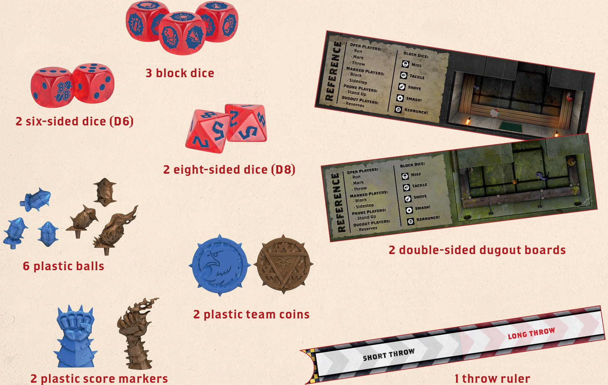
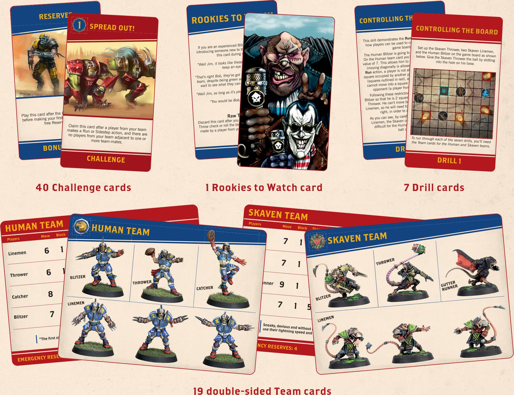
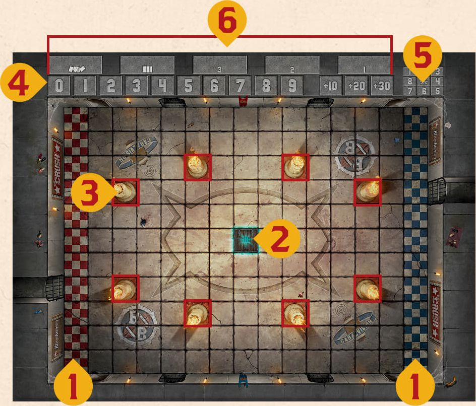
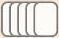
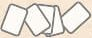

In addition to these rules, Blitz Bowl contains the following components:

**1 double-sided game board**

The game board contains the playing area, known as the pitch. It is divided into squares. Each side of the game board also contains some special features:

1. End Zones where the teams start, and where touchdowns are scored
2. One or two trapdoors where the ball comes into play
3. Blocked squares that are delineated by a red border
4. Score track
5. Bounce chart
6. Challenge card tableau - one space for the Challenge deck (marked ), one space for discarded Challenge cards (marked ) and three for active Challenge cards (marked 1,2,3)
