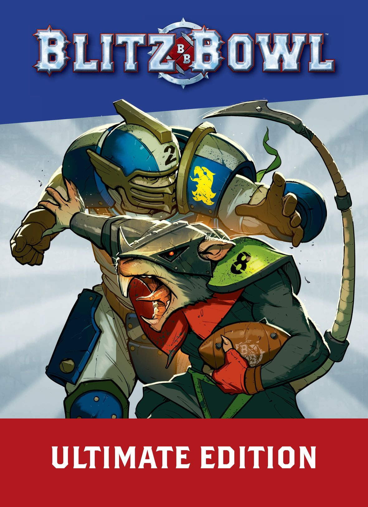
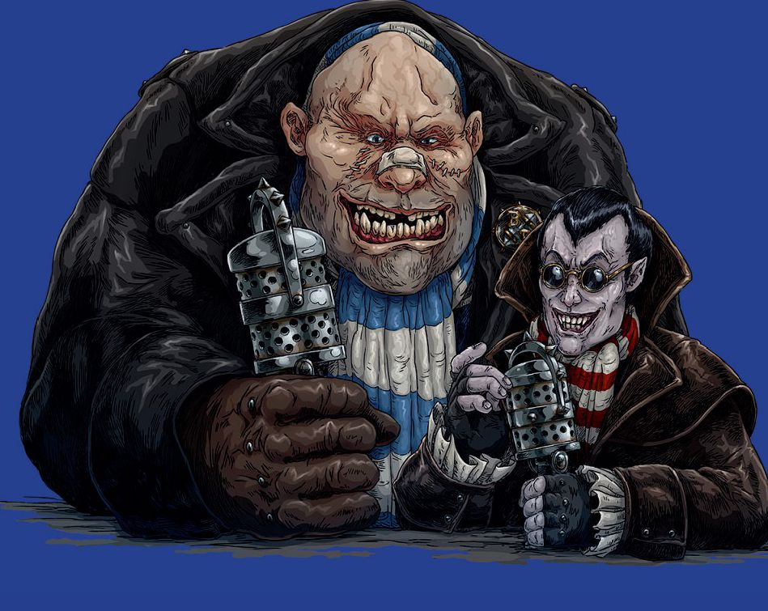

GLADIATORIAL SPORTS MAYHEM!

* "Welcome back, sports fans - and an even bigger welcome to all the viewers joining us for the new Blood Bowl season! I'm Jim Johnson, bringing you coverage of this year's Crush, in partnership with our sponsors, the Cabalvision Network, Spike! Magazine and Orcidas. For today's match-up, two teams of young hopefuls have shed blood, sweat and tears to be here, and they're now ready to head out into the arena below and show us what they've got."

* "You gotta mention the blood, don't you Jim? Guess it's a vampire thing."

* "Thanks for that, Bob! That's my stalwart co-commentator Bob Bifford, hungry for action in the way only an ogre can be!"

* "You're not wrong, Jim! I'm expecting to see some tasty techniques today, too!"

* "Yes, very good, Bob. You certainly won't be disappointed - the Reavers and the Scramblers have each put forward a selection of their best applicants for today's try-outs, and the coaches will really be putting them through their paces to see if they're worthy of joining the team's roster."

* "They've made it this far, Jim, but the real test begins now."

* "Oh yes, Bob. And it's not just about brute strength. The aspiring - and in many cases, perspiring - players will have to react quickly and show they've got the sort of talent that could see them play in the big leagues."

* "Of course, it's a lot easier to show off if your opponents are all lying in the dirt."

* "That's true, Bob - after all, an aggressive approach always worked for you!"
