## BLACK ORC TEAM

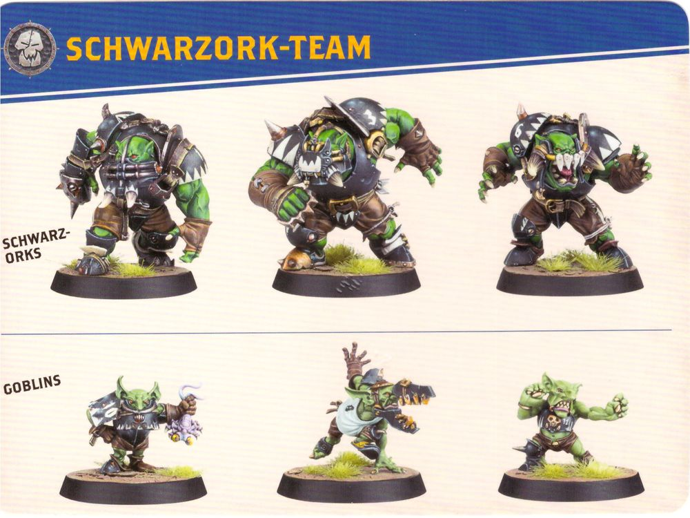

| PLAYER         | MOVE | BLOCK | THROW | ARMOUR | ABILITY                                                                                                                     |
| -------------- | ---- | ----- | ----- | ------ | --------------------------------------------------------------------------------------------------------------------------- |
| GOBLINS (3)    | 6    | 1     | 4+    | 6+     | **Elusive:** When performing a Run action, this player can move adjacent to opponents, bust must end the action Open. |
| BLACK ORCS (3) | 4    | 2     | 5+    | 2+     |                                                                                                                             |

EMERGENCY RESERVES: 4

## CHAOS TEAM

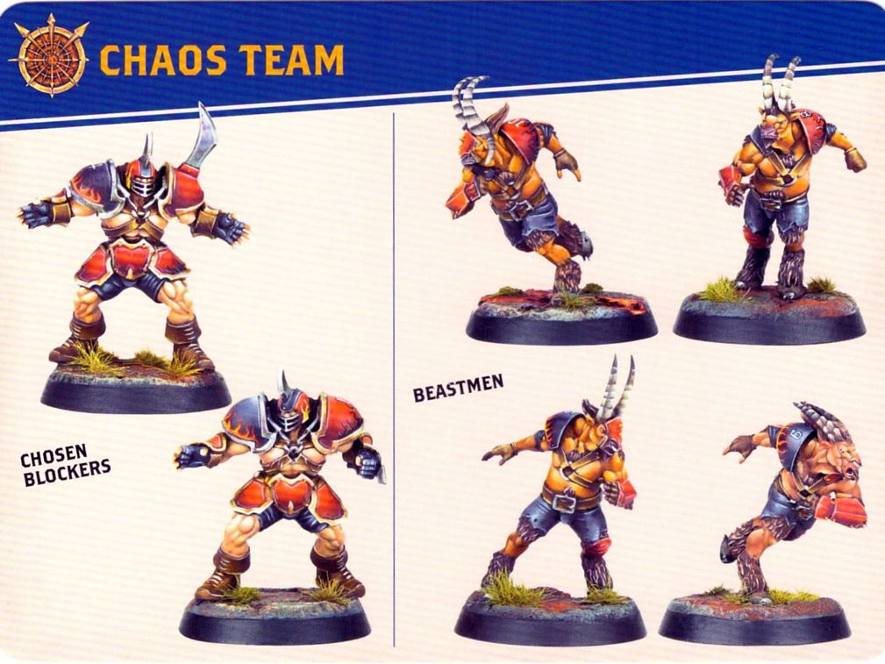

| PLAYER             | MOVE | BLOCK | THROW | ARMOUR | ABILITY                                                                                                                         |
| ------------------ | ---- | ----- | ----- | ------ | ------------------------------------------------------------------------------------------------------------------------------- |
| BEASTMAN (4)       | 6    | 1     | 4+    | 6+     | **Headbutt:** If this player makes a Run action followed by a Mark action, they can immediately make a free Block action. |
| CHOSEN BLOCKER (2) | 5    | 2     | 5+    | 2+     |                                                                                                                                 |

EMERGENCY RESERVES: 4

## DARK ELF TEAM

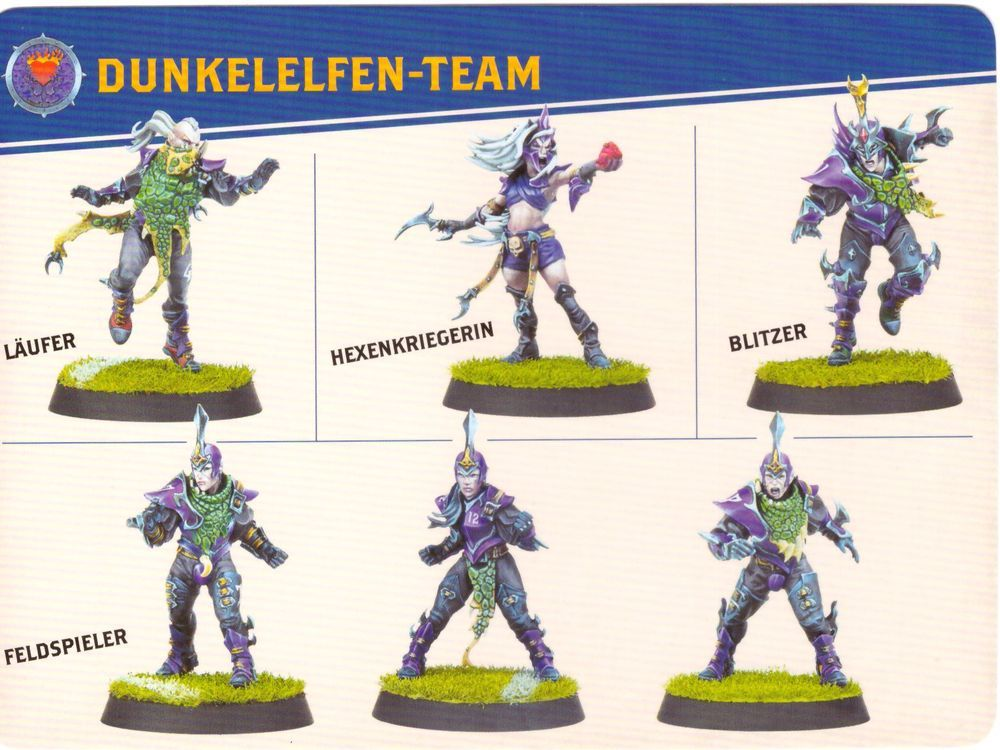

| PLAYER      | MOVE | BLOCK | THROW | ARMOUR | ABILITY                                                                                                                                                          |
| ----------- | ---- | ----- | ----- | ------ | ---------------------------------------------------------------------------------------------------------------------------------------------------------------- |
| LINEMEN (3) | 6    | 1     | 4+    | 3+     |                                                                                                                                                                  |
| RUNNER      | 7    | 1     | 3+    | 4+     | **Safe Hands:** If this player is Knocked Down while holding the ball, you can choose which adjacent square the ball bounces into instead of rolling a D8. |
| BLITZER     | 7    | 1     | 4+    | 3+     | **Offensive Specialist:** Whenever this player makes a Block action, you can choose to re-roll the block dice.                                             |
| WITCH ELF   | 7    | 1     | 5+    | 4+     | **Frenzied:** After this player makes a Mark action, they can immediately perform a free Block action.                                                     |

EMERGENCY RESERVES: 4

## DWARF TEAM

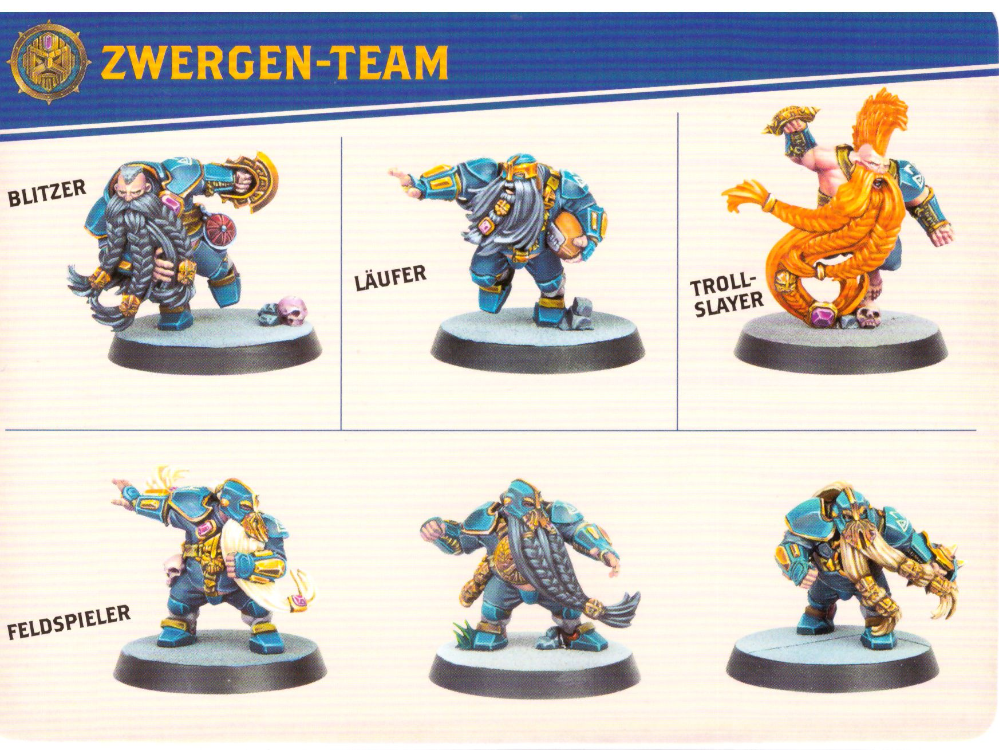

| PLAYER      | MOVE | BLOCK | THROW | ARMOUR | ABILITY                                                                                                                                                          |
| ----------- | ---- | ----- | ----- | ------ | ---------------------------------------------------------------------------------------------------------------------------------------------------------------- |
| LINEMEN (3) | 4    | 1     | 5+    | 2+     |                                                                                                                                                                  |
| RUNNER      | 6    | 1     | 4+    | 3+     | **Safe Hands:** If this player is Knocked Down while holding the ball, you can choose which adjacent square the ball bounces into instead of rolling a D8. |
| BLITZER     | 5    | 1     | 4+    | 2+     | **Offensive Specialist:** Whenever this player makes a Block action, you can choose to re-roll the block dice.                                             |
| TROLLSLAYER | 5    | 1     | 6+    | 4+     | **Frenzied:** After this player makes a Mark action, they can immediately make a free Block action.                                                        |

EMERGENCY RESERVES: 4

## ELF TEAM

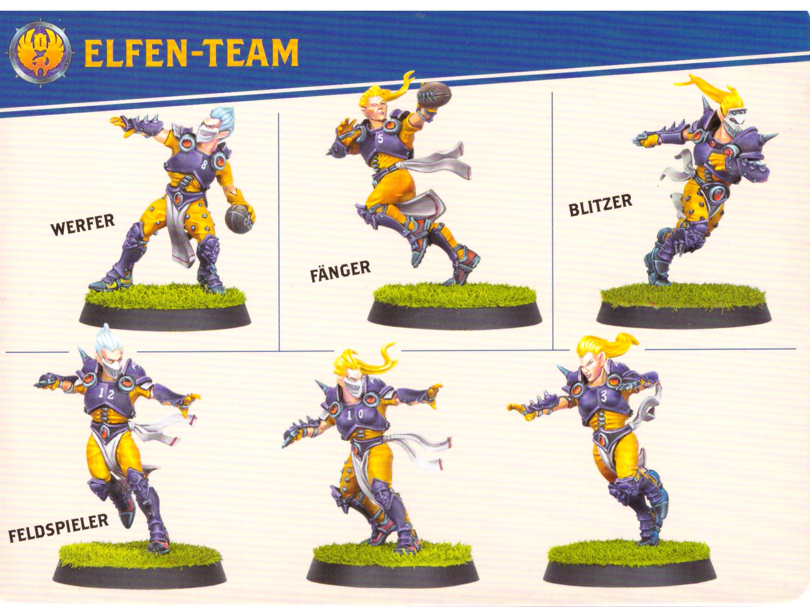

| PLAYER      | MOVE | BLOCK | THROW | ARMOUR | ABILITY                                                                                                                                               |
| ----------- | ---- | ----- | ----- | ------ | ----------------------------------------------------------------------------------------------------------------------------------------------------- |
| LINEMEN (3) | 6    | 1     | 4+    | 4+     |                                                                                                                                                       |
| THROWER     | 6    | 1     | 2+    | 4+     | **Handling Skills:** Whenever this player is moved into a square containing the ball, they pick it up, as though they were making a Run action. |
| CATCHER     | 8    | 1     | 4+    | 5+     | **Catcher's Instincts:** If this player is Open and the target of a successful Throw action (not a hand-off), they can make a free Run action. |
| BLITZER     | 7    | 1     | 3+    | 3+     | **Offensive Specialist:** Whenever this player makes a Block action, you can choose to re-roll the block dice.                                  |

EMERGENCY RESERVES: 4

## GOBLIN TEAM

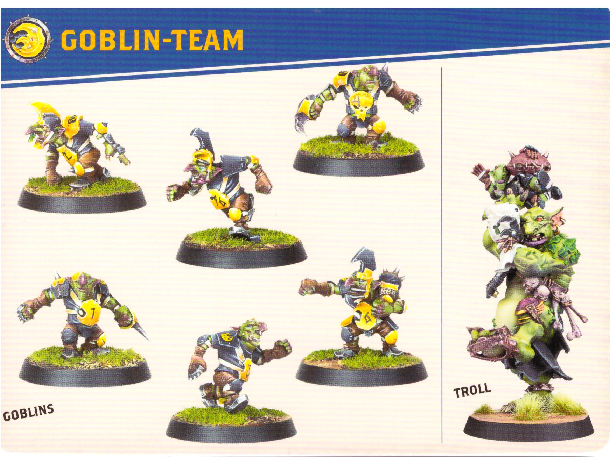

| PLAYER         | MOVE | BLOCK | THROW | ARMOUR | ABILITY                                                                                                                                                                                                                                                                                                                                                                                                                       |
| -------------- | ---- | ----- | ----- | ------ | ----------------------------------------------------------------------------------------------------------------------------------------------------------------------------------------------------------------------------------------------------------------------------------------------------------------------------------------------------------------------------------------------------------------------------- |
| GOBLINS (6)    | 6    | 1     | 4+    | 6+     | **Elusive:** When performing a Run action, this player can move adjacent to opponents, bust must end the action Open.                                                                                                                                                                                                                                                                                                   |
| BLACK ORCS (3) | 4    | 2     | 5+    | 2+     | **Hulking Brute:** When this player performs a Block action, treat results on the block dice of **Tackle** and **Smash!** results as **Kerrunch!** In addition, if this player is the target of a Block action, treat results of **Shove** as **Miss.** **Throw Team-mate:** This player may throw Goblin team­mates as a Throw action (see Throw Team-mate Action, page 17). |

EMERGENCY RESERVES: 4

## HALFLING TEAM

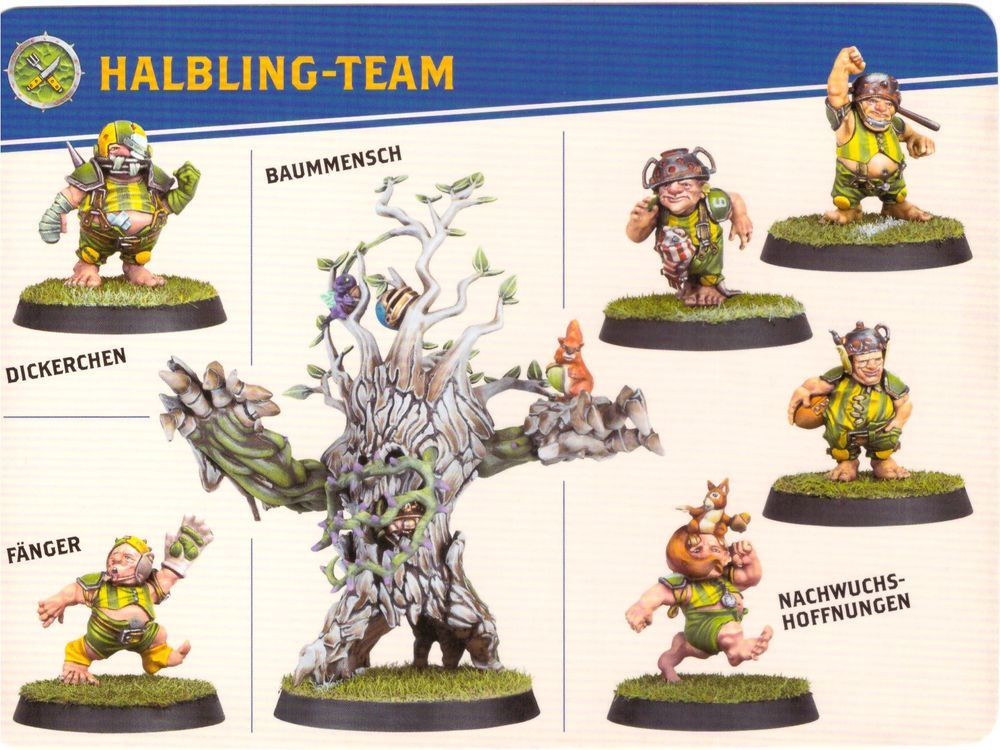

| PLAYER       | MOVE | BLOCK | THROW | ARMOUR | ABILITY                                                                                                                                                                                                                                                                                                                                                                                            |
| ------------ | ---- | ----- | ----- | ------ | -------------------------------------------------------------------------------------------------------------------------------------------------------------------------------------------------------------------------------------------------------------------------------------------------------------------------------------------------------------------------------------------------- |
| HOPEFULS (4) | 5    | 1     | 4+    | 6+     |                                                                                                                                                                                                                                                                                                                                                                                                    |
| CATCHER      | 5    | 1     | 4+    | 6+     | **Catcher's Instincts:** If this player is Open and the target of a successful Throw action (not a hand-off), they can make a free Run action.                                                                                                                                                                                                                                              |
| HEFTY        | 5    | 1     | 4+    | 4+     | **Stand Firm:** If this player is the target of a Block action, treat results on the block dice of **Shove** as **Miss.**                                                                                                                                                                                                                                                        |
| TREEMAN      | 2    | 2     | 5+    | 2+     | **Hulking Brute:** When this player makes a Block action, treat results of **Tackle** and **Smash!** as **Kerrunch!** In addition, if this player is the target of a Block action, treat results of **Shove** as **Miss.** **Throw Team-mate:** This player may throw Halfling team­mates as a Throw action (see Throw Team-mate Action, page 17). |

EMERGENCY RESERVES: 2

## NECROMANTIC TEAM

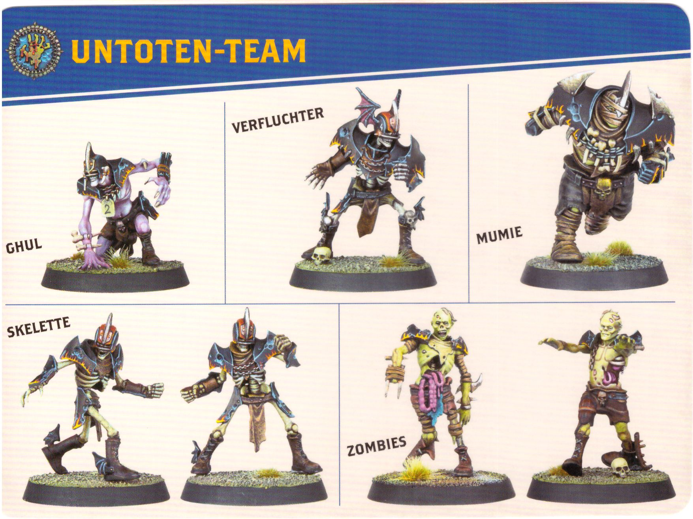

| PLAYER      | MOVE | BLOCK | THROW | ARMOUR | ABILITY                                                                                                                                                                                 |
| ----------- | ---- | ----- | ----- | ------ | --------------------------------------------------------------------------------------------------------------------------------------------------------------------------------------- |
| ZOMBIES (3) | 4    | 1     | 6+    | 3+     |                                                                                                                                                                                         |
| GHOUL       | 7    | 1     | 4+    | 4+     | **Safe Hands:** If this player is Knocked Down while holding the ball, you can choose which adjacent square the ball bounces into instead of rolling a  8.                        |
| WRAITH      | 6    | 1     | -     | 3+     | **Ethereal:** When performing a Run action, they can move adjacent to opponents and through obstructions, but must end the action Open and not on an obstruction.                 |
| WEREWOLF    | 8    | 1     | 4+    | 3+     | **Claws:** When this player makes a Block action, roll a D6 along with the Block dice. If the result is a 6, the target is automatically injured - do not resolve the block dice. |
| FLESH GOLEM | 4    | 2     | 6+    | 2+     |                                                                                                                                                                                         |

EMERGENCY RESERVES: 5

## HUMAN TEAM

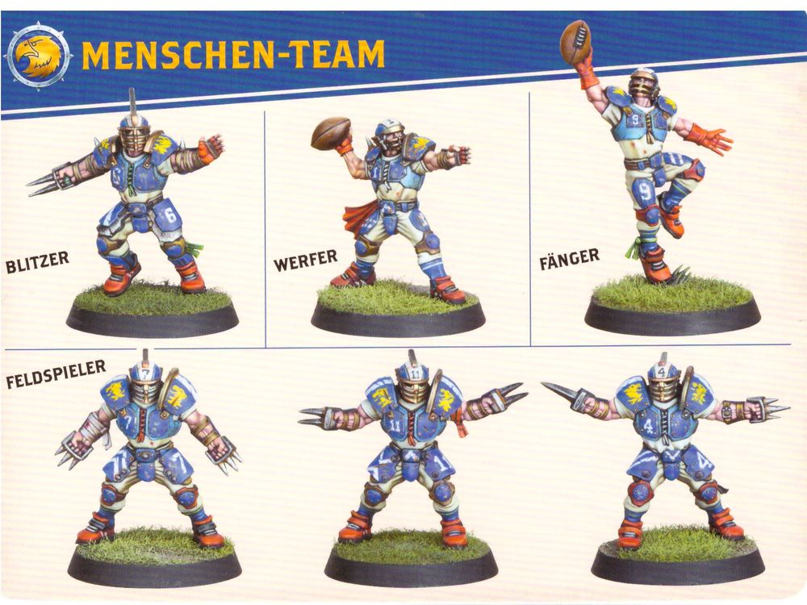

| PLAYER      | MOVE | BLOCK | THROW | ARMOUR | ABILITY                                                                                                                                               |
| ----------- | ---- | ----- | ----- | ------ | ----------------------------------------------------------------------------------------------------------------------------------------------------- |
| LINEMEN (3) | 6    | 1     | 4+    | 3+     |                                                                                                                                                       |
| THROWER     | 6    | 1     | 3+    | 3+     | **Handling Skills:** Whenever this player is moved into a square containing the ball, they pick it up, as though they were making a Run action. |
| CATCHER     | 8    | 1     | 4+    | 5+     | **Catcher's Instincts:** If this player is Open and the target of a successful Throw action (not a hand-off), they can make a free Run action. |
| BLITZER     | 7    | 1     | 4+    | 3+     | **Offensive Specialist:** When this player makes a Block action, you can choose to re-roll the Block dice.EMERGENCY RESERVES: 4                 |

EMERGENCY RESERVES: 4

## KHORNE TEAM

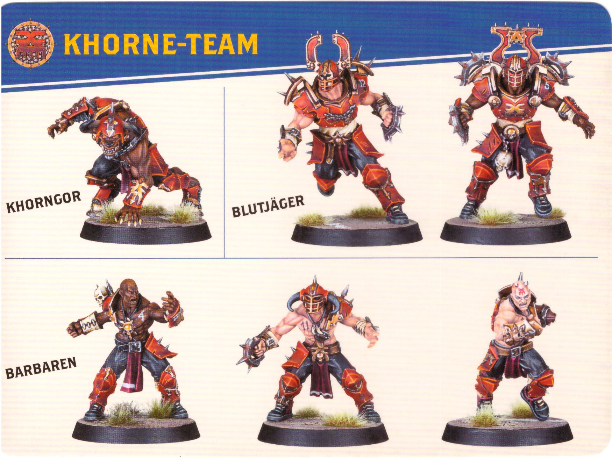

| PLAYER           | MOVE | BLOCK | THROW | ARMOUR | ABILITY                                                                                                                                                                                                                                                  |
| ---------------- | ---- | ----- | ----- | ------ | -------------------------------------------------------------------------------------------------------------------------------------------------------------------------------------------------------------------------------------------------------- |
| MARAUDERS (3)    | 6    | 1     | 4+    | 4+     |                                                                                                                                                                                                                                                          |
| KHORNGOR         | 6    | 1     | 4+    | 4+     | **Headbutt:** If this player makes a Run action followed by a Mark action, they can immediately make a free Block action.                                                                                                                          |
| BLOODSEEKERS (2) | 5    | 2     | 6+    | 3+     | **Enforcer:** When this player makes a Block action, you must resolve the result of all the dice rolled, picking the order they are resolved in. For each knocked down result, the opposing coach must make an Armour check for the target player. |

EMERGENCY RESERVES: 4

## LIZARDMEN TEAM

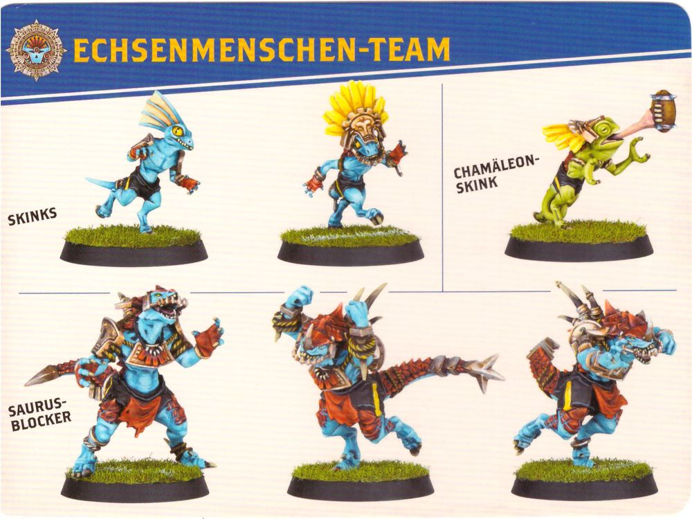

| PLAYER                  | MOVE | BLOCK | THROW | ARMOUR | ABILITY                                                                                                                                                          |
| ----------------------- | ---- | ----- | ----- | ------ | ---------------------------------------------------------------------------------------------------------------------------------------------------------------- |
| SKINK RUNNERS (2)      | 8    | 1     | 4+    | 6+     | **Safe Hands:** If this player is Knocked Down while holding the ball, you can choose which adjacent square the ball bounces into instead of rolling a D8. |
| CHAMELEON SKINK CATCHER | 7    | 1     | 3+    | 5+     | **Catcher's Instincts:** If this player is Open and the target of a successful Throw action (not a hand-off), they can make a free Run action.             |
| SAURUS BLOCKER (3)      | 6    | 2     | 6+    | 2+     |                                                                                                                                                                  |

EMERGENCY RESERVES: 4

## NOBLE TEAM

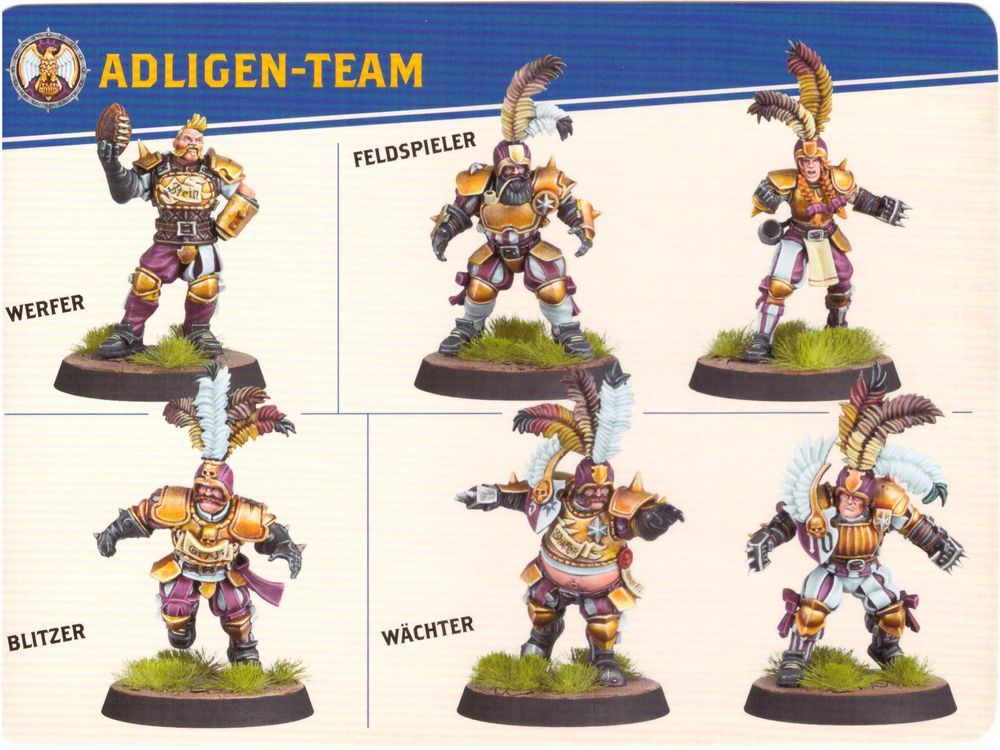

| PLAYER        | MOVE | BLOCK | THROW | ARMOUR | ABILITY                                                                                                                                               |
| ------------- | ---- | ----- | ----- | ------ | ----------------------------------------------------------------------------------------------------------------------------------------------------- |
| RETAINER (2)  | 6    | 1     | 4+    | 4+     |                                                                                                                                                       |
| THROWER       | 6    | 1     | 3+    | 4+     | **Handling Skills:** Whenever this player is moved into a square containing the ball, they pick it up, as though they were making a Run action. |
| BODYGUARD (2) | 6    | 1     | 5+    | 3+     | **Stand Firm:** If this player is the target of a Block action, treat results on the block dice of **Shove** as **Miss.**           |
| BLITZER       | 7    | 1     | 4+    | 3+     | **Offensive Specialist:** Whenever this player makes a Block action, you can choose to re-roll the block dice.                                  |

EMERGENCY RESERVES: 4

## NURGLE TEAM

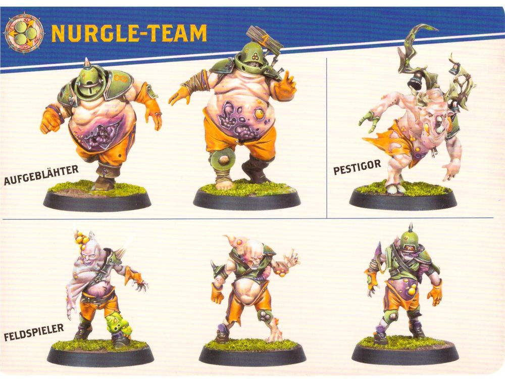

| PLAYER      | MOVE | BLOCK | THROW | ARMOUR | ABILITY                                                                                                                                     |
| ----------- | ---- | ----- | ----- | ------ | ------------------------------------------------------------------------------------------------------------------------------------------- |
| ROTTER (3)  | 5    | 1     | 6+    | 4+     |                                                                                                                                             |
| PESTIGOR    | 6    | 1     | 4+    | 3+     | **Headbutt:** If this player makes a Run action followed by a Mark action, they can immediately make a free Block action.             |
| BLOATER (2) | 4    | 2     | 6+    | 3+     | **Stand Firm:** If this player is the target of a Block action, treat results on the block dice of **Shove** as **Miss.** |

EMERGENCY RESERVES: 4

## OGRE TEAM

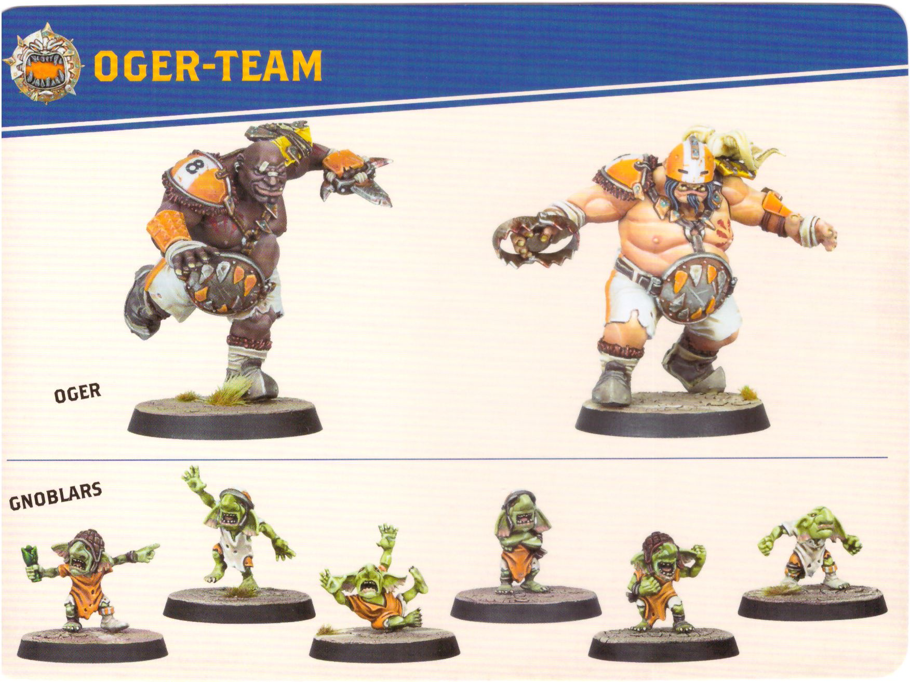

| PLAYER       | MOVE | BLOCK | THROW | ARMOUR | ABILITY                                                                                                                                                                                                                                                                                                                                                                                           |
| ------------ | ---- | ----- | ----- | ------ | ------------------------------------------------------------------------------------------------------------------------------------------------------------------------------------------------------------------------------------------------------------------------------------------------------------------------------------------------------------------------------------------------- |
| GNOBLARS (6) | 5    | 1     | 5+    | 6+     | **Titchy:** Opponents may move adjacent to this player during a Run action, but doing so ends the action. When this player performs a Block action, treat results of **Tackle** as **Miss.**                                                                                                                                                                                    |
| OGRE (2)     | 5    | 2     | 5+    | 2+     | **Hulking Brute:** When this player makes a Block action, treat results of **Tackle** and **Smash!** as **Kerrunch!** In addition, if this player is the target of a Block action, treat results of **Shove** as **Miss.** **Throw Team-mate:** This player may throw Gnoblar team­mates as a Throw action (see Throw Team-mate Action, page 17). |

EMERGENCY RESERVES: 5

## ORC TEAM

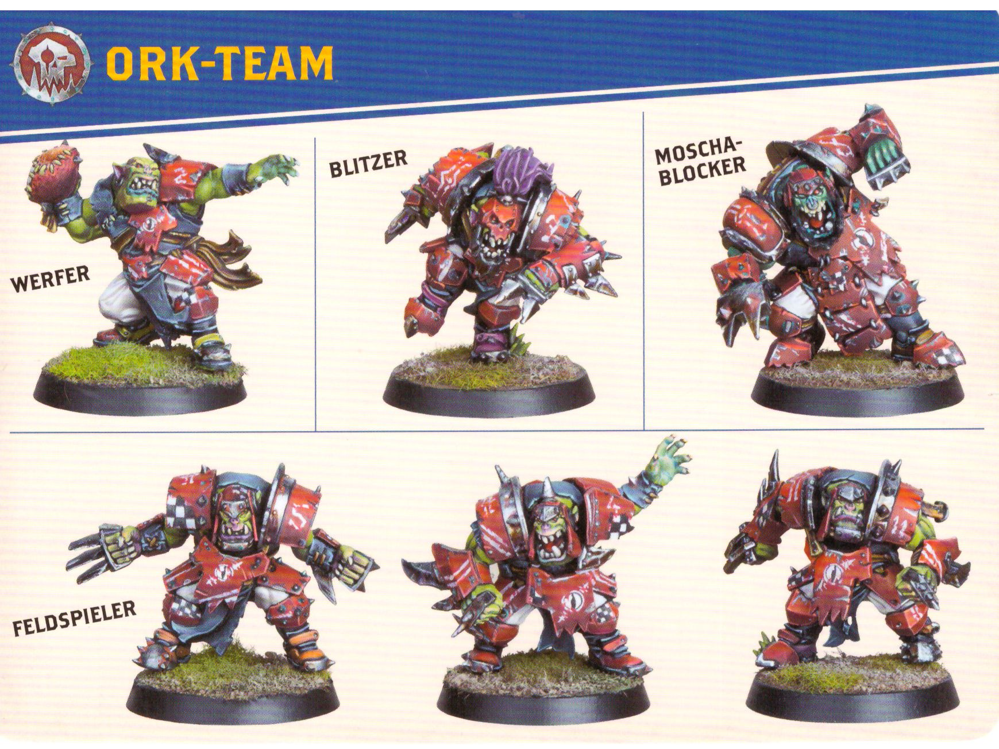

| PLAYER      | MOVE | BLOCK | THROW | ARMOUR | ABILITY                                                                                                                                               |
| ----------- | ---- | ----- | ----- | ------ | ----------------------------------------------------------------------------------------------------------------------------------------------------- |
| LINEMAN (3) | 5    | 1     | 4+    | 2+     |                                                                                                                                                       |
| THROWER     | 5    | 1     | 3+    | 3+     | **Handling Skills:** Whenever this player is moved into a square containing the ball, they pick it up, as though they were making a Run action. |
| BLITZER     | 6    | 1     | 4+    | 2+     | **Offensive Specialist:** Whenever this player makes a Block action, you can choose to re-roll the block dice.                                  |
| BIG'UN      | 5    | 2     | 6+    | 2+     |                                                                                                                                                       |

EMERGENCY RESERVES: 4

## SKAVEN TEAM

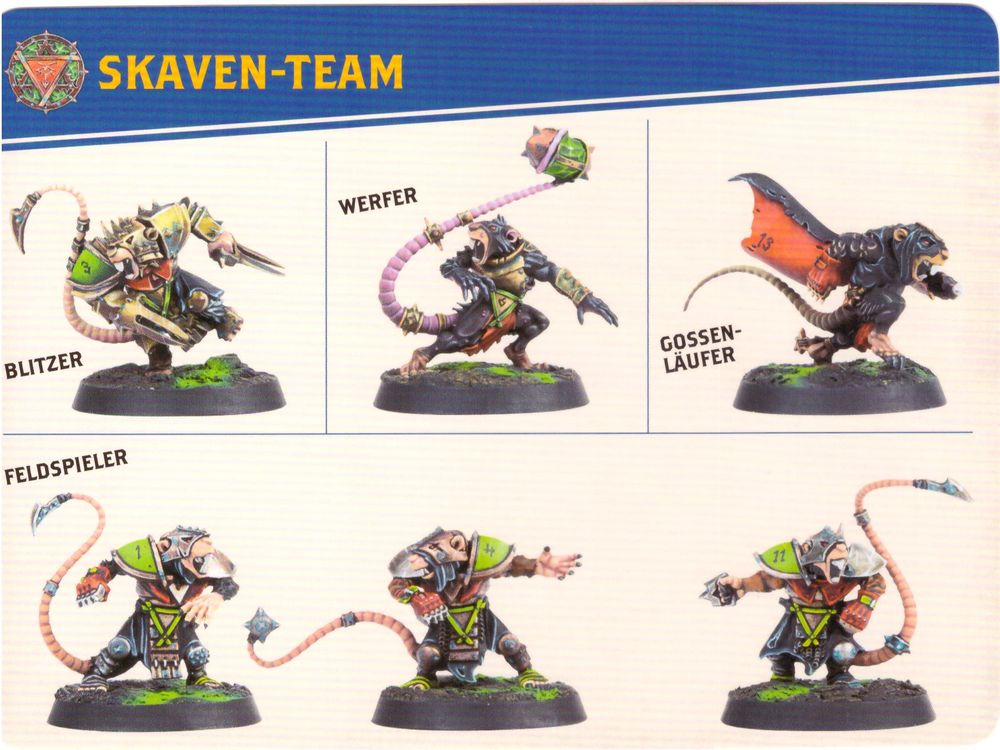

| PLAYER        | MOVE | BLOCK | THROW | ARMOUR | ABILITY                                                                                                                                                          |
| ------------- | ---- | ----- | ----- | ------ | ---------------------------------------------------------------------------------------------------------------------------------------------------------------- |
| LINERATS (3)  | 7    | 1     | 4+    | 4+     |                                                                                                                                                                  |
| THROWER       | 7    | 1     | 3+    | 4+     | **Handling Skills:** Whenever this player is moved into a square containing the ball, they pick it up, as though they were making a Run action.            |
| GUTTER RUNNER | 9    | 1     | 4+    | 5+     | **Safe Hands:** If this player is Knocked Down while holding the ball, you can choose which adjacent square the ball bounces into instead of rolling a D8. |
| BLITZER       | 7    | 1     | 5+    | 3+     | **Offensive Specialist:** Whenever this player makes a Block action, you can choose to re-roll the block dice.                                             |

EMERGENCY RESERVES: 4

## SNOTLING TEAM

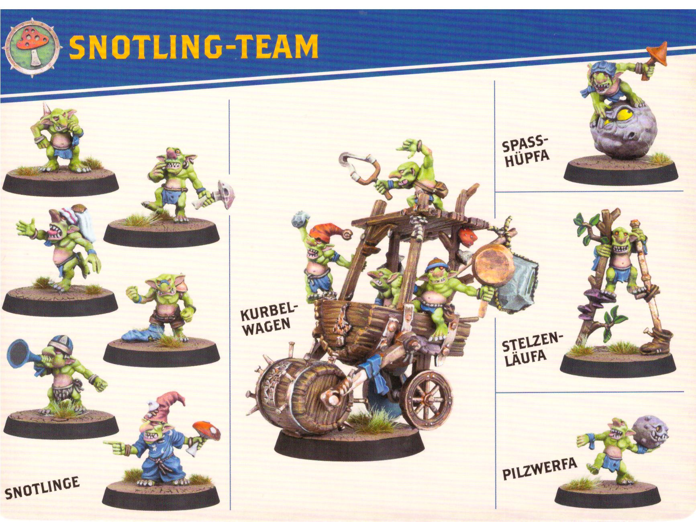

| PLAYER        | MOVE | BLOCK | THROW | ARMOUR | ABILITY                                                                                                                                                                                                                                                  |
| ------------- | ---- | ----- | ----- | ------ | -------------------------------------------------------------------------------------------------------------------------------------------------------------------------------------------------------------------------------------------------------- |
| SNOTLINGS (6) | 5    | 1     | 5+    | -      | **Insignificant:** Opponents can move adjacent to this player during a Run action. When this player makes a Block action, treat results of **Tackle** as **Miss.**                                                                     |
| FUNGUS-FLINGA | 5    | 1     | 4+    | -      | **Bomber:** This player can perform a Block action whilst Open. Choose an Open or Marked opponent within 3 squares to be the target. This Block action cannot be assisted and Treat results on the Block dice of **Shove** as **Miss.** |
| FUN-HOPPA     | 6    | 1     | 5+    | -      | **Leap:** When this player makes a Run action they can move adjacent to, and through players, but must end the action Open, not Marked.                                                                                                            |
| STILTY RUNNA  | 7    | 1     | 5+    | -      |                                                                                                                                                                                                                                                          |
| PUMP WAGON    | D6   | 3     | -     | 3+     | **War Machine:** This player may make a Run action when Marked. When this player makes a Run action they can move adjacent to opponents and finish the action Open or Marked. This player's Block action cannot be assisted.EMERGENCY RESERVES: 4 |

EMERGENCY RESERVES: 6

## UNDEAD TEAM

| PLAYER        | MOVE | BLOCK | THROW | ARMOUR | ABILITY                                                                                                                                                          |
| ------------- | ---- | ----- | ----- | ------ | ---------------------------------------------------------------------------------------------------------------------------------------------------------------- |
| SKELETONS (2) | 5    | 1     | 6+    | 4+     | **Regenerate:** After the Pre-Turn sequence, but before you take your first Player Action, if this player is prone, they can make a free Stand-Up action.  |
| ZOMBIES (2)   | 4    | 1     | 6+    | 3+     |                                                                                                                                                                  |
| GHOUL RUNNER  | 7    | 1     | 4+    | 4+     | **Safe Hands:** If this player is Knocked Down while holding the ball, you can choose which adjacent square the ball bounces into instead of rolling a D8. |
| WIGHT BLITZER | 6    | 1     | 5+    | 3+     | **Offensive Specialist:** Whenever this player makes a Block action, you can choose to re-roll the block dice.                                             |
| MUMMY         | 3    | 2     | 6+    | 2+     | **Mighty Blow:** When this player makes a Block action, treat results on the block dice of **Smash!** as **Kerrunch!**EMERGENCY RESERVES: 4          |

EMERGENCY RESERVES: 4

## WOOD ELF TEAM

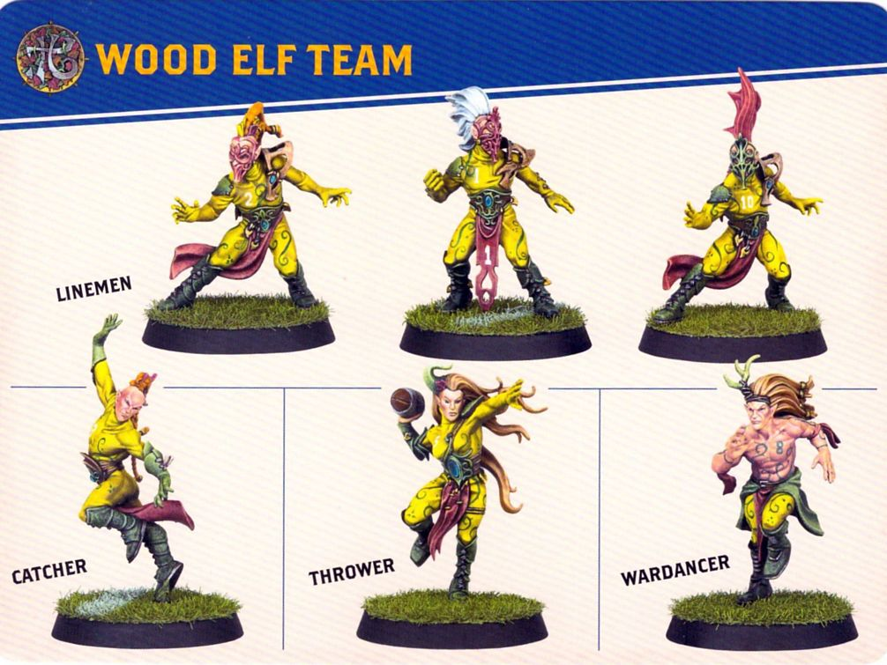

| PLAYER       | MOVE | BLOCK | THROW | ARMOUR | ABILITY                                                                                                                                                 |
| ------------ | ---- | ----- | ----- | ------ | ------------------------------------------------------------------------------------------------------------------------------------------------------- |
| LINERATS (3) | 7    | 1     | 4+    | 5+     |                                                                                                                                                         |
| THROWER      | 7    | 1     | 2+    | 4+     | **Handling Skills:** Whenever this player is moved into a square containing the ball, they pick it up, as though they were making a Run action.   |
| CATCHER      | 8    | 1     | 4+    | 6+     | **Catcher's Instincts:** If this player is Open and is the target of a successful Throw action (not a hand-off), they can make a free Run action. |
| WARDANCER    | 8    | 1     | 4+    | 5+     | **Rush:** When this player makes a Run action, They can move adjacent to opponents, but doing so ends the action.EMERGENCY RESERVES: 4            |

EMERGENCY RESERVES: 4
