  -------------------------------------------------------------------------------------------------------------------------------------
                                      height="0.6755457130358705in"}
  ------------------------------------------------------------------ ------------------------------------------------------------------
                                       

                                                                     
  -------------------------------------------------------------------------------------------------------------------------------------

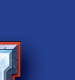

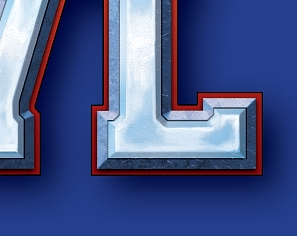

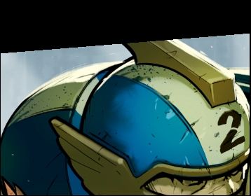

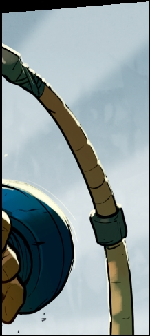

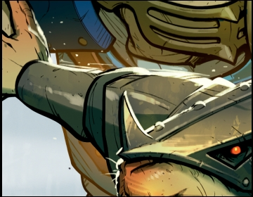

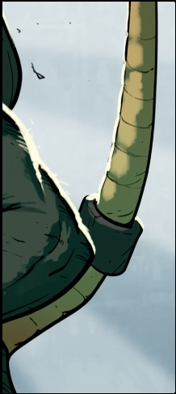

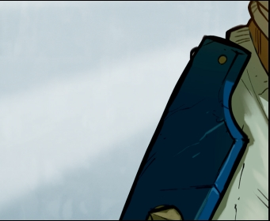

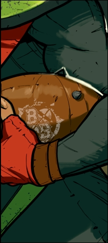

4
>
**ULTIMATE EDITION**
>
**COMPONENTS**
>
In addition to these rules, Blitz Bowl contains the following
components:
>
**The Reavers**

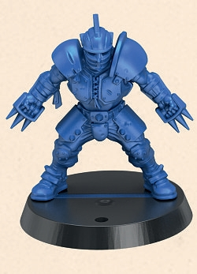

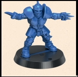

*Lineman 1 Lineman 2 Lineman 3 Biitzer Thrower Catcher*

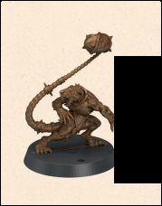

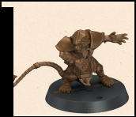

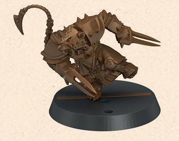

*Lineman 1 Lineman 2 Lineman 3 Biitzer Thrower Gutter Runner*

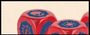

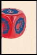

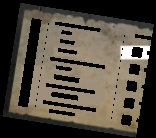***I -Mark***
>
***• Throw***

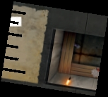**/ S Miss**

**3 block dice**

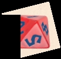

**2 eight-sided dice (D8)**
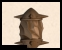

  ----------------------------------------------------------------------------------------------------------------------------------------
  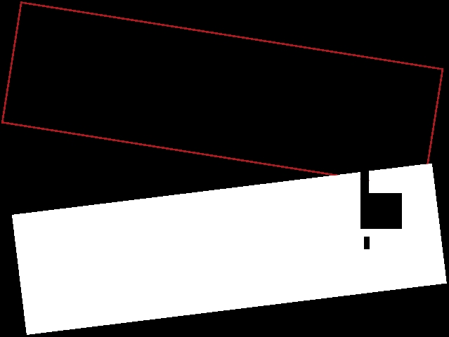J\" /                                    height="0.12713910761154856in"}
  --------------------------------------------------------------------- ------------------------------------------------------------------
                                                                        

  \$ \"x .-                             
                                        
  ----------------------------------------------------------------------------------------------------------------------------------------

***I***

**Gj**

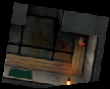**S\*IOVE**

**SM«SW\<**

IJ f
>
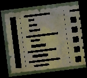M

>
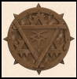**2 double-sided dugout boards**
>
**6 plastic balls**
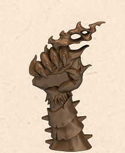
>
**W \"\"**
>
**2 plastic score markers 1 throw ruler**

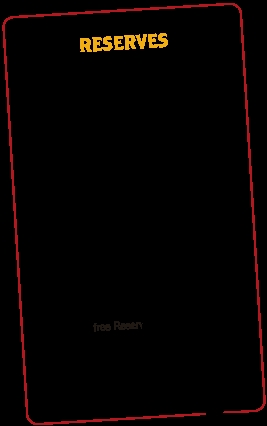

**CHALLENGE**
>
**CONTROLLING TH**

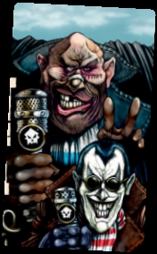

  -------------- --------------------------------------------------------
                 

                 

  *team*         *, despite being green* al

  *wait to see   
  what they*     
  canI *"Well    
  Jim, as long   
  as it's pl*ej  

                 *"You would be* BobJ
  -------------- --------------------------------------------------------

+-----------------------------------------------+----------------------+
|                                               | **Raw T**          |
+===============================================+======================+
| Discard this card after youI Throw check or   |                      |
| roll the blj                                  |                      |
+-----------------------------------------------+----------------------+
| made by a player from y\<                     |                      |
+-----------------------------------------------+----------------------+

**DRl**
>
**DRILL 1**
>
**40 Challenge cards 1 Rookies to Watch card 7 Drill cards**

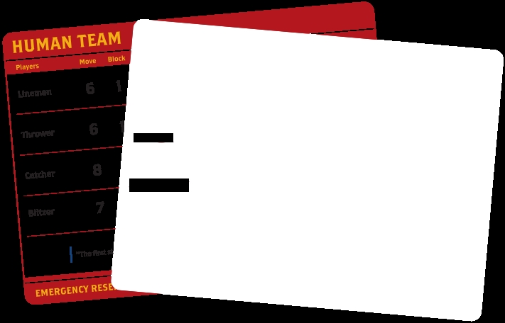

**BL1TZER**

**LINEMEN .#!?.**

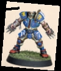

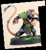

**NEY RESERVES; 4**
>
**19 double-sided Team cards**
>
**1 double-sided game board**
>
The game board contains the playing area, known as the pitch. It is
divided into squares. Each side of the game board also contains some
special features:
>
**1.** End Zones where the teams start, and where
>
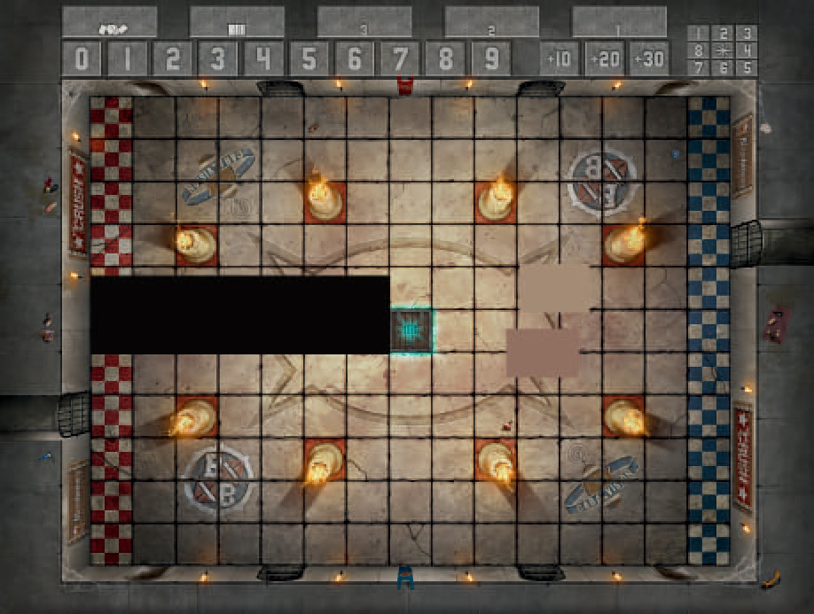touchdowns are scored
>
**2.** One or two trapdoors where the ball comes into play
>
**\'minis**
>
\_

-y-

**3.** Blocked squares that are delineated by a red border

**4.** Score track

**5.** Bounce chart

+---+-----------------------------------------------------------------+---+
| * |                                                                 |   |
| * |                                                                 |   |
| 6 |                                                                 |   |
| . |                                                                 |   |
| * |                                                                 |   |
| * |                                                                 |   |
| C |                                                                 |   |
| h |                                                                 |   |
| a |                                                                 |   |
| l |                                                                 |   |
| l |                                                                 |   |
| e |                                                                 |   |
| n |                                                                 |   |
| g |                                                                 |   |
| e |                                                                 |   |
| c |                                                                 |   |
| a |                                                                 |   |
| r |                                                                 |   |
| d |                                                                 |   |
| t |                                                                 |   |
| a |                                                                 |   |
| b |                                                                 |   |
| l |                                                                 |   |
| e |                                                                 |   |
| a |                                                                 |   |
| u |                                                                 |   |
|   |                                                                 |   |
| - |                                                                 |   |
| o |                                                                 |   |
| n |                                                                 |   |
| e |                                                                 |   |
| s |                                                                 |   |
| p |                                                                 |   |
| a |                                                                 |   |
| c |                                                                 |   |
| e |                                                                 |   |
| f |                                                                 |   |
| o |                                                                 |   |
| r |                                                                 |   |
| t |                                                                 |   |
| h |                                                                 |   |
| e |                                                                 |   |
| C |                                                                 |   |
| h |                                                                 |   |
| a |                                                                 |   |
| l |                                                                 |   |
| l |                                                                 |   |
| e |                                                                 |   |
| n |                                                                 |   |
| g |                                                                 |   |
| e |                                                                 |   |
+===+=================================================================+===+
|   | deck (marked QUO), one space for discarded Challeng           |   |
+---+-----------------------------------------------------------------+---+
|   | cards (marked COP) and three for active Challenge             |   |
+---+-----------------------------------------------------------------+---+

cards (marked 1,2,3)
>
**GLADIATORIAL** **SPORTS**
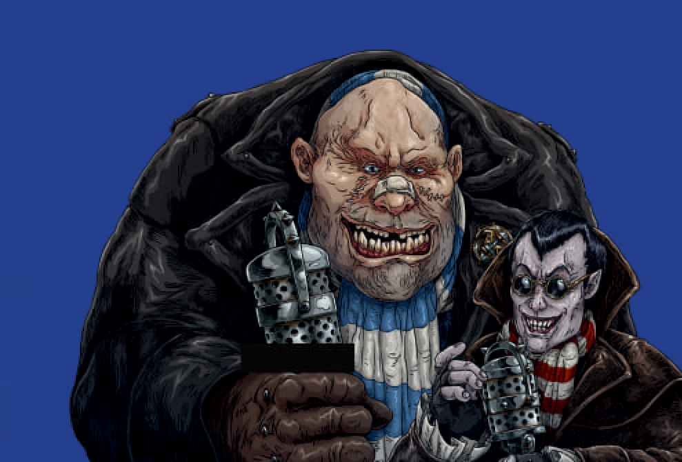**MAYHEM!**
>
/ / 1 *elcome back, sports fans - and
an*\
*even bigger welcome to all the
viewers*
>
*joining us for the new Blood Bowl season! I'm*\
*Jim Johnson, bringing you coverage of this*\
*year's Crush, in partnership with our sponsors,*\
*the Cabalvision Network, Spike! Magazine and*\
*Orcidas. For today's match-up, two teams*
>
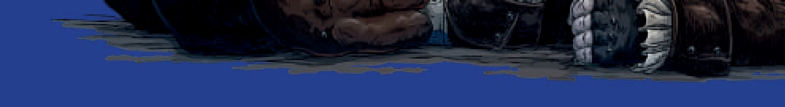*of young hopefuls have shed blood,
sweat*
>
*and tears to be here, and they're now ready*
>
*to head out into the arena below and show us*\
*what they've got. "*

\' \\*\'' \*\*'

*\"You gotta mention the blood, don't you Jim? Guess it's a vampire
thing."*
>
*"Thanks for that, Bob! That's my stalwart co-commentator Bob Bifford,
hungry for action in the way only an* *ogre can be!"*
>
*"You're not wrong, Jim! I'm expecting to see some tasty techniques
today, too!"*
>
*"Yes, very good, Bob. You certainly won't be disappointed - the
Reavers and the Scramblers have each put* *forward a selection of
their best applicants for today's try-outs, and the coaches will
really be putting them* *through their paces to see if they're worthy
of joining the team's roster. "*
>
*"They've made it this far, Jim, but the real test begins now. "*
>
*"Oh yes, Bob. And it's not just about brute strength. The aspiring -
and in many cases, perspiring -* *players will have to react quickly
and show they've got the sort of talent that could see them play in*
*the big leagues. "*
>
*"Of course, it's a lot easier to show off if your opponents are all
lying in the dirt. "*
>
*"That's true, Bob - after all, an aggressive approach always worked
for you!"*

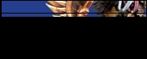

**BLOOD BOWL**
>
Blood Bowl is the legendary game of fantasy football. The game is full
of big plays, big hits and moments to remember. Meet your rivals
across the Line\
of Scrimmage in the ultimate test of guts and athletic skill. To
discover more
about Blood Bowl, visit:
>
**BloodBowl.com**
**Warhammer-Community.com**
>
**GAME OVERVIEW**
>
Blitz Bowl is a fast-paced sports game for two players. In this game,
each player is a coach in charge of a team of players competing
against each other to score the most points by scoring touchdowns and
completing challenges.\
If, at the end of a coach's turn, their team's score is 10 or more
points behind the opposing team's score, the game
>
immediately ends and the opposing coach wins the game. Otherwise, the
game ends when no more challenges can be
claimed, and if this happens, the team
with the highest score wins.

**BEFORE YOU PLAY**
>
Before you can play your first game, you'll need to put all of the
miniatures together. There is a construction guide on pages 20 and 21
that shows you how to do this.
>
One coach uses the Human team, called The Reavers, and the other coach
uses the Skaven team, called
>
The Scramblers.
>
You will also need to remove the dugout boards and throw ruler from
their cardboard sheet.
>
**TEAM CARDS**
>
Each team in Blitz Bowl has a unique, double-sided Team card that
shows the information you will need to play with that team.
>
**1.** Team name
>
**2.** Players on the team
>
**3.** Each player's Move, Block, Throw and Armour values
>
**4.** A player's ability (if they have one)
>
**5.** The team's Emergency Reserves value
>
**6.** Descriptive text (this has no impact on the game)
>
**► HUMAN TEAM**

<table>
<colgroup>
<col style="width: 8%" />
<col style="width: 2%" />
<col style="width: 6%" />
<col style="width: 3%" />
<col style="width: 2%" />
<col style="width: 14%" />
<col style="width: 5%" />
<col style="width: 5%" />
<col style="width: 2%" />
<col style="width: 5%" />
<col style="width: 13%" />
<col style="width: 2%" />
<col style="width: 16%" />
<col style="width: 5%" />
<col style="width: 3%" />
</colgroup>
<thead>
<tr class="header">
<th>Players </th>
<th></th>
<th></th>
<th><blockquote>

M

</blockquote></th>
<th colspan="4">ove Block Throw Armour</th>
<th colspan="2">Ability</th>
<th></th>
<th></th>
<th></th>
<th></th>
<th></th>
</tr>
</thead>
<tbody>
<tr class="odd">
<td></td>
<td></td>
<td rowspan="3"></td>
<td rowspan="3"></td>
<td></td>
<td rowspan="3"><blockquote>

<strong>14</strong>

</blockquote></td>
<td colspan="2"></td>
<td rowspan="3"></td>
<td rowspan="3"></td>
<td rowspan="3"></td>
<td rowspan="3"></td>
<td rowspan="3"></td>
<td rowspan="3"></td>
<td rowspan="3"></td>
</tr>
<tr class="even">
<td colspan="2"><blockquote>

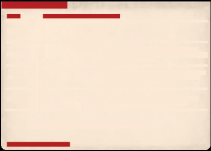<strong>Linemen</strong>

</blockquote></td>
<td><strong>6</strong></td>
<td><strong>+</strong></td>
<td><blockquote>

<strong>3 +</strong>

</blockquote></td>
</tr>
<tr class="odd">
<td></td>
<td></td>
<td></td>
<td colspan="2"></td>
</tr>
<tr class="even">
<td rowspan="2"></td>
<td></td>
<td></td>
<td rowspan="2"></td>
<td></td>
<td rowspan="2"></td>
<td rowspan="2"></td>
<td></td>
<td></td>
<td></td>
<td></td>
<td></td>
<td></td>
<td></td>
<td rowspan="2"></td>
</tr>
<tr class="odd">
<td colspan="2"></td>
<td></td>
<td></td>
<td></td>
<td colspan="5">Handling Skills: Whenever
this player is moved into a</td>
</tr>
<tr class="even">
<td colspan="2"><blockquote>

<strong>Thrower</strong>

</blockquote></td>
<td></td>
<td></td>
<td><strong>6</strong></td>
<td><blockquote>

<strong>13</strong>

</blockquote></td>
<td><strong>+</strong></td>
<td><blockquote>

<strong>3 +</strong>

</blockquote></td>
<td></td>
<td colspan="3">square containing the ball,</td>
<td colspan="2">they pick it up, as though t</td>
<td></td>
</tr>
<tr class="odd">
<td></td>
<td></td>
<td></td>
<td rowspan="2"></td>
<td></td>
<td rowspan="2"><blockquote>

<strong>14</strong>

</blockquote></td>
<td rowspan="2"><strong>+</strong></td>
<td></td>
<td></td>
<td colspan="4">were making a Run action.</td>
<td></td>
<td></td>
</tr>
<tr class="even">
<td colspan="3"><blockquote>

<strong>Catcher</strong>

</blockquote></td>
<td><strong>8</strong></td>
<td><blockquote>

<strong>5 +</strong>

</blockquote></td>
<td></td>
<td colspan="6">Catcher’s Instincts: If this player is Open and is the
target of a successful Throw action (not a hand-off), they can</td>
</tr>
<tr class="odd">
<td></td>
<td></td>
<td></td>
<td></td>
<td></td>
<td></td>
<td colspan="2"></td>
<td></td>
<td colspan="3">make a free Run action.</td>
<td></td>
<td></td>
<td></td>
</tr>
<tr class="even">
<td></td>
<td></td>
<td rowspan="2"></td>
<td rowspan="2"></td>
<td></td>
<td rowspan="2"><blockquote>

<strong>14</strong>

</blockquote></td>
<td colspan="2"></td>
<td></td>
<td></td>
<td></td>
<td></td>
<td></td>
<td></td>
<td rowspan="2"></td>
</tr>
<tr class="odd">
<td colspan="2"><blockquote>

<strong>Blitzer</strong>

</blockquote></td>
<td><strong>7</strong></td>
<td><strong>+</strong></td>
<td><blockquote>

<strong>3 +</strong

</blockquote></td>
<td></td>
<td colspan="5">Offensive Specialist: When this player makes a
Block</td>
</tr>
<tr class="even">
<td></td>
<td></td>
<td></td>
<td></td>
<td></td>
<td></td>
<td></td>
<td></td>
<td></td>
<td></td>
<td></td>
<td></td>
<td colspan="2"></td>
<td></td>
</tr>
</tbody>
</table>

\| "The first sixteen casualt .• most important." *Mighty g*
>
**EMERGENCY RESERVES: 4**

The reverse of each Team card shows the miniatures for that team,
allowing you to easily identify the players you will need. Where there
are multiple players who hold the same position on a team (e.g. Linemen)
they are shown here too.

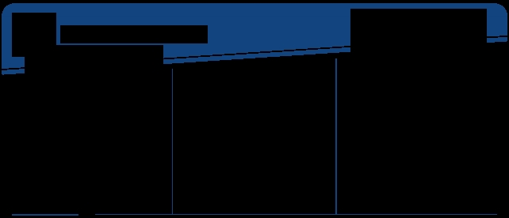**HUMAN TEAM**

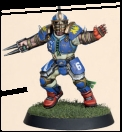

CKVCHER

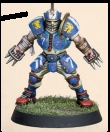

**LEARNING THE BASICS**
>
Once you\'ve put the two teams of miniatures together,
>
it's recommended that you play through, in order, each

of the 7 Drill cards so you have an understanding of the core principles
of the game. Once you've mastered those, the rest of the rules will make
a lot more sense! It's also

a good idea to read through this rulebook fully at least once before
playing your first full game.
>
**COMMENTARY WITH JIM JOHNSON:** **UNDERSTANDING YOUR TEAM**
>
Each team consists of six players - three Linemen,
>
who are decent all-round players but do not have any abilities, and
three unique players. Both teams have a Blitzer, who is good at
blocking opposing players, and
>
a Thrower who is good at picking up and throwing the ball. In
addition, the Human team has a Catcher, who is more fragile but gets a
free move if they catch a thrown ball. The Skaven team on the other
hand has a Gutter Runner who ensures that the ball stays with your
team even if they are knocked down. Understanding how best to use your
players' abilities is key to victory.
>
**5**
>
**IMPORTANT CONCEPTS**
>
Before we dive into how to play the game, here are a few\
important concepts you need to know:
>
**Coach:** The real-life people who are playing this game
>
**Players:** The plastic player models
that makes up a coach's team
>
**Team-mate:** A player from the same team
>
**Taking Possession of the Ball:** A player will take
>
**Opponent:** A player from the opposing coach's team
>
**Throw Checks and Armour Checks:** If a coach is called upon to make
an Armour or Throw check for a player,
>
roll a D6 and compare the result to the Throw or Armour value for that
player. If the result is lower than the given value, the check fails;
otherwise, the check succeeds.
>
Some rules will modify the result of a check - this is done before
comparing the dice result to the Throw or Armour value. However, in
all cases, a check can never be modified by more than -1/+1, even when
more than one modifier would apply. In addition, an unmodified roll of
1 on the dice always fails and an unmodified roll of 6 on the dice
always succeeds.
>
A player with a '-' for their Armour value automatically fails all
Armour checks. A player with a \'-' for their
>
possession of a ball when any of the following occur:

-   They are the target of a successful Throw action or a

hand-off

-   They move into the same square as a ball whilst

making a Run action

-   A ball bounces into the square they occupy and they

are Open

-   Through a unique player ability or Bonus Play

card ability

The rules for these are covered later, but regardless of how a player
takes possession of the ball, when they do, place the ball on the base
for the model of that player. Many bases have holes in them for this
purpose. ***Once this is*** ***done, that player is said to have
possession of the ball.***

**CHALLENGE CARDS:** The front of each Challenge card
>
Throw value cannot take possession of the ball - if they move into a
square containing the ball or a ball moves onto them it automatically
bounces (see Bouncing Ball,

+----------------------------------------------------+-----------------+
| shows the following information:                 |                 |
|                                                  |                 |
| **3**                                            |                 |
+====================================================+=================+
| **1.** The name of the Challenge                   | ![]             |
|                                                    | (./blitzbowl/me |
|                                                    | dia/image844.pn |
|                                                    | g) |
+----------------------------------------------------+-----------------+

 **1**

page 12).
>
**2.** The conditions that must be
>
met for a coach to claim the\
Challenge card
>
**3.** The points scored for claiming
>
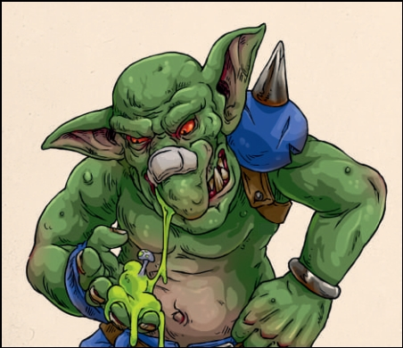the card

**RESERVES \<**
>
A
>
Play this card after the Pre-Turn
Sequence- before making your first Player Action.Me
>
free Reserves action.
>
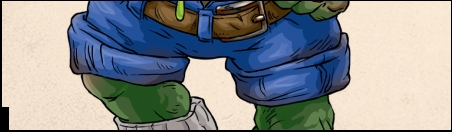**BONUS PLAY**

  -----------------------------------------------------------------------
  
  -----------------------------------------------------------------------

  -----------------------------------------------------------------------

**CHALLENGE**

The back of each Challenge\
card is a Bonus Play and shows the following information:

**1.** The name of the Bonus Play **2.** How the card can be played

**Card vs Rulebook:** Some cards break the rules in this rulebook, for
example by modifying a Throw check by more than -1 or +1. Whenever a
card contradicts the rules in this book, the card takes precedence.
>
**Cannot:** If two or more rules come
into conflict, and one of them says 'cannot', that rule takes
precedence. For example, if a player has a rule that says their Block
actions cannot be assisted, a Bonus Play card that means your players'
Block actions are assisted would have no effect on that player.
>
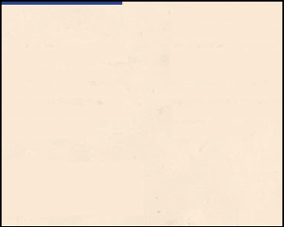**A COACH'S HAND:** When Challenge cards
are claimed these cards are put to one side, or held by a coach. These
cards are referred to in these rules as a coach's 'hand'. The Bonus
Play side of the cards in a coach's hand should be kept secret from
their opponent.
>
**IMMEDIATELY:** When an ability or effect is described as happening
immediately, it means before doing anything else, such as claiming a
Challenge card, making another Action, or finishing the current turn.
>
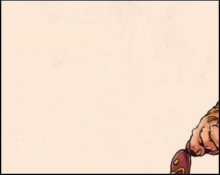**PLAYER STATUS:** During a game of Blitz
Bowl, players can either be Open, Marked, Prone or in the dugout. Each
of these is explained below:
>
***Open Players -*** A player who is standing and who is not adjacent
to any opponent is Open. Each of the eight squares around a given
square are said to be adjacent\
to it.
>
***Marked Players -*** A player who is standing adjacent to\
an opponent who is not Prone, is Marked. A player can Mark, and be
Marked by, multiple opponents at once.
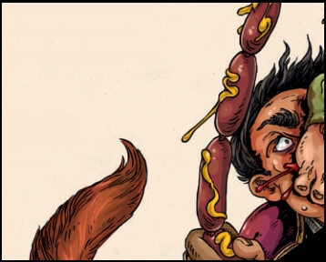Marking has a number of effects in the
game, which are explained later in the rules.
>
***Prone Players -*** A player who is laying on the ground is Prone. A
Prone player cannot Mark another player and is for all intents and
>
purposes not considered to be an\
active participant in the game. For\
example, they cannot be used
>
to claim Challenge cards and
>
do not affect the placement of
>
players returning to the pitch (see\
Reserves, page 13). If a player has
possession of the ball when they\
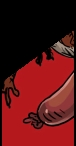become Prone, the ball bounces from\
that player's square (see Bouncing\
Ball, page 12).

***Reserves Players -*** A player will sometimes be placed in their
team's dugout - this represents the player waiting to return to the
pitch.

**SCORING POINTS:** Teams are awarded points during\
their turn by scoring touchdowns and claiming Challenge cards. Each
team's score is recorded by the position of their score marker on the
score track. Once a team's score reaches 10 points, their team coin is
placed on
>
the +10 space and their score marker is returned to 0. The same
happens when their
>
score reaches 20 or 30. So,

for example, a team with

a score of 17 would have
>
their score marker on the 7
>
space and their coin on the
>
\+ 10 space.
>
**GAME OVERVIEW**
>
To setup a game of Blitz Bowl, follow the steps outlined below:
>
**4.** Now shuffle the deck of 24 standard Challenge cards
>
with the Bonus Play side face down and place it
challenge-side up in the space next to
the board that is
marked with the I icon. Then deal out
the top three cards, challenge-side up, into the Active Challenge Card
spaces - the top card of the deck is dealt into the '1' space, the
next into the '2' space and the next into the
>
**2.** A dugout is placed at each end of the board, as
>
shown in the diagram.
>
**3.** Next, the coaches decide who will control each team.
>
Each coach takes their six players, then places their
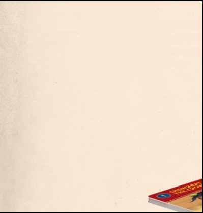Team card face up in front of them where
it can\
easily be seen and referenced.

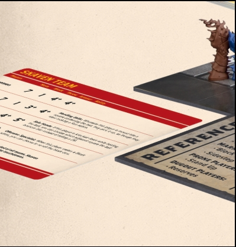

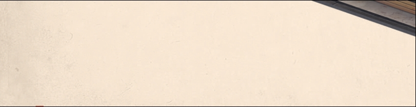

**8**
>
'3' space.

**5.** Next, the coach that lost the coin toss sets up their

team in their End Zone, then the other coach does
>
the same. When setting up their team, the coach can
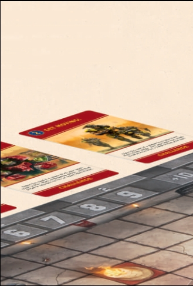choose which square each of their
players is placed in. Each square can only have one player in it.
>
**6.** Each coach puts their score marker on the 0 space
>
of the score track and puts their team coin near\
the board.
>
**7.** Finally, place a ball on the
trapdoor. If the coaches
>
are using the side of the board that has
two
>
trapdoors, the coach who won the toss rolls a D6. On a result of 1, 2
or 3 the ball is placed on the trapdoor closest to their End Zone; on
a 4, 5 or 6 it is placed on the trapdoor closest to their opponent's
End Zone.
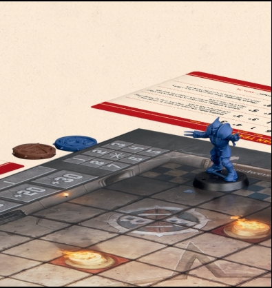

**Important:** When placing the ball during setup you do not roll to see
if the ball bounces (pg 12). In addition, the colour and shape of the
ball that is placed does not matter at this point, the ball does not
belong to either team and all balls follow the same rules.

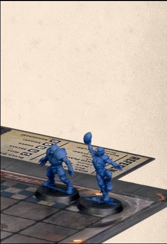

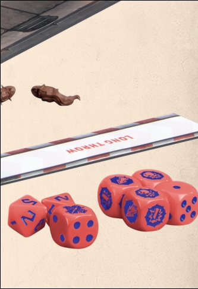

**9**
>
**PLAYING THE GAME**
>
A game of Blitz Bowl is played across a variable number of turns. The
coach who set up their team first (coach A) takes the first turn,
followed by the other coach (coach B). Players continue alternating
taking turns, one after the other, until the game ends (see Winning
the Game, page 15). On their turn each coach works through the game
>
sequence shown below:

+---+---------------------------------+---+---+---+--------+-------+----------+---+
|   | **GAME SEQUENCE**               |   | ! |   |        |       |          |   |
|   |                                 |   | [ |   |        |       |          |   |
|   | **COACH A'S TURN**            |   | ] |   |        |       |          |   |
|   |                               |   | ( |   |        |       |          |   |
|   | **Pre-Turn Sequence\***       |   | . |   |        |       |          |   |
|   |                               |   | / |   |        |       |          |   |
|   | **. a.** Refresh Challenge    |   | b |   |        |       |          |   |
|   | Cards step                    |   | l |   |        |       |          |   |
|   |                               |   | i |   |        |       |          |   |
|   | **b.** No Ball in Play step   |   | t |   |        |       |          |   |
|   |                               |   | z |   |        |       |          |   |
|   | **c.** Emergency Reserves     |   | b |   |        |       |          |   |
|   | step                          |   | o |   |        |       |          |   |
|   |                                 |   | w |   |        |       |          |   |
|   |                                 |   | l |   |        |       |          |   |
|   |                                 |   | / |   |        |       |          |   |
|   |                                 |   | m |   |        |       |          |   |
|   |                                 |   | e |   |        |       |          |   |
|   |                                 |   | d |   |        |       |          |   |
|   |                                 |   | i |   |        |       |          |   |
|   |                                 |   | a |   |        |       |          |   |
|   |                                 |   | / |   |        |       |          |   |
|   |                                 |   | i |   |        |       |          |   |
|   |                                 |   | m |   |        |       |          |   |
|   |                                 |   | a |   |        |       |          |   |
|   |                                 |   | g |   |        |       |          |   |
|   |                                 |   | e |   |        |       |          |   |
|   |                                 |   | 1 |   |        |       |          |   |
|   |                                 |   | 0 |   |        |       |          |   |
|   |                                 |   | 6 |   |        |       |          |   |
|   |                                 |   | 2 |   |        |       |          |   |
|   |                                 |   | . |   |        |       |          |   |
|   |                                 |   | p |   |        |       |          |   |
|   |                                 |   | n |   |        |       |          |   |
|   |                                 |   | g |   |        |       |          |   |
|   |                                 |   | ) |   |        |       |          |   |
|   |                                 |   |  |   |        |       |          |   |
+===+=================================+===+===+===+========+=======+==========+===+
| |                                 |   |   | |        |       |          | |
|   |                                 |   |   |   |        |       |          |   |
| * |                                 |   |   | * |        |       |          | * |
| * |                                 |   |   | * |        |       |          | * |
| I |                                 |   |   | C |        |       |          | I |
| * |                                 |   |   | O |        |       |          | * |
| * |                                 |   |   | A |        |       |          | * |
|   |                                 |   |   | C |        |       |          |   |
|   |                                 |   |   | H |        |       |          |   |
|   |                                 |   |   | |        |       |          |   |
|   |                                 |   |   |   |        |       |          |   |
|   |                                 |   |   | B |        |       |          |   |
|   |                                 |   |   | ' |        |       |          |   |
|   |                                 |   |   | S |        |       |          |   |
|   |                                 |   |   | |        |       |          |   |
|   |                                 |   |   |   |        |       |          |   |
|   |                                 |   |   | T |        |       |          |   |
|   |                                 |   |   | U |        |       |          |   |
|   |                                 |   |   | R |        |       |          |   |
|   |                                 |   |   | N |        |       |          |   |
|   |                                 |   |   | * |        |       |          |   |
|   |                                 |   |   | * |        |       |          |   |
+---+---------------------------------+---+---+---+--------+-------+----------+---+
|   |                                 |   |   |   |        |       |          |   |
+---+---------------------------------+---+---+---+--------+-------+----------+---+
|   | **Player Action 1**           |   |   |   | **   |       |          |   |
|   |                               |   |   |   | Player |       |          |   |
|   | \- Claim Challenge Card       |   |   |   |      |       |          |   |
|   | step\*\*                      |   |   |   | Action |       |          |   |
|   |                                 |   |   |   | 1**  |       |          |   |
|   |                                 |   |   |   |        |       |          |   |
|   |                                 |   |   |   | \-     |       |          |   |
|   |                                 |   |   |   | Claim  |       |          |   |
|   |                                 |   |   |   | Cha    |       |          |   |
|   |                                 |   |   |   | llenge |       |          |   |
|   |                                 |   |   |   | Card   |       |          |   |
|   |                                 |   |   |   | st     |       |          |   |
|   |                                 |   |   |   | ep\*\* |       |          |   |
+---+---------------------------------+---+---+---+--------+-------+----------+---+
|   | **\_ Player Action 2**        |   |   | |        |       |          |   |
|   |                               |   |   |   |        |       |          |   |
|   | \- Claim Challenge Card       |   |   | * |        |       |          |   |
|   | step\*\*                      |   |   | * |        |       |          |   |
|   |                                 |   |   | \ |        |       |          |   |
|   |                                 |   |   | _ |        |       |          |   |
|   |                                 |   |   | |        |       |          |   |
|   |                                 |   |   |   |        |       |          |   |
|   |                                 |   |   | P |        |       |          |   |
|   |                                 |   |   | l |        |       |          |   |
|   |                                 |   |   | a |        |       |          |   |
|   |                                 |   |   | y |        |       |          |   |
|   |                                 |   |   | e |        |       |          |   |
|   |                                 |   |   | r |        |       |          |   |
|   |                                 |   |   | |        |       |          |   |
|   |                                 |   |   |   |        |       |          |   |
|   |                                 |   |   | A |        |       |          |   |
|   |                                 |   |   | c |        |       |          |   |
|   |                                 |   |   | t |        |       |          |   |
|   |                                 |   |   | i |        |       |          |   |
|   |                                 |   |   | o |        |       |          |   |
|   |                                 |   |   | n |        |       |          |   |
|   |                                 |   |   | |        |       |          |   |
|   |                                 |   |   |   |        |       |          |   |
|   |                                 |   |   | 2 |        |       |          |   |
|   |                                 |   |   | * |        |       |          |   |
|   |                                 |   |   | * |        |       |          |   |
|   |                                 |   |   | |        |       |          |   |
|   |                                 |   |   | |        |       |          |   |
|   |                                 |   |   |   |        |       |          |   |
|   |                                 |   |   | \ |        |       |          |   |
|   |                                 |   |   | - |        |       |          |   |
|   |                                 |   |   | |        |       |          |   |
|   |                                 |   |   |   |        |       |          |   |
|   |                                 |   |   | C |        |       |          |   |
|   |                                 |   |   | l |        |       |          |   |
|   |                                 |   |   | a |        |       |          |   |
|   |                                 |   |   | i |        |       |          |   |
|   |                                 |   |   | m |        |       |          |   |
|   |                                 |   |   | |        |       |          |   |
|   |                                 |   |   |   |        |       |          |   |
|   |                                 |   |   | C |        |       |          |   |
|   |                                 |   |   | h |        |       |          |   |
|   |                                 |   |   | a |        |       |          |   |
|   |                                 |   |   | l |        |       |          |   |
|   |                                 |   |   | l |        |       |          |   |
|   |                                 |   |   | e |        |       |          |   |
|   |                                 |   |   | n |        |       |          |   |
|   |                                 |   |   | g |        |       |          |   |
|   |                                 |   |   | e |        |       |          |   |
|   |                                 |   |   | |        |       |          |   |
|   |                                 |   |   |   |        |       |          |   |
|   |                                 |   |   | C |        |       |          |   |
|   |                                 |   |   | a |        |       |          |   |
|   |                                 |   |   | r |        |       |          |   |
|   |                                 |   |   | d |        |       |          |   |
|   |                                 |   |   | |        |       |          |   |
|   |                                 |   |   |   |        |       |          |   |
|   |                                 |   |   | s |        |       |          |   |
|   |                                 |   |   | t |        |       |          |   |
|   |                                 |   |   | e |        |       |          |   |
|   |                                 |   |   | p |        |       |          |   |
|   |                                 |   |   | \ |        |       |          |   |
|   |                                 |   |   | * |        |       |          |   |
|   |                                 |   |   | \ |        |       |          |   |
|   |                                 |   |   | * |        |       |          |   |
+---+---------------------------------+---+---+---+--------+-------+----------+---+
|   | **\_ Player Action 3**        |   |   |   |        |       |          |   |
|   |                               |   |   |   |        |       |          |   |
|   | \- Claim Challenge Card       |   |   |   |        |       |          |   |
|   | step\*\*                      |   |   |   |        |       |          |   |
+---+---------------------------------+---+---+---+--------+-------+----------+---+
|   |                                 |   |   | * | **     |       |          |   |
|   |                                 |   |   | * | Player |       |          |   |
|   |                                 |   |   | A | Action |       |          |   |
|   |                                 |   |   | * | 3**    |       |          |   |
|   |                                 |   |   | * |        |       |          |   |
+---+---------------------------------+---+---+---+--------+-------+----------+---+
|   |                                 |   |   |   | \-     |       |          |   |
|   |                                 |   |   |   | Claim  |       |          |   |
|   |                                 |   |   |   | Cha    |       |          |   |
|   |                                 |   |   |   | llenge |       |          |   |
|   |                                 |   |   |   | Card   |       |          |   |
|   |                                 |   |   |   | st     |       |          |   |
|   |                                 |   |   |   | ep\*\* |       |          |   |
+---+---------------------------------+---+---+---+--------+-------+----------+---+
|   |                                 |   |   |   |        |       |          |   |
+---+---------------------------------+---+---+---+--------+-------+----------+---+
|   | **Important**                   |   |   |   |        |       |          |   |
|   |                                 |   |   |   |        |       |          |   |
|   | \* In each coach's first turn,  |   |   |   |        |       |          |   |
|   | do not complete the Pre-Turn    |   |   |   |        |       |          |   |
|   | Sequence - it is skipped.       |   |   |   |        |       |          |   |
|   |                                 |   |   |   |        |       |          |   |
|   | \*\* In addition, Challenge     |   |   |   |        |       |          |   |
|   | cards cannot be claimed by      |   |   |   |        |       |          |   |
|   | either coach during their first |   |   |   |        |       |          |   |
|   | turn.                           |   |   |   |        |       |          |   |
+---+---------------------------------+---+---+---+--------+-------+----------+---+

A coach first completes the Pre-Turn Sequence - refreshing the
Challenge card row (see Challenge Cards, page 14), checking to see if
a new ball enters play (see No Ball in Play, page 14), and finally
checking for emergency reserves (see Emergency Reserves, page 13).
Then they will make three Player Actions, one after the other (see
Actions, opposite).
>
Play then passes to the other coach to take their turn, and play
alternates in this way, one coach taking a turn followed by the other,
until the game is over.

**10**
>
**ACTIONS**
>
On their turn a coach makes a total of three actions, one in each
Player Action of their turn, dividing those actions between the
players on their team however they wish. A
player can make more than one action in
a coach's turn, but cannot make the same action more than once. For
>
example, if the Human coach made a Run action with their Blitzer, they
could not make another Run action\
with their Blitzer during the turn, but the Blitzer could make another
action - for example, they could Mark an opponent. Note that the Human
coach could still make Run actions with other players on their team,
as long as no player makes the same action more than once.
>
The actions a player can make are dependent on their current status,
as shown below:
>
**RUN ACTION**
>
When a player makes a Run action, their coach chooses an Open player
and moves them a number of squares\
up to their Move value. A move can be made into
>
any adjacent square that is not occupied by another player (either
standing or prone) or blocked (pg 3), and players cannot move off the
pitch. In addition, when
>
a player makes a Run action, their move cannot take them adjacent to
an Open or Marked opponent, but
>
they can move adjacent to Prone players. Trapdoors

do not block movement; players can move onto them freely, but they can
be quite hazardous as they fly open whenever a new ball enters play, and
many a player has disappeared down them never to be seen again - you
have been warned!

**OPEN**
**PLAYERS**

**MARKED** **PLAYERS**

**PRONE** **PLAYERS**

**RESERVES**
**PLAYERS**

Run Block

Stand Up Reserves

+--------------------+---------+--------------------------------------+
| Mark             | S     |                                      |
|                    | idestep |                                      |
+====================+=========+======================================+
| Throw            |         |                                      |
+--------------------+---------+--------------------------------------+

**FREE ACTIONS**
>
Some player abilities and Bonus Play cards allow a
>
player to make a free action. This is done in the same way as a
regular action, following all of the rules outlined above (e.g. the
same player cannot make the same
>
action more than once in a turn), but does not count towards the
regular three Player Actions a coach can make during their turn. In
addition, free actions are also accompanied by a Claim Challenge Card
step, granting coaches the chance to claim a Challenge card in the
same way they would for a Player Action.

In this diagram, the Skaven Lineman
is making a dash across the pitch, running a total of 7 squares while
not moving adjacent to any of the Human Linemen.

**Move Value:** If a player's Move value is shown on their Team card as
D6, roll a D6 each time that player makes a Run action. The result on
the D6 is how far that player
can move for that Run action.

**Picking up the Ball:** A player that makes a Run action and moves
into a square that contains a ball takes possession of that ball. If a
player moves onto the ball

in any other way - for example, when making a Mark or Sidestep action,
or when pushed by an opponent - the ball bounces (pg 12). In addition, a
player that already has possession of a ball cannot take possession of
another ball (pg 6). When a player takes possession of a ball, that ball
is moved onto that player's base to show that they have it (some of the
balls have a small peg\
that fits into the hole on the player's base for just this purpose).
When a player that has possession of a ball moves, the ball moves with
them.

**MARK ACTION**
>
A Mark action is a move by an Open player of up to 2 squares (as
described under the Run action), but when
>
a player makes this action they must finish it adjacent to
an opponent. In addition, a player
making a Mark action
can move adjacent to opponents as they
move.
>
**THROW ACTION**
>
An Open player that has possession of a ball can make
>
a Throw action and pass it to another player on their team. To make a
Throw action pick a team-mate that is
>
in range of the throw. To see whether a player is in range, place the
throw ruler so that the curved end is in line
>
with the edge of the throwing player's base (as shown in the diagram);
a player is in range if any part of the throw ruler can reach the
centre of the square that player is standing in, including if the
throw ruler is touching any obstructions - they do not stop a player
throwing the ball to a team-mate.

The throw ruler is placed in line with the player's base. The grey
shaded area is in short range, whilst the red shaded area is in long
range.

r\* \"

>
**Hand-off:** If the target square is
occupied by a team- mate who is adjacent to the thrower, they
automatically take possession of the ball (this is called a
hand-off) - give the target player the ball.
>
To see if a throw is successful, make a Throw check (see Throw Checks
and Armour Checks, page 6) for the throwing player, subtracting 1 from
the result (to a
>
minimum of 1) if any of the following modifiers apply:

-   **Long Throw:** the centre of the target square is in the

half of the ruler marked long throw

-   **Obstructed Throw:** the target player is Marked, or\
    any part of the throw ruler between the thrower and

the target is touching a blocked square or a square occupied by an
Open opponent
>
If the Throw check succeeds, the target player takes possession of the
ball. If the check fails, the ball bounces (see Bouncing Ball, below)
from the target player's square.
>
**Fumble:** If the result of the Throw
check is a 1
>
(before or after modifiers), the throw fails and the ball bounces from
the thrower's square instead of the target player's square.
>
**Bouncing Ball:** When the ball
bounces, it is placed into an adjacent square. Roll a D8 and look at
the bounce chart printed on the game board to see which square it is
placed in. What happens next depends on the square the

+---------------------+------------------------------------------------+
| ball is placed    |                                                |
| into:             |                                                |
+=====================+================================================+
|                     |                                                |
+---------------------+------------------------------------------------+
| -   If the ball     |                                                |
|     bounces into  |                                                |
|     a square that |                                                |
|     is occupied   |                                                |
|     by an         |                                                |
|      |                                                |
+---------------------+------------------------------------------------+

Open player, that player takes possession of the ball.

-   If the ball bounces into an empty square, it remains in

that square and nothing further happens.

-   If the ball bounces into a square occupied by a Marked

or Prone player, it bounces again from that square.

-   If the ball bounces into an obstructed square or off

the board, the ball does not bounce in that direction. Instead, work
clockwise around the bounce chart until you reach a result which means
the ball would bounce into a square on the pitch that doesn't contain
an obstruction. Use that result instead.

**BLOCK ACTION**
>
When a player makes a Block action,
their coach picks
an adjacent Marked opponent (the target)
and rolls a
number of block dice equal to their
player's Block value.
The symbol rolled determines the result
of the Block
action, as shown below. If rolling more
than one block
dice, the coach making the roll chooses
any one result from those rolled to apply.
>
**Block Results:** Here, the Human coach has rolled a Shove result
>
on the block dice. This causes the Skaven player to be moved back one
square, directly away from the Human player.

K

**Tackle:** The target is knocked down (see Smash!). In addition, the
player making the Block action cannot make any more actions,
>
including free actions, this turn.
>
**Shove:** If possible, the target is pushed one square directly away
from the player making the Block action, who can then choose to
>
make a follow-up move into the square they left. If this is not
possible because the push would take the target into an occupied or
blocked square, or off the board, the\
target is knocked down instead (see Smash!).
>
**Smash!:** The target is knocked down. A\
knocked down player is placed prone in the square they are in. If they
are carrying the ball,
>
it bounces (see Bouncing Ball, page 12). Then, the target player's
coach must make an Armour check (see Throw Checks and Armour Checks,
page 6) for them. If the Armour check succeeds there is no further
effect, but if it fails the target player is injured.
>
**Kerrunch!:** The target is knocked down (see Smash!). In addition,
when the resulting Armour check is made, subtract 1 from the
>
result, to a minimum of 1.

  -------------------------------------------------------------- --------
                                                                 

  -------------------------------------------------------------- --------

**Assisting a Block:** If the target of a block is also Marked by one or
more team-mates of the player making the Block action, the block is
Assisted. This means that the coach rolls one block dice in addition to
the number\
equal to their player's Block value, and then chooses which result to
use.

**Injured Players:**
>
When a player is injured they are removed from the\
game board and placed in their team's dugout.
>
**SIDESTEP ACTION**
>
A Sidestep action is a move by a Marked player of 1 square, but when a
player makes this action they must finish the move Open. If a player
moves onto the ball when using a Sidestep action the ball bounces (See
Bouncing Ball, page 12).
>
**STAND UP ACTION**

A Prone player can only make a Stand Up action. If a player takes this
action, stand them up in the square they are occupying.

**RESERVES ACTION**

A Reserve player can only make a Reserves action. Place the player in a
free square in their team's End Zone. They cannot be placed in a square
adjacent to an opponent

or in a square containing a ball, unless there is no
>
other option.
>
**13**
>
**SCORING TOUCHDOWNS**
>
After completing an Action with a player, but before claiming a
Challenge card (see right), check to see if
>
a touchdown has been scored. To score a touchdown,
>
a player from your team must fulfil the
following three
criteria at the end of any action made
during your turn:

-   They must be in the other team's End Zone

-   They must have possession of a ball

-   They must be Open

If a player scores a touchdown, the ball that player is carrying is
removed from play and that player's team scores 4 points. In addition,
the player that scored is immediately hauled out of the arena - no
doubt whisked
>
away to sign a lucrative contract to join the ranks of a professional
Blood Bowl team - and is placed in their
team's dugout.
>
Scoring a touchdown does not prevent a coach from completing their
turn by making any remaining Player Actions they have available. Even
though there may\
be no ball on the pitch, this is a great opportunity to reposition a
player or make a block or two.
>
**NO BALL IN PLAY**
>
If there is no ball on the pitch during the No Ball in Play step of
the Pre-Turn Sequence of a coach's turn, a new ball enters play (see
New Ball! below).
>
**NEW BALL!**
>
When a new ball enters play, it emerges
through a trapdoor on the pitch. If there is more than one trapdoor on
the pitch, the coach whose turn it is rolls a D6 to
>
determine which trapdoor the ball emerges from.
>
On a result of 1, 2 or 3 the ball will emerge
>
from the trapdoor to their left; on a 4,
5\
or 6 it will emerge from the trapdoor to
>
their right.
>
If there is a player standing on that trapdoor that a new ball emerges
from, that
>
player is immediately injured (see Injured Players, page 13), and if
they were holding a ball, it
>
disappears down the trapdoor with them.
>
Finally, place a ball on the trapdoor square the new ball emerged
from. That ball then bounces (pg 12).
>
**14**
>
**MULTIPLE BALLS IN PLAY**
>
When there is more than one ball in play at once, only one ball can
occupy a square, and each player can only carry one ball. If a player
carrying a ball moves into a
square containing another ball, that ball
bounces (see Bouncing Ball, page 12). If a ball bounces into a square
containing another ball, or a player carrying another ball, that ball
bounces again.
>
**CHALLENGE CARDS**
>
Challenge cards represent global objectives that both players can
complete to score points and claim the\
Bonus Play on the opposite side. In each coach's first turn, Challenge
cards are not used and the Claim Challenge Card and Replace Challenge
Cards steps
>
are skipped. Otherwise, the three Challenge cards in
>
the spaces marked 1-3 are active, and can be claimed during a coach's
turn. The card on top of the Challenge deck is not active, although it
is visible to both coaches -
this way they can see at least one card
that will become active next turn. Note that coaches are not allowed
to\
look at the backs of any Challenge cards until they take them into
their hand.
>
**CLAIMING CHALLENGE CARDS**
>
The coach taking their turn may claim an active\
Challenge card during any Claim Challenge Card step, after completing
an action with a player, including a free action, provided all the
conditions listed on the Challenge card have been met, and at least
one of the conditions
>
on the card was fulfilled as a result of the action just completed. If
more than one Challenge card's conditions are met simultaneously, only
one can be claimed, and

any not claimed must have at least one of
its conditions fulfilled again, later in the turn, to be claimed.

When a Challenge card is claimed by a coach, its points value is added
to their team's score and the coach

takes the card, adding the Bonus Play on the back to\
their hand. If a coach has more than three Challenge/ Bonus Play cards
in their hand at the end of their turn (not counting any cards that they
have played in front of them), they must discard cards from their hand
until they are left with three.

**Clean Sweep:** If a coach claims all
three active
Challenge cards in a single turn, this is
a Clean Sweep, and their team scores 2 bonus points as the crowd\
goes wild!

**REPLACE CHALLENGE CARI S**
>
During the Pre-Turn Sequence of a coach's turn the
>
active Challenge cards are refreshed. If all three active Challenge
cards are still present, the coach taking their
turn can choose to discard one of those
cards - if they\
do, it can be any one of the three
active Challenge cards. Then, draw new Challenge cards from the top of
the Challenge deck to fill any free spaces.
>
**Discarding Challenge Cards:** When a
Challenge card
>
is discarded, place it onto the designated space along the edge of the
game board (marked with an \< ), with its Bonus Play side showing.
>
**BONUS PLAYS**
>
The reverse of each Challenge card shows a Bonus
>
Play - a special boost that the coach can use to gain an
advantage. Each card states when it can
be played, and during a team's turn, their coach can play any number
>
of Bonus Play cards from their hand, discarding the Challenge card
after they have done so (unless the card text tells them otherwise).
The only restriction is that
>
no duplicate cards can be played in the same turn; for example, a
coach could not play two Raw Talent cards in their turn.

**WINNING THE GAME**

There are two ways the game can end - with a Sudden Death Victory or
with a Points Victory.

**SUDDEN DEATH:** If, at the end of a coach's turn, their
team's score is 10 or more points behind
the opposing team's score, the game immediately ends and the opposing
coach wins the game.

**POINTS VICTORY:** Once the last Challenge card is dealt out and
becomes active, each team has one more turn. The game then ends and the
team with the highest score

wins. If both teams have the same score, the game ends
in a draw!
>
**HACKSPIT QUILLCHEWER'S FUN FACTS!**

+-------------------------------------------------------+--------+---+---+
| **Ever since an unfortunate misprint in**           |        |   |   |
+=======================================================+========+===+===+
| **a copy of Spike! Magazine, Valen Swift**          |        |   |   |
+-------------------------------------------------------+--------+---+---+
| **has been hounded by rumours that**                |        |   |   |
+-------------------------------------------------------+--------+---+---+
| **he's left the Elfheim Eagles for good.**          |        |   |   |
|                       |        |   |   |
+-------------------------------------------------------+--------+---+---+
| **Despite assertions from Valen himself**           |        |   |   |
+-------------------------------------------------------+--------+---+---+
| **- and the fact that the article quoted**            |        |   |   |
+-------------------------------------------------------+--------+---+---+
| **his leaving date as more than three**             |        |   |   |
+-------------------------------------------------------+--------+---+---+
| **hundred years-years in the future - th**          |        |   |   |
+-------------------------------------------------------+--------+---+---+
| **annoying gossip just won't die, much**            |        |   |   |
+-------------------------------------------------------+--------+---+---+
| **like the fat elf-elf himself-self!**              |        |   |   |
+-------------------------------------------------------+--------+---+---+

**ADVANCED RULES**
>
**FOUL ACTION**
>
Committing a foul is strictly against the rules, and any player
tempted to stick the boot in risks the wrath of the referees. Not that
this stops anyone of course!

An Open player that is adjacent to a
Prone opponent
>
can make a Foul action that targets that opponent.
>
**THE ENDGAME**
>
These rules introduce the special Endgame Challenge cards, which make
sure the game ends in a suitably impressive way!
>
During set-up, take the 16 Endgame Challenge cards and shuffle them
challenge-side up. Then deal 6 cards onto the Challenge deck space
next to the board. Place any remaining cards back in the box without
looking at them

-   they won't be used during the game.

The 24 standard Challenge cards are then shuffled challenge-side up
and placed on top of the Endgame Challenge cards with all cards
challenge-side up. This creates a Challenge deck of 30 cards in total,
the bottom 6 of which are Endgame Challenge cards.
>
The Endgame occurs as soon as one of the Endgame Challenge cards
becomes active. From that point on, a Sudden Death Victory cannot be
won - the game will only end with a Points Victory (see Winning the
Game, page 15).

+----------------------------------------------+-----------------------+
| **ADDITIONAL TEAMS**                       |                       |
+==============================================+=======================+
+----------------------------------------------+-----------------------+

Blitz Bowl includes cards for additional teams whose miniatures are
not included in the game box. These
>
teams are available separately and using them is a
>
simple case of switching out one or both of the teams included in the
Blitz Bowl box with the appropriate type and number of miniatures, as
shown on that team's card.
>
**SPECIAL ACTIONS**
>
Special actions are actions that only certain players can make, or
that could result in the player making the action being punished by
the referee and being sent from the field of play.
>
**16**
>
When a player makes a Foul action, their coach rolls one block dice.

**FOUL RESULTS:**

**I Spotted!:** The player making the Foul action is **I** spotted
committing the foul and sent from the
>
field of play - place them in their
>
team's dugout. The target player is unaffected.

+---+----+----------------------------------------------------+-----+---+
| * |  |                                                    |     |   |
| * | ** |                                                    |     |   |
| 0 | Ta |                                                    |     |   |
| . | ke |                                                    |     |   |
| * |  |                                                    |     |   |
| * | Th |                                                    |     |   |
|   | at |                                                    |     |   |
|   | !: |                                                    |     |   |
|   | ** |                                                    |     |   |
|   |  |                                                    |     |   |
|   |  T |                                                    |     |   |
|   | he |                                                    |     |   |
|   |  |                                                    |     |   |
|   | ta |                                                    |     |   |
|   | rg |                                                    |     |   |
|   | et |                                                    |     |   |
|   |  |                                                    |     |   |
|   | pl |                                                    |     |   |
|   | ay |                                                    |     |   |
|   | er |                                                    |     |   |
|   |  |                                                    |     |   |
|   | is |                                                    |     |   |
|   |  |                                                    |     |   |
|   |  i |                                                    |     |   |
|   | nj |                                                    |     |   |
|   | ur |                                                    |     |   |
|   | ed |                                                    |     |   |
|   |  - |                                                    |     |   |
|   |  |                                                    |     |   |
|   |  p |                                                    |     |   |
|   | la |                                                    |     |   |
|   | ce |                                                    |     |   |
|   |  |                                                    |     |   |
|   |  ! |                                                    |     |   |
|   | [] |                                                    |     |   |
|   | (. |                                                    |     |   |
|   | /b |                                                    |     |   |
|   | li |                                                    |     |   |
|   | tz |                                                    |     |   |
|   | bo |                                                    |     |   |
|   | wl |                                                    |     |   |
|   | /m |                                                    |     |   |
|   | ed |                                                    |     |   |
|   | ia |                                                    |     |   |
|   | /i |                                                    |     |   |
|   | ma |                                                    |     |   |
|   | ge |                                                    |     |   |
|   | 17 |                                                    |     |   |
|   | 49 |                                                    |     |   |
|   | .p |                                                    |     |   |
|   | ng |                                                    |     |   |
|   | ) |                                                    |     |   |
+===+====+====================================================+=====+===+
|   |    | them in their team\'s dugout. In addition, the   |     |   |
+---+----+----------------------------------------------------+-----+---+
|   |  |                                                    |     |   |
|   |  * |                                                    |     |   |
|   | *B |                                                    |     |   |
|   | ** |                                                    |     |   |
|   |  |                                                    |     |   |
|   | pl |                                                    |     |   |
|   | ay |                                                    |     |   |
|   | er |                                                    |     |   |
|   |  |                                                    |     |   |
|   | ma |                                                    |     |   |
|   | ki |                                                    |     |   |
|   | ng |                                                    |     |   |
|   |  |                                                    |     |   |
|   |  t |                                                    |     |   |
|   | he |                                                    |     |   |
|   |  |                                                    |     |   |
|   | Fo |                                                    |     |   |
|   | ul |                                                    |     |   |
|   |  |                                                    |     |   |
|   | ac |                                                    |     |   |
|   | ti |                                                    |     |   |
|   | on |                                                    |     |   |
|   |  |                                                    |     |   |
|   | is |                                                    |     |   |
|   |  |                                                    |     |   |
|   |  s |                                                    |     |   |
|   | po |                                                    |     |   |
|   | tt |                                                    |     |   |
|   | ed |                                                    |     |   |
+---+----+----------------------------------------------------+-----+---+

committing the foul (see Spotted!).

  -------------------------------------------------------------------------------
              **Slipped!:** The target player remains Prone, but the    
              player making the Foul action cannot make                 
  ----------- --------------------------------------------------------- ---------
  \| any more                                                           
  actions,                                                              
  including                                                             
  free                                                                  
  actions,                                                              

  -------------------------------------------------------------------------------

this turn.
>
**Got Them!:** The target player is injured - place them in their
team's dugout.

+------------------------------------------------+---------------------+
| **['ROOKIES TO WATCH']             |                     |
| \_\_\_\_\_\_\_\_\_**                           |                     |
|                                                |                     |
| Every season, a group of players will show     |                     |
| more promise                                   |                     |
| than most and     |                     |
| catch the eye of the commentators as the       |                     |
+================================================+=====================+
|                                                |                     |
+------------------------------------------------+---------------------+

'rookies to watch' during the upcoming try-outs.
>
If you are an experienced Blitz Bowl coach and introducing someone new
to the game, give them the Rookies to Watch card during set-up.
>
That coach can discard (put back in the game box) that card after they
make an Armour check, a Throw check
>
or roll the block dice for a Block action made by a player from your
team. If they do, they can re-roll the dice.
>
**THROW TEAM-MATE ACTION** A Throw Team-mate action allows Ogre, Troll
and Treeman players to throw other, smaller players on the same team,
in
>
the hope that they'll somehow land on
their feet rather than in a pile of
broken bones. Making a Throw Team-mate\
action is considered a Throw action (e.g. for claiming Challenge
cards) with the following changes:

-   The player making the Throw Team-

mate action must be Open and cannot have possession of a ball.

-   When a player makes a Throw

**AS**

There are hundreds, if not thousands, of Blitz Bowl arenas all over the
Old

World, each dedicated to giving rookies the chance to join the pro
leagues

of Blood Bowl. No matter the location, countless prospects arrive every
year, ready and willing to do whatever it takes in order for the chance
to be signed to a team. The locations of these arenas have a huge
influence on the game, with many adopting rules and regulations styled
after their local Blood Bowl big league.

Before the coach that won the coin toss chooses which pitch they want to
use, they roll a D8 and consult the following table to see what regional
rules apply for the game.

**D8 REGIONAL LEAGUE EFFECT**

Team-mate action they can throw
>
another player on the same team that is standing adjacent to them
(either Open or Marked) and not of the same position (i.e. an Ogre
cannot throw another Ogre).

-   To make a Throw Team-mate action,

pick a target square that is not occupied by another player and that
is within range of the thrower, and then make a Throw check for the
player making the action.

-   If that Throw check succeeds, place\
    the thrown player standing in the

target square. If the thrown player had possession of a ball, they
retain possession of it.

-   If the Throw check fails, place the

thrown player Prone in the target square, but do not make an Armour
check for them. If the thrown player has possession of a ball, the
ball bounces from the target square.

-   If the Throw check is a Fumble, the thrown player is injured. In
    this case,

if the thrown player has possession
>
of a ball, it bounces from the player making the Throw Team-mate
action.

-   If a player is thrown to a square\
    that already contains a ball, that

ball bounces (see Bouncing Ball, page 12).
>
**1**

**2**

***3***

**4**

**5**

**6**

**7**

**8**

***Halfling Moot Madness***

***Underworld Challenge***

***Sylvanian Spotlight***

***Elven Kingdoms League***

***The Gut Cup Grind***

***The Badlands Brawl***

***World's Edge Superleague***

***Lustrian Superleague***

+---------------------------------------------------+--------------+---+
| Subtract 1 from the Emergency                     |              |   |
+===================================================+==============+===+
| Reserves value of both teams (for               |              |   |
+---------------------------------------------------+--------------+---+
| example, 4 becomes 3).                          |              |   |
+---------------------------------------------------+--------------+---+

+-----------------------------------------------------------+---+----+---+
| When a player makes a Reserves                          |   |    |   |
+===========================================================+===+====+===+
| action, that player can be placed on                    |   |    |   |
+-----------------------------------------------------------+---+----+---+
| a trapdoor, instead of that coach'                      |   | s  |   |
+-----------------------------------------------------------+---+----+---+
| End Zone. If this happens while there                   |   |    |   |
+-----------------------------------------------------------+---+----+---+
| is already a ball or player on that                     |   |    |   |
+-----------------------------------------------------------+---+----+---+
| trapdoor, that ball is removed from th                    |   |    |   |
+-----------------------------------------------------------+---+----+---+
| pitch and that player is injured.                       |   |    |   |
+-----------------------------------------------------------+---+----+---+

+---------------------------------------------------------------+---+---+
| After a player makes a Reserves                             |   |   |
+===============================================================+===+===+
| action, that player can make a                              |   |   |
+---------------------------------------------------------------+---+---+
| free Run action. This includes free                           |   |   |
+---------------------------------------------------------------+---+---+
| Reserves actions and actions mad                            |   |   |
+---------------------------------------------------------------+---+---+
| due to Emergency Reserves rule                              |   | . |
+---------------------------------------------------------------+---+---+

Do not subtract 1 from the Throw check when making a long throw.

  -----------------------------------------------------------------------
  When a player that was knocked down due to a Shove result   
  that would have pushed that player into an obstructed       
  ----------------------------------------------------------- -----------
  square or off the board, treat the result                   

  of the Block action as Kerrunch!.                           
  -----------------------------------------------------------------------

+-------------------------------------+----------------+--------------+
| Assisted Block actions roll two   |                |              |
+=====================================+================+==============+
| additional block dice instead of    |                |              |
| one, to                             |                |              |
+-------------------------------------+----------------+--------------+
| a maximum of three.                 |                |              |
+-------------------------------------+----------------+--------------+

+-----------------+---------------------------------------------+---+---+
| Use the       |                                             |   |   |
| following     |                                             |   |   |
| rules to      |                                             |   |   |
| determine     |                                             |   |   |
+=================+=============================================+===+===+
| a Sudden Death  |                                             |   |   |
| Victory. If, at |                                             |   |   |
| the end of a    |                                             |   |   |
| coach's turn,   |                                             |   |   |
| their team's    |                                             |   |   |
| score is 8 or   |                                             |   |   |
| more points     |                                             |   |   |
| behind the      |                                             |   |   |
| opposing        |                                             |   |   |
+-----------------+---------------------------------------------+---+---+
| team's score,   |                                             |   |   |
| the game        |                                             |   |   |
| immediately     |                                             |   |   |
+-----------------+---------------------------------------------+---+---+
| ends and the    |                                             |   |   |
| opposing coach  |                                             |   |   |
| wins            |                                             |   |   |
+-----------------+---------------------------------------------+---+---+
| the game.       |                                             |   |   |
+-----------------+---------------------------------------------+---+---+

+------------------------------------------------+------------+-----+---+
| The coach that won the coin toss               |            |     |   |
+================================================+============+=====+===+
| must choose to use the pitch with two          |            |     |   |
| trapdoors. If you have access to more          |            |     |   |
+------------------------------------------------+------------+-----+---+
| than one pitch with two trapdoor               |            | s   |   |
|                                                |            |     |   |
| (e.g. because you own a previous             |            |     |   |
+------------------------------------------------+------------+-----+---+
| edition of Blitz Bowl), the coach that       |            |     |   |
+------------------------------------------------+------------+-----+---+
| won the coin toss can choose which of        |            |     |   |
+------------------------------------------------+------------+-----+---+
| those boards will be used.                     |            |     |   |
+------------------------------------------------+------------+-----+---+

**TODAY'S CONTENDERS**
>
**THE REAVERS**
>
Known during their first few seasons as the Altdorf Acolytes, the team
who became the Reikland Reavers quickly earned a reputation for their
great skill and ability on the pitch. In fact, many fans claim the
Reavers are the finest all- round team in the world

**Lineman 1 Lineman 2 Lineman 3**

t a
>
*\$*

**Blitzer Thrower Catcher**
>
**THE SCRAMBLERS**
>
The only team to have ever won the Blood Bowl trophy two years on the
run, the Skavenblight Scramblers are at least a bit legendary. Being
Skaven, they have a love for absolute, mindless violence, making them
sure fan favourites.

***it***

**Lineman 1 Lineman 2 Lineman 3**

**Blitzer Thrower Gutter Runner**
>
**18**
>
**THE CRUSH**
>
Blood Bowl is a brutal sports game in which opposing teams of
blood-thirsty maniacs seek victory by getting\
the ball into the opposing team's End Zone to score more
>
touchdowns than their foe. Blood Bowl is
far more than\
a game, however - some describe it as
ritualised war! Teams from across the Old World compete in a series
>
of leagues and cups, striving to win the game's major trophies season
after season.
>
For most players, their career begins in 'The Crush', an annual ritual
during which the owners of the Blood Bowl teams select would-be
players for the coming season. The prospective players gather outside
temples of Nuffle

-   arenas dedicated to the god of Blood Bowl. Each of\
    these temples has but a single door, and when it opens to the
    sound of a whistle, the players surge forward in

a mighty tide. Only the fastest, toughest or most brutal make it
through the portal into the temple beyond.
>
Once inside, the supplicants find themselves on a special pitch sunk
into the ground, in many respects resembling\
a gladiatorial pit. The owners and staff of those teams seeking new
players gaze down in judgment from
>
terraces high above. Also in attendance are priests of Nuffle, who
watch on in silence, noting down every deed and statistic on huge
rolls of parchment. Some sponsors also send representatives to the
Crush, hoping to identify next season's talent.

>
The players are thrown the kit of the team they wish to
>
try out for and divided into teams of six. What ensues is

a mixture of Blood Bowl, gladiatorial combat and brutal violence in the
name of Nuffle. Each player does their utmost to show off their skills,
strength, toughness, speed and sheer bloodthirstiness and, in so doing,
impress one\
of the owners and earn themselves a spot on a team. Those watching from
the stands will call down challenges for the aspiring players to
undertake. A player who can meet the audience's demands will earn the
acclaim of

the Crush's commentary team, and is sure to catch the eye of one of
the waiting owners.

Few come out of the Crush with any glory - if they come out at all - but
those who do are blessed by Nuffle and fated to become the next
generation of Blood Bowl stars.

Should they be signed to a professional team, these rookies have a shot
at lasting success and celebrity. Though most will begin their career on
the substitutes'

bench, the gruelling Blood Bowl calendar ensures that it\
is only a matter of time before they earn a place amongst their team's
starting line-up. Each team will compete in regular league games,
proving themselves against local rivals. Only those teams who display
the most impressive skills - or who offer the greatest entertainment
value -

are invited to participate in one of the four annual Major Tournaments.
These showcase events see the best of the best compete for the sport's
most prestigious trophies, hoping to write their name in the history
books. Of these 'Majors\', perhaps the greatest is the Blood Bowl
Classic,
the pinnacle of aspiration for generations
of Blood Bowl players and dedicated fans.

  ------------------ ----------------------------------------------------
                     

  ------------------ ----------------------------------------------------

**ASSEMBLING YOUR TEAM**
>
This box contains two teams of finely detailed Citadel Miniatures
representing the Human and Skaven teams. The players come unassembled
and unpainted - the Humans are blue and the Skaven are brown, meaning
that even if you don't paint them, you'll easily be able to tell the
teams apart at a glance!
>
Before you can assemble any of your
players, you will need to remove them from the plastic frames. It's
best to
remove your players from the frames one
at a time. If you take everything off at once, it's very easy to lose
pieces or get confused as to what goes where.
>
All of the miniatures in this set have been designed so that the
pieces simply push together. To assemble your players, follow the
step-by-step guides on these pages.
>
**THROWER**

3 9

**fl LI NEMAN**
>
6

10

15 18
>
13 16

**20**
>
WARNING. SMALL PARTS. SHARP POINTS. PRODUCT FOR AGES 12+ ONLY.
>
ADVERTENCIA. PARTES REQUENAS. PUNTAS AFILADAS. NOAPTO PARAMENORES DE
12ANOS.
ATTENTION. PETITS ELEMENTS. POINTES
ACEREES. PRODUIT DESTINE AUX ENFANTS DE 12 ANS ET+.

***(2) -* Contact points**

13

**GUTTER RUNNER U LI NEMAN**
>
3
>
2 
>
**H LINEMAN**

**[H LINEMAN]**

\_\_\_\_\_\_\_\_\_\_\_\_\_\_\_\_\_\_\_\_\_\_\_\_\_\_\_\_\_\_\_\_\_ 9

8

**21**
>
**GLOSSARY**
>
**Active Challenge Card:** A Challenge card face up in a Challenge
card space (see Challenge card space below). **Adjacent Square:**
Squares touching the square a player
>
or ball is in are referred to as being adjacent to that
>
player or ball.
>
**Armour Check:** When the D6 is rolled
and compared to
>
a player\'s Armour value to determine a player's survival, often as a
result of a Block action. If the roll is equal to
>
or greater than player's Armour value, the Armour check\
is passed.
>
**Assisted Block:** A Block action that is made when one or more
team-mates are adjacent to the target.
>
**Block (action):** An action made by a player. Block\
actions can knock the target down, and potentially
>
injure them.
>
**Block dice:** Three six-sided dice that come with the\
game, unique to Blitz Bowl, that are used to determine the success of
Block actions and Foul actions. There
>
are five results available from the block dice: Smash!, Kerrunch!,
Tackle!, Miss, Shove.
>
**Bonus Play Card:** After a coach claims a Challenge card, that card
is referred to as a Bonus Play card.
>
**Bounce Chart:** A chart that dictates the eight directions a ball
could bounce, drawn on to the gaming board. **Challenge Card:** A
Challenge card with its challenge
>
side face up, either in a Challenge card space, or in the Challenge
card deck.
>
**Challenge Card Spaces:** The three spaces on the board next to the
Challenge card deck, numbered 1, 2 and 3. Challenge cards are placed
here, challenge-side up, at
>
the start of the game.
>
**Claim Challenge Card:** During a coach's turn, after making an
action, if that coach has completed the requirements of a Challenge
card, they may claim that Challenge card, scoring the points shown on
the card
>
and then adding that card to their hand as a Bonus Play card. Only one
Challenge card can be claimed at a time, even if the coach has
completed the requirements to\
claim more than one.
>
**Clean Sweep:** When a coach claims all three active Challenge cards
in a single turn.
>
**Coach:** A person controlling a team and taking part in a game of
Blitz Bowl.
>
**Coach's Hand:** If a coach has any Bonus Play cards, those cards are
referred to as that coach's hand. See
>
also: Claiming Challenge cards.
>
**D6:** The six-sided dice that comes with the game, whose facings
have between 1 and 6 pips on them.
>
***22***
>
**D8:** The eight-sided dice that comes with the game, whose facings
have numerical values between 1 and 8
>
on them.
>
**Drill Card:** A small deck of cards that help players learn the
rules of the game.
>
**Dugout:** A card where players that are in Reserve are placed. The
dugout also contains useful information
>
about the rules of the game.
>
**Emergency Reserves:** Each team has an Emergency Reserves value. If
the number of Reserves players on
>
a team is equal to or greater than this number, they
>
must make one free Reserves action in the Emergency Reserves step of
their turn.
>
**Empty Square:** Any square on the pitch that does not contain a
player, ball or obstruction.
>
**Endgame Challenge Cards:** 16 Challenge cards that are used to
determine the Endgame of Blitz Bowl when using the advanced rules.
>
**End Zone:** A row of squares, situated at either end of
>
the pitch. Each End Zone is assigned to a team. A team
>
is set up in their End Zone at the start of the game, and can score
touchdowns in the other team's End Zone.
>
**Foul Action:** An action made by a player that can only target a
Prone player. Foul actions can potentially injure another player, but
are illegal in the game and can result in the player that made the
Foul action being sent off. **Fumble:** When the Throw check made for
a player\
making a Throw action is a 1 (before or after modifiers), the throw
fails and the ball is fumbled. A fumbled ball bounces once from the
throwing player's square.
>
**Hand:** See Coach's Hand.
>
**Hand-off:** When a player makes a Throw action that targets an
adjacent team-mate, it is called a hand-off.
>
The target player automatically takes possession of the ball, no Throw
check is made.
>
**Injured Players:** A player that is injured is removed

from the pitch and placed in their dugout, becoming a Reserves player.

**Reserves Player:** When a player is in their dugout, often as a
result of being injured, they are a Reserves player. **Long Throw:**
When the centre of the square the target player occupies is in the
half of the ruler marked
>
long throw.
>
**Mark (action):** An action that can be made by an Open player. The
player can move up to two squares, and must themselves be Marked at
the end of that move.
>
**Marked Players:** A player status. A Marked player is one that has
one or more adjacent opponents.
>
**Modifier/Modify:** An adjustment made to the result of
>
a D6 or D8 roll, either positive or negative. A result for
>
a Throw or Armour check can never be modified by
>
more than -1/+1, even when more than one modifier would apply.
>
**New Ball!:** When a ball is added to
the pitch via the trapdoor. If a player is standing on the trapdoor
the new ball emerges from, that player is injured.
>
**No Ball In Play:** A state of play where there is no ball on the
pitch.
>
**Obstructed Throw:** A throw where the target player
>
is Marked, or any part of the throw ruler between the thrower and the
target is touching an obstructed square\
or a square occupied by an Open opponent.
>
**Open Player:** A player with no adjacent opponents. **Opponent:** A
player from the other coach's team.
>
**Pitch:** See Square.
>
**Player(s):** Members of a team. Can refer to either team- mates or
opponents.
>
**Player Action(s):** Actions that can be made by players. These
actions include Mark, Throw, Block, Run,\
Sidestep, Reserves, Stand Up and Foul.
>
**Player Status:** A player's status in a game. The different statuses
are: Prone, Marked, Open, Reserves. A player's status dictates what
actions that player can make.
>
**Prone Players:** A player that has been placed on its side, usually
as a result of being knocked down.
>
**Re-roll:** When a coach is allowed to re-roll a dice roll, they pick
up the dice they just rolled, and roll it again.
>
If they rolled multiple dice they must re-roll all of those dice. A
coach cannot re-roll a dice that has been re- rolled. A coach cannot
re-roll the other coach's dice.
>
After a dice has been re-rolled the coach must use the result of the
re-roll, even if it is worse.
>
**Reserves (action):** An action that can be made by a Reserves
player.
>
**Run (action):** An action that can be made by an
>
Open player.
>
**Scoring Points:** Teams can score points by scoring touchdowns,
claiming Challenge cards and some Bonus Play cards. When a team scores
points, their score marker is advanced along that team's score track a
number of times equal to the number of points that
>
team scored.
>
**Sidestep (action):** An action that can be made by a Marked player.
>
**Square:** The playing area is divided up into squares, collectively
referred to as the pitch. These squares can
>
be empty, or contain obstructions. Players are placed
>
on squares, and only one player can occupy a square at
>
a time.
>
**Stand Up (action):** An action that can be made by a\
Prone player.
>
**Standing Opponent:** A player from the other team that is neither a
Reserves player or Prone.
>
**Sudden Death Victory:** If, at the end of a coach's turn, their
team's score is 10 or more points behind the opposing team's score,
the game immediately ends and the opposing coach wins the game.
>
**Taking Possession of the Ball:** When a ball is placed
>
on the base of a player, they are said to have taken possession of the
ball.
>
**Target Player (player state):** A player who is being\
thrown the ball, or is being blocked, is referred to as the target of
that Block or Throw action.
>
**Team:** A group of players controlled by a coach.
>
**Team Card:** A card that contains the information required to play
with that team, outside of the core rules of
>
the game.
>
**Team-mate:** A player from the same team as
>
another player.
>
**Th rower/Throwing player (player state):** While a player makes a
Throw action, they are often referred to as the Thrower or Throwing
player.
>
**Turn(s):** A game of Blitz Bowl is divided up into turns, taken
alternatively by each coach.
>
**Throw (action):** An action that can be made by an Open player that
has possession of the ball.
>
**Throw Check:** When the D6 is rolled and compared to
>
a player's Throw value during a Throw action. If the roll
>
is greater to or equal than the throwing player's Throw value (after
modifiers), the Throw action is successful. **Throw Ruler:** A ruler
used during a Throw action to determine the distance of the Throw
action.
>
**Throw Team-mate Action:** An action that can be made
>
by specific players to throw their smaller team-mates. **Touchdowns:**
After completing an action in your turn,
>
but before claiming any Challenge cards, if a player

from your team that has possession of the ball is Open and in the other
team's End Zone, that player scores a touchdown. That player's team then
scores 4 points, that player is placed in Reserves and the ball that
player had possession of is removed from the pitch.

**Trapdoor:** There are always one or more trapdoors drawn on to the
pitch. The trapdoor is where the ball emerges from should there be no
ball in play.

**23**
>
**REFERENCE**
>
**GAME SEQUENCE**
>
**COACH A'S TURN**
>
**Pre-Turn Sequence\***
>
**a.** Refresh Challenge Cards step
>
**COACH B'S TURN**
>
**Pre-Turn Sequence\***
>
**a.** Refresh Challenge Cards step
>
**1**
>
**2**
>
**3**
>
**b.** No Ball in Play step
>
**c.** Emergency Reserves step

**Player Action 1**

\- Claim Challenge Card step\*\*

**Player Action 2**

\- Claim Challenge Card step\*\*

**1**

**2**

**3**

**b.** No Ball in Play step

**c.** Emergency Reserves step
>
**Player Action 1**

\- Claim Challenge Card step\*\*

**Player Action 2**

\- Claim Challenge Card step\*\*

+------+---------------------------------------------------------------+
| *  | **Player Action 3**                                         |
| *4** |                                                             |
|      | \- Claim Challenge Card step\*\*                            |
+======+===============================================================+
+------+---------------------------------------------------------------+

+------+---------------------------------------------------------------+
| *  | **Player Action 3**                                         |
| *4** |                                                             |
|      | \- Claim Challenge Card step\*\*                            |
+======+===============================================================+
+------+---------------------------------------------------------------+

**Important**
>
\* In each coach's first turn, do not complete the Pre-Turn Sequence -
it is skipped.
>
\*\* In addition, Challenge cards can not be claimed by either coach
during their first turn.
>
**BLOCK RESULTS:**

+----------------------------------------------------------------+-----+
| I **Smash!:** The target is knocked down. A                  |     |
+================================================================+=====+
| I knocked down player is placed prone in the                   |     |
+----------------------------------------------------------------+-----+

**\|**

+---+----------------------------------------------------------------+---+
|   | **Miss:** The target is unaffected. In addition, the         |   |
+===+================================================================+===+
| I |                                                                |   |
| p |                                                                |   |
| l |                                                                |   |
| a |                                                                |   |
| y |                                                                |   |
| e |                                                                |   |
| r |                                                                |   |
| m |                                                                |   |
| a |                                                                |   |
| k |                                                                |   |
| i |                                                                |   |
| n |                                                                |   |
| g |                                                                |   |
| t |                                                                |   |
| h |                                                                |   |
| e |                                                                |   |
| B |                                                                |   |
| l |                                                                |   |
| o |                                                                |   |
| c |                                                                |   |
| k |                                                                |   |
| a |                                                                |   |
| c |                                                                |   |
| t |                                                                |   |
| i |                                                                |   |
| o |                                                                |   |
| n |                                                                |   |
| c |                                                                |   |
| a |                                                                |   |
| n |                                                                |   |
| n |                                                                |   |
| o |                                                                |   |
| t |                                                                |   |
| m |                                                                |   |
| a |                                                                |   |
| k |                                                                |   |
| e |                                                                |   |
| a |                                                                |   |
| n |                                                                |   |
| y |                                                                |   |
+---+----------------------------------------------------------------+---+

square they are in. If they are carrying the ball, it bounces (see
Bouncing Ball, page 12). Then, the target player's coach must make an
Armour check (see Throw
>
Checks and Armour Checks, page 6) for them. If the Armour check
succeeds there is no further effect, but if it fails the target player
is injured.

+-----------------------------------------------------------------+----+
| **\| Kerrunch!:** The target is knocked down (see             |    |
+=================================================================+====+
| I Smash!). In addition, when the resulting                    |    |
+-----------------------------------------------------------------+----+

Armour check is made, subtract 1 from the result, to a minimum of 1.
>
more actions, including free actions, this turn.

  -------------------------------------------------------------------------------
              **Tackle:** The target is knocked down (see                   
  ----------- ------------------------------------------------------------- -----
  I Smash!).                                                                
  In                                                                        
  addition,                                                                 
  the player                                                                
  making the                                                                

  -------------------------------------------------------------------------------

Block action cannot make any more actions, including free actions, this
turn.

+---+---+------------------------------------------------------------+---+---+
|   |   | **Shove:** If possible, the target is pushed one           |   |   |
+===+===+============================================================+===+===+
|   | I |                                                            |   |   |
|   | s |                                                            |   |   |
|   | q |                                                            |   |   |
|   | u |                                                            |   |   |
|   | a |                                                            |   |   |
|   | r |                                                            |   |   |
|   | e |                                                            |   |   |
|   | d |                                                            |   |   |
|   | i |                                                            |   |   |
|   | r |                                                            |   |   |
|   | e |                                                            |   |   |
|   | c |                                                            |   |   |
|   | t |                                                            |   |   |
|   | l |                                                            |   |   |
|   | y |                                                            |   |   |
|   | a |                                                            |   |   |
|   | w |                                                            |   |   |
|   | a |                                                            |   |   |
|   | y |                                                            |   |   |
|   | f |                                                            |   |   |
|   | r |                                                            |   |   |
|   | o |                                                            |   |   |
|   | m |                                                            |   |   |
|   | t |                                                            |   |   |
|   | h |                                                            |   |   |
|   | e |                                                            |   |   |
|   | p |                                                            |   |   |
|   | l |                                                            |   |   |
|   | a |                                                            |   |   |
|   | y |                                                            |   |   |
|   | e |                                                            |   |   |
|   | r |                                                            |   |   |
|   | m |                                                            |   |   |
|   | a |                                                            |   |   |
|   | k |                                                            |   |   |
|   | i |                                                            |   |   |
|   | n |                                                            |   |   |
|   | g |                                                            |   |   |
+---+---+------------------------------------------------------------+---+---+
| B | |                                                            |   |   |
|   |   |                                                            |   |   |
|   | t |                                                            |   |   |
|   | h |                                                            |   |   |
|   | e |                                                            |   |   |
|   | |                                                            |   |   |
|   |   |                                                            |   |   |
|   | B |                                                            |   |   |
|   | l |                                                            |   |   |
|   | o |                                                            |   |   |
|   | c |                                                            |   |   |
|   | k |                                                            |   |   |
|   | |                                                            |   |   |
|   |   |                                                            |   |   |
|   | a |                                                            |   |   |
|   | c |                                                            |   |   |
|   | t |                                                            |   |   |
|   | i |                                                            |   |   |
|   | o |                                                            |   |   |
|   | n |                                                            |   |   |
|   | , |                                                            |   |   |
|   | |                                                            |   |   |
|   |   |                                                            |   |   |
|   | w |                                                            |   |   |
|   | h |                                                            |   |   |
|   | o |                                                            |   |   |
|   | |                                                            |   |   |
|   |   |                                                            |   |   |
|   | c |                                                            |   |   |
|   | a |                                                            |   |   |
|   | n |                                                            |   |   |
|   | |                                                            |   |   |
|   |   |                                                            |   |   |
|   | t |                                                            |   |   |
|   | h |                                                            |   |   |
|   | e |                                                            |   |   |
|   | n |                                                            |   |   |
|   | |                                                            |   |   |
|   |   |                                                            |   |   |
|   | c |                                                            |   |   |
|   | h |                                                            |   |   |
|   | o |                                                            |   |   |
|   | o |                                                            |   |   |
|   | s |                                                            |   |   |
|   | e |                                                            |   |   |
|   | |                                                            |   |   |
|   |   |                                                            |   |   |
|   | t |                                                            |   |   |
|   | o |                                                            |   |   |
+---+---+------------------------------------------------------------+---+---+

make a follow-up move into the square they left. If this is

not possible because the push would take the target into an occupied or
blocked square, or off the board, the\
target is knocked down instead (see Smash!).

**PRODUCED BY THE WARHAMMER STUDIO**
>
**With special thanks to the 'Crush Crew' for their additional
playtesting services**

+---+-------------+---------------------------------------+-------------+---+
| |             |                                       |             |   |
|   |             |                                       |             |   |
| B |             |                                       |             |   |
| l |             |                                       |             |   |
| i |             |                                       |             |   |
| t |             |                                       |             |   |
| z |             |                                       |             |   |
| |             |                                       |             |   |
|   |             |                                       |             |   |
| B |             |                                       |             |   |
| o |             |                                       |             |   |
| w |             |                                       |             |   |
| l |             |                                       |             |   |
| |             |                                       |             |   |
|   |             |                                       |             |   |
| U |             |                                       |             |   |
| l |             |                                       |             |   |
| t |             |                                       |             |   |
| i |             |                                       |             |   |
| m |             |                                       |             |   |
| a |             |                                       |             |   |
| t |             |                                       |             |   |
| e |             |                                       |             |   |
| |             |                                       |             |   |
|   |             |                                       |             |   |
| E |             |                                       |             |   |
| d |             |                                       |             |   |
| i |             |                                       |             |   |
| t |             |                                       |             |   |
| i |             |                                       |             |   |
| o |             |                                       |             |   |
| n |             |                                       |             |   |
| |             |                                       |             |   |
|   |             |                                       |             |   |
| © |             |                                       |             |   |
| |             |                                       |             |   |
|   |             |                                       |             |   |
| C |             |                                       |             |   |
| o |             |                                       |             |   |
| p |             |                                       |             |   |
| y |             |                                       |             |   |
| r |             |                                       |             |   |
| i |             |                                       |             |   |
| g |             |                                       |             |   |
| h |             |                                       |             |   |
| t |             |                                       |             |   |
| |             |                                       |             |   |
|   |             |                                       |             |   |
| G |             |                                       |             |   |
| a |             |                                       |             |   |
| m |             |                                       |             |   |
| e |             |                                       |             |   |
| s |             |                                       |             |   |
| |             |                                       |             |   |
|   |             |                                       |             |   |
| W |             |                                       |             |   |
| o |             |                                       |             |   |
| r |             |                                       |             |   |
| k |             |                                       |             |   |
| s |             |                                       |             |   |
| h |             |                                       |             |   |
| o |             |                                       |             |   |
| p |             |                                       |             |   |
| |             |                                       |             |   |
|   |             |                                       |             |   |
| L |             |                                       |             |   |
| i |             |                                       |             |   |
| m |             |                                       |             |   |
| i |             |                                       |             |   |
| t |             |                                       |             |   |
| e |             |                                       |             |   |
| d |             |                                       |             |   |
| |             |                                       |             |   |
|   |             |                                       |             |   |
| 2 |             |                                       |             |   |
| 0 |             |                                       |             |   |
| 2 |             |                                       |             |   |
| 2 |             |                                       |             |   |
| . |             |                                       |             |   |
| |             |                                       |             |   |
|   |             |                                       |             |   |
| G |             |                                       |             |   |
| W |             |                                       |             |   |
| , |             |                                       |             |   |
| |             |                                       |             |   |
|   |             |                                       |             |   |
| G |             |                                       |             |   |
| a |             |                                       |             |   |
| m |             |                                       |             |   |
| e |             |                                       |             |   |
| s |             |                                       |             |   |
| |             |                                       |             |   |
|   |             |                                       |             |   |
| W |             |                                       |             |   |
| o |             |                                       |             |   |
| r |             |                                       |             |   |
| k |             |                                       |             |   |
| s |             |                                       |             |   |
| h |             |                                       |             |   |
| o |             |                                       |             |   |
| p |             |                                       |             |   |
| , |             |                                       |             |   |
| |             |                                       |             |   |
|   |             |                                       |             |   |
| C |             |                                       |             |   |
| i |             |                                       |             |   |
| t |             |                                       |             |   |
| a |             |                                       |             |   |
| d |             |                                       |             |   |
| e |             |                                       |             |   |
| l |             |                                       |             |   |
| |             |                                       |             |   |
|   |             |                                       |             |   |
| a |             |                                       |             |   |
| n |             |                                       |             |   |
| d |             |                                       |             |   |
| |             |                                       |             |   |
|   |             |                                       |             |   |
| B |             |                                       |             |   |
| l |             |                                       |             |   |
| o |             |                                       |             |   |
| o |             |                                       |             |   |
| d |             |                                       |             |   |
| |             |                                       |             |   |
|   |             |                                       |             |   |
| B |             |                                       |             |   |
| o |             |                                       |             |   |
| w |             |                                       |             |   |
| l |             |                                       |             |   |
| |             |                                       |             |   |
|   |             |                                       |             |   |
| a |             |                                       |             |   |
| r |             |                                       |             |   |
| e |             |                                       |             |   |
| |             |                                       |             |   |
|   |             |                                       |             |   |
| ® |             |                                       |             |   |
| |             |                                       |             |   |
|   |             |                                       |             |   |
| a |             |                                       |             |   |
| n |             |                                       |             |   |
| d |             |                                       |             |   |
| |             |                                       |             |   |
|   |             |                                       |             |   |
| B |             |                                       |             |   |
| l |             |                                       |             |   |
| i |             |                                       |             |   |
| t |             |                                       |             |   |
| z |             |                                       |             |   |
| |             |                                       |             |   |
|   |             |                                       |             |   |
| B |             |                                       |             |   |
| o |             |                                       |             |   |
| w |             |                                       |             |   |
| l |             |                                       |             |   |
| |             |                                       |             |   |
|   |             |                                       |             |   |
| a |             |                                       |             |   |
| n |             |                                       |             |   |
| d |             |                                       |             |   |
| |             |                                       |             |   |
|   |             |                                       |             |   |
| a |             |                                       |             |   |
| l |             |                                       |             |   |
| l |             |                                       |             |   |
+===+=============+=======================================+=============+===+
|   |           |                                       |             |   |
|   |  associated |                                       |             |   |
|   | logos,    |                                       |             |   |
|   | ill       |                                       |             |   |
|   | ustrations, |                                       |             |   |
|   | images,   |                                       |             |   |
|   | names,    |                                       |             |   |
|   | races,    |                                       |             |   |
|   | vehicles, |                                       |             |   |
|   | weapons   |                                       |             |   |
|   | and       |                                       |             |   |
|   |           |                                       |             |   |
|   |  characters |                                       |             |   |
|   | are       |                                       |             |   |
|   | either ®  |                                       |             |   |
|   | or TM     |                                       |             |   |
|   | and/or ©  |                                       |             |   |
|   | Games     |                                       |             |   |
|   | Workshop  |                                       |             |   |
|   | Limited.  |                                       |             |   |
|   |           |                                       |             |   |
|   | No part   |                                       |             |   |
|   | of this   |                                       |             |   |
|   |           |                                       |             |   |
|   | publication |                                       |             |   |
|   | may be    |                                       |             |   |
|   |           |                                       |             |   |
|   | reproduced, |                                       |             |   |
|   | stored in |                                       |             |   |
|   | a         |                                       |             |   |
|   | retrieval |                                       |             |   |
|   | system,   |                                       |             |   |
|   | or        |                                       |             |   |
|   |           |                                       |             |   |
|   | transmitted |                                       |             |   |
|   | in any    |                                       |             |   |
|   | form or   |                                       |             |   |
|   | by any    |                                       |             |   |
|   | means,    |                                       |             |   |
|   |           |                                       |             |   |
|   | electronic, |                                       |             |   |
|   |           |                                       |             |   |
|   | mechanical, |                                       |             |   |
+---+-------------+---------------------------------------+-------------+---+
|   |             | photocopying, recording or          |             |   |
|   |             | otherwise, without the prior        |             |   |
|   |             | permission of the publishers.       |             |   |
+---+-------------+---------------------------------------+-------------+---+

+-----------------------------+---------+-----------------------------+
| This is a work of         |         |                             |
| fiction. All the          |         |                             |
| characters and events     |         |                             |
| portrayed in this book    |         |                             |
| are fictional, and any    |         |                             |
| resemblance to real       |         |                             |
| people or incidents is    |         |                             |
+=============================+=========+=============================+
|                             |       |                             |
|                             |  purely |                             |
|                             |       |                             |
|                             |  coinci |                             |
|                             | dental. |                             |
+-----------------------------+---------+-----------------------------+

British Cataloguing-in-Publication Data. A catalogue record for this
book is available from the British Library. Pictures used for
illustrative purposes only. Games Workshop Ltd, Willow Road, Lenton,
Nottingham, NG7 2WS, United Kingdom.
>
603109990182

