*THE GAME OF* *BLOOD BOWL*
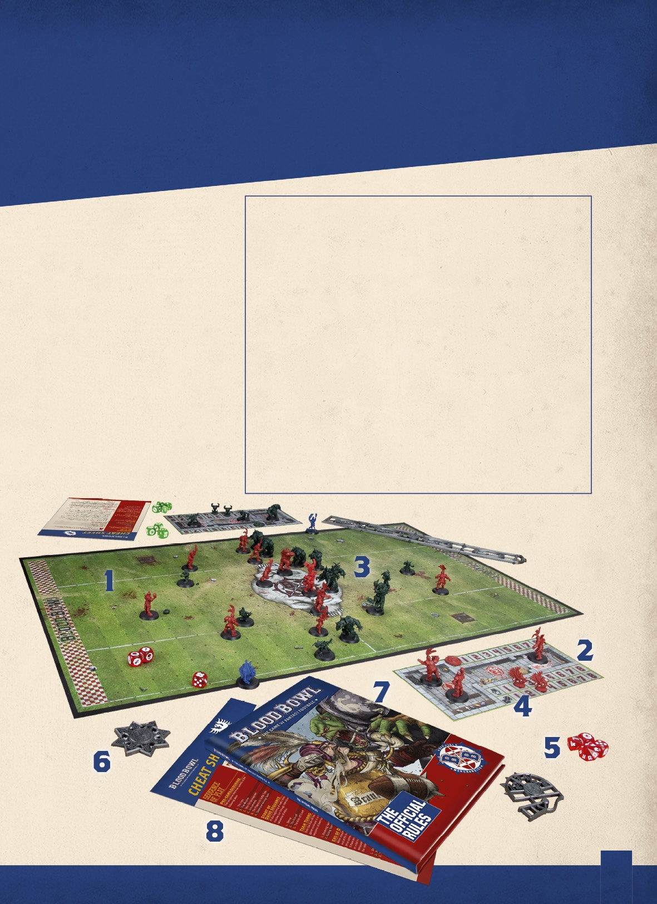

Blood Bowl is undeniably the greatest game ever played. Not only is it
the world's most popular game of fantasy football but, in the eyes of its
legions of loyal followers the world over, it is a game like no other:
tactical, challenging, emotional and, at times, outrageously funny!

To play a game of Blood Bowl, there are a few key items you will need.
Before exploring the world of Blood Bowl and the rules of the game in
further detail, let us take a look at a game in action and list the
vital components required:

*1. A BLOOD BOWL PITCH.* 

This is a foldout cardboard playing surface, marked out to emulate a pitch that might be found in the Blood
Bowl world.

*2. TWO CARDBOARD 'DUGOUTS'.* 
These are used to keep track of game information, as well as providing somewhere to place reserve or injured players.
*3. TWO TEAMS OF PLAYERS.* There are many teams available from

Games Workshop, representing the many different races that play
the game.

*4. TEAM TOKENS.* These are used to keep track of game information on

your team dugout.
*5. DICE.* The game of Blood Bowl uses regular six-sided dice, block
dice,

as well as eight-sided and 16-sided dice, to bring the action to life.
*6. RULERS AND TEMPLATES.* These are used for passing the ball,

determining where a bouncing ball lands, and so on.
*7. THE RULEBOOK.* The one you are holding is ideal! In this book you
will

findd the complete rules for the game of Blood Bowl.
*8. QUICK REFERENCE CARDS.* The Blood Bowl starter set contains

two Quick Reference cards, an ideal tool to be reminded of the game
sequence and frequently used tables.

**3**

## The History of Blood Bowl

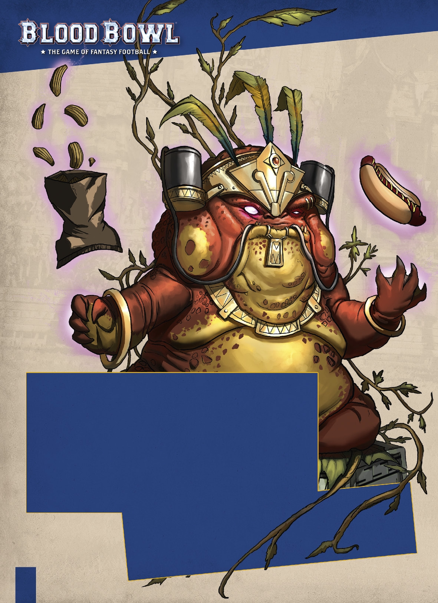

*Iood BowI has aIways been a part of our worId. The sacred tabIets of
LustrIa,* *oId beyond all human reckonIng, teII of a tIme when the
worId was young,* *when the mythIcaI 0Id 0nes and theIr servants, the
SIann, Introduced the*

*worshIp of Nuffele - the god of vIoIent sports - to the worId.*

*MIIIennIa Iater, the hIerogIyphs of ancIent Nehekhara teII of a tIme
when mIghty* *heroes of the sport pIayed and dIed, and were IaId to
rest In the grandest*
*mausoIeums theIr sponsors couId contrIve, there to IIve out eternIty
besIde kIngs In a* *tIme before beIng raIsed from undeath to pIay once
more.*

*THE HISTORY OF* *BLOOD BOWL*

**4**

## World Wide Sports Wide World

**A WORLD-CHANGING WONDER**

t all began more than a century ago, on a battlefieeld somewhere in
the
Old World. The blood-curdling enthusiasm of the morning had given way
to the relentless mundanity of slaughter and, as evening drew in and
the

skies darkened, the day ended with great losses on both sides.
Exhausted and frustrated, the survivors slumped beneath the circling
vultures. Fickle Madame Victory remained firrmly out of reach of
everybody - this battle was a draw. Mutual

exhaustion led to a truce being called, and the leaders of both sides
attempted
to parley.

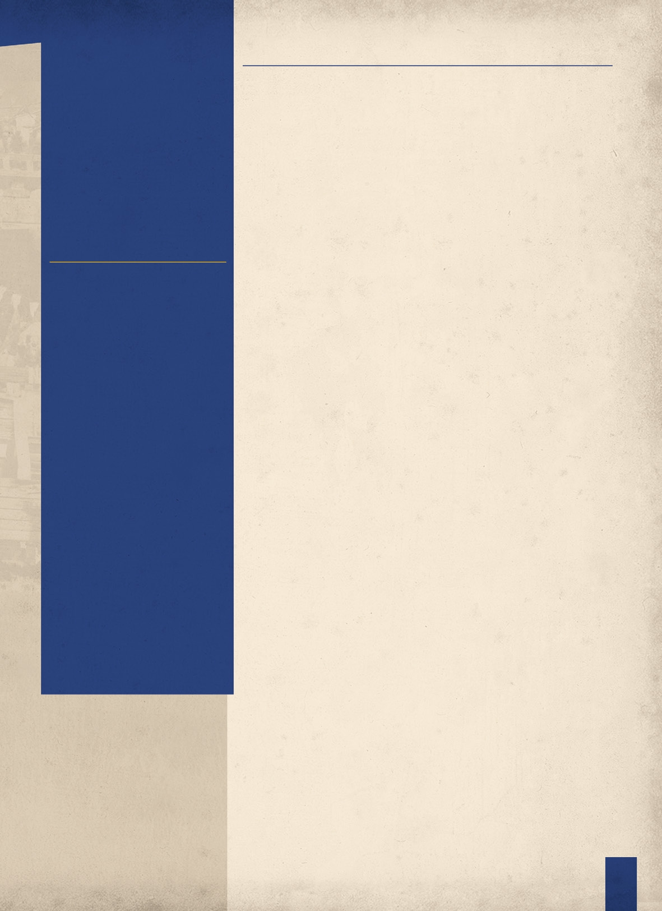

As their leaders squabbled, the troops rested, thankful for the
respite and looking forward to an early finishh to the campaign and a
decent, cooked dinner. Mungk, the leader of a small band of Orcs, was
sitting with his banner bearer, indulging in his favourite sport of
bogey-fliccking. Having won this absorbing competition with a deft
over-under move, Mungk waved his grumbling companion away. The Orc
leant back, wondering when this parley nonsense would be over. He

hroughout history, a keen eyed scholar can see evidence of
the great game being played,

of periods of peace and prosperity when war and strife were forgotten
and our differences settled on the fieeld

of sporting endeavour, as holy Nufflee ordained. But, sadly, such
golden ages have been few and far between. In
the past, the races of our world have been quick to take up arms
against
one another over the most petty and spiteful of disagreements. Dwarfs
and Skaven have warred over their shared subterranean world, Humans
and Greenskins have battled over ownership of the lands of the Empire,
and always there have been the argumentative followers of Chaos,
causing strife for their own amusement. Too often,
such differences have grown out of
hand and led to open and destructive warfare. Sadly, in such times
Nufflee,
who findss warfare and strife distasteful, quite literally takes his
ball away and abandons our world to its own devices, until such time
as the mortal races
are ready once more for the majesty of Blood Bowl..

gazed out over the battlefieeld, grinning at the piles of Dwarf corpses.
The battle had taken place in a bowl-shaped depression. At the southern
end of this stood a vast dome-roofed structure of a strange, silver-hued
stone, undoubtedly another of the many ancient constructions left from a
previous, more peaceful time. It was against this structure that Mungk
now rested his aching back.

Bored with simply sucking his teeth and motivated by a thunderous
rumbling in his belly, the Orc began scrabbling in the sodden earth in
the hope of findinng
a juicy earthworm or two on which to snack. It was then his
battle-blunted claws
hit something hard and smooth. He pulled, but to no avail. He scrabbled,
nothing happened. Then he pushed. Something went in, something else
clicked, and finally a third something let out an almighty hiss. This
third something was a forgotten door in the side of the ancient
building, which slid upwards to let stale, dry air pour from the dark
interior.

Mungk, who would have been in serious trouble with the washerwoman had
he been wearing any form of underwear, gazed goggle-eyed into the
glittering hall now revealed. Strange armour adorned the walls, peculiar
mosaics lined the flooor, and, at its centre, on a great bejewelled
pedestal, sat an enormous book..

Before long quite a crowd had gathered around Mungk, who was at once
proud of his discovery and terrifiedd of causing any bother (at that
time, the
usual Orc punishment for causing bother was a swift beheading, which
certainly discouraged repeat offending). Even as the crowd peered inside
the odd structure, examining the sights within and muttering about the
importance of the strange
book, the parleying leaders of the two great armies were being informed
of the Orc's peculiar discovery. Keen to grasp at any distraction, they
adjourned their fruitless negotiations in favour of the possibility of
better entertainment.

As the commanders and officcers gathered within the ancient building,
talk quickly turned to the ancient tome. Unfortunately, none present was
fluentt in dead

languages from antiquity and, though some refused to acknowledge this
failing and insisted upon giving their explanation of the strange text,
the assembly soon had to accept that they were out of their depth.
Messengers were dispatched with utmost

speed in an effort to findd some literate being who could reveal the
secrets the tome held. Eventually, an incredibly ancient, half-blind
Dwarf was proffered up as an expert in all languages, both modern and
archaic. The book was thrust upon the bewildered Dwarf who sat down
happily with his prize, cross-legged upon the flooor, and began poring
through its forgotten secrets.

**5**

Three days passed, during which time the Dwarf hardly moved from his
chosen spot. At last, he was ready

to make his report. A podium was hastily erected before the silver
temple, and the stunted fellow was hoisted
up onto a box behind it to deliver his findinngs to the assembled
multitude.

*"This book,"* wheezed the ancient seer, blinking
his heavy-lidded eyes a few times,
*"appears to be the* *religious text of a group of warriors who came
from a*
*land called Amorica. The book is dedicated to the lost god*

*Nufflee. The head priests of the various sects of this deity,* *known
as coaches, led their bands of warriors into great* *arenas and
attempted to exterminate each other. The*

*object was not, however, violence simply for violence\'s* *sake. No!
It was, in truth, of great ritual significcance!"*

There was a subdued murmur from the crowd
as they attempted to absorb this outlandish concept.

The Dwarf continued, *"A pig\'s bladder was inflaated and* *carried or
thrown from one end of the arena to the other,* *in an effort to, erm,
score. Carrying said bladder into an* *opponent\'s camp, or 'end
zone\', gave a sect a number of* *things called 'points\'*.

*"The battle lasted a set period of time. At the end,* *the sect that
had amassed the most points was declared*

*the victor. Apparently, you didn\'t even have to maim all*
*your opponents, although the coaches seem to have* *encouraged this
practice. Furthermore, the book states* *that, as Nufflee\'s sacred
number was 11, only 11 warriors* *from each sect could be on the
fieeld of battle at one time."*

At this there was a great deal of shufflinng in the Orc ranks as many
present removed their footwear in
a desperate attempt to findd out just what the number '11' was.
Typically, this degenerated into brawling once

a rather numerate Goblin who had kept his boots on discovered what a
great joy it was to stamp on all his mates' bare feet with his
hobnails. Ignoring the infrequent

howls of pain, the Dwarf continued..

*"This does not mean that there were only 11* *members of a sect, or
team, as they were also known.*

*Injured warriors could go off and be replaced by healthy* *'reserve\'
warriors, as long as the sacred number was not* *exceeded. One could
also hit an opponent at any time, as* *long as one did not use a
weapon! Nufflee said that one\'s* *body was one\'s weapon and,
although he allowed armour* *for protection and ornamentation, all
weapons of war*
*were forbidden from the arena. It is also written that the* *arena
for this conflicct was a rectangular fieeld, set within a* *huge
bowl!"*

**6**

All eyes turned to regard the shape of the battlefieeld in which they
had gathered, where large squadrons of over-stuffed vultures were making
feeble attempts to get airborne again. *"It seems to me,"* continued the
Dwarf
in a loud voice to regain their attention, *"that Nufflee has* *seen our
dilemma and is trying to resolve it. I suggest*
*that a team is put forward from each side, and that our* *differences
be resolved in this fashion."*

A murmur of assent rippled through the crowd, soon rising to a roar of
agreement; except, that is, for the corner in which the Goblins were
standing, since they were all still exploring the intriguing new
possibilities of foot-stomping!

And so it was that for the firrst time in many centuries, Nufflee's
Amorical Football (as the game was

called) was played in the Old World. A pig's bladder was inflaated, much
to the pig's consternation, we must add! Armour was taken from the
temple and placed on chosen warriors from either side. With the teams
lined up, a local shaman who had been pressed into service as a neutral
'umpire' and dressed in fresh zebra skin for the occasion, blew a
whistle and the game was away.

There was no proper pitch, no pitch markings at
all and very few rules beyond those which the elderly
Dwarf could hurriedly concoct from the confusing jumble
of text, and to this day no-one is quite sure who actually won. There
was a suitably large amount of violence and acrimony between the two
sides, however, and everyone agreed that they had really enjoyed the
activity, far
more than hitting one another with axes! The battle was forgotten, and
the various sides dispersed to carry the exciting news to their
homelands, where every tribe quickly rushed to fieeld a team.

It was while those who remained swept up the
mess that they discovered a strange green surface just

under the blood-spattered dirt of the battlefieeld, a surface engraved
with peculiar symbols and lines. Sweeping became excavation and soon the
fieeld was scrubbed
clean. The workers were hushed, aware of the significcance of their
findd. The sacred Gridiron spoken of in the book
was gazed upon by mortal eyes once more and for the
firrst time in many centuries, the evening sun cast long shadows across
this most sacred of places. The Dwarf
seer, who had adopted the name of Sacred Commissioner Roze-El, after a
priest of high standing mentioned in the book, offered a prayer to
Nufflee and began to organise and lay plans for the future..

**THE EVOLUTION OF SPORT**
R0ZE-EL AND THE
ESTABLISHMENT of THE NAF
With the firrst game of Nufflee's Amorical Football played
in the modern era, many of those present were enthused with an almost
fanatical religious fervour. Roze-El, himself feeling younger and more
energetic than he had in many years, hurried to put into motion the
grand plans that
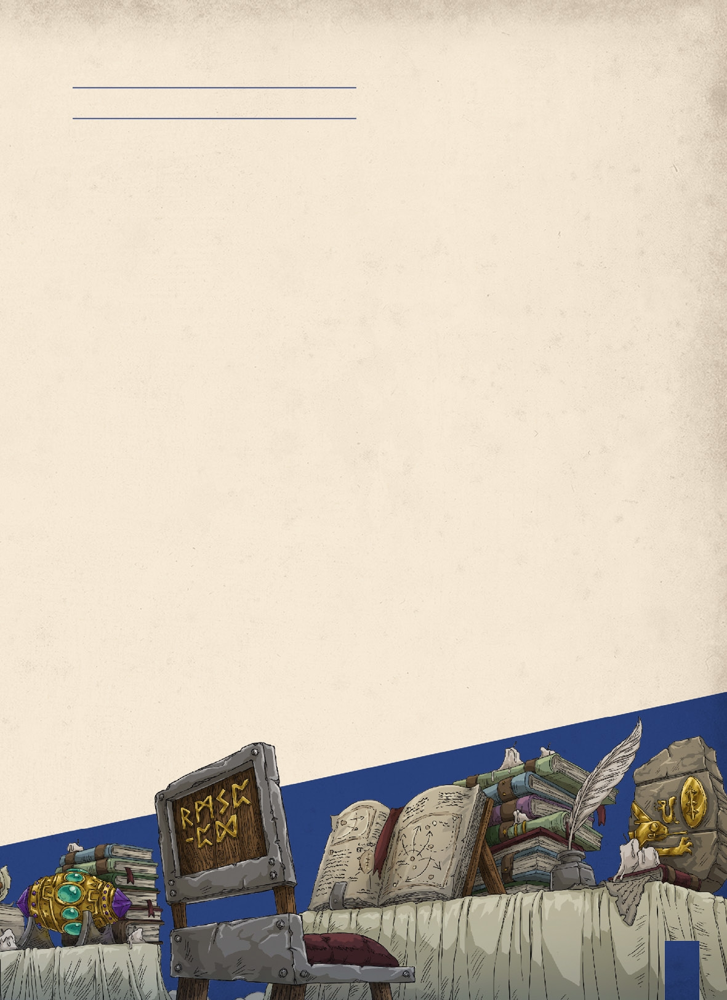swirled around in his mind and, with the
help of many others who would go on to become the sport's founding
officialss, the firrst days and weeks following Mungk's discovery saw
huge strides taken. Many years later,
Roze-El was to comment in his journal that, looking back,
it hardly seemed that the bold ideas were his own - he
felt afterwards that they came to his mind fully formed,
as if he was merely acting as a receptacle for Nufflee's greatness.
And perhaps this was true; perhaps Roze-El was speaking
prophetically - simply passing on the words of Nufflee as the great
god spoke them through his earthly servant? Or perhaps the influencce
derived from Roze-
El's endless and intimate contact with the sacred tome? Who after all
can say what power resides in a book, what thoughts and ideas the
pages hold trapped within, ready and waiting for an eager mind that
they may break free into the world?

Roze-El's firrst action as Sacred Commissioner
was to found the Church of Nufflee's Amorical Football.

Based within the ancient temple, the church would act
as a governing body over the sport and would help to spread word of
Nufflee's wonder far and wide. It must be noted here that the title of
'church' never really caught
on amongst the followers of Nufflee. Indeed, even within
a few short years the records show that the 'Church of N.A.F' had
become known to the public simply as the 'NAF'. Interestingly, to this
day the NAF is still classed as a church, complete with all the
associated tax benefitts..

During his time as Sacred Commissioner, Roze-El prioritised firrstly
the proper translation of the rules of his

game and secondly to the spread of the word of Nufflee.
In terms of his firrst goal, Roze-El made great strides in both
recreating Nufflee's original rites
and fillinng in the gaps.

In the darker recesses of the temple, piles of remarkably well-preserved
pamphlets and scrolls were found, giving further details of the ancient
game's rituals. A team
of seers and scribes was set to work translating and retranslating
these, until a vast body of knowledge was assembled. These, together
with a few liberal scoops of ficction and a bit of imagination, quickly
helped clarify the rules of the game. Soon, games were being played
within set time limits and on properly-marked pitches.

Roze-El's second goal largely took care of itself. Word of Nufflee's
Amorical Football spread far and wide as

if carried by the wind. In the days and weeks that followed that firrst
game, delegations arrived at the temple, drawn there by news of the
event from cities and states the Old World over and representing many
different races. Early fears amongst the scribes and scholars that had
set up within the temple, that such a gathering would result in
hostility, proved unfounded. It rapidly became clear that the lure of
this new sport was such that even the most bitter of enemies would
sooner learn the rules of ritual engagement than draw up battle lines.
The races of the world seemed willing as never before to unite in ways
previously undreamed of.

By the time of Roze-El's death at the grand old age of 196, there were
16 sects or, as they were commonly coming to be known, teams, competing
in a season which culminated in the glorious excesses of the Blood Bowl
finall - the annual championship game that quickly gave
its name to the sport as common folk far and wide came to call the game
itself 'Blood Bowl' and the governing
body under Roze-El the 'NAF'. These teams represented men of the Empire,
Norsca and further afieeld, Dwarfs
of the Worlds Edge Mountains, Orcs and Goblins from
the Badlands, Skaven from the Under-Empire, Elves of Ulthuan and more.
With his legacy secured, Roze-El went peacefully to his rest, leaving
behind him enough notes, jotted-down suggestions and unfinishedd journal
entries to keep his successors busy for centuries!

**7**

DJIMM TH0RP AND THE ofFICIAL B00K of RULES After the passing of
Roze-El in 2375, stewardship of the NAF fell to one of his most able
and trusted assistants, Djimm Thorp. Djimm took up the role almost
seamlessly after the death
of the old Dwarf, but wasn't formally
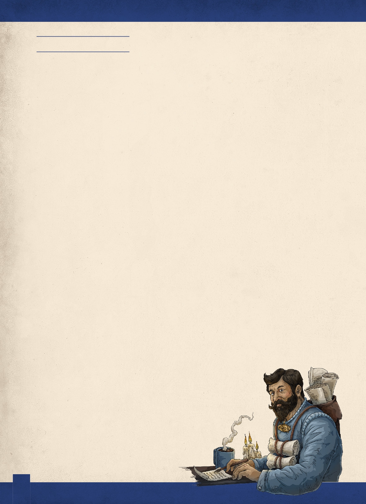recognised as Sacred Commissioner until
2378. The reason for this
seems to have been due to the ever expanding workload piled upon
Djimm and his growing staff of NAF officialss. Basically, everyone was
just too busy to create and perform a suitable investiture ceremony.

As the sport's popularity continued to increase at an exponential
rate, there were many problems to address. Various races and nations
took to developing their own unique rules of play based on their own
preferences. Others found themselves playing a version of the game
that differed greatly from Roze- El's translations. Mostly this was
due to it being quite normal for the rules
to be taught to newcomers by word of mouth, creating huge variety in
how things were done and, quite often, important aspects of the game
being left out altogether. For the most part, as new teams sprung up
in towns and villages to play amongst themselves, this didn't matter.
But when teams belonging to the NAF championship circuit began to
interpret the rules differently at the sport's highest
levels, problems arose. For example,
a match between the emergent Dwarf Giants and the Reikland Reavers
in the year 2399 almost led to the outbreak of war when neither side
could decide whose version of the rules to use.

Among the worst offenders were Dwarfs, who felt that because

Roze-El had been a Dwarf they had an implicit right to change the
rules as they saw fit.. But the problem

wasn't limited to Dwarfs; Greenskins tended not to care about the
officiall

**8**

rules at all and would play the game as they saw fit,, changing it from
day to day, whilst Skaven would deliberately misinterpret the rules so
that they could gain an advantage. Humans proved capable of starting an
argument about the intent behind the rules versus the rules as written
even when locked alone in an empty room. Even the noble High Elves of
Ulthuan rewrote the rules to suit, making contact between players all
but illegal!

Djimm Thorp came under immense pressure to address the

ever increasing problems caused
by such nonstandard rules interpretations. Agreeing that something
needed to be done,
Djimm set up a committee to
work on creating the formal, NAF approved rules of Blood Bowl. The draft
went through many different versions as scribes worked to unlock the
mysteries of Roze-El's many notebooks, and each draft was extensively
reviewed by referees and match officialss. By 2409 the finall draft was
complete and the NAF was able to publish the firrst formal and officiall
set of rules that all leagues and tournaments could adhere to. Within a
few short years, the way the game was played in different parts
of the Old World had become, if not uniform, then at least similar!

Of course, this firrst version
of the rules was not to last as, arguably, it was rubbish. Over the
following decades the rules changed and evolved further to account for
many unexpected situations that arose. Several variants of the officiall
rules appeared as well, including both Blitz Bowl and Sevens; two
amateur versions of the game
played by hopeful rookies competing in the annual Crush and enjoyed
by youth teams everywhere to
this day. Dungeon Bowl also
proved popular; a version of
the game developed for the

Colleges of Magic to use in their
many underground stadia. This allowed small winter leagues and
tournaments to be hosted in nice warm dungeons, away from the bitterness
of the Old World winter. Most importantly, this enabled ticket sales to
flourrish all year round. Many scholars even suggest that the original
draft of the now-outlawed Street Bowl - a highly violent version of the
game played in narrow streets and back alleys - was originally penned as
an officiall set of rules. This is disputed by city watch garrisons the
Old World over, who insist it is just common criminality amongst the
underclasses that causes Street Bowl to be played.

The finall piece of the puzzle
with regard to the officiall NAF rules

fell into place with the establishment in 2414 of the Referees and
Allied Ruleskeepers Guild (the RARG). This independent body, also
established
by Djimm, worked alongside the NAF
to enforce the rules of the game and deal with any oddities that arose.
In time, almost all match officialss came
to be members of the RARG. This benefittted the professional game no
end, not just because RARG members must prove an intimate knowledge of
the most up-to-date rules, but also because the guild set strict rules
in place regarding corruption amongst
its members. To this day, members must adhere to a universal price list,
ensuring that the cost of bribing an officiall is always fair!

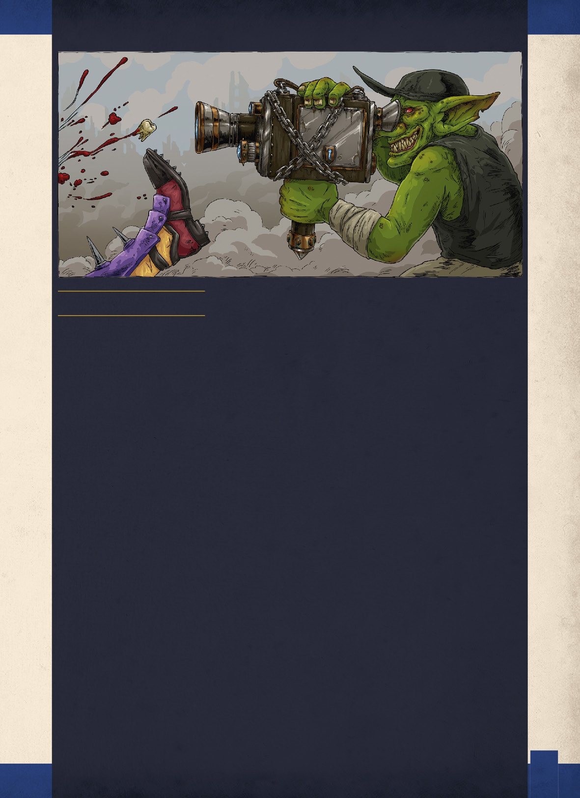

J0RGE HELLH0UND AND
THE C0RP0RATE ERA
The tenure of the infamous Jorge Hellhound followed the retirement of
Djimm Thorp in 2429. Hellhound is known for many things, but mostly
for his brilliant commercial mind. No one could work towards the
realisation
of a noble dream, an endeavour that would improve the world for ever
more, before selling that glorious vision and the hard work of many in
favour of quickly pocketing a few gold coins quite like Jorge
Hellhound!

Two innovations that would change the world marked Hellhound's

stint as Sacred Commissioner, and both of them were monetised with
incredible enthusiasm. The firrst
was the creation of the CAMRA
and Cabalvision. This came about when Hellhound realised that he
could sell far more tickets for games than he could ever hope to pack
spectators into any stadium. And so
he contacted the various Colleges
of Magic, asking them to findd a way
to transmit an image of the game
all over the continent. The result
was a spirit bound into a magic box.
To this day, the technology remains unchanged; the bound spirit is
allowed to look out of their box in

one direction only, through a glass porthole, and what the spirit sees
can be transmitted by teams of magicians to magic mirrors and crystal
balls
the world over. This quickly became known as 'broadcast Cabalvision'.
Anyone could buy a licence to have games, and other shows, broadcast
into a magic mirror or crystal ball
in their own home. The idea was a huge success!

Hellhound's second notable innovation was the introduction of a format
change that allowed for

the adoption of several major new sponsors ahead of the 2460/61 season.
By this time, the NAF was running a league of no fewer than 40 teams.
Hellhound split these into two separate 'conferences' of 20 teams, each
further split into four 'divisions'
of fivve teams. Over the course of the regular season each team would
play eight games, facing each of the other teams in their division
twice. Upon
the completion of the regular season, the top team from each division
would progress to the play-off season, where they would play seven
games, facing each of the other teams once. From there, the top four
teams would move into the championship season, consisting of a
semi-finall, third

place play-off and the Blood Bowl Championship itself.

Each division, conference and season, Hellhound figurred, could
be sponsored by an interested
party, with the overall competition and the championship season being
sponsored by the highest bidder.
He was right, and the cash began
to pour in!

With this new format in place, Hellhound began to sell the rights to
broadcast each division and season alongside the rights to cover
different

friendly games and various minor leagues and tournaments. By the time of
the 2461 Blood Bowl Championship game, sponsored by Bloodweiser,
Cabalvision was being broadcast to literally hundreds of the Old World's
richest homes and dozens of the most upmarket hostelries. The Blood Bowl
finall itself was broadcast by Channel
7, in exchange for the princely sum of 714 gold pieces. At the
culmination
of the championship, even as the Darkside Cowboys became the firrst team
to lift the brand new Blood Bowl trophy, Hellhound famously declared,
*"We\'ve made 80,000 gold pieces*
*this week! We\'ll never make so much* *money in a week again!"*

**9**

NIKK THREEH0RN,
GREED AND SCANDAL
In spite of all his failings, Jorge Hellhound was hugely successful
as Sacred Commissioner and ever popular with the fans. Consequently,
his tenure in officce was a long one.
Yet time is unconcerned by popularity
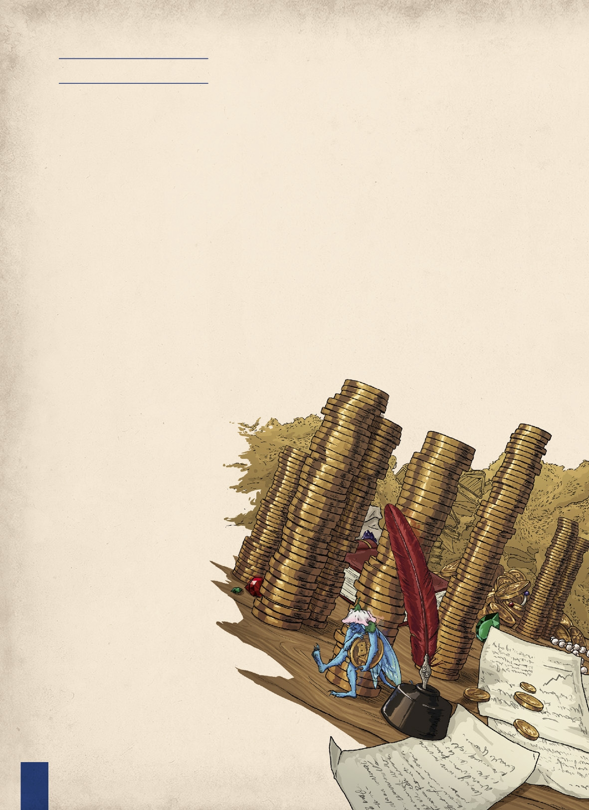and in 2477, after a staggering 48 years
in officce, Hellhound retired his position by dying of old age. He was
succeeded by an eager young priest
of Nufflee named Nikk Threehorn.
Over the course of his short career, Threehorn had proved himself both
a hard worker and an able assistant to the ageing Hellhound. His
knowledge of the inner workings of the NAF and its various satellite
organisations through relationships carefully born and nurtured by
Hellhound made him seem a natural choice as successor.

Sadly, it soon became apparent that Threehorn differed greatly from
his predecessor in a few key areas. Where Hellhound was undoubtedly
avaricious, his focus remained firrmly upon the betterment of Blood
Bowl.
All of his money-making schemes shared a common theme: the benefactor
was always the game. Certainly, Hellhound and his staff profitted
greatly, all were well-paid
and lived luxurious lifestyles, but ultimately the money raised was
ploughed back into the organisation and into the sport.

Threehorn, by contrast,
proved to be greedy and selfishh.

He quickly showed that he didn't
like sharing credit with others
and at every opportunity would accept the plaudits for the hard
work of his underlings and even
his predecessors. In addition to upsetting many colleagues, during
his firrst few years in officce the Cabalvision networks found the
cost of licenses to broadcast matches
rose exponentially, doubling again and again as the season progressed.
This caused the cost to viewers

**10**

to rise in turn. Inspired by this,
many stadium owners and teams increased the price of tickets on the
gate. Similarly, prices at concession stands and the cost of merchandise
rose sharply. In response, teams on the NAF circuit began demanding more
from the stadia and from their sponsors in order to pay the inflaated
salaries and transfer fees players were suddenly demanding.

As reported at the time by *Spike!* *Magazine*, within just four
seasons
the amount of gold it cost the average fan in the slum to attend a match
had increased from a barely affordable
fivve pfennigs to a truly extortionate
75! By contrast, the salary of the average player within the NAF had
risen from a few hundred gold pieces
to more than 30,000! Yet still the money floowed in and, in spite of the
vastly inflaated wages of players and

other support staff, stadium owners, sports promoters and, ultimately,
the NAF itself were still collecting the lion's

share of the profitts.

Many of the industries that
had sprung up around the sport soon

realised that these new economic demands couldn't be sustained
by ticket sales and Cabalvision contracts alone, and as long as the NAF
was making such huge financiall demands, others were going to emulate
them. Many sponsors happily stepped up, paying ever more to get their
logos seen on team kits and around stadia. Sadly, for the average fan,
this spending just caused the price of goods to rise. Cabalvision
networks began to look elsewhere
for programming to entice viewers, leading to an explosion in the number
of chat shows and theatrical dramas being broadcast.

Even the game of Blood Bowl had to adapt in order to keep drawing

the ticket sales and Cabalvision viewers. The early to mid-2480s saw
an explosion in on-pitch violence. Alongside fresh and exciting
innovations, game wizards made a resurgence in popularity at the
pitch- 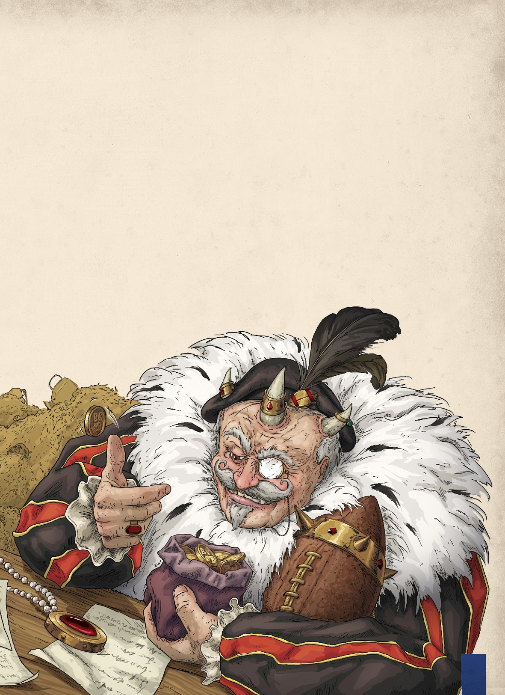side, the fees charged by the Colleges
of Magic suddenly seeming not so extortionate. Chief among these fresh
innovations was the mechanical contraption, cunning inventions
introduced in great numbers to add even more bloodshed to the on-pitch
action. The most notable of these modern wonders was the chainsaw,
which proved by far the most
popular and iconic of the era. The gridiron quickly became a deadly
place as players were decapitated
and eviscerated in huge numbers. There was even a brief period in
2486 when every game played in
the month of Pfluugzeit ended 0-0

as the teams playing, made up entirely of chainsaw-wielding loonies,
forgot about the ball and focussed exclusively on the violence!

For many, the commercial successes of the 2480s were considered a
glorious era of excess. But not everyone was happy.

Several teams were dismayed
by shrinking crowds and the changing

face of the sport. Many famous
stars of the gridiron even spoke out
in interviews about the hardships endured by fans in order to see their
beloved team play. Amongst the
most outspoken critics of the NAF
was Jeremiah Kool, captain of the Darkside Cowboys. Not only was
Kool lauded by many as the greatest player in the history of Blood
Bowl,
but the Cowboys more than any other team enjoyed the patronage of a
powerful individual. The Witch-King

of Naggaroth himself was said to be quite fanatical in his support of
the Cowboys. Kool then, surrounded as he was at all times by members of
the Witch-King's own Black Guard, could say as he wished, and say it
he did, often.

Kool warned that such
excesses couldn't be sustained, that

sooner or later the NAF would swallow itself so great was its greed, and
that the future of the sport lay in open competition rather than a
bloated church and cheap sensationalism.
And Kool went further, calling out
Nikk Threehorn, reminding him that Blood Bowl was about the worship
of Nufflee, not gold, and stating that, sooner or later Threehorn's
luck
would change, for Nufflee was not a deity with whom to mess!

**11**

Threehorn scoffed at such warnings but for many within the sport,
Kool's words blew oxygen on

a tiny ember of resistance. The era
of the chainsaw-wielding looney was quickly ending, due mostly to the
self-infliccted extinction of the very players that made it possible.
Too many talented young players had not
survived those blood-soaked days, whilst the older and wiser players,
the megastars of the game, had opted to take a step back from the
pitch. Many of these players were returning now, re-emerging onto the
astrogranite
once more and often in the company of fresh, young and, above all,
talented rookies eager to make their debut. Many of these players were
accepting lower salaries in order to
get a place on a team. Many smaller leagues and tournaments were now
competing with the NAF for talent, attracting players that had been
driven away by the NAF's faceless corporate greed. Large numbers of
fans were turning to these smaller competitions to get their fixx. For
a fraction of what it cost to purchase a NAF ticket, fans could buy a
season ticket to follow a local team in a regional league. As the
standard
of play in these circles improved,
many began to argue that they were becoming the superior of what the
NAF had to offer.

**12**

At the opening of the 2487/88 season, the industry could sense a change
in the air..

On the pitch, it was business as usual for the NAF. The regular season
unfolded largely as expected with

the season's favourites from each conference progressing easily into the
play-offs. Off the pitch though, things were different: ticket sales
were down and Cabalvision viewing figurres were falling. The media was
giving ever more attention to smaller leagues
and independent tournaments. At the start of 2488, as the regular season
drew to a close and the play-off
season opened, the *Altdorf Herald* shocked the world by giving both
their back and front page headlines to the exciting events in the Worlds
Edge Superleague. The opening round of
the NAF play-offs was relegated to page three.

Complaints piled up against the NAF. Stadium owners were distressed by
falling attendance
and the networks were making unhappy noises about the high cost of
broadcast contracts. It seemed like something was going to have to
change, and change it did, but not in the way anyone expected!

The 2488 Championship season kicked-off with all the usual

pomp and ceremony, and the stands of the Emperor Luitpold I Memorial
Stadium in Altdorf were packed to capacity. On the finall day, in front
of dignitaries from all over the known world, the Darkside Cowboys and
the Reikland Reavers lined up for what was to become a momentous game,
not just for the on-pitch action, but
for the scandalous events that would unfold. With the action tied at
1-1,
the game paused for halftime and
the legendary entertainment that entailed. As the band struck up to
welcome the cheerleading squads of both teams, something was not right.

The Reavers cheerleaders, the Reaverettes, rushed onto the pitch to the
roar of the crowd, but alongside them, where the crowds expected to see
the world renowned cheerleading squad of the Darkside Cowboys,
the Shadows, there was nothing but empty turf.

As the Reaverettes pushed
on with their show, a great tumult

erupted behind the scenes. Staff
and officcials hurried to findd the Shadows, but their changing rooms
were empty. Panic set in and ever more senior priests of Nufflee were
drawn into the fluurry of activity.
Before long, the service tunnels surrounding the pitch and the corridors
of the corporate hospitality area were crowded with shouting staff. By
the time the news reached the very top, everyone had realised things
were more wrong than firrst thought. Not only were the Shadows missing,
but of Nikk Threehorn there was no sign either..

It was quickly established
that Threehorn's luxury coach was

also missing. Further investigations revealed that, at the temple of
Nufflee, the coffers of the NAF had been raided. The lovely money,
plentiful
and content in its warm vault that
very morning, had vanished.

Keen to avoid panic, officialss restarted the match after halftime,
and the Cowboys showed tremendous

strength of character, rallying to overcome the Reavers 3-2 in the
dying moments. The remaining
NAF officialss present attempted to carry on as if nothing untoward had
occurred, but news as momentous as this could not be expected to remain
secret. The prize-giving ceremony and subsequent press conference was
dominated by questions about what had unfolded. The answer, though,
was painful in its simple truth: no
one knew..

FALL0UT AND C0LLAPSE
With the Sacred Commissioner seemingly vanished in the company
of the Shadows and rather a lot
of money, the traditional period of downtime following the Blood Bowl
was rather more frantic than in past years. The NAF itself was shaken
to
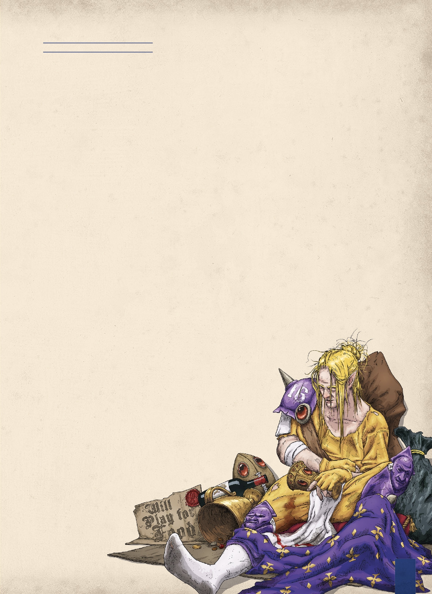its very foundations, and an all-
encompassing panic quickly took
hold of all levels of the organisation. Being suddenly leaderless was
one thing, but being suddenly without
pay caused many a loyal priest of Nufflee to question their
priorities. Matters became worse when the biggest Cabalvision network,
ABC, withheld payment. And it was only the firrst of many. In truth,
this happened every year; all the networks dragged their feet when it
came to paying
their dues. This year it was a bigger problem; without any income the
NAF couldn't pay any of its outgoings.

rd of Brauzeit
in 2488, the NAF simply shut down.

Without any fanfare, with barely
even a word to any of its member teams or associated organisations,
the NAF ceased to exist. One day,
it was there, struggling to function
but still attempting to liaise with its many partners to run the sport
of Blood Bowl. The next day it was gone. The only comment anyone
could
draw from the remaining priests
as they huddled behind the now- locked doors of the temple of Nufflee
was, *"It is not the job of the Church*
*of Nufflee to run the sport for you,*
*and we can\'t imagine why anyone* *would think otherwise!"*

Understandably, this development took a moment for

the world to process. The temple
of Nufflee was in essence telling the world that it was done and
finishedd;
it was washing its hands of the whole thing. Just like that, the sport
of Blood Bowl had been cut loose from its governing body.

This realisation caused chaos
to descend. The Cabalvision networks

were faced with a sudden, and in some cases almost complete, lack
of programming. The 40 biggest
and most famous teams in the
world found their very reason for existing snatched away overnight.
Hundreds of other teams thought
their leagues cancelled. Dozens upon dozens of stadium owners believed
their diaries were suddenly very
clear. Season ticket holders thought their investments wasted. Tens of
thousands of support staff employed by teams, stadia and even the NAF
itself found themselves unemployed
at a stroke. The economic repercussions were profound and
far reaching. Many economies would simply collapse without Blood Bowl.
Many institutions the population had grown accustomed to would tumble
down in sympathy. Many workers would starve..

Within days of the news breaking, the mightiest cities of the

Old World were overrun by rioting
and looting. Worse, governments
and rulers were falling out as treaties

trembled on suddenly very unstable foundations. Sabres were being
rattled and shields banged the
Old World over.

No one is quite sure who firrst saw sense and proved to the world that
Blood Bowl hadn't died with the

NAF. It was certainly NBC that firrst announced they would replace much
of their planned Blood Bowl content with coverage of another
competition; the long established and ever-popular Elven Kingdoms
league. NBC wasn't alone in doing this, however, and
many believe the firrst contract signed directly between a minor league
and a Cabalvision network upon the collapse of the NAF was that between
Channel 7 and the Orcidas Team of the Year league.

Ultimately, such details are unimportant. What matters is that,

within quite a short space of time, the Old World was reminded that it
still had Blood Bowl. The collapse of the NAF didn't take the game
away,
it merely meant that the NAF season and Championship was a thing of
the past.

**13**

THE AFTERMATH
At the time of its collapse, the
NAF was home to 40 teams in two conferences. These were easily the
largest, most successful and most famous teams in the known world,
representing the 16 original sects founded by Roze-El, which had been
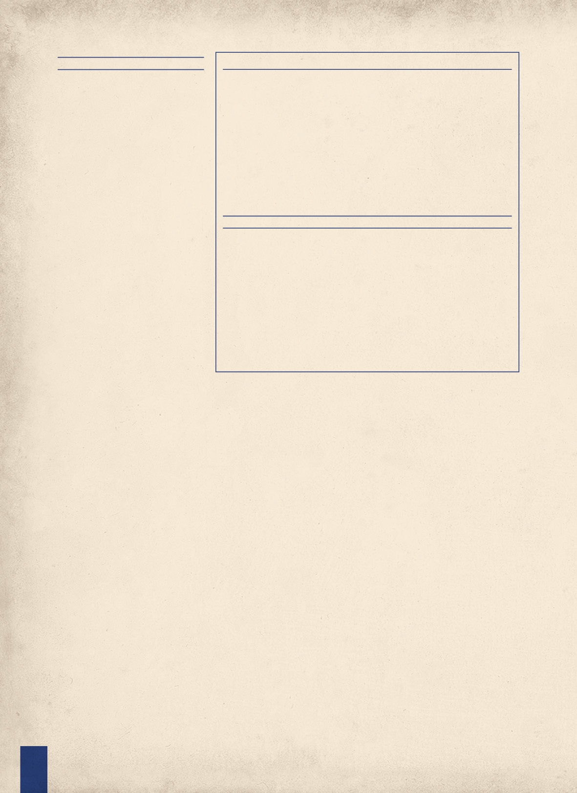joined over the following century by
worthy contenders from across the Old World.

The realisation that other leagues and tournaments existed

and would carry on largely unaffected didn't help many of those teams
that had been part of the NAF tour very much. They were still reeling
and
bereft of a home. In panic, many
sold their stadium and quite a few folded as staff and players were
laid off. Among the immediate casualties were the Everbold Unicorns,
the Southstorm Squids, the Hobgoblin Team (whose board of directors
quite literally stabbed one another in the back), the Icecastle Wolves
and the

NFC C0NFERENCE
*NFC CENTRAL:* Darkside Cowboys, Everbold Unicorns, Evil Gits,
Athelorn Avengers, Greenfieeld Grasshuggers.

*NFC NORTHERN:* Vynheim Valkyries, Dwarf Giants, Nurgle's Rotters,
Asgard Ravens, Lowdown Rats.

*NFC EASTERN:* Dwarf Warhammerers, Skavenblight Scramblers, Creeveland
Crescents, Southstorm Squids, Bluebay Crammers.

*NFC WESTERN:* Orcland Raiders, Galadrieth Gladiators, Lustria
Croakers, Worlds Edge Wanderers, The Hobgoblin Team.

AFC C0NFERENCE
*AFC CENTRAL:* Reikland Reavers, Gouged Eye, Naggaroth Nightwings,
Underworld Creepers, Bifrost Berserkers.

*AFC NORTHERN:* Champions of Death, Middenheim Marauders, Arctic
Cragspiders, Albion Wanderers, Icecastle Wolves.

*AFC EASTERN:* Chaos All-Stars, Oldheim Ogres, Bright Crusaders,
Khorne's Killers, Scarcrag Snivellers.

*AFC WESTERN:* Elfheim Eagles, Westside Werewolves, Dark Renegades,
Stunted Stoutfellows, Bruendar Grimjacks.

Westside Werewolves. Teams with
long and storied histories all, but
sadly all sharing a few commonalities: huge debts they had only been
able
to service thanks to the NAF, and an over reliance on the structure
and order of NAF competition. The owners of these teams were forced to
break apart and sell their assets as debts were called in and
creditors began making demands.

The Nurgle's Rotters and Bifrost Berserkers were also casualties of
this period. Struggling to fill their
fixtture list, Nurgle's favoured players found themselves unwelcome
in
any of the smaller leagues, their reputation as virulent spreaders of
plague working against them. They were forced to travel far and wide
looking for matches. What became
of the team is something of a
mystery - all that is really known is that they vanished in Norsca and
are presumed to have perished whilst crossing a glacier on their way
to play

**14**

a friendly fixtture against the Arctic Cragspiders. The Bifrost
Berserkers,
by contrast, found themselves subject to an extremely hostile takeover
by several Ogre teams when they attempted to join the Mountains of Mourn
Mega-maul league. Rumour
has it that, to this day, several Ogre teams originating from that
region still keep captive Giants taken prisoner when the Bifrost
Berserkers squad
was forcibly broken up. It is widely thought that, in Ogre culture
(such
as it is), these prized captives are
used as Big Guys, in a grim mockery
of the way in which teams from the
Old World often employ Ogres as
Big Guys.

Some teams struggled but managed to persevere; everyone knows the story
of the Naggaroth Nightwings and their merger with the

Naggarond Nightmares. This was
not the only team forced to merge with another in order to survive.
The Middenheim Marauders likewise

had to partner with the Middenland Maulers to avoid liquidation.
In contrast, both the Galadrieth Gladiators and the Elfheim Eagles
took on a string of fresh investors
after offering to let any Ulthuan noble who wanted to play Blood Bowl
play
for them in return for a cash injection. This saved these teams, but
caused the very players that had made them successful to seek employment
elsewhere as they refused to train alongside wealthy but untalented
novices (never let it be said that those players who quit to found the
Elven Union teams are snobs!).

Other teams that had belonged to the NAF fared better.

The Champions of Death, in particular, adapted well. Coach Tomolandry
had no qualms about pushing his already dead players to the limits of
their endurance
to enter many small competitions in order to survive. This strategy was
emulated by the Bruendar

Grimjacks. Somewhat fortuitously(!), the Grimjacks had recently come
to be classed as 'Necromantic Horror' rather than 'Human' by
the NAF following a coach crash
in the province of Sylvania (the
crash had only been the start of
their problems; it was the long hike
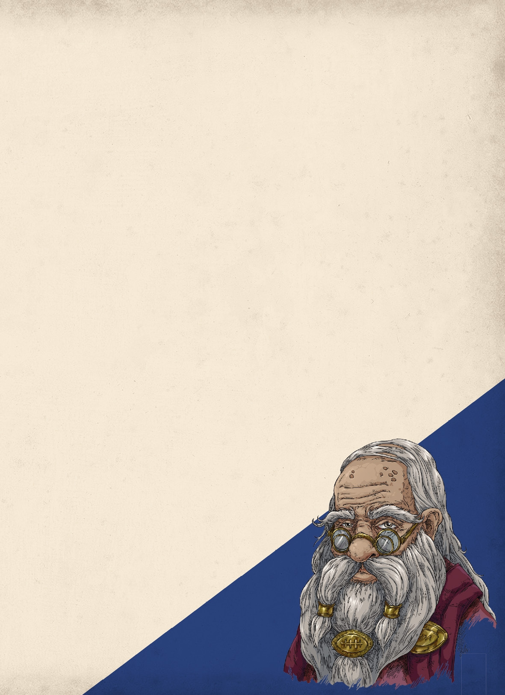back to civilisation through haunted
woods and over spooky moors that really bit!).

The Greenfieeld Grasshuggers and Bluebay Crammers simply opted

to stay at home in the Halflinng Moot.
In truth, their commitments to the
NAF competition had long been a secondary concern to the Moot's own
Thimble Cup (where the catering was markedly better) and they were
happy for an excuse to take it easy. Similarly, the Lustria Croakers
had treated
the NAF as something of a novelty
and were quite content to return to
the Lustrian Superleague (a league which, incidentally, denizens of
the Old World and fans of the NAF have been quite slow to realise is
the oldest and richest in the known world; the Lustrian Superleague
has operated almost undisturbed in the secrecy of Lustria since the
time of
the Old Ones).

The Darkside Cowboys glided seamlessly from the destruction.
They had a well-developed training programme and an established
academy. Drawing upon this they
were able to fieeld extremely talented and professional second string
squads in several tournaments
even as their firrst team focussed
on contesting the Elven Kingdoms league. This, combined with Kool's
retirement to head up the Underearth Academy of Offensive Magic and
his own Kool-Kids training academy, saw the Cowboys in finee form and
able to adapt with barely a fliccker of emotion for the lost glory of
the NAF. That every single member of the Shadows had returned home by
the

end of 2488 to retire in comfort has largely gone without comment. Where
the vast sums of money that were invested into Blood Bowl in Naggaroth
at this time came from isn't really a suitable subject for this treatise
on sports history..

Several other teams with considerable wealth to invest were

quick to emulate the Cowboys.
Notably, these included the Reikland Reavers, the Skavenblight
Scramblers and the Dwarf Warhammerers; all teams with established
training programmes and all able to
fieeld multiple squads in multiple competitions. Interestingly to some,
all of these teams seem to have been making preparations for the fallout
of the NAF's collapse before it actually happened. Certainly during the
downtime between the 2488 Blood Bowl Championship and the start of the
2488/89 season, the Reavers entered their youth and second string teams
into more tournaments than they had done in any year previously.

Still other teams were reduced to travelling the Old World like bands of
mercenaries. Coaches and players were goaded and guided by agents,

accepting or issuing challenges
to other such teams when the opportunity arose, making ends meet from
the meagre winnings available from performing for the crowds they could
attract. These teams, among them the Vynheim Valkyries, the Creeveland
Crescents, the Orcland Raiders and the Arctic Cragspiders, quickly
earned the pejorative title
of 'pot hunters'. Brutal professional teams suddenly cut loose

*Sacred CommIssIoner* *Roze-EI*

from the strict behavioural codes of the NAF, these teams would issue
friendly challenges to local amateur outfitts for exhibition matches, an
activity which invariably drew a large home crowd. Many an eager amateur
team received a terrible mauling in
this way when it became apparent mid-game that the professionals were
less interested in a fun spectacle and friendly competition than they
were
an easy win and collecting the prize at whatever the cost to their
opponents. Sadly, the actions of these teams
gave confidencce to others. Soon
there was quite an epidemic of
serious teams from the minor leagues copying these underhanded tactics
and entering amateur competitions to secure an easy win. It is the
actions and conduct of these teams that
must remind fans what a truly dark time this was for the sport. In
spite
of many rays of hope, the NAF left behind a great void, and the populace
at large felt its absence keenly, many fans became disenfranchised with
Blood Bowl after witnessing a brutal
no contest game having parted with a substantial sum to secure a ticket.

**15**

THE 0PEN ERA AND THE REBIRTH of THE MAJ0RS With the collapse of the
NAF many stadia came into the possession of new owners. Some quite
famous venues changed hands for discount prices due to teams
disbanding
and the panic caused by the lack
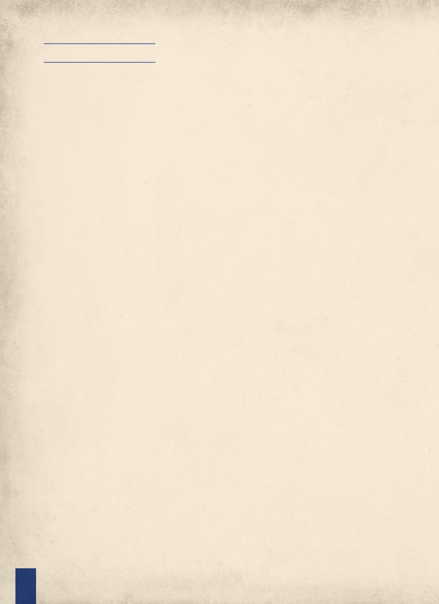of NAF fixttures. These new owners were
often fresh to the industry and unsure of their next steps. Therefore
many would invite teams along to
play one-off games for whatever prize could be arranged. Such games
were promoted by stadium owners and player agents, the former keen to
recoup some cash, the latter often struggling to justify their fees in
the post-NAF world and eager to prove their continued purpose.
Commonly, the proceeds of ticket sales on the gate would be split
between these organisers and the prize pot available for the teams.
Though initially successful and popular, such stand- alone fixttures
soon fell prey to the cruelty of the pot hunters.

It was not long before the Cabalvision networks and major

sponsors who had supported the
NAF began plotting together. The
plan was simple, to capitalise on
these luxurious stadia and their naïve

owners by arranging more formal tournaments with large prizes for the
teams that managed to battle their way through to the finall stages.
It was hoped that, in addition to increasing the profilee of select
minor leagues,
a series of grand tournaments throughout the year could better enthral
the fans the way the NAF had done for so long. The networks and
sponsors had seen the chaos caused by the closure of the NAF and, in
spite of the many other competitions around the globe, they lamented
the demise of such prestigious a competition. They sought only to

**16**

make changes for the better and
to reinvigorate the sport for players and fans alike (or so they said
during press conferences). In truth they had seen stadium owners getting
rich
from their large share of the ticket sales and concession stands income
and had struck upon a way to get
their own portion. In this brave new world, free from the NAF's constant
fees and strict governance in the way competitions should be structured,
new ways were quickly being discovered to make a fast buck at the
expense of the fans and the players.

The new owners of many large stadia were delighted as hosting a
tournament resolved a couple of recurring problems. Firstly, it meant
several games taking place in quick succession rather than one every few
weeks, even months, and the trouble of promotion and advertising fell
on the shoulders of someone else. Secondly, it lessened the threat of
the pot hunters as the later stages of a tournament would see teams of
more or less equal ability and experience facing one another. Fans
floodedd
back, delighted that the spectacle
had returned. Teams were lured in by the prospect of much bigger payouts
than were available on the open road and in provincial matches. Everyone
was a winner.

Four championship tournaments quickly emerged as being the most
important and eagerly anticipated events among both fans and players,
backed as they were by many
big names of the sport and with considerable finnancial and political
clout behind them. These all followed
a simple format of inviting some of the best teams on the circuit to
compete over several rounds to determine
the winner. These were the ones the Cabalvision networks and corporate

sponsors selected to focus their energies on and they were soon being
referred to as the 'Major Tournaments' or more simply, the 'Majors'.

Three of these had been large and prestigious competitions for
many years in their own right. In the changing landscape of the game
they were noticeably ready and able to grow in scale and popularity.
These tournaments are held at regular intervals across the year: The All
Comers Chaos Cup in spring, a lively affair that is never held in the
same location twice and often includes some of the mightiest Chaos teams
campaigning in the Realm of Chaos. The *Spike! Magazine* Trophy Open
each autumn, held in the Estalian
city of Magritta on the bay of Gaia de Quetunde, renowned the world
over
as the wildest party city known to the realms of man. And the
Dungeonbowl Invitational, hosted and sponsored
by the Colleges of Magic tucked
away in a warm dungeon during the cold months of winter. In addition to
their very different formats, these tournaments are geographically very
diverse, ensuring as much mass appeal as is possible, wherever a sports
fan lives in the world, there is
a Major they can hope to attend in person at least once in their
lifetime.

The fourth, fittting into the calendar between the Chaos Cup and

the *Spike! Magazine* Trophy Open,
was both a gamble by the organisers and a surprise to the fans. In 2490,
a mere two years after the scandalous events of the 2488 Blood Bowl
Championship game, the Blood Bowl Championship itself returned!

Reimagined as the Blood Bowl Classic following the scandal and its one
year absence from the calendar, this most prestigious of competitions

was back, and it was billed as being bigger than ever. Sponsored by
Bloodweiser, broadcast exclusively
by ABC (Associated Broadcasting Conjurers) and under the direct
control of no less a personage of
the heir to the Imperial throne, Karl Franz. The young prince was a
truly 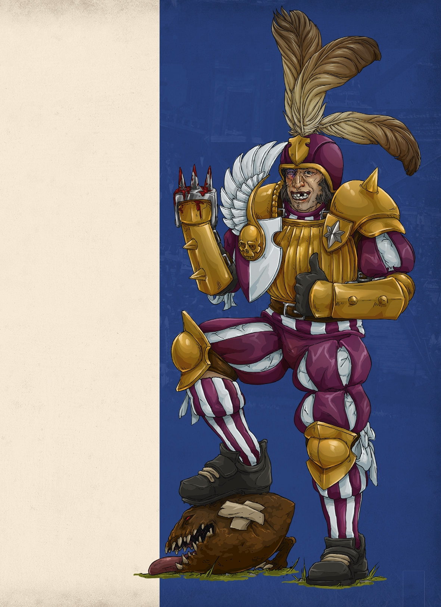dedicated fan of Blood Bowl (just
a few short years before, he had purchased the *Emperor Ludwig The*
*Fat Memorial Stadium* and paid for its renovation, renaming it the
*Emperor* *Luitpold I Memorial Stadium* after
his father who, it soon turned out,
was very much alive, if somewhat disappointed by his young son's
appalling literacy!).

The inaugural Blood Bowl
Classic was a truly grand affair held

during the height of summer. In emulation of the NAF season, 40 of the
world's top teams were invited to compete in a four-week tournament.
Initially, these 40 teams were divided into eight groups of fivve,
ensuring that for the firrst two weeks the on-pitch action was
nonstop. With the group stage complete, the top eight teams progressed
into the knockout rounds and, over two more weeks, were whittled down
to the top two teams who would face-off on the finall day
to decide the overall championship winning team. The format was a huge
success, and the competition itself heralded a glorious summer of
excess within the heart of the Old World.

With the calendar chock
full of leagues and tournaments,

punctuated by the Majors, with the RARG taking control of the rules
and regulations, and with the Cabalvision networks and sponsors in
charge of the promotion, the Open Era had well and truly begun. Blood
Bowl was back with a vengeance. In truth, it had
never really gone away..

**17**

## Blood Bowl Stadia

*BLOOD BOWL STADIA*

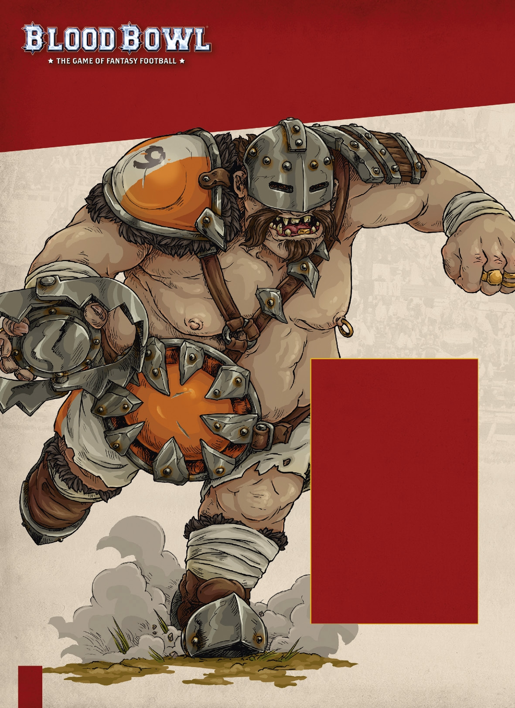

Blood Bowl pitches can be
found the world over, from
the sweltering rainforests of

Lustria, where archaic stadia occupy ancient temple cities, to the ice
floees of Norsca, where rugged gridirons

are carved from the glaciers and permafrost, and everything in between
and beyond. They range from small and humble affairrs, temporarily
marked-
out pitches surrounded by simple bleachers set up for a low budget
tournament, to truly grand stadia such as the Emperor Luitpold I
Memorial stadium in the heart of Altdorf, home
of the Blood Bowl itself, the grandest tournament held in the fineest
arena in all the known world.

This section explains the layout of a Blood Bowl pitch, the sideline
area, and details the accessories needed to

play the game.

**18**

### Nuffele's Sacred Turf

**NUFFLE'S** **SACRED TURF**
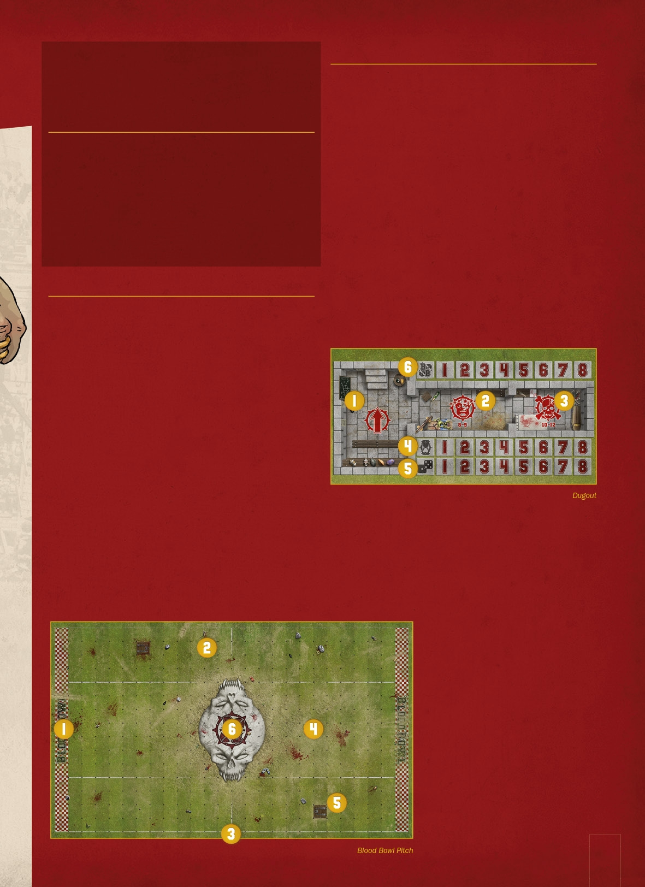**W**

**THE BLOOD BOWL PITCH**
A Blood Bowl pitch is split into several distinct sections and all
share the same features:

1\. Two End Zones, one at each short end of the pitch.
2. Two Wide Zones, one at each side of the pitch, running

from End Zone to End Zone.
3. Two Sidelines, running the length of the pitch, from

End Zone to End Zone.
4. The Centre Field, the area between each Wide Zone,

running the length of the pitch from End Zone to
End Zone.

5\. There are two trapdoors on the pitch, one in each half,

both positioned within a Wide Zone.
6. The pitch is then further split along its length into two

halves by the Line of Scrimmage, the point at which both teams line up
for the kick-off and at which much of the most violent action unfolds!

Finally, the board itself is split into a grid of squares;
13 squares from Line of Scrimmage to End Zone, making
the pitch 26 squares long in total, and 15 squares wide; four squares
in each Wide Zone and seven squares across the Centre Field.

**DUGOUTS**
Each team has its own dugout, a safe haven at pitch side where reserves
can warm up, where the injured can be tended to and where important game
information is tracked:

1\. The Reserves box, where fitt and healthy players stand

ready for the next drive.
2. The Knocked-out box, where players removed from play

due to minor injury recover.
3. The Casualty box, where seriously hurt players are tended

and where those who won't play again are stored until the finall
whistle.

4\. Turn trackers. These are vital, helping everyone know
which turn it is and how long remains of the current half

and the game. The Turn trackers are covered in greater detail on pages
20 and 42.

5\. Team re-roll trackers, used to keep track of how many re-rolls a
team still has to call upon in each half. Re-rolls

are covered in more detail on page 24.
6. The Score tracker, where the coach keeps a record of each

touchdown scored.

**19**

### Sporting Paraphernalia

Blood Bowl teams rarely travel light.
Be it the kit and armour of the players, the pom-poms and ribbons of
the

cheerleading squads or the bandages, saws
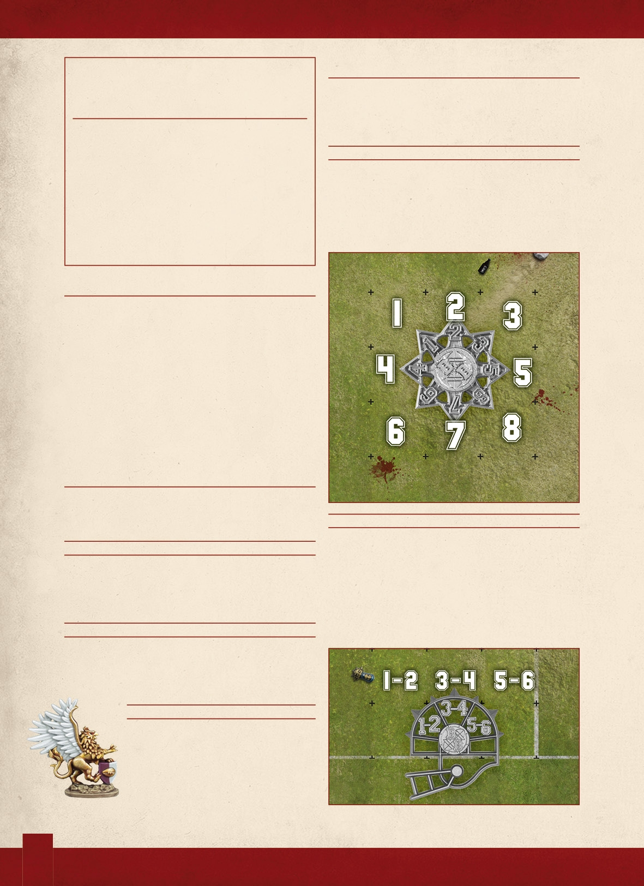and splints of the apothecaries, there
is no end of equipment to be hauled from stadium to stadium. 0n the
tabletop, games of Blood Bowl require somewhat less in the way of
equipment, but there are certain accessories that are vital to the
game.

**THE FOOTBALL**

rguably, the most important model on the pitch! When not in the
possession of a player (i.e., when being held and carried by a
player), the football

or, more simply, the ball, is placed on the ground, wholly within one
otherwise empty square. When in a player's possession it will occupy a
place on or adjacent to the base of that model.

The ball is an essential component in any game of Blood Bowl, and
there are a great many ways in which it can be represented, from a
simple token to a painted and based model the rival of any player.

**MARKERS**

he game of Blood Bowl uses several markers in conjunction with the
dugouts in order to keep track of important game information:

TURN MARKER
You will need a turn marker, and it is your responsibility,
at the beginning of each and every one of your turns,
to move the turn marker along the Turn tracker on
your dugout.

TEAM RE-R0LL MARKER(S)
Similarly, you are responsible for keeping track of how many team
re-rolls you have and how many have been used. You may use either a
single marker or several markers (one for each team re-roll) as you
prefer.

SC0RE MARKER
A score marker is used to keep track of how many touchdowns a team has
scored, by placing the marker on the zero position on the Score
tracker and moving it along after
a touchdown is scored.

**20**

**TEMPLATES**

Blood Bowl also makes use of three unique templates. These are the
'Random Direction template', the 'Throw-in template' and the

'range ruler'. These are used as described below.

THE RAND0M DIRECTI0N TEMPLATE
This template is used whenever the ball 'scatters', 'bounces' or
'deviates' (see page 25), or when the rules call for a random direction
to be determined for any other reason. Position the template as shown in
the diagram below, with the centre of the template over the square the
ball is within and roll a D8 to determine the direction.

THE THR0W-IN TEMPLATE
If the ball ever leaves the pitch, the crowd will enthusiastically throw
it back. Position the Throw-in template as shown in the diagram below,
with the Blood Bowl logo over the last square the ball occupied before
leaving the pitch and roll a D6 to determine the direction the ball
travels in.

Throw-ins are covered in greater detail on page 51.

C0RNER THR0W-INS
Should the ball leave the pitch from a corner square, the direction of
the throw-in is determined by placing the Random Direction template as
shown in the diagram and rolling a D3.

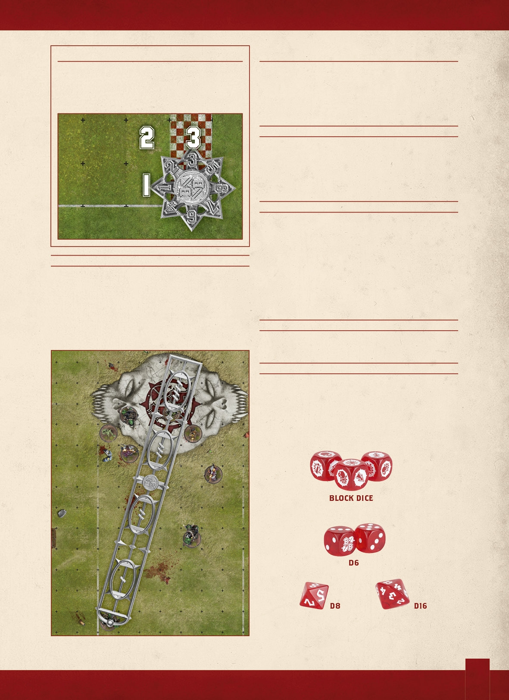

THE RANGE RULER
This is used when a Pass or Throw Team-mate action is performed, both
to determine range and, in the case of
a Pass action, to determine if any opposition players can attempt to
interfere with the pass.

Pass actions are covered in greater detail on page 48 and Throw
Team-mate actions on page 52.

**BLOOD BOWL DICE**

he game of Blood Bowl uses four different types of dice to determine
the outcome of various actions and events. These are often referred to
as 'Nufflee's

sacred cubes' in homage to the patron god of Blood Bowl. Interestingly
(perhaps), not all of these dice are cubes!

BL0CK DICE
Unique to the game of Blood Bowl, block dice are used to resolve Block
and Blitz actions against opposition players. They are six-sided dice
that feature fivve unique icons (one is duplicated on two faces), each
representing a different outcome (see page 57).

D6Blood Bowl also uses regular six-sided dice, marked 1to 6. It is common for the '6' to be replaced by a logo 
- either that of the game or a specificc team - on many Blood Bowl dice.

« *D3:* The rules might also call for a D3 to be rolled,
but an actual three-sided dice is not necessary. To roll

a D3, simply roll a D6 and halve the result, rounding fractions up.

D8
An eight-sided dice is often, though not exclusively, used in
conjunction with the Random Direction template.

D16
A 16-sided dice. Less frequently used but no less vital,
a D16 is used for some of the tables in the rules that follow or to
select players at random from within a team.

**21**

## Rules And Regulations

*RULES AND*
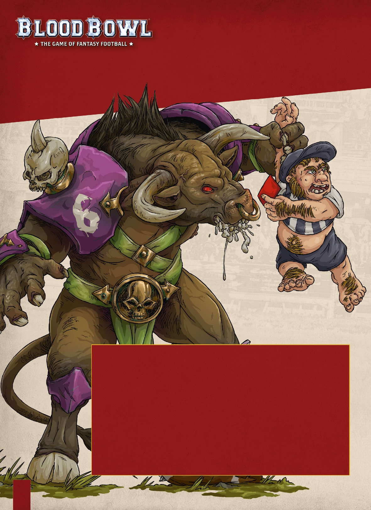*REGULATIONS*

Blood Bowl is a complex game of ancient traditions, governed by rules
and regulations older than imagining. That's the offcialal line. In
truth, the game of Blood Bowl as it is known today was hurriedly
translated from an ancient and

illegible tome by an elderly, near-sighted Dwarf. After completing
this firrst, rushed draft, the sacred commissioner Roze-El spent many
years trying to translate the *Tome* *of Nuffele* properly. Where this
proved impossible, he relied on that most time-honoured tradition
amongst scribes and historians and simply filledd in the details by
making
stufff up!

Since the time of Roze-El, numerous others have had their say in the
development of the rules. Consequently, the game as it is known today
is unlikely to bear more than a passing resemblance to the original
form of Nuffele's sacred game. Nuffele himself doesn't seem to be
overly concerned by this, which is probably just as well!

This section covers in detail the rules and regulations of the game of
Blood Bowl.

**22**

### General Principles

**GENERAL** **PRINCIPLES**

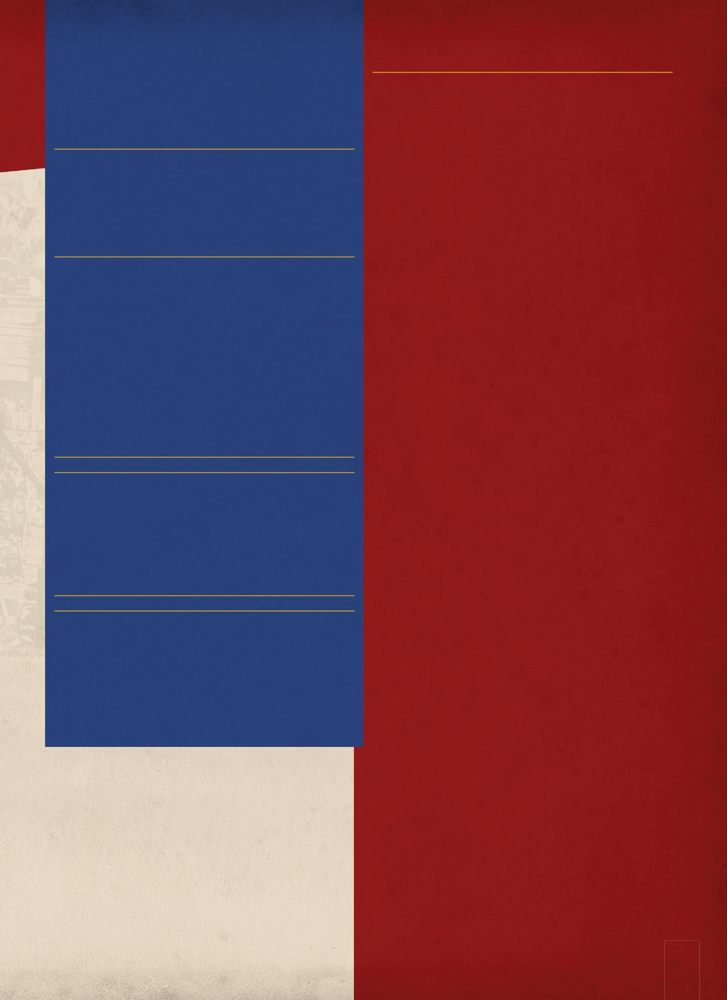**B**

Blood Bowl is a tabletop game and tabletop games are traditionally
played by 'players'. But Blood Bowl is also a game that represents a
sporting fixtture rather than

a battle between rival armies. Whilst in other tabletop games the
models might represent warriors, in Blood Bowl the
models represent sports players. To avoid confusion, and to adhere to
the theme of the game, the rules will always refer to the models as
'players' and to you, the person rolling the dice and making the
decisions, as the 'coach'. In addition, players that belong to the
same team are referred to as 'team-mates', whilst players that do not
belong to their team are referred to as 'opposition players'.

TAKE-BACKS AND CHANGING 0NE'S MIND
It is not uncommon for coaches to second guess themselves
occasionally, saying they are about to do something before immediately
changing their mind. As a general rule, you
should be tolerant of this in your opponents as you will likely
do it yourself! However, once dice have been rolled for any reason,
you must abide by your decision; you can no longer go back and change
anything that came before the dice roll!

RAND0MLY SELECTING A PLAYER
The rules will often require a coach to select a player at random. To
do this, simply roll a D16 and check the Team
Draft list. The number rolled is the player selected. If the number
rolled doesn't correspond to a player or, as is often
the case, if the number rolled doesn't meet the criteria of the player
to be randomly selected (perhaps the number rolled corresponds to a
player not on the pitch, for example) simply re-roll the dice.

**THE TURNOVER**

ne of the most important mechanics of the game of Blood Bowl is the
'Turnover'. Many unfortunate events will cause the active team's turn
to end prematurely

with a Turnover, regardless of how many players have
been activated.

A Turnover is caused:

« If a player on the active team Falls Over during their

own activation.
« If a player on the active team is Knocked Down during

their team turn.
« If a player on the active team that is in possession of the

ball is Placed Prone during their team turn.
« If a player on the active team that is in possession of the

ball is forced to move off the pitch for any reason.
« If a player on the active team attempts to pick up the ball

from the ground and fails, even if the bouncing ball is then caught by
a player from the active team.

« If a player on the active team fumbles a Pass action, even
if the bouncing ball is then caught by a player from the

active team.
« If no player on the active team catches the ball after a

Pass action or a Hand-off action and the ball comes to
rest on the ground or in the possession of a player from
the opposing team.

« If a Pass action is Defleccted or Intercepted and the ball comes to
rest either on the ground or in the possession of

a player from the opposing team.
« If a player on the active team that is in possession of

the ball is thrown by a team-mate and either fails to land safely,
lands in the crowd or is eaten, even if the bouncing ball is then
caught by a player from the active team.

« If a player on the active team is Sent-off by the referee for

committing a Foul.
« If a touchdown is scored.

This list is not exhaustive; there may be other events that will cause a
Turnover. Where this is the case, these will

be detailed by the rules.

Should a Turnover occur, any dice rolls that must
be made as a result of the event that caused it are made

immediately, after which the current player activation ends. The active
team may not activate any more players and the current team turn ends.

*For example, should one of your players Fall Over whilst* *moving, an
Armour roll is made against them. If that player* *was in possession of
the ball, the ball will then bounce. Once* *the ball has come to rest,
the player\'s activation ends and*
*you may activate no more players this turn. Finally, your team* *turn
ends and the opposing team becomes the active team.*

**23**

**DICE ROLLING**

**RE-ROLLS**

he game of Blood Bowl uses dice rolls a great deal. The roll of a dice
determines everything,
be it a simple attempt to pick up the ball, or the

effectiveness of a sneaky foul.

**W**

hen rolling dice, it is common for things to
go wrong! Fortunately, Blood Bowl allows for certain dice rolls to be
re-rolled:

SINGLE DICE R0LLS
The rules will often require you to roll a single dice, in
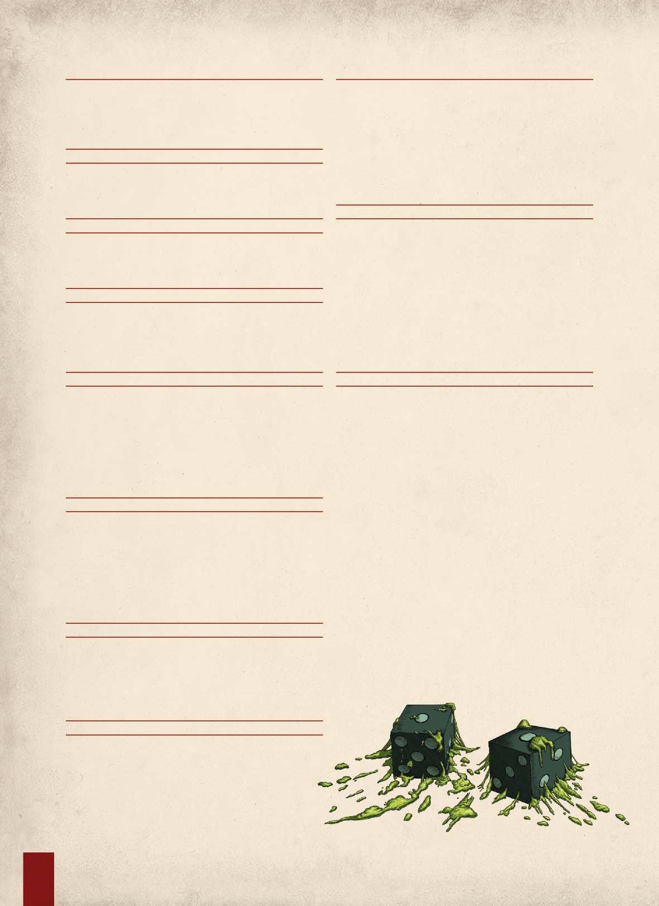which case the rules will say 'roll a
D6', or 'roll a D8',
for example.

MULTIPLE DICE R0LLS
Often the rules will state 'roll 2D6'. In such cases, two D6 are
rolled and the results added together to give a total between 2 and
12. This is a multiple dice roll.

DICE P00LS

Sometimes the game may require two or more dice be rolled and a single
result selected - for example, a coach might roll two or three block
dice and select one result to apply. In this case a 'pool' of dice has
been rolled.

TARGET NUMBER R0LLS
Usually, when making a single dice roll or a multiple dice roll, the
rules will require you to roll a specificc number followed by a '+'.
This indicates that the roll is a 'target number roll'. Making a
target number roll is simple. If you are required to roll a 4+ on a
single D6, for example, a
roll of 4, 5 or 6 would be a success, but a roll of 1, 2 or 3 would
not be.

M0DIFYING DICE R0LLS
The rules will often call for a dice roll to be modifiedd,
particularly when making a target number roll. To do
this, simply roll the dice and then add or subtract the modifier((s)
shown, effectively changing the outcome of the dice roll. If the rules
ever instruct you to divide a dice roll
in any way, any fractions should be rounded up, unless the rules state
otherwise.

R0LLING ofF
The rules may call for both coaches to roll a dice (usually either a
D6 or a D3). Often a characteristic of some sort will be added to the
result. This is called 'rolling off' and
the highest score always wins a roll-off. In the case of a
tie, roll again unless otherwise instructed.

NATURAL R0LLS
A 'natural' roll is the actual number rolled on a dice, regardless of
modifierrs. It is not uncommon for a test to
be passed if a natural 6 is rolled or failed if a natural 1 is rolled,
even if modifierrs might seemingly make success
a certainty or failure seem impossible.

**24**

« The second result must always be accepted, even if it

is worse than the original result.
« A dice can never be re-rolled more than once,

regardless of the source of the re-roll.

SKILL RE-R0LLS
Many players possess Skills that allow them to re-roll dice in a
specificc situation:

« Skill re-rolls can only be used as detailed in the

Skill's description.
« Skill re-rolls can be used during either team's turn,

as appropriate.
« When a dice pool is rolled, a Skill re-roll will allow

only certain results to be re-rolled, as detailed in the Skill's
description.

TEAM RE-R0LLS
Every Blood Bowl team will have a number of team re-rolls to use during
a game. A team will start each game with its full complement of team
re-rolls. Any used during the firrst half of a game are replenished in
full at the start of the second half, but unused team re-rolls do not
carry over from the firrst half to the second half (or from one fixtture
to the next in league play):

« Team re-rolls can only be used when a team is active,

during its own team turn.« Team re-rolls cannot be used to re-roll:

- Deviation, scatter and bounce rolls.Or:
- Armour, Injury and Casualty rolls.

« When a dice pool is rolled, a team re-roll can be used.

When a team re-roll is used, all of the dice in the dice pool must be
re-rolled (not just those dice that show an undesirable result).

**DEVIATE, SCATTER OR BOUNCE**

he footballs used in Blood Bowl are oddly shaped and often behave
quite erratically. Throughout the rules, reference will be made to the
ball 'deviating',

'scattering' or 'bouncing', and it is worth establishing early on what
is meant by each of these terms:

DEVIATE
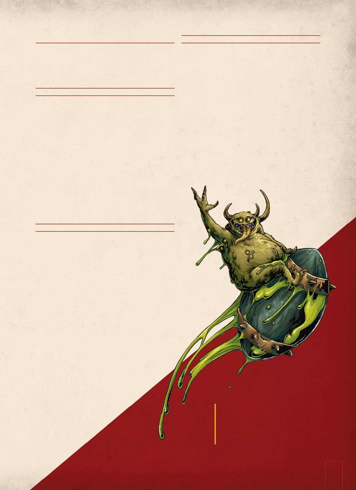This represents a kicked ball or
desperate pass veering wildly off target:

« When the ball deviates, it moves a number of squares equal to the
roll of a D6 from the square in which it

was placed, in a direction determined by rolling a D8 and referring to
the random direction template.

« If the ball lands in a square that is occupied by a Standing player
that has not lost their Tackle Zone

(see page 26), that player must attempt to catch
the ball (see page 51). If they fail, it will bounce as described
opposite.

« If the ball lands in an unoccupied square or a square

that is occupied either by a Standing player that has lost their
Tackle Zone or by a Prone or Stunned player, it will bounce before it
comes to rest on the ground.

SCATTER

This happens whenever a ball (or a thrown player) in the air travels
in an unexpected way:

« When the ball scatters, it moves from the square in which it was
placed three times before landing, each

time moving one square in a direction determined
by rolling a D8 and referring to the Random
Direction template.

« A player cannot attempt to catch the ball should it enter the square
they occupy on the firrst or second

scatter roll, as it is still high in the air at this point.
« If after the third scatter roll the ball lands in a square

that is occupied by a Standing player that has not lost their Tackle
Zone, that player must attempt to catch the ball. If they fail, it
will bounce.

« If after the third scatter roll the ball lands in an unoccupied
square or a square that is occupied

by either a Standing player that has lost their
Tackle Zone or by a Prone or Stunned player,
it will bounce before it comes to rest on
the ground.

B0UNCE
This happens for many reasons, most often when the ball (or the player
in possession of it!) hits the ground or when a player drops it:

« When the ball bounces, it moves one square in a direction determined
by rolling a D8 and referring to

the Random Direction template.
« If the ball bounces into a square that is occupied by a

Standing player that has not lost their Tackle Zone, that player must
attempt to catch the ball. If they fail, it will bounce again.

« If the ball bounces into a square that is occupied either

by a Standing player that has lost their Tackle Zone
or by a Prone or Stunned player, the ball will continue
to bounce until it is caught by a Standing player or it comes to rest
in an unoccupied square.

"What a foul! That was utterly brutal, Bob!"
"Well, life goes on, Jim." "I've got a feeling it might not in his
case, actually."

**25**

### Player Status

n games of Blood Bowl, the status of a player is very important.A
player that is standing can achieve far more than one that is not!

A player that has been pushed to the ground can recover quite quickly
compared to one that has to regain their senses before playing on.

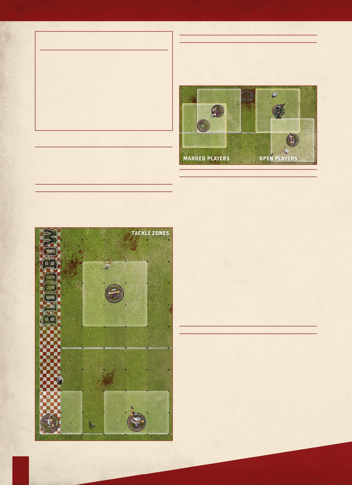

Most of the time, a player will be 'Standing'. At other times a player
will be either 'Prone' or 'Stunned'.

**STANDING PLAYERS**

layers that are Standing when activated have
the greatest freedom to move. Players that are Standing during the
opposing team's turn are able

to hinder their plays.

THE TACKLE Z0NE
A Standing player exerts control over the squares around them. This is
called their 'Tackle Zone' and covers all of the eight squares
adjacent to a Standing player, as shown in the diagram.

**26**

OPEN PLAYERS
A player that is not being Marked, i.e., a player that is
not within the Tackle Zone of any opposition players (as described
below), is said to be 'Open'. Open players can move freely and perform
actions more easily, free from the interference of opposition players.

MARKING AND BEING MARKED
Players use their Tackle Zone to interfere with opposition players,
'Marking' them and hindering their actions:

« If a player occupies a square that is within an opposition player's
Tackle Zone, they are being

'Marked' by that opposition player.
« If a player has an opposition player within their Tackle

Zone, they are 'Marking' that opposition player.
« A Standing player Marks all opposition players that are

within their Tackle Zone.
« A player can be Marked by multiple opposition players

at the same time.
« A player that has lost their Tackle Zone for any reason

cannot Mark an opposition player, though they can be Marked
themselves.

Players never Mark team-mates - they will only Mark opposition players.
Marking opposition players, and being Marked by them in turn, has
multiple in-game effects.

L0SING TACKLE Z0NES
Prone and Stunned players lose their Tackle Zone. It may also happen
that, due to an in-game effect, a special rule or a Skill used by an
opposition player, a Standing player loses their Tackle Zone.

If a player has lost their Tackle Zone they:

« Cannot Mark other players.
« Cannot attempt to interfere with a Pass action. « Cannot attempt to
catch the ball.

They will also be unable to use certain other Skills that require a
player to have a Tackle Zone.

**PRONE AND STUNNED PLAYERS**

layers that are not Standing will be either 'Prone'
or 'Stunned'. All such players occupy one square
on the pitch - the square they were in when they

became Prone or Stunned - no matter how big the player.

PR0NE
When a player is Prone, the model is laid face-up on the
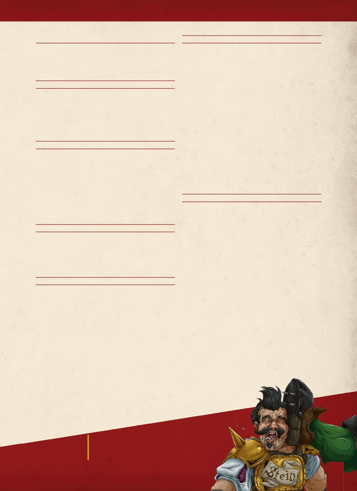pitch. A Prone player can do nothing
until they have stood up. A Prone player may be activated during their
team turn to perform any action that includes Movement Allowance.
Doing so allows the player to sacrificce a portion of their movement
to stand up (see page 44).

STUNNED

When a player is Stunned, the model is laid face-down on the pitch. A
Stunned player is not eligible to be activated during their team turn.
When a team's turn ends, even if it ends with a Turnover, any players
that were Stunned when the turn began will automatically roll over and
become Prone. If a player became Stunned during the course of their
own team turn, they must remain Stunned until the end of their team's
next turn, when they will automatically roll over and become Prone.

BEC0MING PR0NE 0R STUNNED
Usually, a player becomes Prone as the result of 'Falling Over' or
being 'Knocked Down'. When a player Falls Over
or is Knocked Down, they also 'risk injury', meaning they may become
Stunned or worse. Alternatively, a player may be 'Placed Prone'
without risk of injury.

PLACED PR0NE
Being Placed Prone is often a deliberate choice a player
is able to make due to a Skill they possess. At other times an in-game
effect, a special rule or a Skill used by an opposition player may
cause one of your players to be Placed Prone by your opponent:

« If a player is Placed Prone during their activation, their

activation ends immediately.
« If a player in possession of the ball is Placed Prone

during their team turn, a Turnover is caused.
« If a player that is in possession of the ball is Placed

Prone, the ball will bounce from the square in which
the player was Placed Prone.

« When a player is Placed Prone, there is no risk of injury

and no Armour roll is made against them.

FALLING 0VER
Players may 'Fall Over' when they attempt to Dodge, or they may simply
Fall Over their own feet as they sprint across the pitch too quickly.
When a player Falls Over it is self-infliccted, and it can only happen
during a player's own activation:

« If a player Falls Over, a Turnover is caused.
« If a player Falls Over, they become Prone and risk

injury. The coach of the opposing team makes an Armour roll against
them as described on page 29:

- If the player's armour is broken as described on

page 60, an Injury roll is made against them andthey will become Stunned or worse.

- If the player's armour is not broken, they

remain Prone.
« If a player Falls Over whilst in possession of the ball,

the ball will bounce from the square in which the player Falls Over,
after making an Armour roll (and possible Injury roll) against them.

BEING KN0CKED D0WN
Players are often 'Knocked Down' as the result of a vicious Block action
from an opposition player or when they attempt to perform a Block action
against an opposition player who proves to be bigger, tougher or luckier
than
they are. Players can also be Knocked Down by projectiles thrown by the
crowd (including spells), or by some other in-game effect, by a special
rule or by a Skill used by an opposition player:

« If a player is Knocked Down during their team turn,

a Turnover is caused.
« When a player is Knocked Down, they become Prone

and risk injury. The coach of the opposing team makes an Armour roll
against them:

- If the player's armour is broken, an Injury roll is

made against them and they will become Stunnedor worse.

- If the player's armour is not broken, they

remain Prone.
« If a player is Knocked Down whilst in possession of

the ball, the ball will bounce from the square in which the player was
Knocked Down, after making an
Armour roll (and possible Injury roll)

against them.

"..they were jolly nice chaps,
weren't they?"

*- Lance Goodfellow, Bright Crusaders rookie*

**27**

### Player Profile

PLAYER PRofILEAND CHARACTERISTICS TESTS

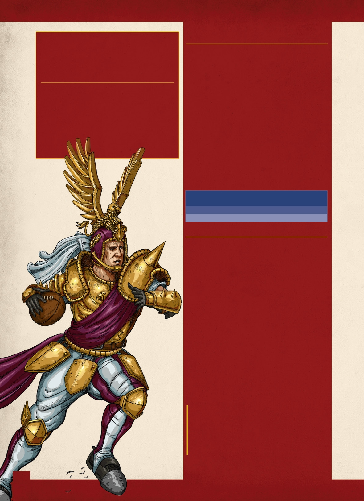**B**

**28**

**PLAYER PROFILE**

he strengths and weaknesses of the players that make up a team are
represented by a series
of characteristics, collectively known as the

player's 'profilee':

« Movement Allowance (MA) and Strength (ST) are
both shown as simple values, in which case a higher

number is better.
« Agility (AG), Passing Ability (PA) and Armour Value (AV)

are all shown as target numbers; a number followed
by a '+' symbol, as described on page 24. In the case of AG and PA a
lower number is better, whereas in the case of AV a higher number is
better.

No characteristic may ever be improved more than twice or be improved
beyond the maximum shown on the

table below. No characteristic may ever be reduced below the minimum
shown on the table below:

CHARACTERISTIC TABLE
Characteristic MA ST AG PA AV Maximum 9 8 1+ 1+ 11+ Minimum 1 1 6+ 6+
3+

**CHARACTERISTIC MODIFIERS**

hen making a test against any of a player's characteristics, there are
a number of modifierrs that may apply, some making

success harder, some making it easier. Where modifierrs apply to a
Characteristic test, the rules will list and
detail them:

« If the characteristic is given a simple value, the modifierr is
applied as written - for example, if a

player with a Strength characteristic of 3 is given a
+1 Strength modifierr, their Strength characteristic becomes 4.

« Where a characteristic is presented as a target number, the modifierr
is always applied to the dice roll,

as described on page 24.

If the rules ever instruct you to divide a dice roll in any way, any
modifierrs that also apply to the roll should be

applied after the roll has been divided.

HACKSPIT QUILLCHEWER'S FUN FACTS! *Back when Morg 'n' Thorg was a
rookIe, he started* *puttIng a notch In hIs heImet for every pIayer
he* *kIIIed. Before too Iong there were more notches than* *heImet!
Sure enough, It dIdn't take Iong for It to fall* *apart entIreIy, and
he hasn't worn one sInce-sInce!*

### Characteristics Tests

MOVEMENT
ALLOWANCE (MA)
This characteristic shows the number of squares the player may move
when activated during their team turn.
There are several actions a player
can perform that allow them to move, ranging from a simple Move
action
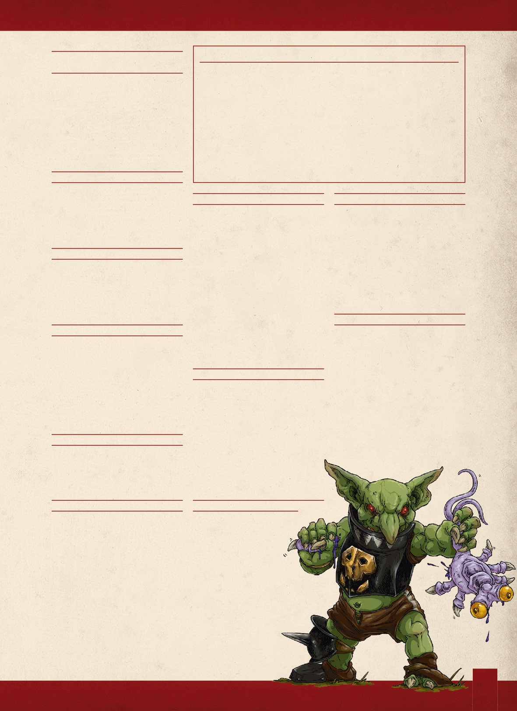to a dramatic Blitz (actions are dealt
with in detail on page 43).

STRENGTH (ST)
A player's Strength characteristic

"WHAT CAN P0SSIBLY G0 WR0NG?"
Players may have an AG or PA of 1+. It might seem that such players
cannot fail when testing against these characteristics, but that is,
unfortunately, not the case! Remember that when testing against a
player's AG or PA, any roll of a natural 1 is a fail. In addition,
there will often be modifierrs to apply.

*For example, a player with an AG of 1+ may findd themselves subject*
*to a -2 modifierr, in which case you would need to roll a 3 or higher
to pass* *an Agility test, because should you roll a 2 and apply a -2
modifierr the*

*result would be 0, which is lower than 1.*

represents how physically strong they are. Strength is used during
Block actions, both when performing them and when defending against
them.

AGILITY (AG)
A player's Agility characteristic represents their Skill and dexterity
in different situations, be it how easily they can pick up the ball or
their
ability to break away from a scrum.

AGILITY TESTS
You will often be required to test against a player's Agility. An
Agility
test is a target number roll made on a single D6, as described on page
24.
In addition, if the roll is a natural 6,
the test is automatically passed. However, if the roll is a natural
1,
the test is automatically failed.

PASSING ABILITY (PA)
This characteristic represents the player's ability to pass the ball
(and
in some cases other players and perhaps even bombs!).

PASSING ABILITY TESTS
You will often be required to test against a player's Passing Ability.
A Passing Ability test is a target number roll made on a single D6. In
addition,
if the roll is a natural 6, the test is automatically passed. However,
if the player has a PA of '-' or if the roll is
a natural 1, the test is 'Fumbled', as described on pages 49 and 53.

ARM0UR VALUE (AV)
A player's Armour Value is a hard- working characteristic. Most simply,
it represents how the quality and durability of a player's sports kit
protects them from harm. But AV
can also represent how tough a
player is. Some players may appear lightly armoured but have a high
AV characteristic, indicating a high degree of physical durability.
Others may appear very heavily armoured yet have a low AV
characteristic, showing that in spite of their kit, they are delicate
and prone to injury!

ARM0UR R0LLS
Whenever a test is required against a player's Armour Value, it is the
coach of the opposing team that makes it. This is referred to as an
'Armour roll'. An Armour roll is a target number
roll made on 2D6. If the roll is successful, the player's armour is
'broken'. If the roll is unsuccessful, the player's armour is not
broken
and protects them from harm.

SKILLS & TRAITS
In addition to their
characteristics, a player
may possess one or
more Skills or Traits.

SKILLS
Skills improve a player's performance in key areas, be it granting them
a
free re-roll in specificc situations, or allowing them to modify a dice
roll. Some players begin their career with natural talents that are
represented
in this way - others develop new
Skills as they improve during
a league.

TRAITS
Whilst Skills can be learned by
a player during a league, Traits represent a unique ability a player
brings to the game. Traits can be both positive and negative. Whatever
the case, it is most unusual for a player
to develop a new Trait during a league (though not impossible); players
possess Traits when hired and retain

them over their entire career.

**29**

### Drafting a Blood Bowl Team

efore an aspiring coach can lead their team to glory, the firrst thing
they need is a team to lead! The fundamentals of

team creation remain unchanged whether a
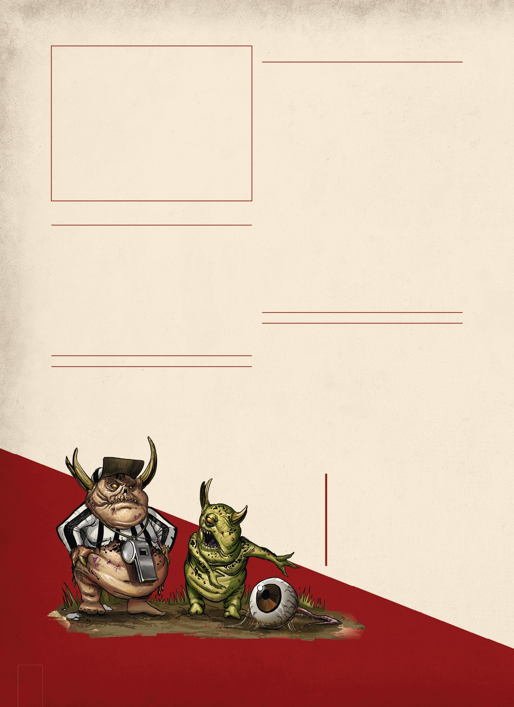team is being created for league or
exhibition play. The rules that follow explain how to construct a team
of players and Sideline Stafff, ready to take to the gridiron and seek
eternal glory (or ignominy)!

**TEAM ROSTERS**

Blood Bowl is a game played by a great variety of races, and these in
turn are split into an even greater number of sub-categories. All of
these

varied teams are represented by 'team rosters', lists used when
creating, or 'drafting', a team of that type, which detail the players
available to hire, their profilees and
Hiring Fee.

A team roster will also tell you how much team re- rolls cost to buy,
whether or not the team can include an

apothecary, and will list any special rules the team has.

SPECIAL RULES
Most Blood Bowl teams are quite straight forward in their behaviour
and approach to the game. Others, however, are not. All teams have one
or more special rules in order to better portray their character (see
page 105).

**30**

**TEAM DRAFT LISTS**

hen a team is drafted, a 'Team Draft list' is completed. This contains
spaces in which to record each player permanently hired to the

team, their name, position, Hiring Fee and player profilee, along with
spaces to record experience gained in the form of 'Star Player Points'
(see page 70) and advancements earned during league play. The 'Current
Value' of each player is recorded, which is equal to their Hiring Fee
plus the 'Value Increase' of any advancements they accrue
(see page 72).

There is also space to list other important team details, such as the
Sideline Staff permanently hired, the

number of team re-rolls bought and how many Dedicated Fans follow the
team, as well as the team type, name and the name of the coach.

Finally, the Team Draft list contains spaces to record how many gold
pieces the team has in its Treasury (see page 35) and the total value of
the team when all of the players, Sideline Staff, team re-rolls and
player advances are accounted for.

GAME REC0RD SHEET
The reverse of the Team Draft list features the Game Record sheet. This
is used to keep track of 'league fixttures' and 'cross division
friendlies' played over the course of a league, including details of
opposing teams and the names of their coaches, and the number of fans in
attendance along with petty cash awarded, Inducements hired (see page
38), Current Team Value and any other notes coaches wish to keep.

Once the game is over, this is also where the outcome is recorded along
with winnings and various

other notable events as described on page 69.

MINDY PIEWHISTLE'S RUM0UR R0UND-UP
*If there's one thIng I've Iearned over* *the years, It's that balls
aren't the* *onIy thIng that get thrown around*
*by BIood BowI pIayers. You wouIdn't* *beIIeve the thIngs I've caught
on*
*the sIdeIInes..*

### Team Draft List

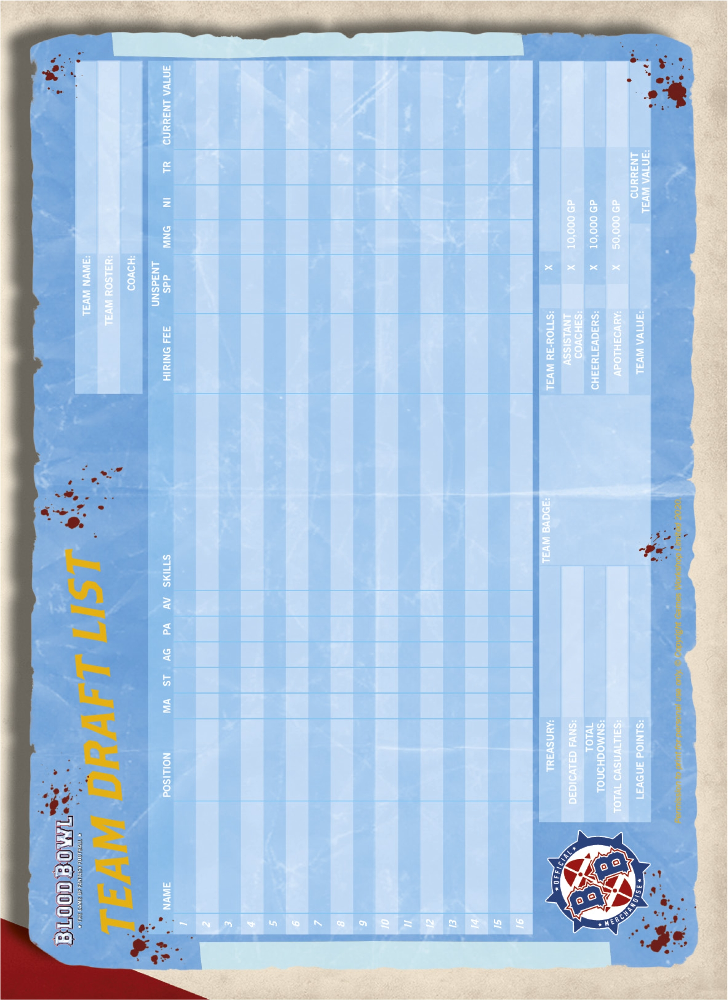

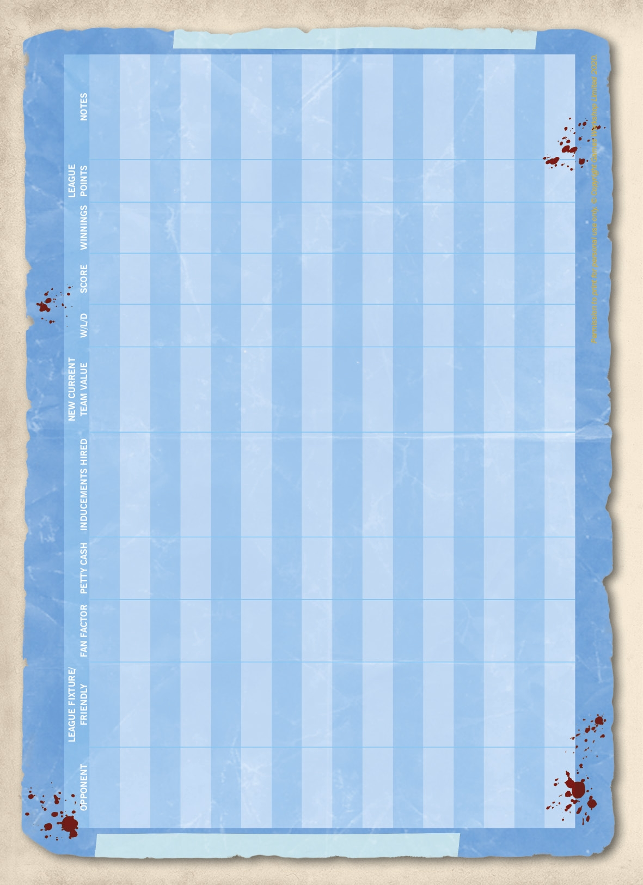

**TEAM DRAFT BUDGET**
The Team Draft Budget is the amount of gold pieces (GP) you have to
spend on your rookie team:

« When drafting your team for league play, you have a budget of
1,000,000 gold pieces to spend on players,

Sideline Staff, team re-rolls and so forth.
« When drafting a team for exhibition play, you may have

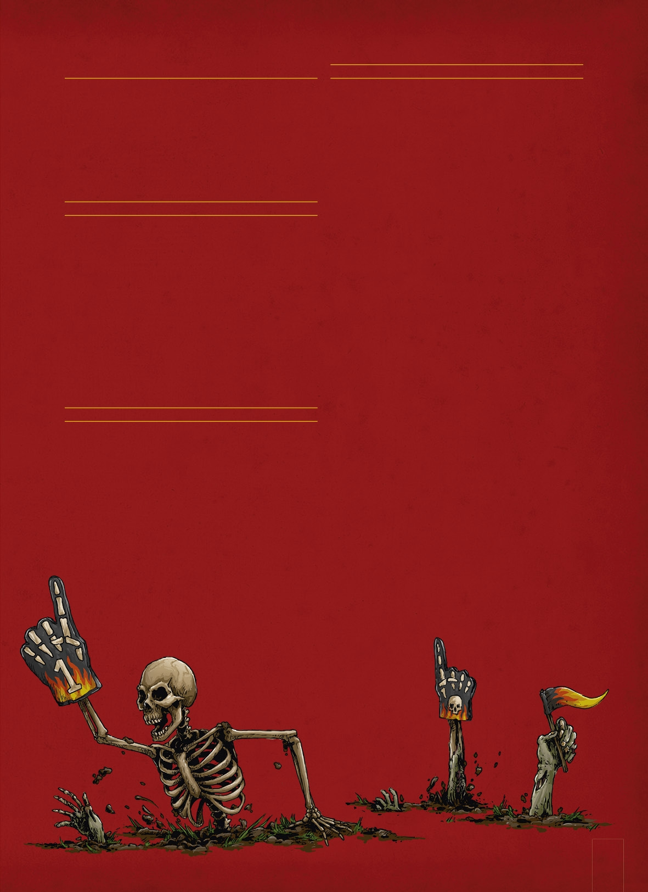a higher budget (see page 101).

HIRING PLAYERS
Players are the only compulsory element on any Blood
Bowl team. Each team roster details all of the players available to a
team of that type and their Hiring Fee. When drafting a team, you
should select the players you want to permanently hire for your team,
pay their hiring cost from your Team Draft Budget and make a record of
the player
on the Team Draft list.

A team may not include more players of a certain type than are allowed
by the team roster. For example,
an Elven Union team is allowed 0-2 Blitzers, meaning an Elven Union
team may include zero, one or two Blitzers, but may not include three.

NUMBER of PLAYERS
The firrst and most important thing to be aware of when drafting a
Blood Bowl team is the minimum and maximum number of players
permitted:

« Every Blood Bowl team must contain a minimum
of eleven (11) permanently hired players when it is

firrst drafted.
« No Blood Bowl team can ever contain more than

sixteen (16) permanently hired players.

It is important to note that, during the course of a league season,
the number of players a team can fieeld may

fall below 11 due to injury and death. This is permitted (if not
ideal!) and is covered in more detail in the Take

on Journeymen section on page 38.

PLAYER P0SITI0NS
There are distinctions to be made between the players within a team,
separating them by their role within the game, from the humble Lineman
to the more specialised roles performed by the 'positional' players.

*LINEMEN:* The backbone of any team:

« All teams will have a player type that they are
permitted to take 0-12 or 0-16 of. Regardless of name

(for many races call their Linemen by another name), this Player type
is the team's 'Lineman' positional.

*BLITZERS:* On offence, Blitzers force gaps through
the opposition. In defence they will violently target key opposition
players.

*THROWERS:* It is often the Thrower that takes the role of offensive
captain - calling the plays and making split second decisions.

*CATCHERS:* The safe pair of hands on any team, the Thrower's trusted
receivers. It is the Catcher's job to receive passes safely.

*RUNNERS:* Several teams employ Runners in place of Throwers and
Catchers, relying on speed rather than risk passing interference.

*BLOCKERS:* A popular position on the defensive line of any team that
relies on a more physical play-style.

*OTHER POSITIONS:* Many teams of different races employ players that do
not fitt into any specificc role. This may be a sneaky Assassin or a
Goblin mounted on a pogo stick (it's in the regulations!). There is
almost no end to
the innovation Blood Bowl teams show.

*BIG GUYS:* The term Big Guy is a colloquial one used by Blood Bowl fans
to identify the giants of the game; Ogre, Minotaur, Troll players and
more fall under this heading.

**33**

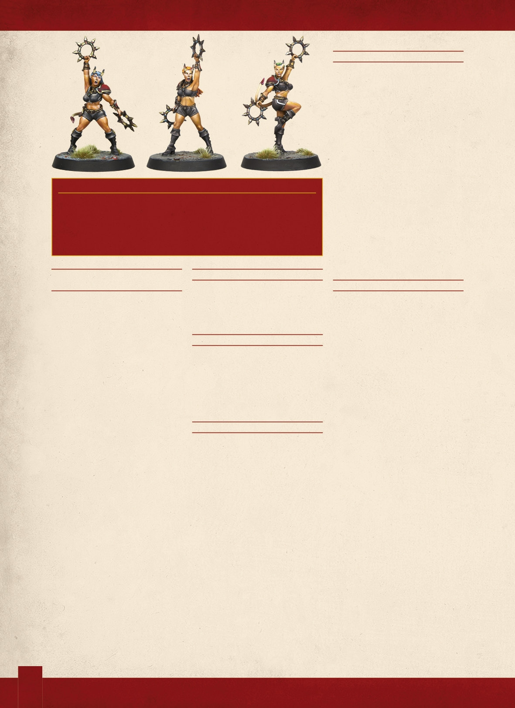

DESIGNER'S N0TE - M0DELS 0N THE SIDELINES
Although not essential, many coaches choose to represent staff with
models on the sideline, both for the look of the thing and as a
reminder that these staff members stand ready to help out. Such models
also make great Turn, Re-roll and Score markers, adding a lot to the
visual impact of the Blood Bowl pitch during a game.

0-12 CHEERLEADERS
All teams can hire a number
of cheerleaders. Be it dancers, musicians or even performing mascots, a
good cheerleading squad can work the crowd up and encourage the players
to try harder. The benefitt of cheerleaders is covered on page 41:

« Every team may hire cheerleaders when it is firrst drafted, for the
cost of 10,000 gold pieces each, paid

for from the Team Draft Budget. « Additional cheerleaders may be

purchased during a league, in
the Hiring, Firing and Temporarily Retiring step of the post-game
sequence (see page 72), for the cost of 10,000 gold pieces each.

PURCHASING
TEAM RE-R0LLS
Any team can purchase team re-rolls. These represent the time spent
training and the team's ability to react in a split second to mistakes
and turn them around. The cost refleccts the time and effort different
teams must invest to achieve the same broad
level of training:

« Every team may purchase 0-8

team re-rolls when it is firrst
drafted, for the cost shown on
the team roster, paid for from the Team Draft Budget.

« During a league, additional team

re-rolls may be purchased at a
later date, in the Hiring, Firing and Temporarily Retiring step of the
post-game sequence (see page
72), but the team must pay double. For example, if a team is able to
purchase team re-rolls for 60,000 gold pieces when it is drafted,
additional team re-rolls purchased later on during a league season
will cost 120,000 gold pieces.

« When calculating Team Value (see

page 35), team re-rolls add only
the cost shown on the team roster, even if they are purchased at
double the cost later on in a league.

**34**

HIRING SIDELINE STAFF Sideline Staff can be of vital assistance to their
team, helping to tip the balance in several seemingly minor but often
vital ways.

THE C0ACH
Every team is owned and managed
by a coach. As discussed previously, this is you, the reader. As such,
when completing the Team Draft list, the coach section should be filledd
in with your name or a suitable nickname.

0-6 ASSISTANT C0ACHES
Any team can hire a number of assistant coaches. These represent the
specialists brought in to help with various aspects of the game. The
benefitt of assistant coaches is covered on page 41:

« Every team may hire assistant coaches when it is firrst drafted,

for the cost of 10,000 gold pieces each, paid for from the Team
Draft budget.

« Additional assistant coaches may

be purchased during a league, in the Hiring, Firing and Temporarily
Retiring step of the post-game

sequence (see page 72), for the cost of 10,000 gold pieces each.

0-1 AP0THECARY
The apothecary fulfilss a vital role
in any team. It is their job to keep
the valuable players fitt and healthy. Apothecaries work hard on the
sidelines, patching up minor injuries and giving urgent care to more
serious injuries before they can end a player's career. An apothecary's
role
is covered in detail on page 62:

« Not every team can hire an apothecary. Whether a team can

or cannot include an apothecary will be noted on the team roster.

« If a team can hire an apothecary,

it may only ever have one on
the roster.

« Teams that can hire an apothecary

can do so when they are firrst drafted, or during the Hiring, Firing
and Temporarily Retiring step of
the post-game sequence of any game (see page 72) for a cost of 50,000
gold pieces.

« Teams able to hire an
apothecary may Induce a

number of additional Wandering Apothecaries for a single game during a
league in the Hire Inducements step of the pre-game sequence (see page
38).

other INF0RMATI0N
As mentioned previously, the Team Draft list contains spaces to record
several other important details. This includes the team Treasury, the
size of their fan following, and the cash value of the team as a
whole.

TREASURY
Blood Bowl teams can amass vast wealth. Most of this is reinvested
immediately into wages, recruitment and running costs, but a careful
coach 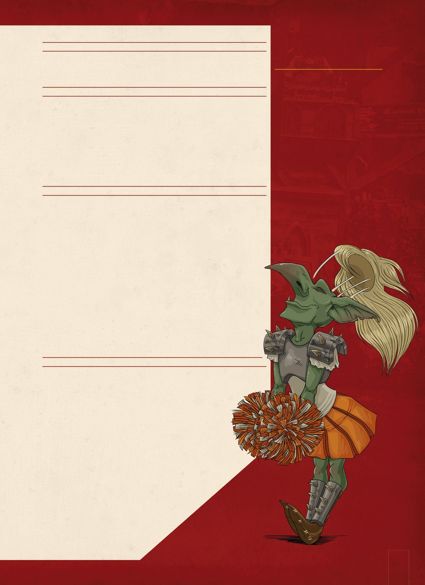can build up quite the fortune.

Any gold pieces not spent when drafting the team are recorded in the
Treasury section of the Team Draft list. Over the course of a league
season, winnings are added to this. The Treasury is used to purchase
Inducements (see page 38) as well as new additions to the team, such
as new players or

Sideline Staff.

DEDICATED FANS
Every Blood Bowl team is supported by a strong following of Dedicated
Fans, those loyal supporters that will follow their team in good times
and bad. This dedicated fan base is made both of those eager to show
their support for a local franchise and those from further afieeld who
support the team for less easily identifiedd reasons. Many dedicated
fans support a team because their parents did. Others do so simply
because they findd the team colours fetching.

When a team is drafted, it will have a Dedicated Fans characteristic
of 1 recorded on the Team Draft list (representing roughly 1,000
Dedicated

Fans). Over the course of a league season, this characteristic will
increase and decrease, though it will never fall below 1.

Additionally, when a team is drafted it can improve its Dedicated Fans
characteristic by 1, up to a maximum of 6, at a cost of 10,000 gold
pieces per improvement. For example, a team may improve its Dedicated
Fans characteristic from 1 to 3 at a cost of 20,000 gold pieces from
its Team Draft budget.

TEAM VALUE
The finall thing recorded on the Team Draft list is the value of the
team:

*TEAM VALUE (TV):* This is worked out by adding up the Current Value
of all the players on the team, plus the cost of all Sideline Staff
and team re-rolls the team has. The number of Dedicated Fans and the
amount of gold pieces held in the Treasury do not add anything

to TV.

*CURRENT TEAM VALUE (CTV):* This is worked out exactly as
above, but minus the Current Value of any players that suffered a Miss
Next Game Casualty table result during the team's last game and will
be unavailable to play next game (see page 61). This is the version of
Team Value used to work out how much Petty Cash
is granted to the team with the lower value during the pre-
game sequence, as described on page 38.

**INDUCEMENTS AND** **TEAMS DRAFTED FOR** **EXHIBITION PLAY**

ormally, teams are drafted
for league play, and in league play Inducements are dealt

with in the pre-game sequence,
as described on pages 38 and 89 However, when a team is drafted for
exhibition play, this is not the case. Instead, you may spend as much
or
as little of your Team Draft Budget as you wish on Inducements
available
to your team, as described on page 89, provided your team contains the
minimum of 11 players, not including Induced players such as Mercenaries
or Star Players.

**35**

## The Rules of Blood Bowl

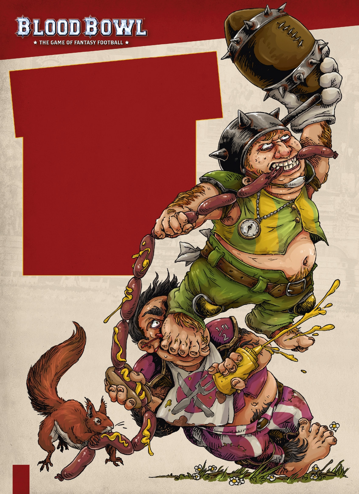*THE RULES OF* *BLOOD BOWL*

raditionally, a game of Blood Bowl unfolds with one team kicking the
ball to the other. The receiving team, the offencce, will then attempt
to move the ball the

length of the pitch, through a series of dramatic passes and daring
rushes, into the opposition's End Zone, thus scoring
a touchdown. The team that kicked-offf, the defence, will attempt to
stop this and gain possession of the ball, so
that they may instead score a touchdown.

0nce a touchdown has been scored, both of the teams line up once more
and the scoring team kick offf. And so the game progresses until
the finall whistle is blown, when the victors celebrate, the losers
commiserate
and the stadium owners and sports
promoters retire to count the money
they made from ticket sales and
concession stands!

**36**

### A Game of Two Halves

Blood Bowl game is split into two halves
of roughly equal length, with a third period
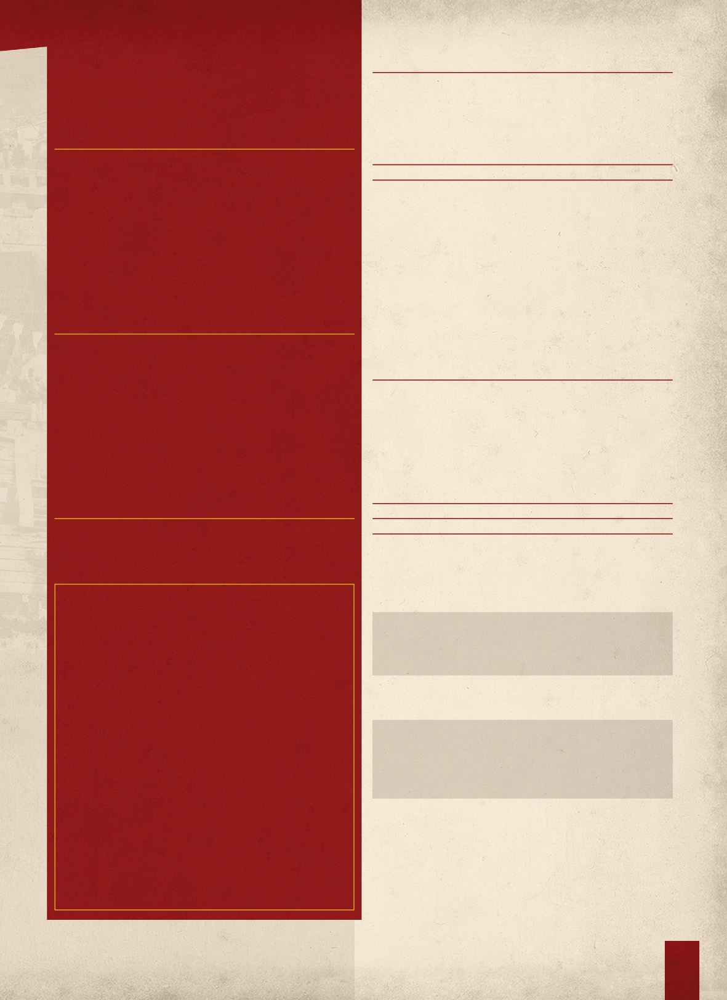played should an important game that
needs

a clear winner be tied at the end of the second half. The third period
is referred to as 'extra time'. In emulation of this tradition, a game
of Blood Bowl played on the tabletop is split into two halves, each
consisting of eight team turns. Therefore each half consists of 16
turns and the game overall of 32 turns.

**SETTING UP THE GAME**

etting up a game of Blood Bowl is simple. All that
is needed is a pitch and a pair of coaches ready for action, each
equipped with a team of models and the

appropriate markers. With the pitch placed between them, each coach
places their dugout beside one of the End Zones. This indicates which
half of the pitch belongs to their team.

Both coaches then place their teams on the pitch and their markers
onto their dugout before quickly explaining the

details of their team for their opponent's benefit.. **PRE-GAME
SEQUENCE**

**1. THE FANS**

Blood Bowl games are always well attended. As well as the Dedicated
Fans, many 'fair-weather fans' come along purely for the spectacle!
Though they rarely

care much about either team, they will invariably pick one to cheer for.

FAN FACT0R (FF)
This is a combination of Dedicated Fans and fair-weather fans in
attendance. To determine Fan Factor:

« Each coach rolls a D3. This represents how many fair-

weather fans are cheering for their team.
« Each coach adds their Dedicated Fans characteristic to

the number of fair-weather fans cheering their team.

The total indicates how many thousands of fans are cheering for your
team and should be recorded in the 'FF' (Fan Factor) section of your
Game Record sheet.

**2. THE WEATHER**

Blood Bowl is a game played and followed by hardy individuals, so it
takes more than a little inclement weather to halt a game! However,
extreme weather

conditions can have quite an impact upon the game.

Each coach rolls a D6. Add the results together and refer to the Weather
table below:

WEATHER TABLE

**O**

**1**

**2**

**3**

**4**

**5**

**6**

nce the game is set up, the pre-game sequence begins and both coaches
run through the following sequence of steps:

*THE FANS:* Both coaches roll a D3 and add their Dedicated Fans
characteristic. This determines each team's 'Fan Factor'.

*THE WEATHER:* Both coaches roll a D6,
adding the results together and consulting the Weather table.

*TAKE ON JOURNEYMEN:* If a team cannot fieeld 11 players for a league
game, the team temporarily takes on a number of Journeyman players.

*INDUCEMENTS:* Both coaches decide if they will purchase any
Inducements for the game ahead, paid for from a team's Treasury, from
'Petty Cash', or both.

*THE PRAYERS TO NUFFLE TABLE:* If one team now has a lower CTV than
the other, it may be able to
roll on the Prayers to Nufflee table.

*DETERMINE KICKING TEAM:* A coin is flippedd or dice are rolled to
determine which team will kick-off (play defence) and which will
receive (play offence) on the opening drive.

2D6 RESULT
2 *Sweltering Heat:* Some players faint in the

unbearable heat! D3 randomly selected players from each team that are
on the pitch when a drive ends are placed in the Reserves box. They
must miss
the next drive.

3 *Very Sunny:* A glorious day, but the clear skies and

bright sunlight interfere with the passing game!
Apply a -1 modifierr every time a player tests against their Passing
Ability.

4-10 *Perfect Conditions:* Neither too cold nor too hot.

A warm, dry and slightly overcast day provides
perfect conditions for Blood Bowl.

11 *Pouring Rain:* A torrential downpour leaves the players soaked and
the ball very slippery! Apply a -1

modifierr every time a player makes an Agility test to catch or
pick-up the ball, or to attempt to interfere with a pass.

12 *Blizzard:* Freezing conditions and heavy falls of

snow make the footing treacherous. Apply a -1 modifierr every time a
player attempts to Rush an extra square.
Additionally, the poor visibility means that only Quick and Short
passes can be attempted.

**37**

**3. TAKE ON JOURNEYMEN**

f, during the pre-game sequence of a league fixtture
or cross division friendly, a team is unable to fieeld 11 players it
will make use of temporary players known

as 'Journeymen':

« A Journeyman is always a Lineman positional player,

selected from the team's 0-12 or 0-16 option.
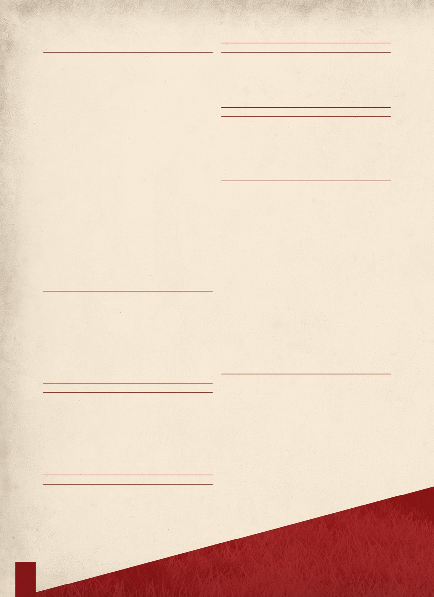« A Journeyman is always a normal player
of their type,

with the exception that they gain the Loner (4+) trait (see page 85),
representing their lack of familiarity with their temporary
team-mates.

« Journeymen may take the total number of players
on the team temporarily above 16 including injured

players, but cannot take the number of players available for this game
above 11.

« Each Journeyman counts towards CTV. The value they

add is equal to the hiring cost of an ordinary player
of their type as detailed in the team roster. Once you know how many
Journeymen your team will include, you should recalculate your CTV.

Note that a team drafted for exhibition play must contain at least 11
players. This step can be skipped during exhibition play.

**4. INDUCEMENTS**

head of any league fixtture, play-off season game or cross division
friendly, each team can spend gold pieces from their Treasury, from
Petty Cash

(see below) or from both, to purchase any Inducements available to
them. These are then recorded on the team's Game Record sheet.

Note that, as described on page 102, Inducements are handled
differently in exhibition play.

PETTY CASH
If one team has a lower CTV (including the value of any Journeymen
players), it is given 'petty cash' to spend on Inducements. The amount
of petty cash given is exactly equal to the difference in CTV between
the two teams.

Petty cash cannot be kept; it must be spent on Inducements for the
game ahead. Any gold pieces not

spent are lost.

TREASURY
Both teams are free to spend gold pieces from their Treasury to
purchase Inducements. If one of the teams has been given petty cash,
gold pieces from its Treasury can be added to this.

Gold pieces spent in this way are immediately deducted from the
Treasury.

**38**

C0MM0N INDUCEMENTS
The Inducements available are many and varied. Listed on page 89 are the
'common' Inducements, always available at the prices shown there.
Certain teams will have access to Inducements unique to them and future
supplements will detail those and more.

THE UNDERD0G
Once finishedd purchasing Inducements, you should recalculate your CTV.
If at this point one team has a lower CTV, that team is referred to as
the 'Underdog' and its coach may be eligible to appeal for 'divine
intervention' by rolling on the Prayers to Nufflee table in Step 5.

**5. THE PRAYERS TO NUFFLE TABLE**

n league play (but not in exhibition play), the Prayers
to Nufflee table may often be used during this step of the pre-game
sequence. In both league and exhibition

play, it may sometimes be used at the start of a drive, as described on
page 41.

During this step of the pre-game sequence, the coach of the Underdog
team may roll once on the Prayers

to Nufflee table for every full 50,000 gold pieces of difference in CTV.

Roll a D16 and consult the table on the page opposite, re-rolling any
duplicate results, and make a

note of the result(s). All results rolled on this table come into effect
at the start of the next drive. Most results last until the end of the
next drive (i.e., the drive which starts immediately after this roll is
made), then they cease

to apply. Others last until the end of the half and a few results last
until the end of the game.

**6. DETERMINE KICKING TEAM**

very game of Blood Bowl starts with a coin toss to determine which
team will be the 'kicking team'
(the defence) and which team will be the 'receiving

team' (the offence). In a real Blood Bowl game, this simple ceremony is
much beloved of Blood Bowl fans as
it is invariably when violence firrst breaks out between the teams, the
fans and, quite often, the officialss!

On the tabletop, this ritual can be recreated either
by tossing a Blood Bowl coin, or by a D6 roll-off. Once
it has been determined which is the kicking team and which is the
receiving team, the opening drive of the game begins in earnest with the
set-up and kick-off as described on page 40.

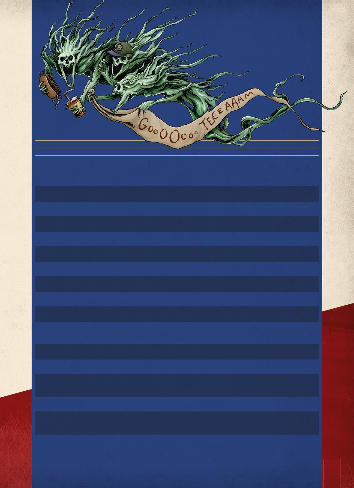

PRAYERS T0 NUFFLE TABLE

D16 RESULT

1 *Treacherous Trapdoor:* Until the end of this half, every time any
player enters a Trapdoor square, for any reason, roll a D6. On a roll
of 1, the trapdoor falls open and the player is immediately removed
from play. Treat

them exactly as if they had been pushed into the crowd. If the player
was in possession of the ball, it bounces from the trapdoor square.

2 *Friends with the Ref:* Until the end of this drive, you may treat a
roll of 5 or 6 on the Argue the Call table as a

"Well, When You Put It Like That..\" result and a roll of 2-4 as an "I
Don't Care!\" result.
3 *Stiletto:* Randomly select one player on your team that is
available to play during this drive and that does not

have the Loner (X+) trait. Until the end of this drive, that player
gains the Stab trait.
4 *Iron Man:* Choose one player on your team that is available to play
during this drive and that does not have

the Loner (X+) trait. Until the end of this game, that player improves
their AV by 1, to a maximum of 11+.
5 *Knuckle Dusters:* Choose one player on your team that is available
to play during this drive and that does not

have the Loner (X+) trait. Until the end of this drive, that player
gains the Mighty Blow (+1) skill.
6 *Bad Habits:* Randomly select D3 opposition players that are
available to play during this drive and that do not

have the Loner (X+) trait. Until the end of this drive, those players
gain the Loner (2+) trait.
7 *Greasy Cleats:* Randomly select one opposition player that is
available to play during this drive. That player

has had their boots tampered with! Until the end of this drive, their
MA is reduced by 1.
8 *Blessed Statue of Nuffe:e:* Choose one player on your team that is
available to play during this drive and that

does not have the Loner (X+) trait. Until the end of this game, that
player gains the Pro skill.
9 *Moles under the Pitch:* Until the end of this half, apply a -1
modifierr every time any player attempts to Rush

an extra square (-2 should it occur that both coaches have rolled this
result).
10 *Perfect Passing:* Until the end of this game, any player on your
team that makes a Completion earns 2 SPP,

rather than the usual 1 SPP.
11 *Fan Interaction:* Until the end of this drive, if a player on your
team causes a Casualty by pushing an

opponent into the crowd, that player will earn 2 SPP exactly as if
they had caused a Casualty by performing a Block action.

12 *Necessary Violence:* Until the end of this drive, any player on
your team that causes a Casualty earns 3 SPP,

rather than the usual 2 SPP.
13 *Fouling Frenzy:* Until the end of this drive, any player on your
team that causes a Casualty with a Foul action

earns 2 SPP exactly as if they had caused a Casualty by performing a
Block action.
14 *Throw a Rock:* Until the end of this drive, should an opposition
player Stall, at the end of their team turn

you may roll a D6. On a roll of 5+, an angry fan throws a rock at that
player. The player is immediately
Knocked Down.

15 *Under Scrutiny:* Until the end of this half, any player on the
opposing team that commits a Foul action is

automatically seen by the referee, even if a natural double is not
rolled.
16 *Intensive Training:* Randomly select one player on your team that
is available to play during this drive and

that does not have the Loner (X+) trait. Until the end of this game,
that player gains a single Primary skill of
your choice.

**39**

### The Start of A Drive

nce the coin toss or roll-offf to determine which team will kick

and which will receive is
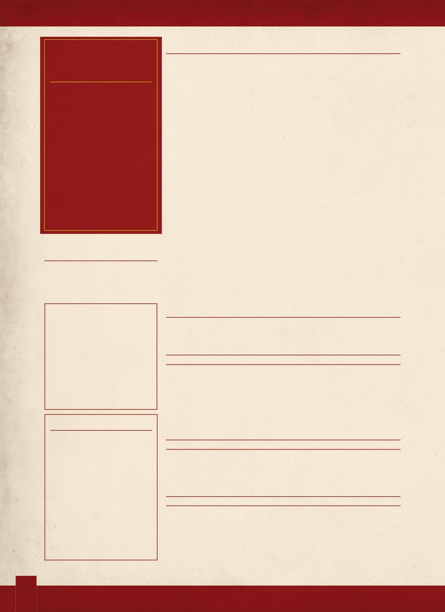resolved, the coaches will
take turns to set up their teams, ready for action and with the
shouted instructions of coaching stafff ringing in their ears. The
coach of the kicking team then places the ball, determines how
accurate (or how wildly inaccurate) the kick is, and rolls on the
Kick- offf Event table.

**START OF**
**DRIVE SEQUENCE**

t the beginning of every drive, both coaches run through the following

sequence of steps:

**1. SET-UP**

oth coaches place all of their available players on the pitch. If
there are more than 11 players available, those not chosen to play the
drive are placed in the Reserves box until the start of the next
drive. A team may

not set up more than 11 players at the start of a drive.

In later drives, the number of available players is likely to be
reduced, with players languishing in the Knocked-out or the Casualty
box. This is permitted, if not ideal! If you are unable to set up 11
players at the start of a later drive, you must set up all available
players - no players can be placed in the Reserves box if fewer than 11
players are available.

The kicking team set up firrst, followed by the receiving team, as
follows:

« Both teams set up fully within the area between their own End Zone and
the Line of Scrimmage. Neither team may set up any players beyond the
Line of Scrimmage in the opposition's half.

« Each team can set up a maximum of two players in each Wide Zone.
In other words, each team can set up four players in Wide Zones,
providing

they are split equally with two players per Widezone.
« A team must set up a minimum of three players in squares within the

Centre Field, directly adjacent to the Line of Scrimmage.

Note that should a team findd itself reduced to only three players or
fewer, it may concede without penalty before setting-up, as described on
page 67. Should you wish to play on, the available players should be set
up on the Line of Scrimmage, as described above.

**1**

*SET-UP:* Starting with the

**2. THE KICK-OFF**

**2**

kicking team, both coaches set up their teams.

*THE KICK-OFF:* A player on the kicking team kicks the

**O**

nce both teams have been set-up ready for the drive ahead, the coach of
the kicking team makes the kick-off.

**3**

ball to the offence.

*THE KICK-OFF EVENT:* The coach of the kicking team rolls on the
Kick-off Event table.

N0MINATE KICKING PLAYER
Although not always essential, certain rules require a specificc player
to be nominated as the kicking player. It is therefore useful to adopt
the habit of nominating a kicking player:

« The kicking player cannot be on the Line of Scrimmage (unless there
are

only three, or fewer, players belonging to their team on the pitch).

T00 MANY PLAYERS Sometimes, too many players will make their way onto
the pitch.
If this is spotted before the firrst turn of the drive, simply correct
the mistake. If, however, the mistake is not spotted until after the
firrst turn of the drive has begun, any extra player(s) will be
Sent-off for committing a Foul, exactly as described on page 63. Which
player(s) are Sent-off
is decided by the coach of the opposing team.

**40**

« The kicking player cannot be in either Wide Zone.

PLACE THE KICK
A good kick can help the defence and hinder the offence, and where to
place the ball is an important consideration when kicking. The coach of
the kicking team places the ball in any square they wish, occupied or
unoccupied, in the receiving team's half of the pitch.

THE KICK DEVIATES
Kicking the ball is not a precise art, and a bad kick can see the ball
land wildly off target. The coach of the kicking team rolls both a D8
and a D6 to determine deviation, as described on page 25. At this
moment, the ball itself is still high
in the air. No attempts can be made to catch it until after the
'kick-off event'
has been resolved.

**3. THE KICK-OFF EVENT**

THE KICK-ofF EVENT TABLE

**E**

very kick-off is a unique event. Almost anything can happen, and often
does!

2D6 RESULT
2 *Get the Ref:* Each team gains a free Bribe Inducement as described

on page 91. This Inducement must be used before the end of the game or
it is lost.

Immediately after the kick has deviated, whilst the ball is still high
in

the air, the coach of the kicking team
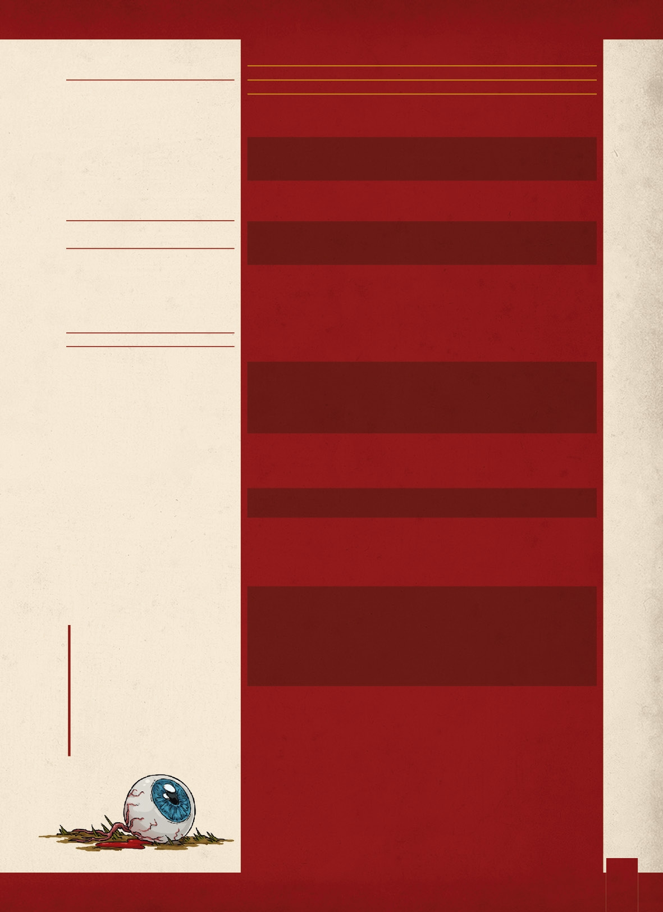rolls 2D6 and consults the Kick-off
Event table opposite.

WHAT G0ES UP,
MUST C0ME D0WN
Once the Kick-off event has been resolved, the ball will come back
down to be caught by a player or to land on the ground, as described
on page 25.

T0UCHBACKS
A kick-off must land safely in the receiving team's half of the
pitch.
If the ball deviates or bounces
off the pitch or across the Line of Scrimmage into the kicking team's
half of the pitch for any reason at
all, a 'touchback' is caused. When
a touchback is caused, after the Kick-off event has been resolved as
normal, the coach of the receiving team gives possession of the ball
to one of their players. No Agility test is required, the player is
simply handed the ball. Should it ever occur that
there is no Standing player on the receiving team to take possession
of the ball, the ball is given to a Prone or Stunned player and will
bounce.

"Creepers! Creepers!
They love a fightt
with Elves!
0r orcs, or Dwarfs,
or anyone
They'll even fightt themselves!"

*- Popular chant among* *Underworld Creepers fans*

3 *Time-out:* If the kicking team's turn marker is on turn 6, 7 or 8
for the half, both coaches move their turn marker back one space.

Otherwise, both coaches move their turn marker forward one space.
4 *Solid Defence:* D3+3 Open players on the kicking team may be

removed and set up again in different locations, following all of the
usual set-up rules.

5 *High Kick:* One Open player on the receiving team may be moved any

number of squares, regardless of their MA, and placed in the same
square the ball will land in.

6 *Cheering Fans:* Both coaches roll a D6 and add the number of
cheerleaders on their Team Draft list. The coach with the highest
total

may immediately roll once on the Prayers to Nufflee table. In the
case
of a tie, neither coach rolls on the Prayers to Nufflee table. Note
that if you roll a result that is currently in effect, you must
re-roll it. However,
if you roll a result that has been rolled previously but has since
expired, there is no need to re-roll it.

7 *Brilliant Coaching:* Both coaches roll a D6 and add the number of
assistant coaches on their Team Draft list. The coach with the highest

total gains one extra team re-roll for the drive ahead. If this team
re- roll is not used before the end of this drive, it is lost. In the
case of a tie, neither coach gains an extra team re-roll.

8 *Changing Weather:* Make a new roll on the Weather table and
apply that result. If the weather conditions are 'Perfect Conditions'

as a result of this roll, the ball will scatter, as described on page
25, before landing.

9 *Quick Snap:* D3+3 Open players on the receiving team may

immediately move one square in any direction.
10 *Blitz:* D3+3 Open players on the kicking team may immediately

activate to perform a Move action. One may perform a Blitz action
and one may perform a Throw Team-mate action. If a player Falls Over
or is Knocked Down, no further players can be activated and the Blitz
ends immediately.

11 *Offciousus Ref:* Both coaches roll a D6 and add their Fan Factor
to
the result. The coach that rolls the lowest randomly selects one of
their players from among those on the pitch. In the case of a tie,
both

coaches randomly select a player. Roll a D6 for the selected
player(s). On a roll of 2+, the player and the referee argue and come
to blows. The player is Placed Prone and becomes Stunned. On a roll of
1 however, the player is immediately Sent-off, as described on page
63.

12 *Pitch Invasion:* Both coaches roll a D6 and add their Fan Factor
to the result. The coach that rolls the lowest randomly selects D3 of

their players from among those on the pitch. In the case of a tie,
both coaches randomly select D3 of their players from among those on
the pitch. All of the randomly selected players are Placed Prone and
become Stunned.

**41**

### The Team Turn

game of Blood Bowl is a hectic affairr, and to make sense of all of
the action, the game on the tabletop is broken

down into a series of team turns, during which each coach will
activate their players one at
a time. In this way, the drama of the game is
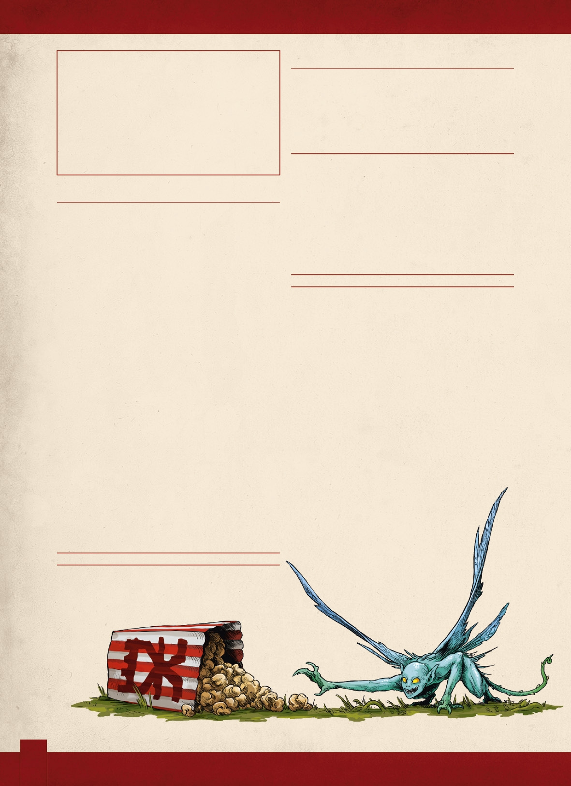recreated in a manageable and controlled
way.

**TEAM TURNS**

**MOVING THE TURN MARKER**

s mentioned previously, it is your responsibility at the beginning of
each and every one of your team turns to move the turn marker along
the Turn

tracker on your dugout. If either coach forgets to move their turn
marker, a polite reminder to do so is in order.

**PLAYER ACTIVATIONS**

uring your team turn, you may activate each Standing and/or Prone
player to perform one action available to them, but you are not
obliged

to activate every player. Players that begin their team turn

**O**

nce the Kick-off has been resolved, the game continues in a simple but
strict sequence of team turns:

Stunned cannot be activated. In ideal circumstances, you will be able to
activate every player without mishap, but

all too often a turn will end with a Turnover, meaning that some players
will inevitably not have been activated when

*1. RECEIVING TEAM,S TURN:* At the start of any
drive the receiving team, the offence, takes the firrst

team turn.
*2. KICKING TEAM,S TURN:* After the receiving team have

taken their turn, play passes to the team that kicked, the defence.

This sequence is repeated until the drive ends with a touchdown, the
end of a half or the end of the game:

« At the beginning of the firrst half, which team kicks-off and which
team receives will have been decided by the

coin toss, as described on page 38.
« At the beginning of the second half, play is reversed,

with the team that received and played offence at the start of the
game now becoming the kicking team, and vice versa.

« Should any drive end with a touchdown before the end of the half,
the team that scored the touchdown will

kick to the team that conceded the touchdown.

A team turn ends either once all eligible players
have been activated, or as the result of a Turnover (see

page 23).

ACTIVE AND INACTIVE TEAM
During your team turn, your team is referred to as the 'active' team.
During your team turn, your opponent's team is referred to as the
'opposition' or the 'inactive' team.

**42**

the turn ends.

DECLARING ACTI0NS
When you activate a player, you must declare the action that player will
perform (and, if required, the target of that action). You may not move
a player and then declare that player will perform a Pass, Throw
Team-mate, Hand-off, Blitz or Foul action. If a player is moved without
firrst declaring their action, the player can only perform a
simple Move action.

You are never obliged to complete a declared action. For example, if you
declare a player will perform a Pass action, you may decide against
performing the Pass action itself once movement is complete. If, after
moving, you decide against performing the declared action, the action
still counts as having been performed this team turn and cannot be
performed by another player.

M0VE
The most basic action. Any player on the active team that is not
Stunned can perform a simple Move action. Movement is covered in more
detail on page 44.

PASS
Once per team turn, a player on the active team may attempt to pass
the ball to another square, as described
on page 48.

HAND-ofF
Once per team turn, a player on the active team may attempt to hand
the ball off to another Standing player from their team that is in an
adjacent square, as described on page 51.

THR0W TEAM-MATE
Once per team turn, instead of performing an ordinary
Pass action, a player on the active team with the 'Throw Team-mate'
trait may attempt to throw a player from
their team that has the 'Right Stuff' trait. A team may
not perform both a Pass action and a Throw Team-mate action during the
same team turn. Throwing team-mates is covered in more detail on page
52.

BL0CK

'Block' is the term used when a player targets an opposition player
with an attack, hoping to push them back, knock them to the ground and
perhaps cause a lasting injury. A Standing player on the active team
can target a Standing opposition player that is within their Tackle
Zone with a Block action (or a Special action granted by a Skill or
Trait that can be performed instead of a Block action), but cannot
move before or after performing the action. Blocking is covered in
more detail on page 56.

BLITZ
Once per team turn, a player on the active team may perform a Blitz
action, an action that combines together both a Move action and a
Block action (or a Special
action granted by a Skill or Trait that can be performed instead of a
Block action). When a player performs a Blitz action, they may move as
normal. However, performing
the Block action costs a Blitzing player one square of their Movement
Allowance. The player may move both before and after performing the
Block action if they wish, and
may follow-up if the target of the Block action is pushed back.
Movement is covered in more detail on page 44 and Blocking is covered
in more detail on page 56.

F0UL

Once per team turn, a player on the active team may commit a Foul
action, stealthily sticking the boot into a downed opponent when they
hope no one is looking! Fouling is covered in more detail on page 63,
but be warned that such flaagrant disregard for the rules may
result in the active player being Sent-off and the team turn ending with
a Turnover.

SPECIAL ACTI0NS
In addition to these seven main actions, there are numerous Skills and
Traits a player may possess that
allow them to perform another, unique action. Examples include Hypnotic
Gaze, which allows a player to transfixx an opponent, causing them to
temporarily lose their Tackle Zone so that they cannot Mark other
players.

Such actions are called 'Special actions' and are detailed in the
appropriate Skill or Trait description. A full

list of Skills, Traits and descriptions of how they work can be found on
page 74.

**ACTIVATED PLAYERS**

uring a game of Blood Bowl, it can become difficcult to keep track of
which players have already been activated during their team turn, and
which players

are yet to be activated.

To help with this, at the start of each team turn
you should make sure that all of your players are facing

towards the same End Zone. Once a player has been activated, the model
should be turned around, so that
it is facing towards the other End Zone. In this way, both coaches are
able to tell easily which players have been activated and which players
have yet to be activated.

A Standing player that loses their Tackle Zone should be turned to face
one of the Sidelines. The player should be left facing the Sideline
until their next activation begins.

**43**

### Movement

uring their team turn, a number of actions allow a player to move
about
the pitch when activated, as mentioned

previously. Sometimes a player may even be moved involuntarily as a
result of a block or another in-game effecct. This section deals with
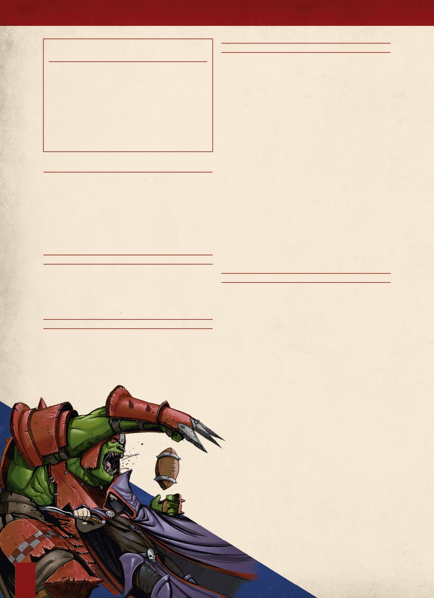how players are moved around the pitch
and how other players, particularly the opposition, can hinder their
progress.

**MOVING PLAYERS**

hen a player moves, they may move a number of squares equal to their
Movement Allowance. A player may move in any direction: forwards,

backwards, left, right and diagonally, into any adjacent, unoccupied
square. Moving players are not obliged to
use their full Movement Allowance and may move zero squares should you
wish. Players cannot voluntarily move off the pitch.

UN0CCUPIED SQUARES
Any square that is not occupied is said to be 'unoccupied'. Players
may move into any unoccupied square that is adjacent to the square
they occupy. Only players can occupy a square, if a square contains
only the ball or a trapdoor, it is unoccupied.

0CCUPIED SQUARES
If there is a Standing, Prone or Stunned player from either team in a
square, that square is said to be 'occupied'. Players may not move
into or through an occupied square. The ball can never come to rest on
the ground in an occupied square and will continue to bounce until it
lands in an unoccupied square or is caught by a Standing player.

**44**

STANDING UP
A Prone player can do nothing without firrst standing up. A Prone player
can stand up when they are activated to perform any action that includes
movement:

« The only time a Prone player can stand up is during

their team turn, at the start of their activation.
« Standing up costs a Prone player three (3) squares of

their Movement Allowance.
« If a Prone Player with a Movement Allowance of 2 or

less (before or after modificcation) wishes to stand up, roll a D6:

- On a roll of 4+, the player is able to stand up, using

their full Movement Allowance to do so.

- On a roll of 1-3, the player is unable to right

themselves. They remain Prone and theiractivation ends.

- A Prone player with a Movement Allowance of 2 or

less (before or after modificcation) may Rush after standing up.

If a Prone player is not activated during their team turn, they will
remain Prone until they are activated in a later turn.

RUSHING
Whenever a player performs any action that includes movement, they may
attempt to gain an extra one or two squares of Movement Allowance. This
is called 'Rushing'. These extra squares of Movement Allowance may be
used to move, to perform a Block action as part of a Blitz action (see
page 59), to Jump over a Prone or Stunned player (see page 45) and so
on, just as if they were normal movement:

« At the end of the player's movement, declare that they

will Rush and move them one more square.« After the Rushing player has been moved, roll a D6:

- On a roll of 2+, the Rushing player moves

without mishap.

- On a roll of 1 (before or after modificcation), the

Rushing player trips and Falls Over as described on page 27.

If the Rushing player is still Standing after Rushing once, they may
attempt to Rush a second time following the same process.

When a player is Rushing, the D6 roll comes before any other rolls that
may be required, be they to Dodge, pick up the ball or anything else.

MARKED PLAYERS
AND D0DGING
If an active player is being Marked,
as described on page 26, by one or more opposition players, they must
'Dodge' in order to vacate the square they currently occupy and move
safely into another, otherwise they will
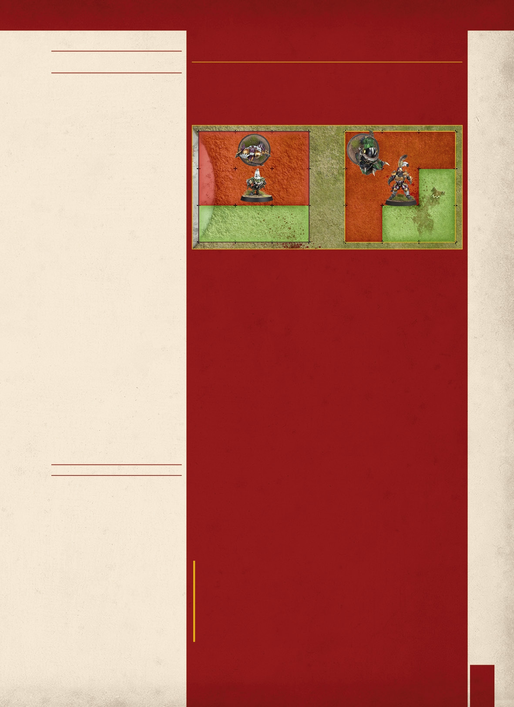be tackled and will Fall Over in the
square they wish to move into.

To Dodge, a player must test against their Agility as described on
page 29. Declare that the player will Dodge from the square in which
they are being Marked, and move them into any adjacent, unoccupied
square:

« The Agility test is made after the dodging player has been moved,
Rushing firrst if necessary.

« No matter how many players were Marking them, the dodging player is
only required to make one

Agility test to Dodge.
« If the dodging player is being

Marked in the square they have moved into, apply a -1 modifierr per
player Marking them.

Note that if the player is Open in the square they have moved into,
there are no modifierrs to apply for

being Marked. However, there may be modifierrs to apply for other
reasons, such as Skills and Traits being used
by an opposing player.

0PEN PLAYERS
A player that is Open does not need
to Dodge to move from square to square. An Open player may move
into an unoccupied square that is within the Tackle Zone of one or
more opposition players, so that they are now Marking those players
and being Marked by them in turn. The moving player may then stop
moving or may continue to move, but will have to Dodge as described
above.

**JUMPING OVER PRONE OR STUNNED PLAYERS**

nce during their activation, a moving player can attempt to Jump over
a single adjacent square that is occupied by a Prone or Stunned
player, into an unoccupied square beyond. The squares the active
player can

attempt to Jump into will depend upon the direction in which they are
moving, as shown in the diagrams below:

Jumping over a square in this way uses Movement Allowance exactly as if
the player had moved into and out of the square they are jumping over.
To Jump over a square that contains a Prone or Stunned player, a player
must test against their Agility as described on page 29:

« The Agility test is made after the jumping player has been moved,
Rushing

firrst if necessary.
« Apply a negative modifierr equal to the number of players that were
Marking

the jumping player in the square they jumped from or equal to the
number of players that are Marking the jumping player in the square
they have jumped into, whichever is the greatest. For example, if a
player jumps from
a square in which they were being Marked by one player into a square
in which they are being Marked by two players, a -2 modifierr is
applied.

« If the jumping player was being Marked in the square they jumped from,

they are not required to Dodge.

Note that if the jumping player was Open in the square they have jumped
from and is Open in the square they have jumped into, there are no
modifierrs
to apply for being Marked. However, there may be modifierrs to apply
for
other reasons.

If the Agility test is failed, the jumping player will Fall Over in the
square they have jumped into. If, however, the Agility test is failed on
a natural 1, the jumping player is placed back in the square they were
trying to Jump from and

they will Fall Over in that square.

MINDY PIEWHISTLE'S RUM0UR R0UND-UP
*VaIen SwIft must have annoyed a reporter somehow, because a number*
*of pubIIcatIons (IncIudIng SpIke!) have been makIng It known that
he's* *put on a whoIe heap of weIght. Now, I'm not one to jump to the
defence* *of an eIf, but I can smeII a smear campaIgn a mIIe offf. I
mean, have you* *seen what VaIen eats? I don't thInk It's hIs dIet
that's the probIem so* *much as hIs Iove of BIoodweIser beer..*

**45**

**BLITZ ACTIONS**

nce per team turn, as mentioned on page 43, a single Standing or Prone
player on the active team may be activated to perform a Blitz action.
When a

player Blitzes, they may move exactly as described in this section;
standing up and dodging as necessary, and they may attempt to gain
extra squares of Movement Allowance

by Rushing. In addition, they may perform a Block action
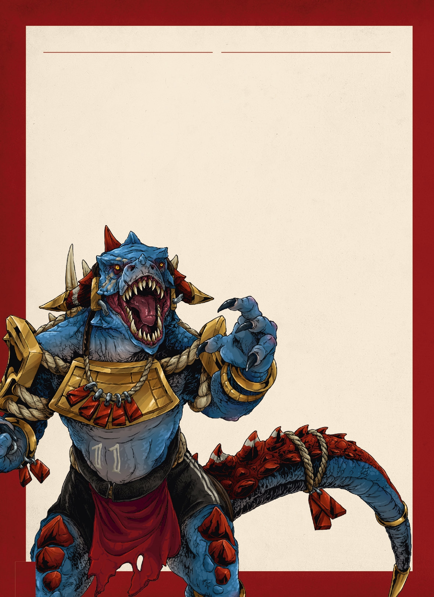(or a Special action granted by a Skill
or Trait that can
be performed instead of a Block action) at any point
before, during or after their movement. The only notable difference is
that when a player Blitzes, performing a
Block action (or a Special action granted by a Skill or Trait that can
be performed instead of a Block action) costs the player one square of
their Movement Allowance.

Block actions and Blitz actions are covered in greater detail on page
56.

**46**

**PICKING UP THE BALL**

f a player voluntarily moves into a square in which the ball is
placed, they must attempt to pick it up. This attempt to pick up the
ball is made after any dice rolls

required to Rush, Dodge or Jump into the square have been made, but
before any other dice rolls are made.

To pick up the ball, a player must test against their Agility as
described on page 29:

« If the player is Open when attempting to pick up the

ball, there are no modifierrs to apply.
« If the player is being Marked, apply a -1 modifierr per

player Marking them.
« If a player attempts to pick up the ball and fails, the

ball will bounce as described on page 25. Should this happen, a
Turnover is caused, even if the bounce is caught by another player on
the active team.

After successfully picking up the ball, the player may continue moving
if they wish and if they are able.

Note that should a player ever be moved involuntarily into a square in
which the ball is placed, they

cannot attempt to pick it up. Instead the ball will bounce, but no
Turnover is caused.

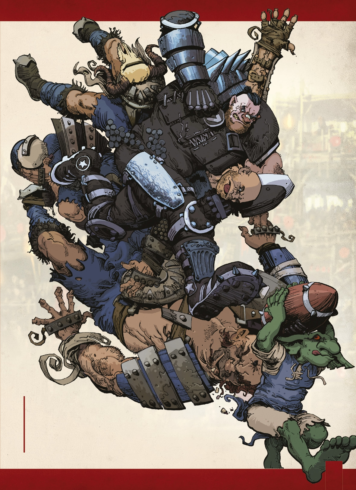

MINDY PIEWHISTLE'S

RUM0UR R0UND-UP
*They say the weather can have a bIg Impact on a game.* *ApparentIy
thIs one tIme, durIng a freak magIcaI bIIzzard,* *the ball vanIshed
durIng the kIck-offf. ThIs supposedIy* *dIdn't affecct the game
though, as none of the pIayers* *notIced untII the second haIf!*

**47**

### Passing The Ball

raditionally in Blood Bowl, play progresses with a series of dramatic
passes and catches. Throwers endeavour to get the

ball safely to a team-mate, who, thanks to their strength,speed and
agility, is in position to
run with the ball into the opposition End Zone.
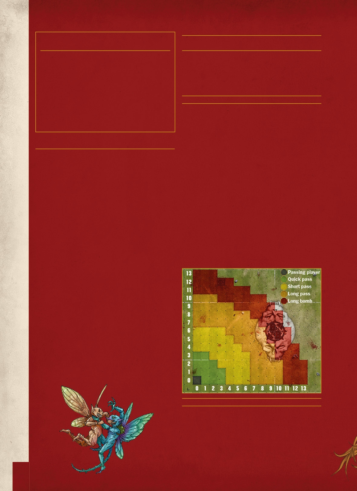Whilst in recent years many players that
prefer
to run with the ball have risen to superstardom,
it is still the spectacle of the passing game that excites the crowds
the most!

**PASS ACTIONS**

nce per team turn, a player on the active team may perform a Pass
action in order to pass the ball to another square. This target square
may be

occupied by a Standing, Prone or Stunned player (from either team) or
it may be unoccupied.

A Pass action can be further definedd as being a 'Quick pass', a
'Short pass', a 'Long pass' or a 'Long bomb', based on the range as
described opposite.

The player may move before performing the action following all of the
normal movement rules, but once the pass has been resolved they may
not move further and

their activation comes to an end. The player performing the action
does not need to be in possession of the ball when activated, they may
pick the ball up as they move (see page 46):

« *MEASURE RANGE AND DECLARE TARGET SQUARE:*

The range ruler is used to measure the range to any possible target
squares, before the target square is chosen and declared.

« *TEST FOR ACCURACY:* The coach of the player performing the action
rolls a D6 to determine the

accuracy of the pass.
« *PASSING INTERFERENCE:* Unless the pass was

fumbled, one opposition player may be able to attempt to interfere
with the pass, hoping to 'Deflecct' or 'Intercept' it.

« *RESOLVE PASS ACTION:* If the pass was neither fumbled nor
interfered with, the pass itself is resolved!

**48**

MEASURE RANGE AND
DECLARE TARGET SQUARE
Once you have activated a player and declared that
they will perform a Pass action, you are free to measure the range
between the player and any possible target squares whenever you wish,
even interrupting the player's movement to do so.

MEASURING RANGE
Range is measured by placing the circle at the end of the range ruler
over the centre of the square occupied by the player performing the
action. The other end of the range ruler is positioned so that the ruler
covers the target square, with the line along the centre of the range
ruler passing through the centre of the target square. The target square
will fall into one of the four bands marked on the range ruler:

« *I:* Quick pass
« *II:* Short pass
« *III:* Long pass
« *IIII:* Long bomb

Any squares that are beyond the reach of the range ruler or that are
intersected by the end of the range ruler are out of range and cannot be
the target square.
If the line between two range bands intersects the target square, it is
considered to fall within the higher range band. If it is not clear
which range band the target square falls into, refer to the Passing
Range chart shown below:

DECLARE TARGET SQUARE
After you have measured for range and moved the player, you must
indicate and declare which square will be the target square. The target
square may be occupied by a Standing, Prone or Stunned player (from
either team) or it may be unoccupied.

TEST F0R ACCURACY
The player performing the action now tests against their Passing
Ability to see if the pass is 'accurate', 'inaccurate', 'wildly
inaccurate' or is 'fumbled'. A Passing Ability test
is made as described on page 29, applying the following modifierrs
based on range:

« If the player is attempting a Quick pass, there is

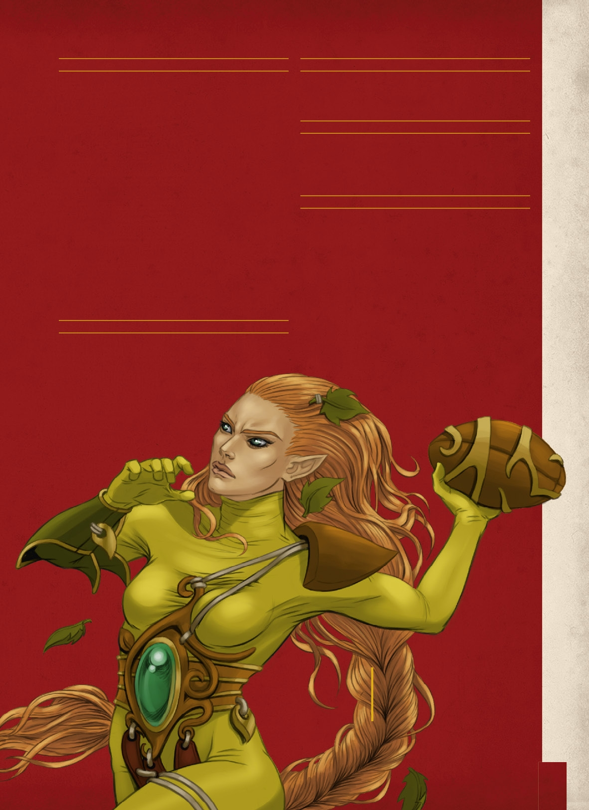no modifierr.
« If the player is attempting a Short pass, apply a

-1 modifierr.
« If the player is attempting a Long pass, apply a

-2 modifierr.
« If the player is attempting a Long bomb, apply a

-3 modifierr.

In addition, the following modifierrs may also apply:

« If the player is being Marked, apply an additional -1

modifierr per player Marking them.

ACCURATE PASSES
If the Passing Ability test is passed, or if the roll is a
natural 6, the pass is accurate and the ball will land in the target
square.

INACCURATE PASSES
If the Passing Ability test is failed, the pass is inaccurate and the
ball will scatter from the target square
before landing.

WILDLY INACCURATE PASSES
If, when making the Passing Ability test, the dice roll is a 1 after
modifierrs have been applied, the ball will deviate from the square
occupied by the player performing the Pass action before landing.

FUMBLED PASSES
There is always a chance something will go horribly wrong and the pass
will be fumbled:

« If, when making the Passing Ability test, a natural 1 is

rolled, the pass has been fumbled.
« If the player has a PA of '-', the pass is

automatically fumbled.

When a Pass action is fumbled, the activation of
the player performing it ends immediately. The ball is dropped, bouncing
from the square occupied by the player performing the action, and a
Turnover is caused.

"It's not about winning.
It's about looking
fabulous!"

*- Jordell Freshbreeze*

**49**

PASSING INTERFERENCE
If the pass was not fumbled, a single player from the opposing team
may be able to attempt to interfere
with the pass, hoping to 'Deflecct' the pass or, in some
rare cases, to 'Intercept' the pass. To determine if
any opposition players are able to attempt passing interference, place
the range ruler so that the circle at the end is over the centre of
the square occupied by the player
performing the Pass action. Position the
other end so that the ruler covers the square in which the ball will
land. Note that, depending upon the Passing Ability test, this may not
be the target square!

To attempt to interfere with a pass, an opposition player must be:

« A Standing player that has not lost their Tackle Zone

(as described on page 26).
« Occupying a square that is between the square

occupied by the player performing the Pass action and the square in
which the ball will land.

« In a square that is at least partially beneath the range

ruler when placed as described above.

If any opposition players are in a position to
attempt to interfere with a pass, the coach of the opposing team
nominates one to make the attempt and tests against their Agility,
applying the following modifierrs to represent the difficculty of
attempting to snatch the ball from the air:

« If the player is attempting to interfere with an accurate

pass, apply a -3 modifierr.
« If the player is attempting to interfere with an

inaccurate pass, apply a -2 modifierr.
« If the player is attempting to interfere with a wildly

inaccurate pass, apply a -1 modifierr.
« Apply an additional -1 modifierr if the player

is being Marked.

**50**

SUCCESSFUL PASSING INTERFERENCE
If the Agility test is passed, the player's attempt to interfere with
the pass has been successful and the pass has been 'Defleccted'. The
pass is interrupted and the action immediately ends.

The player that made the Deflecction must now attempt to convert that
Deflecction into an 'Interception'

by catching the ball as described opposite. If they do, they have made
an Interception. If the player fails to catch the ball, it will scatter
from the square they occupy.

Following any successful passing interference, if
the ball comes to rest on the ground in an empty square

or in the possession of a player from the opposing team,
a Turnover is caused. If, however, the ball is caught by a player on the
active team after scattering, no Turnover
is caused.

RES0LVE PASS ACTI0N
If the pass was neither successfully interfered with nor fumbled, the
pass itself is now resolved. Where the ball lands is determined based on
the result of the Passing Ability test as described previously. If the
ball lands in a square occupied by a Standing player that has not lost
their Tackle Zone, that player must attempt to catch it,
as described opposite. If no player on the active team catches the ball
after a Pass action and the ball comes to rest on the ground or in the
possession of a player from the inactive team, a Turnover is caused.

**CATCHING THE BALL**

**THROW-INS**

here are many instances when the rules will call upon a player to
attempt to catch the ball. A player that is able to catch the ball
must attempt to do

so, even if their coach does not want that player to catch

**S**

hould the ball leave the pitch at any time, the crowd will throw it back
into play. This is done using the Throw-in template:

the ball!

To catch the ball, a player must test against their Agility as
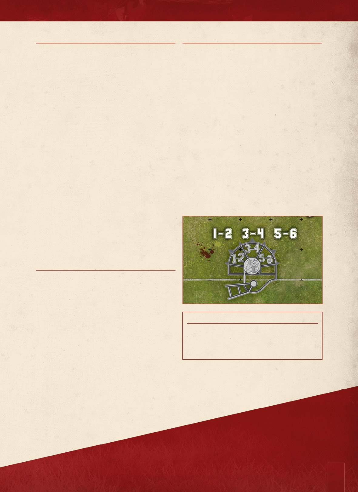described on page 29, applying the
following modifierrs:

« If the player is attempting to catch an accurate pass or a Hand-off
(see page 49 and below), there are

no modifierrs.
« If the player is attempting to convert a Deflecction into

an Interception, apply a -1 modifierr.
« If the player is attempting to catch a bouncing ball,

apply a -1 modifierr.
« If the player is attempting to catch a ball that has

been thrown-in by the crowd (see opposite), apply a
-1 modifierr.

« If the player is attempting to catch a ball that has scattered or
deviated into the square they occupy,

apply a -1 modifierr.

In addition to the above, the following modifierrs may also apply:

« If the player is being Marked, apply an additional -1

modifierr per player Marking them.
**HAND-OFF**

n addition to performing a Pass action, once per
team turn a player on the active team may perform a Hand-off action
and simply hand the ball to a Standing

team-mate in an adjacent square. The player may move before performing
the Hand-off action following all of the normal movement rules, but
once the action has been made and the ball handed to a team-mate,
their activation comes to an end and they cannot move further. As with
passing, the player performing the Hand-off action does
not need to be in possession of the ball when activated, they may pick
it up as they move (see page 46).

A Hand-off action is not a Pass action, and there is no test required
to perform the action itself and
even a player with a PA of '-' may perform a Hand-off action. The
player performing the action simply needs
to be in possession of the ball. The player receiving the ball,
however, must test against their Agility to catch it, as described
above.

« Position the Throw-in template (as shown in the
diagram below) with the Blood Bowl logo over the last

square the ball occupied before leaving the pitch and roll a D6 to
determine the direction the ball travels in.

« When the ball is thrown-in by the crowd, it travels 2D6 squares from
the last square it occupied before leaving

the pitch, in the direction indicated by the Throw-in template, before
landing.

« If the ball lands in a square that is occupied by a Standing player
that has not lost their Tackle Zone,

that player must attempt to catch it. If they fail, or if the ball
lands in an unoccupied square or a square that
is occupied either by a Standing player that has lost their Tackle
Zone or by a Prone or Stunned player, it will bounce before it comes
to rest on the ground.

Should the ball leave the pitch again following an over-enthusiastic
throw-in, repeat the above process.

C0RNER THR0W-INS
Should the ball leave the pitch from a corner square, the direction of
the throw-in is determined by placing the Random Direction template,
as shown in the diagram on page 21, and rolling a D3.

**51**

### Throwing other Players

ne tactic that has proven a hit with fans the world over is one that
seems to
have been firrst employed in aggression,

rather than as a cunning way to score. In the
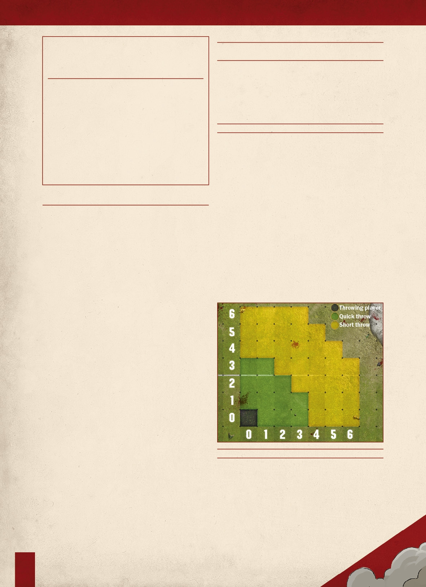old days, it was not uncommon for Big
Guy players to pick up particularly diminutive opponents and simply
toss them into the waiting crowds! These days it is normal to
see a Big Guy pitching a puny pal towards the opposition End Zone.. or
simply forgetting what's going on and eating them!

**THROW TEAM-MATE ACTIONS**

nce per team turn, instead of performing a Pass action, a player on
the active team with the
'Throw Team-mate' trait can attempt to throw

a team-mate with the 'Right Stuff' trait as if they were
a ball. The target square of a Throw Team-mate action
may be occupied or unoccupied and the action can
be further definedd as being a 'Quick Throw' or a 'Short Throw', based
on the range. Unlike a Pass action, a Throw Team-mate action that is
not fumbled will always scatter before landing.

If the player to be thrown is Standing, they can attempt to land
safely after being thrown (see page 54).

If they are Prone or Stunned, they can still be thrown but cannot land
safely.

The player performing the action may move firrst following all of the
normal movement rules, but must be in a square adjacent to the player
they wish to throw when the throw
is made; they cannot pick up and carry a team-mate
before throwing them. Once the throw has been resolved, they may not
move further and their activation comes to
an end:

« *MEASURE RANGE AND DECLARE TARGET SQUARE:*

The range ruler may be used to determine the
range between the throwing player and any possible target squares,
before the target square is chosen
and declared.

« *TEST FOR QUALITY:* The coach of the player
performing the action rolls a D6 to determine the

quality of the throw.
« *RESOLVE THROW:* Where the thrown player lands, and

how easily, depends upon the quality of the throw. If
the throw is fumbled, the thrown player is dropped and will bounce.

**52**

MEASURE RANGE
AND DECLARE TARGET SQUARE
As with a Pass action, once the player performing the Throw Team-mate
action has been activated and the action declared, you are free to
measure the range between the player and any possible target squares
whenever you wish, even interrupting the player's movement to do so.

MEASURING RANGE
When throwing a team-mate, range is measured using the range ruler
exactly as described on page 48. However, when throwing a team-mate,
only half of the range ruler is used. Therefore the target square will
fall into one of the two bands marked on the firrst half of the range
ruler:

« *I:* Quick throw
« *II:* Short throw

Any squares that are beyond the reach of the range ruler or that are
intersected by the end of the range ruler are out of range and cannot be
the target square. If the line between the two range bands intersects
the target square, the target square is considered to be within the
higher range band. If it is not clear which range band the target square
falls into, refer to the Throw Range chart shown below:

DECLARE TARGET SQUARE
Once range has been measured and the player performing the action has
completed their movement, the target square is declared. The target
square must be in range
and may be occupied or unoccupied.

TEST F0R QUALITY
Once the range has been measured and the target square declared, a
Passing Ability test is made to determine if the throw is 'superb',
'successful', 'terrible' or is 'fumbled'. The player performing the
action makes a Passing Ability test
as described on page 29, applying the following modifierrs based on
range:

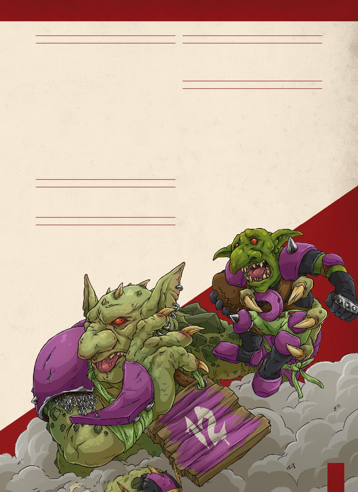« If the player is attempting a quick
throw, there is

no modifierr.
« If the player is attempting a short throw, apply a

-1 modifierr.

In addition to the above, the following modifierrs may also apply:

« If the player is being Marked, apply an additional -1

modifierr per player Marking them.

SUPERB THR0WS
If the Passing Ability test is passed, or if the roll is a
natural 6, the throw is superb. After scattering, the thrown player
will findd it easier to land.

SUCCESSFUL THR0WS
If the Passing Ability test is failed, the throw is still successful.
After scattering, the thrown player will findd it harder to land.

TERRIBLE THR0WS
If, when making the Passing Ability test, the dice roll is a
1 after modifierrs have been applied, the thrown player will deviate
from the square occupied by the player performing the Throw action
before landing.

FUMBLED THR0WS
Often, smaller players object to being thrown and will squirm a bit.
When they do, there is a chance that the throw will be fumbled:

« If, when making the Passing Ability test, a natural 1 is

rolled, the throw has been fumbled.
« If the player performing the Throw Team-mate action

has a PA of '-', the throw is automatically fumbled.

When a Throw Team-mate action is fumbled, the action is unsuccessful and
the activation of the player performing it ends immediately. The player
that was to be thrown is dropped and will bounce (as if they were a

ball) from the square occupied by the player performing the action,
after which they must attempt to land, as described on page 54.

**53**

RES0LVE THR0W TEAM-MATE ACTI0N
A Throw team-mate action cannot be interfered with. Therefore, if the
throw was not fumbled, the throw itself is now resolved. The thrown
player must now attempt to land, as described below, hopefully on
their feet!

**LANDING**

f the thrown player was Standing and had not lost their
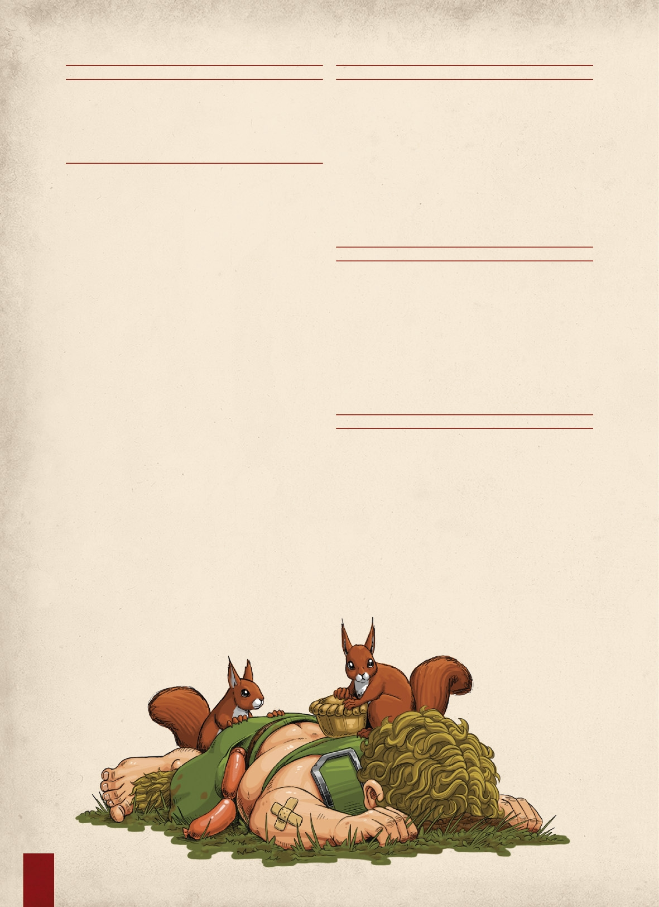Tackle Zone before they were thrown, and
if the player lands in an unoccupied square, they will attempt to

land safely. To land safely, the thrown player must pass an Agility
test, applying the following modifierrs:

« If the throw was superb, there are no modifierrs. « If the throw was
fumbled, apply a -1 modifierr.
« If the throw was successful, apply a -1 modifierr. « If the throw
was terrible, apply a -2 modifierr.

In addition, the following modifierrs may also apply:

« If the player is being Marked in the square they land in, apply an
additional -1 modifierr per player

Marking them.

If the Agility test is passed, or if the roll is a natural 6, the
thrown player will land safely and is considered to have moved
voluntarily.

If the Agility test is failed, the thrown player will land badly and
is considered to have moved involuntarily. The thrown player will Fall
Over, as described on page 27. If the thrown player was in possession
of the ball, a Turnover is caused. Otherwise, no Turnover is caused.

If the thrown player has not yet been activated this turn, they may be
activated later in the turn if possible, i.e.,

if they are not Stunned after a traumatic landing.

**54**

LANDING IN AN 0CCUPIED SQUARE
If after the scatter has been resolved, the thrown player lands in an
occupied square:

« The player occupying the square is Knocked Down (an Armour roll and
possible Injury roll is made against them even if they were already
Prone or Stunned).

« The thrown player will bounce (as if they were a ball) from the square
they land in and will automatically Fall

Over upon landing, as described on page 27.
« Should the thrown player bounce into another

occupied square, the above process is repeated.

CRASH LANDING
If the thrown player was Prone or Stunned, or had lost
their Tackle Zone before they were thrown, they cannot attempt to land
safely:

« Once the scatter has been resolved, the player will bounce (as if they
were a ball) from the square they

land in.
« The player will automatically Fall Over after bouncing

and an Armour roll and possible Injury roll is made against them.

LANDING IN THE CR0WD
Should the thrown player scatter off the pitch, they will
land in the crowd. The player is immediately removed from play and
placed in their team dugout. Landing in the crowd is very dangerous as
Blood Bowl fans are notoriously violent, so the player risks 'Injury by
the Crowd', as described on page 61. This will determine if the player
is placed in the Reserves, Knocked-out or Casualty box.

If a player in possession of the ball lands in the crowd after being
thrown, a Turnover is caused and
the ball will be thrown-in by the crowd as described on page 51.

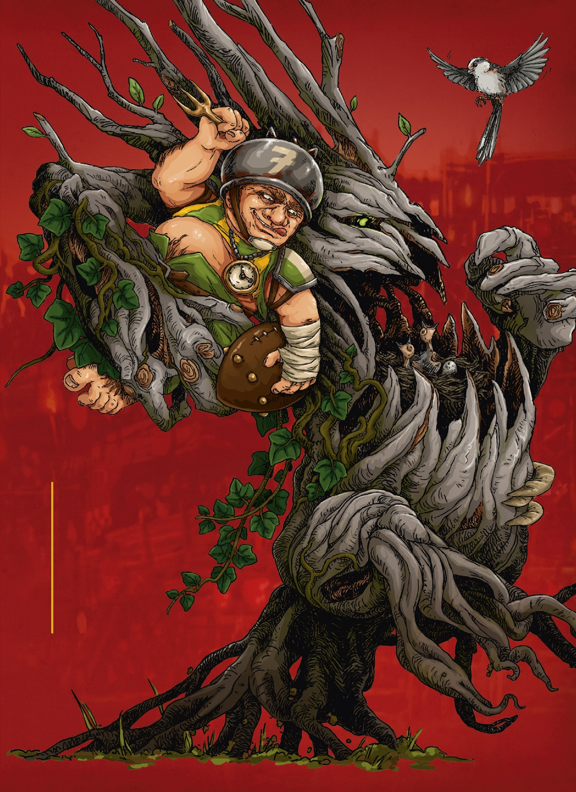

MINDY PIEWHISTLE'S
RUM0UR R0UND-UP
*They say, one of the bIggest mIstakes* *McMurty's made was
IntroducIng the*
*BIg Murt sandwIch, a specIaI edItIon* *versIon of theIr famous BIg
Moot.*
*The marketIng campaIgn was enormous,* *they even got the GaIadrIeth
GIadIators* *InvoIved - but then the news broke*
*that It was somethIng called a 'veggIe* *burger', made of wheat,
mushrooms and* *beans. What were they thInkIng?*

**55**

### Blocking

t its most basic, a block is a very rough tackle. The rules of Blood
Bowl allow
players to do almost anything to bring down

an opponent, and provided weapons aren't used, the offcialsls rarely
make any distinction between a skilled tackle and a frenzied rain of
pummelling

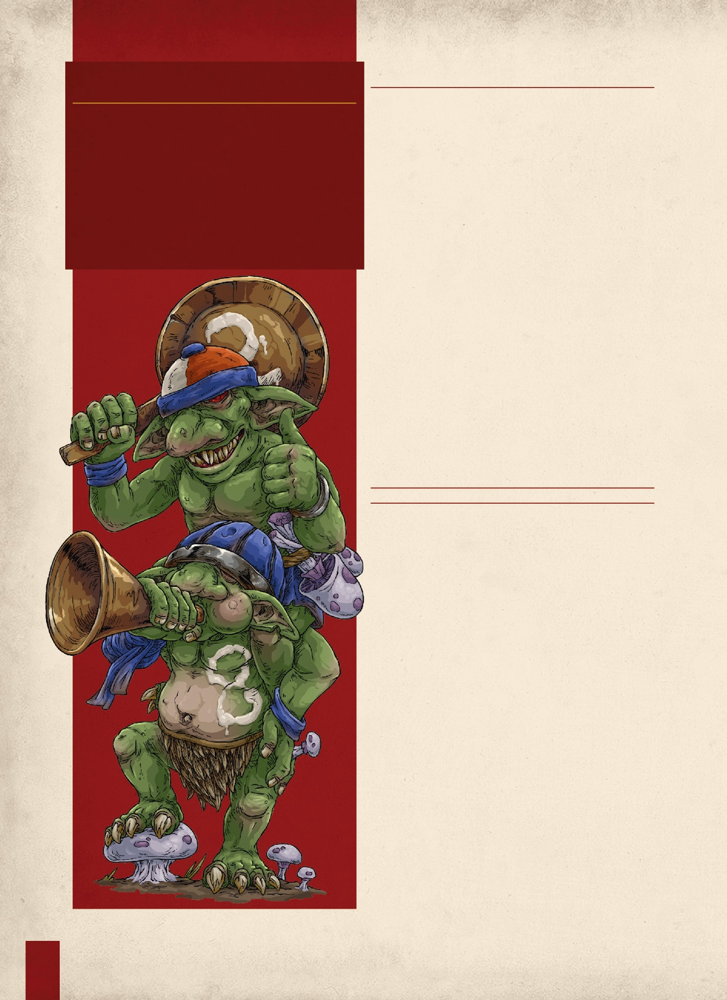blows that leave a player unconscious.
This is part of the game's charm. After all, who wouldn't want
to watch a violent, full contact bloodsport that happens to include
some ball related drama!

**56**

**BLOCK ACTIONS**

hen a Standing player is activated, they can immediately nominate a
single Standing opposition player that they are currently

Marking and declare that they will target them with a
Block action. Unlike other actions, there is no limit to how many
players may perform a Block action each team turn.

A player performing a Block action cannot move before or after, and
Prone players cannot stand up and

perform a Block action. However, if the target of the Block action is
'pushed back' into another square, the player that made the action may
'follow-up' into the square vacated, carried forward by the momentum of
the attack.

Once per team turn, a single player on the active team may perform a
Blitz action. A Blitz action combines

a Block action with a Move action. A Blitz action may be performed by a
Prone player.

Block actions are resolved using special block dice, unique to Blood
Bowl. How many block dice are rolled and

which coach chooses the result to apply is determined
by the Strength of the player performing the Block action compared with
the Strength of the player that is the target of the Block action.

STRENGTH
Once an active player has declared they will perform a Block action and
nominated their target, the next thing
to do is to compare the Strength characteristic of both players,
including any Strength modifierrs granted by Skills or Traits or offered
by 'assists' from team-mates (see opposite). If one player is stronger
than the other, they are more likely to knock their opponent down:

« If both players have the same Strength characteristic,

after modificcation, one block dice is rolled.
« If one player has a higher Strength characteristic, after

modificcation, a pool of two block dice is rolled and
the coach of the stronger player selects which result
to apply.

« If one player has a Strength characteristic that is more than double
that of their opponent, after modificcation,
a pool of three block dice is rolled and the coach of the

stronger player selects which result to apply.

ASSISTING A BL0CK
The Strength characteristic of the player that is performing the Block
action, or of the player that is the target of the Block action, can
be modifiedd by assists offered by team- mates that are in a position
to help. In this way, two or more players can
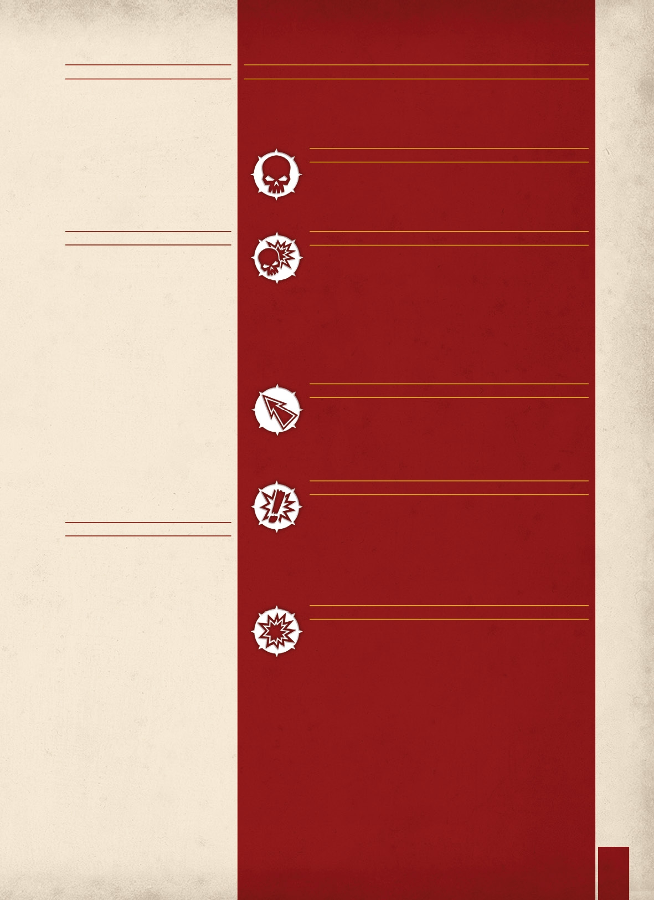gang up on another. There are two types
of assist that can be counted: 'offensive' and 'defensive'.

ofFENSIVE ASSISTS
An offensive assist is when another player on the active team, a team-
mate of the player that is performing the Block action, is able to
assist.
To offer an offensive assist, a player must be Marking the opposition
player that is the target of their team- mate's Block action.

A player cannot offer an offensive assist if they are being

Marked by any opposition player other than the one that is the target
of their team-mate's Block action.

Each offensive assist counted modifiees the Strength characteristic of
the player performing the Block

action by +1.

DEFENSIVE ASSISTS
A defensive assist is when another player on the inactive team, a
team- mate of the player that is the target
of a Block action, is able to assist. To offer a defensive assist, a
player must be Marking the opposition player that is performing the
Block action against their team-mate.

A player cannot offer a
defensive assist if they are being

Marked by any opposition player other than the one that is performing
the Block action against their team-mate.

Each defensive assist counted modifiees the Strength characteristic of
the player that is the target of the Block action by +1.

BL0CK DICE
Once offensive and defensive assists have been worked out and the number
of block dice to be rolled determined, roll the block dice. Block dice
feature fivve icons, each representing an outcome. Some of these
outcomes can be modifiedd by Skills or Traits possessed by one or both
players:

PLAYER D0WN!
Something has gone terribly wrong and the player performing the Block
action has come off the worst. The active player is immediately
Knocked Down by the player they were attempting to block!

B0TH D0WN
Neither player comes off particularly well. Both the active
player and the target of the Block action are Knocked Down by one
another.

If one of the players has the Block skill (as described on page
76), they may choose to ignore this result and not be Knocked Down. If
both players have the Block skill, they may both ignore this result,
in which case both players bash heads in a clatter of armour, but
nothing else really happens!

PUSH BACK
The active player gives their opponent an almighty shove, forcing them
backwards. The target of the Block action is pushed back one square by
the active player. The active player may follow-up into the square
vacated. Pushing other players is covered in more detail on page 58.

STUMBLE
The target of the Block action attempts to avoid their aggressor. If
the target of the Block action has the Dodge skill and chooses to use
it (as described on page 75), they are able to avoid
being hit and this result becomes a Push Back, as described above.
Otherwise, this result becomes a POW!, as described below. In either
case, the active player may follow-up into the square vacated.

P0W!
The block is tremendously effective and the target keels over to land
flaat on their back! The target of the Block action is pushed back by
the active player and is then Knocked Down in the square they have
been moved into. The active player may follow up into the square
vacated.

**57**

SELECT AND APPLY RESULT
Regardless of the Strength of the players involved, it is always the
coach of the player performing the Block action that will roll the
block dice. If a pool of two or more block dice is being rolled, it is
always the coach of the player
with the higher Strength that will select which result is applied
against the target.

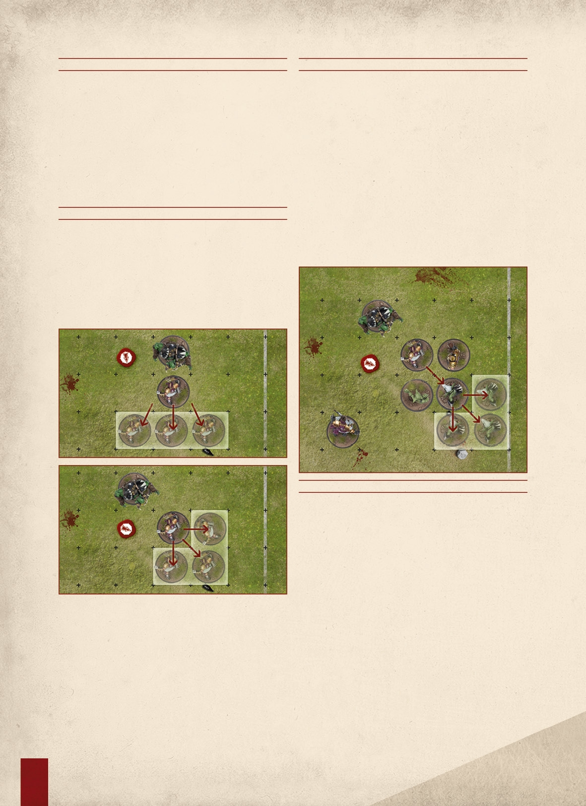Note that when both players have the
same Strength characteristic, only one block dice is rolled, so there
is only one result available!

PUSHED PLAYERS
The Push Back and POW! block dice results call for the target of a
Block action to be 'pushed back'. A pushed
back player is involuntarily moved one square away from the player
performing the action. The pushed back player
is moved into a square chosen by the coach of the player performing
the action. The squares a pushed back player can be moved into will
depend upon the direction from which the block came, as shown in the
diagrams below:

The square the pushed back player is moved into must be an unoccupied
square. If this is not possible, the

pushed back player will either be pushed into the crowd (see opposite)
or a chain-push will occur (see opposite). Note that only players can
occupy a square, if a square

contains only the ball or a trapdoor, it is unoccupied and
a pushed back player may be moved into it. If a pushed back player is
moved into a square that contains the ball, the ball will bounce. A
player cannot attempt to pick up the ball when pushed back.

**58**

CHAIN-PUSHES
If there are no unoccupied squares to move a pushed
back player into, the player is moved into a square occupied by another
player, causing a 'chain-push'.
When a player is chain-pushed, they are pushed back themselves exactly
as described above. The chain-pushed player is moved into a square
chosen by the coach of
the player performing the Block action. The squares a chain-pushed
player can be moved into will depend upon the direction from which the
push came, as shown in the diagrams previously.

A player can be chain-pushed even if they are Prone or Stunned. A
chain-push can cause a player from either team to be moved and may
result in a player being pushed into the crowd.

PUSHED INT0 THE CR0WD
If a player occupies a square adjacent to a sideline or within an End
Zone when pushed back, and if the only square they can be pushed into is
occupied, or if there
are no squares they can be pushed into, the player will be 'pushed into
the crowd'.

A player that is pushed into the crowd is immediately removed from play
and placed in their team dugout. A player pushed into the crowd risks
'Injury by the Crowd', as described on page 61. This will determine if
the player is placed in the Reserves, Knocked-out or Casualty box.

If a player in possession of the ball is pushed
into the crowd, the ball will be thrown-in by the crowd

as described on page 51. Additionally, if a player on the active team
that is in possession of the ball is pushed into the crowd, a Turnover
is caused.

KN0CKED D0WN
Several block dice results cause one (or both!) players
to be Knocked Down, as described on page 27. This can lead to a
Turnover, as described on page 23, if a player
is Knocked Down when they are the one performing the Block action! If
a player is pushed back and Knocked Down, the push back happens firrst
and the player is Knocked Down in the square they have been moved
into.

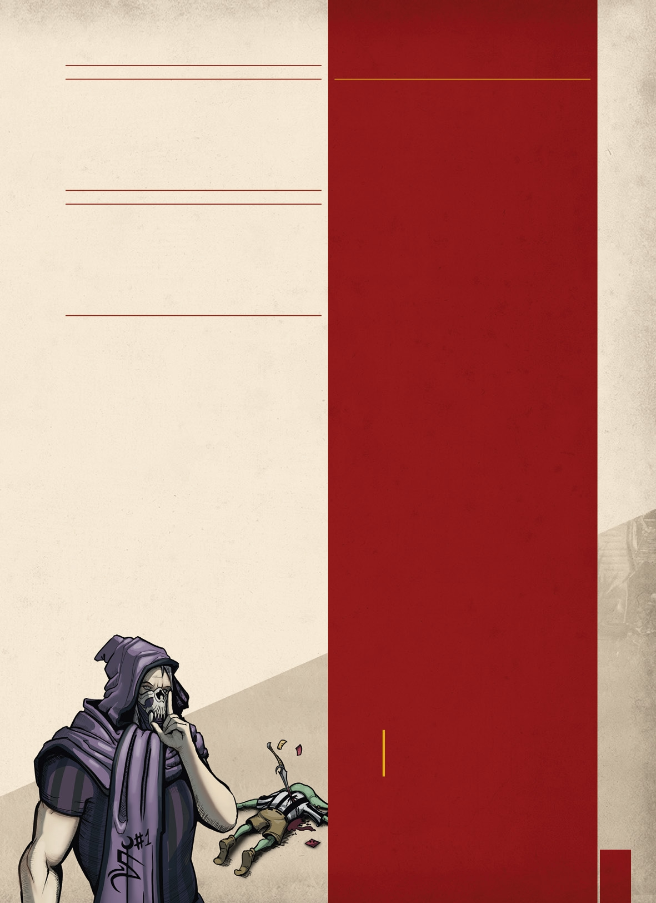PLACED PR0NE
Some Skills may allow a player that is Knocked Down during a Block
action to instead be Placed Prone. Where this is the case, the rules
above are unchanged, it is simply the outcome that is altered as no
Armour roll is made against a player that is Placed Prone and they do
not risk injury.

**FOLLOW-UP**

hen an active player making a Block action pushes the target back they
may 'follow-up', moving directly into the square vacated by the

pushed back player. You must decide if your player will follow-up
before any further dice rolls are made. When a player follows-up, it
is a free move; they do not need to Rush, they do not need to Dodge,
and they do not count as having used any of their Movement Allowance.

Sometimes, a player must follow-up due to an in-game effect, a special
rule, or a Skill or Trait, whether

they want to or not. At other times, a player may be prevented from
following-up even if they want to, perhaps due to a Skill the target
of the Block action possesses for example. In such cases, rules that
prevent a player from following-up always take precedence.

Note that when a player follows-up, they are always considered to have
moved voluntarily. This is the case even when a player must follow-up
due to an in-game effect, a special rule, or a Skill or Trait, whether
they want to or not.

**BLITZ ACTIONS**

sually, when a player performs a Block action, it is performed on its
own. But, once per team turn as mentioned on page 43, a single
Standing or Prone

player on the active team may be activated to perform a Blitz action; an
action that allows the player to combine
a Move action and a Block action. When a player Blitzes,

they may move as normal. In addition, they may perform
a Block action (or a Special action granted by a Skill or Trait that can
be performed instead of a Block action),
the target of which must be nominated when the player is activated,
before they have moved.

Movement during a Blitz action follows all of
the normal rules for moving as described on page 44.

The Block action (or a Special action) can be made before, after or even
during the Blitz move, meaning that the player can move part of their
Movement Allowance, perform a Block action (or a Special action), and
then continue to move should they wish and if they are able
to do so.

Performing the Block action (or a Special action granted by a Skill or
Trait that can be performed instead

of a Block action) costs one square of the player's Movement Allowance.
However, depending upon the outcome of the Block action, the player may
follow up as described above, effectively regaining this lost square of
Movement Allowance.

During their movement, a player performing a Blitz action may attempt to
gain extra squares of Movement Allowance by Rushing, as described on
page 44. If after moving the player does not have sufficientt Movement
Allowance remaining to perform the Block action (or
a Special action granted by a Skill or Trait that can be performed
instead of a Block action), they may Rush to gain the square of Movement
Allowance required. If they cannot Rush, they cannot perform the Block
action (or a Special action).

"Their problem is, they brought
a football to a knife fight!""

*- Horkon Heartripper*

**59**

### Armour And Injuries

here are many ways
in which a Blood
Bowl player can get

injured. From being gored
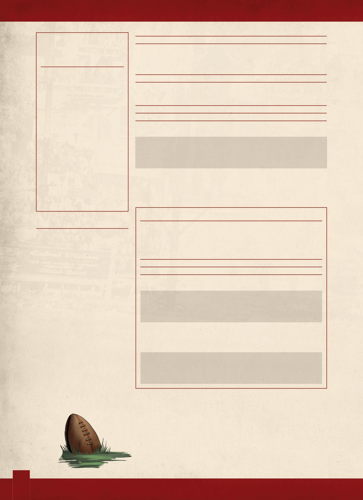by a rampaging Minotaur, to tripping and
breaking an ankle whilst Rushing, Blood Bowl is
a game that provides almost limitlessopportunityto get seriously hurt!
Even death is
an ever-present threat! Most Blood Bowl players proudly sport
impressive scars,and it
is widely said that an old pro can be easily identifieed by the way
they wince and grumble about their aches and pains during wet weather.

**RISKING INJURY**

s described on page 27, whenever one player is Knocked Down by
another,

be it as the result of a Block action
or some other, more devious trick, they become Prone and risk injury.
Likewise, whenever a player Falls
Over, most often caused by failing an Agility test when dodging, or
tripping as they Rush across the pitch, they become Prone and risk
injury. When
a player is Knocked Down or Falls Over, the coach of the opposing team
will make an Armour roll against
that player.

Note that when a player
is Placed Prone, perhaps having

wrestled an opponent to the ground, there is no risk of injury and no
Armour roll is made against them.

**60**

ARM0UR R0LLS
An Armour roll is made as described on page 29, by the coach of the
opposing team. If the player's armour is 'broken', an Injury roll is
made.
If their armour is not broken, it protects them from harm.

INJURY R0LLS
Whenever a player's armour is broken, an Injury roll is made against
them. The coach of the opposing team rolls 2D6 and consults the table
below:

INJURY TABLE
2D6 RESULT

2-7 *Stunned:* The player immediately becomes Stunned, as described on

page 27, and is laid face-down on the pitch.
8-9 *KO,d:* The player is immediately removed from play and placed

in the Knocked-out box of their team dugout. At the end of each drive,
there is a chance any Knocked-out players will recover, as described
on page 66.

10+ *Casualty!:* The player becomes a casualty and is immediately
removed from play and placed in the Casualty box of their team

dugout. The coach of the opposing team immediately makes a
Casualty roll against the player, as described opposite.

STUNTY PLAYERS
Players with the Stunty trait (see page 86) are particularly small and
fragile, meaning they are more prone to breaking when hit! If an
Injury roll is ever made against a player with the Stunty trait, roll
on this
table instead:

STUNTY INJURY TABLE

2D6 RESULT
2-6 *Stunned:* The player immediately becomes Stunned, as

described on page 27, and is laid face-down on the pitch.
7-8 *KO,d:* The player is immediately removed from play and placed

in the Knocked-out box of their team dugout. At the end of each drive,
there is a chance any Knocked-out players will recover, as described
on page 66.

9 *Badly Hurt:* The player becomes a casualty and is immediately
removed from play and placed in the Casualty box of their team dugout.
No Casualty roll is made. Instead, a Badly Hurt result is
automatically applied against them.

10+ *Casualty!:* The player becomes a casualty and is immediately
removed from play and placed in the Casualty box of their team

dugout. The coach of the opposing team immediately makes a Casualty
roll against the player, as described opposite.

INJURY BY THE CR0WD
When a player is pushed back into the crowd or lands in
the crowd there is no telling how the fans will treat them, and they
risk Injury by the Crowd. No Armour roll is made against the player.
Instead the coach of the opposing team immediately rolls on the Injury
table to see what the crowd does to the player:

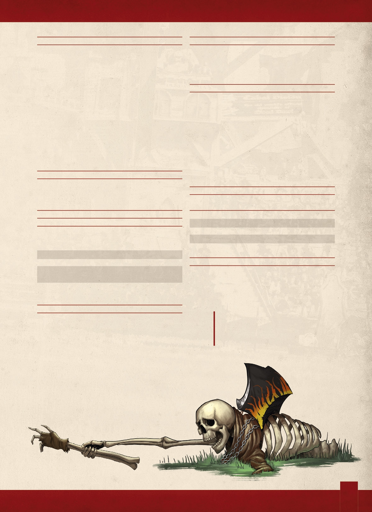« If the player is Stunned, they are
placed in the

Reserves box.
« If the player is Knocked-out, they are placed in the

Knocked-out box. They may recover as usual at the end of the drive.

« If the player becomes a casualty, they are placed in
the Casualty box. A roll is made against them on the

Casualty table, as described below.

CASUALTY R0LLS
Whenever a player becomes a casualty, a Casualty roll is made against
them. The coach of the opposing team rolls
a D16 and consults the table below:

CASUALTY TABLE
D16 RESULT EFFECT

1-6 *Badly Hurt* The player misses the rest
of this game, but suffers no

long term effect
7-9 *Seriously Hurt* MNG

10-12 *Serious Injury* NI and MNG
13-14 *Lasting Injury* Characteristic

reduction and MNG
15-16 *DEAD* This player is far too dead

to play Blood Bowl!

MNG (MISS NEXT GAME)
The player misses the rest of this game, but will need more time to
recuperate. In league play, the player is not available to play in the
team's next game. Make a note of this on the Team Draft list. The
team's CTV is reduced by this player's current value until the end of
the post-game sequence of the team's next game (see page 69). If this
player's absence leaves the team with fewer than 11 players, they are
replaced by a Journeyman player ahead of the next game, as described
on page 38.

NI (NIGGLING INJURY)
Make a note on the Team Draft list that this player has picked up a
Niggling Injury. There is a +1 modifierr applied to all future rolls
made against this player on the Casualty table per Niggling Injury they
have.

CHARACTERISTIC REDUCTI0N
The player has one of their characteristics reduced by 1. To determine
which, roll a D6 on the table below.

In the case of Movement Allowance or Strength,
the characteristic is simply reduced by 1. In the case of

Agility, Passing Ability or Armour Value, the target number is raised
by 1. For example, if a player with AG4+ suffers a Neck Injury, the
characteristic would become AG5+.

Note, however, that no characteristic can ever be reduced below the
minimum value shown on page 28.

LASTING INJURY TABLE

CHARACTERISTIC REDUCTI0N

1-2 *Head Injury* -1 AV

3 *Smashed Knee* -1 MA

4 *Broken Arm* -1 PA

5 *Neck Injury* -1 AG

6 *Dislocated Shoulder* -1 ST

DEAD
This player is dead! Dead players are dismissed from the team during
Step 1 of the post-game sequence, as described on page 69.

"It's not whether you get
knocked down, it's how much of you gets back up!"

*Head Necromancer Mordredd Earwhacker*

**61**

**SUBSTITUTIONS**

ubstitute players may not be brought on during a drive. The only time
fresh players can be brought
on from the Reserves box to replace those removed

from play through injury (or Sent-off!) is whilst setting up
for a new drive, prior to restarting the game (see page 67).

**APOTHECARIES**

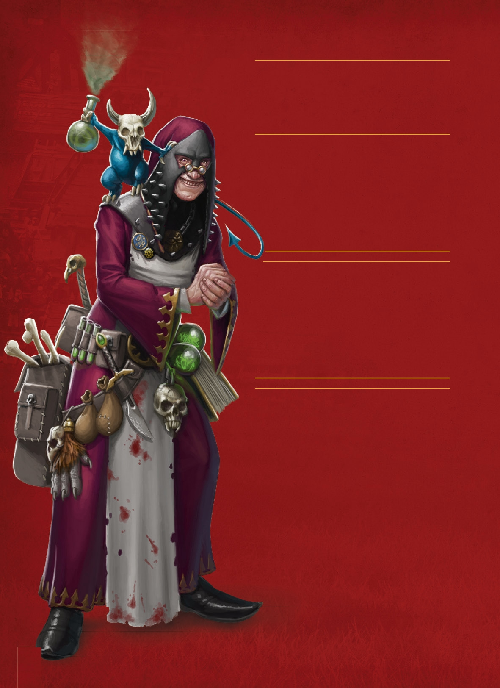nce per game, a team with an apothecary
may use them to 'patch-up' any permanently hired players belonging to
it that have been removed from play

after being Knocked-out or after having a Casualty roll made against
them. An apothecary cannot be used to patch-up any Journeymen players
or any Induced players,

such as Mercenaries or Star Players. Journeymen are rarely considered
worth the effort, whilst Mercenaries

and Star Players travel with their own staff of healers

and medics.

PATCHING-UP KN0CKED-0UT PLAYERS
Once per game, an apothecary can be used

immediately when a player becomes Knocked-out:

« If the player was on the pitch when they were Knocked-

out, they are not removed from play. Instead, they remain on the pitch
and become Stunned.

« If the player was Knocked-out as a result of being pushed back into
the crowd or landing in the crowd,

place them directly into the Reserves box rather than the Knocked-out
box.

PATCHING-UP CASUALTIES
Alternatively, once per game an apothecary can be used when a Casualty
roll is made against a player:

« Immediately after the Casualty roll is made against your player, you
may declare the use of an apothecary.

« The coach of the opposing team rolls again on the Casualty table,
giving two possible outcomes. You may

choose which result is applied to your player.
« If a Badly Hurt result is applied, the apothecary has

been able to patch the player up and pump them full
of painkillers. The player is removed from the Casualty box and placed
in the Reserves box.

Note that the use of an apothecary comes before any other attempts to
heal the player. This includes the use of any Skills or Traits, or any
other in-game effect or special rule that may modify the Casualty roll
or its effect.

**62**

### Kicking Them While They're Down

ouling is strictly against the rules of Blood Bowl, and any player
tempted to stick the boot in risks the wrath of the referees. Not

that this stops anyone of course! Many teams
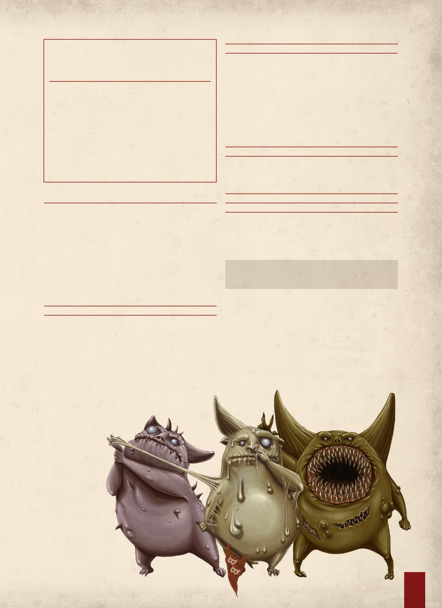are renowned for being dirty and
devious, and more than a few players have built a career

upon the art of the foul. Indeed, fouling is now such an established
part of the game that the RARG has established guidelines allowing

members to turn a blind eye.

**FOUL ACTIONS**

s mentioned previously, once per team turn, a single player on the
active team may commit a Foul action. When activated, the player
nominates

a single Prone or Stunned player on the opposing team
to be the victim of the Foul. The player may move before committing
the Foul, following all of the normal movement rules, but must be in a
square adjacent to the player they wish to Foul when the action is
made. Once the Foul has been committed, they may not move further and
their activation comes to an end.

F0ULING
To commit a Foul, simply make an Armour roll (and
possible Injury roll) against the nominated victim.
Offensive and defensive assists are worked out before this Armour roll
is made, exactly as when performing a Block action, as described on
page 57. Rather than modifying Strength, these assists will modify the
Armour roll:

« Apply a +1 modifierr to the Armour roll for each

offensive assist.
« Apply a -1 modifierr to the Armour roll for each

defensive assist.

BEING SENT-ofF
Regardless of the outcome, if a natural double is rolled (i.e., if two
2s are rolled before applying any modifierrs) when making either the
Armour roll or an Injury roll
against the victim of the Foul action, the referee has seen a player
committing a foul right in front of them and that cannot be ignored. The
player committing the Foul action is Sent-off. They are immediately
removed from play and must miss the rest of the game. When a player is
Sent-off, a Turnover is caused.

ARGUING THE CALL
When a player is Sent-off by the referee for committing a Foul, their
coach may attempt to Argue the Call. Roll a D6 and refer to the table
below:

ARGUE THE CALL

D6 RESULT

1 *"You,re Outta Here!"* The referee is so enraged

that the coach is ejected along with the player.
For the remainder of this game, you may no
longer Argue the Call and must apply a -1
modifierr when rolling for Brilliant Coaching.

2-5 *"I Don,t Care!"* The referee is not interested in your argument.
The player is Sent-off and a Turnover caused.

6 *"Well, When You Put It Like That.."* The referee is swayed by your
argument. A Turnover

is still caused, but the player that committed the Foul is not
Sent-off.

**63**

### Touchdown!

he game of Blood Bowl is won by scoring touchdowns. If one team can
score
more than the other team, they will win.

True, there are many, many teams that consider scoring touchdowns
secondary to committing acts of violence, but even the most
bloodthirsty
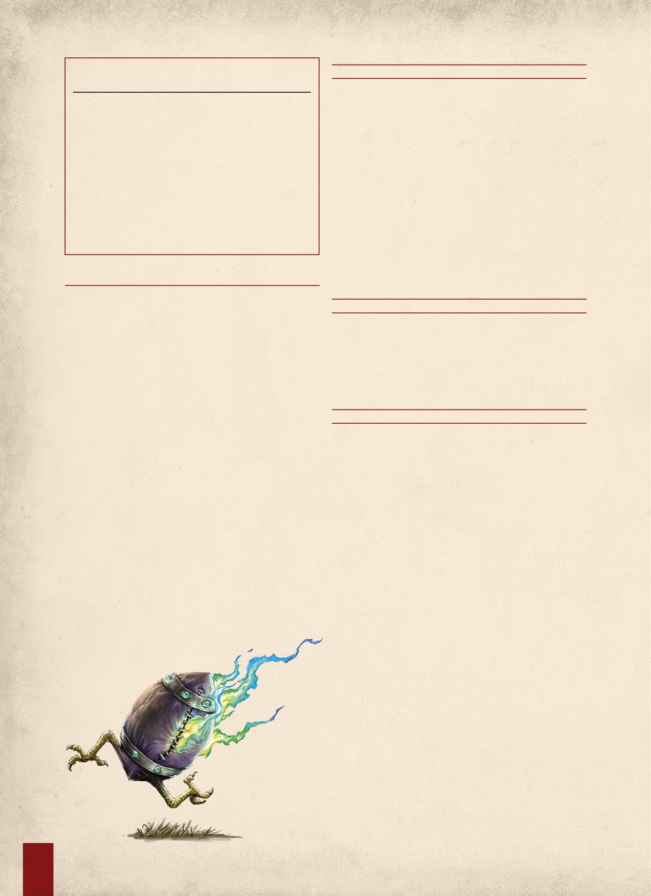of teams will start scoring some
touchdowns once the opposition has been satisfactorily dealt with.
Proof indeed that the basic premise of the game is so simple that even
an orc can understand it!

**SCORING A TOUCHDOWN**

touchdown can be scored by any player, even players that are not
currently active themselves or that belong to the inactive team. A
touchdown is

scored when:

« A Standing player in possession of the ball enters a square that is
within the opposing team's End Zone without Falling Over or being
Knocked Down.

« A Standing player picks up or catches the ball whilst

occupying a square within the opposing team's
End Zone.

*For example, a player that occupies a square within* *the opposing
team\'s End Zone who catches the ball will* *immediately score a
touchdown. Alternatively, a player*
*in possession of the ball may be chain-pushed into the* *opposing
team\'s End Zone.*

Note, however, that if a player is Placed Prone, Falls Over or is
Knocked Down whilst moving into the

opposition's End Zone, no touchdown is scored. A player must be
Standing for a touchdown to be scored.

As soon as a touchdown is scored, play stops (effectively causing a
Turnover, as described on page 23,

but a Turnover you can be pleased with!).

**64**

SC0RING DURING Y0UR 0PP0NENT'S TURN In some rare cases a player will
findd themselves able to score a touchdown during the opposing team's
turn. For example, a player holding the ball could be pushed back into
the End Zone but not Knocked Down by a Block action made against them.

If one of your players that is in possession of the ball is moved for
any reason so that they occupy a square

within the opposing team's End Zone, and if that player remains Standing
after they have been moved, at any point during the opposing team's
turn, your opponent's team turn ends immediately and your team becomes
active. However, rather than playing a full turn, your
team turn will end as soon as it begins with a touchdown being scored.

REC0RD SC0RE
Arguably the most important thing to remember when a touchdown is scored
is to record the score! This is done
by the coach of the team that scored, by moving their score marker one
place along the Score tracker of their team's dugout. Singing, dancing
and other celebrations are encouraged.

STALLING
Sometimes, a coach will want their team to run the clock down, opting
not to score when they easily could. At other times a team can get so
caught up in the violence of the game that they simply forget to score
when they have the chance. This is a perfectly valid tactic, although in
some instances it can be risky!

If at any point during your team turn a player belonging to your team
meets all of the following criteria, that player is said to be
'Stalling\':

1\. If the player is Open.
2. If the player is in possession of the ball.
3. If the player is able to activate and perform their

declared action without the need to firrst roll a D6.
4. If the player is able to move into the opposition's End

Zone without needing to Rush or Dodge.

Failing to activate a Stalling player before your turn ends (even if it
ends unexpectedly with a Turnover), or activating that player but
declining to score a touchdown, is Stalling.

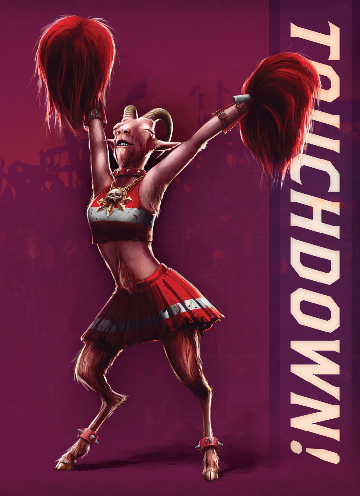

### The End of A Drive

hen a drive comes to an end, either
as the result of a touchdown being scored, or when time runs out for
the

half and the referee blows their whistle, play
will halt. Unless the full-time whistle has been blown, there will be
another drive to come, and
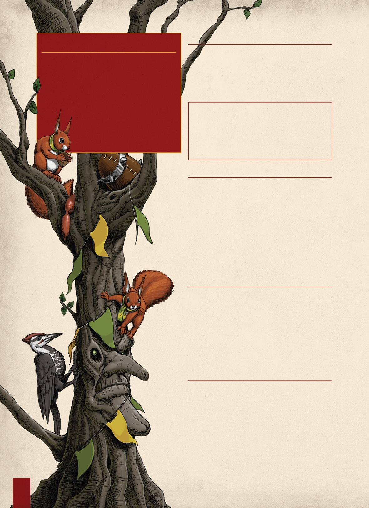both teams will make use of the lull in
activity.

**END OF DRIVE SEQUENCE**

hen a touchdown is scored or at the end of
the finall turn of a half, the current drive comes to an end and play
will halt. If there are more

turns of the current half or a full half still to come, play only halts
temporarily. Both coaches run through the following sequence of steps:

This gives both teams time to
make substitutions, talk tactics, and for cheerleaders and sideline
performers to entertain the crowds and enthuse their supporters.

**1**

**2**

**3**

*DEAL WITH SECRET WEAPONS:* Any Secret Weapon players risk being
Sent-off.

*RECOVER KNOCKED-OUT PLAYERS:* Knocked-out players may recover.

*THE DRIVE ENDS:* The drive ends.

**1. DEAL WITH SECRET WEAPONS**

f either team fieelded any players with the Secret Weapon trait during
the preceding drive, those players will be Sent-off for committing a
Foul, even if they were

not on the pitch at the end of the drive.

When a player is Sent-off in this way, their coach may attempt to
Argue the Call as described on page 63.

A single Bribe Inducement may also be used per player Sent-off in this
way, if any are available and should the coach wish (see page 91). If
either is successful, the

player is not Sent-off.
**2. RECOVER KNOCKED-OUT** **PLAYERS**

f either coach has any players in the Knocked-out
box of their dugout, they may now see if they have recovered enough to
take part in the next drive. Roll a

D6 for each player that is currently Knocked-out:

« On a roll of 4+, the player has recovered and is raring
to go. Recovered players are immediately placed in the

Reserves box of their team dugout.
« On a roll of 1-3, the player is still far too insensible to

take to the pitch again.
**3. THE DRIVE ENDS**

**T**

**66**

he drive comes to an end. Any special rules
or effects, from any source, that lasted for the duration of this drive
will expire now.

**RESTARTING THE GAME**

f there are still turns to be played in the current half, or if there
is another full half still to play, both teams will set up again, as
described on page 40. If the previous

drive ended with a touchdown, the team that scored the touchdown now
becomes the defence and will kick-off to the team that conceded the
touchdown.

**ENDING THE GAME**

t the end of the second half, the game will
end. Unless the game is a league fixtture,
there is nothing else to do but determine the

winner. In a league, however, the post-game sequence
is when coaches work out winnings, players may gain advancements, and
so on (see page 69).

WINNING THE GAME
The team that has scored the most touchdowns at the
end of the game is declared the winner. If there is no
clear winner, a period of extra time may be played, as described
opposite.

C0NCEDING
It is very rare for a Blood Bowl team to concede a game, most would
sooner play to the death than quit the pitch in shame. But sometimes a
coach may put discretion before valour and say they've had enough. You
may concede
at the start of any of your team turns. However, doing so means that:

« The opposition is awarded one touchdown, and any

touchdowns your team has scored are voided and awarded to the
opposition.

« You are unable to award an MVP to any of your players. « You do not
generate any winnings.
« Your Dedicated Fans characteristic is reduced by D3

(to a minimum of 1).

Finally, roll a D6 for each of your players that has gained three or
more advancements:

« On a roll of 1-3, the player quits the team in disgust. Immediately
delete the player from your

Team Draft list.
« On a roll of 4+, the player remains with the team.

**EXTRA TIME**

ometimes, an important fixxture needs a clear winner. League
semi-finalss, finalss and tournament grand finalss are both prime
examples, but during exhibition

play as well, having a clear winner can often be vital!

If, at the end of the second half, the score is
tied between both teams, an eight turn period of extra

time can be played. Once the End of Drive sequence is resolved, extra
time begins by determining which team will kick and which will receive,
as described on page 38.

Team re-rolls are not replenished at the start of extra time. However,
any team re-rolls that were not used

during the second half are carried over into extra time. In all other
respects, extra time is played exactly like a normal half.

SUDDEN DEATH
If there is still no clear winner at the end of extra time,
the game is decided by a penalty roll-off, representing the teams taking
part in a fieeld goal penalty shoot-out (the only time fieeld goals are
used in modern Blood Bowl).
To resolve sudden death, both coaches roll-off fivve times, each rolling
a D6 and re-rolling ties. The coach who wins the most roll-offs wins the
game.

**67**

## Post-Game Sequence

*POST-GAME SEQUENCE*

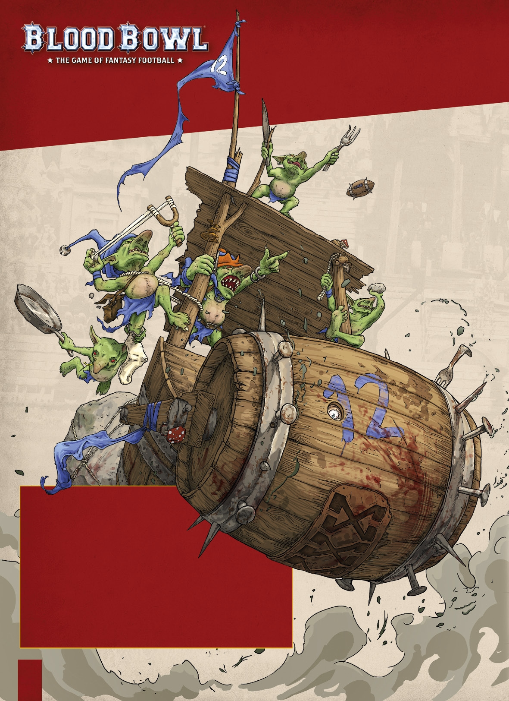

ver the course of a league, Blood
Bowl teams will grow and evolve
with every game played; some rookie

players will learn new skills and develop
as players, others will sufferr injuries that may
threaten their career, and some will even die! Whilst
fatalities are not unexpected in a violent bloodsport, they
can be a triflee annoying for any coach, particularly if the deceased
player was beginning to show promise or, even worse, if they were a
valued and talented veteran of the gridiron. Fortunately, the sorrow
of loss can be eased by counting the winnings, allowing new players to
be recruited, providing fresh blood for an under strength team, and
existing players can be trained and developed into the stars of the
future!

**68**

### The Aftermath

**THE**
**AFTERMATH**

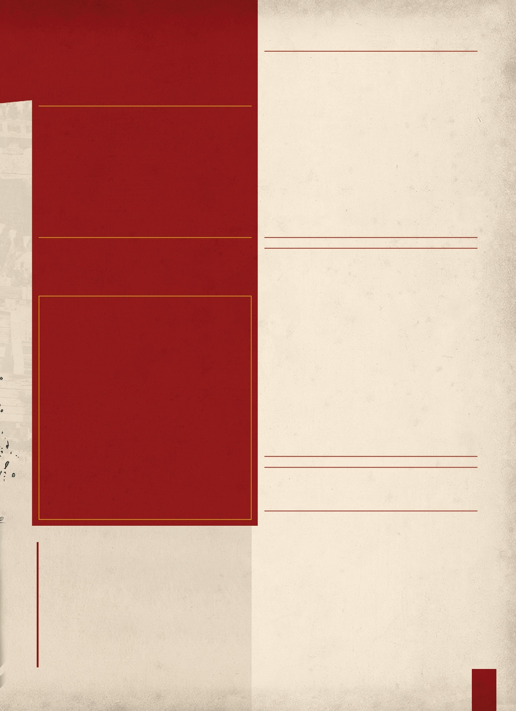**O**

fter a league fixtture, both coaches should run through the full
post-game sequence step by step.
In exhibition play, the post-game sequence need not

be completed.

**1. RECORD OUTCOME AND WINNINGS**

t the end of each and every league fixtture, both coaches are
responsible for correctly recording on their Game Record sheet the
details of how their

team performed and the outcome of the match. Each coach should record
the following information in the appropriate sections of their Game
Record sheet so that it can be passed on to the league commissioner:

« The result of the game (win, lose or draw).
« How many touchdowns were scored (by each team).
« How many Casualties were caused (counting only those

that generate SPP, as described in Step 3).
« How many League points were earned (see page 98).

« Finally, any players that suffered a DEAD result on the Casualty table
during this game are deleted from your Team Draft list (see page 60).

WINNINGS

At the end of every game, each team receives a fee for playing, usually
paid by the stadium owner from ticket sales. To work out how much each
team wins:

« Divide the Fan Attendance for the game (see below)

**1**

**2**

**3**

**4**

**5**

**6**

*RECORD OUTCOME AND WINNINGS:* The details
of the game, its outcome and each team's winnings are recorded on the
Game Record sheet.

*UPDATE DEDICATED FANS:* Record any changes to Dedicated Fans based on
the outcome of
the game.

*PLAYER ADVANCEMENT:* Any players that have earned enough SPP may spend
them on advancements.

*HIRING, FIRING AND TEMPORARILY RETIRING:* New players and staff are
recruited. Injured players may be dismissed or may temporarily retire.
Any unwanted staff may be dismissed.

*EXPENSIVE MISTAKES:* If the team has sufficientt wealth left unspent,
there is a chance players and staff will spend it irresponsibly.

*PREPARE FOR NEXT FIXTURE:* Team Value and Current Team Value are both
updated ready for the next league fixtture.

by two.
« Add the number of touchdowns your team scored to

this figurre.
« Multiply the total by 10,000.

The result is how many gold pieces your team has won for this game. This
is recorded in the 'Winnings' section of the Game Record sheet and is
added immediately to the team's Treasury.

Note that, if one team conceded, Fan Attendance is
not divided by two. Instead, the full amount is awarded to the

winning team.

FAN ATTENDANCE
This is worked out by simply adding together the Fan Factor of both
teams to determine the total number of fans present.

**2. UPDATE DEDICATED FANS**

good result can see a team's fan following increase, and a prolonged
winning streak can bring the fans floccking to buy tickets and
merchandise. This sort of

HACKSPIT QUILLCHEWER'S
FUN FACTS!
*Ever sInce an unfortunate mIsprInt In a*
*copy of SpIke! MagazIne, VaIen SwIft has* *been hounded by rumours
that he\'s Ieft the* *EIfheIm EagIes for good. DespIte assertIons*
*from VaIen hImself - and the fact that the* *artIcIe quoted hIs
IeavIng date as more*
*than three hundred years-years In the*
*future - the annoyIng gossIp just won\'t dIe,* *much IIke the fat
eIf-eIf hImself-self!*

popularity can really help a team financially:

« If your team won the game, roll a D6. If the result is
equal to or higher than your current Dedicated Fans characteristic,
increase your Dedicated Fans characteristic

by 1.
« If your team lost the game, roll a D6. If the result is lower

than your current Dedicated Fans characteristic, reduce your Dedicated
Fans characteristic by 1.

« If the game was a draw, neither team's Dedicated Fans

characteristic will increase or decrease.

**69**

**3. PLAYER ADVANCEMENT**

uring a league, players on your team will develop
by earning Star Player Points (SPP) during the games they participate
in. Should a player earn

enough Star Player Points, they gain an advancement. Players who
survive long enough will progress to become Legendary Players, with
special characteristics and skills that they have picked up over the
course of their career on
the Blood Bowl pitch.

REC0RDING STAR PLAYER P0INTS
The Team Draft list includes boxes in which to keep a tally of each
player's achievements during a game. Each time
a player does something to earn SPPs you should record
it. At the end of the game, count up the tallies and record that
player's total number of SPP.

Note that Star Players and/or Mercenaries purchased as Inducements at
the start of the game do

not earn SPP. Journeymen, however, do, and you should record any SPP a
Journeyman earns during a game as you will have the opportunity to
permanently hire that player in Step 4.

EARNING STAR PLAYER P0INTS
Be it for scoring touchdowns or for earning Most Valuable Player
awards, the full list of achievements that generate SPP is as follows:

C0MPLETI0N (C0MP)
Often when a player passes the ball or throws a team- mate, something
can go wrong. When it goes right, however, it is called a Completion,
and the fans love it!

« *PASSING COMPLETIONS:* When a player makes an accurate Pass action
which is caught by a team-mate

occupying the target square, they are said to have made a 'Passing
Completion'. A Passing Completion earns the player 1 SPP.

« *THROWING COMPLETIONS:* When a player makes
a superb Throw Team-mate action, and if the thrown

player lands safely, they are said to have made a 'Throwing
Completion'. A Throwing Completion earns the player 1 SPP.

**70**

PASSING INTERFERENCE
When a player successfully interferes with a Pass action, the effect can
be dramatic indeed! A Simple Deflecction can have a huge impact upon a
game, whilst an Interception can completely reverse the floow of play!

« *DEFLECTIONS:* A Deflecction earns the player 1 SPP. «
*INTERCEPTIONS:* An Interception earns the player

2 SPP.

CASUALTY (CAS)
If an opposition player is Knocked Down as the result
of a Block action and removed from play as a Casualty, regardless of
which player performed the action, your player is said to have caused a
'Casualty'. Causing a Casualty earns the player 2 SPP.

Note that Star Player Points for causing a Casualty are earned even if
both players were Knocked Down and removed from play. Note also that
Casualty rolls caused by

the crowd or by any other type of action do not earn Star Player Points.

T0UCHD0WN (TD)
When a player scores a touchdown, they earn 3 SPP.

If your team was awarded any touchdowns as a result of the opposition
conceding the game, as described

on page 67, you may allocate each touchdown to a player of your choice
and give them SPP accordingly.

M0ST VALUABLE PLAYER (MVP)
At the end of the game, each coach randomly selects one player from
their team (not including Star Players and/
or Mercenaries) that was eligible to play during this game and that did
not suffer a Casualty result of 15-16, DEAD. That player receives the
Most Valuable Player award, earning 4 SPP.

SPENDING STAR PLAYER P0INTS
If, once the MVP is determined and each player's tally of SPP has been
counted up, a player has sufficientt SPP, they can spend them to gain
an advancement. The SPP cost of each advancement is shown on the table
below. The more experienced a player is, the more SPP each new
advancement they gain will cost. A player is not obliged to spend
their SPP until they have enough to randomly select a characteristic
improvement, at which point they must spend some or all of their SPP:

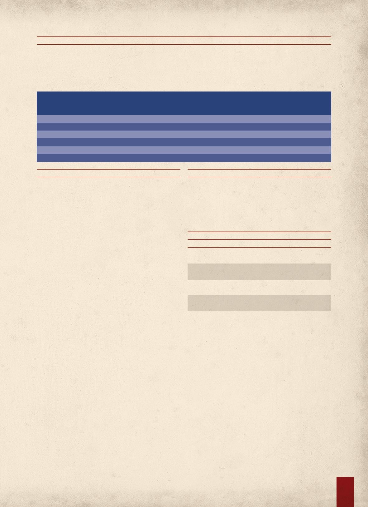Choose a

Secondary skill
Experienced (firrst advancement) 3 SPP 6 SPP 12 SPP 18 SPP

Veteran (second advancement) 4 SPP 8 SPP 14 SPP 20 SPP Emerging Star
(third advancement) 6 SPP 12 SPP 18 SPP 24 SPP Star (fourth
advancement) 8 SPP 16 SPP 22 SPP 28 SPP Super Star (fiffth
advancement) 10 SPP 20 SPP 26 SPP 32 SPP Legend (sixth advancement) 15
SPP 30 SPP 40 SPP 50 SPP

NEW SKILLS
Each team roster shows the Skill categories available to
each player. Players have 'Primary' access to some Skill
categories, and 'Secondary' access to others. Players can
gain Skills from their Primary skill categories easily, whilst
gaining Skills from their Secondary skill categories is more
costly in terms of SPP.

Choosing a Skill is simple: select a Skill category available to the
player and choose a Skill from that category that the player does not
already have, then reduce the player's SPP by the amount shown on the
Advancements table. Finally, record the player's new Skill on your
Team Draft list.

When a player gains a random Skill, choose the
Skill category you wish to generate the Skill from and roll

two D6, one after the other, on the Skill table on page 74 (re-rolling
if the player already has that Skill or if they roll a Skill they
cannot have) and reduce the player's SPP by the

amount shown on the Advancements table. Finally, record the player's
new Skill on your Team Draft list.

Note that, without exception, no player may be given as a new Skill a
Skill that they already have. For example, you may not give a player
with the Mighty Blow (+X) skill
the same Skill again in an attempt to improve the effect of the Skill.

Note that no characteristic can ever be improved more than twice, or
above the maximum value shown on

page 28. Should you randomly select a characteristic that cannot be
improved or that you do not wish to improve,
the player may instead choose a Secondary skill.

In the case of Movement Allowance, Strength or Armour Value, this means
the characteristic is increased

by 1. In the case of Agility or Passing Ability, however, the
characteristic is lowered by 1. For example, if a player
with AG4+ improves their Agility, the characteristic would become AG3+.

**71**

VALUE INCREASE
As players gain advancements, their value increases.
To reflecct this, whenever a player spends SPP to gain an advancement,
their Current Value must be increased on the Team Draft list, as
described on page 30, by the amount shown on the table below:

CURRENT VALUE INCREASE TABLE
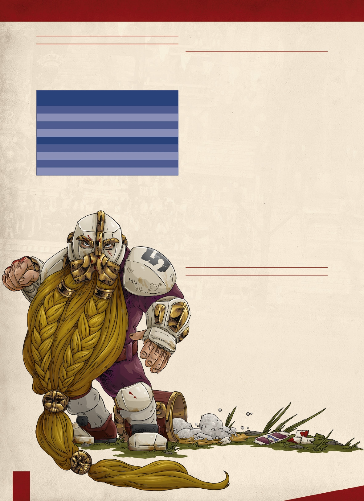New Skills Value Increase

Randomly selected Primary skill +10,000 gp Chosen Primary skill
+20,000 gp

Randomly selected Secondary skill +20,000 gp Chosen Secondary skill
+40,000 gp

Characteristic Improvement Value Increase

+1 AV +10,000 gp

+1 MA or +1PA +20,000 gp

+1 AG +40,000 gp

+1 ST +80,000 gp

**72**

**4. HIRING, FIRING AND** **TEMPORARILY RETIRING**

layers are prone to injury, and even the biggest superstars can findd
themselves looking for work elsewhere if their injuries outweigh their
abilities.

After all, there are always fresh-faced rookies looking to make a name
for themselves for a fraction of the cost! Similarly, coaches will often
hire and firre Sideline Staff on a regular basis to manage their
overheads. During this step of the post-game sequence a team may:

« Spend any amount of gold from the Treasury to buy

new players from your team roster and/or Sideline
Staff and increase Team Value accordingly.

« Fire any players and/or Sideline Staff who are no
longer required, deleting them from the Team Draft list

and reducing Team Value accordingly.
« Purchase additional team re-rolls, but must pay double

to do so, as described on page 34.
« Permanently hire any Journeymen that played for the

team during this game:

- A team must have fewer than 16 players on its Team

Draft list to permanently hire Journeymen.

- If permanently hired, a Journeyman loses the Loner

(X+) trait but retains any SPP earned during this game or advancements
gained during Step 3.

- If not permanently hired, Journeymen will leave and
  not return. Any SPP earned or advancements gained

are lost.

TEMP0RARILY RETIRING
During the post-game sequence of a game in which a player suffers a
Lasting Injury result on the Casualty table,

that player may be given time off to recover. Taking some

time off may allow them to return fitt and healthy for
next season should you wish to re-draft your team (see

page 100).

When a player Temporarily Retires (TR), make a note in the appropriate
box on your Team Draft List. They remain

as part of your team and are not deleted from your Team Draft List. They
cannot take part in any further games this season but they will still
count towards both the maximum number of players of their type allowed
by the team roster, and the 16 player maximum. Finally, whilst their
Current Value is counted when working out Team Value, it is not

counted when working out Current Team Value.

**5. EXPENSIVE MISTAKES**

s any Blood Bowl coach knows, there's nothing more risky than a large
sum of gold in the team treasury. Whenever a team has money to burn,
someone will come along with a tinderbox! Whether the tabloids need
paying off to avoid a scandal, a local innkeeper demands compensation
for damages or an errant cheerleader

bets the treasury on a squig fight,, most coaches agree that it's not
worth holding onto big sums of cash.

If you have 100,000 gold pieces or more stored in your Treasury during
this step of the post-game sequence, roll a D6 on the following table,
applying the result from the column that corresponds to the number of
gold pieces in your
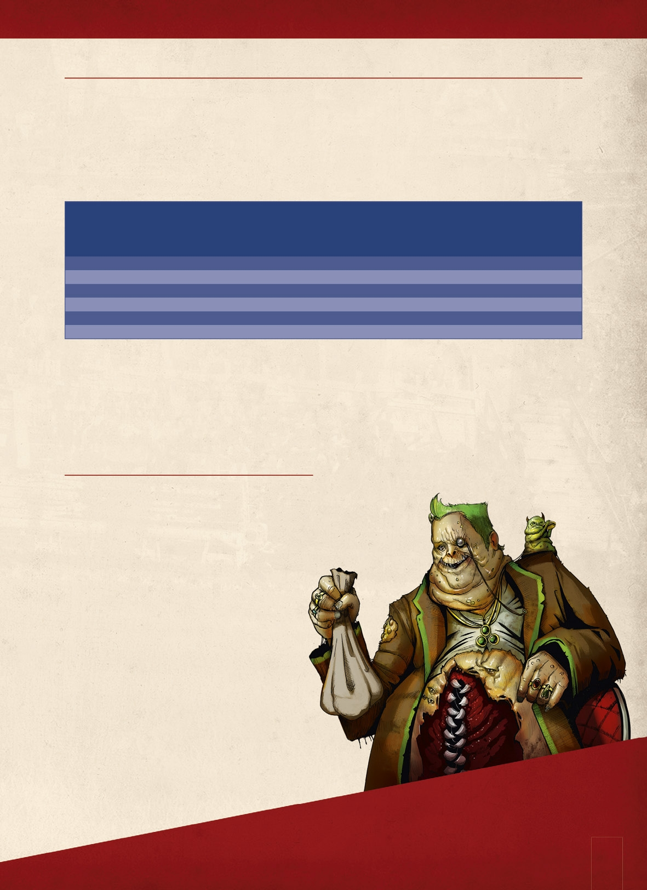Treasury.

EXPENSIVE MISTAKES TABLE

600,000+

gold pieces
1 Minor Incident Minor Incident Major Incident Major Incident
Catastrophe Catastrophe
2 Crisis Averted Minor Incident Minor Incident Major Incident Major
Incident Catastrophe
3 Crisis Averted Crisis Averted Minor Incident Minor Incident Major
Incident Major Incident

4 Crisis Averted Crisis Averted Crisis Averted Minor Incident Minor
Incident Major Incident 5 Crisis Averted Crisis Averted Crisis Averted
Crisis Averted Minor Incident Minor Incident 6 Crisis Averted Crisis
Averted Crisis Averted Crisis Averted Crisis Averted Minor Incident

« *CRISIS AVERTED:* Thanks to some careful management, your team
behaves itself for once!
« *MINOR INCIDENT:* The team gets up to some mischief and you lose D3
x 10,000 gold pieces from your Treasury.
« *MAJOR INCIDENT:* Half the gold in your Treasury (rounding down to
the nearest 5,000 gold pieces) is lost to an

unfortunate mishap.
« *CATASTROPHE:* Your Treasury is emptied, except for 2D6 x 10,000
gold pieces which you sensibly squirreled away

for just such an occurrence.

**6. PREPARE FOR NEXT FIXTURE**

**I**

n preparation for the next fixtture, make sure both your Team Value and
Current Team Value are up to date.

*TEAM VALUE (TV):* As described on page 35, this is worked out by
adding up the current value of all of the team's players, plus the
cost of all Sideline Staff and team re-rolls the team has.

*CURRENT TEAM VALUE (CTV):* This is worked out
exactly as above, but minus the current value of any
players that suffered a Miss Next Game Casualty table result during
this game and will be unavailable to play next game. Remember to
include the current value of
any players that missed this game; they have now recovered from their
injuries and are fitt to play in the
next game.

**73**

## Skills and Traits

he following pages feature the complete list of Skills and Traits

available to players. Be
they Skills a player starts with, or Skills gained during
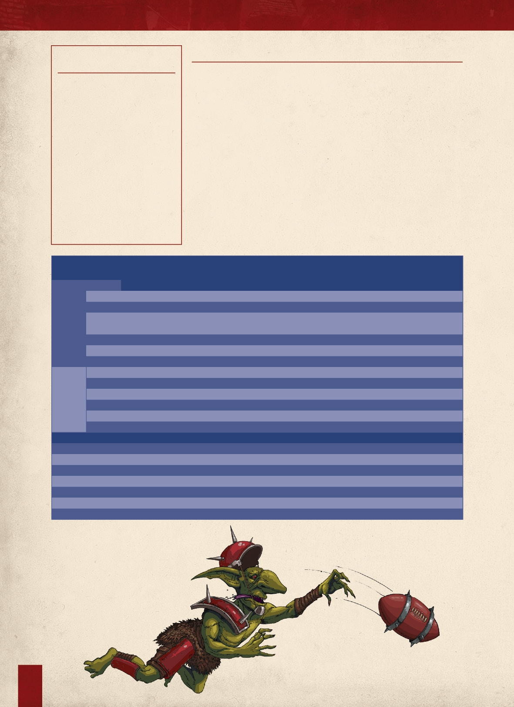the course of a league, all players will
have a degree of access to General, Agility, Strength and Passing
skills, and many will have access
to Mutations. Traits are
more unique, the result of a player's nature rather than something
they can learn.

**SKILL USE**

layers that are Standing and have not lost their Tackle Zone can use
their Skills or Traits at any time, not just during their own
activation. Players that are Prone or Stunned, or that have lost their
Tackle Zone

for any reason, cannot use any Skills or Traits unless otherwise stated
in the Skill or Trait description:

« You can choose to use a Skill or Trait that modifiees a dice roll
after the dice

roll has been made.
« All bonuses and/or modifierrs from Skills or Traits can be combined.

« Unless the description states otherwise, a Skill or Trait can be used
by more

than one player per team turn.
« Unless the description states otherwise, a Skill or Trait can be used
multiple

times during each team turn.
« Unless a Skill or Trait is marked with an asterisk (\*), its use is
not

compulsory (i.e., you do not have to use that Skill or Trait if you do
not
wish to). However, the use of a Skill or Trait marked with an asterisk
(\*)
is compulsory.

SKILL CATEG0RIES
Random Selection

1st D6 2nd D6 Agility General Mutations Passing Strength

1 Catch Block Big Hand Accurate Arm Bar 2 Diving Catch Dauntless Claws
Cannoneer Brawler 3 Diving Tackle Dirty Player (+1) Disturbing

1-3

4-6

Presence\*

4 Dodge Fend Extra Arms Dump-off Grab
5 Defensive Frenzy\* Foul Appearance\* Fumblerooskie Guard
6 Jump Up Kick Horns Hail Mary Pass Juggernaut

1 Leap Pro Iron Hard Skin Leader Mighty Blow (+1) 2 Safe Pair of Hands
Shadowing Monstrous Mouth Nerves of Steel Multiple Block
3 Sidestep Strip Ball Prehensile Tail On the Ball Pile Driver
4 Sneaky Git Sure Hands Tentacles Pass Stand Firm
5 Sprint Tackle Two Heads Running Pass Strong Arm
6 Sure Feet Wrestle Very Long Legs Safe Pass Thick Skull

TRAITS

Animal Savagery\* Decay\* Projectile Vomit Swarming

Animosity\* Hypnotic Gaze Really Stupid\* Swoop
Always Hungry\* Kick Team-mate Regeneration Take Root\*

Ball & Chain\* Loner (X+)\* Right Stuff\* Titchy\* Bombardier No
Hands\* Secret Weapon\* Timmm-ber!

Bone Head\* Plague Ridden Stab Throw Team-mate Chainsaw\* Pogo Stick
Stunty\* Unchannelled Fury\*

**74**

### Skills

**AGILITY SKILLS**

CATCH
This player may re-roll a failed
Agility test when attempting to catch the ball.

DIVING CATCH
This player may attempt to catch the
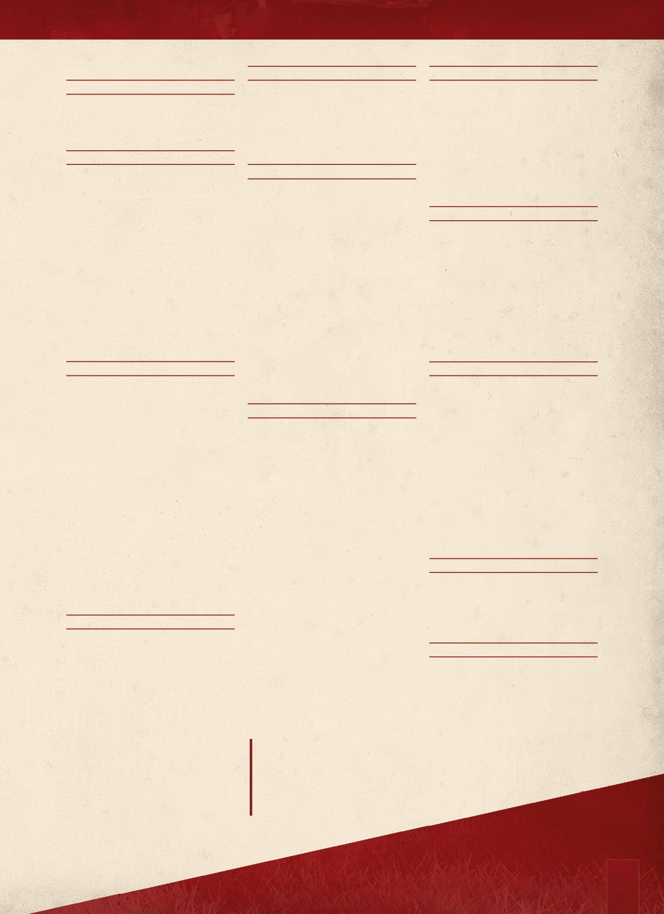ball if a pass, throw-in or kick-off
causes it to land in a square within their Tackle Zone after
scattering or deviating. This Skill does not allow
this player to attempt to catch the ball if it bounces into a square
within their Tackle Zone.

Additionally, this player may apply a +1 modifierr to any attempt to

catch an accurate pass if they occupy the target square.

DIVING TACKLE
Should an active opposition player that is attempting to Dodge, Jump
or Leap in order to vacate a square
in which they are being Marked by
this player pass their Agility test,
you may declare that this player will use this Skill. Your opponent
must immediately subtract 2 from the
result of the Agility test. This player
is then Placed Prone in the square vacated by the opposition player.

If the opposition player was being Marked by more than one player with
this Skill, only one player may use it.

D0DGE
Once per team turn, during their activation, this player may re-roll a
failed Agility test when attempting
to Dodge.

Additionally, this player may choose to use this Skill when they are
the target of a Block action and

DEFENSIVE
During your opponent's team turn (but not during your own team
turn), any opposition players being Marked by this player cannot use the
Guard skill.

JUMP UP
If this player is Prone they may stand up for free (i.e., standing up
does
not cost this player three (3) squares of their Movement Allowance, as
it normally would).

Additionally, if this player is Prone when activated, they may attempt
to Jump Up and perform a Block action. This player makes an Agility
test, applying a +1 modifierr.
If this test is passed, they stand up and may perform a Block action.
If the test is failed, they remain Prone and their activation ends.

LEAP
During their movement, instead of jumping over a single square that
is occupied by a Prone or Stunned player, as described on page 45,
a player with this Skill may choose
to Leap over any single adjacent square, including unoccupied
squares and squares occupied by Standing players.

Additionally, this player may reduce any negative modifieer applied

to the Agility test when they attempt to Jump over a Prone or Stunned
player, or to Leap over an empty square or a square occupied by a
Standing player by 1, to a minimum of -1.

A player with this Skill cannot also have the Pogo Stick trait.

SAFE PAIR of HANDS
If this player is Knocked Down or Placed Prone (but not if they Fall
Over) whilst in possession of the
ball, the ball does not bounce.
Instead, you may place the ball in an unoccupied square adjacent to the
one this player occupies when they become Prone.

SIDESTEP
If this player is pushed back for any reason, they are not moved into
a square chosen by the opposing coach. Instead you may choose any
unoccupied square adjacent to this player. This player is pushed back
into that square instead. If there are no unoccupied squares adjacent to
this player, this Skill cannot be used.

SNEAKY GIT
When this player performs a Foul action, they are not Sent-off for
committing a Foul should they roll a natural double on the Armour roll.

Additionally, the activation
of this player does not have to end

once the Foul has been committed.
If you wish and if this player has not used their full Movement
Allowance,

they may continue to move after committing the Foul.

SPRINT
When this player performs any action that includes movement, they may
attempt to Rush three times, rather than the usual two.

SURE FEET
Once per team turn, during their activation, this player may re-roll the
D6 when attempting to Rush.

a Stumble result is applied against them, as described on page 57.

HACKSPIT QUILLCHEWER'S FUN FACTS!
*A Iot of teams have very strIct poIIcIes regardIng performance
enhancIng* *(and reallty aIterIng!) drugs. Take the Lowdown Rats, for
exampIe.*
*Any pIayer found not to be In possessIon of at Ieast a bag of*
*Madcap Mushrooms can face a very hefty finee!*

**75**

**GENERAL SKILLS**

BL0CK
When a Both Down result is applied during a Block action, this player
may choose to ignore it and not be Knocked Down, as described on page
57.

DAUNTLESS
When this player performs a Block action (on its own
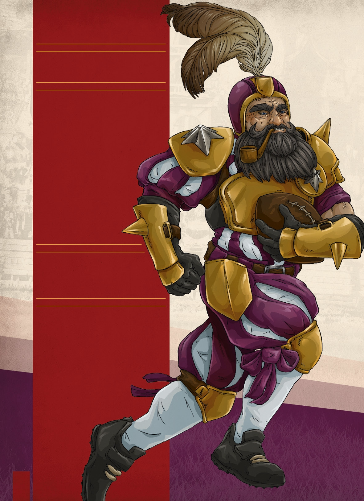or as part of a Blitz action), if the
nominated target has a higher Strength characteristic than this player
before counting offensive or defensive assists but after applying any
other modifierrs, roll a D6 and add this player's Strength
characteristic to the result.
If the total is higher than the target's Strength characteristic, this
player increases their Strength characteristic to be equal to that of
the target
of the Block action, before counting
offensive or defensive assists, for the
duration of this Block action.

If this player has another Skill that
allows them to perform more than
one Block action, such as Frenzy,
they must make a Dauntless roll
before each separate Block action
is performed.

DIRTY PLAYER (+1)
When this player commits a Foul action,
either the Armour roll or Injury roll made
against the victim may be modifiedd by the
amount shown in brackets. This modifierr may be applied after the roll
has been made.

FEND
If this player is pushed back as the result of any block dice result
being applied against them, they may choose to prevent the player that
pushed them back from following-up. However, the player that pushed
them back may continue to move as part
of a Blitz action if they have Movement Allowance remaining or by
Rushing.

This Skill cannot be used when this player is chain-pushed, against a
player with the Ball & Chain trait or against
a player with the Juggernaut skill that performed the Block action as
part of
a Blitz.

**76**

FRENZY\*
Every time this player performs a Block action (on its own or as part
of a Blitz action), they must follow-up if the target is pushed back
and if they are able. If the target is still Standing after being
pushed back, and if this player was able to follow-up, this
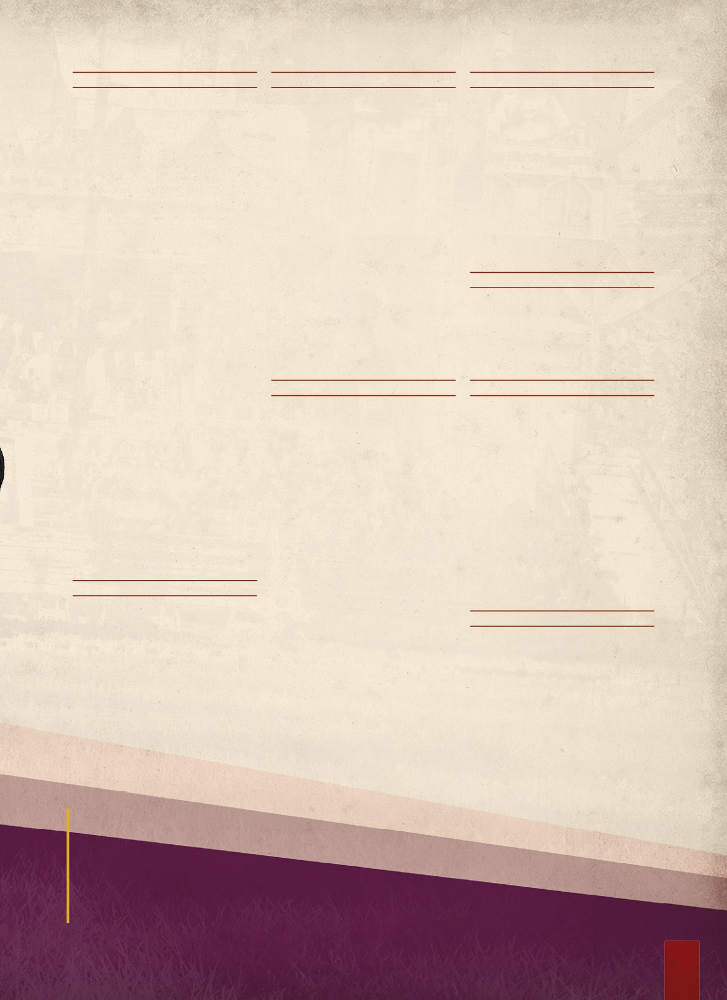player must then perform a second Block
action against the same target, again following-up if the target is
pushed back.

If this player is performing a Blitz action, performing a second Block
action will also cost them one square of their Movement Allowance. If
this player has no Movement Allowance left to perform a second Block
action, they must Rush to do
so. If they cannot Rush, they cannot perform a second Block action.

Note that if an opposition player in possession of the ball is pushed
back into your End Zone and is still Standing, a touchdown will be
scored, ending the drive. In this case, the second Block action is not
performed.

A player with this Skill cannot also have the Grab skill.

KICK
If this player is nominated to be the kicking player during a
kick-off, you may choose to halve the result of the D6 to determine
the number
of squares that the ball deviates, rounding any fractions down.

PR0
During their activation, this player
may attempt to re-roll one dice. This dice may have been rolled either
as a single dice roll, as part of a multiple dice roll or as part of a
dice pool, but cannot be a dice that was rolled as part of an Armour,
Injury or Casualty roll. Roll a D6:

« On a roll of 3+, the dice can be

re-rolled.
« On a roll of 1 or 2, the dice cannot

be re-rolled.

Once this player has attempted to use this Skill, they may not use a
re-roll from any other source to re-roll this one dice.

SHAD0WING
This player can use this Skill when an opposition player they are
Marking voluntarily moves out of a square within this player's Tackle
Zone. Roll
a D6, adding the MA of this player
to the roll and then subtracting the
MA of the opposition player. If the result is 6 or higher, or if the
roll is a natural 6, this player may immediately move into the square
vacated by the opposition player (this player does not need to Dodge to
make this move).
If, however, the result is 5 or lower, or
if the roll is a natural 1, this Skill has no further effect.

A player may use this Skill any number of times per turn, during either
team's turn. If an opposition player is being Marked by more than one
player with this Skill, only one player may use it.

STRIP BALL
When this player targets an
opposition player that is in
possession of the ball with a Block action (on its own or as part of a
Blitz action), choosing to apply a Push
Back result will cause that player
to drop the ball in the square they
are pushed back into. The ball will bounce from the square the player is
pushed back into, as if they had been Knocked Down.

SURE HANDS
This player may re-roll any failed attempt to pick up the ball.
In addition, the Strip Ball skill
cannot be used against a player
with this Skill.

TACKLE
When an active opposition player attempts to Dodge from a square in
which they were being Marked by one or more players on your team with
this Skill, that player cannot use the Dodge skill.

Additionally, when an opposition player is targeted by a

Block action performed by a player with this Skill, that player cannot
use the Dodge skill if a Stumble result is applied against them.

WRESTLE
This player may use this Skill when
a Both Down result is applied, either when they perform a Block action
or when they are the target of a
Block action. Instead of applying the Both Down result as normal, and
regardless of any other Skills either player may possess, both players
are Placed Prone.

HACKSPIT QUILLCHEWER'S FUN FACTS!
*The 2499 season's Most BIatant FouI award went to* *fan-favourIte
MorgrIm KIIIchoppa, who spent the best part of* *45 mInutes kIckIng an
aIready unconscIous Soaren HIghtower* *whIIe grInnIng and wavIng at
the offcIaIsls. The offcIaIsls dIdn\'t* *sImpIy Ignore thIs bIatant
ruIe-breakIng no-no; they were often* *seen to grIn and wave back!*

**77**

**MUTATIONS**

BIG HAND
This player may ignore any modifier((s) for being Marked or for
Pouring
Rain weather conditions when they attempt to pick up the ball.

CLAWS
When you make an Armour roll
against an opposition player that
was Knocked Down as the result
of a Block action performed by this player, a roll of 8+ before
applying
any modifierrs will break their
armour, regardless of their actual Armour Value.

DISTURBING PRESENCE\* When an opposition player performs either a Pass
action, a Throw Team- mate action or a Throw Bomb Special action, or
attempts to either interfere with a pass or to catch the ball, they
must apply a -1 modifierr to the test
for each player on your team with this Skill that is within three
squares of them, even if the player with this Skill is Prone, Stunned
or has lost their Tackle Zone.

EXTRA ARMS

This player may apply a +1 modifierr when they attempt to pick up or
catch the ball, or when they attempt to interfere with a pass.

**78**

F0UL APPEARANCE\*
When an opposition player declares a Block action targeting this player
(on its own or as part of a Blitz action),
or any Special action that targets this player, their coach must firrst
roll a D6, even if this player has lost their Tackle Zone. On a roll of
1, the player cannot perform the declared action and the action is
wasted.

H0RNS
When this player performs a Block action as part of a Blitz action (but
not on its own), you may apply a +1 modifierr to this player's Strength
characteristic. This modifierr is applied before counting assists,
before applying any other Strength modifierrs and before using any other
Skills
or Traits.

IR0N HARD SKIN
The Claws skill cannot be used
when making an Armour roll against this player.

M0NSTR0US M0UTH
This player may re-roll any failed attempt to catch the ball. In
addition, the Strip Ball skill cannot be used against this player.

PREHENSILE TAIL
When an active opposition player attempts to Dodge, Jump or Leap in
order to vacate a square in which they are being Marked by this player,
there is an additional -1 modifierr applied to the active player's
Agility test.

If the opposition player is being Marked by more than one player with
this Mutation, only one player may

use it.

TENTACLES
This player can use this Skill when an opposition player they are
Marking voluntarily moves out of a square within this player's Tackle
Zone. Roll
a D6, adding the ST of this player to the roll and then subtracting the
ST of the opposition player. If the result is 6 or higher, or if the
roll is a natural 6, the opposition player is held firrmly in place and
their movement comes to an end. If, however, the result is 5 or lower,
or if the roll is a natural 1, this Skill has no further effect.

A player may use this Skill any number of times per turn, during either
team's turn. If an opposition player is being Marked by more than one
player with this Skill, only one player may use it.

TW0 HEADS
This player may apply a +1 modifierr to the Agility test when they
attempt to Dodge.

VERY L0NG LEGS
This player may reduce any negative modifierr applied to the Agility
test when they attempt to Jump over a Prone or Stunned player (or to
Leap over an empty square or a square occupied by a Standing player, if
this player has the Leap skill) by 1, to a minimum of -1.

Additionally, this player may apply a +2 modifierr to any attempts

to interfere with a pass they make.

Finally, this player ignores the Cloud Burster skill.

**PASSING SKILLS** ACCURATE
When this player performs a Quick Pass action or a Short Pass action,
you may apply an additional +1 modifierr to the Passing Ability test.

CANN0NEER
When this player performs a Long
Pass action or a Long Bomb Pass action, you may apply an additional
+1 modifierr to the Passing Ability test.

CL0UD BURSTER
When this player performs a Long
Pass action or a Long Bomb Pass action, you may choose to make the
opposing coach re-roll a successful attempt to interfere with the
pass.

DUMP-ofF
If this player is nominated as the
target of a Block action (or a Special action granted by a Skill or
Trait
that can be performed instead of
a Block action) and if they are in possession of the ball, they may
immediately perform a Quick Pass action, interrupting the activation
of the opposition player performing the Block action (or Special
action) to
do so. This Quick Pass action cannot cause a Turnover, but otherwise
all of the normal rules for passing the ball apply. Once the Quick
Pass action is resolved, the active player performs the Block action
and their team
turn continues.

FUMBLER00SKIE
When this player performs a Move or Blitz action whilst in possession
of
the ball, they may choose to 'drop' the ball. The ball may be placed
in any square the player vacates during their movement and does not
bounce. No Turnover is caused.

HAIL MARY PASS
When this player performs a Pass action (or a Throw Bomb action), the
target square can be anywhere on
the pitch and the range ruler does
not need to be used. A Hail Mary
pass is never accurate, regardless of the result of the Passing Ability
test
it will always be inaccurate at best.
A Passing Ability test is made and
can be re-rolled as normal in order
to determine if the Hail Mary pass
is wildly inaccurate or is fumbled. A Hail Mary pass cannot be
interfered with. This Skill may not be used in
a Blizzard.

LEADER
A team which has one or more players with this Skill gains a single
extra
team re-roll, called a Leader re-roll. However, the Leader re-roll can
only
be used if there is at least one player with this Skill on the pitch
(even if the player with this Skill is Prone, Stunned or has lost their
Tackle Zone). If all players with this Skill are removed
from play before the Leader re-roll
is used, it is lost. The Leader re-roll
can be carried over into extra time if
it is not used, but the team does not receive a new one at the start of
extra time. Unlike standard Team Re-rolls, the Leader Re-roll cannot be
lost due to a Halflinng Master Chef. Otherwise, the Leader re-roll is
treated just like a normal team re-roll.

NERVES of STEEL
This player may ignore any modifier((s) for being Marked when they
attempt
to perform a Pass action, attempt to catch the ball or attempt to
interfere with a pass.

0N THE BALL
This player may move up to three squares (regardless of their MA),
following all of the normal movement rules, when the opposing coach
declares that one of their players is going to perform a Pass action.
This move is made after the range has been measured and the target
square declared, but before the active player makes a Passing Ability
test. Making this move interrupts the activation
of the opposition player performing
the Pass action. A player may use
this Skill when an opposition player uses the Dump-off skill, but
should
this player Fall Over whilst moving,
a Turnover is caused.

Additionally, during each Start of Drive sequence, after Step 2 but
before Step 3, one Open player with this Skill on the receiving team may
move up to three squares (regardless of their MA). This Skill may not be
used if a touchback is caused when the kick deviates and does not
allow the player to cross into their opponent's half of the pitch.

PASS
This player may re-roll a failed
Passing Ability test when performing
a Pass action.

RUNNING PASS
If this player performs a Quick Pass action, their activation does not
have to end once the pass is resolved.
If you wish and if this player has not used their full Movement
Allowance, they may continue to move after resolving the pass.

SAFE PASS
Should this player fumble a Pass action, the ball is not dropped, does
not bounce from the square this player occupies, and no Turnover is
caused. Instead, this player retains possession of the ball and their
activation ends.

**79**

**STRENGTH SKILLS**
ARM BAR

If an opposition player Falls Over as the result of failing their
Agility test when attempting to Dodge, Jump or Leap out of a square in
which they

were being Marked by this player, you may apply a +1 modifierr to
either the
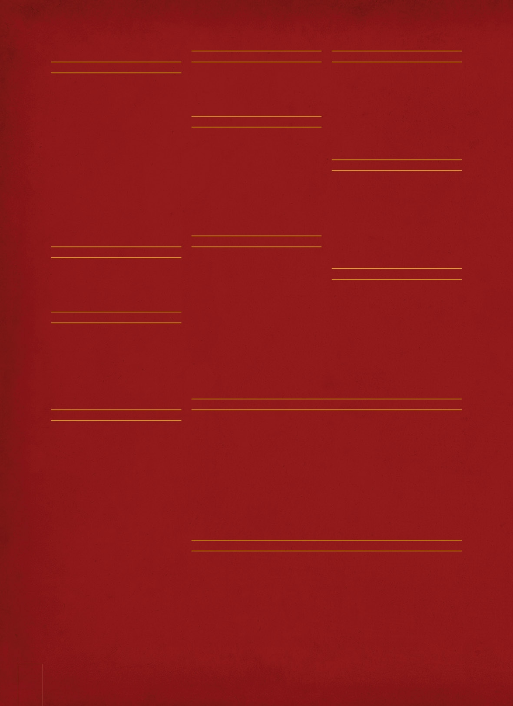Armour roll or Injury roll. This
modifierr may be applied after the roll has been

made and may be applied even if this player is now Prone.

If the opposition player was being Marked by more than one
player with this Skill, only one player may use it.

BRAWLER
When this player performs a Block action on its own (but not as part
of a Blitz action), this player may re-roll a single Both Down result.

BREAK TACKLE
Once during their activation, after making an Agility test in order to
Dodge, this player may modify the
dice roll by +1 if their Strength characteristic is 4 or less, or by
+2
if their Strength characteristic is 5
or more.

GUARD
This player can offer both offensive and defensive assists regardless
of how many opposition players are Marking them.

JUGGERNAUT
When this player performs a Block action as part of a Blitz action (but
not on its own), they may choose to treat a Both Down result as a Push
Back result. In addition, when this player performs a Block action as
part of a Blitz action, the target of the Block action may not use the
Fend, Stand Firm or Wrestle skills.

MIGHTY BL0W (+1)
When an opposition player is
Knocked Down as the result of
a Block action performed by this player (on its own or as part of a
Blitz action), you may modify either the Armour roll or Injury roll by
the amount shown in brackets. This modifierr may be applied after the
roll has been made.

This Skill cannot be used with the Stab or Chainsaw traits.

STAND FIRM
This player may choose not to be pushed back, either as the result of
a Block action made against them or by a chain-push. Using this Skill
does not prevent an opposition player with the Frenzy skill from
performing a second Block action if this player is still Standing after
the firrst.

STR0NG ARM
This player may apply a +1 modifierr
to any Passing Ability test rolls they make when performing a Throw
Team-mate action.

A player that does not have the Throw Team-mate trait cannot have this
Skill.

THICK SKULL
When an Injury roll is made against this player (even if this player is
Prone, Stunned or has lost their
Tackle Zone), they can only be KO'd
on a roll of 9, and will treat a roll of 8 as a Stunned result. If this
player also has the Stunty trait, they can only be KO'd on a roll of 8,
and will treat a
roll of 7 as a Stunned result. All other results are unaffected.

GRAB
When this player performs a Block action (on its own or as part of a
Blitz action), using this Skill prevents the target of the Block
action from using the Side Step skill.

Additionally, when this player performs a Block Action on its own (but
not as part of a Blitz action), if the target is pushed back, this
player

may choose any unoccupied square adjacent to the target to push that
player into. If there are no unoccupied squares, this Skill cannot be
used.

A player with this Skill cannot also have the Frenzy skill.

**80**

MULTIPLE BL0CK
When this player performs a Block action on its own (but not as part of
a
Blitz action), they may choose to perform two Block actions, each
targeting a different player they are Marking. However, doing so will
reduce this player's Strength characteristic by 2 for the duration of
this activation. Both Block actions are performed simultaneously,
meaning both are resolved in full even if one or both result in a
Turnover. The dice rolls for each Block action should be kept separate
to avoid confusion. This player cannot follow-up when using this Skill.

Note that choosing to use this Skill means this player will be unable to
use the Frenzy skill during the same activation.

PILE DRIVER
When an opposition player is Knocked Down by this player as the result
of a Block action (on its own or as part of a Blitz action), this player
may immediately commit a free Foul action against the Knocked Down
player. To use this Skill, this player must be Standing after the block
dice result has been selected and applied, and must occupy a square
adjacent to the Knocked
Down player. After using this Skill, this player is Placed Prone and
their activation ends immediately.

### Traits

**TRAITS**

ANIMAL SAVAGERY\*
When this player is activated, even if they are Prone or have lost
their Tackle Zone, immediately after declaring the action they will
perform but before performing the action, roll a D6, applying a +2
modifierr to the dice roll
if you declared the player would perform a Block or Blitz action (or a
Special action granted by a Skill or Trait that
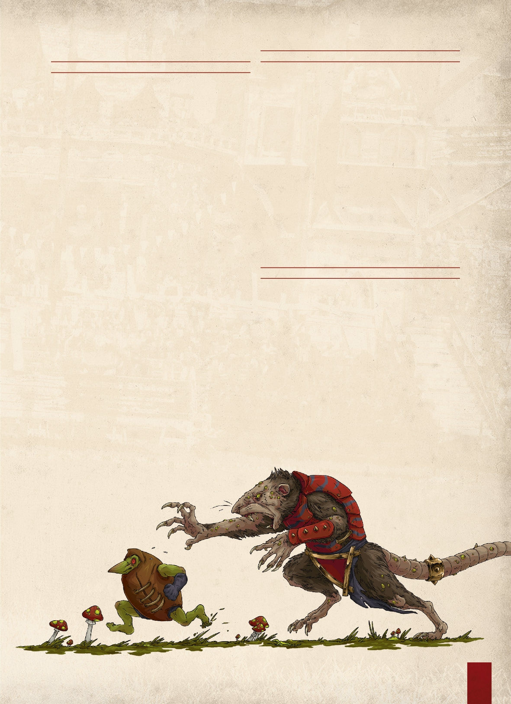can be performed instead of a Block
action):

« On a roll of 1-3, this player lashes out at their

team-mates:

- One Standing team-mate of your choice that is

currently adjacent to this player is immediately Knocked Down by this
player. This does not causea Turnover unless the Knocked Down player was in possession of the
ball. After making an Armour roll (and possible Injury roll) against
the Knocked Down player, this player may continue their activation and
complete their declared action if able. Note that,if this player has any applicable Skills, the coachof the opposing team may use them when makingan Armour roll (and possible Injury roll) against the Knocked Down
player.

- If this player is not currently adjacent to any
  Standing team-mates, this player's activation ends

immediately. Additionally, this player loses their Tackle Zone until
they are next activated.

« On a roll of 4+, this player continues their activation as

normal and completes their declared action.

If you declared that this player would perform an action which can
only be performed once per team turn

and this player's activation ended before the action could be
completed, the action is considered to have been performed and no
other player on your team may perform the same action this team turn.

ANIM0SITY (X)\*
This player is jealous of and dislikes certain other players on their
team, as shown in brackets after the name of
the Skill on this player's profilee. This may be definedd by position or
race. For example, a Skaven Thrower on an Underworld Denizens team has
Animosity (Underworld Goblin Linemen), meaning they suffer Animosity
towards any Underworld Goblin Linemen players on their team. Whereas a
Skaven Renegade on a Chaos Renegade team has Animosity (all team-mates),
meaning they suffer Animosity towards all of their team-mates equally.

When this player wishes to perform a Hand-off
action to a team-mate of the type listed, or attempts to

perform a Pass action and the target square is occupied by a team-mate
of the type listed, this player may refuse to do so. Roll a D6. On a
roll of 1, this player refuses to

perform the action and their activation comes to an end. Animosity does
not extend to Mercenaries or Star Players.

ALWAYS HUNGRY\*
If this player wishes to perform a Throw Team-mate action, roll a D6
after they have finishedd moving, but before they throw their team-mate.
On a roll of 2+, continue with the throw as normal. On a roll of 1, this
player will attempt to eat their team-mate. Roll another D6:

« On a roll of 1, the team-mate has been eaten and

is immediately removed from the Team Draft list.
No apothecary can save them and no Regeneration attempts can be made.
If the team-mate was in possession of the ball, it will bounce from
the square this player occupies.

« On a roll of 2+, the team-mate squirms free and the Throw Team-mate
action is automatically fumbled, as

described on page 53.

**81**

BALL & CHAIN\*
When this player is activated, the only action they may perform is a
'Ball & Chain Move' Special action. There is no limit to how many
players with this Trait may perform this Special action each team
turn.

When this player performs this Special action:

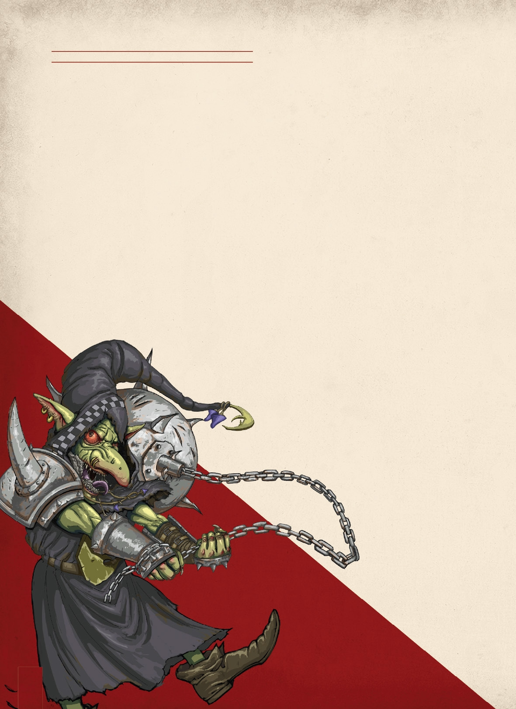« Place the Throw-in template over the
player, facing towards either End Zone or either sideline as you wish.

« Roll a D6 and move the player one square in the

direction indicated.
« A player with a Ball & Chain automatically passes any

Agility tests they may be required to make in order to Dodge,
regardless of any modifierrs.

« If this movement takes the player off the pitch, they

risk Injury by the Crowd.
« If this movement takes the player into a square in

which the ball is placed, the player is considered to have moved
involuntarily. Therefore, they may not attempt to pick the ball up and
the ball will bounce.

Repeat this process for each square the player moves.

If this player would move into a square that is occupied

**82**

by a Standing player from either team, they must perform a Block action
against that player, following the normal rules, but with the following
exceptions:

« A Ball & Chain player ignores the Foul Appearance skill. « A Ball &
Chain player must follow-up if they push-back

another player.

If this player moves into a square that is occupied by a Prone or
Stunned player from either team, for any reason, that player is
immediately pushed back and an Armour roll is made against them.

This player may Rush. Declare that the player will Rush before placing
the Throw-in template and rolling the D6 to determine direction:

« If this player Rushes into an unoccupied square, move

them as normal and roll a D6:

- On a roll of 2+, this player moves without mishap.
- On a roll of 1 (before or after modificcation), the

player Falls Over.
« If this player Rushes into a square that is occupied by a

standing player from either team, roll a D6:

- On a roll of 2+, this player moves without mishap

and will perform a Block action against the player occupying the
square as described previously.

- On a roll of 1 (before or after modificcation), the
  player occupying the square is pushed back and

this player will Fall Over after moving into the
vacated square.

If this player ever Falls Over, is Knocked Down or is Placed Prone, an
Injury roll is immediately made against them (no Armour roll is
required), treating a Stunned result as a KO'd result.

A player with this Trait cannot also have the Diving Tackle, Frenzy,
Grab, Leap, Multiple Block, On the

Ball or Shadowing skills.

B0MBARDIER
When activated and if they are Standing, this player can perform a
'Throw Bomb' Special action. This Special action is neither a Pass
action nor a Throw Team-mate action, so does not prevent another
player performing one of those actions during the same team turn.
However, only a single player with this Trait may perform this Special
action each team turn.

A Bomb can be thrown and caught, and the throw interfered with, just
like 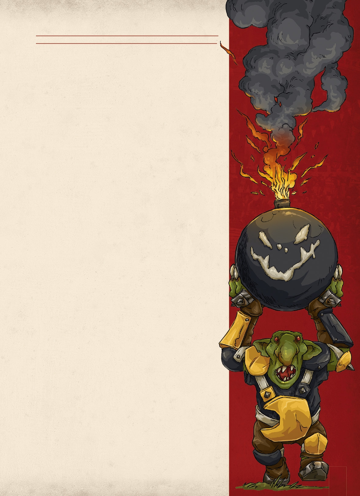a ball, using the rules for Pass actions
as described on page 48, with the following exceptions:

« A player may not stand up or move before performing a Throw Bomb
action. « Bombs do not bounce and can come to rest on the ground in an
occupied

square. Should a player fail to catch a Bomb, it will come to rest on
the ground in the square that player occupies.

« If a Bomb is fumbled, it will explode immediately in the square
occupied by

the player attempting to throw it.
« If a Bomb comes to rest on the ground in an empty square or is
caught by

an opposition player, no Turnover is caused.
« A player that is in possession of the ball can still catch a Bomb.

« Any Skills that can be used when performing a Pass action can also
be
used when performing a Throw Bomb Special action, with the exception
of

On the Ball.

If a Bomb is caught by a player on either team, roll a D6:

« On a roll of 4+, the Bomb explodes immediately, as described below.
« On a roll of 1-3, that player must throw the Bomb again immediately.

This throw takes place out of the normal sequence of play.

Should a Bomb ever leave the pitch, it explodes in the crowd with no
effect (on the game) before the crowd can throw it back.

When a Bomb comes to rest on the ground, in either an unoccupied
square, in a square occupied by a player that failed to catch the Bomb
or in a square occupied by a Prone or Stunned player, it will explode
immediately:

« If the Bomb explodes in an occupied square, that player is
automatically hit

by the explosion.
« Roll a D6 for each player (from either team) that occupies a square

adjacent to the one in which the Bomb exploded:

- On a roll of 4+, the player has been hit by the explosion.
- On a roll of 1-3, the player manages to avoid the explosion.

« Any Standing players hit by the explosion are Knocked Down.
« An Armour roll (and possibly an Injury roll as well) is made against
any

player hit by the explosion, even if they were already Prone or
Stunned.
« You may apply a +1 modifierr to either the Armour roll or Injury
roll.

This modifierr may be applied after the roll has been made.

**83**

B0NE HEAD\*
When this player is activated, even if they are Prone or have lost
their Tackle Zone, immediately after declaring the action they will
perform but before performing the action, roll a D6:

« On a roll of 1, this player forgets what they are doing

and their activation ends immediately. Additionally,
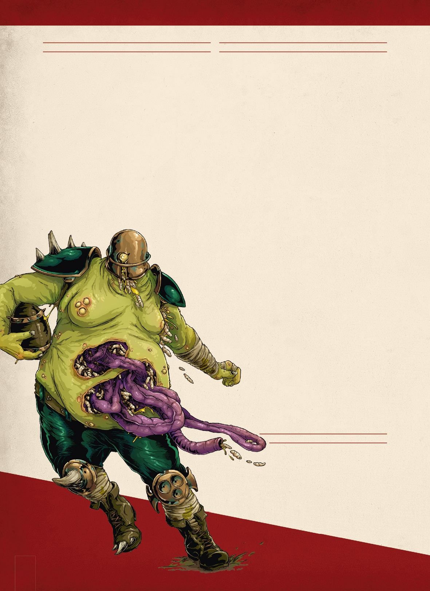this player loses their Tackle Zone
until they are
next activated.

« On a roll of 2+, this player continues their activation as

normal and completes their declared action.

If you declared that this player would perform an action which can
only be performed once per team turn

and this player's activation ended before the action could be
completed, the action is considered to have been performed and no
other player on your team may perform the same action this team turn.

**84**

CHAINSAW\*
Instead of performing a Block action (on its own or as part of a Blitz
action), this player may perform a 'Chainsaw Attack' Special action.
Exactly as described for a Block action, nominate a single Standing
player to be the target of the Chainsaw Attack Special action. There is
no limit to how many players with this Trait may perform this Special
action each team turn.

To perform a Chainsaw Attack Special action, roll a D6:

« On a roll of 2+, the nominated target is hit by

a Chainsaw!
« On a roll of 1, the Chainsaw will violently 'kick-back'

and hit the player wielding it.
« In either case, an Armour roll is made against the

player hit by the Chainsaw, adding +3 to the result.
« If the armour of the player hit is broken, they become

Prone and an Injury roll is made against them. This Injury roll cannot
be modifiedd in any way.

« If the armour of the player hit is not broken, this Trait

has no effect.

This player can only use the Chainsaw once per turn (i.e., a Chainsaw
cannot be used with Frenzy or Multiple Block) and if used as part of a
Blitz action, this player cannot continue moving after using it.

If this player Falls Over or is Knocked Down, the opposing coach may add
+3 to the Armour roll made against the player.

If an opposition player performs a Block action targeting this player
and a Player Down! or a POW! result is applied,

+3 is added to the Armour roll. If a Both Down result

is applied, +3 is added to both Armour rolls.

Finally, this player may use their Chainsaw
when they perform a Foul action. Roll a D6 for kick-back as described
above. Once again, an Armour roll is made against the player hit by
the Chainsaw, adding +3 to the score.

DECAY\*
If this player suffers a Casualty

result on the Injury table, there is
a +1 modifierr applied to all rolls
made against this player on the Casualty table.

HYPN0TIC GAZE
During their activation, this player may perform a 'Hypnotic Gaze'
Special action. There is no limit to how many players with this Trait
may perform this Special action each
team turn.

To perform a Hypnotic Gaze Special action,
nominate a single Standing opposition player that has not

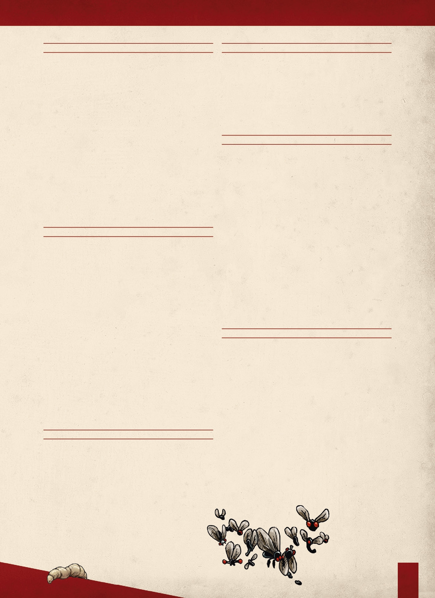lost their Tackle Zone and that this
player is Marking. Then make an Agility test for this player, applying
a -1 modifierr for every player (other than the nominated player) that
is Marking this player. If the test is passed, the nominated player
loses their Tackle Zone until they are next activated.

This player may move before performing this Special action, following
all of the normal movement rules. However, once this Special action
has been performed,
this player may not move further and their activation
comes to an end.

KICK TEAM-MATE
Once per team turn, in addition to another player performing either a
Pass or a Throw Team-mate action, a single player with this Trait on
the active team can perform a 'Kick Team-mate' Special action and
attempt to kick a Standing team-mate with the Right Stuff trait that
is in a square adjacent to them.

To perform a Kick Team-mate Special action, follow the rules for Throw
Team-mate actions as described on page 52.

However, if the Kick Team-mate Special action is fumbled, the kicked
player is automatically removed from

play and an Injury roll is made against them, treating a Stunned
result as a KO'd result (note that, if the player that performed this
action also has the Mighty Blow (+X)

skill, the coach of the opposing team may use that Skill on this
Injury roll). If the kicked player was in possession of the ball when
removed from play, the ball will bounce from the square they occupied.

L0NER (X+)\*
If this player wishes to use a team re-roll, roll a D6.
If you roll equal to or higher than the target number
shown in brackets, this player may use the team re-roll
as normal. Otherwise, the original result stands without being
re-rolled but the team re-roll is lost just as if it had been used.

N0 HANDS\*
This player is unable to take possession of the ball. They may not
attempt to pick it up, to catch it, or attempt
to interfere with a pass. Any attempt to do so will automatically fail,
causing the ball to bounce. Should this player voluntarily move into a
square in which the ball
is placed, they cannot attempt to pick it up. The ball will bounce and a
Turnover is caused as if this player had failed an attempt to pick up
the ball.

PLAGUE RIDDEN
Once per game, if an opposition player with a Strength characteristic of
4 or less that does not have the Decay, Regeneration or Stunty traits
suffers a Casualty result of 15-16, DEAD as the result of a Block action
performed
or a Foul action committed by a player with this Trait that belongs to
your team, and if that player cannot be saved by an apothecary, you may
choose to use this Trait. If
you do, that player does not die; they have instead been infected with a
virulent plague!

If your team has the 'Favoured of Nurgle' special rule, a new 'Rotter
Lineman' player, drawn from the
Nurgle roster, can be placed immediately in the Reserves box of your
team's dugout (this may cause a team to
have more than 16 players for the remainder of this game). During step 4
of the post-game sequence, this player may be permanently hired, exactly
as you would
a Journeyman player that had played for your team (see page 72).

P0G0 STICK
During their movement, instead of jumping over a
single square that is occupied by a Prone or Stunned
player, as described on page 45, a player with this Trait
may choose to Leap over any single adjacent square, including unoccupied
squares and squares occupied by Standing players.

Additionally, when this player makes an Agility test to Jump over a
Prone or Stunned player, or to Leap over an empty square or a square
occupied by a Standing player, they may ignore any negative modifierrs
that would normally be applied for being Marked in the square they
jumped or leaped from and/or for being Marked in the square they have
jumped or leaped into.

A player with this Trait cannot also have the Leap skill.

**85**

PR0JECTILE V0MIT
Instead of performing a Block action (on its own or as part of a Blitz
action), this player may perform a 'Projectile Vomit' Special action.
Exactly as described for a Block action, nominate a single Standing
player to be the target of the Projectile Vomit Special action. There
is no limit to how many players with this Trait may perform this
Special action each team turn.

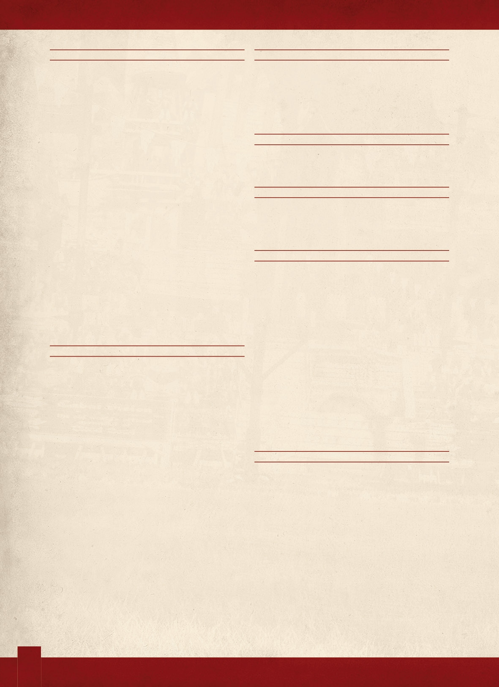

To perform a Projectile Vomit Special action, roll a D6:

« On a roll of 2+, this player regurgitates acidic bile onto

the nominated target.
« On a roll of 1, this player belches and snorts, before

covering itself in acidic bile.
« In either case, an Armour roll is made against the

player hit by the Projectile Vomit. This Armour roll cannot be
modifiedd in any way.

« If the armour of the player hit is broken, they become

Prone and an Injury roll is made against them. This Injury roll cannot
be modifiedd in any way.

« If the armour of the player hit is not broken, this Trait

has no effect.

A player can only perform this Special action once per turn (i.e.,
Projectile Vomit cannot be used with Frenzy

or Multiple Block).

REALLY STUPID\*
When this player is activated, even if they are Prone or have lost
their Tackle Zone, immediately after declaring the action they will
perform but before performing the action, roll a D6, applying a +2
modifierr to the dice roll if this player is currently adjacent to one
or more Standing team-mates that do not have this Trait:

« On a roll of 1-3, this player forgets what they are doing and their
activation ends immediately. Additionally,

this player loses their Tackle Zone until they are
next activated.

« On a roll of 4+, this player continues their activation as

normal and completes their declared action.

Note that if you declared that this player would perform an action
which can only be performed once per

team turn and this player's activation ended before the action could
be completed, the action is considered to have been performed and no
other player on your team may perform the same action this team turn.

**86**

REGENERATI0N
After a Casualty roll has been made against this player,
roll a D6. On a roll of 4+, the Casualty roll is discarded without
effect and the player is placed in the Reserves
box rather than the Casualty box of their team dugout.
On a roll of 1-3, however, the result of the Casualty roll is applied as
normal.

RIGHT STUFF\*
If this player also has a Strength characteristic of 3 or
less, they can be thrown by a team-mate with the Throw Team-mate skill,
as described on page 52.

SECRET WEAP0N\*
When a drive in which this player took part ends, even if this player
was not on the pitch at the end of the drive, this player will be
Sent-off for committing a Foul, as described on page 63.

STAB
Instead of performing a Block action (on its own or as part of a Blitz
action), this player may perform a 'Stab' Special action. Exactly as
described for a Block action, nominate a single Standing player to be
the target of the Stab Special action. There is no limit to how many
players with this Trait may perform this Special action each team turn.

To perform a Stab Special action, make an unmodifiedd Armour roll
against the target:

« If the Armour of the player hit is broken, they become

Prone and an Injury roll is made against them. This Injury roll cannot
be modifiedd in any way.

« If the Armour of the player hit is not broken, this Trait

has no effect.
« If Stab is used as part of a Blitz action, the player

cannot continue moving after using it.

STUNTY\*
When this player makes an Agility test in order to Dodge, they ignore
any -1 modifierrs for being Marked in the
square they have moved into, unless they also have either the Bombardier
trait, the Chainsaw trait or the Swoop trait.

However, when an opposition player attempts to interfere with a Pass
action performed by this player, that

player may apply a +1 modifierr to their Agility test.

Finally, players with this Trait are more prone to injury. Therefore,
when an Injury roll is made against this

player, roll 2D6 and consult the Stunty Injury table, on page 60.

SWARMING
During each Start of Drive sequence, after Step 2 but before Step 3,
you may remove D3 players with this Trait from the Reserves box of
your dugout and set them up on the pitch, allowing you to set up more
than the usual 11 players. These extra players may not be placed on
the Line of Scrimmage or in a Wide Zone.

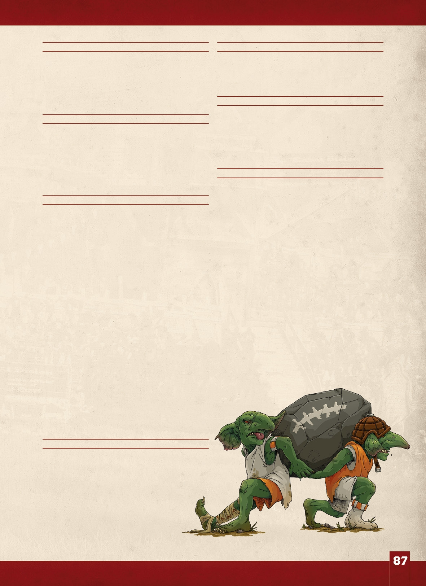SW00P
If this player is thrown by a team-mate, as described
on page 52, they do not scatter before landing as they normally would.
Instead, you may place the Throw-in template over the player, facing
towards either End Zone
or either sideline as you wish. The player then moves from the target
square D3 squares in a direction determined by rolling a D6 and
referring to the Throw-in template.

TAKE R00T\*
When this player is activated, even if they are Prone or
have lost their Tackle Zone, immediately after declaring
the action they will perform but before performing the action, roll a
D6:

« On a roll of 1, this player becomes 'Rooted':

- A Rooted player cannot move from the square

they currently occupy for any reason, voluntarily or otherwise, until
the end of this drive, or until theyare Knocked Down or Placed Prone.

- A Rooted player may perform any action available to them provided
  they can do so without moving. For

example, a Rooted player may perform a Pass action but may not move
before making the pass, and
so on.

« On a roll of 2+, this player continues their activation

as normal.

If you declared that this player would perform any action that
includes movement (Pass, Hand-off, Blitz or Foul) prior to them
becoming Rooted, they may complete

the action if possible. If they cannot, the action is considered to
have been performed and no other player
on your team may perform the same action this team turn.

TITCHY\*
This player may apply a +1 modifierr to any Agility tests
they make in order to Dodge. However, if an opposition player dodges
into a square within the Tackle Zone of this player, this player does
not count as Marking the moving player for the purposes of calculating
Agility test modifierrs.

THR0W TEAM-MATE
If this player also has a Strength characteristic of 5 or more, they may
perform a Throw Team-mate action, as described on page 52, allowing them
to throw a team-
mate with the Right Stuff trait.

TIMMM-BER!

If this player has a Movement Allowance of 2 or less, apply a +1
modifierr to the dice roll when they attempt to stand
up (as described on page 44) for each Open, Standing team-mate they are
currently adjacent to.
A natural 1 is always a failure, no matter how many team- mates are
helping.

UNCHANNELLED FURY\*
When this player is activated, even if they are Prone or
have lost their Tackle Zone, immediately after declaring
the action they will perform but before performing the action, roll a
D6, applying a +2 modifierr to the dice roll
if you declared the player would perform a Block or Blitz action (or a
Special action granted by a Skill or Trait that can be performed instead
of a Block action):

« On a roll of 1-3, this player rages incoherently at

others but achieves little else. Their activation
ends immediately.

« On a roll of 4+, this player continues their activation as

normal and completes their declared action.

If you declared that this player would perform an action which can only
be performed once per team turn

and this player's activation ended before the action could be completed,
the action is considered to have been performed and no other player on
your team may perform the same action this team turn.

## Inducements In Detail

*INDUCEMENTS*
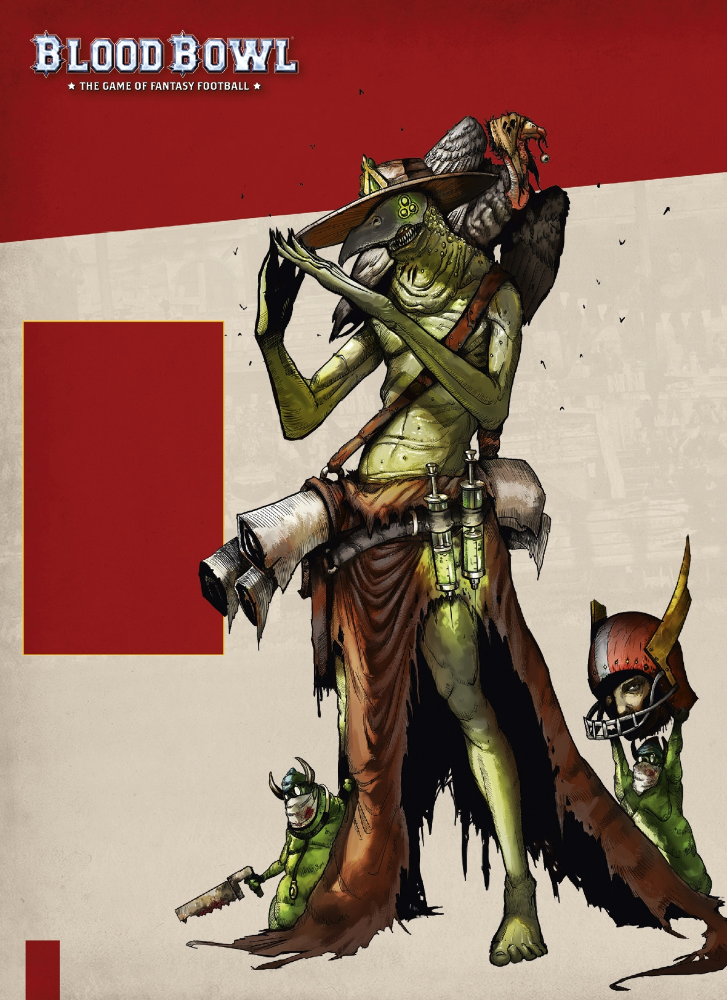*IN DETAIL*

here are always plenty of hangers-on loitering around a Blood Bowl

stadium. Be it legendary free agents willing to play for anyone if the
price is right, or offcialsls happy to take extra payment
in return for being somewhat biased in their rulings, to unemployed
coaching stafff looking for a break and even a few apothecaries
willing to roll up their sleeves. All these and more are willing to
sign on with
a team temporarily, for a price
of course! often, the stadium owners or promoters will foot
the bill, willing to help out a disadvantaged team rather than risk a
team refusing to play!

**88**

Blood Bowl teams are always looking for an advantage, be it fair or
otherwise! Coaches will pay all manner of shady characters

to assist their team from the sidelines or on the pitch. During the
pre-game sequence of a league
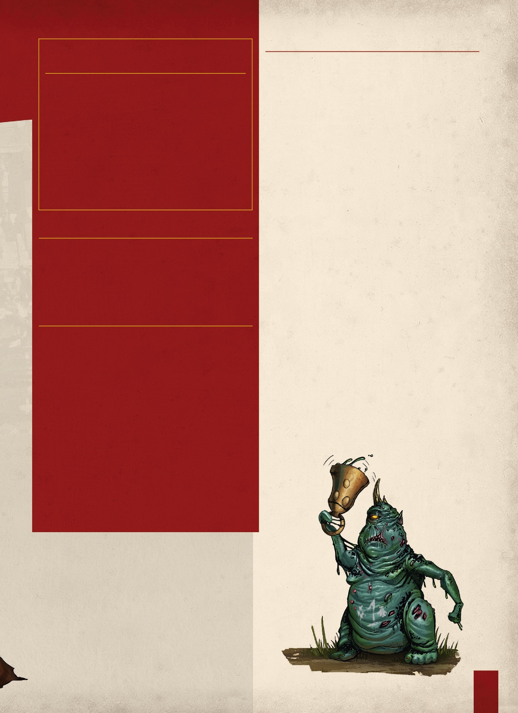fixtture, coaches may purchase
Inducements for the game ahead by spending gold awarded as Petty Cash,
taken from their Treasury or both. When creating a team for exhibition
play, a coach may purchase Inducements from their Team
Draft Budget.

**INDUCEMENTS IN LEAGUE PLAY**

s described on page 35, during the pre-game sequence of a league
fixtture, each team can
spend gold pieces either from their Treasury, from

Petty Cash (see page 38) or both, to purchase any of the Inducements
available to them which are then recorded on the team's Game Record
sheet.

**INDUCEMENTS IN EXHIBITION PLAY**

hen a team is drafted for exhibition play, you may spend as much or as
little of your Team Draft Budget as you wish on Inducements, provided

your team contains the minimum of 11 players, not including Induced
Star Players.

If you are drafting a team for exhibition play to be used at an event
or tournament, you should pay close attention
to the rulespack created by the organisers, as it is quite common that
not all Inducements will be allowed. Also, it
is common for tournament organisers to create their own, special
Inducements.

If two coaches are drafting teams for exhibition play between
themselves, they should take a few minutes to discuss Inducements
firrst. It is important to decide if there
are any Inducements they feel should be included or any they would
prefer to leave out.

**COMMON INDUCEMENTS**

elow is a list of the common Inducements. There are many more
Inducements and most teams have access to their own, unique
Inducements as well.

More Inducements can be found in the various Blood Bowl supplements
available:

« 0-4 Temp Agency Cheerleaders - 20,000 gold

pieces each
« 0-3 Part-time Assistant Coaches - 20,000 gold

pieces each
« 0-1 Weather Mage - 30,000 gold pieces

« 0-2 Bloodweiser Kegs - 50,000 gold pieces each
« 0-5 Special Plays - 100,000 gold pieces each
« 0-8 Extra Team Training - 100,000 gold pieces each
« 0-3 Bribes - 100,000 gold pieces each (50,000 gold

pieces for teams with the 'Bribery and Corruption'
special rule)

« 0-2 Wandering Apothecaries - 100,000 gold pieces each (not available
to teams that cannot hire an apothecary)

« 0-1 Mortuary Assistant - 100,000 gold pieces (only

available to teams with the 'Sylvanian Spotlight'
special rule)

« 0-1 Plague Doctor - 100,000 gold pieces (only available

to teams with the 'Favoured of Nurgle' special rule)
« 0-1 Riotous Rookies - 100,000 gold pieces (only

available to teams with the 'Low Cost Linemen'
special rule)

« 0-1 Halflinng Master Chef - 300,000 gold pieces
(100,000 gold pieces for teams with the 'Halflinng Thimble

Cup' special rule)
« Unlimited Mercenary Players - price varies

« 0-2 Star Players - price varies
« 0-2 (In)Famous Coaching Stafff - price varies
« 0-1 Wizard - price varies
« 0-1 Biased Referee - price varies

**89**

0-4 TEMP AGENCY CHEERLEADERS
20,000 G0LD PIECES EACH, AVAILABLE T0 ANY TEAM Cheerleading isn't
steady work and there are always young hopefuls looking for their big
break, willing to bolster a depleted cheer squad on game day! In
addition to hiring cheerleaders as permanent Sideline Staff, any team
may temporarily purchase some Temp Agency Cheerleaders
as Inducements. Simply increase the team's number of
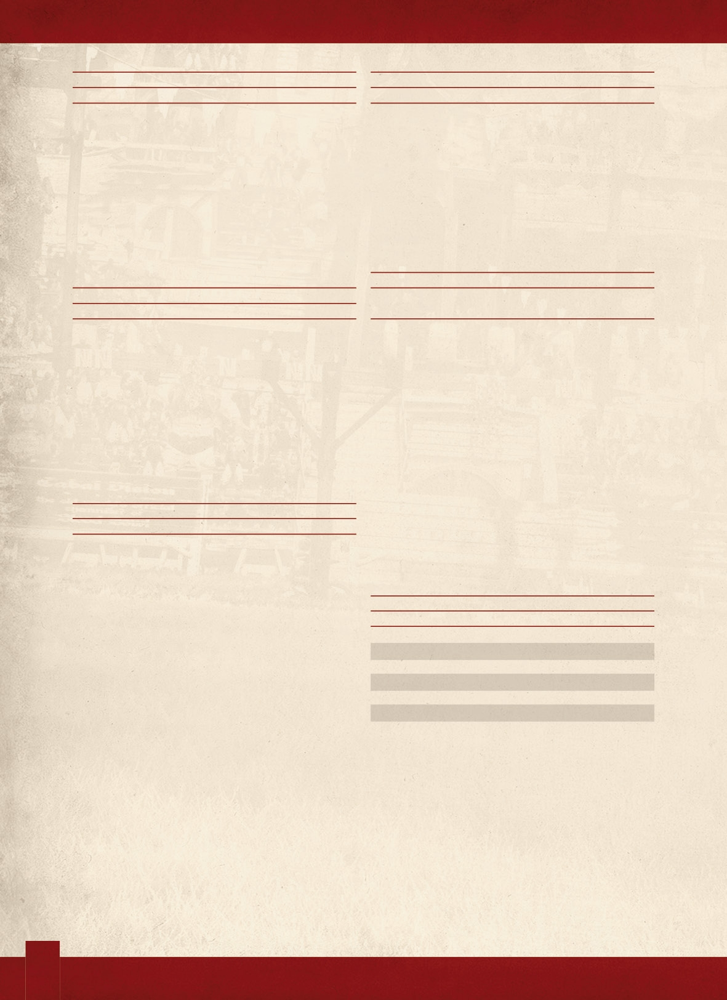cheerleaders by the number Induced, up
to a maximum of 16 in total, for the duration of the game.

At the end of the game, any Temp Agency Cheerleaders will leave the
team.

0-3 PART-TIME ASSISTANT C0ACHES
20,000 G0LD PIECES EACH, AVAILABLE T0 ANY TEAM Everyone's an expert,
and if a coach is willing to pay, many will share that expertise with
the team! In addition to
hiring assistant coaches as permanent Sideline Staff, any team may
temporarily purchase some Part-time Assistant Coaches as Inducements.
Simply increase the team's number of assistant coaches by the number
Induced,
up to a maximum of nine in total, for the duration of
the game.

At the end of the game, any Part-time Assistant Coaches will leave the
team.

0-1 WEATHER MAGE
30,000 G0LD PIECES, AVAILABLE T0 ANY TEAM
Many stadium owners employ Weather Mages, paying
good money for highly localised spells to control the elements to keep
the fans dry and happy. Rarely does this magical climate control
extend to the pitch though, unless
a coach is willing to pay for the service that is! A Weather Mage is
not a Wizard Inducement and a coach may Induce both a Weather Mage and
a Wizard of some sort.

You may use a Weather Mage once per game, at
the start of any one of your team turns, before activating

any of your players. Roll on the Weather table, applying a modifierr
of +1 or +2, or -1 or -2 if desired. The resulting weather conditions
are applied immediately and will last until the end of the
opposition's next team turn, replacing the existing weather
conditions. At the end of opposition's next team turn or the end of
the drive (whichever comes firrst), the replaced weather conditions
will return.

**90**

0-2 BL00DWEISER KEGS
50,000 G0LD PIECES EACH, AVAILABLE T0 ANY TEAM Nothing says "get back in
the game\" like a frosty Bloodweiser Ale served straight from the keg.
There's probably an officiall rule regarding drinking during a game, but
whether it's compulsory or banned, who cares! For each Bloodweiser Keg
Induced, you may apply a +1 modifierr to the result of any dice rolls
made during this game when rolling to see if any of your players
recovers from being KO'd. Bloodweiser Kegs benefitt all players
currently on the team, including Journeymen, Star Players and
Mercenaries.

0-5 SPECIAL PLAYS
100,000 G0LD PIECES EACH,
AVAILABLE T0 ANY TEAM
Each Special Plays Inducement purchased gives you
one Special Plays card to use during the game ahead. Cards are drawn
from one or more of the Special Plays card decks during the Inducements
step of the pre-
game sequence:

« Each Special Plays Inducement purchased allows you

to draw cards from a single deck.
« The deck from which cards are drawn is determined by

rolling a D6 and consulting the table below.
« For each separate Special Plays Inducement

purchased, roll again on the table below.
« There is no limit to how many cards may be drawn from

each deck, but if the second roll or any subsequent
rolls give a duplicated result, you may re-roll the D6. If the D6 is
re-rolled, you must accept the result of the re-roll.

SPECIAL PLAYS CARDS

D6 DECK

1 *Random Events*
2 *Dirty Tricks*

3 *Magical Memorabilia*
4 *Heroic Feats*

5 *Benefitss of Training*
6 *Miscellaneous Mayhem*

*CARD SELECTION:* Once the D6 has been rolled, the appropriate Special
Plays card deck is shuffledd and two cards are drawn from the top. You
may then read both cards before choosing one to keep and one to discard.

0-8 EXTRA TEAM TRAINING
100,000 G0LD PIECES EACH,
AVAILABLE T0 ANY TEAM
Getting all of the players together in the same place is
hard enough on game day, let alone for a regular training session. If
a coach wants to hold extra training sessions ahead of an important
fixtture, they had better be prepared to flaash some cash to Induce
the cooperation of their
players! Each Extra Team Training
session grants the team an extra team re-roll for each half of this
game.

0-3 BRIBES

100,000 G0LD PIECES EACH
(50,000 G0LD PIECES F0R TEAMS WITH THE
'BRIBERY AND C0RRUPTI0N' SPECIAL RULE), AVAILABLE T0 ANY TEAM
When a player is caught misbehaving, a bag of gold pieces can have a
surprisingly calming effect upon an angered referee! A single Bribe
may be used when a player is Sent-off for committing a Foul or using a
Secret Weapon.
To use a Bribe, roll a D6. On a roll of 2-6, the Bribe is effective
and the player is not Sent-off (and no Turnover
is caused), but on a roll of 1 the Bribe is wasted and the referee's
decision still stands! Each Bribe may be used once per game.

A single Bribe may be used after an attempt to
Argue the Call has been made. However, if a 1 was rolled

when attempting to Argue the Call and the head coach ejected, as
described on page 63, the ref is annoyed beyond the calming effects of
mere gold and no Bribe may be used this time!

0-2 WANDERING AP0THECARIES
100,000 G0LD PIECES EACH, AVAILABLE T0 ANY
TEAM THAT CAN INCLUDE AN AP0THECARY
Any team that can normally hire an apothecary may
Induce a Wandering Apothecary or two to help during
the game. Often these apothecaries are local barber surgeons, present
for the game and willing to recoup the price of their ticket by
helping out. Others are experts of questionable veracity, hoping to
prove the worth of their unorthodox methods. Wandering Apothecaries
follow all the rules for normal apothecaries, as described on page 62.
However, unlike a normal apothecary, a Wandering Apothecary may
attempt to patch-up any Journeymen or Mercenary players the team
includes, but cannot attempt to patch up a Star Player.

0-1 M0RTUARY ASSISTANT
100,000 G0LD PIECES, AVAILABLE T0 ANY TEAM
WITH THE 'SYLVANIAN SP0TLIGHT' SPECIAL RULE Necromancers are always
looking for a helping hand
with their work, and the local mortuary workers are often eager to earn
some extra income. A Mortuary Assistant is
a master of needle, thread and twisted wire, connecting
hip bone to leg bone, repairing funeral bindings, and so
on. They can really get the players shambling back to the pitch! A
Mortuary Assistant may be used once per game to re-roll one failed
Regeneration roll for any player currently on the team, including
Journeymen, but not including Mercenaries or Star Players.

0-1 PLAGUE D0CT0R
100,000 G0LD PIECES, AVAILABLE T0 ANY TEAM
WITH THE 'FAV0URED of NURGLE' SPECIAL RULE
The Plague Doctors that accompany Nurgle-aligned teams are well-versed
in the care of the many virulent plagues and ailments that infect their
charges. Once per game, a Plague Doctor may be used to re-roll one
failed Regeneration roll
for a player on their team. Alternatively, once per game the Plague
Doctor may be used in exactly the same way as an apothecary when any
player on their team is Knocked-out (see page 62). Plague Doctors
benefitt all players currently
on the team, including Journeymen, but not including Mercenaries or Star
Players.

0-1 RI0T0US R00KIES
100,000 G0LD PIECES, AVAILABLE T0 ANY TEAM
WITH THE 'L0W C0ST LINEMEN' SPECIAL RULE
Ahead of the game the head coach ventures outside the stadium armed with
handfuls of small change and dried beans which they flinng to the
adoring crowd, telling them they have been hired and this game is their
big break in Blood Bowl. Regardless of how many players are available
for this game and in addition to any Journeymen the team gains for free
to make up for any lack of players, your team gains an additional 2D3+1
Journeymen for this game. These fresh-faced young hopefuls may take the
number of players on your Team Draft list temporarily above 16. They are
normal Journeyman players in every other respect and unless hired in the
post-game sequence, they will be sent on their merry way once the game
has ended.

**91**

0-1 HALFLING MASTER CHEF
300,000 G0LD PIECES (100,000 G0LD PIECES
F0R TEAMS WITH THE 'HALFLING THIMBLE CUP' SPECIAL RULE), AVAILABLE T0
ANY TEAM
The entourage of many teams can include several world-class chefs who
busy themselves with preparing
the halftime and fulltime banquets for the players.
The delicious aromas emanating from the team's dugout
all too often distract the opposition as
much as they invigorate your players! At the start of both the firrst
and second half, after step 2 but before step 3 of the Start of Drive
sequence, roll three D6. For each roll of a 4+, your team is so
inspired they gain an extra team re-roll for
this half. In addition, the opposing team is so distracted that for
each roll of a 4+, they will lose one of their team re-rolls for this
half.

UNLIMITED MERCENARY PLAYERS
PRICE VARIES, AVAILABLE T0 ANY TEAM
For every player safely employed by a team, there are dozens more who
will wear anyone's colours in exchange for hard currency. You may
Induce Mercenary players
to your team for a single game, chosen from your Team Roster, at
30,000 gold pieces more than the player would normally cost. For
example, a Mercenary Human Lineman would cost 80,000 gold pieces to
hire for a game rather than the usual 50,000 gold pieces.

The normal limits on the total number of players allowed on a team and
in each position apply to Mercenaries. However, players that are
missing the game due to injury do not count towards the number of
players on the team, so they are not counted when working out how many
Mercenaries a team can have.

All Mercenaries have the Loner (4+) trait as they
are not accustomed to playing with the rest of the team.

In addition, a Mercenary may be given one additional Primary skill
selected from those available to a player of that position, at an
additional cost of 50,000 gold pieces. For example, a Mercenary Human
Lineman could be
given Tackle for a total cost of 130,000 gold pieces to hire for a
game. Mercenaries do not earn Star Player points
and cannot be awarded the MVP for the game. Unlike Journeymen,
Mercenaries cannot be permanently hired during the post-game sequence.

**92**

0-2 STAR PLAYERS
PRICE VARIES, AVAILABLE T0 VARI0US TEAMS
These are the heroes of the Blood Bowl arena, the most resourceful and
talented players in the sport. Star Players act as free agents, playing
occasional games for any
team that can afford their high fees (and that they are willing to
assist in the firrst place), and then moving on to play for another
team. A team may Induce up to two Star Players that are allowed to play
for the team. Unless the league commissioner decides otherwise, any
Casualty table results applied against a Star Player are waived
after the game - they can afford all the resurrection spells they need!

Star Players may not take the number of players
in the team to more than 16. However, players that are

missing the game due to injury do not count towards the number of
players on the team, so they are not counted when working out how many
Star Players a team can have.

It is possible for both teams to hire the services of the same Star
Player:

« If this happens during a game that is part of a league,

neither team can fieeld the Star Player but the Star Player will keep
both hiring fees.

« If this happens during exhibition play, both teams
can fieeld the Star Player - one team has clearly hired

a ringer!

Star Players do not earn Star Player points and cannot be awarded the
MVP for the game. Star Players

can never gain advancements.

0-2 (IN)FAM0US C0ACHING STAFF
PRICE VARIES, AVAILABLE T0 VARI0US TEAMS Although most Blood Bowl
celebrities are players, with
the occasional ref thrown in for good measure, there are several
well-known members of coaching staff around the circuit. Many of these
non-playing professionals are willing to offer out their services to
other teams for the right
price, bringing their expertise to the dugout.

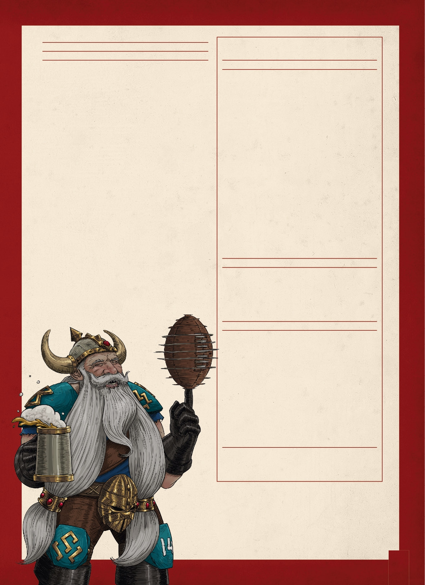

(In)Famous Coaching Staff are available to purchase during the
pre-game sequence at the cost listed. You may purchase up to two
(In)Famous Coaching Staff who are allowed to assist your team.

As with Star Players, it is possible for both teams to hire the
services of the same named (In)Famous Coaching Staff (such as Josef
Bugman):

« If this happens during a game that is part of a league,

neither team can use the (In)Famous Coaching Staff but the (In)Famous
Coaching Staff will keep both
hiring fees.

« If this happens during exhibition play, both teams can

use the (In)Famous Coaching Staff - one team has clearly hired a
ringer!

There are too many (In)Famous Coaching Staff to list here, and most
are only available to certain teams. Details of further (In)Famous
Coaching Staff can be found in the

various Blood Bowl supplements available.

0-1 (IN)FAM0US C0ACHING STAFF INDUCEMENT: J0SEF BUGMAN
100,000 G0LD PIECES, AVAILABLE T0 ANY TEAM The name Josef Bugman is
synonymous with Blood Bowl. With numerous sponsorship deals across the
Old World, stocks of Bugman's XXXXXX can be found
in most Blood Bowl stadia; the amber liquid making sure the crowd is
suitably rowdy by kick-off. When Bugman turns up to a game in-person it
is a spectacle to behold! As he enters the stadium he greets the
cheering crowd. In his wake Dwarf cheerleaders
dance through the crowd with beer cannon, whilst the Bugman's Blimp
fliees overhead dropping flaagons of
finee ale into the upraised hands of the spectators.

But Bugman is no mere spectator; the stout brewer owns and coaches
numerous teams. For all

his bluster, Bugman is a fair coach, having a good
eye for the ebb and floow of the game - the problem arises when things
don't go his team's way, or he gets excessively drunk, or some
combination of the two, and he staggers out onto the fieeld to take
matters into his own hands..

BUGMAN'S XXXXXX

Bugman provides players on his team with an ample supply of Bugman's
XXXXXX. This most famous of Dwarf ales is renowned for its recuperative
properties. When rolling to see if Knocked-out players recover,
rolls of a 1 can be re-rolled.

KEEN PLAYER
If Bugman's team cannot set up 11 players at the
start of a drive, Bugman may decide to join in himself! You can choose
to set him up as part of your team.
If you do so, he counts as part of the team for the duration of the
drive. When the drive ends, Bugman
is Sent-off for committing a Foul and has no further effect on the
game - he cannot be used in a later drive. The Bugman's XXXXXX, however,
is not lost; the players simply refuse to give it up!

Bugman has the following profilee:

MA ST AG PA AV Bugman 5 3 3+ 6+ 9+ Skills & Traits Loner (5+), Tackle,
Thick Skull,

Wrestle

**93**

0-1 WIZARD
PRICE VARIES, AVAILABLE T0 VARI0US TEAMS
Wizards of the various Arcane
Colleges findd ready employment with the many Cabalvision networks,
as
it takes huge amounts of magical energy to capture the action and
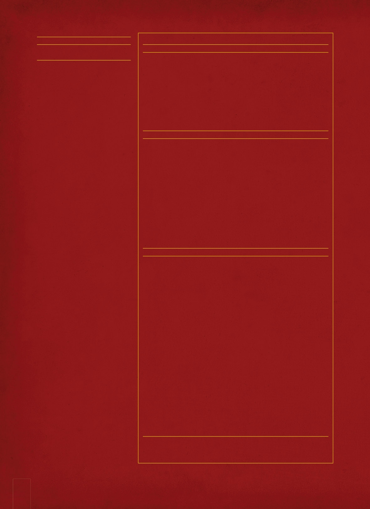beam it globally to the crystal balls
and magic mirrors of Cabalvision subscribers around the world.
Consequently, there are always Wizards to be found at any given
fixtture, card carrying members of
the Colleges of Magic, all more than happy to moonlight for a team
wishing to secure their assistance.

No team may purchase
more than one Wizard Inducement

per game.

Some Wizards are named, although most are not. As with Star Players,
it is possible for both teams to hire the

services of the same named Wizard:

« If this happens during a game that

is part of a league, neither team can use the named Wizard but
the named Wizard will keep both hiring fees.

« If this happens during exhibition play, both teams can use the

named Wizard- one team has clearly hired a ringer!

If a Wizard Inducement is not named, there is no restriction on both

teams fieelding the same type.

There are too many types of Wizard to list here, and most are only
available to certain teams. Details of further Wizards can be found in
the various Blood Bowl supplements available.

**94**

0-1 WIZARD INDUCEMENT: HIRELING SP0RTS-WIZARD 150,000 G0LD PIECES,
AVAILABLE T0 ANY TEAM
The spells a Hireling Sports Wizard will use are carefully selected to
amaze and amuse the fans in equal measure. Many spectacular firreballs
explode on pitches just as often as opposition players are turned into
frogs. A player turned into a frog can be turned back quite quickly with
no more lasting consequences than an inexplicable desire to sit on a log
and eat fliees (if they\'re lucky enough to be changed back at all, that
is!).

Once per game, a Hireling Sports-Wizard may cast one of the following
spells:

FIREBALL
You may cast this spell either at the start of any of the opposition's
team turns, before any player is activated, or immediately after any of
the opposition's team turns has ended. Choose a target square anywhere
on the pitch and roll a D6 for each Standing player (from either team)
that occupies either the target square or a square adjacent to it:

« On a roll of 4+, the player has been hit by the Fireball.
« On a roll of 1-3, the player manages to avoid the Fireball.

Any Standing players hit by the Fireball are Knocked Down. When a player
is Knocked Down by a Fireball, you may apply a +1 modifierr to either

the Armour roll or Injury roll. This modifierr may be applied after the
roll has been made.

ZAP!
You may cast this spell either at the start of any of the opposition's
team turns, before any player is activated, or immediately after any of
the opposition's team turns has ended. Target any opposition player and
roll a D6:

« If the roll is equal to or higher than the player's Strength
characteristic,

or is a natural 6, that player turns into a frog for the remainder of
the drive, after which their coach will secure emergency magical
assistance to turn the player back into their original form.

« If the roll is lower than the player's Strength characteristic, the
player develops a fresh crop of warts, but the spell has no further
effect.

If the player was in possession of the ball when they were turned
into a frog, it is dropped and will bounce. When a roll on the Casualty
table

is required against the frog, no roll is made. Instead, it is
automatically treated as if a Badly Hurt result had been rolled. The
frog must miss the
rest of the game and cannot be patched-up by an apothecary (because
it\'s
a frog!). At the end of the game, the player is returned to normal shape
with no ill effects.

The frog has the following profilee:

MA ST AG PA AV Frog 5 1 2+ - 5+

Skills & Traits Dodge, Leap, No Hands, Stunty, Titchy,

Very Long Legs

0-1 BIASED REFEREE
PRICE VARIES, AVAILABLE T0 VARI0US TEAMS
Many referees become celebrities in their own right, sometimes for
their even-handed application of the
rules, more often for their blatant corruption or violent outbursts!
Many teams will go out of their way to bribe a ref, but nothing beats
turning up to a game knowing that the ref is not only on your payroll,
but is practically a part
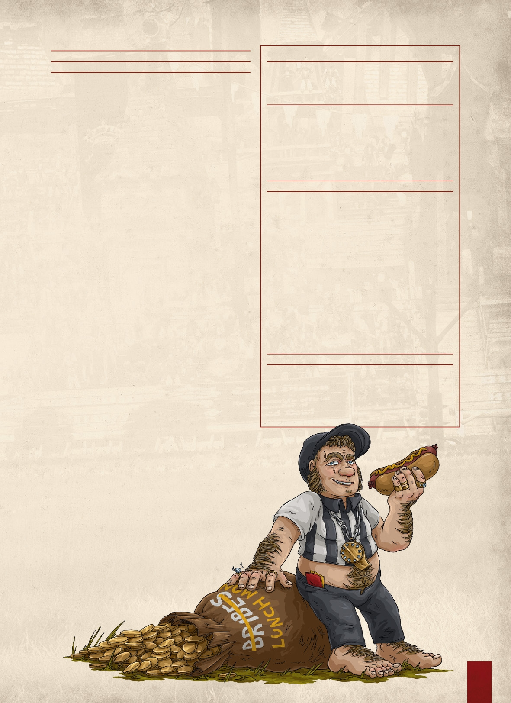of your team!

Biased Referees are available to purchase during the pre-game sequence
at the cost listed, and because Blood Bowl games tend to be
officiaated over by a group rather than a single individual, both
teams may purchase

a Biased Referee. You may purchase one Biased Referee to treat your
team favourably during the game ahead.

For the most part, a Biased Referee will treat both teams equally,
meaning that they follow all of the normal

referee rules as described on page 63. Where they differ is that they
will be either far more harsh in their scrutiny of the opposition or
far more lenient in their treatment of the team that has paid them
off. How this manifests is described in each Biased Referee's
description.

Many Biased Referees are named celebrities, although most are not. As
with Star Players, it is possible for
both teams to hire the services of the same named Biased Referee:

« If this happens during a game that is part of a league,

neither team can use the named Biased Referee but the named Biased
Referee will keep both hiring fees.

« If this happens during exhibition play, both teams can

use the named Biased Referee - they can dish out harsh rulings to both
sides!

There are too many named Biased Referees to list here, and most are
only available to certain teams. Details

of further Biased Referees can be found in the various Blood Bowl
supplements available.

0-1 BIASED REFEREE INDUCEMENT 120,000 G0LD PIECES
(80,000 G0LD PIECES F0R TEAMS WITH THE 'BRIBERY AND C0RRUPTI0N' SPECIAL
RULE), AVAILABLE T0 ANY TEAM
In the years since the collapse of the NAF, there has been a marked
increase of RARG members who show blatant bias. Whilst most referees are
happy to accept bribes on a case by case basis, many others have started
offering their services to a favoured team for an entire game!

CL0SE SCRUTINY
Strict adherence to the rules is of paramount importance to all
referees. This is especially true
when one of the teams has paid them to watch the opposition closely! If
any player on the opposing team commits a Foul without rolling a double
when making either the Armour roll or Injury roll, roll a D6:

« On a roll of 5+, the Biased Referee spots the Foul

and the player is Sent-off, exactly as if they had rolled a double
(i.e., the opposing coach may use a Bribe if one is available and may
attempt to Argue the Call).

« On a roll of 1-4, the player manages to avoid the

ref's attention.

"I DIDN'T SEE A THING!"
Whilst watching one team incredibly closely, the Biased Referee can
easily be forgiven for missing infractions perpetrated by the other.
When rolling on the Argue the Call table, you may apply a +1 modifierr
to the dice roll.

**95**

## League And Exhibition Play

*LEAGUE AND*
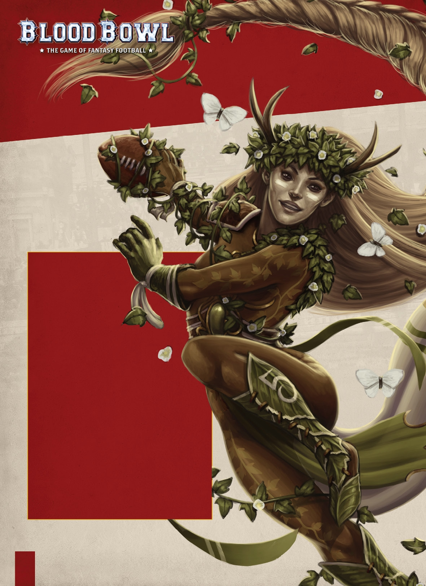*EXHIBITION PLAY*

laying a Blood Bowl league is great fun. Teams grow and

develop, and rookie players
blossom into mighty Star
Players. Coaches are able
to build upon their team's
background and rivalries
with others, all the while
hoping to reach the play-offss, dreaming of winning lasting fame and
fortune.

In truth, although we call them leagues,
what our teams are most likely doing is
participating in the type of tournaments that
happen around the 0ld World and beyond all the time. There haven't
been many formal leagues
since the NAF collapsed, and teams travel the
known world taking part in numerous privately run tournaments, playing
a series of linked games, hoping to qualify for the finalss and to win
the prizes on offerr. The development seen is a team improving through
the course of such a competition and becoming a more skilled and
complete unit. 0ver several such league seasons a team will have
played in several differrent competitions in very differrent
locations, gained new players, lost old favourites, and changed and
evolved over time.

**96**

### Running a League

n order to set up a league, the firrst thing needed is a league
commissioner. The

league commissioner is the
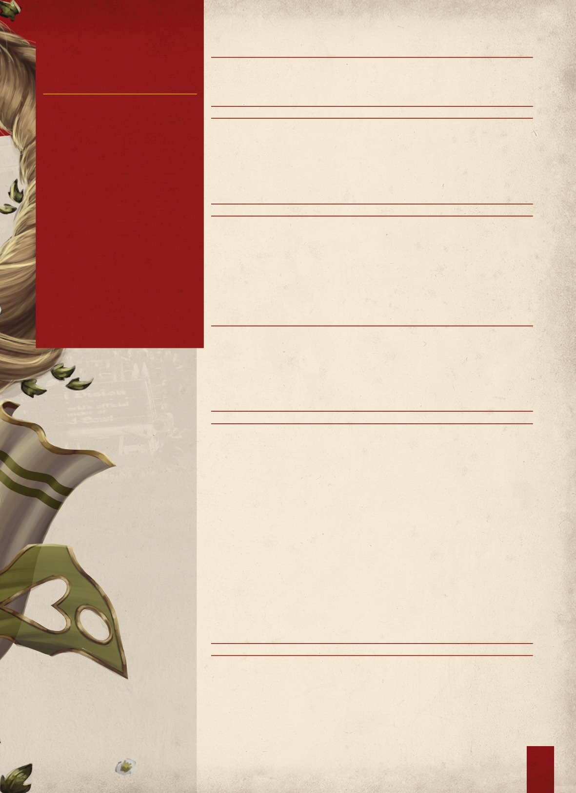member of any group of regularly meeting
coaches who takes up the responsibility for making
sure that a league runs smoothly. Some league commissioners
like to keep a central database
of teams to keep track of how
well everyone is doing, and some even write regular newsletters
featuring game reports, league tables and anything else they
can think of! Most league commissioners will take part
in the league with a team of
their own.

**GETTING STARTED**

o run a league, you will need at least four teams. At the start of the
league, each participating coach needs to draft a team as described on
page 30
and submit a copy of their Team Draft list to the league commissioner.

SEAS0NS
A Blood Bowl league plays out over a number of 'seasons', each split
into the
'regular season' and the 'play-off season'. At the end of each play-off
season,
comes the 'off-season break', a rest from the action before the next
season begins. After the off-season break, returning and new coaches
alike can draft a new team
for the season ahead. Should the league commissioner wish, returning
coaches can re-draft an existing team as described on page 100.

DIVISI0NS
If the league contains enough teams, the league commissioner may wish to
divide them into two, three or four divisions. Each division should
contain as equal a number of teams as possible, but a division should
have no fewer than four teams. The larger the divisions are, the longer
a season will last. The teams can be split however the league
commissioner decides, but drawing team names out of an upturned Blood
Bowl helmet (or similar receptacle) is most traditional. Once the
divisions have been split, the season can begin!

**THE REGULAR SEASON**

uring a season, each team plays two 'league fixttures' against each
other team in their division. These games should be played to a
schedule of 'rounds', drawn up by the league commissioner and made
available to

all coaches. 'Cross division friendly' games can also be played on a
challenge basis against teams in other divisions that a team and their
coach may not otherwise face.

LEAGUE FIXTURES
It is recommended that you set a time limit for each round. This
prevents the league stalling because two players can't seem to get their
schedules to line up. A good
rule for deciding a time limit is to assume that each team can play one
game per week. Any league fixttures that have not been played by the end
of the time limit count as a loss for both teams unless one coach
voluntarily concedes due to real
life commitments. In this case, the other team wins 1-0, gains D6x10,000
gold pieces and may make two MVP awards.

After a league fixtture has been played, both teams follow the full
post-game sequence as described on page 69. Note that both coaches are
responsible for correctly recording the outcome of the game and passing
that information on to the league commissioner.

*NO-SHOWS:* If a coach is thought to be gaming the system - i.e.,
avoiding certain games just to prevent their opponent from getting a win
or to protect their players from harm ahead of another game, the league
commissioner should dock that

coach 3 League points.

CR0SS DIVISI0N FRIENDLIES
During the regular season, any two coaches that are not in the same
division may arrange for their teams to play a friendly game. Each team
can play as many or
as few friendly games as they wish, but two teams can only play each
other in
this manner once. Coaches should note that during the post-game sequence
of a friendly, no MVP is awarded and no League points are won. In all
other respects, a friendly is treated just like a league fixtture.

**97**

LEAGUE SC0RING
Teams earn League points as follows:

Win: 3 League points Draw: 1 League point Loss: 0 League points

Additionally, league commissioners may wish to
award bonus League points for the
following:

Score 3 or more touchdowns: +1 League point Concede 0 touchdowns: +1
League point

Cause 3 or more Casualties
(counting only those that generate
SPP, as described in Step 3 of the
post-game sequence):

Each coach should record their League points on their Game Record
sheet during step 1 of the post-game

sequence, before reporting both the outcome of the game and the league
points scored to the league commissioner.

**98**

**THE PLAY-OFF SEASON**

nce all league fixttures have been played in each division, the
regular season comes to a close.
Once all the scores are in, the league commissioner

ranks the teams in order of League points, from highest to lowest, using
total touchdowns as the firrst tiebreaker and total casualties as the
second tiebreaker, if required. The top four teams in the league will go
through to the play-
offs as follows:

« If the league consists of two divisions, the top two teams from each
go through and the play-off season

progresses straight to the semi-finalss.« If the league consists of four divisions:

- The top team from each goes through and the play-off season progresses straight to the semi-finalss.
- The top two teams from each go through and the play-off season
  commences with the quarter finalss.

« If the league consists of three divisions, the top team from each goes
through. Additionally, the second place

team with the highest number of league points will go through as a
wild card. The play-off season progresses straight to the
semi-finalss.

As with the regular season, these games
should be played to a schedule drawn up by the league

commissioner and made available to all coaches.
If quarter finalss are being played, care should be taken to ensure that
two teams from the same division do not meet in either the quarter
finalss or semi-finalss.

Once the semi-finalss have been played, the two winning teams will
progress to the finall, and the two losing

teams will meet to decide 3

**GLITTERING PRIZES**

**P**

rizes are awarded to the teams who finishh in 1

nd and 3rd place, in addition to any winnings generated during the
post-game sequence:

st,

« The team in 3

rd place receives 30,000 gold pieces.

« The team in 2

st place, the season's
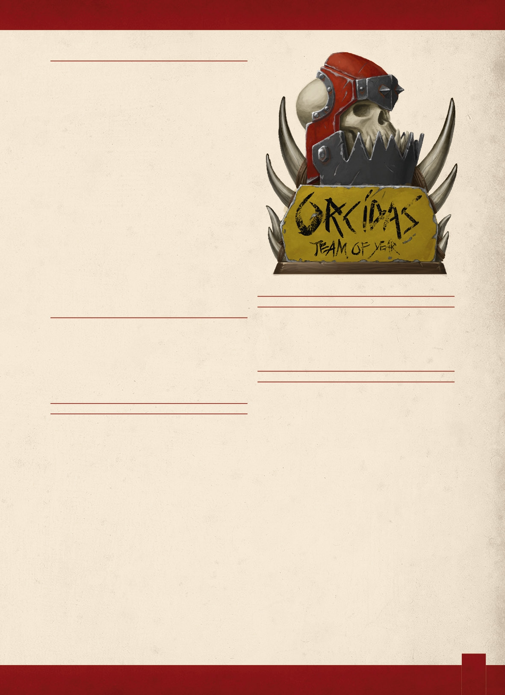champion, is awarded 100,000 gold pieces
and the

League Trophy.

These winnings should not be placed in the team's Treasury until after
the Expensive Mistakes step of the post-game sequence. Therefore,
these winnings cannot be lost as soon as they are won!

The League Trophy is held by the winners until the end of the next
season, when it will be awarded to the new

champions. For as long as a team holds a League Trophy,
it adds an additional team re-roll to its Team Draft list, increasing
its Team Value accordingly but without having
to spend any gold pieces from its Treasury.

**THE OFF-SEASON BREAK**
**AND RE-DRAFTING TEAMS**

hilst many coaches like to start each season with a brand new team,
many more like to develop a favourite team over several seasons,

building that team's legend over time and telling the story of fan
favourites who dedicate their career to their team. The following
rules allow coaches who wish to re-draft a team from one season into
the next to do so.

RE-DRAFTING
Between seasons, there is a period of downtime called
the 'off-season break'. Coaches and their players rest
and recuperate, spend their hard-earned gold, or go on elaborate tours
to promote the latest edition of their increasingly unbelievable
autobiographies.

After the finalss have been played, any coaches who wish to re-draft
their team for the next season should get together with the league
commissioner and run through the following steps:

*1. R&R:* Players that would miss the team's next

game recover.
*2. RAISE FUNDS:* Coaches calculate the funds available

to them to re-draft their team.
*3. RE-DRAFT:* Coaches complete their new Team Draft

list for the season ahead.

1\. R&R
During the off-season break, players have time to rest and recuperate
from their injuries. Therefore, any players that suffered a Miss Next
Game Casualty table result during
the team's finall game of the season will recover before the next season
begins.

2\. RAISE FUNDS
When re-drafting, each team gets a Re-Draft Budget of 1,000,000 gold
pieces. This represents money doled
out by the league, the team's sponsors, fan clubs and generous patrons.
A team that is re-drafting then adds
to this anything they have left in their Treasury from the previous
season, after which their Treasury is emptied (presumably having been
used to cover the cost of the many unexpected expenses that arise during
the off- season break). Finally, a team that is re-drafting adds the
bonuses listed below:

« 20,000 gold pieces for each game the team played

last season (both friendlies and league fixttures).

- +20,000 gold pieces for each league fixtture the

team won last season.

- +10,000 gold pieces for each league fixtture the

team played last season that ended in a draw.

League commissioners may, at their own discretion, place a cap of
1,300,000 gold pieces on the Re-Draft Budget available to teams so that
no team starts the season with too obvious an advantage.

**99**

3\. RE-DRAFT
Once the Re-Draft Budget available has been worked out, the team can
be re-drafted. A few key players will be able to return to the pitch
for the new season, whilst others will findd themselves
unceremoniously dropped and replaced with eager rookies to keep costs
down. Those players that are dropped usually have the good grace to
disappear quietly, heading off to seek their fortune in the backwater
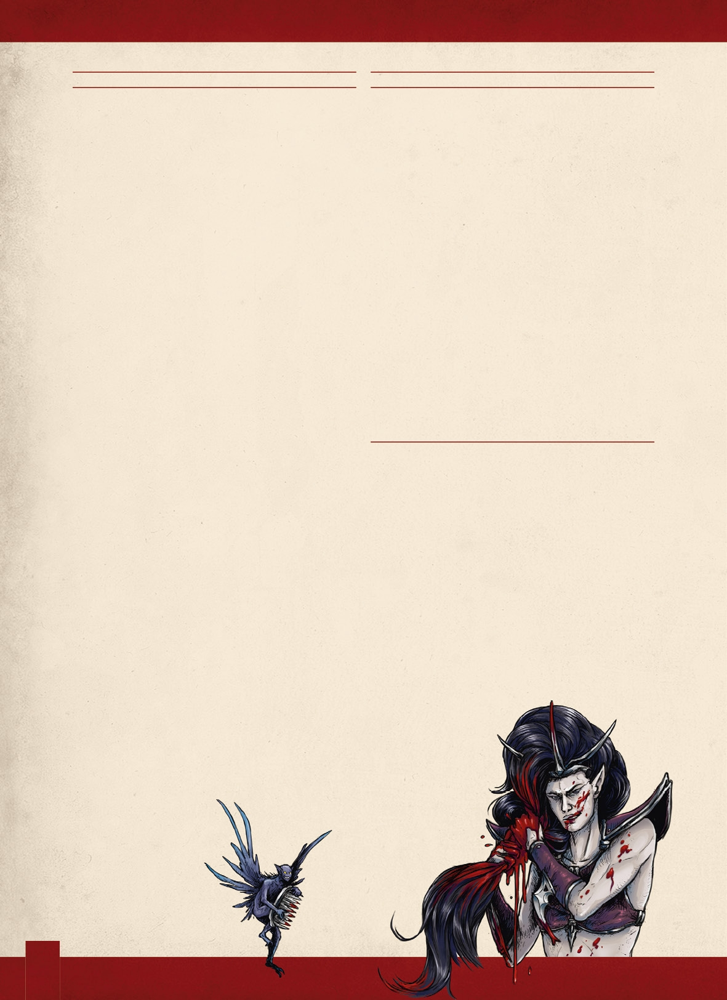leagues, to become sports pundits on the
interview
circuit, or to host Cabalvision shows about redecorating your hovel.

To redraft your team, use a new Team Draft list and create a brand new
version of your team using the Re-Draft Budget available, as described
on page 99. The following rules apply:

« Assistant coaches and cheerleaders may be carried

over from your previous Team Draft list at a cost 10,000 gold pieces
each, or they may be let go.

« Apothecaries may be carried over from your previous Team Draft list
at a cost 50,000 gold pieces each, or they may be let go.

« Team re-rolls may be carried over from your previous Team Draft list
at the cost shown on your team roster,

or they may be let go.

As well as hiring new players from your team roster, you can re-hire
players from last season's Team Draft list. Players can be re-hired by
paying their Current Value as shown on last season's Team Draft list,
plus an agent's fee of 20,000 gold pieces for each previous season the
player has taken part in. Simply copy the player's entire profilee
across from your old Team Draft list, including any Niggling Injuries,
any characteristic reductions and any unspent Star Player points:

« If the player has any Niggling Injuries, roll a D6 for
each, applying a +1 modifierr to the dice roll if the team

has an apothecary:

- On a roll of 4+, some rest and relaxation has worked

wonders. The Niggling Injury you are rolling foris removed.

- On a roll of 1-3, the player's injury has not yet fully healed. The
  Niggling Injury being rolled for remains.

**100**

RE-DRAFTING TEMP0RARILY RETIRED PLAYERS Additionally, players that
temporarily retired during the last season can be re-hired as described
previously by paying the cost shown for them on that season's Team Draft
list. Hopefully the time off has helped them to recover from their
injuries:

« After the player has been re-drafted, roll a D6 for each
characteristic reduction they have suffered, applying a +1 modifierr to
the dice roll if the team has

an apothecary:

- On a roll of 4+, some time off and some intensive

therapy has done the job and the characteristic is restored. However,
such injuries often leave their mark and the player will gain a
Niggling Injury.

- On a roll of 1-3, the player's injury has not yet fully

healed. The characteristic reduction being rolled for remains.

Note that if the player has suffered more than one characteristic
reduction, you should roll for
each separately.

**STARTING A NEW SEASON**

fter the excitement of the play-off season and the thrill of the
finalss, the obvious question from most coaches is: when's the next
season starting?

The answer, as ever, is up to the league commissioner. Starting a new
season is as easy as following these
three steps:

« The league commissioner establishes who will be taking part in the
next season. This is a good chance

for coaches to step down from the league if they're struggling to
findd the time to play, and it's an ideal opportunity for new teams to
join in the fun.

« Each coach who is taking part in the new league

season submits a Team Draft list.
« Teams are divided into divisions (if necessary) and

dates are set. The season begins anew!

### Exhibition Play

nfortunately, not everyone is able to commit the time required to take
part
in a league. Coaches may not live

close to their gaming friends, work and family commitments might
contrive to keep us away from our hobby, meaning that often we are
only

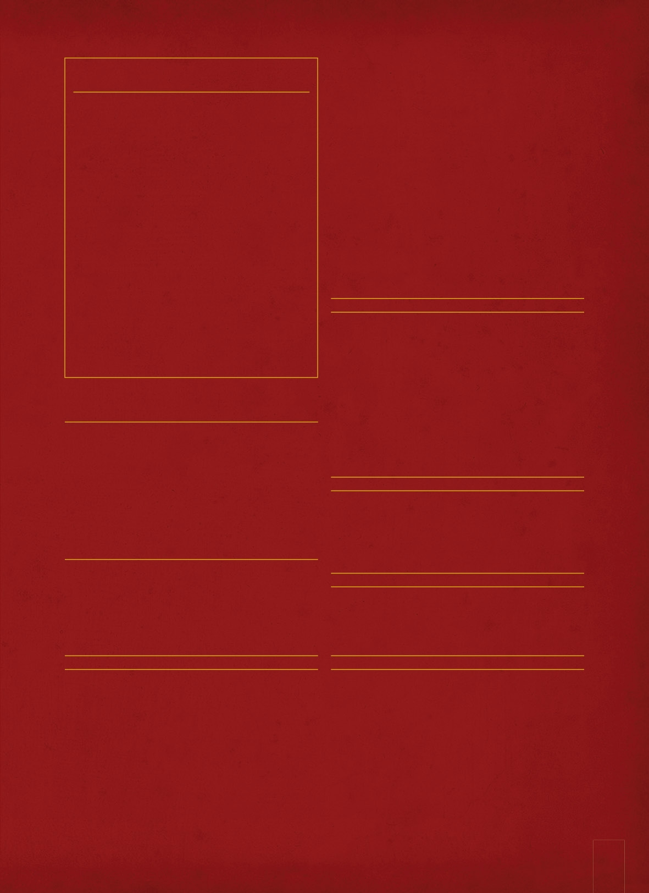able to enjoy the occasional stand-alone
game when time permits. Such stand-alone games
are referred to as 'exhibition games'. What's more, there is no reason
to miss out on the fun of many aspects of the game that appear to be
designed for league play; it is possible to create teams for
exhibition games complete with
extra Skills, characteristic improvements and access to weird and
wonderful Inducements, including Star Players. There is a lot of fun
to be had in creating a team for an exhibition game, deciding what
will be included and what will be left out, choosing Skills, creating
names and backstories for the players, and so on.

**BLOOD BOWL** **EXHIBITION PLAY RULES**

he following pages offer a set of guidelines for creating exhibition
play teams. Coaches who
wish to use these rules for a game should decide

between themselves on the details. Further, this section aims to give
guidance to anyone wanting to run a Blood Bowl tournament, as these
rules will help create more interesting teams for participants to use,
which in turn will enhance the experience for everyone involved.

**DRAFTING AN EXHIBITION TEAM**

his section deals with how to create a team for an exhibition game.
For the most part this is exactly the same as creating a team for a
league, right

down to using the usual team rosters and completing
a Team Draft list. However, there are some distinct differences to be
aware of:

TEAM DRAFT BUDGET
For exhibition games, coaches should have more gold in their Team
Draft Budget, allowing them to include more of the options that
normally only become available later on
in a league.

The Team Draft Budget for exhibition play should
be somewhere between 1,100,000 and 1,300,000
gold pieces. We have found that 1,150,000 gold pieces
is an ideal size. Larger is possible should coaches or tournament
organisers wish, but it is worth bearing in mind that smaller Team
Draft Budgets force hard choices

to be made. Sometimes, having to choose whether to include one thing or
the other is better than having both as it adds to the challenge of the
experience.

However, it is important to note that when a team
is drafted for exhibition play, all of the gold pieces in the

Team Draft Budget must be spent. Any gold pieces not spent are lost. One
consequence of this is that the Prayers to Nufflee table is only used
for Cheering Fans in exhibition play, as described on page 41.

A Team Draft list will need to be completed for the team, detailing all
of the players, Sideline Staff and any Inducements purchased. This is
especially important when attending a Blood Bowl tournament, so that
your opponents can see clearly what your team contains!

HIRING PLAYERS
As with league play, players are the only compulsory element on a team
drafted for exhibition play. Each team roster details all of the players
available to a team of
that type and their Hiring Fee. When drafting a team, you should select
the players you want to permanently hire
for your team, pay their hiring cost from the Team Draft Budget and make
a record of the player on the Team Draft list.

As usual, a team may not include more players of a certain type than are
allowed by the team roster.

PURCHASING TEAM RE-R0LLS
Any team drafted for exhibition play can purchase team re-rolls, just
like a team drafted for league play. Every team may buy 0-8 team
re-rolls when it is drafted, for the cost shown on the team roster, paid
for from the Team Draft Budget.

HIRING SIDELINE STAFF
Sideline Staff can be of as much use to a team drafted for exhibition
play as they are during a league. A team drafted for exhibition play can
purchase Sideline Staff from the Team Draft Budget.

DEDICATED FANS
Unlike a team drafted for league play, a team drafted for exhibition
play will have a Dedicated Fans characteristic of 0.

However, teams drafted for exhibition play can still improve this up to
a maximum of 6, at a cost of 10,000 gold pieces per improvement, as
described on page
35. For example, an exhibition team may purchase a Dedicated Fans
characteristic of 3 at a cost of 30,000 gold pieces.

**101**

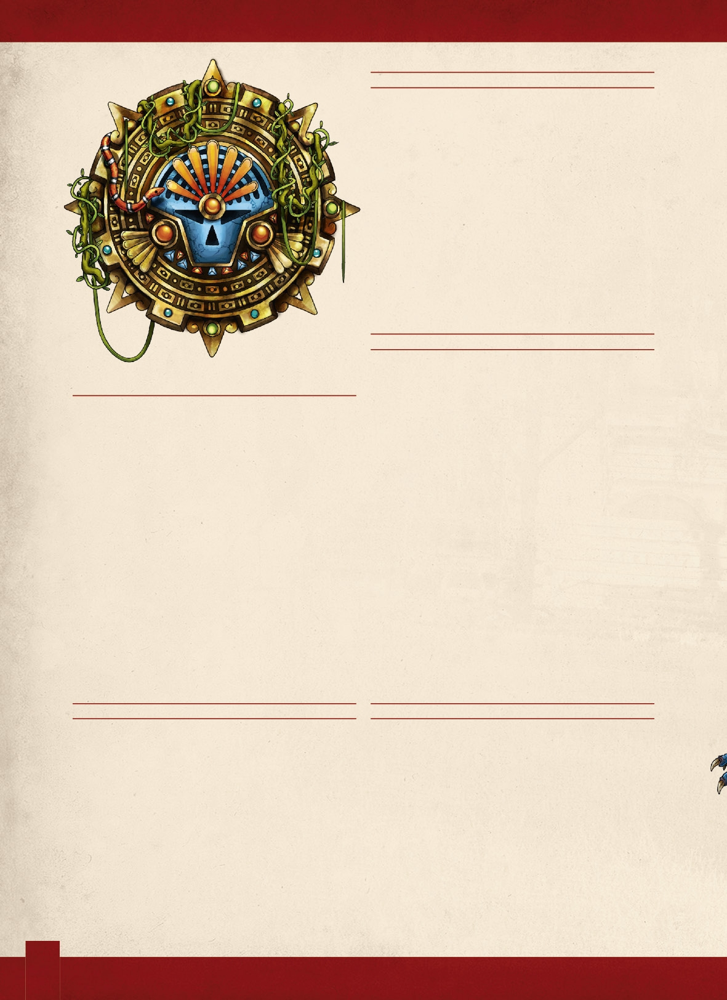

INDUCEMENTS IN EXHIBITI0N PLAY
Because all of the gold pieces in the Team Draft Budget must be spent
when drafting a team for exhibition play, it
is most uncommon that teams will be of different values. Therefore,
when a team is drafted for exhibition play, you may spend as much or
as little of your Team Draft Budget as you wish on Inducements,
provided your team contains the minimum of 11 players, not including
Induced Star Players. Inducements purchased in this way should be
recorded on the Team Draft list.

If two coaches are drafting teams for exhibition play between
themselves, they should take a few minutes to discuss Inducements
firrst. It is important to decide if there are any Inducements they
feel should be included or any they would prefer to leave out.

Tournament organisers should decide which, if any, Inducements will be
allowed and ensure this information
is passed on to participants.

PLAYER ADVANCEMENT IN EXHIBITI0N PLAY Unlike games played in a league,
exhibition games are
not linked. Therefore players will not have the opportunity to earn
and spend Star Player points in the same way. However, teams drafted
for exhibition play should include more than just rookies - having a
few players with an
extra Skill or two makes for a more interesting game. To allow for
this, exhibition teams are granted a number of SPP to distribute
between players, meaning that some players can be given advancements
when the team
is drafted.

**102**

FREE SPP

How many SPP coaches have to distribute between their players varies.
For example, you could grant each team 36 SPP to spend on advancements;
this is a fair number and allows a good selection of advancements across
a team. However, this is only a guideline, and the number can be
increased or decreased as desired. More SPP will enable more player
advancements, fewer SPP will obviously allow for fewer player
advancements.

If two coaches are drafting teams for exhibition play between
themselves, they should take a few minutes to determine how many SPP
they will have firrst. Tournament organisers should decide how many SPP
participants
will have and ensure this information is passed on
to participants.

SPENDING SPP
The firrst thing to bear in mind when drafting a team
for exhibition play is that randomly selected Skills or characteristic
improvements are perhaps best avoided. This is especially true in
tournament play. Randomly selecting Skills or characteristic
improvements ahead of each round can slow proceedings down quite a lot.

This leaves coaches with the option to choose Primary or Secondary
skills for some of their players. How

coaches distribute SPP between players is up to them. It
is just as acceptable to create one superstar player with several new
Skills as it is to distribute SPP evenly between

a number of players. How many advancements a single player can be given
should be discussed between coaches or decided by tournament organisers.
Any SPP that are not spent are lost.

*For example, if a coach has 36 SPP to spend they* *may choose to
distribute them evenly, giving six players a*

*Primary skill, or giving four players a Primary skill and one* *player
a Secondary skill. Alternatively, all of the SPP could* *be spent on one
player.*

VALUE INCREASE
In league play, a player's value will increase as they spend SPP and
gain advancements. However, for simplicity, this
is not the case when drafting a team for exhibition play.
No matter how many advancements a player is given, their value does not
increase.

In other words, coaches do not have to worry about covering the cost of
any additional Skills or characteristic increases players are given with
gold pieces from their

Team Draft Budget. Such advancements do not increase a player's value in
exhibition play.

CASUALTY R0LLS
In league play, as well as earning
SPP and gaining advancements, players can pick up lasting injuries
from the Casualty table that will dog their careers. In exhibition
play this does not happen. Every time a team drafted for exhibition
play takes
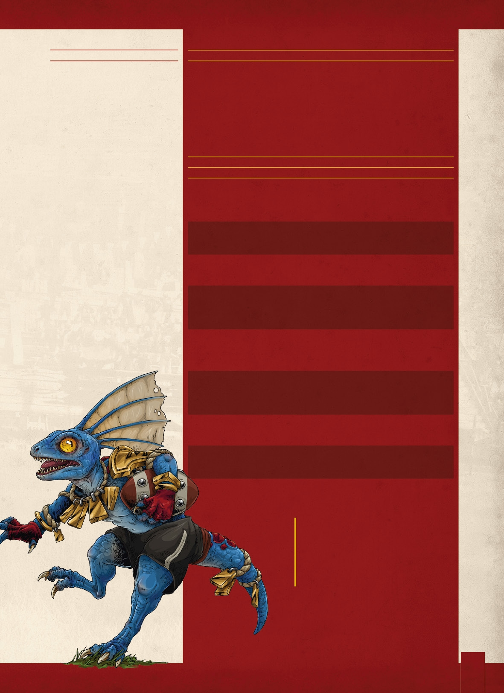to the pitch, it does so with a full
complement of healthy, uninjured players. Any Casualty rolls made
against a player in one game are forgotten about should the same
team be used again later. This is of particular importance for Blood
Bowl tournaments, where coaches will use the same team in several
games over one or more days.

This, of course, is not to say
that Casualty rolls do not matter in

exhibition play. Casualty rolls should be made as normal. This is
because not only do apothecaries work as

normal in exhibition play, but several teams (notably teams with the
Masters of Undeath or Favoured of Nurgle special rules) have the
chance to gain an extra Lineman for the remainder of the game.

THE PRAYERS T0 NUFFLE TABLE IN EXHIBITI0N PLAY
In league play, the Prayers to Nufflee table fulfilss a vital role, used
as it is during the pre-game sequence to help balance the value of both
teams. Obviously, that isn't a concern during exhibition play due to the
way teams are drafted. However, the Cheering Fans Kick-off event table
result means that the Prayers to Nufflee table may still used. Some of
the results are clearly tailored towards league play, particularly those
that generate extra SPP. Therefore, during exhibition play, coaches
should use the following, shortened version of the Prayers to Nufflee
table for Cheering Fans:

EXHIBITI0N PLAY - PRAYERS T0 NUFFLE TABLE

D8 RESULT

1 *Treacherous Trapdoor:* Until the end of this half, every time any
player enters a Trapdoor square, roll a D6. On a roll of 1, the
trapdoor

falls open. The player is immediately removed from play. Treat them
exactly as if they had been pushed into the crowd.

2 *Friends with the Ref:* Until the end of this drive, you may treat a
roll

of 5 or 6 on the Argue the Call table as a "Well, When You Put It Like
That..\" result and a roll of 2-4 as an "I Don't Care!\" result.

3 *Stiletto:* Randomly select one player on your team that is
available to play during this drive and that does not have the Loner
(X+) trait. Until the end of this drive, that player gains the Stab
trait.

4 *Iron Man:* Choose one player on your team that is available to
play during this drive and that does not have the Loner (X+) trait.

Until the end of this game, that player improves their AV by 1, to a
maximum of 11+.

5 *Knuckle Dusters:* Choose one player on your team that is
available to play during this drive and that does not have the Loner

(X+) trait. Until the end of this drive, that player gains the Mighty
Blow (+1) skill.

6 *Bad Habits:* Randomly select D3 opposition players that are
available to play during this drive and that do not have the Loner

(X+) trait. Until the end of this drive, those players gain the
Loner (2+) trait.

7 *Greasy Cleats:* Randomly select one opposition player that is
available to play during this drive. That player has had their boots

tampered with. Until the end of this drive their MA is reduced by 1.
8 *Blessed Statue of Nuffe:e:* Choose one player on your team that is

available to play during this drive and that does not have the Loner
(X+) trait. Until the end of this game, that player gains the Pro
skill.

HACKSPIT QUILLCHEWER'S
FUN FACTS!
*AccordIng to ancIent tradItIon, the Chaos* *all-Stars must cook and
eat theIr coach*
*If they Iose a game. If they wIn, they\'re* *allowed to eat hIm raw
Instead.*

**103**

## The Teams

*THE TEAMS*

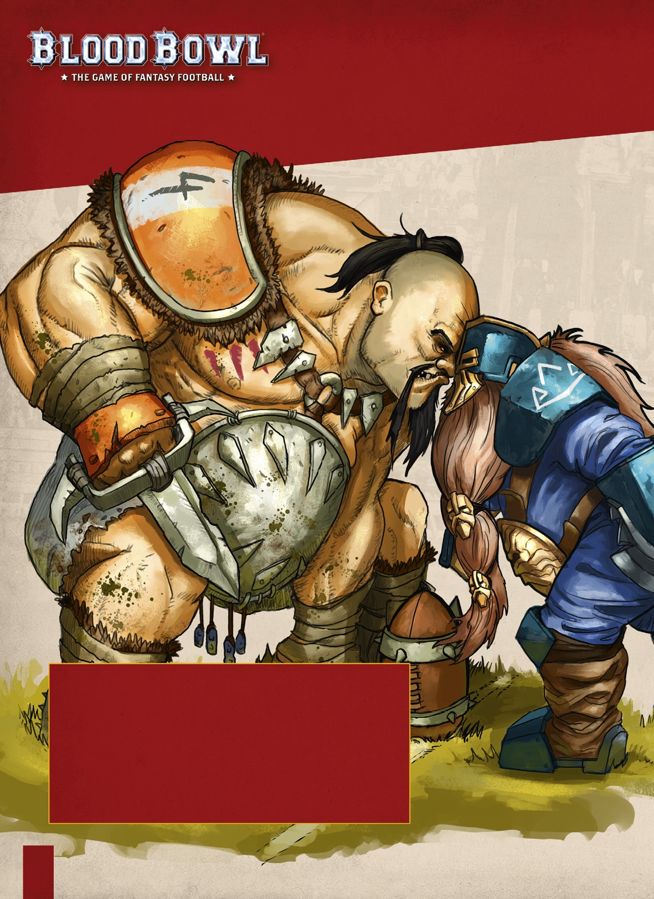

rom diminutive Halflinngs to huge hulking ogres, from elegant and
graceful Elves to lumbering and brutal orcs - Blood Bowl players come
in all shapes and sizes. These players represent

a great many races and nations from all over the known world, which
form up into an even greater number of teams of differrent types.
From fresh-faced rookie squads, to famous franchises established
decades ago, the number of teams playing the game today is higher than
at any time in history. Teams travel far and wide searching for fame
and glory. Some will make it. Most will be forgotten, a footnote on
the sports trivia encyclopaedias of history.

**104**

### Regional Special Rules

**BLOOD** **BOWL**
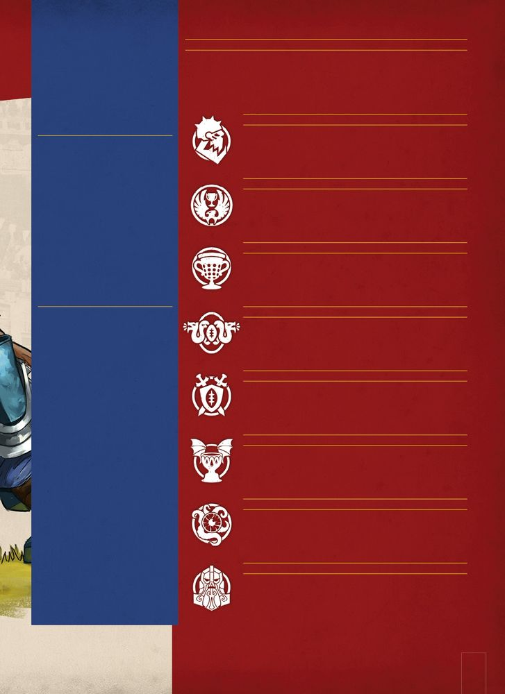**TEAMS**

**T**

ost Blood Bowl teams are, despite appearances, quite straightforward
in their

behaviour and approach to the great game. Others are not. Be they the
reanimated dead, devotees of the Dark Gods or corrupt Greenskins, many
teams differ somewhat from the norm.

Special rules to help represent
the different nuances of races and teams fall into two categories: the
firrst, 'Regional' special rules, are named
after famous leagues or competitions, and these are attached to teams
that traditionally play in those leagues. Their purpose is to make it
easy to determine which Inducements a team can or cannot take, thus
simplifying the almost impenetrably complicated rules and regulations
of the NAF.

The second category, 'Team' special rules, contains more complex

rules. These deal with a unique characteristic of the team, something
that sets it apart from others. These special rules grant the team
certain benefitts not enjoyed by other teams.

REGI0NAL SPECIAL RULES
As noted in their description, some Inducements are available only to
teams
with one of the following special rules. Other Inducements may be
available for a reduced rate to teams with one of the following special
rules.

All teams have one or more of the following special rules:

BADLANDS BRAWL
*The Badlands Brawl is home to a great many Greenskin and Ogre*
*teams. Unsurprisingly, Blood Bowl in the Badlands is a brutal,*
*violent and extremely dishonest affair, but these are virtues that*
*make it ever popular with the fans!*

ELVEN KINGD0MS LEAGUE
*One of the oldest leagues in the known world, the Elven Kingdoms*
*League prides itself on upholding the traditions of classically-*
*correct Blood Bowl. Many findd it dull but, in terms of elegance and*
*expertise, it is second to none.*

HALFLING THIMBLE CUP
*Traditionally, Halflinngs have been associated more closely with the*
*culinary arts than the world of professional sport. In recent years*
*this has changed greatly, and the Thimble Cup has become a* *mainstay
on the Blood Bowl calendar.*

LUSTRIAN SUPERLEAGUE
*The Lustrian Superleague is the oldest competition in the*
*world, and home to many of the sport\'s most ancient teams.*
*For millennia it was closed to all except Lizardmen teams, but in*
*recent years has opened its ranks to welcome other races.*

0LD W0RLD CLASSIC
*Since the collapse of the NAF, Blood Bowl in the Old World has*
*struggled. But in recent years the sport\'s fortunes have improved,*
*largely thanks to the founding of the Old World Classic, a*
*competition that draws together many minor leagues.*

SYLVANIAN SP0TLIGHT
*For many decades the Sylvanian Spotlight was the only place* *most
Undead teams could hope to compete. In recent years, the* *development
of sun protection magic has changed this, allowing* *the athletically
inclined Undead to play at anytime, anywhere!*

UNDERW0RLD CHALLENGE
*A secretive league that, until only recently, many pundits refused*
*to believe even existed! The Underworld Challenge hosts many*
*strange and diverse teams, the likes of which are rarely seen in*
*daylight. For a horrifying spectacle, it is second to none!*

W0RLDS EDGE SUPERLEAGUE
*Played on high peaks under clear skies, the Superleague is the*
*pride of the Dwarfen realm. Games last many hours as rules are*
*carefully checked and checked again, ensuring that the purity of*
*Roze-El\'s sacred work is maintained. Interestingly, in Dwarfishh*
*'venerable\' and 'dull\' are spelled the same.*

**105**

### Team Special Rules

TEAM SPECIAL RULES
Some teams may have one or more of the following special rules. These
detail unique characteristics that set the team apart from others, be
it the ability to reanimate the dead or the blessings of a patron
Chaos deity.

Some teams may have one or more of the following special rules:

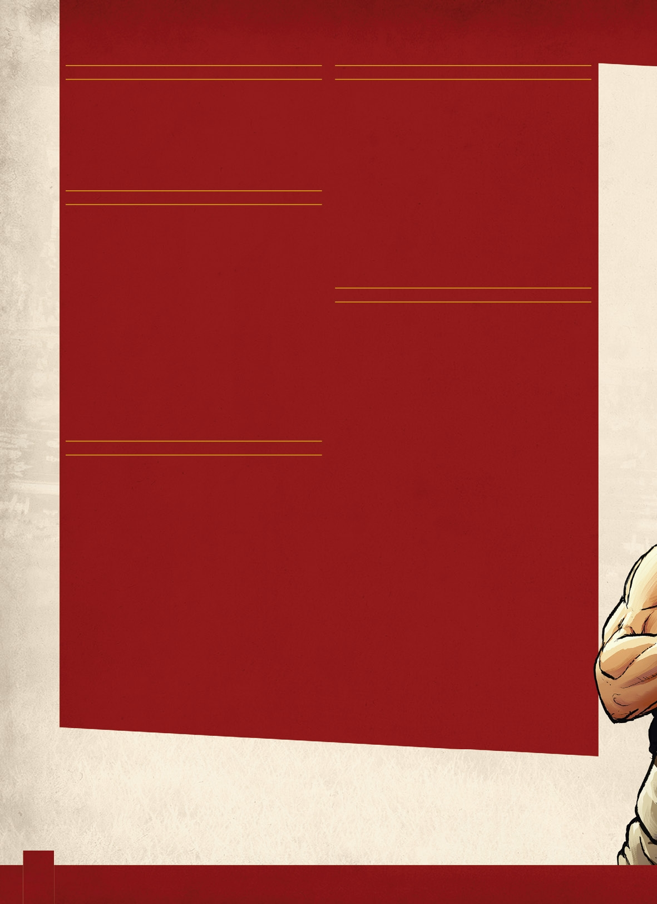

BRIBERY AND C0RRUPTI0N
*Many teams are legendarily unscrupulous. Such teams* *excel in
violence and dirty play. What\'s more, they\'re*
*not afraid to exert their influencce on officialss, either by*
*extortion or blackmail, encouraging them to turn a blind* *eye to
even the most illegal of illegal procedures!*

It takes a strong-willed referee indeed to risk making an enemy of a
team so renowned for reacting.. poorly towards any officiall that
would rebuke its behaviour:

« Once per game, when rolling on the Argue the Call

table, you may re-roll a roll of a natural 1.

In addition, a team with this special rule can purchase certain
Inducements for a reduced price, as

noted in the description of that Inducement.

FAV0URED of..
*The followers of the Ruinous Powers are drawn to Blood* *Bowl, paying
homage to their dark gods through violence* *on the pitch. Whilst many
teams worship Chaos as a* *pantheon, many more dedicate their souls
entirely to a* *single patron deity.*

Certain Inducements are only available to teams that are 'Favoured of'
a specificc Chaos power, as noted in

their description. A team may be noted as being either: Favoured of
Chaos Undivided, Favoured of Khorne, Favoured of Nurgle, Favoured of
Tzeentch or Favoured
of Slaanesh. In some cases, however, you may be able
to choose the team's alignment when the team is firrst drafted, as in
the case of Chaos Renegades.

A team with this special rule cannot change its alignment.

**106**

L0W C0ST LINEMEN
*Some teams fieeld Linemen of great skill and ability. Other* *teams do
not and will happily take on the most useless*
*of players to fill out their ranks. Readily available, easily*
*replaceable and usually willing to work for pennies, such* *players
fill gaps in the rosters, but rarely do much more!*

Teams with this special rule are not very particular about the Linemen
they hire. To make up for this, they don't usually bother to pay them:

« In league play (but not in exhibition play), when calculating the
Current Value of any permanently hired

Lineman players on a team with this special rule, the Hiring Fee of
that player is not included.

MASTERS of UNDEATH
*Teams with this special rule all fall into the broader* *category of
'Undead\'. Usually created from the animated* *corpses of
freshly-deceased players brought back*
*to the game by athletically-inclined necromancers,*
*such teams don\'t always operate quite like their more* *vital
counterparts!*

The Head Coach of this team is replaced by a Necromancer. Once per game,
they can 'Raise the Dead':

« If a player on the opposing team with a Strength characteristic of 4
or less and that does not have the

Regeneration or Stunty traits suffers a Casualty result
of 15-16, DEAD, and if they cannot be saved by an apothecary, a new
rookie Zombie Lineman player can be placed immediately in the Reserves
box of this team's dugout. Note that this may cause the team
to have more than 16 players for the remainder of
the game.

« During Step 4 of the post-game sequence, this player may be
permanently hired for free if the team has

fewer than 16 players on its Team Draft list, otherwise
it will be lost. The player's full value still counts towards the Team
Value.

Additionally, just like the Head Coach of any other team, a Necromancer
can Argue the Call when one of their players is Sent-off for committing
a Foul, as long as they haven't been sent off themselves.

