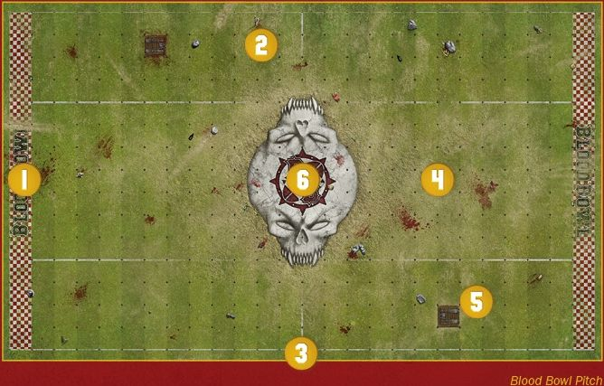
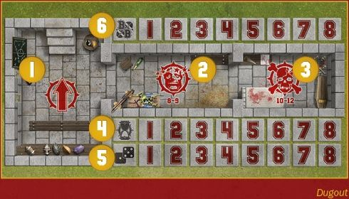
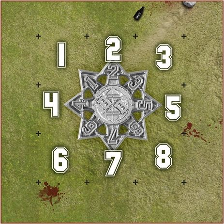
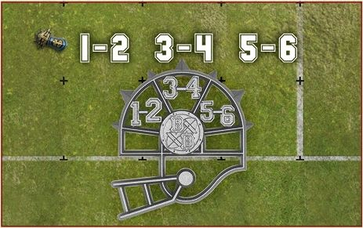
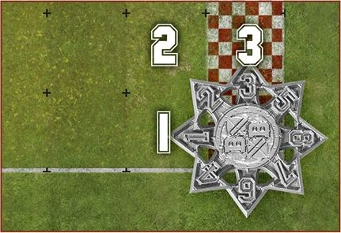
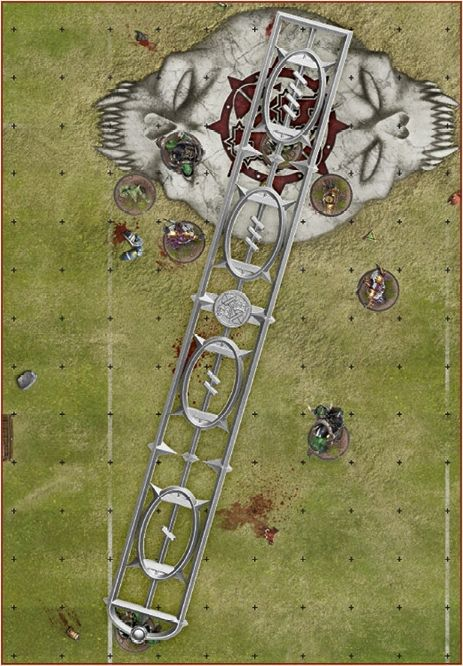
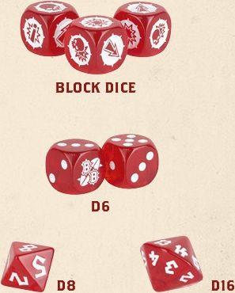

Blood Bowl pitches can be found the world over, from the sweltering rainforests of Lustria, where archaic stadia occupy ancient temple cities, to the ice floes of Norsca, where rugged gridirons are carved from the glaciers and permafrost, and everything in between and beyond. They range from small and humble affairs, temporarily marked-out pitches surrounded by simple bleachers set up for a low budget tournament, to truly grand stadia such as the Emperor Luitpold I Memorial stadium in the heart of Altdorf, home of the Blood Bowl itself, the grandest tournament held in the finest arena in all the known world.

This section explains the layout of a Blood Bowl pitch, the sideline area, and details the accessories needed to play the game.

## Nuffle's Sacred Turf

#### THE BLOOD BOWL PITCH

A Blood Bowl pitch is split into several distinct sections and all share the same features:

1. Two End Zones, one at each short end of the pitch.
2. Two Wide Zones, one at each side of the pitch, running from End Zone to End Zone.
3. Two Sidelines, running the length of the pitch, from End Zone to End Zone.
4. The Centre Field, the area between each Wide Zone, running the length of the pitch from End Zone to End Zone.
5. There are two trapdoors on the pitch, one in each half, both positioned within a Wide Zone.
6. The pitch is then further split along its length into two halves by the Line of Scrimmage, the point at which both teams line up for the kick-off and at which much of the most violent action unfolds!

Finally, the board itself is split into a grid of squares; 13 squares from Line of Scrimmage to End Zone, making the pitch 26 squares long in total, and 15 squares wide; four squares in each Wide Zone and seven squares across the Centre Field.

#### DUGOUTS

Each team has its own dugout, a safe haven at pitch side where reserves can warm up, where the injured can be tended to and where important game information is tracked:

1. The Reserves box, where fit and healthy players stand ready for the next drive.
2. The Knocked-out box, where players removed from play due to minor injury recover.
3. The Casualty box, where seriously hurt players are tended and where those who won't play again are stored until the final whistle.
4. Turn trackers. These are vital, helping everyone know which turn it is and how long remains of the current half and the game. The Turn trackers are covered in greater detail on [page 20](../core_rules/blood_bowl_stadia.md#turn-marker) and [page 42](../core_rules/the_rules_of_blood_bowl.md#moving-the-turn-marker).
5. Team re-roll trackers, used to keep track of how many re-rolls a team still has to call upon in each half. Re-rolls are covered in more detail on [page 24](../core_rules/rules_and_regulations.md#re-rolls).
6. The Score tracker, where the coach keeps a record of each touchdown scored.

## Sporting Paraphernalia

Blood Bowl teams rarely travel light. Be it the kit and armour of the players, the pom-poms and ribbons of the cheerleading squads or the bandages, saws and splints of the apothecaries, there is no end of equipment to be hauled from stadium to stadium. On the tabletop, games of Blood Bowl require somewhat less in the way of equipment, but there are certain accessories that are vital to the game.

#### THE FOOTBALL

Arguably, the most important model on the pitch! When not in the possession of a player (i.e., when being held and carried by a player), the football or, more simply, the ball, is placed on the ground, wholly within one otherwise empty square. When in a player's possession it will occupy a place on or adjacent to the base of that model.

The ball is an essential component in any game of Blood Bowl, and there are a great many ways in which it can be represented, from a simple token to a painted and based model the rival of any player.

#### MARKERS

The game of Blood Bowl uses several markers in conjunction with the dugouts in order to keep track of important game information:

#### TURN MARKER

You will need a turn marker, and it is your responsibility, at the beginning of each and every one of your turns, to move the turn marker along the Turn tracker on your dugout.

#### TEAM RE-ROLL MARKER(S)

Similarly, you are responsible for keeping track of how many team re-rolls you have and how many have been used. You may use either a single marker or several markers (one for each team re-roll) as you prefer.

#### SCORE MARKER

A score marker is used to keep track of how many touchdowns a team has scored, by placing the marker on the zero position on the Score tracker and moving it along after a touchdown is scored.

### TEMPLATES

Blood Bowl also makes use of three unique templates. These are the 'Random Direction template', the 'Throw-in template' and the 'range ruler'. These are used as described below.

#### THE RANDOM DIRECTION TEMPLATE

This template is used whenever the ball 'scatters', 'bounces' or 'deviates' (see [page 25](../core_rules/rules_and_regulations.md#deviate-scatter-or-bounce)), or when the rules call for a random direction to be determined for any other reason. Position the template as shown in the diagram below, with the centre of the template over the square the ball is within and roll a D8 to determine the direction.

#### THE THROW-IN TEMPLATE

If the ball ever leaves the pitch, the crowd will enthusiastically throw it back. Position the Throw-in template as shown in the diagram below, with the Blood Bowl logo over the last square the ball occupied before leaving the pitch and roll a D6 to determine the direction the ball travels in.

Throw-ins are covered in greater detail on [page 51](../core_rules/the_rules_of_blood_bowl.md#throw-ins).

#### CORNER THROW-INS

Should the ball leave the pitch from a corner square, the direction of the throw-in is determined by placing the Random Direction template as shown in the diagram and rolling a D3.

#### THE RANGE RULER

This is used when a Pass or Throw Team-mate action is performed, both to determine range and, in the case of a Pass action, to determine if any opposition players can attempt to interfere with the pass.

Pass actions are covered in greater detail on [page 48](../core_rules/the_rules_of_blood_bowl.md#pass-actions) and Throw Team-mate actions on [page 52](../core_rules/the_rules_of_blood_bowl.md#throw-teammate-actions).

### BLOOD BOWL DICE

The game of Blood Bowl uses four different types of dice to determine the outcome of various actions and events. These are often referred to as 'Nuffle's sacred cubes' in homage to the patron god of Blood Bowl. Interestingly (perhaps), not all of these dice are cubes!

**BLOCK DICE**

Unique to the game of Blood Bowl, block dice are used to resolve Block and Blitz actions against opposition players. They are six-sided dice that feature five unique icons (one is duplicated on two faces), each representing a different outcome (see [page 57](../core_rules/the_rules_of_blood_bowl.md#block-dice)).

**D6**

Blood Bowl also uses regular six-sided dice, marked 1to 6. It is common for the '6' to be replaced by a logo - either that of the game or a specific team - on many Blood Bowl dice.

*D3:* The rules might also call for a D3 to be rolled, but an actual three-sided dice is not necessary. To roll a D3, simply roll a D6 and halve the result, rounding fractions up.

**D8**

An eight-sided dice is often, though not exclusively, used in conjunction with the Random Direction template.

**D16**

A 16-sided dice. Less frequently used but no less vital, a D16 is used for some of the tables in the rules that follow or to select players at random from within a team.