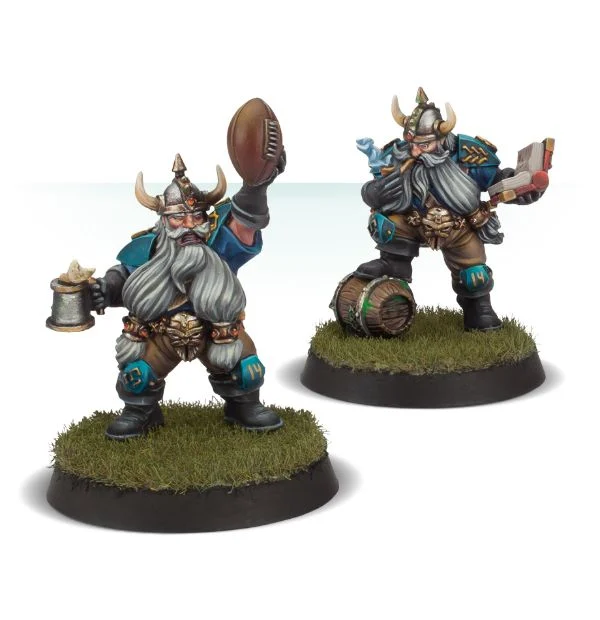

There are always plenty of hangers-on loitering around a Blood Bowl stadium. Be it legendary free agents willing to play for anyone if the price is right, or officials happy to take extra payment in return for being somewhat biased in their rulings, to unemployed coaching staff looking for a break and even a few apothecaries willing to roll up their sleeves. All these and more are willing to sign on with a team temporarily, for a price of course! often, the stadium owners or promoters will foot the bill, willing to help out a disadvantaged team rather than risk a team refusing to play!

## INDUCEMENTS

Blood Bowl teams are always looking for an advantage, be it fair or otherwise! Coaches will pay all manner of shady characters to assist their team from the sidelines or on the pitch. During the pre-game sequence of a league fixture, coaches may purchase Inducements for the game ahead by spending gold awarded as Petty Cash, taken from their Treasury or both. When creating a team for exhibition play, a coach may purchase Inducements from their Team Draft Budget.

**INDUCEMENTS IN LEAGUE PLAY**

As described on [page 35](./rules_and_regulations.md#treasury), during the pre-game sequence of a league fixture, each team can spend gold pieces either from their Treasury, from Petty Cash (see page 38) or both, to purchase any of the Inducements available to them which are then recorded on the team's Game Record sheet.

**INDUCEMENTS IN EXHIBITION PLAY**

When a team is drafted for exhibition play, you may spend as much or as little of your Team Draft Budget as you wish on Inducements, provided your team contains the minimum of 11 players, not including Induced Star Players.

If you are drafting a team for exhibition play to be used at an event or tournament, you should pay close attention to the rulespack created by the organisers, as it is quite common that not all Inducements will be allowed. Also, it is common for tournament organisers to create their own, special Inducements.

If two coaches are drafting teams for exhibition play between themselves, they should take a few minutes to discuss Inducements first. It is important to decide if there are any Inducements they feel should be included or any they would prefer to leave out.

## COMMON INDUCEMENTS

Below is a list of the common Inducements. There are many more Inducements and most teams have access to their own, unique Inducements as well.

More Inducements can be found in the various Blood Bowl supplements available:

* **0-4 Temp Agency Cheerleaders** - 20,000 gold pieces each
* **0-3 Part-time Assistant Coaches** - 20,000 gold pieces each
* **0-1 Weather Mage** - 30,000 gold pieces
* **0-2 Bloodweiser Kegs** - 50,000 gold pieces each
* **0-5 Special Plays** - 100,000 gold pieces each
* **0-8 Extra Team Training** - 100,000 gold pieces each
* **0-3 Bribes** - 100,000 gold pieces each (50,000 gold pieces for teams with the 'Bribery and Corruption' special rule)
* **0-2 Wandering Apothecaries** - 100,000 gold pieces each (not available to teams that cannot hire an apothecary)
* **0-1 Mortuary Assistant** - 100,000 gold pieces (only available to teams with the 'Sylvanian Spotlight' special rule)
* **0-1 Plague Doctor** - 100,000 gold pieces (only available to teams with the 'Favoured of Nurgle' special rule)
* **0-1 Riotous Rookies** - 100,000 gold pieces (only available to teams with the 'Low Cost Linemen' special rule)
* **0-1 Halfling Master Chef** - 300,000 gold pieces (100,000 gold pieces for teams with the 'Halfling Thimble Cup' special rule)
* **Unlimited Mercenary Players** - price varies
* **0-2 Star Players** - price varies
* **0-2 (In)Famous Coaching Staff** - price varies
* **0-1 Wizard** - price varies
* **0-1 Biased Referee** - price varies

### 0-4 TEMP AGENCY CHEERLEADERS

**20,000 GOLD PIECES EACH, AVAILABLE TO ANY TEAM**

Cheerleading isn't steady work and there are always young hopefuls looking for their big break, willing to bolster a depleted cheer squad on game day! In addition to hiring cheerleaders as permanent Sideline Staff, any team may temporarily purchase some Temp Agency Cheerleaders as Inducements. Simply increase the team's number of cheerleaders by the number Induced, up to a maximum of 16 in total, for the duration of the game.

At the end of the game, any Temp Agency Cheerleaders will leave the team.

### 0-3 PART-TIME ASSISTANT COACHES

**20,000 GOLD PIECES EACH, AVAILABLE TO ANY TEAM**

Everyone's an expert, and if a coach is willing to pay, many will share that expertise with the team! In addition to hiring assistant coaches as permanent Sideline Staff, any team may temporarily purchase some Part-time Assistant Coaches as Inducements. Simply increase the team's number of assistant coaches by the number Induced, up to a maximum of nine in total, for the duration of the game.

At the end of the game, any Part-time Assistant Coaches will leave the team.

### 0-1 WEATHER MAGE

**30,000 GOLD PIECES, AVAILABLE TO ANY TEAM**

Many stadium owners employ Weather Mages, paying good money for highly localised spells to control the elements to keep the fans dry and happy. Rarely does this magical climate control extend to the pitch though, unless a coach is willing to pay for the service that is! A Weather Mage is not a Wizard Inducement and a coach may Induce both a Weather Mage and a Wizard of some sort.

You may use a Weather Mage once per game, at the start of any one of your team turns, before activating any of your players. Roll on the Weather table, applying a modifier of +1 or +2, or -1 or -2 if desired. The resulting weather conditions are applied immediately and will last until the end of the opposition's next team turn, replacing the existing weather conditions. At the end of opposition's next team turn or the end of the drive (whichever comes first), the replaced weather conditions will return.

### 0-2 BLOODWEISER KEGS

**50,000 GOLD PIECES EACH, AVAILABLE TO ANY TEAM**

Nothing says "get back in the game" like a frosty Bloodweiser Ale served straight from the keg. There's probably an official rule regarding drinking during a game, but whether it's compulsory or banned, who cares! For each Bloodweiser Keg Induced, you may apply a +1 modifier to the result of any dice rolls made during this game when rolling to see if any of your players recovers from being KO'd. Bloodweiser Kegs benefit all players currently on the team, including Journeymen, Star Players and Mercenaries.

### 0-5 SPECIAL PLAYS

**100,000 GOLD PIECES EACH, AVAILABLE TO ANY TEAM**

Each Special Plays Inducement purchased gives you one Special Plays card to use during the game ahead. Cards are drawn from one or more of the Special Plays card decks during the Inducements step of the pre-game sequence:

* Each Special Plays Inducement purchased allows you to draw cards from a single deck.
* The deck from which cards are drawn is determined by rolling a D6 and consulting the table below.
* For each separate Special Plays Inducement purchased, roll again on the table below.
* There is no limit to how many cards may be drawn from each deck, but if the second roll or any subsequent rolls give a duplicated result, you may re-roll the D6. If the D6 is re-rolled, you must accept the result of the re-roll.

**SPECIAL PLAYS CARDS**

| D6 | DECK |
| ------ | -------- |
| **1**      | *Random Events* |
| **2**      | *Dirty Tricks* |
| **3**      | *Magical Memorabilia* |
| **4**      | *Heroic Feats* |
| **5**      | *Benefits of Training* |
| **6**      | *Miscellaneous Mayhem* |

***CARD SELECTION:*** Once the D6 has been rolled, the appropriate Special Plays card deck is shuffled and two cards are drawn from the top. You may then read both cards before choosing one to keep and one to discard.

### 0-8 EXTRA TEAM TRAINING

**100,000 GOLD PIECES EACH, AVAILABLE TO ANY TEAM**

Getting all of the players together in the same place is hard enough on game day, let alone for a regular training session. If a coach wants to hold extra training sessions ahead of an important fixture, they had better be prepared to flash some cash to Induce the cooperation of their players! Each Extra Team Training session grants the team an extra team re-roll for each half of this game.

### 0-3 BRIBES

**100,000 GOLD PIECES EACH (50,000 GOLD PIECES FOR TEAMS WITH THE 'BRIBERY AND CORRUPTION' SPECIAL RULE), AVAILABLE TO ANY TEAM**

When a player is caught misbehaving, a bag of gold pieces can have a surprisingly calming effect upon an angered referee! A single Bribe may be used when a player is Sent-off for committing a Foul or using a Secret Weapon. To use a Bribe, roll a D6. On a roll of 2-6, the Bribe is effective and the player is not Sent-off (and no Turnover is caused), but on a roll of 1 the Bribe is wasted and the referee's decision still stands! Each Bribe may be used once per game.

A single Bribe may be used after an attempt to Argue the Call has been made. However, if a 1 was rolled when attempting to Argue the Call and the head coach ejected, as described on page 63, the ref is annoyed beyond the calming effects of mere gold and no Bribe may be used this time!

### 0-2 WANDERING APOTHECARIES

**100,000 GOLD PIECES EACH, AVAILABLE TO ANY TEAM THAT CAN INCLUDE AN APOTHECARY**

Any team that can normally hire an apothecary may Induce a Wandering Apothecary or two to help during the game. Often these apothecaries are local barber surgeons, present for the game and willing to recoup the price of their ticket by helping out. Others are experts of questionable veracity, hoping to prove the worth of their unorthodox methods. Wandering Apothecaries follow all the rules for normal apothecaries, as described on page 62. However, unlike a normal apothecary, a Wandering Apothecary may attempt to patch-up any Journeymen or Mercenary players the team includes, but cannot attempt to patch up a Star Player.

### 0-1 MORTUARY ASSISTANT

**100,000 GOLD PIECES, AVAILABLE TO ANY TEAM WITH THE 'SYLVANIAN SPOTLIGHT' SPECIAL RULE**

Necromancers are always looking for a helping hand with their work, and the local mortuary workers are often eager to earn some extra income. A Mortuary Assistant is a master of needle, thread and twisted wire, connecting hip bone to leg bone, repairing funeral bindings, and so on. They can really get the players shambling back to the pitch! A Mortuary Assistant may be used once per game to re-roll one failed Regeneration roll for any player currently on the team, including Journeymen, but not including Mercenaries or Star Players.

### 0-1 PLAGUE DOCTOR

**100,000 GOLD PIECES, AVAILABLE TO ANY TEAM WITH THE 'FAVOURED OF NURGLE' SPECIAL RULE**

The Plague Doctors that accompany Nurgle-aligned teams are well-versed in the care of the many virulent plagues and ailments that infect their charges. Once per game, a Plague Doctor may be used to re-roll one failed Regeneration roll for a player on their team. Alternatively, once per game the Plague Doctor may be used in exactly the same way as an apothecary when any player on their team is Knocked-out (see page 62). Plague Doctors benefit all players currently on the team, including Journeymen, but not including Mercenaries or Star Players.

### 0-1 RIOTOUS ROOKIES

**100,000 GOLD PIECES, AVAILABLE TO ANY TEAM WITH THE 'LOW COST LINEMEN' SPECIAL RULE**

Ahead of the game the head coach ventures outside the stadium armed with handfuls of small change and dried beans which they fling to the adoring crowd, telling them they have been hired and this game is their big break in Blood Bowl. Regardless of how many players are available for this game and in addition to any Journeymen the team gains for free to make up for any lack of players, your team gains an additional 2D3+1 Journeymen for this game. These fresh-faced young hopefuls may take the number of players on your Team Draft list temporarily above 16. They are normal Journeyman players in every other respect and unless hired in the post-game sequence, they will be sent on their merry way once the game has ended.

### 0-1 HALFLING MASTER CHEF

**300,000 GOLD PIECES (100,000 GOLD PIECES FOR TEAMS WITH THE 'HALFLING THIMBLE CUP' SPECIAL RULE), AVAILABLE TO ANY TEAM**

The entourage of many teams can include several world-class chefs who busy themselves with preparing the halftime and fulltime banquets for the players. The delicious aromas emanating from the team's dugout all too often distract the opposition as much as they invigorate your players! At the start of both the first and second half, after step 2 but before step 3 of the Start of Drive sequence, roll three D6. For each roll of a 4+, your team is so inspired they gain an extra team re-roll for this half. In addition, the opposing team is so distracted that for each roll of a 4+, they will lose one of their team re-rolls for this half.

### UNLIMITED MERCENARY PLAYERS

**PRICE VARIES, AVAILABLE TO ANY TEAM**

For every player safely employed by a team, there are dozens more who will wear anyone's colours in exchange for hard currency. You may Induce Mercenary players to your team for a single game, chosen from your Team Roster, at 30,000 gold pieces more than the player would normally cost. For example, a Mercenary Human Lineman would cost 80,000 gold pieces to hire for a game rather than the usual 50,000 gold pieces.

The normal limits on the total number of players allowed on a team and in each position apply to Mercenaries. However, players that are missing the game due to injury do not count towards the number of players on the team, so they are not counted when working out how many Mercenaries a team can have.

All Mercenaries have the [Loner] (4+) trait as they are not accustomed to playing with the rest of the team.

In addition, a Mercenary may be given one additional Primary skill selected from those available to a player of that position, at an additional cost of 50,000 gold pieces. For example, a Mercenary Human Lineman could be given Tackle for a total cost of 130,000 gold pieces to hire for a game. Mercenaries do not earn Star Player points and cannot be awarded the MVP for the game. Unlike Journeymen, Mercenaries cannot be permanently hired during the post-game sequence.

### 0-2 STAR PLAYERS

**PRICE VARIES, AVAILABLE TO VARIOUS TEAMS**

These are the heroes of the Blood Bowl arena, the most resourceful and talented players in the sport. Star Players act as free agents, playing occasional games for any team that can afford their high fees (and that they are willing to assist in the first place), and then moving on to play for another team. A team may Induce up to two Star Players that are allowed to play for the team. Unless the league commissioner decides otherwise, any Casualty table results applied against a Star Player are waived after the game - they can afford all the resurrection spells they need!

Star Players may not take the number of players in the team to more than 16. However, players that are missing the game due to injury do not count towards the number of players on the team, so they are not counted when working out how many Star Players a team can have.

It is possible for both teams to hire the services of the same Star Player:

* If this happens during a game that is part of a league, neither team can field the Star Player but the Star Player will keep both hiring fees.
* If this happens during exhibition play, both teams can field the Star Player - one team has clearly hired a ringer!

Star Players do not earn Star Player points and cannot be awarded the MVP for the game. Star Players can never gain advancements.

## 0-2 (IN)FAMOUS COACHING STAFF

**PRICE VARIES, AVAILABLE TO VARIOUS TEAMS**

Although most Blood Bowl celebrities are players, with the occasional ref thrown in for good measure, there are several well-known members of coaching staff around the circuit. Many of these non-playing professionals are willing to offer out their services to other teams for the right price, bringing their expertise to the dugout.

(In)Famous Coaching Staff are available to purchase during the pre-game sequence at the cost listed. You may purchase up to two (In)Famous Coaching Staff who are allowed to assist your team.

As with Star Players, it is possible for both teams to hire the services of the same named (In)Famous Coaching Staff (such as Josef Bugman):

* If this happens during a game that is part of a league, neither team can use the (In)Famous Coaching Staff but the (In)Famous Coaching Staff will keep both hiring fees.
* If this happens during exhibition play, both teams can use the (In)Famous Coaching Staff - one team has clearly hired a ringer!

There are too many (In)Famous Coaching Staff to list here, and most are only available to certain teams. Details of further (In)Famous Coaching Staff can be found in the various Blood Bowl supplements available.

### 0-1 (IN)FAMOUS COACHING STAFF INDUCEMENT: JOSEF BUGMAN

**100,000 GOLD PIECES, AVAILABLE TO ANY TEAM**

The name Josef Bugman is synonymous with Blood Bowl. With numerous sponsorship deals across the Old World, stocks of Bugman's XXXXXX can be found in most Blood Bowl stadia; the amber liquid making sure the crowd is suitably rowdy by kick-off. When Bugman turns up to a game in-person it is a spectacle to behold! As he enters the stadium he greets the cheering crowd. In his wake Dwarf cheerleaders dance through the crowd with beer cannon, whilst the Bugman's Blimp flies overhead dropping flagons of finee ale into the upraised hands of the spectators.

But Bugman is no mere spectator; the stout brewer owns and coaches numerous teams. For all his bluster, Bugman is a fair coach, having a good eye for the ebb and flow of the game - the problem arises when things don't go his team's way, or he gets excessively drunk, or some combination of the two, and he staggers out onto the field to take matters into his own hands..

**BUGMAN'S XXXXXX**

Bugman provides players on his team with an ample supply of Bugman's XXXXXX. This most famous of Dwarf ales is renowned for its recuperative properties. When rolling to see if Knocked-out players recover, rolls of a 1 can be re-rolled.

**KEEN PLAYER**

If Bugman's team cannot set up 11 players at the start of a drive, Bugman may decide to join in himself! You can choose to set him up as part of your team. If you do so, he counts as part of the team for the duration of the drive. When the drive ends, Bugman is Sent-off for committing a Foul and has no further effect on the game - he cannot be used in a later drive. The Bugman's XXXXXX, however, is not lost; the players simply refuse to give it up!

Bugman has the following profile:

|        | MV | S | AG | P  | AV |
| ------ | -- | - | -- | -- | -- |
| Bugman | 5  | 3 | 3+ | 6+ | 9+ |

Skills & Traits: [Loner] (5+), [Tackle], [Thick Skull], [Wrestle]

## 0-1 WIZARD

**PRICE VARIES, AVAILABLE TO VARIOUS TEAMS**

Wizards of the various Arcane Colleges find ready employment with the many Cabalvision networks, as it takes huge amounts of magical energy to capture the action and beam it globally to the crystal balls and magic mirrors of Cabalvision subscribers around the world. Consequently, there are always Wizards to be found at any given fixture, card carrying members of the Colleges of Magic, all more than happy to moonlight for a team wishing to secure their assistance.

No team may purchase more than one Wizard Inducement per game.

Some Wizards are named, although most are not. As with Star Players, it is possible for both teams to hire the services of the same named Wizard:

* If this happens during a game that is part of a league, neither team can use the named Wizard but the named Wizard will keep both hiring fees.
* If this happens during exhibition play, both teams can use the named Wizard- one team has clearly hired a ringer!

If a Wizard Inducement is not named, there is no restriction on both teams fielding the same type.

There are too many types of Wizard to list here, and most are only available to certain teams. Details of further Wizards can be found in the various Blood Bowl supplements available.

### 0-1 WIZARD INDUCEMENT: HIRELING SPORTS-WIZARD

**150,000 GOLD PIECES, AVAILABLE TO ANY TEAM**

The spells a Hireling Sports Wizard will use are carefully selected to amaze and amuse the fans in equal measure. Many spectacular fireballs explode on pitches just as often as opposition players are turned into frogs. A player turned into a frog can be turned back quite quickly with no more lasting consequences than an inexplicable desire to sit on a log and eat flies (if they're lucky enough to be changed back at all, that is!).

Once per game, a Hireling Sports-Wizard may cast one of the following spells:

**FIREBALL**

You may cast this spell either at the start of any of the opposition's team turns, before any player is activated, or immediately after any of the opposition's team turns has ended. Choose a target square anywhere on the pitch and roll a D6 for each Standing player (from either team) that occupies either the target square or a square adjacent to it:

* On a roll of 4+, the player has been hit by the Fireball.
* On a roll of 1-3, the player manages to avoid the Fireball.

Any Standing players hit by the Fireball are Knocked Down. When a player is Knocked Down by a Fireball, you may apply a +1 modifier to either the Armour roll or Injury roll. This modifier may be applied after the roll has been made.

**ZAP!**

You may cast this spell either at the start of any of the opposition's team turns, before any player is activated, or immediately after any of the opposition's team turns has ended. Target any opposition player and roll a D6:

* If the roll is equal to or higher than the player's Strength characteristic, or is a natural 6, that player turns into a frog for the remainder of the drive, after which their coach will secure emergency magical assistance to turn the player back into their original form.
* If the roll is lower than the player's Strength characteristic, the player develops a fresh crop of warts, but the spell has no further effect.

If the player was in possession of the ball when they were turned into a frog, it is dropped and will bounce. When a roll on the Casualty table is required against the frog, no roll is made. Instead, it is automatically treated as if a Badly Hurt result had been rolled. The frog must miss the rest of the game and cannot be patched-up by an apothecary (because it's a frog!). At the end of the game, the player is returned to normal shape with no ill effects.

The frog has the following profile:

|      | MV | S | AG | P | AV |
| ---- | -- | - | -- | - | -- |
| Frog | 5  | 1 | 2+ | - | 5+ |

Skills & Traits Dodge, Leap, No Hands, Stunty, Titchy, Very Long Legs

## 0-1 BIASED REFEREE

**PRICE VARIES, AVAILABLE TO VARIOUS TEAMS**

Many referees become celebrities in their own right, sometimes for their even-handed application of the rules, more often for their blatant corruption or violent outbursts! Many teams will go out of their way to bribe a ref, but nothing beats turning up to a game knowing that the ref is not only on your payroll, but is practically a part of your team!

Biased Referees are available to purchase during the pre-game sequence at the cost listed, and because Blood Bowl games tend to be officiated over by a group rather than a single individual, both teams may purchase a Biased Referee. You may purchase one Biased Referee to treat your team favourably during the game ahead.

For the most part, a Biased Referee will treat both teams equally, meaning that they follow all of the normal referee rules as described on page 63. Where they differ is that they will be either far more harsh in their scrutiny of the opposition or far more lenient in their treatment of the team that has paid them off. How this manifests is described in each Biased Referee's description.

Many Biased Referees are named celebrities, although most are not. As with Star Players, it is possible for both teams to hire the services of the same named Biased Referee:

* If this happens during a game that is part of a league, neither team can use the named Biased Referee but the named Biased Referee will keep both hiring fees.
* If this happens during exhibition play, both teams can use the named Biased Referee - they can dish out harsh rulings to both sides!

There are too many named Biased Referees to list here, and most are only available to certain teams. Details of further Biased Referees can be found in the various Blood Bowl supplements available.

### 0-1 BIASED REFEREE INDUCEMENT

**120,000 GOLD PIECES (80,000 GOLD PIECES FOR TEAMS WITH THE 'BRIBERY AND CORRUPTION' SPECIAL RULE), AVAILABLE TO ANY TEAM**

In the years since the collapse of the NAF, there has been a marked increase of RARG members who show blatant bias. Whilst most referees are happy to accept bribes on a case by case basis, many others have started offering their services to a favoured team for an entire game!

**CLOSE SCRUTINY**

Strict adherence to the rules is of paramount importance to all referees. This is especially true when one of the teams has paid them to watch the opposition closely! If any player on the opposing team commits a Foul without rolling a double when making either the Armour roll or Injury roll, roll a D6:

* On a roll of 5+, the Biased Referee spots the Foul and the player is Sent-off, exactly as if they had rolled a double (i.e., the opposing coach may use a Bribe if one is available and may attempt to Argue the Call).
* On a roll of 1-4, the player manages to avoid the ref's attention.

**"I DIDN'T SEE A THING!"**

Whilst watching one team incredibly closely, the Biased Referee can easily be forgiven for missing infractions perpetrated by the other. When rolling on the Argue the Call table, you may apply a +1 modifier to the dice roll.
