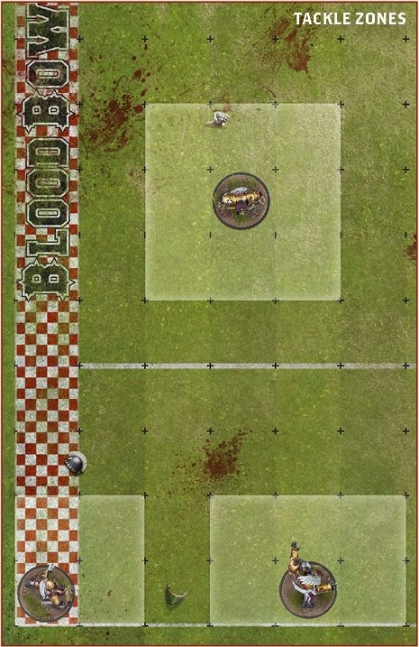
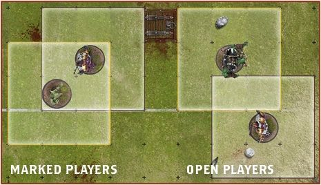
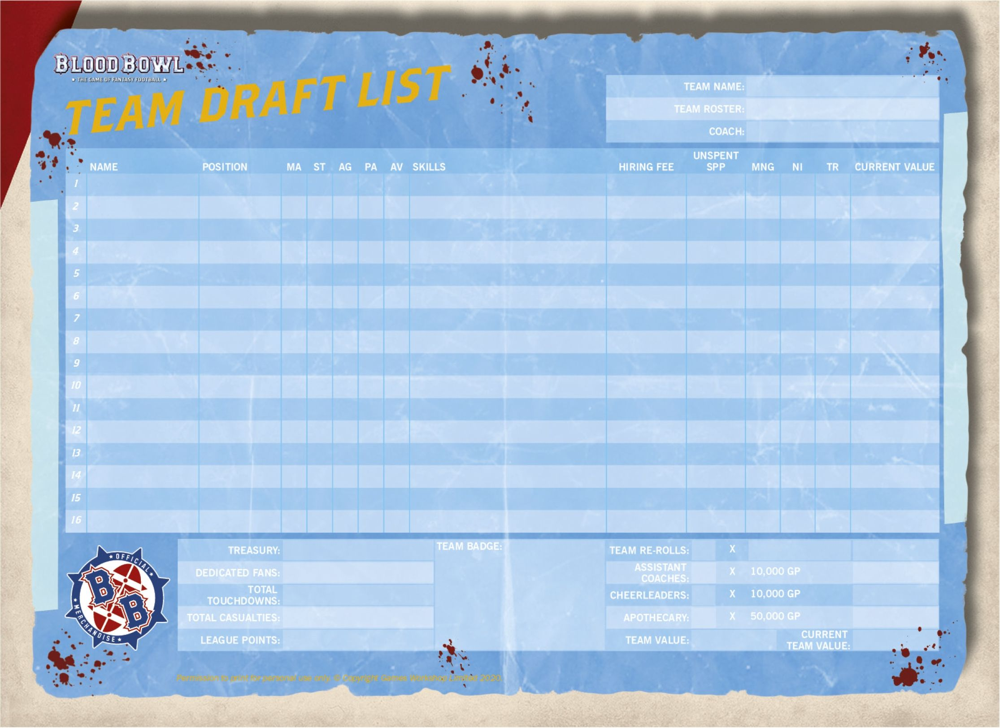
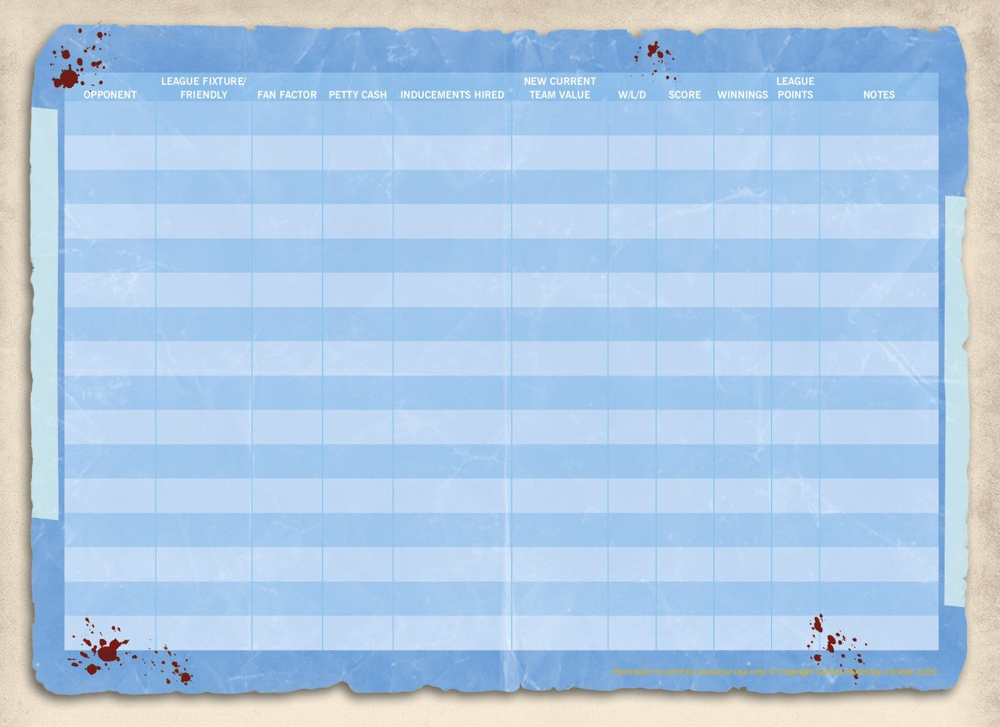

Blood Bowl is a complex game of ancient traditions, governed by rules and regulations older than imagining. That's the official line. In truth, the game of Blood Bowl as it is known today was hurriedly translated from an ancient and illegible tome by an elderly, near-sighted Dwarf. After completing this first, rushed draft, the sacred commissioner Roze-El spent many years trying to translate the *Tome of Nuffle* properly. Where this proved impossible, he relied on that most time-honoured tradition amongst scribes and historians and simply filled in the details by making stuff up!

Since the time of Roze-El, numerous others have had their say in the development of the rules. Consequently, the game as it is known today is unlikely to bear more than a passing resemblance to the original form of Nuffle's sacred game. Nuffle himself doesn't seem to be overly concerned by this, which is probably just as well!

This section covers in detail the rules and regulations of the game of Blood Bowl.

## General Principles

Before going further, it is worth establishing some general principles regarding some commonly used terms, dice and the game of Blood Bowl in general.

### The Coach and the Players

Blood Bowl is a tabletop game and tabletop games are traditionally played by 'players'. But Blood Bowl is also a game that represents a sporting fixture rather than a battle between rival armies. Whilst in other tabletop games the models might represent warriors, in Blood Bowl the models represent sports players. To avoid confusion, and to adhere to the theme of the game, the rules will always refer to the models as 'players' and to you, the person rolling the dice and making the decisions, as the 'coach'. In addition, players that belong to the same team are referred to as 'team-mates', whilst players that do not belong to their team are referred to as 'opposition players'.

### TAKE-BACKS AND CHANGING ONE'S MIND

It is not uncommon for coaches to second guess themselves occasionally, saying they are about to do something before immediately changing their mind. As a general rule, you should be tolerant of this in your opponents as you will likely do it yourself! However, once dice have been rolled for any reason, you must abide by your decision; you can no longer go back and change anything that came before the dice roll!

### RANDOMLY SELECTING A PLAYER

The rules will often require a coach to select a player at random. To do this, simply roll a D16 and check the Team Draft list. The number rolled is the player selected. If the number rolled doesn't correspond to a player or, as is often the case, if the number rolled doesn't meet the criteria of the player to be randomly selected (perhaps the number rolled corresponds to a player not on the pitch, for example) simply re-roll the dice.

### THE TURNOVER

One of the most important mechanics of the game of Blood Bowl is the 'Turnover'. Many unfortunate events will cause the active team's turn to end prematurely with a Turnover, regardless of how many players have been activated.

A Turnover is caused:

* If a player on the active team Falls Over during their own activation.
* If a player on the active team is Knocked Down during their team turn.
* If a player on the active team that is in possession of the ball is Placed Prone during their team turn.
* If a player on the active team that is in possession of the ball is forced to move off the pitch for any reason.
* If a player on the active team attempts to pick up the ball from the ground and fails, even if the bouncing ball is then caught by a player from the active team.
* If a player on the active team fumbles a Pass action, even if the bouncing ball is then caught by a player from the active team.
* If no player on the active team catches the ball after a Pass action or a Hand-off action and the ball comes to rest on the ground or in the possession of a player from the opposing team.
* If a Pass action is Deflected or Intercepted and the ball comes to rest either on the ground or in the possession of a player from the opposing team.
* If a player on the active team that is in possession of the ball is thrown by a team-mate and either fails to land safely, lands in the crowd or is eaten, even if the bouncing ball is then caught by a player from the active team.
* If a player on the active team is Sent-off by the referee for committing a Foul.
* If a touchdown is scored.

This list is not exhaustive; there may be other events that will cause a Turnover. Where this is the case, these will be detailed by the rules.

Should a Turnover occur, any dice rolls that must be made as a result of the event that caused it are made immediately, after which the current player activation ends. The active team may not activate any more players and the current team turn ends.

*For example, should one of your players Fall Over whilst moving, an Armour roll is made against them. If that player was in possession of the ball, the ball will then bounce. Once the ball has come to rest, the player's activation ends and you may activate no more players this turn. Finally, your team turn ends and the opposing team becomes the active team.*

### DICE ROLLING

The game of Blood Bowl uses dice rolls a great deal. The roll of a dice determines everything, be it a simple attempt to pick up the ball, or the effectiveness of a sneaky foul.

### SINGLE DICE ROLLS

The rules will often require you to roll a single dice, in which case the rules will say 'roll a D6', or 'roll a D8', for example.

### MULTIPLE DICE ROLLS

Often the rules will state 'roll 2D6'. In such cases, two D6 are rolled and the results added together to give a total between 2 and 12. This is a multiple dice roll.

### DICE POOLS

Sometimes the game may require two or more dice be rolled and a single result selected - for example, a coach might roll two or three block dice and select one result to apply. In this case a 'pool' of dice has been rolled.

### TARGET NUMBER ROLLS

Usually, when making a single dice roll or a multiple dice roll, the rules will require you to roll a specific number followed by a '+'. This indicates that the roll is a 'target number roll'. Making a target number roll is simple. If you are required to roll a 4+ on a single D6, for example, a roll of 4, 5 or 6 would be a success, but a roll of 1, 2 or 3 would not be.

### MODIFYING DICE ROLLS

The rules will often call for a dice roll to be modified, particularly when making a target number roll. To do this, simply roll the dice and then add or subtract the modifier(s) shown, effectively changing the outcome of the dice roll. If the rules ever instruct you to divide a dice roll in any way, any fractions should be rounded up, unless the rules state otherwise.

### ROLLING OFF

The rules may call for both coaches to roll a dice (usually either a D6 or a D3). Often a characteristic of some sort will be added to the result. This is called 'rolling off' and the highest score always wins a roll-off. In the case of a tie, roll again unless otherwise instructed.

### NATURAL ROLLS

A 'natural' roll is the actual number rolled on a dice, regardless of modifiers. It is not uncommon for a test to be passed if a natural 6 is rolled or failed if a natural 1 is rolled, even if modifiers might seemingly make success a certainty or failure seem impossible.

### RE-ROLLS

When rolling dice, it is common for things to go wrong! Fortunately, Blood Bowl allows for certain dice rolls to be re-rolled:

* The second result must always be accepted, even if it is worse than the original result.
* A dice can never be re-rolled more than once, regardless of the source of the re-roll.

### SKILL RE-ROLLS

Many players possess Skills that allow them to re-roll dice in a specific situation:

* Skill re-rolls can only be used as detailed in the Skill's description.
* Skill re-rolls can be used during either team's turn, as appropriate.
* When a dice pool is rolled, a Skill re-roll will allow only certain results to be re-rolled, as detailed in the Skill's description.

### TEAM RE-ROLLS

Every Blood Bowl team will have a number of team re-rolls to use during a game. A team will start each game with its full complement of team re-rolls. Any used during the first half of a game are replenished in full at the start of the second half, but unused team re-rolls do not carry over from the first half to the second half (or from one fixture to the next in league play):

* Team re-rolls can only be used when a team is active, during its own team turn.
* Team re-rolls cannot be used to re-roll:

&emsp; - Deviation, scatter and bounce rolls.

&emsp; Or:

&emsp; - Armour, Injury and Casualty rolls.

* When a dice pool is rolled, a team re-roll can be used. When a team re-roll is used, all of the dice in the dice pool must be re-rolled (not just those dice that show an undesirable result).

### DEVIATE, SCATTER OR BOUNCE

The footballs used in Blood Bowl are oddly shaped and often behave quite erratically. Throughout the rules, reference will be made to the ball 'deviating', 'scattering' or 'bouncing', and it is worth establishing early on what is meant by each of these terms:

### DEVIATE

This represents a kicked ball or desperate pass veering wildly off target:

* When the ball deviates, it moves a number of squares equal to the roll of a D6 from the square in which it was placed, in a direction determined by rolling a D8 and referring to the random direction template.
* If the ball lands in a square that is occupied by a Standing player that has not lost their Tackle Zone (see [page 26](../core_rules/rules_and_regulations.md#the-tackle-zone)), that player must attempt to catch the ball (see [page 51](../core_rules/the_rules_of_blood_bowl.md#catching-the-ball)). If they fail, it will bounce as described [opposite](../core_rules/the_rules_of_blood_bowl.md#catching-the-ball).
* If the ball lands in an unoccupied square or a square that is occupied either by a Standing player that has lost their Tackle Zone or by a Prone or Stunned player, it will bounce before it comes to rest on the ground.

### SCATTER

This happens whenever a ball (or a thrown player) in the air travels in an unexpected way:

* When the ball scatters, it moves from the square in which it was placed three times before landing, each time moving one square in a direction determined by rolling a D8 and referring to the Random Direction template.
* A player cannot attempt to catch the ball should it enter the square they occupy on the first or second scatter roll, as it is still high in the air at this point.
* If after the third scatter roll the ball lands in a square that is occupied by a Standing player that has not lost their Tackle Zone, that player must attempt to catch the ball. If they fail, it will bounce.
* If after the third scatter roll the ball lands in an unoccupied square or a square that is occupied by either a Standing player that has lost their Tackle Zone or by a Prone or Stunned player, it will bounce before it comes to rest on the ground.

### BOUNCE

This happens for many reasons, most often when the ball (or the player in possession of it!) hits the ground or when a player drops it:

* When the ball bounces, it moves one square in a direction determined by rolling a D8 and referring to the Random Direction template.
* If the ball bounces into a square that is occupied by a Standing player that has not lost their Tackle Zone, that player must attempt to catch the ball. If they fail, it will bounce again.
* If the ball bounces into a square that is occupied either by a Standing player that has lost their Tackle Zone or by a Prone or Stunned player, the ball will continue to bounce until it is caught by a Standing player or it comes to rest in an unoccupied square.

## Player Status

In games of Blood Bowl, the status of a player is very important. A player that is standing can achieve far more than one that is not!
A player that has been pushed to the ground can recover quite quickly compared to one that has to regain their senses before playing on.

Most of the time, a player will be 'Standing'. At other times a player will be either 'Prone' or 'Stunned'.

### STANDING PLAYERS

Players that are Standing when activated have the greatest freedom to move. Players that are Standing during the opposing team's turn are able to hinder their plays.

### THE TACKLE ZONE

A Standing player exerts control over the squares around them. This is called their 'Tackle Zone' and covers all of the eight squares adjacent to a Standing player, as shown in the diagram.

### OPEN PLAYERS

A player that is not being Marked, i.e., a player that is not within the Tackle Zone of any opposition players (as described [below](#marking-and-being-marked)), is said to be 'Open'. Open players can move freely and perform actions more easily, free from the interference of opposition players.

### MARKING AND BEING MARKED

Players use their Tackle Zone to interfere with opposition players, 'Marking' them and hindering their actions:

* If a player occupies a square that is within an opposition player's Tackle Zone, they are being 'Marked' by that opposition player.
* If a player has an opposition player within their Tackle Zone, they are 'Marking' that opposition player.
* A Standing player Marks all opposition players that are within their Tackle Zone.
* A player can be Marked by multiple opposition players at the same time.
* A player that has lost their Tackle Zone for any reason cannot Mark an opposition player, though they can be Marked themselves.

Players never Mark team-mates - they will only Mark opposition players. Marking opposition players, and being Marked by them in turn, has multiple in-game effects.

### LOSING TACKLE ZONES

Prone and Stunned players lose their Tackle Zone. It may also happen that, due to an in-game effect, a special rule or a Skill used by an opposition player, a Standing player loses their Tackle Zone.

If a player has lost their Tackle Zone they:

* Cannot Mark other players.
* Cannot attempt to interfere with a Pass action.
* Cannot attempt to catch the ball.

They will also be unable to use certain other Skills that require a player to have a Tackle Zone.

### PRONE AND STUNNED PLAYERS

Players that are not Standing will be either 'Prone' or 'Stunned'. All such players occupy one square on the pitch - the square they were in when they became Prone or Stunned - no matter how big the player.

### PRONE

When a player is Prone, the model is laid face-up on the pitch. A Prone player can do nothing until they have stood up. A Prone player may be activated during their team turn to perform any action that includes Movement Allowance. Doing so allows the player to sacrifice a portion of their movement to stand up (see [page 44](../core_rules/the_rules_of_blood_bowl.md#standing-up)).

### STUNNED

When a player is Stunned, the model is laid face-down on the pitch. A Stunned player is not eligible to be activated during their team turn. When a team's turn ends, even if it ends with a Turnover, any players that were Stunned when the turn began will automatically roll over and become Prone. If a player became Stunned during the course of their own team turn, they must remain Stunned until the end of their team's next turn, when they will automatically roll over and become Prone.

### BECOMING PRONE OR STUNNED

Usually, a player becomes Prone as the result of 'Falling Over' or being 'Knocked Down'. When a player Falls Over or is Knocked Down, they also 'risk injury', meaning they may become Stunned or worse. Alternatively, a player may be 'Placed Prone' without risk of injury.

### PLACED PRONE

Being Placed Prone is often a deliberate choice a player is able to make due to a Skill they possess. At other times an in-game effect, a special rule or a Skill used by an opposition player may cause one of your players to be Placed Prone by your opponent:

* If a player is Placed Prone during their activation, their activation ends immediately.
* If a player in possession of the ball is Placed Prone during their team turn, a Turnover is caused.
* If a player that is in possession of the ball is Placed Prone, the ball will bounce from the square in which the player was Placed Prone.
* When a player is Placed Prone, there is no risk of injury and no Armour roll is made against them.

### FALLING OVER

Players may 'Fall Over' when they attempt to Dodge, or they may simply Fall Over their own feet as they sprint across the pitch too quickly. When a player Falls Over it is self-inflicted, and it can only happen during a player's own activation:

* If a player Falls Over, a Turnover is caused.
* If a player Falls Over, they become Prone and risk injury. The coach of the opposing team makes an Armour roll against them as described on [page 29](../core_rules/rules_and_regulations.md#armour-rolls):

&emsp;- If the player's armour is broken as described on [page 60](../core_rules/the_rules_of_blood_bowl.md#armour-and-injuries), an Injury roll is made against them and they will become Stunned or worse.

&emsp;- If the player's armour is not broken, they remain Prone.

* If a player Falls Over whilst in possession of the ball, the ball will bounce from the square in which the player Falls Over, after making an Armour roll (and possible Injury roll) against them.

### BEING KNOCKED DOWN

Players are often 'Knocked Down' as the result of a vicious Block action from an opposition player or when they attempt to perform a Block action against an opposition player who proves to be bigger, tougher or luckier than they are. Players can also be Knocked Down by projectiles thrown by the crowd (including spells), or by some other in-game effect, by a special rule or by a Skill used by an opposition player:

* If a player is Knocked Down during their team turn, a Turnover is caused.
* When a player is Knocked Down, they become Prone and risk injury. The coach of the opposing team makes an Armour roll against them:

&emsp;- If the player's armour is broken, an Injury roll is made against them and they will become Stunned or worse.

&emsp;- If the player's armour is not broken, they remain Prone.

* If a player is Knocked Down whilst in possession of the ball, the ball will bounce from the square in which the player was Knocked Down, after making an Armour roll (and possible Injury roll) against them.

## Player Profile

### PLAYER PROFILE AND CHARACTERISTICS TESTS

Blood Bowl players are a hardy breed. Powerfully built, athletic and agile individuals of all known races, they take to the pitch seeking glory, wealth and lasting fame for themselves and their team. They play on in spite of all but the most serious of injury – indeed, it must be noted that often even death isn't a career ending event, more an… inconvenience!

### PLAYER PROFILE

The strengths and weaknesses of the players that make up a team are represented by a series of characteristics, collectively known as the player's 'profile':

* Movement Allowance (MA) and Strength (ST) are both shown as simple values, in which case a higher number is better.
* Agility (AG), Passing Ability (PA) and Armour Value (AV) are all shown as target numbers; a number followed by a '+' symbol, as described on [page 24](../core_rules/rules_and_regulations.md#target-number-rolls). In the case of AG and PA a lower number is better, whereas in the case of AV a higher number is better.

No characteristic may ever be improved more than twice or be improved beyond the maximum shown on the table below. No characteristic may ever be reduced below the minimum shown on the table below:

#### CHARACTERISTIC TABLE

| Characteristic | MA | ST | AG | PA | AV  |
| -------------- | -- | -- | -- | -- | --- |
| Maximum        | 9  | 8  | 1+ | 1+ | 11+ |
| Minimum        | 1  | 1  | 6+ | 6+ | 3+  |

### CHARACTERISTIC MODIFIERS

When making a test against any of a player's characteristics, there are a number of modifiers that may apply, some making success harder, some making it easier. Where modifiers apply to a Characteristic test, the rules will list and detail them:

* If the characteristic is given a simple value, the modifier is applied as written - for example, if a player with a Strength characteristic of 3 is given a +1 Strength modifier, their Strength characteristic becomes 4.
* Where a characteristic is presented as a target number, the modifier is always applied to the dice roll, as described on [page 24](../core_rules/rules_and_regulations.md#modifying-dice-rolls).

If the rules ever instruct you to divide a dice roll in any way, any modifiers that also apply to the roll should be applied after the roll has been divided.

## Characteristics Tests

### MOVEMENT ALLOWANCE (MA)

This characteristic shows the number of squares the player may move when activated during their team turn.
There are several actions a player can perform that allow them to move, ranging from a simple Move action to a dramatic Blitz (actions are dealt with in detail on [page 43](../core_rules/the_rules_of_blood_bowl.md#declaring-actions)).

### STRENGTH (ST)

A player's Strength characteristic represents how physically strong they are. Strength is used during Block actions, both when performing them and when defending against them.

### AGILITY (AG)

A player's Agility characteristic represents their Skill and dexterity in different situations, be it how easily they can pick up the ball or their ability to break away from a scrum.

#### AGILITY TESTS

You will often be required to test against a player's Agility. An Agility test is a target number roll made on a single D6, as described on [page 24](../core_rules/rules_and_regulations.md#target-number-rolls). In addition, if the roll is a natural 6, the test is automatically passed. However, if the roll is a natural 1, the test is automatically failed.

### PASSING ABILITY (PA)

This characteristic represents the player's ability to pass the ball (and in some cases other players and perhaps even bombs!).

#### PASSING ABILITY TESTS

You will often be required to test against a player's Passing Ability. A Passing Ability test is a target number roll made on a single D6. In addition, if the roll is a natural 6, the test is automatically passed. However, if the player has a PA of '-' or if the roll is a natural 1, the test is 'Fumbled', as described on [page 49](../core_rules/the_rules_of_blood_bowl.md#fumbled-passes) and [page 53](../core_rules/the_rules_of_blood_bowl.md#fumbled-throws).

### ARMOUR VALUE (AV)

A player's Armour Value is a hard- working characteristic. Most simply, it represents how the quality and durability of a player's sports kit protects them from harm. But AV can also represent how tough a player is. Some players may appear lightly armoured but have a high AV characteristic, indicating a high degree of physical durability. Others may appear very heavily armoured yet have a low AV characteristic, showing that in spite of their kit, they are delicate and prone to injury!

#### ARMOUR ROLLS

Whenever a test is required against a player's Armour Value, it is the coach of the opposing team that makes it. This is referred to as an 'Armour roll'. An Armour roll is a target number roll made on 2D6. If the roll is successful, the player's armour is 'broken'. If the roll is unsuccessful, the player's armour is not broken and protects them from harm.

### SKILLS & TRAITS

In addition to their characteristics, a player may possess one or more Skills or Traits.

#### SKILLS

Skills improve a player's performance in key areas, be it granting them a free re-roll in specific situations, or allowing them to modify a dice roll. Some players begin their career with natural talents that are represented in this way - others develop new Skills as they improve during a league.

#### TRAITS

Whilst Skills can be learned by a player during a league, Traits represent a unique ability a player brings to the game. Traits can be both positive and negative. Whatever the case, it is most unusual for a player to develop a new Trait during a league (though not impossible); players possess Traits when hired and retain them over their entire career.

### "WHAT CAN POSSIBLY GO WRONG?"

Players may have an AG or PA of 1+. It might seem that such players cannot fail when testing against these characteristics, but that is, unfortunately, not the case! Remember that when  testing against a player's AG or PA, any roll of a natural 1 is a fail. In addition, there will often be modifiers to apply.

*For example, a player with an AG of 1+ may find themselves subject to a -2 modifier, in which case you would need to roll a 3 or higher to pass an Agility test, because should you roll a 2 and apply a -2 modifier the result would be 0, which is lower than 1.*

## Drafting a Blood Bowl Team

Before an aspiring coach can lead their team to glory, the first thing they need is a team to lead! The fundamentals of team creation remain unchanged whether a team is being created for league or exhibition play. The rules that follow explain how to construct a team of players and Sideline Staff, ready to take to the gridiron and seek eternal glory (or ignominy)!

### TEAM ROSTERS

Blood Bowl is a game played by a great variety of races, and these in turn are split into an even greater number of sub-categories. All of these varied teams are represented by 'team rosters', lists used when creating, or 'drafting', a team of that type, which detail the players available to hire, their profiles and Hiring Fee.

A team roster will also tell you how much team re- rolls cost to buy, whether or not the team can include an apothecary, and will list any special rules the team has.

#### SPECIAL RULES

Most Blood Bowl teams are quite straight forward in their behaviour and approach to the game. Others, however, are not. All teams have one or more special rules in order to better portray their character (see [page 105](../core_rules/the_teams.md#regional-special-rules)).

### TEAM DRAFT LISTS

When a team is drafted, a 'Team Draft list' is completed. This contains spaces in which to record each player permanently hired to the team, their name, position, Hiring Fee and player profile, along with spaces to record experience gained in the form of 'Star Player Points' (see [page 70](../core_rules/post-game_sequence.md#3-player-advancement)) and advancements earned during league play. The 'Current Value' of each player is recorded, which is equal to their Hiring Fee plus the 'Value Increase' of any advancements they accrue (see [page 72](../core_rules/post-game_sequence.md#value-increase)).

There is also space to list other important team details, such as the Sideline Staff permanently hired, the number of team re-rolls bought and how many Dedicated Fans follow the team, as well as the team type, name and the name of the coach.

Finally, the Team Draft list contains spaces to record how many gold pieces the team has in its Treasury (see [page 35](../core_rules/rules_and_regulations.md#treasury)) and the total value of the team when all of the players, Sideline Staff, team re-rolls and player advances are accounted for.

### GAME RECORD SHEET

The reverse of the Team Draft list features the Game Record sheet. This is used to keep track of 'league fixtures' and 'cross division friendlies' played over the course of a league, including details of opposing teams and the names of their coaches, and the number of fans in attendance along with petty cash awarded, Inducements hired (see [page 38](../core_rules/the_rules_of_blood_bowl.md#4-inducements)), Current Team Value and any other notes coaches wish to keep.

Once the game is over, this is also where the outcome is recorded along with winnings and various other notable events as described on [page 69](../core_rules/post-game_sequence.md#1-record-outcome-and-winnings).

## Team Draft List

### TEAM DRAFT BUDGET

The Team Draft Budget is the amount of gold pieces (GP) you have to spend on your rookie team:

* When drafting your team for league play, you have a budget of 1,000,000 gold pieces to spend on players, Sideline Staff, team re-rolls and so forth.
* When drafting a team for exhibition play, you may have a higher budget (see [page 101](../core_rules/league_and_exhibition_play.md#exhibition-play)).

### HIRING PLAYERS

Players are the only compulsory element on any Blood Bowl team. Each team roster details all of the players available to a team of that type and their Hiring Fee. When drafting a team, you should select the players you want to permanently hire for your team, pay their hiring cost from your Team Draft Budget and make a record of the player on the Team Draft list.

A team may not include more players of a certain type than are allowed by the team roster. For example, an Elven Union team is allowed 0-2 Blitzers, meaning an Elven Union team may include zero, one or two Blitzers, but may not include three.

### NUMBER OF PLAYERS

The first and most important thing to be aware of when drafting a Blood Bowl team is the minimum and maximum number of players permitted:

* Every Blood Bowl team must contain a minimum   of eleven (11) permanently hired players when it is first drafted.
* No Blood Bowl team can ever contain more than sixteen (16) permanently hired players.

It is important to note that, during the course of a league season, the number of players a team can field may fall below 11 due to injury and death. This is permitted (if not ideal!) and is covered in more detail in the Take on Journeymen section on [page 38](../core_rules/the_rules_of_blood_bowl.md#3-take-on-journeymen).

### PLAYER POSITIONS

There are distinctions to be made between the players within a team, separating them by their role within the game, from the humble Lineman to the more specialised roles performed by the  positional' players.

***LINEMEN:*** The backbone of any team:

* All teams will have a player type that they are permitted to take 0-12 or 0-16 of. Regardless of name (for many races call their Linemen by another name), this Player type is the team's 'Lineman' positional.

***BLITZERS:*** On offence, Blitzers force gaps through the opposition. In defence they will violently target key opposition players.

***THROWERS:*** It is often the Thrower that takes the role of offensive captain - calling the plays and making split second decisions.

***CATCHERS:*** The safe pair of hands on any team, the Thrower's trusted receivers. It is the Catcher's job to receive passes safely.

***RUNNERS:*** Several teams employ Runners in place of Throwers and Catchers, relying on speed rather than risk passing interference.

***BLOCKERS:*** A popular position on the defensive line of any team that relies on a more physical play-style.

***OTHER POSITIONS:*** Many teams of different races employ players that do not fit into any specific role. This may be a sneaky Assassin or a Goblin mounted on a pogo stick (it's in the regulations!). There is almost no end to the innovation Blood Bowl teams show.

***BIG GUYS:*** The term Big Guy is a colloquial one used by Blood Bowl fans to identify the giants of the game; Ogre, Minotaur, Troll players and more fall under this heading.

### DESIGNER'S NOTE - MODELS ON THE SIDELINES

Although not essential, many coaches choose to represent staff with models on the sideline, both for the look of the thing and as a reminder that these staff members stand ready to help out. Such models also make great Turn, Re-roll and Score markers, adding a lot to the visual impact of the Blood Bowl pitch during a game.

### PURCHASING TEAM RE-ROLLS

Any team can purchase team re-rolls. These represent the time spent training and the team's ability to react in a split second to mistakes and turn them around. The cost reflects the time and effort different teams must invest to achieve the same broad level of training:

* Every team may purchase 0-8 team re-rolls when it is first drafted, for the cost shown on the team roster, paid for from the Team Draft Budget.
* During a league, additional team re-rolls may be purchased at a later date, in the Hiring, Firing and Temporarily Retiring step of the post-game sequence (see [page 72](../core_rules/post-game_sequence.md#4-hiring-firing-and-temporarily-retiring)), but the team must pay double. For example, if a team is able to purchase team re-rolls for 60,000 gold pieces when it is drafted, additional team re-rolls purchased later on during a league season will cost 120,000 gold pieces.
* When calculating Team Value (see [page 35](../core_rules/rules_and_regulations.md#team-value)), team re-rolls add only the cost shown on the team roster, even if they are purchased at double the cost later on in a league.

### HIRING SIDELINE STAFF

Sideline Staff can be of vital assistance to their team, helping to tip the balance in several seemingly minor but often vital ways.

### THE COACH

Every team is owned and managed by a coach. As discussed previously, this is you, the reader. As such, when completing the Team Draft list, the coach section should be filled in with your name or a suitable nickname.

### 0-6 ASSISTANT COACHES

Any team can hire a number of assistant coaches. These represent the specialists brought in to help with various aspects of the game. The benefit of assistant coaches is covered on [page 41](../core_rules/the_rules_of_blood_bowl.md#the-kick-off-event-table):

* Every team may hire assistant coaches when it is first drafted, for the cost of 10,000 gold pieces each, paid for from the Team Draft budget.
* Additional assistant coaches may be purchased during a league, in the Hiring, Firing and Temporarily Retiring step of the post-game sequence (see [page 72](../core_rules/post-game_sequence.md#4-hiring-firing-and-temporarily-retiring)), for the cost of 10,000 gold pieces each.

### 0-12 CHEERLEADERS

All teams can hire a number of cheerleaders. Be it dancers, musicians or even performing mascots, a good cheerleading squad can work the crowd up and encourage the players to try harder. The benefit of cheerleaders is covered on [page 41](../core_rules/the_rules_of_blood_bowl.md#the-kick-off-event-table):

* Every team may hire cheerleaders when it is first drafted, for the cost of 10,000 gold pieces each, paid for from the Team Draft Budget.
* Additional cheerleaders may be purchased during a league, in the Hiring, Firing and Temporarily Retiring step of the post-game sequence (see [page 72](../core_rules/post-game_sequence.md#4-hiring-firing-and-temporarily-retiring)), for the cost of 10,000 gold pieces each.

### 0-1 APOTHECARY

The apothecary fulfils a vital role in any team. It is their job to keep the valuable players fit and healthy. Apothecaries work hard on the sidelines, patching up minor injuries and giving urgent care to more serious injuries before they can end a player's career. An apothecary's role is covered in detail on [page 62](../core_rules/the_rules_of_blood_bowl.md#apothecaries):

* Not every team can hire an apothecary. Whether a team can or cannot include an apothecary will be noted on the team roster.
* If a team can hire an apothecary, it may only ever have one on the roster.
* Teams that can hire an apothecary can do so when they are first drafted, or during the Hiring, Firing and Temporarily Retiring step of the post-game sequence of any game (see [page 72](../core_rules/post-game_sequence.md#4-hiring-firing-and-temporarily-retiring)) for a cost of 50,000 gold pieces.
* Teams able to hire an apothecary may Induce a number of additional Wandering Apothecaries for a single game during a league in the Hire Inducements step of the pre-game sequence (see [page 38](../core_rules/the_rules_of_blood_bowl.md#4-inducements)).

### OTHER INFORMATION

As mentioned previously, the Team Draft list contains spaces to record several other important details. This includes the team Treasury, the size of their fan following, and the cash value of the team as a whole.

#### TREASURY

Blood Bowl teams can amass vast wealth. Most of this is reinvested immediately into wages, recruitment and running costs, but a careful coach can build up quite the fortune.

Any gold pieces not spent when drafting the team are recorded in the Treasury section of the Team Draft list. Over the course of a league season, winnings are added to this. The Treasury is used to purchase Inducements (see [page 38](../core_rules/the_rules_of_blood_bowl.md#4-inducements)) as well as new additions to the team, such as new players or Sideline Staff.

#### DEDICATED FANS

Every Blood Bowl team is supported by a strong following of Dedicated Fans, those loyal supporters that will follow their team in good times and bad. This dedicated fan base is made both of those eager to show their support for a local franchise and those from further afield who support the team for less easily identified reasons. Many dedicated fans support a team because their parents did. Others do so simply because they find the team colours fetching.

When a team is drafted, it will have a Dedicated Fans characteristic of 1 recorded on the Team Draft list (representing roughly 1,000 Dedicated Fans). Over the course of a league season, this characteristic will increase and decrease, though it will never fall below 1.

Additionally, when a team is drafted it can improve its Dedicated Fans characteristic by 1, up to a maximum of 6, at a cost of 10,000 gold pieces per improvement. For example, a team may improve its Dedicated Fans characteristic from 1 to 3 at a cost of 20,000 gold pieces from its Team Draft budget.

### TEAM VALUE

The final thing recorded on the Team Draft list is the value of the team:

***TEAM VALUE (TV):*** This is worked out by adding up the Current Value of all the players on the team, plus the cost of all Sideline Staff and team re-rolls the team has. The number of Dedicated Fans and the amount of gold pieces held in the Treasury do not add anything to TV.

***CURRENT TEAM VALUE (CTV):*** This is worked out exactly as above, but minus the Current Value of any players that suffered a Miss Next Game Casualty table result during the team's last game and will be unavailable to play next game (see [page 61](../core_rules/the_rules_of_blood_bowl.md#mng-miss-next-game)). This is the version of Team Value used to work out how much Petty Cash is granted to the team with the lower value during the pre-game sequence, as described on [page 38](../core_rules/the_rules_of_blood_bowl.md#petty-cash).

### INDUCEMENTS AND TEAMS DRAFTED FOR EXHIBITION PLAY

Normally, teams are drafted for league play, and in league play Inducements are dealt with in the pre-game sequence, as described on [page 38](../core_rules/the_rules_of_blood_bowl.md#4-inducements) and [page 89](../core_rules/inducements_in_detail.md#inducements-in-league-play) However, when a team is drafted for exhibition play, this is not the case. Instead, you may spend as much or as little of your Team Draft Budget as you wish on Inducements available to your team, as described on [page 89](../core_rules/inducements_in_detail.md#inducements-in-exhibition-play), provided your team contains the minimum of 11 players, not including Induced players such as Mercenaries or Star Players.
