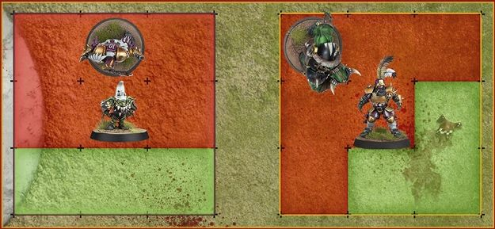
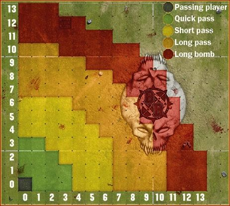
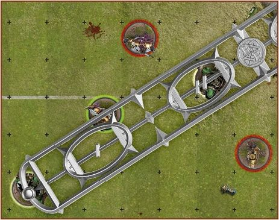
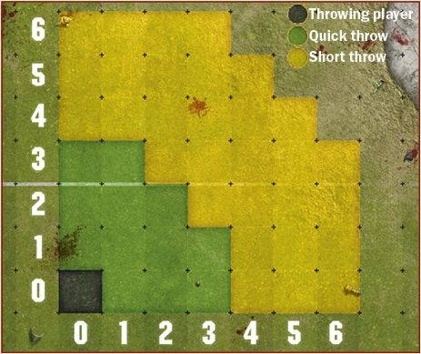
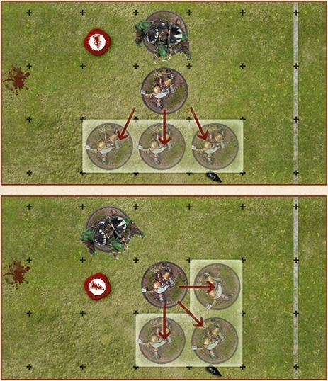
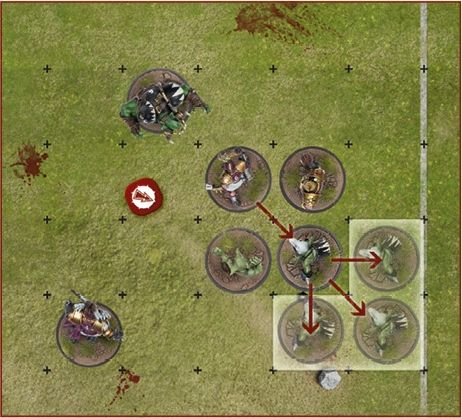

Traditionally, a game of Blood Bowl unfolds with one team kicking the ball to the other. The receiving team, the offencce, will then attempt to move the ball the length of the pitch, through a series of dramatic passes and daring rushes, into the opposition's End Zone, thus scoring a touchdown. The team that kicked-off, the defence, will attempt to stop this and gain possession of the ball, so that they may instead score a touchdown.

Once a touchdown has been scored, both of the teams line up once more and the scoring team kick off. And so the game progresses until the final whistle is blown, when the victors  celebrate, the losers commiserate and the stadium owners and sports promoters retire to count the money they made from ticket sales and concession stands!

## A Game of Two Halves

Blood Bowl game is split into two halves of roughly equal length, with a third period played should an important game that needs a clear winner be tied at the end of the second half. The third period is referred to as 'extra time'. In emulation of this tradition, a game of Blood Bowl played on the tabletop is split into two halves, each consisting of eight team turns. Therefore each half consists of 16 turns and the game overall of 32 turns.

### SETTING UP THE GAME

Setting up a game of Blood Bowl is simple. All that is needed is a pitch and a pair of coaches ready for action, each equipped with a team of models and the appropriate markers. With the pitch placed between them, each coach places their dugout beside one of the End Zones. This indicates which half of the pitch belongs to their team.

Both coaches then place their teams on the pitch and their markers onto their dugout before quickly explaining the details of their team for their opponent's benefit.

### PRE-GAME SEQUENCE

Once the game is set up, the pre-game sequence begins and both coaches run through the following sequence of steps:

1. *THE FANS:* Both coaches roll a D3 and add their Dedicated Fans characteristic. This determines each team's 'Fan Factor'.
2. *THE WEATHER:* Both coaches roll a D6, adding the results together and consulting the Weather table.
3. *TAKE ON JOURNEYMEN:* If a team cannot field 11 players for a league game, the team temporarily takes on a number of Journeyman players.
4. *INDUCEMENTS:* Both coaches decide if they will purchase any Inducements for the game ahead, paid for from a team's Treasury, from 'Petty Cash', or both.
5. *THE PRAYERS TO NUFFLE TABLE:* If one team now has a lower CTV than the other, it may be able to roll on the Prayers to Nufflee table.
6. *DETERMINE KICKING TEAM:* A coin is flippedd or dice are rolled to determine which team will kick-off (play defence) and which will receive (play offence) on the opening drive.

### 1. THE FANS

Blood Bowl games are always well attended. As well as the Dedicated Fans, many 'fair-weather fans' come along purely for the spectacle! Though they rarely care much about either team, they will invariably pick one to cheer for.

### FAN FACTOR (FF)

This is a combination of Dedicated Fans and fair-weather fans in attendance. To determine Fan Factor:

* Each coach rolls a D3. This represents how many fair-weather fans are cheering for their team.
* Each coach adds their Dedicated Fans characteristic to the number of fair-weather fans cheering their team.

The total indicates how many thousands of fans are cheering for your team and should be recorded in the 'FF' (Fan Factor) section of your Game Record sheet.

### 2. THE WEATHER

Blood Bowl is a game played and followed by hardy individuals, so it takes more than a little inclement weather to halt a game! However, extreme weather conditions can have quite an impact upon the game.

Each coach rolls a D6. Add the results together and refer to the Weather table below:

### WEATHER TABLE

**2D6 RESULT**

**2** ***Sweltering Heat:*** Some players faint in the unbearable heat! D3 randomly selected players from each team that are on the pitch when a drive ends are placed in the Reserves box. They must miss the next drive.

**3** ***Very Sunny:*** A glorious day, but the clear skies and bright sunlight interfere with the passing game! Apply a -1 modifier every time a player tests against
their Passing Ability.

**4-10** ***Perfect Conditions:*** Neither too cold nor too hot. A warm, dry and slightly overcast day provides perfect conditions for Blood Bowl.

**11** ***Pouring Rain:*** Pouring Rain: A torrential downpour leaves the players soaked and the ball very slippery! Apply a -1 modifier every time a player makes an Agility test to catch or pick-up the ball, or to attempt to interfere with a pass.

**12** ***Blizzard:*** Freezing conditions and heavy falls of snow make the footing treacherous. Apply a -1 modifier every time a player attempts to Rush an extra square.
Additionally, the poor visibility means that only Quick and Short passes can be attempted .

### 3. TAKE ON JOURNEYMEN**

If, during the pre-game sequence of a league fixture or cross division friendly, a team is unable to field 11 players it will make use of temporary players known as 'Journeymen':

* A Journeyman is always a Lineman positional player, selected from the team's 0-12 or 0-16 option.
* A Journeyman is always a normal player of their type, with the exception that they gain the Loner (4+) trait (see page 85), representing their lack of familiarity with their temporary teammates.
* Journeymen may take the total number of players on the team temporarily above 16 including injured players, but cannot take the number of players available for this game above 11.
* Each Journeyman counts towards CTV. The value they add is equal to the hiring cost of an ordinary player of their type as detailed in the team roster. Once you know how many Journeymen your team will include, you should recalculate your CTV.

Note that a team drafted for exhibition play must contain at least 11 players. This step can be skipped during exhibition play.

### 4. INDUCEMENTS

Ahead of any league fixture, play-off season game or cross division friendly, each team can spend gold pieces from their Treasury, from Petty Cash (see below) or from both, to purchase any Inducements available to them. These are then recorded on the team's Game Record sheet.

Note that, as described on page 102, Inducements are handled differently in exhibition play.

### PETTY CASH

If one team has a lower CTV (including the value of any Journeymen players), it is given 'petty cash' to spend on Inducements. The amount of petty cash given is exactly equal to the difference in CTV between the two teams.

Petty cash cannot be kept; it must be spent on Inducements for the game ahead. Any gold pieces not spent are lost.

### TREASURY

Both teams are free to spend gold pieces from their Treasury to purchase Inducements. If one of the teams has been given petty cash, gold pieces from its Treasury can be added to this.
Gold pieces spent in this way are immediately deducted from the Treasury.

### COMMON INDUCEMENTS

The Inducements available are many and varied. Listed on page 89 are the 'common' Inducements, always available at the prices shown there. Certain teams will have access to Inducements unique to them and future supplements will detail those and more.

### THE UNDERDOG

Once finished purchasing Inducements, you should recalculate your CTV. If at this point one team has a lower CTV, that team is referred to as the 'Underdog' and its coach may be eligible to appeal for 'divine intervention' by rolling on the Prayers to Nufflee table in Step 5.

### 5. THE PRAYERS TO NUFFLE TABLE

In league play (but not in exhibition play), the Prayers to Nufflee table may often be used during this step of the pre-game sequence. In both league and exhibition play, it may sometimes be used at the start of a drive, as described on page 41.

During this step of the pre-game sequence, the coach of the Underdog team may roll once on the Prayers to Nufflee table for every full 50,000 gold pieces of difference in CTV.

Roll a D16 and consult the table on the page opposite, re-rolling any duplicate results, and make a note of the result(s). All results rolled on this table come into effect at the start of the next drive. Most results last until the end of the next drive (i.e., the drive which starts immediately after this roll is made), then they cease to apply. Others last until the end of the half and a few results last until the end of the game.

### 6. DETERMINE KICKING TEAM

Every game of Blood Bowl starts with a coin toss to determine which team will be the 'kicking team' (the defence) and which team will be the 'receiving team' (the offence). In a real Blood Bowl game, this simple ceremony is much beloved of Blood Bowl fans as it is invariably when violence first breaks out between the teams, the fans and, quite often, the officialss!

On the tabletop, this ritual can be recreated either by tossing a Blood Bowl coin, or by a D6 roll-off. Once it has been determined which is the kicking team and which is the receiving team, the opening drive of the game begins in earnest with the set-up and kick-off as described on page 40.

### PRAYERS TO NUFFLE TABLE

D16 RESULT

1. *Treacherous Trapdoor:* Until the end of this half, every time any player enters a Trapdoor square, for any reason, roll a D6. On a roll of 1, the trapdoor falls open and the player is immediately removed from play. Treat them exactly as if they had been pushed into the crowd. If the player was in possession of the ball, it bounces from the trapdoor square.
2. *Friends with the Ref:* Until the end of this drive, you may treat a roll of 5 or 6 on the Argue the Call table as a "Well, When You Put It Like That..." result and a roll of 2-4 as an "I Don't Care!" result.
3. *Stiletto:* Randomly select one player on your team that is available to play during this drive and that does not have the Loner (X+) trait. Until the end of this drive, that player
   gains the Stab trait.
4. *Iron Man:* Choose one player on your team that is available to play during this drive and that does not have the Loner (X+) trait. Until the end of this game, that player improves
   their AV by 1, to a maximum of 11+.
5. *Knuckle Dusters:* Choose one player on your team that is available to play during this drive and that does not have the Loner (X+) trait. Until the end of this drive, that player
   gains the Mighty Blow (+1) skill.
6. *Bad Habits:* Randomly select D3 opposition players that are available to play during this drive and that do not have the Loner (X+) trait. Until the end of this drive, those players gain the Loner (2+) trait.
7. *Greasy Cleats:* Randomly select one opposition player that is available to play during this drive. That player has had their boots tampered with! Until the end of this drive, their MA is reduced by 1.
8. *Blessed Statue of Nuffe:e:* Choose one player on your team that is available to play during this drive and that does not have the Loner (X+) trait. Until the end of this game, that player gains the Pro skill.
9. *Moles under the Pitch:* Until the end of this half, apply a -1 modifier every time any player attempts to Rush an extra square (-2 should it occur that both coaches have rolled this result).
10. *Perfect Passing:* Until the end of this game, any player on your team that makes a Completion earns 2 SPP, rather than the usual 1 SPP.
11. *Fan Interaction:* Until the end of this drive, if a player on your team causes a Casualty by pushing an opponent into the crowd, that player will earn 2 SPP exactly as if they had caused a Casualty by performing a Block action.
12. *Necessary Violence:* Until the end of this drive, any player on your team that causes a Casualty earns 3 SPP, rather than the usual 2 SPP.
13. *Fouling Frenzy:* Until the end of this drive, any player on your team that causes a Casualty with a Foul action earns 2 SPP exactly as if they had caused a Casualty by performing a Block action.
14. *Throw a Rock:* Until the end of this drive, should an opposition player Stall, at the end of their team turn you may roll a D6. On a roll of 5+, an angry fan throws a rock at that player. The player is immediately Knocked Down.
15. *Under Scrutiny:* Until the end of this half, any player on the opposing team that commits a Foul action is automatically seen by the referee, even if a natural double is not rolled.
16. *Intensive Training:* Randomly select one player on your team that is available to play during this drive and that does not have the Loner (X+) trait. Until the end of this game, that player gains a single Primary skill of your choice.

## The Start of A Drive

Once the coin toss or roll-off to determine which team will kick and which will receive is resolved, the coaches will take turns to set up their teams, ready for action and with the shouted instructions of coaching stafff ringing in their ears. The coach of the kicking team then places the ball, determines how accurate (or how wildly inaccurate) the kick is, and rolls on the Kick- off Event table.

### START OF DRIVE SEQUENCE

At the beginning of every drive, both coaches run through the following sequence of steps:

1. **SET-UP:** Starting with the kicking team, both coaches set up their teams.
2. **THE KICK-OFF:** A player on the kicking team kicks the ball to the offence.
3. **THE KICK-OFF EVENT:** The coach of the kicking team rolls on the Kick-off Event table.

### TOO MANY PLAYERS

Sometimes, too many players will make their way onto the pitch. If this is spotted before the first turn of the drive, simply correct the mistake. If, however, the mistake is not spotted until after the first turn of the drive has begun, any extra player(s) will be Sent-off for committing a Foul, exactly as described on page 63. Which player(s) are Sent-off is decided by the coach of the opposing team.

### 1. SET-UP

Both coaches place all of their available players on the pitch. If there are more than 11 players available, those not chosen to play the drive are placed in the Reserves box until the start of the next drive. A team may not set up more than 11 players at the start of a drive.

In later drives, the number of available players is likely to be reduced, with players languishing in the Knocked-out or the Casualty box. This is permitted, if not ideal! If you are unable to set up 11 players at the start of a later drive, you must set up all available players - no players can be placed in the Reserves box if fewer than 11 players are available.

The kicking team set up first, followed by the receiving team, as follows:

* Both teams set up fully within the area between their own End Zone and the Line of Scrimmage. Neither team may set up any players beyond the Line of Scrimmage in the opposition's half.
* Each team can set up a maximum of two players in each Wide Zone. In other words, each team can set up four players in Wide Zones, providing they are split equally with two players per Widezone.
* A team must set up a minimum of three players in squares within the Centre Field, directly adjacent to the Line of Scrimmage.

Note that should a team find itself reduced to only three players or fewer, it may concede without penalty before setting-up, as described on page 67. Should you wish to play on, the available players should be set up on the Line of Scrimmage, as described above.

### 2. THE KICK-OFF

Once both teams have been set-up ready for the drive ahead, the coach of the kicking team makes the kick-off.

### NOMINATE KICKING PLAYER

Although not always essential, certain rules require a specificc player to be nominated as the kicking player. It is therefore useful to adopt the habit of nominating a kicking player:

* The kicking player cannot be on the Line of Scrimmage (unless there are only three, or fewer, players belonging to their team on the pitch).
* The kicking player cannot be in either Wide Zone.

### PLACE THE KICK

A good kick can help the defence and hinder the offence, and where to place the ball is an important consideration when kicking. The coach of the kicking team places the ball in any square they wish, occupied or unoccupied, in the receiving team's half of the pitch.

### THE KICK DEVIATES

Kicking the ball is not a precise art, and a bad kick can see the ball land wildly off target. The coach of the kicking team rolls both a D8 and a D6 to determine deviation, as described on page 25. At this moment, the ball itself is still high in the air. No attempts can be made to catch it until after the 'kick-off event' has been resolved.

### 3. THE KICK-OFF EVENT

Every kick-off is a unique event. Almost anything can happen, and often does!

Immediately after the kick has deviated, whilst the ball is still high in the air, the coach of the kicking team rolls 2D6 and consults the Kick-off Event table opposite.

### WHAT GOES UP, MUST COME DOWN

Once the Kick-off event has been resolved, the ball will come back down to be caught by a player or to land on the ground, as described on page 25.

### TOUCHBACKS

A kick-off must land safely in the receiving team's half of the pitch.
If the ball deviates or bounces off the pitch or across the Line of Scrimmage into the kicking team's half of the pitch for any reason at all, a 'touchback' is caused. When a touchback is caused, after the Kick-off event has been resolved as normal, the coach of the receiving team gives possession of the ball to one of their players. No Agility test is required, the player  is simply handed the ball. Should it ever occur that there is no Standing player on the receiving team to take possession of the ball, the ball is given to a Prone or Stunned player and will bounce.

### THE KICK-OFF EVENT TABLE

**2D6 RESULT**

**2 *Get the Ref:*** Each team gains a free Bribe Inducement as described on page 91. This Inducement must be used before the end of the game or it is lost.

**3 *Time-out:*** If the kicking team's turn marker is on turn 6, 7 or 8 for the half, both coaches move their turn marker back one space. Otherwise, both coaches move their turn marker forward one space.

**4 *Solid Defence:*** D3+3 Open players on the kicking team may be removed and set up again in different locations, following all of the usual set-up rules.

**5 *High Kick:*** One Open player on the receiving team may be moved any number of squares, regardless of their MA, and placed in the same square the ball will land in.

**6 *Cheering Fans:*** Both coaches roll a D6 and add the number of cheerleaders on their Team Draft list. The coach with the highest total may immediately roll once on the Prayers to Nufflee table. In the case of a tie, neither coach rolls on the Prayers to Nufflee table. Note that if you roll a result that is currently in effect, you must re-roll it. However, if you roll a result that has been rolled previously but has since expired, there is no need to re-roll it.

**7 *Brilliant Coaching:*** Both coaches roll a D6 and add the number of assistant coaches on their Team Draft list. The coach with the highest total gains one extra team re-roll for the drive ahead. If this team re- roll is not used before the end of this drive, it is lost. In the case of a tie, neither coach gains an extra team re-roll.

**8 *Changing Weather:*** Make a new roll on the Weather table and apply that result. If the weather conditions are 'Perfect Conditions' as a result of this roll, the ball will scatter, as described on page 25, before landing.

***9 Quick Snap:*** D3+3 Open players on the receiving team may immediately move one square in any direction.

**10** ***Blitz:*** D3+3 Open players on the kicking team may immediately activate to perform a Move action. One may perform a Blitz action and one may perform a Throw teammate action. If a player Falls Over or is Knocked Down, no further players can be activated and the Blitz ends immediately.

**11 *Offciousus Ref:*** Both coaches roll a D6 and add their Fan Factor to the result. The coach that rolls the lowest randomly selects one of their players from among those on the pitch. In the case of a tie, both coaches randomly select a player. Roll a D6 for the selected player(s). On a roll of 2+, the player and the referee argue and come to blows. The player is Placed Prone and becomes Stunned. On a roll of 1 however, the player is immediately Sent-off, as described on page 63.

**12 *Pitch Invasion:*** Both coaches roll a D6 and add their Fan Factor to the result. The coach that rolls the lowest randomly selects D3 of their players from among those on the pitch. In the case of a tie, both coaches randomly select D3 of their players from among those on the pitch. All of the randomly selected players are Placed Prone and become Stunned.

## The Team Turn

A game of Blood Bowl is a hectic affair, and to make sense of all of the action, the game on the tabletop is broken down into a series of team turns, during which each coach will activate their players one at a time. In this way, the drama of the game is recreated in a manageable and controlled way.

### TEAM TURNS

Once the Kick-off has been resolved, the game continues in a simple but strict sequence of team turns:

1. *RECEIVING TEAM,S TURN:* At the start of any drive the receiving team, the offence, takes the first team turn.
2. *KICKING TEAM'S TURN:* After the receiving team have taken their turn, play passes to the team that kicked, the defence.

This sequence is repeated until the drive ends with a touchdown, the end of a half or the end of the game:

* At the beginning of the first half, which team kicks-off and which team receives will have been decided by the coin toss, as described on page 38.
* At the beginning of the second half, play is reversed, with the team that received and played offence at the start of the game now becoming the kicking team, and vice versa.
* Should any drive end with a touchdown before the end of the half, the team that scored the touchdown will kick to the team that conceded the touchdown.

A team turn ends either once all eligible players have been activated, or as the result of a Turnover (see page 23).

### ACTIVE AND INACTIVE TEAM

During your team turn, your team is referred to as the 'active' team. During your team turn, your opponent's team is referred to as the 'opposition' or the 'inactive' team.

### MOVING THE TURN MARKER

As mentioned previously, it is your responsibility at the beginning of each and every one of your team turns to move the turn marker along the Turn tracker on your dugout. If either coach forgets to move their turn marker, a polite reminder to do so is in order.

### PLAYER ACTIVATIONS

During your team turn, you may activate each Standing and/or Prone player to perform one action available to them, but you are not obliged to activate every player. Players that begin their team turn Stunned cannot be activated. In ideal circumstances, you will be able to activate every player without mishap, but all too often a turn will end with a Turnover, meaning that some players will inevitably not have been activated when the turn ends.

### DECLARING ACTIONS

When you activate a player, you must declare the action that player will perform (and, if required, the target of that action). You may not move a player and then declare that player will perform a Pass, Throw teammate, Hand-off, Blitz or Foul action. If a player is moved without first declaring their action, the player can only perform a simple Move action.

You are never obliged to complete a declared action. For example, if you declare a player will perform a Pass action, you may decide against performing the Pass action itself once movement is complete. If, after moving, you decide against performing the declared action, the action still counts as having been performed this team turn and cannot be performed by another player.

### MOVE

The most basic action. Any player on the active team that is not Stunned can perform a simple Move action. Movement is covered in more detail on page 44.

### PASS

Once per team turn, a player on the active team may attempt to pass the ball to another square, as described on page 48.

### HAND-OFF

Once per team turn, a player on the active team may attempt to hand the ball off to another Standing player from their team that is in an adjacent square, as described on page 51.

### THROW teammate

Once per team turn, instead of performing an ordinary Pass action, a player on the active team with the 'Throw teammate' trait may attempt to throw a player from their team that has the 'Right Stuff' trait. A team may not perform both a Pass action and a Throw teammate action during the same team turn. Throwing teammates is covered in more detail on page 52.

### BLOCK

'Block' is the term used when a player targets an opposition player with an attack, hoping to push them back, knock them to the ground and perhaps cause a lasting injury. A Standing player on the active team can target a Standing opposition player that is within their Tackle Zone with a Block action (or a Special action granted by a Skill or Trait that can be performed instead of a Block action), but cannot move before or after performing the action. Blocking is covered in more detail on page 56.

### BLITZ

Once per team turn, a player on the active team may perform a Blitz action, an action that combines together both a Move action and a Block action (or a Special action granted by a Skill or Trait that can be performed instead of a Block action). When a player performs a Blitz action, they may move as normal. However, performing the Block action costs a Blitzing player one square of their Movement Allowance. The player may move both before and after performing the Block action if they wish, and may follow-up if the target of the Block action is pushed back. Movement is covered in more detail on page 44 and Blocking is covered in more detail on page 56.

### FOUL

Once per team turn, a player on the active team may commit a Foul action, stealthily sticking the boot into a downed opponent when they hope no one is looking! Fouling is covered in more detail on page 63, but be warned that such flaagrant disregard for the rules may result in the active player being Sent-off and the team turn ending with a Turnover.

#### SPECIAL ACTIONS

In addition to these seven main actions, there are numerous Skills and Traits a player may possess that allow them to perform another, unique action. Examples include Hypnotic Gaze, which allows a player to transfix an opponent, causing them to temporarily lose their Tackle Zone so that they cannot Mark other players.

Such actions are called 'Special actions' and are detailed in the appropriate Skill or Trait description. A full list of Skills, Traits and descriptions of how they work can be found on
page 74.

### ACTIVATED PLAYERS

During a game of Blood Bowl, it can become difficcult to keep track of which players have already been activated during their team turn, and which players are yet to be activated.

To help with this, at the start of each team turn you should make sure that all of your players are facing towards the same End Zone. Once a player has been activated, the model should be turned around, so that it is facing towards the other End Zone. In this way, both coaches are able to tell easily which players have been activated and which players have yet to be activated.

A Standing player that loses their Tackle Zone should be turned to face one of the Sidelines. The player should be left facing the Sideline until their next activation begins.

## Movement

During their team turn, a number of actions allow a player to move about the pitch when activated, as mentioned previously. Sometimes a player may even be moved involuntarily as a result of a block or another in-game effecct. This section deals with how players are moved around the pitch and how other players, particularly the opposition, can hinder their progress.

### MOVING PLAYERS

When a player moves, they may move a number of squares equal to their Movement Allowance. A player may move in any direction: forwards, backwards, left, right and diagonally, into any adjacent, unoccupied square. Moving players are not obliged to use their full Movement Allowance and may move zero squares should you wish. Players cannot voluntarily move off the pitch.

### UNOCCUPIED SQUARES

Any square that is not occupied is said to be 'unoccupied'. Players may move into any unoccupied square that is adjacent to the square they occupy. Only players can occupy a square, if a square contains only the ball or a trapdoor, it is unoccupied.

#### OCCUPIED SQUARES

If there is a Standing, Prone or Stunned player from either team in a square, that square is said to be 'occupied'. Players may not move into or through an occupied square. The ball can never come to rest on the ground in an occupied square and will continue to bounce until it lands in an unoccupied square or is caught by a Standing player.

### STANDING UP

A Prone player can do nothing without first standing up. A Prone player can stand up when they are activated to perform any action that includes movement:

* The only time a Prone player can stand up is during their team turn, at the start of their activation.
* Standing up costs a Prone player three (3) squares of their Movement Allowance.
* If a Prone Player with a Movement Allowance of 2 or less (before or after modificcation) wishes to stand up, roll a D6:

- On a roll of 4+, the player is able to stand up, using their full Movement Allowance to do so.
- On a roll of 1-3, the player is unable to right themselves. They remain Prone and theiractivation ends.
- A Prone player with a Movement Allowance of 2 or less (before or after modificcation) may Rush after standing up.

If a Prone player is not activated during their team turn, they will remain Prone until they are activated in a later turn.

### RUSHING

Whenever a player performs any action that includes movement, they may attempt to gain an extra one or two squares of Movement Allowance. This is called 'Rushing'. These extra squares of Movement Allowance may be used to move, to perform a Block action as part of a Blitz action (see page 59), to Jump over a Prone or Stunned player (see page 45) and so on, just as if they were normal movement:

* At the end of the player's movement, declare that they will Rush and move them one more square.
* After the Rushing player has been moved, roll a D6:

- On a roll of 2+, the Rushing player moves without mishap.
- On a roll of 1 (before or after modificcation), the Rushing player trips and Falls Over as described on page 27.

If the Rushing player is still Standing after Rushing once, they may attempt to Rush a second time following the same process.

When a player is Rushing, the D6 roll comes before any other rolls that may be required, be they to Dodge, pick up the ball or anything else.

### MARKED PLAYERS AND DODGING

If an active player is being Marked, as described on page 26, by one or more opposition players, they must 'Dodge' in order to vacate the square they currently occupy and move safely into another, otherwise they will be tackled and will Fall Over in the square they wish to move into.

To Dodge, a player must test against their Agility as described on page 29. Declare that the player will Dodge from the square in which they are being Marked, and move them into any adjacent, unoccupied square:

* The Agility test is made after the dodging player has been moved, Rushing first if necessary.
* No matter how many players were Marking them, the dodging player is only required to make one Agility test to Dodge.
* If the dodging player is being Marked in the square they have moved into, apply a -1 modifier per player Marking them.

Note that if the player is Open in the square they have moved into, there are no modifiers to apply for being Marked. However, there may be modifiers to apply for other reasons, such as Skills and Traits being used by an opposing player.

### OPEN PLAYERS

A player that is Open does not need to Dodge to move from square to square. An Open player may move into an unoccupied square that is within the Tackle Zone of one or more opposition players, so that they are now Marking those players and being Marked by them in turn. The moving player may then stop moving or may continue to move, but will have to Dodge as described above.

### JUMPING OVER PRONE OR STUNNED PLAYERS

Once during their activation, a moving player can attempt to Jump over a single adjacent square that is occupied by a Prone or Stunned player, into an unoccupied square beyond. The squares the active player can attempt to Jump into will depend upon the direction in which they are moving, as shown in the diagrams below:

Jumping over a square in this way uses Movement Allowance exactly as if the player had moved into and out of the square they are jumping over. To Jump over a square that contains a Prone or Stunned player, a player must test against their Agility as described on page 29:

* The Agility test is made after the jumping player has been moved, Rushing first if necessary.
* Apply a negative modifier equal to the number of players that were Marking the jumping player in the square they jumped from or equal to the number of players that are Marking the jumping player in the square they have jumped into, whichever is the greatest. For example, if a player jumps from a square in which they were being Marked by one player into a square in which they are being Marked by two players, a -2 modifier is applied.
* If the jumping player was being Marked in the square they jumped from, they are not required to Dodge.

Note that if the jumping player was Open in the square they have jumped from and is Open in the square they have jumped into, there are no modifiers to apply for being Marked. However, there may be modifiers to apply for other reasons.

If the Agility test is failed, the jumping player will Fall Over in the square they have jumped into. If, however, the Agility test is failed on a natural 1, the jumping player is placed back in the square they were trying to Jump from and they will Fall Over in that square.

### BLITZ ACTIONS

Once per team turn, as mentioned on page 43, a single Standing or Prone player on the active team may be activated to perform a Blitz action. When a player Blitzes, they may move exactly as described in this section; standing up and dodging as necessary, and they may attempt to gain extra squares of Movement Allowance by Rushing. In addition, they may perform a Block action (or a Special action granted by a Skill or Trait that can be performed instead of a Block action) at any point before, during or after their movement. The only notable difference is that when a player Blitzes, performing a Block action (or a Special action granted by a Skill or Trait that can be performed instead of a Block action) costs the player one square of their Movement Allowance.

Block actions and Blitz actions are covered in greater detail on page 56.

### PICKING UP THE BALL

If a player voluntarily moves into a square in which the ball is placed, they must attempt to pick it up. This attempt to pick up the ball is made after any dice rolls required to Rush, Dodge or Jump into the square have been made, but before any other dice rolls are made.

To pick up the ball, a player must test against their Agility as described on page 29:

* If the player is Open when attempting to pick up the ball, there are no modifiers to apply.
* If the player is being Marked, apply a -1 modifier per player Marking them.
* If a player attempts to pick up the ball and fails, the ball will bounce as described on page 25. Should this happen, a Turnover is caused, even if the bounce is caught by another player on the active team.

After successfully picking up the ball, the player may continue moving if they wish and if they are able.

Note that should a player ever be moved involuntarily into a square in which the ball is placed, they cannot attempt to pick it up. Instead the ball will bounce, but no Turnover is caused.

## Passing The Ball

Traditionally in Blood Bowl, play progresses with a series of dramatic passes and catches. Throwers endeavour to get the ball safely to a teammate, who, thanks to their strength,speed and agility, is in position to run with the ball into the opposition End Zone. Whilst in recent years many players that prefer to run with the ball have risen to superstardom, it is still the spectacle of the passing game that excites the crowds the most!

### PASS ACTIONS

Once per team turn, a player on the active team may perform a Pass action in order to pass the ball to another square. This target square may be occupied by a Standing, Prone or Stunned player (from either team) or it may be unoccupied.

A Pass action can be further definedd as being a 'Quick pass', a 'Short pass', a 'Long pass' or a 'Long bomb', based on the range as described opposite.

The player may move before performing the action following all of the normal movement rules, but once the pass has been resolved they may not move further and their activation comes to an end. The player performing the action does not need to be in possession of the ball when activated, they may pick the ball up as they move (see page 46):

* MEASURE RANGE AND DECLARE TARGET SQUARE: The range ruler is used to measure the range to any possible target
  squares, before the target square is chosen and declared.
* TEST FOR ACCURACY: The coach of the player performing the action rolls a D6 to determine the accuracy of the pass.
* PASSING INTERFERENCE: Unless the pass was fumbled, one opposition player may be able to attempt to interfere with the pass, hoping to 'Deflecct' or 'Intercept' it.
* RESOLVE PASS ACTION: If the pass was neither fumbled nor interfered with, the pass itself is resolved!

### MEASURE RANGE AND DECLARE TARGET SQUARE

Once you have activated a player and declared that they will perform a Pass action, you are free to measure the range between the player and any possible target squares whenever you wish, even interrupting the player's movement to do so.

### MEASURING RANGE

Range is measured by placing the circle at the end of the range ruler over the centre of the square occupied by the player performing the action. The other end of the range ruler is positioned so that the ruler covers the target square, with the line along the centre of the range ruler passing through the centre of the target square. The target square will fall into one of the four bands marked on the range ruler:

* I: Quick pass
* II: Short pass
* III: Long pass
* IIII: Long bomb

Any squares that are beyond the reach of the range ruler or that are intersected by the end of the range ruler are out of range and cannot be the target square.
If the line between two range bands intersects the target square, it is considered to fall within the higher range band. If it is not clear which range band the target square falls into, refer to the Passing Range chart shown below:

### DECLARE TARGET SQUARE

After you have measured for range and moved the player, you must indicate and declare which square will be the target square. The target square may be occupied by a Standing, Prone or Stunned player (from either team) or it may be unoccupied.

### TEST FOR ACCURACY

The player performing the action now tests against their Passing Ability to see if the pass is 'accurate', 'inaccurate', 'wildly inaccurate' or is 'fumbled'. A Passing Ability test is made as described on page 29, applying the following modifiers based on range:

* If the player is attempting a Quick pass, there is no modifier.
* If the player is attempting a Short pass, apply a -1 modifier.
* If the player is attempting a Long pass, apply a -2 modifier.
* If the player is attempting a Long bomb, apply a -3 modifier.

In addition, the following modifiers may also apply:

* If the player is being Marked, apply an additional -1 modifier per player Marking them.

### ACCURATE PASSES

If the Passing Ability test is passed, or if the roll is a natural 6, the pass is accurate and the ball will land in the target square.

### INACCURATE PASSES

If the Passing Ability test is failed, the pass is inaccurate and the ball will scatter from the target square before landing.

### WILDLY INACCURATE PASSES

If, when making the Passing Ability test, the dice roll is a 1 after modifiers have been applied, the ball will deviate from the square occupied by the player performing the Pass action before landing.

### FUMBLED PASSES

There is always a chance something will go horribly wrong and the pass will be fumbled:

* If, when making the Passing Ability test, a natural 1 is rolled, the pass has been fumbled.
* If the player has a PA of '-', the pass is automatically fumbled.

When a Pass action is fumbled, the activation of the player performing it ends immediately. The ball is dropped, bouncing from the square occupied by the player performing the action, and a Turnover is caused.

### PASSING INTERFERENCE

If the pass was not fumbled, a single player from the opposing team may be able to attempt to interfere with the pass, hoping to 'Deflecct' the pass or, in some rare cases, to 'Intercept' the pass. To determine if any opposition players are able to attempt passing interference, place the range ruler so that the circle at the end is over the centre of the square occupied by the player performing the Pass action. Position the other end so that the ruler covers the square in which the ball will land. Note that, depending upon the Passing Ability test, this may not be the target square!

To attempt to interfere with a pass, an opposition player must be:

* A Standing player that has not lost their Tackle Zone (as described on page 26).
* Occupying a square that is between the square occupied by the player performing the Pass action and the square in which the ball will land.
* In a square that is at least partially beneath the range ruler when placed as described above.

If any opposition players are in a position to attempt to interfere with a pass, the coach of the opposing team nominates one to make the attempt and tests against their Agility, applying the following modifiers to represent the difficculty of attempting to snatch the ball from the air:

* If the player is attempting to interfere with an accurate pass, apply a -3 modifier.
* If the player is attempting to interfere with an inaccurate pass, apply a -2 modifier.
* If the player is attempting to interfere with a wildly inaccurate pass, apply a -1 modifier.
* Apply an additional -1 modifier if the player is being Marked.

### SUCCESSFUL PASSING INTERFERENCE

If the Agility test is passed, the player's attempt to interfere with the pass has been successful and the pass has been 'Defleccted'. The pass is interrupted and the action immediately ends.

The player that made the Deflection must now attempt to convert that Deflection into an 'Interception' by catching the ball as described opposite. If they do, they have made an Interception. If the player fails to catch the ball, it will scatter from the square they occupy.

Following any successful passing interference, if the ball comes to rest on the ground in an empty square or in the possession of a player from the opposing team, a Turnover is caused. If, however, the ball is caught by a player on the active team after scattering, no Turnover is caused.

### RESOLVE PASS ACTION

If the pass was neither successfully interfered with nor fumbled, the pass itself is now resolved. Where the ball lands is determined based on the result of the Passing Ability test as described previously. If the ball lands in a square occupied by a Standing player that has not lost their Tackle Zone, that player must attempt to catch it, as described opposite. If no player on the active team catches the ball after a Pass action and the ball comes to rest on the ground or in the possession of a player from the inactive team, a Turnover is caused.

### CATCHING THE BALL

There are many instances when the rules will call upon a player to attempt to catch the ball. A player that is able to catch the ball must attempt to do so, even if their coach does not want that player to catch the ball!

To catch the ball, a player must test against their Agility as described on page 29, applying the following modifiers:

* If the player is attempting to catch an accurate pass or a Hand-off (see page 49 and below), there are no modifiers.
* If the player is attempting to convert a Deflection into an Interception, apply a -1 modifier.
* If the player is attempting to catch a bouncing ball, apply a -1 modifier.
* If the player is attempting to catch a ball that has been thrown-in by the crowd (see opposite), apply a -1 modifier.
* If the player is attempting to catch a ball that has scattered or deviated into the square they occupy, apply a -1 modifier.

In addition to the above, the following modifiers may also apply:

* If the player is being Marked, apply an additional -1 modifier per player Marking them.

### HAND-OFF

In addition to performing a Pass action, once per team turn a player on the active team may perform a Hand-off action and simply hand the ball to a Standing teammate in an adjacent square. The player may move before performing the Hand-off action following all of the normal movement rules, but once the action has been made and the ball handed to a teammate, their activation comes to an end and they cannot move further. As with passing, the player performing the Hand-off action does not need to be in possession of the ball when activated, they may pick it up as they move (see page 46).

A Hand-off action is not a Pass action, and there is no test required to perform the action itself and even a player with a PA of '-' may perform a Hand-off action. The player performing the action simply needs to be in possession of the ball. The player receiving the ball, however, must test against their Agility to catch it, as described above.

### THROW-INS

Should the ball leave the pitch at any time, the crowd will throw it back into play. This is done using the Throw-in template:

* Position the Throw-in template (as shown in the diagram below) with the Blood Bowl logo over the last square the ball occupied before leaving the pitch and roll a D6 to determine the direction the ball travels in.
* When the ball is thrown-in by the crowd, it travels 2D6 squares from the last square it occupied before leaving the pitch, in the direction indicated by the Throw-in template, before
  landing.
* If the ball lands in a square that is occupied by a Standing player that has not lost their Tackle Zone, that player must attempt to catch it. If they fail, or if the ball lands in an unoccupied square or a square that is occupied either by a Standing player that has lost their Tackle Zone or by a Prone or Stunned player, it will bounce before it comes to rest on the ground.

Should the ball leave the pitch again following an over-enthusiastic throw-in, repeat the above process.

### CORNER THROW-INS

Should the ball leave the pitch from a corner square, the direction of the throw-in is determined by placing the Random Direction template, as shown in the diagram on page 21, and rolling a D3.

## Throwing other Players

One tactic that has proven a hit with fans the world over is one that seems to have been first employed in aggression, rather than as a cunning way to score. In the old days, it was not uncommon for Big Guy players to pick up particularly diminutive opponents and simply toss them into the waiting crowds! These days it is normal to see a Big Guy pitching a puny pal towards the opposition End Zone.. or simply forgetting what's going on and eating them!

### THROW teammate ACTIONS

Once per team turn, instead of performing a Pass action, a player on the active team with the 'Throw teammate' trait can attempt to throw a teammate with the 'Right Stuff' trait as if they were a ball. The target square of a Throw teammate action may be occupied or unoccupied and the action can be further definedd as being a 'Quick Throw' or a 'Short Throw', based on the range. Unlike a Pass action, a Throw teammate action that is not fumbled will always scatter before landing.

If the player to be thrown is Standing, they can attempt to land safely after being thrown (see page 54).

If they are Prone or Stunned, they can still be thrown but cannot land safely.

The player performing the action may move first following all of the normal movement rules, but must be in a square adjacent to the player they wish to throw when the throw is made; they cannot pick up and carry a teammate before throwing them. Once the throw has been resolved, they may not move further and their activation comes to an end:

* MEASURE RANGE AND DECLARE TARGET SQUARE: The range ruler may be used to determine the range between the throwing player and any possible target squares, before the target square is chosen
  and declared.
* TEST FOR QUALITY: The coach of the player performing the action rolls a D6 to determine the quality of the throw.
* RESOLVE THROW: Where the thrown player lands, and how easily, depends upon the quality of the throw. If the throw is fumbled, the thrown player is dropped and will bounce.

### MEASURE RANGE AND DECLARE TARGET SQUARE

As with a Pass action, once the player performing the Throw teammate action has been activated and the action declared, you are free to measure the range between the player and any possible target squares whenever you wish, even interrupting the player's movement to do so.

### MEASURING RANGE

When throwing a teammate, range is measured using the range ruler exactly as described on page 48. However, when throwing a teammate, only half of the range ruler is used. Therefore the target square will fall into one of the two bands marked on the first half of the range ruler:

* I: Quick throw
* II: Short throw

Any squares that are beyond the reach of the range ruler or that are intersected by the end of the range ruler are out of range and cannot be the target square. If the line between the two range bands intersects the target square, the target square is considered to be within the higher range band. If it is not clear which range band the target square falls into, refer to the Throw Range chart shown below:

### DECLARE TARGET SQUARE

Once range has been measured and the player performing the action has completed their movement, the target square is declared. The target square must be in range and may be occupied or unoccupied.

### TEST FOR QUALITY

Once the range has been measured and the target square declared, a Passing Ability test is made to determine if the throw is 'superb', 'successful', 'terrible' or is 'fumbled'. The player performing the action makes a Passing Ability test as described on page 29, applying the following modifiers based on range:

* If the player is attempting a quick throw, there is no modifier.
* If the player is attempting a short throw, apply a -1 modifier.

In addition to the above, the following modifiers may also apply:

* If the player is being Marked, apply an additional -1 modifier per player Marking them.

### SUPERB THROWS

If the Passing Ability test is passed, or if the roll is a natural 6, the throw is superb. After scattering, the thrown player will find it easier to land.

### SUCCESSFUL THROWS

If the Passing Ability test is failed, the throw is still successful. After scattering, the thrown player will find it harder to land.

#### TERRIBLE THROWS

If, when making the Passing Ability test, the dice roll is a 1 after modifiers have been applied, the thrown player will deviate from the square occupied by the player performing the Throw action before landing.

### FUMBLED THROWS

Often, smaller players object to being thrown and will squirm a bit. When they do, there is a chance that the throw will be fumbled:

* If, when making the Passing Ability test, a natural 1 is rolled, the throw has been fumbled.
* If the player performing the Throw teammate action has a PA of '-', the throw is automatically fumbled.

When a Throw teammate action is fumbled, the action is unsuccessful and the activation of the player performing it ends immediately. The player that was to be thrown is dropped and will bounce (as if they were a ball) from the square occupied by the player performing the action, after which they must attempt to land, as described on page 54.

### RESOLVE THROW teammate ACTION

A Throw teammate action cannot be interfered with. Therefore, if the throw was not fumbled, the throw itself is now resolved. The thrown player must now attempt to land, as described below, hopefully on their feet!

### LANDING

If the thrown player was Standing and had not lost their Tackle Zone before they were thrown, and if the player lands in an unoccupied square, they will attempt to land safely. To land safely, the thrown player must pass an Agility test, applying the following modifiers:

* If the throw was superb, there are no modifiers.
* If the throw was fumbled, apply a -1 modifier.
* If the throw was successful, apply a -1 modifier.
* If the throw was terrible, apply a -2 modifier.

In addition, the following modifiers may also apply:

* If the player is being Marked in the square they land in, apply an additional -1 modifier per player Marking them.

If the Agility test is passed, or if the roll is a natural 6, the thrown player will land safely and is considered to have moved voluntarily.

If the Agility test is failed, the thrown player will land badly and is considered to have moved involuntarily. The thrown player will Fall Over, as described on page 27. If the thrown player was in possession of the ball, a Turnover is caused. Otherwise, no Turnover is caused.

If the thrown player has not yet been activated this turn, they may be activated later in the turn if possible, i.e., if they are not Stunned after a traumatic landing.

### LANDING IN AN OCCUPIED SQUARE

If after the scatter has been resolved, the thrown player lands in an occupied square:

* The player occupying the square is Knocked Down (an Armour roll and possible Injury roll is made against them even if they were already Prone or Stunned).
* The thrown player will bounce (as if they were a ball) from the square they land in and will automatically Fall Over upon landing, as described on page 27.
* Should the thrown player bounce into another occupied square, the above process is repeated.

### CRASH LANDING

If the thrown player was Prone or Stunned, or had lost their Tackle Zone before they were thrown, they cannot attempt to land safely:

* Once the scatter has been resolved, the player will bounce (as if they were a ball) from the square they land in.
* The player will automatically Fall Over after bouncing and an Armour roll and possible Injury roll is made against them.

### LANDING IN THE CROWD

Should the thrown player scatter off the pitch, they will land in the crowd. The player is immediately removed from play and placed in their team dugout. Landing in the crowd is very dangerous as Blood Bowl fans are notoriously violent, so the player risks 'Injury by the Crowd', as described on page 61. This will determine if the player is placed in the Reserves, Knocked-out or Casualty box.

If a player in possession of the ball lands in the crowd after being thrown, a Turnover is caused and the ball will be thrown-in by the crowd as described on page 51.

## Blocking

At its most basic, a block is a very rough tackle. The rules of Blood Bowl allow players to do almost anything to bring down an opponent, and provided weapons aren't used, the offcials  rarely make any distinction between a skilled tackle and a frenzied rain of pummelling blows that leave a player unconscious. This is part of the game's charm. After all, who wouldn't want to watch a violent, full contact bloodsport that happens to include some ball related drama!

### BLOCK ACTIONS

When a Standing player is activated, they can immediately nominate a single Standing opposition player that they are currently Marking and declare that they will target them with a Block action. Unlike other actions, there is no limit to how many players may perform a Block action each team turn.

A player performing a Block action cannot move before or after, and Prone players cannot stand up and perform a Block action. However, if the target of the Block action is 'pushed back' into another square, the player that made the action may 'follow-up' into the square vacated, carried forward by the momentum of the attack.

Once per team turn, a single player on the active team may perform a Blitz action. A Blitz action combines a Block action with a Move action. A Blitz action may be performed by a Prone player.

Block actions are resolved using special block dice, unique to Blood Bowl. How many block dice are rolled and which coach chooses the result to apply is determined by the Strength of the player performing the Block action compared with the Strength of the player that is the target of the Block action.

### STRENGTH

Once an active player has declared they will perform a Block action and nominated their target, the next thing to do is to compare the Strength characteristic of both players, including any Strength modifiers granted by Skills or Traits or offered by 'assists' from teammates (see opposite). If one player is stronger than the other, they are more likely to knock their opponent down:

* If both players have the same Strength characteristic, after modificcation, one block dice is rolled.
* If one player has a higher Strength characteristic, after modificcation, a pool of two block dice is rolled and the coach of the stronger player selects which result to apply.
* If one player has a Strength characteristic that is more than double that of their opponent, after modificcation, a pool of three block dice is rolled and the coach of the stronger player selects which result to apply.

### ASSISTING A BLOCK

The Strength characteristic of the player that is performing the Block action, or of the player that is the target of the Block action, can be modifiedd by assists offered by teammates that are in a position to help. In this way, two or more players can gang up on another. There are two types of assist that can be counted: 'offensive' and 'defensive'.

### OFFENSIVE ASSISTS

An offensive assist is when another player on the active team, a teammate of the player that is performing the Block action, is able to assist. To offer an offensive assist, a player must be Marking the opposition player that is the target of their teammate's Block action.

A player cannot offer an offensive assist if they are being Marked by any opposition player other than the one that is the target of their teammate's Block action.

Each offensive assist counted modifies the Strength characteristic of the player performing the Block action by +1.

### DEFENSIVE ASSISTS

A defensive assist is when another player on the inactive team, a teammate of the player that is the target of a Block action, is able to assist. To offer a defensive assist, a
player must be Marking the opposition player that is performing the Block action against their teammate.

A player cannot offer a defensive assist if they are being Marked by any opposition player other than the one that is performing the Block action against their teammate.

Each defensive assist counted modifies the Strength characteristic of the player that is the target of the Block action by +1.

### BLOCK DICE

Once offensive and defensive assists have been worked out and the number of block dice to be rolled determined, roll the block dice. Block dice feature five icons, each representing an outcome. Some of these outcomes can be modifiedd by Skills or Traits possessed by one or both players:

### PLAYER DOWN!

Something has gone terribly wrong and the player performing the Block action has come off the worst. The active player is immediately Knocked Down by the player they were attempting to block!

### BOTH DOWN

Neither player comes off particularly well. Both the active player and the target of the Block action are Knocked Down by one another.

If one of the players has the Block skill (as described on page 76), they may choose to ignore this result and not be Knocked Down. If both players have the Block skill, they may both ignore this result, in which case both players bash heads in a clatter of armour, but nothing else really happens!

### PUSH BACK

The active player gives their opponent an almighty shove, forcing them backwards. The target of the Block action is pushed back one square by the active player. The active player may follow-up into the square vacated. Pushing other players is covered in more detail on page 58.

### STUMBLE

The target of the Block action attempts to avoid their aggressor. If the target of the Block action has the Dodge skill and chooses to use it (as described on page 75), they are able to avoid being hit and this result becomes a Push Back, as described above. Otherwise, this result becomes a POW!, as described below. In either case, the active player may follow-up into the square vacated.

### POW!

The block is tremendously effective and the target keels over to land flat on their back! The target of the Block action is pushed back by the active player and is then Knocked Down in the square they have been moved into. The active player may follow up into the square vacated.

### SELECT AND APPLY RESULT

Regardless of the Strength of the players involved, it is always the coach of the player performing the Block action that will roll the block dice. If a pool of two or more block dice is being rolled, it is always the coach of the player with the higher Strength that will select which result is applied against the target.

Note that when both players have the same Strength characteristic, only one block dice is rolled, so there is only one result available!

### PUSHED PLAYERS

The Push Back and POW! block dice results call for the target of a Block action to be 'pushed back'. A pushed back player is involuntarily moved one square away from the player performing the action. The pushed back player is moved into a square chosen by the coach of the player performing the action. The squares a pushed back player can be moved into will depend upon the direction from which the block came, as shown in the diagrams below:

The square the pushed back player is moved into must be an unoccupied square. If this is not possible, the pushed back player will either be pushed into the crowd (see opposite) or a chain-push will occur (see opposite). Note that only players can occupy a square, if a square contains only the ball or a trapdoor, it is unoccupied and a pushed back player may be moved into it. If a pushed back player is moved into a square that contains the ball, the ball will bounce. A player cannot attempt to pick up the ball when pushed back.

### CHAIN-PUSHES

If there are no unoccupied squares to move a pushed back player into, the player is moved into a square occupied by another player, causing a 'chain-push'. When a player is chain-pushed, they are pushed back themselves exactly as described above. The chain-pushed player is moved into a square chosen by the coach of the player performing the Block action. The squares a chain-pushed player can be moved into will depend upon the direction from which the push came, as shown in the diagrams previously.

A player can be chain-pushed even if they are Prone or Stunned. A chain-push can cause a player from either team to be moved and may result in a player being pushed into the crowd.

### PUSHED INTO THE CROWD

If a player occupies a square adjacent to a sideline or within an End Zone when pushed back, and if the only square they can be pushed into is occupied, or if there are no squares they can be pushed into, the player will be 'pushed into the crowd'.

A player that is pushed into the crowd is immediately removed from play and placed in their team dugout. A player pushed into the crowd risks 'Injury by the Crowd', as described on page 61. This will determine if the player is placed in the Reserves, Knocked-out or Casualty box.

If a player in possession of the ball is pushed into the crowd, the ball will be thrown-in by the crowd as described on page 51. Additionally, if a player on the active team that is in possession of the ball is pushed into the crowd, a Turnover is caused.

### KNOCKED DOWN

Several block dice results cause one (or both!) players to be Knocked Down, as described on page 27. This can lead to a Turnover, as described on page 23, if a player is Knocked Down when they are the one performing the Block action! If a player is pushed back and Knocked Down, the push back happens first and the player is Knocked Down in the square they have been moved into.

### PLACED PRONE

Some Skills may allow a player that is Knocked Down during a Block action to instead be Placed Prone. Where this is the case, the rules above are unchanged, it is simply the outcome that is altered as no Armour roll is made against a player that is Placed Prone and they do not risk injury.

### FOLLOW-UP

When an active player making a Block action pushes the target back they may 'follow-up', moving directly into the square vacated by the pushed back player. You must decide if your player will follow-up before any further dice rolls are made. When a player follows-up, it is a free move; they do not need to Rush, they do not need to Dodge, and they do not count as having used any of their Movement Allowance.

Sometimes, a player must follow-up due to an in-game effect, a special rule, or a Skill or Trait, whether they want to or not. At other times, a player may be prevented from following-up even if they want to, perhaps due to a Skill the target of the Block action possesses for example. In such cases, rules that prevent a player from following-up always take precedence.

Note that when a player follows-up, they are always considered to have moved voluntarily. This is the case even when a player must follow-up due to an in-game effect, a special rule, or a Skill or Trait, whether they want to or not.

### BLITZ ACTIONS

Usually, when a player performs a Block action, it is performed on its own. But, once per team turn as mentioned on page 43, a single Standing or Prone player on the active team may be activated to perform a Blitz action; an action that allows the player to combine a Move action and a Block action. When a player Blitzes, they may move as normal. In addition, they may perform a Block action (or a Special action granted by a Skill or Trait that can be performed instead of a Block action), the target of which must be nominated when the player is activated, before they have moved.

Movement during a Blitz action follows all of the normal rules for moving as described on page 44. The Block action (or a Special action) can be made before, after or even during the Blitz move, meaning that the player can move part of their Movement Allowance, perform a Block action (or a Special action), and then continue to move should they wish and if they are able to do so.

Performing the Block action (or a Special action granted by a Skill or Trait that can be performed instead of a Block action) costs one square of the player's Movement Allowance. However, depending upon the outcome of the Block action, the player may follow up as described above, effectively regaining this lost square of Movement Allowance.

During their movement, a player performing a Blitz action may attempt to gain extra squares of Movement Allowance by Rushing, as described on page 44. If after moving the player does not have sufficientt Movement Allowance remaining to perform the Block action (or a Special action granted by a Skill or Trait that can be performed instead of a Block action), they may Rush to gain the square of Movement Allowance required. If they cannot Rush, they cannot perform the Block action (or a Special action).

## Armour And Injuries

There are many ways in which a Blood Bowl player can get injured. From being gored by a rampaging Minotaur, to tripping and breaking an ankle whilst Rushing, Blood Bowl is a game that provides almost limitless opportunityto get seriously hurt! Even death is an ever-present threat! Most Blood Bowl players proudly sport impressive scars, and it is widely said that an old pro can be easily identified by the way they wince and grumble about their aches and pains during wet weather.

### RISKING INJURY

As described on page 27, whenever one player is Knocked Down by another, be it as the result of a Block action or some other, more devious trick, they become Prone and risk injury. Likewise, whenever a player Falls Over, most often caused by failing an Agility test when dodging, or tripping as they Rush across the pitch, they become Prone and risk injury. When a player is Knocked Down or Falls Over, the coach of the opposing team will make an Armour roll against that player.

Note that when a player is Placed Prone, perhaps having wrestled an opponent to the ground, there is no risk of injury and no Armour roll is made against them.

### ARMOUR ROLLS

An Armour roll is made as described on page 29, by the coach of the opposing team. If the player's armour is 'broken', an Injury roll is made. If their armour is not broken, it protects them from harm.

### INJURY ROLLS

Whenever a player's armour is broken, an Injury roll is made against them. The coach of the opposing team rolls 2D6 and consults the table below:

### INJURY TABLE

**2D6 RESULT**

**2-7 *Stunned:*** The player immediately becomes Stunned, as described on page 27, and is laid face-down on the pitch.

**8-9 *KO'd:*** The player is immediately removed from play and placed in the Knocked-out box of their team dugout. At the end of each drive, there is a chance any Knocked-out players will recover, as described on page 66.

**10+ *Casualty!:***The player becomes a casualty and is immediately removed from play and placed in the Casualty box of their team dugout. The coach of the opposing team immediately makes a Casualty roll against the player, as described opposite.

### STUNTY PLAYERS

Players with the Stunty trait (see page 86) are particularly small and fragile, meaning they are more prone to breaking when hit! If an Injury roll is ever made against a player with the Stunty trait, roll on this table instead:

### STUNTY INJURY TABLE

**2D6 RESULT**
**2-6 *Stunned:*** The player immediately becomes Stunned, as described on page 27, and is laid face-down on the pitch.

**7-8 *KO'd:*** The player is immediately removed from play and placed in the Knocked-out box of their team dugout. At the end of each drive, there is a chance any Knocked-out players will recover, as described on page 66.

**9 *Badly Hurt:*** The player becomes a casualty and is immediately removed from play and placed in the Casualty box of their team dugout. No Casualty roll is made. Instead, a Badly Hurt result is automatically applied against them.

**10+ *Casualty!:*** The player becomes a casualty and is immediately removed from play and placed in the Casualty box of their team dugout. The coach of the opposing team immediately makes a Casualty roll against the player, as described opposite.

### INJURY BY THE CROWD

When a player is pushed back into the crowd or lands in the crowd there is no telling how the fans will treat them, and they risk Injury by the Crowd. No Armour roll is made against the player. Instead the coach of the opposing team immediately rolls on the Injury table to see what the crowd does to the player:

* If the player is Stunned, they are placed in the Reserves box.
* If the player is Knocked-out, they are placed in the Knocked-out box. They may recover as usual at the end of the drive.
* If the player becomes a casualty, they are placed in the Casualty box. A roll is made against them on the Casualty table, as described below.

### CASUALTY ROLLS

Whenever a player becomes a casualty, a Casualty roll is made against them. The coach of the opposing team rolls a D16 and consults the table below:

### CASUALTY TABLE

**D16 RESULT | EFFECT**

**1-6** ***Badly Hurt*** The player misses the rest of this game, but suffers no long term effect

**7-9** ***Seriously Hurt*** MNG

**10-12** ***Serious Injury*** NI and MNG

**13-14** ***Lasting Injury*** Characteristic Reduction and MNG

**15-16** ***DEAD*** This player is far too dead to play Blood Bowl!

### MNG (MISS NEXT GAME)

The player misses the rest of this game, but will need more time to recuperate. In league play, the player is not available to play in the team's next game. Make a note of this on the Team Draft list. The team's CTV is reduced by this player's current value until the end of the post-game sequence of the team's next game (see page 69). If this player's absence leaves the team with fewer than 11 players, they are replaced by a Journeyman player ahead of the next game, as described on page 38.

### NI (NIGGLING INJURY)

Make a note on the Team Draft list that this player has picked up a Niggling Injury. There is a +1 modifier applied to all future rolls made against this player on the Casualty table per Niggling Injury they have.

### CHARACTERISTIC REDUCTION

The player has one of their characteristics reduced by 1. To determine which, roll a D6 on the table below.

In the case of Movement Allowance or Strength, the characteristic is simply reduced by 1. In the case of Agility, Passing Ability or Armour Value, the target number is raised by 1. For example, if a player with AG4+ suffers a Neck Injury, the characteristic would become AG5+.

Note, however, that no characteristic can ever be reduced below the minimum value shown on page 28.

### LASTING INJURY TABLE

| D6  | LASTING INJURY      | CHARACTERISTIC REDUCTION |
| --- | ------------------- | ------------------------ |
| 1-2 | HEAD INJURY         | -1 AV                    |
| 3   | SMASHED KNEE        | -1 MA                    |
| 4   | BROKEN ARM          | -1 PA                    |
| 5   | NECK INJURY         | -1 AG                    |
| 6   | DISLOCATED SHOULDER | -1 ST                    |

### DEAD

This player is dead! Dead players are dismissed from the team during Step 1 of the post-game sequence, as described on page 69.

### SUBSTITUTIONS

Substitute players may not be brought on during a drive. The only time fresh players can be brought on from the Reserves box to replace those removed from play through injury (or Sent-off!) is whilst setting up for a new drive, prior to restarting the game (see page 67).

### APOTHECARIES

Once per game, a team with an apothecary may use them to 'patch-up' any permanently hired players belonging to it that have been removed from play after being Knocked-out or after having a Casualty roll made against them. An apothecary cannot be used to patch-up any Journeymen players or any Induced players, such as Mercenaries or Star Players. Journeymen are rarely considered worth the effort, whilst Mercenaries and Star Players travel with their own staff of healers and medics.

### PATCHING-UP KNOCKED-OUT PLAYERS

Once per game, an apothecary can be used immediately when a player becomes Knocked-out:

* If the player was on the pitch when they were Knocked-out, they are not removed from play. Instead, they remain on the pitch and become Stunned.
* If the player was Knocked-out as a result of being pushed back into the crowd or landing in the crowd, place them directly into the Reserves box rather than the Knocked-out box.

### PATCHING-UP CASUALTIES

Alternatively, once per game an apothecary can be used when a Casualty roll is made against a player:

* Immediately after the Casualty roll is made against your player, you may declare the use of an apothecary.
* The coach of the opposing team rolls again on the Casualty table, giving two possible outcomes. You may choose which result is applied to your player.
* If a Badly Hurt result is applied, the apothecary has been able to patch the player up and pump them full of painkillers. The player is removed from the Casualty box and placed in the Reserves box.

Note that the use of an apothecary comes before any other attempts to heal the player. This includes the use of any Skills or Traits, or any other in-game effect or special rule that may modify the Casualty roll or its effect.

## Kicking Them While They're Down

Fouling is strictly against the rules of Blood Bowl, and any player tempted to stick the boot in risks the wrath of the referees. Not that this stops anyone of course! Many teams are renowned for being dirty and devious, and more than a few players have built a career upon the art of the foul. Indeed, fouling is now such an established part of the game that the RARG has established guidelines allowing members to turn a blind eye.

### FOUL ACTIONS

As mentioned previously, once per team turn, a single player on the active team may commit a Foul action. When activated, the player nominates a single Prone or Stunned player on the opposing team to be the victim of the Foul. The player may move before committing the Foul, following all of the normal movement rules, but must be in a square adjacent to the player they wish to Foul when the action is made. Once the Foul has been committed, they may not move further and their activation comes to an end.

### FOULING

To commit a Foul, simply make an Armour roll (and possible Injury roll) against the nominated victim. Offensive and defensive assists are worked out before this Armour roll is made, exactly as when performing a Block action, as described on page 57. Rather than modifying Strength, these assists will modify the Armour roll:

* Apply a +1 modifier to the Armour roll for each offensive assist.
* Apply a -1 modifier to the Armour roll for each defensive assist.

### BEING SENT-OFF

Regardless of the outcome, if a natural double is rolled (i.e., if two 2s are rolled before applying any modifiers) when making either the Armour roll or an Injury roll against the victim of the Foul action, the referee has seen a player committing a foul right in front of them and that cannot be ignored. The player committing the Foul action is Sent-off. They are immediately removed from play and must miss the rest of the game. When a player is Sent-off, a Turnover is caused.

### ARGUING THE CALL

When a player is Sent-off by the referee for committing a Foul, their coach may attempt to Argue the Call. Roll a D6 and refer to the table below:

### ARGUE THE CALL

**D6 RESULT**

**1 *"You,re Outta Here!"*** The referee is so enraged that the coach is ejected along with the player. For the remainder of this game, you may no longer Argue the Call and must apply a -1
modifier when rolling for Brilliant Coaching.

**2-5 *"I Don't Care!"*** The referee is not interested in your argument. The player is Sent-off and a Turnover caused.

**6 *"Well, When You Put It Like That.."*** The referee is swayed by your argument. A Turnover is still caused, but the player that committed the Foul is not Sent-off.

## Touchdown!

The game of Blood Bowl is won by scoring touchdowns. If one team can score more than the other team, they will win. True, there are many, many teams that consider scoring touchdowns secondary to committing acts of violence, but even the most bloodthirsty of teams will start scoring some touchdowns once the opposition has been satisfactorily dealt with. Proof indeed that the basic premise of the game is so simple that even an orc can understand it!

### SCORING A TOUCHDOWN

A touchdown can be scored by any player, even players that are not currently active themselves or that belong to the inactive team. A touchdown is scored when:

* A Standing player in possession of the ball enters a square that is within the opposing team's End Zone without Falling Over or being Knocked Down.
* A Standing player picks up or catches the ball whilst occupying a square within the opposing team's End Zone.

*For example, a player that occupies a square withinthe opposing team's End Zone who catches the ball willimmediately score a touchdown. Alternatively, a player in possession of the ball may be chain-pushed into theopposing team's End Zone.*

Note, however, that if a player is Placed Prone, Falls Over or is Knocked Down whilst moving into the opposition's End Zone, no touchdown is scored. A player must be Standing for a touchdown to be scored.

As soon as a touchdown is scored, play stops (effectively causing a Turnover, as described on page 23, but a Turnover you can be pleased with!).

### SCORING DURING YOUR OPPONENT'S TURN

In some rare cases a player will find themselves able to score a touchdown during the opposing team's turn. For example, a player holding the ball could be pushed back into the End Zone but not Knocked Down by a Block action made against them.

If one of your players that is in possession of the ball is moved for any reason so that they occupy a square within the opposing team's End Zone, and if that player remains Standing after they have been moved, at any point during the opposing team's turn, your opponent's team turn ends immediately and your team becomes active. However, rather than playing a full turn, your team turn will end as soon as it begins with a touchdown being scored.

### RECORD SCORE

Arguably the most important thing to remember when a touchdown is scored is to record the score! This is done by the coach of the team that scored, by moving their score marker one place along the Score tracker of their team's dugout. Singing, dancing and other celebrations are encouraged.

### STALLING

Sometimes, a coach will want their team to run the clock down, opting not to score when they easily could. At other times a team can get so caught up in the violence of the game that they simply forget to score when they have the chance. This is a perfectly valid tactic, although in some instances it can be risky!

If at any point during your team turn a player belonging to your team meets all of the following criteria, that player is said to be 'Stalling':

1. If the player is Open.
2. If the player is in possession of the ball.
3. If the player is able to activate and perform their declared action without the need to first roll a D6.
4. If the player is able to move into the opposition's End Zone without needing to Rush or Dodge.

Failing to activate a Stalling player before your turn ends (even if it ends unexpectedly with a Turnover), or activating that player but declining to score a touchdown, is Stalling.

## The End of A Drive

When a drive comes to an end, either as the result of a touchdown being scored, or when time runs out for the half and the referee blows their whistle, play will halt. Unless the full-time whistle has been blown, there will be another drive to come, and both teams will make use of the lull in activity. This gives both teams time to make substitutions, talk tactics, and for cheerleaders and sideline performers to entertain the crowds and enthuse their supporters.

### END OF DRIVE SEQUENCE

When a touchdown is scored or at the end of the final turn of a half, the current drive comes to an end and play will halt. If there are more turns of the current half or a full half still to come, play only halts temporarily. Both coaches run through the following sequence of steps:

1. *DEAL WITH SECRET WEAPONS:* Any Secret Weapon players risk being
   Sent-off.
2. *RECOVER KNOCKED-OUT PLAYERS:* Knocked-out players may recover.
3. *THE DRIVE ENDS:* The drive ends.

### 1. DEAL WITH SECRET WEAPONS

If either team fielded any players with the Secret Weapon trait during the preceding drive, those players will be Sent-off for committing a Foul, even if they were not on the pitch at the end of the drive.

When a player is Sent-off in this way, their coach may attempt to Argue the Call as described on page 63. A single Bribe Inducement may also be used per player Sent-off in this way, if any are available and should the coach wish (see page 91). If either is successful, the player is not Sent-off.

### 2. RECOVER KNOCKED-OUT PLAYERS

If either coach has any players in the Knocked-out box of their dugout, they may now see if they have recovered enough to take part in the next drive. Roll a D6 for each player that is currently Knocked-out:

* On a roll of 4+, the player has recovered and is raring to go. Recovered players are immediately placed in the Reserves box of their team dugout.
* On a roll of 1-3, the player is still far too insensible to take to the pitch again.

### 3. THE DRIVE ENDS

The drive comes to an end. Any special rules or effects, from any source, that lasted for the duration of this drive will expire now.

### RESTARTING THE GAME

If there are still turns to be played in the current half, or if there is another full half still to play, both teams will set up again, as described on page 40. If the previous drive ended with a touchdown, the team that scored the touchdown now becomes the defence and will kick-off to the team that conceded the touchdown.

### ENDING THE GAME

At the end of the second half, the game will end. Unless the game is a league fixture, there is nothing else to do but determine the winner. In a league, however, the post-game sequence is when coaches work out winnings, players may gain advancements, and so on (see page 69).

### WINNING THE GAME

The team that has scored the most touchdowns at the end of the game is declared the winner. If there is no clear winner, a period of extra time may be played, as described opposite.

### CONCEDING

It is very rare for a Blood Bowl team to concede a game, most would sooner play to the death than quit the pitch in shame. But sometimes a coach may put discretion before valour and say they've had enough. You may concede at the start of any of your team turns. However, doing so means that:

* The opposition is awarded one touchdown, and any touchdowns your team has scored are voided and awarded to the opposition.
* You are unable to award an MVP to any of your players.
* You do not generate any winnings.
* Your Dedicated Fans characteristic is reduced by D3 (to a minimum of 1).

Finaly, roll a D6 for each of your players that has gained three or more advancements:

* On a roll of 1-3, the player quits the team in disgust. Immediately delete the player from your Team Draft list.
* On a roll of 4+, the player remains with the team.

### EXTRA TIME

Sometimes, an important fixture needs a clear winner. League semi-finalss, finalss and tournament grand finalss are both prime examples, but during exhibition play as well, having a clear winner can often be vital!

If, at the end of the second half, the score is tied between both teams, an eight turn period of extra time can be played. Once the End of Drive sequence is resolved, extra time begins by determining which team will kick and which will receive, as described on page 38.

Team re-rolls are not replenished at the start of extra time. However, any team re-rolls that were not used during the second half are carried over into extra time. In all other respects, extra time is played exactly like a normal half.

### SUDDEN DEATH

If there is still no clear winner at the end of extra time, the game is decided by a penalty roll-off, representing the teams taking part in a field goal penalty shoot-out (the only time field goals are used in modern Blood Bowl). To resolve sudden death, both coaches roll-off five times, each rolling a D6 and re-rolling ties. The coach who wins the most roll-offs wins the game.
