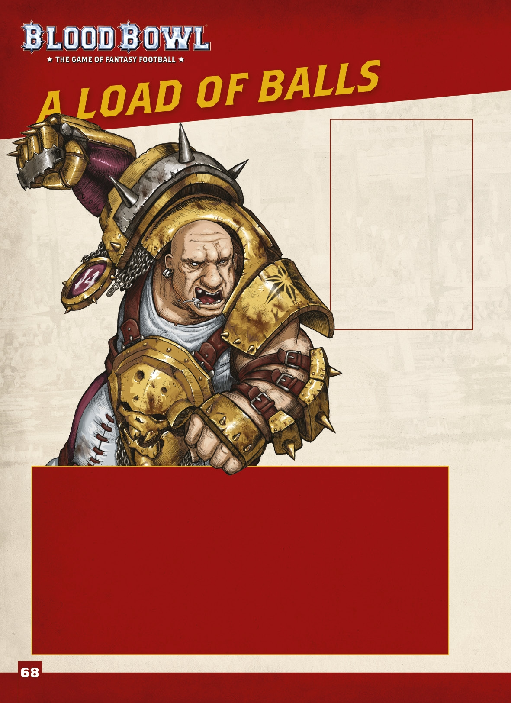
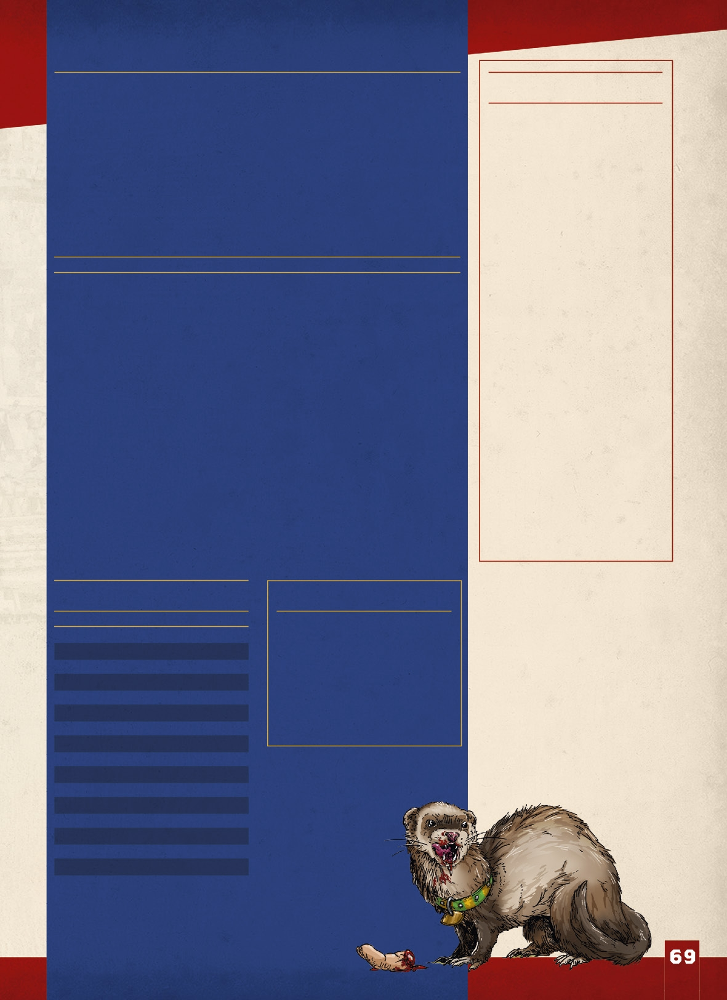
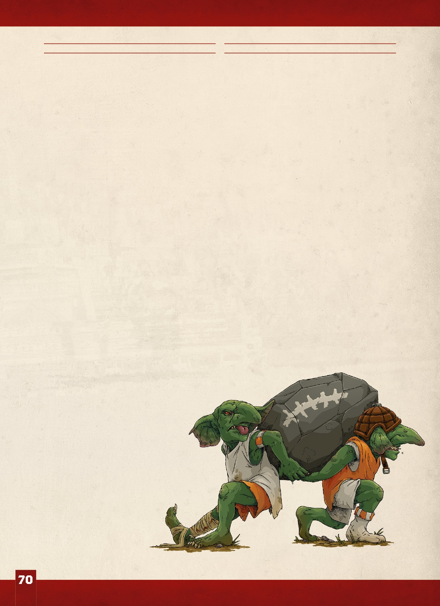
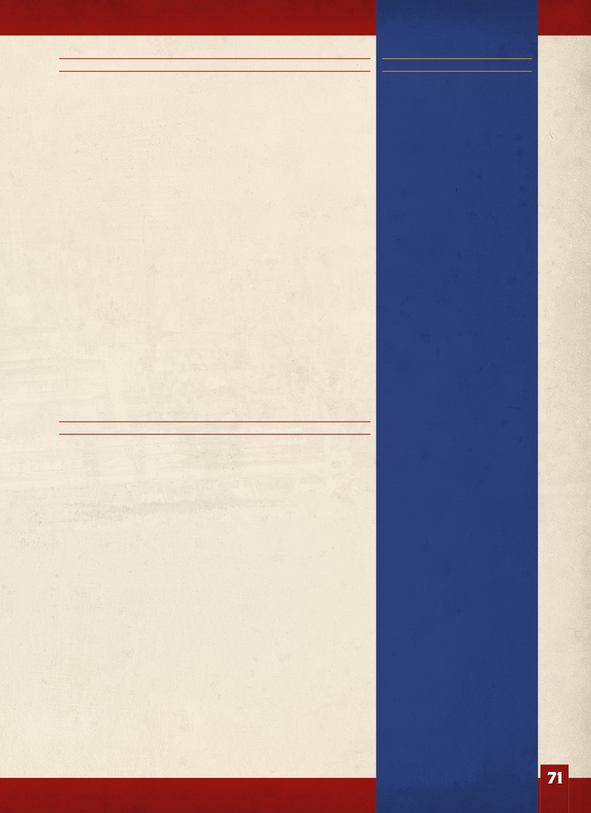
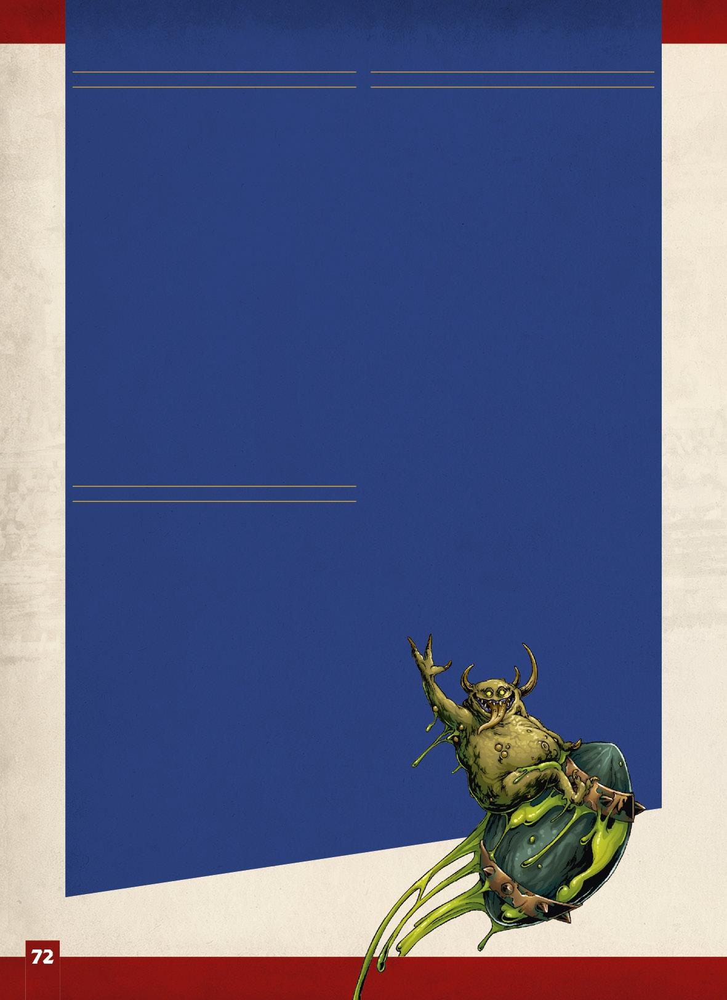
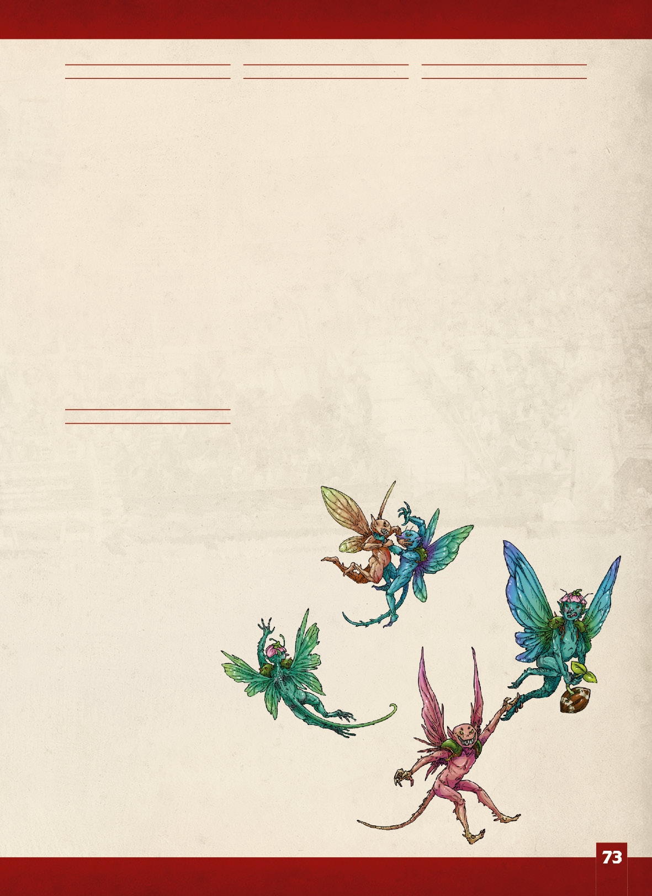
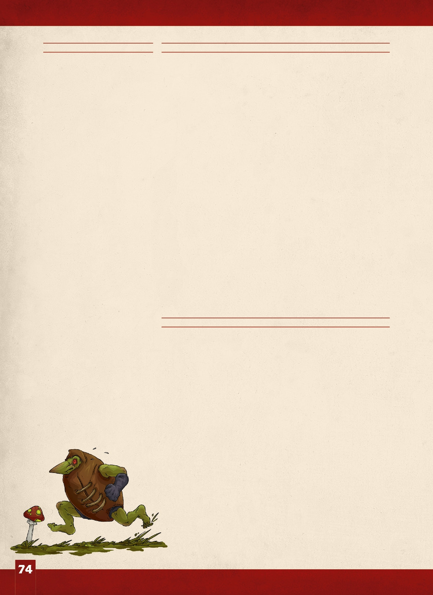
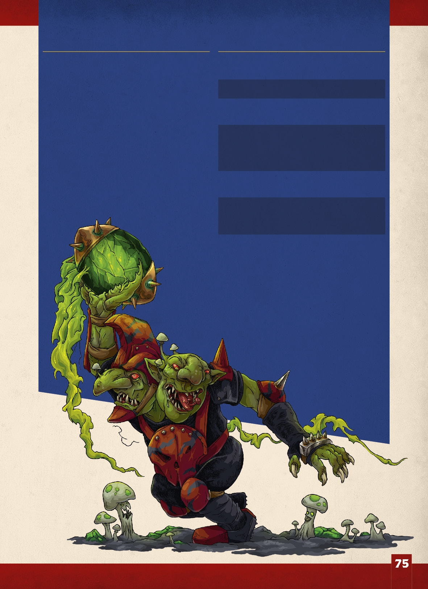

he sacred book of Nuffele
informs readers that to make a football,
a pig's

bladder should be carefully removed from the owning pig
and inflatted. In the earliest days
of the modern game, this advice was followed closely, but it quickly
became apparent that no matter how careful one attempts to be, the pig
in question will always object. What's more, once the pig has raised
an objection,
it rapidly becomes extremely uncooperative! Reasoning that there was
probably a better way, the nascent NAF began to fiddlee with the
design of its balls.

ne early innovation was shelved at an early stage. The story goes that
Roze-El was presented with a spherical ball by a young research
acolyte by the name of Sochere. Supposedly, the Sochere ball was
easier to handle
and not given to such erratic bouncing, meaning it could be kicked
with more precision and passed from player

to player with greater ease. Roze-El quickly dismissed the notion,
stating that, as far as he was concerned, all balls are ovoid, that
spherical balls felt wrong and that no one would want to handle one,
whereas ovoid balls were easy to carry. No one wanted the game to
become one of kick-ball, the objective was to pick up, carry and pass
the ball! Since that time, the design of a Blood Bowl ball has been
greatly refinedd and standardised by both the NAF and the RARG. Today,
players the world over can be assured that, when they grab a ball, it
will be reassuringly ovoid.

Modern balls tend to follow the same basic construction; an inflaated
bladder (often synthetic) is encased in a stitched leather shell. This
structure is, in turn, supported and strengthened by bands of metal,
onto which are affixxed

sharp, inch-long spikes, the better to help with grip in the wet and
to encourage bloodshed in the scrum.

Yet, in spite of standardisation by the sport's governing bodies,
there still exist a great variety of balls in the world. Most races
have their own preferences and prejudices when it comes to balls and,
consequently, there are more types

of ball in common use than one might think.

**UNUSUAL BLOOD BOWL BALLS**

rom live squigs, full of teeth and an unwillingness to play ball, to
icons
devoted to the Dark Gods, steeped in their fell power and utterly
deadly to the touch, there is no limit to the things that have made
their way onto the Blood

Bowl pitch in place of a regulation ball. Sometimes, these ball-shaped
objects are pressed into service out of necessity. At other times,
they are used to deliberately gain an unfair advantage.

Coaches may wish to use the rules for unusual balls detailed on the
following
pages. The inclusion of these rules in a
league or tournament is at the discretion of

the league commissioner or tournament organiser. Otherwise, coaches
who wish to use these rules for an exhibition game should decide this
between themselves.

USING UNUSUAL BALLS
Once per game, after Step 1 but before Step 2 of the Start of Drive
sequence when they are the kicking team, the coach can declare that
they will use an unusual ball. There are two ways in which the
attributes of the unusual ball can be determined:

1. Roll a D16 on the Unusual Ball Attributes table.
2. Select a single attribute from the Unusual Ball Attributes table.

During Step 2 of the Start of Drive sequence, the coach must nominate
one player from their team to be the kicking player. If the roll on
the Kick-off table is a

double, the ref calls the kicking player out for their flaagrant rules
violation and they are immediately Sent-off as though they had
committed a Foul (before resolving the Kick-off result). Note that
even if the player is Sent-off, the special ball remains in play for
this drive!

For the duration of the drive, the rules for the unusual ball in use
apply.
Aside from these rules, an unusual ball still counts as a normal ball
in all respects.

At the end of the drive, the unusual ball is removed by the referee
and replaced with a normal ball during the next Start of Drive
sequence.

UNUSUAL BALL

DESIGNER'S NOTE -- A BALL F0R EVERY RACE
Astute readers will notice that
many of the balls described here
tie in with the balls that come with certain teams, but that not all
are covered. In truth, the various balls that come with the different
teams fall into several broad types. This list is designed to cover all
of those types in broad terms rather than every single ball, and even
offers a couple of alternative uses
for balls of a similar type. For example, both the Limpin' Squig (from
the Orc team) and the Greedy Nurgling (from the Nurgle team)
are examples of a 'creature'. But
so too is the Snotling Ball-suit, the Spiteful Sprite Ball and the
Skeletal Ball (from the Shambling Undead team). Should you wish, these
rules and these models are fully interchangeable, it is simply more fun
when naming a rule and writing the description to focus upon one
specificc ball, so that's what we've done! The intention of these rules
is to provide fun ways to use all of the different balls that come with
the various Blood Bowl teams.

ATTRIBUTES TABLE

D16 ATTRIBUTE 1 Explodin' Ball

2 Daemonic Ball

3 Stacked Lunch Ball
4 Draconic Egg

5 Spiteful Sprite Ball
6 Master-hewn Ball
7 Extra Spiky Ball
8 Greedy Nurgling Ball
9 Ball of Dark Majesty
10 Shady Special Ball
11 Soulstone Ball

12 Frozen Ball

13 Sacred Egg Ball
14 Snotling Ball-suit
15 Limpin' Squig Ball
16 Warpstone Brazier Ball

**MULTIPLE BALLS**
If a second ball ever comes into play for any reason (perhaps due to a
Special Play card, for example),
it is always a normal, regulation Blood Bowl ball. Things are quite mad
enough on the Blood Bowl pitch without multiple unusual balls in play!

\(1\) EXPL0DIN' BALL
*There's nothing subtle or clever about a ball stuffed with* *blasting
charges and gunpowder, but Blood Bowl players* *have never been noted
for their subtlety or cleverness.*

When the Explodin' Ball is placed, the coach of the kicking team
places a marker a spare ball is ideal on any space on their Score
tracker to represent the length of
the fuse. At the end of each team turn,
the coach of the kicking team rolls a D6:

* On a roll of 6, move the marker two spaces towards 0.
* On a roll of 2-5, move the marker one space towards 0.
* On a roll of 1, the fuse goes out, and the Explodin' Ball

is treated as a regular ball from now on however, the coach of the
kicking team may spend a team re-roll
to keep the fuse alight (the marker does not move
this turn).

If the marker moves onto the 0 space, it is removed and the ball
explodes! Should a drive end while the marker is still on the tracker,
it is removed with no effect.

When the ball explodes, roll a D6 for each player in an adjacent
square they are Knocked Down on a roll of 4+. If they are already
Prone or Stunned, make an

Armour roll for them as though they had been Knocked Down. In
addition, if a player was carrying the ball, they are Knocked Down
automatically. Note that an Explodin'

Ball will not prevent a touchdown being scored, but the roll should
still be made at the end of the turn to see whether the ball blows up
while the player is celebrating

After the ball has exploded, and if the drive is still going, a
replacement is thrown in by a sideline officiall.

Place a regular ball in the square where the Explodin' Ball was. The
replacement ball will scatter before landing.

\(2\) DAEMONIC BALL
*In ages past, mighty champions of Chaos would bind foul* *Daemons into
weapons of war, making hideous tools of* *destruction that would consume
the souls of the fallen.* *These days, the weapons may have changed, but
the* *horror of encountering a bound Daemon has not!*

Whenever a player attempts to pick up this ball, roll a D6:

* On a roll of 3+, the player attempts to pick up the

Daemonic Ball as normal.
* On a roll of 1 or 2, they recoil in horror and refuse to

even try. The ball will bounce once but no turnover
is caused. If the ball bounces into an occupied square, that player
will attempt to catch it as normal.

Additionally, when a player carrying the Daemonic
Ball ends their movement, and if no Pass action has yet

been made this team turn, roll a D6. On a roll of 1, the player must
attempt to pass the ball to another player on their team if possible or
to an empty square if no friendly players are in passing range.

Finally, whenever a Daemonic Ball comes to rest in
an unoccupied square, roll a D6. On a roll of 6, the ball

cracks, weakening the dark enchantment and allowing the bound Daemon to
break free. For the remainder of this drive treat the ball as a normal,
regulation Blood Bowl ball.

\(3\) STACKED LUNCH BALL
*A Halflinng's thoughts are never far away from food and they will
interrupt* *almost any activity for a snack, including mealtime!
Unfortunately, this* *obsession with food can lead to confusion on the
Blood Bowl pitch. All too* *often, the game ball is left in the dugout
when the player tasked with the* *kick-off forgets to put down
whatever they are eating and pick up the ball.*
*As a result, many games involving Halflinng teams have become
hard-fought* *battles for possession of a pie, a roast chicken, 12\"
sub or even a hot pasty.*
*It must be said that when the game ball
is edible, many players become a lot* *more possessive!*

Spiteful Sprite Ball

As every good chef knows, any food dropped on the floorr is fine
provided it's picked up quickly! This is generally known as the 'fivve
second rule' throughout the Old World. Consequently, there is an
additional +1 modifierr applied to any attempt made to pick up the
Stacked Lunch Ball.

Additionally, when any player on the kicking team performs a Block
action (on its own or as part of a Blitz action) and the target is in
possession of the Stacked Lunch Ball, the active player is considered
to have the Strip Ball skill.

Finally, should any player that is in possession of the Stacked Lunch
ball score a touchdown, immediately after the touchdown is scored roll
a D6:

* On a roll of 2+, a touchdown is scored as normal.
* On a roll of 1, the player is unable to contain their hunger and
treats

themselves to a mid-game snack. Unfortunately, such gluttony is
instantly rewarded by terrible stomach ache and the player must miss
the next drive (which serves them right for eating food that's been on
the floorr!).

\(4\) DRACONIC EGG
*The inhabitants of the Old World have a long tradition of breeding
many* *fabulous beasts. Where once such creatures were used to augment
armies*
*in times of war, today they are more commonly seen in the private
menageries* *of wealthy nobles and retired Blood Bowl stars. Upon
occasion, coaches* *looking for an advantage may procure the
ready-to-hatch egg of a mighty* *draconic beast to sneak onto the
pitch. Many an opposition player has lost*
*a finnger to a hatchling Hydra!*

At the start of any team turn in which a Draconic Egg Ball is on the
ground, it will bounce once as the young creature inside attempts to
hatch into the world. If the Draconic Egg Ball bounces into an
occupied square, the player must attempt to catch it. If the player
fails to catch it, or if the square is occupied by a Prone or Stunned
player, the ball will bounce again.

Finally, should any player that is in possession of the Draconic Egg
Ball score a touchdown, immediately after the touchdown is scored roll
a D6:

* On a roll of 2+, a touchdown is scored as normal.
* On a roll of 1, the player's enthusiastic spiking of the ball into
the End Zone

has broken the egg and the creature inside bursts forth and savages
them, causing the player to be immediately Knocked Down. When a player
is Knocked Down in this way, you may apply a +1 modifierr to either
the Armour roll or Injury roll. This modifierr may be applied after
the roll has been made.

\(5\) SPITEFUL SPRITE BALL *Athel Loren is a magical realm,*
*home to all manner of forest spirits.* *Some are ancient and powerful,*
*manifesting themselves as mighty* *Treemen or Treekin. Others are
young* *and mischievous creatures that revel* *in tormenting others.
Amongst the* *most troublesome are the diminutive* *Spites and Sprites;
small faery-like* *creatures that swarm and buzz in* *huge numbers
within the ancient* *forest. Often, such creatures are* *drawn to the
excitement of the Blood* *Bowl pitch, and sometimes become* *fixxated
upon the ball, somewhat* *hampering play!*

At the start of any turn in which a Spiteful Sprite Ball is on the
ground,
it will bounce one square in a random direction as the Sprite attempts
to make off with what it considers to be its new ball. If the Spiteful
Sprite Ball bounces into an occupied square, the player must attempt to
catch it but
will suffer an additional -1 modifierr
as the Sprite attempts to fight them off. If the player fails to catch
it,
or if the square is occupied by a
Prone or Stunned player, the ball will bounce again.

Additionally, when a player attempts to pick up the Spiteful

Sprite ball, the Sprite will attempt
to prevent them by scratching and biting. Apply an additional -1
modifierr to any attempt made to pick up the Spiteful Sprite ball.

Finally, should the ball leave the pitch for any reason, the Sprite will
escape with its prize. A replacement ball is used for the throw-in and
these rules cease to apply.

\(6\) MASTER-HEWN BALL
*What's wrong with a little ornamentation? Oh, it feels a* *little
weightier than normal, does it? That must be the* *gemstones! This
ball definittely isn't hewn from solid* *granite and encased in the
finest gromril. Not at all!*

Extra Spiky Ball

Every time the Master-hewn Ball deviates, it will move only D3 squares
in a direction determined by rolling a D8
and referring to the Random Direction
template, rather

than moving the usual D6 squares. Additionally, it does not scatter as
a result of a 'Changing Weather' result on the Kick-off Event table.

When passing the Master-hewn Ball, Long bombs cannot be attempted, and
the Hail Mary skill cannot be

used. Should a player fail an attempt to catch the Master- hewn Ball
following a Pass action (including attempting
to catch a successful Interception), roll a D6 after the
ball has bounced. If the roll is equal to or higher than the player's
ST characteristic, or is a natural 6, the player is Knocked Down.

If after deviating or scattering the Master-hewn Ball lands in a
square that is occupied by a Prone or Stunned

player, an Armour roll is made against that player after the ball has
bounced.

\(7\) EXTRA SPIKY BALL
*It may be quite standard for Blood Bowl balls to have* *spikes, the
better to help with grip (and because it's funny* *watching a player
trying to throw a ball that's literally stuck* *to their palm), but
some teams take things to the extreme!* *It is not uncommon to see
spikes several inches longer* *than the regulations permit and far
sharper. Catching*
*such a thing is more a matter of luck than skill!*

When an Extra Spiky Ball lands in an unoccupied square, it will not
bounce.

Additionally, when a player rolls a natural 1 when attempting to catch
an Extra Spiky Ball (after re-rolls), make an unmodifiedd Armour roll
against that player:

* If the player\'s armour is not broken, they have caught

the ball safely.
* If the player\'s armour is broken, they have not caught

the ball well at all! The player becomes Prone and an Injury roll is
made against them. This Injury roll cannot be modifiedd in any way.

\(8\) GREEDY NURGLING BALL
*Wherever the devotees of Nurgle travel, they are followed* *by hordes
of precocious Nurglings. These diminutive* *Daemons are able to project
themselves into the*
*mortal realm in great numbers wherever the Plague* *Father's followers
tread. For the most part, they content* *themselves with cavorting on
the sidelines and in the* *dugouts, inspiring the players and
entertaining the fans.* *Occasionally, however, one of them will mistake
the ball* *for something edible!*

Whenever a player attempts to pick up this ball, roll a D6:

* On a roll of 3+, the player attempts to pick up the

Greedy Nurgling Ball as normal.
* On a roll of 1 or 2, they recoil in horror and refuse to

even try. The ball will bounce once but no turnover is caused. If the
ball bounces into an occupied square, that player will attempt to
catch it as normal.

At the start of any turn in which a Greedy Nurgling
Ball is on the ground, it will bounce one square in a random direction
as the Nurgling attempts to get away
from the action. If the Greedy Nurgling Ball bounces into
an occupied square, the player must attempt to catch it
but will suffer an additional -1 modifierr as the Nurgling attempts to
fight them off. If the player fails to catch it, or
if the square is occupied by a Prone or Stunned player, the ball will
bounce again.

Finally, should any player begin their activation in possession of this
ball, roll a D6. On a roll of 1 the Nurgling's enthusiastic struggles
prove too distracting and the player must reduce their MA by 1 for the
duration of this team turn as they squabble with an overfed Nurgling.

\(9\) BALL OF DARK MAJESTY *Chaotic teams will often use artefacts*
*of power and icons of the Chaos*
*gods as balls. Infused with baleful* *energies, such balls are
hideous to* *behold and all but those with the* *strongest of wills
can find themselves* *transfixxed by a dark influencce, losing*
*their free will and succumbing to that*
*of the will of the Chaos gods..*

Any player in possession of
the Ball of Dark Majesty gains the

Really Stupid trait. If they already have the Really Stupid trait,
they are unaffected by the influencce of the Dark Gods.

Note that as soon as a player that gained the Really Stupid trait as a
result of being in possession of the Ball of Dark Majesty loses
possession of the ball, for any reason, they lose the Really Stupid
trait.

\(10\) SHADY SPECIAL BALL *The art of carefully deflaating a ball*
*by just the right amount to not get in*

*trouble for cheating was pioneered by* *devious Goblin kicker, Grom
Shady.*
*It has become a common tactic for* *those who think subtle cheating
is* *okay, especially when facing show-* *offs who love the passing
game.*

When a player attempts to pass
a Shady Special Ball, apply an additional -2 modifierr to the Passing
Ability test.

In addition, as there is very little chance of a referee proving that
the sabotage was deliberate
(and not the result of shoddy ball care), the kicker is not Sent-off
for employing a Shady Special should a double be rolled when rolling
on the Kick-off Event table.

\(11\) S0ULSTONE BALL
*This glittering example of Elven ball-* *craft is studded with magical
gems* *capable of entrapping the souls*
*of dead Elves so that they might* *continue to affect the game even*
*after their death. A player carrying a* *ball that has yet to be
invested in this* *manner takes on the fearful aspect of* *an avenging
reaper of souls!*

When a player picks up or catches the Soulstone Ball, or starts their
activation in possession of it, their coach can choose a Skill
belonging
to a player that is currently in their team's Casualty box the player in
possession of the ball immediately gains that Skill until the end of
this team turn or until they are no longer
in possession of the ball. Mutation skills and traits may not be chosen.

If there are no players currently in their team's Casualty box, the
player cannot gain a Skill and instead gains the Foul Appearance skill.

\(12\) FR0ZEN BALL
*Ice is a common commodity in many* *parts of the Old World (it is right
up* *there with rain in terms of popularity).* *Indeed, parts of the
world are buried* *under glacial ice many thousands*
*of years old. The ice mined from the* *heart of such glaciers is so
cold that,* *according to legend, it will never melt!* *This isn't true,
but it is very durable* *stuff. Ancient ice mined from the*
*heart of glaciers is a popular material* *for ball construction, but it
is not* *without its risks to use, as prolonged* *exposure can render
the fleesh*
*utterly numb!*

If at the start of either team's turn the Frozen Ball is in the
possession of a player, that player's coach must roll
a D6. On a roll of 1, the icy cold touch of the ball has deadened the
player's finngers (or tentacles, or whatever

the case may be) and they are no longer able to grip the ball. The ball
is dropped and will bounce. This does not cause a Turnover.

\(13\) SACRED EGG BALL *Millennia ago, a new god arose in*
*the pantheon of Lustria: Sotek the* *Serpent. His arrival came as
quite a* *surprise to the Slann Mage-priests,* *putting something of a
dent in their* *pride as they had previously believed* *themselves to
be quite well-informed*
*about the identity of the world's*
*various deities. Sotek's birth was* *heralded by the appearance of a*
*twin-tailed comet in the heavens, and* *his presence proved most
invigorating* *to the denizens of Lustria. Today,*
*many consider snakes to be holy* *messengers of Sotek, and it is not*
*uncommon for snake eggs to be used* *as balls in the hope of
attracting* *Sotek's blessing.*

If, at the start of any of the receiving team's turns, the Sacred

Egg Ball is in the possession of a player that belongs to the
receiving team, the coach of the receiving
team must roll a D6. On a roll of 1,
the player suddenly and unwantedly findss themselves the focus of
Sotek's divine attention. The strange sensation of being engulfed
within
the coils of a gigantic, constricting serpent becomes quite unbearable
and the player becomes overwhelmed by a desperate urge to be rid of
the ball before they are crushed
and consumed by the spirit of
mighty Sotek. The ball is dropped immediately, causing it to bounce.
Note that this does not cause a Turnover. Once the ball has come
to rest, the receiving team's
turn continues.

\(14\) SNOTLING BALL-SUIT
*Stuffinng a Snotling into a crude approximation of a ball and
instructing them to* *run for the other end zone is one of the most
ludicrous (and entertaining) ways* *in which a team can cheat. It's also
surprisingly common!*

During each of their team turns, the coach of the kicking team can
activate the ball to perform a Move action as if it were a player on
their team! If, when activated, the ball is in the possession of a
player on the receiving team, it must first try to escape. The coach of
the receiving team makes an Agility test for the player in possession of
the ball, applying a +1 modifierr. If this test is passed, they keep
possession of the ball, and it cannot perform an action this turn.
Otherwise, it bounces once, using up one square of its MA, and can then
carry on moving.

The ball has an MA equal to the roll of a D3 (rolled each time the ball
is activated) and it can never Rush. For each square the ball moves, the
coach

of the kicking team places the Throw-in template over it, facing towards
either End Zone or either Sideline as they wish. Then they roll a D6 and
move the ball one square in the indicated direction; the ball
automatically passes any
Agility tests it may be required to make in order to Dodge, regardless
of
any modifierrs. Repeat this process for each and every square the ball
moves. If this movement takes the ball off the pitch, it is thrown back
on as normal and its move ends.

If the ball moves into a square that is occupied by a standing player,
that player must attempt to catch it, as though it were a bouncing ball.

It should go without saying, but here it is a Snotling Ball-suit cannot
score a touchdown by itself, it must be in the possession of a player!

\(15\) LIMPIN' SQUIG BALL
*Squigs seem to enjoy Blood Bowl. Or so people say, in truth it's very
hard to tell* *what squigs enjoy! They have long been used as balls in
the Orc leagues, but* *that in itself isn't evidence of enjoyment of the
game. A recent innovation is to* *tie one of their legs behind their
back to stop them running away so easily, but* *this just makes them
more bitey!*

At the start of each team's turn, the Limpin' Squig Ball will make a
break for freedom. If the ball is in the possession of a player, roll a
D6:

* On a roll of 2+, the player proves quite an adept squig handler and
keeps a

tight hold on the beast.
* On a roll of 1, the squig breaks free and bounces once. Note that this
does

not cause a Turnover.

If the Limpin' Squig Ball is not in the possession of a player at the
start of a team turn, it will try to hop away, bouncing D3 times. If it
bounces into a square occupied by a Standing player that has not lost
their Tackle Zone and they fail

to catch it, it bounces normally, disregarding the D3 roll.

Additionally, should any player score a touchdown with the Limpin' Squig
Ball, roll a D6. On a roll of 1, the squig sinks its yellowed fangs into
the player's

hand. For the remainder of this game, the player that scored the
touchdown must reduce their Agility characteristic by 1.

\(16\) WARPSTONE BRAZIER BALL
*Filled with chunks of raw, steaming warpstone, there's*
*no way this 'ball' could be mistaken for one that meets*
*regulations. But make no mistake, when the Skaven*
*cheat, they don't muck about. Deflaated balls and biting* *beasties
are amateur stuff - what you really want is a ball* *that will turn
anyone daft enough to touch it into a writhing* *mass of tentacles.
That'll stop 'em touching it!*

Whenever a player rolls a natural 1 when attempting
to pick up, catch or intercept a Warpstone Brazier Ball (after
re-rolls), the player findss their physical form temporarily warped!
Roll a D6 on the table opposite to see what happens if a player is
granted a Skill or Trait they already have, this roll has no
additional effect. The effects of the Warpstone Brazier Ball last
until the end of the
drive, or until the player is (un)lucky enough to roll again
on the table opposite:

D6 EFFECT

1 *Spontaneous Combustion:* The player is immediately Knocked Down.
You may modify

either the Armour roll or Injury roll by +1.
2 *Temporal Instability:* The player moves out of

phase with reality, gaining the No Hands trait.
3 *Shrunken Head:* The only thing worse than a

tiny head is the realisation that your helmet no longer fitts. The
player gains the Bone Head trait.

4 *Massively 0bese:* The player expands in
size until they are a hulking mass of fleesh.
The player's MA is reduced by 1, to a minimum

of 1, and their AV is improved by 1, to a maximum of 11+.

5 *Leprous Flesh:* Skin and fleesh hang from
the player in sickening folds. The player gains

the Foul Appearance skill.
6 *Thorny Carapace:* The player's body sprouts

a thick, spiked shell. The player gains the Iron Hard Skin skill and
their AV is improved by 1,
to a maximum of 11+.
