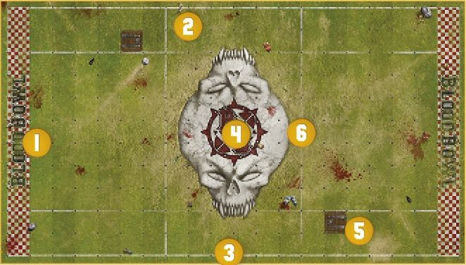
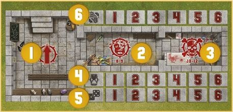

Welcome to Blood Bowl Sevens, the fast and furious game of fantasy football. Blood Bowl is, by its very nature, a game that can take a couple of hours or more to play. For many coaches, real-world commitments, such as work and family, can mean that findinng time for a full-length game can be diffcicult, and taking part in a league almost impossible. Blood Bowl Sevens addresses this by allowing coaches to play with smaller teams and reducing the number of turns, creating a version of the game that can be played in under an hour.

What's more, this simplifiedd version of the game is ideal for younger players, many of whom wish to play and want to learn the rules, but often find the complexity of Blood Bowl daunting. Blood Bowl Sevens, with its simplifiedd format and smaller teams, allows younger coaches to master the game without being overwhelmed by the rules.

### Sevens Pitch

Blood Bowl Sevens pitch shares many similarities with a standard Blood Bowl pitch, but there are a few key differences to be aware of. A Blood Bowl Sevens pitch features:

1. Two End Zones, one at each short end of the pitch.
2. Two Wide Zones, one at each side of the pitch, running from End Zone to End Zone.
3. Two Sidelines, running the length of the pitch, from one End Zone to the other.
4. The Centre Field, the area between each Wide Zone, running the length of the pitch from End Zone to End Zone.
5. There are two trapdoors on the pitch, one in each half, both positioned within a Wide Zone.
6. The pitch is then further split along its length into three thirds by two Lines of Scrimmage, each marking the point at which one of the teams will line up for the kick-off!

Finally, the board itself is split into a grid of squares; seven squares from each Line of Scrimmage to each End Zone and six squares between each Line of Scrimmage, making the pitch 20 squares long in total, and 11 squares wide; two squares in each Wide Zone, seven squares across the Centre Field.

### DUGOUTS

As with normal Blood Bowl, each team in a Blood Bowl Sevens game has its own dugout, a safe haven at pitch side where reserves can warm up, where the injured can be tended to and where important game information is tracked. The dugouts used for Blood Bowl Sevens are almost identical to normal dugouts, as described in the *Blood Bowl* rulebook, except for one important difference; on a Blood Bowl Sevens dugout, the turn and team re-roll trackers only go up to six, rather than the usual eight. This is because there are only six turns per half in a Blood Bowl Sevens game.

1. The Reserves box.
2. The Knocked-out box.
3. The Casualty box.
4. Turn trackers.
5. Team re-roll trackers.
6. The Score tracker.

## DRAFTING A BLOOD BOWL SEVENS TEAM

Blood Bowl Sevens teams are drafted just like other Blood Bowl teams, using the same team rosters. However, there are a few key differences to be aware of:

### Team Draft Budget

The Team Draft Budget is the amount of gold pieces you have to spend on
your rookie team:

* When drafting a Blood Bowl Sevens team for league play, you have a budget of 600,000 gold pieces to spend on players, Sideline Staff, team re-rolls and so forth.

#### HIRING PLAYERS

Players are the only compulsory element on any Blood Bowl Sevens team. Each team roster details all of the players available to a team of that type and their Hiring Fee. When drafting a team for Blood Bowl Sevens, you should select the players you want to permanently hire for your team, pay their hiring cost from your Team Draft Budget and make a record of the player on the Team Draft list.

#### NUMBER OF PLAYERS

The first and most important thing to be aware of when drafting a Blood Bowl team is the minimum and maximum number of players permitted:

* Every Blood Bowl Sevens team must contain a minimum of seven (7) permanently hired players when it is first drafted.
* No Blood Bowl Sevens team can ever contain more than eleven (11) permanently hired players.

***JOURNEYMEN:*** As with any Blood Bowl team, during the course of a league season, the number of players a team can field may fall below seven due to injury and death. This is permitted and Blood Bowl Sevens teams may 'Recruit Journeymen' just like any other team. However, the quality of Journeymen available is likely to be lower than usual (such reserves are normally found in the local pub, after all):

* A Journeyman on a Blood Bowl Sevens team replaces the Loner (4+) trait with the Loner (5+) trait.

#### PLAYER POSITIONS

There are distinctions to be made between the players within a team, separating them by their role within the game, from the humble Lineman to the more specialised roles performed by the 'positional' players.

***LINEMEN:*** The backbone of any team:

* All teams will have a player type that they are permitted to take 0-12 or 0-16 of. Regardless of name (for many races call their Linemen by another name), this Player type is the team's 'Lineman' positional.

***OTHER POSITIONS AND BIG GUYS:*** Unlike a normal team, a team drafted for Blood Bowl Sevens cannot simply recruit as many players of other types as the coach wishes. Blood Bowl Sevens teams represent amateur sides, so specialist players, such as Blitzers, Throwers and so forth, are quite uncommon:

* A Blood Bowl Sevens team may include a maximum of four (4) players that are not Linemen.
* A Blood Bowl Sevens team may not include more players of a certain type than are allowed by the team roster. For example, an Elven Union team is allowed 0-2 Blitzers, meaning a Blood Bowls Sevens Elven Union team may include zero, one or two Blitzers, but may not include three.

### DESIGNER'S NOTE:* *CURRENCY CONVERSION

One important thing to remember about Blood Bowl Sevens is that it represents an amateur game. Neither the staff nor the players are professionals, and the sums of money thrown around aren't likely to be all that high!

With that in mind, we would suggest that, wherever possible, coaches use the term 'copper pieces' instead of 'gold pieces'. This has little to no bearing upon the game; a Human Lineman costs 50,000 'points', and how those points are named matters little. But for the purposes of Blood Bowl Sevens, referring to those points as 'copper pieces' rather than 'gold pieces' is far more characterful and, we have found, adds greatly to the fun!

### PURCHASING TEAM RE-ROLLS

Any team can purchase team re-rolls. These represent the time spent training and the team's ability to react in a split second to mistakes and turn them around. The cost refleccts the time and effort different teams must invest to achieve the same broad level of training:

* Every team may purchase 0-6 team re-rolls when it is first drafted.
* Blood Bowl Sevens teams represent amateur sides. As such the time spent training and the quality of training leaves much to be desired. A Blood Bowl Sevens team must pay double for each team re-roll it wishes to purchase. For example, if a regular team is able to purchase team re-rolls for 60,000 gold pieces, a Blood Bowl Sevens team of the same type must pay 120,000 gold pieces.
* Unlike ordinary Blood Bowl teams, a Blood Bowl Sevens team cannot purchase additional team re-rolls at a later date. Ongoing team training isn't a strength of such amateur teams!

### HIRING SIDELINE STAFF

Sideline Staff can be of as much if not more assistance to a Blood Bowl Sevens team as they can be to a regular Blood Bowl team. However, findinng professional and competent staff can be a challenge for an amateur team!

#### 0-3 ASSISTANT COACHES

Any Blood Bowl Sevens team can hire a number of assistant coaches:

* Every Blood Bowl Sevens team may hire assistant coaches when it is first drafted, for the cost of 20,000 gold pieces each, paid for from the Team Draft budget.
* Additional assistant coaches may be purchased at a later date for the cost of 20,000 gold pieces each.

#### 0-6 CHEERLEADERS

All Blood Bowl Sevens teams can hire a number of cheerleaders:

* Every Blood Bowl Sevens team may hire cheerleaders when it is first drafted, for the cost of 20,000 gold pieces each, paid for from the Team Draft budget.
* Additional cheerleaders may be purchased at a later date for the cost of 20,000 gold pieces each.

#### 0-1 APOTHECARY

Apothecaries work hard on the sidelines, patching up minor injuries and giving urgent care to more serious injuries before they can end a player's career:

* Not every Blood Bowl Sevens team can hire an apothecary. Whether a team can or cannot include an apothecary will be noted on the team roster.
* If a team can hire an apothecary, it may only ever have one on the roster.
* Teams that can hire an apothecary can do so when they are first drafted, or during the Hire and Fire step of the post-game sequence of any game for a cost of 80,000 gold pieces.

Teams able to hire an apothecary may Induce a number of additional Wandering Apothecaries for a single game during a league in the Hire Inducements step of the pre-game sequence.

#### DEDICATED FANS

Just like a regular Blood Bowl team, every Blood Bowl Sevens team is supported by a strong following of Dedicated Fans. In truth, this probably represents the players' ever-loving mums, or perhaps unwilling partners and spouses dragged along to show support!

When a team is drafted, it will have a Dedicated Fans characteristic of 1 recorded on the Team Draft list. Over the course of a league season, this characteristic will increase and decrease, though it will never fall below 1.

Additionally, when a team is drafted it can improve its Dedicated Fans characteristic by 1, up to a maximum of 6, at a cost of 20,000 gold pieces per improvement. For example, a team may improve its Dedicated Fans characteristic from 1 to 3 at a cost of 40,000 gold pieces from its Team Draft budget.

## PLAYING BLOOD BOWL SEVENS

Setting up and playing a game of Blood Bowl Sevens is just like setting up and playing a regular Blood Bowl game. Coaches should follow the normal sequences for the pre-game, the start of drive, the end of a drive and the post-game, as well as following all of the regular game rules, but with the following exceptions:

### INDUCEMENTS

Blood Bowl Sevens teams can purchase Inducements during Step 4 of the pre-game sequence just like a regular Blood Bowl team, and are awarded Petty Cash in the same way. However, due to the amateur nature of the competition, the list of Inducements available is somewhat shorter and some costs are slightly different:

* 0-2 Agency Cheerleaders 30,000 gold pieces
* 0-1 Part-Time Assistant Coaches 30,000 gold pieces
* 0-2 Bloodweiser Kegs 50,000 gold pieces each
* 0-5 Desperate Measures Inducements 50,000 gold pieces each
* 0-5 Special Play Inducements 100,000 gold pieces each
* 0-8 Extra Team Training 150,000 gold pieces each
* 0-3 Bribes 100,000 gold pieces each (50,000 gold pieces for teams with the 'Bribery and Corruption' special rule)
* 0-2 Wandering Apothecaries 100,000 gold pieces (not available to teams that cannot hire an apothecary)
* 0-1 Mortuary Assistant 100,000 gold pieces (only available to teams with the 'Sylvanian Spotlight' special rule)
* 0-1 Plague Doctor 100,000 gold pieces (only available to teams with the 'Favoured of Nurgle' special rule)
* 0-1 Halflinng Master Chef 300,000 gold pieces (100,000 gold pieces for teams with the 'Halflinng Thimble Cup' special rule)
* Unlimited Mercenary Players price varies (as described in the *Blood Bowl* rulebook)

Or:

* 0-3 Mercenary Players price varies (see page 41)

### THE PRAYERS TO NUFFLE TABLE

In Blood Bowl Sevens, players do not gain SPPs, meaning some of the results on the Prayers to Nuffle table that give benefitts in this regard are not suitable. Therefore, for Blood Bowl Sevens, coaches should use the following, shortened version of the Prayers to Nuffle table:

### BLOOD BOWL SEVENS PRAYERS TO NUFFLE TABLE

**D8 RESULT**

1. ***Treacherous Trapdoor:*** Until the end of this half, every time any player enters a Trapdoor square, roll a D6. On a roll of 1, the trapdoor falls open. The player is immediately removed from play. Treat them exactly as if they had been pushed into the crowd.
2. ***Friends with the Ref:*** Until the end of the next drive, you may treat a roll of 5 or 6 on the Argue the Call table as a *"Well, When You Put It Like That.."* result and a roll of 2-4 as an *"I Don't Care!"* result.
3. ***Stiletto:*** Randomly select one player on your team that is available to play during the next drive and that does not have the Loner (X+) trait. Until the end of the next drive, that player gains the Stab trait.
4. ***Iron Man:*** Choose one player on your team that is available to play during the next drive and that does not have the Loner (X+) trait. Until the end of this game, that player improves their AV by 1, to a maximum of 11+.
5. ***Knuckle Dusters:*** Choose one player on your team that is available to play during the next drive and that does not have the Loner (X+) trait. Until the end of the next drive, that player gains the Mighty Blow (+1) skill.
6. ***Bad Habits:*** Randomly select D3 opposition players that are available to play during the next drive and that do not have the Loner (X+) trait. Until the end of the next drive, those players gain the Loner (2+) trait.
7. ***Greasy Cleats:*** Randomly select one opposition player that is available to play during the next drive. That player has had their boots tampered with. Until the end of the next drive, their MA is reduced by 1.
8. ***Blessed Statue of Nuffle:*** Choose one player on your team that is available to play during the next drive and that does not have the Loner (X+) trait. Until the end of this game, that player gains the Pro skill.

## SET-UP

As with regular games of Blood Bowl, both coaches place all of their available players on the pitch. If there are more than seven players available, those not chosen to play the drive are placed in the Reserves box until the start of the next drive. A team may not set up more than seven players at the start of a drive.

The kicking team sets up first, followed by the receiving team, as follows:

* Both teams set up fully within the area between their own End Zone and their own Line of Scrimmage. Neither team may set up any players in the area between the two Lines of Scrimmage.
* Each team can set up a maximum of one player in each Wide Zone. In other words, each team can set up two players in Wide Zones, providing they are split equally with one player per Wide Zone.
* A team must set up a minimum of three players in squares within the Centre Field, directly adjacent to their Line of Scrimmage.

Note that should a team find itself reduced to only three players or fewer, it may concede without penalty before setting up, as described in the *Blood Bowl* rulebook. Should you wish to play on, the available players should be set up on the Line of Scrimmage, as described above.

### THE KICK-OFF EVENT

As with the Prayers to Nuffle table, the Kick-off Event table used for Blood Bowl Sevens differs slightly from the standard Kick-off Event table:

### BLOOD BOWL SEVENS KICK-OFF EVENT TABLE

**2D6 RESULT**

**2* **Get the Ref:*** Each team gains a free Bribe Inducement. This Inducement must be used before the end of the game or it is lost.

**3* **Time-out:*** If the kicking team's turn marker is on turn 4, 5 or 6 for the half, both coaches move their turn marker back one space. Otherwise, both coaches move their turn marker forward one space.

**4* **Solid Defence:*** D3+1 Open players on the kicking team may be removed and set up again in different locations, following all of the usual set-up rules.

**5* **High Kick:*** One Open player on the receiving team may be moved any number of squares, regardless of their MA, and placed in the same square the ball will land in.

**6* **Cheering Fans:*** Both coaches roll a D6 and add the number of cheerleaders on their Team Draft list. The coach with the highest total may immediately roll once on the Prayers to Nuffle table. In the case of a tie, neither coach rolls on the Prayers to Nuffle table. Note that if you roll a result that is currently in effect, you must re-roll it. However, if you roll a result that has been rolled previously but has since expired, there is no need to re-roll it.

**7* **Brilliant Coaching:*** Both coaches roll a D6 and add the number of assistant coaches on their Team Draft list. The coach with the highest total gains one extra team re-roll for the drive ahead. If this team re-roll is not used before the end of this drive, it is lost. In the case of a tie, neither coach gains an extra team re-roll.

**8* **Changing Weather:*** Make a new roll on the Weather table and apply that result. If the weather conditions are 'Perfect Conditions' as a result of this roll, the ball will scatter before landing.

**9* **Quick Snap:*** D3+1 Open players on the receiving team may immediately move one square in any direction.

**10* **Blitz:*** D3+1 Open players on the kicking team may immediately activate to perform a Move action. One may perform a Blitz action and one may perform a Throw Team-mate action. If a player Falls Over or is Knocked Down, no further players can be activated and the Blitz ends immediately.

**11* **Offciousus Ref:*** Both coaches roll a D6 and add their Fan Factor to the result. The coach that rolls the lowest randomly selects one of their players from among those on the pitch. In the case of a tie, both coaches randomly select a player. Roll a D6 for the selected player(s). On a roll of 2+, the player and the referee argue and come to blows. The player is Placed Prone and becomes Stunned. On a roll of 1 however, the player is immediately Sent-off.

**12* **Pitch Invasion:*** Both coaches roll a D6 and add their Fan Factor to the result. The coach that rolls the lowest randomly selects D3 of their players from among those on the pitch. In the case of a tie, both coaches randomly select D3 of their players from among those on the pitch. All of the randomly selected players are Placed Prone and become Stunned.

### THE INJURY TABLE

Rather than the standard Injury table, Blood Bowl Sevens uses the following Injury table. This is a simplifiedd version of the standard table that is both quick and easy to use:

### BLOOD BOWL SEVENS INJURY TABLE

**2D6 RESULT**

**2-7* **Stunned:*** The player immediately becomes Stunned, and is laid face-down on the pitch.

**8-9* **KO'd:*** The player is immediately removed from play and placed in the Knocked-out box of their team dugout. At the end of each drive, there is a chance any Knocked-out players will recover.

**10* **Badly Hurt:*** The player misses the rest of this game, but suffers no long term effect.

**11* **Seriously Hurt:*** The player misses the rest of this game, but will need more time to recuperate. In league play, the player is not available to play in the team's next game.

**12* **DEAD:*** This player is far too dead to play Blood Bowl! Dead players are dismissed from the team during Step 1 of the post-game sequence.

### STUNTY PLAYERS

Players with the Stunty trait are more prone to breaking when hit! If an Injury roll is ever made against a player with the Stunty trait during a Blood Bowl Sevens game, roll on this table instead:

### BLOOD BOWL SEVENS STUNTY INJURY TABLE

**2D6 RESULT**

**2-6* **Stunned:*** The player immediately becomes Stunned, and is laid face-down on the pitch.

**7-8* **KO'd:*** The player is immediately removed from play and placed in the Knocked-out box of their team dugout. At the end of each drive, there is a chance any Knocked-out players will recover.

**9-10* **Badly Hurt:*** The player misses the rest of this game, but suffers no long term effect.

**11* **Seriously Hurt:*** The player misses the rest of this game, but will need more time to recuperate. In league play, the player is not available to play in the team's next game.

**12* **DEAD:*** This player is far too dead to play Blood Bowl! Dead players are dismissed from the team during Step 1 of the post-game sequence.

### APOTHECARIES

During a Blood Bowl Sevens game, a team may use an apothecary to 'patch-up' any player (including Journeymen and Mercenaries) that has been removed from play after being Knocked Out or after suffering a Badly Hurt, Seriously Hurt or DEAD result on the Injury table.

#### PATCHING-UP KNOCKED-OUT PLAYERS

An apothecary can be used immediately when a player becomes Knocked-out:

* If the player was on the pitch when they were Knocked-out, they are not removed from play. Instead, they remain on the pitch and become Stunned.
* If the player was Knocked-out as a result of being pushed back into the crowd or landing in the crowd, place them directly into the Reserves box rather than the Knocked-out box.

#### PATCHING-UP CASUALTIES

An apothecary can be used when a player suffers a Badly Hurt, Seriously Hurt or DEAD result on the Injury table. Roll a D6:

* On a roll of 4+, the apothecary has been able to patch the player up and pump them full of painkillers. The player is removed from the Casualty box and placed in the Reserves box.
* On a roll of 1-3, the apothecary's vigorous efforts prove largely futile. The apothecary is unable to patch the player up the original Injury table result stands.

### PLAYER ADVANCEMENT

In Blood Bowl Sevens league play, players do not earn Star Player Points for their achievements. Instead, after every game, one player on your team will automatically gain a new randomly selected Primary or Secondary skill. There are two ways in which to determine the player and the type of Skill:

**1.** During Step 3 of the post-game sequence, a single player of your choice that played during this game and that did not suffer an Injury table result of 12, DEAD gains a randomly selected Primary skill.

Or:

**2.** During Step 3 of the post-game sequence, a single randomly selected player that played during this game and that did not suffer an Injury table result of 12, DEAD gains a randomly selected Secondary skill.

Note that, due to the amateur nature of the game, and the somewhat hit-and-miss team training provided, any additional Skills gained by a Blood Bowl Sevens player are always randomly selected. The coach of a Blood Bowl Sevens team has to work with what they are given and, all too often, their players will waste everyone's time perfecting a truly mind-boggling and often completely futile set of skills and specialisms.

### VALUE INCREASE

As players gain advancements, their value increases. To reflecct this,
whenever a player gains a new Skill, their Current Value must be
increased on the Team Draft list by the amount shown on the table below:

CURRENT VALUE INCREASE TABLE

| NEW SKILLS                        | FIRST NEW SKILL GAINED | EACH NEW SKILL GAINED AFTER THE FIRST |
| --------------------------------- | ---------------------- | ------------------------------------- |
| Randomly selected Primary skill   | +10,000 gp             | +20,000 gp                            |
| Randomly selected Secondary skill | +20,000 gp             | +30,000 gp                            |

### THE DRAFT
As players become more experienced, there is a chance they will be noticed by a professional team and be offered a chance to break into the big leagues. When this happens, there is little a coach can do as their best player is poached on the vague promise of a huge salary, all the beer they can drink and fame undreamed of. It is little wonder that not many players refuse such an offer.

During Step 1 of the post-game sequence, whilst deleting any DEAD players from your Team Draft list, roll a D6 for every player on your team that has gained one or more additional Skills:

* If the roll is higher than the number of additional Skills the player has gained, you have been lucky; no one else is interested in hiring them and they remain with your team.

* If the roll is equal to or lower than the number of additional Skills the player has gained, they have been lucky; the player receives an offer from a professional team and immediately quits to pursue their dreams.

#### 0-5 DESPERATE MEASURES
**50,000 GOLD PIECES, AVAILABLE TO ANY TEAM**
Desperate Measures are a new type of Inducement unique to Blood Bowl Sevens. They represent not only the dirty tricks amateur teams are capable of, but the lengths to which a coach, the players, the fans, and even friends and family will go to in order to gain an advantage.

For every Desperate Measure Inducement purchased, roll a D8 on the table below, re-rolling duplicate results, and make a note of the result. Each result can be used once per game as described below:

#### DESPERATE MEASURES TABLE

**D8 RESULT**

**1* **You Dope:*** One of your players has been experimenting with performance-enhancing potions. You may play this Desperate Measure during Step 1 of the first Start of Drive sequence of the game. Choose one player on your team. This player has either their Strength or their Agility improved by 1 for the duration of this game. However, when a drive in which this player took part ends, even if this player was not on the pitch at the end of the drive, roll a D6 for this player:

* On a roll of 3+, the player feels amazing!
* On a roll of 1 or 2, the player suffers a terrible allergic reaction and must miss the rest of the match.

**2* **Razzle-dazzle:*** One of your players has been practicing hard for the up-coming match. You may play this Desperate Measure when you activate a player. This player may perform two actions rather than the usual one.

**3* **Hangover:*** One player on the opposing team has been out celebrating the night before the match and turns up late. You may play this Desperate Measure before Step 1 of the first Start of Drive sequence of the game. Randomly select an opposing player. That player must miss the first drive of the game.

**4* **Grudge Match:*** Your team has a long-standing and violent rivalry with the opposition. You may use this Desperate Measure at the start of one of your team turns, before any player is activated. For the duration of this team turn, your team may commit any number of Fouls, rather than just one.

**5* **Set Piece:*** In preparation for the game, your team has been practicing some set piece plays. You may play this Desperate Measure when activating a player to perform a Pass action. The pass is automatically accurate and (unless the pass is intercepted) the ball is automatically caught.

**6* **Sports Espionage:*** You have hired a spy to steal your opponent's playbook in order to give your team the edge. You may play this Desperate Measure when your team suffers a Turnover. Using this Desperate Measure grants your team a free team re-roll.

**7* **Discarded Banana Skin:*** Someone has been snacking on an energy-boosting banana. You may play this Desperate Measure when an opposing player enters the Tackle Zone of one of your players. The opposing player immediately Falls Over.

**8* **Magic Scroll:*** A suspicious-looking man from a betting syndicate gives you a spell scroll prior to the game. You might be suspicious, but you'd be foolish not to read it aloud wouldn't you? Your team gains a single Hireling Sports Wizard Inducement for free (see the *Blood Bowl* rulebook).