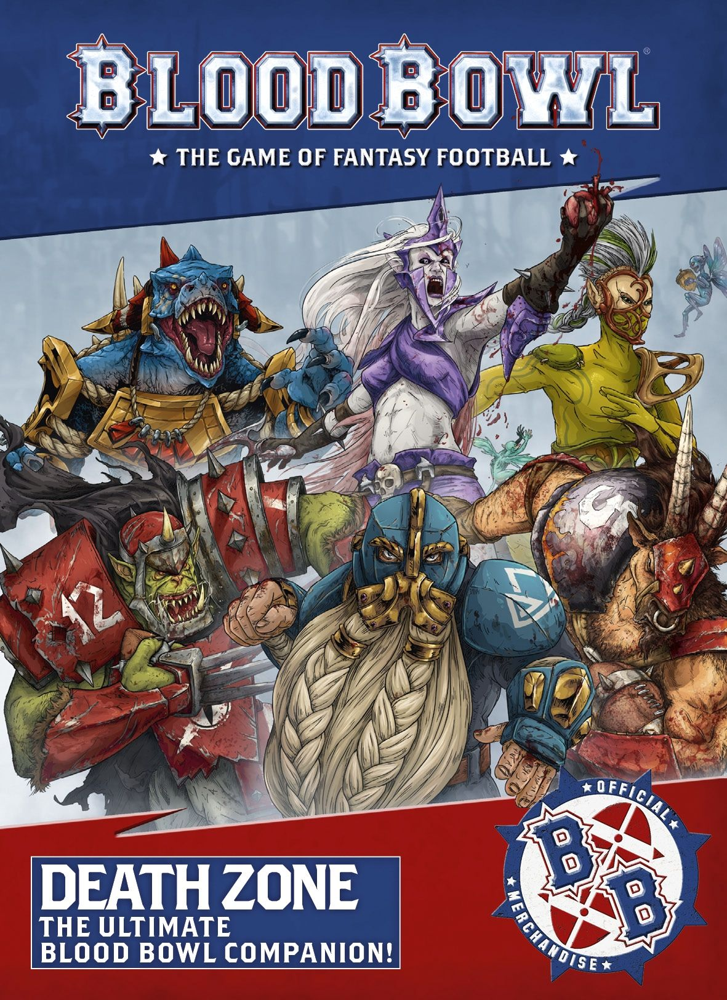
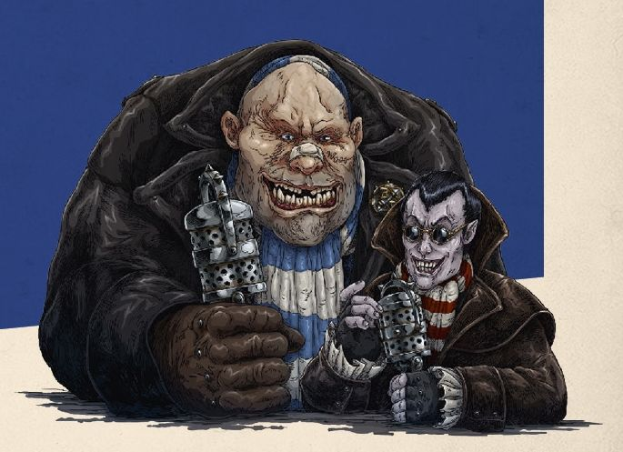

# GREETINGS SPORTS FANS!

* "Welcome back, one and all! I'm Bob Bifford, your host for another fun-filled afternoon of non-stop BloodBowl action! And I have to say, you're in for a real treat today; rarely have I seen a stadium so packed with fans. The stands are full and the crowds are overflowing onto the sidelines. There's a real party feeling in the air here today, isn't that right, Jim?"

* "That's right, Bob! Good afternoon viewers, I'm Jim Johnson, your co-host for another outstanding afternoon of entertainment on the pitch, and as my lovable colleague said; there's a real and tangible atmosphere of excitement here today! Why do you think that is, Bob?"

* "Well, Jim, it goes without saying that every game of Blood Bowl is a cause for celebration amongst the toiling masses, any chance to get out of the fields and away from the farms to enjoy some top-quality sports entertainment is a noteworthy event! But today sure feels special, like a carnival has come to town, in fact! If I had to hazard a guess, I'd say it has something to do with the unprecedented amount of sideline entertainment laid on by the stadium owners today!"

* "I think you might be right there, Bob, I've rarely seen a sideline so packed, and not just because there are so many fans gathering there! It's a real hive of activity out there today; sponsors' stalls, team mascots, and more sideline staff milling about than you could shake a temporary contract at!"

* "Indeed, Jim! And I must say, there's a lot of Wizards here today the Colleges of Magic have really turned out in numbers!"

* "They have, Bob, they sure have! And it's not just the Colleges, I can see more than a few Sorcerers, Shamans and even the odd Witch or two. There's going to be quite a lot of fireworks before the end of play today and no mistake!"

* "Let's hope so, Jim! It really is a treat to see so much excitement surrounding a game. Let's hope the weather holds out, eh Jim?"

* "Well, even if the weather does go strange on us, I don't think that'll prove a problem, not in this state of the art stadium! The new owners here have certainly spared no expense in revitalising this old place for a new generation of Blood Bowl fans!"

* "Absolutely, Jim. And what's more impressive is the investment in new players. I was here just last week, watching an amateur seven-a-side game, and that was quite the spectacle!"

* "It's superb to see such investment in the game, Bob. If my heart was still beating, it'd skip a beat!"

# Blood on the Pitch

Blood Bowl is a complex sport. A single game can last many hours, held up by numerous stoppages that interfere with the action for no discernable reason as players and officials alike argue about rules, fight on the sidelines, or simply demand a break for refreshments. In fact, it is not unknown for play to stop only to allow a spokesperson for a major sponsor to take to the pitch and address the crowd, telling them all about how wonderfully life-enriching their product is!

Indeed, many fans are drawn to the game not for the on-pitch action, which is often confusing to say the least (literally no one knows what 'illegal leverage' is, or why sending three players out for the coin toss is fine, but sending four means automatically losing the coin toss, unless of course one of them is 'inactive'... whatever that means!). At any given game, there are a large number of fans who attend purely to watch the endless antics on the sidelines. And this should come as no surprise; between the drama of watching the head coaches and team owners as they navigate the peaks and troughs of emotion as their team's fortunes soar and plummet, to the endless parade of performers employed to keep the fans from turning on one another when the game gets a bit boring, an afternoon of Blood Bowl is an endless feast for the senses.

This supplement focuses, for the most part, on the unsung stars of the sidelines. (In)Famous Coaching Staff are named characters who represent those experts that bring special skills to a team, whilst the various Wizards available represent the many magicians that regularly use their supernatural powers to beset rival teams. Whilst most of these will be representatives of the Colleges of Magic, others include Necromancers, Chaos Sorcerers and even Goblin Shamans. All of whom think nothing of breaking the rules regarding magical interference in exchange for some lovely gold! Biased Referees represent those most controversial of figures; the zebra-striped, fun- sponges that stop the players (and sometimes the fans) from doing whatever they want, whenever they want!

Stadium rules allow coaches to explore the many and varied sports arenas of the Old World. Along with Sponsors (both minor and major), coaches can, should they wish, explore the wonderful world of sports finance, renting or buying a stadium for their team, and securing sponsorship to pay the upkeep!

Add to this the hilarity that ensues when a non-standard ball is introduced into the action, or when the weather takes a turn for the extreme, and introduce some of the especially strange and chaotic match events that can unfold mid-game, and coaches will find this supplement adds no end of excitement to the proceedings!

On top of all this, coaches will find expanded rules for Mercenaries. These allow a coach to create the perfect hireling Mercenary to play for their team, a Star Player all of their own to bring some variety to their squad.

Finally, the rules for Blood Bowl Sevens allow coaches to explore the wonderful world of amateur sports. Played on a smaller pitch and with smaller teams, these rules modify Nuffle's great game, speeding up the action without losing any of the complexity coaches have come to know and love from Blood Bowl: the game of fantasy football!

