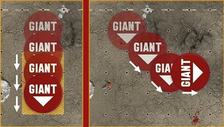
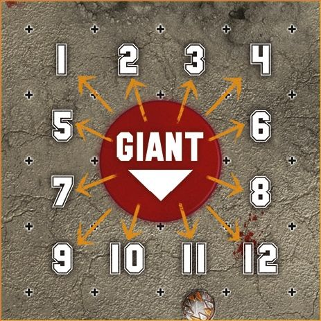

Long ago, in a time when war was preferred to Blood Bowl and wanton destruction on the battlefield occupied the hearts and minds of every mortal across the world, there lived a race known as the Sky-titans. As befitting of such a grandiose title, the Sky-titans lived atop the tallest peaks, building their halls and towering castles at the top of the world. Solitary beings, the Sky-titans would gather once a year to renew their kinship, throwing and catching boulders in a contest of athleticism that many believe was rooted in the worship of Nuffle!

## GIANT-SIZED INDUCEMENTS

The following pages contain rules for using Giant players in your games of Blood Bowl. Coaches should note that these rules are entirely optional.

Their inclusion in a league or tournament is at the discretion of the league commissioner or tournament organiser. Otherwise, coaches who wish to use these rules for an exhibition game should decide this between themselves.

### 0-1 GIANT MERCENARY PLAYER INDUCEMENT

**350,000 GOLD PIECES, AVAILABLE TO ANY TEAM**

Unlike regular players, Giants are not hired as permanent additions to a team. Instead, they are Induced during the pre-game sequence in exactly the same way as other Mercenary players. Giants may be used alongside the Mercenary Player Inducements in the *Blood Bowl* rulebook, or those presented previously in this supplement.

Giants have the following profile:

|       | MA | ST | AG | PA | AV  |
| ----- | -- | -- | -- | -- | --- |
| Giant | 6  | 7  | 5+ | 5+ | 11+ |

Skills & Traits: [Always Hungry], [Bone Head], [Break Tackle], [Juggernaut], [Loner] (4+), [Mighty Blow] (+2), [Multiple Block], [Stand Firm], [Throw Team-mate]

**SPECIAL RULES**

Giants are big. Bigger than Ogres, Minotaurs, Trolls or any of the other Big Guys that regularly take to the Blood Bowl pitch. A Giant is subject to the following special rules:

**BASE SIZE AND TACKLE ZONES**

Unlike other players, a Giant occupies not one but four squares on the pitch. A Giant will always occupy four squares; when they are standing up, when they are Prone and when they are Stunned.

Additionally, the direction in which a Giant faces is important as, due to their immense size, a Giant's Tackle Zone does not extend to every square adjacent to the four squares they occupy. Like other players, the Tackle Zone of a Giant covers eight squares; those to the Giant's front and sides. A Giant's Tackle Zone does not extend to the four squares directly behind the Giant, as shown in the diagram below. The controlling player must make it clear to their opponent which direction the Giant is facing and where its rear lies. Whenever a Giant finishes a Move action or follows up after a Block action, they may change their facing if they wish; though if done as part of following up after a Block action, they must still be Marking the player they made the Block action against if possible.

Finally, should any of the four squares occupied by a Giant's base be targeted by an in-game effect (such as a spell cast by a Wizard or by the effects of a Special Plays card), the player is considered to have been hit by the effect just as any other player would be.

**MOVEMENT**

When a Giant moves it does so just like any other player, moving a number of squares equal to its Movement Allowance. A Giant may move forward, backward, to either side, or diagonally, as long as they do not enter a square occupied by another standing player (from either team).

If any of the four squares a Giant occupies is within the Tackle Zone of an opposition player, the Giant is considered to be Marked by that player and must dodge to leave that square, just like any other player. If when dodging any part of a Giant's base moves into a square in which it is being Marked, apply a -1 modifier per player Marking them as normal.

***STEPPING OVER PRONE OR STUNNED PLAYERS:*** Unlike other players, a Giant is large enough to simply step over downed players that would block the path of other players. A Giant does not need to Jump Over a Prone or Stunned player; it may instead move freely over Prone or Stunned players if it has sufficient Movement Allowance to do so.

However, a Giant may not end its movement with any part of its base occupying a square that contains a Prone or Stunned player. Therefore, should a Giant Fall Over whilst stepping over a Prone or Stunned player, that player is pushed back one square in a direction chosen by the coach of the team the Giant belongs to, exactly as if a Push Back block dice result had been applied against them.

***SURROUNDED!:*** Coaches should note that, due to the large size of Giants, they may find it impossible to move through small gaps. If at any point during its movement a Giant finds one or more of the four squares its base occupies obstructed by a Standing player, it cannot move into that square.

**PUSH BACKS**

Just like any other player, a Giant must be pushed back into empty squares. If this is not possible, then the Giant is pushed into one or more occupied squares and any players that originally occupied the square or squares are chain-pushed in turn.

***PUSHED INTO THE CROWD:*** If any part of a Giant's base is pushed off the pitch, the player is pushed into the crowd and removed from play. In other words, it doesn't matter how big they are, a Giant cannot be half on and half off the pitch. They are either entirely on the pitch, or they are off it!

**THROWING OTHER PLAYERS**

Giants are particularly effective at throwing smaller players. When a Giant attempts to throw a team-mate, you may re-roll a Fumbled throw.

**A GIANT OBSTRUCTION**

Giants do tend to get in the way of other teams' passing plays. When a Giant interferes with a pass, it reduces any negative modifiers that would normally apply by 2.

**SCATTER**

As Giants occupy four squares rather than the usual one, the normal Random Direction template cannot be used for them. Instead, Giants use the Random Direction template shown below. To use this template, simply roll a D16 rather than a D8, re-rolling any rolls of 13 or above.

