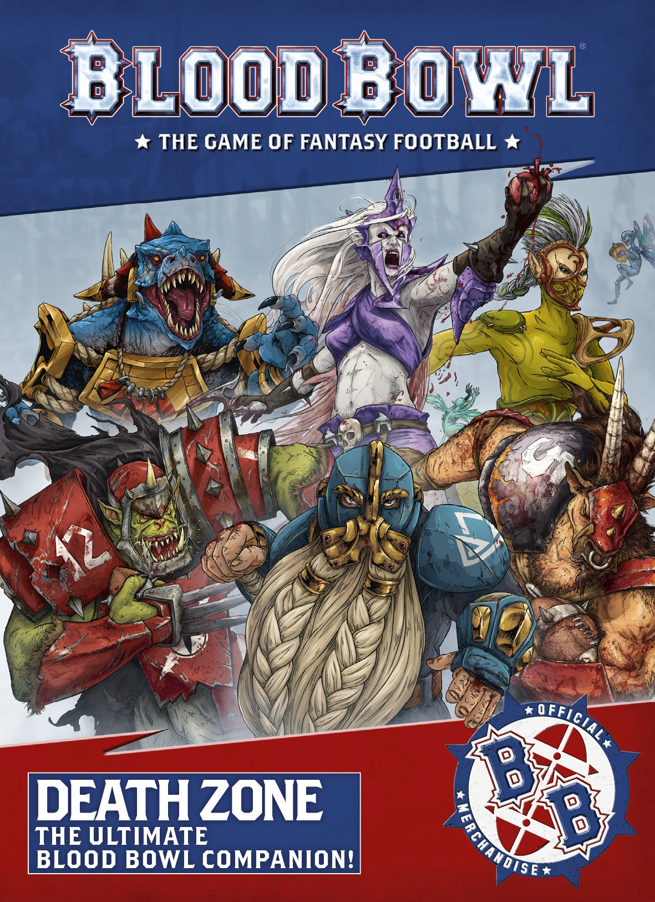

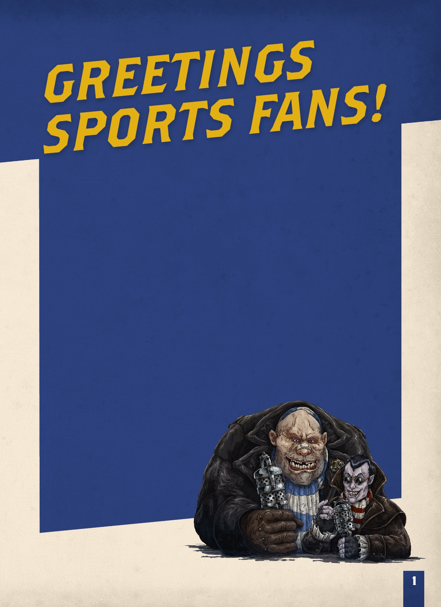

Welcome back,one and all! I'm Bob Biffoord,your hostfor
anotherfun-fillled afternoonof non-stopBloodBowl action!
>
And I have to say, you're in for a real treat today; rarely have I
seen a stadium so packed with fans. The stands are full and the crowds
are overfloowing onto the sidelines. There's a real party feeling in
the air here today, isn't that right, Jim?''
>
"That's right, Bob! Good afternoon viewers, I'm Jim Johnson, your
co-host for another outstanding afternoon
>
of entertainment on the pitch, and as my lovable colleague said;
there's a real and tangible atmosphere of excitement here today! Why
do you think that is, Bob?
>
"Well, Jim, it goes without saying that every game of
Blood Bowl is a cause for celebration amongst the
>
toiling masses, any chance to get out of the fieelds and away from the
farms to enjoy some top-quality sports entertainment is a noteworthy
event! But today sure feels special, like a carnival has come to town,
in fact! If I had
to hazard a guess, I'd say it has something to do with the
unprecedented amount of sideline entertainment laid on by the stadium
owners today!
>
"I think you might be right there, Bob, I've rarely seen a sideline so
packed, and not just because there are so many fans gathering there!
It's a real hive of activity out
>
there today; sponsors' stalls, team mascots, and more sideline staff
milling about than you could shake a temporary contract at!
>
"Indeed, Jim! And I must say, there's a lot of Wizards
>
here today the Colleges of Magic have really turned out in numbers!

"They have, Bob, they sure have! And it's not just the Colleges, I can
see more than a few Sorcerers, Shamans

and even the odd Witch or two. There's going to be
quite a lot of firreworks before the end of play today and no mistake!

"Let's hope so, Jim! It really is a treat to see so much excitement
surrounding a game. Let's hope the weather

holds out, eh Jim?

"Well, even if the weather does go strange on us, I don't think that'll
prove a problem, not in this state of the art stadium! The new owners
here have certainly spared no

expense in revitalising this old place for a new generation of Blood
Bowl fans!

"Absolutely, Jim. And what's more impressive is the investment in new
players. I was here just last week,

watching an amateur seven-a-side game, and that was quite the
spectacle!

"It's superb to see such investment in the game, Bob. If my

heart was still beating, it'd skip a beat!
>
Blood on the Pitch ...........................3
>
The World of Blood
Bowl.................4
>
New Inducements..........................14
>
(In)Famous Coaching Staff..............15 Kari
Coldsteel..............................15
>
Papa Skullbones.........................16
>
Galandril Silverwater..................17
>
Krot Shockwhisker......................18
>
Ayleen Andar...............................19
>
Professor Frdnkelheim ...............20
>
Mungo Spinecracker ..................20
>
Fink da Fixer................................21
>
Schielund Scharlitan ..................21
>
Wizards .............................................22
>
Wizard..........................................22
>
Chaos Sorcerer...........................23
>
Druchii Sports Sorceress ...........24 Asur High Mage
..........................25
>
Slann Mage-priest ......................26
>
Horticulturalist of Nurgle............27 Sports
Necrotheurge..................27
>
Wicked Witch ..............................28
>
Warlock Engineer........................29
>
Ogre Firebelly..............................30
>
Night Goblin Shaman.................31
>
Horatio X. Schottenheim............32 Biased
Referees...............................33
>
Ranulf 'Red' Hokuli.....................34
>
Thoron Korensson ......................34
>
Jorm the Ogre .............................35
>
The Trundlefoot Triplets..............35

Other Inducements ..........................36

Waaagh! Drummer .....................36
>
Cavorting Nurglings....................36
>
Dwarfen Runesmith....................37
>
Halflinng Hot Pot...........................37
>
Master of Ballistics.....................38
>
Bottles of Heady Brew................39
>
Team Mascot ..............................39
>
Medical Unguent ........................39
>
Side Bet.......................................39

Fabulous Freebooters....................40

Expanded Rules
for Mercenary Players......................41

Mercenary Player Inducements ......41

Titanic Efforrt..
The Biggest of the Big Guys..........52 Giant-sized
Inducements.................54

56 Major Sponsorships ...................58

Blood Bowl Stadia .........................60

Playing Away .....................................61

Random Stadia Table.................61
>
Unusual Playing Surface............62 Rough & Ready
Stadium............63 Luxury
Stadium...........................64
>
Local Crowd.................................65

Becoming Residents........................66

Residency Table..........................66

68 Unusual Blood Bowl Balls................69

Multiple Balls....................................69

Explodin' Ball....................................70

Daemonic Ball..................................70

Stacked Lunch Ball ..........................71

Draconic Egg ....................................71

Spiteful Sprite Ball............................71

Master-hewn Ball..............................72

Extra Spiky Ball.................................72

Greedy Nurgling Ball ........................72

Ball of Dark Majesty.........................73

Shady Special Ball............................73

Soulstone Ball ..................................73

Frozen Ball........................................73

Sacred Egg Ball................................74

Snotling Ball-suit ..............................74

Limpin' Squig Ball.............................74

Warpstone Brazier Ball ....................75

New Weather Tables......................76

Match Events .................................

Blood Bowl Sevens ........................90

The Blood Bowl Sevens Pitch ..........90 Drafting a Blood Bowl
Sevens Team ....................................91

Playing Blood Bowl Sevens..............93
Set-up................................................94

Blood Bowl Sevens
Kick-off Event Table..........................94

Blood Bowl Sevens Injury Table.......95 Player Advancement
........................96

© Copyright Games Workshop Limited 2021. Blood Bowl, Blood Bowl The
Game of Fantasy Football, Spike! The Fantasy Football Journal,
Citadel, Games Workshop, GW and all associated logos, names, races,
vehicles, weapons and characters are either
® or TM and/or © Games Workshop Limited. All Rights Reserved.
No part of this publication may be reproduced, stored in a retrieval
system, or transmitted in any form or by any means electronic,
mechanical, photocopying, recording or otherwise, without the prior
permission of the publishers.
This is a work of ficction. All the characters and events portrayed in
this book are ficctional,
and any resemblance to real people or incidents is purely
coincidental.
British Cataloguing-in-Publication Data. A catalogue record for this
book is available from the British Library.
>
ISBN: 978-1-83906-429-6
Games Workshop Web site:
[www.games-workshop.com](http://www.games-workshop.com)
Forge World Web site:
[www.forgeworld.co.uk](http://www.forgeworld.co.uk)

Blood on the Pitch

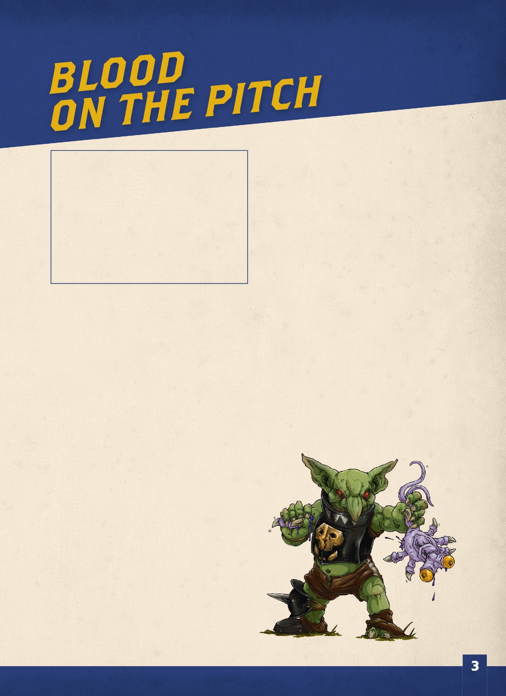

lood Bowl is a complex sport. A single game can last many hours, held
up by numerous stoppages that interfere with
>
the action for no discernable reason as players and offcialsls alike
argue about rules, fightt on
the sidelines, or simply demand a break for refreshments. In fact, it
is not unknown for play to stop only to allow a spokesperson for a
major sponsor to take to the pitch and address the crowd, telling them
all about how wonderfully life-enriching their product is!
>
ndeed, many fans are drawn to the game not for the on-pitch action,
which is often confusing to say the least (literally no one knows what
'illegal leverage' is,
>
or why sending three players out for the coin toss is finee, but
sending four means automatically losing the coin toss, unless of
course one of them is 'inactive'... whatever that means!). At any
given game, there are a large number
of fans who attend purely to watch the endless antics
on the sidelines. And this should come as no surprise; between the
drama of watching the head coaches and team owners as they navigate
the peaks and troughs of emotion as their team's fortunes soar and
plummet, to
the endless parade of performers employed to keep the fans from
turning on one another when the game gets a
bit boring, an afternoon of Blood Bowl is an endless feast for the
senses.
>
This supplement focuses, for the most part, on the unsung stars of the
sidelines. (In)Famous Coaching Staff
>
are named characters who represent those experts that bring special
skills to a team, whilst the various Wizards available represent the
many magicians that regularly
>
use their supernatural powers to beset rival teams.
Whilst most of these will be representatives of the Colleges of Magic,
others include Necromancers, Chaos Sorcerers and even Goblin Shamans.
All of whom think nothing
of breaking the rules regarding magical interference in exchange for
some lovely gold! Biased Referees represent those most controversial
of figurres; the zebra-striped, fun- sponges that stop the players
(and sometimes the fans) from doing whatever they want, whenever they
want!

Stadium rules allow coaches to explore the many and varied sports arenas
of the Old World. Along with Sponsors

(both minor and major), coaches can, should they wish, explore the
wonderful world of sports financce, renting or buying a stadium for
their team, and securing sponsorship to pay the upkeep!

Add to this the hilarity that ensues when a non-standard ball is
introduced into the action, or when the weather takes a turn for the
extreme, and introduce some of the especially strange and chaotic match
events that can unfold mid-game, and coaches will findd this supplement
adds no end of excitement to the proceedings!

On top of all this, coaches will findd expanded rules for Mercenaries.
These allow a coach to create the perfect hireling Mercenary to play for
their team, a Star Player all of their own to bring some variety to
their squad.

Finally, the rules for Blood Bowl Sevens allow coaches to explore the
wonderful world of amateur sports. Played on a smaller pitch and with
smaller teams, these rules modify Nufflee's great game, speeding up the
action without losing any of the complexity coaches have
come to know and love from Blood Bowl: the game of fantasy football!

The World of Blood Bowl

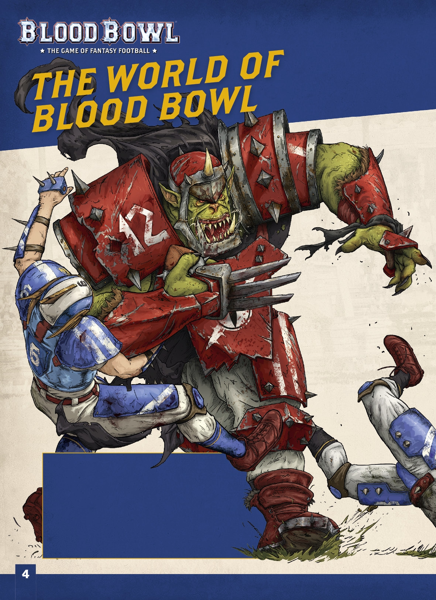

he world in which Blood Bowl is played is a wild and dangerous place -
let's face it, it has to be
if the people in it are going to play Blood Bowl for
>
fun! This world is divided into several large continents,
each of which is home to many differrent races, all of which play the
game of Blood Bowl to a greater or lesser extent. Across these
continents, and the nations into which each
is further subdivided, the game differrs hugely, the better to
reflecct the unique nature and characteristics of the varied peoples
and races of the world.
>
he majority of Blood Bowl these days is played
on a mammoth continent known to all as the Old World. In the Old World
of today, the game bears
>
little resemblance to the rules as they were firrst decreed
by the earliest disciples of Nufflee, the legendary Slann,
many millennia ago in the steaming jungles of Lustria, the primordial
home to the mythical Old Ones and the birthplace of civilisation.
>
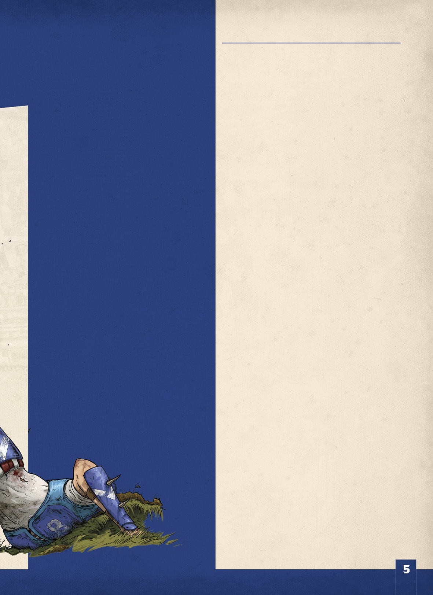In the Old World, the modern game can be
best described as the culmination of many decades of work by many
expert scholars and sports historians working tirelessly to unravel
the mysteries of an ancient tome written in a forgotten language, and
the scribblings of a very forgetful, half-blind Dwarf of great
vintage. It can also and perhaps more truthfully be described as a
game that has evolved thanks
to the endless input of those who play it. In the decades since the
sport's rediscovery, the rules of play have changed and evolved almost
beyond recognition from their original form,
the better to accommodate the many peculiarities that arise with
distressing regularity upon Nufflee's sacred turf and which the
original rules were incapable of confronting satisfactorily. Add to
this the tendency of the denizens of the Old World
and beyond to stretch the rules to breaking point in order to gain any
small advantage over their opponents, and it should come as no
surprise that the rules and regulations now cover, in the most
painstaking detail and often at considerable length, every imaginable
aspect of the game.
>
Yet one thing that still holds true, even after all these years, is
that the heart and soul of the game remains unchanged. In spite of the
many and varied evolutions
within the rules, and in spite of the constant upheavals and scandals
that have surrounded the sport's various governing bodies, one thing
that has remained constant is that the players and fans alike dearly
love Blood Bowl, and this love
is ultimately what inspires the many officialss tasked with the safe
keeping of this most sacred of pastimes. Certainly the game has grown,
changed and evolved within the Old World, but at its heart it remains
as it always was: a simple game played between two teams, opposed in
friendly competition but ultimately united in sportsmanship, won by
the side that can score the most touchdowns!

**THE 0LD W0RLD**

ife is often short and death is sudden and unexpected in the Old
World. Comparing the similarities between everyday life and Blood
Bowl, it is unsurprising then

that the game has proven so hugely and enduringly popular. Brought up
amidst dark forests full of horrible monsters
and the ever-present reality of plague and other incurable diseases, the
people of the Old World are natural Blood Bowl players; willing to risk
their all to win fabulous riches and fame in a world where their future
is never certain. Indeed, growing up in a vast and lawless land where a
simple trip
to the market can see a person waylaid by anything from itinerant
sellers of magical beans to roving bands of hungry Ogres, it is little
surprise that many youngsters dream of a career upon the fieeld of
sporting endeavour, where a sudden and violent death is, if anything,
less of a certainty!

The Old World itself is home to Men, Dwarfs, Elves and Halflinngs. These
civilised folks are numerous and powerful,

dwelling throughout the land and defended from the
dangers that surround them daily by large, well-fortifiedd
cities. And they need to be, for the high mountains and
deep forests that cover much of the continent are home
not only to wild and uncivilised monsters, but to hordes of more
intelligent creatures that, in ages past, have been a blight upon the
lands; unruly mobs of Orcs and Goblins have forever raided and invaded
the rich lands of civilised folk, whilst Necromancers with their dire
entourages have long waged war on the civilised nations of the Old
World. Even
from below the surface, where the Skaven scurry through
their labyrinthine domain, came the ever-present threat of invasion. In
less enlightened times, these denizens of the Under-Empire ever plotted
to bring about the downfall of Men, Dwarfs and Elves.

Considering the vast number of races and their long
history of mutually despising each other, it is hardly surprising

that wars between the different races were once considered the norm in
the Old World. Rebellions and uprisings often overran nations and
plunged them into civil war, while ancient feuds and bitter hatreds were
commonplace. Since the rediscovery of Blood Bowl, and the re-emergence
of Nufflee
as one of the dominant deities within the pantheon of gods worshipped
around the world, an uneasy peace has reigned across the Old World.
Weapons have been set aside and
races that were once enemies have come to live side-by-
side in an uneasy truce, embracing Nufflee's great game and choosing to
act peacefully, settling their differences upon
the pitch rather than the battlefieeld, and replacing violent skirmishes
along the borders of their nations with good humoured punch-ups and
friendly rivalry in the terraces on game day!

THE REALMS 0F MEN
Human players are widely considered to be the best all-round Blood
Bowl players in the Old World. They may
lack the sheer strength of the Orcs,
the agility of the High Elves, the toughness of the Dwarfs, the
frenzy
of the Dark Elves, or the speed of the
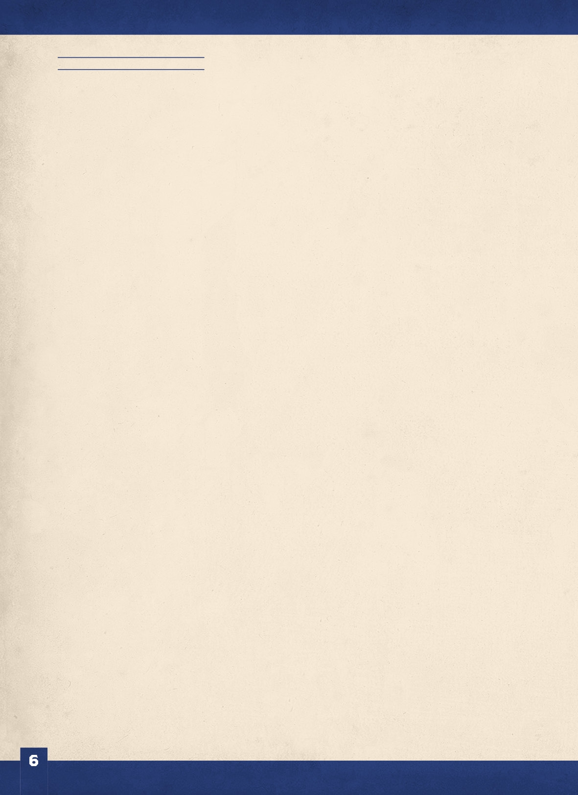Skaven, but they do not suffer any of
these players' weaknesses either. Humans are quicker than Dwarfs, more
hardy than Elves, bolder than Skaven and (considerably) more
intelligent than the average Greenskin. It is hardly surprising, then,
that Humans account for over 50% of all Blood Bowl players (please
note that this statistic is only accurate if the count includes
Skeletons, Zombies, Ghouls and Vampires playing for Undead teams, and
mutants playing for Chaos teams but, as exactly 74%
of all statistics are made up on the spot to try to prove a point, it
hardly seems important!).
>
The most heavily-populated
realms of the Old World are those
>
ruled by humanity; commonly referred to by the other races of the
world
as the Realms of Men. From frozen Kislev to fair Bretonnia, from the
pleasant lands of Estalia and Tilea,
to the sun-scorched Southlands,
the lands of Men are vast.
>
Across these many realms, Blood Bowl has grown in popularity to become
the preeminent preoccupation of one and all, yet the ways in which the
great game has been embraced are as varied as the dialects spoken
by the denizens of these lands. In
the nation of Kislev, a snow-covered, frozen land that lies so far to
the north that its furthest borders lie under
the shadow of the Chaos Wastes, Blood Bowl has a strong following.
In Kislev the game is most violent, which should come as little
surprise
as the populace are a hardy people that enjoy strong drink and, for
many centuries, have been renowned as brave soldiers and warriors who
once

stood as a proud and impenetrable bulwark against barbaric hordes
descending from the Chaos Wastes. Yet for all the popularity Blood Bowl
enjoys in this cold and beautiful land, Kislevite teams rarely campaign
with much enthusiasm beyond the borders of their homeland. As a result,
few Kislevite teams attain the wider success many pundits believe them
to be capable of. But any foreign fan willing to risk the cold and
journey north to Kislev to enjoy a game or
two will be rewarded by a spectacular display of Blood Bowling prowess
by players of great skill.

In stark contrast to the frozen north, the lands of the south are
forever hot and dry. The relentless

sun makes the lands of Araby, Tilea and Estalia arid, and this constant
heat has had a marked effect upon
the way the folk of these nations
enjoy Blood Bowl. In Araby (one of
the few realms of Men that lies just beyond the established borders of
the Old World, but no matter), Blood Bowl
is widely played by Human teams, and is very popular, though by
necessity games take place late in the evening
or early in the morning. For this
reason, many Old World teams refuse to compete there, most Old World
players having grown accustomed to mid-afternoon games and late-night
drinking and dining in the taverns and inns of the northern cities,
followed
by a long lie-in in bed each morning!

In Tilea, a modern and forward looking nation situated upon a large

and fertile peninsula within the southernmost border of the Old World,
Blood Bowl has taken a firrm hold! And this has proven no bad thing for,
perhaps unexpectedly, the once warlike folk of Tilea have turned out
to be amongst the most talented players of Nufflee's great game in all
the known world. The leagues of Tilea and the Human teams, both noble
and low born, that populate them
have become renowned as being

the natural home to some of the fineest on-pitch displays of sporting
excellence a fan could ever hope to witness, and fans travel far and
wide to do just that.

Estalia, by contrast, enjoys its Blood Bowl in a most different
fashion, for in Estalia participation comes most firrmly in second
place, behind the joy of spectating! Located in the south-western corner
of the
Old World, Estalia is dominated by
two great cities: Bilbali on the north coast and Magritta on the south.
Both these great port cities are home to world-renowned stadia that in
turn host many spectacular tournaments throughout the year. Whilst
Estalia is not itself known for producing many great teams, its natural
benefitts
and wonderful stadia have led it
to become home to many grand tournaments. A major highlight of the
Estalian calendar is the Bilbali Cup, a truly grand affair that, were it
held in any other nation of the world, would
be considered the premier event of that realm's calendar. Yet in
Estalia, the Bilbali Cup pales in comparison
to one of the greatest sporting events in all the known world: the
*Spike!* *Magazine* Trophy Open, hosted by the gleaming city of
Magritta!

North of Estalia lies the vast, feudal kingdom of Bretonnia, a land
where the divide between the ruling

knightly nobility and the impoverished peasant underclass is as wide as
it could possibly be. The Blood Bowl teams of Bretonnia are proud in
the extreme, consisting, as they do, almost entirely of knightly
nobles;
for Blood Bowl is seen as a pursuit for the gentry and not fitt for
those of the toiling peasant class. These teams proudly display their
own particular brand of honour, though it must be said that sometimes
their notion of honour would put a Goblin to shame! Their teams are
often accused of lacking a degree of cohesion, as they are prone to
valuing individual feats

of heroism over teamwork. It is not uncommon for carefully-drilled
plays
to be forgotten as a lone knight rushes off to earn personal glory in
the opposition's End Zone, his fellows
on the pitch and the peasants in
the stands cheering him on before lamenting his sudden, if not always
unexpected, demise.
>
East of Bretonnia lies a lawless land of petty fieefdoms and miniature
>
kingdoms almost beyond counting. Known as the Border Princes, this
is the place to which disgraced
nobles and tax exiles from all over
the Old World come to settle, safe
in the knowledge that their affairs won't be closely scrutinised by
nosey neighbours. After all, in the Border Princes most neighbours are
just as keen to keep their own affairs secret!
>
The Border Princes is home to an unbelievable number of Blood Bowl
teams both minor and major, yet
only one actual stadium, the name
of which changes depending upon
who is asking! These teams, many of which fall firrmly into the
pejoratively titled category of 'pot hunters', spend their days
competing in leagues and tournaments the length and breadth
of the Old World. By looking for easy wins in competitions where the
prizes are quite humble, many of these
teams are able to gather considerable wealth without the worry of
having to pay any tax on their earnings!
>
THE EMPIRE
Truly then, the lands that make up most of the Old World are wonderful
in their endless variety, yet none of these realms is nearly so large
as the realm that lies at the heart of the Old World the land known as
the Empire. The Empire stretches from the coast of the Sea of Claws to
the foothills of the Worlds Edge Mountains, covering all the lands
between Bretonnia and Kislev. The Empire itself is a
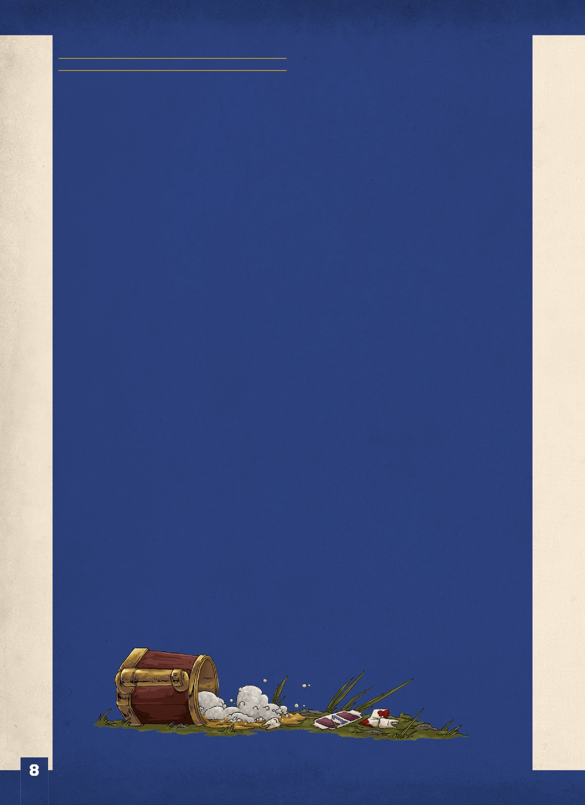land of great geographical diversity.
Much of its northern mass is mountainous and rugged, and that which is
not
lies beneath huge primordial forests. From these come
the raw materials needed to fuel its constant urban
growth and ever-expanding industries; rock drawn from
the mountains, timber from the forests. Though it must
be said that the darkest hearts of these mighty arboreal realms remain
unexplored by all but the most insane, for within these deep forests
dwell tribes of Beastmen and Minotaurs, and more besides, ever ready
to waylay the unwary traveller. These tribes take great pride in
sending forth their best and boldest to play alongside the mightiest
of Chaos-aligned teams, and some expert commentators even suggest
that, within these dark places, the Beastmen hold their own leagues
and tournaments!
>
To the south, the lands of the Empire unfold into seemingly-endless
expanses of rich and fertile farmlands.
>
These limitless fieelds of green and gold are capable not only of
sustaining the unimaginably large populations
of the mighty metropoles that dot the landscape, but
also fuel a huge export economy to feed the Empire's neighbours as
well. In this way, the Empire is easily
capable of influencinng its neighbours, and even today, with its
armies shrunk and its sports economy booming, the Empire remains a
power within the world.
>
In truth, this vast land is not one nation but many different nations
all drawn together under the banner of
>
empire, each governed by its own rulers and with its own distinct
customs and traditions. These different states and provinces, as they
are called, are wildly independent from one another, and fierrcely
proud of that independence,
each considering itself a mighty nation in its own right. These states
and provinces have long been united by

their common aims, the better to fleex their might over the smaller
nations of the Old World and all allied together under the benevolent
rule of the Emperor, who governs his vast domain from the Imperial
capital city of Altdorf.

The Empire is home to more Blood Bowl teams that
are active within more leagues and tournaments than anywhere else in all
the known world. Most of these teams fitt into the broad category of
'Human', a term once used by the NAF as a catch-all for the many and
varied Realms of Men. In more recent times, the Empire has become home
to an ever-increasing variety of teams. Mixed teams have become an
increasingly common sight, many originating within the tightly-governed
Dungeon Bowl circuit and managed by the Colleges of Magic. Others,
particularly since the collapse of the NAF and under the, in some way
more easy-going, governance of the RARG, have sprung
up across the many Imperial provinces to compete in leagues both minor
and major. In the common vernacular, such teams are referred to as 'Old
World Alliance', a broad term that captures well the fact that not only
do those Human players present represent many nations, but that other
races, such as Dwarfs and Halflinngs, have become regulars on such
rosters.

More recently still, 'Imperial Nobility' teams have become a popular
addition to those regularly participating

in competitive Blood Bowl. Such teams tend to be
privately owned by one or more of the limitless petty nobles that govern
the Empire, and usually form around some rich burgher's dreams of
sporting glory. For the wealthy, it seems, such dreams can be played
out, and many a noble has taken to the pitch in the company of
a team of well-paid and competent ruffianss, journeymen and mercenaries
to indulge their fantasies. A few short years ago, such teams were
greeted with derision by the fans but, over time, many have risen
through the ranks
and proven their ability alongside the seasoned pros of
the game.

THE HALFLING M00T
Within the Empire lies the home of the Halflinng race;
the pastoral and peaceful land known as the Moot.
This strange realm could not exist but for the might and benevolence
of its neighbours, for Halflinngs are not a warlike folk. That such a
rural idyll can persist in a land dominated by impenetrable forests
and overrun by twisted beasts and fell creatures of darkness might
seem peculiar
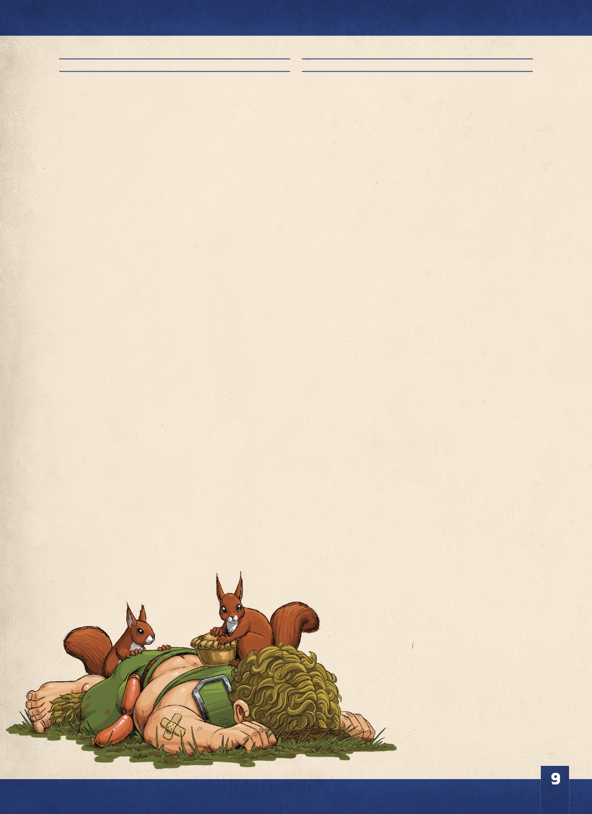to many, but to the Men of the Empire,
protecting the Moot in ages past has been a duty gladly upheld.
Outsiders
often wonder why, but the reason is as simple as it is selfishh; many
are the tales of the culinary talents of the
folk of Bretonnia, Estalia and Tilea and of the wonders
their finee chefs produce in the kitchen, but it is a fact
self-evident that the fineest cuisine in the entire known
world originates from the Halflinng Moot. Alongside this
world-renowned cuisine comes finee beer, mead and ale
in quantities to rival the breweries of the Dwarf realms,
and of a quality to shame even the fineest Dwarf brewery
(in the honest opinion of this scribe, Dwarf beer tastes
like pure alcohol with grit in it, whilst Halflinng beer is very
moreish)! Consequently, the Empire has long held in high regard its
alliance with the Moot, protecting the peaceful land with a vigour
similar to that of a Halflinng protecting its pantry, and many an
Emperor has grown fat on the fruits
of this friendship!
>
As a race, Halflinngs are not natural athletes, yet they
are drawn to Blood Bowl in huge numbers, and Halflinng teams are an
ever popular sight with the fans. The Moot itself has become home to
some of the most popular competitions in the Old World. Tournaments
such as
the Thimble Cup or the Lunch Bowl might be poorly run affairs and they
might appeal to some of the more amateur teams on the circuit, but the
ingenious displays
of cheating and the outrageous acts of cowardice and heroism from the
players and officialss alike are always
a huge draw and, when this fails to excite the fans, the catering more
than makes up for even the most sub-par of on-pitch displays!

N0RSCA
Beyond the northern borders of the Empire lies a land that in any
discourse on the Blood Bowl playing nations of the world deserves a
special mention Norsca.

Norsca is a cold land of frozen mountain ranges, verdant valleys, and
glacial fjords, the beauty of which

surprises many, falling as it does beneath the shadow of the Chaos
Wastes. As a direct consequence of this, its northernmost regions are
wild and untamed places, home to a great many horrors, natural and
otherwise. From the mutated Trolls, themselves the size of small
mountains, that roam the high peaks and desolate tundra, to herds
of woolly mammoths, the glacial expanses of Norsca are truly
inhospitable. To its south, Norsca is separated from Kislev by the Troll
Country (whilst Norsca is home to the largest of Trolls, the Troll
Country is so named because there are just so many of them there; it's
literally just Trolls from end to end, apparently!).

Norsca is also home to the fierrce people known as Norscans, a race of
Man that loves little more than strong

beer, rampant piracy and violent sport. It comes as no surprise, then,
that Norsca has enjoyed a long and proud history as a Blood Bowl-playing
nation.

Those Norscans that grow to maturity in such dangerous lands choose
(quite wisely) to spend as much

time as possible aboard ship, travelling far and wide.
Many of the most successful teams to hail from this snow-covered land no
doubt owe much of their success
to their people's predilection towards piracy! Indeed, the Norscans'
habit of spending many months of the year aboard ship, sailing the
oceans of the world and raiding coastal settlements small and large for
plunder, has allowed many a Blood Bowl team to campaign in leagues and
tournaments far and wide all year round, to the extent that some coastal
stadia now refuse to allow Norscan teams to visit; there is, after all,
only so many times
the trophy cabinet can be replaced before the pillaging becomes
tiresome!

Norsca is home to very few stadia and even fewer regular tournaments.
The obvious reasons for this
>
are the climate and geography; Norsca is not only
>
bitterly cold, but also extremely mountainous
(most of the flaat ground in Norsca is vertical!).
>
Add to this the dangers posed by wandering beasts and extreme weather
and environmental
>
conditions, and it is hardly surprising that the
>
Norscans themselves choose to spend as
>
little time there as possible!
>
THE W0RLDS EDGE
To the east of the Old World lies the vastness of the Worlds Edge
Mountains, a seemingly endless range of peaks that reach to the very
heavens above. The Worlds Edge Mountains stretch from the steppes of
the Chaos Wastes in the far north, running thousands of miles until
they meet the Grey Mountains in the south, itself a vast mountain
range that provides a natural border between
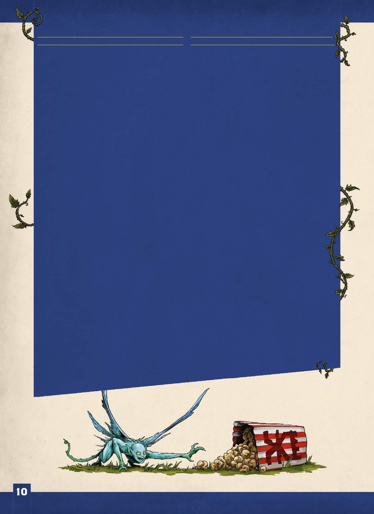the Empire and Bretonnia. This
mountainous realm
is home to the vast empire of the proud Dwarf race.
The Dwarfs of Karak Ankor, as this empire is known, have ruled these
mountains for thousands of years, for Karak Ankor was old when Men
were living in caves and eating rocks! Sadly, today Karak Ankor is a
pale shadow of its former glory, having been ravaged down the long
millennia by natural disasters such as earthquakes, and by unnatural
disasters such as Greenskin migrations
and Skaven invasions.
>
Dwarfs are an insular race, preferring the company of their own kind
to that of others, and consider other races too brash, loud or
excitable to make good companions.
>
They also travel rarely, preferring to stay close to the high peaks of
their mountain realm, or within their deep mines, carved over
millennia into the roots of the world. In days past, great throngs of
Dwarf warriors would march forth to war, the ground trembling beneath
their iron-booted feet. Today, when a Dwarfishh throng marches, it is
as an army
of fans accompanying their beloved team on-campaign, and woe betide
any rivals foolish enough to cross the path of such a migration of
Dwarfishh fandom! To Dwarfs, Blood Bowl is a serious business, not
least because the firrst
and most respected Sacred Commissioner, Roze-El, was a Dwarf and is
venerated almost as a god the length of the Worlds Edge Mountains, but
also because Dwarfs treat competitions of all forms as a most serious
undertaking. Not for them the frivolous notion of playing a game for
fun! When a Dwarf straps on their Blood Bowl armour, it is with the
sole intention of grinding the opposition to dust!
To a Dwarf, the dishonour of losing a game to an inferior opponent is
a great shame that lies like a heavy weight upon the soul of every
Dwarf to witness it. And to a Dwarf, every opponent is considered an
inferior!

ATHEL L0REN
South of the Grey Mountains lies the wondrous and mystical domain of
Athel Loren, the greatest forest
realm in all the known world. Athel Loren covers many hundreds of
thousands of square miles; if a traveller were to stand atop the highest
peaks of the Grey Mountains
and gaze south and west towards far Bretonnia and the distant ocean
beyond, the vastness of Athel Loren would dominate the landscape as far
as the eye could see.

It is within this unimaginably ancient, arboreal realm that the Elves of
the Old World reside. Legend tells of a time long ago when great Elven
cities covered the Old World, and the Elves and Dwarfs lived contentedly
side
by side. Supposedly, this golden age ended abruptly
over a game of Nufflee's Armorical Football (this was long before the
popular name 'Blood Bowl' had been coined); with a Dwarf referee
controversially disallowing an Elven touchdown against a Dwarf team.
According to legend, the referee was abducted, shaved, and returned to
his folk in
a barrel, and in great disgrace! The resulting war, which came to be
known as the 'War of the Beard', lasted many centuries and resulted in
Elven kind being driven from the Old World.

Those Elves that remained in the Old World took up residence within the
magical borders of Athel Loren,
where they remain to this day. The Elven folk of this magical realm bear
little resemblance today to their kin
in Ulthuan and Naggaroth, the peculiar nature of their adopted home
having worked its strange charms upon them, giving them a wild and
untamed appearance that matches their woodland domain. Yet, it is this
wildness
of spirit, when combined with the natural grace of all Elf kind, which
makes the Wood Elves such famed and feared Blood Bowl players. There are
few races of the Old World able to match their speed and agility and,
though Wood
Elf teams are hardly a common sight, they are always incredible
crowd-pleasers, bringing an overabundance
of athleticism, outrageous audacity and insurmountable bravado to the
gridiron!

**BEY0ND THE 0LD W0RLD**
>
he known world does not end at the borders of the Old World. In truth,
the Old World itself, vast though it undoubtedly is, covers barely a
fiffth of the known world! Beyond the Worlds Edge Mountains to the
>
east, across the Great Ocean to the west, north of frozen Kislev, and
south
of equatorial Tilea lie lands beyond imagining. These far places are
home to Orcs and Goblins, Elves and Lizardmen, Ogres and Trolls, and
more besides. Some have even claimed the existence of a sunken city
populated by a race
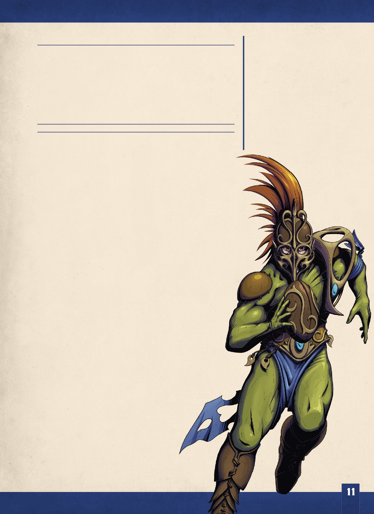of mysterious fishmenn! But such
preposterous stories are clearly made up to alarm small children and
delight suggestible adults.
>
THE DARK LANDS
East of the Worlds Edge Mountains stretches the trackless wilderness
known as the Dark Lands. This blasted landscape reaches east as far as
the Mountains of Mourn and the Ogre Kingdoms. It is here that the many
migratory tribes of Ogres originate from, roving far and wide across
the face of the world, following trade routes to distant lands.
>
In the northernmost reaches of the Dark Lands, the grim and foreboding
Mountains of Mourn merge with the north-eastern limits of the Worlds
Edge Mountains. Here, the mountains become volcanic and the very earth
itself
>
cracks apart, revealing the molten core of the world. It is in this
smoke- wreathed and benighted land that the Dawi Zharr, otherwise
known as 'Chaos Dwarfs' in the common tongue of Men, make their homes.
Though comparatively few in number, the Chaos Dwarfs have made a
lasting mark upon both the landscape in which they live and the world
of sport.
>
For thousands of years, the Dawi Zharr have strip-mined their volcanic
homeland, adding considerably to the hellish nature of the plains of
Zhar Naggrund. Yet, rather than do the heavy lifting themselves, the
Dawi Zharr
have long made use of slaves, breeding the hardiest of Greenskins to
do their bidding. As a result of this infernal industry, the Chaos
Dwarfs have proven capable of fieelding many finee Blood Bowl teams.
Combining as they do the sheer might of Dwarf players with the best
attributes of numerous other races; the power and unstoppable momentum
of Bull Centaurs, the frenzied blood lust of Minotaurs, the (relative)
speed and agility of Hobgoblins, and more besides, it is little wonder
that Dawi Zharr teams have long dominated the leagues of the east.
>
The southern reaches of the Dark Lands are home to countless tribes
of Orcs and Goblins. In ages past, these would regularly harry the
borders of
>
Karak Ankor and the Empire beyond, perhaps hoping to escape the
threat
of forcible employment in the industries of their northern neighbours,
perhaps hoping to migrate into the relatively pleasant lands of the
Empire (pleasant when compared to the Dark Lands). These days, more
Greenskins than
ever before travel west, but their reasons for doing so are far more
peaceful than in days past. Greenskin migrations are lured into
the Old World by the promise of Blood Bowl and the prospect
of fame and fortune. Such invasions are welcomed gladly,
bringing with them as they do the promise of a violent
season of sports entertainment ahead!

MINDY PIEWHISTLE'S
RUM0UR R0UND-UP
*Some seasons, a Blood Bowl team enjoys* *such success on the pitch that
it attracts* *rabidly-passionate fans from all over the* *world, even
from among other races.*
*This can cause trouble, of course, such as* *the time half of the fans
at an Orcland* *Raiders home game turned out to be* *Humans who'd
covered themselves in* *green body paint. They say this was only*
*revealed at half time when a riot broke*
*out over the last Squig-on-a-stick -* *apparently none of the fans
wanted it!*

THE BADLANDS
The Badlands is the name given
to the desolate region south of the Border Princes, a region famed as
being home to barren rock, arid plains, searing desert and hordes and
hordes of Greenskins. In fact,
the Badlands are notorious for
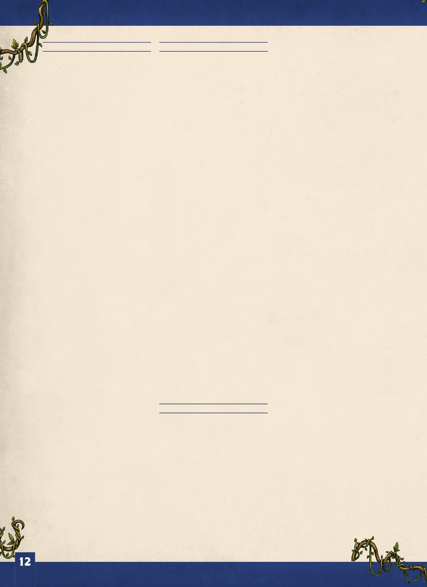harbouring the largest concentration of
Greenskin tribes outside of the Dark Lands!
>
What's particularly fun to note about the Greenskins of the Badlands
>
is not their number; rather it is the incredible effect the searing
sun of
the region has upon the average Orc. Not the brightest of creatures to
start with, the extreme temperature of the Badlands seems to literally
bake the brains of the Orcs that dwell there, making them even more
violent and increasingly dim. It is hardly any wonder, then, that the
Badlands are home to a truly remarkable number
of Greenskin tribes that, in the past, were considered by more
civilised folk to be extremely warlike! These days, these tribes
produce a staggering number of Blood Bowl teams and
hold a great many leagues and tournaments. Sadly, none of the latter
are particularly well-run!
>
In the southerly expanses of the Badlands, rising in twisted spires
from the barren soil, can be found many strange rock formations.
Scholars believe these to be the remains of an ancient civilisation,
perhaps an outpost of the lost empire of Nehekhara. Whatever the case,
today the area is home to a large number of Ghouls and other carrion
beasts. These pitiful creatures eke
out a sorrowful existence in barren conditions, causing many to make
the long journey north into the Empire. Here, they hope to findd
employment
in a Blood Bowl team, dreaming of fame and fortune and living a life
of luxury, far away from the desolation of their homelands!

THE LAND 0F THE DEAD Bordering the south-eastern edge of Araby is the
foreboding Land of the Dead, home to the cyclopean tomb cities of Khemri
and Numas. Legend tells that, many millennia ago, the
folk of these lands lived normal lives dedicated to the pursuit of
happiness through playing more Blood Bowl. Supposedly, this came to an
end
and these lands were destroyed
by a being known as the 'Great Necromancer'. Following a particularly
bad season in which his team faced relegation, he cast great and
powerful enchantments that firrst eradicated all life from the land,
before raising the dead left behind into a strange state
of undeath!

The truth of such legends will
likely never be known, for these
events happened so long ago. What
is beyond doubt is that the Land of
the Dead is well-named, for here the ancient dead do not rest easy, and
within the ancient necropolis cities
the restless dead stir, endlessly repeating the tasks and chores of
their former lives in a grim mockery of the lands of the living.

Part of this eternal pantomime is the endless replaying of Blood Bowl
games that took place in antiquity. Today, teams of ancient players
regularly march forth from their
tombs to decrepit stadia where they re-enact the glories of their past.

ULTHUAN AND NAGGAR0TH Westward of the Old World, across
the Great Ocean, lie the lands of
the noble Elves. The Isle of Ulthuan, sometimes referred to as the Ten
Kingdoms, is the ancestral home of the Elven race, and it is here that
the noble High Elves dwell. Ulthuan is a large, horseshoe-shaped land
mass surrounding the Inner Sea. The realm itself is divided into ten
kingdoms, each ruled by its own nobility, and each sworn to uphold and
honour the twin thrones that hold ultimate power

over Ulthuan, that of the Phoenix King in Eataine, and the Everqueen in
Avelorn.

Ulthuan is a fair land, as befitts its fair and noble denizens. In
gleaming towers of silver and gold, the long- lived Asur (as the Elves
of Ulthuan call themselves) pass their days in the study of the arts,
both magical and mundane. Chief amongst the arts studied these days is
the art
of classically-pure Blood Bowl or, to put it another way, Blood Bowl as
firrst decreed by Nufflee. It is no secret that the modern game has
changed and evolved hugely in a couple of short centuries, and to the
Elves of Ulthuan, this is a terrible thing. The Asur pursue a pure form
of the great game, focusing on well-executed set piece plays, elegant
passing and dramatic catching (fun to watch for about 20 minutes, but
Blood Bowl without blood is just 'bowl', and bowling isn't nearly as
exciting!).

Ulthuan is home to the Elven Kingdoms League, the number one

competition for fans of the classical style and one of the oldest and
richest leagues in the known world.
In turn, each of the Ten Kingdoms
that make up Ulthuan is home to numerous well-funded teams and a truly
disproportionate number of high- end sports outfittters. In these, noble
Asur players spend far too much time having their spectacular sports kit
tailored to perfection; time that could arguably be better spent
learning
to tackle!

Where Ulthuan is a fair land of temperate clime, Naggaroth is cold

and dark. This is most appropriate, as it is here that the Dark Elves,
or 'Druchii' as they prefer to be called, reside. Many millennia ago, a
civil war tore Ulthuan asunder when two rivals for the Phoenix Crown
proved unable to settle
their disagreements amicably. The powerful magics unleashed during

the ensuing war literally broke the
isle of Ulthuan in half, causing half
the population to migrate in search of a new land in which to dwell.
Driven from their homeland, the defeated Druchii chanced upon a frozen
and desolate land, a realm as cold as
their embittered hearts, which they
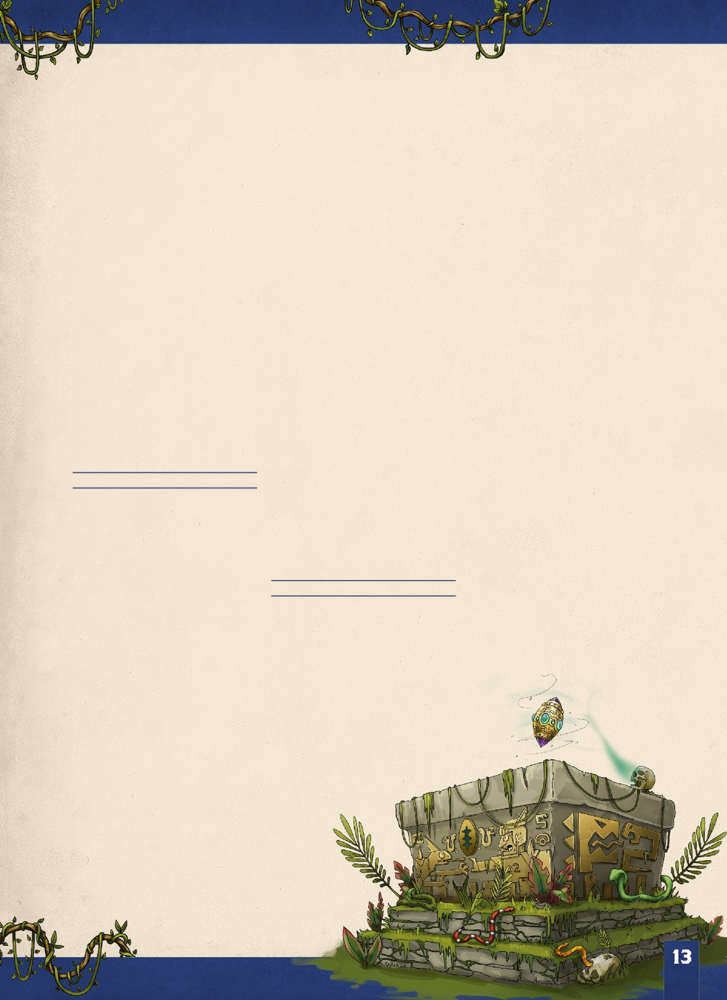named Naggaroth.
>
Over the centuries since their
exile, the Elves of Naggaroth have
>
built their power and influencce
globally through intrigue and open hostility. Today, Naggaroth is
rightly considered one of the fineest Blood Bowl playing nations in
the entire known world; having set aside their kin's fixxation upon
the passing
game and embraced the twin arts of violence and outrageous cheating,
through means both magical and mundane, the Druchii have produced some
of the most successful teams in the history of the sport.
>
LUSTRIA
Beyond the Great Ocean, south of Naggaroth, can be found Lustria;
the oldest realm in all the known
world. Lustria is a land of mystery, largely unexplored by the folk of
the Old World and home to a great many wonders. Chief among these
wonders is the sprawling empire of the Old Ones, the original gods of
the world. These all-powerful beings came
here at the dawn of time and acted
not unlike architects and builders, changing the world in profound
ways; they brought the sun closer
to warm the globe, they moved the landmasses to create the continents
of today, and more besides. Most importantly, they brought with them
the mystical Slann and the primitive Lizardmen; their servants and
workers in their great undertakings.
>
Lustria is a large, tropical continent. Utterly inhospitable to
>
outsiders, it has remained largely unknown for thousands of years,
only recently opening up its interior

to visitors and allowing visiting dignitaries and emissaries of the
various Blood Bowl leagues of the
Old World access to the temple cities in which the great game was firrst
played. In recent years, Blood Bowl teams from far and wide have started
to visit and compete in its many leagues, hoping to learn the long-
forgotten teachings of Nufflee in the cradle of the sport.

The denizens of Lustria, the Lizardmen and their rulers, the mystical
Slann, dwell in ancient temple-cities built along mystical

pathways to otherworldly designs. These temple-cities draw the raw
magical power of the world and channel it in strange and unknowable
ways. As a result of this arcane science, many visitors to Lustria
are surprised by the strange sights that greet them. With the opening of
their borders to visiting players and fans, the Lizardmen have built
many luxurious resorts and hostelries.
Many an Old Worlder is surprised
by doors that open unaided, disembodied voices making guest
announcements, and boxes that blow cool air to fend off the tropical
heat!

THE CHA0S WASTES
North of Kislev, north even of Norsca and the Troll Country, lies the
Realm of Chaos. This great and wild expanse of untamed and unnatural
land stretches from the borders of Human civilisation all the way to the
North Pole of the world; a wild and primordial landscape twisted and
warped beyond the ken of mere mortals in ways both bizarre and sublime
by the power of the strange pantheon of Chaos gods that hold dominion
here. In the mists of time,
the gateway of the Old Ones
lay at the North

Pole, and

it was from

here that the

Slann and

their god-like
masters

entered and left our world. Unfortunately, following some long-
forgotten squabble between the Old Ones, this gate was slammed shut,
causing it to shatter and allowing
the raw stuff of chaos to floodd into the world!

For long centuries, the barbarian tribes of the north have lived under
the shadow of the raw stuff of
chaos, worshipping the Chaos gods and imploring them for their dark
blessings. In times past, mighty armies of these fur and black iron-
clad maniacs would floow south at regular intervals, hoping to overthrow
the civilised lands of Man, Dwarf
and Elf alike in a tide of destruction that would herald the end of the
very world itself!

Fortunately, these days, the folk of the Chaos Wastes have calmed down
somewhat. Their gods have become

less fixxated upon the destruction of the world, preferring instead to
settle their differences upon Nufflee's sacred gridiron. Indeed, the
powers of Chaos have become fascinated to the point of distraction by
Blood Bowl, lavishing their gifts and blessings upon skilled players
rather than mighty warriors! Today, when the tribes of the north floow
south, it is as armies of crazed sports fans, determined to follow
their beloved teams to glory rather than to raze cities to the ground
(though the occasional city still gets razed to the ground)!

New Inducements

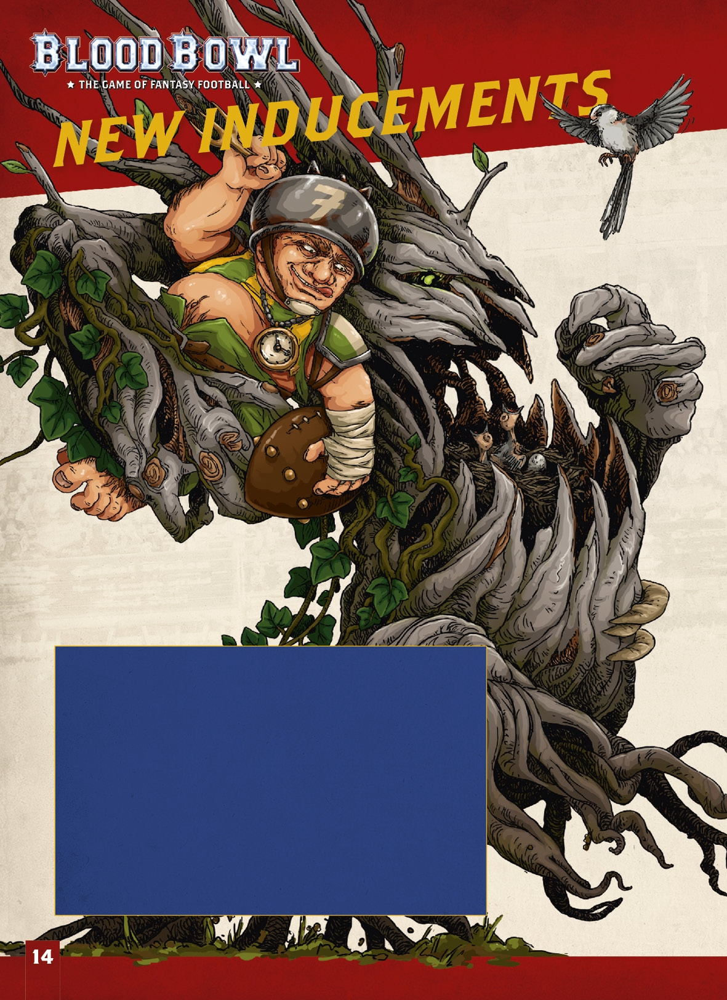

lood Bowl is a sport that has captured the hearts and minds of an
entire world. It is played from pole to pole, across many continents
and in every climate imaginable. There are far more rules variations
>
than can easily be covered within a single tome, and no end of ideas
to explore in the future.
>
In addition to the common Inducements listed in the *Blood Bowl*
rulebook, coaches may wish to use the ones detailed on the following
pages.
All of the Inducements that follow are balanced for use alongside the
common Inducements, but are listed as optional extras so that the list
of Inducements isn't too long and confusing.
>
The inclusion of these rules in a league or tournament is at the
discretion of the league commissioner or tournament organiser.
0therwise, coaches who wish to use these rules for an exhibition game
should decide this between themselves.

Kari Coldsteel

**0-2 (IN)FAM0US C0ACHING STAFF** PRICE VARIES, AVAILABLE T0
VARI0US TEAMS

lthough most Blood Bowl celebrities are players, with the occasional
ref thrown in for good
measure, there are several well-known members

of coaching staff around the circuit. From choreography directors for
the cheerleading squad, to financiall
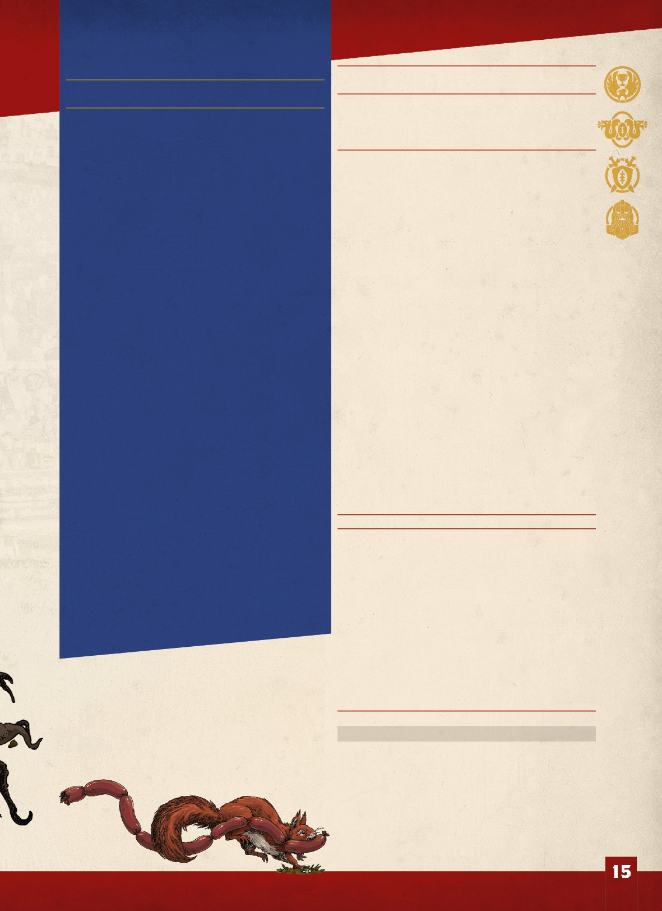specialists who will deal with bribing the
officialss, there
is almost no limit to the helpful hangers-on that linger around Blood
Bowl stadia, hoping to findd employment with a coach daft enough to
believe their claims. Consequently, many a team will experiment with all
manner of temporary coaching staff, hoping to get something useful from
the deal.

However, and perhaps contrary to expectations, some of these specialist
experts do actually have some useful knowledge to impart or skills to
share. Many of these individuals have become minor celebrities in their
own right in recent years, becoming regular interviewees on Cabalvision!
Though it must be said, most such interviews only happen when the
players themselves are refusing to speak to the press...

(In)Famous Coaching Staff are available to purchase during the pre-game
sequence at the cost listed. You may

purchase up to two (In)Famous Coaching Staff who are allowed to assist
your team.

It is possible for both teams to hire the services of the same named
(In)Famous Coaching Staff:

• If this happens during a game that is part of a league,

neither team can use the (In)Famous Coaching Staff but the (In)Famous
Coaching Staff will keep both
hiring fees.

• If this happens during exhibition play, both teams can

use the (In)Famous Coaching Staff one team has clearly hired a ringer!

0-1 (IN)FAM0US C0ACHING STAFF INDUCEMENT: KARI C0LDSTEEL
50,000 G0LD PIECES, AVAILABLE T0 ANY TEAM WITH EITHER THE 'ELVEN
KINGD0MS LEAGUE', 'LUSTRIAN SUPERLEAGUE', '0LD W0RLD CLASSIC' 0R 'W0RLDS
EDGE SUPERLEAGUE' SPECIAL RULES
*One of the most well-known games of 2477 was*
*between the Asgard Ravens and the Lowdown Rats. The* *Ravens players,
who were taking part in the ongoing* *strikes over a salary dispute,
refused to leave the*
*dugout at the start of play. Their head coach was close*
*to despair - the team was having a bad season already* *and conceding
the game was out of the question. In* *desperation, he turned to the
team's cheerleading* *squad, who were more than happy to take to the
pitch*
*for a change. History was made that day, and they* *achieved an
impressively-bloody 3-1 victory, sending*
*over half of the Rats to the casualty box.*

*Although the cheerleaders returned to their normal* *duties after the
game, several of them got a taste for* *playing, none more so than Kari
Coldsteel. She tendered* *her resignation the same day, then spent the
next* *decade playing for a number of minor league teams.*
*In 2491 she retired from active play and returned to* *cheerleading,
letting out her services to teams whose* *squads might be in need of a
little encouragement. Of* *course, no one ever truly retires from Blood
Bowl, and* *she has been known to step in and help out her team*
*if they're losing. The refs don't seem to mind - and* *neither do the
fans!*

"IF Y0U WANT A J0B D0NE..."
Kari counts as two Temp Agency Cheerleaders. In addition, if her team
cannot set up 11 players at the start of a
drive, Kari may decide to *"show 'em how it's done!".*
Her team's coach can choose to set her up as part of
the team. If they do so, she counts as part of the team
for the duration of the drive, and no longer counts as two Temp Agency
Cheerleaders. When the drive ends, Kari
is Sent-off. You cannot Argue the Call or use a Bribe to prevent this.
She will play no further part in the game she does not count as any Temp
Agency Cheerleaders, and she cannot be used in a later drive.

MA ST AG PA AV Kari Coldsteel 6 2 3+ 5+ 8+ Skills & Traits Block,
Dauntless, Frenzy, Loner (4+)
>
0-1 (IN)FAM0US C0ACHING STAFF INDUCEMENT: PAPA SKULLB0NES
80,000 G0LD PIECES, AVAILABLE T0 ANY TEAM
WITH EITHER THE 'FAV0URED 0F...' 0R 'UNDERW0RLD CHALLENGE' SPECIAL
RULES
*Although the officiall religion of Blood Bowl is Nufflismm, any*
*number of other (arguably lesser) gods are worshipped by* *its many
and diverse players, officialss and fans. Followers*
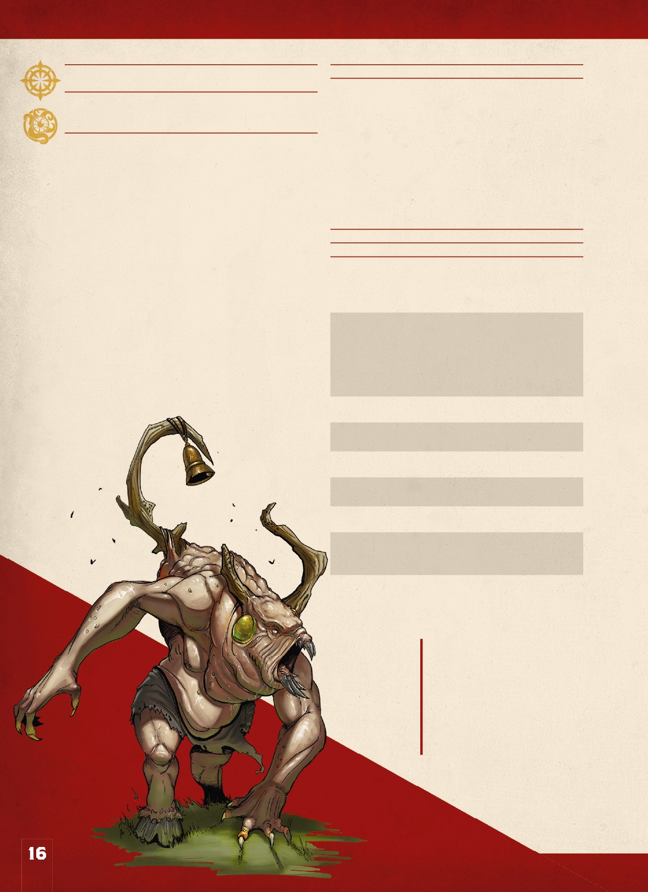*of the Chaos gods, in particular, seem
drawn to the sport*
*- it must be something to do with the non-stop bloodshed* *and the
fans' ritualistic chanting!*
>
*Any number of so-called Shamans are active on*
*the circuit at one time, offering their services to teams*
>
*who require guidance, but few are as successful as*
*Papa Skullbones. The secret to his success, the thing*
*that sets him apart from so many of his contemporaries,* *is simple:
showmanship! From his larger-than-life attire*
*to the spine-tingling rumble of his voice, his entire* *persona has
been expertly crafted to convey the sort*
*of otherworldly gravitas that is expected of a priest of*
*the Dark Gods. He gets results, too; as well as making* *impressive
pre-game displays, his rituals do indeed seem* *to attract the gods'
attention, and a blessing from Papa* *Skullbones is often enough to
ensure a team's success.*

"BY THE P0WER 0F THE G0DS!"
At the start of each drive, after the teams have been set
up but before the kick-off, Papa Skullbones can attempt
to bless one player on his team (not a Mercenary or Star Player) with
the power of the Chaos gods. Choose a player on your team from among
those on the pitch, and roll a
D8 on the table below. Any Skills gained are kept until the end of the
drive; if the player already has both Skills, "*By* *the Power of the
Gods!* has no effect on them. A player cannot be chosen if a roll has
already been made for them during this game.

"BY THE P0WER 0F THE G0DS!"

D8 RESULT
>
1 *Unworthy:* The player is struck down.
The player is immediately removed from play
>
and placed in the Knocked-out box of their
team dugout.
>
2 *0verlooked:* The chosen player is overlooked by
>
the ficckle gods. Randomly select another player from the same team,
excluding players not on
the pitch and players for whom a roll on this
table has already been made, and roll on this table again.
>
3 *Freakish Proportions:* The player gains the Big
>
Hand and Very Long Legs skills.
4 *Grasping Tendrils:* The player gains the
>
Tentacles and Prehensile Tail skills.
5 *Horriftcc Visage:* The player gains the Disturbing
>
Presence and Foul Appearance skills.
6 *Grisly Bifurcation:* The player gains the Extra
>
Arms and Two Heads skills.
7 *Thorny Protrusions:* The player gains the Claws
>
and Horns skills.
8 *Favour of the Gods:* The player gains
>
two Skills of your choice, chosen from the Mutations category.
>
HACKSPIT QUILLCHEWER'S FUN FACTS
*Did you know that the Nurgle's* *Rotters have got a home stadium?*
*If you've never heard of it, don't*
*be surprised. They've never yet* *convinced another team to visit*
*and play there...*
>
0-1 (IN)FAM0US C0ACHING STAFF INDUCEMENT: GALANDRIL SILVERWATER 40,000
G0LD PIECES, AVAILABLE T0 ANY TEAM WITH THE 'ELVEN KINGD0MS LEAGUE'
SPECIAL RULE
*For several decades, there has been one name regarded* *above all
others in the fieeld of cheerleading: Galandril* *Silverwater. From
lowly beginnings as an assistant* *seamstress for the Tiranoc Titans,
she gradually*
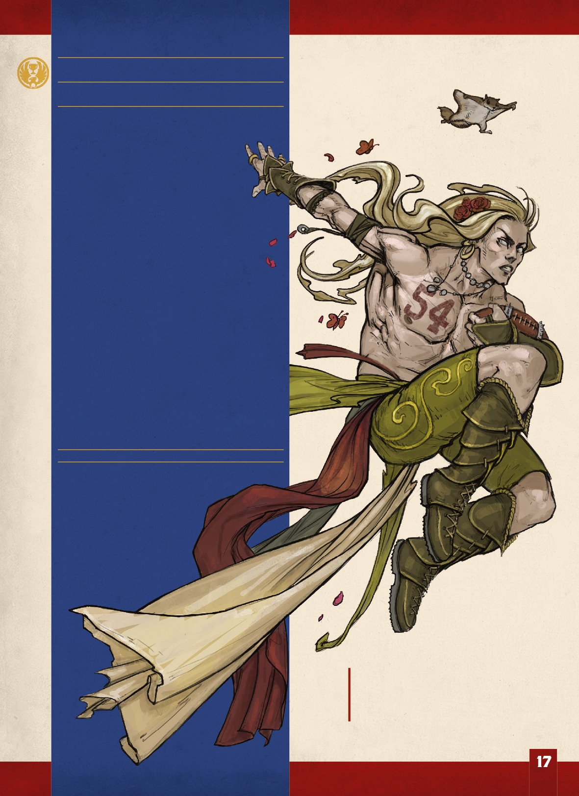*advanced through a number of
supporting*
*roles until she was recruited to the team's*
*cheerleading squad in 2448 and became an*
*overnight sensation.*
>
*The following decades were a whirlwind of fame and* *fortune for
Galandril; as well as being an exceptionally-* *talented dancer,
overfloowing with charisma, she had a* *small amount of innate magical
ability which she put*
*to use in creating breathtaking half-time displays. She* *changed
teams a few times until she accepted a long-* *term contract with the
Elfheim Eagles for an incredible* *sum of money - more than most
professional players, let* *alone cheerleaders. In 2487, she decided
to step back* *from front-line duties ("leave that to the
two-hundred*
*year olds," she quipped in a Spike! Magazine interview)*
*to spend more time working on her ongoing series of* *memoirs. She
still makes her services available to teams* *whose cheer squads could
use a little extra pep, but it's* *clear that she does it for the love
of the sport rather than* *the money - after all, it's rumoured that
she has enough* *squirrelled away to buy out the Blood Bowl
tournament* *fivve times over!*
>
"G0 TEAM!"
Each time Galandril's team rolls Cheering Fans on
the Kick-off Event table, add D3 to the number of cheerleaders the
team has if the team does not have any cheerleaders, it counts as
having one. In addition, each time Galandril's team makes a roll on
the Prayers to Nufflee table, if a natural 15 or 16 is rolled on the
D16
(or, if a D8 is being rolled as in exhibition play, if
a natural 8 is rolled), the team gains an
additional team re-roll.
>
"Elves might not have discovered Blood Bowl, but you'd better believe
we're the best at it!"
>
*Prince Moranion*
>
0-1 (IN)FAM0US C0ACHING STAFF INDUCEMENT: KR0T SH0CKWHISKER
70,000 G0LD PIECES, AVAILABLE T0 ANY TEAM WITH THE 'UNDERW0RLD
CHALLENGE' SPECIAL RULE *Although many perceive Skaven to be little
more than a* *horde of verminous pests, their culture has many
merits.* *While there is no doubt that they are vicious,
cannibalistic* *and spiteful, they are also masters of engineering
and* 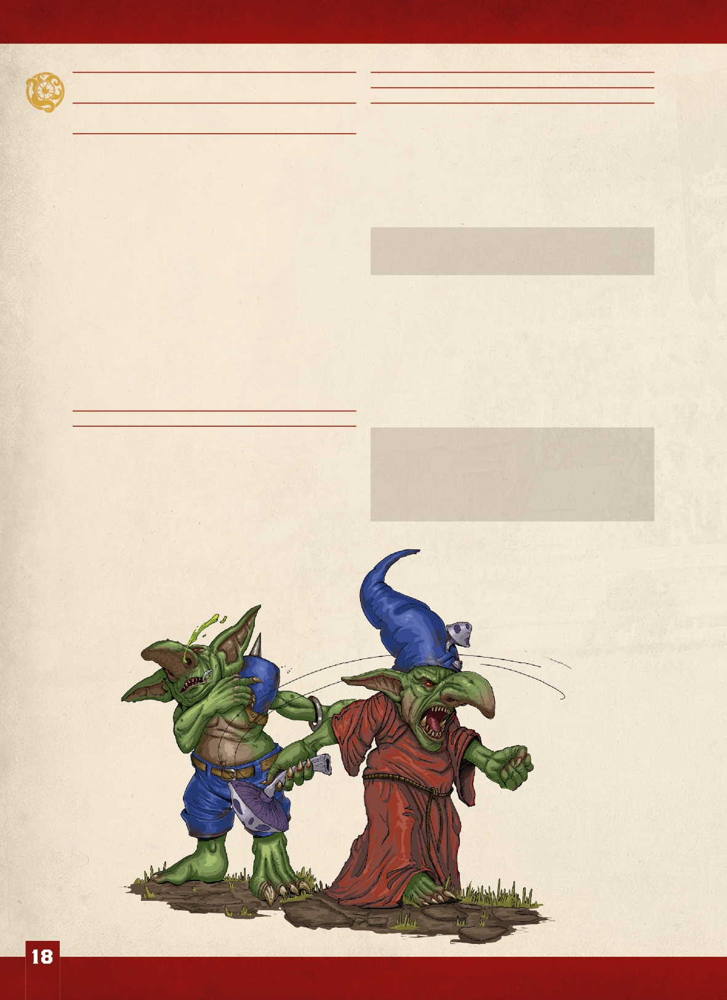*fleesh-crafting, to a degree that other
races could not hope* *to achieve.*
>
*Entire clans dedicate themselves to the singular* *pursuit of
advancement in these fieelds, and their work -*
>
*while often grotesque and terrifying - shows undeniable* *genius.
Krot Shockwhisker is particularly skilled in the* *melding of fleesh
and technology, having spent many years* *studying and replicating the
best of his peers' creations.* *To financce his experiments, he offers
his services to* *teams who do not ask questions. Fallen players are*
*brought to his specially-equipped corner of the dugout,* *and he sets
to work..*
>
"A NEW PLAYTHI... ER, PATIENT!"
Once per game, during Step 2 of the End of Drive sequence, Krot can
experiment on a player who has
been removed from play as a Casualty, in an attempt to get them back
out there. Choose a player that is in the Casualty box of Krot's team
dugout (not a Mercenary or a Star Player). This may even be a player
that has suffered
a Casualty table result of 15-16, DEAD. Roll a D6 on the table
opposite and apply the result to the chosen player:

"A NEW PLAYTHI... ER, PATIENT!"

D6 RESULT
>
1 *There Were.. Complications:* The player's
>
condition has worsened. The coach of the opposing team rolls on the
Casualty table
to determine exactly what has happened to
>
the player. The result of this roll is applied immediately, in
addition to any other Casualty table results already applied. Note
that multiple Miss Next Game results do not stack.
>
2-3 *Useless Flesh-thing!* Krot's tinkering has
>
no effect and the player remains in the
Casualty box.
>
4-5 *Flawed Execution:* The player is returned to the
>
Reserves box and can be set up with the rest of the team. However,
until the end of the next drive, they gain the Really Stupid (4+)
trait.
If they already have the Really Stupid (4+) trait,
it is replaced with the Really Stupid (5+) trait. At the end of this
drive, the player is returned to the Casualty box, where the effects
of the Casualty
roll that was previously made against them are applied as normal.
>
6 *Witness Perfection!* The player is returned to
the Reserves box and can be set up with the rest
>
of the team. At the end of this drive, the player is returned to the
Casualty box, where the effects
of the Casualty roll that was previously made against them are applied
as normal.

Ayleen Andar 0-1 (IN)FAM0US C0ACHING STAFF INDUCEMENT:

AYLEEN ANDAR
100,000 G0LD PIECES, AVAILABLE T0 ANY TEAM
*Talent scouts have become a major part of modern Blood Bowl.*
*These expert assessors of rookie talent travel the world far and
wide,* *sometimes in packs, seeking out those young players that show
the* *most ability and hoping to snap them up on behalf of their
employer* *before an unscrupulous agent does!*

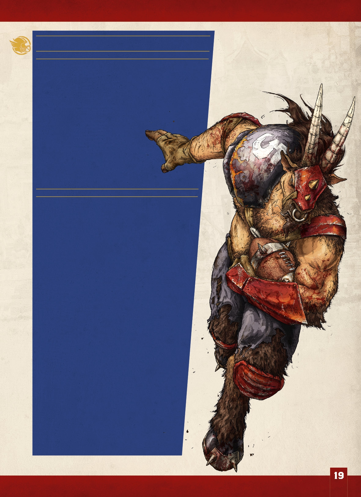

*Ayleen Andar is a talent scout of particular note and in high*
*demand with coaches and team owners alike. Ayleen scours the Old*
>
*World from end to end, tracking down only the best young players.*
*In her time, she's found some of the most*
*renowned players on the circuit and given*
*them their big break. True, talent scouts*
*travel a lot and have to witness some truly*
*terrible Blood Bowl being played, but as Ayleen*
*always says: "Claiming one's expenses back from*
*the client more than makes up for it!"*
>
"THIS KID HAS REAL P0TENTIAL!"
If your team took on any Journeymen during Step 3 of the pre-game
sequence, Ayleen will ensure that they are the best, and all are eager
to impress!
>
Roll a D6 for each, applying a -1 modifierr to the roll for each
Journeyman taken on:
>
• On a roll of 1 or less, the Journeyman is a team player, but doesn't
show any particular talent. The Journeyman loses the
>
Loner (4+) trait.
• On a roll of 2-5, the Journeyman has some potential.
>
The Journeyman gains a single randomly selected Skill from one of
their Primary skill categories.
>
• On a roll of 6, Ayleen has produced a player with real star quality!
The Journeyman gains two randomly selected Skills
>
from one of their Primary skill categories.
>
Each Journeyman counts towards CTV as normal; their value does not
increase for any Skills they may have. Journeymen provided by Ayleen
may be permanently hired during Step 4 of the post-game sequence as
normal, but doing so will cost an additional 10,000 gold pieces per
Skill.
>
0-1 (IN)FAM0US C0ACHING STAFF INDUCEMENT: PR0FESS0R FRÖNKELHEIM
130,000 G0LD PIECES, AVAILABLE T0 ANY TEAM
WITH THE 'SYLVANIAN SP0TLIGHT' SPECIAL RULE *Where most Necromancers
are quiet and reserved sorts* *who enjoy nothing more than rooting
around in graveyards* *and mausoleums looking for raw materials on
which to* *practice their craft, some are distinctly larger-than-life*
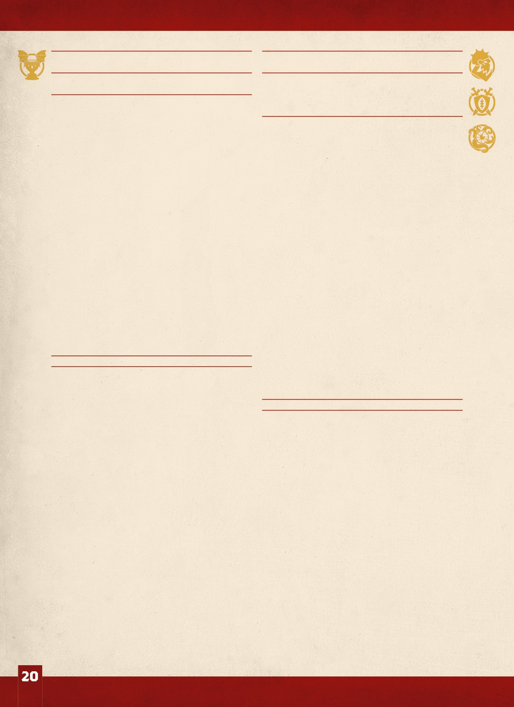*characters who just seem destined to
attract attention*
*and controversy!*
>
*Professor Frdnkelheim is such a character. Formerly*
*a lecturer at the University of Altdorf, the good professor*
>
*has been hounded out of more towns ahead of an angry,*
*torch-wielding mob than a Halflinng has had hot dinners.*
*A student of anatomy, Frdnkelheim gained notoriety for*
*his experiments in performance-enhancing surgery.* *Believing he
could use the discarded parts of deceased* *players to improve others,
Frdnkelheim soon discovered* *that the people of the Empire weren't so
keen on such* *strange science. Having his laboratory burned down
led*
*the professor to suspect that ordinary people lacked*
*vision. Having another two dozen or so burned down since* *then has
made him certain! These days, Frdnkelheim* *resides somewhere in
Sylvania, where the locals are more* *accepting of his peculiar ways,
and funds his research*
*by.. modifying players for local Blood Bowl teams.*
>
"HAVE Y0U TH0UGHT AB0UT AN UPGRADE?"
During the pre-game sequence, after Step 4 but before Step 5, randomly
select D3 players on your team that are eligible to play during this
game. These players have been modifiedd by the professor.
>
Until the end of this game, each selected player gains
a single randomly selected Skill from the Mutations category. However,
at the start of Step 3 of the post-game sequence, roll a D6 for each
of these players (unless they suffered, and did not recover from, a
Casualty table result of 15-16, DEAD during the game):
>
• On a roll of 1, the experiment proves a bit of a
failure, really. The player immediately loses the Skill.
>
In addition, the player must miss the next game,
exactly as if they had suffered a Casualty table result
of 7-9, Seriously Hurt, during this game.
>
• On a roll of 2-5, the experiment proved only a short- lived success.
The player immediately loses the Skill.
>
• On a roll of 6, the professor's experiments have proven
>
a total success! The player retains the Skill without having to spend
any SPP (note that you must adjust their Current Value accordingly, as
if the player had randomly selected a Secondary skill).

0-1 (IN)FAM0US C0ACHING STAFF INDUCEMENT: MUNG0 SPINECRACKER 80,000 G0LD
PIECES, AVAILABLE T0 ANY TEAM
WITH EITHER THE 'BADLANDS BRAWL', '0LD W0RLD CLASSIC' 0R 'UNDERW0RLD
CHALLENGE'
SPECIAL RULES
*Sports physiotherapy is a relatively new science in the* *world of
Blood Bowl, though calling such a brutal practice* *a 'science' might be
stretching the meaning of the word*
*to breaking point, which, coincidentally, is a rather finee*
*description of what practitioners do to their patients!*
*The practice was developed, almost by accident, in the* *Badlands by
Orcs who found that many injuries involving* *dislocated joints could be
fixxed with the application of* *brute force. In fact, the mere threat
of carefully-applied* *brutality was found to be a wonderful motivator
for all but* *the most hopelessly unconscious of players. The threat of*
*being ministered to by a trained expert in physical terror* *can make
most common ailments simply disappear!*

*Mungo Spinecracker is a renowned expert in the fieeld,* *an Orc that
has honed his natural ability to inflicct pain on* *a body to an art
form. Amongst Mungo's most well-known* *and feared techniques are
numerous moves that would*

*be more at home in a wrestling match than a sick bay.*
*But it is Mungo's patented 'firrm sports massage' that most*
*terrifiees his patients. Mungo is always quick to defend*
*his methods, of course, claiming that savagely punching* *and kicking a
prone patient "gets da blood pumpin'",*
*and that, should the gurney collapse, the sudden shock* *"rebalances da
humours"!*

"I'M FINE THANKS, MUNG0!"
Whenever a player on your team suffers an Injury result of 8-9, KO'd (or
of 7-8, KO'd on the Stunty Injury table), you may roll a D6 before
removing them from play:

• On a roll of 1, the player's protestations fall upon
deaf ears and Mungo 'treats' his patient. The player

becomes a casualty and is immediately removed from play and placed in
the Casualty box of their team dugout. No Casualty roll is made.
Instead, a Badly Hurt result is automatically applied against them.

• On a roll of 2-4, the player is badly pummelled but suffers neither
lasting harm nor noticeable benefit..

The player is removed from play and placed in the Knocked-out box of
your team dugout as normal.

• On a roll of 5 or 6, the player regains their senses

remarkably quickly and is able to fend off the ministrations of the
Orc. The player remains on the pitch and becomes Stunned.
>
Fink da Fixer
>
0-1 (IN)FAM0US C0ACHING STAFF INDUCEMENT: FINK DA FIXER
90,000 G0LD PIECES, AVAILABLE T0 ANY TEAM WITH EITHER THE 'BADLANDS
BRAWL' 0R 'UNDERW0RLD CHALLENGE' SPECIAL RULES
*Goblins are renowned for their sneaky, devious behaviour* *but, every
once in a while, one will rise to prominence*
*who makes the rest of them look as slow-witted as Trolls*
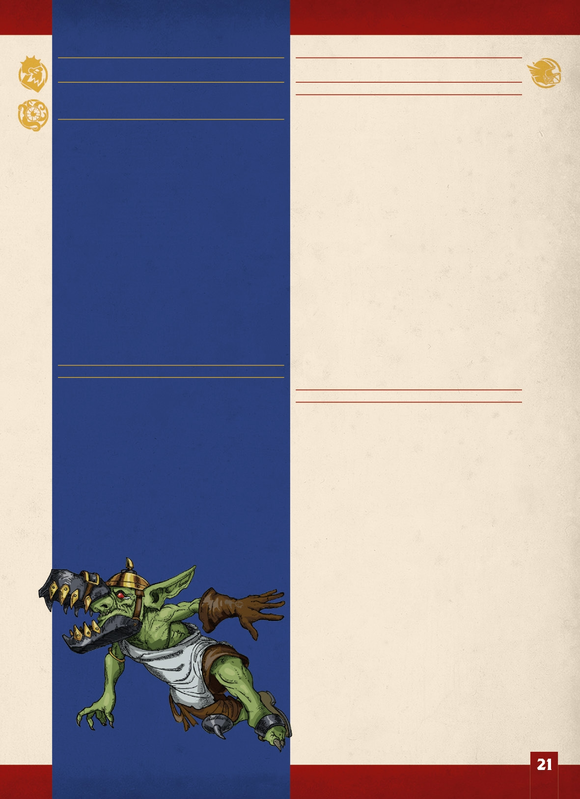*by comparison. Fink da Fixer was never
the tallest or* *quickest, but wherever he went, he was the most
quick-* *witted Goblin around. He started his Blood Bowl career*
*playing with the Thunder Valley Greenskins, but was* *promoted to
assistant coach when his shrewd grasp of* *tactics was noticed by head
coach, Frugg One-eye.*
>
*It wasn't long before he was practically running the* *team, and then
only a matter of time before he outgrew*
>
*the Greenskins. He set himself up as an independent* *contractor, and
the rest is history! Now he can be found* *on the sidelines in all
corners of the circuit, clipboard in* *hand, making sure the rest of
the coaching staff have* *everything they need a few seconds before
they need it,* *greasing the palms of the officialss and generally
making* *himself indispensable.*
>
"Y0U G0T IT, B0SS!"
Once per game, when your team uses a Bribe, you may re-roll the D6 to
see if the Bribe is effective. In addition, when rolling on the Argue
the Call table, a coach who has hired Fink treats a roll of 5 or 6 as
a "*Well, When You Put*
*It Like That..* result and a roll of 2-4 as an *"I Don't Care!"*
result. However, on a "*You're Outta Here!* result, Fink is Sent-off
along with the coach and will play no further part in the game.

0-1 (IN)FAM0US C0ACHING STAFF INDUCEMENT: SCHIELUND SCHARLITAN 90,000
G0LD PIECES, AVAILABLE T0 ANY TEAM
*Player agents are an essential, if unpopular, part of the* *game;
everybody needs them, but no one particularly* *wants them. Most players
recognise the importance of* *having a good agent to secure them a fair
contract, but* *resent paying them a 15% cut of their salary. Most head*
*coaches and team owners recognise the value in a good* *agent who keeps
their players happy and feeds their egos,* *but findd it hard to
discipline an egotistical player whose* *agent knows how to terminate
their contract!*

*Schielund Scharlitan is one of the most well-known*
*agents in all the Old World, a decidedly greasy individual* *renowned
for his ruthless ability to latch onto even the* *most talentless of
players. Scharlitan is an expert at* *manipulating the press, building
his clients' egos to the* *point they believe they have the makings of a
superstar,* *even when they display no discernible talent! Such*
*interest often does wonders for a player's self-belief. Sadly* *for
most of his clients, he tires very quickly of players, and* *more than a
few have found themselves struck from his* *books and tied into an
unbreakable contract with a head* *coach who suddenly and inexplicably
wants to make their* *lives a misery!*

"I'LL MAKE Y0U A STAR!"
During the pre-game sequence, after Step 4 but before Step 5, randomly
select D3 players on your team that are eligible to play during this
game. These players have been approached by Scharlitan, and his interest
is having a noticeable effect on their attitude!

Until the end of this game, each selected player gains the Pro skill.
However, at the start of Step 3 of the post-game sequence, roll a D6 for
each of these players (unless they suffered, and did not recover from, a
Casualty table result of 15-16, DEAD during the game):

• On a roll of 1, that player has begun to act like they
are the next big thing. The agent tires of his client and

drops them, but the exposure has gone to their head. The player gains
the Loner (2+) trait.

• On a roll of 2-5, the agent simply drops the player from

his books. They might be disappointed, but they'll get over it.

• On a roll of 6, the agent tires of his client and drops them, but the
exposure has been good for them. The

player permanently retains the Pro skill without having to spend any
SPP (note that you must adjust their Current Value accordingly, as if
the player had chosen
a Primary skill).
>
Wizards
>
Wizard

**0-1 WIZARD**
PRICE VARIES, AVAILABLE T0 VARI0US TEAMS

ver the years, Wizards in Blood Bowl have brought sports viewers more
joy than almost any other form of outside interference, and the fans
never

tire of seeing their favourite stars turned into hopping amphibians or
sticks of charcoal. It's hilarious!

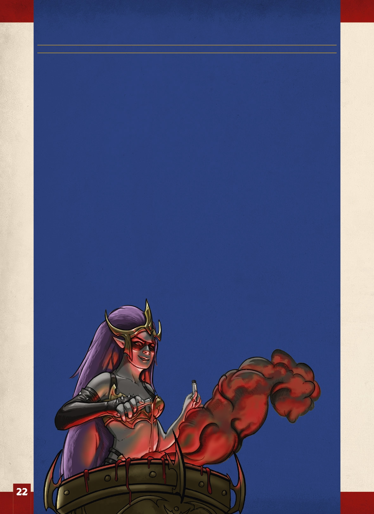Wizards, just like everybody else in the
known world, are keen sports fans and many are fanatically loyal in
support of their chosen team. It is hardly surprising that,
in the early days of Blood Bowl, Wizards of all stripes
would 'help out' the team they supported with carefully- selected
spells. Soon, games were awash with magic as rival Wizards battled to
give their team the edge. In the end, the Colleges of Magic were forced
to step in at the NAF's request and insist that in order to have magical
aid teams must have purchased, at an exorbitant fee to cover admin costs
and handling, a special permit from the new governing body for such
things (the Colleges of Magic,
as it turned out). They limited this aid to one spell per match, and
even this had to be chosen from a very limited spellbook and cast by an
officiallly-appointed Colleges of Magic Sports-Wizard, whom in turn had
to have a special license from the new governing body for such things
(that's right, the Colleges of Magic!). Wizards and fans
alike soon realised that what they really wanted to see
was a proper Blood Bowl match rather than a spellcasting contest, so the
new rules were soon universally accepted.

Today, Wizards of all types are drawn to Blood Bowl stadia on game day.
From those belonging to the Arcane

Colleges, to powerful Elven mages, Sorcerers and Shamans of Chaos, and
even, in rare circumstances, the near-mythical Slann Mage-priests of
Lustria. All findd ready employment with the many Cabalvision networks,
as it takes huge amounts of magical energy to capture the action and
beam it globally to the crystal balls and magic mirrors of Cabalvision
subscribers around the world.

Consequently, there are always Wizards to be found at any given
fixtture, card-carrying members of the Colleges
of Magic, all more than happy to moonlight for a team wishing to secure
their assistance.

No team may purchase more than one Wizard Inducement per game.

Some Wizards are named, although most are not. It is possible for both
teams to hire the services of the same named Wizard:

• If this happens during a game that is part of a league,

neither team can use the named Wizard but the named Wizard will keep
both hiring fees.

• If this happens during exhibition play, both teams can

use the named Wizard one team has clearly hired
a ringer!

If a Wizard Inducement is not named, there is no restriction on both
teams fieelding the same type.

Chaos Sorcerer

0-1 WIZARD INDUCEMENT:
CHA0S S0RCERER
150,000 G0LD PIECES, AVAILABLE T0 ANY
TEAM WITH EITHER THE 'FAV0URED 0F...' 0R 'UNDERW0RLD CHALLENGE'
SPECIAL RULES
*The Sorcerers of Chaos are potent spell-slingers*
*who manipulate the raw stuff of magic to their will.*
*There is little subtlety about their craft, and it can be*
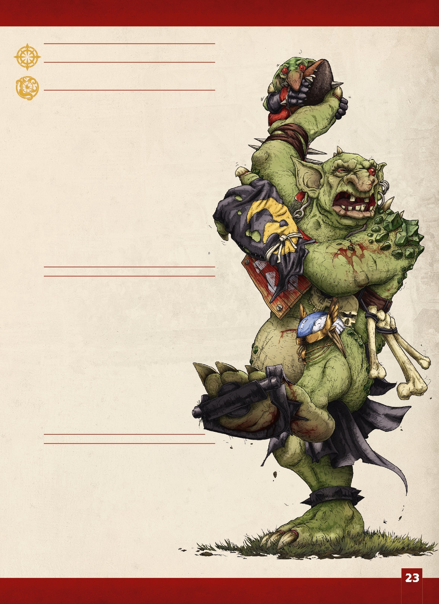*as devastating and destructive as it
can be ficckle. Such* *masters of Dark Magic can be found in all the
tribes of*
*the north, and readily answer the call of their Dark Gods* *to
accompany Chaotic teams in their adventures in Blood* *Bowl. What
separates these Sorcerers from the mages*
*of the south is that their power is instinctual, a gift given*
*by their gods rather than an art carefully studied and* *managed.
This can lead to some unexpectedly amusing* *spell effects when things
go wrong and, as a result, Chaos* *Sorcerers are ever popular with the
fans who love nothing* *more than to see a player turned into
something very*
*odd mid-game.*
>
Once per game, a Chaos Sorcerer may cast one of the following spells:
>
THUNDERB0LT
You may cast this spell either at the start of any of the opposition's
team turns, before any player is activated, or immediately after any
of the opposition's team turns has ended. Target any Standing
opposition player anywhere on the pitch, and roll a D6:
>
• On a roll of 3+, the player has been hit by
>
the Thunderbolt.
• On a roll of 1 or 2, the player manages to duck
>
or dodge the attack.
>
A Standing player hit by a Thunderbolt is
Knocked Down. When a player is Knocked Down by a
>
Thunderbolt, you may apply a +1 modifierr to either the Armour roll or
Injury roll. This modifierr may be applied after the roll has been
made.
>
RAMPANT MUTATI0N
You may cast this spell at the start of any of the opposition's team
turns. Choose a player on your team from among those on the pitch, and
roll a D6:
>
• On a roll of 2+, until the end of this drive that player
>
gains two Mutation skills of your choice.
• On a roll of 1, the player becomes a writhing mass
>
of fleesh as raw chaos energy floows through them momentarily. The
player gains the Disturbing Presence skill until the end of this
drive.
>
0-1 WIZARD INDUCEMENT: DRUCHII SP0RTS S0RCERESS
150,000 G0LD PIECES, AVAILABLE T0 ANY TEAM WITH EITHER THE 'ELVEN
KINGD0MS LEAGUE' 0R 'FAV0URED 0F...' SPECIAL RULES *The Dark Elves are
a race steeped in*
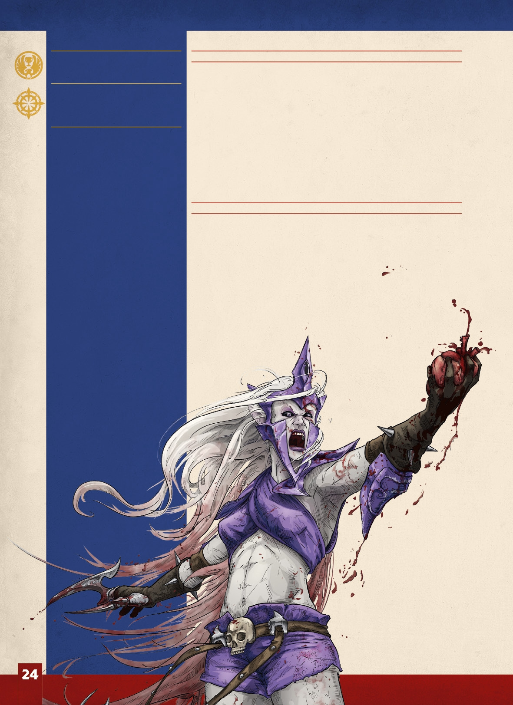*magic, yet the vast majority of Dark*
*Elf magic users are female, belonging* *to an ancient cabal founded
by the* *infamous mother of the Druchii king.* *Rumour has it that the
dark arts* *practiced by these potent mages are* *actually derived
from the favour of*
*the Chaos god Slaanesh, granting* *their power a far more sinister
nature* *than the wholesome high magic* *practiced by the Wizards of
Ulthuan.* *Whatever the source of their magical* *might, the Dark
Elves have never*
*been shy to use it to their benefitt*
*on the Blood Bowl pitch, be it within* *the tight guidelines laid
down by the* *Colleges of Magic, or in more subtle,* *underhanded ways
such as the* *micro-spells the Darkside Cowboys*
*are reported to utilise.*
>
Once per game, a Druchii Sports Sorceress may cast one of the
following spells:

THUNDERB0LT
You may cast this spell either at the start of any of the opposition's
team turns, before any player is activated, or immediately after any of
the opposition's
team turns has ended. Target any Standing opposition player anywhere on
the pitch, and roll a D6:

• On a roll of 3+, the player has been hit by the Thunderbolt.
• On a roll of 1 or 2, the player manages to duck or dodge the attack.

A Standing player hit by a Thunderbolt is Knocked Down. When a player is
Knocked Down by a Thunderbolt, you may apply a +1 modifierr to either
the Armour roll or Injury roll. This modifierr may be applied after the
roll has been made.

0NE TH0USAND CUTS
You may cast this spell at the start of any of the opposition's team
turns, before any player is activated. Target any opposition player
anywhere on the pitch, and roll a D6:

• On a roll of 3+, the player is hit by a swirling storm of incorporeal

dark magic.
• On a roll of 1 or 2, the magic engulfs the player brieflyy before the
spell

dissipates harmlessly.

Until the end of this drive, the MA, ST, and AG characteristics of a
player hit by One Thousand Cuts are reduced by 1.

0-1 WIZARD INDUCEMENT: ASUR HIGH MAGE 150,000 G0LD PIECES, AVAILABLE
T0 ANY TEAM
WITH THE 'ELVEN KINGD0MS LEAGUE' SPECIAL RULE *The mages of Ulthuan
are among the most accomplished* *of magic users in the entire known
world. Noble and*
*proud, like all Elven kind, Asur mages spend many*
*decades and centuries studying their craft. Where the* *magic
wielders of other races will often focus their*
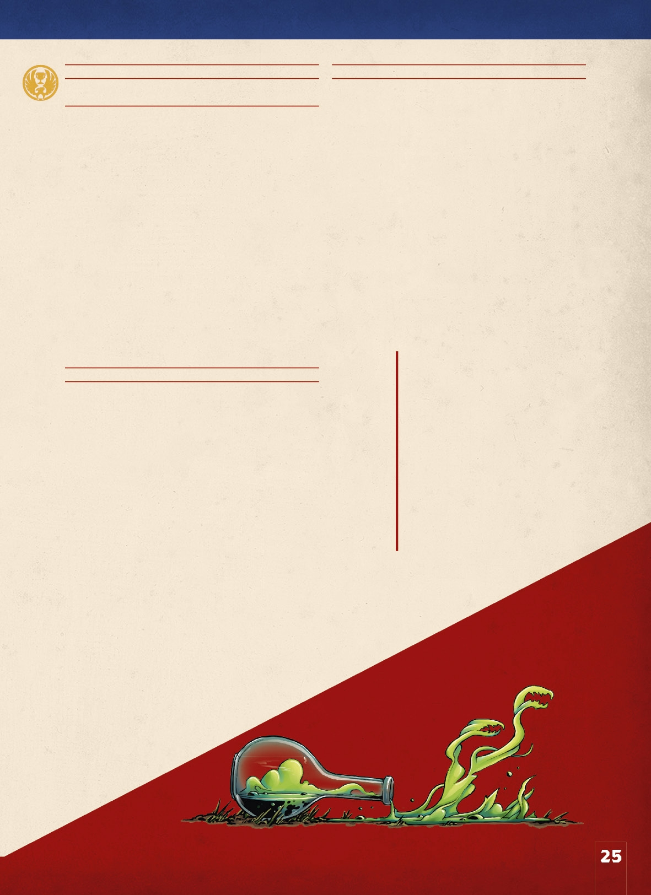*endeavours upon mastering one of the
eight winds of* *magic that floow around the world, High Elf mages
study*
*the discipline of each in equal measure. The art of High* *Magic, as
it is known, is difficcult beyond imagining,*
*and more than one young apprentice has managed to* *accidentally
flicck their brain out of their ear when trying*
*to balance the potent energies that course through*
*their bodies! Such disciplined mages rarely waste their* *valuable
time following Blood Bowl, but that's not to say* *that there aren't
those who do!*
>
Once per game, an Asur High Mage may cast one of the following spells:
>
TEMP0RAL DIST0RTI0N
You may cast this spell immediately after any of the opposition's team
turns has ended. Magical energy fillss the stadium, causing the
passage of time to slow down or speed up as the High Mage wishes.
>
You may attempt to move both teams' turn markers forwards or backwards
one space, effectively causing
both teams to gain an extra turn this half or lose one of
the remaining turns. Both turn markers must move in the same
direction. Declare whether you wish to move the
turn markers forwards one space or backwards one space and roll a D6:
>
• On a roll of 5+, the spell is successful and the turn
>
markers are moved.
• On a roll of 1-4, the stadium fillss with light and the
>
strangely localised effects cause the High Mage to rapidly age or
become unexpectedly more youthful, but otherwise the spell has no
effect.

THUNDERB0LT
You may cast this spell either at the start of any of the opposition's
team turns, before any player is activated, or immediately after any of
the opposition's team turns has ended. Target any Standing opposition
player anywhere on the pitch, and roll a D6:

• On a roll of 3+, the player has been hit by

the Thunderbolt.
• On a roll of 1 or 2, the player manages to duck or

dodge the attack.

A Standing player hit by a Thunderbolt is Knocked Down. When a player is
Knocked Down by a Thunderbolt,

you may apply a +1 modifierr to either the Armour roll or Injury roll.
This modifierr may be applied after the roll has been made.

HACKSPIT
QUILLCHEWER'S FUN FACTS *Back in the early days of the modern* *game,
the NAF dictated that Blood* *Bowl pitches should be exactly*
*100 paces by 60 paces, and it was* *many decades before the RARG*
*standardised these measurements.*
*The team that most famously abused* *these vague guidelines was the
Bifrost* *Berserkers - their home fieldd was so* *huge that visiting
teams had to hire*
*a party of local guides to findd the*
*line of scrimmage!*
>
0-1 WIZARD INDUCEMENT:
SLANN MAGE-PRIEST
200,000 G0LD PIECES, AVAILABLE T0 ANY TEAM WITH THE 'LUSTRIAN
SUPERLEAGUE' SPECIAL RULE *Servants of the near-mythical Old Ones,
Slann Mage-* *priests are among the most ancient creatures in the*
*known world and are easily the greatest magic users in*
*all of existence. Legend tells that at the dawn of time, the*
*Slann served their masters, shaping the
world to suit their* *purposes, raising entire mountain ranges and
levelling* *others, moving continents, even bringing the very world*
*closer to the sun. Nothing was beyond the power of the* *Slann!
Today, however, they sleep through the*
*long aeons, waking only rarely to ensure their masters'* *plans are
followed or to check upon their favourite team's* *performance! Rarely
is a Slann seen at pitch side, and* *when they are they often sleep
through the whole game.* *Yet this torpor does little to limit the
influencce these most* *potent of mages can have as, even dreaming,
they can* *alter the shape of reality!*
>
Once per game, a Slann Mage-priest may cast one of the following
spells:

TEMP0RAL DIST0RTI0N
You may cast this spell immediately after any of the opposition's team
turns has ended. Magical energy fillss the stadium, causing the passage
of time to slow down or speed up as the Mage-priest wishes.

You may attempt to move both teams' turn markers forwards or backwards
one space, effectively causing
both teams to gain an extra turn this half or lose one of
the remaining turns. Both turn markers must move in the same direction.
Declare whether you wish to move the
turn markers forwards one space or backwards one space and roll a D6:

• On a roll of 5+, the spell is successful and the turn

markers are moved.
• On a roll of 1-4, the stadium fillss with light and the

strangely localised effects cause the Mage-priest to suddenly develop
a few more warts and wrinkles, but otherwise the spell has no effect.

TECT0NIC SHIFT
You may cast this spell at the start of any of the opposition's team
turns, before any player is activated. For the duration of this team
turn, there is a -1 modifierr applied to the dice roll every time an
opposition player attempts to Rush.

Note that this modifierr applies alongside any other modifierrs that
apply to attempts to Rush.

REALITY BLINKS
You may cast this spell either at the start of any of the opposition's
team turns, before any player is activated,
or immediately after any of the opposition's team turns
has ended. Choose two Standing players from your team that do not have
the Loner (X+) trait and that are not in possession of the ball from
among those on the pitch, and roll a D6:

• On a roll of 3+, these two players immediately

switch places.
• On a roll of 1 or 2, the players become slightly

transparent as they waver between realities! Until the start of your
next team turn, these two players lose their Tackle Zone and gain the
No Hands trait.
>
0-1 WIZARD INDUCEMENT: H0RTICULTURALIST 0F NURGLE
150,000 G0LD PIECES, AVAILABLE T0 ANY TEAM
WITH EITHER THE 'FAV0URED 0F NURGLE' 0R 'UNDERW0RLD CHALLENGE' SPECIAL
RULES
*Wherever Nurgle's followers travel, a gruesome flourrishing* *of
fresh life follows, be it squirming, maggoty worms or*
*the vigorous growth of strange florra. Stadia dedicated*
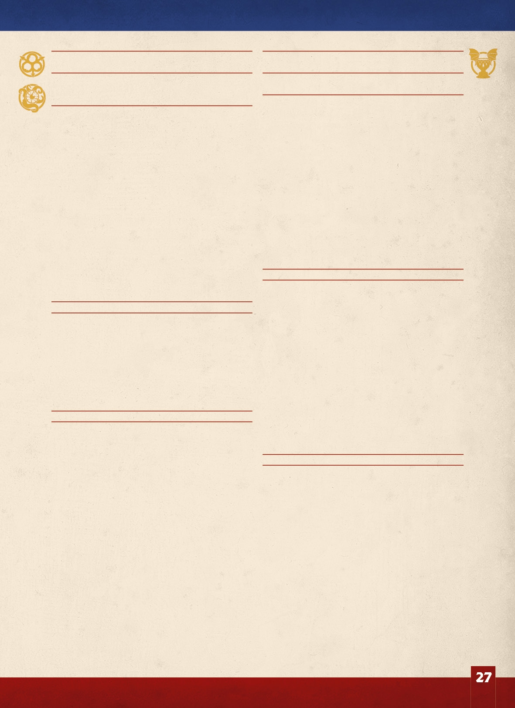*to Nurgle are particularly worrisome,
for even as the*
*walls and stands decay, the pitch writhes with life, the*
*soil churning and bulging as peculiar plants burst forth,* *before
rotting away in a moment. It is not uncommon for* *the
Horticulturalists who tend these pitches to travel with* *their teams,
spreading their knowledge to other grounds* *and bringing with them
the seeds of Nurgle's garden to* *sow in the mortal world. Such
fellows, jolly though they*
*are, are unpopular with the groundsmen of the Old World,* *and many
times various bodies have attempted to impose* *strict rules that
would prevent their interference!*
>
Once per game, a Horticulturalist of Nurgle may cast one of the
following spells:
>
VIG0R0US GR0WTH
You may cast this spell at the start of any of the opposition's team
turns, before any player is activated. For the duration of this team
turn, there is a -2 modifierr applied to the dice roll every time an
opposition player attempts to Rush.
>
Note that this modifierr applies alongside any other modifierrs that
apply to attempts to Rush.
>
STRANGE FL0RA
You may cast this spell either at the start of any of the opposition's
team turns, before any player is activated, or immediately after any
of the opposition's team turns has ended. Choose an empty target
square anywhere on the pitch and nominate D3 Standing opposition
players that are within two squares of the target square. Roll a D6
for each nominated player:
>
• On a roll of 3+, the player is unexpectedly attacked by daemonic
plants of prodigious size that erupt from the
>
loamy earth before rapidly rotting away to nothing.
• On a roll of 1 or 2, the player manages to duck and
>
avoid the attacking florra.
>
Any Standing players hit by Strange Flora are Knocked Down. When a
player is Knocked Down by Strange Flora, you may apply a +1 modifierr
to either the Armour roll or Injury roll. This modifierr may be
applied after the roll has been made.

0-1 WIZARD INDUCEMENT:
SP0RTS NECR0THEURGE
150,000 G0LD PIECES, AVAILABLE T0 ANY TEAM
WITH THE 'SYLVANIAN SP0TLIGHT' SPECIAL RULE
*Not all practitioners of dark magic are inclined to run*
*their own teams. A great many prefer the steady wages* *and stress-free
work offered by the various Cabalvision* *networks, pursuing their own
interests in their spare time* *(everyone needs a hobby). In these more
enlightened* *times, Necromancers are also far more welcome within*
*the various Colleges of Magic, enabling them to offer their* *services
to coaches in need as hireling Wizards. Due to* *their singular and
all-consuming passions though, they* *tend to stick to what they know
and, rather than hurling* *firreballs, are usually hired to coax a bit
of extra potency* *from the players!*

Once per game, a Sports Necrotheurge may cast one of the following
spells:

INC0RP0REAL
You may cast this spell at the start of any of the opposition's team
turns, before any player is activated. Target any Standing opposition
player anywhere on the pitch, and roll a D6:

• On a roll of 3+, the player is hit and becomes

strangely incorporeal!
• On a roll of 1 or 2, the player brieflyy becomes eerily

luminous, before the spell dissipates harmlessly.

A player hit by Incorporeal gains the No Hands trait and, if they are in
possession of the ball, will immediately

drop it, causing it to bounce. Additionally, the player loses their
Tackle Zone. The effects of Incorporeal last until the start of the
opposition's next team turn.

VANHALABLE'S DANSE MACABRE
You may cast this spell immediately after any of the opposition's team
turns has ended. Roll a D6:

• On a roll of 3+, your players are suffused with dark vitality. During
this team turn, each Lineman positional

player on your team that is currently on the pitch (including
Journeymen) may improve either their MA, AG or PA by 1. You may choose
which of these three bonuses each affected player gains when that
player
is activated.

• On a roll of 1 or 2, the sky darkens and the players

jerk and spasm furiously, but the spell has no
further effect.

Wicked Witch 0-1 WIZARD INDUCEMENT: WICKED WITCH

150,000 G0LD PIECES, AVAILABLE T0 ANY TEAM
WITH EITHER THE '0LD W0RLD CLASSIC', 'SYLVANIAN SP0TLIGHT' 0R
'UNDERW0RLD CHALLENGE'
SPECIAL RULES
*Wizards are a common sight all across the Old World,*
*and most belong to one of the many Colleges of Magic* *(even
Necromancers have come out of the shadows*
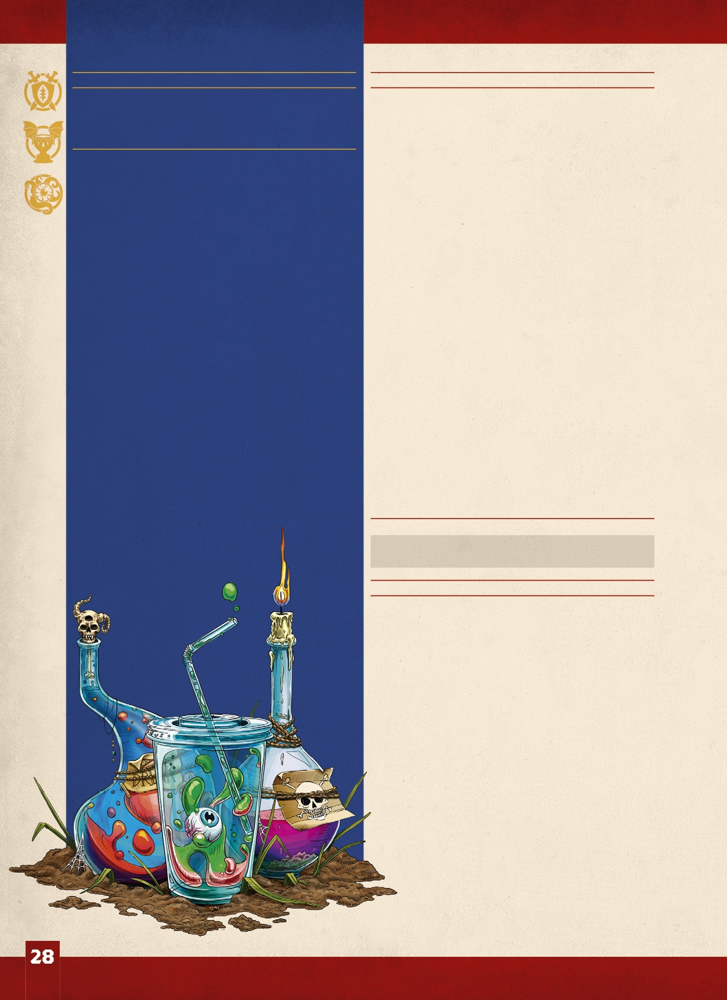*in recent years), but Witches remain
somewhat more* *elusive. Witches don't belong to any formal College*
*or guild, and rarely express much interest in working*
*for a Cabalvision network. Instead they practice a more* *spiritual,
naturalistic form of magic, often referred to as* *'hedge magic' by
their magical peers within the Colleges.* *Most small towns and
villages are home to one or*
*more Witches, who normally make a comfortable living* *selling
magical cures to those maladies that commonly* *afflicct people living
in small towns, such as plagues of* *warts. What many don't realise is
that these Witches*
*are powerful magic users that deal in potent curses and* *many,
varied types of hex. All too often, the ailment the* *local Witch is
asked to cure is one that has been visited* *upon the sufferer by the
Witch herself!*
>
Once per game, a Wicked Witch may cast one of the following spells:

ZAP!
You may cast this spell either at the start of any of the opposition's
team turns, before any player is activated, or immediately after any of
the opposition's team turns has ended. Target any opposition player and
roll a D6:

• If the roll is equal to or higher than the player's Strength
characteristic, or is a natural 6, that player

turns into a Frog for the remainder of the drive,
after which their coach will secure emergency magical assistance to
turn the player back into their original form.

• If the roll is lower than the player's Strength characteristic, the
player develops a fresh crop of

warts, but the spell has no further effect.

If the player was in possession of the ball when they were turned into a
Frog, it is dropped and will bounce. When a roll on the Casualty table
is required against the Frog, no roll is made. Instead, it is
automatically treated
as if a 1-6, Badly Hurt result had been rolled. The Frog must miss the
rest of the game and cannot be patched-up by an apothecary (because it's
a frog!). At the end of the game, the player is returned to their normal
shape with no ill effects.

The Frog has the following profilee:

MA ST AG PA AV Frog 5 1 2+ - 5+

Skills & Traits Dodge, Leap, No Hands, Stunty,
>
Titchy, Very Long Legs

PLAGUE 0F WARTS
You may cast this spell at the start of any of the opposition's team
turns, before any player is activated. Target any opposition player
anywhere on the pitch, and roll a D6:

• On a roll of 3+, the player is hit and their skin unexpectedly erupts
into a mass of warts.

• On a roll of 1 or 2, the player develops a few unsightly

blemishes, but is otherwise unaffected.

Until the end of this drive, the MA, ST, and AG characteristics of a
player hit by Plague of Warts are reduced by 1. Additionally, until the
end of this drive,

a player hit by Plague of Warts gains the Disturbing Presence and Foul
Appearance skills.

0-1 WIZARD INDUCEMENT:
WARL0CK ENGINEER
150,000 G0LD PIECES, AVAILABLE T0 ANY TEAM
WITH THE 'UNDERW0RLD CHALLENGE' SPECIAL RULE *Warlock Engineers are
Skaven that have mastered the*
*dark art of warpstone technology, utilising the unstable* *(and
extremely dangerous) stuff of raw chaos to create*
*the many strange and dangerous technologies their*
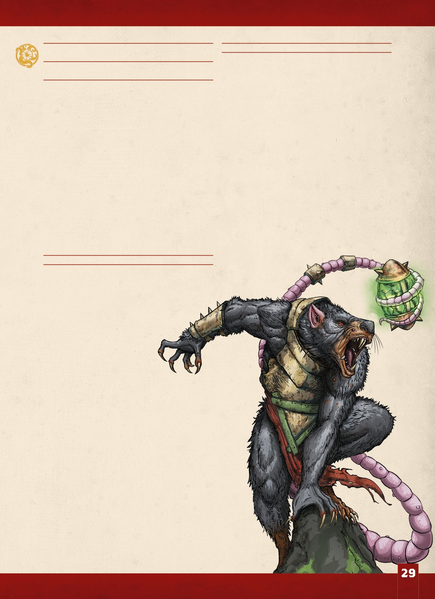*scurrying kind rely on for the eternal
expansion of their* *underground realm (it is also often used as a
food source* *amongst the wealthier members of Skaven society, which*
*might explain the number of mutations many well-to-do* *Skaven
display with pride!). Usually, one of the firrst things* *any aspiring
Warlock Engineer learns is how to create and* *manipulate warp
lightning. This crackling, greenish energy* *represents the unbridled
power of pure chaos set loose* *upon the world, and is used as both
the basis and the fuel* *for most of the Skaven's contraptions, but
unleashed in*
*its raw form it can deliver a nasty shock!*
>
Once per game, a Warlock Engineer may cast one of the following
spells:
>
WARP LIGHTNING
You may cast this spell either at the start of any of the opposition's
team turns, before any player is activated, or immediately after any
of the opposition's team turns has ended. Choose any square that is
adjacent to one of the Sidelines to be the Warp Lightning's starting
point. The Warp Lightning follows a path from one Sideline
to the other, moving in a straight line from
its starting point directly towards the
opposite Sideline. Roll a D6 for every
Standing player (from either team)
that occupies a square in the Warp
>
Lightning's path:
>
• On a roll of 3+, the player has been hit by the
>
Warp Lightning.
• On a roll of 1 or 2, the player is lucky and the bolt
>
zips overhead.
>
Any Standing players hit by the Warp Lightning are Knocked Down. When
a player is Knocked Down by Warp
>
Lightning, you may apply a +1 modifierr to either the Armour roll or
Injury roll. This modifierr may be applied after the roll has been
made.
>
Finally, when a player is Knocked Down by Warp Lightning, roll a D6.
On a roll of 1, the Warp Lightning
>
is earthed through the player. Do not roll to see if any more players
are hit. On a roll of 2+, the Warp Lightning continues along its path,
as described above.

THUNDERB0LT
You may cast this spell either at the start of any of the opposition's
team turns, before any player is activated, or immediately after any of
the opposition's team turns has ended. Target any Standing opposition
player anywhere on the pitch, and roll a D6:

• On a roll of 3+, the player has been hit by

the Thunderbolt.
• On a roll of 1 or 2, the player manages to duck or

dodge the attack.

A Standing player hit by a Thunderbolt is Knocked Down. When a player is
Knocked Down by a Thunderbolt,

you may apply a +1 modifierr to either the Armour roll or Injury roll.
This modifierr may be applied after the roll has been made.

0-1 WIZARD INDUCEMENT: 0GRE FIREBELLY 150,000 G0LD PIECES, AVAILABLE
T0 ANY TEAM
WITH THE 'BADLANDS BRAWL' SPECIAL RULE
*While many races findd it appropriate to place their Wizards* *and
priests in stuffy colleges and rely on eccentric old* *coots to teach
them, Ogres take a more fleexible approach.* *For a Firebelly, this is
a trial by firre which involves eating* *fierry spices, eating fierry
beetles and, finallly, eating*
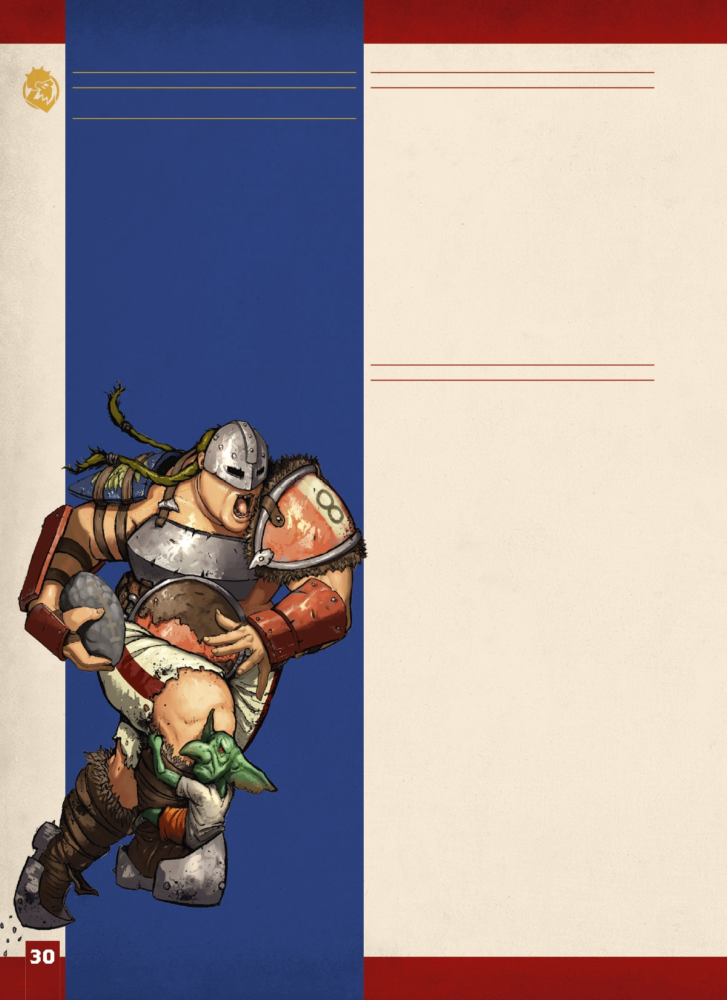*the fierry lava of the Fire Mouth
volcano (an Ogre's* *imagination is clearly not so hot!). Those few
who survive* *become wandering barbeque chefs and many findd ready*
*employment at Blood Bowl stadia. Such individuals can* *easily be
convinced to stand on the sidelines spitting hot* *firre across the
pitch, and woe betide anyone that gets in* *the way!*
>
Once per game, a Firebelly may cast one of the following spells:

FIREBALL
You may cast this spell either at the start of any of the opposition's
team turns, before any player is activated, or immediately after any of
the opposition's team turns has ended. Choose a target square anywhere
on the pitch and roll a D6 for each Standing player (from either team)
that occupies either the target square or a square adjacent
to it:

• On a roll of 4+, the player has been hit by the Fireball.
• On a roll of 1-3, the player manages to avoid

the Fireball.

Any Standing players hit by the Fireball are Knocked Down. When a player
is Knocked Down by a Fireball,
you may apply a +1 modifierr to either the Armour roll or Injury roll.
This modifierr may be applied after the roll has been made.

C0LUMN 0F FIRE
You may cast this spell either at the start of any of the opposition's
team turns, before any player is activated,
or immediately after any of the opposition's team turns has ended.
Choose any square that is adjacent to one of the Sidelines to be the
Column of Fire's starting point.
The Column of Fire follows a path from one Sideline to
the other, moving in a straight line from its starting point directly
towards the opposite Sideline. Roll a D6 for every Standing player (from
either team) that occupies a square in the Column of Fire's path:

• On a roll of 4+, the player has been hit by the Column

of Fire.
• On a roll of 1-3, the player is able to duck and avoid

the Column of Fire.

Any Standing players hit by the Column of Fire are Knocked Down. When a
player is Knocked Down by the

Column of Fire, you may apply a +1 modifierr to either the Armour roll
or Injury roll. This modifierr may be applied after the roll has been
made.

0-1 WIZARD INDUCEMENT:
NIGHT G0BLIN SHAMAN
150,000 G0LD PIECES, AVAILABLE T0 ANY
TEAM WITH EITHER THE 'BADLANDS BRAWL' 0R 'UNDERW0RLD CHALLENGE'
SPECIAL RULES
*To many races of the world, the difference between a* *Goblin and a
Night Goblin comes down solely to their* *fashion choices. However,
there are distinct differences*
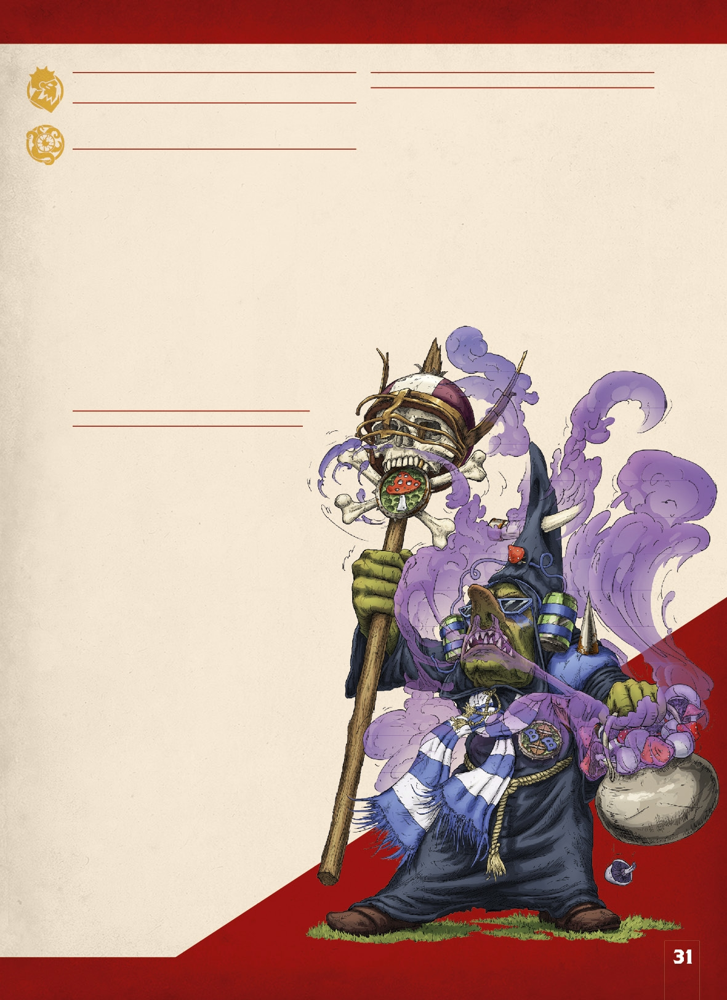*between the two, with Night Goblins
being more prone*
*to consuming large quantities of fungi as part of their* *strange
rituals. On the sidelines of the Blood Bowl pitch,* *a Night Goblin
Shaman will spend their time much as* *they do anywhere else;
experimentally brewing fungus* *beer and consuming their various
concoctions until they* *findd just the right mix. At that moment,
they will unleash* *their full power, enhanced by their beverage,
upon* *unwitting players; most of the time, this happens to be* *the
opposition.*
>
Once per game, a Night Goblin Shaman may cast one of the following
spells:
>
F00T 0F G0RK (0R M0RK)
You may cast this spell at the start of any of
the opposition's team turns, before any player is activated. Target
any Standing opposition player anywhere on the pitch, and roll a D6:
>
• On a roll of 6, the player has been kicked by
>
the Foot of Gork (or Mork)!
• On a roll of 3-5, the player has been stomped on
>
by the Foot of Gork (or Mork).
• On a roll of 1 or 2, the player is lucky and the
>
Foot of Gork (or Mork) swings harmlessly over their head.
>
A Standing player kicked by the Foot of Gork
(or Mork) is immediately catapulted through the air.
>
Immediately treat that player as being thrown (as if they had the
Right Stuff trait, and as if their Strength is 3 or less should their
Strength be 4 or more) by another player (with the Throw Team-mate
trait and
a Strength of 5 or more), and treat the quality of the throw as
terrible.
>
A Standing player stomped on by the Foot of Gork (or Mork) is Knocked
Down. When a player is
>
Knocked Down by the Foot of Gork (or Mork), you may apply a +1
modifierr to either the Armour roll or Injury roll. This modifierr may
be applied after
>
the roll has been made.

SP0RE CL0UD
You may cast this spell at the start of any of the opposition's team
turns, before any player is activated. Target any Standing opposition
player anywhere on the pitch, and roll a D6:

• On a roll of 2+, the player is engulfed by a cloud of

Madcap Mushroom spores. Until the end of this
drive, the player gains both the Loner (5+) and Really Stupid traits.

• On a roll of 1, the player begins to sprout strange

fungus from their armour, before the spell
dissipates harmlessly.
>
**0-1 NAMED WIZARD INDUCEMENT: H0RATI0 X. SCH0TTENHEIM,** **MASTER
MAGE**
>
80,000 G0LD PIECES, AVAILABLE T0 ANY TEAM
>
n *the history of Blood Bowl, there have been any number of great
Wizards. Unfortunately, Horatio X. Schottenheim is* *unlikely to ever
be counted among their number, but that doesn't make him any less
popular! Obsessed with the* *quest for fame and glory, Horatio has
devoted his life to becoming Blood Bowl's premier spellcaster.*
>
*He's spent millions of crowns on advertising, he's gone out of his
way to always make himself available for hire at*
*the drop of a hat, and he's even managed to secure a regular column
in Spike! Magazine.. but greatness still lingers*
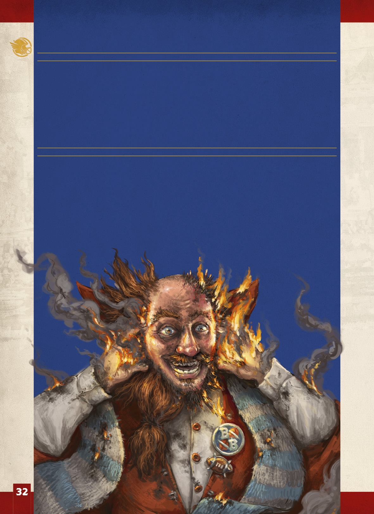*ever-so-slightly out of his reach. The
truth of the matter is this: he just isn't very good at magic. After
several years of* *mishaps and near-death experiences, he has stopped
trying to learn new spells, dedicating himself instead to creating*
*the perfect firreball. One day, he may even manage it.*
>
Once per game, Horatio may cast the following spell:
>
"TAKE THIS! 000PS..."
Horatio conjures up a firreball spell and flinngs it with his
legendarily poor aim in the general direction of the action on the
pitch. Horatio may cast this spell either at the start of any of the
opposition's team turns, before any player is activated, or
immediately after any of the opposition's team turns has ended. Choose
a target square anywhere on the pitch. The target square is moved D3
squares in a direction determined by rolling a D8 and referring to the
Random Direction template. After moving the target square, roll a D6
for each Standing player (from either team) that is either in the
target square or a square adjacent to it:
>
• On a roll of 4+, the player has been hit by the Fireball.
• On a roll of 1-3, the player manages to avoid the Fireball.
>
Any Standing players hit by the Fireball are Knocked Down. When a
player is Knocked Down by a Fireball, you may apply a +1 modifierr to
either the Armour roll or Injury roll. This modifierr may be applied
after the roll has been made.
>
**BIASED REFEREE INDUCEMENTS**
>
n general, the members of the RARG that officiaate over Blood Bowl
games are unsung heroes of the sport. However, many referees have
risen to the ranks
>
of superstardom for their dedication to the rules, if
not for their dedication to fair play! Whilst bribery is an
established part of the culture of Blood Bowl (the RARG even dictates
set rates and offers discounts for repeat
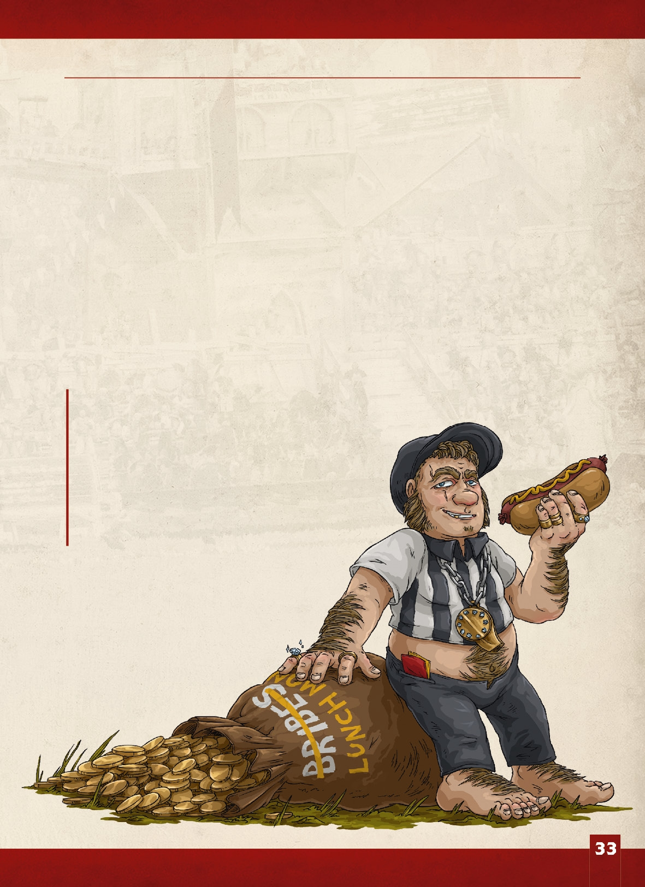customers), there are many referees
willing to go the extra yard for a team with gold to share.
>
Biased Referees are available to purchase during
the pre-game sequence at the cost listed, and because
>
Blood Bowl games tend to be officiaated over by a group rather than a
single individual, both teams may purchase a Biased Referee. You may
purchase one Biased Referee to treat your team favourably during the
game ahead.
>
HACKSPIT
QUILLCHEWER'S FUN FACTS
*Jeph Trundlefoot's S.I.G. rating veered from* *'Rather Clumsy" to
'Outright Liability" when* *the Halflinng referee decided that a
Skegway* *would make up for his short stature. For those* *lucky few
who haven't heard of the rolling* *accident-magnets, they're little
more than a* *pair of wheels, a magically stabilised platform* *and a
compact steam engine - what could*
*go wrong-wrong?*

For the most part, a Biased Referee will treat both teams equally,
meaning that they follow all of the normal

referee rules as described in the *Blood Bowl* rulebook. Where they
differ is that they will be either far more harsh in their scrutiny of
the opposition or far more lenient in their treatment of the team that
has paid them off.
How this manifests is described in each Biased
Referee's description.

Most Biased Referees are named, although some are not. As with Star
Players, it is possible for both teams to hire the services of the same
named Biased Referee:

• If this happens during a game that is part of a league,

neither team can use the named Biased Referee but the named Biased
Referee will keep both hiring fees.

• If this happens during exhibition play, both teams can

use the named Biased Referee they can dish out harsh rulings to both
sides!

Ranulf 'Red' Hokuli 0-1 BIASED REFEREE: TH0R0N K0RENSS0N

120,000 G0LD PIECES, AVAILABLE T0 ANY TEAM WITH THE 'W0RLDS EDGE
SUPERLEAGUE' SPECIAL RULE
*One of the longest-serving officialss in Blood Bowl,* *Korensson of
Zorn Uzkul was one of Roze-El's original* *apprentices. He's stayed
meticulously up-to-date with the* *rules and has famously never made a
bad call.*
*Many a head coach has tried to argue with him over*
*the years, only to be met with
granite-faced silence and*
*a glower that could melt gromril as Korensson's tightly-* *curled
black beard bristles with barely-suppressed rage.*
*To this day, Korensson's broad figurre and tall hat*
*command instant respect from players and fans alike!*
>
STRICT DISCIPLINE
Korensson is renowned for bringing strict discipline to the pitch
which, when questioned, is backed up with extremely
>
'RED' CARD
When suitably remunerated, Ranulf will keep a particularly close eye
on one of the teams. If any player on the opposing team commits a Foul
but a double is not rolled when making either the Armour roll or
Injury roll, roll a D6:
>
• On a roll of 4+, Ranulf loudly demands that play halt
>
whilst he investigates further.
• On a roll of 1-3, the player manages to avoid the
>
ref's attention.
>
Once spotted by Ranulf in this way (and only in this way), the coach
of the player that committed the Foul must choose one of the following
options:
>
• The coach may use a Bribe if one is available.
• The player that committed the Foul may accept their
>
fate and be Sent-off.
• The player may attempt to argue with Ranulf! Ranulf
>
will settle the argument with his axe. An Armour roll
is made against the player, applying a +2 modifierr to
the result:

-   If the roll is higher than the Armour Value of the

player, they become Prone and an Injury roll is made against them. The
player is not Sent-off and no Turnover is caused.

-   If the roll is equal to or lower than the Armour Value
    of the player hit, the attack has no effect. The player

is Sent-off and a Turnover caused.
>
"I'M N0T 0NE F0R ARGUING!"
If Ranulf has been Induced for this game, even if he does not take
part due to both coaches Inducing him, neither coach can Argue the
Call even the most argumentative of coaches can't help but have
respect for the charismatic Norscan.

tough penalties. If any player on the opposing team commits a Foul but a
double is not rolled when making either the Armour roll or Injury roll,
roll a D6:

• On a roll of 4+, Korensson has spotted the violation.
• On a roll of 1-3, the player manages to avoid the

ref's attention.

Once spotted by Korensson in this way (and only in this way), the player
that committed the Foul is immediately Sent-off. When a player is
Sent-off in this way, their coach cannot use a Bribe but may attempt to
Argue the Call. However, if a 1 is rolled on the Argue the Call table,
not
only is the player and the coach Sent-off, but one other randomly
selected player belonging to the opposing team and that is currently on
the pitch is Sent-off as well.

"SIT D0WN AND KEEP QUIET!"
If a Get the Ref result is rolled on the Kick-off Event table, roll
again it takes a particularly riled-up crowd to want to advance on
Korensson.

Jorm the 0gre 0-1 BIASED REFEREE: THE TRUNDLEF00T

TRIPLETS: BUNG0, FILIBERT AND JEPH 80,000 G0LD PIECES (40,000 G0LD
PIECES
F0R TEAMS WITH THE 'HALFLING THIMBLE CUP' SPECIAL RULE), AVAILABLE T0
ANY TEAM
*There are quite a number of officialss at a Blood Bowl*
*game: sideline officialss, scorekeepers, drive timers, and*
*so on, but there is usually only a single referee. One*
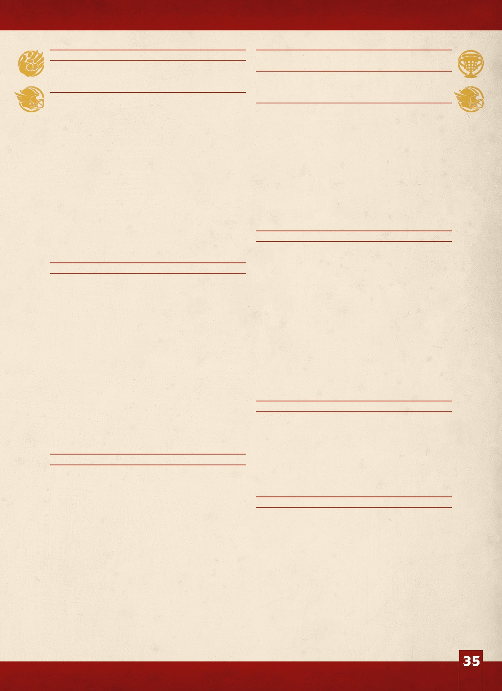*notable exception is the Trundlefoot
Triplets, a trio of* *Halflinng brothers who work together to
officiaate.. in theory.* *In practice, they're a total shambles - they
argue amongst* *themselves, disagree over the most obvious calls, and*
*often get in the way of play. Jeph is arguably the worst,* *generally
seen as one of the most incompetent referees*
*of all time, and guilty of accidentally injuring players on* *several
occasions.*
>
HEAVY-HANDED INC0MPETENCE
The Trundlefoot Triplets often try their best to partake in
a bit of honest corruption, but all too often they fail. If any
>
J0RM D0ESN'T LIKE CHEATERS!
Jorm is always on the lookout for dirty play, and misses very little.
If any player on the opposing team commits a Foul but a double is not
rolled when making either the Armour roll or Injury roll, roll a D6:
>
• On a roll of 4+, Jorm has spotted the cheat and rolls up
>
his sleeves to deliver his own form of justice.
• On a roll of 1-3, the player manages to avoid the
>
ref's attention.
>
Once spotted by Jorm in this way (and only in this way), the player
that committed the Foul is immediately
>
Knocked Down. When a player is Knocked Down by Jorm, you may apply a
+1 modifierr to either the Armour roll or Injury roll. This modifierr
may be applied after the roll has been made.
>
"SHUT IT, Y0U H00LIGANS!"
If a Get the Ref result is rolled on the Kick-off Event table, the
normal effects are ignored instead, Jorm goes into
a rampage and starts tearing through the stands to teach the rowdy
fans a lesson! Both teams reduce their Fan Factor for this game by -1
each time a Get the Ref result is rolled on the Kick-off Event table.

player on the opposing team commits a Foul but a double is not rolled
when making either the Armour roll or Injury roll, roll a D6:

• On a roll of 5+, the player that committed the Foul

is Sent-off, exactly as if they had rolled a double
(i.e., the opposing coach may use a Bribe if one is available and may
attempt to Argue the Call).

• On a roll of 2-4, the triplets, squabbling amongst

themselves, miss the Foul.
• On a roll of 1, however, the victim of the Foul is Sent-off

as if they had committed a Foul and rolled a double!

"SMART PLAYERS ARE WELL-BEHAVED PLAYERS!"
At the start of each drive, after both teams are set-up but before the
kick-off, roll a D6. On a roll of 6, one randomly selected player on the
opposing team that is not being Marked becomes embroiled in a pointless
argument
with the triplets about their kit. The player is immediately Placed
Prone and becomes Stunned, representing the time wasted arguing.

"THEY D0N'T L00K HAPPY!"
If a Get the Ref result is rolled on the Kick-off Event table, the
triplets make themselves scarce and will play no further part in this
game. In addition, each team also gets a Bribe as normal.

**0THER INDUCEMENTS**
>
s well as powerful Wizards, notorious referees
and renowned sideline staff, Blood Bowl teams often employ a wide
variety of other methods
>
to gain the upper hand. Be it strong ale to build up the fightting
spirits of smaller players, to catapults that launch projectiles
across the pitch, there seems to be no limit to the ingenuity shown by
teams unwilling to accept the role
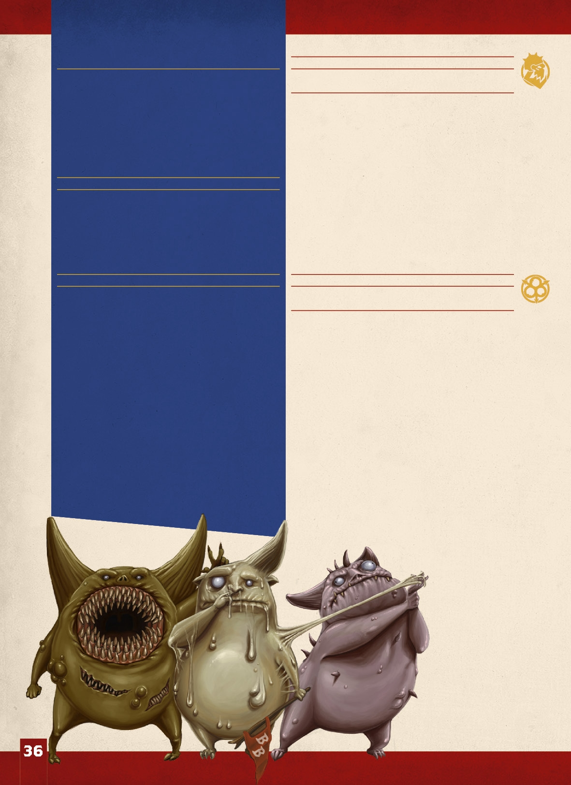of underdog in an important fixtture!
>
INDUCEMENTS IN LEAGUE PLAY
As described in the *Blood Bowl* rulebook, during the pre- game
sequence of a league fixtture, each team can spend gold pieces either
from their Treasury, from Petty Cash
or both, to purchase any of the Inducements available
to them which are then recorded on the team's Game Record sheet.
>
INDUCEMENTS IN EXHIBITI0N PLAY
When a team is drafted for exhibition play, you may
spend as much or as little of your Team Draft Budget as you wish on
Inducements, provided your team contains the minimum of 11 players,
not including Induced Star Players. If you are drafting a team for
exhibition play to
be used at an event or tournament, you should pay close attention to
the rulespack created by the organisers, as it is quite common that
not all Inducements will be allowed. Also, it is common for tournament
organisers to create their own, special Inducements.
>
If two coaches are drafting teams for exhibition play between
themselves, they should take a few minutes to
>
discuss Inducements firrst. It is important to decide if there are any
Inducements they feel should be included or any they would prefer to
leave out.

0-1 WAAAGH! DRUMMER
50,000 G0LD PIECES, AVAILABLE T0 ANY TEAM WITH THE 'BADLANDS BRAWL'
SPECIAL RULE
*Orcs live to figght, and a long tradition is that they have* *marched
to battle to the sound of a menacing drumbeat.* *This not only keeps the
lads moving in the right direction,*
*it can also be downright terrifying for the other side! Many* *teams
have begun to introduce the same idea to Blood* *Bowl games, in the hope
of replicating this effect.*

At the start of each drive, after the Kick-off event has been resolved
but before the ball itself lands, roll 3D6.
For each roll of a 4+, one player on the opposing team
can be pushed back one square towards their own End Zone, exactly as if
a Push Back block dice result had been applied against them. The same
player can be pushed back more than once by this Inducement.

0-3 CAV0RTING NURGLINGS
30,000 G0LD PIECES, AVAILABLE T0 ANY TEAM WITH THE 'FAV0URED 0F NURGLE'
SPECIAL RULE
*It is most common for the followers of Nurgle to be* *accompanied by
swarms of Nurglings, tiny, daemonic* *representations of Nurgle himself
that appear strangely* *able to project themselves into the mortal realm
in great* *numbers wherever the Plague Father's followers tread.* *These
mischievous sprites cause no end of trouble* *wherever Nurgle teams
appear. Their antics have a huge* *appeal to the fans of the game, who
delight in their* *morbid, slapstick comedy on the sidelines and their*
*constant interference with officialss and opposition teams.*

At the beginning of the game, a team may increase its Fan Factor by +1
for each swarm of Cavorting Nurglings
it has Induced. In addition, for the duration of this game,
a team may increase its number of cheerleaders by the number of
Cavorting Nurglings Induced.

0-1 DWARFEN RUNESMITH
50,000 G0LD PIECES, AVAILABLE T0 ANY TEAM WITH EITHER THE '0LD W0RLD
CLASSIC' 0R 'W0RLDS EDGE SUPERLEAGUE' SPECIAL RULES
*Runesmithing is the closest Dwarfs come to using*
*magic. None of this airy-fairy, wave-your-hands-in-the-air* *nonsense
for Dwarfs - Runesmiths work with hammer*
*and anvil, beating enchanted sigils into a player's armour*
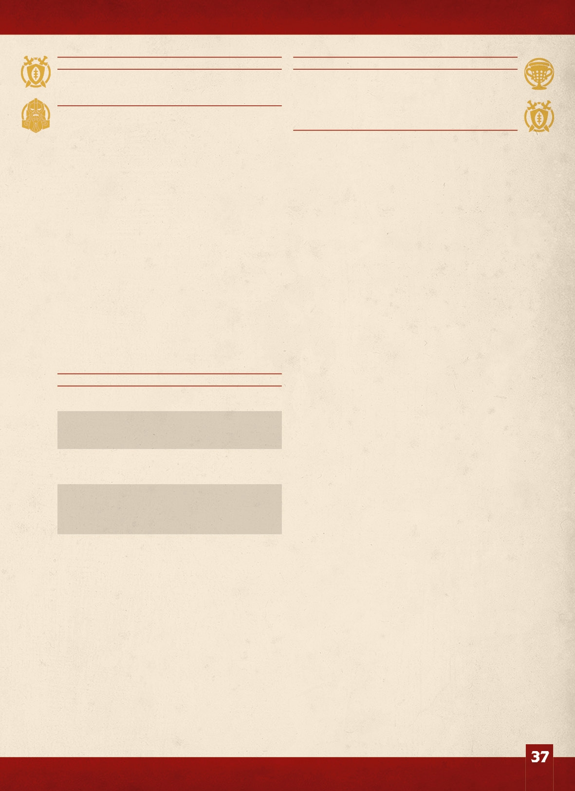*between drives.*
>
During each Start of Drive sequence, after Step 2 but before Step 3,
you can select a single player on your team
>
that is currently on the pitch that does not have the Loner (X+) trait
and choose one of the following runes. Then roll a D6:
>
• On a roll of 4+, the rune takes effect, but you cannot attempt to
use the Runesmith again at the start of a later drive.
>
• On a roll of 2 or 3, the rune does not work, but you can
>
attempt to use the Runesmith again at the start of a later drive.
>
• On a roll of 1, the rune does not work, and you cannot
>
attempt to use the Runesmith again at the start of a later drive.
>
DWARFEN RUNES
Rune of Might Until the end of this drive, the chosen
>
player gains the Mighty Blow (+1) skill. Rune of Fury Until the end of
this drive, the chosen
>
player gains both the Dauntless and Frenzy skills.
>
Rune of Speed Until the end of this drive, the chosen player gains
both the Sprint and Sure Feet skills.
>
Rune of Iron Until the end of this drive, the chosen player's Armour
Value is increased by 1
>
(to a maximum of 11+) and they gain the Stand Firm skill.
>
Rune of Impact Until the end of this drive, the chosen player gains
both the Juggernaut and Horns skills.

0-1 HALFLING H0T P0T
80,000 G0LD PIECES (60,000 G0LD PIECES F0R TEAMS WITH THE 'HALFLING
THIMBLE CUP' SPECIAL RULE), AVAILABLE T0 ANY TEAM WITH EITHER THE
'HALFLING THIMBLE CUP' 0R '0LD W0RLD CLASSIC' SPECIAL RULES
*Once a desperate measure, the Halflinng Hot Pot is* *something of a
mainstay among Moot militias. The Hot* *Pot is exactly that, a cauldron
of boiling soup or stew,* *catapulted from a primitive, wooden frame
towards a foe.* *The contents can cause significcant inconvenience,
but*
*for anyone unfortunate enough to be hit by the cauldron* *itself, the
effects can be quite terminal!*

A Hot Pot can be used once per game, launching a cauldron of piping-hot
stew onto the opposition. The Hot Pot may be used immediately after any
of the opposition's team turns has ended. Choose a target square
anywhere on the pitch and roll a D6:

• On a roll of 6, the shot is on target.
• On a roll of 2-5, the shot is off target the target

square is moved D3 squares in a direction determined by rolling a D8
and referring to the Random
Direction template.

• On a roll of 1, something has gone horribly wrong and the Hot Pot has
misfirred in the team dugout. D3 randomly selected players in the
Reserves box

immediately become KO'd and moved to the Knocked- out box.

A player in the target square is automatically hit by the Hot Pot
itself. If a Standing player is hit, they are Knocked Down. If a Prone
or Stunned player is hit, an Armour roll

is made against them. In either case, you may apply a
+2 modifierr to either the Armour roll or Injury roll. This modifierr
may be applied after the roll has been made.

Additionally, roll a D6 for each Standing player (from either team) that
is in a square adjacent to the target square:

• On a roll of 4+, the player has been hit by the mess of

stew that showers out of the Hot Pot.
• On a roll of 1-3, the player manages to avoid being hit.

Any Standing player hit in this way is Placed Prone.

0-1 MASTER 0F BALLISTICS
40,000 G0LD PIECES (30,000 G0LD PIECES F0R TEAMS WITH THE 'HALFLING
THIMBLE CUP' SPECIAL RULE), AVAILABLE T0 ANY TEAM WITH EITHER THE
'HALFLING THIMBLE CUP' 0R '0LD W0RLD CLASSIC' SPECIAL RULES
*The Empire, the largest human realm of the Old World,* *has a long
history of wondrous invention, its master*
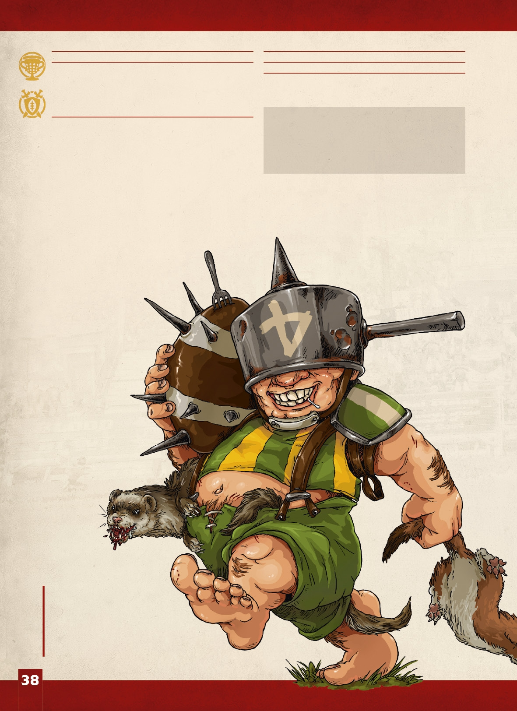*gunsmiths and engineers creating many
fabulous* *examples of their art and ingenuity. The armies of the*
*Emperor are home to huge battalions of artillery pieces,* *and the
gunnery schools of the various states and* *provinces produce large
numbers of skilled artillerymen* *and ballistics experts. A popular
pastime amongst these* *soot-stained academics is the study of the art
of ball* *tossing, and there is no shortage of those who claim to* *be
able to improve a team's passing game through the* *careful
application of scientificc principles. Results*
*do vary..*
>
During Step 2 of every Start of Drive sequence, the Master of
Ballistics can attempt to advise
the kicker. After placing the
ball but before rolling for
deviation, roll a D3 on the
table opposite:
>
MINDY PIEWHISTLE'S RUM0UR R0UND-UP
*I don't know about you, but I've never* *seen a famous Goblin player.
I'm not* *saying they don't exist, I just can't* *stand to look at
them..*

MASTER 0F BALLISTICS

D3 RESULT
>
1 *Complete Misunderstanding:* The kicker
has rather missed the point, and the kick-off
>
deviates as normal.
2 *Interesting Theory...* The Master of Ballistics
>
becomes side-tracked explaining the theory and runs out of time before
the whistle. The distance the ball deviates is reduced by one square,
from D6 squares to D6-1 squares (meaning there is a chance it won't
deviate at all if a 1 is rolled).
>
3 *Successful Practical Application:* By Nufflee, the kicker's grasped
it! After rolling the dice for deviation, the kicking team's coach can
choose to modify the roll of either the D6 or the D8 by
>
+1 or +2, or -1 or -2 as they wish, to a minimum of 1, and a maximum
of 6 (for the D6) and 8
(for the D8).

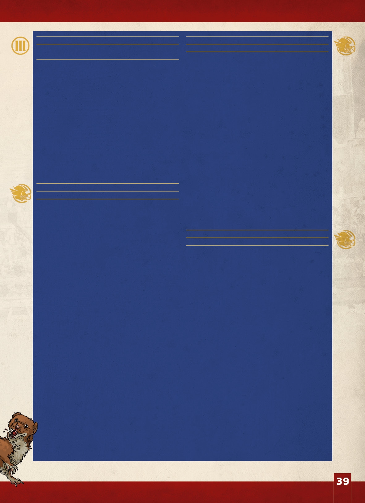

Side Bet

0-3 B0TTLES 0F HEADY BREW
40,000 G0LD PIECES EACH, AVAILABLE T0 ANY TEAM BEL0NGING T0 TIER 3
*Halflinngs enjoy a finee ale every bit as much as they*
*enjoy finee food, so it is only natural that within the Moot* *brewing
ale is a big business. Many of these Halflinng*
*ales are particularly potent and prone to making their* *more
diminutive drinkers uncharacteristically figghty and* *troublesome! It
is not uncommon for 'Stunty' Blood Bowl* *players to be dosed with a
bottle before kick-off by a wily* *coach. The effect this can have on
them is pretty extreme!*

At the start of a drive, after both teams have been set up but before
the kick-off (between Step 1 and Step 2), randomly select D3 players
with the Stunty trait that are currently set up on the pitch. For the
remainder of this drive, those players gain the Dauntless and Frenzy
skills and the Really Stupid (4+) trait.

0-1 TEAM MASC0T
30,000 G0LD PIECES, AVAILABLE T0 ANY TEAM
*In some regions, team mascots are incredibly popular.*
*The fans delight to see one of their number take to the* *pitch
alongside their beloved team, often dressed head-to-* *toe in a most
amusing outfitt! Given free rein to show their* *support through the
medium of outrageous dance and* *hilarious slapstick comedy, their
antics on the sidelines* *entertain fans and players alike, often
bringing some* *much-needed luck!*

*In other regions, such displays of total idiocy are* *frowned upon.*

A team that includes a Team Mascot gains an extra team re-roll (a
suitable model should be placed on your team re- roll tracker). However,
to use the Team Mascot re-roll you must firrst roll a D6:

• On a roll of 1-4, the Team Mascot proves ineffective and, pelted by
food wrappers and worse, retreats to
the locker room. The Team Mascot re-roll is lost for this

half of the game. However, you may use a normal team re-roll instead.

• On a roll of 5+, the Team Mascot re-roll can be used,

just like a normal team re-roll.

0-1 MEDICINAL UNGUENT
60,000 G0LD PIECES, AVAILABLE T0 ANY TEAM
*Losing players mid-game is a fact of Blood Bowl; injuries* *happen! But
it isn't ideal, and a team that is short on* *players is a team at a
serious disadvantage! There really*
*is no limit to the things a head coach will try in order to* *keep
their players on their feet and playing the game;* *from numbing Cold
One slime to lessen the pain, to* *madcap mushrooms to lessen the
player's awareness*
*of the pain, and worse things besides, it's all been tried* *and most
of it is legal! Sure, sometimes a player with an* *injured leg might
lose it after the game, but this is often a* *risk the coach is willing
to take (it isn't their leg, after all)!*

Should a player on your team be removed from play having suffered a
10-12, Serious Injury result on the Casualty table, after any other
attempts to heal that
player have been made and have failed, you may use this Inducement. The
player is immediately removed from
the Casualty box and placed in the Reserves box of your dugout, having
been miraculously healed by the liberal application of something that
smells extremely suspicious. However, at the end of this game, the
result of the
Casualty roll is applied as normal.

0-1 SIDE BET
PRICE VARIES, AVAILABLE T0 ANY TEAM
*Betting on Blood Bowl is a popular pastime, and one that* *everyone
joins in with. Most betting is conducted amongst* *the fans and players,
and even team owners and head* *coaches also enjoy a little fluttter.
Sadly, most bookmakers* *look down on sports insiders such as players
and coaches* *betting on the outcome of their own games; they argue*
*that it's too easy for them to influencce the result! Such*
*protestations usually fall on deaf ears though, and the* *boldest of
coaches think nothing of placing a small bet,* *especially when the gold
pieces they're betting were given* *freely by the stadium owners to
cover expenses; that's* *literally free money, right?*

After Step 4, but before Step 5 of the pre-game sequence, you may place
a bet of between 10,000 and

100,000 gold pieces that your team will win the game. Simply inform your
opponent that the bet has been
placed, and how much you are betting. Should your team win the game, you
will receive double your stake back during Step 1 of the post-game
sequence (for example, if you bet 20,000 gold pieces that your team
would win, you will win 40,000 gold pieces if it does win).

If, however, your team loses, the stake is lost (such is the risk of
gambling)!

Fabulous Freebooters

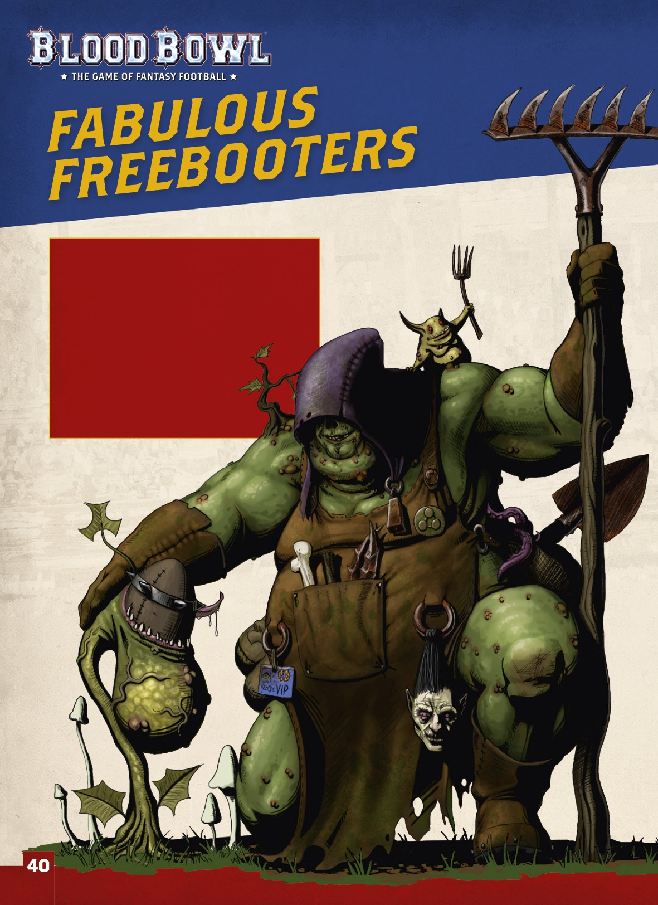

or every player safely employed by a team, there are dozens of
freelance players who will agree to wear anyone's colours in
>
exchange for hard currency. Many competent
and skilled players prefer the life of a freebooting mercenary to the
strict rules and regulations imposed on players under permanent
contract. 0thers, including some of the game's biggest stars, prefer
to offerr their services on a game-by- game basis, allowing them to
pick and choose
the teams they play for and to charge the fee
they want, often without the aggravation of haggling over money or
contract details.
>
**EXPANDED RULES F0R** **MERCENARY PLAYERS**
>
**0-3 MERCENARY PLAYER INDUCEMENTS** PRICE AND QUANTITY VARIES,
AVAILABLE T0 ANY TEAM
>
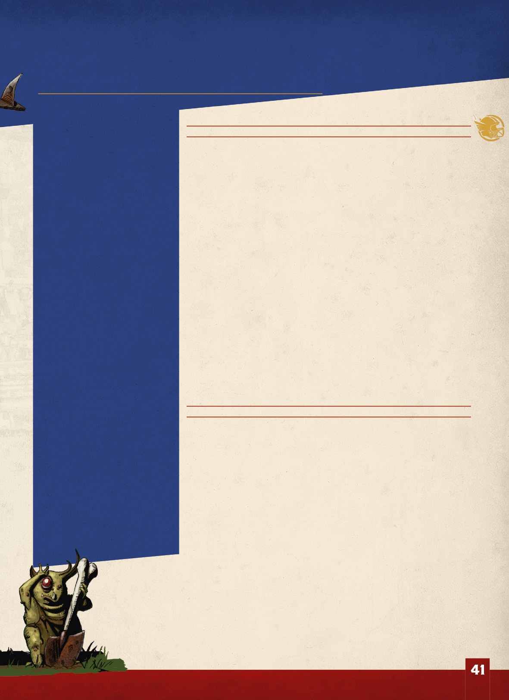n league play, any team may purchase
Mercenary Player Inducements during the pre-game sequence. How many
can be purchased depends upon the type as described over the following
pages. When a Mercenary player is purchased,
>
their services are secured for that one game. The Mercenary is not
added to
the Team Draft list, but their player profilee will need to be
recorded for reference purposes for the benefitt of both coaches.
Should you wish, Mercenary players
can be named and even given a backstory, creating your own character
that can then be Induced again ahead of any future fixtture.
>
Mercenary players never gain Star Player Points and cannot be awarded
the MVP for a game. Mercenary players never gain any advancements
other than those taken when they are created. Unless the league
commissioner decides otherwise, any Casualty table results applied
against a Mercenary player are waived after the game they, like Star
Players, are assumed to employ their own staff of healers and medics
to keep them in peak condition.
>
In exhibition play, Mercenary players, like any other Inducement, can
be purchased when the team is drafted, as described in the *Blood
Bowl* rulebook.
>
Mercenary players may not take the number of players in the team to
more than 16. However, in league play, players that are missing the
game due to injury
>
do not count towards the number of players on the team, so they are
not counted
>
These rules are designed to give coaches tremendous freedom in
creating Mercenary players for their teams, allowing them to create a
player suited to almost any situation.
In addition, these rules can be used
by league commissioners or event organisers wishing to create a unique
Star Player to feature at their league
or event. This has long been a popular feature of Blood Bowl leagues
and events the world over, and these
rules will make it easier than ever
to correctly cost such unique and characterful players.

towards the 16 player limit when working out how many Mercenary players
a team can purchase.

CREATING A MERCENARY
To create a Mercenary player, the firrst thing to do is decide upon the
type. There are fivve broad types of Mercenary player to choose from:
Stunty Superstars, Legendary Lineman, Brutal Blockers, Reliable Ringers
or Bona Fide Big Guys. Each type has
a profilee which includes a selection of Skills and Traits, and a basic
hiring fee in
gold pieces.

To this profilee you have the option to add certain additional Skills or
Traits, or
to improve characteristics. Most of these additions and improvements
increase
the basic hiring fee of the Mercenary, but some may reduce the hiring
fee. This means that you are given the opportunity to create the perfect
Mercenary at a premium price, or to create a Mercenary who comes
complete with a few flaaws and a healthy discount!

Note, however, that some of these options are not available to all
teams.
For example, a Stunty Superstar can gain the Bombardier and Secret
Weapon

traits, but only if they are hired by a team that has one, or more, of
the 'Badlands Brawl', 'Halflinng Thimble Cup', 'Old World Classic',
'Underworld Challenge' or 'Worlds Edge Superleague' special rules.

Once your Mercenary has been created, you will need to record their
profilee and their hiring fee. Hopefully, your team will have
sufficientt funds available to afford your creation!

0-2STUNTYSUPERSTARS MERCENARYPLAYERINDUCEMENTS
>
*30,000 G0LD PIECES PLUS 0PTI0NS,*
*AVAILABLE T0 ANY TEAM*

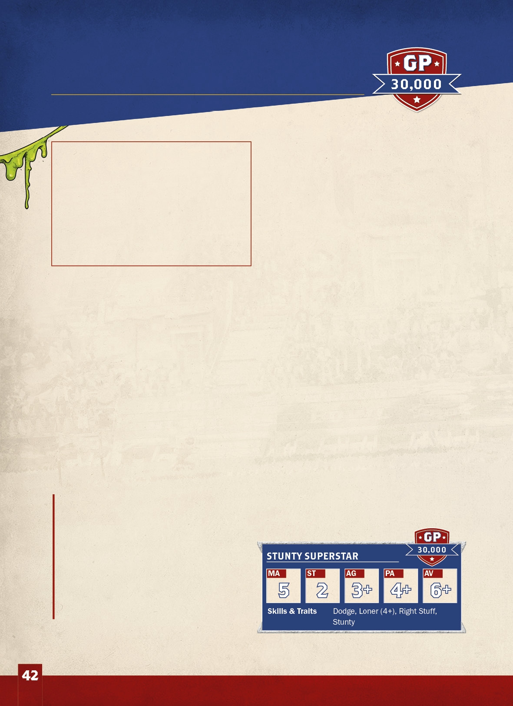

f all the denizens of the 0ld World, there are few that can inspire
more confidencce in an opposing team than Halflinngs
>
or Goblins. These diminutive players lack the height, weight and
physical strength of, for example, Humans or 0rcs and, whilst they
often display an agility comparable to that of an Elf, they sorely
lack the speed and grace required
to make the best use of such agility on the
Blood Bowl pitch.
>
et, over the years, there has been no shortage of Goblin and Halflinng
Blood Bowl players. Members of both races take to Nufflee's sacred
gridiron in
>
numbers beyond counting in search of glory and fame, hoping to make it
as big-time stars and, in so doing,
break free of the prejudice that all too often accompanies their small
stature. Sadly, for most of these eager young players, their sporting
adventure is (appropriately enough) really rather short, usually
ending in a premature death!
>
But for every hundred Stunty players (as these diminutive hopefuls are
called by the larger races of the
>
world) whose career culminates in an amusing death, there will be one
or two that will survive long enough to attain some measure of the
success that drives them.
>
HACKSPIT
QUILLCHEWER'S FUN FACTS *Although several of the big-name players*
*act as free agents, wearing any team's* *colours for the right price,
it's not unknown* *for them to spend entire seasons with a* *single
team. Grifff and Zug, for example,*
*tend to alternate a season with the*
*Reavers with a season as a free agent,*
*and have even been known to do both at*
*the same time!*

Over time, these players grow in skill and experience if not in stature.
It is not unknown for many such veteran Stunty players to strike out on
their own as mercenary players,

offering their unique services to the highest bidder and building upon
their legend.

Many such Stunty players look for an edge in the
game, an extra something that will not only improve their

performance but often keep them alive in the face of spirited attempts
by the opposition to see them retired!
For this reason, it is not uncommon to see Stunty Superstars equipped
with all manner of gimmicks or armed with a variety of secret weapons.
From stilts to chainsaws, pogo sticks to bombs, Stunty players have
tried them all! By bringing such devious devices to
the pitch, these players increase their value no end in the eyes of
potential employers, for the sight of a Halflinng equipped with a
chainsaw or a Goblin bounding down
the pitch on a pogo stick is often so hilarious as to pass without
comment by the average referee, who will usually place the entertainment
of the crowd above such petty concerns as the upholding of the rules
(for a drive or two at any rate). More importantly, such ludicrous
sights often prove so amusingly disarming to the opposition that many an
overly-bold player has literally died laughing at the
sight of an overly-armed and armoured Goblin advancing towards them with
a look of determination in their
beady eyes!

0PTI0NS
A Stunty Superstar must take at least one option chosen from one or
more of the following lists:
>
ADDITI0NAL SKILLS
Any Stunty Superstar may take:
>
• A single additional Agility skill for +10,000 gold pieces.
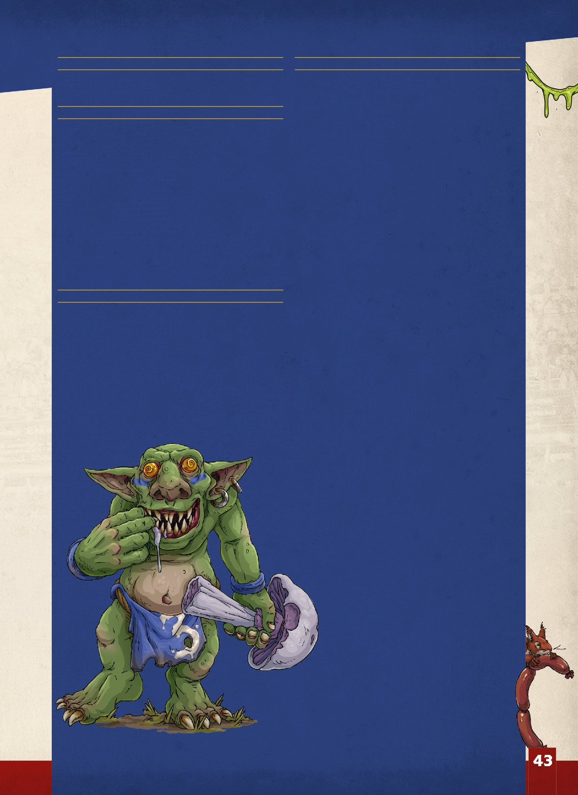• Two or more additional Agility skills
for +20,000 gold
>
pieces each.
• A single additional General skill\* for +40,000
>
gold pieces.
• A single additional Passing skill for +20,000
>
gold pieces.
• A single additional Mutation for +30,000 gold pieces.
>
\**A Stunty Superstar may not take the* *Dirty Player (+1) skill.*
>
CHARACTERISTIC 0PTI0NS
Any Stunty Superstar may improve or reduce any characteristic by up to
2, as follows:
>
• Improve MA by 1 for +30,000 gold pieces.
• Improve AG by 1 for +40,000 gold pieces.
• Improve PA by 1 for +30,000 gold pieces.
>
• Improve AV by 1 for +30,000 gold pieces.
• Any characteristic may be reduced by 1 for -10,000
>
gold pieces (to a minimum of 30,000 gold pieces).

TRAIT PACKAGES
In addition, a Stunty Superstar may exchange the Right Stuff trait for a
single package of upgrades from this list:

• Gain the Dirty Player (+1) and Sneaky Git skills,
but replace the Loner (4+) trait with Loner (5+) for

+50,000 gold pieces (available to teams with either
the 'Badlands Brawl', 'Favoured Of ', 'Halflinng Thimble Cup',
'Lustrian Superleague', 'Old World Classic' or 'Underworld Challenge'
special rules only).

• Gain the Dirty Player (+2) and Sneaky Git skills,
but replace the Loner (4+) trait with Loner (5+) for

+80,000 gold pieces (available to teams with either
the 'Badlands Brawl' or 'Halflinng Thimble Cup' special rules only).

• Gain the Bombardier and Secret Weapon traits for
+40,000 gold pieces (available to teams with either

the 'Badlands Brawl', 'Halflinng Thimble Cup', 'Old World Classic',
'Underworld Challenge' or 'Worlds Edge Superleague' special rules
only).

• Gain the Stab and Secret Weapon traits for +20,000

gold pieces (available to teams with either the 'Badlands Brawl',
'Halflinng Thimble Cup', 'Lustrian Superleague', 'Old World Classic',
'Underworld Challenge' or 'Worlds Edge Superleague' special
rules only).

• Gain the Pogo Stick trait for +50,000 gold pieces (available to teams
with either the 'Badlands Brawl',

'Halflinng Thimble Cup', 'Lustrian Superleague', 'Sylvanian Spotlight'
or 'Underworld Challenge' special rules only).

• Gain the Ball & Chain, Secret Weapon and No Hands traits and +3ST, but
reduce MA by 2 and lose the

Dodge skill for +60,000 gold pieces (available to
teams with either the 'Badlands Brawl', 'Favoured
Of ', 'Halflinng Thimble Cup' or 'Underworld Challenge' special rules
only).

• Gain the Chainsaw, No Hands and Secret Weapon traits, but lose the
Dodge skill for +40,000 gold pieces

(available to teams with either the 'Badlands Brawl', 'Elven Kingdoms
League', 'Halflinng Thimble Cup', 'Lustrian Superleague', 'Old World
Classic', 'Sylvanian Spotlight' 'Underworld Challenge' or 'Worlds Edge
Superleague' special rules only).
>
0-2LEGENDARYLINEMEN MERCENARYPLAYERINDUCEMENTS
>
*50,000 G0LD PIECES PLUS 0PTI0NS,*
*AVAILABLE T0 ANY TEAM*

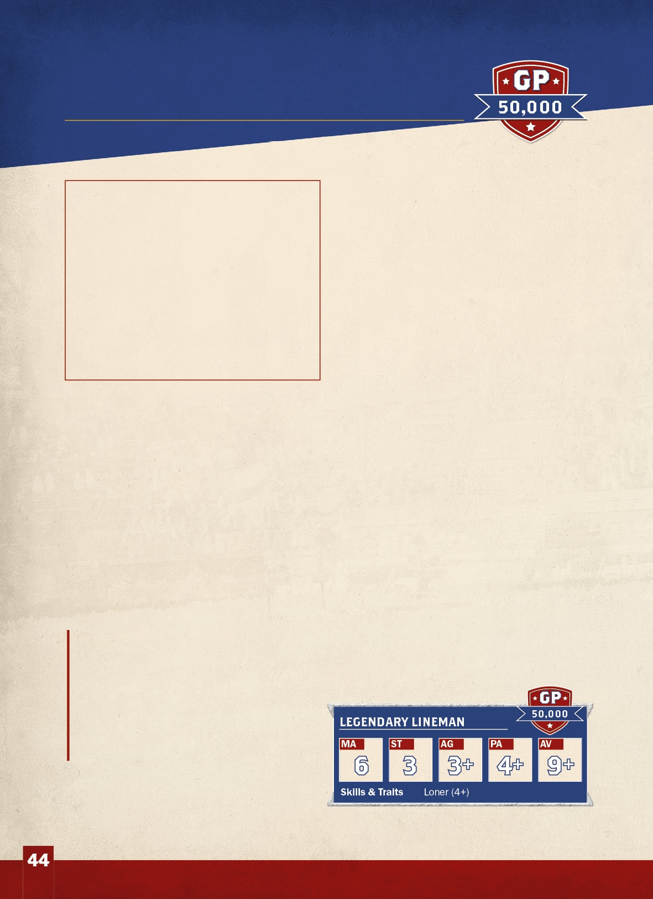

lood Bowl players come in all shapes and sizes, and their unique
abilities are many and varied. For the most part, it is those
>
that display exceptional athletic ability in some particular aspect of
the game, be it as throwers, blitzers, runners or catchers, that come
to be
the most renowned of Star Players, the most beloved of fans and the
most in demand amongst potential employers. The humble lineman,
arguably the backbone of any team, is often overlooked when
Cabalvision shows are looking for players to interview, or when the
awards are being handed out at the end of the season.
>
his is a terrible shame, for without a strong core
of high quality linemen, no team can achieve true success! It matters
not how competent the thrower,
>
how bold the blitzer, how fast the runner or how agile the catcher if
the humble linemen have failed in their job
of either holding back the opposition's offensive line, or forcing
through their defensive line!
>
Yet the hard working linemen continue to be ignored and overlooked by
coaches, team owners and sponsors alike. Consequently, many a talented
player chooses
>
instead to strike out on their own, offering their valuable services
to those coaches who do recognise their need
>
MINDY PIEWHISTLE'S
RUM0UR R0UND-UP
*You can learn a lot about a team by looking*
*at what they get up to between seasons.*
*For the Reikland Reavers, for example, it's* *promotional tours and
book signings all the*
*way - just this year, Grifff released his latest* *autobiography, and
early numbers look like it's* *going to outsell the previous 22!*

and are willing to pay a princely sum for some competence upon the line
of scrimmage. At a glance, this may seem foolish; what sane lineman
would give up the security of regular employment as a professional Blood
Bowl player
for the uncertainty of life as a mercenary? Surely, no one
is beating a path to their door with offers of work!

Upon closer examination, the question becomes: "Who wouldn't?

Most professional Blood Bowl players are tied into contractual
obligations that cannot easily be escaped.

In this position, linemen are rarely paid what they think they are worth
and are, as has been stated, constantly underappreciated. Combined with
an obligation to tolerate

team-mates or coaches they privately can't stand, it becomes easy to see
the appeal of life as a self-employed player. Those who choose the life
of a mercenary suffer
few of the hardships that those tied into contracts must endure. They
can leave when they want, they don't have to pretend to like people they
don't like and, above all else, they can charge what they wish! After
all, if one coach
won't pay their fee, another will.

The vast majority of these mercenary players are seasoned, competent
veterans of the game. They know

their job and do it well, whether it is anchoring the line
of scrimmage in defence, forcing a wedge through the opposition on
defence, or the more clandestine art of fouling a downed opponent when
no officialss are looking!

0PTI0NS
A Legendary Lineman must take at least one option chosen from one or
more of the following lists:
>
ADDITI0NAL SKILLS
A Legendary Lineman may take:
>
• A single additional General\* skill for +20,000
>
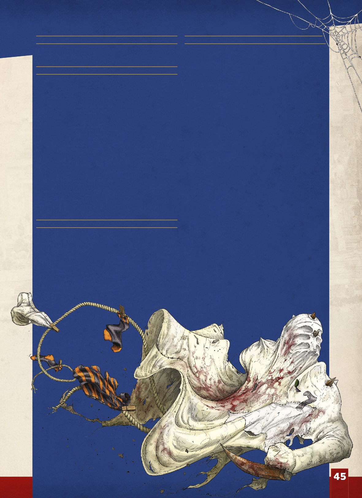gold pieces.
• Two or more additional General\* skills for +30,000
>
gold pieces each.
• A single additional Agility skill for +30,000 gold pieces.
>
• A single additional Passing\* skill for +20,000
>
gold pieces.
• A single additional Strength skill for +30,000
>
gold pieces.
• A single additional Mutation for +30,000 gold pieces.
>
• Two or more additional Mutations for +40,000 gold
>
pieces each (available to teams with the 'Favoured
Of ' special rule only).
>
\**A Legendary Lineman may not take either the Dirty* *Player (+1)
skill or the Leader skill.*
>
CHARACTERISTIC 0PTI0NS
Any Legendary Lineman may improve or reduce any characteristic by up
to 2, as follows:
>
• Improve MA by 1 for +20,000 gold pieces.
• Improve PA by 1 for +30,000 gold pieces.
• Improve AV by 1 for +20,000 gold pieces.
• Any characteristic may be reduced by 1 for -10,000
>
gold pieces (to a minimum of 50,000 gold pieces).

TRAIT PACKAGES
In addition, a Legendary Linemen may choose a single package of upgrades
from this list:

• Gain the Dirty Player (+1) and Sneaky Git skills,
but replace the Loner (4+) trait with Loner (5+) for

+60,000 gold pieces (available to any team).
• Gain the Dirty Player (+2) and Sneaky Git skills,

but replace the Loner (4+) trait with Loner (5+) for
+90,000 gold pieces (available to teams with either the 'Badlands
Brawl', 'Favoured Of ', 'Old World Classic', 'Sylvanian Spotlight',
'Underworld Challenge' or 'Worlds Edge Superleague' special rules
only).

• Gain the Bombardier and Secret Weapon traits for
+40,000 gold pieces (available to teams with either

the 'Badlands Brawl', 'Favoured Of ', 'Old World Classic', 'Sylvanian
Spotlight', 'Underworld Challenge' or 'Worlds Edge Superleague'
special rules only).

• Gain the Stab and Secret Weapon traits for +20,000

gold pieces (available to teams with either the 'Badlands Brawl',
'Elven Kingdoms League', 'Lustrian Superleague', 'Old World Classic',
'Sylvanian Spotlight', 'Underworld Challenge' or 'Worlds Edge
Superleague' special rules only).

• Gain the Chainsaw, No Hands and Secret Weapon traits for +60,000 gold
pieces (available to any team).

0-1BRUTALBL0CKERS
MERCENARYPLAYERINDUCEMENTS
>
*70,000 G0LD PIECES PLUS 0PTI0NS,*
*AVAILABLE T0 ANY TEAM*

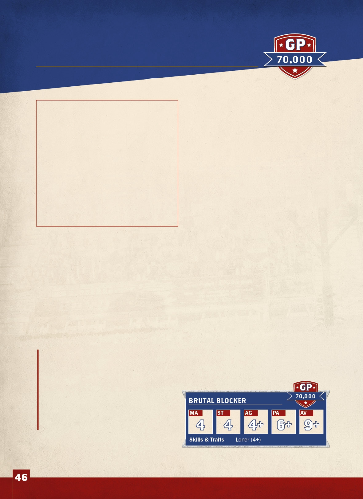

he game of Blood Bowl is known to attract a great many very large and
very violent individuals. More than its fair
>
share, some commentators have commented! But is this really so
surprising? It is only
natural that a six-foot-four-inches tall, three- hundred-pound Black
0rc with a penchant for smashing skulls should be drawn to a violent
blood sport rather than a career in, for example, customer services.
True, both of these fieelds would allow such an unbalanced individual
ample opportunityto satisfy their violent
and antisocial tendencies, but a career as a Blood Bowl player also
offerrs plenty of healthy exercise outside in the fresh air!
>
ost teams are keen to hire such players, recognising their gifts and
appreciating the value that a big, strong and, above all, violent
brute
>
of a player brings to the pitch. Be it anchoring the line of
scrimmage, guarding the wide zones, or hanging back and hunting
opposing receivers and blitzers that make the mistake of advancing
upon the end zone, having a very large and strong player to hand ready
to unleash decades of anger in a single violent outburst is never a
bad thing! Well, unless, of course, the opposition has such players on
their team sheet as well.
>
MINDY PIEWHISTLE'S
RUM0UR R0UND-UP
*As you know, during the players' strike of 2477,*
*the Asgard Ravens took a chance and fieldedd their* *cheerleading
squad against the Lowdown Rats.* *Well, they say the cheerleaders were
so violent*
*on the pitch that, when the Ravens head coach* *suggested the players
negotiate pay with them* *instead of him, the Ravens players
immediately* *forgot their demands and abandoned the strike!*

Many such players are Human, grown large through good eating and plenty
of exercise. Others are drawn from the northern tribes; mighty champions
of Chaos who have

taken to the life of a Blood Bowl player to further their progress along
the path to glory or damnation. Still others are Orcs, grown so large
and brutal as to stand out even amongst their own, violent kind, whilst
others are Black Orcs; brutal and cunning savages from the Dark Lands.
Some might be Dwarfs of the Worlds Edge Mountains, a folk renowned for
their strength, if not for their speed. Still others might be more
exotic in origin; Saurus from Lustria, strange undead constructs and
other, more peculiar creatures besides.

Coincidentally, many such players findd themselves drawn into the
freebooting life of a mercenary player.
Many pundits have theorised that this is likely because most teams feel
uncomfortable about the idea of sharing their changing room with a
violent psychopath. This theory is easily disproved and quite clearly
nonsense as the majority of players are demonstrably violent
psychopaths; it's why they play the game in the firrst place! In truth,
most mercenary players struggle to manage the authority and discipline
that comes with regular training as part of a team to a greater or
lesser extent. In this regard Brutal Blockers are no different to any
other mercenary player, preferring to be their own boss, joining a team
for a few games, but leaving before the stress of commitment becomes too
great!

0PTI0NS
A Brutal Blocker must take at least one option chosen from one or more
of the following lists:
>
ADDITI0NAL SKILLS
Any Brutal Blocker may take:
>
• A single additional Strength skill for +30,000
>
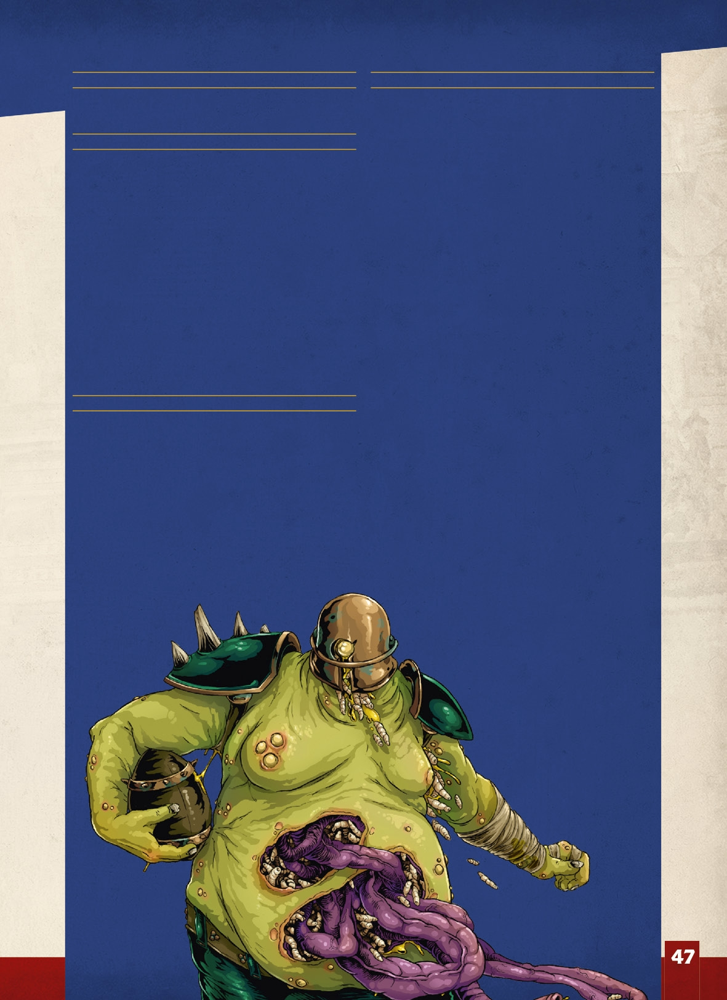gold pieces.
• Two or more additional Strength skills for +40,000 gold
>
pieces each.
• A single additional Agility skill for +40,000 gold pieces.
>
• A single additional General skill\* for +30,000
>
gold pieces.
• A single additional Passing\* skill for +20,000
>
gold pieces.
• A single additional Mutation for +40,000 gold pieces.
>
\**A Brutal Blocker may not take either the Dirty Player (+1)* *skill
or the Leader skill.*
>
CHARACTERISTIC 0PTI0NS
A Brutal Blocker may improve or reduce any characteristic by up to 2,
as follows:
>
• Improve MA by 1 for +30,000 gold pieces.
• Improve MA by 2 for 50,000 gold pieces (available
>
to teams with either the 'Favoured Of ' or 'Lustrian Superleague'
special rules only).
>
• Improve AG by 1 for +50,000 gold pieces.
• Improve AV by 1 for +20,000 gold pieces.
• Any characteristic may be reduced by 1 for -10,000
>
gold pieces (to a minimum of 70,000 gold pieces).

TRAIT PACKAGES
In addition, a Brutal Blocker may choose a single package of upgrades
from this list:

• Gain the Dirty Player (+1) and Sneaky Git skills,
but replace the Loner (4+) trait with Loner (5+) for

+70,000 gold pieces (available to teams with either
the 'Badlands Brawl', 'Favoured Of ', 'Lustrian Superleague' or 'Old
World Classic' special rules only).

• Gain the Dirty Player (+2) and Sneaky Git skills,
but replace the Loner (4+) trait with Loner (5+) for

+100,000 gold pieces (available to teams either the 'Badlands Brawl'
or 'Favoured Of ' special rules only).

• Gain the Mighty Blow (+2) skill, but replace the
Loner (4+) trait with Loner (5+) for +60,000 gold

pieces (available to teams with either the 'Badlands Brawl', 'Favoured
Of ', 'Lustrian Superleague', 'Old World Classic', 'Sylvanian
Spotlight' or 'Worlds Edge Superleague' special rules only).

• Gain the Stab and Secret Weapon traits for +20,000

gold pieces (available to teams with either the 'Badlands Brawl',
'Lustrian Superleague', 'Old World Classic', 'Sylvanian Spotlight',
'Underworld Challenge'
or 'Worlds Edge Superleague' special rules only).

• Gain the Ball & Chain, Secret Weapon and No Hands traits and +2ST, but
reduce MA by 1 for +90,000

gold pieces (available to teams with either the 'Badlands Brawl',
'Favoured Of ', 'Sylvanian Spotlight', 'Underworld Challenge' or
'Worlds Edge Superleague' special rules only).

• Gain the Chainsaw, No Hands and Secret Weapon traits for +60,000 gold
pieces (available to teams with

the 'Favoured Of ' special rule only).
>
0-2RELIABLERINGERS
MERCENARYPLAYERINDUCEMENTS
>
*70,000 G0LD PIECES PLUS 0PTI0NS,*
*AVAILABLE T0 ANY TEAM*

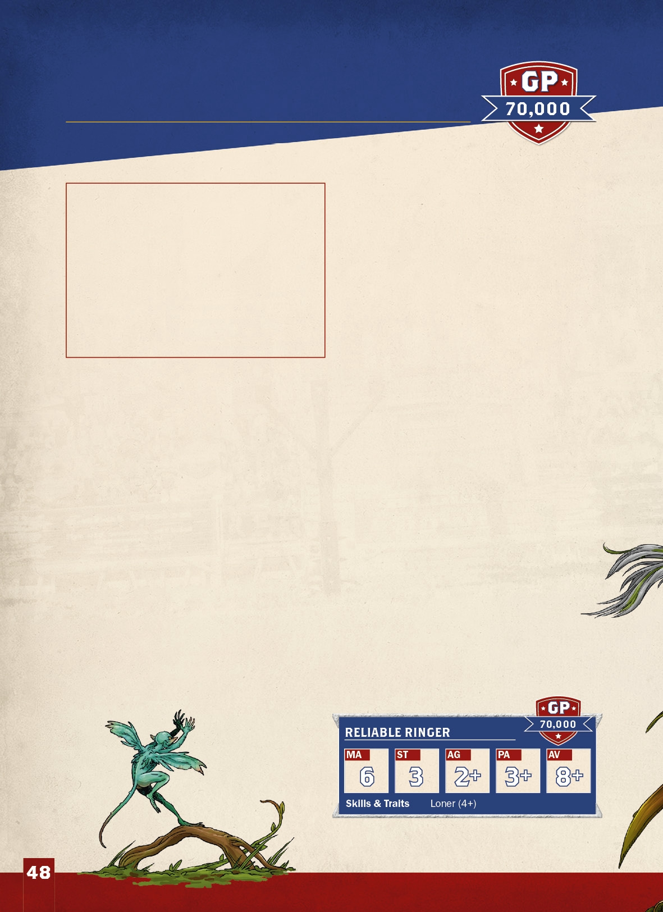

espite all the brutality and violence on the pitch, all the secret
weapons, all the fouling, cheating, corruption and, above
>
all, the endlessly entertaining bloodshed, Blood Bowl is a game of
fineesse and skill. True, those players that excel in the simple art
of flatttening opponents through the precise application of force are
in high demand and can always earn
a good fee, but those that are consistently the most sought after are
those that excel in the athletic art form that is Blood Bowl!
>
alented players are always in high demand for the expertise they can
bring to a team, and the most accomplished are able to demand some
serious
>
remuneration for their services. Be it the speed and agility of an
Elven runner, the expert aim and strong arm of a Human thrower, or
even the stealthy threat of a skilled
and deadly assassin, players that exemplify the grace and elegance of
classical Blood Bowl as firrst laid down in Nufflee's sacred texts are
never short of offers.
>
For most such players, this means securing a steady contract with an
established team and enjoying the security this brings and the
adoration of an enthusiastic fanbase. There is a lot to be said for
practising with a

team for months, even years, learning to function as a whole and
competing for the biggest prizes and greatest sporting honours in the
company of one's friends.
For others, this is clearly a load of emotional nonsense. Many players
of huge talent and almost limitless natural ability are quick to cast
aside a regular gig and instead take enthusiastically to the life of a
mercenary. For such players, selling their superior abilities on a
game-by-game basis to the highest bidder is undeniably the better
option, and anyone who says otherwise clearly hasn't seen what they get
paid!

This sort of ruthlessly mercenary attitude towards the game in general,
and sporting glory in particular, works
just finee for a great many talented players. It is certainly true that
there is never a shortage of teams looking to hire a Reliable Ringer for
an important fixtture or two. Whilst most coaches will hire mercenaries
for their muscle, the cleverest and most cunning will save their cash,
investing
in an expert thrower or a superstar runner at just the
right time, knowing that the skill they bring can be the difference
between winning and losing a key game, and knowing that their opponents
won't be expecting a sudden and dramatic change in tactics. Sometimes,
such bold tactics backfirre; it is not uncommon for a team suddenly
joined by a player whose style differs to theirs so greatly to struggle,
but usually the added talent during a key fixtture pays dividends!

0PTI0NS
A Reliable Ringer must take at least one option chosen from one or
more of the following lists:
>
ADDITI0NAL SKILLS
Any Reliable Ringer may take:
>
• A single additional Agility skill for +30,000 gold pieces.
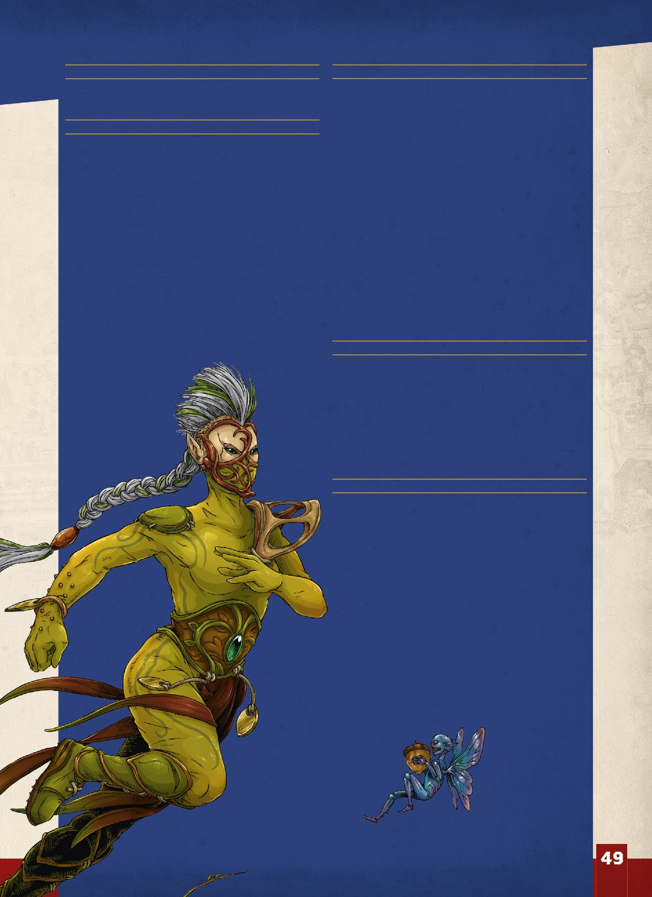• Two or more additional Agility skills
for +40,000 gold
>
pieces each.
• A single additional General skill for +30,000
>
gold pieces.
• A single additional Passing skill for +30,000
>
gold pieces.
• A single additional Strength\* skill for +50,000
>
gold pieces.
>
\**A Reliable Ringer may not take either the Mighty Blow* *(+1) skill
or the Guard skill.*

CHARACTERISTIC 0PTI0NS
A Reliable Ringer may improve or reduce any characteristic by up to 2,
as follows:

• Improve MA by 1 for +30,000 gold pieces.
• Improve MA by 2 for +60,000 gold pieces (available

to teams with the 'Elven Kingdoms League' special rule only).

• Improve AG by 1 for +50,000 gold pieces.
• Improve AG by 2 for +100,000 gold pieces (available

to teams with the 'Elven Kingdoms League' special rule only).

• Improve PA by 1 for +30,000 gold pieces.
• Improve PA by 2 for +60,000 gold pieces (available

to teams with the 'Elven Kingdoms League' special rule only).

• Improve AV by 1 for +40,000 gold pieces.
• Any characteristic may be reduced by 1 for -10,000

gold pieces (to a minimum of 70,000 gold pieces).

MUTATI0N 0PTI0NS
A Reliable Ringer may take a single Mutation from the following list
(available to teams with the 'Favoured Of ' special rule only):

• Big Hand for +30,000 gold pieces.
• Extra Arms for +20,000 gold pieces.
• Two Heads for +30,000 gold pieces.
• Very Long Legs for +30,000 gold pieces.

TRAIT PACKAGES
In addition, a Reliable Ringer may choose a single package of upgrades
from this list:

• Gain the Hypnotic Gaze trait, but replace the Loner

(4+) trait with Loner (5+) for +60,000 gold pieces (available to teams
with either the 'Elven Kingdoms League', 'Favoured Of ', 'Halflinng
Thimble Cup', 'Sylvanian Spotlight' or 'Underworld Challenge' special
rules only).

• Gain the Stab and Secret Weapon traits for +20,000 gold pieces
(available to teams with either the 'Elven Kingdoms League', 'Halflinng
Thimble Cup', 'Sylvanian Spotlight' or 'Underworld Challenge' special
rules only).

0-1B0NAFIDEBIGGUY
MERCENARYPLAYERINDUCEMENTS
>
*130,000 G0LD PIECES PLUS 0PTI0NS,*
*AVAILABLE T0 ANY TEAM*

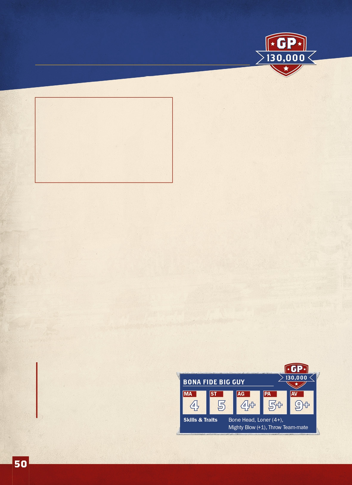

rom gluttonous 0gres to frenzied
Minotaurs, dim-witted Trolls to savage Rat 0gres, Big Guys are
perennially-popular
>
players. The fans never fail to enjoy the on-pitch antics of these
giants of the game, be it mighty feats of strength such as hurling
other, smaller players the length of the pitch, or outbursts of
unreasoning violence, directed indiscriminately towards friend and foe
alike, Big Guys never
fail to entertain the masses!
>
etter still, the vast majority of Big Guys are incredibly stupid
individuals. Many are notoriously prone to mixing up even the most
simple of well-
>
drilled plays and forgetting not only where they are, but why they are
there and what is going on around them.
The scale upon which the average Big Guy can seriously mess up is
truly endless! There have been times when a particularly confused and
bewildered Big Guy has been known to simply stand aside and let an
opposing player pass by on their way to the end zone or, on more than
one memorable (and hysterical, from the perspective of the fans!)
occasion, to obligingly hand over the ball to a player on the opposing
team for no other reason than that they asked politely!
>
Such gaffs are undeniably frustrating for coaches; their tortured
wails of despair greeted with cheers and
>
applause from the stands becoming a mainstay of game
>
HACKSPIT
QUILLCHEWER'S FUN FACTS *Vizgrak Pigzit still holds the record for*
*Most Offcialsls Killed in One Game. Retch* *Gutheave of Da Green
Machine made a* *good efforrt in 2491, but was hampered by* *his
insistence on trying to eat them all!*

day entertainment and a universally accepted element
of fan interaction. But it is not only the coaches that feel the
frustration. Many a hardcore fan has felt the anguish
of seeing their beloved team's stalwart Big Guy simply switch off to the
action around them, preferring to stare into the middle distance,
philosophising deeply upon
some unknowable concern whilst dreamily excavating
the contents of one cavernous nostril. Such moments of despair are
fleeeting for the fans, however, usually replaced by the simple joy of
taking out one's frustrations on a rival fan, punishing their cruel
amusement with angrily-thrown food wrappers, drinks containers, insults,
and even fistts!

This hopeless unreliability has caused many a pundit
to question the logic of including Big Guys on teams at all;

why would a coach put themselves through the torture of fieelding a
player so likely to mess up at a critical moment? Why would a coach wish
to go through the heartache
and stress of trying to train such a player to perform in
the firrst place? The answer to these questions, though, is simple; when
a Big Guy does get things right, the results can be spectacular! The
strength they bring to the pitch is undeniable, the violence they are
capable of unleashing endlessly inspirational, and the fear a Big Guy
can instil in the opposition invaluable!

It's no wonder that they are ever in such high demand.
>
0PTI0NS
A Bona Fide Big Guy must take at least one option chosen from one or
more of the following lists:
>
ADDITI0NAL SKILLS
Any Bona Fide Big Guy may take:
>
• A single additional Strength skill for +30,000
>
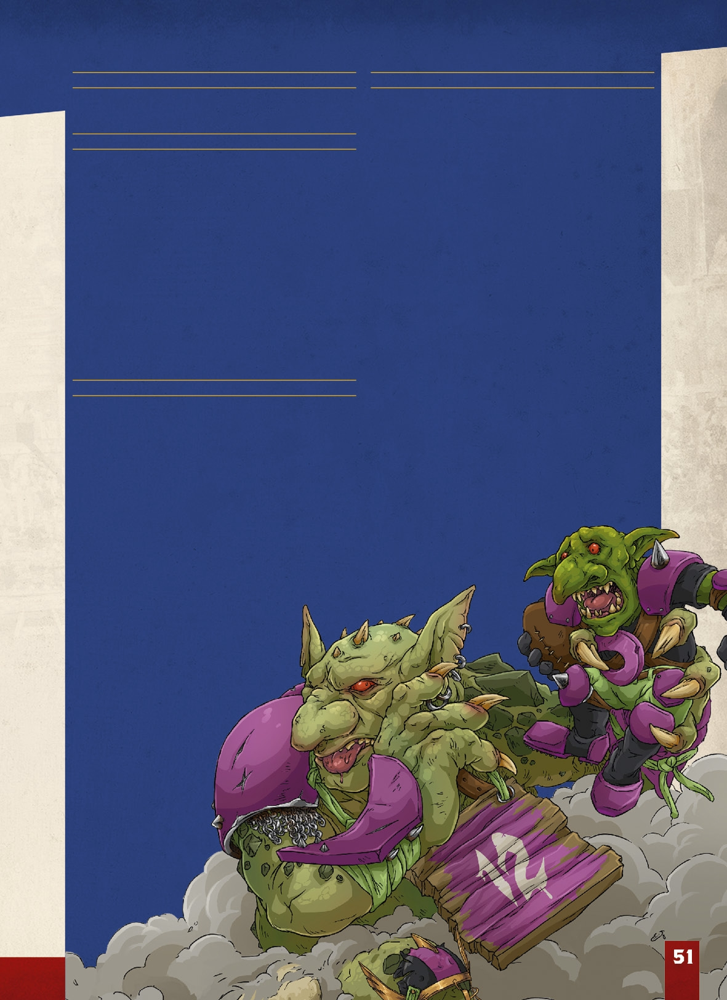gold pieces.
• Two or more additional Strength skills for +40,000 gold
>
pieces each.
• A single additional General skill for +40,000
>
gold pieces.
• A single additional Passing\* skill for +30,000
>
gold pieces.
• A single additional Mutations skill for +40,000
>
gold pieces.
>
\**A Bona Fide Big Guy may not take the Leader skill.*
>
CHARACTERISTIC 0PTI0NS
A Bona Fide Big Guy may improve or reduce any characteristic by up to
2, as follows:
>
• Improve MA by 1 for +20,000 gold pieces.
• Improve MA by 2 for +50,000 gold pieces (available
>
to teams with either the 'Favoured Of ', 'Lustrian Superleague',
'Sylvanian Spotlight' or 'Underworld Challenge' special rules only).
>
• Improve AG by 1 for +40,000 gold pieces.
• Improve PA by 1 for +30,000 gold pieces.
• Improve PA by 2 for +60,000 gold pieces (available
>
to teams with either the 'Badlands Brawl', 'Halflinng Thimble Cup',
'Old World Classic' or 'Underworld Challenge' special rules only).
>
• Improve AV by 1 for +20,000 gold pieces.
• Any characteristic may be reduced by 1
>
for -10,000 gold pieces (to a minimum
of 130,000 gold pieces).

TRAIT PACKAGES
In addition, a Bona Fide Big Guy may exchange the Bone Head trait for a
single package of upgrades from this list:

• Gain the Always Hungry, Projectile Vomit, Really Stupid

and Regeneration traits, but reduce AG by 1 for
-10,000 gold pieces (available to any team).

• Gain the Frenzy skill, the Unchannelled Fury trait and

the Horns mutation, but lose the Throw Team-mate
trait for +20,000 gold pieces (available to teams
with either the 'Badlands Brawl', 'Favoured Of ', 'Halflinng Thimble
Cup', 'Old World Classic', 'Underworld Challenge' or 'Worlds Edge
Superleague' special
rules only).

• Gain the Frenzy skill, the Animal Savagery trait and

the Claws and Prehensile Tail mutations, but lose
the Throw Team-mate trait for +20,000 gold pieces (available to teams
with either the 'Badlands Brawl', 'Favoured Of ', 'Lustrian
Superleague', 'Sylvanian Spotlight' or 'Underworld Challenge' special
rules only).

• Gain the Mighty Blow (+2) skill, but replace the Loner (4+) trait with
Loner (5+) for +50,000 gold pieces

(available to any team).
• Gain the Ball & Chain, No Hands, Really Stupid and

Secret Weapon traits and +2ST, but reduce MA by 1
for +80,000 gold pieces (available to teams with
either the 'Badlands Brawl', 'Favoured Of ', 'Lustrian Superleague',
'Old World Classic' or 'Underworld Challenge' special rules only).

Titanic Effoort... The Biggest of the Big Guys

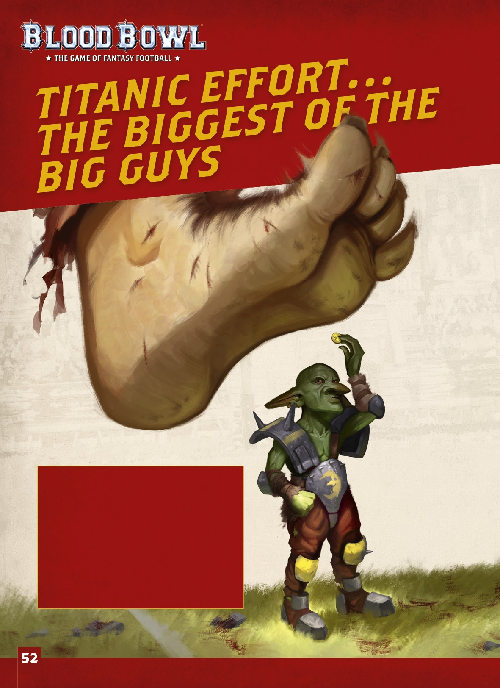

ong ago, in a time when war was preferred to Blood Bowl and wanton
destruction on the battlefieeld occupied the hearts and minds of
>
every mortal across the world, there lived a race known as the
Sky-titans. As befittting of such a grandiose title, the Sky-titans
lived atop the tallest peaks, building their halls and towering
castles at the top of the world. Solitary beings, the Sky-titans would
gather once a year to renew their kinship, throwing and catching
boulders in a contest of athleticism that many believe was rooted in
the worship of Nuffele!

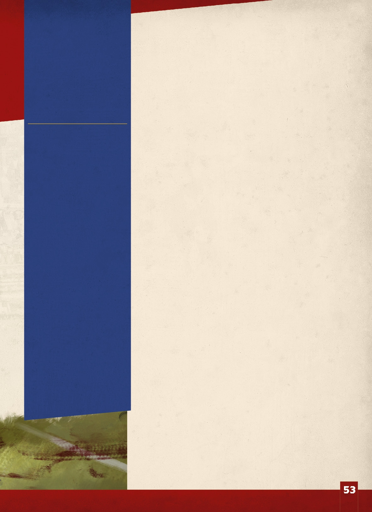

oday, there are no more Sky-titans.Their tale
ended in tragedy, for they
>
were consumed, quite literally,
by a great migration of 0gres
fleeinng the destruction of their
tribal lands. Those few Sky-titans that survived were forced into
small, huddled tribal groups that dispersed across the 0ld World,
and over time degenerated into
the race of Giants we know today. Historically, many Giants were
kept captive by 0gre tribes; the mightiest Tyrants (as 0gre tribal
chieftains are called) enjoyed hunting Giants and wrestling them into
submission to prove their prowess. In less enlightened times, these
captives were prized for their destructiveness in battle. In later
years, thanks in part to strict
NAF regulations regarding the inclusion of Giants on Blood Bowl teams,
Giants came to be viewed
as too expensive to keep around, due largely to the damage they
do to stadia and the outrageous expense of equipping them with
offcialal, branded kit. Consequently, possession of the creatures fell
out of favour in 0gre society. Until, that is, a famed 0gre coach
known as Skorag Gristlebrook took a fresh look at ancient Sky-titan
carvings.
>
n mosaics depicting the Sky-titans' games, Skorag saw a form of Blood
Bowl. Proclaiming that Nufflee, himself a tooth of the Great Maw,
wished Giants to walk upon the gridiron in larger numbers, Skorag set
about making it so. Following

the collapse of the NAF in 2488, the only known all-Giant team of the
era, the
Bifrost Berserkers, were invited to play a string of friendly games
against the Ogre teams of the Mountains of Mourn Mega-maul League. Sadly
for the trusting Giants of Norsca, the invitation was little more than a
ruse to lure the skilled Giant players into a trap

Welcomed by Coach Skorag and his team, the Tusk Peak Tyrants, the
Bifrost Berserkers were treated to a great feast. Sadly for the Giants,
this feast was
actually the cover for a cunning trap. Well-fed and extremely drunk, the
Giants
were fallen upon by Ogres from a dozen teams. The fightting lasted many
hours, but the outcome was never really in any doubt. In the space of a
single evening, the Bifrost Berserkers team was the victim of a hostile
corporate takeover by the Tusk Peak Tyrants!

With a healthy stock of captive Giants acquired, Coach Skorag firrst
experimented with forming a full team, essentially fieelding the full
strength Bifrost Berserkers
squad in one go to see what would happen and if he could recreate the
Berserkers' former glory. This experiment ended in disaster for Coach
Skorag as 11 shackled, clumsy Giants crammed onto a pitch, all rather
determined to undermine their
coach at every opportunity, resulted in a crushed stadium and a stampede
of panicking Gnoblars! Coach Skorag quickly worked out that, whilst the
Berserkers players performed well as a team, they did so only of their
own volition and were unlikely to behave for their new owner without
serious financiall recompense; a price Skorag was unwilling to pay (both
literally and figurratively).

Skorag quickly settled on a new plan. Realising that a single Giant
could just about be controlled by an Ogre team, and taking the example
of many Human teams from the west that would fieeld an Ogre as a 'Big
Guy', Skorag decided to
trial the idea of hiring out his Giant players to other Ogre teams for a
considerable fee. Thus was founded Gristlebrook's Giant Emporium (*"We
Put the 'Big' in The Big* *Leagues"*, as the advertising slogan goes).

Over the next few seasons, a glut of Giants took to the fieeld as part
of the Mountains of Mourn Mega-maul League, and countless unfortunate
stunty players

became permanent features embedded in the astrogranite of many a pitch.
After a lengthy litigation period involving accusations of a rogue Giant
running off with the heiress of an Imperial noble family, Giants were
banned from regular play on the orders of the RARG.

Today, Gristlebrook's Giant Emporium caters to teams with gold enough to
hire
a Giant, but which are lacking in both caution and scruples. Whilst the
number of leagues or tournaments that allow such brutes is quite low,
the market for their services in exhibition games and grand events is
most lucrative. Many celebrations, sacred holidays and feast days are
marked by a Blood Bowl game where one
(or both!) sides include a Giant player, a format especially loved by
northern fans
and Ogre Tribes. Though cumbersome and far from coordinated, the sight
of a Giant crushing players and tossing ball carriers into the stands is
one few people will
miss. One thing is sure the death toll will be high when a Giant takes
to the fieeld!

**GIANT-SIZED INDUCEMENTS**
>
he following pages contain rules for using Giant players in your games
of Blood Bowl. Coaches should note that these rules are entirely
optional.
>
Their inclusion in a league or tournament is at the discretion of the
league commissioner or tournament organiser. Otherwise, coaches who
wish to use these
rules for an exhibition game should decide this
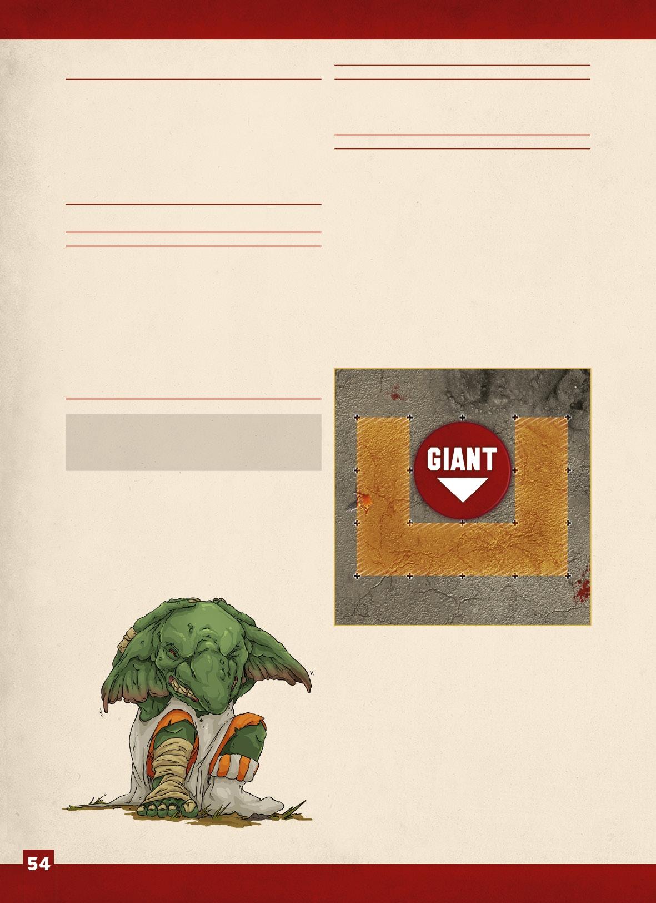between themselves.
>
0-1 GIANT MERCENARY PLAYER INDUCEMENT
350,000 G0LD PIECES, AVAILABLE T0 ANY TEAM Unlike regular players,
Giants are not hired as permanent additions to a team. Instead, they
are Induced during
the pre-game sequence in exactly the same way
as other Mercenary players. Giants may be used alongside the Mercenary
Player Inducements in the
*Blood Bowl* rulebook, or those presented previously in
this supplement.
>
Giants have the following profilee:
>
MA ST AG PA AV Giant 6 7 5+ 5+ 11+
>
Skills & Traits Always Hungry, Bone Head,
Break Tackle, Juggernaut, Loner (4+),
>
Mighty Blow (+2), Multiple Block, Stand Firm, Throw Team-mate

SPECIAL RULES
Giants are big. Bigger than Ogres, Minotaurs, Trolls or any of the other
Big Guys that regularly take to the Blood Bowl pitch. A Giant is subject
to the following special rules:

BASE SIZE AND TACKLE Z0NES
Unlike other players, a Giant occupies not one but four squares on the
pitch. A Giant will always occupy four squares; when they are standing
up, when they are Prone and when they are Stunned.

Additionally, the direction in which a Giant faces is important as, due
to their immense size, a Giant's Tackle

Zone does not extend to every square adjacent to the four squares they
occupy. Like other players, the Tackle Zone
of a Giant covers eight squares; those to the Giant's front and sides. A
Giant's Tackle Zone does not extend to the four squares directly behind
the Giant, as shown in the diagram below. The controlling player must
make it clear
to their opponent which direction the Giant is facing and where its rear
lies.

Finally, should any of the four squares occupied by a Giant's base be
targeted by an in-game effect (such as a

spell cast by a Wizard or by the effects of a Special Plays card), the
player is considered to have been hit by the effect just as any other
player would be.

M0VEMENT
When a Giant moves it does so just like any other player, moving a
number of squares equal to its Movement Allowance. A Giant may move
forward, backward, to either side, or diagonally, as long as they do
not enter a square occupied by another standing player (from either
team).
>
If any of the four squares a Giant occupies is within
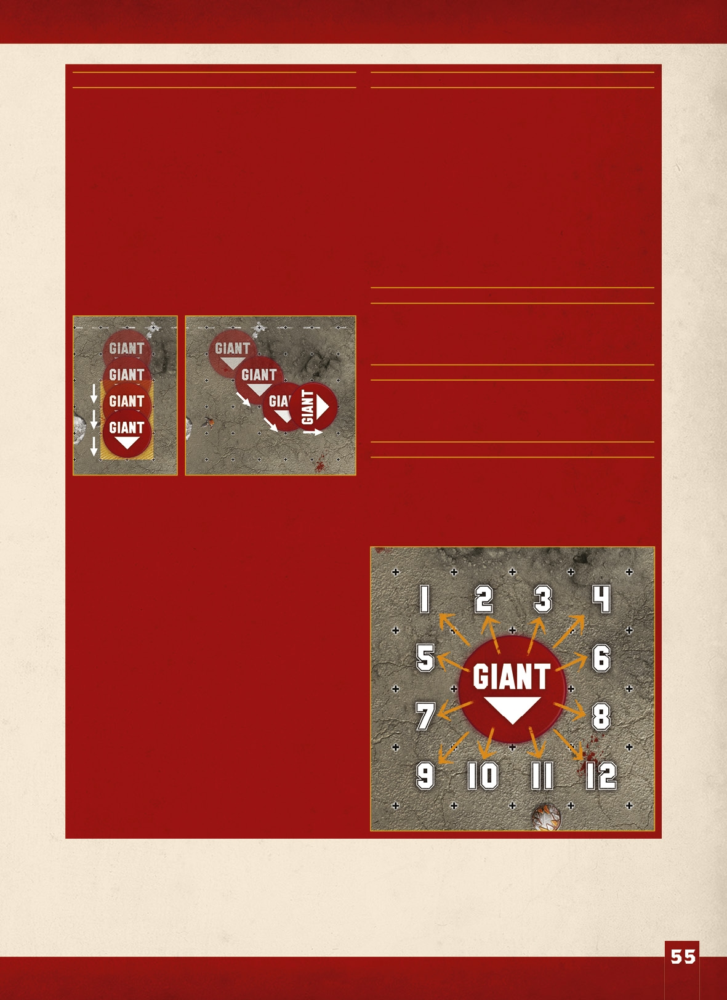the Tackle Zone of an opposition player,
the Giant is considered to be Marked by that player and must dodge to
leave that square, just like any other player. If when dodging any
part of a Giant's base moves into a square
in which it is being Marked, apply a -1 modifierr per player Marking
them as normal.
>
*STEPPING 0VER PR0NE 0R STUNNED PLAYERS:* Unlike other players, a
Giant is large enough to simply step over downed players that would
block the path of other players.
A Giant does not need to Jump Over a Prone or Stunned player; it may
instead move freely over Prone or Stunned players if it has
sufficientt Movement Allowance to do so.
>
However, a Giant may not end its movement with
any part of its base occupying a square that contains a
>
Prone or Stunned player. Therefore, should a Giant Fall Over whilst
stepping over a Prone or Stunned player, that player is pushed back
one square in a direction chosen by the coach of the team the Giant
belongs to, exactly
as if a Push Back block dice result had been applied against them.
>
*SURR0UNDED!:* Coaches should note that, due to the large size of
Giants, they may findd it impossible to move through small gaps. If at
any point during its movement a Giant findss one or more of the four
squares its base
>
occupies obstructed by a Standing player, it cannot move into that
square.

PUSH BACKS
Just like any other player, a Giant must be pushed back into empty
squares. If this is not possible, then the Giant is pushed into one or
more occupied squares and any players that originally occupied the
square or squares are chain-pushed in turn.

*PUSHED INT0 THE CR0WD:* If any part of a Giant's base is pushed off the
pitch, the player is pushed into the crowd and removed from play. In
other words, it doesn't matter how big they are, a Giant cannot be half
on and half off
the pitch. They are either entirely on the pitch, or they are off it!

THR0WING 0THER PLAYERS
Giants are particularly effective at throwing smaller
players. When a Giant attempts to throw a team-mate, you may re-roll a
Fumbled throw.

A GIANT 0BSTRUCTI0N
Giants do tend to get in the way of other teams' passing plays. When a
Giant interferes with a pass, it reduces any negative modifierrs that
would normally apply by 2.

SCATTER

As Giants occupy four squares rather than the usual one, the normal
Random Direction template cannot be used for them. Instead, Giants use
the Random Direction template shown below. To use this template, simply
roll a D16
rather than a D8, re-rolling any rolls of 13 or above.

Sponsorship

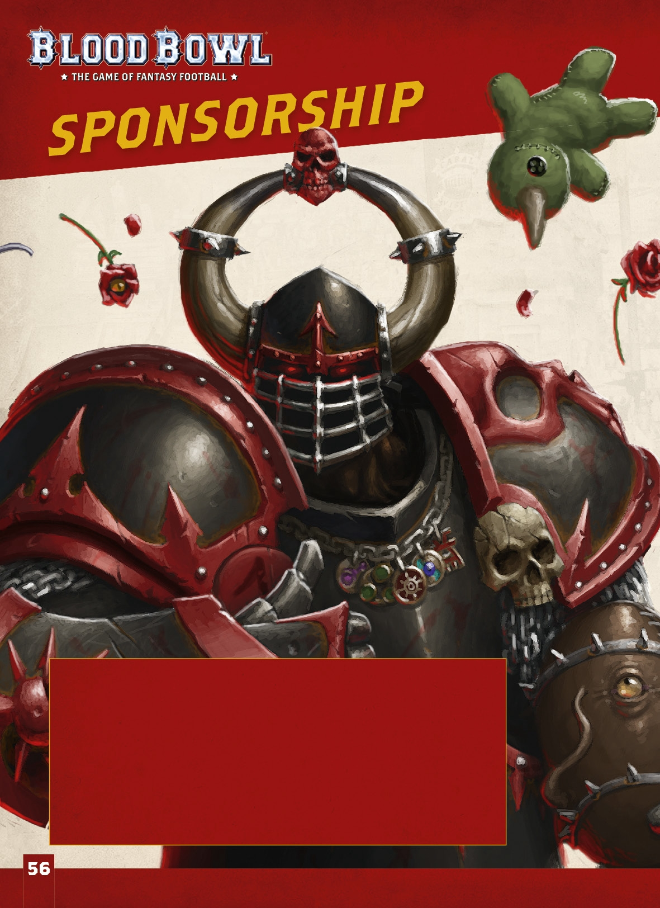

ack in the days of the NAF, team and player sponsorship was heavily
controlled, thanks in no small part to the sport's favourite walking
billboard, Lord Borak. Companies were free to back everything from
events to stadia, but teams
>
wishing to receive money from corporations were subject to stringent
controls. When the NAF broke up, however, everything changed. Some of
the firrst teams to cotton
on to the idea were High Elves, who were used to the kind of lavish
lifestyle that the Association had funded. They realised that by
plastering their kit with advertising slogans, they could actually
make just as much gold or, in some cases, even more than they
previously had. 0f course, there were missteps along the way - Lucien
Swift still visibly shudders any time the McMurty's Big Murt
Gladiators are mentioned - and it didn't take teams long to realise
that sponsorship was a two-way street, but in the modern game it has
become a fairly standard way for teams to gain funding.
>
**BL00D** **B0WL**
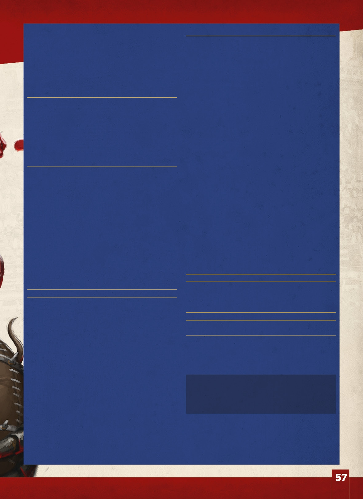**SP0NS0RS**
>
**T**
>
eams can attempt to findd a Sponsor at the beginning of Step 4 of the
post-game sequence, before any players or Sideline Staff are hired or
firred. If you wish
>
to seek a Sponsor for your team, roll a D16, then add the team's
Dedicated Fans characteristic and any of the following modifierrs that
apply:
>
• +3 if the team won the game.
• +1 for each touchdown the team scored.
• +1 for each player on the opposing team that suffered a
>
roll on the Casualty table (however this was caused).
• +2 if the game was played during the Play-off season.
>
If the result is 20 or more, your team can accept either a One- time
Sponsorship or an Ongoing Sponsorship.
>
0NE-TIME SP0NS0RSHIPS
The team lends its image to a well-known brand, appearing
in some Cabalvision ads or making personal appearances
at high-profilee product launches, in exchange for a one-off payment.
All the players have to do is behave themselves. Easy, right?
>
The team receives D6 x 10,000 gold pieces, which are immediately added
to its Treasury. Then, roll a D6:
>
• On the roll of a 1, one randomly selected, permanently hired player
gets a little carried away with the free drinks
>
at a public appearance and has to spend some time recovering. The
selected player must miss the next game, exactly as if they had
suffered a 7-9, Seriously Hurt result on the Casualty table. If the
selected player is already missing the next game, randomly select
another.
>
• On the roll of 2+, the players are well-behaved and no
>
one overindulges.

0NG0ING SP0NS0RSHIPS
The team becomes officiall ambassadors for the brand, receiving a sum of
gold each time they make a public appearance. Of course, this burdens
the team with all sorts of new responsibilities and is even riskier than
a One-time Sponsorship deal.

If a team takes an Ongoing Sponsorship, make a note of this on their
roster. During Step 1 of the post-game sequence of every future game,
when recording the team's winnings, a team that has an Ongoing Sponsor
gains an additional D3
x 10,000 gold pieces in addition to their winnings. Then roll
a D6:

• On the roll of a 1, one randomly selected player from your team has
upset the Sponsors somehow and has received a visit from a pair of
'brand ambassadors'. The selected

player must miss the next game, exactly as if they had suffered a 7-9,
Seriously Hurt result on the Casualty table. If the selected player is
already missing the next game,
this roll has no further effect.

• On the roll of 2+, the players are well-behaved and no one

upsets the Sponsors.

Teams can have any number of Ongoing Sponsorships however, the roll to
see whether the Sponsors are happy must

be made for each one!

Immediately after rolling to see whether the Sponsors are happy or not,
you can choose to end any Ongoing Sponsorships, deleting them from the
team's roster.

REDRAFTING AN 0NG0ING SP0NS0R
Any team with an Ongoing Sponsorship can attempt to redraft it from one
league season to the next. To do so, simply roll a D6 on the table
below:

REDRAFTING AN 0NG0ING SP0NS0R TABLE

D6 plus
Dedicated Fans RESULT

2-8 *Poor Performance:* The Sponsors
>
are disappointed with the team's performance and decide to seek better
brand ambassadors. The Sponsorship
ends immediately.
>
9+ *Most Acceptable:* The Sponsors are
quite happy with the team's performance,
>
though they won't admit that to the
players! The Sponsorship continues into
the next league season.
>
**MAJ0R** **SP0NS0RSHIPS**
>
here are a number of big name sponsors who only make offers to the
brightest
>
and most successful teams.
A Major Sponsorship is an Ongoing Sponsorship as described previously,
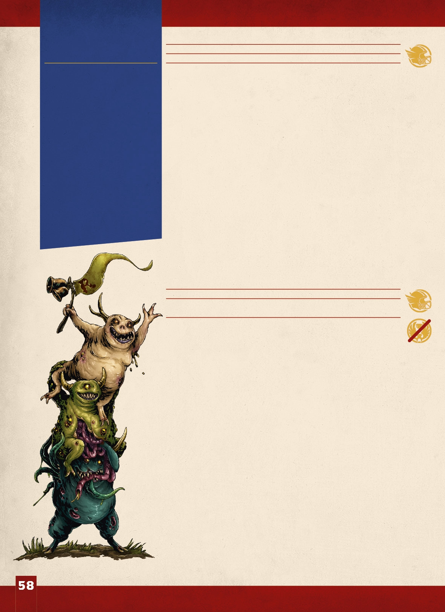but does not grant the standard,
financiall bonuses of an Ongoing Sponsorship; instead, each has its
own special rules. A team can only have one Major Sponsor at a time,
but a Major Sponsor can sponsor more than one team at a time.
Note that, for various ideological and philosophical reasons too
numerous and boring to list, some Major Sponsors won't work with
certain teams, and vice versa:

MCMURTY'S BURGER EMP0RIUM

AVAILABLE T0 ANY TEAM
*Halflinng chef Rungo McMurty's finee dining establishment found a new
lease*
*of life in 2396, when Count Otto von Carroburg demanded a beef
sandwich* *with all the trimmings. Rungo, having run out of bread,
sliced a bun in half*
*and used that instead - and started a food revolution! Since Rungo
retired*
*and sold the business in 2452, the company has grown to the point that
there* *seems to be a McMurty's Burger Emporium stand at every Blood
Bowl stadium* *on the circuit.*

A team that is sponsored by McMurty's does not get any financiall
incentive, but the improved catering inspires the players to new levels
of enthusiasm! A team sponsored by McMurty's Burger Emporium has the
following special rules:

• A team that is sponsored by McMurty's Burger Emporium gains an extra
team re-roll for the firrst half of each and every game they play. If
this

team re-roll is not used during the firrst half, it may be carried
over into the second half.

• McMurty's might make finee food, but sadly their fare is somewhat
fattening

and doesn't make an ideal diet for athletes! Players on a team
sponsored
by McMurty's Burger Emporium cannot improve either their MA or AG
characteristic while the Sponsorship is ongoing.

A coach can choose to end their deal with McMurty's in the same way as
an Ongoing Sponsorship.

FARBLAST & S0NS 0RDNANCE S0LUTI0NS
AVAILABLE T0 ANY TEAM EXCEPT TH0SE THAT HAVE THE 'ELVEN KINGD0MS LEAGUE'
SPECIAL RULE
*"Farblast: When you need to blast things that are very far away." It's
not the* *catchiest slogan going, but then, Farblast & Sons has always
believed in* *substance over style. Combining Dwarfen engineering with
surprisingly low* *prices, Ragni Farblast's arms empire has been very
successful indeed in* *recent years. The company caught the attention of
Blood Bowl fans when* *Barik, the younger of Ragni's two sons, quit his
engineering apprenticeship to* *take to the pitch and, in so doing,
invented the now-infamous Ballzooka.*

A team that is sponsored by Farblast & Sons does not get any financiall
incentive, but will instead be able to access all manner of explosives
with which to create havoc on the pitch! A team sponsored by Farblast &
Sons has the following special rules:

• A single permanently hired Lineman positional player of your choice
may be equipped with a satchel of *Farblast's Finest Detonating
Spheres*. This player gains the Bombardier, Loner (4+) and Secret Weapon
traits, and Secondary access to Passing skills, as long as the
Sponsorship lasts.

• While sponsored by Farblast & Sons, the team's winnings after each
game are reduced by 20,000 gold pieces due to increased insurance
premiums.

A coach can choose to end their deal with Farblast & Sons in the same
way as an Ongoing Sponsorship.

STAR INSURANCE GUILD
AVAILABLE T0 ANY TEAM
*Everyone's seen the Cabalvision advert: "Stagecoach* *rolled over
your foot? Make a claim with S.I.G.! Dared to* *eat a pie at a Rotters
game? Make a claim with S.I.G.!* *Suffered painful injuries to your
hands or feet infliccted by* *the face of some dumb guy who shoulda
shut up when* *you told him to? Make a claim with S.I.G.!"*

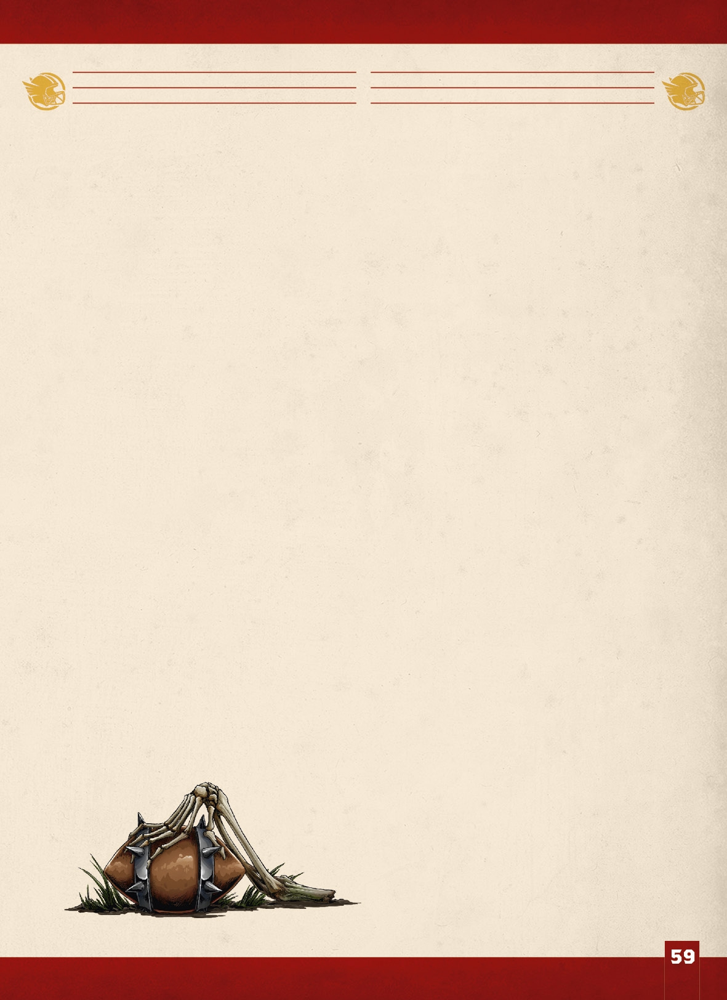

*The Guild doesn't generally provide cover to Blood*
*Bowl players - for obvious reasons - but they'll happily*
>
*make an exception for teams that advertise their services.* *Of
course, most of those teams don't realise that payment* *could be
demanded at any moment..*
>
A team that is sponsored by the Star Insurance Guild does not get any
of the usual financiall incentives. Instead, the team is insured in
case of sport-related fatalities. A team sponsored by the S.I.G. has
the following special rules:
>
• If a permanently hired player belonging to a team sponsored by the
S.I.G. suffers a Casualty result of
>
15-16, DEAD, and is removed from the team roster during the post-game
sequence, the team immediately receives a pay-out. The amount paid out
is equal to
half of that player's Current Value (rounding each up to the nearest
5,000 gold pieces).
>
• Once all dead players have been removed, roll a D6.
>
If the result is equal to or lower than the number of players that
were removed from the roster, the Guild's agents have arrived to
collect their due! The team
must immediately pay 2D6 x 10,000 gold pieces. If it cannot afford to,
its treasury is emptied and the deal with S.I.G. comes to an end. D3
randomly selected, permanently hired players go mysteriously absent
and must miss the next game, exactly as if they had suffered a 7-9,
Seriously Hurt result on the Casualty table. Record on the team's
roster that it is now on
the S.I.G. blacklist and cannot be sponsored by them ever again.
>
A coach can choose to end their deal with the Star Insurance Guild in
the same way as an
>
Ongoing Sponsorship.

STEELHELM'S SP0RTING EMP0RIUM AVAILABLE T0 ANY TEAM
*Several years ago, Garik Steelhelm retired from the life of*
*a bandit chief to follow his dream of starting a business* *that would
cater to athletes of all levels, from well-*
*meaning wannabes looking to shift those Geheimnisnacht* *pounds to
professional sportsfolk wanting top-of-the-*
*line equipment. He was one of the firrst to come up with*
*the idea, and it certainly proved popular! To this day,* *Steelhelm's
Sporting Emporium is popular with Blood*
*Bowl teams from all corners of the circuit, sponsoring* *several of
them. A team wearing the Steelhelm logo can* *expect discounted goods,
unlimited access to franchised* *gyms around the world, and connections
with all the top* *trainers at reduced rates.*

A team that is sponsored by Steelhelm's Sporting Emporium does not get
any financiall incentive, but does gain access to some of the best
personal trainers in the business, ensuring players are bullied and
browbeaten into giving their fullest at all times. A team sponsored
by Steelhelm's Sporting Emporium has the following special rules:

• When a permanently hired player belonging to a
team sponsored by Steelhelm's Sporting Emporium

randomly selects a new Skill, either Primary or Secondary, you may
re-roll one or both of the D6. However, you must accept the result of
the re-roll even
if the Skill generated is less desirable (note, however, that if the
Skill rolled when rolling or re-rolling the second D6 is one that the
player already has or cannot take, you may re-roll the dice as
normal).

• There is a chance that a player will injure themselves when training
intensively. Once a new Primary skill has

been selected, roll a D6. Once a new Secondary skill has been
selected, roll two D6:

-   If a 1 is rolled on either of the D6, the player must

miss the next game, exactly as if they had suffered a 7-9, Seriously
Hurt result on the Casualty table.

-   If a 1 is rolled on both dice, the player must miss the

next game and suffers a Niggling Injury, exactly as if they had
suffered a 10-12, Serious Injury result on the Casualty table.

A coach can choose to end their deal with Steelhelm's Sporting Emporium
in the same way as an

Ongoing Sponsorship.

Blood Bowl Stadia

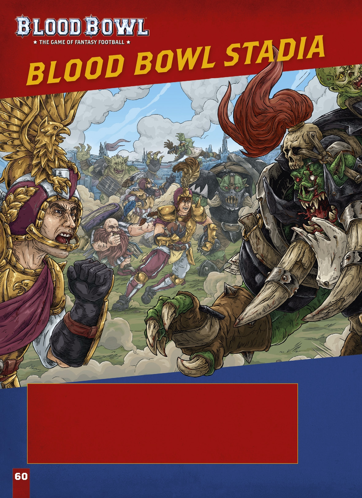

lood Bowl stadia can be found across the world and no two are exactly
alike. Back in the old days, pretty much every team had a home
stadium. 0riginally, these were paid for
and maintained by the NAF, but by the 2450s, when the number of teams
active within
>
the NAF had grown from 16 to 40, most had taken private ownership of
their home stadium. In addition to these stadia, many provincial teams
active in the minor leagues owned a stadium
as well, whilst others rented use of one, often NAF-owned, in their
hometown. 0f these stadia, most were shared by several teams. In this
way, the stadia of the 0ld World fell into two broad categories: those
privately owned by a single team, and those owned by the NAF or a
local landlord which rented space to teams and tournaments.

Playing**S**Away **ADIA** **0F THE**
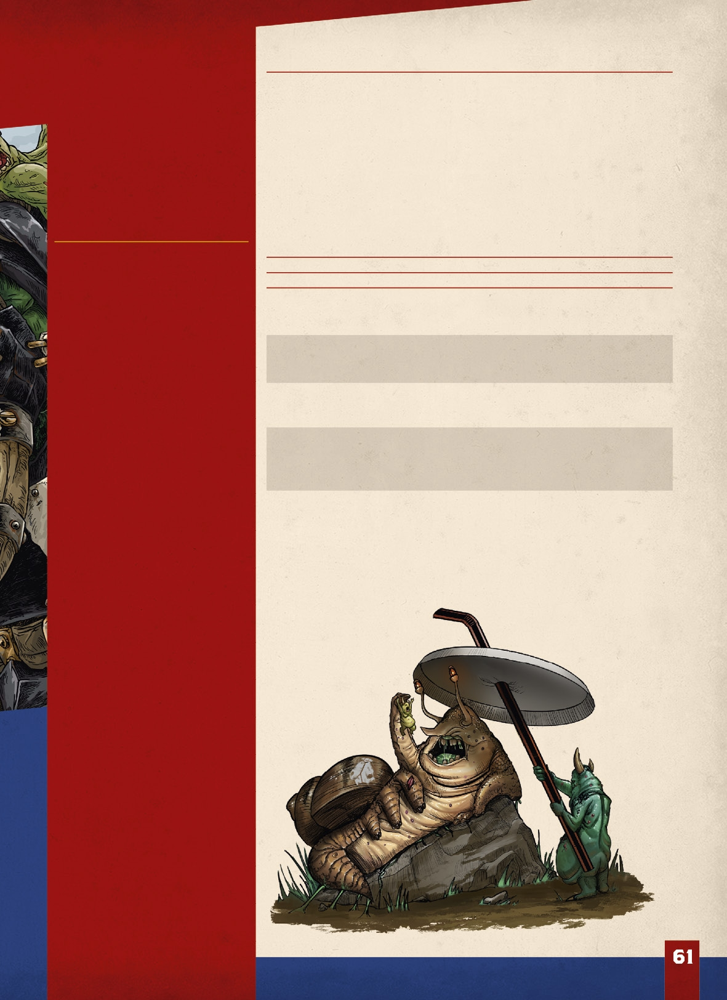**0LD**

**W0RLD**
>
**F**
>
Blood Bowl has countless (often contradictory) regulations covering
the size of a pitch and its markings,
and as a result the majority of
pitches look pretty much the same
(most groundskeepers and RARG officialss are sensible enough to simply
ignore many of the contradictions in the regulations), even if the
stadia the pitch occupies may vary greatly. However,
the regulations aren't water-tight, and there are plenty of unusual
pitches out there (often as a result of attempting to adhere to
contradictory regulations!). Also, a game can be affected by
everything from the sturdiness of a stadium's stands to the upkeep of
its dungeons, all of which tends to come down to how well-funded the
stadium
is. Finally, while a lot of stadia are
found in temperate areas, there are a fair few to be found in frozen
tundras, windswept deserts or in the centre of a tropical forest.

**PLAYING AWAY**

he following pages contain four tables, each covering a different
category of stadium and containing rules for playing games within
different stadia that fall into that category. These rules allow
coaches to recreate the incredible

experience of playing Blood Bowl in a real Old World stadium. Sort of

The inclusion of these rules in a league or tournament is at the
discretion of the league commissioner or tournament organiser.
Otherwise, coaches who wish to use

these rules for an exhibition game should decide this between
themselves.

Before Step 1 of the pre-game sequence, roll 2D6 on the Random Stadium
table that follows to see which category of stadium the game will take
place at:

RAND0M STADIUM TABLE

2D6 RESULT
2-3 *Unusual Playing Surface:* This stadium has a playing surface that
>
is best described as 'non-standard'. Roll a D6 on the Unusual Playing
Surface table (see page 62) to determine an Attribute.
>
4-5 *Rough & Ready Stadium:* The owners and staff of this stadium
clearly prioritise bloody violence over proper maintenance. Roll a D6
on the Rough
>
& Ready Stadium table (see page 63) to determine an Attribute.
6-8 *Nothing out of the 0rdinary:* This game is taking place at a
perfectly
>
average stadium; the pitch adheres to the regulations and the stadium
itself is well-built and well-maintained. This stadium has no
Attributes.
>
9-10 *Luxury Stadium:* This stadium is much more impressive than most!
Luxurious VIP boxes and well-appointed stands attract a well-to-do
crowd.
>
Roll a D6 on the Luxury Stadium table (see page 64) to determine
an Attribute.
>
11-12 *Local Crowd:* This stadium's home crowd is quirky, to say the
least, but they are dedicated fans of Blood Bowl and will certainly
make the game one to remember! Roll a D6 on the Local Crowd table (see
page 65) to
>
determine an Attribute.
>
UNUSUAL PLAYING SURFACE
>
D6 ATTRIBUTE
1 *Ankle-deep Water:* The pitch is floodedd! Not just wet, it's
actually floodedd and lies under a good three inches
>
of water! Every time a player Falls Over, apply a -1 modifierr to the
Armour roll.
Additionally, whenever a Stunned player rolls over at the end of
either teams' turn, roll a D6. On a roll of 1, lying face-down in the
water has done them no favours, and they remain Stunned for another
turn.
>
2 *Sloping Pitch:* The stadium is built on a serious incline. Good for
one team, a nightmare for the other!
>
At the start of the firrst drive, roll a D6:
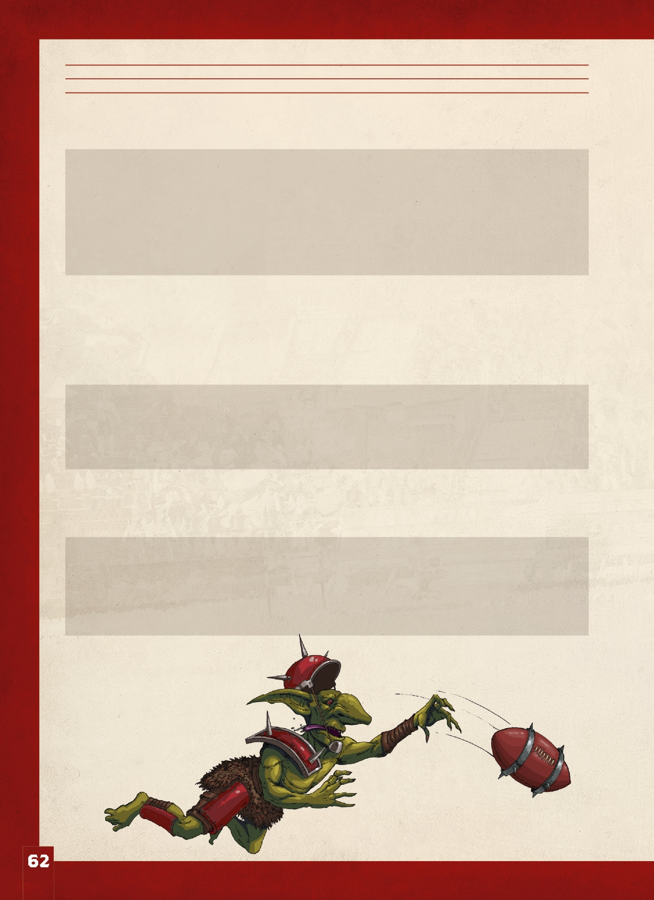 On a roll of 4+, it is sloping down
towards the kicking team's End Zone.
On a roll of 1-3, the pitch is sloping down towards the receiving
team's End Zone.
Whenever the ball bounces, do not use the Random Direction template;
instead, use the Throw-in template, oriented so that the 3-4 points
directly down the slope.
Additionally, players can attempt to Rush one additional time, as long
as it takes them closer to the End Zone
at the bottom of the slope.
After half-time, the pitch will slope the other way, representing the
teams changing ends.
>
3 *Ice:* A violent sport on ice? It'll never catch on. Every time the
ball bounces, it moves two squares in a direction
>
determined by rolling a D8 and referring to the Random Direction
template, rather than the usual 1.
Additionally, whenever a player Falls Over or is Knocked Down, they
will slide one square in a direction determined by rolling a D8 and
referring to the Random Direction template. If they would slide into
an occupied square, they do not move. If they slide off the pitch,
they risk Injury by the crowd as normal. If they slide into a square
occupied by the ball, the ball will bounce.
Note that the players are assumed to have been issued with appropriate
kit to traverse the ice skates, snowshoes or enchanted cleats so their
movement is not affected.
>
4 *Astrogranite:* This artificiall stone substitute was all the rage
in the 2480s and some stadia still keep it for its
>
extra-grippy surface (and the fact that it's always entertaining when
players fall down!). Apply a +1 modifierr to the Armour roll every
time a player Falls Over or is Knocked Down whilst playing on
astrogranite.
In addition, if a player Falls Over whilst Rushing on astrogranite,
roll a D6:
On a roll of 4+, the player remains Standing, but they cannot attempt
to Rush again.
On a roll of 1-3, the player Falls Over as normal.
>
5 *Uneven Footing:* Covered in bumps and riddled with holes, the
playing surface at this stadium is one big
>
tripping hazard. All players suffer a -1 modifierr to their MA for the
duration of this game, to a minimum
of MA3.
However, players can attempt to Rush one extra square during their
activation. This means most players can attempt to Rush three times,
whilst players with the Sprint skill, for example, can attempt to Rush
four times.
>
6 *Solid Stone:* Dwarf-owned and operated stadia started a trend for
solid stone playing surfaces way back in
the 2430s. Not only does a polished marble pitch look wonderful, but
it is greatly entertaining! In recent years,
>
quite a few stone stadia have been built above ground. Every time the
ball bounces, it moves two squares in a direction determined by
rolling a D8 and referring to the Random Direction template, rather
than the usual one. In addition, apply a +1 modifierr to the Armour
roll every time a player Falls Over or is Knocked Down whilst playing
on polished stone.
>
R0UGH & READY STADIUM
>
D6 ATTRIBUTE
1 *Apathetic 0ffcialsls:* Whether they don't get paid enough, don't
enjoy Blood Bowl or they are just being
>
deliberately difficcult, the officialss at this particular Blood Bowl
venue just don't seem all that interested. At the start of each half,
each team gains a free Bribe Inducement. Note that, if a team does not
use its free Bribe during the firrst half, it will start the second
half with two free Bribes.
>
2 *Appalling Stands:* There aren't enough seats, there are nails
sticking out of every surface and there's
a weird smell coming from somewhere. There is a very real risk that
the fans will start leaving and, even
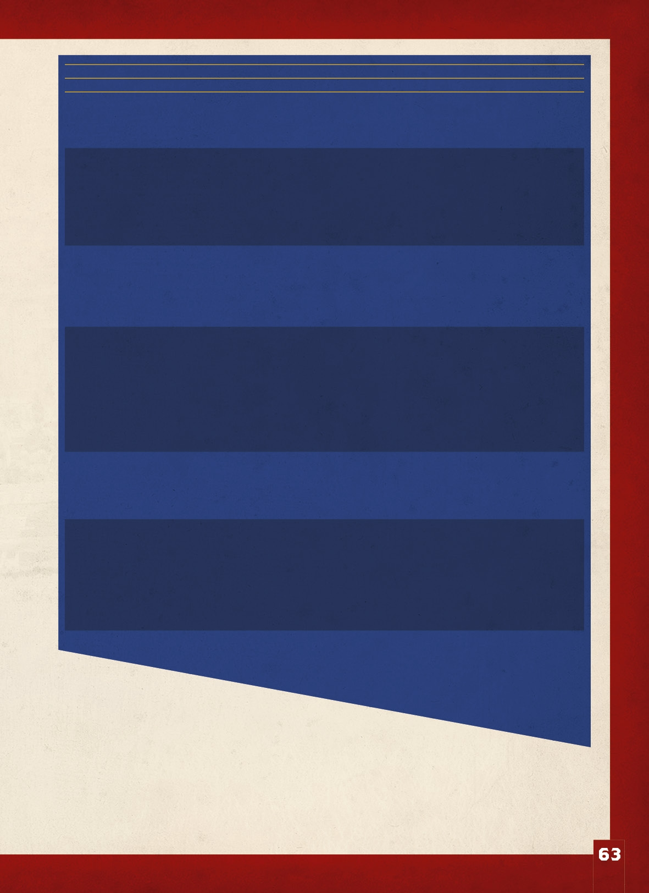worse, asking for a refund! At the end
of each drive, both coaches roll a D6 to determine if their fans have
>
started leaving:
>
On a roll of 2+, the fans are willing to put up with the discomfort.
On a roll of 1, fans have started leaving and the team must reduce its
Fan Factor by 1.
Note that neither team's Fan Factor can fall below 0.
>
3 *Uncovered Trapdoors:* Either for budgetary reasons or just for the
amusement of onlookers, the trapdoors on this pitch could more
accurately be described as large, yawning holes in the ground. Every
time any player enters a Trapdoor square (voluntarily or otherwise),
the player is immediately removed from play. Treat them exactly as if
they had been pushed into the crowd.
>
If the ball ever comes to rest in a Trapdoor square, it will be
enthusiastically thrown back out by a helpful groundskeeper. The ball
immediately deviates from the Trapdoor square.
>
4 *Unclear Markings:* The pitch is little more than a rectangle of
grass with a faded line roughly dividing it
into two halves. When the kicking team sets up for a drive, they may
choose to treat their Line of Scrimmage
>
as being:
>
The normal Line of Scrimmage.
>
One row of squares further back into their own half.
>
One row of squares into the other team's half.
This creates a temporary halfway line for this kick-off which the
receiving team must adhere to when setting up their players, and which
is used for the purposes of awarding a touchback.
In addition, the limit of two players per Wide Zone during set-up does
not apply for either team.
>
5 *Desperate for Exposure:* The owners of this stadium aren't happy
that the officiall status of their prized possession is 'Provincial
Backwater'. Recently, they have begun a drive to improve their
reputation and attract
>
a better class of clientele. For this reason, the stadium owners are
offering incentives for any teams willing
to play there. During Step 1 of the post-game sequence, each team
receives an additional D6 x 10,000 gold pieces in winnings (make one
roll and apply the result to both teams' winnings).
>
6 *Poorly-built Dungeons:* Long ago, the RARG realised that sending
off certain players didn't work, many
>
a career cheat just kept sneaking back on! To combat this, the NAF
introduced guidelines requiring every stadium to feature a secure
dungeon where miscreants could be locked away until the finall
whistle.
Not every stadium owner welcomed this expensive new legislation.
Consequently, many dungeons aren't up
to code, and the chances of keeping a player committed to dirty play
under lock and key aren't great when the dungeon locks are unreliable
and the bars are surprisingly far apart.
During Step 2 of the end of a drive sequence, each coach rolls a D6
for each of their players that have been Sent-off for any reason. On a
roll of 5+, the player is returned to the Reserves box.
>
LUXURY STADIUM
D6 ATTRIBUTE
>
1 *Integrated Merchandise Stalls:* From team flaags and noisemakers to
giant, pointing finngers and woodcut portraits of popular players,
this stadium sells it all. What's even better is the teams are
entitled to a healthy cut of the profitts, huzzah! During Step 1 of
the post-game sequence, each team receives an additional
>
D3 x 10,000 gold pieces in winnings (each coach rolls a D3 and applies
the result to their team's winnings).
2 *Reputation for Spectacle:* This stadium is well-known for the
spectacular games (and half-time shows)
>
it hosts, and visiting teams can expect a sizeable allowance from the
promoters to make the game more
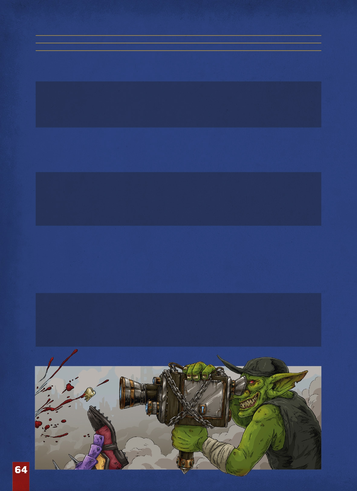interesting. During Step 4 of the
pre-game sequence, both coaches are awarded additional gold pieces in
the form of petty cash to spend on Inducements for the game ahead. To
determine how much, each coach rolls
a D6. The results are then added together and multiplied by 10,000.
Each team gains that many gold pieces
in petty cash.
>
3 *Broadcast Studio:* Every game played at this stadium goes out live
on one of the big networks. Every
single one, even the rather rubbish ones. Unsurprisingly, the big
names of the game are always happy to be
>
seen running across the pitch or shouting from the sidelines at this
stadium. During Step 4 of the pre-game sequence, Star Players,
Mercenary Players, (In)Famous Coaching Staff, Named Wizards and Biased
Referees can all be Induced for D3 x 10,000 gold pieces less than
normal (to a minimum of 10,000 gold pieces).
Roll separately for each Inducement you wish to hire to determine the
discount being offered.
>
4 *0n-site Apothecaries:* This stadium is so well-heeled that the
teams are given top-notch, firrst-class medical assistance, often by
trained medical professionals capable of giving them more than just a
shave and a
>
haircut! During Step 4 of the pre-game sequence, a team that can hire
an apothecary is granted a free Wandering Apothecary Inducement.
>
In the case of teams that are unable to hire an apothecary:
A team with the 'Masters of Undeath' special rule is granted a free
Mortuary Assistant Inducement.
A team with the 'Favoured of Nurgle' special rule is granted a free
Plague Doctor Inducement.
>
5 *Enclosed Pitch:* The pitch is surrounded by a high and sturdy wall,
or is built into the very ground in the form
of a pit. Spectators sit high above the pitch, looking down upon the
action below. Players cannot be pushed into
>
the crowd for any reason. Rather than being pushed into the crowd, a
pushed back player is instead slammed with great force into the
stadium wall and is Knocked Down in the square they occupy.
In addition, the ball cannot bounce into the crowd (though a kick-off
or Pass action can still cause the ball to deviate or scatter into the
crowd). Instead of bouncing into the crowd and being thrown-in, the
ball will bounce off a wall. Use the Throw-in template to determine
the direction as normal, but rather than travel 2D6 squares, the ball
bounces only one square away from the wall before coming to rest.
Note that thrown players can land in the crowd as normal.
>
6 *Deluxe Seating:* The stands at this stadium have all the mod cons:
heated seats, plentiful bars and
even toilet facilities! The resultant good mood amongst the fans means
the atmosphere is very jovial and,
>
consequently, generates lots of support for the teams.
During each start of drive sequence after the firrst, between Steps 2
and 3, each coach rolls a D3 and adds
their team's current Dedicated Fans characteristic. If the result is
higher than their team's Fan Factor for
this game, their team gains one extra team re-roll for the drive
ahead. If this team re-roll is not used before the end of this drive,
it is lost.

Local CrowdL0CAL CR0WD
D6 ATTRIBUTE

1 *Ale-fuelled Maniacs:* The local fans are a bunch of rabid nutters,
and that's before they start drinking. At the start of each drive,
before rolling on the Kick-off Event table, roll a D6. On a roll of 1
during the firrst half, or a roll of 1 or 2 during the second half, do
not roll on the Kick-off Event table. Instead, roll another D6:
>
On a roll of 1, resolve a Get the Ref result.
On a roll of 2-3, resolve a Time-out result.
On a roll of 4-5, resolve an Officiouss Ref result.
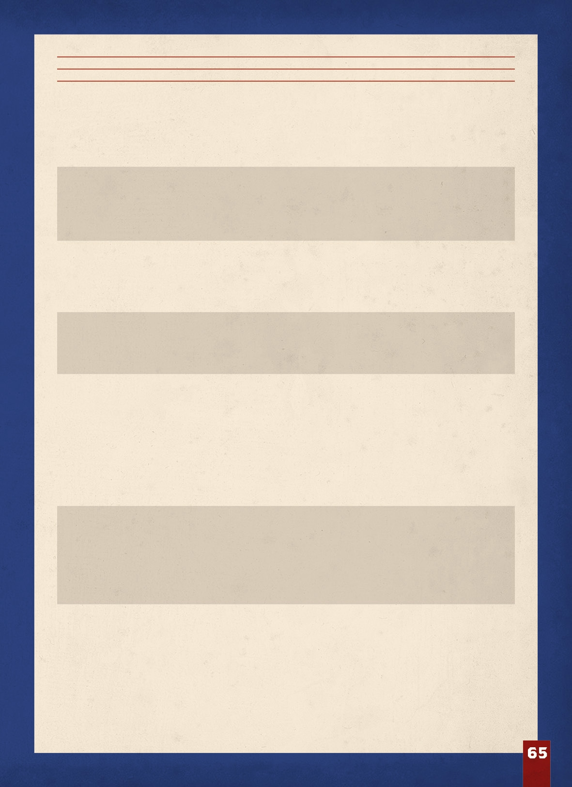 On a roll of 6, resolve a Pitch
Invasion result.
>
2 *Boisterous Rabble:* The crowd today has come for a good time and is
looking to get seriously involved in the
>
game! The stadium's security staff are doing their best to prevent the
fans storming the pitch, but woe betide any player daft enough to set
foot in the stands! Each coach's Fan Factor is increased by 1.
In addition, if a player is pushed into the crowd, apply a +1 to the
Injury roll.
Finally, if a Pitch Invasion result is rolled on the Kick-off Event
table at any point, apply a +1 modifierr to the D3 when determining
how many players are affected.
>
3 *Know-it-all Hecklers:* Everyone in this crowd seems to be an expert
on the finerr points of the rules of the game and their screamed
corrections are doing nothing to improve the referee's temper. If a
player commits
>
a Foul which results in the victim of the action being removed from
the pitch, but is not Sent-off for doing
so, roll a D6:
>
On a roll of 4+, the referee ignores the crowd's indignation.
On a roll of 1-3, the referee hears the crowd's screamed indignation
and the player is Sent-off.
>
4 *Bunch of Paciftstss:* The local crowd are much happier watching the
violence than getting involved
>
the weirdos! If a Pitch Invasion result is rolled on the Kick-off
table, roll again.
In addition, if a player is pushed into the crowd, roll a D6:
On a roll of 4+, there is no risk of Injury by the Crowd and the
player is placed in their team's Reserves box.
On a roll of 1-3, the player risks Injury by the Crowd as normal.
>
5 *Fickle Fans:* Maybe this stadium gives away lots of free tickets
because at least half of the crowd look like they've got places they'd
rather be. At the end of each drive, roll a D6 to determine if the
fans have started leaving:
>
On a roll of 2+, the fans are willing to stay for a little while
longer.
On a roll of 1, fans have started leaving and both teams must reduce
their Fan Factor by 1.
Note that neither team's Fan Factor can fall below 0.
In addition, if the ball leaves the pitch, it might take a while for
someone to throw it back. Unless this is the finall turn of the half,
roll a D6:
>
On a roll of 4+, the ball is thrown back in as normal.
On a roll of 1-3, the ball is not thrown back in until the end of the
next team turn.
In either case, the ball is thrown in as normal from the last square
it occupied before leaving the pitch.
>
6 *Solemn and Silent:* An old sporting legend tells of the god,
Kri-wiket, who forbade any noise other than polite
>
applause at the day-long games played in his honour. The crowd at this
stadium seems determined to follow
his teachings! For the duration of this game, cheerleaders have no
effect on Kick-off Event table results.
In addition, if a player is pushed into the crowd, they do not risk
Injury by the Crowd and can return to play at
the start of their next team turn. When a player is returned to the
pitch in this way, they are Placed Prone in a square that is both:
>
a. Adjacent to the Sideline.
b. As close as possible to the square they last occupied when pushed
off the pitch.
>
**BEC0MING RESIDENTS**
>
f a team findss a stadium they like, they might petition the owners to
take them on as a resident team. The benefitts are obvious: a big
billboard out front with their
>
name on it, an inflaated sense of self-importance, and most
importantly, the ability to use the stadium's quirks to
their advantage.
>
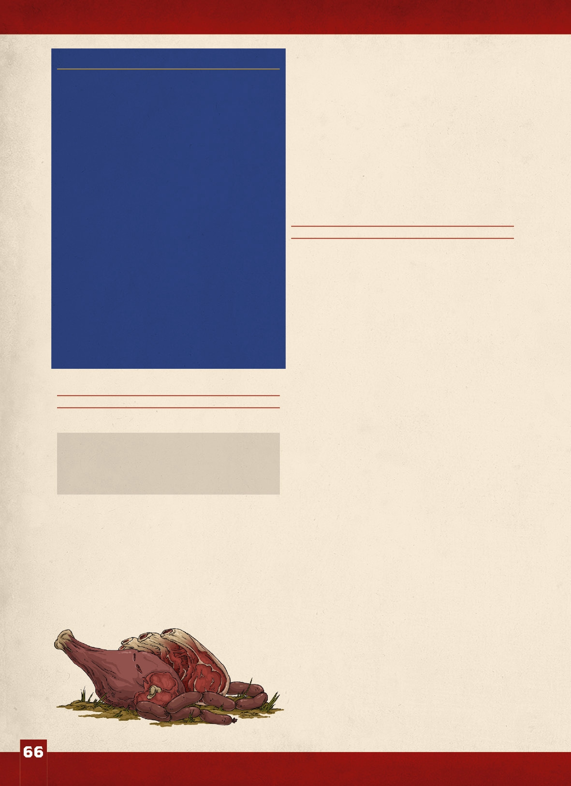In league play, any team can attempt to
strike a residency deal with the owners of a stadium they have just
played in, as long as it has a special Attribute and if another team
>
in the league doesn't already have a residency deal there. At the end
of Step 1 of the post-game sequence, a coach that wishes to strike a
residency deal should roll a D6 on the table below, applying the
following modifierrs:
>
• If the team won the game, apply a +1 modifierr.
• If the team lost the game, apply a -1 modifierr.
• If the team has an Ongoing Sponsorship, apply a
>
+1 modifierr (+2 if their Ongoing Sponsorship is
a Major Sponsorship).
>
• If the team's Dedicated Fans characteristic is 4
>
or more, apply a +1 modifierr.
• If the team's Dedicated Fans characteristic is 7
>
or more, apply a +2 modifierr.
>
RESIDENCY TABLE
>
D6 RESULT
>
5 orless *Rejected:* The stadium owners aren't keen,
>
and the deal is not made.
6-8 *It'll Cost You:* The stadium owners will let the
>
team stick around for a small donation.
The deal is made, but all of the team's winnings from this game are
forfeit. The team can choose to reject the offer and keep the
winnings.
>
9+ *Unconditional 0fffer:* The owners are delighted
>
by the team's offer, and the deal is made.
>
Should both teams wish, they may both attempt to strike a residency
deal. Should this happen, the team
that rolls the lowest has their offer automatically rejected,
>
regardless of the actual result on the table above.
In the case of a tie, both teams should roll on the table above again.

Once a team has struck a residency deal, its coach should both make a
note of this on their Team Draft list

and inform the league commissioner. The team's new home stadium should
of course be given a name, and its special Attribute should be noted
down. A team can

only ever have one home stadium however, they can cancel the contract at
any time (for example, after playing at another stadium they prefer) by
spending 50,000 gold pieces to cover the moving costs.

The league commissioner should keep a record of
all the teams that have struck residency deals and the

Attribute of their home stadia.

BENEFITS 0F RESIDENCY
Having a stadium to call home brings huge benefitts, but just because a
team has a home stadium, that doesn't mean they'll always play there
after all, no Blood Bowl player wants to give up a carefree life on the
open road!

Before Step 1 of the pre-game sequence, before rolling on the Random
Stadium table, check whether either team
has a home stadium:

If one or both of the teams does, the coaches should each roll a D6,
re-rolling ties. The winning coach then rolls

on the Random Stadium table. If the result is 6-8, the game takes place
at an average, regulation stadium as normal. Otherwise, the coach can
choose to play at their home stadium (using its Attribute) instead of
rolling on the Unusual Playing Surface, Rough & Ready Stadium, Luxury
Stadium or Local Crowd table.

In a league, a team can only face each other team in its division in one
league fixtture per season at its home stadium; if they play against the
same team again in the same season, they count as not having a home
stadium.

When a team plays at their home stadium, they may apply a +1 modifierr
to the D3 roll when determining their

Fan Factor for the game. In addition, it's understood that playing
against a home team can be disadvantageous,
so it's common to sweeten the deal for the away team. The opponent of a
team that is playing at their home stadium gets an additional 50,000
gold pieces in petty cash for the purchase of inducements.

Finally, if a player from the home team is pushed into the crowd, roll a
D6. On a roll of 5+, they are safeguarded

by local fans. There is no risk of Injury by the Crowd and the player is
placed directly into the Reserves box.

L0SING RESIDENCY
When things take a turn for the worse, stadium owners have an
incredible knack for findinng loopholes in even
the most well-worded residency contract and breaking
off the deal. If a team with a home stadium loses a game (whether that
game took place at the home stadium or elsewhere), they might lose
their residency. Of course, if they can still draw a crowd, they've
got a strong argument
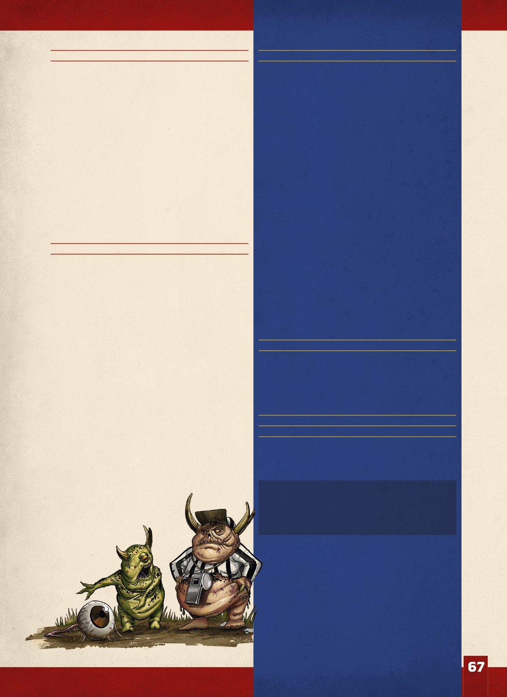in their favour! Roll a D6 at the start
of Step 4 of the post- game sequence. If the result is higher than the
team's current Dedicated Fans characteristic, or is a natural
6, the team is booted out of the stadium and loses its residency
delete it from their roster. Otherwise, the team is allowed to stay.
After rolling, the coach can sweeten the deal by spending gold from
their Treasury each 30,000 gold pieces spent deducts 1 from the result
of the dice
roll. A roll of 6 cannot be modifiedd in this way.
>
TAKING 0WNERSHIP
For a successful team, owning their home stadium is a real mark of
prestige and can even be a sound investment! A team with a residency
can buy their home stadium during Step 4 of the post-game sequence,
whether or not they played that game at their home stadium. The cost
to buy
a stadium is 250,000 gold pieces. If the team pays this amount, they
should update their roster to show that they now own their home
stadium. A team can only own one stadium at a time, and they cannot
take up a residency at
a different stadium while they own one if they wish to do so, they
must firrst sell up as described opposite.
>
When a team plays at a stadium they own and wins, their winnings are
increased by D3 x 10,000 gold pieces.
>
If they play at a stadium they own and lose, their winnings are
decreased by D3 x 10,000 gold pieces.
>
Most importantly, a team that owns its home stadium
is never at risk of losing its residency, no matter how many
>
games it loses.

PARTIAL PAYMENTS
Several banks, ever aware that Blood Bowl teams often struggle to save
up enough money to buy a stadium, offer a regulated system to those who
wish to purchase a piece of prime grassland surrounded by wooden
stands.
Instead of paying the full amount for a stadium, a team can spend 70,000
gold pieces during Step 4 of the post-game sequence. This puts 50,000
gold pieces
into the team's Stadium Fund (the other 20,000 goes elsewhere), which
should be noted on the Team Draft list.

The team counts the gold in the Stadium Fund as a discount on the price
of a stadium; for example, if a team

has 100,000 gold pieces in their Stadium Fund, they could buy a stadium
for 150,000 gold pieces. Teams cannot access the gold pieces in their
Stadium Fund for

any other reason, no matter how much they might want to, even if the
team loses its residency. The only way for gold pieces to be removed
from the fund is for the team to buy
a stadium, at which point the fund is emptied.

Should a team lose its residency, the gold pieces in the fund are
unaffected. Should the team strike a residency deal with another
stadium, the gold pieces in the fund
will become available should the team wish to buy
that stadium.

SELLING UP
At the start of Step 4 of the post-game sequence, a team that owns a
stadium can choose to sell it, whether or not they played that game at
the stadium. To make the sale, the team's coach rolls a D6 on the table
below to see how successful the sale is:

SELLING UP TABLE

D6 RESULT
>
1 *Swindled:* Through some very dodgy dealing indeed, a third party
purchases the stadium for
>
a pittance. The team no longer owns the stadium and receives 2D6 x
10,000 gold pieces.
>
2-5 *Sold at a Loss:* This is the normal way of things
after all, wear and tear on Blood Bowl stadia is rather excessive! The
team no longer owns the
>
stadium and receives 100,000 gold pieces plus an additional 2D6 x
10,000 gold pieces.
>
6 *Break Even!* Don't question how you did it, just
>
be glad you did. The team no longer owns the stadium and receives
250,000 gold pieces.
>
he sacred book of Nuffele
informs readers that to make a football,
a pig's
>
bladder should be carefully removed from the owning pig
and inflatted. In the earliest days
of the modern game, this advice was followed closely, but it quickly
became apparent that no matter how careful one attempts to be, the pig
in question will always object. What's more, once the pig has raised
an objection,
it rapidly becomes extremely uncooperative! Reasoning that there was
probably a better way, the nascent NAF began to fiddlee with the
design of its balls.
>
ne early innovation was shelved at an early stage. The story goes that
Roze-El was presented with a spherical ball by a young research
acolyte by the name of Sochere. Supposedly, the Sochere ball was
easier to handle
and not given to such erratic bouncing, meaning it could be kicked
with more precision and passed from player
>
to player with greater ease. Roze-El quickly dismissed the notion,
stating that, as far as he was concerned, all balls are ovoid, that
spherical balls felt wrong and that no one would want to handle one,
whereas ovoid balls were easy to carry. No one wanted the game to
become one of kick-ball, the objective was to pick up, carry and pass
the ball! Since that time, the design of a Blood Bowl ball has been
greatly refinedd and standardised by both the NAF and the RARG. Today,
players the world over can be assured that, when they grab a ball, it
will be reassuringly ovoid.
>
Modern balls tend to follow the same basic construction; an inflaated
bladder (often synthetic) is encased in a stitched leather shell. This
structure is, in turn, supported and strengthened by bands of metal,
onto which are affixxed
>
sharp, inch-long spikes, the better to help with grip in the wet and
to encourage bloodshed in the scrum.
>
Yet, in spite of standardisation by the sport's governing bodies,
there still exist a great variety of balls in the world. Most races
have their own preferences and prejudices when it comes to balls and,
consequently, there are more types
>
of ball in common use than one might think.
>
**UNUSUAL BL00D B0WL BALLS**
>
rom live squigs, full of teeth and an unwillingness to play ball, to
icons
devoted to the Dark Gods, steeped in their fell power and utterly
deadly to the touch, there is no limit to the things that have made
their way onto the Blood
>
Bowl pitch in place of a regulation ball. Sometimes, these ball-shaped
objects are pressed into service out of necessity. At other times,
they are used to deliberately gain an unfair advantage.
>
Coaches may wish to use the rules for unusual balls detailed on the
following
pages. The inclusion of these rules in a
league or tournament is at the discretion of
>
the league commissioner or tournament organiser. Otherwise, coaches
who wish to use these rules for an exhibition game should decide this
between themselves.
>
USING UNUSUAL BALLS
Once per game, after Step 1 but before Step 2 of the Start of Drive
sequence when they are the kicking team, the coach can declare that
they will use an unusual ball. There are two ways in which the
attributes of the unusual ball can be determined:
>
1. Roll a D16 on the Unusual Ball Attributes table.
2. Select a single attribute from the Unusual Ball Attributes table.
>
During Step 2 of the Start of Drive sequence, the coach must nominate
one player from their team to be the kicking player. If the roll on
the Kick-off table is a
>
double, the ref calls the kicking player out for their flaagrant rules
violation and they are immediately Sent-off as though they had
committed a Foul (before resolving the Kick-off result). Note that
even if the player is Sent-off, the special ball remains in play for
this drive!
>
For the duration of the drive, the rules for the unusual ball in use
apply.
Aside from these rules, an unusual ball still counts as a normal ball
in all respects.
>
At the end of the drive, the unusual ball is removed by the referee
and replaced with a normal ball during the next Start of Drive
sequence.
>
UNUSUAL BALL

DESIGNER'S N0TE -- A BALL F0R EVERY RACE
Astute readers will notice that
many of the balls described here
tie in with the balls that come with certain teams, but that not all
are covered. In truth, the various balls that come with the different
teams fall into several broad types. This list is designed to cover all
of those types in broad terms rather than every single ball, and even
offers a couple of alternative uses
for balls of a similar type. For example, both the Limpin' Squig (from
the Orc team) and the Greedy Nurgling (from the Nurgle team)
are examples of a 'creature'. But
so too is the Snotling Ball-suit, the Spiteful Sprite Ball and the
Skeletal Ball (from the Shambling Undead team). Should you wish, these
rules and these models are fully interchangeable, it is simply more fun
when naming a rule and writing the description to focus upon one
specificc ball, so that's what we've done! The intention of these rules
is to provide fun ways to use all of the different balls that come with
the various Blood Bowl teams.

ATTRIBUTES TABLE
>
D16 ATTRIBUTE 1 Explodin' Ball
>
2 Daemonic Ball
>
3 Stacked Lunch Ball
4 Draconic Egg
>
5 Spiteful Sprite Ball
6 Master-hewn Ball
7 Extra Spiky Ball
8 Greedy Nurgling Ball
9 Ball of Dark Majesty
10 Shady Special Ball
11 Soulstone Ball
>
12 Frozen Ball
>
13 Sacred Egg Ball
14 Snotling Ball-suit
15 Limpin' Squig Ball
16 Warpstone Brazier Ball

**MULTIPLE BALLS**
If a second ball ever comes into play for any reason (perhaps due to a
Special Play card, for example),
it is always a normal, regulation Blood Bowl ball. Things are quite mad
enough on the Blood Bowl pitch without multiple unusual balls in play!

\(1\) EXPL0DIN' BALL
*There's nothing subtle or clever about a ball stuffed with* *blasting
charges and gunpowder, but Blood Bowl players* *have never been noted
for their subtlety or cleverness.*
>
When the Explodin' Ball is placed, the coach of the kicking team
places a marker a spare ball is ideal on any space on their Score
tracker to represent the length of
the fuse. At the end of each team turn,
the coach of the kicking team rolls a D6:
>
• On a roll of 6, move the marker two spaces towards 0.
• On a roll of 2-5, move the marker one space towards 0.
• On a roll of 1, the fuse goes out, and the Explodin' Ball
>
is treated as a regular ball from now on however, the coach of the
kicking team may spend a team re-roll
to keep the fuse alight (the marker does not move
this turn).
>
If the marker moves onto the 0 space, it is removed and the ball
explodes! Should a drive end while the marker is still on the tracker,
it is removed with no effect.
>
When the ball explodes, roll a D6 for each player in an adjacent
square they are Knocked Down on a roll of 4+. If they are already
Prone or Stunned, make an
>
Armour roll for them as though they had been Knocked Down. In
addition, if a player was carrying the ball, they are Knocked Down
automatically. Note that an Explodin'
>
Ball will not prevent a touchdown being scored, but the roll should
still be made at the end of the turn to see whether the ball blows up
while the player is celebrating
>
After the ball has exploded, and if the drive is still going, a
replacement is thrown in by a sideline officiall.
>
Place a regular ball in the square where the Explodin' Ball was. The
replacement ball will scatter before landing.

\(2\) DAEM0NIC BALL
*In ages past, mighty champions of Chaos would bind foul* *Daemons into
weapons of war, making hideous tools of* *destruction that would consume
the souls of the fallen.* *These days, the weapons may have changed, but
the* *horror of encountering a bound Daemon has not!*

Whenever a player attempts to pick up this ball, roll a D6:

• On a roll of 3+, the player attempts to pick up the

Daemonic Ball as normal.
• On a roll of 1 or 2, they recoil in horror and refuse to

even try. The ball will bounce once but no turnover
is caused. If the ball bounces into an occupied square, that player
will attempt to catch it as normal.

Additionally, when a player carrying the Daemonic
Ball ends their movement, and if no Pass action has yet

been made this team turn, roll a D6. On a roll of 1, the player must
attempt to pass the ball to another player on their team if possible or
to an empty square if no friendly players are in passing range.

Finally, whenever a Daemonic Ball comes to rest in
an unoccupied square, roll a D6. On a roll of 6, the ball

cracks, weakening the dark enchantment and allowing the bound Daemon to
break free. For the remainder of this drive treat the ball as a normal,
regulation Blood Bowl ball.

\(3\) STACKED LUNCH BALL
*A Halflinng's thoughts are never far away from food and they will
interrupt* *almost any activity for a snack, including mealtime!
Unfortunately, this* *obsession with food can lead to confusion on the
Blood Bowl pitch. All too* *often, the game ball is left in the dugout
when the player tasked with the* *kick-off forgets to put down
whatever they are eating and pick up the ball.*
*As a result, many games involving Halflinng teams have become
hard-fought* *battles for possession of a pie, a roast chicken, 12\"
sub or even a hot pasty.*
*It must be said that when the game ball
is edible, many players become a lot* *more possessive!*

Spiteful Sprite Ball

As every good chef knows, any food dropped on the floorr is finee
provided it's picked up quickly! This is generally known as the 'fivve
second rule' throughout the Old World. Consequently, there is an
additional +1 modifierr applied to any attempt made to pick up the
Stacked Lunch Ball.
>
Additionally, when any player on the kicking team performs a Block
action (on its own or as part of a Blitz action) and the target is in
possession of the Stacked Lunch Ball, the active player is considered
to have the Strip Ball skill.
>
Finally, should any player that is in possession of the Stacked Lunch
ball score a touchdown, immediately after the touchdown is scored roll
a D6:
>
• On a roll of 2+, a touchdown is scored as normal.
• On a roll of 1, the player is unable to contain their hunger and
treats
>
themselves to a mid-game snack. Unfortunately, such gluttony is
instantly rewarded by terrible stomach ache and the player must miss
the next drive (which serves them right for eating food that's been on
the floorr!).
>
\(4\) DRAC0NIC EGG
*The inhabitants of the Old World have a long tradition of breeding
many* *fabulous beasts. Where once such creatures were used to augment
armies*
*in times of war, today they are more commonly seen in the private
menageries* *of wealthy nobles and retired Blood Bowl stars. Upon
occasion, coaches* *looking for an advantage may procure the
ready-to-hatch egg of a mighty* *draconic beast to sneak onto the
pitch. Many an opposition player has lost*
*a finnger to a hatchling Hydra!*
>
At the start of any team turn in which a Draconic Egg Ball is on the
ground, it will bounce once as the young creature inside attempts to
hatch into the world. If the Draconic Egg Ball bounces into an
occupied square, the player must attempt to catch it. If the player
fails to catch it, or if the square is occupied by a Prone or Stunned
player, the ball will bounce again.
>
Finally, should any player that is in possession of the Draconic Egg
Ball score a touchdown, immediately after the touchdown is scored roll
a D6:
>
• On a roll of 2+, a touchdown is scored as normal.
• On a roll of 1, the player's enthusiastic spiking of the ball into
the End Zone
>
has broken the egg and the creature inside bursts forth and savages
them, causing the player to be immediately Knocked Down. When a player
is Knocked Down in this way, you may apply a +1 modifierr to either
the Armour roll or Injury roll. This modifierr may be applied after
the roll has been made.

\(5\) SPITEFUL SPRITE BALL *Athel Loren is a magical realm,*
*home to all manner of forest spirits.* *Some are ancient and powerful,*
*manifesting themselves as mighty* *Treemen or Treekin. Others are
young* *and mischievous creatures that revel* *in tormenting others.
Amongst the* *most troublesome are the diminutive* *Spites and Sprites;
small faery-like* *creatures that swarm and buzz in* *huge numbers
within the ancient* *forest. Often, such creatures are* *drawn to the
excitement of the Blood* *Bowl pitch, and sometimes become* *fixxated
upon the ball, somewhat* *hampering play!*

At the start of any turn in which a Spiteful Sprite Ball is on the
ground,
it will bounce one square in a random direction as the Sprite attempts
to make off with what it considers to be its new ball. If the Spiteful
Sprite Ball bounces into an occupied square, the player must attempt to
catch it but
will suffer an additional -1 modifierr
as the Sprite attempts to fightt them off. If the player fails to catch
it,
or if the square is occupied by a
Prone or Stunned player, the ball will bounce again.

Additionally, when a player attempts to pick up the Spiteful

Sprite ball, the Sprite will attempt
to prevent them by scratching and biting. Apply an additional -1
modifierr to any attempt made to pick up the Spiteful Sprite ball.

Finally, should the ball leave the pitch for any reason, the Sprite will
escape with its prize. A replacement ball is used for the throw-in and
these rules cease to apply.

\(6\) MASTER-HEWN BALL
*What's wrong with a little ornamentation? Oh, it feels a* *little
weightier than normal, does it? That must be the* *gemstones! This
ball definittely isn't hewn from solid* *granite and encased in the
fineest gromril. Not at all!*
>
Extra Spiky Ball
>
Every time the Master-hewn Ball deviates, it will move only D3 squares
in a direction determined by rolling a D8
and referring to the Random Direction
template, rather
>
than moving the usual D6 squares. Additionally, it does not scatter as
a result of a 'Changing Weather' result on the Kick-off Event table.
>
When passing the Master-hewn Ball, Long bombs cannot be attempted, and
the Hail Mary skill cannot be
>
used. Should a player fail an attempt to catch the Master- hewn Ball
following a Pass action (including attempting
to catch a successful Interception), roll a D6 after the
ball has bounced. If the roll is equal to or higher than the player's
ST characteristic, or is a natural 6, the player is Knocked Down.
>
If after deviating or scattering the Master-hewn Ball lands in a
square that is occupied by a Prone or Stunned
>
player, an Armour roll is made against that player after the ball has
bounced.
>
\(7\) EXTRA SPIKY BALL
*It may be quite standard for Blood Bowl balls to have* *spikes, the
better to help with grip (and because it's funny* *watching a player
trying to throw a ball that's literally stuck* *to their palm), but
some teams take things to the extreme!* *It is not uncommon to see
spikes several inches longer* *than the regulations permit and far
sharper. Catching*
*such a thing is more a matter of luck than skill!*
>
When an Extra Spiky Ball lands in an unoccupied square, it will not
bounce.
>
Additionally, when a player rolls a natural 1 when attempting to catch
an Extra Spiky Ball (after re-rolls), make an unmodifiedd Armour roll
against that player:
>
• If the player\'s armour is not broken, they have caught
>
the ball safely.
• If the player\'s armour is broken, they have not caught
>
the ball well at all! The player becomes Prone and an Injury roll is
made against them. This Injury roll cannot be modifiedd in any way.

\(8\) GREEDY NURGLING BALL
*Wherever the devotees of Nurgle travel, they are followed* *by hordes
of precocious Nurglings. These diminutive* *Daemons are able to project
themselves into the*
*mortal realm in great numbers wherever the Plague* *Father's followers
tread. For the most part, they content* *themselves with cavorting on
the sidelines and in the* *dugouts, inspiring the players and
entertaining the fans.* *Occasionally, however, one of them will mistake
the ball* *for something edible!*

Whenever a player attempts to pick up this ball, roll a D6:

• On a roll of 3+, the player attempts to pick up the

Greedy Nurgling Ball as normal.
• On a roll of 1 or 2, they recoil in horror and refuse to

even try. The ball will bounce once but no turnover is caused. If the
ball bounces into an occupied square, that player will attempt to
catch it as normal.

At the start of any turn in which a Greedy Nurgling
Ball is on the ground, it will bounce one square in a random direction
as the Nurgling attempts to get away
from the action. If the Greedy Nurgling Ball bounces into
an occupied square, the player must attempt to catch it
but will suffer an additional -1 modifierr as the Nurgling attempts to
fightt them off. If the player fails to catch it, or
if the square is occupied by a Prone or Stunned player, the ball will
bounce again.

Finally, should any player begin their activation in possession of this
ball, roll a D6. On a roll of 1 the Nurgling's enthusiastic struggles
prove too distracting and the player must reduce their MA by 1 for the
duration of this team turn as they squabble with an overfed Nurgling.

\(9\) BALL 0F DARK MAJESTY *Chaotic teams will often use artefacts*
*of power and icons of the Chaos*
*gods as balls. Infused with baleful* *energies, such balls are
hideous to* *behold and all but those with the* *strongest of wills
can findd themselves* *transfixxed by a dark influencce, losing*
*their free will and succumbing to that*
*of the will of the Chaos gods..*
>
Any player in possession of
the Ball of Dark Majesty gains the
>
Really Stupid trait. If they already have the Really Stupid trait,
they are unaffected by the influencce of the Dark Gods.
>
Note that as soon as a player that gained the Really Stupid trait as a
result of being in possession of the Ball of Dark Majesty loses
possession of the ball, for any reason, they lose the Really Stupid
trait.
>
\(10\) SHADY SPECIAL BALL *The art of carefully deflaating a ball*
*by just the right amount to not get in*
>
*trouble for cheating was pioneered by* *devious Goblin kicker, Grom
Shady.*
*It has become a common tactic for* *those who think subtle cheating
is* *okay, especially when facing show-* *offs who love the passing
game.*
>
When a player attempts to pass
a Shady Special Ball, apply an additional -2 modifierr to the Passing
Ability test.
>
In addition, as there is very little chance of a referee proving that
the sabotage was deliberate
(and not the result of shoddy ball care), the kicker is not Sent-off
for employing a Shady Special should a double be rolled when rolling
on the Kick-off Event table.

\(11\) S0ULST0NE BALL
*This glittering example of Elven ball-* *craft is studded with magical
gems* *capable of entrapping the souls*
*of dead Elves so that they might* *continue to affect the game even*
*after their death. A player carrying a* *ball that has yet to be
invested in this* *manner takes on the fearful aspect of* *an avenging
reaper of souls!*

When a player picks up or catches the Soulstone Ball, or starts their
activation in possession of it, their coach can choose a Skill
belonging
to a player that is currently in their team's Casualty box the player in
possession of the ball immediately gains that Skill until the end of
this team turn or until they are no longer
in possession of the ball. Mutation skills and traits may not be chosen.

If there are no players currently in their team's Casualty box, the
player cannot gain a Skill and instead gains the Foul Appearance skill.

\(12\) FR0ZEN BALL
*Ice is a common commodity in many* *parts of the Old World (it is right
up* *there with rain in terms of popularity).* *Indeed, parts of the
world are buried* *under glacial ice many thousands*
*of years old. The ice mined from the* *heart of such glaciers is so
cold that,* *according to legend, it will never melt!* *This isn't true,
but it is very durable* *stuff. Ancient ice mined from the*
*heart of glaciers is a popular material* *for ball construction, but it
is not* *without its risks to use, as prolonged* *exposure can render
the fleesh*
*utterly numb!*

If at the start of either team's turn the Frozen Ball is in the
possession of a player, that player's coach must roll
a D6. On a roll of 1, the icy cold touch of the ball has deadened the
player's finngers (or tentacles, or whatever

the case may be) and they are no longer able to grip the ball. The ball
is dropped and will bounce. This does not cause a Turnover.

\(13\) SACRED EGG BALL *Millennia ago, a new god arose in*
*the pantheon of Lustria: Sotek the* *Serpent. His arrival came as
quite a* *surprise to the Slann Mage-priests,* *putting something of a
dent in their* *pride as they had previously believed* *themselves to
be quite well-informed*
*about the identity of the world's*
*various deities. Sotek's birth was* *heralded by the appearance of a*
*twin-tailed comet in the heavens, and* *his presence proved most
invigorating* *to the denizens of Lustria. Today,*
*many consider snakes to be holy* *messengers of Sotek, and it is not*
*uncommon for snake eggs to be used* *as balls in the hope of
attracting* *Sotek's blessing.*
>
If, at the start of any of the receiving team's turns, the Sacred
>
Egg Ball is in the possession of a player that belongs to the
receiving team, the coach of the receiving
team must roll a D6. On a roll of 1,
the player suddenly and unwantedly findss themselves the focus of
Sotek's divine attention. The strange sensation of being engulfed
within
the coils of a gigantic, constricting serpent becomes quite unbearable
and the player becomes overwhelmed by a desperate urge to be rid of
the ball before they are crushed
and consumed by the spirit of
mighty Sotek. The ball is dropped immediately, causing it to bounce.
Note that this does not cause a Turnover. Once the ball has come
to rest, the receiving team's
turn continues.

\(14\) SN0TLING BALL-SUIT
*Stuffinng a Snotling into a crude approximation of a ball and
instructing them to* *run for the other end zone is one of the most
ludicrous (and entertaining) ways* *in which a team can cheat. It's also
surprisingly common!*

During each of their team turns, the coach of the kicking team can
activate the ball to perform a Move action as if it were a player on
their team! If, when activated, the ball is in the possession of a
player on the receiving team, it must firrst try to escape. The coach of
the receiving team makes an Agility test for the player in possession of
the ball, applying a +1 modifierr. If this test is passed, they keep
possession of the ball, and it cannot perform an action this turn.
Otherwise, it bounces once, using up one square of its MA, and can then
carry on moving.

The ball has an MA equal to the roll of a D3 (rolled each time the ball
is activated) and it can never Rush. For each square the ball moves, the
coach

of the kicking team places the Throw-in template over it, facing towards
either End Zone or either Sideline as they wish. Then they roll a D6 and
move the ball one square in the indicated direction; the ball
automatically passes any
Agility tests it may be required to make in order to Dodge, regardless
of
any modifierrs. Repeat this process for each and every square the ball
moves. If this movement takes the ball off the pitch, it is thrown back
on as normal and its move ends.

If the ball moves into a square that is occupied by a standing player,
that player must attempt to catch it, as though it were a bouncing ball.

It should go without saying, but here it is a Snotling Ball-suit cannot
score a touchdown by itself, it must be in the possession of a player!

\(15\) LIMPIN' SQUIG BALL
*Squigs seem to enjoy Blood Bowl. Or so people say, in truth it's very
hard to tell* *what squigs enjoy! They have long been used as balls in
the Orc leagues, but* *that in itself isn't evidence of enjoyment of the
game. A recent innovation is to* *tie one of their legs behind their
back to stop them running away so easily, but* *this just makes them
more bitey!*

At the start of each team's turn, the Limpin' Squig Ball will make a
break for freedom. If the ball is in the possession of a player, roll a
D6:

• On a roll of 2+, the player proves quite an adept squig handler and
keeps a

tight hold on the beast.
• On a roll of 1, the squig breaks free and bounces once. Note that this
does

not cause a Turnover.

If the Limpin' Squig Ball is not in the possession of a player at the
start of a team turn, it will try to hop away, bouncing D3 times. If it
bounces into a square occupied by a Standing player that has not lost
their Tackle Zone and they fail

to catch it, it bounces normally, disregarding the D3 roll.

Additionally, should any player score a touchdown with the Limpin' Squig
Ball, roll a D6. On a roll of 1, the squig sinks its yellowed fangs into
the player's

hand. For the remainder of this game, the player that scored the
touchdown must reduce their Agility characteristic by 1.

\(16\) WARPST0NE BRAZIER BALL
*Filled with chunks of raw, steaming warpstone, there's*
*no way this 'ball' could be mistaken for one that meets*
*regulations. But make no mistake, when the Skaven*
*cheat, they don't muck about. Deflaated balls and biting* *beasties
are amateur stuff - what you really want is a ball* *that will turn
anyone daft enough to touch it into a writhing* *mass of tentacles.
That'll stop 'em touching it!*

Whenever a player rolls a natural 1 when attempting
to pick up, catch or intercept a Warpstone Brazier Ball (after
re-rolls), the player findss their physical form temporarily warped!
Roll a D6 on the table opposite to see what happens if a player is
granted a Skill or Trait they already have, this roll has no
additional effect. The effects of the Warpstone Brazier Ball last
until the end of the
drive, or until the player is (un)lucky enough to roll again
on the table opposite:

D6 EFFECT

1 *Spontaneous Combustion:* The player is immediately Knocked Down.
You may modify
>
either the Armour roll or Injury roll by +1.
2 *Temporal Instability:* The player moves out of
>
phase with reality, gaining the No Hands trait.
3 *Shrunken Head:* The only thing worse than a
>
tiny head is the realisation that your helmet no longer fitts. The
player gains the Bone Head trait.
>
4 *Massively 0bese:* The player expands in
size until they are a hulking mass of fleesh.
The player's MA is reduced by 1, to a minimum
>
of 1, and their AV is improved by 1, to a maximum of 11+.
>
5 *Leprous Flesh:* Skin and fleesh hang from
the player in sickening folds. The player gains
>
the Foul Appearance skill.
6 *Thorny Carapace:* The player's body sprouts
>
a thick, spiked shell. The player gains the Iron Hard Skin skill and
their AV is improved by 1,
to a maximum of 11+.
>
**NEW** **WEATHER** **TABLES**
>
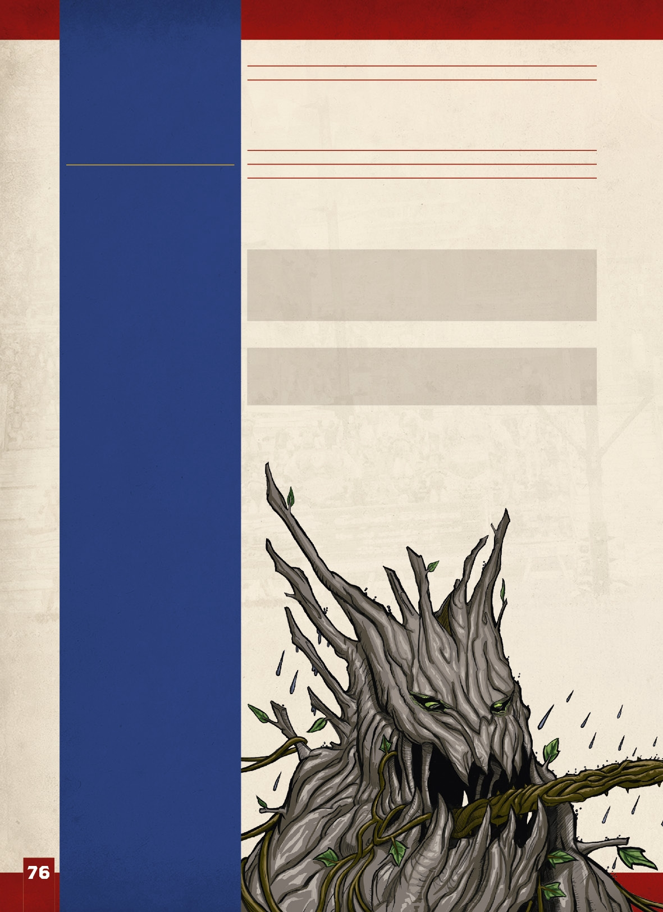**B**
>
f both coaches agree, they can use one of the following tables in
place of the Weather table
>
in the *Blood Bowl* rulebook for the duration of the game. This is
ideal
for representing those games played
>
at different times of the year and in different seasons, as well as
those played in more extreme environments, such as the sweltering heat
of the Badlands, or in the frozen chill
of Norsca.
>
A league commissioner may also decide that an entire league season is
being held at a particular time
>
of year, or in a specific,, and perhaps less hospitable, part of the
world.
In such cases, all games played during that league season can
use one of the following tables
as determined by the league commissioner to represent the overriding
conditions.
>
If these tables are in use, any other rules that refer to the Weather
table (for example, the Changing Weather result on the Kick-off Event
table)
refer automatically to the table that
is in use, rather than the standard table in the *Blood Bowl*
rulebook.

SPRING WEATHER TABLE
With the cold months of winter a rapidly-receding memory, spring has
well
and truly sprung! Blood Bowl teams the world over are taking to the
pitch
once more, whilst the fans flocck back to the bleachers in their droves.
What a wonderful time of year!

SPRING WEATHER TABLE

2D6 RESULT
2 *Morning Dew:* The pitch is dew-covered from the cold of night,
>
making everything a little slippery. Apply a -1 modifierr every time a
player attempts to Rush an extra square.
Additionally, apply a -1 modifierr every time a player makes an
Agility test to pick up the ball.
>
3 *Blossoming Flowers :* The floowers are blooming, the tree sap is
pumping and the pollen count is high, forcing the hay fever-affliccted
>
referee to seek shelter indoors. Whilst this weather condition is in
effect, players cannot be Sent-off for committing a Foul, even if they
roll a natural double on either the Armour roll or the Injury roll.
>
4-10 *Perfect Conditions (well, almost):* It's not quite warm but then
again, it's not quite cold ideal weather for a game of Blood Bowl!
>
11 *Misty Morning:* A haze of thick mist has descended upon the pitch,
>
greatly reducing visibility. Players can move only a maximum of six
squares, although they may still Rush as normal.
Additionally, only Quick and Short pass actions can be performed.
>
12 *High Winds:* The winds are whistling through the stadium and the
players can barely hear each other. Roll a D6 each time a player on
your team wishes to use a team re-roll. On a roll of 2+, you may use a
>
team re-roll as normal. On a 1, a team re-roll cannot be used.
>
SUMMER WEATHER TABLE
Summer is well and truly here! The days are long, the
sky blue, and absolutely everyone wants nothing more than to spend the
long, hot afternoons watching a game and catching some rays! Well,
some of the players aren't so keen; it is far too hot for running
around!
>
SUMMER WEATHER TABLE
>
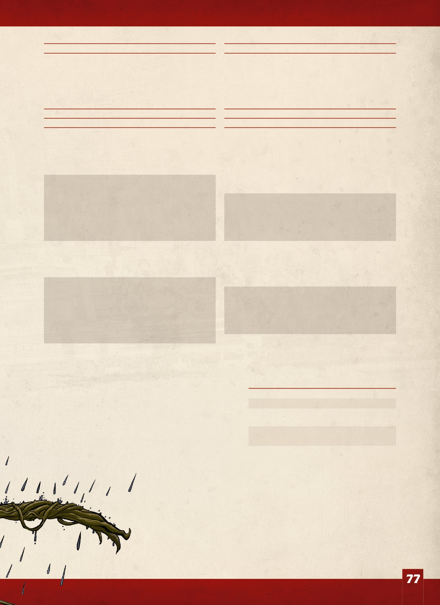2D6 RESULT
2 *Sweltering Heat:* Some players faint in the
>
unbearable heat! D3 randomly selected players from each team that are
on the pitch when
a drive ends are placed in the Reserves box.
They must miss the next drive.
>
3 *Melting Astrogranite:* It's not just the players that are affected
by the hot weather even the pitch is melting! It might be the heat, or
it might
be the sticky footing, but the players are certainly
>
struggling to move! The number of squares a player can attempt to Rush
is reduced by one (to
a minimum of one).
>
4-10 *Perfect Conditions (well, almost):* It's still hot,
>
but not as hot as it has been lately!
A (tolerably) warm, dry and slightly overcast day provides perfect
conditions for Blood Bowl.
>
11 *Blinding Rays:* No cloud cover in the clear, blue
>
skies and the relentless glare of the sun leaves the players squinting
and shading their eyes.
Apply a -1 modifierr every time a player tests against their Passing
Ability.
Additionally, only Quick and Short pass actions can be performed.
>
12 *Monsoon:* A sudden burst of torrential rain and high winds hits
the pitch, making the ball slippery
>
and erratic. Apply a -1 modifierr every time a
player makes an Agility test to catch or pick up
the ball, or to attempt to interfere with a pass. Additionally, when
the ball scatters, it moves
from the square in which it was placed four times before landing,
rather than the usual three.

AUTUMN WEATHER TABLE
The year continues to turn, the days are shortening and there is a chill
in the air! The players love this time of year; the unbearable heat is
gone and the fallen leaves soften their frequent falls. The fans too
enjoy the crisp air, if not the bitterly cold winds!

AUTUMN WEATHER TABLE

2D6 RESULT
2 *Leaf-strewn Pitch:* Huge drifts of leaves
>
have piled up at regular intervals across the pitch. It looks
terrible, but they're soft to land
on! When a player Falls Over or is Knocked
Down, the coach of the opposing team must apply a -1 modifierr when
making an Armour roll against them.
>
3 *Autumnal Chill:* Winter is fast approaching and
>
players are reluctant to leave the comfortable warmth of the dugout.
During the End of Drive sequence, apply a -1 modifierr when rolling to
see
>
if a player recovers from being KO'd.
4-10 *Perfect Conditions (well, almost):* It's not
>
quite warm, but then again it's not quite
cold ideal Blood Bowl weather! A pleasant autumn afternoon provides
perfect conditions
for Blood Bowl.
>
11 *Pouring Rain:* A torrential downpour leaves the
>
players soaked and the ball very slippery! Apply
a -1 modifierr every time a player makes an Agility test to catch or
pick up the ball, or to attempt to interfere with a pass.
>
12 *Strong Winds:* If it wasn't for the winds, it
would be a lovely day. The ball does not deviate
>
normally. Instead, after placing the kick, the
coach of the kicking team rolls a D8 to determine the direction in
which the wind is blowing:
>
D8 Wind Direction
1-2 Towards the kicking team's End Zone.
3-4 Towards the receiving team's End Zone.
5-6 Towards the Sideline to the left of the
>
kicking team.
7-8 Towards the Sideline to the right of the
>
kicking team.
Next, place the Throw-in template over the square
>
in which the kick was placed, with the central arrow (3-4) pointing in
the direction in which
the wind is blowing. The kick then deviates in a direction determined
by rolling a D6 and referring to the Throw-in template.
Additionally, the number of squares the
ball moves is determined by rolling a D8,
rather than a D6.
>
WINTER WEATHER TABLE
Winter is well and truly settled upon the land. The days
are short and the nights long. Deep snow covers the pitch and
continues to fall heavily from the leaden sky. Some dedicated fans
would describe it as a 'winter wonderland', but most are at home,
watching the magic mirror!
>
WINTER WEATHER TABLE
>
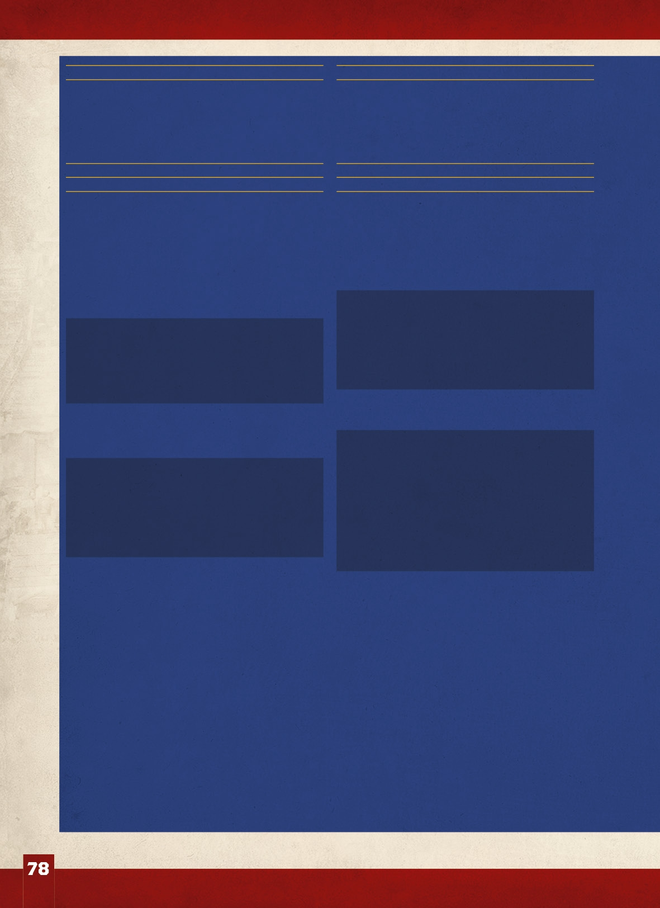2D6 RESULT
2 *Cold Winds:* The fans are shivering in the stands
>
as a viciously cold wind blows steadily down the pitch. Apply a -1
modifierr every time a player
tests against their Passing Ability.
Players also findd it harder to get motivated and
get back on the pitch. Additionally, during Step 2 of the End of Drive
sequence, apply a -1 modifierr when rolling to see if any player in
the Knocked- out box recovers.
>
3 *Freezing:* A sudden cold snap turns the ground as hard as granite
(and not the 'astro' variety that
>
players are used to). When a player Falls Over
or is Knocked Down, the coach of the opposing team must apply a +1
modifierr when making an Armour roll against them.
>
4-10 *Perfect Conditions (well, almost):* It's rather
>
chilly and it's threatening to rain (or snow), but considering the
time of year, the conditions are almost perfect for Blood Bowl.
>
11 *Heavy Snow:* The snow is several feet deep,
>
making it very difficcult indeed to run up and
punch someone! When a player performs a Block action as part of a
Blitz action (but not on its own), their Strength characteristic is
reduced
by 1 when comparing their Strength against the Strength of the target
of the Block action.
>
12 *Blizzard:* Freezing conditions and heavy falls of
>
snow make the footing treacherous. Apply a -1 modifierr every time a
player attempts to Rush an extra square.
Additionally, the poor visibility means that only Quick and Short
passes can be attempted.

SUBTERRANEAN WEATHER TABLE
Whilst the weather outside is frightful, the average underground stadium
is no better! Playing underground often seems like a good idea, but it
rarely ever is; the roof is too low, the footing too treacherous, and
there's the constant threat of earthquakes and cave-ins!

SUBTERRANEAN WEATHER TABLE

2D6 RESULT
2 *Bubbling up from Below:* The players are
>
aghast as viscous liquid begins to seep up from below. Whether this is
a natural phenomenon,
the result of sabotage or a dire warning that
stadia have no place being built above sewage pipes, it's definittely
not pleasant. All players on
the pitch subtract 1 from their MA.
>
3 *Gloomy:* The torches are in need of replacing,
and the shadows are growing long. All Long pass
>
and Long bomb Pass actions suffer an additional
-1 modifierr.
Additionally, when a player attempts to Rush
for a second or subsequent time during their activation, apply an
additional -1 modifierr.
>
4-10 *Perfect Conditions (well, almost):* The light of
>
the sun might be missing, but the conditions are almost perfect for
Blood Bowl.
>
11 *Thermal Geysers:* Vapour begins to whistle up
>
from cracks in the ground, followed by forceful gouts of roiling
steam. If a player on your team Falls Over or is Knocked Down, roll a
D6.
>
On a roll of 1, they crack open a thermal geyser. That player is
immediately catapulted through the air. Immediately treat that player
as being thrown (as if they had the Right Stuff trait) by another
player (with the Throw Team-mate trait), and treat the quality of the
throw as terrible.
>
12 *Seismic Activity:* "Uh oh was that a tremor? Roll a D6 at the end
of each team turn, adding 1
>
to the result for each player on the pitch with
a Strength of 5 or more. On a roll of 6+, rocks tumble down from up
above. Both coaches roll
off. The coach that rolls the lowest randomly selects one of their
players from among those on the pitch. That player is struck by a
falling rock
and Knocked Down.
If the roll-off results in a tie, do not roll again. Instead, both
coaches must randomly select a player to be struck by a falling rock.
>
PRIM0RDIAL RAINF0REST WEATHER
The tropical jungles of the world are hot, humid and
deeply hostile environments! The heat is ever-present and utterly
exhausting for all but the fitttest of players. But it's not just the
heat that teams must contend with. The rain is almost constant, a
near-continual deluge that can floodd a stadium in mere moments!
>
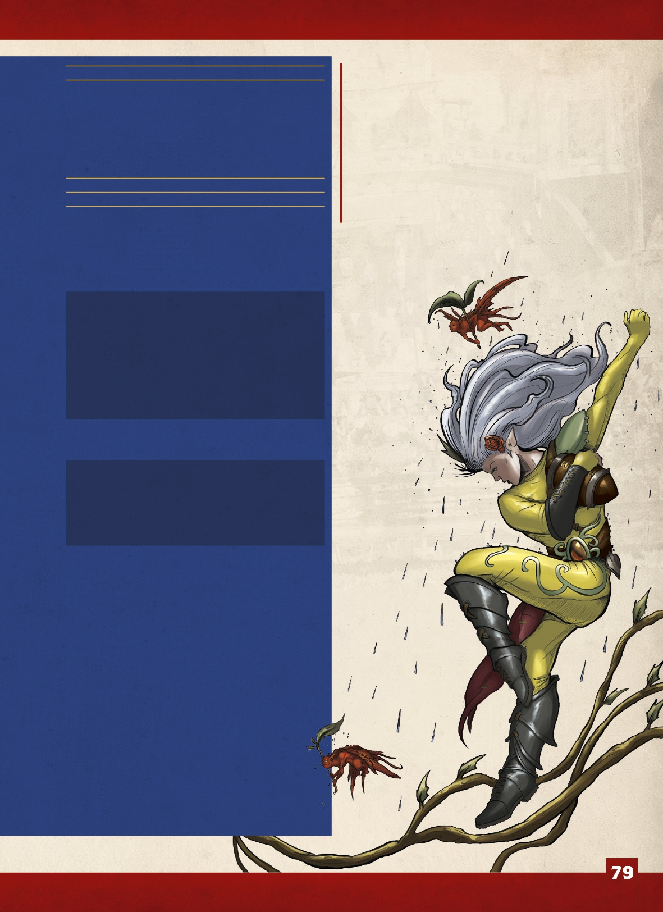PRIM0RDIAL RAINF0REST WEATHER TABLE
>
2D6 RESULT
2 *Praise the Sun Gods:* The sun beats down upon
>
the jungle canopy, turning the air below into a furnace and turning
the ground to rock! If a player Falls Over whilst Rushing, apply a +1
modifierr to the Armour roll. Additionally, apply all of the Heat Wave
weather condition rules as well.
>
3 *Heat Wave:* A glorious day, but as the heat
begins to rise, it becomes harder for players to
>
push themselves. Apply a -1 modifierr every time
a player attempts to Rush an extra square.
Players also findd it harder to get motivated and
get back on the pitch. Additionally, during Step 2
of the End of Drive sequence, apply a -1 modifierr when rolling to see
if any player in the Knocked- out box recovers.
>
4-10 *Perfect Conditions (well, almost):* It's muggy
>
and the mosquitos are out, but otherwise it's perfect Blood Bowl
weather.
>
11 *Jungle Showers:* It's raining those big, fat jungle
>
raindrops, making the ball slippery and difficcult
to hold. Apply a -1 modifierr every time a player makes an Agility
test to pick up or catch the
ball, or whenever a player attempts to interfere with a pass.
>
12 *Tropical Monsoon:* Sheets of rain pour through the tree canopy
creating a wall of water, the
>
ground becomes boggy and visibility is severely reduced. While the
monsoon persists, only Quick pass or Short pass actions can be
attempted and the number of squares a player can attempt to Rush is
reduced by one (to a minimum of 1).

"There! Mark that one down!
In the third minute of the second half, player number 8, Urgar Rancid
of
the 0rcland Raiders, did wilfully
and without hesitation engage in
an illegally -- shockingly, if you will
-- high block against his opposite number, Grumli Boriksson.
The irascible fiend!!"

*Bronur Steel-eye, assistant coach,* *the Grudge Bearers*
>
GRAVEYARD WEATHER TABLE
From the desolate Howling Hills to the rural backwaters of Sylvania,
the world is full of many eerie places and spooky stadia. As if it
wasn't bad enough to have to play a game on a pitch covered in
gravestones, matters get worse when the weather gets atmospheric!
>
GRAVEYARD WEATHER TABLE
>
2D6 RESULT
2 *Angry Locals:* An angry mob of locals has arrived at the stadium
looking for the town Necromancer. Unable to
>
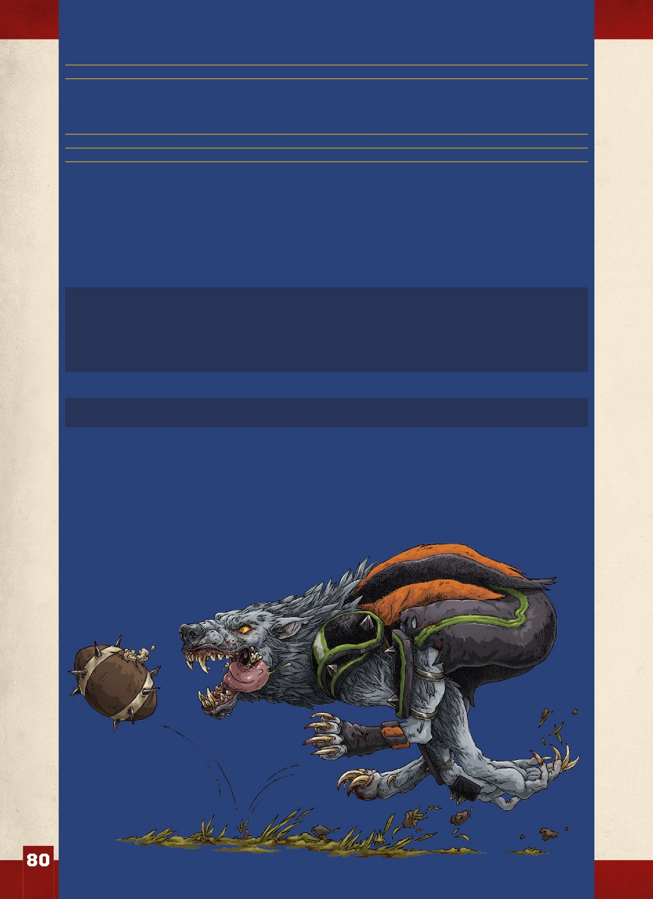findd the fiendd, they decide he's
disguised himself as one of the players! Both coaches roll off. The
coach that rolls the lowest randomly selects one of their players from
among those on the pitch. That player is immediately removed from the
pitch and placed in the Reserves box, where they will hide until the
end of the game, or until this weather condition is replaced by
another.
If the roll-off results in a tie, do not roll again. Instead, both
coaches must randomly select a player to hide from the locals.
If this weather condition is rolled again, this process is repeated;
the locals are nothing if not generous in their misplaced suspicion of
the players!
>
3 *Fog:* A real pea-souper has descended, reducing visibility to
almost nothing! While the fog persists, only Quick pass or Short pass
actions can be attempted and the number of squares a player can
attempt to Rush is
>
reduced by one (to a minimum of 1).
Additionally, the referee is far less likely to spot any foul play
that occurs. Whilst this weather condition is in effect, players
cannot be Sent-off for committing a Foul, even if they roll a natural
double on either the Armour roll or the Injury roll.
>
4-10 *Perfect Conditions (well, almost):* It's a bit gloomy, and
there's a strong suggestion of faint voices
>
whispering too quietly to be heard, but otherwise it's perfect Blood
Bowl weather.
11 *Pouring Rain:* A torrential downpour leaves the players soaked and
the ball very slippery! Apply a -1 modifierr
>
every time a player makes an Agility test to catch or pick up the
ball, or to attempt to interfere with a pass.
12 *Lightning:* Thunder rumbles and the night sky is lit up by regular
lightning strikes. At the end of every team
>
turn, roll a D6. On a roll of 1, a single randomly selected player on
the active team is struck by lightning and immediately Knocked Down.
When a player is Knocked Down by lightning, you may apply a +1
modifierr to
either the Armour roll or Injury roll. This modifierr may be applied
after the roll has been made.
>
DES0LATE WASTELAND WEATHER TABLE
From the Badlands to the Border Princes, much of the world consists of
trackless wilderness and desolate, inhospitable places where the
hostile land is cheap
to acquire. Perfect for building a Blood Bowl stadium on! True, there
might be earthquakes and volcanoes, but if the price is right...
>
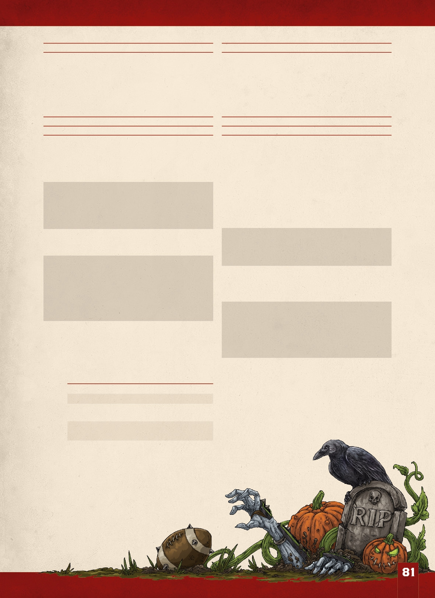DES0LATE WASTELAND WEATHER TABLE
>
2D6 RESULT
2 *Tremors:* The ground is constantly shaking and
>
shuddering. At the end of every team turn, roll a D6 for each Standing
player on the active team that is currently on the pitch. On a roll of
1, that player loses their balance and is Placed Prone.
>
3 *Pouring Rain:* A torrential downpour leaves the
>
players soaked and the ball very slippery! Apply
a -1 modifierr every time a player makes an Agility test to catch or
pick up the ball, or to attempt to interfere with a pass.
>
4-10 *Perfect Conditions (well, almost):* It's not
quite warm but then again, it's not quite cold
>
ideal weather for a game of Blood Bowl!
11 *Lava Bombs:* A local volcano is erupting a bit,
>
causing lumps of volcanic rock to rain down for miles around. Whilst
this weather condition is
in effect, all players are considered to have the Bone Head trait
representing them constantly looking skyward to avoid being struck by
unexpected lumps of falling rock.
>
12 *Strong Winds:* If it wasn't for the winds, it
would be a lovely day. The ball does not deviate
>
normally. Instead, after placing the kick, the
coach of the kicking team rolls a D8 to determine the direction in
which the wind
>
is blowing:
>
D8 Wind Direction
1-2 Towards the kicking team's End Zone.
3-4 Towards the receiving team's End Zone.
5-6 Towards the Sideline to the left of the
>
kicking team.
7-8 Towards the Sideline to the right of the
>
kicking team.
Next, place the Throw-in template over the square
>
in which the kick was placed, with the central arrow (3-4) pointing in
the direction in which
the wind is blowing. The kick then deviates in a direction determined
by rolling a D6 and referring to the Throw-in template.
Additionally, the number of squares the
ball moves is determined by rolling a D8,
rather than a D6.

M0UNTAIN0US WEATHER TABLE
Up in the high peaks, the air is clear and the sun is bright, the
perfect location to play some Blood Bowl, right?
Wrong! Assuming some flaat ground can be found, the wind blows a
constant gale, the sun is blinding, and sudden snow and ice storms
strike without warning! Oh well, we're here now...

M0UNTAIN0US WEATHER TABLE

2D6 RESULT
2 *Gale Force Winds:* The wind is unbelievably
>
strong, making passing play impossible and
even affecting the kick-off! Whilst this weather condition is in
effect, ignore Step 2 of the Start of Drive sequence it is not
possible for a kick-off
to be resolved and a touchback is automatically caused instead.
Additionally, whilst this weather condition is in effect, no Pass
actions or Throw Team-mate actions can be performed.
>
3 *Very Sunny:* A glorious day, but the clear skies
>
and bright sunlight interfere with the passing game! Apply a -1
modifierr every time a player tests against their Passing Ability.
>
4-10 *Perfect Conditions (well, almost):* It's rather
>
chilly and it's threatening to rain (or snow), but considering the
time of year, the conditions are almost perfect for Blood Bowl.
>
11 *Blizzard:* Freezing conditions and heavy falls of
>
snow make the footing treacherous. Apply a -1 modifierr every time a
player attempts to Rush an extra square.
Additionally, the poor visibility means that only Quick and Short
passes can be attempted.
>
12 *Ice Storm:* It is extremely cold, so cold in fact that it is
raining literal lumps of ice! The ice on the pitch is so treacherous
that none of the
>
players are willing to hurry, no matter how much their coach shouts!
Apply a -1 modifierr every time a player attempts to Rush an extra
square. Additionally, all players on the pitch subtract 1 from their
MA.
>
C0ASTAL WEATHER TABLE
It's lovely by the coast at this time of year; miles and miles of
golden beaches, secluded bays, picturesque little seaside towns. But
the weather can change in the blink of an eye, one moment it's calm
and serene, the next moment the rain is literally sheeting down!
>
C0ASTAL WEATHER TABLE
>
2D6 RESULT
2 *Gale Force Winds:* The wind is unbelievably strong, making passing
play impossible and even affecting the
>
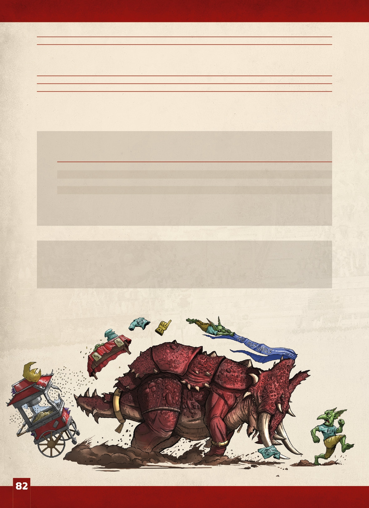kick-off! Whilst this weather condition
is in effect, ignore Step 2 of the Start of Drive sequence it is not
possible for a kick-off to be resolved and a Touchback is
automatically caused instead.
Additionally, whilst this weather condition is in effect, no Pass
actions or Throw Team-mate actions can
be performed.
>
3 *Strong Winds:* If it wasn't for the winds, it would be a lovely
day. The ball does not deviate normally. Instead,
>
after placing the kick, the coach of the kicking team rolls a D8 to
determine the direction in which the
wind is blowing:
>
D8 Wind Direction
1-2 Towards the kicking team's End Zone.
3-4 Towards the receiving team's End Zone.
5-6 Towards the Sideline to the left of the kicking team.
7-8 Towards the Sideline to the right of the kicking team.
>
Next, place the Throw-in template over the square in which the kick
was placed, with the central arrow (3-4) pointing in the direction in
which the wind is blowing. The kick then deviates in a direction
determined by rolling a D6 and referring to the Throw-in template.
Additionally, the number of squares the ball moves is determined by
rolling a D8, rather than a D6.
>
4-10 *Perfect Conditions (well, almost):* Neither too cold nor too
hot. A warm, dry and slightly overcast day
>
provides perfect conditions for Blood Bowl.
11 *Torrential Rain:* A torrential downpour is making the ball
slippery and difficcult to hold. Apply a -1 modifierr
>
every time a player makes an Agility test to catch or pick up the
ball, or to attempt to interfere with a pass. Additionally, the poor
visibility means that only Quick and Short passes can be attempted.
Finally, all players on the pitch subtract 1 from their MA.
However, such extreme downpours seldom last long. During the End of
Drive sequence, after Step 2 but before Step 3, roll again on the
Weather table.
>
12 *Blizzard:* Freezing conditions and heavy falls of snow make the
footing treacherous. Apply a -1 modifierr every
>
time a player attempts to Rush an extra square.
Additionally, the poor visibility means that only Quick and Short
passes can be attempted.
>
DESERT WEATHER TABLE
From the dusty shores of Araby to the endless expanses
of the Land of the Dead, much of the world is covered by great
deserts. These trackless expanses are often not the most welcoming of
environments, but they are very common, and if nothing else, very
flaat!
>
DESERT WEATHER TABLE
>
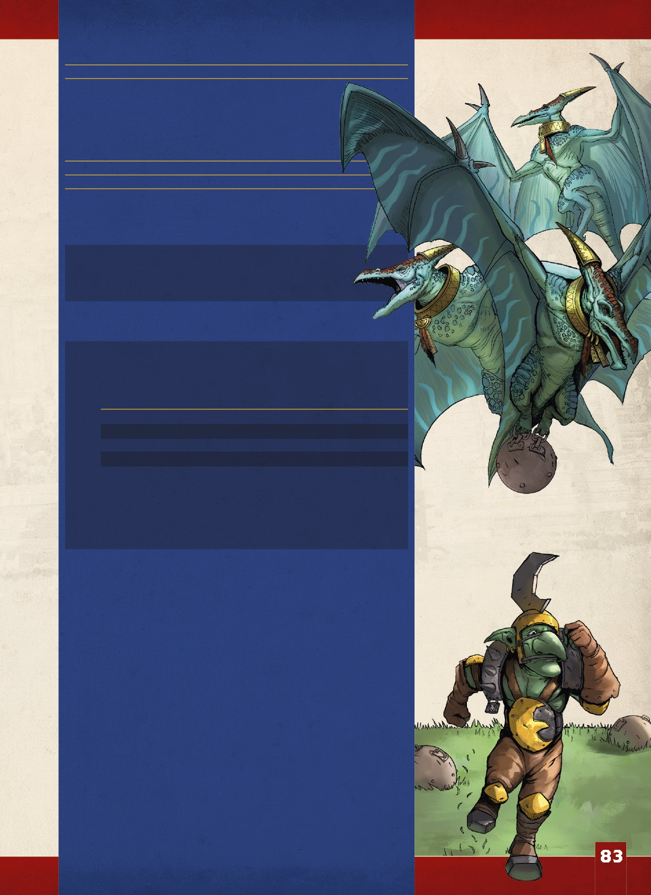2D6 RESULT
2 *Sweltering Heat:* Some players faint in the unbearable heat!
>
D3 randomly selected players from each team that are on the
pitch when a drive ends are placed in the Reserves box. They
must miss the next drive.
>
3 *Very Sunny:* A glorious day, but the clear skies and
>
bright sunlight interfere with the passing game!
Apply a -1 modifierr every time a player tests against
their Passing Ability.
>
4-10 *Perfect Conditions (well, almost):* It's still hot, but it is
bearable! Hot and dry but with a sufficientt breeze to take the
>
edge off makes for ideal Blood Bowl conditions.
11 *Strong Winds:* If it wasn't for the winds, it would be a lovely
day.
>
The ball does not deviate normally. Instead, after placing the kick,
the coach of the kicking team rolls a D8 to determine the direction in
which the wind is blowing:
>
D8 Wind Direction
1-2 Towards the kicking team's End Zone.
3-4 Towards the receiving team's End Zone.
5-6 Towards the Sideline to the left of the kicking team.
7-8 Towards the Sideline to the right of the kicking team.
>
Next, place the Throw-in template over the square in which the kick
was placed, with the central arrow (3-4) pointing in the direction
in which the wind is blowing. The kick then deviates in a direction
determined by rolling a D6 and referring to the Throw-in template.
Additionally, the number of squares the ball moves is determined by
rolling a D8, rather than a D6.
>
12 *Sandstorm:* The shifting sands have been stirred up into a violent
>
sandstorm and visibility is severely affected. Whilst this weather
condition is in effect, no Pass actions or Throw Team-mate actions
can be performed, and no player can attempt to Rush.
Additionally, the referee has retreated indoors and isn't bothering to
even pretend they're keeping an eye on the action! Whilst this weather
condition is in effect, players cannot be Sent-off for committing a
Foul, even if they roll a natural double on either the Armour roll or
the Injury roll.
>
**MATCH** **EVENTS**
>
**M**
>
Match Events are not recommended for events such as tournaments, or
during the play-offf season of a league, as they can greatly unbalance
the action in favour of one team
over the other. As with any other optional rule, they should only be
used if both players agree that they should be. In league play, the
league commissioner should decide whether Match Events are in use;
adding them will bring a lot
of fun and flaavour, but they can make games unpredictable. In other
words, some coaches will love them, others might not! The best way to
findd out is to try out a few games with Match Events and see for
yourself.

**USING MATCH EVENTS**

f Match Events are in use, each coach should roll a D16 at the start
of each of their team turns, after moving their turn marker but before
any player is

activated. On the roll of a 1, something unexpected has happened and a
Match Event is triggered. The coach
of the active team immediately rolls a D8, and the
coach of the inactive team rolls a D6. Both then consult the table below
to see which of the Match Events has been triggered.

Once a Match Event has been triggered, it comes
into effect immediately. After a Match Event has been

triggered, there will not be another during the current half and there
is no further need to roll a D16 at the start of each team turn for the
remainder of the current half.
If there is still a second half to play, both coaches should resume
rolling a D16 at the start of each of their team turns during the second
half. If the game goes into
extra time, Match Events no longer apply.

MATCH EVENTS TABLE
D8 D6 MATCH EVENT

1-2 1 \*Pop\*
>
2 Enthusiastic Apothecary
3 Dodgy Trapdoor
>
4 Moment of Glory
5 Feud!
>
6 Weather Magic
>
3-4 1 Wish Daemon 2 Distracted Ref
>
3 Magical Interference 4 Streaker on the Pitch 5 Dreadful Stench
>
6 Tumbling Timber
5-6 1 Tizcan Wave
>
2 Abusive Fans
>
3 Amnesty
>
4 Enchanted Ball
>
5 Burning Barrel
>
6 Commercial Endorsement 7-8 1 Sprinkler Malfunction
>
2 Whiteout
>
3 Appeal for Silence
4 Camra Crash
>
5 Pelted with Projectiles
6 Total Darkness
>
(1-2, 1) \*P0P\*
*With a loud bang, the ball bursts! The* *rules are a little unclear
on what's* *meant to happen in this scenario, but* *the ref is happy
to let play continue*
*for now and see what the players* *make of this unusual development!*
>
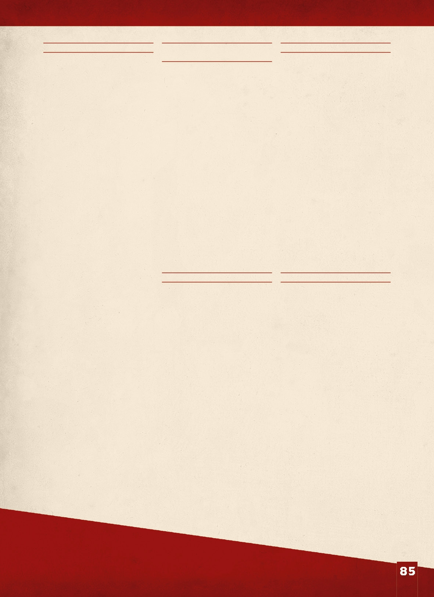If the ball is not in the possession of
a player, it is immediately removed from play and a marker placed in
the square it was within. If the ball is in
>
the possession of a player, that player is immediately placed Prone
(it was a startlingly loud pop!), after which the ball will bounce
until it comes to rest
in an unoccupied square (a popped ball cannot be caught by any
player).
It is then removed from play and a marker placed in the square in
which
it came to rest.
>
After the popped ball has been removed from play, a replacement will
not be made available until the referee has finishedd enjoying the
>
antics. The coach of the active team rolls a D6 after each player has
completed their activation, even if their activation ended with a
Turnover. On a roll of 6, the referee tires of the display and a new
ball is
thrown onto the pitch. A new ball
is placed on the pitch, in the square that contains the marker, and
will immediately deviate from that square before landing.
>
Note that, until a 6 is rolled upon completing a player's activation,
there
>
will be no ball in play. This terrible predicament may continue
indefinittely unless a 6 can be rolled (much to the amusement of the
referee). However, at the end of the half, this Match
Event ceases to apply and, at the
start of the next half, a ball is made available to the players as
usual.

(1-2, 2) ENTHUSIASTIC AP0THECARY
*There's a new apothecary in town,* *and they're keen to show off their*
*talents at the local Blood Bowl* *stadium in the hope of getting some*
*lucrative work. They may not be any* *good but, if they're free, the
coaches* *are willing to give them a chance!*

The next time an Injury roll is made against a player from either

team, and if the result is 8-9, KO'd
or 10+, Casualty!, the Enthusiastic Apothecary will rush forward to help

that player. Roll a D6. On a roll of 4+, change the result of the Injury
roll to 2-7, Stunned.

Note that, if the next time a roll is made on the Injury table against
a player from either team the result

is a 2-7, Stunned, this Match Event expires without effect.

(1-2, 3) D0DGY TRAPD00R *One of the trapdoors leading to the* *dungeon
under the pitch has got a* *loose latch, and has swung open*

*without warning! This could pose*
*quite a hazard to the players, but no* *one seems concerned enough to
halt* *play whilst it is fixxed.*

Randomly select one of the two trapdoors on the pitch. Until the end

of this drive, every time any player enters that Trapdoor square, for
any reason, the trapdoor falls open and the player is immediately
removed from play. Treat them exactly as if
they had been pushed into the crowd. If the player was in possession of
the ball, or should the ball come to rest in the Trapdoor square, it
will
be thrown back out by a helpful groundskeeper and deviates from the
Trapdoor square.

(1-2, 4) M0MENT 0F GL0RY *One of the players has decided that* *this is
their time to shine; they're*

*playing for fame, glory and a place* *in the annals of sports history,
and* *nothing is going to get in their way!* *It's exactly this sort of
behaviour*

*that makes the blooper reels*
*so entertaining!*

Randomly select a player on the active team that is currently on the
pitch. If that player is the firrst to be activated this team turn, they
may re-roll a single dice rolled during their activation (this may be a
dice rolled
as a single dice, as part of a multiple dice roll, or as part of a dice
pool). This re-roll may be used on its own,
in conjunction with a Skill re-roll, or in conjunction with a team
re-roll. Note, however, that a dice can never be re- rolled more than
once, regardless of the source of the re-roll.

(1-2, 5) FEUD!
*It turns out there's been a long-* *standing animosity between two*
*opposing players. This has been well* *publicised in the gossip columns
of* *late, with many promises of violence* *and settling scores. With
the pair* *facing one another across the line*
*of scrimmage, it looks like today is*
*the day!*

Randomly select one player
on each team that is currently on

the pitch. If at any point during the remainder of this game, one of
those players selected performs a Block action (on its own or as part of
a Blitz) that targets the other selected player, the player performing
the Block
may apply a +2 modifierr to their Strength characteristic, and gains the
Mighty Blow (+1) skill. This modifierr
is applied before counting assists, before applying any other Strength
modifierrs and before using any other Skills or Traits. This Match Event
remains in effect for the duration of this game.

(1-2, 6) WEATHER MAGIC
*A Wizard, powerful in the mystical arts of meteorology, is present
somewhere*
*in the crowd of cheering fans. So far, they've resisted the urge to
interfere with* *the game, but sooner or later they're bound to start
meddling; it's just what* *Wizards do!*
>
Each coach rolls a D6 and adds their Fan Factor, re-rolling ties. The
coach who rolls the highest can change the current weather conditions
as they wish,
>
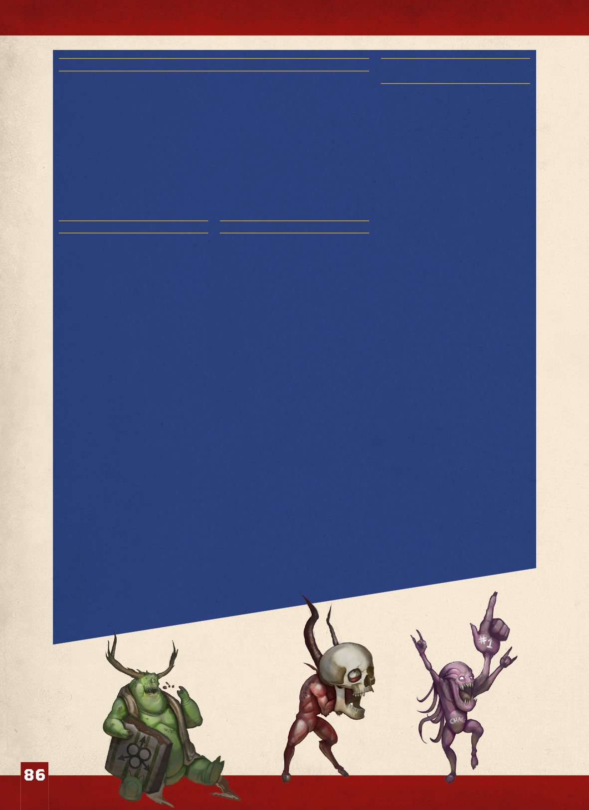choosing any result on the Weather table
and applying those conditions immediately. Note, however, that the
weather conditions must change, in other words, if the current weather
conditions suit the coach that won the roll-off, they must still
change the weather conditions!

(3-4, 3) MAGICAL INTERFERENCE
*A robed fan, who has been watching* *quietly from the front row of the*
*stands, suddenly stands up and*
*starts waving his arms about in a* *complex pattern, chanting strange*
*syllables. Fans scatter as they realise* *there's a Wizard in their
midst and* *he's about to start flinnging firreballs!*

The coach of the active team may choose a target square anywhere on

(3-4, 1) WISH DAEM0N
*A locker room legend tells of a* *strange, floaating creature which*
>
*appears unexpectedly in the dugouts* *of struggling teams, offering a
single* *wish to the beleaguered coach and* *the promise of changing
fortunes.* *Apparently, this legend is true!*
>
The team with the lowest score is granted a single wish. If the score
is tied, the team that started the game with the lowest Current Team
Value is granted a single wish instead. If the score is tied and both
teams started the game with the same Current
Team Value, randomly select a team to be granted a wish.
>
The team that has been granted a wish places an appropriate marker on
their dugout. Between now and the
>
end of the game, they can discard the marker during any of their team
turns in order to change the result rolled
on any single dice (this may be a dice rolled as a single dice, as
part of a multiple dice roll, or as part of a dice pool). This dice is
not re-rolled; the coach may simply select the result they desire.

(3-4, 2) DISTRACTED REF *There's a sudden commotion in*
*the stands! More precisely, there's* *suddenly a lot more commotion
than* *is usual in the stands, and it's serious* *enough to draw the
attention of the* *referee and other match officialss!* *Quick, while no
one is looking..*

If the active team has fewer than 11 players on the pitch when this
Match Event is triggered, its coach may remove one player from the
Reserves box of their dugout and
set them up anywhere on the pitch. This player can be activated as
normal during this team turn.

If the coach of the active team does not have any players in their
Reserves box to place on the pitch, or

if they choose not to, a single player
on their team may commit a Foul action during this team turn without
being Sent-off should they roll a natural double on either the Armour
roll or the Injury roll.

the pitch. The target square is moved D3 squares in a direction
determined by rolling a D8 and referring to the Random Direction
template. After moving the target square, roll a D6
for each Standing player (from either team) that is either in the target
square or a square adjacent to it:

• On a roll of 1-3, the player manages to avoid the Fireball.

• On a roll of 4+, the player has

been hit by the Fireball.

Any Standing players hit by the Fireball are Knocked Down. When a

player is Knocked Down by a Fireball, you may apply a +1 modifierr to
either the Armour roll or Injury roll. This

modifierr may be applied after the roll has been made. If a player on
the active team is Knocked Down, this does not cause a Turnover unless
the Knocked Down player was in possession of the ball.

(3-4, 4) STREAKER
*Accompanied by much whooping and whistling from the* *crowd, a Dwarf
fan wearing nothing but their (slightly* *tarnished) chainmail
underwear leaps over the barrier* *and sprints as fast as their short
legs can carry them* *across the pitch. They must have a death wish!*
>
The coach of the active team places a marker to
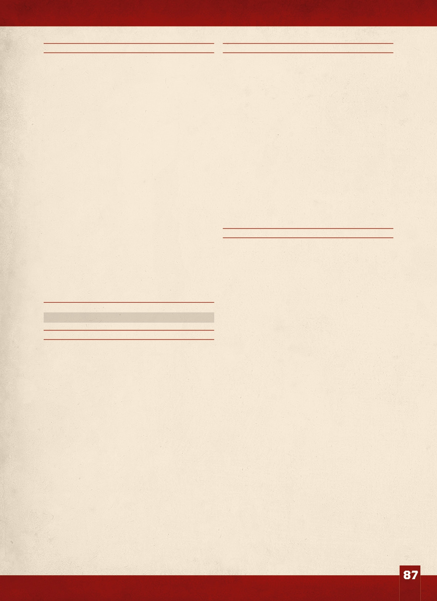represent the Streaker in any unoccupied
square that
>
is adjacent to one of the Sidelines (but not an End
Zone). At the end of each team turn, the coach of that
team places the Throw-in template over the Streaker,
facing directly towards the Sideline opposite the Sideline from which
the Streaker entered. The Streaker moves
D3 squares in a direction determined by rolling a D6
and referring to the Throw-in template. The Streaker automatically
passes any Agility tests they may be
required to make in order to Dodge, regardless of
any modifierrs. Should the Streaker move off the pitch, they are
removed from play.
>
During each team turn, the Streaker is considered to be an opposition
player in all respects (please note that 'in all respects' means 'in
all respects' with no
>
exceptions; the Streaker is determined to cause maximum disruption!).
The Streaker has the following profilee:
>
MA ST AG PA AV Streaker D3 3 N/A - 6+ Skills & Traits Dodge, No Hands
>
(3-4, 5) DREADFUL STENCH
*Uh-oh.. have the facilities backed up again? Or is that*
*the famed Nurgle's Rotters' fan club announcing their* *presence? Or,
horror of horrors: is 'Dangerous' Daisy* *Palmer's Fried Lard Stand
back in business? Whatever the* *cause, something smells truly awful.*
>
The coach of the active team places a marker in any square adjacent to
either Sideline or either End Zone. This
>
marker does not occupy the square in any way;
it is there simply to mark the location. Until the end of
this drive, any player performing a Pass action or a Throw Team-mate
action, attempting Passing Interference,
or attempting to catch or pick up the ball, suffers an additional -1
modifierr to any PA or AG tests they
must make.

(3-4, 6) TUMBLING TIMBER
*The excitement in the stands is reaching fever pitch,*
*and one group of revellers in particular are taking their* *revels a
bit too far, ripping up the benches and throwing* *them down onto the
pitch! They seem to be enjoying* *themselves, but some of the players
don't look happy!*

The coach of the active team rolls a D6. On a roll
of 1-3, the Wide Zone to the left of their End Zone is affected; on a
roll of 4-6, the Wide Zone to the right of

their End Zone is affected. Make an Armour roll for each player in the
affected Wide Zone, as the players are bombarded with torn-up timber:

• If the Armour of the player hit is broken, they become

Prone and an Injury roll is made against them.
This Injury roll cannot be modifiedd in any way.

• If the Armour of the player hit is not broken, this Match

Event has no effect.

(5-6, 1) TIZCAN WAVE
*It's the new craze that's sweeping the Blood Bowl circuit!* *Starting
at one end of the stands, the fans stand up and* *raise their arms,
before sitting back down, creating a* *magical sine wave around the
stadium. Nothing brings*
*the fans together like taking part as the wave circles*
*the stadium.*

The coach of the active team places a marker in the leftmost square of
their End Zone. This marker does not

occupy the square in any way; it is there simply to mark the location.
At the start of each team turn, including this one, the coach of the
active team rolls a D16 and moves the marker that many spaces in a
clockwise direction around the edge of the pitch.

If the marker is adjacent to one of the Sidelines,
its effect extends through all of the squares in its row (i.e.,

between it and the opposite Sideline). If the marker is in an End Zone,
its effect extends through all of the squares in its column (i.e.,
between it and the opposite End Zone).

Players from either team gain the Pro skill for as long as they occupy
any square under the effect of the marker.

As soon as the marker reaches or passes the square it started in, or
when the drive ends, it is removed from play.

(5-6, 2) ABUSIVE FANS
*No one expects a Blood Bowl crowd*
*to be polite and pleasant, but today* *the fans are going out of
their way to* *insult the players. It'll put them off* *their game,
sure, but it really isn't the* *wisest choice for fans who want to*
*keep their legs intact..*

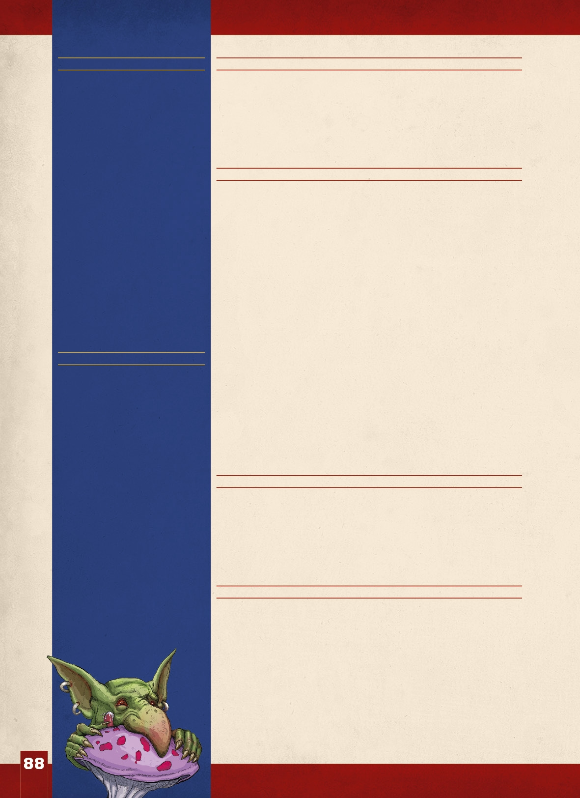

Until the end of this drive, any player, from either team, that is
within
>
three squares of either Sideline or either End Zone suffers an
additional
-1 modifierr to any Agility or Passing Ability test they must make.
>
At the end of the drive, some players from each team make their
>
way into the crowd to discuss some of the criticisms levelled at them
by some of the fans. Both teams immediately reduce their Fan Factor by
1.
>
(5-6, 3) AMNESTY
*It just so happens that today is the* *anniversary of the founding of
the* *RARG, a cause for much celebration* *among members. This year,
the* *referees and other officialss have* *decided to celebrate the
occasion*
*by being lenient to both teams free*
*of charge!*
>
Any player that has been Sent-off during the game so far is permitted
to return to play and is returned to
the Reserves box of their team's dugout. If no player has been
Sent-off, the referee will not watch
for fouls for the remainder of this
drive if a Foul action is committed, the player committing it will not
be Sent-off, even if a double is rolled (note that players can still
be Sent-off for other reasons, such as using a Secret Weapon).

(5-6, 4) ENCHANTED BALL
*From somewhere in the crowd there's the unmistakable sound of a spell
being* *cast, and the ball suddenly takes on a life of its own! All it
wants, it seems, is*
*to be picked up and carried around. Hopefully, it won't take too long
for the* *enchantment to be dispelled.*

Until the start of the active team's next team turn, any player may
apply
a +1 modifierr to any attempt to pick up or catch the ball.

(5-6, 5) BURNING BARREL
*A particularly mischievous fan has thrown a lit barrel of tar onto the
pitch.* *Such behaviour shows complete disregard for the safety of
players, officialss* *and fans alike, and as such is frowned upon by
some.*

The coach of the active team may choose a target square anywhere on
the pitch. The target square is moved D3 squares in a direction
determined

by rolling a D8 and referring to the Random Direction template. If the
target square would move off the pitch, or would end in an occupied
square, it stops moving. After moving the target square, the coach of
the active team places a marker in the target square.

The square containing the marker is occupied by the burning barrel.
Players cannot enter this square or be pushed into it, and if the ball
lands in or

bounces into this square it will bounce again. In addition, the squares
adjacent to the barrel are ablaze, and any attempt to pick up the ball
within one of
those squares suffers an additional -1 modifierr. If a player ends their
activation standing within one of those squares, roll a D6. If the
result is higher than that player's Strength characteristic, they are
immediately Knocked Down.

At the start of each team turn, the coach of the active team rolls a D6,
adding 1 to the result if the current weather conditions are Pouring
Rain
or a Blizzard. On a roll of 6+, the firre goes out and the marker is
removed. Otherwise, it is removed at the end of the current drive.

(5-6, 6) C0MMERCIAL END0RSEMENT
*One of the players has signed a contract with a sponsor, agreeing to
mention* *their product to the crowd during the match in exchange for
some extra funds.* *Unfortunately, they forgot they were meant to do it
until now.*

Randomly select one player on the active team that is currently on the
pitch. That player cannot be activated at all during this team turn. In
addition, that player loses their Tackle Zone for the duration of this
team turn.

(7-8, 1) SPRINKLER MALFUNCTI0N
*In the old days, it was standard NAF rules for all pitches to have
mechanical* *water irrigation systems, thus ensuring the grass stayed
nice and green. These* *days, these rules are enforced by the RARG, who
couldn't care less, meaning* *that, unfortunately, they sometimes aren't
well-maintained..*

Until the start of the active team's next team turn, apply an
additional
-1 modifierr to all attempts to catch or pick up the ball, and to any
passing interference attempts made.

(7-8, 2) WHITE0UT
*The stadium is suddenly blanketed by a thick screen of mist. Perhaps
this* *is a freak meteorological occurrence, or maybe magical trickery
is involved*
*- or maybe one of the contraptions in the local Engineers Guild has*
*backfirred again..*
>
For the remainder of the drive, any player wishing to move more than
fivve squares during their activation must Rush in order to do so. For
example,
>
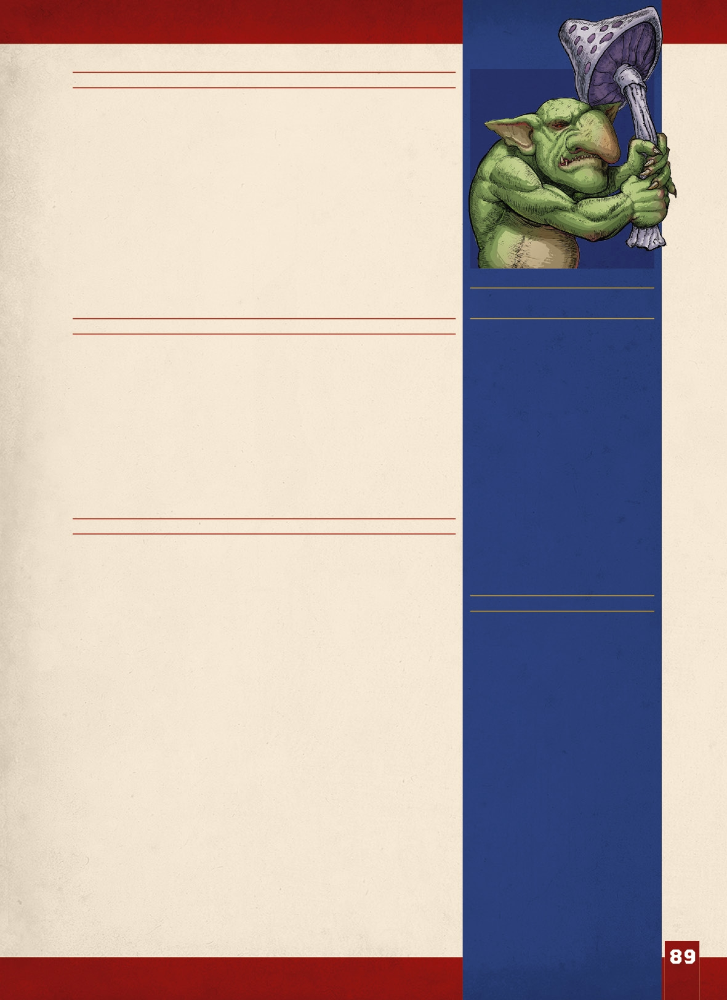a player with MA 7 could move up to
fivve squares normally, then up to four spaces by Rushing (this being
the two remaining squares of their MA, plus the two Rush attempts that
are normally allowed).
>
In addition, only Quick pass and Short pass actions can be attempted.
Long pass and Long bomb Pass actions may not be attempted, and the
Hail Mary Pass skill may not be used.
>
(7-8, 3) APPEAL F0R SILENCE
*"Will the spectators please quieten down, and allow the players to
concentrate*
*on the game! This is the last time I shall ask nicely."
Unfortunately, telling a*
*Blood Bowl crowd what to do is never wise, and asking nicely isn't
the only*
*thing that the ref won't be doing for a while..*
>
Until the start of the active team's next team turn, there is no
referee! Both teams can commit up to three Foul actions during their
team turn, rather than the usual one, and even if a natural double is
rolled when making either the
>
Armour or Injury roll, the player committing the Foul will not be
Sent-off (note, however, that should the drive end before the start of
the active team's next team turn, players with the Secret Weapon trait
can still be Sent-off).
>
(7-8, 4) CAMRA CRASH
*High above the stadium, held aloft by alchemical ingenuity (and more
than a* *little magic), a Cabalvision camra has been recording the
match for broadcast.* *Suddenly, with a loud bang as something goes
wrong within its workings, it is* *sent hurtling towards the pitch..*
>
The coach of the active team may choose a target square anywhere on
the pitch. The target square is moved D3 squares in a direction
determined
>
by rolling a D8 and referring to the Random Direction template. If the
target square would move off the pitch, it stops moving. After moving
the target square, the coach of the active team places a marker in the
target square.
>
If the target square, or any square adjacent to it, is occupied by a
player, that player is immediately pushed back at least once, but no
more than twice,
>
in a direction chosen by the coach of the opposing team, so that they
do not occupy either the target square or any square adjacent to the
target square.
If this player was Standing, they are Knocked Down. If this player was
Prone or
>
Stunned, an Armour roll is made against them.
>
For the remainder of the drive, the square containing the marker, and
every square adjacent to it, are occupied with wreckage. Players may
Jump
>
over a square occupied by wreckage, but may not otherwise move into,
over or through a square occupied by wreckage. If the ball bounces
into a square that is occupied by wreckage, it will continue to bounce
until it is caught by a
>
Standing player or it comes to rest in an unoccupied square.

(7-8, 5) PELTED WITH PR0JECTILES
*The crowd, whether because they* *disapprove of what's happening on*
*the pitch or because they're just* *bored, start flinnging empty
bottles,* *discarded food baskets, rotten fruit* *and all manner of
other projectiles at* *the players. It's not enough to cause* *any harm,
but it really does start* *piling up..*

For the remainder of the drive, any attempts to pick up the ball suffer
an additional -1 modifierr. In addition, if a player wishes to Rush more
than once during their activation, the second
(and any subsequent attempts) will suffer a -1 modifierr.

(7-8, 6) T0TAL DARKNESS
*Hey, who turned out the lights?*
*Thanks to strange and mysterious* *magical interference (or maybe it's*
*due to something less sinister, after* *all, some matches are played at
night* *or underground, and sometimes it*
*just goes dark!), the pitch is drowned* *in darkness.*

Until the start of the active team's next team turn, the MA of each and
every player on the pitch is halved (rounding fractions up). In
addition,
all players suffer an additional -2 modifieer when testing for the
accuracy of a Pass action, or when attempting to catch the ball.

**SEVENS PITCH**

Blood Bowl Sevens

The Blood Bowl

**A**

Blood Bowl Sevens pitch shares many similarities with a standard Blood
Bowl pitch, but there are a few key differences to be aware of. A Blood
Bowl Sevens pitch features:

Sevens Pitch

elcome to Blood Bowl
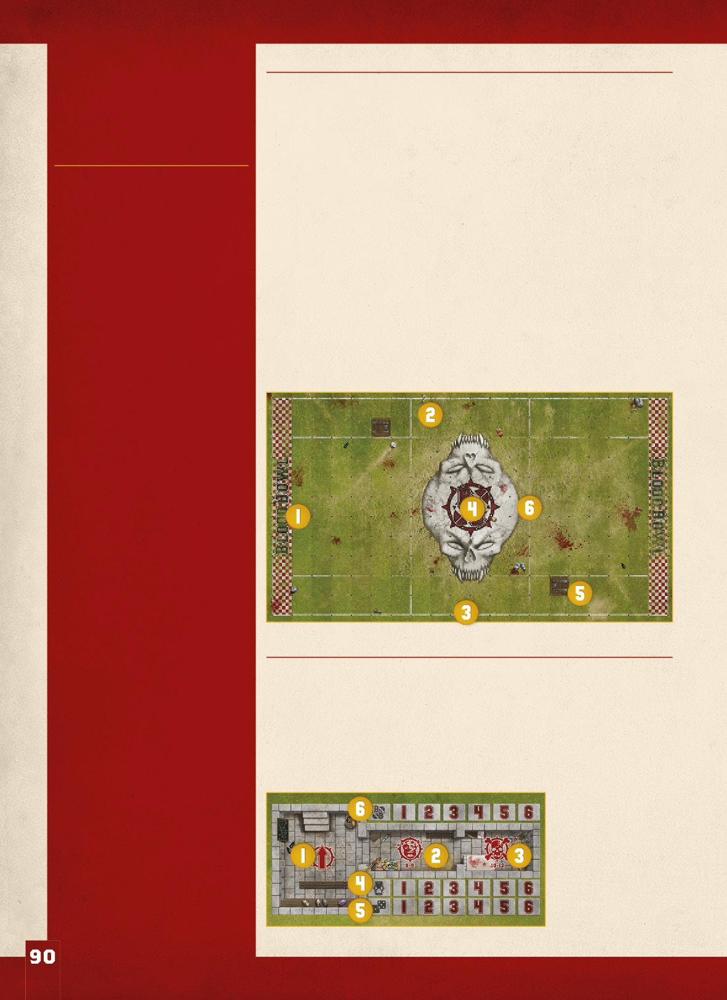Sevens, the fast and furious game of
fantasy
>
football. Blood Bowl is, by its very nature, a game that can take a
couple of hours or more to play. For many coaches, real-world
commitments, such as work and family, can mean that findinng
time for a full-length game can
be diffcicult, and taking part in
a league almost impossible.
Blood Bowl Sevens addresses
this by allowing coaches to play with smaller teams and reducing the
number of turns, creating a version of the game that can be played in
under an hour.
>
What's more, this simplifiedd version of the game is ideal
for younger players, many of whom wish to play and want to
>
learn the rules, but often findd
the complexity of Blood Bowl daunting. Blood Bowl Sevens, with
>
its simplifiedd format and smaller teams, allows younger coaches to
master the game without being overwhelmed by the rules.
>
**THE BL00D B0WL**

1. Two End Zones, one at each short end of the pitch.
2. Two Wide Zones, one at each side of the pitch, running from End Zone
to

End Zone.
3. Two Sidelines, running the length of the pitch, from one End Zone to
the other.

4. The Centre Field, the area between each Wide Zone, running the
length of the

pitch from End Zone to End Zone.
5. There are two trapdoors on the pitch, one in each half, both
positioned within a

Wide Zone.
6. The pitch is then further split along its length into three thirds by
two Lines of

Scrimmage, each marking the point at which one of the teams will line
up for the kick-off!

Finally, the board itself is split into a grid of squares; seven squares
from
each Line of Scrimmage to each End Zone and six squares between each
Line of

Scrimmage, making the pitch 20 squares long in total, and 11 squares
wide; two squares in each Wide Zone, seven squares across the Centre
Field.

**DUG0UTS**

s with normal Blood Bowl, each team in a Blood Bowl Sevens game has
its own dugout, a safe haven at pitch side where reserves can warm up,
where the injured can be tended to and where important game
information

is tracked. The dugouts used for Blood Bowl Sevens are almost identical
to normal dugouts, as described in the *Blood Bowl* rulebook, except for
one important difference; on a Blood Bowl Sevens dugout, the turn and
team re-roll trackers only
go up to six, rather than the usual eight. This is because there are
only six turns per half in a Blood Bowl Sevens game.

1. The Reserves box.
2. The Knocked-out box. 3. The Casualty box.
4. Turn trackers.
5. Team re-roll trackers. 6. The Score tracker.
>
DRAFTING A BL00D B0WL SEVENS TEAM
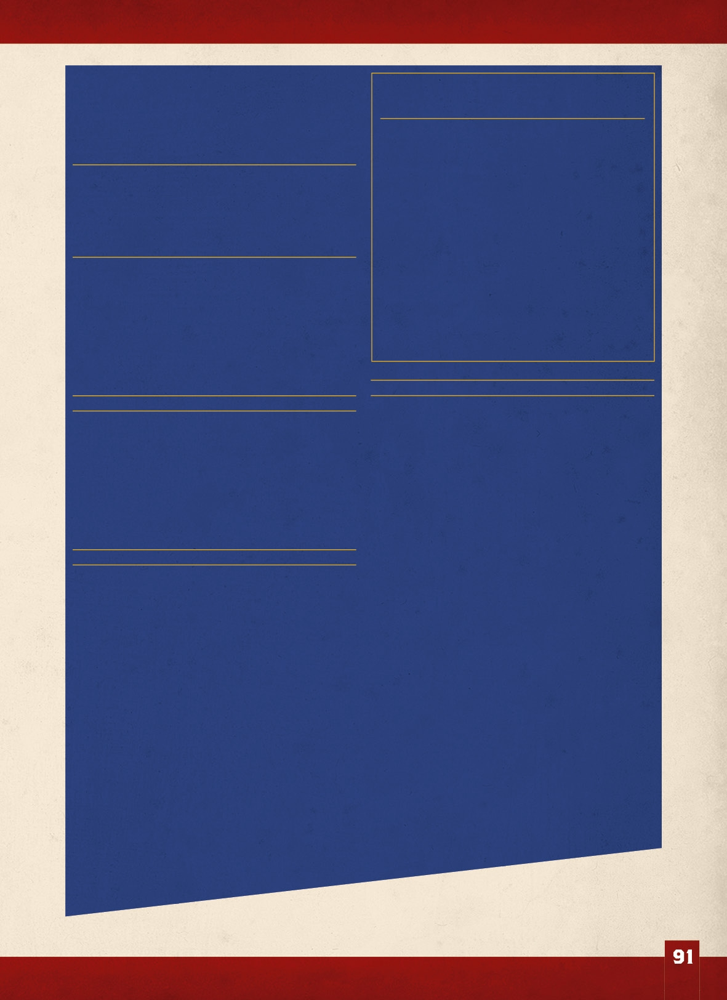**B**

**DESIGNER'S N0TE:** **CURRENCY C0NVERSI0N**

ne important thing to remember about Blood Bowl Sevens is that it
represents an amateur game. Neither the staff nor the

players are professionals, and the sums of money thrown around aren't
likely to be all that high!

With that in mind, we would suggest that, wherever possible, coaches use
the term 'copper pieces'
instead of 'gold pieces'. This has little to no bearing

**T**

he Team Draft Budget is the amount of gold pieces you have to spend on
your rookie team:

upon the game; a Human Lineman costs 50,000 'points', and how those
points are named matters
little. But for the purposes of Blood Bowl Sevens, referring to those
points as 'copper pieces' rather than

• When drafting a Blood Bowl Sevens team for league
>
play, you have a budget of 600,000 gold pieces to spend on players,
Sideline Staff, team re-rolls and so forth.
>
HIRING PLAYERS
Players are the only compulsory element on any
Blood Bowl Sevens team. Each team roster details all
of the players available to a team of that type and their Hiring Fee.
When drafting a team for Blood Bowl Sevens, you should select the
players you want to permanently
hire for your team, pay their hiring cost from your Team Draft Budget
and make a record of the player on the Team Draft list.
>
NUMBER 0F PLAYERS
The firrst and most important thing to be aware of when drafting a
Blood Bowl team is the minimum and maximum number of players
permitted:
>
• Every Blood Bowl Sevens team must contain a minimum of seven (7)
permanently hired players when
>
it is firrst drafted.
• No Blood Bowl Sevens team can ever contain more
>
than eleven (11) permanently hired players.
>
*J0URNEYMEN:* As with any Blood Bowl team, during the course of a
league season, the number of players a team
can fieeld may fall below seven due to injury and death. This
is permitted and Blood Bowl Sevens teams may 'Recruit Journeymen' just
like any other team. However, the quality of Journeymen available is
likely to be lower than usual (such reserves are normally found in the
local pub, after all):
>
• A Journeyman on a Blood Bowl Sevens team replaces
>
the Loner (4+) trait with the Loner (5+) trait.
>
'gold pieces' is far more characterful and, we have found, adds
greatly to the fun!

PLAYER P0SITI0NS
There are distinctions to be made between the players within a team,
separating them by their role within the game, from the humble Lineman
to the more specialised roles performed by the 'positional' players.

*LINEMEN:* The backbone of any team:

• All teams will have a player type that they are
permitted to take 0-12 or 0-16 of. Regardless of name

(for many races call their Linemen by another name), this Player type
is the team's 'Lineman' positional.

*0THER P0SITI0NS AND BIG GUYS:* Unlike a normal
team, a team drafted for Blood Bowl Sevens cannot
simply recruit as many players of other types as the coach wishes. Blood
Bowl Sevens teams represent amateur sides, so specialist players, such
as Blitzers, Throwers and so forth, are quite uncommon:

• A Blood Bowl Sevens team may include a maximum of

four (4) players that are not Linemen.
• A Blood Bowl Sevens team may not include more

players of a certain type than are allowed by the team roster. For
example, an Elven Union team is allowed
0-2 Blitzers, meaning a Blood Bowls Sevens Elven Union team may
include zero, one or two Blitzers,
but may not include three.
>
PURCHASING TEAM RE-R0LLS
Any team can purchase team re-rolls. These represent
the time spent training and the team's ability to react in a split
second to mistakes and turn them around. The cost refleccts the time
and effort different teams must invest to achieve the same broad level
of training:
>
• Every team may purchase 0-6 team re-rolls when it is
>
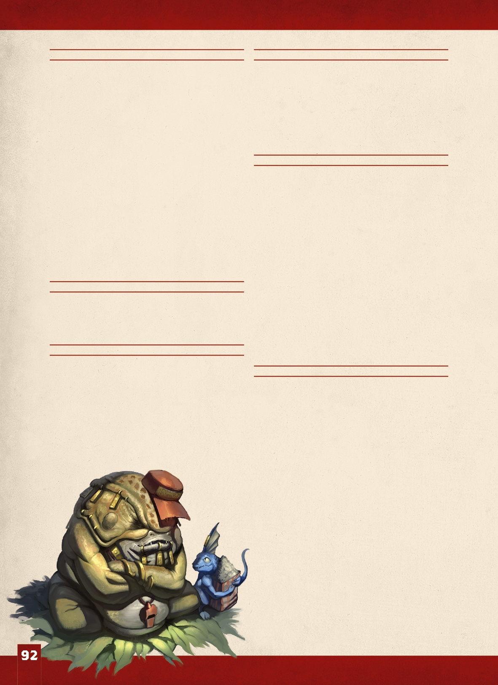firrst drafted.
• Blood Bowl Sevens teams represent amateur sides. As
>
such the time spent training and the quality of training leaves much
to be desired. A Blood Bowl Sevens
team must pay double for each team re-roll it wishes
to purchase. For example, if a regular team is able to purchase team
re-rolls for 60,000 gold pieces, a Blood Bowl Sevens team of the same
type must pay 120,000 gold pieces.
>
• Unlike ordinary Blood Bowl teams, a Blood Bowl
Sevens team cannot purchase additional team re-rolls
>
at a later date. Ongoing team training isn't a strength
of such amateur teams!
>
HIRING SIDELINE STAFF
Sideline Staff can be of as much if not more assistance
to a Blood Bowl Sevens team as they can be to a regular Blood Bowl
team. However, findinng professional and competent staff can be a
challenge for an amateur team!
>
0-3 ASSISTANT C0ACHES
Any Blood Bowl Sevens team can hire a number of assistant coaches:
>
• Every Blood Bowl Sevens team may hire assistant coaches when it is
firrst drafted, for the cost of 20,000
>
gold pieces each, paid for from the Team Draft budget.
• Additional assistant coaches may be purchased at a
>
later date for the cost of 20,000 gold pieces each.

0-6 CHEERLEADERS
All Blood Bowl Sevens teams can hire a number of cheerleaders:

• Every Blood Bowl Sevens team may hire cheerleaders when it is firrst
drafted, for the cost of 20,000 gold pieces each, paid for from the Team
Draft budget.

• Additional cheerleaders may be purchased at a later

date for the cost of 20,000 gold pieces each.

0-1 AP0THECARY
Apothecaries work hard on the sidelines, patching up minor injuries and
giving urgent care to more serious injuries before they can end a
player's career:

• Not every Blood Bowl Sevens team can hire an apothecary. Whether a
team can or cannot include

an apothecary will be noted on the team roster.
• If a team can hire an apothecary, it may only ever have

one on the roster.
• Teams that can hire an apothecary can do so when

they are firrst drafted, or during the Hire and Fire step of the
post-game sequence of any game for a cost of 80,000 gold pieces.

Teams able to hire an apothecary may Induce a number of additional
Wandering Apothecaries for a single

game during a league in the Hire Inducements step of the pre-game
sequence.

DEDICATED FANS
Just like a regular Blood Bowl team, every Blood Bowl Sevens team is
supported by a strong following of Dedicated Fans. In truth, this
probably represents the players' ever-loving mums, or perhaps unwilling
partners and spouses dragged along to show support!

When a team is drafted, it will have a Dedicated Fans characteristic of
1 recorded on the Team Draft list. Over the course of a league season,
this characteristic will increase and decrease, though it will never
fall below 1.

Additionally, when a team is drafted it can improve
its Dedicated Fans characteristic by 1, up to a maximum

of 6, at a cost of 20,000 gold pieces per improvement.
For example, a team may improve its Dedicated Fans characteristic from 1
to 3 at a cost of 40,000 gold pieces from its Team Draft budget.

**PLAYING BL00D B0WL SEVENS**
>
etting up and playing a game of Blood Bowl Sevens is just like setting
up and playing a regular Blood Bowl game. Coaches should follow the
normal
>
sequences for the pre-game, the start of drive, the end of a drive and
the post-game, as well as following all of the regular game rules, but
with the following exceptions:
>
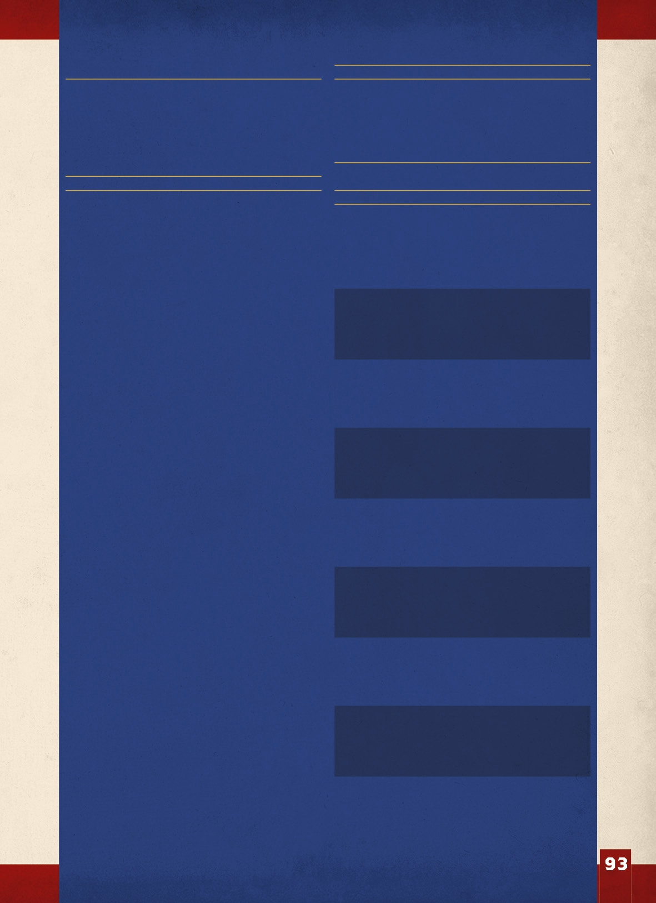INDUCEMENTS
Blood Bowl Sevens teams can purchase Inducements during Step 4 of the
pre-game sequence just like a
regular Blood Bowl team, and are awarded Petty Cash
in the same way. However, due to the amateur nature
of the competition, the list of Inducements available is somewhat
shorter and some costs are slightly different:
>
• 0-2 Agency Cheerleaders 30,000 gold pieces
• 0-1 Part-Time Assistant Coaches 30,000 gold pieces
• 0-2 Bloodweiser Kegs 50,000 gold pieces each
• 0-5 Desperate Measures Inducements 50,000 gold
>
pieces each
• 0-5 Special Play Inducements 100,000 gold
>
pieces each
• 0-8 Extra Team Training 150,000 gold pieces each
>
• 0-3 Bribes 100,000 gold pieces each (50,000 gold pieces for teams
with the 'Bribery and Corruption'
>
special rule)
• 0-2 Wandering Apothecaries 100,000 gold pieces
>
(not available to teams that cannot hire an apothecary)
• 0-1 Mortuary Assistant 100,000 gold pieces
>
(only available to teams with the 'Sylvanian Spotlight' special rule)
>
• 0-1 Plague Doctor 100,000 gold pieces
(only available to teams with the 'Favoured of Nurgle'
>
special rule)
• 0-1 Halflinng Master Chef 300,000 gold pieces
>
(100,000 gold pieces for teams with the 'Halflinng Thimble Cup'
special rule)
>
• Unlimited Mercenary Players price varies
>
(as described in the *Blood Bowl* rulebook)
>
Or:
0-3 Mercenary Players price varies (see page 41)

THE PRAYERS T0 NUFFLE TABLE
In Blood Bowl Sevens, players do not gain SPPs, meaning some of the
results on the Prayers to Nufflee table that give benefitts in this
regard are not suitable. Therefore, for Blood Bowl Sevens, coaches
should use the following, shortened version of the Prayers to Nufflee
table:

BL00D B0WL SEVENS
PRAYERS T0 NUFFLE TABLE

D8 RESULT
>
1 *Treacherous Trapdoor:* Until the end of this
>
half, every time any player enters a Trapdoor square, roll a D6. On a
roll of 1, the trapdoor falls open. The player is immediately removed
>
from play. Treat them exactly as if they had been pushed into the
crowd.
>
2 *Friends with the Ref:* Until the end of the
next drive, you may treat a roll of 5 or 6 on the
>
Argue the Call table as a *"Well, When You Put It* *Like That.."*
result and a roll of 2-4 as an *"I Don't* *Care!"* result.
>
3 *Stiletto:* Randomly select one player on your
>
team that is available to play during the next
drive and that does not have the Loner (X+) trait. Until the end of
the next drive, that player gains the Stab trait.
>
4 *Iron Man:* Choose one player on your team that is available to play
during the next drive and that does not have the Loner (X+) trait.
Until the end of this game, that player improves their AV by 1,
>
to a maximum of 11+.
5 *Knuckle Dusters:* Choose one player on your
>
team that is available to play during the next
drive and that does not have the Loner (X+) trait. Until the end of
the next drive, that player gains the Mighty Blow (+1) skill.
>
6 *Bad Habits:* Randomly select D3 opposition players that are
available to play during the next
>
drive and that do not have the Loner (X+) trait. Until the end of the
next drive, those players gain the Loner (2+) trait.
>
7 *Greasy Cleats:* Randomly select one opposition
>
player that is available to play during the
next drive. That player has had their boots tampered with. Until the
end of the next drive, their MA is reduced by 1.
>
8 *Blessed Statue of Nuffe:e:* Choose one player on your team that is
available to play during the next drive and that does not have the
Loner (X+)
>
trait. Until the end of this game, that player gains the Pro skill.
>
Set-up

SET-UP
As with regular games of Blood
Bowl, both coaches place all of their available players on the pitch. If
there are more than seven players available, those not chosen to play
the drive are placed in the Reserves box until the start of the next
drive. A team may
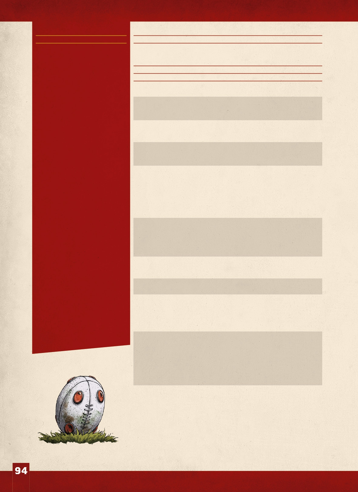not set up more than seven players at the
start of a drive.

The kicking team sets up firrst, followed by the receiving team, as
follows:

• Both teams set up fully within the area between their own End Zone and
their own Line of Scrimmage. Neither team may set up any

players in the area between the two Lines of Scrimmage.

• Each team can set up a maximum

of one player in each Wide Zone.
In other words, each team can
set up two players in Wide Zones, providing they are split equally
with one player per Wide Zone.

• A team must set up a minimum of three players in squares within the
Centre Field, directly adjacent to

their Line of Scrimmage.

Note that should a team findd itself reduced to only three players or
fewer, it may concede without penalty before setting up, as described in
the *Blood*

*Bowl* rulebook. Should you wish to
play on, the available players should be set up on the Line of
Scrimmage, as described above.

THE KICK-0FF EVENT
As with the Prayers to Nufflee table, the Kick-off Event table used for
Blood Bowl Sevens differs slightly from the standard Kick-off Event
table:

BL00D B0WL SEVENS KICK-0FF EVENT TABLE

2D6 RESULT
2 *Get the Ref:* Each team gains a free Bribe Inducement.
>
This Inducement must be used before the end of the game or it is
lost.
3 *Time-out:* If the kicking team's turn marker is on turn 4, 5 or 6
>
for the half, both coaches move their turn marker back one space.
Otherwise, both coaches move their turn marker forward one space.
>
4 *Solid Defence:* D3+1 Open players on the kicking team may be
removed and set up again in different locations, following all of the
>
usual set-up rules.
5 *High Kick:* One Open player on the receiving team may be moved any
>
number of squares, regardless of their MA, and placed in the same
square the ball will land in.
>
6 *Cheering Fans:* Both coaches roll a D6 and add the number of
cheerleaders on their Team Draft list. The coach with the highest
total
>
may immediately roll once on the Prayers to Nufflee table.
In the case of a tie, neither coach rolls on the Prayers to Nufflee
table. Note that if you roll a result that is currently in effect, you
must re-roll
it. However, if you roll a result that has been rolled previously but
has since expired, there is no need to re-roll it.
>
7 *Brilliant Coaching:* Both coaches roll a D6 and add the number of
assistant coaches on their Team Draft list. The coach with the highest
>
total gains one extra team re-roll for the drive ahead.
If this team re-roll is not used before the end of this drive, it is
lost. In the case of a tie, neither coach gains an extra team re-roll.
>
8 *Changing Weather:* Make a new roll on the Weather table and apply
>
that result. If the weather conditions are 'Perfect Conditions' as a
result of this roll, the ball will scatter before landing.
>
9 *Quick Snap:* D3+1 Open players on the receiving team may
>
immediately move one square in any direction.
10 *Blitz:* D3+1 Open players on the kicking team may immediately
>
activate to perform a Move action. One may perform a Blitz action and
one may perform a Throw Team-mate action. If a player Falls Over or is
Knocked Down, no further players can be activated and the Blitz ends
immediately.
>
11 *0ffciousus Ref:* Both coaches roll a D6 and add their Fan Factor
to
the result. The coach that rolls the lowest randomly selects one of
their players from among those on the pitch. In the case of a tie,
both
>
coaches randomly select a player. Roll a D6 for the selected
player(s). On a roll of 2+, the player and the referee argue and come
to blows.
The player is Placed Prone and becomes Stunned.
On a roll of 1 however, the player is immediately Sent-off.
>
12 *Pitch Invasion:* Both coaches roll a D6 and add their Fan Factor
to the result. The coach that rolls the lowest randomly selects D3 of
>
their players from among those on the pitch. In the case of a tie,
both coaches randomly select D3 of their players from among those on
the pitch. All of the randomly selected players are Placed Prone and
become Stunned.
>
THE INJURY TABLE
Rather than the standard Injury table, Blood Bowl Sevens uses the
following Injury table. This is a simplifiedd version of the standard
table that is both quick and easy to use:
>
BL00D B0WL SEVENS INJURY TABLE
>
2D6 RESULT
2-7 *Stunned:* The player immediately becomes
>
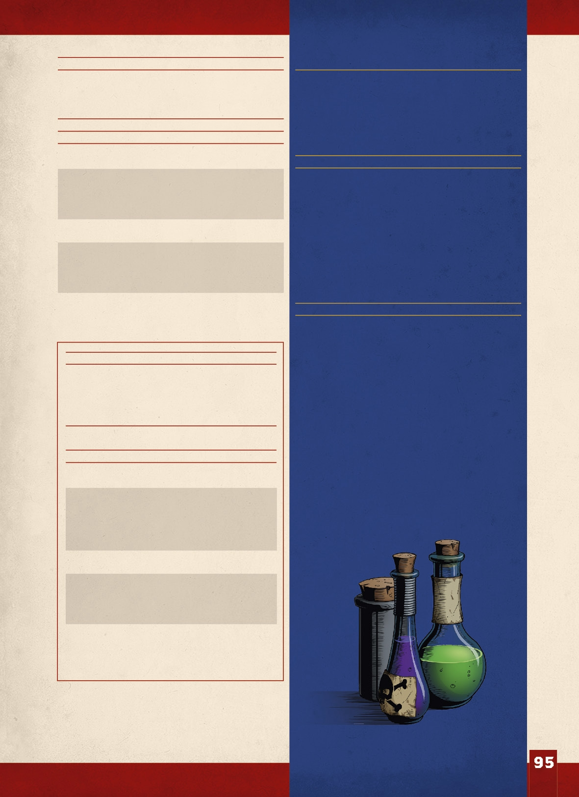Stunned, and is laid face-down on the
pitch.
8-9 *K0'd:* The player is immediately removed from
>
play and placed in the Knocked-out box of their team dugout. At the
end of each drive, there is a chance any Knocked-out players will
recover.
>
10 *Badly Hurt:* The player misses the rest of this
>
game, but suffers no long term effect.
11 *Seriously Hurt:* The player misses the rest of
>
this game, but will need more time to recuperate. In league play, the
player is not available to play
in the team's next game.
>
12 *DEAD:* This player is far too dead to play Blood Bowl! Dead
players are dismissed from the team
>
during Step 1 of the post-game sequence.
>
STUNTY PLAYERS
Players with the Stunty trait are more prone to breaking when hit! If
an Injury roll is ever made against a player with the Stunty trait
during a Blood Bowl Sevens game, roll on this table instead:
>
BL00D B0WL SEVENS STUNTY
INJURY TABLE
>
2D6 RESULT
2-6 *Stunned:* The player immediately becomes
>
Stunned, and is laid face-down on the pitch. 7-8 *K0'd:* The player is
immediately removed
>
from play and placed in the Knocked-out
box of their team dugout. At the end of each drive, there is a chance
any Knocked-out players will recover.
>
9-10 *Badly Hurt:* The player misses the rest of this game, but
suffers no long term effect.
>
11 *Seriously Hurt:* The player misses the rest
>
of this game, but will need more time to recuperate. In league play,
the player is not available to play in the team's next game.
>
12 *DEAD:* This player is far too dead to play Blood Bowl! Dead
players are dismissed from the team during Step 1 of the post- game
sequence.

**AP0THECARIES**

uring a Blood Bowl Sevens game, a team may use an apothecary to
'patch-up' any player (including Journeymen and Mercenaries) that has
been

removed from play after being Knocked Out or after suffering a Badly
Hurt, Seriously Hurt or DEAD result on the Injury table.

PATCHING-UP KN0CKED-0UT PLAYERS
An apothecary can be used immediately when a player becomes Knocked-out:

• If the player was on the pitch when they were Knocked-

out, they are not removed from play. Instead, they remain on the pitch
and become Stunned.

• If the player was Knocked-out as a result of being pushed back into
the crowd or landing in the crowd,

place them directly into the Reserves box rather than the Knocked-out
box.

PATCHING-UP CASUALTIES
An apothecary can be used when a player suffers a Badly Hurt, Seriously
Hurt or DEAD result on the Injury table. Roll a D6:

• On a roll of 4+, the apothecary has been able to patch

the player up and pump them full of painkillers. The player is removed
from the Casualty box and placed in the Reserves box.

• On a roll of 1-3, the apothecary's vigorous efforts prove

largely futile. The apothecary is unable to patch the player up the
original Injury table result stands.
>
Player Advancement

PLAYER ADVANCEMENT
In Blood Bowl Sevens league play, players do not earn Star Player
Points
for their achievements. Instead, after every game, one player on your
team will automatically gain a new randomly selected Primary or
Secondary skill. There are two ways in which to determine the player and
the type of Skill:

1. During Step 3 of the post-game sequence, a single player of your
choice
that played during this game and that did not suffer an Injury table
result of

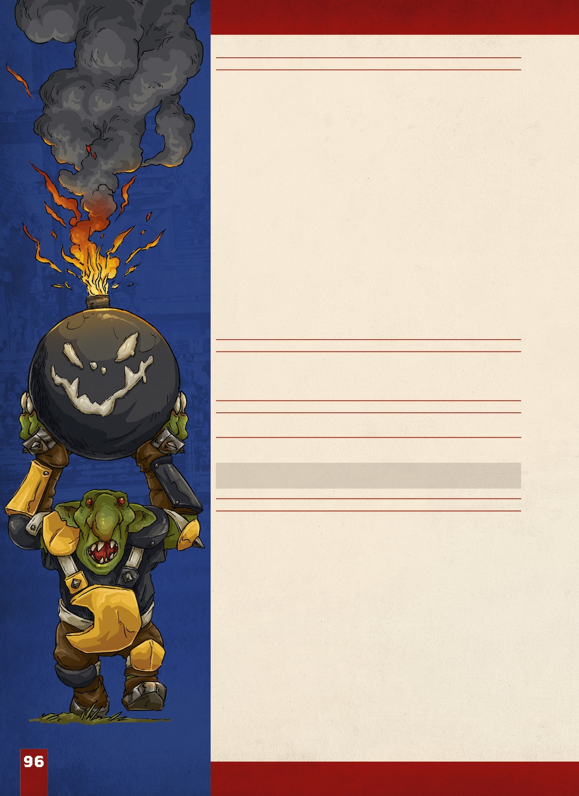12, DEAD gains a randomly selected
Primary skill.

Or:

2. During Step 3 of the post-game sequence, a single randomly selected
player that played during this game and that did not suffer an Injury
table

result of 12, DEAD gains a randomly selected Secondary skill.

Note that, due to the amateur nature of the game, and the somewhat
hit-and-miss team training provided, any additional Skills gained by a
Blood

Bowl Sevens player are always randomly selected. The coach of a Blood
Bowl Sevens team has to work with what they are given and, all too
often, their players will waste everyone's time perfecting a truly
mind-boggling and often completely futile set of skills and specialisms.

VALUE INCREASE
As players gain advancements, their value increases. To reflecct this,
whenever a player gains a new Skill, their Current Value must be
increased on the Team Draft list by the amount shown on the table below:

CURRENT VALUE INCREASE TABLE

NEW SKILLS

Randomly selected Primary skill
>
Randomly selected Secondary skill

+10,000 gp +20,000 gp

+20,000 gp +30,000 gp

THE DRAFT
As players become more experienced, there is a chance they will be
noticed
by a professional team and be offered a chance to break into the big
leagues. When this happens, there is little a coach can do as their
best player is poached on the vague promise of a huge salary, all the
beer they can drink and fame undreamed of. It is little wonder that
not many players refuse such an offer.
>
During Step 1 of the post-game sequence, whilst deleting any DEAD
players from your Team Draft list, roll a D6 for every player on your
team that has gained one or more additional Skills:
>
• If the roll is higher than the number of additional Skills the
player has gained, you have been lucky; no one else is interested in
hiring them and
>
they remain with your team.
• If the roll is equal to or lower than the number of additional
Skills the player
>
has gained, they have been lucky; the player receives an offer from a
professional team and immediately quits to pursue their dreams.
>
0-5 DESPERATE MEASURES
>
50,000 G0LD PIECES, AVAILABLE T0 ANY TEAM
Desperate Measures are a new type of Inducement unique to Blood Bowl
Sevens. They represent not only the dirty tricks amateur teams are
capable of, but the lengths to which a coach, the players, the fans,
and even friends and family will go to in order to gain an advantage.
>
For every Desperate Measure Inducement purchased, roll a D8 on the
table below, re-rolling duplicate results,
and make a note of the result. Each result can be used once per game
as described below:
>
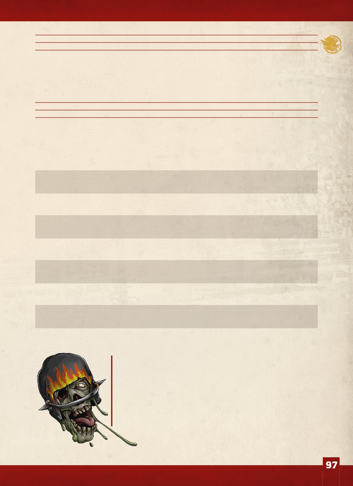DESPERATE MEASURES TABLE
>
D8 RESULT
>
1 *You Dope:* One of your players has been experimenting with
performance-enhancing potions. You may play
this Desperate Measure during Step 1 of the firrst Start of Drive
sequence of the game. Choose one player on
>
your team. This player has either their Strength or their Agility
improved by 1 for the duration of this game. However, when a drive in
which this player took part ends, even if this player was not on the
pitch at the end of the drive, roll a D6 for this player:
>
On a roll of 3+, the player feels amazing!
On a roll of 1 or 2, the player suffers a terrible allergic reaction
and must miss the rest of the match.
>
2 *Razzle-dazzle:* One of your players has been practicing hard for
the up-coming match. You may play
>
this Desperate Measure when you activate a player. This player may
perform two actions rather than
the usual one.
>
3 *Hangover:* One player on the opposing team has been out celebrating
the night before the match and turns up late. You may play this
Desperate Measure before Step 1 of the firrst Start of Drive sequence
of the game. Randomly select an opposing player. That player must miss
the firrst drive of the game.
>
4 *Grudge Match:* Your team has a long-standing and violent rivalry
with the opposition. You may use this Desperate Measure at the start
of one of your team turns, before any player is activated. For the
duration of
>
this team turn, your team may commit any number of Fouls, rather than
just one.
5 *Set Piece:* In preparation for the game, your team has been
practicing some set piece plays. You may play this
>
Desperate Measure when activating a player to perform a Pass action.
The pass is automatically accurate and (unless the pass is
intercepted) the ball is automatically caught.
>
6 *Sports Espionage:* You have hired a spy to steal your opponent's
playbook in order to give your team the edge. You may play this
Desperate Measure when your team suffers a Turnover. Using this
Desperate Measure grants your team a free team re-roll.
>
7 *Discarded Banana Skin:* Someone has been snacking on an
energy-boosting banana. You may play this
>
Desperate Measure when an opposing player enters the Tackle Zone of
one of your players. The opposing
player immediately Falls Over.
>
8 *Magic Scroll:* A suspicious-looking man from a betting syndicate
gives you a spell scroll prior to the game. You
>
might be suspicious, but you'd be foolish not to read it aloud
wouldn't you? Your team gains a single Hireling Sports Wizard
Inducement for free (see the *Blood Bowl* rulebook).
>
HACKSPIT QUILLCHEWER'S FUN FACTS
*Until recently, the record for Most Decapitations in a Single Match
was* *held for over a decade by Helmut Wulf. In a 2485 match against
the* *Champions of Death, he performed an impressive 22
decapitations.*
*This unlikely achievement was made possible by Tomolandry, who*
*kept repairing his players and sending them back to be decapitated*
*again! At full time, an enraged Tomolandry accused Wulf of
deliberately* *undoing all his hard work-work. Wulf famously responded
by advising* *the Necromancer to use wire instead of twine-twine!*
>
*BADLAND PATRI0TZ* *J0NATHAN TAYL0R-Y0RKE - G0BLIN TEAM*

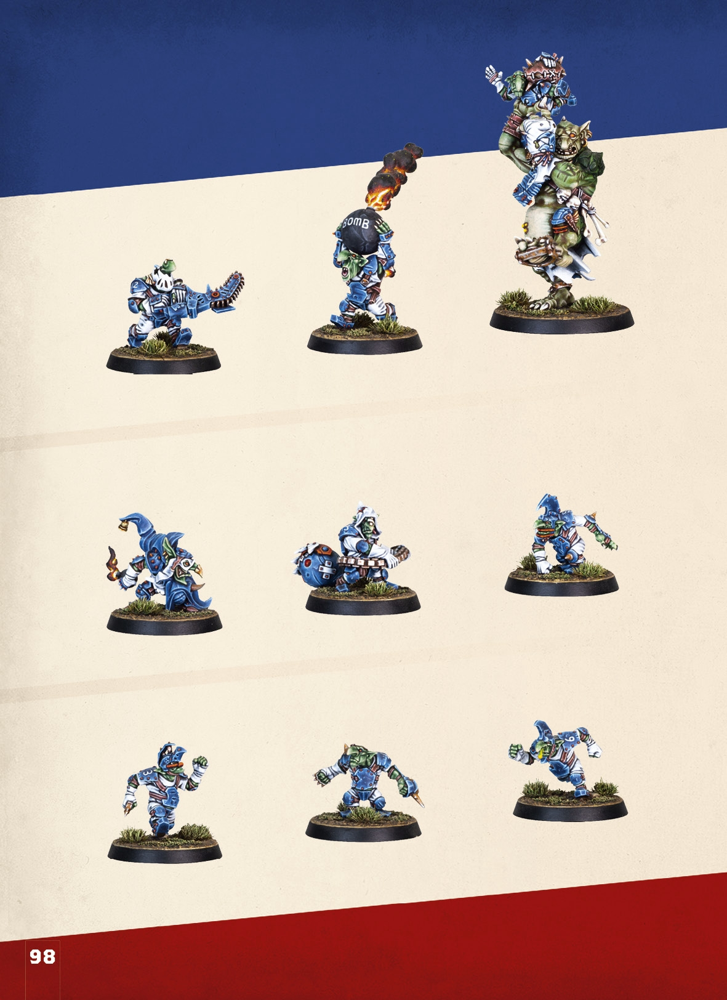

*'B00MER' BR0DY,*

*VINNY 'THE BABE',* *TRAINED TR0LL*

*'BUZZ-CUT' MCGINSTER,* *L00NEY*
>
*THE BLACK G0BB0,* *STAR PLAYER*
>
*'NIPPY' NANCE,* *G0BLIN LINEMAN*
>
*B0MMA*
>
*'SPINNEY' DEE-LITE,* *FANATIC*

*'H0USE' FUNGUSWINE,* *G0BLIN LINEMAN*

*'CAP'N' GEN0CHI0,* *G0BLIN LINEMAN*

*'RUSHING' TED R00SH,* *G0BLIN LINEMAN*

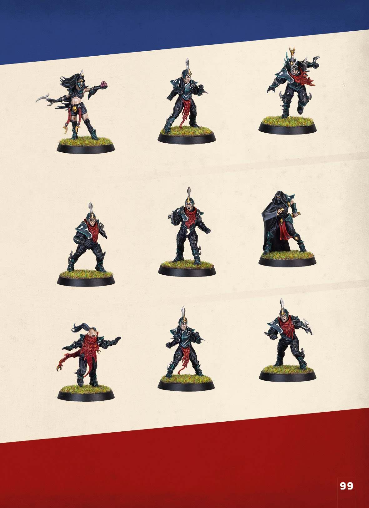

*SHIKHEN DUSKSTRIKER,* *WITCH ELF*
>
*MAKRE EMBERSHARD,* *DARK ELF LINEMAN*
>
*GARK0C SHAD0WWALKER,* *RUNNER*

*LETHESSE HAZEREAVER,* *DARK ELF LINEMAN*

*G0VR0GIS V0IDBANE,* *DARK ELF LINEMAN*
>
*VARA SHADEBREAKER,* *DARK ELF LINEMAN*
>
*KIVAK NIGHTBL00D,* *BLITZER*
>
*LULKIS DREADBLADE,* *ASSASSIN*

*TARGAR GL00MCLEAVER,* *DARK ELF LINEMAN*

*DEATHSTAR ASSASSINS* *JAMES KARCH - DARK ELF TEAM*
>
*THE C0RPSE CART CRITTERS* *MARK BEDF0RD - SHAMBLING UNDEAD TEAM*

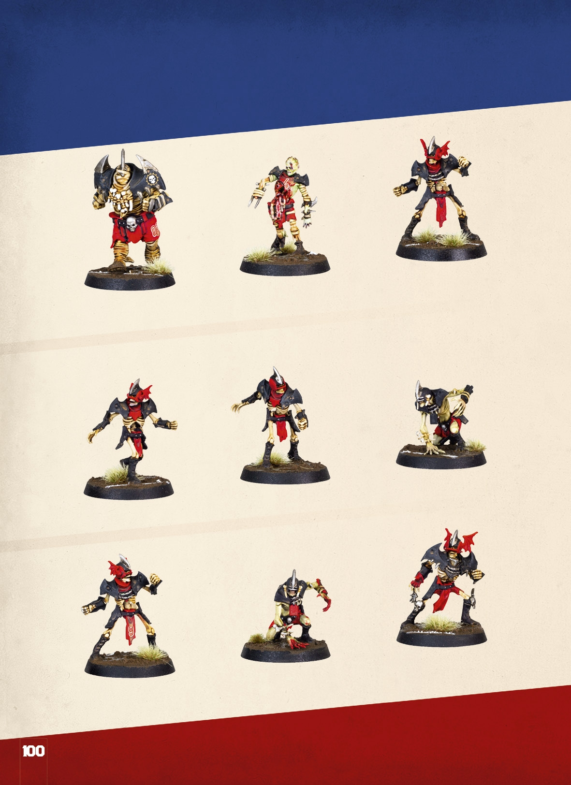

*HACK,* *SKELET0N LINEMAN*
>
*THE SHR0UD SHUFFLER,* *MUMMY*
>
*SLASH,* *SKELET0N LINEMAN*
>
*SHRIEK,* *SKELET0N LINEMAN*
>
*CAD'AVAR,* *Z0MBIE LINEMAN*
>
*RATTLE,*
>
*SKELET0N LINEMAN*
>
*NIGHTCRAWLER,* *GH0UL RUNNER*

*TEND0N CHEWER,* *GH0UL RUNNER*

*HUSK,* *WIGHT BLITZER*

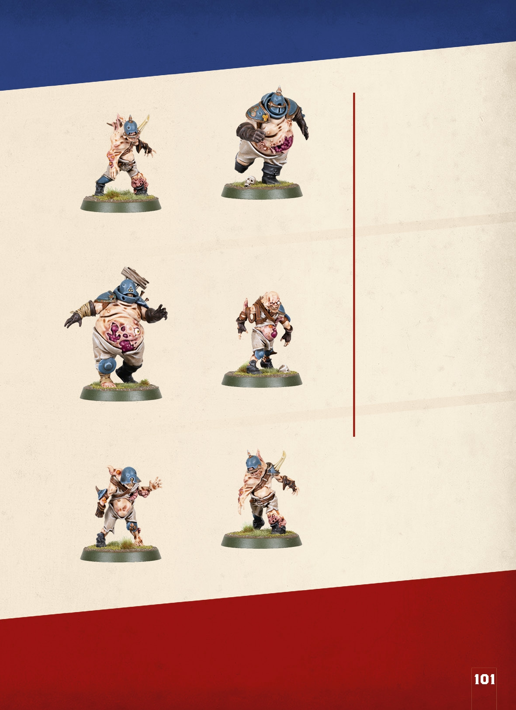

*FLESHR0T GL0PW00D,* *R0TTER LINEMAN*
>
*GLUTS0RE B0GWADER,* *BL0ATER*
>
*B0BBY THE B0IL,* *R0TTER LINEMAN*
>
*BILEGUT PUS-SPEWER,* *BL0ATER*
>
*PUSTULE THE GRIM,* *R0TTER LINEMAN*

*G0UTMULCH FLYSPUME,* *R0TTER LINEMAN*

HACKSPIT QUILLCHEWER'S FUN FACTS
*Did you know that many Chaos* *teams are 'owned' by Greater* *Daemons
that reside in a parallel* *dimension known as the Realm*
*of Chaos? Such teams invariably* *have a 'manager' who resides* *within
our mortal coil and handles* *the day-to-day business and* *financces!
Many have suggested* *that these daemonic owners*
*don't exist at all, but are merely*
*a creation of the team and a way*
*to avoid taxes!*

*One such example is the* *Plaguewrought Privateers, a*
*Nurgle team 'owned' by a Greater* *Daemon that resides in a region of*
*the Realm of Chaos known as the* *Marsh of Eternal Putrefacation.*
*No one believed this at all until he* *burst from the owner's box
during*
*a game in 2498, causing the* *stadium to floodd with foetid water* *and
the match to be abandoned!* *Coincidentally, a group of auditors* *sent
by the Graf of Middenland to* *investigate the team's financces* *was
washed away in the tumult!*

*PLAGUEWR0UGHT PRIVATEERS* *ANDREW KING - NURGLE TEAM*
>
*PUS-ST0RM BL0ATERS* *MARK BEDF0RD - NURGLE TEAM*

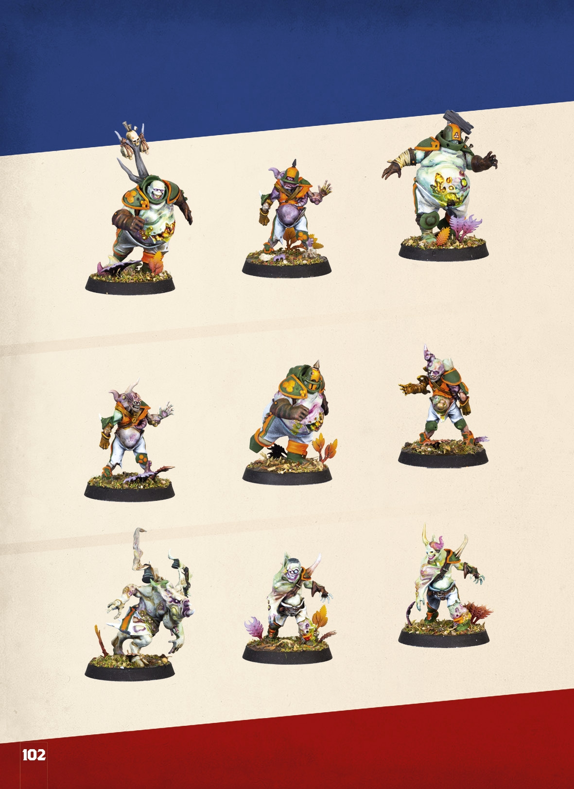

*KAT0R-RACT,* *R0TTER LINEMAN*

*R0N SID,* *BL0ATER*

*FEST0R BAD BREATH III,* *BL0ATER*
>
*B0B B0NICUS SPUME,* *R0TTER LINEMAN*
>
*GREG-G0RE RANK H00F,* *PESTIG0R*
>
*FECCULUS STY,* *BL0ATER*

*RUSTY CANKELSP0T,* *R0TTER LINEMAN*

*SC0TT SC0TT DANGLE R0TT,* *R0TTER LINEMAN*

*P0X MARX,* *R0TTER LINEMAN*

*JANS SKRrtDDERE*
*0F J0RVIK, HEAD C0ACH*
>
*KHRAG KURN0R,* *TR0LL SLAYER*
>
*'GR0UNDSKEEPER'* *KAR TH0RBJ0RN,* *DEATHR0LLER*
>
*SKAGIR GRIMS0N,* *DWARF BL0CKER LINEMAN*
>
*GR0MBRINDAL,* *THE WHITE DWARF,* *STAR PLAYER*
>
*ULF ST0NEHEWER,* *DWARF BL0CKER LINEMAN*
>
*GRIM IR0NJAW,* *STAR PLAYER*
>
*DHAN0N DWARGRIM,* *DWARF BL0CKER LINEMAN*
>
*TH0RS AL'HrtRT,* *AP0THECARY*
>
*KARAK WANDERERS* *J0NATHAN TAYL0R-Y0RKE - DWARF TEAM*
>
*THE FUNGITZ* *L0UISE SUGDEN - G0BLIN TEAM*

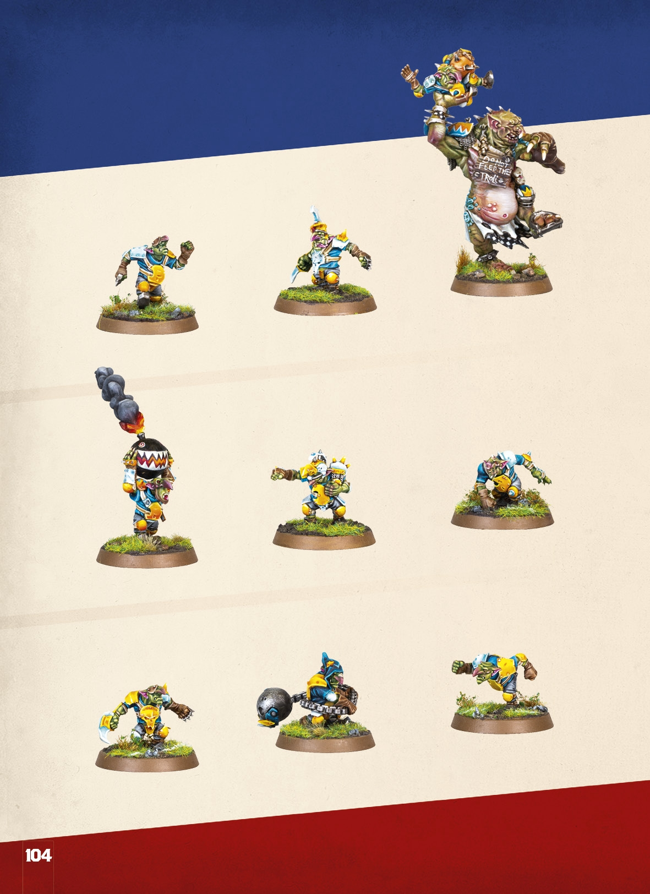

*NIBWIT SQUIGSMASHA,* *G0BLIN LINEMAN*

*G0RG0T GR0TSPLATTA,* *TRAINED TR0LL*

*SKABPATCH 'IMPACT0',* *G0BLIN LINEMAN*
>
*CHUCKA FIREGUTZ,* *B0MMA*
>
*SLASHER SPIDERSCUTTLE,* *G0BLIN LINEMAN*

*BITE 'N' FITE DRIXXLESPITE,* *G0BLIN LINEMAN*

*RUN,* *FANATIC*
>
*D0DGY GL0BZIG,* *G0BLIN LINEMAN*

*FLAILIN' FUNGI-M0SHPIT,* *G0BLIN LINEMAN*

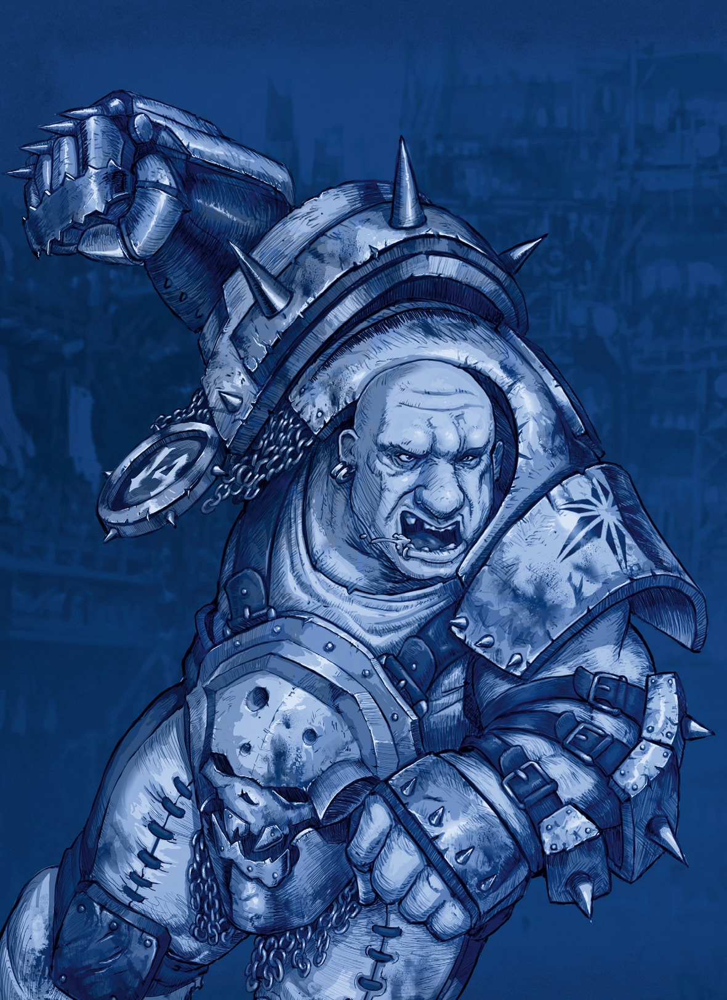

*STAR PLAYERS*

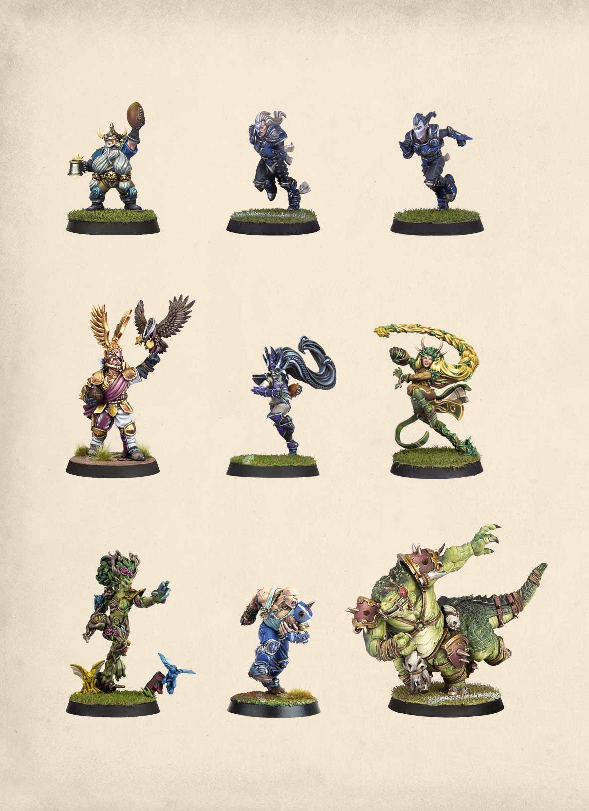

*J0SEF BUGMAN* *DWARF MASTER BREWER*
>
*(AND 0CCASI0NAL PLAYER)*
>
*GRIFF 0BERWALD* *HUMAN STAR PLAYER*
>
*WILL0W R0SEBARK* *DRYAD STAR PLAYER*
>
*VALEN SWIFT*
*ELVEN BLITZER STAR PLAYER*
>
*R0XANNA DARKNAIL* *DARK ELF STAR PLAYER*
>
*MIGHTY ZUG*
*FAN FAV0URITE*
>
*HUMAN STAR PLAYER*
>
*LUCIEN SWIFT* *'THE SILVER BULLET'*

*GL0RIEL SUMMERBL00M* *'THE FL0WER SPIRIT'*

*Z0LCATH THE Z0AT* *Z0AT STAR PLAYER*
>
*STAR PLAYERS*

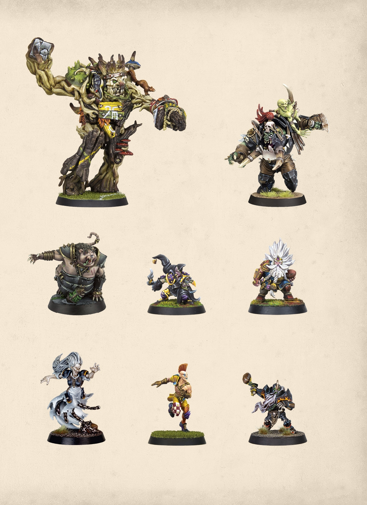

*DEEPR00T STR0NGBRANCH* *ALTERN F0REST TREEMAN*
>
*VARAG GH0UL-CHEWER* *BLACK 0RC BLITZER* *STAR PLAYER*
>
*GLART SMASHRIP* *FAN FAV0URITE* *FAT RAT*
>
*GRETCHEN WACHTER* *'THE BL00D B0WL WID0W'*
>
*THE BLACK G0BB0* *G0BLIN STAR PLAYER*
>
*ELDRIL SIDEWINDER* *SEA ELF STAR PLAYER*
>
*GR0MBRINDAL* *THE WHITE DWARF*

*SKRULL HALFHEIGHT* *SKELETAL DWARF* *STAR PLAYER*

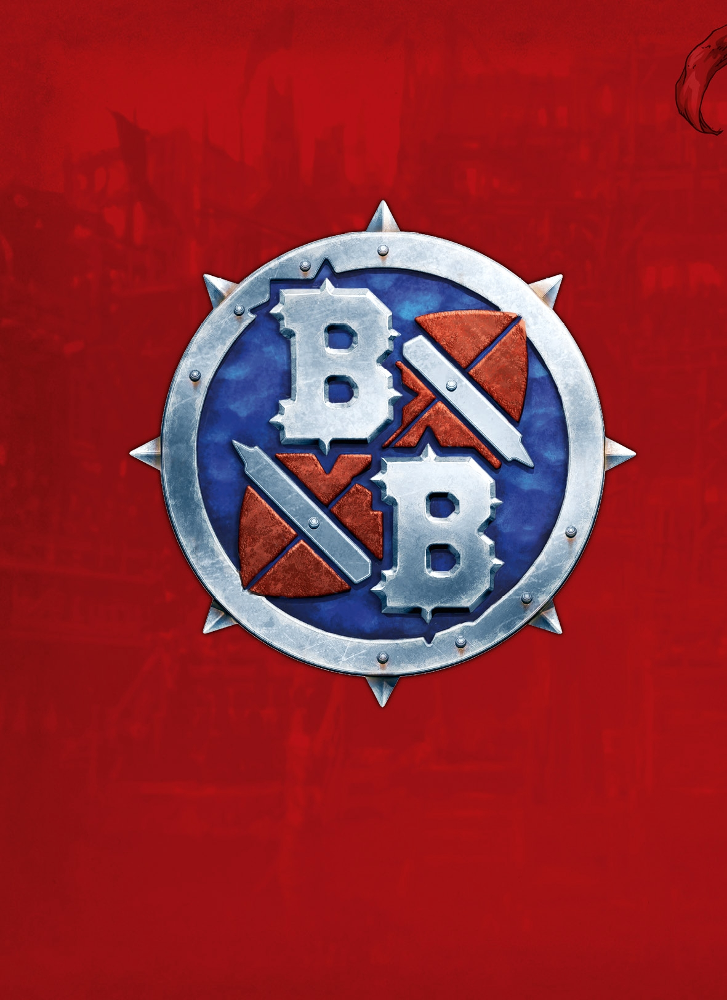

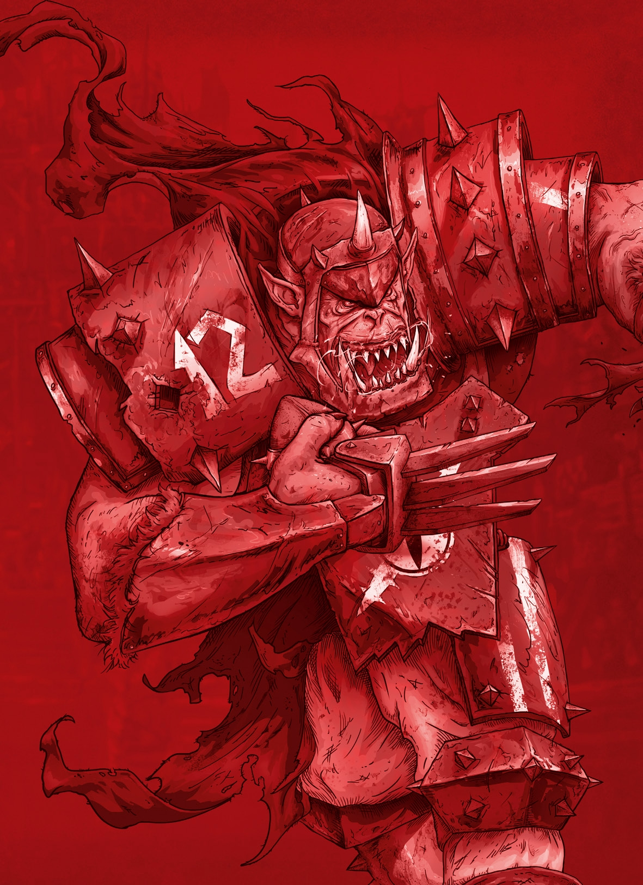

