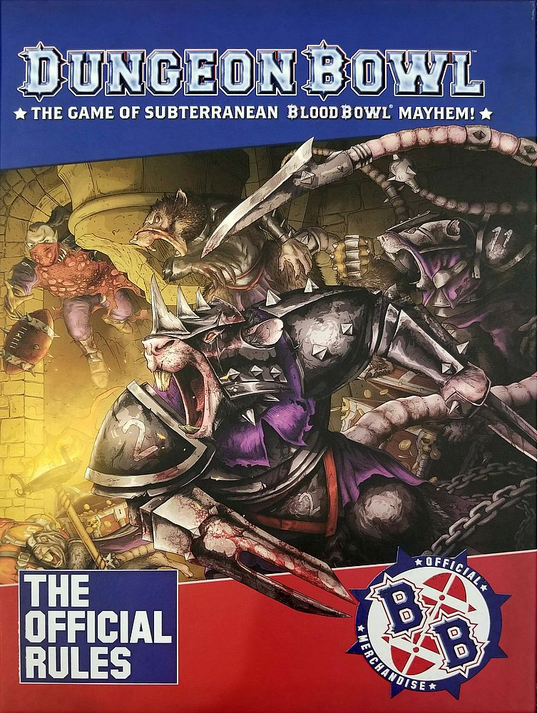
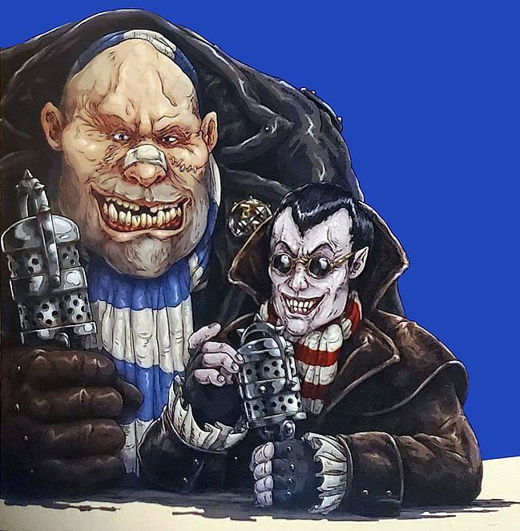

Welcome to Dungeon Bowl: the game of fantasy football with a twist!

In Dungeon Bowl, you take on the role of the head coach of your own team representing one of the eight Colleges of Magic, leading your side of violent and often insane maniacs to glory within the winding and treacherous pathways of the dungeon where the game is played. Earn glorious victories, defeat your rivals, and you may just receive the favour of the Magisterium of your chosen college!

In this book, you will find all the rules you need to play the wonderful game of Dungeon Bowl. If you have played Blood Bowl before, then many of the mechanics of Dungeon Bowl will feel familiar to you as the game is designed to feel as close to its parent game as possible - though allowing for a few necessary tweaks as the game is played not on a pitch in front of thousands of fans, but in a dark and twisting dungeon controlled by the Colleges of Magic.

So, put down those textbooks, grab those helmets, sharpen that spiked armour, and prepare your meanest game face - it's time to play Dungeon Bowl!

# GREETINGS SPORTS FANS!

* "Good evening! I'm Bob Bifford, and do we have a treat for you. For the first time in what feels like a lifetime we are bringing you the exciting, and frankly crazy, spectacle that is Dungeon Bowl! With me, as always, is my enigmatic co-host Jim Johnson. Evening, Jim!"

* "Thanks, Bob, and I see you are trying to expand your vocabulary. Well, ladies and gentlemen, it's been a long time since I've commentated on a game of Dungeon Bowl, where teams of rookies fight it out for the glory of their college, and to perhaps catch the eye of the scout of a Blood Bowl team. Magical phenomena, mindless violence, bad decisions, hilarious pranks - it takes me right back to my college days, Bob!"

* "I couldn't agree more, Jim - I certainly enjoyed my college years!"

* "I'll tell you what, though, Bob, college life certainly became a lot more interesting when the Magisterium of the Colleges of Magic decided to begin settling their disputes with their own brand of Blood Bowl rather than unleashing magical catastrophes upon the unsuspecting people of the Old World."

* "Right you are there, Jim! There is no other spectacle out there that manages to combine the thrilling and bloodthirsty sport of Blood Bowl with the unpredictable, and often rather lethal, nature of a dungeon - all with a sprinkle of magical mayhem thrown in! But that's Dungeon Bowl for you!"

* "I couldn't have put it better myself, Bob; and we are here to bring you the final of the 2500 Dungeon Bowl, live on Cabalvision for the first time in over two decades! The Blazing Axes of the College of Fire are set to take on the Umbral Blades of the College of Shadow in what Promises to be a masterclass in dungeon-based hijinks!"

* "Indeed, Jim. This is definitely going to be a game to remember!"

