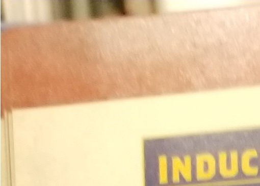

[\^HIIngstarted]

each participating coach needlfojE?\^\^

and submit a copy of their Team Draft list toThe I \^\^ °\" \^^16^
\'

**SEASONS ---**

'regular season' and the 'playoff seX\" X\" 7?\^\^\^ comes the
'off-season break' a ^e^°^d^ °
^each\ p,ay^'^off\ season^'

for the season ahead. Should the league commissioner XtZ " can re draft
an existing team as described on page
83.

If the league contains enough teams, the league commissioner may wish
to divide them into two, three or four divisions. Each division should
contain as equal a number of teams as possible, but a division should
have no fewer than four teams. The larger the divisions are, the longer
a season will last. The teams can be split however the league
commissioner decides, but drawing team names out of an upturned Dungeon
Bowl helmet (or similar receptacle) is most traditional. Once the
divisions have been split, the season can
begin!

**THE RE[GULAR SEASON]
------**

uring a season, each team plays two 'league fixtures against each
other

**LEAGU EFIXTURES--- ~t~---^the^**

~s~\^~m\ t0~ g~e~t their schedules to line
up.

gold pieces and may m
~the\ fu\|\|\ post~-game

After a league fixture has bee\^p\'\^-\^\^ described on ~e\ an~d
passing

sequence as ~outc~ome of the g

ShTleague commissioner. ,~he~ system -
j\^S\^

\^Che\^

\^League po''- J

**THE OFF-SEASON BREAK AND PF-[DRAFTING
TEAMS**

with a brand new team, many more like to develop a favourite team over
several season ■ building that team\'s legend over time and telling the
sto ' of fan favourites who dedicate their career to their tea The
following rules enable coaches who wish to re-dX team from one season
into the next to do so

**RE[DRAFTING] ---**

Between seasons, there is a period of downtime called the 'off-season
break'. Coaches and their players rest and recuperate, spend their
hard-earned gold, or go on elaborate tours to promote the latest edition
of their increasingly unbelievable
autobiographies.

After the finals have been played, any coaches who wish to re-draft
their team for the next season should get together with the league
commissioner and run through the following
steps:

\
]

2.  

[**R&R**During the off-season break, players have time to recuperate
from their injuries. Therefore, any players that suffered a Miss Next.
Game Casualty table result during the team's final game of the season
will recover before the next season
begins.]

3.  

[**RAISE FUNDS**When re-drafting, each team gets a Re-draft Budget of
1,000,000 gold pieces. This represents money doled out by the
Magisterium, generous patrons and college alumni. A team that is
re-drafting then adds to this anything they have left in their Treasury
from the previous season, after which their Treasury is emptied
(presumably having been used to cover the cost of the many
\'unexpected\' expenses that arise during the off-season break!).
Finally, a team that is re-drafting adds the bonuses listed
below.-

20,000 gold pieces for each game the team played last season (both
friendlies and league fixtures). +20,000 gold pieces for each league
fixture the team won last season.]

1.  
2.  
3.  
4.  

[***SCOUTING:*** Players may be scouted by Blood Bowl teams, and leave
the college for greener pastures - at least in theory\...***R&R:***
Players that would miss the team's next game recover.***RAISE FUNDS:***
Coaches calculate the funds available to them to re-draft their
team.***RE-DRAFT:*** Coaches complete their new Team Draft list for the
season ahead.\

League commissioners may, at their own discretion, place a cap of
1,300,000 gold pieces on the Re-draft Budget available to teams so that
no team starts the season with too obvious an
advantage.

During the off-season break, players that performe we across the season
may be scouted by major Blood teams, sign a lucrative contract, and
leave their co eg to seek their fortune in the big leagues. During this
s \'oil a D6 for any players on your roster that have received any MVP
awards. On the roll of a 6, player has been scouted and joins a Blood
/

\^owl team. As compensation, your Dungeon C \^°wl team gains an
additional 20,000 \\

\^\'d pieces when they Raise Funds.

]

4.  

[***RE DRAFT ---------***~On~\^e the Re-draft Budget available has been
worked out, the team can be re-drafted. A few key players will be able
to return to the dungeon for the new season, whilst others will find
themselves unceremoniously dropped and replaced with eager rookies to
keep costs down. Those players that are dropped usually have the good
grace to disappear quietly, either graduating, joining another team for
their college, or realising that their dreams of glory simply won't
happen, before joining a Blood Bowl team as sideline
staff.

To re-draft your team, use a new Team Draft list and create a brand new
version of your team using the Re-draft Budget available, as described
on page 83. The following rules apply-.]

-   
-   

[Team re-rolls may be carried over from your previous Team Draft list
at the cost shown on your team roster, or they may be let go.As well
as hiring new players from your team roster, you can re-hire players
from last season's Team Draft list. Players can be re-hired by paying
their Current Value as shown on last season's Team Draft list, plus an
administrative fee of 20,000 gold pieces for each previous season the
player has taken part in.Simply copy the player\'s entire profile
across from your old Team Draft list, including any Niggling Injuries,
any characteristic reductions and any unspent Star Player
points:]

-   

[If the player has any Niggling Injuries, roll a D6 for each:- On a
roll of 4+, some rest and relaxation has worked wonders. The Niggling
Injury you are rolling for is removed.

On a roll of 1-3, the player's injury has not yet fully healed. The
Niggling Injury being rolled for
remains.

\

***RE-DRAFTING TEMPORARILY [RETIRED
PLAYERS***

Additionally, players that temporarily retirecTdiirmgThe " last season
can be re-hired as described previously by paying the cost shown for
them on that season's Team Draft list. Hopefully, the time off has
helped them to recover from their
injuries:

• After the player has been re-drafted, roll a D6 for each
characteristic reduction they have
suffered.-]

-   
-   

[On a roll of 4+, some time off and some intensive therapy has done the
job and the characteristic is restored. However, such injuries often
leave their mark and the player will gain a Niggling Injury.On a roll of
1-3, the player's injury has not yet fully healed. The characteristic
reduction being rolled for remains.Note that if the player has suffered
more than one characteristic reduction, you should roll for each
separately.

**STA[RTING A NEW SEASON**

**fter** the excitement of the play-off season and the thrill of the
finals, the obvious question from most coaches is: when's the next
season starting?

The answer, as ever, is up to the league commissioner. Starting a new
season is as easy as following these three
steps:]

-   
-   
-   

[The league commissioner establishes who will be taking part in the next
season. This is a good chance for coaches to step down from the league
if they're struggling to find the time to play, and it's an ideal
opportunity for new teams to join in the fun.Each coach who is taking
part in the new league season submits a Team Draft list.Teams are
divided into divisions (if necessary) and dates are set. The season
begins anew!

***U--- nfortunaU not everyone is able to commit to the time
reouir«f~(n~, c Coaches may not live close to their gaming friends,
worked** fam , t \^^18^\*\*\' **contrive to keep us away from our hobby,
meaning that often we al\^, \^ \"\*\* occasional stand-alone game when
time permits. Such stand-atore games am L "!£"\*\* "\* ga\^\'- \^2S \^ "
^n^° ?"" ^to\ miSS^ "\* " \"\* \^ \<" ™\"Y aspects tf to £™ \^^ibifiOn^
appear to be designed for league play; it is possible to create teams
for exhiWfion** gamJX\^. .an. **extra Skills, characteristic
improvements and access to weird and wonderful Induremeto tom** is a
**~M~ of fun to be had in creating a team for an exhibition game,
deciding what will be included and X will be left out, choosing Skills,
creating names and backstories for to players, and so
on.***

**DUNGEON BOWL EXHIBITION PLAY
RULES**

**The following pages offer a set of guidelines for creating exhibition
play teams. Coaches who wish to use these rules for a game should decide
between themselves on the details. This section also aims to provide
guidance to anyone wanting to run a Dungeon Bowl tournament, as these
rules will help create more interesting teams for participants to use,
which in turn will enhance the experience for everyone
involved.**

**DRAFTING AN EXHIBITION TEAM**

**his section deals with how to create a team for an exhibition game.
For the most part this is exactly the same as creating a team for a
league, right down to using the usual team rosters and completing a
Team Draft list. However, there are some distinct differences to be
aware of:**

~~\^iWo\^Sn\^.\^hes should have mo~~re gold in their Team Draft
Budget, ailowing them to include more of \~ the options that normally
only become available later on in a
league.

The Team Draft Budget for exhibition play should be ^somewhe^\^ or
tournament

We have found that 1,150,000 gold pieces is an ideal size. Large P
~force\ hard\ chojces\ t0\ be\ made~ organisers wish, but it is worth
bearing in mind that sma er ea having troth as it adds to
the

Sometimes, having to choose whether to include one thing or the other
rs better challenge of the experience. . ..
~o~

, ~am~ is drafted for exhibition play, all of the gold pieces m the
Team However, it is important to note that when a
te

Draft Budget must be spent. Any gold pieces not spen a Inducements
purchased.

A Team Draft list will need to be completed forI\^X\^ » mX\'r ePP-nts
can see cieady what This is especially important when attending a
ung

roster

--- \'\^drafted for exhibition play- should select ^their^ \" from
theTeanf Draft Budget and make a

\^tails all of the players available to a team their
firing

I \^ players you want to permanently hire for your team,
P

^r^ecord of the player on the Team Draft list. allowed by the team ros
er.

a certain type than ar

**\^EHASiNGTEAOERO\^\^ ~u~\^** team
re-7\^\^ \^ \^

Any team drafted for exhibition play can P drafted, for the c \*^v^ery
team may buy 0-8 team re-rolls when it is ^Te^am Draft
Budget.

**ZiiTi EXHIBITION PLAY \^'e gold Plw« In '\^ ™^m^ \^\^ 0 fS must \*
spent when ^dr,ftln\|^\' T**

**of 11 players.**

**Inducements purchased in this way should be recorded on the Team
Draft list.**

It two coaches are drafting teams for exhibition play between
themselves, they should take a few minutes to discuss Inducements first.
It is important to decide if there are any Inducements they feel should
be included or any they would prefer to leave
out.

Tournament organisers should decide which, if any, Inducements will
be allowed and ensure this information is passed on to
participants.

\

**PLAYER ADVANCEMENT IN EXHIBITION
PLAY**

**Unlike games played In a league, exhibition \^ are not linked,
Therefore players will not have the opportunity to earn and spend Star
Player point/ In the same way, However, teams drafted for exhibition
play should Include more than just rookies - having a few players with
an extra Skill or two makes for a more Interesting game, To allow for
this, exhibition teams are granted a number of SPP to distribute between
players, meaning that some players can be given advancements when the
team Is drafted.**

**FREE SPP** How many SPP coaches have to distribute
between their players varies. For example, you could grant each team 36
SPP to spend on advancements; this is a fair number and allows a good
selection of advancements across a team.

However, this is only a guideline, and the number can be increased or
decreased as desired. More SPP will enable more player advancements,
fewer SPP will obviously allow for fewer player
advancements.

If two coaches are drafting teams for exhibition play between
themselves, they should take a few minutes to determine how many SPP
they will have first. Tournament organisers should decide how many SPP
participants will have and ensure this information is passed on to
everyone.

