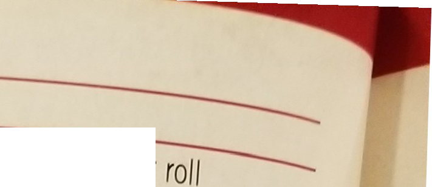

**Simply put, a game of Dungeon Bowl is
a c sS and thrilling affair, filled with all kinds of ma fue T3t
has become synonymous with the gam  x®ars; To make sense of
all of the action, the gam® *i* whiekP 'S ken down into a
series of team Wr ' tjme- j in x5. eac coach will
activate their players one gaui« । is Wfy' e rama and
outright madness of reated in a manageable and controlled
way-**

[Te«m turns]

\<* the teams have been set up and the coin W\
determined which team has the first turn, the g s\
will alten!inUeS 'n a simP,e sequence of turns in w 1
nedf\

[]MOVEMENT

***During their team turn, a number of actions allow a player to move
throughout the dungeon when activated, as mentioned previously.
Sometimes a player may even be moved involuntarily as a result of a
block or another in-game effect. This section deals with how players are
moved around the dungeon and how other players, particularly the
opposition, can hinder their
progress.***

**[moving]
players**

W][hen a player moves, they may move a
number of squares equal to their Movement Allowance (MA). A player may
move in any direction: forwards, backwards, left, right and diagonally,
into any adjacent, unoccupied square.

Moving players are not obliged to use their full -?WmeKt
lowance and W ™ve zero squares should they wish. Players cannot
move through the walls of the dungeon or impassable
features.

\

**STANDING**

A Prone player can do nothing // '-

A Prone player can stand up wher, tr e-y perform any action that
includes moveme't]

-   

[The only time a Prone player can stare , their team turn, at the
start of their acti/atoStanding up costs a Prone player three their
Movement Allowance.If a Prone Player with a Movement Allowance of less
(before or after modification) wishes to st-rr roll a D6:- On a roll
of 4+, the player is able to stand up, using their full Movement
Allowance to do so.

- On a roll of 1-3, the player is unable to right themselves. They
remain Prone and their activaf ends. This does not cause a
Turnover.]

[A Prone player with a Movement Allowance *of 2 :* less (before or after
modification) may Rush after standing up.If a Prone player is not
activated during their team turn, they will remain Prone until *they are
activated* in a later turn.**OCCUPIED
SQUARES**

' ''" ' a standing. Prone or Stunned player froTTthT team m a
square, that square is said to be 'occupied sqTe The baU  'nt
r 'hrU8h a" square. The ball can never come to
rest

Standing playeT UnCCUpied square or is caught by
a

***PCjPiEDSQyAREs***

square that is adjacenUt™™ 'nt a"y unoccuP'ecl Payers can
occupy a square ®qUare th®V Ccupy- Only or a trapdoo 0"\*
the

\

***RUSHING** 3*

Whenever a player performs any action that includes movement, they may
attempt to gain an extra one *or two* squares of Movement Allowance.
This is called 'Rushing These extra squares of Movement Allowance may
be used to move, to perform a Block action as part *of a* fr­action (see
page 51), to Jump over a Prone or Stunned player (see page 37) and so
on, just as if they were normal
movement:

At the end of the player's movement, declare that. will Rush and
move them one more square.

After the Rushing player has been moved, roll
a

On a roll of 2 + , the Rushing player moves without
mishap.

On a roll of 1 (before or after modification). Rushing player trips
and Falls Over as deson Page 13.

If the Rushing player is still Standing after nce, they may attempt to
Rush a second time the same process.

es

When a player is Rushing, the D6 roll cOf *odge'* any other
rolls that may be required, be they Pick up the ball or anything
else.

**MARKED PLAYERS**

**AND DODGING**

If an active player is being Marked, as described on page 12, by one or
more opposition players, they must 'Dodge' in order to vacate the square
they currently occupy and move safely into another, otherwise they will
be tackled and will Fall Over in the square they wish to move
into.

To Dodge, a player must test against their Agility as described on page
15. Declare that the player will Dodge from the square in which they are
being Marked, and move them into any adjacent, unoccupied
square:

* The Agility test is made after the bodging player has been moved,
Rushing first if necessary.

No matter how many players were Marking them, the dodging P'ayer is
only required to make ne Agility test to
Dodge.

If the dodging player is being Marked in the square they have 10ved
into, apply a -1 modifier Per Player Marking
them.

Note that if the player is Open into 6thqUare they have moved
,wXXdi,iers k d' However,
there

asSki,lsa"d™\* y an opposition
player.

**?n®®ers; ---**

'■ ' pen does not need

,rom square t0

™y move "''thoffrethat is

nJ"8 Marked P , " play®rs and 'Pidyerin ern in turn.
The h7Cor,tinue   stop moving
8"Sd««bM\*e.

**O**nce per team lum, ao [highly., r] a single
Standing or Prone player on the active team may be activated to perform
a Blitz action.

When a player Blitzes, they may move exactly as described in this
section; standing up and dodging as

necessary, and they may attempt to gain extra squares of Movement
Allowance by Rushing. In addition, they may perform a Block action (or a
Special action granted by a Skill or Trait that can be performed instead
of a Block action) at any point before, during or after their movement.
The only notable difference is that when a player Blitzes, performing a
Block action (or a Special action granted by a Skill or Trait that can
be performed instead of a Block action) costs the player one square of
their Movement Allowance. When a player makes a Blitz action, they must
nominate the target of the Block action before the player undertaking
the Blitz action is moved.

Block actions and Blitz actions are covered in greater detail on page
51.

\

**piCiUNLy**

moves into a s .are in which ■ the ball is placed, they must attempt to
pick it up. I This attempt to pick up the ball is made after any dice
rolls required to Rush, Dodge or Jump into the square have been made,
but before any other dice rolls are
made.

To pick up the ball, a player must test against their Agility as
described on page 15:

If the player is Open when attempting to pick up the ball, there are
no modifiers to apply.

If the player is being Marked, apply a -1 modifierper player Marking
them.

If a player attempts to pick up the ball and fails, the ball will
bounce as described on page 11. Should this happen, a Turnover is
caused, even if the bounce is caught by another player on the active
team.

After successfully picking up the ball, the player may continue moving
if they wish and if they are able.

Note that should a player ever be moved involuntarily j into a square
in which the ball is placed, they cannot attempt to pick it up. Instead
the ball will bounce, but no Turnover is
caused.

[]PASSING THE BAU.

***Hen in a game of Dungeon Bowl, players I will throw the ball to each
other In order W to move it quickly around the labyrinth of corridors
and rooms - after all, the ball travels faster when thrown than by a
player running with it! Throwers endeavour to pass the ball safely to a
team-mate, avoiding the walls and low ceilings of the dungeon, who is in
a better position to run with the ball into the opposition I end zone
room, or at least try to find it!***

**PASS ACTIONS**

O][nce per team turn, a player on the
active team may perform a Pass action in order to pass the bali to
another square. This target square may
be

occupied b a Standing. Prone or Stunned player (from either team)
or it may be unoccupied.

A Pass action can be further defined as being a ■Quick oass' or a
'Short pass' based on the range as described
opposite.

\

**MEASURE RANGE AND DECLARE TARGET
SQUARE**

O][ner you IldVr d( IlV.ilcd ,i
phyur

Hui they will perform u fMss action, */\<m
w.*

Io measure Ilie mope between the- pla/or wj any possible Lirgel squares
whenever you wish, even Interrupting Ilie player's movement to do
so.

***MEASURING RANGE***

Range is measured by placing the circle at the *end of* the range ruler
over the centre of the square occupied by the player performing the
action. The other end of the range ruler is positioned so that the ruler
covers the target square, with the line along the centre of the range
ruler passing through the centre of the target square.
The

target square will fall into one of the four bands marked on the range
ruler:]

[***I:*** Quick pass//: Short pass***Ill & IV:*** This is too far for
a pass in the depths of the dungeon; the low ceilings won't allow the
ball to gab enough height to be passed this
far.

The player may move before performing the action fo lowng all of the
normal movement rules, but once the pass has been resolved they may not
move further and their activation comes to an end. The player performing
the action does not need to be in possession of the ball when activated,
they may pick the ball up as they move see page
38):

\

Any squares that are in ranges III, IV, beyond the reach of the range
ruler, or that are intersected by the end of the range ruler are out of
range and cannot be the target square. If the line between two range
bands intersects the target square, it is considered to fall within the
higher range band. If it is not clear which range band the target square
falls into, refer to the Passing Range ■ shown
below:

]

-   

[*measure range and declare target square-* ■ 6 range
ruler ,s used to measure the range to any ' Poswe target squares, before
the targets quae chosen and declared. H*' ''Ey.-* The coach
of the player

*' ZZ'Unless ,he ®*

to .htXTX *ZZ ™v \**able ,0*

« totera.pt. ,t PaKi '"S to
'Deflect'

*RtSOLVf PASS ACTION-*

' "".' mtertww\*, " P'SS Was
"er

O with, the pass itself
is rasoivedi

**D ? Ci A R E TA RG ET S Q UARE Z**

After you have measured for range and  you must indicate and declare
which square  y target square. The target square may be Zr
tear'!1 Standing, Prone or Stunned player (from eit may be
unoccupied.

*II*

**TEHIORALCURACY**

he player performing the action now tests against their Passing Ability
to see if the pass is 'accurate' 'inaccurate', 'wildly inaccurate' or is
'fumbled' A Passing Ability test is made as described on page 15
applying the following modifiers based on
range:

***INACCURATE PASSES***

If the Passing Ability test is failed, the pass is inaccurate and the
ball will scatter from the target square before
landing.

*What do you mean the lame ended yesterday? We've been scouring every
meh of that dungeon for the Pt 24 hours in search of
bail'"*

**I *Bjorgen Ragebeard after being told*  n the *Emerald
Crusaders had found " hub* and jcore£ f)e *previous
day.***

**PA[SSING INTERFERENC]E**

I][f the pass was not fumbled, a single
player from the opposition team may be able to attempt to interfere with
the pass, hoping to 'Deflect' the pass or, in some rare cases, to
'Intercept' the pass. To determine if any opposition players are able
to attempt passing interference, place the range ruler so that the
circle at the end is over the centre of the square occupied by the
player performing the Pass action.

Position the other end so that the ruler covers the square in which
the ball will land. Note that, depending upon the Passing Ability
test, this may not be the target
square!

To attempt to interfere with a pass, an opposition player must
be:]

[A Standing player that has not lost their Tackle Zone (as described
on page 12).Occupying a square that is between the square occupied by
the player performing the Pass action and the square in which the ball
will land.In a square that is at least partially beneath the range
ruler when placed as described above.

\

**SUCCESSFUL PA]SSING
INTERFERENCE**

If the Agility test is passed, the player's attempt io interfere with
the pass has been successful and the pass has been 'Deflected'. The pass
is interrupted and the action immediately
ends.

The player that made the Deflection must now attempt to convert that
Deflection into an 'Interception'by catching the ball as described
opposite. If they do, they have made an Interception. If the player
fails to catch the ball, it will scatter from the square they
occupy.

Following any successful passing interference, if the ball comes to
rest on the ground in an empty square or in the possession of a player
from the opposition team, a Turnover is caused. If, however, the ball is
caught by a player on the active team after scattering, no Turnover is
caused.

**RESOLVE PASS ACTION**

I][f the pass was neither successfully
interfered with nor fumbled, the pass itself is now resolved. Where the
ball lands is determined based on the result of the Passing Ability test
as described previously. If the ball lands in a square occupied by a
Standing *player that* has not lost their Tackle Zone, that player must
attempt to catch it, as described opposite. If no player on the active
team catches the ball after a Pass action and *the* ball comes to rest
on the ground or in the possession *of a* player from the inactive team,
a Turnover is caused.\

**CA[TCHING THE BALL**

T][" here are many instances when the
rulesF call upon a player to attempt to catch the ball. A player that
is able to catch the ball must attempt to do so, even if their coach
does not want that player to catch the
ball!

To catch the ball, a player must test against their Agility as
described on page 15, applying the following
modifiers:

\

**THROWING THE BALL AT THE WALL**

S][ometimes a player will purposefully
throw the ball at a wall in order to try to have it ricochet off into a
far more advantageous position.

A player that declares a Pass action may also declare that they will
bounce the ball off the wall instead of passing normally. Declare which
wall square the ball is being thrown at, and test for accuracy as
normal. This Pass may be interfered with as
normal.

**[Hand-off]
---------**

I][n addition to performing a Pass
action, one team turn a player on the active team may \$ a Hand-off
action and simply hand the a landing team-mate in an adjacent
square.

may move before performing the Hand-off aC ' once e tollowing
all of the normal movement rules, action has been made and the ball
hande o capnot ate, their activation comes to an end an jng
the

move further. As with passing, the player per 
e

'"'and-off action does not need to be in PosS move when
activated, they may pick it up as Page
38).

and there is  Hand-off action is not a Pass action, j even a
test required to perform the action i se  aCtlon. Hayer with a PA
of '-' may perform a ,& t0 be he Player performing the action
simply me balk Possession of the ball. The player rece  aS owever,
must test against their AgiP'V Scribed
above.

\

If the test for accuracy is successful, the ball will ricochet from the
target square. If the test is failed, *roll* a D6. On a 1-3 it hits the
wall square to the right *of the* target square; on a 4+ it hits the
wall square to the left of the target
square.

The ball will then ricochet as shown in the *diagrams* below. It will
then travel D6 squares in the *direction* indicated, and if not caught
it *will scatter once from the* square where it ends up. If the ball
hits *another wall then* it will ricochet off it. Any *and all players
that the ball passes over may attempt to catch the ball, in the order
that the ball passes over them, counting as an inaccurate pass.* Unless
the ball is *caught by a player on the active* team, there will be a
Turnover.

**THROW TEAM-MATE ACTIONS**

er learn turn, instead of performing a Pass action,
a

the active team with the Throw Team-mate trait can attempt to o, U
a team-mate with the Right Stuff trait as if they were a ball.
The

 nf Throw Team-mate action may be occupied or unoccupied ':Z '
X"rther defined as being a ■Quick ThroW or a Short [d h
k] d nn the range - much like a Pass action. Unlike a Pass
action. hoXer a Throw Team-mate action that is not fumbled win always
scatter before landing.

If the player to be thrown is Standing, they can attempt to land safely
after being thrown (see page 46). If they are Prone or Stunned, they can
still be thrown but cannot land safely.

The player performing the action may move first following all of the
normal movement rules, but must be in a square adjacent to the player
they wish to throw when the throw is made; they cannot pick up and carry
a team-mate before throwing them. Once the throw has been resolved, they
may not move further and their activation comes to an
end:

***MEASURE RANCE AND DECLARE TARGET SQUARE:*** The range ruler may e
used to determine the range between the throwing player and any
possible scfuares' before the target square is chosen and
declared. ***n T FOR QUALITY:*** The coach of the player performing
the action rolls a to determine the quality of the
throw.

d ***THROW:*** Where the thrown player lands, and how easily, pen s
upon the quality of the throw. If the throw is fumbled, the
thrown

Player is dropped and will bounce.

**DEnan AND**

***H "ISQUARE **

1 aCt'n' once \*be player performing the Throw
Team-

4 4 to measur een act\*vated and the action declared, you are -■
squares whenever6 6 g6 between the Player and any possible
target do so. U Wlsb, even interrupting the player's movement
to

***MEASURING RANGE***

When throwing a team-mate, range is measured using the ral
ing3 as described on page 40. Like when making a Pass action, w
combin team-mate, only half of the range ruler is used - the low cei
with the general heft of the player being thrown makes long 1 ba(1ds
impossible. Therefore the target square will fall into one of t marked
on the first half of the range ruler:

**** I:*** Quick throw\
***II:*** Short throw

or that are Any squares that are beyond the reach of the range ruler
car-\* intersected by the end of the range ruler are out of
rane eCts the target square. If the line between the two range
bands in । range square, the target square Is considered to be
within the , refert0 If it Is not clear which range band the target
square falls 1 Throw Range chart shown on page
45:

thro\*5

tar

03'

**DECLARE TARGET
SQUARE**

Once range has been measured and the player performing the action has
completed their movement, the target square is declared. The target
square must be in range and may be occupied or
unoccupied.

**O**nce the range has been measured and the target square declared, a
Passing Ability test is made to determine if the throw is 'superb',
'successful', terrible' or is 'fumbled'. The player performing the
action makes a Passing Ability test as described on page 15, applying
the following modifiers based on range:

\< Ability test is passed, or if the roll is a ' 6, the throw is
superb. After scattering, the player will find it easier to
land.

* SESS?!

** ' i* test is failed, the throw is
still

rV'i/' ottering, the thrown player will find
if

When a Throw Team-mate action is fumbled, the action is unsuccessful
and the activation of the player performing it ends immediately. The
player that was to be thrown is dropped and will bounce (as if they were
a ball) from the square occupied by the player performing the action,
after which they must attempt to land, as described on page 46.\

**L[ANDING**

f the thrown player was Standing and had not lost their Tackle Zone
before they were thrown, --- and if the player lands in an unoccupied
square, they will attempt to land safely. To land safely, the thrown
player must pass an Agility test, applying the following
modifiers:

If the Agility test is failed, the thrown
player will land badly and is considered to have moved involuntarily.
The thrown player will Fall Over, as described on page 13. If the thrown
player was in possession of the ball, a Turnover is caused. Otherwise,
no Turnover is caused.

\

**LANDING IN AN OCCUP]If
JA 3.**]

-   

[The player occupying the square s' oc  (an Armour roll and
possible -.-;. roil s -ar­them even if they were already Prone or
\$*--The thrown player will bounce as if they fe a from the
square they land n arc [a] automatia Fall Over upon
landing, as described on page 13Should the thrown player bounce into
another occupied square, the above process is repeatec.Once the
scatter has been resolved, the players: bounce (as if they were a
ball) from the square they land in.

The player will automatically Fall *Over after bounds* and an Armour
roll and possible Injury roll is made against
them.

**ffiNGTHEWALL**

Should the thrown player scatter into one of *the dungeon* walls, they
risk a serious *injury. The player will suffer a* Crash Landing as
described above. *Additionally, when* making the Armour roll for a
player that has *hit the wall apply an additional +1 modifier to the
roll.*

**I wouldn't go in that *room if* I was them; the *College of Firs*
hasn't fed their *Dragon in weeks in Preparation for this
game!"***

*Dungeon Son'/ commentator Otto Ott watching the final moments
ofr Goblin's*

KiS

**block actions**

W][hen a Standing player is activated,
they can immediately nominate a single Standing opposition player that
they are currently Marking and declare that they will target them with a
Slock action. Unlike other actions, there is no limit to how many
players may perform a Block action each team
turn.

If both players have the same Strength characteristic, after
modification, one block dice is rolled.

If one player has a higher Strength characteristic, after modification,
a pool of two block dice is rolled and the coach of the stronger player
selects which result to apply.

If one player has a Strength characteristic that is more than double
that of their opponent, after modification, a pool of three block dice
is rolled and the coach of the stronger player selects which result to
apply.

- player performing a Block action cannot move or after, and Prone
players cannot stand up and ■:rm a Block action. However, if the
target of the action is 'pushed back' into another square, the ayer
that made the action may 'follow-up' into the uare vacated, carried
forward by the momentum of attack.

**STRENGTH**

Block acbon and nominated their target, the next thing to do is Io
compare the Strength characteristic of both players, including any
Strength modifiers granted by Skills or Traits or offered by 'assists'
from team-mates (see page 48). If one player is stronger than the other,
they are more likely to knock their opponent
down:

- Per team turn, a single player on the active team :ka
3 BlltZ action- A Blitz action combines
a

Ur'n ' a Ove action. A Blitz action may
be

V a Prone player.

\* Page 4g?ns are reslved using special block dice '-'
w many block dice are rolled and

' the result to apply is determined

' With th e player Performing the Block
action

'  the B( Strength of the player that is
the

[blocking]

**■■ t its most basic, a block is a very rough H tackle. The rules of
Dungeon Bowl allow players to do almost anything to bring down an
opponent, and provided weapons aren't used, the officials rarely make
any distinction between a skilled tackle and a frenzied rain of
pummelling blows that leave a player unconscious. This is part of the
game's charm. After all, who wouldn't want to watch a violent, full
contact blood sport that happens to include some ball related
drama!**

**ASSISTING A [BLOCK**

--- Slrength characteristic of the player that is performing the
Block action, or o' : i, ■ the Block action, can be modified by assists
offered by team-mates that are in a posh or- ti two or more players can
gang up on another. There are two types or assist ' ■ * be
c

and 'defensive'.

**OFFENSIVE ASSISTS**

An offensive assist is when another player on the active team, a
team-mate of the player that is performing the Block action, is able to
assist. To offer an offensive assist, a player must be Marking the
opposition player that is the target of their team-mate's Block
action.

\

**DEFENSIVE ASSISTS**

A defensive assist is when another player on the mact team, a team-mate
of the player that is the target of a Block action, is able to assist.
To offer a defensive assist, a player must be Marking the opposition
player that is performing the Block action against their
team-mate.

A player cannot offer an offensive assist if they are being Marked by
any opposition player other than the one that is the target of their
team-mate's Block action. A player cannot offer an offensive assist if
there is a wall directly in between the player and the target of their
team-mate's Block action.

\

A player cannot offer a defensive assist if they are being Marked by
any opposition player other (han *the one* that is performing the Block
action against their team­mate. A player cannot offer a defensive assist
if there is a wall directly in between the player and the opposition
player performing the Block action.

Each offensive assist counted modifies the Strength characteristic of
the player performing the Block action by
+1.

Each defensive assist counted modifies the *Strength* characteristic of
the player that is the target *of the Block* action by
+1.

**T**he Push Back and POW! block dice results call for the target of a
Block action to be 'pushed back'. A pushed back player is involuntarily
moved one square away from the player performing the action. The pushed
back player is moved into a square chosen by the coach of the player
performing the action. The squares a pushed back player can be moved
into will depend upon the direction from which the block came, as shown
in the diagrams below-.

The square the pushed back player is moved into must be an unoccupied
square. If this is not possible, the pushed back player will either be
pushed into a wall (see opposite) or a chain-push will occur (see
opposite). Note that only players can occupy a square, if a square
contains only the ball, it is unoccupied and a pushed back player may
be moved into it. If a pushed back player is moved into a square that
contains the ball, the ball will bounce. A player cannot attempt to
pick up the ball when pushed back.

If there are no unoccupied squares to move aTushw" back player into,
the player is moved into a square occupied by another player, causing a
'chain-push'. When a player is chain-pushed, they are pushed back
themselves exactly as described previously. The chain- pushed player is
moved into a square chosen by the coach of the player performing the
Block action. The squares a chain-pushed player can be moved into will
depend upon the direction from which the push came, as shown in the
diagrams previously. **1**

A player can be chain-pushed even *if they are Prone or* Stunned. A
chain-push can cause a *player from either* team to be moved and may
*result in a player being* pushed into the
wall.

**PUSHED INTO A
W]ALL------**

If a player occupies a square adjace

they would be pushed back, an 'push6

they can be pushed into, the player

[]AMOUR AND
INJURIES

***There are many ways in which a Dungeon Bowl player can get injured.
From being brutalised by an opposition player who is hell-bent on
getting the ball, to tripping over one of the many hazards scattered
around the dungeon. Dungeon Bowl is a game that provides almost
limitless opportunity to get seriously hurt! Even death is an
ever-present threat! Most Dungeon Bowl players proudly sport impressive
scars, or teeth marks from whatever lurks within the depths of the
dungeon\...***

**RISKING INJURY**

A][s described on page 13, whenever one
player is Knocked Down by another, be it as the result of a B ock action
or some other, more devious trick, they become Prone and risk injury.
Likewise, whenever a player Falls Over, most often caused by failing an
Agility rest when dodging, or tripping as they Rush across the cungeon.
they become Prone and risk injury. When a P ayer is Knocked Down or
Falls Over, the coach of the opposition team will make an Armour roll
against that player.

' -cte that when a player is Placed Prone, perhaps 'a; ng wrestled
an opponent to the ground, there is no injury and no Armour roll is
made against them.

**Armour rolls**

by the coach of the opposition team If the Player s armour is
'broken', an Injury roll is made.

J *ITIT'* " not   Protects
them

\

**INJURY ROLLS**

W][henever a player's armoui- roll
is made against them. The coach of J opposition team rolls 2D6 and
consults the table below.-

**INJURY TABLE**

**2D6 RESULT**

**2-7 *Stunned:*** The player immediately
becomes

Stunned, as described on page 13, and is laid face-down in the
dungeon.

***KOd:*** The player is immediately removed *from* play and placed in
the Knocked-out box *of their* team
dugout.

***Casualty!:** The player becomes a casualty and* is immediately
removed *from play and placed* in the Casualty box *of their team
dugout.*

The coach of the *opposition team immediately* makes a *Casualty roll
against the player, as* described
*opposite.*

**STUNTY PLAYERS**

P][layers with the Stunty *trait (see
page 73) are* particularly *small and fragile, meaning they are more*
prone to breaking *when hit! If an Injury roll* is ever made against a
*player with the* Stunty trait, roll *on this table
instead:*

**[stuntyinjurytable]**

**206 RESULT**

***Stunned:*** The player immediately *becomes* Stunned, as described
on page *13, and is* laid face-down in the
dungeon.

***KO'd:*** The player is immediately *removed* from play and placed in
the Knocked-out box of their team
dugout.

***Badly Hurt:*** The player becomes a and is immediately removed from
*play a'* placed in the Casualty box of their teaf' dugout. No
Casualty roll is made. I

a Badly Hurt result is automatically *a* against them.
)ty

***Casualty!:*** The player becomes a  and is immediately removed
from *P* placed in the Casualty box of their *tealri I* dugout.
The coach of the *obb03'0 a\$l* I immediately makes a
Casualty ml the player, as described
opposite

w m w henever a player becomes a casualty, a Casualty roll is made
against them.

\W The coach of the opposition team rolls a D16 and consults the
table below.

**CHARACTERISTIC**

**D6 LASTINGINJURY]
REDUCTION**

3aa

\P b' e

me

**CASUALTY TABLE**

***D16 RESULT***

**1-6 *Badly Hurt***

**7-9 *Seriously Hurt* 10-12 *Serious Injury* 13-14 *Lasting
Injury***

**15-16 *DEAD***

***EFFECT***

The player misses the rest of this game, but suffers no long term
effect MNG

Nl and MNG Characteristic reduction and MNG This player is far too dead
to play Dungeon Bowl!

***MNG (MISS NEXT GAME)]
---***

The player misses the rest of this game, but will nee more time to
recuperate. In league play, the player is no available to play in the
team's next game. Make a n0 e this on the Team Draft list. The
team's CTV is reduce this player's current value until the end of the
posg sequence of the team's next game (see page 6 * Player's
absence leaves the team with fewer than players, they are replaced by a
Journeyman p aye of the next game, as described on page
25.

z?

fer \

*' C\* oV /*

***FfNIGGUNG INJURE]
---***

Make a note on the Team Draft list th a modjfier Picked up a
Niggling Injury. There is a + iayer on the applied to all future
rolls made agains

Casualty table per Nigglin[g Injury they]
[ch[aracteristic 
[RED]UfflN---T\< the player has one of their
characteris 1 table, to determine which, roll a D6 on the
o

stren-'

In the case of Movement Allowance  case of characteristic is
simply reduced by . raised by 11 gility or Passing Ability, the
target num eck Injury, cr example, if a player with AG4 + SLI
case of e characteristic would become AG5 + ■ 1
।

rmour Value, the target number is lower  injury,
r examp'e, h a player with AV9+ sUf ers characteristic
would become AVH ।

** QjQt* [It®] however, that no characteristic ca
14.

uce\<j below the minimum value shown]

  ------------------------------------------ --------------------------------------------- ------------------------------------
  [**1-2**]   [***Head                                      [-1
                                             Injury***]     AV]

  [**3**]     [***Smashed                                   [-1
                                             Knee***]       MA]

  [**4**]     [***Bro hen                                   [-1
                                             Arm***]        PA]

  [**5**]     [***Neck                                      [-1
                                             Injury***]     AG]

  [**6**]     [***Dislocated                                [-1
                                             Shoulder***]   ST]
  ------------------------------------------ --------------------------------------------- ------------------------------------

[***DEAD***

This player is dead! Dead players are dismissed *from* the team during
Step 1 of the post-game sequence, as described on page
57.

***[Magic
sponge]***

***f** Ta player has been KO'd and placed in the Knocked out box, it
may seem that there is no way for them to re-enter the game. n fact,
in the early days of Dungeon Bowl this was the case, though it led to
various complaints and criticisms from the Magisterium that the stars of
their teams wouldn't get to shine in the
game.*

*In response to this, the Colleges of Magic pooled their resources in
order to develop the Magic Sponge - an all-purpose magical item designed
to revive those players that may have been left seeing stars (or small
birds) flying around their head!*

*/XU Dungeon Bowl teams are issued with a Magic Sponge at the start of
a game. Once per team turn, a coach may use the Magic Sponge to treat a
KO'd player in their Knocked-out box instead of teleporting a player
into the dungeon. A player treated with the Magic Sponge is immediately
moved from the Knocked-out box and into the Reserves box. The Magic
Sponge cannot be used on players that are removed as a
Casualty.*

*KICKING THEM W[HILE THEY'RE
DOWN] **ouling is strictly against the rules of Dungeon
Bowl, and any player tempted to stick the boot in risks the wrath of the
referees. Not that this stops anyone of course! Many teams are renowned
for being dirty and devious, and more than a few players have become
renowned in the art of the foul. Of course, the referees aren't actually
inside the dungeon (they don't have a death wish!); instead, they
utilise a series of crystals placed throughout the dungeon, allowing
them to see the action from every angle, and teleport those caught
fouling out of the dungeon.***

s mentioned previously, once per team turn, a single player on the
active team may commit a Foul action. When activated, the player
nominates a single Prone or Stunned player on the opposition team to
be the victim of the Foul. The player may move before committing the
Foul, following all of the normal movement rules, but must be in a
square adjacent to the player they wish to Foul when the action is
made. Once the Foul has been committed, they may not move further and
their activation comes to an end.

To commit a Foul, simply make an Armour (and possible Injury roll)
against the nominated victim, Offensive and defensive assists are worked
out before this Armour roll is made, exactly as when performing a Block
action, as described on page 47. Rather than modifying Strength, these
assists will modify the Armour roll:]

[Apply a +1 modifier to the Armour roll for each offensive assist.Apply
a -1 modifier to the Armour roll for each defensive assist.**BEING
SENT-OFF**

Regardless of the outcome, if a natural *double is rolled* (i.e., if
two 2s are *rolled before applying any modifiers)* when making either
the Armour roll or an *Injury roll* against the victim of the Foul
action, the *referee has* seen a player committing a foul on one *of the
surfaces* of the crystal balls in the referee's lounge *that cannot* be
ignored. The player committing the Foul *action is* Sent-off. They are
immediately teleported *out of the* dungeon, removed from play and must
miss the *rest* of the game. When a player is Sent-off, *a Turnover* is
caused.

e ***Outtalere!,** The refereels . that the coach is
no longer allowed to contig i the referee. For the remainder of this
gan - '* may *no longer Argue the Call and must apm J *-1
*modifier when rolling for Brilliant Coach **"/ Don't Core!''**
The referee is not interest in your argument. The player is Sent-off
a,h*

*Turnover caused. e*

***"We//, When You Put It Li he That-** referee is swayed by your
argument. tne is still caused, but the player that com.
Foul is not Sent-off. Instead they am teleported back into the dungeon
in manner as described on page 3\--*

[] OhDOWN! 

***jfhegame of Dungeon Bowl is won by scoring that all-important
touchdown.***

***' The first team to retrieve the ball 1 and score with it, will
win. True, there are I many, many teams that consider scoring the I
touchdown secondary to committing acts of I violence, but even the most
bloodthirsty of I teams will turn their attention to the ball once I the
opposition has been satisfactorily dealt I with. Proof indeed that the
basic premise of 1 the game is so simple that even an Orc can I
understand it!***

**SCORING THE TOUCHDOWN**]

-   

[■ touchdown can be scored by any player, even U players that are not
currently active themselves or Bthat belong to the inactive team. A
touchdown isscored when-.]

[A Standing player in possession of the ball enters a square that is
within the opposition team's End Zone without Falling Over or being
Knocked Down.A Standing player picks up or catches the ball whilst
occupying a square within the opposition team s End Zone.For example,
a player that occupies a square wi m the opposition team's End Zone
who catches the ba "Mediately score a touchdown. Alternatively, a
play n possession of the ball may be chain-pushed into PPosition
team's End Zone.

Note, however, that if a player is Placed rone'\
'SOver or is Knocked Down whilst moving in o\
opposition's End Zone, no touchdown is scored. P\
be Standing for a touchdown to be score

As s

theteaL as a touchdown is scored, the game ends and scored is
declared the winner!

**fggggWYOUR OPPONENTSTURN** ore a vf Cases a Player will
find themselves able to Fr exarr J ''own during the
opposition team's turn.  into th' 3 P'ayer ho,ciing the
ball could be pushed \$lck e nd Zone but not Knocked Down by
a

against them.

sand it"' and orks in the same way: the game * team that
scored is declared the winner.

**timelimits and**

**WINNING THE CAME**

S][ometimes you may wish to impose a
time limit on your game. Perhaps you are playing in a tournament, during
your lunch break, or want to squeeze a game in before you sit down for
dinner.

When playing a game that has a time limit, if neither side has scored
when the time limit is reached, make sure both coaches have had an equal
number of turns. Then the team that has got the ball closer to their
opposition's End Zone, regardless of which player is holding the ball
(if any), is the winner. What this means is that players should count up
the number of squares between the square the ball is in and their
opponent's End Zone by the shortest route possible. The player that has
the lowest number of squares between the ball
and

the opposition team's End Zone is the winner. In the rare case that
this is also the same, then the game is a draw - the teams were simply
too well-matched to separate!

For Organised Play games, we would recommend a time limit of between 1
and half hours and 2 hours.

***EXAMPLE:** Jay and Rob have been playing a game of Dungeon Bowl with
a 2 hour time limit. At the end of the 2 hour time limit, neither player
has managed to score that all-important touchdown. After counting the
number of squares between the ball, which is in the hands of Rob's
Gnob/ar Lineman, and each player's End Zone, it is determined that the
ball is 23 squares away from Jay's End Zone and only 14 squares away
from Rob's End Zone. This means that Jay is the winner as the ball is
closer to Rob's End Zone - even though Rob is in possession of the
ball.*

