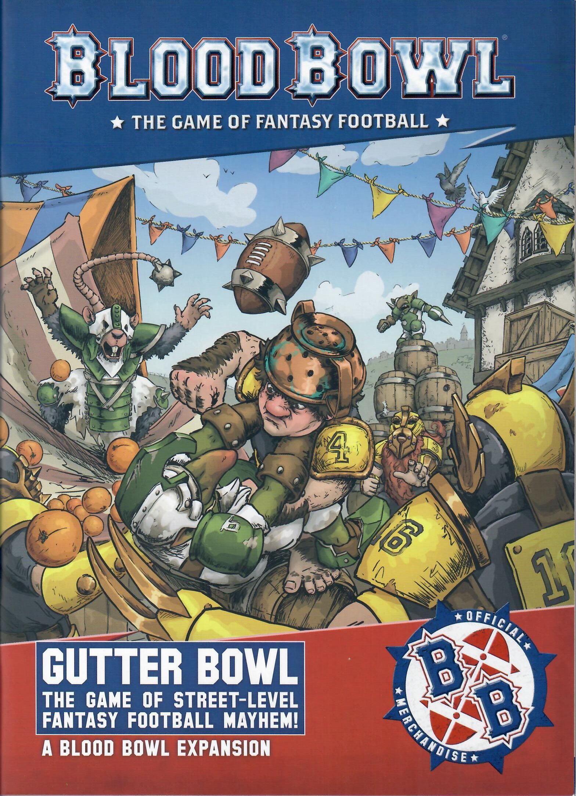
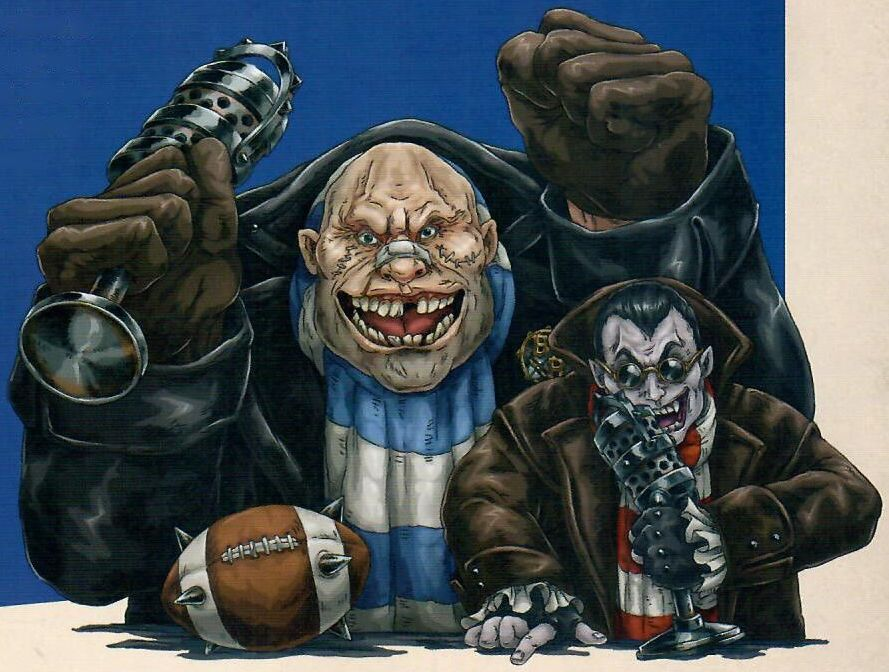

# GREETINGS SPORTS FANS!

* "Welcome, sports fans, to our coverage of a rather unusual game - Gutter Bowl! I'm Jim Johnson, and joining me to talk about the worst kept secret in the Old World is the legendary Bob Bifford!"

* "Thanks, Jim. So, what's this Gutter Bowl thing all about, then? I've never heard of it before."

* "Really, Bob? I thought a well-travelled superstar such as yourself must have heard of Gutter Bowl - it seems right up your alley!"

* "Nope! Nu-uh. Never heard of it, Jim. I swear!"

* "Well okay, Bob, if you say so. Though, what about those times you used to go off for a quick break in between broadcasts and come back with bruised knuckles and other people's blood on your shoes?"

* "I said I've never heard of it, Jim. Move on."

* "Right you are, Bob! For the uninitiated, Gutter Bowl is a less structured, more reckless form of the game we know and love. It's played across the Old World, either in the mean streets, dodging buildings and market stalls as you go; or in the sewers of the undercity, where players have to brave the stench and the slop in order to score! One benefit of such games is that they manage to do without those pesky referees, who would normally want to uphold things like 'rules' and all that. None of that here, though, Bob; unless the crowd decide to take the law into their own hands!"

* "Sounds like a riot, Jim!"

* "Often quite literally, Bob! Anyway, today marks the first ever broadcast of Gutter Bowl on Cabalvision and the final of the 2501 unofficial Gutter Bowl Championship. The Mage Street Manticores, of The Manticore's Claw tavern in eastern Nuln, take on their sewer-dwelling rivals, the Under-Nuln Undertakers, in an epic clash!"

* "I'm really excited for this one, Jim! Both teams have had a great season and caused utter carnage on the way - ant inflicted plenty of pain on their opponents. I can't call this one - it really could go either way!"

* "I thought you said you'd never heard of Gutter Bowl, Bob?"

* "Errr... No comment, Jim"

* "Right... Well, we'll have to leave that for now as the game is about to start. The pints are finished, the ball is in the air: let's... play... GUTTER BOWL!"

