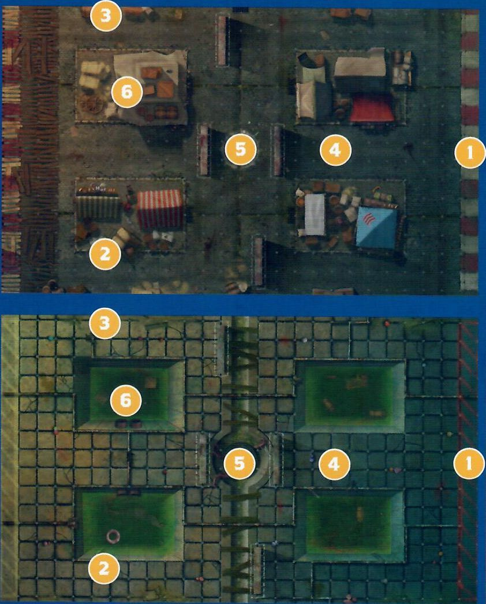
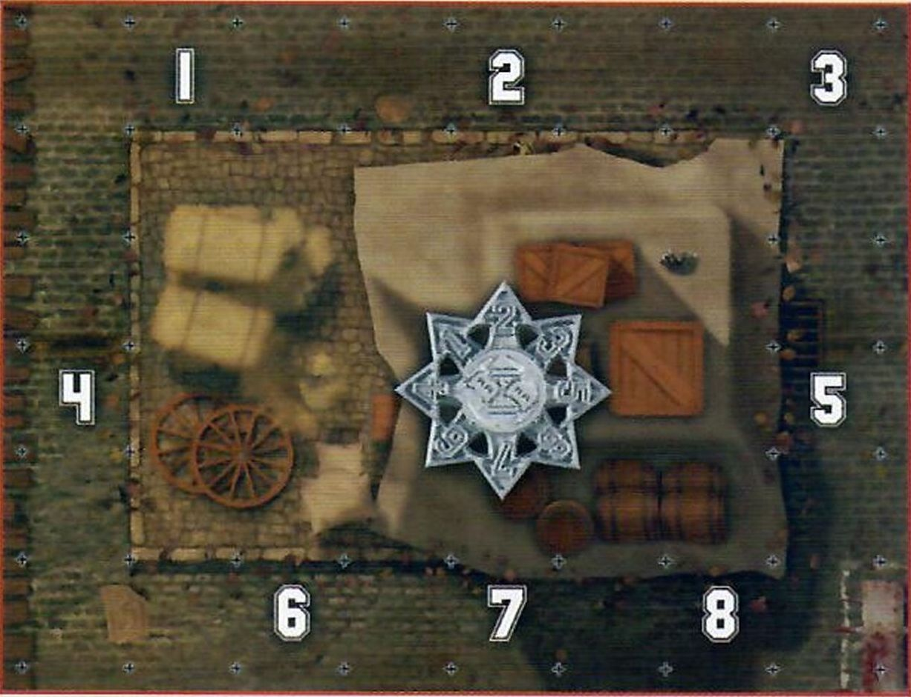
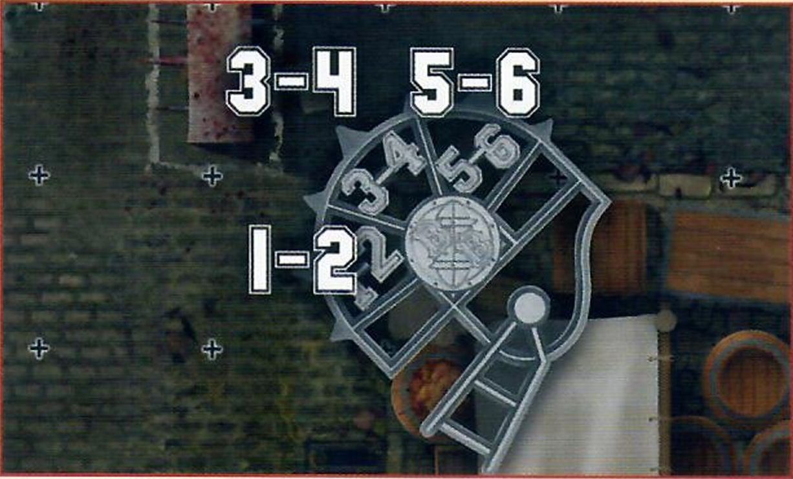
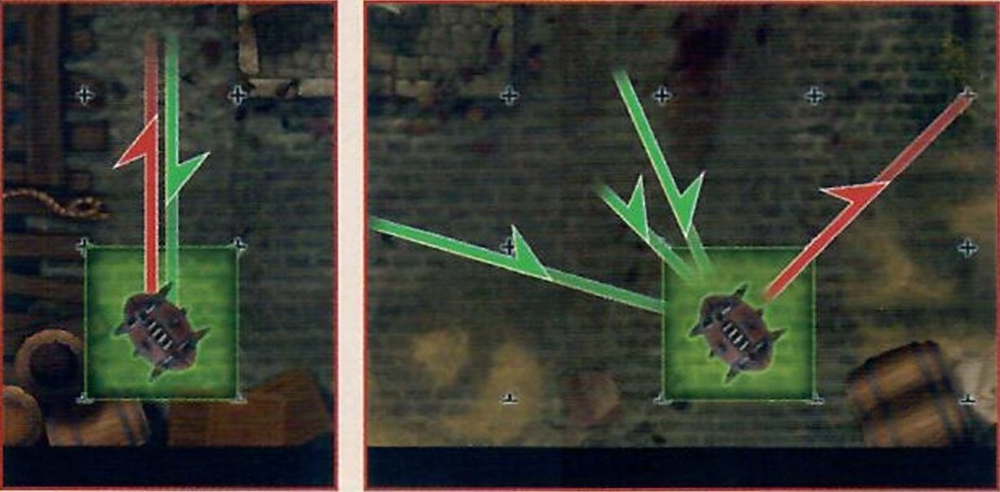
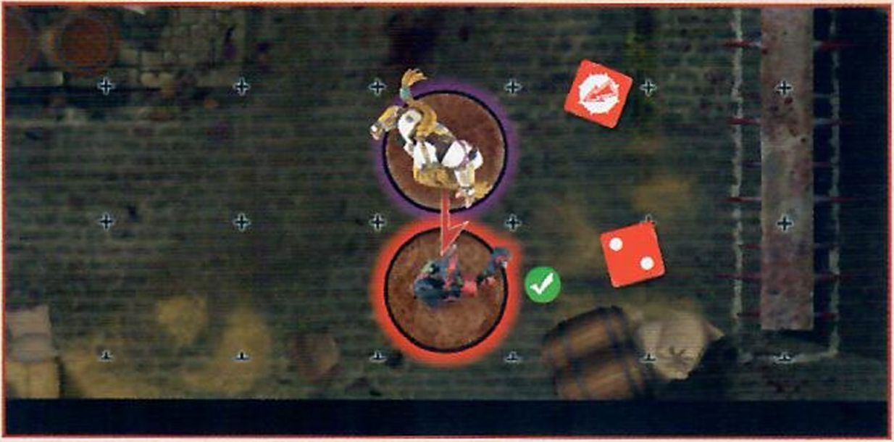
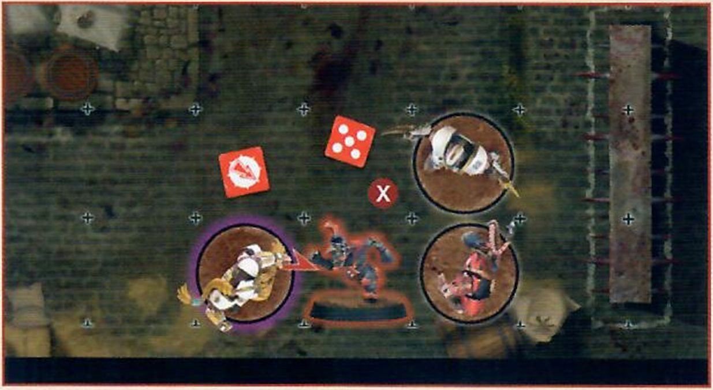
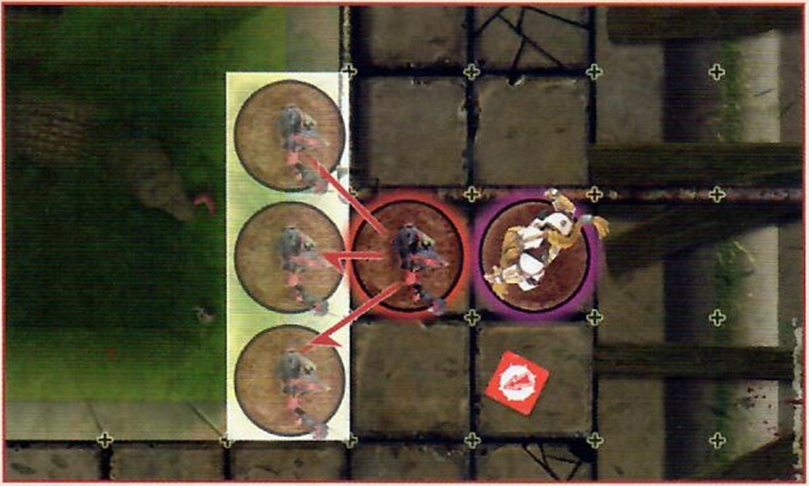
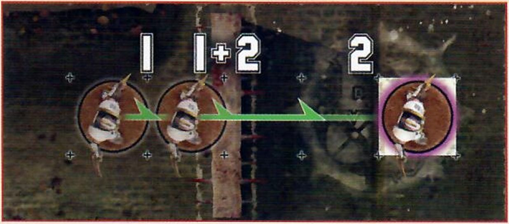
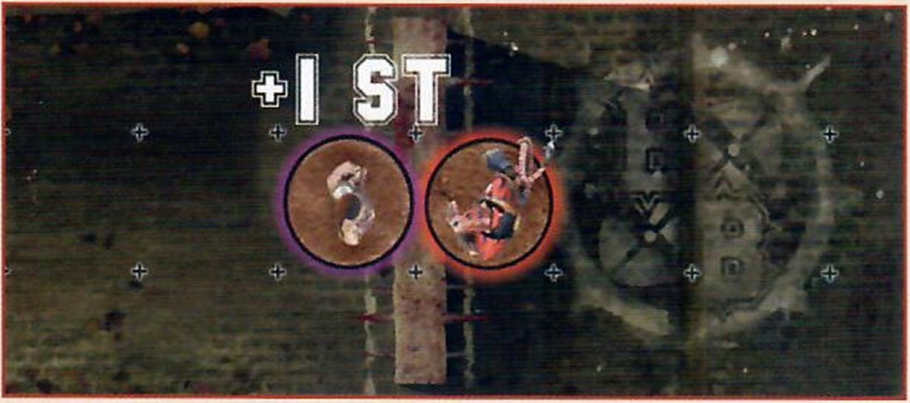

## INTRODUCTION

Welcome to Gutter Bowl: the fast paced, tactical, fantasy football game where the players have taken to the cold, hard streets of the Old World for even more carnage! Gutter Bowl pits two rival teams against each other either on the cobblestone streets of the surface, or in the festering sewers of the undercities, where they must duck and weave around obstacles in order to score those all-important touchdowns.

While the professionals play the game of Blood Bowl we all know and love, many of the fans who believe they have what it takes (but in all likelihood really don't!) will take to the streets to play their own, no-holds-barred, variation of the game, without spoilsport referees to ruin the fun when the bottles, tables and other debris inevitably starts flying!

Gutter Bowl is an expansion and as such, you will need a copy of the *Blood Bowl Rulebook.* To play a game of Gutter Bowl, there are a few key additional items and vital components you will need to get started in the mean streets and dank sewers of the Old World. Some of these components will be located in the Blood Bowl Second Season Edition starter box.

1. *GUTTER BOWL PITCH:* This set contains a double-sided Gutter Bowl pitch, showcasing the two different environments that games of Gutter Bowl can be played in. One side shows the Street Pitch, where players must move around various market stalls as they play. The other side depicts the Sewer Pitch, where players must avoid the stinking sewer pits below as they move around the playing surface.

2. *TWO GUTTER BOWL DUGOUTS:* These are used to keep track of game information, such as: which players are kept in reserve; if any players are Knocked-out or Injured; and the number of Re-rolls a team has remaining.

3. *TWO GUTTER BOWL TEAMS:**There are multiple teams able to play Gutter Bowl; in fact, any team that could play Blood Bowl can also play Gutter Bowl!

4. *TEAM TOKENS:* These are used to keep track of important game information on your team dugout.

5. *DICE:* Gutter Bowl uses a selection of dice: regular six-sided dice, block dice, eight-sided dice and 16-sided dice to bring the action to life. These can be found in the Blood Bowl Second Season Edition starter box.

6. *MEASURERS & TEMPLATES:* These are used for passing the ball, determining how a ball bounces and so on. These can be found in the Blood Bowl Second Season Edition starter box.

7. *THE BLOOD BOWL RULEBOOK:* This has all the information you need to play the game of Blood Bowl, so you can start planning your teams right away! This can be found in the Blood Bowl Second Season Edition starter box.

8. *THE GUTTER BOWL EXPANSION BOOKLET:* The one you are holding right now! This has all the rules and guidance for converting a game of Blood Bowl into its more violent little brother, Gutter Bowl!

## THE RULES

Games of Gutter Bowl follow the majority of the rules presented in the *Blood Bowl Rulebook*; after all, the premise of the game is largely the same, even if the rules are somewhat more 'flexible' when there is no referee there to keep an eye on the more unruly players!

Over the next few pages, we will present to you any rules alterations to those found in the core *Blood Bowl Rulebook*. Some of these will be to do with the different physical environments that this style of game is played in, while others focus more on the sorts of individuals that might take an interest in this alternative style of game play!

### THE PITCH

Games of Gutter Bowl are not played in the majestic stadia that are steeped in the history of Nuffle's great game, nor are they played on any pitch that has been approved for use by the Referees and Ruleskeepers Guild (RARG). Instead, games of Gutter Bowl are played on the unforgiving streets of the various cities, or undercities, across the Old World. Players must weave their way past various obstacles, such as buildings, market stalls, or even the sewers themselves if they are unfortunate enough (or fortunate enough, depending on your perspective!) to be playing in the labyrinthine sewer tunnels that run like a maze under most cities.

A Gutter Bowl pitch is split into a grid of squares; 13 squares from the Line of Scrimmage to End Zone, making the pitch 26 squares long in total, and 15 squares wide; four squares in each Wide Zone and seven squares across the Centre Field.

A Gutter Bowl pitch is then split into several distinct sections, as described below:

1. Two End Zones, one at each short end of the pitch.

2. Two Wide Zones, one at each side of the pitch running from End Zone to End Zone.

3. Two Sidelines, running the length of the pitch, from End Zone to End Zone. These are also Walls, which are described fully on page 18.

4. The Centre Field, the area between the two Wide Zones running from End Zone to End Zone.

5. The Line of Scrimmage, which runs the width of the pitch splitting it into two halves, where teams line up for kick- off and where most of the violence unfolds!

6. Four six square by four square areas of the pitch, two in each half. When playing a game on the Street pitch, these are market stalls that players can slam one another into. However, when playing on the Sewer pitch these are sewage pitfalls that players can push one another into. The rules for both of these variations can be found on pages 18-21.

### DUGOUTS

Each team has its own dugout; a safe haven where the reserves can warm up ready to come onto the pitch, the injured can be seen-to by their team's resident sawbones and, most importantly, where important game information can be tracked. The dugouts are split into a number of different sections as described below:

1. The Reserves box, where fit and healthy players stand ready for the next drive.

2. The Knocked-out box, where players removed from the pitch as a result of being KO'd are placed as they attempt to recover.

3. The Casualty box, where players that have suffered a Casualty of some kind, or have been removed for other reasons, are placed and won't take any further part in the rest of the game.

4. Turn tracker, where a coach keeps track of the number of turns they have played, and how many turns they have remaining of the half.

5. Team re-roll tracker, where a coach keeps track of how many team re-rolls they have used, and how many they have remaining.

6. Score tracker, where a coach keeps a record of how many touchdowns they have scored.

### TEAM CREATION

Gutter Bowl is played by a variety of teams; both established Blood Bowl teams that want to settle a score off the pitch, away from those that would likely impose some form of sanctions should they get a bit too 'physical', and dedicated Gutter Bowl teams. The latter are often made up of: ambitious youngsters trying to catch the eye of a passing scout; veterans whose careers in the big leagues have petered out and who are looking for one last shot at glory; and some who just want to have a go at what they see their idols doing on Nuffle's sacred turf. It is also not uncommon for an established Blood Bowl team to use Gutter Bowl as a way to train their rookies and next generation of stars, to toughen them up for a career on the gridiron!

**DRAFTING A GUTTER BOWL TEAM**

If you are drafting a team purposefully to play Gutter Bowl, either as a single game or as part of a Gutter Bowl league (see page 34), there are some important things to bear in mind when compared to drafting a standard Blood Bowl team. While the majority of the drafting a team process is the same as that presented on pages 30-35 of the Blood Bowl Rulebook, there are some key differences when creating a Gutter Bowl team. 

* As there is a lot less cash involved with this secretive and clandestine version of the game, a Gutter Bowl team only has a Team Draft Budget of 750,000 gold pieces from which to create their team. 
* A game of Gutter Bowl is usually played with fewer players due to the fact that there is less space; players have to weave through the streets or tunnels rather than having a big open pitch to play on! As a result, a Gutter Bowl team must have a minimum of 7 permanently hired players on their starting roster. 
* It should come as little surprise that Gutter Bowl teams are largely made up of poorly trained players: after all, if the players were any good, they would probably have already been snapped up by a proper Blood Bowl team! As a result, a Gutter Bowl team can only have a maximum of 5 players on their roster that are not from the Lineman position. 
* Training isn't something that comes naturally to most Gutter Bowl teams; in fact, many players see the idea of practising and staying in shape as a colossal waste of time! Team re-rolls cost 100,000 gold pieces each, regardless of which team is purchasing them. 
* Gutter Bowl teams barely have enough cash to pay their players, let alone any other staff! Gutter Bowl teams may not hire any Sideline Staff under any circumstances. 
* Dedicated Fans are still used as normal; some crazed individuals do actually avidly follow these teams! However, as Gutter Bowl games are more of a novelty to most fans - who are mainly there for the violence rather than the game itself - each Dedicated Fan represents roughly 10 fans rather than 1,000! 

**USING AN EXISTING BLOOD BOWL TEAM**

If both coaches wish to, they can use their existing Blood Bowl teams to play Gutter Bowl, in which case follow the standard rules for drafting a Blood Bowl team found on pages 30-35 of the *Blood Bowl Rulebook.* It is important to remember that, even though you are using an existing team, the likes of cheerleaders, assistant coaches and apothecaries are still not used in Gutter Bowl, and so will have no effect on your team.

 Gutter Bowl can be an exciting way for two existing Blood Bowl teams to play during a standard league, so long as the league commissioner allows it. They may decide to say that any friendlies are played under 'Gutter Bowl rules', or that the play-offs (or maybe part of them) are played as games of Gutter Bowl to add some variety to their league.

### RULES DIFFERENCES

 As we alluded to earlier, while games of Gutter Bowl largely use the rules found in the *Blood Bowl Rulebook,* there are a number of differences between Gutter Bowl and its bigger brother which manifest in a variety of ways. When playing a game of Gutter Bowl, follow the rules presented in the *Blood Bowl Rulebook,* with the exception of the differences presented here.

**PRE-GAME SEQUENCE**

During a game of Gutter Bowl, there are a couple of differences to the pre-game sequence that coaches need to be aware of.

Before Step 1 of the pre-game sequence, coaches will need to determine where their game of Gutter Bowl is taking place - either on the mean streets of the Old World, or in one of the many dark and disgusting sewers that flow through the undercities. If both coaches agree, they simply choose if they are playing on the Street pitch or the Sewer pitch (described on pages 24-27). Alternatively, coaches may opt to let Nuffle choose where the game should take place and roll a D6. On a 1-3, the game takes place on the Sewer pitch, while on a 4+ the game takes place on the Street pitch.

During Step 2 of the pre-game sequence, use the Weather table associated with whichever pitch is being used, as described on pages 24-27.

During Step 3 of the pre-game sequence, a team may take on Journeymen if they are unable to field 7 players rather than 11 players, and will take on Journeymen until they are able to field the minimum requirement of 7 players as normal. Apart from this, the rules for Journeymen are unchanged.

During Step 4 of the pre-game sequence, a Gutter Bowl team may take on Inducements as normal; however, they may only take on the ones listed on pages 28-33 and may not take any of the ones listed in the *Blood Bowl Rulebook.*

There are no Prayers to Nuffle in a Gutter Bowl game, and so Step 5 of the pre-game sequence is skipped entirely.

**START OF A DRIVE**

Whenever you start a drive in a game of Gutter Bowl, there are a few key differences to the rules presented in the *Blood Bowl Rulebook.*

**SET-UP**

The first, and arguably most important, thing is that both teams will only set up 7 players each, rather than the usual 11; the remainder are then placed in the Reserves box as normal. Coaches may not set up more than 7 players on the pitch at the start of a drive - though they may have to set up less as the game progresses and some players find themselves nursing an injury (or worse!) in the Knocked-out or Casualty boxes!

All the usual rules for setting up your team still apply, so a team still cannot place any players in the opposition half, must have at least three players on the Line of Scrimmage in their half, and can have no more than two players in each Wide Zone.

**THE KICK-OFF**

During the kick-off, there are a couple of small differences to be aware of in relation to the different environment that the teams are playing in. When placing the kick, a coach of the kicking team cannot nominate a square that is either on top of one of the market stalls (if playing on the Street pitch) or in one of the sewer pits (if playing on the Sewer pitch).

If the kick deviates onto either of these features, then it will need to re-enter play: either it will bounce off the stalls and into play, or something in the sewers will help it back onto the pitch! To do this, place the Random Direction template over the ball and roll a D8. Move the ball in the direction rolled the minimum distance so that it is back on the pitch; this is where it will land.

Additionally, if, when the kick deviates, it would leave the pitch via one of the Sidelines, it will bounce off the walls that line the pitch rather than landing in the crowd; after all, a Gutter Bowl pitch is lined with houses or sewer walls, rather than rows of cheering fans! If this situation arises, the ball will bounce off the wall in the same manner as described on page 18. As a result, a touchback is only caused if the ball leaves the pitch from the kick-off via the two short edges of the pitch at either End Zone or crosses into the kicking team's half as usual.

**KICK-OFF EVENT**

Finally, when determining the Kick-off Event, use the Kick-off Event table associated with whichever pitch is being used, as described on pages 24-27.

**TURNS**

Gutter Bowl is a hectic, fast-paced game and there is no fixed regulation time for such a chaotic affair! However, these illicit games are almost always shorter than a standard game of Blood Bowl for the simple reason that the majority of these players are not professional athletes, and will not be able to play for as long as the stars they are trying to emulate. It won't be too long before the players are all out of breath, beaten up, or just want to go to the nearest tavern for a nice cold pint of Blitzer's Best!

Each half of a game of Gutter Bowl lasts for six turns, rather than the usual eight.

**THE REFEREE**

It's fair to say that Gutter Bowl is not for the faint of heart, and most fans simply want to see the two teams beat the snot out of each other, rather than worrying about trivial things like who 'wins'. The rules are barely adhered to and are seen more like 'guidelines' that don't really need to be enforced - there certainly aren't many individuals willing to stand between two Gutter Bowl teams and try to call things such as fouls!

A game of Gutter Bowl does not have a Referee and as a result, players cannot be Sent-off during the course of a game. This doesn't mean that teams can perform more than one Foul action a turn, though; the fans want to see a good clean punch-up and will only tolerate a modicum of perceived cheating at any one time.

**SECRET WEAPONS**

With the lack of Referee in the playing area, many players like to try their luck and sneak their favourite maiming contraption into the game. While the fans are more than happy to see plenty of violence, they still want to see both teams have an honest scrap for the most part, and may well take the law into their own hands if a particularly unscrupulous player is not playing in the 'spirit' of the game!

The Secret Weapon trait works differently in games of Gutter Bowl. At the end of each drive, roll a D6 for each player with the Secret Weapon trait that took part in the drive. On a 4+, the player gets away with their underhanded tactics and may continue to participate in the game for now; either they went unnoticed or the crowd were suitably impressed by their violent outbursts! On a 1-3, the crowd decides to get involved and removes the troublemaker from the game. The player will play no further part in the game. Additionally, roll a further D6 for any player removed in this manner. On a 1, the player suffers a Casualty as the crowd enacts their retribution upon them!

Bribes cannot be used to prevent players being removed from play in this manner - violence is the only currency Gutter Bowl fans understand!

**RESTLESS FANS**

Gutter Bowl fans aren't often the brightest of spectators, and they certainly get bored easily. If players try to slow the game down and don't just get on with it then the fans will likely take things into their own hands...

If any player is determined to be Stalling at the end of a friendly team turn, as per page 64 of the *Blood Bowl Rulebook,* then they must roll a D6. On a 2+ the fans have become outraged at the player's complete disregard for actually playing the game and launched a bottle straight at them. Make an Injury roll for the Stalling player.

**WALLS**

The edges of a Gutter Bowl pitch will be lined with walls that act as a marker for how wide the playing area actually is. The two Sidelines of any Gutter Bowl pitch are walls: on the surface these will usually be buildings or brick walls, while in the undercity, they will usually be the slimy sewer walls. If you are playing on the Street pitch, then the four market stalls in the playing area will also count as walls. Either way, all walls act in the same way during the course of the game, and will impact various things such as bouncing balls and what happens when players are slammed into them!

**PASSING**

When using the Street pitch, if a player attempts to make a Pass action where the centre line of the range ruler crosses any part of one of the market stalls in between the thrower and the target square, then they must apply an additional -1 modifier to the Passing Ability test.

If, when resolving an Inaccurate Pass or Wildly Inaccurate Pass, the ball finishes on one of the squares that are a part of a market stall it will need to re-enter play by being thrown into play by a disgruntled vendor. To do this, place the Random Direction template over the ball and roll a D8. Move the ball in the direction rolled the minimum distance so that it is back on the pitch; this is where it will land.

**BOUNCING OFF THE WALL**

Sometimes the ball will hit the walls around the playing area, causing it to veer off in a different direction. This could be due to the ball bouncing into the wall, a player fumbling the ball next to the wall, or various other reasons.

When the ball would hit one of the walls following a bounce, scatter or deviation from the ball on the floor, place the Throw-in template so that the Blood Bowl logo is where the ball would be if it hadn't hit the wall, and then roll a D6. The ball will be placed in the square corresponding to the roll, as determined by the Throw-in template.

If, when using the Street pitch, the ball would bounce diagonally into one of the corners of the market stalls, then it will bounce as shown by the diagram below.

**THROWING THE BALL AT THE WALL**

Sometimes a player will purposefully throw the ball off the wall in order to have it ricochet off to a more advantageous position, or to try a hopeful or eccentric pass to a team-mate in order to show off!

A player that declares a Pass action may also declare that they will bounce the ball off the wall instead of passing normally. Declare which wall square the ball is being thrown at, and test for accuracy as normal. This Pass may be interfered with as normal.

If the test for accuracy is successful, the ball will ricochet from the target square. If the test is failed, roll a D6. On a 1-3, it hits the wall square to the right of the target square; on a 4+ it hits the wall square to the left of the target square.

The ball will then ricochet as shown in the diagrams below, depending on how it was thrown at the wall (as shown by the green arrows). It will then travel D6 squares in the direction indicated by the red arrows and, if not caught, it will bounce once from the square where it ends up. Any and all players that the ball passes over may attempt to catch the ball, in the order that the ball passes over them, counting as an inaccurate pass. Unless the ball is caught by a player on the active team, there will be a Turnover.

**TEAM-MATES THROWN INTO THE WALL**

Throwing team-mates in the cramped streets is asking for trouble; not that it bothers the player doing the throwing, of course! There is a very real chance of thrown players hitting one of the various walls and market stalls and coming out very much second best in that exchange!

Should a thrown player scatter into one of the walls, they risk serious injury. The player will suffer a Crash Landing as described on page 54 of the *Blood Bowl Rulebook.* Additionally, when making the Armour roll for a player that has hit the wall, apply an additional +1 modifier to the roll.

**PUSHED INTO THE WALL**

With walls lining the playing areas of any Gutter Bowl game, it should come as little surprise that many players will try to use them to gain a physical advantage: namely by ramming their opponents into them in order to take them out of action!

If a player occupies a square adjacent to a wall when they would be pushed back as a result of a Block action, and there are no squares they can be pushed into, the player will be 'pushed into the wall'.

If a player is pushed into the wall, the active coach must roll a D6 for the pushed player. On a 1-3, the player remains where they are as they simply bounce off the wall with no lasting effects. On a 4+, the player will Fall Over in the square they are in; make an Armour roll as normal.

Note that if a player is pushed into the wall as the result of a POW!, do not roll a D6 to see if they Fall Over - they automatically Fall Over in the square they were in.

*For example: The Dwarf Lineman has got a Push Back result against the Goblin Lineman. As all three squares behind the Goblin are a wall, a D6 is rolled. Fortunately for the Goblin, a 2 is rolled and the Goblin stays on their feet!*

*Here, this Dwarf Lineman has got a Push Back result against a different Goblin Lineman. As the two other squares behind the Goblin are occupied, they cannot be pushed there, and so they are pushed into the wall. A 5 is rolled so the Goblin will Fall Over, and an Armour roll is made.*

**COBBLESTONE FLOORS**

Games of Gutter Bowl are played on the hard, cobblestone streets and sewers of the Old World, rather than the somewhat softer turf that covers many professional Blood Bowl pitches. These stoney surfaces have a much bigger impact on whatever hits them, whether that is the ball or, far more likely, an unfortunate player that has just been tackled straight into the ground!

**BOUNCING BALLS**

Whenever the ball hits the floor, whether as the result of a Kick-off, failed pass, or being dropped, or any other reason and would normally bounce, it will bounce twice rather than the usual once.

**HARD LANDINGS**

Whenever a player Falls Over during a game of Gutter Bowl and hits the hard stone floors, whether as the result of a Block action, a failed Dodge roll, or any other reason, apply an additional +1 modifier to the Armour roll.

**SEWERS**

If you are playing on the Sewer pitch rather than the Street pitch, then the four market stalls are replaced by four sewer pits, which work very differently!

**THE BALL IN THE SEWERS**

If the ball ever ends up in one of the sewer pits, then it will need to re-enter play: whatever disgusting things that are living in the sewers will help it back onto the pitch! To do this, place the Random Direction template over the ball and roll a D8. Move the ball in the direction rolled the minimum distance so that it is back on the pitch; this is where it will land.

**LANDING IN THE SEWERS**

Playing games in the filthy undercity has one very obvious, and very smelly, downside: sewage. Although the sewers themselves are perfectly functional at letting the waters flow through them, they are also something of a hazard for any player that may find themselves falling into them - accidentally or not!

Players may not normally move through squares that make up one of the sewer pits, though they may in some circumstances find themselves on one of these squares, such as during an opposing player's Block action or a Throw Team-mate Special action.

If a player occupies a square adjacent to a sewer pit when they would be pushed back as a result of a Block action, and there are no squares they can be pushed into, the player will be pushed into the sewers. Note that if they were pushed back as part of a POW! result, this is resolved first before being pushed into the sewers.

*For example: The Dwarf Lineman has got a Push Back result against the Goblin Lineman. As all three squares behind the Goblin are a sewer pit, they are pushed in. The Dwarf Lineman has got a Push Back result against the Goblin Lineman. As the two other squares behind the Goblin are occupied, they cannot be pushed there, and so they are also pushed into the sewer pit.*

*The Dwarf Lineman has got a Push Back result against the Goblin Lineman. As the two other squares behind the Goblin are occupied, they cannot be pushed there, and so they are also pushed into the sewer pit.*

If a player that was thrown as part of the Throw Team-mate Special action would land in a sewer pit square, they will simply land in (relative) safety and will not have an Armour roll made against them, though this will still cause a Turnover and if the player was carrying the ball, it will still be retrieved from the sewer pit as described earlier.

If a player ends up in a sewer pit for any reason, and would land on the same square as another player in the sewer pit, place the Random Direction template over the already occupied square and roll a D8, re- rolling any results where the player cannot be placed. The player is placed in the square corresponding to the roll.

Players in a sewer pit cannot be Activated, have no Tackle Zone and can never be Marked or chosen as the target of an action by opposition players.

**THERE'S SOMETHING IN HERE...**

At the end of each team turn, after any Stunned players have rolled over, the active coach will need to roll a D6 for each of their players that are in one of the sewer pits and consult the chart below to see what happens to them.

**D6 EFFECT**
**1 *"AARRGGHH!!!":*** Whatever lurks within the sewage has taken a fancy to the player and they've met a smelly end! The player is immediately removed as a Casualty. Make a Casualty roll for them. 

**2-3 *"It's all quiet down here":*** The player is managing to keep their head above the rank waters, but hasn't been able to climb their way out just yet. The player remains in the sewer pit for another turn.

**4+ *"Justput me down over there":*** Either through an act of surprising kindness, or more likely the fact that it wants the intruding player out of its home, the sewer creature decides to remove the player from the sewage. Place the Random Direction template over the player and roll a D8. Move the player in the direction rolled the minimum distance so that it is back on the pitch; this is where the player will be placed and will be placed Standing. If there is another player already in the square where the player is supposed to be placed, then the player already occupying the square will be pushed in the same way as if they had been pushed back during a Block action and from the direction in which the player returning to the pitch is coming from. This push is resolved by the active coach.

*For example: The Goblin Lineman is being placed back on the pitch having rolled a 5 on the Random Direction template. However, the Halfling Hopeful is in the square where the Goblin needs to be placed. As a result, the Halfling is pushed as if the Goblin had made a Block action against them from the direction they are coming from, and the Halfling can be placed in one of three squares chosen by the active coach.*

**BARRICADES**

With games of Gutter Bowl being played in areas that aren't particularly designed to have players of all shapes and sizes barrelling through them, there are often a fair amount of things that get in the way: market stalls, barrels, debris, crates of beer, you name it! Such obstacles are of little consequence to Gutter Bowl teams, and many will actually use such objects to barricade or attempt to block off certain pathways for their opposition. They can also make for good makeshift protection from any incoming fists!

**BARRICADE LOCATIONS**

Each side of a Gutter Bowl pitch has four Barricades on them, with two in each half. These always run along the lines between squares and are three squares long. The positioning of each Barricade is the same in each half. Barricades are outlined in white so that they are easy for both coaches to see.

**MOVING OVER BARRICADES**

Barricades are tricky to move over, but not impossible with enough determination! A player may attempt to move over a Barricade in one of two ways: either Safely or Recklessly.

If a player wishes to move over a Barricade Safely, then it will cost them an additional 2 squares of Movement to do so as they clamber their way over the debris. A player cannot move Safely over a Barricade if they do not have enough Movement remaining to do so without Rushing.

 

*For example: This Human Lineman wishes to move Safely over this Barricade. They move 1 square up to the Barricade and then 1 square over the Barricade, counting it as having moved 3 squares - 1 for the actual move plus 2 for moving Safely over the Barricade. They then continue to move and have 2 squares of Movement remaining.*

If a player wishes to move over a Barricade Recklessly then it will not cost them any additional squares of Movement as they simply leap or attempt to smash through it. However, if a player moves Recklessly over a Barricade then, after moving the player into the square over the Barricade, roll a D6. On a 2+ the player may continue as normal; however, on a 1, the player immediately Falls Over.

*For example: The first Skaven Lineman wishes to move Recklessly over the Barricade. They move over the Barricade and roll a 4, meaning they can continue as normal. Their team-mate also decides to move Recklessly over the Barricade; however, they roll a 1 and immediately Fall Over causing a Turnover!*

**BLOCKING OVER BARRICADES**

Barricades offer some form of protection against being hit; either allowing a player to hide behind them, to duck an incoming tackle, or by letting a player use something to defend themselves!

If a Block action is made over a Barricade, so that the Barricade is in between the player making the Block action and the target of the Block action, then the target of the Block action receives a bonus of +1 to their Strength characteristic before working out any Assists.

*For example: The Skaven Lineman has declared a Block action against the Halfling Hopeful. As there is a Barricade in between the two players, the Halfling gains +1 Strength meaning only a single Block dice is rolled.*

*The Skaven Lineman has declared a Block action against the Halfling Hopeful. As the Barricade is not directly in between the two players, the Halfling receives no benefit and so two Block dice are rolled. Ouch!*

**PUSHED INTO A BARRICADE**

Many Barricades are, at best, crudely put together; many of them have the likes of nails, splinters, glass, and all manner of other painful things sticking out of them that will likely hurt any player pushed into them.

If a player occupies a square adjacent to a Barricade when they would be pushed back as a result of a Block action, and there are no squares they can be pushed into, the player will be pushed into the Barricade.

If a player is pushed into the Barricade, the active coach must roll a D6 for the pushed player in the same way as if they had been pushed into a wall. On a 1-3 the player remains where they are as they simply bounce off with no lasting effects. On a 4+ the player will Fall Over in the square they are in; make an Armour roll as normal.

Note that if a player is pushed into the Barricade as the result of a POW!, do not roll a D6 to see if they Fall Over - they automatically Fall Over in the square they were in.

**STREET PITCH**

Games of Gutter Bowl are usually played in, well, the gutters of the various streets in the Old World; in fact, it's how the game got its name. Such games can prove to be very popular among the townsfolk, especially on a lazy afternoon when there are no official games of Blood Bowl going on and most have nothing better to do. Many taverns in the Old World actually pride themselves on their Gutter Bowl teams, and there are often matches going on to determine which of them is the best - not that either would be able to compete with a real Blood Bowl team, of course!**

**KICK-OFF EVENT TABLE**

When using the Street pitch for your games of Gutter Bowl, use the following Kick-off Event table, rather than the ones provided in the *Blood Bowl Rulebook.*

**2D6 RESULT**

 **2 *Falling Roof Tiles:*** The raucous crowds and spectators on the roofs have dislodged a number of slate tiles, which have fallen onto the streets, and players, below. Randomly select one Wide Zone and make an Armour roll for each player in the selected Wide Zone. If the Armour roll fails, nothing happens and the player is unharmed. If the Armour roll is successful, make an Injury roll as normal.

 **3 *Riot!:*** The fans are giddy with excitement and want to get stuck into the fray, much to the players' displeasure. Roll a D6 for each player on the pitch. On a 6, the player is immediately Placed Prone and Stunned. 

 **4 *Quick Attack:*** With the ball high up in the air, one player seizes the opportunity to get stuck in straight away. One player on the kicking team may immediately perform a Block action before the first team turn begins.

 **5 *Rogue Washing Line:*** One of the clotheslines above the streets has come loose, and the washing has fallen onto some of the players who must untangle themselves from an array of underpants and linen before carrying on. Both coaches randomly select one of their players on the pitch. The selected players cannot be activated during their coach's next team turn.

 **6 *"This round is on us!":*** The local tavern's business is booming with the game going on outside their door, and so has offered some free drinks to the players as a thank you. For the duration of the drive, whenever a player is KO'd immediately roll a D6. On a 4+, place the player in the Reserves box instead of the Knocked-out box.

**7 *Cheering Fans:*** The fans are completely behind their favourite team, spurring them on to get the win. Both coaches roll a D6 and add their Fan Factor to the result. The coach that rolls highest immediately gains one extra Team re-roll for the drive. If it has not been used by the end of the drive, it is lost. In the case of a tie, neither coach gains a Team re-roll.

**8 *Changing Weather:*** Make a new roll on the Street Pitch Weather table and apply that result. If the result is 'A Normal Day' as a result of the roll, the ball will scatter before landing.

**9 *Loose Dogs: IX*** number of stray dogs have made their way onto the pitch and begun to cause havoc; chasing the ball, going after the players' legs, generally being a bit of a nuisance and putting the players off their game. For the duration of the drive, neither side can use any Team re-rolls when attempting to pick up the ball or when making a Block action.

**10 *Black Market Dealer: IX*** concerned passing merchant has handed out some samples of his wares to the coaches in a bid to drive up sales. Each team immediately receives one free Lesser Magic Potion as described on page 29.

**11 *Furious Neighbour:*** Not every citizen is a fan of Gutter Bowl, and certainly not Mrs Miggins at number 12 who is making her annoyance at the racket clearly known to the players! Both coaches roll a D6 and add their Fan Factor to the result. The coach that rolls lowest randomly selects one of their players on the pitch. The selected player is immediately KO'd as they receive a well-aimed flowerpot to the noggin!

**12 *"The Guards are Coming!":*** The noise and antics of the game have attracted some unwanted attention, specifically from the city watch who have come out in force to arrest the most obvious troublemakers. Each coach randomly selects one of their players on the pitch. They then roll a D6 for the selected player. On a 3+ the player evades the city watch and remains on the pitch; however, on a 1-2, the player is identified as a rabble rouser and promptly arrested. The player is removed from the pitch and misses the remainder of the game.

**WEATHER TABLE**

When using the Street pitch for your games of Gutter Bowl, use the following Weather table, rather than the ones provided in the *Blood Bowl Rulebook.*

**2D6 RESULT**

 **2 *Clouds of Smog:*** The city's industrial district is working at full speed and is churning out clouds of thick smog, making it hard to see how many players have made their way onto the pitch. At the start of each drive while this is in effect, each coach rolls a D6. On a 5+, they may immediately set up one additional player from their Reserves box onto the pitch, following all of the usual set-up rules. Additionally, due to the smog, only Quick Passes and Short Passes may be attempted. 

**3 *Howling Winds:*** There are strong winds whistling down the streets, making it difficult to pass the ball with any kind of accuracy. Any player that attempts a Pass action will suffer an additional -1 modifier.

**4-10 *A Normal Day:*** There is nothing of note about the weather, except perhaps that it is a little grey. It is, however, the perfect weather for a game of Gutter Bowl! 

**11 *Sudden Downpour:*** The heavens have opened and drenched the players on the streets. The sudden showers have made the ground slippery and the ball difficult to keep hold of. Players suffer an additional -1 modifier when attempting to Rush or pick up the ball. 

**12 *A Stormy Night:*** The combination of thunder, lightning and torrential rain make it very difficult to play Gutter Bowl, 'A and there is always the risk of a stray bolt striking the streets. Apply the Sudden Downpour effect above. Additionally, at the end of each coach's team turn, roll a D6. On a 1, they randomly select a player on their team. The selected player immediately Falls Over as they are struck by lightning.

**SEWERPITCH**

While the majority of Gutter Bowl games are played on the surface (at least the majority of the documented ones), many are also played in the winding labyrinth of sewers beneath the cities. In fact, the likes of Skaven, Goblins, Snotlings and other such folk that are less picky about the fragrance of where they play actually prefer it in the sewers, where they can muck about in the filth and sewage to their heart's content!

**KICK-OFF EVENT TABLE**

When using the Sewer pitch for your games of Gutter Bowl, use the following Kick-off Event table rather than the ones provided in the *Blood Bowl Rulebook.*

**2D6 RESULT**

 **2 *Tentacled Terror:*** The commotion of the game has disturbed whatever abhorrent entity dwells in the depths of the sewer - and the creature is not best pleased! Both coaches roll a D6. The coach that rolls lowest randomly selects one of their players on the pitch. The selected player is dragged into the sewer by the creature and is removed as a Casualty. Make a Casualty roll for them. 

**3. *Riot!:*** The fans are giddy with excitement and want to get stuck into the fray, much to the players' displeasure. Roll a D6 for each player on the pitch. On a 6, the player is immediately Placed Prone and Stunned.

**4 *Sudden Stink:*** A loud rumbling is followed quickly by a grotesque guff on the halfway line, which players from both teams swear wasn't them! Players that are set up on the Line of Scrimmage are pushed into the square directly behind them. If there is another player in the square they are being pushed to, that player is also pushed into the square directly behind them, and so on. 

**5. *Bats!:*** The kick has angered a family of bats that were snoozing on the sewer roof, and are about to enact some vengeance on the players on the pitch. Both coaches roll a D6. The coach that rolls lowest randomly selects one of their players on the pitch. The selected player is immediately Placed Prone and Stunned.

**6. *"Get Ready, Lads!":*** As the kick-off happens, the defensive team takes advantage of the dim sewer lighting to gain a quick advantage and make their move. Each Open player on the receiving team may immediately move 1 square.

**7. *Cheering Fans:*** The fans are completely behind their favourite team, spurring them on to get the win. Both coaches roll a D6 and add their Fan Factor to the result. The coach that rolls highest immediately gains one extra Team re-roll for the drive. If it has not been used by the end of the drive, it is lost. In the case of a tie, neither coach gains a Team re-roll.

**8. *Changing Weather:*** Make a new roll on the Sewer pitch Weather table and apply that result. If the result is 'No more Disgusting than usual' as a result of the roll, the ball will scatter before landing.

**9. *Sticky Sludge:*** The ball hits the roof and comes down covered in some mysterious black goo. Though this sticky substance makes it far easier to pick up the ball, it becomes almost impossible to relinquish it without some help! For the duration of the drive, players receive an additional +1 modifier when attempting to pick up the ball. However, a player in possession of the ball may not make Pass actions.

**10. *Black Market Dealer:*** A concerned passing merchant has handed out some samples of his wares to the coaches in a bid to drive up sales. Each team immediately receives one free Lesser Magic Potion as described on page 29.

**11. *'Fresh'Sewage:*** The latrines in the city above have all been emptied and the waste is rushing down the sewer, with those playing risking getting showered in yesterday's lunch. Any player within 2 squares of a sewer pit is immediately Placed Prone.

**12. *Swarm of Rats:*** Sewer rats may not like the surface dwellers, but they do like how they taste; should any players stray too close to the sewer walls their toes might get 'mistaken' for a tasty treat! For the duration of the drive, whenever a player finishes their activation in a square next to a wall, roll a D6. On a 1, the player has been swarmed by rats and immediately Falls Over. This will not cause a Turnover unless the player was holding the ball.

**WEATHER TABLE**

When using the Sewer pitch for your games of Gutter Bowl, use the following Weather table, rather than the ones provided in the *Blood Bowl Rulebook.*

**2D6 RESULT**

**2. *Unbearable Stench:*** The sewers have become particularly pungent and the stench has become eye-wateringly disgusting, making some players keel over. At the end of each team turn, randomly select one player on the active team. The selected player is immediately Placed Prone as the foul stink overwhelms them.

**3. *Spilt Sewage:*** A recent influx of sewage has splashed up and onto the playing surface, making the cobblestones slippery underfoot and hard to run over safely. Players suffer an additional -2 modifier when attempting to Rush.

**4-10 *No more Disgusting than usual:*** The conditions may be rather rank, but that is nothing new down here. Otherwise, it's perfectly fine for playing some Gutter Bowl! 

**11 *It's Getting Warm:*** The pleasant weather on the surface is also having an impact in the undercity; though without the same cooling breeze, the sewers have become hot and humid and the players' hands are quite sweaty. Players suffer an additional -1 modifier when attempting to pick up or catch the ball.

**12 *Underground Heatwave:*** The roasting weather topside is making the sewers an oven and with the lack of cool air flowing downwards, players are beginning to collapse in the heat. At the end of a drive, roll a D6 for each player that was on the pitch. On a 1, the player passes out and may not be set up during the next drive.

## GUTTER BOWL INDUCEMENTS

Much like any game of Blood Bowl, when a game of Gutter Bowl is going on, there are always plenty of budding entrepreneurs, semi-skilled professionals and other helpful hangers-on around, hoping to lend a helping hand to a team in need - for a modest fee, of course. However, the kinds of folk that loiter around a Gutter Bowl game looking for a quick payday are usually somewhat less able than those you'd see around a Blood Bowl stadium. After all, if they were actually good at the services they offered, they wouldn't need to use Gutter Bowl as a way to earn their money!

This isn't always the case, mind you; many established dealers and salesmen use Gutter Bowl games as a good place to test experimental wares, or offload the products that they couldn't sell to teams that play in the big leagues, as (most) professional teams actually know what a good product is!

Regardless, Inducements play an important part in any Gutter Bowl game, as bookies and promoters try to ensure an exciting game by helping out the lesser teams in order to even the score. After all, the game is far more fun for the punters if it is close - that way, they come back for more!

Inducements work in much the same way as listed on pages 88-89 of the *Blood Bowl Rulebook;* however, teams may only take the Inducements listed here or other Inducements that are specifically stated for use in Gutter Bowl found in other publications. The Inducements listed here can be taken by any team.

**MAGIC POTIONS**

Throughout the Old World, there are all kinds of entrepreneurial individuals who claim to have developed the latest 'wonder drink' to turn even the most unlikely player into the next Griff Oberwald. Of course, this is, for the most part, poppycock, but that hasn't stopped most market stalls being crammed with potions, draughts and elixirs for every occasion. This is especially true when a game of Gutter Bowl is going on nearby and a savvy business owner can make a pretty pfennig selling their strange concoctions to a coach who is desperate to give their players that added edge in the game - even if they risk the lives of their players in doing so!

Magic Potions are split into two categories: Lesser and Superior. There is no limit to the number of Magic Potions a coach may purchase as Inducements, so long as they have the gold, of course!

At the start of any drive, before setting up any players on the pitch, a coach can give any number of Magic Potions to their players, including any Knocked-out players. No more than one Magic Potion may be given to each player. When a player is given a Magic Potion, roll on the corresponding table that follows depending on whether it was a Lesser or Superior Magic Potion, and immediately apply the effect.

**LESSER MAGIC POTIONS - 50,000 GOLD PIECES EACH**

Lesser Magic Potions are, more than likely, not actually potions at all. Instead, a sneaky salesman has tried to pass off some other liquid as having mystical properties - the scoundrel!

**D8 EFFECT**

1. ***Manticore Venom:*** This isn't a potion at all but it is highly toxic! The player is removed from the game; immediately make a Casualty roll for them.

2. ***Fresh Water:*** The clear elixir is actually just water and has no effect on the player.

3. ***Blood & Bootlaces I.P.A.:*** Well, it's beer, but certainly not good beer! The player gains the Bone Head trait and a -1 modifier to their Agility characteristic for the remainder of the game. Additionally, if the player is Knocked-out, they immediately recover. 

4. ***Healing Bairn:*** If the player is Knocked-out, they immediately recover. Otherwise, there is no effect.

5. ***Fungus Broth:*** Whatever this stuff is, it clearly contains mushrooms which seem to be having an effect on the player's stomach! The player gains the Projectile Vomit trait for the remainder of the game. Additionally, if the player is Knocked-out, they immediately recover.

6. ***Warpstone Whiskey:*** The bright green glow should have given a hint as to what was in the drink, though warpstone does make its consumer somewhat more 'jumpy' in more ways than one! The player gains the Jump Up and Leap skills for the remainder of the game, however, they must always be the first player on the team to activate on each of their team turns. Additionally, if the player is Knocked-out, they immediately recover.

7. ***Bugman's XXXXXX:*** There is nothing like a cold, refreshing pint of Bugman's to perk a player up for a new drive! The player gains the Pro skill for the remainder of the game. Additionally, if the player is Knocked-out, they immediately recover.

8. ***It's an actual Potion!:*** In a rare twist of fortune, the seller has actually delivered on what they said they would! Roll on the Superior Magic Potions table instead.

**SUPERIOR MAGIC POTIONS - 100,000 GOLD PIECES EACH**

Formulated by highly talented potioneers, these concoctions can have all manner of effects; increasing a player's speed or swiftness, allowing them to shrug off all but the most ferocious of blows, or even seeing them go into a bloodcrazed rage!

Any Knocked-out player that is given a Superior Magic Potion will automatically recover in addition to any other effects.

**D8 EFFECT**

1. ***Potion of Endurance:*** A thick, stone-coloured draught that seems to toughen up any who drinks it. The player improves their Armour Value by 1 for the remainder of the game. Additionally, the next time this game the player would suffer a Casualty, they are only Knocked-out instead.

2. ***Potion of Mutation:*** Quite what will happen when a player drinks this potion is uncertain; but sometimes a player just has to roll the dice! The player immediately gains a single random Mutation skill for the remainder of the game (see page 74 of the *Blood Bowl Rulebook),* though if they get a Skill they already have or cannot use, they may roll again.

3. ***Potion of Accuracy:*** By drinking this clear, almost sparkling liquid, a player seems to be able to see far better than before and make seemingly difficult throws with ease. The player improves their Passing Ability by 1 and does not suffer any modifiers for the range of a Pass when making a Pass action for the remainder of the game.

4. ***Potion of Intelligence:*** The player seems to be able to read the game with a newfound insight, directing their team-mates and avoiding incoming blows. The player gains the Leader and Sidestep skills for the remainder of the game.

5. ***Potion of Grace:*** This pale blue elixir gives its drinker improved reflexes - perfect for skipping their way past opposition players that get in the way. The player improves their Agility by 1 and gains the Sure Feet skill for the remainder of the game. 

6. ***Potion of Speed:*** After downing this bright yellow potion, the player is off in a flash to rejoin the game. The player improves their Movement Allowance by 1 and gains the Sprint skill for the remainder of the game.

7. ***Potion of Strength:*** The potion causes the player's muscles to bulge and they seem to look bigger in a matter of moments. The player improves their Strength by 1 and gains the Stand Firm skill for the remainder of the game.

8. ***Potion of Rage:*** This bright red draught burns all the way down, causing the player to roar with anger and unleash their fury upon any that get in their way! The player improves their Strength by 2 and gains the Frenzy skill and the Animal Savagery trait for the remainder of the game.

**0-1 SAWBONES - 50,000 GOLD PIECES EACH**

While proper Blood Bowl teams can afford to hire Apothecaries - professional healers who have trained in the art of healing broken bones and tending to the horribly wounded - Gutter Bowl teams have to rely on more eccentric practitioners to see to any players that are on the receiving end of a particularly brutal block!

Known as a Sawbones, these individuals have a rudimentary understanding of healing; in fact, many of them were once students training to become an Apothecary, though they never finished their studies due to a lack of talent, an unfortunate accident on a patient or, in some cases, their refusal to stop using 'groundbreaking new healing methods' such as removing limbs or applying leeches!

Note that the use of a Sawbones comes before any other attempts to heal the player. This includes the uses of any Skills or Traits, or any other in-game effect or special rule that may modify the Casualty roll or its effect,

A Sawbones can often be found loitering around a I Gutter Bowl game, offering their services to any team that looks like they may get themselves a tad roughed up. They are certainly more affordable than the trained professionals, but coaches have to be aware that they may get what they paid for...

Once per game, a Sawbones may be used when a Casualty roll is made against a player:

* Immediately after the Casualty roll is made against your player, you may declare you are using the Sawbones and roll a D6 for the player they are administering aid to. On a 2 +, follow the steps below to determine the outcome. On a 1, the player immediately suffers a Dead! result as the Sawbones' esoteric methods have proved fatal!

* The coach of the opposing team rolls again on the Casualty table, giving two possible outcomes. You may choose which result is applied to your player. If a Badly Hurt result is applied, the Sawbones has been able to patch the player up and pump them full of painkillers. The player is removed from the Casualty box and placed in the Reserves box.

* If a Badly Hurt result is applied, the Sawbones has been able to patch the player up and pump them full of painkillers. The player is removed from the Casualty box and placed in the Reserves box.

Note that the use of a Sawbones comes before any other attempts to heal the player. This includes the uses of any Skills or Traits, or any other in-game effect or special rule that may modify the Casualty roll or its effect.

**0-1 SNACK STAND - 100,000 GOLD PIECES**

Snacks are an integral part of any Gutter Bowl fan's diet and when a game is about to go down, the local taverns, bakeries, cafes and market vendors will quickly scrabble together their 'finest' delicacies to sell to hungry passers-by as they make their way to the game. They are also on-hand during the game, at half-time and after the final drive finishes, waiting to feed and water all the famished fans who have gone several minutes without their favourite tasty treats!

It's not just the fans that frequent the snack stands though; many players will also pop by to pick up some popkhorne, a trippieberry scone, or some deep-fried pigeon wings to munch on mid-game - after all, they aren't professional Blood Bowl players and so don't need to watch their shape in the same way as those who actually get paid to play!

Of course, a player's penchant for pastries can lead to them wandering off into the crowd for far too long as they search for a stall without a line as long as the Grudgebearers' *Book of Grudges'.* A shrewd coach will often hire the services of a specific market vendor to set up shop next to their team's dugout in order to feed their players when they get peckish. The vendors are more than happy to oblige for the right fee, and will make sure they are on-hand to provide cakes, hot dogs and all manner of other game day fare for the hungry players.

A team that has purchased a Snack Stand gains the following benefits:

* When rolling for Knocked-out players to recover, they receive a bonus of +1 to the roll. Additionally, whenever your team uses a team re-roll, roll a D6. On a 6, your team is so delighted that they have been provided with their favourite snacks that the team re-roll is free and will not reduce the number of team re-rolls that have been used.

**0-1 NOVICE WIZARD - 100,000 GOLD PIECES**

Established Wizards have grown to enjoy the finer things in life and certainly wouldn't be caught dead at a Gutter Bowl game - being spotted at one would be social suicide for such an elite mage! That doesn't stop their proteges turning up to watch, though; they don't have a reputation to protect yet and many of them will use these games as a way to practice their spellcasting in the hopes of one day being able to influence proper Blood Bowl games much like their tutors.

However, with these students still very much learning their trade, their spells are simply not as dazzling as those produced by their more learned counterparts - though they are definitely more prone to going wrong, often with spectacular results!

Once per game, a Novice Wizard may cast one of the following spells. These spells are always cast at the end of a friendly team turn, before the opposition's next team turn begins:

**FIREBOLT**

The Wizard unleashes a small, fiery blast towards their target in the hope of knocking them over - though their aim isn't as good as they may claim it is...

Choose an opposition player anywhere on the pitch to be the target of the spell, and then roll a D6. On a 3 + , the target player has been hit by the spell and is immediately Knocked Down.

On a 1-2, the spell will hit the closest player to the target player regardless of which team they are on. If there are multiple players that are closest to the target player, randomly determine which of them has been hit. The player that is hit by the spell is immediately Knocked Down.

**TRANSMUTATION**

The Wizard attempts to transform their target into a frog - at least, that's their intent, anyway. There is every chance that some other player may be going 'ribbit' before long!

Choose an opposition player anywhere on the pitch to be the target of the spell, and then roll a D6. On a 3 + , the target player has been hit by the spell and is immediately transformed into a frog with the following profile:

| | MV | S | AG | P | AV |
| ---- | -- | - | -- | - | -- |
| Frog | 5 | 1 | 2+ | - | 5+ |

Skills & Traits Dodge, Leap, No Hands, Stunty, Titchy, Very Long Legs

If the player was holding the ball when they were transformed into a frog, then it is dropped and will bounce. If a frog ever suffers a Casualty, it will always count as a Badly Hurt result, and they cannot be patched up by a Sawbones (they can barely work on an ordinary player, let alone a frog!). At the end of the next drive, a player that has been transformed into a frog will automatically return to normal as the spell wears off; however, they will still be Knocked-out or a Casualty if they had been one of these as a frog.

On a 1-2, the spell will hit the closest player to the target player regardless of which team they are on. If there are multiple players that are closest to the target player, randomly determine which of them has been hit. The player hit will be transformed into a frog as described above.
