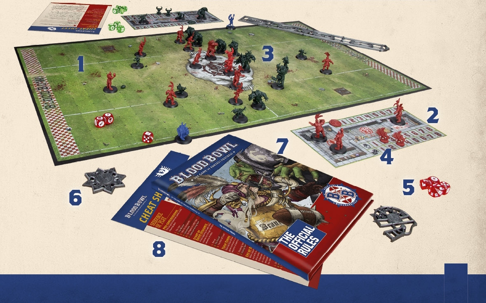

# THE GAME OF BLOOD BOWL

Blood Bowl is undeniably the greatest game ever played. Not only is it the world's most popular game of fantasy football but, in the eyes of its legions of loyal followers the world over, t is a game like no other: tactical, challenging, emotional and, at times, outrageously funny!

To play a game of Blood Bowl, there are a few key items you will need. Before exploring the world of Blood Bowl and the rules of the game in further detail, let us take a look at a game in action and list the vital components required:

1. A BLOOD BOWL PITCH.
This is a foldout cardboard playing surface, marked out to emulate a pitch that might be found in the Blood Bowl world.

2. TWO CARDBOARD 'DUGOUTS'.
These are used to keep track of game information, as well as providing somewhere to place reserve or injured players.

3. TWO TEAMS OF PLAYERS.
There are many teams available from Games Workshop, representing the many different races that play the game.

4. TEAM TOKENS.
These are used to keep track of game information on your team dugout.

5. DICE.
The game of Blood Bowl uses regular six-sided dice, block dice, as well as eight-sided and 16-sided dice, to bring the action to life.

6. RULERS AND TEMPLATES.
These are used for passing the ball, determining where a bouncing ball lands, and so on.

7. THE RULEBOOK.
The one you are holding is ideal! In this book you will find the complete rules for the game of Blood Bowl.

8. QUICK REFERENCE CARDS.
The Blood Bowl starter set contains two Quick Reference cards, an ideal tool to be reminded of the game sequence and frequently used tables.

