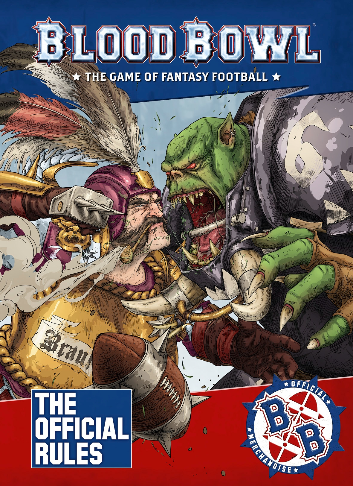
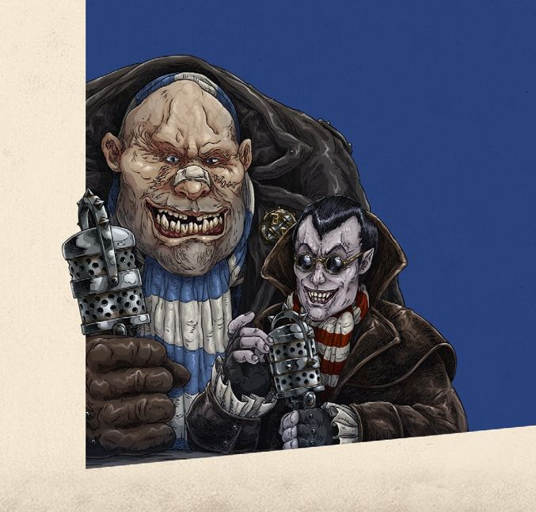

## GREETINGS SPORTS FANS!

Welcome to the world of Blood Bowl, the game of fantasy football!

In Blood Bowl, you take the role of coach of your very own team, leading 11 armoured, spike-adorned, blood-thirsty maniacs onto the pitch where you’ll be seeking to defeat your rivals in as entertaining and violent a manner as possible! If you’re lucky, you’ll earn fame, fortune and the adulation of your fans along the way! 

In this book you will find everything you need to know to play the great game. From the core mechanics to the complexities of league play and more besides, this book has it all covered. In addition to the game rules, you’ll find Inducements, full and complete lists of Skills and Traits, in-depth rules for player progression over the course of a season, team rosters, rules for
using Star Players, referees and more besides!

So, strap on your spiked helmet and ready your game face; practice is over and it’s time to play Blood Bowl!

* "Good evening! I’m Bob Bifford, welcoming you once again to an evening of thrilling sports action! You join a capacity crowd, eagerly anticipating this clash of champions. Before kick-off we’ve just got time to recap recent events for the benefit of anyone who has been living under a stone (and a hearty good evening to Snotlings everywhere!), and to do that I’m joined as ever by Jim Johnson. Evening, Jim!"

* "Thank you, Bob! Well, good evening, and boy, are you folks in for a great night of top-class sporting entertainment! And first, let me just say that it’s been quite the season so far, isn’t that so, Bob?"

* "How right you are, Jim!"

* "It’s been a tumultuous decade for fans of Blood Bowl. Since the collapse of the NAF, numerous exciting new leagues have sprung up and the face of the game has changed considerably. It seems that every week a new team has joined the circuit, bringing with it some new gimmick to surprise and delight the fans! And this season has been no exception. We’re witness today to a clash between two new teams: the Bogenhafen Barons and the Thunder Valley Greenskins. Squads that no one had even heard of just a few short months ago, but who now stand poised on the brink of greatness!"

* "That’s right, Jim. Joined as they are by two sporting megastars, Griff Oberwald and Varag Ghoul-Chewer, we can be assured that, new though these teams are, we’re in for a classic grudge match!"

* "Indeed, Bob. This game is sure to be one to remember!"

## THE GAME OF BLOOD BOWL

Blood Bowl is undeniably the greatest game ever played. Not only is it the world's most popular game of fantasy football but, in the eyes of its legions of loyal followers the world over, t is a game like no other: tactical, challenging, emotional and, at times, outrageously funny!

To play a game of Blood Bowl, there are a few key items you will need. Before exploring the world of Blood Bowl and the rules of the game in further detail, let us take a look at a game in action and list the vital components required:

1. A BLOOD BOWL PITCH.
This is a foldout cardboard playing surface, marked out to emulate a pitch that might be found in the Blood Bowl world.

2. TWO CARDBOARD 'DUGOUTS'.
These are used to keep track of game information, as well as providing somewhere to place reserve or injured players.

3. TWO TEAMS OF PLAYERS.
There are many teams available from Games Workshop, representing the many different races that play the game.

4. TEAM TOKENS. 
These are used to keep track of game information on your team dugout.

5. DICE. 
The game of Blood Bowl uses regular six-sided dice, block dice, as well as eight-sided and 16-sided dice, to bring the action to life.

6. RULERS AND TEMPLATES.
These are used for passing the ball, determining where a bouncing ball lands, and so on.

7. THE RULEBOOK. 
The one you are holding is ideal! In this book you will find the complete rules for the game of Blood Bowl.

8. QUICK REFERENCE CARDS.
The Blood Bowl starter set contains two Quick Reference cards, an ideal tool to be reminded of the game sequence and frequently used tables.

