**\* THE GAME OF FANTASY FOOTBALL \***

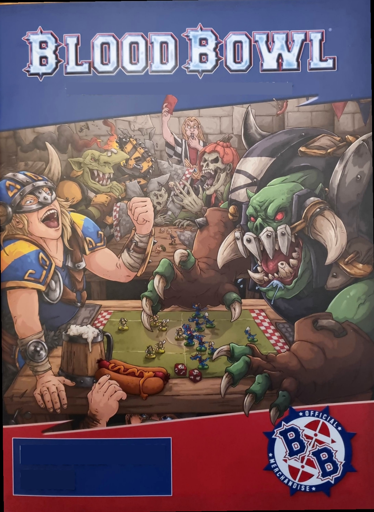

**MATCHED PLAY** **GUIDE**

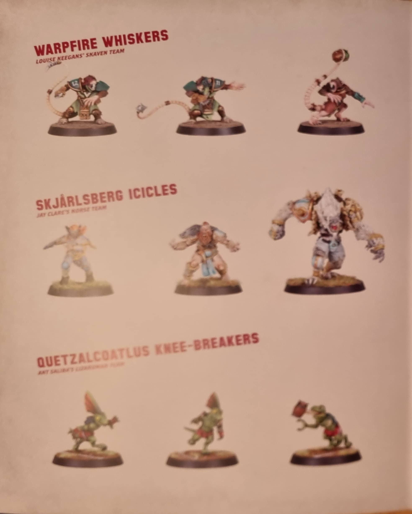

**GRUMDIR TRAVELLERS**

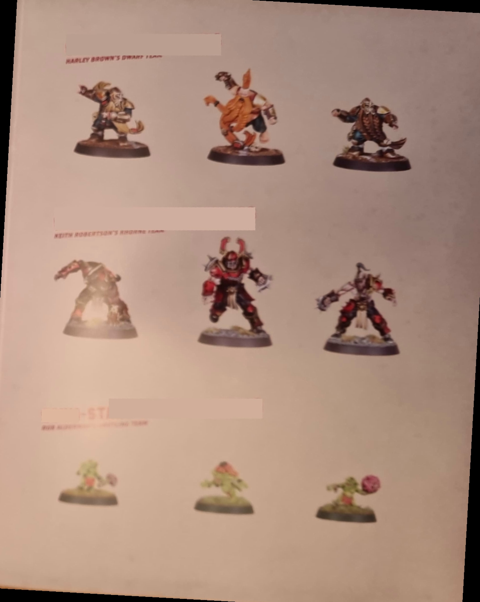

**BLOOD MARSH SKULLTAKERS**
>
**SCUM \\RS OF THE UilVERSE**

+-----------+-----+------+---------+---+-------+------+---------------+
| Foreword  |     |      |         |   |       |      |               |
| from Jim  |     |      |         |   |       |      |               |
| & Bob     |     |      |         |   |       |      |               |
+===========+=====+======+=========+===+=======+======+===============+
| Int |     |      |         |   |       |      |               |
| roduction |     |      |         |   |       |      |               |
+-----------+-----+------+---------+---+-------+------+---------------+
| Code    | of  |      | duct  |   |       |      |               |
|           | Con |      |         |   |       |      |               |
+-----------+-----+------+---------+---+-------+------+---------------+
| Re      |     |      |         |   |       |      |               |
| commended |     |      |         |   |       |      |               |
| T       |     |      |         |   |       |      |               |
| ournament |     |      |         |   |       |      |               |
| Style   |     |      |         |   |       |      |               |
+-----------+-----+------+---------+---+-------+------+---------------+
| T       |     |      |         |   |       |      |               |
| ournament |     |      |         |   |       |      |               |
| Rules   |     |      |         |   |       |      |               |
+-----------+-----+------+---------+---+-------+------+---------------+
| Scoring |     |      |         |   |       |      |               |
| &       |     |      |         |   |       |      |               |
| Ti      |     |      |         |   |       |      |               |
| ebreakers |     |      |         |   |       |      |               |
+-----------+-----+------+---------+---+-------+------+---------------+
|         |     |      |         |   |       |      |               |
|  Pairings |     |      |         |   |       |      |               |
+-----------+-----+------+---------+---+-------+------+---------------+

+----+------+-----------------------+---------+-----------+----------+
|  |      |                       |         |           |          |
|  3 |      |                       |         |           |          |
+====+======+=======================+=========+===========+==========+
|    |      |                       |         |           |          |
+----+------+-----------------------+---------+-----------+----------+
|  |      |                       |         |           |          |
|  4 |      |                       |         |           |          |
+----+------+-----------------------+---------+-----------+----------+
|  |      |                       |         |           |          |
|  5 |      |                       |         |           |          |
|  |      |                       |         |           |          |
|  S |      |                       |         |           |          |
| ki |      |                       |         |           |          |
| ll |      |                       |         |           |          |
|  |      |                       |         |           |          |
| Po |      |                       |         |           |          |
| in |      |                       |         |           |          |
| ts |      |                       |         |           |          |
+----+------+-----------------------+---------+-----------+----------+
| .6 |    |                       |         |           |          |
|    |  Pra |                       |         |           |          |
|    | yers |                       |         |           |          |
|    | to |                       |         |           |          |
|    | Nu |                       |         |           |          |
|    | ffle |                       |         |           |          |
|    |    |                       |         |           |          |
|    | \... |                       |         |           |          |
+----+------+-----------------------+---------+-----------+----------+
| .7 | Po |                       |         |           |          |
|    | st-M |                       |         |           |          |
|    | atch |                       |         |           |          |
+----+------+-----------------------+---------+-----------+----------+
| .8 | Aw |                       |         |           |          |
|    | ards |                       |         |           |          |
+----+------+-----------------------+---------+-----------+----------+
| .9 |    |                       |         |           |          |
|    |  Alt |                       |         |           |          |
|    | erna |                       |         |           |          |
|    | tive |                       |         |           |          |
|    |    |                       |         |           |          |
|    |  For |                       |         |           |          |
|    | mats |                       |         |           |          |
+----+------+-----------------------+---------+-----------+----------+

+------------+---------------------------------------------------------+
| 10 Group & |                                                         |
| Knockout   |                                                         |
| Events     |                                                         |
+============+=========================================================+
|            | Knockout Table Wallchart                              |
+------------+---------------------------------------------------------+

Additional Rules\
Blood Bowl Events\
at Warhammer World

22 23 24

30

+---+-----------+---+---------------------------------+---+------------+---+
|   | *Blood  |   |                                 |   |            |   |
|   | Bowl    |   |                                 |   |            |   |
|   | Matched |   |                                 |   |            |   |
|   | Play    |   |                                 |   |            |   |
|   | Guide*  |   |                                 |   |            |   |
|   | ©       |   |                                 |   |            |   |
|   |         |   |                                 |   |            |   |
|   | Copyright |   |                                 |   |            |   |
|   | Games   |   |                                 |   |            |   |
|   |         |   |                                 |   |            |   |
|   |  Workshop |   |                                 |   |            |   |
|   | Limited |   |                                 |   |            |   |
|   | 2022.   |   |                                 |   |            |   |
|   | Blood   |   |                                 |   |            |   |
|   | Bowl,   |   |                                 |   |            |   |
|   | Blood   |   |                                 |   |            |   |
|   | Bowl    |   |                                 |   |            |   |
|   | The     |   |                                 |   |            |   |
|   | Game of |   |                                 |   |            |   |
|   | Fantasy |   |                                 |   |            |   |
|   |         |   |                                 |   |            |   |
|   |  Football |   |                                 |   |            |   |
+===+===========+===+=================================+===+============+===+
| * |           |   |                                 |   |            |   |
| S |           |   |                                 |   |            |   |
| p |           |   |                                 |   |            |   |
| i |           |   |                                 |   |            |   |
| k |           |   |                                 |   |            |   |
| e |           |   |                                 |   |            |   |
| ! |           |   |                                 |   |            |   |
| T |           |   |                                 |   |            |   |
| h |           |   |                                 |   |            |   |
| e |           |   |                                 |   |            |   |
| F |           |   |                                 |   |            |   |
| a |           |   |                                 |   |            |   |
| n |           |   |                                 |   |            |   |
| t |           |   |                                 |   |            |   |
| a |           |   |                                 |   |            |   |
| s |           |   |                                 |   |            |   |
| y |           |   |                                 |   |            |   |
| F |           |   |                                 |   |            |   |
| o |           |   |                                 |   |            |   |
| o |           |   |                                 |   |            |   |
| t |           |   |                                 |   |            |   |
| b |           |   |                                 |   |            |   |
| a |           |   |                                 |   |            |   |
| l |           |   |                                 |   |            |   |
| l |           |   |                                 |   |            |   |
| J |           |   |                                 |   |            |   |
| o |           |   |                                 |   |            |   |
| u |           |   |                                 |   |            |   |
| r |           |   |                                 |   |            |   |
| n |           |   |                                 |   |            |   |
| a |           |   |                                 |   |            |   |
| l |           |   |                                 |   |            |   |
| , |           |   |                                 |   |            |   |
| * |           |   |                                 |   |            |   |
| D |           |   |                                 |   |            |   |
| u |           |   |                                 |   |            |   |
| n |           |   |                                 |   |            |   |
| g |           |   |                                 |   |            |   |
| e |           |   |                                 |   |            |   |
| o |           |   |                                 |   |            |   |
| n |           |   |                                 |   |            |   |
| B |           |   |                                 |   |            |   |
| o |           |   |                                 |   |            |   |
| w |           |   |                                 |   |            |   |
| l |           |   |                                 |   |            |   |
| , |           |   |                                 |   |            |   |
| C |           |   |                                 |   |            |   |
| i |           |   |                                 |   |            |   |
| t |           |   |                                 |   |            |   |
| a |           |   |                                 |   |            |   |
| d |           |   |                                 |   |            |   |
| e |           |   |                                 |   |            |   |
| l |           |   |                                 |   |            |   |
| , |           |   |                                 |   |            |   |
| G |           |   |                                 |   |            |   |
| a |           |   |                                 |   |            |   |
| m |           |   |                                 |   |            |   |
| e |           |   |                                 |   |            |   |
| s |           |   |                                 |   |            |   |
| W |           |   |                                 |   |            |   |
| o |           |   |                                 |   |            |   |
| r |           |   |                                 |   |            |   |
| k |           |   |                                 |   |            |   |
| s |           |   |                                 |   |            |   |
| h |           |   |                                 |   |            |   |
| o |           |   |                                 |   |            |   |
| p |           |   |                                 |   |            |   |
| , |           |   |                                 |   |            |   |
| G |           |   |                                 |   |            |   |
| W |           |   |                                 |   |            |   |
| , |           |   |                                 |   |            |   |
| W |           |   |                                 |   |            |   |
| a |           |   |                                 |   |            |   |
| r |           |   |                                 |   |            |   |
| h |           |   |                                 |   |            |   |
| a |           |   |                                 |   |            |   |
| m |           |   |                                 |   |            |   |
| m |           |   |                                 |   |            |   |
| e |           |   |                                 |   |            |   |
| r |           |   |                                 |   |            |   |
| , |           |   |                                 |   |            |   |
| t |           |   |                                 |   |            |   |
| h |           |   |                                 |   |            |   |
| e |           |   |                                 |   |            |   |
| \ |           |   |                                 |   |            |   |
| ' |           |   |                                 |   |            |   |
| w |           |   |                                 |   |            |   |
| i |           |   |                                 |   |            |   |
| n |           |   |                                 |   |            |   |
| g |           |   |                                 |   |            |   |
| e |           |   |                                 |   |            |   |
| d |           |   |                                 |   |            |   |
| - |           |   |                                 |   |            |   |
| h |           |   |                                 |   |            |   |
| a |           |   |                                 |   |            |   |
| m |           |   |                                 |   |            |   |
| m |           |   |                                 |   |            |   |
| e |           |   |                                 |   |            |   |
| r |           |   |                                 |   |            |   |
| \ |           |   |                                 |   |            |   |
| ' |           |   |                                 |   |            |   |
| W |           |   |                                 |   |            |   |
| a |           |   |                                 |   |            |   |
| r |           |   |                                 |   |            |   |
| h |           |   |                                 |   |            |   |
| a |           |   |                                 |   |            |   |
| m |           |   |                                 |   |            |   |
| m |           |   |                                 |   |            |   |
| e |           |   |                                 |   |            |   |
| r |           |   |                                 |   |            |   |
| g |           |   |                                 |   |            |   |
| , |           |   |                                 |   |            |   |
+---+-----------+---+---------------------------------+---+------------+---+
|   |           | |                                 |   |            |   |
|   |           |   |                                 |   |            |   |
|   |           | a |                                 |   |            |   |
|   |           | n |                                 |   |            |   |
|   |           | d |                                 |   |            |   |
|   |           | |                                 |   |            |   |
|   |           |   |                                 |   |            |   |
|   |           | a |                                 |   |            |   |
|   |           | l |                                 |   |            |   |
|   |           | l |                                 |   |            |   |
|   |           | |                                 |   |            |   |
|   |           |   |                                 |   |            |   |
|   |           | a |                                 |   |            |   |
|   |           | s |                                 |   |            |   |
|   |           | s |                                 |   |            |   |
|   |           | o |                                 |   |            |   |
|   |           | c |                                 |   |            |   |
|   |           | i |                                 |   |            |   |
|   |           | a |                                 |   |            |   |
|   |           | t |                                 |   |            |   |
|   |           | e |                                 |   |            |   |
|   |           | d |                                 |   |            |   |
|   |           | |                                 |   |            |   |
|   |           |   |                                 |   |            |   |
|   |           | l |                                 |   |            |   |
|   |           | o |                                 |   |            |   |
|   |           | g |                                 |   |            |   |
|   |           | o |                                 |   |            |   |
|   |           | s |                                 |   |            |   |
|   |           | , |                                 |   |            |   |
|   |           | |                                 |   |            |   |
|   |           |   |                                 |   |            |   |
|   |           | n |                                 |   |            |   |
|   |           | a |                                 |   |            |   |
|   |           | m |                                 |   |            |   |
|   |           | e |                                 |   |            |   |
|   |           | s |                                 |   |            |   |
|   |           | , |                                 |   |            |   |
|   |           | |                                 |   |            |   |
|   |           |   |                                 |   |            |   |
|   |           | r |                                 |   |            |   |
|   |           | a |                                 |   |            |   |
|   |           | c |                                 |   |            |   |
|   |           | e |                                 |   |            |   |
|   |           | s |                                 |   |            |   |
|   |           | , |                                 |   |            |   |
|   |           | |                                 |   |            |   |
|   |           |   |                                 |   |            |   |
|   |           | v |                                 |   |            |   |
|   |           | e |                                 |   |            |   |
|   |           | h |                                 |   |            |   |
|   |           | i |                                 |   |            |   |
|   |           | c |                                 |   |            |   |
|   |           | l |                                 |   |            |   |
|   |           | e |                                 |   |            |   |
|   |           | s |                                 |   |            |   |
|   |           | , |                                 |   |            |   |
|   |           | |                                 |   |            |   |
|   |           |   |                                 |   |            |   |
|   |           | w |                                 |   |            |   |
|   |           | e |                                 |   |            |   |
|   |           | a |                                 |   |            |   |
|   |           | p |                                 |   |            |   |
|   |           | o |                                 |   |            |   |
|   |           | n |                                 |   |            |   |
|   |           | s |                                 |   |            |   |
|   |           | |                                 |   |            |   |
|   |           |   |                                 |   |            |   |
|   |           | a |                                 |   |            |   |
|   |           | n |                                 |   |            |   |
|   |           | d |                                 |   |            |   |
|   |           | |                                 |   |            |   |
|   |           |   |                                 |   |            |   |
|   |           | c |                                 |   |            |   |
|   |           | h |                                 |   |            |   |
|   |           | a |                                 |   |            |   |
|   |           | r |                                 |   |            |   |
|   |           | a |                                 |   |            |   |
|   |           | c |                                 |   |            |   |
|   |           | t |                                 |   |            |   |
|   |           | e |                                 |   |            |   |
|   |           | r |                                 |   |            |   |
|   |           | s |                                 |   |            |   |
|   |           | |                                 |   |            |   |
|   |           |   |                                 |   |            |   |
|   |           | a |                                 |   |            |   |
|   |           | r |                                 |   |            |   |
|   |           | e |                                 |   |            |   |
|   |           | |                                 |   |            |   |
|   |           |   |                                 |   |            |   |
|   |           | e |                                 |   |            |   |
|   |           | i |                                 |   |            |   |
|   |           | t |                                 |   |            |   |
|   |           | h |                                 |   |            |   |
|   |           | e |                                 |   |            |   |
|   |           | r |                                 |   |            |   |
+---+-----------+---+---------------------------------+---+------------+---+
|   |           |   | ® or TM and/or © Games        |   |            |   |
|   |           |   | Workshop Limited. All Rights  |   |            |   |
|   |           |   | Reserved.                     |   |            |   |
+---+-----------+---+---------------------------------+---+------------+---+

+---+----------------------------------------------------------------+---+
| |                                                                |   |
|   |                                                                |   |
| N |                                                                |   |
| o |                                                                |   |
| |                                                                |   |
|   |                                                                |   |
| p |                                                                |   |
| a |                                                                |   |
| r |                                                                |   |
| t |                                                                |   |
| |                                                                |   |
|   |                                                                |   |
| o |                                                                |   |
| f |                                                                |   |
| |                                                                |   |
|   |                                                                |   |
| t |                                                                |   |
| h |                                                                |   |
| i |                                                                |   |
| s |                                                                |   |
| |                                                                |   |
|   |                                                                |   |
| p |                                                                |   |
| u |                                                                |   |
| b |                                                                |   |
| l |                                                                |   |
| i |                                                                |   |
| c |                                                                |   |
| a |                                                                |   |
| t |                                                                |   |
| i |                                                                |   |
| o |                                                                |   |
| n |                                                                |   |
| |                                                                |   |
|   |                                                                |   |
| m |                                                                |   |
| a |                                                                |   |
| y |                                                                |   |
| |                                                                |   |
|   |                                                                |   |
| b |                                                                |   |
| e |                                                                |   |
| |                                                                |   |
|   |                                                                |   |
| r |                                                                |   |
| e |                                                                |   |
| p |                                                                |   |
| r |                                                                |   |
| o |                                                                |   |
| d |                                                                |   |
| u |                                                                |   |
| c |                                                                |   |
| e |                                                                |   |
| d |                                                                |   |
| , |                                                                |   |
| |                                                                |   |
|   |                                                                |   |
| s |                                                                |   |
| t |                                                                |   |
| o |                                                                |   |
| r |                                                                |   |
| e |                                                                |   |
| d |                                                                |   |
| |                                                                |   |
|   |                                                                |   |
| i |                                                                |   |
| n |                                                                |   |
| |                                                                |   |
|   |                                                                |   |
| a |                                                                |   |
| |                                                                |   |
|   |                                                                |   |
| r |                                                                |   |
| e |                                                                |   |
| t |                                                                |   |
| r |                                                                |   |
| i |                                                                |   |
| e |                                                                |   |
| v |                                                                |   |
| a |                                                                |   |
| l |                                                                |   |
| |                                                                |   |
|   |                                                                |   |
| s |                                                                |   |
| y |                                                                |   |
| s |                                                                |   |
| t |                                                                |   |
| e |                                                                |   |
| m |                                                                |   |
| , |                                                                |   |
| |                                                                |   |
|   |                                                                |   |
| o |                                                                |   |
| r |                                                                |   |
| |                                                                |   |
|   |                                                                |   |
| t |                                                                |   |
| r |                                                                |   |
| a |                                                                |   |
| n |                                                                |   |
| s |                                                                |   |
| m |                                                                |   |
| i |                                                                |   |
| t |                                                                |   |
| t |                                                                |   |
| e |                                                                |   |
| d |                                                                |   |
| |                                                                |   |
|   |                                                                |   |
| i |                                                                |   |
| n |                                                                |   |
| |                                                                |   |
|   |                                                                |   |
| a |                                                                |   |
| n |                                                                |   |
| y |                                                                |   |
| |                                                                |   |
|   |                                                                |   |
| f |                                                                |   |
| o |                                                                |   |
| r |                                                                |   |
| m |                                                                |   |
| |                                                                |   |
|   |                                                                |   |
| o |                                                                |   |
| r |                                                                |   |
| |                                                                |   |
|   |                                                                |   |
| b |                                                                |   |
| y |                                                                |   |
| |                                                                |   |
|   |                                                                |   |
| a |                                                                |   |
| n |                                                                |   |
| y |                                                                |   |
| |                                                                |   |
|   |                                                                |   |
| m |                                                                |   |
| e |                                                                |   |
| a |                                                                |   |
| n |                                                                |   |
| s |                                                                |   |
+===+================================================================+===+
|   | electronic, mechanical, photocopying, recording or           |   |
|   | otherwise, without the prior permission of the publishers.   |   |
+---+----------------------------------------------------------------+---+

+------+-------------------------------------------------------+------+
|    |                                                       |      |
| This |                                                       |      |
| is |                                                       |      |
| a  |                                                       |      |
|    |                                                       |      |
| work |                                                       |      |
| of |                                                       |      |
|    |                                                       |      |
| fict |                                                       |      |
| ion. |                                                       |      |
|    |                                                       |      |
|  All |                                                       |      |
|    |                                                       |      |
|  the |                                                       |      |
| ch |                                                       |      |
| arac |                                                       |      |
| ters |                                                       |      |
|    |                                                       |      |
|  and |                                                       |      |
| ev |                                                       |      |
| ents |                                                       |      |
| p  |                                                       |      |
| ortr |                                                       |      |
| ayed |                                                       |      |
| in |                                                       |      |
|    |                                                       |      |
| this |                                                       |      |
|    |                                                       |      |
| book |                                                       |      |
|    |                                                       |      |
|  are |                                                       |      |
| fi |                                                       |      |
| ctio |                                                       |      |
| nal, |                                                       |      |
+======+=======================================================+======+
|      | and any resemblance to real people or incidents is  |      |
|      | purely coincidental.                                |      |
+------+-------------------------------------------------------+------+

British Catalogumg-m-Publication Data A catalogue record for this book
is available from the British Library.

+---+--------------------------------------------------------------+---+
| |                                                              |   |
|   |                                                              |   |
| G |                                                              |   |
| a |                                                              |   |
| m |                                                              |   |
| e |                                                              |   |
| s |                                                              |   |
| |                                                              |   |
|   |                                                              |   |
| W |                                                              |   |
| o |                                                              |   |
| r |                                                              |   |
| k |                                                              |   |
| s |                                                              |   |
| h |                                                              |   |
| o |                                                              |   |
| p |                                                              |   |
| |                                                              |   |
|   |                                                              |   |
| W |                                                              |   |
| e |                                                              |   |
| b |                                                              |   |
| |                                                              |   |
|   |                                                              |   |
| s |                                                              |   |
| i |                                                              |   |
| t |                                                              |   |
| e |                                                              |   |
| : |                                                              |   |
| |                                                              |   |
|   |                                                              |   |
| [ |                                                              |   |
| w |                                                              |   |
| w |                                                              |   |
| w |                                                              |   |
| . |                                                              |   |
| w |                                                              |   |
| a |                                                              |   |
| r |                                                              |   |
| h |                                                              |   |
| a |                                                              |   |
| m |                                                              |   |
| m |                                                              |   |
| e |                                                              |   |
| r |                                                              |   |
| . |                                                              |   |
| c |                                                              |   |
| o |                                                              |   |
| m |                                                              |   |
| ] |                                                              |   |
| ( |                                                              |   |
| h |                                                              |   |
| t |                                                              |   |
| t |                                                              |   |
| p |                                                              |   |
| : |                                                              |   |
| / |                                                              |   |
| / |                                                              |   |
| w |                                                              |   |
| w |                                                              |   |
| w |                                                              |   |
| . |                                                              |   |
| w |                                                              |   |
| a |                                                              |   |
| r |                                                              |   |
| h |                                                              |   |
| a |                                                              |   |
| m |                                                              |   |
| m |                                                              |   |
| e |                                                              |   |
| r |                                                              |   |
| . |                                                              |   |
| c |                                                              |   |
| o |                                                              |   |
| m |                                                              |   |
| ) |                                                              |   |
+===+==============================================================+===+
|   | Forge World Web site: www.forgeworld co.uk                 |   |
+---+--------------------------------------------------------------+---+

***&WDPLAY GUM***

+-------------+--------------------+--------------------------------+---+
|             | **Greetings      |                                |   |
|             | sports fans, and |                                |   |
|             | welcome to the   |                                |   |
|             | *Blood***        |                                |   |
+=============+====================+================================+===+
|             | ***Bowl Matched    |                                |   |
|             | Play Guide!* I'm   |                                |   |
|             | Jim Johnson and    |                                |   |
|             | I'm**              |                                |   |
|             | **accompanied once |                                |   |
|             | more by my         |                                |   |
|             | celebrated         |                                |   |
|             | co-host,**         |                                |   |
+-------------+--------------------+--------------------------------+---+
| **the     |                    |                                |   |
| living    |                    |                                |   |
| legend,   |                    |                                |   |
| Bob       |                    |                                |   |
| B         |                    |                                |   |
| ifford!\"** |                    |                                |   |
+-------------+--------------------+--------------------------------+---+

+-------------------------------------------+--------------------------+
| **"Thanks, Jim, and we are here today to  |                          |
| talk about one of my favourite**          |                          |
+===========================================+==========================+
| **aspects of the great sport -          |                          |
| tournaments!\"**                        |                          |
+-------------------------------------------+--------------------------+

  -------------------------------------------------------------- --------
                                                                 

  -------------------------------------------------------------- --------

  -------------------------------------------------------------------- --
                                                                       

                                                                       
  -------------------------------------------------------------------- --

+-----------------------------------------------------------------------+
| \"Right you are, Bob! Competitions                                  |
+=======================================================================+
| are the very lifeblood of the game                                  |
+-----------------------------------------------------------------------+

pitting teams against one another as they strive to knock each other
out to progress, with the last team standing lifting the glittering
trophy
>
rat the end.\"
>
"\...the Knuckle Bowl, the Toof-Rippa
>
Trophy, the Mootland Cup\... \" \'\...and, of course, the Blood Bowl
>
itself, Jim!"
>
\'Yes, we get the picture, Bob. Oh, are
>
you still going?\" \"Yes, it\'s quite the impressive resume,
>
Bob! Though perhaps next time you could focus a bit more on the job
>
in hand rather than reliving your\
glory days"

  -- -------------------------------------------------------------- ------
                                                                    

  -- -------------------------------------------------------------- ------

"We don't have time for all that, Bob!
>
Anyway, the *Blood Bowl Matched* *Play Guide* is the ideal resource
for any organisation or philanthropist across the known world to hold
their own event, providing the rules and regulations that are required
to run such a spectacle.
>
\"So, you are still going, Bob. Right, well, I guess I'll just
continue then.

Of course, Blood Bowl tournaments are wildly popular, and no two events
are the same - though each will still possess the same exceptional
levels\
of exquisite violence, of course! This guide also serves as the ideal
fan

"Sorry, Jim, I just got carried away reminiscing about all the momentous

victories I\'ve had!"

"Well, I suppose I can't blame you really, Bob! Anyway, that\'s enough

from us Blood Bowl fans; we\'ll see you next time!\"
>
**3**
>
***INTRODUCTION***

+------------+-------------------------------------------------------+---+
|            | elcome, sports fans, to the *Blood* *Bowl Matched   |   |
|            | Play Guide\'.* In the                               |   |
+============+=======================================================+===+
| W w      |                                                       |   |
| world of |                                                       |   |
| Blood    |                                                       |   |
| Bowl,    |                                                       |   |
| t        |                                                       |   |
| ournaments |                                                       |   |
+------------+-------------------------------------------------------+---+

+------------------------------------------------------------------+---+---+
| are a common occurrence; numerous teams                          |   |   |
+==================================================================+===+===+
| jockeying for position and giving blood, sweat                 |   |   |
+------------------------------------------------------------------+---+---+
| and tears (but mainly blood!) in order to lift the               |   |   |
+------------------------------------------------------------------+---+---+
| glittering trophy at the end and earn the right                |   |   |
+------------------------------------------------------------------+---+---+
| to be called champions. Of course, this is much                |   |   |
+------------------------------------------------------------------+---+---+
| the same for us too (without the violence!) as there are       |   |   |
| countless tournaments and gaming                               |   |   |
+------------------------------------------------------------------+---+---+
| weekends held worldwide where coaches come                     |   |   |
+------------------------------------------------------------------+---+---+

together in a duel of wits on the gridiron!
>
lood Bowl has always thrived in a Matched Play

+-------+---------------------------------------------------------+---+
| ■K    |                                                         |   |
| set   |                                                         |   |
| ting, |                                                         |   |
| as    |                                                         |   |
| the   |                                                         |   |
| s     |                                                         |   |
| ports |                                                         |   |
| -like |                                                         |   |
| feel  |                                                         |   |
| of    |                                                         |   |
| the   |                                                         |   |
| game  |                                                         |   |
| lends |                                                         |   |
+=======+=========================================================+===+
|       | itself to being played in this way. As a result,      |   |
+-------+---------------------------------------------------------+---+
| co    |                                                         |   |
| aches |                                                         |   |
| and   |                                                         |   |
| l     |                                                         |   |
| eague |                                                         |   |
| com   |                                                         |   |
| missi |                                                         |   |
| oners |                                                         |   |
| have  |                                                         |   |
| been  |                                                         |   |
| ru    |                                                         |   |
| nning |                                                         |   |
+-------+---------------------------------------------------------+---+

+-----------------------------------------------------------------+----+
| their own tournaments and gaming weekends around the globe    |    |
| for many years, and they have proved to be                    |    |
+=================================================================+====+
| incredibly popular. This guide is designed to help coaches    |    |
+-----------------------------------------------------------------+----+

organise their own Matched Play events by providing\
a framework for them to run their tournaments with, including: what
roles and responsibilities an event will

**[CODE OF CONDUCT \~\~] \-\-\-\-\-\-\-\-\--\_**

+---------------------------------+-----------------------------+---+---+
| Tournaments and gaming        |                             |   |   |
| weekends should bejirst\~     |                             |   |   |
| d\~\~                         |                             |   |   |
+=================================+=============================+===+===+
| foremost, fun. The Code of    |                             |   |   |
| Conduct presented in this     |                             |   |   |
+---------------------------------+-----------------------------+---+---+
| guide is something we expect    |                             |   |   |
| all coaches to follow at all    |                             |   |   |
+---------------------------------+-----------------------------+---+---+
| times to ensure that they and |                             |   |   |
| their opponents always        |                             |   |   |
+---------------------------------+-----------------------------+---+---+
| have the best time possible.    |                             |   |   |
+---------------------------------+-----------------------------+---+---+

+----------------------------------------------------+-----------+---+---+
| **[RECOMMENDED TOURNAMENT\~STYLE---] |           |   |   |
| \~\~**                                           |           |   |   |
+====================================================+===========+===+===+
| Here, we present our recommended way for running |           |   |   |
+----------------------------------------------------+-----------+---+---+
| tournaments, including: what roles and           |           |   |   |
| responsibilities                                 |           |   |   |
+----------------------------------------------------+-----------+---+---+
| are required; how coaches score Tournament       |           |   |   |
| Points\'                                         |           |   |   |
+----------------------------------------------------+-----------+---+---+
| Tiebreakers; pairing opponents; and more.          |           |   |   |
+----------------------------------------------------+-----------+---+---+

**[ROSTER AND RESULTS SHEETS] \-\-\-\--**

+------------------------------------------------+-------------------+---+
| We have also provided a roster sheet and     |                   |   |
| results sheet                                |                   |   |
+================================================+===================+===+
| that Event Organisers have permission to       |                   |   |
| photocopy and hand out for each coach to fill  |                   |   |
| m.                                             |                   |   |
+------------------------------------------------+-------------------+---+
|                                                |                   |   |
+------------------------------------------------+-------------------+---+

**[ROSTER BUILDIN]**

+------------------------------------------------------------------+---+
| This section runs throu ; stc i )f building a team             |   |
+==================================================================+===+
| roster specifically for a i ament, including: how                |   |
+------------------------------------------------------------------+---+

many gold pieces a ter s to spend; how many skills

a team can take and select them; Star Players; Inducements; and any ;
i g else that will impact
>
optional special rules that Event Organisers can use in roster
building.
>
order to add that extra bit of flair to their event - after all,
>
Blood Bowl is a chaotic game at the best of times!

+--------------------+-------------------------------------------------+
| Within this      |                                                 |
| Matched Play     |                                                 |
| Guide you will   |                                                 |
| find             |                                                 |
+====================+=================================================+
| the following:     |                                                 |
+--------------------+-------------------------------------------------+

+----------------------------------------------------------------+-----+
| **[ALTERNATIVE                                               |     |
| FORMATS]\_\_\_\_\_\_\_\_\_\_\_\_**               |     |
+================================================================+=====+
| Here, we present a selection of formats that Event           |     |
+----------------------------------------------------------------+-----+
| Organisers may wish to use instead of the standard           |     |
+----------------------------------------------------------------+-----+
| tournament format, including team events and the ever-       |     |
+----------------------------------------------------------------+-----+

popular Stunty Tournament!

+-------------------------------+--------------------------------+----+
| **[ADDITIONAL                 |                                |    |
| RULES]**          |                                |    |
+===============================+================================+====+
| Some Event Organisers like  |                                |    |
| to add their own spin to    |                                |    |
| the standard format and we  |                                |    |
| have presented here a       |                                |    |
| number                      |                                |    |
|                               |                                |    |
| of different additional rules |                                |    |
| that they can use to add that |                                |    |
+-------------------------------+--------------------------------+----+
| extra bit of panache to their |                                |    |
| event: from injuries and      |                                |    |
+-------------------------------+--------------------------------+----+
| player progression, to Gold   |                                |    |
| Piece Escalation (see page 28 |                                |    |
+-------------------------------+--------------------------------+----+

and more.

  -----------------------------------------------------------------------
  **CODE OF**                                                     
  --------------------------------------------------------------- -------
  **CONDUCT**                                                     

  -----------------------------------------------------------------------

+---------------------------------------------------------------+------+
| **s the old adage goes: "It's not the**     |      |
+===============================================================+======+
| **winning or losing that counts, but the**                    |      |
+---------------------------------------------------------------+------+

**fair play, good humour and showing respect for** **one another are
paramount. As such, we have**

+--------------------------------------+---------------------+---+---+---+
| **we expect all Blood Bowl coaches |                     |   |   |   |
| to uphold at**                     |                     |   |   |   |
+======================================+=====================+===+===+===+
| **all times. After all, the most   |                     |   |   |   |
| important thing**                  |                     |   |   |   |
+--------------------------------------+---------------------+---+---+---+
| **is that everyone involved has a    |                     |   |   |   |
| thoroughly**                         |                     |   |   |   |
+--------------------------------------+---------------------+---+---+---+
| **enjoyable time during the course   |                     |   |   | * |
| of the gam**                         |                     |   |   | * |
|                                      |                     |   |   | e |
|                                      |                     |   |   | * |
|                                      |                     |   |   | * |
+--------------------------------------+---------------------+---+---+---+
| **that way, every bone-crunching   |                     |   |   |   |
| tackle,**                          |                     |   |   |   |
+--------------------------------------+---------------------+---+---+---+
| **spectacular weaving run and        |                     |   |   |   |
| pinpoint pass**                      |                     |   |   |   |
+--------------------------------------+---------------------+---+---+---+
| **means that little bit more!**      |                     |   |   |   |
+--------------------------------------+---------------------+---+---+---+

+----------------------------+-----------------------------------------+
| **[CARDINAL              |                                         |
| RULES]**     |                                         |
+============================+=========================================+
| -   Always be polite and   |                                         |
|     respectful to your     |                                         |
|     opponent at            |                                         |
+----------------------------+-----------------------------------------+

all times.

-   Always tell the truth and never cheat.

+---+------------------------------+---+------------------------+----+
| |                              |   |                        | e  |
|   |                              |   |                        | ,  |
| * |                              |   |                        |    |
| * |                              |   |                        |    |
| I |                              |   |                        |    |
| M |                              |   |                        |    |
| P |                              |   |                        |    |
| O |                              |   |                        |    |
| R |                              |   |                        |    |
| T |                              |   |                        |    |
| A |                              |   |                        |    |
| N |                              |   |                        |    |
| T |                              |   |                        |    |
| |                              |   |                        |    |
|   |                              |   |                        |    |
| P |                              |   |                        |    |
| R |                              |   |                        |    |
| I |                              |   |                        |    |
| N |                              |   |                        |    |
| C |                              |   |                        |    |
| I |                              |   |                        |    |
| P |                              |   |                        |    |
| L |                              |   |                        |    |
| E |                              |   |                        |    |
| S |                              |   |                        |    |
| * |                              |   |                        |    |
| * |                              |   |                        |    |
+===+==============================+===+========================+====+
| - |                              |   |                        |    |
|   |                              |   |                        |    |
|   |                              |   |                        |    |
|   |                              |   |                        |    |
| M |                              |   |                        |    |
| a |                              |   |                        |    |
| k |                              |   |                        |    |
| e |                              |   |                        |    |
|   |                              |   |                        |    |
|   |                              |   |                        |    |
|   |                              |   |                        |    |
|   |                              |   |                        |    |
| |                              |   |                        |    |
|   |                              |   |                        |    |
| a |                              |   |                        |    |
|   |                              |   |                        |    |
|   |                              |   |                        |    |
|   |                              |   |                        |    |
|   |                              |   |                        |    |
| |                              |   |                        |    |
|   |                              |   |                        |    |
| r |                              |   |                        |    |
| e |                              |   |                        |    |
| s |                              |   |                        |    |
| p |                              |   |                        |    |
| e |                              |   |                        |    |
| c |                              |   |                        |    |
| t |                              |   |                        |    |
| f |                              |   |                        |    |
| u |                              |   |                        |    |
| l |                              |   |                        |    |
|   |                              |   |                        |    |
|   |                              |   |                        |    |
|   |                              |   |                        |    |
|   |                              |   |                        |    |
| |                              |   |                        |    |
|   |                              |   |                        |    |
| g |                              |   |                        |    |
| e |                              |   |                        |    |
| s |                              |   |                        |    |
| t |                              |   |                        |    |
| u |                              |   |                        |    |
| r |                              |   |                        |    |
| e |                              |   |                        |    |
|   |                              |   |                        |    |
|   |                              |   |                        |    |
|   |                              |   |                        |    |
|   |                              |   |                        |    |
| |                              |   |                        |    |
|   |                              |   |                        |    |
| t |                              |   |                        |    |
| o |                              |   |                        |    |
|   |                              |   |                        |    |
|   |                              |   |                        |    |
|   |                              |   |                        |    |
|   |                              |   |                        |    |
| |                              |   |                        |    |
|   |                              |   |                        |    |
| y |                              |   |                        |    |
| o |                              |   |                        |    |
| u |                              |   |                        |    |
| r |                              |   |                        |    |
|   |                              |   |                        |    |
|   |                              |   |                        |    |
|   |                              |   |                        |    |
|   |                              |   |                        |    |
| |                              |   |                        |    |
|   |                              |   |                        |    |
| o |                              |   |                        |    |
| p |                              |   |                        |    |
| p |                              |   |                        |    |
| o |                              |   |                        |    |
| n |                              |   |                        |    |
| e |                              |   |                        |    |
| n |                              |   |                        |    |
| t |                              |   |                        |    |
|   |                              |   |                        |    |
|   |                              |   |                        |    |
|   |                              |   |                        |    |
|   |                              |   |                        |    |
| |                              |   |                        |    |
|   |                              |   |                        |    |
| b |                              |   |                        |    |
| e |                              |   |                        |    |
| f |                              |   |                        |    |
| o |                              |   |                        |    |
| r |                              |   |                        |    |
+---+------------------------------+---+------------------------+----+
|   | the game begins, such as   |   |                        |    |
|   | wishing them good luck     |   |                        |    |
+---+------------------------------+---+------------------------+----+
| | offering a handshake, etc. |   |                        |    |
|   |                              |   |                        |    |
| • |                              |   |                        |    |
+---+------------------------------+---+------------------------+----+
|   | Avoid using language that    | y |                        |    |
|   |                              | o |                        |    |
|   |                              | u |                        |    |
|   |                              | r |                        |    |
|   |                              | o |                        |    |
|   |                              | p |                        |    |
|   |                              | p |                        |    |
|   |                              | o |                        |    |
|   |                              | n |                        |    |
|   |                              | e |                        |    |
|   |                              | n |                        |    |
|   |                              | t |                        |    |
|   |                              | o |                        |    |
|   |                              | r |                        |    |
|   |                              | t |                        |    |
|   |                              | h |                        |    |
|   |                              | o |                        |    |
|   |                              | s |                        |    |
|   |                              | e |                        |    |
+---+------------------------------+---+------------------------+----+
|   | around you may find          |   | .                    |    |
|   | offensive                    |   |                        |    |
+---+------------------------------+---+------------------------+----+
| - |                              |   |                        |    |
|   |                              |   |                        |    |
|   |                              |   |                        |    |
|   |                              |   |                        |    |
| A |                              |   |                        |    |
| r |                              |   |                        |    |
| r |                              |   |                        |    |
| i |                              |   |                        |    |
| v |                              |   |                        |    |
| e |                              |   |                        |    |
|   |                              |   |                        |    |
|   |                              |   |                        |    |
|   |                              |   |                        |    |
|   |                              |   |                        |    |
| o |                              |   |                        |    |
| n |                              |   |                        |    |
|   |                              |   |                        |    |
|   |                              |   |                        |    |
|   |                              |   |                        |    |
|   |                              |   |                        |    |
| t |                              |   |                        |    |
| i |                              |   |                        |    |
| m |                              |   |                        |    |
| e |                              |   |                        |    |
|   |                              |   |                        |    |
|   |                              |   |                        |    |
|   |                              |   |                        |    |
|   |                              |   |                        |    |
| * |                              |   |                        |    |
| f |                              |   |                        |    |
| o |                              |   |                        |    |
| r |                              |   |                        |    |
| * |                              |   |                        |    |
|   |                              |   |                        |    |
|   |                              |   |                        |    |
|   |                              |   |                        |    |
|   |                              |   |                        |    |
| y |                              |   |                        |    |
| o |                              |   |                        |    |
| u |                              |   |                        |    |
| r |                              |   |                        |    |
|   |                              |   |                        |    |
|   |                              |   |                        |    |
|   |                              |   |                        |    |
|   |                              |   |                        |    |
| g |                              |   |                        |    |
| a |                              |   |                        |    |
| m |                              |   |                        |    |
| e |                              |   |                        |    |
|   |                              |   |                        |    |
|   |                              |   |                        |    |
|   |                              |   |                        |    |
|   |                              |   |                        |    |
| w |                              |   |                        |    |
| i |                              |   |                        |    |
| t |                              |   |                        |    |
| h |                              |   |                        |    |
|   |                              |   |                        |    |
|   |                              |   |                        |    |
|   |                              |   |                        |    |
|   |                              |   |                        |    |
| a |                              |   |                        |    |
| l |                              |   |                        |    |
| l |                              |   |                        |    |
|   |                              |   |                        |    |
|   |                              |   |                        |    |
|   |                              |   |                        |    |
|   |                              |   |                        |    |
| * |                              |   |                        |    |
| o |                              |   |                        |    |
| f |                              |   |                        |    |
| * |                              |   |                        |    |
|   |                              |   |                        |    |
|   |                              |   |                        |    |
|   |                              |   |                        |    |
|   |                              |   |                        |    |
| t |                              |   |                        |    |
| h |                              |   |                        |    |
| e |                              |   |                        |    |
|   |                              |   |                        |    |
|   |                              |   |                        |    |
|   |                              |   |                        |    |
|   |                              |   |                        |    |
| t |                              |   |                        |    |
| h |                              |   |                        |    |
| i |                              |   |                        |    |
| n |                              |   |                        |    |
| g |                              |   |                        |    |
| s |                              |   |                        |    |
|   |                              |   |                        |    |
|   |                              |   |                        |    |
|   |                              |   |                        |    |
|   |                              |   |                        |    |
| y |                              |   |                        |    |
| o |                              |   |                        |    |
| u |                              |   |                        |    |
+---+------------------------------+---+------------------------+----+

+---+---------------+--------------------+-------------+----+----+---+---+
|   | need to     |                    |             |    |    |   |   |
|   | play.       |                    |             |    |    |   |   |
+===+===============+====================+=============+====+====+===+===+
| - |               |                    |             |    |    |   |   |
|   |               |                    |             |    |    |   |   |
|   |               |                    |             |    |    |   |   |
|   |               |                    |             |    |    |   |   |
| O |               |                    |             |    |    |   |   |
| f |               |                    |             |    |    |   |   |
| f |               |                    |             |    |    |   |   |
| e |               |                    |             |    |    |   |   |
| r |               |                    |             |    |    |   |   |
|   |               |                    |             |    |    |   |   |
|   |               |                    |             |    |    |   |   |
|   |               |                    |             |    |    |   |   |
|   |               |                    |             |    |    |   |   |
| |               |                    |             |    |    |   |   |
|   |               |                    |             |    |    |   |   |
| y |               |                    |             |    |    |   |   |
| o |               |                    |             |    |    |   |   |
| u |               |                    |             |    |    |   |   |
| r |               |                    |             |    |    |   |   |
|   |               |                    |             |    |    |   |   |
|   |               |                    |             |    |    |   |   |
|   |               |                    |             |    |    |   |   |
|   |               |                    |             |    |    |   |   |
| |               |                    |             |    |    |   |   |
|   |               |                    |             |    |    |   |   |
| o |               |                    |             |    |    |   |   |
| p |               |                    |             |    |    |   |   |
| p |               |                    |             |    |    |   |   |
| o |               |                    |             |    |    |   |   |
| n |               |                    |             |    |    |   |   |
| e |               |                    |             |    |    |   |   |
| n |               |                    |             |    |    |   |   |
| t |               |                    |             |    |    |   |   |
|   |               |                    |             |    |    |   |   |
|   |               |                    |             |    |    |   |   |
|   |               |                    |             |    |    |   |   |
|   |               |                    |             |    |    |   |   |
| |               |                    |             |    |    |   |   |
|   |               |                    |             |    |    |   |   |
| t |               |                    |             |    |    |   |   |
| h |               |                    |             |    |    |   |   |
| e |               |                    |             |    |    |   |   |
|   |               |                    |             |    |    |   |   |
|   |               |                    |             |    |    |   |   |
|   |               |                    |             |    |    |   |   |
|   |               |                    |             |    |    |   |   |
| |               |                    |             |    |    |   |   |
|   |               |                    |             |    |    |   |   |
| c |               |                    |             |    |    |   |   |
| h |               |                    |             |    |    |   |   |
| a |               |                    |             |    |    |   |   |
| n |               |                    |             |    |    |   |   |
| c |               |                    |             |    |    |   |   |
| e |               |                    |             |    |    |   |   |
|   |               |                    |             |    |    |   |   |
|   |               |                    |             |    |    |   |   |
|   |               |                    |             |    |    |   |   |
|   |               |                    |             |    |    |   |   |
| |               |                    |             |    |    |   |   |
|   |               |                    |             |    |    |   |   |
| t |               |                    |             |    |    |   |   |
| o |               |                    |             |    |    |   |   |
|   |               |                    |             |    |    |   |   |
|   |               |                    |             |    |    |   |   |
|   |               |                    |             |    |    |   |   |
|   |               |                    |             |    |    |   |   |
| |               |                    |             |    |    |   |   |
|   |               |                    |             |    |    |   |   |
| e |               |                    |             |    |    |   |   |
| x |               |                    |             |    |    |   |   |
| a |               |                    |             |    |    |   |   |
| m |               |                    |             |    |    |   |   |
| i |               |                    |             |    |    |   |   |
| n |               |                    |             |    |    |   |   |
| e |               |                    |             |    |    |   |   |
|   |               |                    |             |    |    |   |   |
|   |               |                    |             |    |    |   |   |
|   |               |                    |             |    |    |   |   |
|   |               |                    |             |    |    |   |   |
| |               |                    |             |    |    |   |   |
|   |               |                    |             |    |    |   |   |
| y |               |                    |             |    |    |   |   |
| o |               |                    |             |    |    |   |   |
| u |               |                    |             |    |    |   |   |
| r |               |                    |             |    |    |   |   |
|   |               |                    |             |    |    |   |   |
|   |               |                    |             |    |    |   |   |
|   |               |                    |             |    |    |   |   |
|   |               |                    |             |    |    |   |   |
| |               |                    |             |    |    |   |   |
|   |               |                    |             |    |    |   |   |
| t |               |                    |             |    |    |   |   |
| e |               |                    |             |    |    |   |   |
| a |               |                    |             |    |    |   |   |
| m |               |                    |             |    |    |   |   |
+---+---------------+--------------------+-------------+----+----+---+---+
|   | roster      |                    |             |    |    |   |   |
|   | before the  |                    |             |    |    |   |   |
|   | game        |                    |             |    |    |   |   |
|   | begins.     |                    |             |    |    |   |   |
+---+---------------+--------------------+-------------+----+----+---+---+
| - |               |                    |             |    |    |   |   |
|   |               |                    |             |    |    |   |   |
|   |               |                    |             |    |    |   |   |
|   |               |                    |             |    |    |   |   |
| I |               |                    |             |    |    |   |   |
| f |               |                    |             |    |    |   |   |
|   |               |                    |             |    |    |   |   |
|   |               |                    |             |    |    |   |   |
|   |               |                    |             |    |    |   |   |
|   |               |                    |             |    |    |   |   |
| y |               |                    |             |    |    |   |   |
| o |               |                    |             |    |    |   |   |
| u |               |                    |             |    |    |   |   |
| r |               |                    |             |    |    |   |   |
|   |               |                    |             |    |    |   |   |
|   |               |                    |             |    |    |   |   |
|   |               |                    |             |    |    |   |   |
|   |               |                    |             |    |    |   |   |
| o |               |                    |             |    |    |   |   |
| p |               |                    |             |    |    |   |   |
| p |               |                    |             |    |    |   |   |
| o |               |                    |             |    |    |   |   |
| n |               |                    |             |    |    |   |   |
| e |               |                    |             |    |    |   |   |
| n |               |                    |             |    |    |   |   |
| t |               |                    |             |    |    |   |   |
|   |               |                    |             |    |    |   |   |
|   |               |                    |             |    |    |   |   |
|   |               |                    |             |    |    |   |   |
|   |               |                    |             |    |    |   |   |
| h |               |                    |             |    |    |   |   |
| a |               |                    |             |    |    |   |   |
| s |               |                    |             |    |    |   |   |
|   |               |                    |             |    |    |   |   |
|   |               |                    |             |    |    |   |   |
|   |               |                    |             |    |    |   |   |
|   |               |                    |             |    |    |   |   |
| a |               |                    |             |    |    |   |   |
| n |               |                    |             |    |    |   |   |
| y |               |                    |             |    |    |   |   |
|   |               |                    |             |    |    |   |   |
|   |               |                    |             |    |    |   |   |
|   |               |                    |             |    |    |   |   |
|   |               |                    |             |    |    |   |   |
| q |               |                    |             |    |    |   |   |
| u |               |                    |             |    |    |   |   |
| e |               |                    |             |    |    |   |   |
| s |               |                    |             |    |    |   |   |
| t |               |                    |             |    |    |   |   |
| i |               |                    |             |    |    |   |   |
| o |               |                    |             |    |    |   |   |
| n |               |                    |             |    |    |   |   |
| s |               |                    |             |    |    |   |   |
|   |               |                    |             |    |    |   |   |
|   |               |                    |             |    |    |   |   |
|   |               |                    |             |    |    |   |   |
|   |               |                    |             |    |    |   |   |
| o |               |                    |             |    |    |   |   |
| r |               |                    |             |    |    |   |   |
|   |               |                    |             |    |    |   |   |
|   |               |                    |             |    |    |   |   |
|   |               |                    |             |    |    |   |   |
|   |               |                    |             |    |    |   |   |
| q |               |                    |             |    |    |   |   |
| u |               |                    |             |    |    |   |   |
| e |               |                    |             |    |    |   |   |
| r |               |                    |             |    |    |   |   |
| i |               |                    |             |    |    |   |   |
| e |               |                    |             |    |    |   |   |
| s |               |                    |             |    |    |   |   |
|   |               |                    |             |    |    |   |   |
|   |               |                    |             |    |    |   |   |
|   |               |                    |             |    |    |   |   |
|   |               |                    |             |    |    |   |   |
| a |               |                    |             |    |    |   |   |
| b |               |                    |             |    |    |   |   |
| o |               |                    |             |    |    |   |   |
| u |               |                    |             |    |    |   |   |
| t |               |                    |             |    |    |   |   |
+---+---------------+--------------------+-------------+----+----+---+---+
|   | your        |                    |             |    |    |   |   |
|   | roster, you |                    |             |    |    |   |   |
|   | should      |                    |             |    |    |   |   |
|   | answer them |                    |             |    |    |   |   |
|   | truthfully  |                    |             |    |    |   |   |
|   | and         |                    |             |    |    |   |   |
+---+---------------+--------------------+-------------+----+----+---+---+
|   | ensure your |                    |             |    |    |   |   |
|   | opponent    |                    |             |    |    |   |   |
|   | understands |                    |             |    |    |   |   |
|   | the answer. |                    |             |    |    |   |   |
+---+---------------+--------------------+-------------+----+----+---+---+
| |               |                    |             |    |    |   |   |
|   |               |                    |             |    |    |   |   |
| E |               |                    |             |    |    |   |   |
| n |               |                    |             |    |    |   |   |
| s |               |                    |             |    |    |   |   |
| u |               |                    |             |    |    |   |   |
| r |               |                    |             |    |    |   |   |
| e |               |                    |             |    |    |   |   |
| |               |                    |             |    |    |   |   |
|   |               |                    |             |    |    |   |   |
| t |               |                    |             |    |    |   |   |
| h |               |                    |             |    |    |   |   |
| a |               |                    |             |    |    |   |   |
| t |               |                    |             |    |    |   |   |
| |               |                    |             |    |    |   |   |
|   |               |                    |             |    |    |   |   |
| y |               |                    |             |    |    |   |   |
| o |               |                    |             |    |    |   |   |
| u |               |                    |             |    |    |   |   |
| r |               |                    |             |    |    |   |   |
| |               |                    |             |    |    |   |   |
|   |               |                    |             |    |    |   |   |
| o |               |                    |             |    |    |   |   |
| p |               |                    |             |    |    |   |   |
| p |               |                    |             |    |    |   |   |
| o |               |                    |             |    |    |   |   |
| n |               |                    |             |    |    |   |   |
| e |               |                    |             |    |    |   |   |
| n |               |                    |             |    |    |   |   |
| t |               |                    |             |    |    |   |   |
| |               |                    |             |    |    |   |   |
|   |               |                    |             |    |    |   |   |
| i |               |                    |             |    |    |   |   |
| s |               |                    |             |    |    |   |   |
| |               |                    |             |    |    |   |   |
|   |               |                    |             |    |    |   |   |
| a |               |                    |             |    |    |   |   |
| w |               |                    |             |    |    |   |   |
| a |               |                    |             |    |    |   |   |
| r |               |                    |             |    |    |   |   |
| e |               |                    |             |    |    |   |   |
| |               |                    |             |    |    |   |   |
|   |               |                    |             |    |    |   |   |
| o |               |                    |             |    |    |   |   |
| f |               |                    |             |    |    |   |   |
| |               |                    |             |    |    |   |   |
|   |               |                    |             |    |    |   |   |
| a |               |                    |             |    |    |   |   |
| n |               |                    |             |    |    |   |   |
| y |               |                    |             |    |    |   |   |
+---+---------------+--------------------+-------------+----+----+---+---+
|   |             |                    |             |    |    |   |   |
|   |  Inducements, |                    |             |    |    |   |   |
|   | or other    |                    |             |    |    |   |   |
|   | special     |                    |             |    |    |   |   |
|   | rules your  |                    |             |    |    |   |   |
|   | team has,   |                    |             |    |    |   |   |
+---+---------------+--------------------+-------------+----+----+---+---+

+---+-------------------------------------------+----------------------+
|   | and that they know what they do.        |                      |
+===+===========================================+======================+
| - |                                           |                      |
|   |                                           |                      |
|   |                                           |                      |
|   |                                           |                      |
| W |                                           |                      |
| h |                                           |                      |
| e |                                           |                      |
| n |                                           |                      |
|   |                                           |                      |
|   |                                           |                      |
|   |                                           |                      |
|   |                                           |                      |
| |                                           |                      |
|   |                                           |                      |
| c |                                           |                      |
| o |                                           |                      |
| u |                                           |                      |
| n |                                           |                      |
| t |                                           |                      |
| i |                                           |                      |
| n |                                           |                      |
| g |                                           |                      |
|   |                                           |                      |
|   |                                           |                      |
|   |                                           |                      |
|   |                                           |                      |
| |                                           |                      |
|   |                                           |                      |
| o |                                           |                      |
| u |                                           |                      |
| t |                                           |                      |
|   |                                           |                      |
|   |                                           |                      |
|   |                                           |                      |
|   |                                           |                      |
| |                                           |                      |
|   |                                           |                      |
| t |                                           |                      |
| h |                                           |                      |
| e |                                           |                      |
|   |                                           |                      |
|   |                                           |                      |
|   |                                           |                      |
|   |                                           |                      |
| |                                           |                      |
|   |                                           |                      |
| n |                                           |                      |
| u |                                           |                      |
| m |                                           |                      |
| b |                                           |                      |
| e |                                           |                      |
| r |                                           |                      |
|   |                                           |                      |
|   |                                           |                      |
|   |                                           |                      |
|   |                                           |                      |
| |                                           |                      |
|   |                                           |                      |
| o |                                           |                      |
| f |                                           |                      |
|   |                                           |                      |
|   |                                           |                      |
|   |                                           |                      |
|   |                                           |                      |
| |                                           |                      |
|   |                                           |                      |
| s |                                           |                      |
| q |                                           |                      |
| u |                                           |                      |
| a |                                           |                      |
| r |                                           |                      |
| e |                                           |                      |
| s |                                           |                      |
|   |                                           |                      |
|   |                                           |                      |
|   |                                           |                      |
|   |                                           |                      |
| |                                           |                      |
|   |                                           |                      |
| a |                                           |                      |
|   |                                           |                      |
|   |                                           |                      |
|   |                                           |                      |
|   |                                           |                      |
| |                                           |                      |
|   |                                           |                      |
| p |                                           |                      |
| l |                                           |                      |
| a |                                           |                      |
| y |                                           |                      |
| e |                                           |                      |
| r |                                           |                      |
+---+-------------------------------------------+----------------------+

+---------------------------------------------------------------------+---+
| is moving, do so carefully and accurately. You should             |   |
+=====================================================================+===+
| also allow your opponent the opportunity to check any               |   |
+---------------------------------------------------------------------+---+

+---+--------------------------+----------+-----------------+---+---+---+
|   | moves before you move  |          |                 |   |   |   |
|   | any models if they     |          |                 |   |   |   |
|   | wish.                  |          |                 |   |   |   |
+===+==========================+==========+=================+===+===+===+
| - |                          |          |                 |   |   |   |
|   |                          |          |                 |   |   |   |
|   |                          |          |                 |   |   |   |
|   |                          |          |                 |   |   |   |
| W |                          |          |                 |   |   |   |
| h |                          |          |                 |   |   |   |
| e |                          |          |                 |   |   |   |
| n |                          |          |                 |   |   |   |
|   |                          |          |                 |   |   |   |
|   |                          |          |                 |   |   |   |
|   |                          |          |                 |   |   |   |
|   |                          |          |                 |   |   |   |
| r |                          |          |                 |   |   |   |
| o |                          |          |                 |   |   |   |
| l |                          |          |                 |   |   |   |
| l |                          |          |                 |   |   |   |
| i |                          |          |                 |   |   |   |
| n |                          |          |                 |   |   |   |
| g |                          |          |                 |   |   |   |
|   |                          |          |                 |   |   |   |
|   |                          |          |                 |   |   |   |
|   |                          |          |                 |   |   |   |
|   |                          |          |                 |   |   |   |
| d |                          |          |                 |   |   |   |
| i |                          |          |                 |   |   |   |
| c |                          |          |                 |   |   |   |
| e |                          |          |                 |   |   |   |
| , |                          |          |                 |   |   |   |
|   |                          |          |                 |   |   |   |
|   |                          |          |                 |   |   |   |
|   |                          |          |                 |   |   |   |
|   |                          |          |                 |   |   |   |
| m |                          |          |                 |   |   |   |
| a |                          |          |                 |   |   |   |
| k |                          |          |                 |   |   |   |
| e |                          |          |                 |   |   |   |
|   |                          |          |                 |   |   |   |
|   |                          |          |                 |   |   |   |
|   |                          |          |                 |   |   |   |
|   |                          |          |                 |   |   |   |
| s |                          |          |                 |   |   |   |
| u |                          |          |                 |   |   |   |
| r |                          |          |                 |   |   |   |
| e |                          |          |                 |   |   |   |
|   |                          |          |                 |   |   |   |
|   |                          |          |                 |   |   |   |
|   |                          |          |                 |   |   |   |
|   |                          |          |                 |   |   |   |
| t |                          |          |                 |   |   |   |
| h |                          |          |                 |   |   |   |
| e |                          |          |                 |   |   |   |
| y |                          |          |                 |   |   |   |
|   |                          |          |                 |   |   |   |
|   |                          |          |                 |   |   |   |
|   |                          |          |                 |   |   |   |
|   |                          |          |                 |   |   |   |
| a |                          |          |                 |   |   |   |
| r |                          |          |                 |   |   |   |
| e |                          |          |                 |   |   |   |
|   |                          |          |                 |   |   |   |
|   |                          |          |                 |   |   |   |
|   |                          |          |                 |   |   |   |
|   |                          |          |                 |   |   |   |
| c |                          |          |                 |   |   |   |
| l |                          |          |                 |   |   |   |
| e |                          |          |                 |   |   |   |
| a |                          |          |                 |   |   |   |
| r |                          |          |                 |   |   |   |
| l |                          |          |                 |   |   |   |
| y |                          |          |                 |   |   |   |
|   |                          |          |                 |   |   |   |
|   |                          |          |                 |   |   |   |
|   |                          |          |                 |   |   |   |
|   |                          |          |                 |   |   |   |
| v |                          |          |                 |   |   |   |
| i |                          |          |                 |   |   |   |
| s |                          |          |                 |   |   |   |
| i |                          |          |                 |   |   |   |
| b |                          |          |                 |   |   |   |
| l |                          |          |                 |   |   |   |
| e |                          |          |                 |   |   |   |
+---+--------------------------+----------+-----------------+---+---+---+
| | to all players and allow |          |                 |   |   |   |
|   | your opponent to examine |          |                 |   |   |   |
| t | the                      |          |                 |   |   |   |
+---+--------------------------+----------+-----------------+---+---+---+
|   | rolls before picking up  |          |                 |   |   |   |
|   | the dice.                |          |                 |   |   |   |
+---+--------------------------+----------+-----------------+---+---+---+
|   | Always ask your          |          |                 |   |   |   |
|   | opponent's permission    |          |                 |   |   |   |
|   | before                   |          |                 |   |   |   |
+---+--------------------------+----------+-----------------+---+---+---+
|   | ouching their models.  |          |                 |   |   |   |
+---+--------------------------+----------+-----------------+---+---+---+

+--------------------------+------------------------------------+---+---+
| Remind your opponent   |                                    |   |   |
| about any rules they   |                                    |   |   |
| may                    |                                    |   |   |
+==========================+====================================+===+===+
| have forgotten to use,   |                                    |   |   |
| or they have used        |                                    |   |   |
| incorrectly,             |                                    |   |   |
+--------------------------+------------------------------------+---+---+
| especially when doing so |                                    |   |   |
| is to your opponent\'s   |                                    |   |   |
| benefit                  |                                    |   |   |
+--------------------------+------------------------------------+---+---+
| rather than your own.    |                                    |   |   |
+--------------------------+------------------------------------+---+---+

+--------------------+-------+--------------------------+------+---+---+---+
| Never            |       |                          |      |   |   |   |
| deliberately     |       |                          |      |   |   |   |
| manipulate the   |       |                          |      |   |   |   |
| amount of time a |       |                          |      |   |   |   |
+====================+=======+==========================+======+===+===+===+
| game takes in    |       |                          |      |   |   |   |
| order to gain an |       |                          |      |   |   |   |
| advantage,       |       |                          |      |   |   |   |
| either by        |       |                          |      |   |   |   |
+--------------------+-------+--------------------------+------+---+---+---+
| playing overly   |       |                          |      |   |   |   |
| quickly or by    |       |                          |      |   |   |   |
| wasting time.    |       |                          |      |   |   |   |
+--------------------+-------+--------------------------+------+---+---+---+
| Try not to       |       |                          |      |   |   |   |
| distract an      |       |                          |      |   |   |   |
| opponent when    |       |                          |      |   |   |   |
| they are trying  |       |                          |      |   |   |   |
| to concentrate   |       |                          |      |   |   |   |
| and always       |       |                          |      |   |   |   |
| ensure you       |       |                          |      |   |   |   |
| respect their    |       |                          |      |   |   |   |
+--------------------+-------+--------------------------+------+---+---+---+
| personal space.  |       |                          |      |   |   |   |
+--------------------+-------+--------------------------+------+---+---+---+
| Never complain   |       |                          |      |   |   |   |
| about your own   |       |                          |      |   |   |   |
| bad luck or your |       |                          |      |   |   |   |
+--------------------+-------+--------------------------+------+---+---+---+
| opponent\'s good |       |                          |      |   |   |   |
| luck.            |       |                          |      |   |   |   |
+--------------------+-------+--------------------------+------+---+---+---+
| Always be humble |       |                          |      |   |   |   |
| in victory and   |       |                          |      |   |   |   |
| graceful in      |       |                          |      |   |   |   |
| defeat.          |       |                          |      |   |   |   |
+--------------------+-------+--------------------------+------+---+---+---+
| Never fix the    |       |                          |      |   |   |   |
| outcome of a     |       |                          |      |   |   |   |
| game for any     |       |                          |      |   |   |   |
| reason.          |       |                          |      |   |   |   |
+--------------------+-------+--------------------------+------+---+---+---+

XL

***RECOMMENDED*** ***TOURNAMENT STYLE***

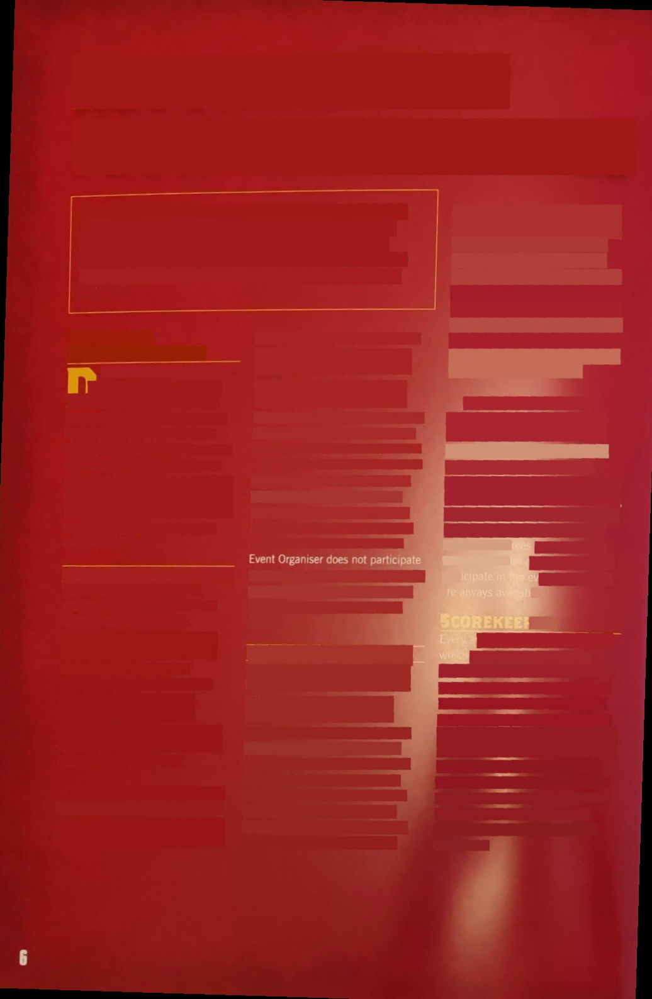

+----------+-------------------------------------------------------+---+---+
| **■ ■  |                                                       |   |   |
| ere,   |                                                       |   |   |
| we     |                                                       |   |   |
|        |                                                       |   |   |
|  present |                                                       |   |   |
| you    |                                                       |   |   |
| with   |                                                       |   |   |
| our    |                                                       |   |   |
| rec    |                                                       |   |   |
| ommended |                                                       |   |   |
| tour   |                                                       |   |   |
| nament** |                                                       |   |   |
+==========+=======================================================+===+===+
| **■■   |                                                       |   |   |
| style: |                                                       |   |   |
| one    |                                                       |   |   |
| that   |                                                       |   |   |
| we     |                                                       |   |   |
|        |                                                       |   |   |
|  believe |                                                       |   |   |
| will   |                                                       |   |   |
| give   |                                                       |   |   |
| all    |                                                       |   |   |
|        |                                                       |   |   |
|  players |                                                       |   |   |
| the    |                                                       |   |   |
| best** |                                                       |   |   |
+----------+-------------------------------------------------------+---+---+
| **■ 1    |                                                       |   |   |
| ex       |                                                       |   |   |
| perience |                                                       |   |   |
| and that |                                                       |   |   |
| has been |                                                       |   |   |
| ext      |                                                       |   |   |
| ensively |                                                       |   |   |
| playt    |                                                       |   |   |
| ested.** |                                                       |   |   |
+----------+-------------------------------------------------------+---+---+
| **It     |                                                       |   |   |
| covers   |                                                       |   |   |
| all      |                                                       |   |   |
| manner   |                                                       |   |   |
| of       |                                                       |   |   |
| things   |                                                       |   |   |
| such as  |                                                       |   |   |
| to       |                                                       |   |   |
| urnament |                                                       |   |   |
| rules    |                                                       |   |   |
| (as      |                                                       |   |   |
| you**    |                                                       |   |   |
+----------+-------------------------------------------------------+---+---+
| **might  |                                                       |   |   |
| e        |                                                       |   |   |
| xpect!), |                                                       |   |   |
| roles    |                                                       |   |   |
| and      |                                                       |   |   |
| r        |                                                       |   |   |
| esponsib |                                                       |   |   |
| ilities, |                                                       |   |   |
| scoring, |                                                       |   |   |
| Tiebr    |                                                       |   |   |
| eakers** |                                                       |   |   |
+----------+-------------------------------------------------------+---+---+
| **and    |                                                       |   |   |
| more.**  |                                                       |   |   |
+----------+-------------------------------------------------------+---+---+

+------------------------------------------+---------------------------+
| **ROLES AND**                          |                           |
+==========================================+===========================+
| **RESPONSIBILITIES**                     |                           |
+------------------------------------------+---------------------------+

+--------+----+---------------------------------------------------+---+
|        |    | epending on how formal you                      |   |
+========+====+===================================================+===+
|        |  |                                                   |   |
|        |  ■ |                                                   |   |
|        |  |                                                   |   |
|        | wi |                                                   |   |
|        | sh |                                                   |   |
|        |  |                                                   |   |
|        | yo |                                                   |   |
|        | ur |                                                   |   |
|        |  |                                                   |   |
|        |  e |                                                   |   |
|        | ve |                                                   |   |
|        | nt |                                                   |   |
|        |  |                                                   |   |
|        | to |                                                   |   |
|        |  |                                                   |   |
|        |  b |                                                   |   |
|        | e, |                                                   |   |
|        |  |                                                   |   |
|        | it |                                                   |   |
|        |  |                                                   |   |
|        | is |                                                   |   |
+--------+----+---------------------------------------------------+---+
| BRF  |  |                                                   |   |
|        |  o |                                                   |   |
|        | ft |                                                   |   |
|        | en |                                                   |   |
|        |  |                                                   |   |
|        | *a |                                                   |   |
|        |  |                                                   |   |
|        | go |                                                   |   |
|        | od |                                                   |   |
|        |  |                                                   |   |
|        |  i |                                                   |   |
|        | de |                                                   |   |
|        | a* |                                                   |   |
|        |  |                                                   |   |
|        | to |                                                   |   |
|        |  |                                                   |   |
|        | ma |                                                   |   |
|        | ke |                                                   |   |
+--------+----+---------------------------------------------------+---+

  -----------------------------------------------------------------------
  sure everyone involved in the event                               
  ----------------------------------------------------------------- -----
  is aware of what their role is and                                

  -----------------------------------------------------------------------

the responsibilities that go alongside it. This is important to ensure
that everyone knows who to go to if there is an issue; to make sure
everything runs smoothly; and, above all, that everyone has a good
time playing some Blood Bowl!

+---------------------------------------------------------+------------+
| **[EVENT ORGANISER] \_\_\_\_\_\_**          |            |
+=========================================================+============+
| Every event will need an Event                        |            |
+---------------------------------------------------------+------------+

+----------------------------------------------------------+-----------+
| Organiser, who will be responsible                     |           |
+==========================================================+===========+
| for running all aspects of the                         |           |
+----------------------------------------------------------+-----------+

+----------------------------------------------------------+-----------+
| tournament. It will be their job to think about such   |           |
| things as gaming                                       |           |
+==========================================================+===========+
| space and equipment for the                            |           |
+----------------------------------------------------------+-----------+

+------------------------------------------------------+----+------+---+
| coaches; appointing any Referees                   |    |      |   |
+======================================================+====+======+===+
| and Spare Players that will be required, and       |    |      |   |
| generally being                                    |    |      |   |
+------------------------------------------------------+----+------+---+
| accessible on the day to ensure that                 |    |      |   |
|                                                      |    |      |   |
| everything goes according to plan -                  |    |      |   |
+------------------------------------------------------+----+------+---+
| Nuffle permitting, of course!                        |    |      |   |
+------------------------------------------------------+----+------+---+

+-----+----------------------------------------------------------------+
|     | The Event Organiser is essentially                           |
+=====+================================================================+
|   |                                                                |
|  in |                                                                |
|   |                                                                |
| cha |                                                                |
| rge |                                                                |
|   |                                                                |
| for |                                                                |
|   |                                                                |
| the |                                                                |
|   |                                                                |
| cou |                                                                |
| rse |                                                                |
|   |                                                                |
|  of |                                                                |
|   |                                                                |
| the |                                                                |
|   |                                                                |
| eve |                                                                |
| nt, |                                                                |
+-----+----------------------------------------------------------------+
| and |                                                                |
| all |                                                                |
| par |                                                                |
| tic |                                                                |
| ipa |                                                                |
| nts |                                                                |
| m   |                                                                |
| ust |                                                                |
| acc |                                                                |
| ept |                                                                |
| t   |                                                                |
| hat |                                                                |
| the |                                                                |
| Ev  |                                                                |
| ent |                                                                |
| Org |                                                                |
| ani |                                                                |
| ser |                                                                |
| has |                                                                |
| the |                                                                |
| aut |                                                                |
| hor |                                                                |
| ity |                                                                |
+-----+----------------------------------------------------------------+

to expel or disqualify anyone found breaking the rules of the event or
>
the Cardinal Rules of the Code of Conduct - although this should,
hopefully, never have to happen.
>
It's also the Event Organiser\'s job to check everyone\'s team rosters
and
>
to ensure that all miniatures adhere to the rules for the event. The
Event Organiser can also be the Referee and/or Scorekeeper if they
wish;
>
though in larger events, it may be best to share these
responsibilities around. We recommend that the

+-------------------------------------------------------------+---+---+
| in the actual tournament so that they                     |   |   |
+=============================================================+===+===+
| are always on hand to sort out any                        |   |   |
+-------------------------------------------------------------+---+---+
| issues that may arise throughout                            |   |   |
+-------------------------------------------------------------+---+---+

the day.

  -----------------------------------------------------------------------
  REFEREE \_\_\_\_\_\_\_\_\_\_\_\_\_\_\_\_\_\|\_
  -----------------------------------------------------------------------
  Much like an actual game of Blood Bowl, every event needs a Referee

  -----------------------------------------------------------------------

-   though unlike in Blood Bowl,

they should be listened to and

+------------------------------------------------------------------+---+
| never bribed! In smaller events, the                           |   |
+==================================================================+===+
| Event Organiser may also take on                               |   |
+------------------------------------------------------------------+---+
| the role of a Referee. At the start of                         |   |
+------------------------------------------------------------------+---+

+--------------------------------------------------------------------+---+
| any event, it is important to point                              |   |
+====================================================================+===+
| out any Referees to the coaches so                               |   |
+--------------------------------------------------------------------+---+

+------------------------------------------------------------------+---+
| they know who to contact if they                               |   |
+==================================================================+===+
| have a query. It is the Referee\'s job                         |   |
+------------------------------------------------------------------+---+
| to observe the games as they are                                 |   |
+------------------------------------------------------------------+---+

  --------------------------------------------------- -------------- ----
                                                                     

                                                                     

                                                                     

                                                                     

                                                                     

                                                                     

                                                                     

                                                                     

                                                                     

                                                                     
  --------------------------------------------------- -------------- ----

+------+--------------------+-----+---+---+--------------------+----+---+
|      | A Referee's      |     |   |   |                    | s  |   |
|      | ruling is final  |     |   |   |                    |    |   |
|      | a                |     |   |   |                    |    |   |
+======+====================+=====+===+===+====================+====+===+
|    |                    |     |   |   |                    |    |   |
|  far |                    |     |   |   |                    |    |   |
| as |                    |     |   |   |                    |    |   |
|    |                    |     |   |   |                    |    |   |
|  the |                    |     |   |   |                    |    |   |
| e  |                    |     |   |   |                    |    |   |
| vent |                    |     |   |   |                    |    |   |
| is |                    |     |   |   |                    |    |   |
| c  |                    |     |   |   |                    |    |   |
| once |                    |     |   |   |                    |    |   |
| rned |                    |     |   |   |                    |    |   |
|    |                    |     |   |   |                    |    |   |
|  and |                    |     |   |   |                    |    |   |
|      |                    |     |   |   |                    |    |   |
| all  |                    |     |   |   |                    |    |   |
| pla  |                    |     |   |   |                    |    |   |
| yers |                    |     |   |   |                    |    |   |
| must |                    |     |   |   |                    |    |   |
| a    |                    |     |   |   |                    |    |   |
| gree |                    |     |   |   |                    |    |   |
| to   |                    |     |   |   |                    |    |   |
| ho   |                    |     |   |   |                    |    |   |
| nour |                    |     |   |   |                    |    |   |
+------+--------------------+-----+---+---+--------------------+----+---+
|    |                    |     | |   |                    |    |   |
|  the |                    |     |   |   |                    |    |   |
|    |                    |     | R |   |                    |    |   |
|  rul |                    |     | e |   |                    |    |   |
| ings |                    |     | f |   |                    |    |   |
| of |                    |     | e |   |                    |    |   |
|    |                    |     | r |   |                    |    |   |
|  the |                    |     | e |   |                    |    |   |
|      |                    |     | e |   |                    |    |   |
|      |                    |     | |   |                    |    |   |
|      |                    |     |   |   |                    |    |   |
|      |                    |     | i |   |                    |    |   |
|      |                    |     | n |   |                    |    |   |
|      |                    |     | |   |                    |    |   |
|      |                    |     |   |   |                    |    |   |
|      |                    |     | t |   |                    |    |   |
|      |                    |     | h |   |                    |    |   |
|      |                    |     | e |   |                    |    |   |
|      |                    |     | s |   |                    |    |   |
|      |                    |     | e |   |                    |    |   |
+------+--------------------+-----+---+---+--------------------+----+---+
| sit  |                    |     |   |   |                    |    |   |
| uati |                    |     |   |   |                    |    |   |
| ons. |                    |     |   |   |                    |    |   |
| At   |                    |     |   |   |                    |    |   |
| part |                    |     |   |   |                    |    |   |
| icul |                    |     |   |   |                    |    |   |
| arly |                    |     |   |   |                    |    |   |
| l    |                    |     |   |   |                    |    |   |
| arge |                    |     |   |   |                    |    |   |
+------+--------------------+-----+---+---+--------------------+----+---+
| eve  |                    |     |   |   |                    |    |   |
| nts, |                    |     |   |   |                    |    |   |
| it   |                    |     |   |   |                    |    |   |
| is   |                    |     |   |   |                    |    |   |
| o    |                    |     |   |   |                    |    |   |
| ften |                    |     |   |   |                    |    |   |
| sens |                    |     |   |   |                    |    |   |
| ible |                    |     |   |   |                    |    |   |
| to   |                    |     |   |   |                    |    |   |
| have |                    |     |   |   |                    |    |   |
| a    |                    |     |   |   |                    |    |   |
| nu   |                    |     |   |   |                    |    |   |
| mber |                    |     |   |   |                    |    |   |
| of   |                    |     |   |   |                    |    |   |
| R    |                    |     |   |   |                    |    |   |
| efer |                    |     |   |   |                    |    |   |
| ees. |                    |     |   |   |                    |    |   |
| In   |                    |     |   |   |                    |    |   |
| this |                    |     |   |   |                    |    |   |
| situ |                    |     |   |   |                    |    |   |
| atio |                    |     |   |   |                    |    |   |
+------+--------------------+-----+---+---+--------------------+----+---+
| t  |                    |     |   |   |                    |    |   |
| is |                    |     |   |   |                    |    |   |
|    |                    |     |   |   |                    |    |   |
| also |                    |     |   |   |                    |    |   |
| a  |                    |     |   |   |                    |    |   |
|    |                    |     |   |   |                    |    |   |
| good |                    |     |   |   |                    |    |   |
|    |                    |     |   |   |                    |    |   |
| idea |                    |     |   |   |                    |    |   |
| to |                    |     |   |   |                    |    |   |
|    |                    |     |   |   |                    |    |   |
| have |                    |     |   |   |                    |    |   |
| a  |                    |     |   |   |                    |    |   |
|    |                    |     |   |   |                    |    |   |
|  Hea |                    |     |   |   |                    |    |   |
+------+--------------------+-----+---+---+--------------------+----+---+
| Ref  |                    |     |   |   |                    |    |   |
| eree |                    |     |   |   |                    |    |   |
| who  |                    |     |   |   |                    |    |   |
| will |                    |     |   |   |                    |    |   |
| be   |                    |     |   |   |                    |    |   |
| in   |                    |     |   |   |                    |    |   |
| ch   |                    |     |   |   |                    |    |   |
| arge |                    |     |   |   |                    |    |   |
| of   |                    |     |   |   |                    |    |   |
+------+--------------------+-----+---+---+--------------------+----+---+
| he |                    |     |   |   |                    |    |   |
| o  |                    |     |   |   |                    |    |   |
| ther |                    |     |   |   |                    |    |   |
|    |                    |     |   |   |                    |    |   |
| Reft |                    |     |   |   |                    |    |   |
+------+--------------------+-----+---+---+--------------------+----+---+
| ec |                    |     |   |   |                    |    |   |
| omme |                    |     |   |   |                    |    |   |
| ndfl |                    |     |   |   |                    |    |   |
+------+--------------------+-----+---+---+--------------------+----+---+
|    |                    |     |   |   |                    |    |   |
|  art |                    |     |   |   |                    |    |   |
+------+--------------------+-----+---+---+--------------------+----+---+
|      |                    |     |   |   |                    |    |   |
+------+--------------------+-----+---+---+--------------------+----+---+

4 **»ER**

+-----------+---+-----------------------------------------------+-------+
|           |   | \[rent will need a Scorekeeper              |       |
+===========+===+===============================================+=======+
|           | |                                               |       |
|           |   |                                               |       |
|           | f |                                               |       |
|           | a |                                               |       |
|           | g |                                               |       |
|           | a |                                               |       |
|           | i |                                               |       |
|           | n |                                               |       |
|           | , |                                               |       |
|           | |                                               |       |
|           |   |                                               |       |
|           | i |                                               |       |
|           | s |                                               |       |
|           | |                                               |       |
|           |   |                                               |       |
|           | o |                                               |       |
|           | f |                                               |       |
|           | t |                                               |       |
|           | e |                                               |       |
|           | n |                                               |       |
|           | |                                               |       |
|           |   |                                               |       |
|           | t |                                               |       |
|           | h |                                               |       |
|           | e |                                               |       |
|           | |                                               |       |
|           |   |                                               |       |
|           | E |                                               |       |
|           | v |                                               |       |
|           | e |                                               |       |
|           | n |                                               |       |
|           | t |                                               |       |
+-----------+---+-----------------------------------------------+-------+
| Oi ftser  |   |                                               |       |
| at        |   |                                               |       |
| smaller   |   |                                               |       |
| events.   |   |                                               |       |
| It is the |   |                                               |       |
+-----------+---+-----------------------------------------------+-------+

job of the Scorekeepe\' to collect the
>
results after each round, from each

+----------------------------------------------------------------+---+---+
| game, and to rank the players. They                          |   |   |
+================================================================+===+===+
| will also be Responsible for organising the pairings refr each |   |   |
| round, including                                               |   |   |
+----------------------------------------------------------------+---+---+
| randomly pairing opponents in the                              |   |   |
+----------------------------------------------------------------+---+---+
| first round of the tournament. Again,                          |   |   |
+----------------------------------------------------------------+---+---+

we recommend that the Scorekeeper

+--------------------------------------------------------------------+---+
| does not participate so that they                                |   |
+====================================================================+===+
| can collect every result as quickly                                |   |
+--------------------------------------------------------------------+---+

as possible.

+-------------------------------------------------------------+--------+
| **[SPARE PLAYER]\_\_\_\_\_\_\_\_\_\_\_**      |        |
+=============================================================+========+
| It's a common occurrence that a             |        |
+-------------------------------------------------------------+--------+

tournament will have an odd number of coaches, which would mean that
one coach would be without an

+---------------------------------------------------------------+---+---+
| opponent in each round. While this                          |   |   |
+===============================================================+===+===+
| person could be given a Bye (covered on page 9), it is much   |   |   |
| more satisfying                                               |   |   |
+---------------------------------------------------------------+---+---+
| for everyone involved if they have                          |   | t |
|                                                             |   |   |
| a game to play - after all, that is                         |   |   |
+---------------------------------------------------------------+---+---+
| why they are at the event in the firs                       |   |   |
+---------------------------------------------------------------+---+---+
| place! Because of this, we always                           |   |   |
+---------------------------------------------------------------+---+---+
| recommend having a Spare Player at every event. This should |   |   |
| be someone who knows how to play the game to                |   |   |
+---------------------------------------------------------------+---+---+

+--------------------------------------------------------------+-------+
| a good standard and will provide their                     |       |
+==============================================================+=======+
| opponent with a fun, enthusiastic                          |       |
+--------------------------------------------------------------+-------+

game so they are not sitting around waiting for the round to finish.

+---+---+-------------------------------------------------------+---+---+---+
|   |   | game in an appropriate manner.                      |   |   |   |
+---+---+-------------------------------------------------------+---+---+---+
|   | ■ |                                                       |   |   |   |
|   | W |                                                       |   |   |   |
|   | e |                                                       |   |   |   |
|   | r |                                                       |   |   |   |
|   | e |                                                       |   |   |   |
|   | c |                                                       |   |   |   |
|   | o |                                                       |   |   |   |
|   | m |                                                       |   |   |   |
|   | m |                                                       |   |   |   |
|   | e |                                                       |   |   |   |
|   | n |                                                       |   |   |   |
|   | d |                                                       |   |   |   |
|   | t |                                                       |   |   |   |
|   | h |                                                       |   |   |   |
|   | a |                                                       |   |   |   |
|   | t |                                                       |   |   |   |
|   | t |                                                       |   |   |   |
|   | h |                                                       |   |   |   |
|   | e |                                                       |   |   |   |
|   | S |                                                       |   |   |   |
|   | p |                                                       |   |   |   |
|   | a |                                                       |   |   |   |
|   | r |                                                       |   |   |   |
|   | e |                                                       |   |   |   |
+---+---+-------------------------------------------------------+---+---+---+
| . |   |                                                       |   |   |   |
| L |   |                                                       |   |   |   |
| p |   |                                                       |   |   |   |
| l |   |                                                       |   |   |   |
| a |   |                                                       |   |   |   |
| y |   |                                                       |   |   |   |
| e |   |                                                       |   |   |   |
| r |   |                                                       |   |   |   |
| i |   |                                                       |   |   |   |
| s |   |                                                       |   |   |   |
| s |   |                                                       |   |   |   |
| o |   |                                                       |   |   |   |
| m |   |                                                       |   |   |   |
| e |   |                                                       |   |   |   |
| o |   |                                                       |   |   |   |
| n |   |                                                       |   |   |   |
| e |   |                                                       |   |   |   |
| d |   |                                                       |   |   |   |
| i |   |                                                       |   |   |   |
| f |   |                                                       |   |   |   |
| f |   |                                                       |   |   |   |
| e |   |                                                       |   |   |   |
| r |   |                                                       |   |   |   |
| e |   |                                                       |   |   |   |
| n |   |                                                       |   |   |   |
| t |   |                                                       |   |   |   |
| f |   |                                                       |   |   |   |
| r |   |                                                       |   |   |   |
| o |   |                                                       |   |   |   |
| m |   |                                                       |   |   |   |
+---+---+-------------------------------------------------------+---+---+---+
|   | |                                                       |   |   |   |
|   |   |                                                       |   |   |   |
|   | f |                                                       |   |   |   |
|   | |                                                       |   |   |   |
|   |   |                                                       |   |   |   |
|   | t |                                                       |   |   |   |
|   | h |                                                       |   |   |   |
|   | e |                                                       |   |   |   |
|   | |                                                       |   |   |   |
|   |   |                                                       |   |   |   |
|   | E |                                                       |   |   |   |
|   | v |                                                       |   |   |   |
|   | e |                                                       |   |   |   |
|   | n |                                                       |   |   |   |
|   | t |                                                       |   |   |   |
|   | |                                                       |   |   |   |
|   |   |                                                       |   |   |   |
|   | O |                                                       |   |   |   |
|   | r |                                                       |   |   |   |
|   | g |                                                       |   |   |   |
|   | a |                                                       |   |   |   |
|   | n |                                                       |   |   |   |
|   | i |                                                       |   |   |   |
|   | s |                                                       |   |   |   |
|   | e |                                                       |   |   |   |
|   | r |                                                       |   |   |   |
|   | . |                                                       |   |   |   |
|   | |                                                       |   |   |   |
|   |   |                                                       |   |   |   |
|   | R |                                                       |   |   |   |
|   | e |                                                       |   |   |   |
|   | f |                                                       |   |   |   |
|   | e |                                                       |   |   |   |
|   | r |                                                       |   |   |   |
|   | e |                                                       |   |   |   |
|   | e |                                                       |   |   |   |
|   | |                                                       |   |   |   |
|   |   |                                                       |   |   |   |
|   | a |                                                       |   |   |   |
|   | n |                                                       |   |   |   |
|   | d |                                                       |   |   |   |
|   | |                                                       |   |   |   |
|   |   |                                                       |   |   |   |
|   | B |                                                       |   |   |   |
|   | S |                                                       |   |   |   |
|   | c |                                                       |   |   |   |
|   | o |                                                       |   |   |   |
|   | r |                                                       |   |   |   |
|   | e |                                                       |   |   |   |
|   | k |                                                       |   |   |   |
|   | e |                                                       |   |   |   |
|   | e |                                                       |   |   |   |
|   | p |                                                       |   |   |   |
|   | e |                                                       |   |   |   |
|   | r |                                                       |   |   |   |
|   | |                                                       |   |   |   |
|   |   |                                                       |   |   |   |
|   | s |                                                       |   |   |   |
|   | o |                                                       |   |   |   |
|   | |                                                       |   |   |   |
|   |   |                                                       |   |   |   |
|   | t |                                                       |   |   |   |
|   | h |                                                       |   |   |   |
|   | e |                                                       |   |   |   |
|   | y |                                                       |   |   |   |
|   | |                                                       |   |   |   |
|   |   |                                                       |   |   |   |
|   | c |                                                       |   |   |   |
|   | a |                                                       |   |   |   |
|   | n |                                                       |   |   |   |
|   | |                                                       |   |   |   |
|   |   |                                                       |   |   |   |
|   | f |                                                       |   |   |   |
|   | o |                                                       |   |   |   |
|   | c |                                                       |   |   |   |
|   | u |                                                       |   |   |   |
|   | s |                                                       |   |   |   |
|   | |                                                       |   |   |   |
|   |   |                                                       |   |   |   |
|   | o |                                                       |   |   |   |
|   | n |                                                       |   |   |   |
+---+---+-------------------------------------------------------+---+---+---+
|   | H |                                                       |   |   |   |
|   | s |                                                       |   |   |   |
|   | i |                                                       |   |   |   |
|   | m |                                                       |   |   |   |
|   | p |                                                       |   |   |   |
|   | l |                                                       |   |   |   |
|   | y |                                                       |   |   |   |
|   | h |                                                       |   |   |   |
|   | a |                                                       |   |   |   |
|   | v |                                                       |   |   |   |
|   | i |                                                       |   |   |   |
|   | n |                                                       |   |   |   |
|   | g |                                                       |   |   |   |
|   | a |                                                       |   |   |   |
|   | n |                                                       |   |   |   |
|   | a |                                                       |   |   |   |
|   | w |                                                       |   |   |   |
|   | e |                                                       |   |   |   |
|   | s |                                                       |   |   |   |
|   | o |                                                       |   |   |   |
|   | m |                                                       |   |   |   |
|   | e |                                                       |   |   |   |
|   | g |                                                       |   |   |   |
|   | a |                                                       |   |   |   |
|   | m |                                                       |   |   |   |
|   | e |                                                       |   |   |   |
|   | o |                                                       |   |   |   |
|   | f |                                                       |   |   |   |
|   | \ |                                                       |   |   |   |
|   | " |                                                       |   |   |   |
|   | B |                                                       |   |   |   |
|   | l |                                                       |   |   |   |
|   | o |                                                       |   |   |   |
|   | o |                                                       |   |   |   |
|   | d |                                                       |   |   |   |
|   | B |                                                       |   |   |   |
|   | o |                                                       |   |   |   |
|   | w |                                                       |   |   |   |
|   | l |                                                       |   |   |   |
|   | w |                                                       |   |   |   |
|   | i |                                                       |   |   |   |
|   | t |                                                       |   |   |   |
|   | h |                                                       |   |   |   |
|   | t |                                                       |   |   |   |
|   | h |                                                       |   |   |   |
|   | e |                                                       |   |   |   |
|   | c |                                                       |   |   |   |
|   | o |                                                       |   |   |   |
|   | a |                                                       |   |   |   |
|   | c |                                                       |   |   |   |
|   | h |                                                       |   |   |   |
|   | t |                                                       |   |   |   |
|   | h |                                                       |   |   |   |
|   | e |                                                       |   |   |   |
|   | y |                                                       |   |   |   |
|   | a |                                                       |   |   |   |
|   | r |                                                       |   |   |   |
|   | e |                                                       |   |   |   |
+---+---+-------------------------------------------------------+---+---+---+

F paired against!

  -----------------------------------------------------------------------
  [COACH] \_\_\_\_\_\_\_\_\_ \_\_\_\_\_\_\_\_ 
  ------------------------------------------------------- ---------------
  Each coach is responsible for                           

  -----------------------------------------------------------------------

bringing their own miniatures, dice,

+-----------------------------------------------------------+---+-------+
| rulebooks, tokens, pitch and dugouts                    |   |       |
+===========================================================+===+=======+
| (unless the event states they will provide them), and   |   |       |
| for accepting                                           |   |       |
+-----------------------------------------------------------+---+-------+
| all of the tournament\'s rules as                       |   |       |
+-----------------------------------------------------------+---+-------+

+------------------------------------------------------------------+---+
| depicted in the specific rulespack.                            |   |
+==================================================================+===+
| Depending on how serious you want                              |   |
+------------------------------------------------------------------+---+

+-----------------------------------------------------------------+----+
| your event to be, you may wish to let                           |    |
+=================================================================+====+
| the coaches know in advance that                              |    |
+-----------------------------------------------------------------+----+

they are expected to have a decent working knowledge of the game.

**TOURNAMENT**\
**RULES**

+------+---------------------------------+------------------------+---+---+
|      | II games at a Blood Bowl      |                        |   |   |
|      | tournament will use the       |                        |   |   |
|      | *Blood Bowl*                  |                        |   |   |
+======+=================================+========================+===+===+
|      | *Rulebook,* any current       |                        |   |   |
|      | supplements or *Spike!        |                        |   |   |
|      | Journals,* and                |                        |   |   |
+------+---------------------------------+------------------------+---+---+
|      | the most recent versions of   |                        |   |   |
|      | the FAQ, Errata and Tier List |                        |   |   |
+------+---------------------------------+------------------------+---+---+
| w  |                                 |                        |   |   |
| hich |                                 |                        |   |   |
|    |                                 |                        |   |   |
|  can |                                 |                        |   |   |
| be |                                 |                        |   |   |
| f  |                                 |                        |   |   |
| ound |                                 |                        |   |   |
| at |                                 |                        |   |   |
|    |                                 |                        |   |   |
| warh |                                 |                        |   |   |
| amme |                                 |                        |   |   |
| r-co |                                 |                        |   |   |
| mmun |                                 |                        |   |   |
| ity. |                                 |                        |   |   |
| com. |                                 |                        |   |   |
|    |                                 |                        |   |   |
|  All |                                 |                        |   |   |
|    |                                 |                        |   |   |
|  coa |                                 |                        |   |   |
| ches |                                 |                        |   |   |
|    |                                 |                        |   |   |
|  are |                                 |                        |   |   |
+------+---------------------------------+------------------------+---+---+
|    |                                 |                        |   |   |
| expe |                                 |                        |   |   |
| cted |                                 |                        |   |   |
| to |                                 |                        |   |   |
| a  |                                 |                        |   |   |
| bide |                                 |                        |   |   |
| by |                                 |                        |   |   |
|    |                                 |                        |   |   |
|  the |                                 |                        |   |   |
| f  |                                 |                        |   |   |
| ollo |                                 |                        |   |   |
| wing |                                 |                        |   |   |
| ru |                                 |                        |   |   |
| les: |                                 |                        |   |   |
+------+---------------------------------+------------------------+---+---+

+-------------------------------------------------------------------+---+
| **[RULESPACK]                                       |   |
| \_\_\_\_\_\_\                                                   |   |
| _\_\_\_\_\_\_\_\_\_\_\_\_\_\_\_\_\_\_\_\_\_\_\_\_\_\_\_\_\_\_\_** |   |
|                                                                 |   |
| The Event Organiser should provide a rulespack for the event,   |   |
| which will have                                                 |   |
+===================================================================+===+
| all the essential information for the event in it such as the     |   |
| venue, what time the event starts, round timings, details about   |   |
| lunch (something that is very important to Halfling coaches!) and |   |
| any other important information about                             |   |
+-------------------------------------------------------------------+---+

the day.
>
It should also include the full details of what coaches can expect
from the tournament itself, such as: the budget of gold pieces coaches
have to spend

+-------------------------+---------------------------------------+---+
| on their team roster; |                                       |   |
| which publications    |                                       |   |
| are in use for the    |                                       |   |
| event; what           |                                       |   |
+=========================+=======================================+===+
| Tiebreakers are being |                                       |   |
| used; and if there    |                                       |   |
| are any additional    |                                       |   |
| rules being used      |                                       |   |
+-------------------------+---------------------------------------+---+
| throughout the        |                                       |   |
| tournament.           |                                       |   |
+-------------------------+---------------------------------------+---+

**MINIATURES**
>
Coaches are expected to only use official Citadel and Forge World
miniatures at the event and all models must be fully built, based and
painted. Coaches

+-----------------------------------+----------------------------------+
| must use appropriate miniatures |                                  |
| for their team. Conversions are |                                  |
| permitted                       |                                  |
|                                 |                                  |
| at the discretion of the Event  |                                  |
| Organiser, so long as they only |                                  |
| include parts from official     |                                  |
| Citadel and Forge World         |                                  |
| miniatures and clearly          |                                  |
| represent what they are meant   |                                  |
| to be. You may wish to ask for  |                                  |
| any coaches wishing to use      |                                  |
| conversions to submit them to   |                                  |
| the Event Organiser before the  |                                  |
| event so they                   |                                  |
+===================================+==================================+
| can check if they are happy     |                                  |
| with them                       |                                  |
+-----------------------------------+----------------------------------+

+-------------------------------------+-----------------------------+---+---+
| **[CONDUCT]\_\_\_\_\_\_ |                             |   |   |
| \_\_\_\_\_\_\_\_\_\_\_\_\_\_\_\_\_\ |                             |   |   |
| _\_\_\_\_\_\_\_\_\_\_\_\_\_\_\_\_** |                             |   |   |
+=====================================+=============================+===+===+
|                                     |                             |   |   |
+-------------------------------------+-----------------------------+---+---+
| As mentioned earlier, Blood Bowl  |                             |   |   |
| is first and foremost a game and  |                             |   |   |
| one that                          |                             |   |   |
+-------------------------------------+-----------------------------+---+---+
| should be played in a friendly      |                             |   |   |
| spirit; Nuffle wants to see good    |                             |   |   |
| sportsmanship from the coaches,     |                             |   |   |
| even if the players on the pitch    |                             |   |   |
| are stomping the snot out           |                             |   |   |
+-------------------------------------+-----------------------------+---+---+
| of each other! This is especially |                             |   |   |
| true for tournament games, where  |                             |   |   |
| all coaches                       |                             |   |   |
+-------------------------------------+-----------------------------+---+---+
| are expected to follow the Code of  |                             |   |   |
| Conduct at all times and treat      |                             |   |   |
| other players, and those running    |                             |   |   |
| the event, with respect, including  |                             |   |   |
| during any rules disputes           |                             |   |   |
+-------------------------------------+-----------------------------+---+---+
| or times when the dice don't go   |                             |   |   |
| their way.                        |                             |   |   |
+-------------------------------------+-----------------------------+---+---+

**7**

  -----------------------------------------------------------------------
  **SCORING & ~n~**
  -----------------------------------------------------------------------

  **TIEBREAKERS**
  -----------------------------------------------------------------------

+-------------------------------------------------------------+---+---+---+---+
| **[GAMES]                     |   |   |   |   |
| \_\_\_\                                                   |   |   |   |   |
| _\_\_\_\_\_\_\_\_\_\_\_\_\_\_\_\_\_\_\_\_\_\_\_\_\_\_\_\_** |   |   |   |   |
+=============================================================+===+===+===+===+
| *For tournament* games, we recommend setting a time limit |   |   |   |   |
| of *2* hours and 30 minutes. This should provide          |   |   |   |   |
+-------------------------------------------------------------+---+---+---+---+
| plenty of time to finish the game and coaches are         |   |   |   |   |
+-------------------------------------------------------------+---+---+---+---+
| expected to *play at a* decent pace to ensure the game    |   |   |   |   |
+-------------------------------------------------------------+---+---+---+---+
| reaches its natural conclusion. At the end of each game,  |   |   |   |   |
+-------------------------------------------------------------+---+---+---+---+
| coaches will *need* to record the result. This includes:    |   |   |   |   |
+-------------------------------------------------------------+---+---+---+---+

+-----------------------------------------------------------------+---+---+
| who won, lost or drew,- the number *of* Bonus Points          |   |   |
+=================================================================+===+===+
| earned; the number of touchdowns each team scored; and the    |   |   |
| number of casualties inflicted by each team. *If* *the*       |   |   |
| coaches do not finish the game before the time runs out, then |   |   |
| play continues until the end of the current turn              |   |   |
+-----------------------------------------------------------------+---+---+
| at which point the score at that point will become the          |   |   |
+-----------------------------------------------------------------+---+---+

final result.
>
*For* tournaments, coaches will earn a number of Tournament Points
depending on how they did in their
>
games. Coaches will earn 2 Tournament Points for a win, 1 Tournament
Point for a draw, and 0 Tournament Points for a loss.

+---+--------------------------------------------------------------+---+---+
|   | It is important that a coach records the number of         |   |   |
+===+==============================================================+===+===+
| |                                                              |   |   |
|   |                                                              |   |   |
| B |                                                              |   |   |
| o |                                                              |   |   |
| n |                                                              |   |   |
| u |                                                              |   |   |
| s |                                                              |   |   |
| |                                                              |   |   |
|   |                                                              |   |   |
| P |                                                              |   |   |
| o |                                                              |   |   |
| i |                                                              |   |   |
| n |                                                              |   |   |
| t |                                                              |   |   |
| s |                                                              |   |   |
| |                                                              |   |   |
|   |                                                              |   |   |
| t |                                                              |   |   |
| h |                                                              |   |   |
| e |                                                              |   |   |
| y |                                                              |   |   |
| |                                                              |   |   |
|   |                                                              |   |   |
| e |                                                              |   |   |
| a |                                                              |   |   |
| r |                                                              |   |   |
| n |                                                              |   |   |
| |                                                              |   |   |
|   |                                                              |   |   |
| i |                                                              |   |   |
| n |                                                              |   |   |
| |                                                              |   |   |
|   |                                                              |   |   |
| e |                                                              |   |   |
| a |                                                              |   |   |
| c |                                                              |   |   |
| h |                                                              |   |   |
| |                                                              |   |   |
|   |                                                              |   |   |
| g |                                                              |   |   |
| a |                                                              |   |   |
| m |                                                              |   |   |
| e |                                                              |   |   |
| , |                                                              |   |   |
| |                                                              |   |   |
|   |                                                              |   |   |
| o |                                                              |   |   |
| n |                                                              |   |   |
| |                                                              |   |   |
|   |                                                              |   |   |
| t |                                                              |   |   |
| h |                                                              |   |   |
| e |                                                              |   |   |
| i |                                                              |   |   |
| r |                                                              |   |   |
| |                                                              |   |   |
|   |                                                              |   |   |
| r |                                                              |   |   |
| e |                                                              |   |   |
| s |                                                              |   |   |
| u |                                                              |   |   |
| l |                                                              |   |   |
| t |                                                              |   |   |
+---+--------------------------------------------------------------+---+---+
| s |                                                              |   |   |
| h |                                                              |   |   |
| e |                                                              |   |   |
| e |                                                              |   |   |
| t |                                                              |   |   |
| , |                                                              |   |   |
| s |                                                              |   |   |
| o |                                                              |   |   |
| t |                                                              |   |   |
| h |                                                              |   |   |
| a |                                                              |   |   |
| t |                                                              |   |   |
| t |                                                              |   |   |
| h |                                                              |   |   |
| e |                                                              |   |   |
| c |                                                              |   |   |
| o |                                                              |   |   |
| r |                                                              |   |   |
| r |                                                              |   |   |
| e |                                                              |   |   |
| c |                                                              |   |   |
| t |                                                              |   |   |
| T |                                                              |   |   |
| i |                                                              |   |   |
| e |                                                              |   |   |
| b |                                                              |   |   |
| r |                                                              |   |   |
| e |                                                              |   |   |
| a |                                                              |   |   |
| k |                                                              |   |   |
| e |                                                              |   |   |
| r |                                                              |   |   |
| s |                                                              |   |   |
| c |                                                              |   |   |
| a |                                                              |   |   |
| n |                                                              |   |   |
| b |                                                              |   |   |
| e |                                                              |   |   |
| i |                                                              |   |   |
| n |                                                              |   |   |
| p |                                                              |   |   |
| u |                                                              |   |   |
| t |                                                              |   |   |
| . |                                                              |   |   |
+---+--------------------------------------------------------------+---+---+

+--------------------------------------------------------------+---+---+---+
| *For example: Jay beats Rob 3-1 and inflicts 2 casualties* |   |   |   |
+==============================================================+===+===+===+
| *while Rob inflicts 4. Jay would score 2 Tournament*       |   |   |   |
+--------------------------------------------------------------+---+---+---+
| *Points for winning the game, while Rob would score 0.*    |   |   |   |
| *Jay would earn 1 Bonus Point as he scored 3 or more*      |   |   |   |
| *touchdowns, while Rob would also earn 1 Bonus Point*      |   |   |   |
+--------------------------------------------------------------+---+---+---+
| *for inflicting 3 or more casualties onto Jay\'s team.*      |   |   |   |
+--------------------------------------------------------------+---+---+---+

+---+--------------------------------------+-----------------------+---+
|   | If coaches are still tied, the     |                       |   |
|   | second Tiebreaker is a             |                       |   |
+===+======================================+=======================+===+
| |                                      |                       |   |
|   |                                      |                       |   |
| c |                                      |                       |   |
| o |                                      |                       |   |
| a |                                      |                       |   |
| c |                                      |                       |   |
| h |                                      |                       |   |
| e |                                      |                       |   |
| s |                                      |                       |   |
| |                                      |                       |   |
|   |                                      |                       |   |
| T |                                      |                       |   |
| o |                                      |                       |   |
| u |                                      |                       |   |
| c |                                      |                       |   |
| h |                                      |                       |   |
| d |                                      |                       |   |
| o |                                      |                       |   |
| w |                                      |                       |   |
| n |                                      |                       |   |
| |                                      |                       |   |
|   |                                      |                       |   |
| D |                                      |                       |   |
| i |                                      |                       |   |
| f |                                      |                       |   |
| f |                                      |                       |   |
| e |                                      |                       |   |
| r |                                      |                       |   |
| e |                                      |                       |   |
| n |                                      |                       |   |
| c |                                      |                       |   |
| e |                                      |                       |   |
| , |                                      |                       |   |
| |                                      |                       |   |
|   |                                      |                       |   |
| w |                                      |                       |   |
| h |                                      |                       |   |
| i |                                      |                       |   |
| c |                                      |                       |   |
| h |                                      |                       |   |
| |                                      |                       |   |
|   |                                      |                       |   |
| i |                                      |                       |   |
| s |                                      |                       |   |
| |                                      |                       |   |
|   |                                      |                       |   |
| e |                                      |                       |   |
| q |                                      |                       |   |
| u |                                      |                       |   |
| a |                                      |                       |   |
| l |                                      |                       |   |
| |                                      |                       |   |
|   |                                      |                       |   |
| t |                                      |                       |   |
| o |                                      |                       |   |
| |                                      |                       |   |
|   |                                      |                       |   |
| t |                                      |                       |   |
| h |                                      |                       |   |
| e |                                      |                       |   |
| |                                      |                       |   |
|   |                                      |                       |   |
| n |                                      |                       |   |
| u |                                      |                       |   |
| m |                                      |                       |   |
| b |                                      |                       |   |
| e |                                      |                       |   |
| r |                                      |                       |   |
| |                                      |                       |   |
|   |                                      |                       |   |
| o |                                      |                       |   |
| f |                                      |                       |   |
| |                                      |                       |   |
|   |                                      |                       |   |
| t |                                      |                       |   |
| o |                                      |                       |   |
| u |                                      |                       |   |
| c |                                      |                       |   |
| h |                                      |                       |   |
| d |                                      |                       |   |
| o |                                      |                       |   |
| w |                                      |                       |   |
| n |                                      |                       |   |
| s |                                      |                       |   |
| |                                      |                       |   |
|   |                                      |                       |   |
| t |                                      |                       |   |
| h |                                      |                       |   |
| e |                                      |                       |   |
| y |                                      |                       |   |
| |                                      |                       |   |
|   |                                      |                       |   |
| h |                                      |                       |   |
| a |                                      |                       |   |
| v |                                      |                       |   |
| e |                                      |                       |   |
| |                                      |                       |   |
|   |                                      |                       |   |
| s |                                      |                       |   |
| c |                                      |                       |   |
| o |                                      |                       |   |
| r |                                      |                       |   |
| e |                                      |                       |   |
| d |                                      |                       |   |
| |                                      |                       |   |
|   |                                      |                       |   |
| a |                                      |                       |   |
| c |                                      |                       |   |
| r |                                      |                       |   |
| o |                                      |                       |   |
| s |                                      |                       |   |
| s |                                      |                       |   |
| |                                      |                       |   |
|   |                                      |                       |   |
| a |                                      |                       |   |
| l |                                      |                       |   |
| l |                                      |                       |   |
| |                                      |                       |   |
|   |                                      |                       |   |
| o |                                      |                       |   |
| f |                                      |                       |   |
+---+--------------------------------------+-----------------------+---+
| t |                                      |                       |   |
| h |                                      |                       |   |
| e |                                      |                       |   |
| i |                                      |                       |   |
| r |                                      |                       |   |
| g |                                      |                       |   |
| a |                                      |                       |   |
| m |                                      |                       |   |
| e |                                      |                       |   |
| s |                                      |                       |   |
| m |                                      |                       |   |
| i |                                      |                       |   |
| n |                                      |                       |   |
| u |                                      |                       |   |
| s |                                      |                       |   |
| t |                                      |                       |   |
| h |                                      |                       |   |
| e |                                      |                       |   |
| n |                                      |                       |   |
| u |                                      |                       |   |
| m |                                      |                       |   |
| b |                                      |                       |   |
| e |                                      |                       |   |
| r |                                      |                       |   |
| o |                                      |                       |   |
| f |                                      |                       |   |
| t |                                      |                       |   |
| o |                                      |                       |   |
| u |                                      |                       |   |
| c |                                      |                       |   |
| h |                                      |                       |   |
| d |                                      |                       |   |
| o |                                      |                       |   |
| w |                                      |                       |   |
| n |                                      |                       |   |
| s |                                      |                       |   |
| t |                                      |                       |   |
| h |                                      |                       |   |
| e |                                      |                       |   |
| y |                                      |                       |   |
| h |                                      |                       |   |
| a |                                      |                       |   |
| v |                                      |                       |   |
| e |                                      |                       |   |
+---+--------------------------------------+-----------------------+---+
| c |                                      |                       |   |
| o |                                      |                       |   |
| n |                                      |                       |   |
| c |                                      |                       |   |
| e |                                      |                       |   |
| d |                                      |                       |   |
| e |                                      |                       |   |
| d |                                      |                       |   |
| a |                                      |                       |   |
| c |                                      |                       |   |
| r |                                      |                       |   |
| o |                                      |                       |   |
| s |                                      |                       |   |
| s |                                      |                       |   |
| a |                                      |                       |   |
| l |                                      |                       |   |
| l |                                      |                       |   |
| o |                                      |                       |   |
| f |                                      |                       |   |
| t |                                      |                       |   |
| h |                                      |                       |   |
| e |                                      |                       |   |
| i |                                      |                       |   |
| r |                                      |                       |   |
| g |                                      |                       |   |
| a |                                      |                       |   |
| m |                                      |                       |   |
| e |                                      |                       |   |
| s |                                      |                       |   |
| . |                                      |                       |   |
+---+--------------------------------------+-----------------------+---+

+------------------------------------+---------------------------------+
| *For example, Jay has won three  |                                 |
| games with the scores* *being    |                                 |
| 2-0, 3-1 and 3-0, meaning he has |                                 |
| a Touchdown* *Difference of +7.  |                                 |
| Dan has also won three games     |                                 |
| with*                            |                                 |
|                                  |                                 |
| *the scores being 1-0, 2-1 and   |                                 |
| 3-2, meaning he has a*           |                                 |
+====================================+=================================+
| *Touchdown Difference of + 3.*     |                                 |
+------------------------------------+---------------------------------+

+---+------------------------------+-------------------------------+---+---+
|   | If coaches are still tied, |                               |   |   |
|   | the third Tiebreaker is    |                               |   |   |
|   | the                        |                               |   |   |
+===+==============================+===============================+===+===+
| |                              |                               |   |   |
|   |                              |                               |   |   |
| t |                              |                               |   |   |
| o |                              |                               |   |   |
| t |                              |                               |   |   |
| a |                              |                               |   |   |
| l |                              |                               |   |   |
| |                              |                               |   |   |
|   |                              |                               |   |   |
| n |                              |                               |   |   |
| u |                              |                               |   |   |
| m |                              |                               |   |   |
| b |                              |                               |   |   |
| e |                              |                               |   |   |
| r |                              |                               |   |   |
| |                              |                               |   |   |
|   |                              |                               |   |   |
| o |                              |                               |   |   |
| f |                              |                               |   |   |
| |                              |                               |   |   |
|   |                              |                               |   |   |
| t |                              |                               |   |   |
| o |                              |                               |   |   |
| u |                              |                               |   |   |
| c |                              |                               |   |   |
| h |                              |                               |   |   |
| d |                              |                               |   |   |
| o |                              |                               |   |   |
| w |                              |                               |   |   |
| n |                              |                               |   |   |
| s |                              |                               |   |   |
| |                              |                               |   |   |
|   |                              |                               |   |   |
| a |                              |                               |   |   |
| |                              |                               |   |   |
|   |                              |                               |   |   |
| c |                              |                               |   |   |
| o |                              |                               |   |   |
| a |                              |                               |   |   |
| c |                              |                               |   |   |
| h |                              |                               |   |   |
| |                              |                               |   |   |
|   |                              |                               |   |   |
| h |                              |                               |   |   |
| a |                              |                               |   |   |
| s |                              |                               |   |   |
| |                              |                               |   |   |
|   |                              |                               |   |   |
| s |                              |                               |   |   |
| c |                              |                               |   |   |
| o |                              |                               |   |   |
| r |                              |                               |   |   |
| e |                              |                               |   |   |
| d |                              |                               |   |   |
| |                              |                               |   |   |
|   |                              |                               |   |   |
| a |                              |                               |   |   |
| c |                              |                               |   |   |
| r |                              |                               |   |   |
| o |                              |                               |   |   |
| s |                              |                               |   |   |
| s |                              |                               |   |   |
+---+------------------------------+-------------------------------+---+---+
| |                              |                               |   |   |
|   |                              |                               |   |   |
| a |                              |                               |   |   |
| l |                              |                               |   |   |
| l |                              |                               |   |   |
| |                              |                               |   |   |
|   |                              |                               |   |   |
| t |                              |                               |   |   |
| h |                              |                               |   |   |
| e |                              |                               |   |   |
| i |                              |                               |   |   |
| r |                              |                               |   |   |
| |                              |                               |   |   |
|   |                              |                               |   |   |
| g |                              |                               |   |   |
| a |                              |                               |   |   |
| m |                              |                               |   |   |
| e |                              |                               |   |   |
| s |                              |                               |   |   |
| , |                              |                               |   |   |
| |                              |                               |   |   |
|   |                              |                               |   |   |
| w |                              |                               |   |   |
| i |                              |                               |   |   |
| t |                              |                               |   |   |
| h |                              |                               |   |   |
| |                              |                               |   |   |
|   |                              |                               |   |   |
| t |                              |                               |   |   |
| h |                              |                               |   |   |
| e |                              |                               |   |   |
| |                              |                               |   |   |
|   |                              |                               |   |   |
| c |                              |                               |   |   |
| o |                              |                               |   |   |
| a |                              |                               |   |   |
| c |                              |                               |   |   |
| h |                              |                               |   |   |
| |                              |                               |   |   |
|   |                              |                               |   |   |
| w |                              |                               |   |   |
| h |                              |                               |   |   |
| o |                              |                               |   |   |
| |                              |                               |   |   |
|   |                              |                               |   |   |
| I |                              |                               |   |   |
| |                              |                               |   |   |
|   |                              |                               |   |   |
| s |                              |                               |   |   |
| |                              |                               |   |   |
|   |                              |                               |   |   |
| s |                              |                               |   |   |
| c |                              |                               |   |   |
| o |                              |                               |   |   |
| r |                              |                               |   |   |
| e |                              |                               |   |   |
| d |                              |                               |   |   |
| |                              |                               |   |   |
|   |                              |                               |   |   |
| t |                              |                               |   |   |
| h |                              |                               |   |   |
| e |                              |                               |   |   |
| |                              |                               |   |   |
|   |                              |                               |   |   |
| m |                              |                               |   |   |
| o |                              |                               |   |   |
| s |                              |                               |   |   |
| t |                              |                               |   |   |
+---+------------------------------+-------------------------------+---+---+
| b |                              |                               |   |   |
| e |                              |                               |   |   |
| i |                              |                               |   |   |
| n |                              |                               |   |   |
| g |                              |                               |   |   |
| h |                              |                               |   |   |
| i |                              |                               |   |   |
| g |                              |                               |   |   |
| h |                              |                               |   |   |
| e |                              |                               |   |   |
| r |                              |                               |   |   |
| i |                              |                               |   |   |
| n |                              |                               |   |   |
| t |                              |                               |   |   |
| h |                              |                               |   |   |
| e |                              |                               |   |   |
| r |                              |                               |   |   |
| a |                              |                               |   |   |
| n |                              |                               |   |   |
| k |                              |                               |   |   |
| i |                              |                               |   |   |
| n |                              |                               |   |   |
| g |                              |                               |   |   |
| s |                              |                               |   |   |
| . |                              |                               |   |   |
+---+------------------------------+-------------------------------+---+---+

+---+----------------------------------------------------------------+---+
|   | It is important that both coaches provide all of the         |   |
+===+================================================================+===+
| |                                                                |   |
|   |                                                                |   |
| i |                                                                |   |
| n |                                                                |   |
| f |                                                                |   |
| o |                                                                |   |
| r |                                                                |   |
| m |                                                                |   |
| a |                                                                |   |
| t |                                                                |   |
| i |                                                                |   |
| o |                                                                |   |
| n |                                                                |   |
| , |                                                                |   |
| |                                                                |   |
|   |                                                                |   |
| i |                                                                |   |
| n |                                                                |   |
| c |                                                                |   |
| l |                                                                |   |
| u |                                                                |   |
| d |                                                                |   |
| i |                                                                |   |
| n |                                                                |   |
| g |                                                                |   |
| |                                                                |   |
|   |                                                                |   |
| t |                                                                |   |
| h |                                                                |   |
| e |                                                                |   |
| |                                                                |   |
|   |                                                                |   |
| f |                                                                |   |
| i |                                                                |   |
| n |                                                                |   |
| a |                                                                |   |
| l |                                                                |   |
| |                                                                |   |
|   |                                                                |   |
| s |                                                                |   |
| c |                                                                |   |
| o |                                                                |   |
| r |                                                                |   |
| e |                                                                |   |
| |                                                                |   |
|   |                                                                |   |
| a |                                                                |   |
| n |                                                                |   |
| d |                                                                |   |
| |                                                                |   |
|   |                                                                |   |
| n |                                                                |   |
| u |                                                                |   |
| m |                                                                |   |
| b |                                                                |   |
| e |                                                                |   |
| r |                                                                |   |
| |                                                                |   |
|   |                                                                |   |
| o |                                                                |   |
| f |                                                                |   |
+---+----------------------------------------------------------------+---+

+--------------------------------------------------------------------+---+
| casualties inflicted by each team, as it is all used for the     |   |
+====================================================================+===+
| Tiebreakers to determine where each coach stands in              |   |
+--------------------------------------------------------------------+---+

the rankings.
>
**[RANKING]**

+--------------------------------------------------------------+---+---+
| Coaches are ranked according to the number of              |   |   |
+==============================================================+===+===+
| Tournament Points they have: the more Tournament           |   |   |
+--------------------------------------------------------------+---+---+
| Points a coach has, the higher they are in the rankings.     |   |   |
+--------------------------------------------------------------+---+---+

+---+-----------------------------------------------------+--------+---+
|   | Where coaches are tied on the number of           |        |   |
|   | Tournament                                        |        |   |
+===+=====================================================+========+===+
| |                                                     |        |   |
|   |                                                     |        |   |
| P |                                                     |        |   |
| o |                                                     |        |   |
| i |                                                     |        |   |
| n |                                                     |        |   |
| t |                                                     |        |   |
| s |                                                     |        |   |
| , |                                                     |        |   |
| |                                                     |        |   |
|   |                                                     |        |   |
| t |                                                     |        |   |
| h |                                                     |        |   |
| e |                                                     |        |   |
| r |                                                     |        |   |
| e |                                                     |        |   |
| |                                                     |        |   |
|   |                                                     |        |   |
| a |                                                     |        |   |
| r |                                                     |        |   |
| e |                                                     |        |   |
| |                                                     |        |   |
|   |                                                     |        |   |
| a |                                                     |        |   |
| |                                                     |        |   |
|   |                                                     |        |   |
| n |                                                     |        |   |
| u |                                                     |        |   |
| m |                                                     |        |   |
| b |                                                     |        |   |
| e |                                                     |        |   |
| r |                                                     |        |   |
| |                                                     |        |   |
|   |                                                     |        |   |
| o |                                                     |        |   |
| f |                                                     |        |   |
| |                                                     |        |   |
|   |                                                     |        |   |
| T |                                                     |        |   |
| i |                                                     |        |   |
| e |                                                     |        |   |
| b |                                                     |        |   |
| r |                                                     |        |   |
| e |                                                     |        |   |
| a |                                                     |        |   |
| k |                                                     |        |   |
| e |                                                     |        |   |
| r |                                                     |        |   |
| s |                                                     |        |   |
| |                                                     |        |   |
|   |                                                     |        |   |
| t |                                                     |        |   |
| o |                                                     |        |   |
| |                                                     |        |   |
|   |                                                     |        |   |
| b |                                                     |        |   |
| e |                                                     |        |   |
| |                                                     |        |   |
|   |                                                     |        |   |
| u |                                                     |        |   |
| s |                                                     |        |   |
| e |                                                     |        |   |
| d |                                                     |        |   |
| |                                                     |        |   |
|   |                                                     |        |   |
| t |                                                     |        |   |
| o |                                                     |        |   |
+---+-----------------------------------------------------+--------+---+
| d |                                                     |        |   |
| e |                                                     |        |   |
| t |                                                     |        |   |
| e |                                                     |        |   |
| r |                                                     |        |   |
| m |                                                     |        |   |
| i |                                                     |        |   |
| n |                                                     |        |   |
| e |                                                     |        |   |
| w |                                                     |        |   |
| h |                                                     |        |   |
| o |                                                     |        |   |
| i |                                                     |        |   |
| s |                                                     |        |   |
| p |                                                     |        |   |
| l |                                                     |        |   |
| a |                                                     |        |   |
| c |                                                     |        |   |
| e |                                                     |        |   |
| d |                                                     |        |   |
| h |                                                     |        |   |
| i |                                                     |        |   |
| g |                                                     |        |   |
| h |                                                     |        |   |
| e |                                                     |        |   |
| r |                                                     |        |   |
| i |                                                     |        |   |
| n |                                                     |        |   |
| t |                                                     |        |   |
| h |                                                     |        |   |
| e |                                                     |        |   |
| r |                                                     |        |   |
| a |                                                     |        |   |
| n |                                                     |        |   |
| k |                                                     |        |   |
| i |                                                     |        |   |
| n |                                                     |        |   |
| g |                                                     |        |   |
| s |                                                     |        |   |
| . |                                                     |        |   |
+---+-----------------------------------------------------+--------+---+

+---------------------------------------+-----------------------+-----+
| The first Tiebreaker is the number  |                       |     |
| of Bonus Points a                   |                       |     |
+=======================================+=======================+=====+
| coach has earned. Bonus Points are    |                       |     |
| earned in each game                   |                       |     |
+---------------------------------------+-----------------------+-----+
| for meeting the following criteria:   |                       |     |
+---------------------------------------+-----------------------+-----+

+---+-----------------+-------------------------------------+------+---+
| - |                 |                                     |      |   |
|   |                 |                                     |      |   |
|   |                 |                                     |      |   |
|   |                 |                                     |      |   |
| S |                 |                                     |      |   |
| c |                 |                                     |      |   |
| o |                 |                                     |      |   |
| r |                 |                                     |      |   |
| i |                 |                                     |      |   |
| n |                 |                                     |      |   |
| g |                 |                                     |      |   |
|   |                 |                                     |      |   |
|   |                 |                                     |      |   |
|   |                 |                                     |      |   |
|   |                 |                                     |      |   |
| |                 |                                     |      |   |
|   |                 |                                     |      |   |
| 3 |                 |                                     |      |   |
|   |                 |                                     |      |   |
|   |                 |                                     |      |   |
|   |                 |                                     |      |   |
|   |                 |                                     |      |   |
| |                 |                                     |      |   |
|   |                 |                                     |      |   |
| o |                 |                                     |      |   |
| r |                 |                                     |      |   |
|   |                 |                                     |      |   |
|   |                 |                                     |      |   |
|   |                 |                                     |      |   |
|   |                 |                                     |      |   |
| |                 |                                     |      |   |
|   |                 |                                     |      |   |
| m |                 |                                     |      |   |
| o |                 |                                     |      |   |
| r |                 |                                     |      |   |
| e |                 |                                     |      |   |
|   |                 |                                     |      |   |
|   |                 |                                     |      |   |
|   |                 |                                     |      |   |
|   |                 |                                     |      |   |
| |                 |                                     |      |   |
|   |                 |                                     |      |   |
| t |                 |                                     |      |   |
| o |                 |                                     |      |   |
| u |                 |                                     |      |   |
| c |                 |                                     |      |   |
| h |                 |                                     |      |   |
| d |                 |                                     |      |   |
| o |                 |                                     |      |   |
| w |                 |                                     |      |   |
| n |                 |                                     |      |   |
| s |                 |                                     |      |   |
|   |                 |                                     |      |   |
| - |                 |                                     |      |   |
|   |                 |                                     |      |   |
|   |                 |                                     |      |   |
|   |                 |                                     |      |   |
|   |                 |                                     |      |   |
| |                 |                                     |      |   |
|   |                 |                                     |      |   |
| 1 |                 |                                     |      |   |
|   |                 |                                     |      |   |
|   |                 |                                     |      |   |
|   |                 |                                     |      |   |
|   |                 |                                     |      |   |
| |                 |                                     |      |   |
|   |                 |                                     |      |   |
| B |                 |                                     |      |   |
| o |                 |                                     |      |   |
| n |                 |                                     |      |   |
| u |                 |                                     |      |   |
| s |                 |                                     |      |   |
|   |                 |                                     |      |   |
|   |                 |                                     |      |   |
|   |                 |                                     |      |   |
|   |                 |                                     |      |   |
| |                 |                                     |      |   |
|   |                 |                                     |      |   |
| P |                 |                                     |      |   |
| o |                 |                                     |      |   |
| i |                 |                                     |      |   |
| n |                 |                                     |      |   |
| t |                 |                                     |      |   |
+===+=================+=====================================+======+===+
| - |                 |                                     |      |   |
|   |                 |                                     |      |   |
|   |                 |                                     |      |   |
|   |                 |                                     |      |   |
| C |                 |                                     |      |   |
| o |                 |                                     |      |   |
| n |                 |                                     |      |   |
| c |                 |                                     |      |   |
| e |                 |                                     |      |   |
| d |                 |                                     |      |   |
| i |                 |                                     |      |   |
| n |                 |                                     |      |   |
| g |                 |                                     |      |   |
|   |                 |                                     |      |   |
|   |                 |                                     |      |   |
|   |                 |                                     |      |   |
|   |                 |                                     |      |   |
| |                 |                                     |      |   |
|   |                 |                                     |      |   |
| 0 |                 |                                     |      |   |
|   |                 |                                     |      |   |
|   |                 |                                     |      |   |
|   |                 |                                     |      |   |
|   |                 |                                     |      |   |
| |                 |                                     |      |   |
|   |                 |                                     |      |   |
| t |                 |                                     |      |   |
| o |                 |                                     |      |   |
| u |                 |                                     |      |   |
| c |                 |                                     |      |   |
| h |                 |                                     |      |   |
| d |                 |                                     |      |   |
| o |                 |                                     |      |   |
| w |                 |                                     |      |   |
| n |                 |                                     |      |   |
| s |                 |                                     |      |   |
|   |                 |                                     |      |   |
| - |                 |                                     |      |   |
|   |                 |                                     |      |   |
|   |                 |                                     |      |   |
|   |                 |                                     |      |   |
|   |                 |                                     |      |   |
| |                 |                                     |      |   |
|   |                 |                                     |      |   |
| 1 |                 |                                     |      |   |
|   |                 |                                     |      |   |
|   |                 |                                     |      |   |
|   |                 |                                     |      |   |
|   |                 |                                     |      |   |
| |                 |                                     |      |   |
|   |                 |                                     |      |   |
| B |                 |                                     |      |   |
| o |                 |                                     |      |   |
| n |                 |                                     |      |   |
| u |                 |                                     |      |   |
| s |                 |                                     |      |   |
|   |                 |                                     |      |   |
|   |                 |                                     |      |   |
|   |                 |                                     |      |   |
|   |                 |                                     |      |   |
| |                 |                                     |      |   |
|   |                 |                                     |      |   |
| P |                 |                                     |      |   |
| o |                 |                                     |      |   |
| i |                 |                                     |      |   |
| n |                 |                                     |      |   |
| t |                 |                                     |      |   |
+---+-----------------+-------------------------------------+------+---+
| - |                 |                                     |      |   |
|   |                 |                                     |      |   |
|   |                 |                                     |      |   |
|   |                 |                                     |      |   |
| I |                 |                                     |      |   |
| n |                 |                                     |      |   |
| f |                 |                                     |      |   |
| l |                 |                                     |      |   |
| i |                 |                                     |      |   |
| c |                 |                                     |      |   |
| t |                 |                                     |      |   |
| i |                 |                                     |      |   |
| n |                 |                                     |      |   |
| g |                 |                                     |      |   |
|   |                 |                                     |      |   |
|   |                 |                                     |      |   |
|   |                 |                                     |      |   |
|   |                 |                                     |      |   |
| 3 |                 |                                     |      |   |
|   |                 |                                     |      |   |
|   |                 |                                     |      |   |
|   |                 |                                     |      |   |
|   |                 |                                     |      |   |
| o |                 |                                     |      |   |
| r |                 |                                     |      |   |
|   |                 |                                     |      |   |
|   |                 |                                     |      |   |
|   |                 |                                     |      |   |
|   |                 |                                     |      |   |
| m |                 |                                     |      |   |
| o |                 |                                     |      |   |
| r |                 |                                     |      |   |
| e |                 |                                     |      |   |
|   |                 |                                     |      |   |
|   |                 |                                     |      |   |
|   |                 |                                     |      |   |
|   |                 |                                     |      |   |
| C |                 |                                     |      |   |
| a |                 |                                     |      |   |
| s |                 |                                     |      |   |
| u |                 |                                     |      |   |
| a |                 |                                     |      |   |
| l |                 |                                     |      |   |
| t |                 |                                     |      |   |
| i |                 |                                     |      |   |
| e |                 |                                     |      |   |
| s |                 |                                     |      |   |
|   |                 |                                     |      |   |
|   |                 |                                     |      |   |
|   |                 |                                     |      |   |
|   |                 |                                     |      |   |
| ( |                 |                                     |      |   |
| c |                 |                                     |      |   |
| o |                 |                                     |      |   |
| u |                 |                                     |      |   |
| n |                 |                                     |      |   |
| t |                 |                                     |      |   |
| i |                 |                                     |      |   |
| n |                 |                                     |      |   |
| g |                 |                                     |      |   |
|   |                 |                                     |      |   |
|   |                 |                                     |      |   |
|   |                 |                                     |      |   |
|   |                 |                                     |      |   |
| o |                 |                                     |      |   |
| n |                 |                                     |      |   |
| l |                 |                                     |      |   |
| y |                 |                                     |      |   |
|   |                 |                                     |      |   |
|   |                 |                                     |      |   |
|   |                 |                                     |      |   |
|   |                 |                                     |      |   |
| t |                 |                                     |      |   |
| h |                 |                                     |      |   |
| o |                 |                                     |      |   |
| s |                 |                                     |      |   |
| e |                 |                                     |      |   |
+---+-----------------+-------------------------------------+------+---+
|   | that would    |                                     |      |   |
|   | normally      |                                     |      |   |
|   | award Star    |                                     |      |   |
|   | Player        |                                     |      |   |
|   | Points) -     |                                     |      |   |
+---+-----------------+-------------------------------------+------+---+
|   | 1 Bonus Point   |                                     |      |   |
+---+-----------------+-------------------------------------+------+---+

+---+----------------------------+-----+---------+----------------+---+
|   | If coaches are still     |     |         |                |   |
|   | tied, the four: breaker  |     |         |                |   |
|   | is the                   |     |         |                |   |
+===+============================+=====+=========+================+===+
| |                            |     |         | flicted      |   |
|   |                            |     |         | across all   |   |
| t |                            |     |         |                |   |
| o |                            |     |         |                |   |
| t |                            |     |         |                |   |
| a |                            |     |         |                |   |
| l |                            |     |         |                |   |
| |                            |     |         |                |   |
|   |                            |     |         |                |   |
| n |                            |     |         |                |   |
| u |                            |     |         |                |   |
| m |                            |     |         |                |   |
| b |                            |     |         |                |   |
| e |                            |     |         |                |   |
| r |                            |     |         |                |   |
| |                            |     |         |                |   |
|   |                            |     |         |                |   |
| o |                            |     |         |                |   |
| f |                            |     |         |                |   |
| |                            |     |         |                |   |
|   |                            |     |         |                |   |
| c |                            |     |         |                |   |
| a |                            |     |         |                |   |
| s |                            |     |         |                |   |
| u |                            |     |         |                |   |
| a |                            |     |         |                |   |
| l |                            |     |         |                |   |
| t |                            |     |         |                |   |
| i |                            |     |         |                |   |
| e |                            |     |         |                |   |
| s |                            |     |         |                |   |
| |                            |     |         |                |   |
|   |                            |     |         |                |   |
| a |                            |     |         |                |   |
| |                            |     |         |                |   |
|   |                            |     |         |                |   |
| c |                            |     |         |                |   |
| o |                            |     |         |                |   |
| . |                            |     |         |                |   |
| |                            |     |         |                |   |
|   |                            |     |         |                |   |
| - |                            |     |         |                |   |
+---+----------------------------+-----+---------+----------------+---+
| |                            |     |         |                |   |
|   |                            |     |         |                |   |
| t |                            |     |         |                |   |
| h |                            |     |         |                |   |
| e |                            |     |         |                |   |
| i |                            |     |         |                |   |
| r |                            |     |         |                |   |
| |                            |     |         |                |   |
|   |                            |     |         |                |   |
| g |                            |     |         |                |   |
| a |                            |     |         |                |   |
| m |                            |     |         |                |   |
| e |                            |     |         |                |   |
| s |                            |     |         |                |   |
| , |                            |     |         |                |   |
| |                            |     |         |                |   |
|   |                            |     |         |                |   |
| w |                            |     |         |                |   |
| i |                            |     |         |                |   |
| t |                            |     |         |                |   |
| h |                            |     |         |                |   |
| |                            |     |         |                |   |
|   |                            |     |         |                |   |
| t |                            |     |         |                |   |
| h |                            |     |         |                |   |
| e |                            |     |         |                |   |
| |                            |     |         |                |   |
|   |                            |     |         |                |   |
| c |                            |     |         |                |   |
| o |                            |     |         |                |   |
| a |                            |     |         |                |   |
| c |                            |     |         |                |   |
| h |                            |     |         |                |   |
| |                            |     |         |                |   |
|   |                            |     |         |                |   |
| i |                            |     |         |                |   |
| |                            |     |         |                |   |
|   |                            |     |         |                |   |
| 1 |                            |     |         |                |   |
| |                            |     |         |                |   |
|   |                            |     |         |                |   |
| l |                            |     |         |                |   |
| i |                            |     |         |                |   |
| c |                            |     |         |                |   |
| t |                            |     |         |                |   |
| e |                            |     |         |                |   |
| d |                            |     |         |                |   |
| |                            |     |         |                |   |
|   |                            |     |         |                |   |
| t |                            |     |         |                |   |
| h |                            |     |         |                |   |
| e |                            |     |         |                |   |
| |                            |     |         |                |   |
|   |                            |     |         |                |   |
| m |                            |     |         |                |   |
| o |                            |     |         |                |   |
| s |                            |     |         |                |   |
| t |                            |     |         |                |   |
+---+----------------------------+-----+---------+----------------+---+
| b |                            |     |         |                |   |
| e |                            |     |         |                |   |
| i |                            |     |         |                |   |
| n |                            |     |         |                |   |
| g |                            |     |         |                |   |
| h |                            |     |         |                |   |
| i |                            |     |         |                |   |
| g |                            |     |         |                |   |
| h |                            |     |         |                |   |
| e |                            |     |         |                |   |
| r |                            |     |         |                |   |
| i |                            |     |         |                |   |
| n |                            |     |         |                |   |
| t |                            |     |         |                |   |
| h |                            |     |         |                |   |
| e |                            |     |         |                |   |
| r |                            |     |         |                |   |
| a |                            |     |         |                |   |
| n |                            |     |         |                |   |
| k |                            |     |         |                |   |
| i |                            |     |         |                |   |
| n |                            |     |         |                |   |
| g |                            |     |         |                |   |
| : |                            |     |         |                |   |
+---+----------------------------+-----+---------+----------------+---+

+----+----------------------------+---------------------------+---+---+
|    | Further Tiebreakers are  |                           |   |   |
|    | used at the Event        |                           |   |   |
+====+============================+===========================+===+===+
|  |                            |                           |   |   |
| Or |                            |                           |   |   |
| ga |                            |                           |   |   |
| ni |                            |                           |   |   |
| se |                            |                           |   |   |
| r\ |                            |                           |   |   |
| 's |                            |                           |   |   |
|  |                            |                           |   |   |
|  d |                            |                           |   |   |
| is |                            |                           |   |   |
| cr |                            |                           |   |   |
| et |                            |                           |   |   |
| io |                            |                           |   |   |
| n. |                            |                           |   |   |
|  |                            |                           |   |   |
|  T |                            |                           |   |   |
| he |                            |                           |   |   |
|  |                            |                           |   |   |
| uu |                            |                           |   |   |
| ld |                            |                           |   |   |
|  |                            |                           |   |   |
| be |                            |                           |   |   |
|  |                            |                           |   |   |
| an |                            |                           |   |   |
| yt |                            |                           |   |   |
| hi |                            |                           |   |   |
| ng |                            |                           |   |   |
|  |                            |                           |   |   |
| fr |                            |                           |   |   |
| om |                            |                           |   |   |
|  |                            |                           |   |   |
|  |                            |                           |   |   |
|  F |                            |                           |   |   |
| av |                            |                           |   |   |
| ou |                            |                           |   |   |
| ri |                            |                           |   |   |
| te |                            |                           |   |   |
|  |                            |                           |   |   |
| Op |                            |                           |   |   |
| po |                            |                           |   |   |
| ne |                            |                           |   |   |
| nt |                            |                           |   |   |
|  |                            |                           |   |   |
|  s |                            |                           |   |   |
| co |                            |                           |   |   |
| re |                            |                           |   |   |
| s, |                            |                           |   |   |
|  |                            |                           |   |   |
| lo |                            |                           |   |   |
| st |                            |                           |   |   |
|  |                            |                           |   |   |
|  p |                            |                           |   |   |
| la |                            |                           |   |   |
| ye |                            |                           |   |   |
| rs |                            |                           |   |   |
|  |                            |                           |   |   |
| Se |                            |                           |   |   |
| nt |                            |                           |   |   |
| -o |                            |                           |   |   |
| ff |                            |                           |   |   |
|  |                            |                           |   |   |
| (n |                            |                           |   |   |
| ot |                            |                           |   |   |
+----+----------------------------+---------------------------+---+---+
|  |                            |                           |   |   |
| co |                            |                           |   |   |
| un |                            |                           |   |   |
| ti |                            |                           |   |   |
| ng |                            |                           |   |   |
|  |                            |                           |   |   |
|  t |                            |                           |   |   |
| ho |                            |                           |   |   |
| se |                            |                           |   |   |
|  |                            |                           |   |   |
| Se |                            |                           |   |   |
| nt |                            |                           |   |   |
| -o |                            |                           |   |   |
| ff |                            |                           |   |   |
|  |                            |                           |   |   |
|  f |                            |                           |   |   |
| or |                            |                           |   |   |
|  |                            |                           |   |   |
|  t |                            |                           |   |   |
| he |                            |                           |   |   |
|  |                            |                           |   |   |
| Se |                            |                           |   |   |
| cr |                            |                           |   |   |
| et |                            |                           |   |   |
|  |                            |                           |   |   |
| We |                            |                           |   |   |
| ap |                            |                           |   |   |
| on |                            |                           |   |   |
|  |                            |                           |   |   |
|  t |                            |                           |   |   |
| ra |                            |                           |   |   |
| it |                            |                           |   |   |
| ), |                            |                           |   |   |
|  |                            |                           |   |   |
| or |                            |                           |   |   |
|  |                            |                           |   |   |
| an |                            |                           |   |   |
| yt |                            |                           |   |   |
| hi |                            |                           |   |   |
| ng |                            |                           |   |   |
|  |                            |                           |   |   |
| el |                            |                           |   |   |
| se |                            |                           |   |   |
|  |                            |                           |   |   |
|  t |                            |                           |   |   |
| he |                            |                           |   |   |
|  |                            |                           |   |   |
|  E |                            |                           |   |   |
| ve |                            |                           |   |   |
| nt |                            |                           |   |   |
|  |                            |                           |   |   |
|  O |                            |                           |   |   |
| rg |                            |                           |   |   |
| an |                            |                           |   |   |
| is |                            |                           |   |   |
| er |                            |                           |   |   |
|  |                            |                           |   |   |
|  w |                            |                           |   |   |
| is |                            |                           |   |   |
| he |                            |                           |   |   |
| s; |                            |                           |   |   |
|  |                            |                           |   |   |
| ho |                            |                           |   |   |
| we |                            |                           |   |   |
| ve |                            |                           |   |   |
| r, |                            |                           |   |   |
|  |                            |                           |   |   |
| th |                            |                           |   |   |
| ey |                            |                           |   |   |
|  |                            |                           |   |   |
| sh |                            |                           |   |   |
| ou |                            |                           |   |   |
| ld |                            |                           |   |   |
|  |                            |                           |   |   |
| ma |                            |                           |   |   |
| ke |                            |                           |   |   |
|  |                            |                           |   |   |
| it |                            |                           |   |   |
|  |                            |                           |   |   |
|  c |                            |                           |   |   |
| le |                            |                           |   |   |
| ar |                            |                           |   |   |
|  |                            |                           |   |   |
| to |                            |                           |   |   |
|  |                            |                           |   |   |
|  a |                            |                           |   |   |
| ll |                            |                           |   |   |
|  |                            |                           |   |   |
|  c |                            |                           |   |   |
| oa |                            |                           |   |   |
| ch |                            |                           |   |   |
| es |                            |                           |   |   |
|  |                            |                           |   |   |
|  w |                            |                           |   |   |
| hi |                            |                           |   |   |
| ch |                            |                           |   |   |
|  |                            |                           |   |   |
|  T |                            |                           |   |   |
| ie |                            |                           |   |   |
| br |                            |                           |   |   |
| ea |                            |                           |   |   |
| ke |                            |                           |   |   |
| rs |                            |                           |   |   |
|  |                            |                           |   |   |
| wi |                            |                           |   |   |
| ll |                            |                           |   |   |
+----+----------------------------+---------------------------+---+---+
|  |                            |                           |   |   |
| be |                            |                           |   |   |
|  |                            |                           |   |   |
| us |                            |                           |   |   |
| ed |                            |                           |   |   |
|  |                            |                           |   |   |
|  * |                            |                           |   |   |
| fo |                            |                           |   |   |
| r* |                            |                           |   |   |
|  |                            |                           |   |   |
|  t |                            |                           |   |   |
| he |                            |                           |   |   |
|  |                            |                           |   |   |
|  e |                            |                           |   |   |
| ve |                            |                           |   |   |
| nt |                            |                           |   |   |
|  |                            |                           |   |   |
| in |                            |                           |   |   |
|  |                            |                           |   |   |
|  t |                            |                           |   |   |
| he |                            |                           |   |   |
|  |                            |                           |   |   |
|  r |                            |                           |   |   |
| ul |                            |                           |   |   |
| es |                            |                           |   |   |
| pa |                            |                           |   |   |
| ck |                            |                           |   |   |
|  |                            |                           |   |   |
|  a |                            |                           |   |   |
| nd |                            |                           |   |   |
|  |                            |                           |   |   |
| in |                            |                           |   |   |
|  |                            |                           |   |   |
| wh |                            |                           |   |   |
| at |                            |                           |   |   |
|  |                            |                           |   |   |
| or |                            |                           |   |   |
| de |                            |                           |   |   |
| r, |                            |                           |   |   |
+----+----------------------------+---------------------------+---+---+
| so |                            |                           |   |   |
| th |                            |                           |   |   |
| at |                            |                           |   |   |
| c  |                            |                           |   |   |
| oa |                            |                           |   |   |
| ch |                            |                           |   |   |
| es |                            |                           |   |   |
| kn |                            |                           |   |   |
| ow |                            |                           |   |   |
| wh |                            |                           |   |   |
| at |                            |                           |   |   |
| i  |                            |                           |   |   |
| nf |                            |                           |   |   |
| or |                            |                           |   |   |
| ma |                            |                           |   |   |
| ti |                            |                           |   |   |
| on |                            |                           |   |   |
| th |                            |                           |   |   |
| ey |                            |                           |   |   |
| wi |                            |                           |   |   |
| ll |                            |                           |   |   |
| ne |                            |                           |   |   |
| ed |                            |                           |   |   |
| to |                            |                           |   |   |
+----+----------------------------+---------------------------+---+---+
| re |                            |                           |   |   |
| co |                            |                           |   |   |
| rd |                            |                           |   |   |
| on |                            |                           |   |   |
| t  |                            |                           |   |   |
| he |                            |                           |   |   |
| ir |                            |                           |   |   |
| r  |                            |                           |   |   |
| es |                            |                           |   |   |
| ul |                            |                           |   |   |
| ts |                            |                           |   |   |
| sh |                            |                           |   |   |
| ee |                            |                           |   |   |
| t. |                            |                           |   |   |
+----+----------------------------+---------------------------+---+---+

**PAIRINGS**

+---------+-------------------+-------------------------------------+---+
|         | vent Organisers   |                                     |   |
|         | are free to use   |                                     |   |
|         | any               |                                     |   |
+=========+===================+=====================================+===+
| ■I      |                   |                                     |   |
| pairing |                   |                                     |   |
| system  |                   |                                     |   |
| they    |                   |                                     |   |
| wish,   |                   |                                     |   |
| though  |                   |                                     |   |
| we      |                   |                                     |   |
|         |                   |                                     |   |
| LZ7   |                   |                                     |   |
| would |                   |                                     |   |
| re    |                   |                                     |   |
| commend |                   |                                     |   |
| using |                   |                                     |   |
| the   |                   |                                     |   |
|       |                   |                                     |   |
|  system |                   |                                     |   |
+---------+-------------------+-------------------------------------+---+
| d     |                   |                                     |   |
| etailed |                   |                                     |   |
| in    |                   |                                     |   |
| this  |                   |                                     |   |
| guide |                   |                                     |   |
| when  |                   |                                     |   |
|       |                   |                                     |   |
| running |                   |                                     |   |
| your  |                   |                                     |   |
+---------+-------------------+-------------------------------------+---+
| own   |                   |                                     |   |
| tourn |                   |                                     |   |
| aments. |                   |                                     |   |
+---------+-------------------+-------------------------------------+---+

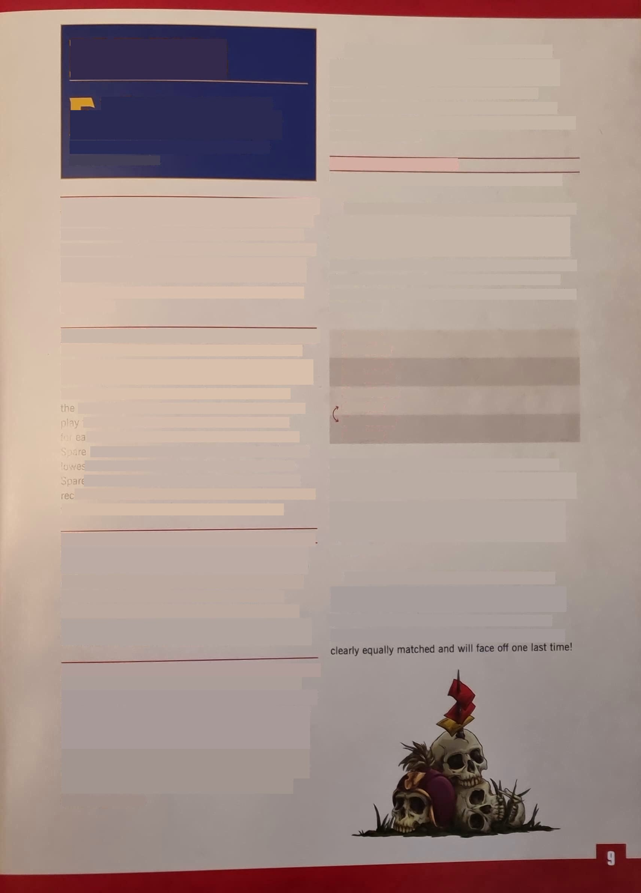

+------------------------------------------------------------------+---+---+
| **[ROUND 1]                                        |   |   |
| \_\_\_                                                         |   |   |
| \_\_\_\_\_\_\_\_\_\_\_\_\_\_\_\_\_\_\_\_\_\_\_\_\_\_\_\_\_\_\_** |   |   |
+==================================================================+===+===+
|                                                                  |   |   |
+------------------------------------------------------------------+---+---+
| For the first round, coaches are paired together randomly,     |   |   |
+------------------------------------------------------------------+---+---+
| using player numbers generated upon registration. This           |   |   |
+------------------------------------------------------------------+---+---+
| could be done using a random number generator, drawing           |   |   |
+------------------------------------------------------------------+---+---+
| names out of a hat, or any other method so long as it is random. |   |   |
| If there is an odd number of coaches then one                    |   |   |
+------------------------------------------------------------------+---+---+

+---------------+------------------------------------------------------+
| coach will be |                                                      |
| randomly      |                                                      |
| paired with   |                                                      |
| the Spare     |                                                      |
| Player or     |                                                      |
+===============+======================================================+
| given a     |                                                      |
| Bye.        |                                                      |
+---------------+------------------------------------------------------+

+-----------------------------------------------------------------+----+
| **[SPARE PLAYER]                                  |    |
| \_\_\_\_\_\_\_\_\_\_\_\_\_\_\_\_\_\_\_\_\_\_\_\_\_\_\_\_**    |    |
+=================================================================+====+
| If a coach is paired against the Spare Player, then they        |    |
+-----------------------------------------------------------------+----+

will play the game as normal and record the result in the same way as
they would for any other game in the event. When working out the
rankings for pairings later on,
>
Spare Player is not counted and instead will always
>
! he coach who is at the bottom of the rankings\
ch round. If a coach who has already played the

+---+----------------------------------------------------------------+---+
|   | Player is drawn against them again, then the next            |   |
+===+================================================================+===+
| |                                                                |   |
|   |                                                                |   |
| , |                                                                |   |
| t |                                                                |   |
| |                                                                |   |
|   |                                                                |   |
| c |                                                                |   |
| o |                                                                |   |
| a |                                                                |   |
| c |                                                                |   |
| h |                                                                |   |
| |                                                                |   |
|   |                                                                |   |
| w |                                                                |   |
| h |                                                                |   |
| o |                                                                |   |
| |                                                                |   |
|   |                                                                |   |
| h |                                                                |   |
| a |                                                                |   |
| s |                                                                |   |
| |                                                                |   |
|   |                                                                |   |
| n |                                                                |   |
| o |                                                                |   |
| t |                                                                |   |
| |                                                                |   |
|   |                                                                |   |
| a |                                                                |   |
| l |                                                                |   |
| r |                                                                |   |
| e |                                                                |   |
| a |                                                                |   |
| d |                                                                |   |
| y |                                                                |   |
| |                                                                |   |
|   |                                                                |   |
| p |                                                                |   |
| l |                                                                |   |
| a |                                                                |   |
| y |                                                                |   |
| e |                                                                |   |
| d |                                                                |   |
| |                                                                |   |
|   |                                                                |   |
| a |                                                                |   |
| g |                                                                |   |
| a |                                                                |   |
| i |                                                                |   |
| n |                                                                |   |
| s |                                                                |   |
| t |                                                                |   |
| |                                                                |   |
|   |                                                                |   |
| t |                                                                |   |
| h |                                                                |   |
| e |                                                                |   |
+---+----------------------------------------------------------------+---+

+---+---------------------------------------------------------------+---+
|   | i Player will play them instead. We would always              |   |
+===+===============================================================+===+
| |                                                               |   |
|   |                                                               |   |
| o |                                                               |   |
| m |                                                               |   |
| m |                                                               |   |
| e |                                                               |   |
| n |                                                               |   |
| d |                                                               |   |
| |                                                               |   |
|   |                                                               |   |
| t |                                                               |   |
| h |                                                               |   |
| a |                                                               |   |
| t |                                                               |   |
| |                                                               |   |
|   |                                                               |   |
| a |                                                               |   |
| |                                                               |   |
|   |                                                               |   |
| t |                                                               |   |
| o |                                                               |   |
| u |                                                               |   |
| r |                                                               |   |
| n |                                                               |   |
| a |                                                               |   |
| m |                                                               |   |
| e |                                                               |   |
| n |                                                               |   |
| t |                                                               |   |
| |                                                               |   |
|   |                                                               |   |
| h |                                                               |   |
| a |                                                               |   |
| s |                                                               |   |
| |                                                               |   |
|   |                                                               |   |
| a |                                                               |   |
| |                                                               |   |
|   |                                                               |   |
| S |                                                               |   |
| p |                                                               |   |
| a |                                                               |   |
| r |                                                               |   |
| e |                                                               |   |
| |                                                               |   |
|   |                                                               |   |
| P |                                                               |   |
| l |                                                               |   |
| a |                                                               |   |
| y |                                                               |   |
| e |                                                               |   |
| r |                                                               |   |
| , |                                                               |   |
| |                                                               |   |
|   |                                                               |   |
| a |                                                               |   |
| s |                                                               |   |
| |                                                               |   |
|   |                                                               |   |
| i |                                                               |   |
| t |                                                               |   |
| |                                                               |   |
|   |                                                               |   |
| i |                                                               |   |
| s |                                                               |   |
+---+---------------------------------------------------------------+---+

far more fun for your attendees than having a Bye.

+--------------------------------------------------------------+---+---+---+
| **[BYE]                                        |   |   |   |
| \_\_\_\_\_\_\_\_\_                                         |   |   |   |
| \_\_\_\_\_\_\_\_\_\_\_\_\_\_\_\_\_\_\_\_\_\_\_\_\_\_\_\_\_** |   |   |   |
+==============================================================+===+===+===+
| Sometimes you may be unable to find a suitable Spare Player  |   |   |   |
| for your event. In this case, the coach that would           |   |   |   |
+--------------------------------------------------------------+---+---+---+
| normally be paired with the Spare Player (as describe      |   | d |   |
+--------------------------------------------------------------+---+---+---+
| above) will instead receive a Bye. A Bye counts as         |   |   |   |
+--------------------------------------------------------------+---+---+---+
| winning the game 2-0, with neither side inflicting any     |   |   |   |
+--------------------------------------------------------------+---+---+---+
| casualties upon the other. This will award 2 Tournamen       |   |   | t |
| Points and 1 Bonus Point for the purpose of Tiebreakers      |   |   | . |
+--------------------------------------------------------------+---+---+---+

+----------------------+---------------------------------------+---+---+
| **[CO              |                                       |   |   |
| NCEDING] |                                       |   |   |
| \_\_               |                                       |   |   |
| \_\_\_\_\_\_\_\_\_\_ |                                       |   |   |
| \_\_\_\_\_\_\_\_\_\_ |                                       |   |   |
| \_\_\_\_\_\_\_\_\_** |                                       |   |   |
+======================+=======================================+===+===+
| Sometimes games just |                                       |   |   |
| don\'t go your way.  |                                       |   |   |
| Your players         |                                       |   |   |
+----------------------+---------------------------------------+---+---+
| are beaten up,     |                                       |   |   |
| your apothecary is |                                       |   |   |
| working overtime   |                                       |   |   |
| trying             |                                       |   |   |
+----------------------+---------------------------------------+---+---+
| to patch everyone  |                                       |   |   |
| up and the crowd   |                                       |   |   |
| is beginning to    |                                       |   |   |
| turn against you;  |                                       |   |   |
| yet still you      |                                       |   |   |
| carry on,          |                                       |   |   |
| determined to      |                                       |   |   |
| scrape something   |                                       |   |   |
| out of the match!  |                                       |   |   |
| Even if your team  |                                       |   |   |
| is losing,         |                                       |   |   |
+----------------------+---------------------------------------+---+---+
| it is good         |                                       |   |   |
| sportsmanship to   |                                       |   |   |
| continue to play   |                                       |   |   |
| to the very end of |                                       |   |   |
| the game.          |                                       |   |   |
| Real-world sports  |                                       |   |   |
| teams don\'t quit  |                                       |   |   |
| the                |                                       |   |   |
+----------------------+---------------------------------------+---+---+
| pitch when the     |                                       |   |   |
| going gets tough,  |                                       |   |   |
| and neither should |                                       |   |   |
+----------------------+---------------------------------------+---+---+
| Blood Bowl teams!  |                                       |   |   |
+----------------------+---------------------------------------+---+---+

+---+---------------------+---------------------------------+---+---+---+
|   | Should a player   |                                 |   |   |   |
|   | concede a game,   |                                 |   |   |   |
|   | their opponent    |                                 |   |   |   |
+===+=====================+=================================+===+===+===+
| |                     |                                 |   |   |   |
|   |                     |                                 |   |   |   |
| w |                     |                                 |   |   |   |
| i |                     |                                 |   |   |   |
| l |                     |                                 |   |   |   |
| l |                     |                                 |   |   |   |
| |                     |                                 |   |   |   |
|   |                     |                                 |   |   |   |
| a |                     |                                 |   |   |   |
| u |                     |                                 |   |   |   |
| t |                     |                                 |   |   |   |
| o |                     |                                 |   |   |   |
| m |                     |                                 |   |   |   |
| a |                     |                                 |   |   |   |
| t |                     |                                 |   |   |   |
| i |                     |                                 |   |   |   |
| c |                     |                                 |   |   |   |
| a |                     |                                 |   |   |   |
| l |                     |                                 |   |   |   |
| l |                     |                                 |   |   |   |
| y |                     |                                 |   |   |   |
| |                     |                                 |   |   |   |
|   |                     |                                 |   |   |   |
| r |                     |                                 |   |   |   |
| e |                     |                                 |   |   |   |
| c |                     |                                 |   |   |   |
| e |                     |                                 |   |   |   |
| i |                     |                                 |   |   |   |
| v |                     |                                 |   |   |   |
| e |                     |                                 |   |   |   |
| |                     |                                 |   |   |   |
|   |                     |                                 |   |   |   |
| a |                     |                                 |   |   |   |
| |                     |                                 |   |   |   |
|   |                     |                                 |   |   |   |
| 3 |                     |                                 |   |   |   |
| - |                     |                                 |   |   |   |
| 0 |                     |                                 |   |   |   |
| |                     |                                 |   |   |   |
|   |                     |                                 |   |   |   |
| w |                     |                                 |   |   |   |
| i |                     |                                 |   |   |   |
| n |                     |                                 |   |   |   |
| |                     |                                 |   |   |   |
|   |                     |                                 |   |   |   |
| ( |                     |                                 |   |   |   |
| u |                     |                                 |   |   |   |
| n |                     |                                 |   |   |   |
| l |                     |                                 |   |   |   |
| e |                     |                                 |   |   |   |
| s |                     |                                 |   |   |   |
| s |                     |                                 |   |   |   |
| |                     |                                 |   |   |   |
|   |                     |                                 |   |   |   |
| t |                     |                                 |   |   |   |
| h |                     |                                 |   |   |   |
| e |                     |                                 |   |   |   |
| |                     |                                 |   |   |   |
|   |                     |                                 |   |   |   |
| s |                     |                                 |   |   |   |
| c |                     |                                 |   |   |   |
| o |                     |                                 |   |   |   |
| r |                     |                                 |   |   |   |
| e |                     |                                 |   |   |   |
| |                     |                                 |   |   |   |
| |                     |                                 |   |   |   |
|   |                     |                                 |   |   |   |
| a |                     |                                 |   |   |   |
| t |                     |                                 |   |   |   |
| |                     |                                 |   |   |   |
|   |                     |                                 |   |   |   |
| t |                     |                                 |   |   |   |
| h |                     |                                 |   |   |   |
| e |                     |                                 |   |   |   |
| |                     |                                 |   |   |   |
|   |                     |                                 |   |   |   |
| t |                     |                                 |   |   |   |
| i |                     |                                 |   |   |   |
| m |                     |                                 |   |   |   |
| e |                     |                                 |   |   |   |
| |                     |                                 |   |   |   |
|   |                     |                                 |   |   |   |
| o |                     |                                 |   |   |   |
| f |                     |                                 |   |   |   |
| |                     |                                 |   |   |   |
|   |                     |                                 |   |   |   |
| c |                     |                                 |   |   |   |
| o |                     |                                 |   |   |   |
| n |                     |                                 |   |   |   |
| c |                     |                                 |   |   |   |
| e |                     |                                 |   |   |   |
| d |                     |                                 |   |   |   |
| i |                     |                                 |   |   |   |
| n |                     |                                 |   |   |   |
| g |                     |                                 |   |   |   |
| |                     |                                 |   |   |   |
|   |                     |                                 |   |   |   |
| w |                     |                                 |   |   |   |
| a |                     |                                 |   |   |   |
| s |                     |                                 |   |   |   |
| |                     |                                 |   |   |   |
|   |                     |                                 |   |   |   |
| b |                     |                                 |   |   |   |
| e |                     |                                 |   |   |   |
| t |                     |                                 |   |   |   |
| t |                     |                                 |   |   |   |
| e |                     |                                 |   |   |   |
| r |                     |                                 |   |   |   |
| ) |                     |                                 |   |   |   |
| |                     |                                 |   |   |   |
|   |                     |                                 |   |   |   |
| a |                     |                                 |   |   |   |
| n |                     |                                 |   |   |   |
| d |                     |                                 |   |   |   |
| |                     |                                 |   |   |   |
|   |                     |                                 |   |   |   |
| w |                     |                                 |   |   |   |
| i |                     |                                 |   |   |   |
| l |                     |                                 |   |   |   |
| l |                     |                                 |   |   |   |
| |                     |                                 |   |   |   |
|   |                     |                                 |   |   |   |
| r |                     |                                 |   |   |   |
| e |                     |                                 |   |   |   |
| c |                     |                                 |   |   |   |
| e |                     |                                 |   |   |   |
| i |                     |                                 |   |   |   |
| v |                     |                                 |   |   |   |
| e |                     |                                 |   |   |   |
+---+---------------------+---------------------------------+---+---+---+
| |                     |                                 |   |   |   |
|   |                     |                                 |   |   |   |
| t |                     |                                 |   |   |   |
| h |                     |                                 |   |   |   |
| e |                     |                                 |   |   |   |
| |                     |                                 |   |   |   |
|   |                     |                                 |   |   |   |
| m |                     |                                 |   |   |   |
| a |                     |                                 |   |   |   |
| x |                     |                                 |   |   |   |
| i |                     |                                 |   |   |   |
| m |                     |                                 |   |   |   |
| u |                     |                                 |   |   |   |
| m |                     |                                 |   |   |   |
| |                     |                                 |   |   |   |
|   |                     |                                 |   |   |   |
| n |                     |                                 |   |   |   |
| u |                     |                                 |   |   |   |
| m |                     |                                 |   |   |   |
| b |                     |                                 |   |   |   |
| e |                     |                                 |   |   |   |
| r |                     |                                 |   |   |   |
| |                     |                                 |   |   |   |
|   |                     |                                 |   |   |   |
| o |                     |                                 |   |   |   |
| f |                     |                                 |   |   |   |
| |                     |                                 |   |   |   |
|   |                     |                                 |   |   |   |
| B |                     |                                 |   |   |   |
| o |                     |                                 |   |   |   |
| n |                     |                                 |   |   |   |
| u |                     |                                 |   |   |   |
| s |                     |                                 |   |   |   |
| |                     |                                 |   |   |   |
|   |                     |                                 |   |   |   |
| P |                     |                                 |   |   |   |
| o |                     |                                 |   |   |   |
| i |                     |                                 |   |   |   |
| n |                     |                                 |   |   |   |
| t |                     |                                 |   |   |   |
| s |                     |                                 |   |   |   |
| |                     |                                 |   |   |   |
|   |                     |                                 |   |   |   |
| a |                     |                                 |   |   |   |
| v |                     |                                 |   |   |   |
| a |                     |                                 |   |   |   |
| i |                     |                                 |   |   |   |
| l |                     |                                 |   |   |   |
| a |                     |                                 |   |   |   |
| b |                     |                                 |   |   |   |
| l |                     |                                 |   |   |   |
| e |                     |                                 |   |   |   |
| . |                     |                                 |   |   |   |
+---+---------------------+---------------------------------+---+---+---+
| |                     |                                 |   |   |   |
|   |                     |                                 |   |   |   |
| A |                     |                                 |   |   |   |
| d |                     |                                 |   |   |   |
| d |                     |                                 |   |   |   |
| i |                     |                                 |   |   |   |
| t |                     |                                 |   |   |   |
| i |                     |                                 |   |   |   |
| o |                     |                                 |   |   |   |
| n |                     |                                 |   |   |   |
| a |                     |                                 |   |   |   |
| l |                     |                                 |   |   |   |
| l |                     |                                 |   |   |   |
| y |                     |                                 |   |   |   |
| , |                     |                                 |   |   |   |
| |                     |                                 |   |   |   |
|   |                     |                                 |   |   |   |
| t |                     |                                 |   |   |   |
| h |                     |                                 |   |   |   |
| e |                     |                                 |   |   |   |
| |                     |                                 |   |   |   |
|   |                     |                                 |   |   |   |
| p |                     |                                 |   |   |   |
| l |                     |                                 |   |   |   |
| a |                     |                                 |   |   |   |
| y |                     |                                 |   |   |   |
| e |                     |                                 |   |   |   |
| r |                     |                                 |   |   |   |
| |                     |                                 |   |   |   |
|   |                     |                                 |   |   |   |
| w |                     |                                 |   |   |   |
| h |                     |                                 |   |   |   |
| o |                     |                                 |   |   |   |
| |                     |                                 |   |   |   |
|   |                     |                                 |   |   |   |
| c |                     |                                 |   |   |   |
| o |                     |                                 |   |   |   |
| n |                     |                                 |   |   |   |
| c |                     |                                 |   |   |   |
| e |                     |                                 |   |   |   |
| d |                     |                                 |   |   |   |
| e |                     |                                 |   |   |   |
| d |                     |                                 |   |   |   |
| |                     |                                 |   |   |   |
|   |                     |                                 |   |   |   |
| w |                     |                                 |   |   |   |
| i |                     |                                 |   |   |   |
| l |                     |                                 |   |   |   |
| l |                     |                                 |   |   |   |
| |                     |                                 |   |   |   |
|   |                     |                                 |   |   |   |
| r |                     |                                 |   |   |   |
| e |                     |                                 |   |   |   |
| c |                     |                                 |   |   |   |
| e |                     |                                 |   |   |   |
| i |                     |                                 |   |   |   |
| v |                     |                                 |   |   |   |
| e |                     |                                 |   |   |   |
| |                     |                                 |   |   |   |
|   |                     |                                 |   |   |   |
| n |                     |                                 |   |   |   |
| o |                     |                                 |   |   |   |
+---+---------------------+---------------------------------+---+---+---+
| B |                     |                                 |   |   |   |
| o |                     |                                 |   |   |   |
| n |                     |                                 |   |   |   |
| u |                     |                                 |   |   |   |
| s |                     |                                 |   |   |   |
| P |                     |                                 |   |   |   |
| o |                     |                                 |   |   |   |
| i |                     |                                 |   |   |   |
| n |                     |                                 |   |   |   |
| t |                     |                                 |   |   |   |
| s |                     |                                 |   |   |   |
| w |                     |                                 |   |   |   |
| h |                     |                                 |   |   |   |
| a |                     |                                 |   |   |   |
| t |                     |                                 |   |   |   |
| s |                     |                                 |   |   |   |
| o |                     |                                 |   |   |   |
| e |                     |                                 |   |   |   |
| v |                     |                                 |   |   |   |
| e |                     |                                 |   |   |   |
| r |                     |                                 |   |   |   |
| a |                     |                                 |   |   |   |
| n |                     |                                 |   |   |   |
| d |                     |                                 |   |   |   |
| w |                     |                                 |   |   |   |
| i |                     |                                 |   |   |   |
| l |                     |                                 |   |   |   |
| l |                     |                                 |   |   |   |
| a |                     |                                 |   |   |   |
| l |                     |                                 |   |   |   |
| s |                     |                                 |   |   |   |
| o |                     |                                 |   |   |   |
| s |                     |                                 |   |   |   |
| u |                     |                                 |   |   |   |
| f |                     |                                 |   |   |   |
| f |                     |                                 |   |   |   |
| e |                     |                                 |   |   |   |
| r |                     |                                 |   |   |   |
| a |                     |                                 |   |   |   |
| p |                     |                                 |   |   |   |
| e |                     |                                 |   |   |   |
| n |                     |                                 |   |   |   |
| a |                     |                                 |   |   |   |
| l |                     |                                 |   |   |   |
| l |                     |                                 |   |   |   |
| y |                     |                                 |   |   |   |
| o |                     |                                 |   |   |   |
| f |                     |                                 |   |   |   |
+---+---------------------+---------------------------------+---+---+---+
| |                     |                                 |   |   |   |
|   |                     |                                 |   |   |   |
| - |                     |                                 |   |   |   |
| 1 |                     |                                 |   |   |   |
| |                     |                                 |   |   |   |
|   |                     |                                 |   |   |   |
| T |                     |                                 |   |   |   |
| o |                     |                                 |   |   |   |
| u |                     |                                 |   |   |   |
| r |                     |                                 |   |   |   |
| n |                     |                                 |   |   |   |
| a |                     |                                 |   |   |   |
| m |                     |                                 |   |   |   |
| e |                     |                                 |   |   |   |
| n |                     |                                 |   |   |   |
| t |                     |                                 |   |   |   |
| |                     |                                 |   |   |   |
|   |                     |                                 |   |   |   |
| P |                     |                                 |   |   |   |
| o |                     |                                 |   |   |   |
| i |                     |                                 |   |   |   |
| n |                     |                                 |   |   |   |
| t |                     |                                 |   |   |   |
| . |                     |                                 |   |   |   |
+---+---------------------+---------------------------------+---+---+---+

**SUBSEQUENT ROUNDS**

For subsequent rounds, coaches are paired as follows.

+---+----------------------------------------------------------------+---+
|   | The coach who is highest in the rankings will play the       |   |
+===+================================================================+===+
| c |                                                                |   |
| o |                                                                |   |
| a |                                                                |   |
| c |                                                                |   |
| h |                                                                |   |
| w |                                                                |   |
| h |                                                                |   |
| o |                                                                |   |
| i |                                                                |   |
| s |                                                                |   |
| s |                                                                |   |
| e |                                                                |   |
| c |                                                                |   |
| o |                                                                |   |
| n |                                                                |   |
| d |                                                                |   |
| i |                                                                |   |
| n |                                                                |   |
| t |                                                                |   |
| h |                                                                |   |
| e |                                                                |   |
| r |                                                                |   |
| a |                                                                |   |
| n |                                                                |   |
| k |                                                                |   |
| i |                                                                |   |
| n |                                                                |   |
| g |                                                                |   |
| s |                                                                |   |
| , |                                                                |   |
| t |                                                                |   |
| h |                                                                |   |
| e |                                                                |   |
| c |                                                                |   |
| o |                                                                |   |
| a |                                                                |   |
| c |                                                                |   |
| h |                                                                |   |
| i |                                                                |   |
| n |                                                                |   |
| t |                                                                |   |
| h |                                                                |   |
| i |                                                                |   |
| r |                                                                |   |
| d |                                                                |   |
| w |                                                                |   |
| i |                                                                |   |
| l |                                                                |   |
| l |                                                                |   |
| p |                                                                |   |
| l |                                                                |   |
| a |                                                                |   |
| y |                                                                |   |
| t |                                                                |   |
| h |                                                                |   |
| e |                                                                |   |
| c |                                                                |   |
| o |                                                                |   |
| a |                                                                |   |
| c |                                                                |   |
| h |                                                                |   |
| i |                                                                |   |
| n |                                                                |   |
| f |                                                                |   |
| o |                                                                |   |
| u |                                                                |   |
| r |                                                                |   |
| t |                                                                |   |
| h |                                                                |   |
| , |                                                                |   |
| t |                                                                |   |
| h |                                                                |   |
| e |                                                                |   |
| c |                                                                |   |
| o |                                                                |   |
| a |                                                                |   |
| c |                                                                |   |
| h |                                                                |   |
| I |                                                                |   |
| n |                                                                |   |
| f |                                                                |   |
| i |                                                                |   |
| f |                                                                |   |
| t |                                                                |   |
| h |                                                                |   |
| w |                                                                |   |
| i |                                                                |   |
| l |                                                                |   |
| l |                                                                |   |
| p |                                                                |   |
| l |                                                                |   |
| a |                                                                |   |
| y |                                                                |   |
| t |                                                                |   |
| h |                                                                |   |
| e |                                                                |   |
| c |                                                                |   |
| o |                                                                |   |
| a |                                                                |   |
| c |                                                                |   |
| h |                                                                |   |
| i |                                                                |   |
| n |                                                                |   |
| s |                                                                |   |
| i |                                                                |   |
| x |                                                                |   |
| t |                                                                |   |
| h |                                                                |   |
| a |                                                                |   |
| n |                                                                |   |
| d |                                                                |   |
| s |                                                                |   |
| o |                                                                |   |
| o |                                                                |   |
| n |                                                                |   |
| u |                                                                |   |
| n |                                                                |   |
| t |                                                                |   |
| i |                                                                |   |
| l |                                                                |   |
| a |                                                                |   |
| l |                                                                |   |
| l |                                                                |   |
| c |                                                                |   |
| o |                                                                |   |
| a |                                                                |   |
| c |                                                                |   |
| h |                                                                |   |
| e |                                                                |   |
| s |                                                                |   |
| a |                                                                |   |
| r |                                                                |   |
| e |                                                                |   |
| p |                                                                |   |
| a |                                                                |   |
| i |                                                                |   |
| r |                                                                |   |
| e |                                                                |   |
| d |                                                                |   |
+---+----------------------------------------------------------------+---+

+------------------------------------------------------------------+---+
| up. If a coach is supposed to play an opponent they have       |   |
+==================================================================+===+
| already played, then the lowest ranked of the two will         |   |
+------------------------------------------------------------------+---+

swap places with the highest ranked player of the pairing below them.
>
**1** *Jay*
>
*2 Gavin*
>
**3** *Keith*
>
**4** *Xavier*
>
**5** *Nicolas*
>
**6** *Dan*
>
*1 Louise*
>
**8** *Rob*

+------------------------------------------------------------------+---+---+
| *For example: Here, we can* see *the draw for the next*        |   |   |
+==================================================================+===+===+
| *round of an event. Nicolas and Dan have already played* *each   |   |   |
| other in a previous round and so cannot play again*              |   |   |
+------------------------------------------------------------------+---+---+
| *as this is not the final round. As Dan is currently the*      |   |   |
| *lower ranked of the two players, he will swap with the*       |   |   |
| *highest ranked player from the pairing below - in this*       |   |   |
+------------------------------------------------------------------+---+---+

*case, Louise.*

+---+---------------------------------------------------------------+---+
|   | This system is used for all rounds after the first,         |   |
+===+===============================================================+===+
| |                                                               |   |
|   |                                                               |   |
| i |                                                               |   |
| n |                                                               |   |
| c |                                                               |   |
| l |                                                               |   |
| u |                                                               |   |
| d |                                                               |   |
| i |                                                               |   |
| n |                                                               |   |
| g |                                                               |   |
| |                                                               |   |
|   |                                                               |   |
| t |                                                               |   |
| h |                                                               |   |
| e |                                                               |   |
| |                                                               |   |
|   |                                                               |   |
| f |                                                               |   |
| i |                                                               |   |
| n |                                                               |   |
| a |                                                               |   |
| l |                                                               |   |
| |                                                               |   |
|   |                                                               |   |
| r |                                                               |   |
| o |                                                               |   |
| u |                                                               |   |
| n |                                                               |   |
| d |                                                               |   |
| |                                                               |   |
|   |                                                               |   |
| w |                                                               |   |
| i |                                                               |   |
| t |                                                               |   |
| h |                                                               |   |
| |                                                               |   |
|   |                                                               |   |
| o |                                                               |   |
| n |                                                               |   |
| e |                                                               |   |
| |                                                               |   |
|   |                                                               |   |
| s |                                                               |   |
| m |                                                               |   |
| a |                                                               |   |
| l |                                                               |   |
| l |                                                               |   |
| |                                                               |   |
|   |                                                               |   |
| a |                                                               |   |
| d |                                                               |   |
| j |                                                               |   |
| u |                                                               |   |
| s |                                                               |   |
| t |                                                               |   |
| m |                                                               |   |
| e |                                                               |   |
| n |                                                               |   |
| t |                                                               |   |
| . |                                                               |   |
| |                                                               |   |
| |                                                               |   |
|   |                                                               |   |
| I |                                                               |   |
| n |                                                               |   |
| |                                                               |   |
|   |                                                               |   |
| t |                                                               |   |
| h |                                                               |   |
| e |                                                               |   |
| |                                                               |   |
|   |                                                               |   |
| f |                                                               |   |
| i |                                                               |   |
| n |                                                               |   |
| a |                                                               |   |
| l |                                                               |   |
| |                                                               |   |
|   |                                                               |   |
| r |                                                               |   |
| o |                                                               |   |
| u |                                                               |   |
| n |                                                               |   |
| d |                                                               |   |
| , |                                                               |   |
| |                                                               |   |
|   |                                                               |   |
| i |                                                               |   |
| f |                                                               |   |
| |                                                               |   |
|   |                                                               |   |
| e |                                                               |   |
| x |                                                               |   |
| p |                                                               |   |
| l |                                                               |   |
| i |                                                               |   |
| c |                                                               |   |
| i |                                                               |   |
| t |                                                               |   |
| l |                                                               |   |
| y |                                                               |   |
| |                                                               |   |
|   |                                                               |   |
| s |                                                               |   |
| t |                                                               |   |
| a |                                                               |   |
| t |                                                               |   |
| e |                                                               |   |
| d |                                                               |   |
| |                                                               |   |
|   |                                                               |   |
| i |                                                               |   |
| n |                                                               |   |
| |                                                               |   |
|   |                                                               |   |
| t |                                                               |   |
| h |                                                               |   |
| e |                                                               |   |
| |                                                               |   |
|   |                                                               |   |
| r |                                                               |   |
| u |                                                               |   |
| l |                                                               |   |
| e |                                                               |   |
| s |                                                               |   |
| p |                                                               |   |
| a |                                                               |   |
| c |                                                               |   |
| k |                                                               |   |
| , |                                                               |   |
+---+---------------------------------------------------------------+---+
| t |                                                               |   |
| h |                                                               |   |
| e |                                                               |   |
| n |                                                               |   |
| t |                                                               |   |
| h |                                                               |   |
| e |                                                               |   |
| c |                                                               |   |
| o |                                                               |   |
| a |                                                               |   |
| c |                                                               |   |
| h |                                                               |   |
| e |                                                               |   |
| s |                                                               |   |
| i |                                                               |   |
| n |                                                               |   |
| f |                                                               |   |
| i |                                                               |   |
| r |                                                               |   |
| s |                                                               |   |
| t |                                                               |   |
| a |                                                               |   |
| n |                                                               |   |
| d |                                                               |   |
| s |                                                               |   |
| e |                                                               |   |
| c |                                                               |   |
| o |                                                               |   |
| n |                                                               |   |
| d |                                                               |   |
| w |                                                               |   |
| i |                                                               |   |
| l |                                                               |   |
| l |                                                               |   |
| n |                                                               |   |
| o |                                                               |   |
| t |                                                               |   |
| s |                                                               |   |
| w |                                                               |   |
| a |                                                               |   |
| p |                                                               |   |
+---+---------------------------------------------------------------+---+
| |                                                               |   |
|   |                                                               |   |
| o |                                                               |   |
| p |                                                               |   |
| p |                                                               |   |
| o |                                                               |   |
| n |                                                               |   |
| e |                                                               |   |
| n |                                                               |   |
| t |                                                               |   |
| s |                                                               |   |
| |                                                               |   |
|   |                                                               |   |
| i |                                                               |   |
| f |                                                               |   |
| |                                                               |   |
|   |                                                               |   |
| t |                                                               |   |
| h |                                                               |   |
| e |                                                               |   |
| y |                                                               |   |
| |                                                               |   |
|   |                                                               |   |
| d |                                                               |   |
| r |                                                               |   |
| a |                                                               |   |
| w |                                                               |   |
| |                                                               |   |
|   |                                                               |   |
| e |                                                               |   |
| a |                                                               |   |
| c |                                                               |   |
| h |                                                               |   |
| |                                                               |   |
|   |                                                               |   |
| o |                                                               |   |
| t |                                                               |   |
| h |                                                               |   |
| e |                                                               |   |
| r |                                                               |   |
| |                                                               |   |
|   |                                                               |   |
| a |                                                               |   |
| g |                                                               |   |
| a |                                                               |   |
| i |                                                               |   |
| n |                                                               |   |
| ; |                                                               |   |
| |                                                               |   |
|   |                                                               |   |
| t |                                                               |   |
| h |                                                               |   |
| e |                                                               |   |
| |                                                               |   |
|   |                                                               |   |
| t |                                                               |   |
| w |                                                               |   |
| o |                                                               |   |
| |                                                               |   |
|   |                                                               |   |
| a |                                                               |   |
| r |                                                               |   |
| e |                                                               |   |
+---+---------------------------------------------------------------+---+

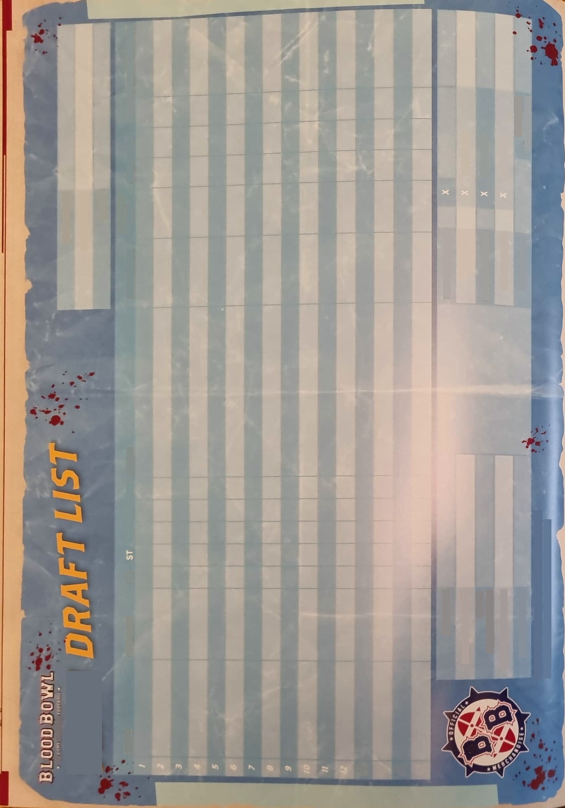

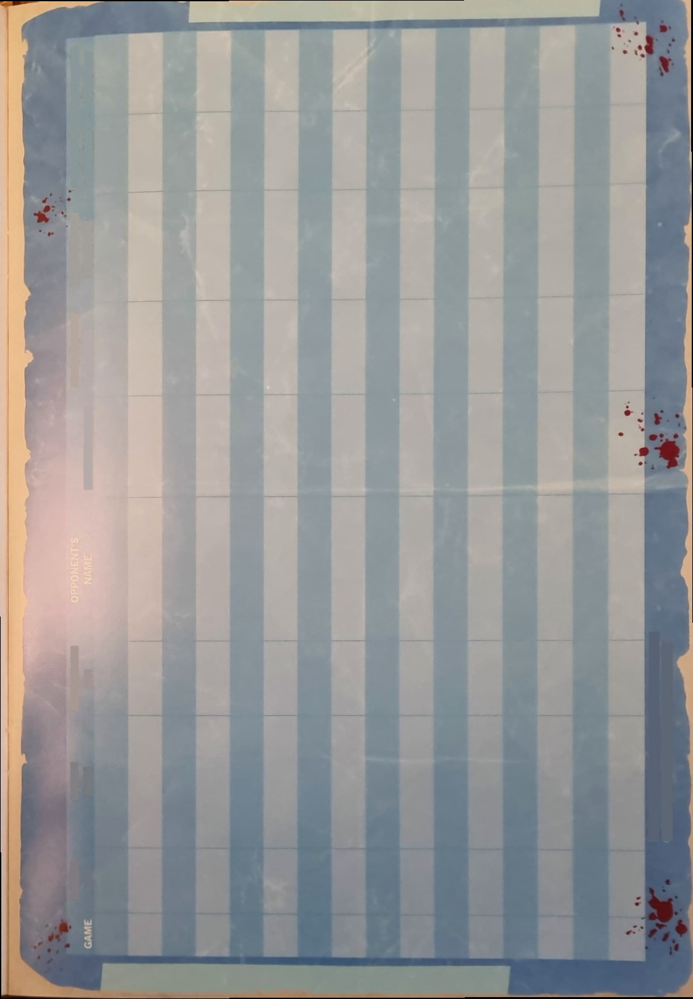

**WRITING**\
**YOUR ROSTER**

+---------+-----------------------------------------------------+---+---+
|         | **erhaps the most important thing you will**      |   |   |
+=========+=====================================================+===+===+
| ![]   |                                                     |   |   |
| (./matc |                                                     |   |   |
| hed_pla |                                                     |   |   |
| y/media |                                                     |   |   |
| /image3 |                                                     |   |   |
| 77.jpg) |                                                     |   |   |
| **bwr |                                                     |   |   |
| need  |                                                     |   |   |
| for a |                                                     |   |   |
| Blood |                                                     |   |   |
| Bowl  |                                                     |   |   |
| tou   |                                                     |   |   |
| rnament |                                                     |   |   |
| (     |                                                     |   |   |
| apart** |                                                     |   |   |
+---------+-----------------------------------------------------+---+---+
| **JI    |                                                     |   | * |
| from    |                                                     |   | * |
| your    |                                                     |   | s |
| actual  |                                                     |   | * |
| team!)  |                                                     |   | * |
| is your |                                                     |   | * |
| team**  |                                                     |   | * |
|         |                                                     |   | . |
|         |                                                     |   | * |
|         |                                                     |   | * |
+---------+-----------------------------------------------------+---+---+
| **      |                                                     |   |   |
| roster. |                                                     |   |   |
| Here we |                                                     |   |   |
| present |                                                     |   |   |
| our     |                                                     |   |   |
| re      |                                                     |   |   |
| commend |                                                     |   |   |
| ation** |                                                     |   |   |
| **for   |                                                     |   |   |
| d       |                                                     |   |   |
| rafting |                                                     |   |   |
| your    |                                                     |   |   |
| team    |                                                     |   |   |
| for a   |                                                     |   |   |
| Blood   |                                                     |   |   |
| Bowl    |                                                     |   |   |
| event** |                                                     |   |   |
+---------+-----------------------------------------------------+---+---+
| **Event |                                                     |   |   |
| Org     |                                                     |   |   |
| anisers |                                                     |   |   |
| may     |                                                     |   |   |
| decide  |                                                     |   |   |
| to      |                                                     |   |   |
| alter   |                                                     |   |   |
| these** |                                                     |   |   |
+---------+-----------------------------------------------------+---+---+
| **s     |                                                     |   |   |
| lightly |                                                     |   |   |
| for     |                                                     |   |   |
| their   |                                                     |   |   |
| own     |                                                     |   |   |
| tour    |                                                     |   |   |
| naments |                                                     |   |   |
| and if  |                                                     |   |   |
| they    |                                                     |   |   |
| do**    |                                                     |   |   |
+---------+-----------------------------------------------------+---+---+
| **so,   |                                                     |   |   |
| it      |                                                     |   |   |
| should  |                                                     |   |   |
| be      |                                                     |   |   |
| clearly |                                                     |   |   |
| listed  |                                                     |   |   |
| in the  |                                                     |   |   |
| rule    |                                                     |   |   |
| spack** |                                                     |   |   |
+---------+-----------------------------------------------------+---+---+

**for that event.**

+-----------------------------------+-----------+-----------------+---+
| **[DRAFTING YOUR                  |           | **\_\_\_\_\_\   |   |
| TEAM]**               |           | _\_\_\_\_\_\_** |   |
+===================================+===========+=================+===+
| The first thing you will need   |           |                 |   |
| to know is the Team Draft       |           |                 |   |
| Budget in gold pieces that you  |           |                 |   |
| have to build your team.        |           |                 |   |
+-----------------------------------+-----------+-----------------+---+
| This should be clearly listed in  |           |                 |   |
| the rulespack for the event       |           |                 |   |
+-----------------------------------+-----------+-----------------+---+

so that everyone knows exactly how much they have to spend! For
example, a rulespack may state \'Team Draft Budget: 1 ,200,000 gold
pieces', in which case coaches can spend up to 1,200,000 gold pieces
when drafting their team.
>
When drafting your team, follow the rules listed on pages 30-35 of the
*Blood Bowl Rulebook,* with the following exceptions:

+---+------------------------------------------------------------------+
| - |                                                                  |
|   |                                                                  |
|   |                                                                  |
|   |                                                                  |
| C |                                                                  |
| o |                                                                  |
| a |                                                                  |
| c |                                                                  |
| h |                                                                  |
| e |                                                                  |
| s |                                                                  |
|   |                                                                  |
|   |                                                                  |
|   |                                                                  |
|   |                                                                  |
| |                                                                  |
|   |                                                                  |
| w |                                                                  |
| i |                                                                  |
| l |                                                                  |
| l |                                                                  |
|   |                                                                  |
|   |                                                                  |
|   |                                                                  |
|   |                                                                  |
| |                                                                  |
|   |                                                                  |
| h |                                                                  |
| a |                                                                  |
| v |                                                                  |
| e |                                                                  |
|   |                                                                  |
|   |                                                                  |
|   |                                                                  |
|   |                                                                  |
| |                                                                  |
|   |                                                                  |
| w |                                                                  |
| h |                                                                  |
| a |                                                                  |
| t |                                                                  |
| e |                                                                  |
| v |                                                                  |
| e |                                                                  |
| r |                                                                  |
|   |                                                                  |
|   |                                                                  |
|   |                                                                  |
|   |                                                                  |
| |                                                                  |
|   |                                                                  |
| T |                                                                  |
| e |                                                                  |
| a |                                                                  |
| m |                                                                  |
|   |                                                                  |
|   |                                                                  |
|   |                                                                  |
|   |                                                                  |
| |                                                                  |
|   |                                                                  |
| D |                                                                  |
| r |                                                                  |
| a |                                                                  |
| f |                                                                  |
| t |                                                                  |
|   |                                                                  |
|   |                                                                  |
|   |                                                                  |
|   |                                                                  |
| |                                                                  |
|   |                                                                  |
| B |                                                                  |
| u |                                                                  |
| d |                                                                  |
| g |                                                                  |
| e |                                                                  |
| t |                                                                  |
+===+==================================================================+
|   | is outlined to them in the rulespack rather than               |
+---+------------------------------------------------------------------+

1 ,000,000 gold pieces.

+---+-------------------------------------------------------+----+---+---+
| - |                                                       |    |   |   |
|   |                                                       |    |   |   |
|   |                                                       |    |   |   |
|   |                                                       |    |   |   |
| C |                                                       |    |   |   |
| o |                                                       |    |   |   |
| a |                                                       |    |   |   |
| c |                                                       |    |   |   |
| h |                                                       |    |   |   |
| e |                                                       |    |   |   |
| s |                                                       |    |   |   |
|   |                                                       |    |   |   |
|   |                                                       |    |   |   |
|   |                                                       |    |   |   |
|   |                                                       |    |   |   |
| |                                                       |    |   |   |
|   |                                                       |    |   |   |
| m |                                                       |    |   |   |
| a |                                                       |    |   |   |
| y |                                                       |    |   |   |
|   |                                                       |    |   |   |
|   |                                                       |    |   |   |
|   |                                                       |    |   |   |
|   |                                                       |    |   |   |
| |                                                       |    |   |   |
|   |                                                       |    |   |   |
| s |                                                       |    |   |   |
| p |                                                       |    |   |   |
| e |                                                       |    |   |   |
| n |                                                       |    |   |   |
| d |                                                       |    |   |   |
|   |                                                       |    |   |   |
|   |                                                       |    |   |   |
|   |                                                       |    |   |   |
|   |                                                       |    |   |   |
| |                                                       |    |   |   |
|   |                                                       |    |   |   |
| t |                                                       |    |   |   |
| h |                                                       |    |   |   |
| e |                                                       |    |   |   |
| i |                                                       |    |   |   |
| r |                                                       |    |   |   |
|   |                                                       |    |   |   |
|   |                                                       |    |   |   |
|   |                                                       |    |   |   |
|   |                                                       |    |   |   |
| |                                                       |    |   |   |
|   |                                                       |    |   |   |
| g |                                                       |    |   |   |
| o |                                                       |    |   |   |
| l |                                                       |    |   |   |
| d |                                                       |    |   |   |
|   |                                                       |    |   |   |
|   |                                                       |    |   |   |
|   |                                                       |    |   |   |
|   |                                                       |    |   |   |
| |                                                       |    |   |   |
|   |                                                       |    |   |   |
| p |                                                       |    |   |   |
| i |                                                       |    |   |   |
| e |                                                       |    |   |   |
| c |                                                       |    |   |   |
| e |                                                       |    |   |   |
| s |                                                       |    |   |   |
|   |                                                       |    |   |   |
|   |                                                       |    |   |   |
|   |                                                       |    |   |   |
|   |                                                       |    |   |   |
| |                                                       |    |   |   |
|   |                                                       |    |   |   |
| o |                                                       |    |   |   |
| n |                                                       |    |   |   |
|   |                                                       |    |   |   |
|   |                                                       |    |   |   |
|   |                                                       |    |   |   |
|   |                                                       |    |   |   |
| |                                                       |    |   |   |
|   |                                                       |    |   |   |
| a |                                                       |    |   |   |
| n |                                                       |    |   |   |
| y |                                                       |    |   |   |
+===+=======================================================+====+===+===+
|   | Inducements allowed at the event (see opposite).    |    |   |   |
+---+-------------------------------------------------------+----+---+---+
| - |                                                       |    |   |   |
|   |                                                       |    |   |   |
|   |                                                       |    |   |   |
|   |                                                       |    |   |   |
| C |                                                       |    |   |   |
| o |                                                       |    |   |   |
| a |                                                       |    |   |   |
| c |                                                       |    |   |   |
| h |                                                       |    |   |   |
| e |                                                       |    |   |   |
| s |                                                       |    |   |   |
|   |                                                       |    |   |   |
|   |                                                       |    |   |   |
|   |                                                       |    |   |   |
|   |                                                       |    |   |   |
| m |                                                       |    |   |   |
| a |                                                       |    |   |   |
| y |                                                       |    |   |   |
|   |                                                       |    |   |   |
|   |                                                       |    |   |   |
|   |                                                       |    |   |   |
|   |                                                       |    |   |   |
| s |                                                       |    |   |   |
| p |                                                       |    |   |   |
| e |                                                       |    |   |   |
| n |                                                       |    |   |   |
| d |                                                       |    |   |   |
|   |                                                       |    |   |   |
|   |                                                       |    |   |   |
|   |                                                       |    |   |   |
|   |                                                       |    |   |   |
| t |                                                       |    |   |   |
| h |                                                       |    |   |   |
| e |                                                       |    |   |   |
| i |                                                       |    |   |   |
| r |                                                       |    |   |   |
|   |                                                       |    |   |   |
|   |                                                       |    |   |   |
|   |                                                       |    |   |   |
|   |                                                       |    |   |   |
| g |                                                       |    |   |   |
| o |                                                       |    |   |   |
| l |                                                       |    |   |   |
| d |                                                       |    |   |   |
|   |                                                       |    |   |   |
|   |                                                       |    |   |   |
|   |                                                       |    |   |   |
|   |                                                       |    |   |   |
| p |                                                       |    |   |   |
| i |                                                       |    |   |   |
| e |                                                       |    |   |   |
| c |                                                       |    |   |   |
| e |                                                       |    |   |   |
| s |                                                       |    |   |   |
|   |                                                       |    |   |   |
|   |                                                       |    |   |   |
|   |                                                       |    |   |   |
|   |                                                       |    |   |   |
| o |                                                       |    |   |   |
| n |                                                       |    |   |   |
|   |                                                       |    |   |   |
|   |                                                       |    |   |   |
|   |                                                       |    |   |   |
|   |                                                       |    |   |   |
| a |                                                       |    |   |   |
| d |                                                       |    |   |   |
| d |                                                       |    |   |   |
| i |                                                       |    |   |   |
| t |                                                       |    |   |   |
| i |                                                       |    |   |   |
| o |                                                       |    |   |   |
| n |                                                       |    |   |   |
| a |                                                       |    |   |   |
| l |                                                       |    |   |   |
+---+-------------------------------------------------------+----+---+---+
|   | Dedicated Fans, up to a maximum of 6, at the cost of  |    |   |   |
+---+-------------------------------------------------------+----+---+---+
|   | 10,000 gold pieces per Dedicated Fan purchased.       |    |   |   |
+---+-------------------------------------------------------+----+---+---+
| A |                                                       |    |   |   |
| n |                                                       |    |   |   |
| y |                                                       |    |   |   |
| g |                                                       |    |   |   |
| o |                                                       |    |   |   |
| l |                                                       |    |   |   |
| d |                                                       |    |   |   |
| p |                                                       |    |   |   |
| i |                                                       |    |   |   |
| e |                                                       |    |   |   |
| c |                                                       |    |   |   |
| e |                                                       |    |   |   |
| s |                                                       |    |   |   |
| n |                                                       |    |   |   |
| o |                                                       |    |   |   |
| t |                                                       |    |   |   |
| s |                                                       |    |   |   |
| p |                                                       |    |   |   |
| e |                                                       |    |   |   |
| n |                                                       |    |   |   |
| t |                                                       |    |   |   |
| w |                                                       |    |   |   |
| i |                                                       |    |   |   |
| l |                                                       |    |   |   |
| l |                                                       |    |   |   |
| b |                                                       |    |   |   |
| e |                                                       |    |   |   |
| l |                                                       |    |   |   |
| o |                                                       |    |   |   |
| s |                                                       |    |   |   |
| t |                                                       |    |   |   |
| , |                                                       |    |   |   |
| a |                                                       |    |   |   |
| n |                                                       |    |   |   |
| d |                                                       |    |   |   |
| y |                                                       |    |   |   |
| o |                                                       |    |   |   |
| u |                                                       |    |   |   |
| w |                                                       |    |   |   |
| i |                                                       |    |   |   |
| l |                                                       |    |   |   |
| l |                                                       |    |   |   |
+---+-------------------------------------------------------+----+---+---+
|   | not be able to choose any additional Inducements      |    |   |   |
+---+-------------------------------------------------------+----+---+---+

+--------------------+----------------------------------------------+---+
| to make up any   |                                              |   |
| difference       |                                              |   |
| between your     |                                              |   |
| Team Value       |                                              |   |
+====================+==============================================+===+
| and that of your   |                                              |   |
| opponent. With     |                                              |   |
| that in mind, it   |                                              |   |
| is always          |                                              |   |
| beneficial to      |                                              |   |
| spend that last    |                                              |   |
| little bit of gold |                                              |   |
| on the likes of    |                                              |   |
| Dedicated Fans,    |                                              |   |
| Assistant Coaches  |                                              |   |
+--------------------+----------------------------------------------+---+
| or Cheerleaders!   |                                              |   |
+--------------------+----------------------------------------------+---+

Coaches are expected to record all the details of their team on their
Team Draft list for the event and have

+-------------------------------------------------------+--------------+
| multiple copies readily available for their         |              |
| opponents, and                                      |              |
+=======================================================+==============+
| the Referees, during the course of the event.         |              |
+-------------------------------------------------------+--------------+

**12**
>
**[INDUCEMENTS] \~\~**
>
In the rulespack for the event, it should list which

+--------------------------------------------------------------+---+---+---+
| publications are in use for the event. All Inducements     |   |   |   |
+==============================================================+===+===+===+
| from the listed publications are allowed for the event,    |   |   |   |
| and                                                        |   |   |   |
+--------------------------------------------------------------+---+---+---+
| unless specifically stated otherwise must be purchased       |   |   |   |
+--------------------------------------------------------------+---+---+---+
| from their Team Draft Budget and are permanently added       |   |   |   |
+--------------------------------------------------------------+---+---+---+
| to your Team Draft list for the duration of the event.       |   |   |   |
+--------------------------------------------------------------+---+---+---+

+---+------------------------------+----------------------------------+
|   | Star Players may be        |                                  |
|   | induced, but a team must   |                                  |
|   | include                    |                                  |
+===+==============================+==================================+
| a |                              |                                  |
| m |                              |                                  |
| i |                              |                                  |
| n |                              |                                  |
| i |                              |                                  |
| m |                              |                                  |
| u |                              |                                  |
| m |                              |                                  |
| o |                              |                                  |
| f |                              |                                  |
| 1 |                              |                                  |
| 1 |                              |                                  |
| p |                              |                                  |
| l |                              |                                  |
| a |                              |                                  |
| y |                              |                                  |
| e |                              |                                  |
| r |                              |                                  |
| s |                              |                                  |
| b |                              |                                  |
| e |                              |                                  |
| f |                              |                                  |
| o |                              |                                  |
| r |                              |                                  |
| e |                              |                                  |
| a |                              |                                  |
| d |                              |                                  |
| d |                              |                                  |
| i |                              |                                  |
| n |                              |                                  |
| \ |                              |                                  |
| < |                              |                                  |
| y |                              |                                  |
| S |                              |                                  |
| t |                              |                                  |
| a |                              |                                  |
| r |                              |                                  |
| P |                              |                                  |
| l |                              |                                  |
| a |                              |                                  |
| y |                              |                                  |
| e |                              |                                  |
| r |                              |                                  |
| s |                              |                                  |
| . |                              |                                  |
| S |                              |                                  |
| t |                              |                                  |
| a |                              |                                  |
| r |                              |                                  |
| P |                              |                                  |
| l |                              |                                  |
| a |                              |                                  |
| y |                              |                                  |
| e |                              |                                  |
| r |                              |                                  |
| s |                              |                                  |
| w |                              |                                  |
| i |                              |                                  |
| l |                              |                                  |
| l |                              |                                  |
| a |                              |                                  |
| l |                              |                                  |
| s |                              |                                  |
| o |                              |                                  |
| c |                              |                                  |
| o |                              |                                  |
| s |                              |                                  |
| t |                              |                                  |
| a |                              |                                  |
| n |                              |                                  |
| u |                              |                                  |
| m |                              |                                  |
| b |                              |                                  |
| e |                              |                                  |
| r |                              |                                  |
| \ |                              |                                  |
| < |                              |                                  |
| I |                              |                                  |
| P |                              |                                  |
| o |                              |                                  |
| i |                              |                                  |
| n |                              |                                  |
| t |                              |                                  |
| s |                              |                                  |
| , |                              |                                  |
| w |                              |                                  |
| h |                              |                                  |
| i |                              |                                  |
| c |                              |                                  |
| h |                              |                                  |
+---+------------------------------+----------------------------------+
| a |                              |                                  |
| r |                              |                                  |
| e |                              |                                  |
| o |                              |                                  |
| u |                              |                                  |
| t |                              |                                  |
| l |                              |                                  |
| i |                              |                                  |
| n |                              |                                  |
| e |                              |                                  |
| d |                              |                                  |
| f |                              |                                  |
| u |                              |                                  |
| l |                              |                                  |
| l |                              |                                  |
| y |                              |                                  |
| o |                              |                                  |
| n |                              |                                  |
| p |                              |                                  |
| a |                              |                                  |
| g |                              |                                  |
| e |                              |                                  |
| 1 |                              |                                  |
| 4 |                              |                                  |
| . |                              |                                  |
+---+------------------------------+----------------------------------+

+---+----------------------------------+-------------+----------------+
|   | If both coaches have induce    |             | Star Player  |
|   |                                  |             | or           |
+===+==================================+=============+================+
| |                                  |             |                |
|   |                                  |             |                |
| m |                                  |             |                |
| e |                                  |             |                |
| m |                                  |             |                |
| b |                                  |             |                |
| e |                                  |             |                |
| r |                                  |             |                |
| |                                  |             |                |
|   |                                  |             |                |
| o |                                  |             |                |
| f |                                  |             |                |
| |                                  |             |                |
|   |                                  |             |                |
| ( |                                  |             |                |
| I |                                  |             |                |
| n |                                  |             |                |
| ) |                                  |             |                |
| F |                                  |             |                |
| a |                                  |             |                |
| m |                                  |             |                |
| o |                                  |             |                |
| u |                                  |             |                |
| s |                                  |             |                |
| |                                  |             |                |
|   |                                  |             |                |
| C |                                  |             |                |
| o |                                  |             |                |
| a |                                  |             |                |
| c |                                  |             |                |
| t |                                  |             |                |
| |                                  |             |                |
|   |                                  |             |                |
| j |                                  |             |                |
| f |                                  |             |                |
| , |                                  |             |                |
| |                                  |             |                |
|   |                                  |             |                |
| t |                                  |             |                |
| h |                                  |             |                |
| |                                  |             |                |
|   |                                  |             |                |
| c |                                  |             |                |
| o |                                  |             |                |
| a |                                  |             |                |
| c |                                  |             |                |
| h |                                  |             |                |
| e |                                  |             |                |
| s |                                  |             |                |
| |                                  |             |                |
|   |                                  |             |                |
| w |                                  |             |                |
| i |                                  |             |                |
| l |                                  |             |                |
| l |                                  |             |                |
+---+----------------------------------+-------------+----------------+

+--------------------------------------------------------------------+---+
| still get to use them during th rse of the game and              |   |
+====================================================================+===+
| duplicates do not cancel eacl out. Assume that the               |   |
+--------------------------------------------------------------------+---+

+--------------------+-------------------------------------------------+
| one appearing on |                                                 |
| the losing ..    |                                                 |
| was an imposter  |                                                 |
| or a             |                                                 |
+====================+=================================================+
| long-lost cousin!  |                                                 |
+--------------------+-------------------------------------------------+

+---+------------------------------------------------------------------+
|   | Additionally, some Event Organisers may wish to add            |
+===+==================================================================+
| |                                                                  |
|   |                                                                  |
| t |                                                                  |
| h |                                                                  |
| e |                                                                  |
| i |                                                                  |
| r |                                                                  |
| |                                                                  |
|   |                                                                  |
| o |                                                                  |
| w |                                                                  |
| n |                                                                  |
| |                                                                  |
|   |                                                                  |
| u |                                                                  |
| n |                                                                  |
| i |                                                                  |
| q |                                                                  |
| u |                                                                  |
| e |                                                                  |
| |                                                                  |
|   |                                                                  |
| I |                                                                  |
| n |                                                                  |
| d |                                                                  |
| u |                                                                  |
| c |                                                                  |
| e |                                                                  |
| m |                                                                  |
| e |                                                                  |
| n |                                                                  |
| t |                                                                  |
| s |                                                                  |
| |                                                                  |
|   |                                                                  |
| t |                                                                  |
| o |                                                                  |
| |                                                                  |
|   |                                                                  |
| t |                                                                  |
| h |                                                                  |
| e |                                                                  |
| |                                                                  |
|   |                                                                  |
| e |                                                                  |
| v |                                                                  |
| e |                                                                  |
| n |                                                                  |
| t |                                                                  |
| . |                                                                  |
| |                                                                  |
|   |                                                                  |
| I |                                                                  |
| f |                                                                  |
| |                                                                  |
|   |                                                                  |
| t |                                                                  |
| h |                                                                  |
| i |                                                                  |
| s |                                                                  |
| |                                                                  |
|   |                                                                  |
| i |                                                                  |
| s |                                                                  |
| |                                                                  |
|   |                                                                  |
| t |                                                                  |
| h |                                                                  |
| e |                                                                  |
+---+------------------------------------------------------------------+

+------------------------------+---------------------------------------+
| case, this should be       |                                       |
| listed clearly in the      |                                       |
| rulespack and              |                                       |
|                            |                                       |
| include what the           |                                       |
| Inducement does and how    |                                       |
| many gold                  |                                       |
+==============================+=======================================+
| pieces it costs to induce.   |                                       |
+------------------------------+---------------------------------------+

**DID YOU KNOW?**

+-------------------------------------------------------+-----+-----+---+
| *The winners of the Full Beard Cup used to be         |     |     |   |
| invited*                                              |     |     |   |
+=======================================================+=====+=====+===+
| *to an all-night tavern party with as much Bugman\'s* |     |     |   |
+-------------------------------------------------------+-----+-----+---+
| *XXXXXX as they could drink; that was until the*      |     |     |   |
+-------------------------------------------------------+-----+-----+---+
| *Norsca Rampagers won in 2498 and nearly burned*      |     |     |   |
+-------------------------------------------------------+-----+-----+---+
| *he tavern down when they ran out of ale!*          |     |     |   |
+-------------------------------------------------------+-----+-----+---+

**SKILL POINTS**

+---+-------+-----------------------------+--------------------------+---+
|   | **■■  |                             |                          |   |
|   | fter  |                             |                          |   |
|   | you   |                             |                          |   |
|   | have  |                             |                          |   |
|   | dr    |                             |                          |   |
|   | afted |                             |                          |   |
|   | your  |                             |                          |   |
|   | team  |                             |                          |   |
|   | you   |                             |                          |   |
|   | are** |                             |                          |   |
+===+=======+=============================+==========================+===+
|   |       | **able to give them some    |                          |   |
|   |       | additional Skills**         |                          |   |
+---+-------+-----------------------------+--------------------------+---+
| |       |                             |                          |   |
|   |       |                             |                          |   |
| * |       |                             |                          |   |
| * |       |                             |                          |   |
| . |       |                             |                          |   |
| j |       |                             |                          |   |
| T |       |                             |                          |   |
| a |       |                             |                          |   |
| |       |                             |                          |   |
|   |       |                             |                          |   |
| f |       |                             |                          |   |
| o |       |                             |                          |   |
| r |       |                             |                          |   |
| |       |                             |                          |   |
|   |       |                             |                          |   |
| t |       |                             |                          |   |
| h |       |                             |                          |   |
| e |       |                             |                          |   |
| |       |                             |                          |   |
|   |       |                             |                          |   |
| d |       |                             |                          |   |
| u |       |                             |                          |   |
| r |       |                             |                          |   |
| a |       |                             |                          |   |
| t |       |                             |                          |   |
| i |       |                             |                          |   |
| o |       |                             |                          |   |
| n |       |                             |                          |   |
| |       |                             |                          |   |
|   |       |                             |                          |   |
| o |       |                             |                          |   |
| f |       |                             |                          |   |
| |       |                             |                          |   |
|   |       |                             |                          |   |
| t |       |                             |                          |   |
| h |       |                             |                          |   |
| e |       |                             |                          |   |
| |       |                             |                          |   |
|   |       |                             |                          |   |
| e |       |                             |                          |   |
| v |       |                             |                          |   |
| e |       |                             |                          |   |
| n |       |                             |                          |   |
| t |       |                             |                          |   |
| . |       |                             |                          |   |
| |       |                             |                          |   |
|   |       |                             |                          |   |
| C |       |                             |                          |   |
| o |       |                             |                          |   |
| a |       |                             |                          |   |
| c |       |                             |                          |   |
| h |       |                             |                          |   |
| e |       |                             |                          |   |
| s |       |                             |                          |   |
| * |       |                             |                          |   |
| * |       |                             |                          |   |
| |       |                             |                          |   |
|   |       |                             |                          |   |
| * |       |                             |                          |   |
| * |       |                             |                          |   |
| w |       |                             |                          |   |
| i |       |                             |                          |   |
| l |       |                             |                          |   |
| l |       |                             |                          |   |
| |       |                             |                          |   |
|   |       |                             |                          |   |
| r |       |                             |                          |   |
| e |       |                             |                          |   |
| c |       |                             |                          |   |
| e |       |                             |                          |   |
| i |       |                             |                          |   |
| v |       |                             |                          |   |
| e |       |                             |                          |   |
| |       |                             |                          |   |
|   |       |                             |                          |   |
| a |       |                             |                          |   |
| |       |                             |                          |   |
|   |       |                             |                          |   |
| n |       |                             |                          |   |
| u |       |                             |                          |   |
| m |       |                             |                          |   |
| b |       |                             |                          |   |
| e |       |                             |                          |   |
| r |       |                             |                          |   |
| |       |                             |                          |   |
|   |       |                             |                          |   |
| o |       |                             |                          |   |
| f |       |                             |                          |   |
| |       |                             |                          |   |
|   |       |                             |                          |   |
| S |       |                             |                          |   |
| k |       |                             |                          |   |
| i |       |                             |                          |   |
| l |       |                             |                          |   |
| l |       |                             |                          |   |
| |       |                             |                          |   |
|   |       |                             |                          |   |
| P |       |                             |                          |   |
| o |       |                             |                          |   |
| i |       |                             |                          |   |
| n |       |                             |                          |   |
| t |       |                             |                          |   |
| s |       |                             |                          |   |
| |       |                             |                          |   |
|   |       |                             |                          |   |
| t |       |                             |                          |   |
| h |       |                             |                          |   |
| e |       |                             |                          |   |
| y |       |                             |                          |   |
| |       |                             |                          |   |
|   |       |                             |                          |   |
| c |       |                             |                          |   |
| a |       |                             |                          |   |
| n |       |                             |                          |   |
| * |       |                             |                          |   |
| * |       |                             |                          |   |
+---+-------+-----------------------------+--------------------------+---+
| |       |                             |                          |   |
|   |       |                             |                          |   |
| ! |       |                             |                          |   |
| [ |       |                             |                          |   |
| ] |       |                             |                          |   |
| ( |       |                             |                          |   |
| . |       |                             |                          |   |
| / |       |                             |                          |   |
| m |       |                             |                          |   |
| a |       |                             |                          |   |
| t |       |                             |                          |   |
| c |       |                             |                          |   |
| h |       |                             |                          |   |
| e |       |                             |                          |   |
| d |       |                             |                          |   |
| _ |       |                             |                          |   |
| p |       |                             |                          |   |
| l |       |                             |                          |   |
| a |       |                             |                          |   |
| y |       |                             |                          |   |
| / |       |                             |                          |   |
| m |       |                             |                          |   |
| e |       |                             |                          |   |
| d |       |                             |                          |   |
| i |       |                             |                          |   |
| a |       |                             |                          |   |
| / |       |                             |                          |   |
| i |       |                             |                          |   |
| m |       |                             |                          |   |
| a |       |                             |                          |   |
| g |       |                             |                          |   |
| e |       |                             |                          |   |
| 3 |       |                             |                          |   |
| 9 |       |                             |                          |   |
| 3 |       |                             |                          |   |
| . |       |                             |                          |   |
| p |       |                             |                          |   |
| n |       |                             |                          |   |
| g |       |                             |                          |   |
| ) |       |                             |                          |   |
|  |       |                             |                          |   |
| * |       |                             |                          |   |
| * |       |                             |                          |   |
| s |       |                             |                          |   |
| p |       |                             |                          |   |
| e |       |                             |                          |   |
| n |       |                             |                          |   |
| d |       |                             |                          |   |
| |       |                             |                          |   |
|   |       |                             |                          |   |
| d |       |                             |                          |   |
| e |       |                             |                          |   |
| p |       |                             |                          |   |
| e |       |                             |                          |   |
| n |       |                             |                          |   |
| d |       |                             |                          |   |
| i |       |                             |                          |   |
| n |       |                             |                          |   |
| g |       |                             |                          |   |
| |       |                             |                          |   |
|   |       |                             |                          |   |
| o |       |                             |                          |   |
| n |       |                             |                          |   |
| |       |                             |                          |   |
|   |       |                             |                          |   |
| t |       |                             |                          |   |
| h |       |                             |                          |   |
| e |       |                             |                          |   |
| |       |                             |                          |   |
|   |       |                             |                          |   |
| T |       |                             |                          |   |
| i |       |                             |                          |   |
| e |       |                             |                          |   |
| r |       |                             |                          |   |
| |       |                             |                          |   |
|   |       |                             |                          |   |
| o |       |                             |                          |   |
| f |       |                             |                          |   |
| |       |                             |                          |   |
|   |       |                             |                          |   |
| t |       |                             |                          |   |
| h |       |                             |                          |   |
| e |       |                             |                          |   |
| |       |                             |                          |   |
|   |       |                             |                          |   |
| t |       |                             |                          |   |
| e |       |                             |                          |   |
| a |       |                             |                          |   |
| m |       |                             |                          |   |
| |       |                             |                          |   |
|   |       |                             |                          |   |
| t |       |                             |                          |   |
| h |       |                             |                          |   |
| e |       |                             |                          |   |
| y |       |                             |                          |   |
| * |       |                             |                          |   |
| * |       |                             |                          |   |
+---+-------+-----------------------------+--------------------------+---+
| * |       |                             |                          |   |
| * |       |                             |                          |   |
| a |       |                             |                          |   |
| r |       |                             |                          |   |
| e |       |                             |                          |   |
| p |       |                             |                          |   |
| l |       |                             |                          |   |
| a |       |                             |                          |   |
| y |       |                             |                          |   |
| i |       |                             |                          |   |
| n |       |                             |                          |   |
| g |       |                             |                          |   |
| , |       |                             |                          |   |
| a |       |                             |                          |   |
| s |       |                             |                          |   |
| l |       |                             |                          |   |
| i |       |                             |                          |   |
| s |       |                             |                          |   |
| t |       |                             |                          |   |
| e |       |                             |                          |   |
| d |       |                             |                          |   |
| b |       |                             |                          |   |
| e |       |                             |                          |   |
| l |       |                             |                          |   |
| o |       |                             |                          |   |
| w |       |                             |                          |   |
| . |       |                             |                          |   |
| * |       |                             |                          |   |
| * |       |                             |                          |   |
+---+-------+-----------------------------+--------------------------+---+

**TIEROFTEAM NUMBER OF SKILL POINTS**
>
**Tier! *6***
>
**Tier 2 *8***
>
**Tier 3 *IO***
>
The tiers of the teams are constantly being assessed to provide the
most up-to-date and accurate distribution of teams in each tier. You
can find the most recent Tier List to use for an event in the Blood
Bowl FAQ and Errata on warhammer-community.com.

+---+---------------------------------------+--------------------------+
|   | Skill Points can be spent to        |                          |
|   | purchase Primary Skills,            |                          |
+===+=======================================+==========================+
| S |                                       |                          |
| e |                                       |                          |
| c |                                       |                          |
| o |                                       |                          |
| n |                                       |                          |
| d |                                       |                          |
| a |                                       |                          |
| r |                                       |                          |
| y |                                       |                          |
| S |                                       |                          |
| k |                                       |                          |
| i |                                       |                          |
| l |                                       |                          |
| l |                                       |                          |
| s |                                       |                          |
| a |                                       |                          |
| n |                                       |                          |
| d |                                       |                          |
| S |                                       |                          |
| t |                                       |                          |
| a |                                       |                          |
| r |                                       |                          |
| P |                                       |                          |
| l |                                       |                          |
| a |                                       |                          |
| y |                                       |                          |
| e |                                       |                          |
| r |                                       |                          |
| s |                                       |                          |
| . |                                       |                          |
+---+---------------------------------------+--------------------------+

+----------------------------------------------------------------+---+---+
| **[PURCHASING SKILLS]                            |   |   |
| \_\_\_\_\_\_\_\_\_\_\_\_\_\_**                               |   |   |
+================================================================+===+===+
| Purchasing a Primary Skill for a player will cost 1          |   |   |
+----------------------------------------------------------------+---+---+
| Skill Point. There is no limit to the number of Primary Skills |   |   |
| a team can purchase, so long as they have Skill                |   |   |
+----------------------------------------------------------------+---+---+

Points remaining.

+---+-------------------------------------------------------------+---+
|   | Purchasing a Secondary Skill for a player will cost       |   |
+===+=============================================================+===+
| |                                                             |   |
|   |                                                             |   |
| 2 |                                                             |   |
| |                                                             |   |
|   |                                                             |   |
| S |                                                             |   |
| k |                                                             |   |
| i |                                                             |   |
| l |                                                             |   |
| l |                                                             |   |
| |                                                             |   |
|   |                                                             |   |
| P |                                                             |   |
| o |                                                             |   |
| i |                                                             |   |
| n |                                                             |   |
| t |                                                             |   |
| s |                                                             |   |
| . |                                                             |   |
| |                                                             |   |
|   |                                                             |   |
| T |                                                             |   |
| e |                                                             |   |
| a |                                                             |   |
| m |                                                             |   |
| s |                                                             |   |
| |                                                             |   |
|   |                                                             |   |
| a |                                                             |   |
| r |                                                             |   |
| e |                                                             |   |
| |                                                             |   |
|   |                                                             |   |
| l |                                                             |   |
| i |                                                             |   |
| m |                                                             |   |
| i |                                                             |   |
| t |                                                             |   |
| e |                                                             |   |
| d |                                                             |   |
| |                                                             |   |
|   |                                                             |   |
| t |                                                             |   |
| o |                                                             |   |
| |                                                             |   |
|   |                                                             |   |
| t |                                                             |   |
| h |                                                             |   |
| e |                                                             |   |
| |                                                             |   |
|   |                                                             |   |
| n |                                                             |   |
| u |                                                             |   |
| m |                                                             |   |
| b |                                                             |   |
| e |                                                             |   |
| r |                                                             |   |
| |                                                             |   |
|   |                                                             |   |
| o |                                                             |   |
| f |                                                             |   |
+---+-------------------------------------------------------------+---+

+--------------------------------------------------------------------+---+
| Secondary Skills they can purchase depending on their            |   |
+====================================================================+===+
| Tier. A Tier 1 team can have a maximum of 1 Secondary Skill on the |   |
| team, a Tier 2 team can have a maximum of                          |   |
+--------------------------------------------------------------------+---+

2 Secondary Skills on the team, and a Tier 3 team can have a maximum
of 3 Secondary Skills on the team.

+---+------------------------------------------------------------------+
|   | Each player can only be given a single additional              |
+===+==================================================================+
| |                                                                  |
|   |                                                                  |
| S |                                                                  |
| k |                                                                  |
| i |                                                                  |
| l |                                                                  |
| l |                                                                  |
| , |                                                                  |
| |                                                                  |
|   |                                                                  |
| t |                                                                  |
| h |                                                                  |
| o |                                                                  |
| u |                                                                  |
| g |                                                                  |
| h |                                                                  |
| |                                                                  |
|   |                                                                  |
| t |                                                                  |
| h |                                                                  |
| e |                                                                  |
| r |                                                                  |
| e |                                                                  |
| |                                                                  |
|   |                                                                  |
| i |                                                                  |
| s |                                                                  |
| |                                                                  |
|   |                                                                  |
| n |                                                                  |
| o |                                                                  |
| |                                                                  |
|   |                                                                  |
| l |                                                                  |
| i |                                                                  |
| m |                                                                  |
| i |                                                                  |
| t |                                                                  |
| |                                                                  |
|   |                                                                  |
| t |                                                                  |
| o |                                                                  |
| |                                                                  |
|   |                                                                  |
| t |                                                                  |
| h |                                                                  |
| e |                                                                  |
| |                                                                  |
|   |                                                                  |
| n |                                                                  |
| u |                                                                  |
| m |                                                                  |
| b |                                                                  |
| e |                                                                  |
| r |                                                                  |
| |                                                                  |
|   |                                                                  |
| o |                                                                  |
| f |                                                                  |
| |                                                                  |
|   |                                                                  |
| t |                                                                  |
| i |                                                                  |
| m |                                                                  |
| e |                                                                  |
| s |                                                                  |
+---+------------------------------------------------------------------+

a particular Skill can be chosen - so long as no player
>
is given more than one Skill and you have Skill Points

+-----------------------------------------------------------+----------+
| remaining, of course. Additionally, Star Players cannot |          |
| be                                                      |          |
+===========================================================+==========+
| given additional Skills under any circumstances.          |          |
+-----------------------------------------------------------+----------+

It's important to note that, unlike in a league, Skills

+------------------------------------------------------------------+---+
| purchased for Matched Play do not add to a player\'s           |   |
+==================================================================+===+
| value and as a result their Team Value will not increase.        |   |
+------------------------------------------------------------------+---+

+----------------------------------------------------------------+---+---+---+
| **[STAR PLAYERS] \_\_\_\_\_\_\_\_\_\_\_\_\_\_\_    |   |   |   |
| \_\_\_\_\_\_\_**                                               |   |   |   |
+================================================================+===+===+===+
| Skill Points must also be spent if a team wishes to induce   |   |   |   |
+----------------------------------------------------------------+---+---+---+
| a Star Player onto their team. If a team wishes to take      |   |   |   |
|                                                                |   |   |   |
| a Star Player they must pay the cost in gold pieces as         |   |   |   |
| described earlier, and also spend *2 of* their Skill Points    |   |   |   |
|                                                                |   |   |   |
| to have them on their team. Tier 1 teams may have a            |   |   |   |
+----------------------------------------------------------------+---+---+---+
| maximum of 1 Star Player on their team, while Tier *2* or Tier |   |   |   |
| 3 teams can have a maximum of 2 Star Players on                |   |   |   |
+----------------------------------------------------------------+---+---+---+

+---+------------------------------------+-----------------------------+
|   | Below is a table summarising the |                             |
|   | breakdown of what                |                             |
+===+====================================+=============================+
| |                                    |                             |
|   |                                    |                             |
| S |                                    |                             |
| k |                                    |                             |
| i |                                    |                             |
| l |                                    |                             |
| l |                                    |                             |
| s |                                    |                             |
| |                                    |                             |
|   |                                    |                             |
| P |                                    |                             |
| o |                                    |                             |
| i |                                    |                             |
| n |                                    |                             |
| t |                                    |                             |
| s |                                    |                             |
| |                                    |                             |
|   |                                    |                             |
| c |                                    |                             |
| a |                                    |                             |
| n |                                    |                             |
| |                                    |                             |
|   |                                    |                             |
| b |                                    |                             |
| e |                                    |                             |
| |                                    |                             |
|   |                                    |                             |
| s |                                    |                             |
| p |                                    |                             |
| e |                                    |                             |
| n |                                    |                             |
| t |                                    |                             |
| |                                    |                             |
|   |                                    |                             |
| o |                                    |                             |
| n |                                    |                             |
| , |                                    |                             |
| |                                    |                             |
|   |                                    |                             |
| a |                                    |                             |
| n |                                    |                             |
| d |                                    |                             |
| |                                    |                             |
|   |                                    |                             |
| s |                                    |                             |
| o |                                    |                             |
| m |                                    |                             |
| e |                                    |                             |
| |                                    |                             |
|   |                                    |                             |
| e |                                    |                             |
| x |                                    |                             |
| a |                                    |                             |
| m |                                    |                             |
| p |                                    |                             |
| l |                                    |                             |
| e |                                    |                             |
| s |                                    |                             |
| |                                    |                             |
|   |                                    |                             |
| o |                                    |                             |
| f |                                    |                             |
| |                                    |                             |
|   |                                    |                             |
| h |                                    |                             |
| o |                                    |                             |
| w |                                    |                             |
+---+------------------------------------+-----------------------------+
| d |                                    |                             |
| i |                                    |                             |
| f |                                    |                             |
| f |                                    |                             |
| e |                                    |                             |
| r |                                    |                             |
| e |                                    |                             |
| n |                                    |                             |
| t |                                    |                             |
| t |                                    |                             |
| e |                                    |                             |
| a |                                    |                             |
| m |                                    |                             |
| s |                                    |                             |
| m |                                    |                             |
| a |                                    |                             |
| y |                                    |                             |
| s |                                    |                             |
| p |                                    |                             |
| e |                                    |                             |
| n |                                    |                             |
| d |                                    |                             |
| t |                                    |                             |
| h |                                    |                             |
| e |                                    |                             |
| m |                                    |                             |
| . |                                    |                             |
+---+------------------------------------+-----------------------------+

+---------------------------------------------+------------------------+
| /Vote.- Teams may st/// on/y ever have a  |                        |
| *maximum of 2*                            |                        |
+=============================================+========================+
| *Star Players, including Mega-stars.*       |                        |
+---------------------------------------------+------------------------+

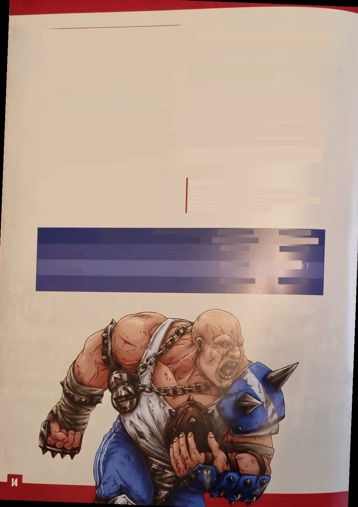their team.

+---+------------------------------------------------------------+---+---+---+
|   | Some Star Players have such an impact on the game        |   |   |   |
+===+============================================================+===+===+===+
| |                                                            |   |   |   |
|   |                                                            |   |   |   |
| t |                                                            |   |   |   |
| h |                                                            |   |   |   |
| a |                                                            |   |   |   |
| t |                                                            |   |   |   |
| |                                                            |   |   |   |
|   |                                                            |   |   |   |
| t |                                                            |   |   |   |
| h |                                                            |   |   |   |
| e |                                                            |   |   |   |
| y |                                                            |   |   |   |
| |                                                            |   |   |   |
|   |                                                            |   |   |   |
| a |                                                            |   |   |   |
| r |                                                            |   |   |   |
| e |                                                            |   |   |   |
| |                                                            |   |   |   |
|   |                                                            |   |   |   |
| c |                                                            |   |   |   |
| l |                                                            |   |   |   |
| a |                                                            |   |   |   |
| s |                                                            |   |   |   |
| s |                                                            |   |   |   |
| e |                                                            |   |   |   |
| d |                                                            |   |   |   |
| |                                                            |   |   |   |
|   |                                                            |   |   |   |
| a |                                                            |   |   |   |
| s |                                                            |   |   |   |
| |                                                            |   |   |   |
|   |                                                            |   |   |   |
| M |                                                            |   |   |   |
| e |                                                            |   |   |   |
| g |                                                            |   |   |   |
| a |                                                            |   |   |   |
| - |                                                            |   |   |   |
| s |                                                            |   |   |   |
| t |                                                            |   |   |   |
| a |                                                            |   |   |   |
| r |                                                            |   |   |   |
| s |                                                            |   |   |   |
| . |                                                            |   |   |   |
| |                                                            |   |   |   |
|   |                                                            |   |   |   |
| M |                                                            |   |   |   |
| e |                                                            |   |   |   |
| g |                                                            |   |   |   |
| a |                                                            |   |   |   |
| - |                                                            |   |   |   |
| s |                                                            |   |   |   |
| t |                                                            |   |   |   |
| a |                                                            |   |   |   |
| r |                                                            |   |   |   |
| s |                                                            |   |   |   |
| |                                                            |   |   |   |
|   |                                                            |   |   |   |
| c |                                                            |   |   |   |
| o |                                                            |   |   |   |
| s |                                                            |   |   |   |
| t |                                                            |   |   |   |
| |                                                            |   |   |   |
|   |                                                            |   |   |   |
| 4 |                                                            |   |   |   |
| |                                                            |   |   |   |
|   |                                                            |   |   |   |
| S |                                                            |   |   |   |
| k |                                                            |   |   |   |
| i |                                                            |   |   |   |
| l |                                                            |   |   |   |
| l |                                                            |   |   |   |
| |                                                            |   |   |   |
|   |                                                            |   |   |   |
| P |                                                            |   |   |   |
| o |                                                            |   |   |   |
| i |                                                            |   |   |   |
| n |                                                            |   |   |   |
| t |                                                            |   |   |   |
| s |                                                            |   |   |   |
| |                                                            |   |   |   |
|   |                                                            |   |   |   |
| r |                                                            |   |   |   |
| a |                                                            |   |   |   |
| t |                                                            |   |   |   |
| h |                                                            |   |   |   |
| e |                                                            |   |   |   |
| r |                                                            |   |   |   |
| |                                                            |   |   |   |
|   |                                                            |   |   |   |
| t |                                                            |   |   |   |
| h |                                                            |   |   |   |
| a |                                                            |   |   |   |
| n |                                                            |   |   |   |
| |                                                            |   |   |   |
|   |                                                            |   |   |   |
| t |                                                            |   |   |   |
| h |                                                            |   |   |   |
| e |                                                            |   |   |   |
| |                                                            |   |   |   |
|   |                                                            |   |   |   |
| u |                                                            |   |   |   |
| s |                                                            |   |   |   |
| u |                                                            |   |   |   |
| a |                                                            |   |   |   |
| l |                                                            |   |   |   |
| |                                                            |   |   |   |
|   |                                                            |   |   |   |
| 2 |                                                            |   |   |   |
| |                                                            |   |   |   |
|   |                                                            |   |   |   |
| S |                                                            |   |   |   |
| k |                                                            |   |   |   |
| i |                                                            |   |   |   |
| l |                                                            |   |   |   |
| l |                                                            |   |   |   |
| |                                                            |   |   |   |
|   |                                                            |   |   |   |
| P |                                                            |   |   |   |
| o |                                                            |   |   |   |
| i |                                                            |   |   |   |
| n |                                                            |   |   |   |
| t |                                                            |   |   |   |
| s |                                                            |   |   |   |
| . |                                                            |   |   |   |
| |                                                            |   |   |   |
|   |                                                            |   |   |   |
| M |                                                            |   |   |   |
| e |                                                            |   |   |   |
| g |                                                            |   |   |   |
| a |                                                            |   |   |   |
| - |                                                            |   |   |   |
+---+------------------------------------------------------------+---+---+---+
| s |                                                            |   |   |   |
| t |                                                            |   |   |   |
| a |                                                            |   |   |   |
| r |                                                            |   |   |   |
| s |                                                            |   |   |   |
| l |                                                            |   |   |   |
| i |                                                            |   |   |   |
| k |                                                            |   |   |   |
| e |                                                            |   |   |   |
| t |                                                            |   |   |   |
| o |                                                            |   |   |   |
| b |                                                            |   |   |   |
| e |                                                            |   |   |   |
| t |                                                            |   |   |   |
| h |                                                            |   |   |   |
| e |                                                            |   |   |   |
| s |                                                            |   |   |   |
| t |                                                            |   |   |   |
| a |                                                            |   |   |   |
| r |                                                            |   |   |   |
| o |                                                            |   |   |   |
| f |                                                            |   |   |   |
| t |                                                            |   |   |   |
| h |                                                            |   |   |   |
| e |                                                            |   |   |   |
| s |                                                            |   |   |   |
| h |                                                            |   |   |   |
| o |                                                            |   |   |   |
| w |                                                            |   |   |   |
| , |                                                            |   |   |   |
| a |                                                            |   |   |   |
| n |                                                            |   |   |   |
| d |                                                            |   |   |   |
| d |                                                            |   |   |   |
| o |                                                            |   |   |   |
| n |                                                            |   |   |   |
| \ |                                                            |   |   |   |
| ' |                                                            |   |   |   |
| t |                                                            |   |   |   |
| l |                                                            |   |   |   |
| i |                                                            |   |   |   |
| k |                                                            |   |   |   |
| e |                                                            |   |   |   |
| t |                                                            |   |   |   |
| o |                                                            |   |   |   |
| h |                                                            |   |   |   |
| a |                                                            |   |   |   |
| v |                                                            |   |   |   |
| e |                                                            |   |   |   |
| t |                                                            |   |   |   |
| o |                                                            |   |   |   |
| s |                                                            |   |   |   |
| h |                                                            |   |   |   |
| a |                                                            |   |   |   |
| r |                                                            |   |   |   |
| e |                                                            |   |   |   |
| t |                                                            |   |   |   |
| h |                                                            |   |   |   |
| e |                                                            |   |   |   |
| l |                                                            |   |   |   |
| i |                                                            |   |   |   |
| m |                                                            |   |   |   |
| e |                                                            |   |   |   |
| l |                                                            |   |   |   |
| i |                                                            |   |   |   |
| g |                                                            |   |   |   |
| h |                                                            |   |   |   |
| t |                                                            |   |   |   |
| w |                                                            |   |   |   |
| i |                                                            |   |   |   |
| t |                                                            |   |   |   |
| h |                                                            |   |   |   |
| a |                                                            |   |   |   |
| n |                                                            |   |   |   |
| y |                                                            |   |   |   |
| o |                                                            |   |   |   |
| n |                                                            |   |   |   |
| e |                                                            |   |   |   |
| e |                                                            |   |   |   |
| l |                                                            |   |   |   |
| s |                                                            |   |   |   |
| e |                                                            |   |   |   |
| w |                                                            |   |   |   |
| h |                                                            |   |   |   |
| o |                                                            |   |   |   |
| i |                                                            |   |   |   |
| s |                                                            |   |   |   |
| c |                                                            |   |   |   |
| o |                                                            |   |   |   |
| n |                                                            |   |   |   |
| s |                                                            |   |   |   |
| i |                                                            |   |   |   |
| d |                                                            |   |   |   |
| e |                                                            |   |   |   |
| r |                                                            |   |   |   |
| e |                                                            |   |   |   |
| d |                                                            |   |   |   |
+---+------------------------------------------------------------+---+---+---+
| t |                                                            |   |   |   |
| o |                                                            |   |   |   |
| b |                                                            |   |   |   |
| e |                                                            |   |   |   |
| t |                                                            |   |   |   |
| h |                                                            |   |   |   |
| e |                                                            |   |   |   |
| i |                                                            |   |   |   |
| r |                                                            |   |   |   |
| e |                                                            |   |   |   |
| q |                                                            |   |   |   |
| u |                                                            |   |   |   |
| a |                                                            |   |   |   |
| l |                                                            |   |   |   |
| . |                                                            |   |   |   |
| A |                                                            |   |   |   |
| t |                                                            |   |   |   |
| e |                                                            |   |   |   |
| a |                                                            |   |   |   |
| m |                                                            |   |   |   |
| m |                                                            |   |   |   |
| a |                                                            |   |   |   |
| y |                                                            |   |   |   |
| o |                                                            |   |   |   |
| n |                                                            |   |   |   |
| l |                                                            |   |   |   |
| y |                                                            |   |   |   |
| e |                                                            |   |   |   |
| v |                                                            |   |   |   |
| e |                                                            |   |   |   |
| r |                                                            |   |   |   |
| h |                                                            |   |   |   |
| a |                                                            |   |   |   |
| v |                                                            |   |   |   |
| e |                                                            |   |   |   |
| a |                                                            |   |   |   |
| s |                                                            |   |   |   |
| i |                                                            |   |   |   |
| n |                                                            |   |   |   |
| g |                                                            |   |   |   |
| l |                                                            |   |   |   |
| e |                                                            |   |   |   |
+---+------------------------------------------------------------+---+---+---+

Mega-star on their Team Draft roster.

+---+--------------------------------------------------------------+---+
|   | Which Star Players are classed as Mega-stars is            |   |
+===+==============================================================+===+
| |                                                              |   |
|   |                                                              |   |
| s |                                                              |   |
| o |                                                              |   |
| m |                                                              |   |
| e |                                                              |   |
| t |                                                              |   |
| h |                                                              |   |
| i |                                                              |   |
| n |                                                              |   |
| g |                                                              |   |
| |                                                              |   |
|   |                                                              |   |
| t |                                                              |   |
| h |                                                              |   |
| a |                                                              |   |
| t |                                                              |   |
| |                                                              |   |
|   |                                                              |   |
| i |                                                              |   |
| s |                                                              |   |
| |                                                              |   |
|   |                                                              |   |
| c |                                                              |   |
| o |                                                              |   |
| n |                                                              |   |
| s |                                                              |   |
| t |                                                              |   |
| a |                                                              |   |
| n |                                                              |   |
| t |                                                              |   |
| l |                                                              |   |
| y |                                                              |   |
| |                                                              |   |
|   |                                                              |   |
| b |                                                              |   |
| e |                                                              |   |
| i |                                                              |   |
| n |                                                              |   |
| g |                                                              |   |
| |                                                              |   |
|   |                                                              |   |
| a |                                                              |   |
| s |                                                              |   |
| s |                                                              |   |
| e |                                                              |   |
| s |                                                              |   |
| s |                                                              |   |
| e |                                                              |   |
| d |                                                              |   |
| |                                                              |   |
|   |                                                              |   |
| t |                                                              |   |
| o |                                                              |   |
| |                                                              |   |
|   |                                                              |   |
| p |                                                              |   |
| r |                                                              |   |
| o |                                                              |   |
| v |                                                              |   |
| i |                                                              |   |
| d |                                                              |   |
| e |                                                              |   |
+---+--------------------------------------------------------------+---+

the most up-to-date and accurate representation of\
their impact on the game. You can find the most recent list of
Mega-stars in the Blood Bowl FAQ and Errata on
warhammer-community.com.
>
*Skill Points Example: Jay is taking a Wood Elf team* *to a
tournament. As this is a Tier 1 team, Jay has 6* *Skill Points to
spend. He decides to give one of his*

*Wardancers Strip Ball as a Primary Skill for 1 Skill* *Point, and
another Wardancer Sidestep as a Primary* *Skill for 1 Skill Point. He
then gives his Loren Forest* *Treeman Grab for 1 Skill Point, and one of
his Wood Elf* *Linemen Wrestle for 1 Skill Point. Jay then spends his*
*last two Skill Points to have Akhorne the Squirrel as a* *Star Player.*

**DID YOU KNOW?**

+--------------------------------------------+------------------+------+
| *No Halfling team has ever won the Chaos |                  |      |
| Cup;*                                    |                  |      |
+============================================+==================+======+
| *though three have been sacrificed by    |                  |      |
| winning teams*                           |                  |      |
+--------------------------------------------+------------------+------+
| *as a thank you to the Dark Gods!*         |                  |      |
+--------------------------------------------+------------------+------+

Tier 1
>
(6 Skills Points)

PRIMARY SKILL (1 SKILL POINT) No limit

SECONDARY SKILL (2 SKILL POINTS) Maximum 1

STAR PLAYER

(2 SKILL POINTS)

Maximum 1
>
MEGA-STAR

(4 SKILL POINTS) Maximum 1

Tier 2
>
(8 Skill Points)
>
Tier 3
>
(10 Skill Points)

No Limit Maximum 2 Maximum 2 •jfiaxim.m

No limit Maximum 3 Maximum 2 *L* Maximum 1

• ♦
>
■
>
**PRAYERS TO** **MUFFLE**

+-----------------------------------------------------------------+---+---+
| **■ n a league game, the Prayers to Nuffle tabl**             |   | * |
|                                                                 |   | * |
|                                                                 |   | e |
|                                                                 |   | * |
|                                                                 |   | * |
+=================================================================+===+===+
| **U is used during the pre-game sequence to**                 |   |   |
| ![]                                                           |   |   |
| (./media/matched_play/image451.jpg)**H help balance out the value of each        |   |   |
| team.**                                                       |   |   |
+-----------------------------------------------------------------+---+---+
| **Naturally, this is not the case in a Matched Play**         |   |   |
+-----------------------------------------------------------------+---+---+
| **setting as teams are drafted using the same**               |   |   |
+-----------------------------------------------------------------+---+---+
| **Team Draft Budget, and so there won\'t be a**               |   |   |
+-----------------------------------------------------------------+---+---+
| **need to balance them afterwards. Many of the**              |   |   |
+-----------------------------------------------------------------+---+---+
| **results on the standard Prayers to Nuffle table**           |   |   |
+-----------------------------------------------------------------+---+---+
| **focus around gaining Star Player Points, whic**             |   | * |
|                                                                 |   | * |
|                                                                 |   | h |
|                                                                 |   | * |
|                                                                 |   | * |
+-----------------------------------------------------------------+---+---+
| **are not used during the course of a tournament.**           |   |   |
+-----------------------------------------------------------------+---+---+

+-----------------------------------+-------------------------------+---+
| **With this in mind, if the     |                               |   |
| Cheering Fans resul**           |                               |   |
+===================================+===============================+===+
| **comes up on the Kick-off event  |                               |   |
| table, then**                     |                               |   |
+-----------------------------------+-------------------------------+---+
| **coaches should use this       |                               |   |
| alternate Prayers to**          |                               |   |
+-----------------------------------+-------------------------------+---+
| **Nuffle table for their        |                               |   |
| Matched Play games.**           |                               |   |
+-----------------------------------+-------------------------------+---+
| **This can also be found on     |                               |   |
| page 103 of the**               |                               |   |
+-----------------------------------+-------------------------------+---+
| ***Blood Bowl Rulebook.***      |                               |   |
+-----------------------------------+-------------------------------+---+

+---+---+-----+---------+--------+---------------------------------+---+----+
| * | |     |         |        |                                 |   |    |
| * |   |     |         |        |                                 |   |    |
| M | * |     |         |        |                                 |   |    |
| * | * |     |         |        |                                 |   |    |
| * | A |     |         |        |                                 |   |    |
|   | T |     |         |        |                                 |   |    |
|   | C |     |         |        |                                 |   |    |
|   | H |     |         |        |                                 |   |    |
|   | E |     |         |        |                                 |   |    |
|   | D |     |         |        |                                 |   |    |
|   | |     |         |        |                                 |   |    |
|   |   |     |         |        |                                 |   |    |
|   | P |     |         |        |                                 |   |    |
|   | L |     |         |        |                                 |   |    |
|   | A |     |         |        |                                 |   |    |
|   | Y |     |         |        |                                 |   |    |
|   | * |     |         |        |                                 |   |    |
|   | * |     |         |        |                                 |   |    |
+===+===+=====+=========+========+=================================+===+====+
| * | * |     |         |        |                                 |   |    |
| * | * |     |         |        |                                 |   |    |
| [ | [ |     |         |        |                                 |   |    |
| P | R |     |         |        |                                 |   |    |
| ] | A |     |         |        |                                 |   |    |
|  | E |     |         |        |                                 |   |    |
| * | T |     |         |        |                                 |   |    |
| * | A |     |         |        |                                 |   |    |
|   | B |     |         |        |                                 |   |    |
|   | L |     |         |        |                                 |   |    |
|   | E |     |         |        |                                 |   |    |
|   | ] |     |         |        |                                 |   |    |
|   |  |     |         |        |                                 |   |    |
|   | \ |     |         |        |                                 |   |    |
|   | _ |     |         |        |                                 |   |    |
|   | \ |     |         |        |                                 |   |    |
|   | _ |     |         |        |                                 |   |    |
|   | \ |     |         |        |                                 |   |    |
|   | _ |     |         |        |                                 |   |    |
|   | \ |     |         |        |                                 |   |    |
|   | _ |     |         |        |                                 |   |    |
|   | \ |     |         |        |                                 |   |    |
|   | _ |     |         |        |                                 |   |    |
|   | \ |     |         |        |                                 |   |    |
|   | _ |     |         |        |                                 |   |    |
|   | \ |     |         |        |                                 |   |    |
|   | _ |     |         |        |                                 |   |    |
|   | \ |     |         |        |                                 |   |    |
|   | _ |     |         |        |                                 |   |    |
|   | * |     |         |        |                                 |   |    |
|   | * |     |         |        |                                 |   |    |
+---+---+-----+---------+--------+---------------------------------+---+----+
|   | * |     |         |        |                                 |   |    |
|   | * |     |         |        |                                 |   |    |
|   | [ |     |         |        |                                 |   |    |
|   | D |     |         |        |                                 |   |    |
|   | 8 |     |         |        |                                 |   |    |
|   | R |     |         |        |                                 |   |    |
|   | E |     |         |        |                                 |   |    |
|   | S |     |         |        |                                 |   |    |
|   | U |     |         |        |                                 |   |    |
|   | L |     |         |        |                                 |   |    |
|   | T |     |         |        |                                 |   |    |
|   | ] |     |         |        |                                 |   |    |
|   |  |     |         |        |                                 |   |    |
|   | \ |     |         |        |                                 |   |    |
|   | _ |     |         |        |                                 |   |    |
|   | \ |     |         |        |                                 |   |    |
|   | _ |     |         |        |                                 |   |    |
|   | \ |     |         |        |                                 |   |    |
|   | _ |     |         |        |                                 |   |    |
|   | \ |     |         |        |                                 |   |    |
|   | _ |     |         |        |                                 |   |    |
|   | \ |     |         |        |                                 |   |    |
|   | _ |     |         |        |                                 |   |    |
|   | \ |     |         |        |                                 |   |    |
|   | _ |     |         |        |                                 |   |    |
|   | \ |     |         |        |                                 |   |    |
|   | _ |     |         |        |                                 |   |    |
|   | \ |     |         |        |                                 |   |    |
|   | _ |     |         |        |                                 |   |    |
|   | \ |     |         |        |                                 |   |    |
|   | _ |     |         |        |                                 |   |    |
|   | \ |     |         |        |                                 |   |    |
|   | _ |     |         |        |                                 |   |    |
|   | \ |     |         |        |                                 |   |    |
|   | _ |     |         |        |                                 |   |    |
|   | \ |     |         |        |                                 |   |    |
|   | _ |     |         |        |                                 |   |    |
|   | \ |     |         |        |                                 |   |    |
|   | _ |     |         |        |                                 |   |    |
|   | \ |     |         |        |                                 |   |    |
|   | _ |     |         |        |                                 |   |    |
|   | \ |     |         |        |                                 |   |    |
|   | _ |     |         |        |                                 |   |    |
|   | \ |     |         |        |                                 |   |    |
|   | _ |     |         |        |                                 |   |    |
|   | \ |     |         |        |                                 |   |    |
|   | _ |     |         |        |                                 |   |    |
|   | \ |     |         |        |                                 |   |    |
|   | _ |     |         |        |                                 |   |    |
|   | \ |     |         |        |                                 |   |    |
|   | _ |     |         |        |                                 |   |    |
|   | \ |     |         |        |                                 |   |    |
|   | _ |     |         |        |                                 |   |    |
|   | \ |     |         |        |                                 |   |    |
|   | _ |     |         |        |                                 |   |    |
|   | \ |     |         |        |                                 |   |    |
|   | _ |     |         |        |                                 |   |    |
|   | \ |     |         |        |                                 |   |    |
|   | _ |     |         |        |                                 |   |    |
|   | \ |     |         |        |                                 |   |    |
|   | _ |     |         |        |                                 |   |    |
|   | \ |     |         |        |                                 |   |    |
|   | _ |     |         |        |                                 |   |    |
|   | \ |     |         |        |                                 |   |    |
|   | _ |     |         |        |                                 |   |    |
|   | \ |     |         |        |                                 |   |    |
|   | _ |     |         |        |                                 |   |    |
|   | \ |     |         |        |                                 |   |    |
|   | _ |     |         |        |                                 |   |    |
|   | \ |     |         |        |                                 |   |    |
|   | _ |     |         |        |                                 |   |    |
|   | \ |     |         |        |                                 |   |    |
|   | _ |     |         |        |                                 |   |    |
|   | \ |     |         |        |                                 |   |    |
|   | _ |     |         |        |                                 |   |    |
|   | \ |     |         |        |                                 |   |    |
|   | _ |     |         |        |                                 |   |    |
|   | \ |     |         |        |                                 |   |    |
|   | _ |     |         |        |                                 |   |    |
|   | * |     |         |        |                                 |   |    |
|   | * |     |         |        |                                 |   |    |
+---+---+-----+---------+--------+---------------------------------+---+----+
|   |   |     |         |        |                                 |   |    |
+---+---+-----+---------+--------+---------------------------------+---+----+
|   |   | 1 |         |        |                                 |   |    |
|   |   |   |         |        |                                 |   |    |
|   |   | *Tr |         |        |                                 |   |    |
|   |   | eac |         |        |                                 |   |    |
|   |   | her |         |        |                                 |   |    |
|   |   | ous |         |        |                                 |   |    |
|   |   | T |         |        |                                 |   |    |
|   |   | rap |         |        |                                 |   |    |
|   |   | doo |         |        |                                 |   |    |
|   |   | r:* |         |        |                                 |   |    |
|   |   |   |         |        |                                 |   |    |
|   |   |  Un |         |        |                                 |   |    |
|   |   | til |         |        |                                 |   |    |
|   |   |   |         |        |                                 |   |    |
|   |   | the |         |        |                                 |   |    |
|   |   |   |         |        |                                 |   |    |
|   |   | end |         |        |                                 |   |    |
|   |   |   |         |        |                                 |   |    |
|   |   |  of |         |        |                                 |   |    |
|   |   | t |         |        |                                 |   |    |
|   |   | his |         |        |                                 |   |    |
+---+---+-----+---------+--------+---------------------------------+---+----+
|   |   |     | half, |        |                                 |   |    |
|   |   |     | every |        |                                 |   |    |
|   |   |     | time  |        |                                 |   |    |
|   |   |     | any   |        |                                 |   |    |
|   |   |     |       |        |                                 |   |    |
|   |   |     |  player |        |                                 |   |    |
|   |   |     |       |        |                                 |   |    |
|   |   |     |  enters |        |                                 |   |    |
|   |   |     | a     |        |                                 |   |    |
|   |   |     | T     |        |                                 |   |    |
|   |   |     | rapdoor |        |                                 |   |    |
+---+---+-----+---------+--------+---------------------------------+---+----+

+--------------------------------------------------------------------+---+
| square, roll a D6. On a roll of a 1, the trapdoor falls open.    |   |
| The player is immediately removed                                |   |
+====================================================================+===+
| from play. Treat them exactly as If they had been                |   |
+--------------------------------------------------------------------+---+

pushed into the crowd.
>
2 *Friends with the Ref:* Until the end of this\
drive, you may treat a roll of 5 or 6 on the Argue
>
the Call table as a "Well, When You Put It Like That \...\" result and
a roll of 2-4 as an \"I Don\'t Care!\" result.
>
3 *Stiletto:* Randomly select one player on your\
team that is available to play during this drive

+---------------------+------------------------------------------------+
| and that does not |                                                |
| have the Loner    |                                                |
| (X+) trait. Until |                                                |
| the end of this   |                                                |
| drive, that       |                                                |
| player gains      |                                                |
+=====================+================================================+
| the Stab trait.   |                                                |
+---------------------+------------------------------------------------+

4 *Iron Man:* Choose one player on your team that

+----------------------------------------------------------------+-----+
| is available to play during this drive and that              |     |
+================================================================+=====+
| does not have the Loner (X+) trait. Until the end of this    |     |
| game, that player improves their AV by 1 ,                   |     |
+----------------------------------------------------------------+-----+

to a maximum of 1 1 + .
>
5 *Knuchie Dusters:* Choose one player on your team that is available
to play during this drive and that does not have the Loner (X+ )
trait.
>
Until the end of this drive, that player gains the Mighty Blow ( + 1)
skill.
>
6 *Bad Habits:* Randomly select D3 opposition
>
players that are available to play during this
>
drive and that do not have the Loner (X+) trait. Until the end of this
drive, those players gain the Loner (2 + ) trait.
>
7 *Creasy Cleats:* Randomly select one opposition
>
player that is available to play during this drive. That player has
had their boots tampered
>
with. Until the end of this drive their MA is reduced by 1.
>
8 *Blessed Statue of Nuffle:* Choose one player

+----------------------------------------------------------------+-----+
| on your team that is available to play during this           |     |
+================================================================+=====+
| drive and that does not have the Loner (X+)                  |     |
+----------------------------------------------------------------+-----+

trait. Until the end of this game, that player\
gains the Pro skill.

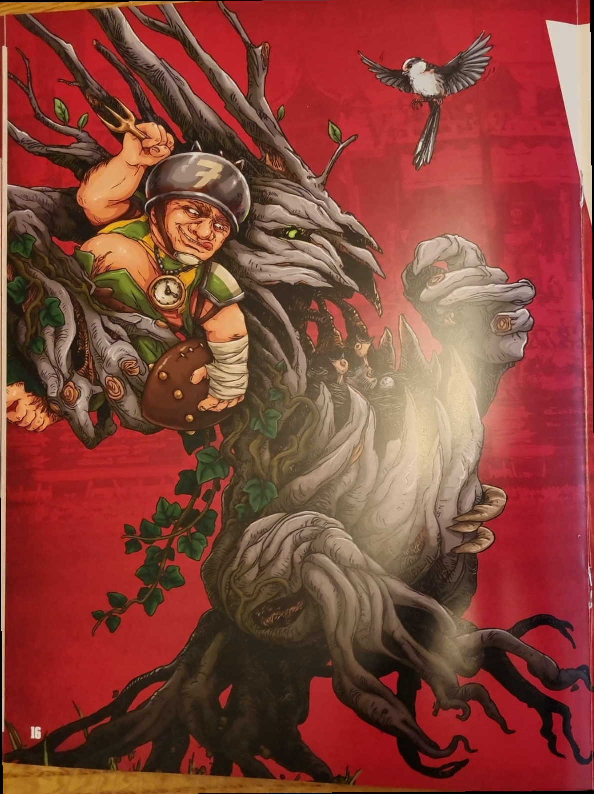

**POST-MATCH**

+---+--------+-------------------------------------------------+---+---+---+
|   | **■■ |                                                 |   |   | * |
|   | fter |                                                 |   |   | * |
|   | you  |                                                 |   |   | s |
|   | have |                                                 |   |   | * |
|   | com  |                                                 |   |   | * |
|   | pleted |                                                 |   |   |   |
|   | your |                                                 |   |   |   |
|   | game |                                                 |   |   |   |
|   | of** |                                                 |   |   |   |
+===+========+=================================================+===+===+===+
|   |        | **Blood Bowl and handed in your result**      |   |   |   |
+---+--------+-------------------------------------------------+---+---+---+
|   |        | **slip, there are a few differences between** |   |   |   |
+---+--------+-------------------------------------------------+---+---+---+
| | **M    |                                                 |   |   |   |
|   | atched |                                                 |   |   |   |
| * | Play   |                                                 |   |   |   |
| * | game   |                                                 |   |   |   |
| a | and a  |                                                 |   |   |   |
| * | match  |                                                 |   |   |   |
| * | in     |                                                 |   |   |   |
|   | the**  |                                                 |   |   |   |
+---+--------+-------------------------------------------------+---+---+---+
| |        |                                                 |   |   |   |
|   |        |                                                 |   |   |   |
| ! |        |                                                 |   |   |   |
| [ |        |                                                 |   |   |   |
| ] |        |                                                 |   |   |   |
| ( |        |                                                 |   |   |   |
| . |        |                                                 |   |   |   |
| / |        |                                                 |   |   |   |
| m |        |                                                 |   |   |   |
| a |        |                                                 |   |   |   |
| t |        |                                                 |   |   |   |
| c |        |                                                 |   |   |   |
| h |        |                                                 |   |   |   |
| e |        |                                                 |   |   |   |
| d |        |                                                 |   |   |   |
| _ |        |                                                 |   |   |   |
| p |        |                                                 |   |   |   |
| l |        |                                                 |   |   |   |
| a |        |                                                 |   |   |   |
| y |        |                                                 |   |   |   |
| / |        |                                                 |   |   |   |
| m |        |                                                 |   |   |   |
| e |        |                                                 |   |   |   |
| d |        |                                                 |   |   |   |
| i |        |                                                 |   |   |   |
| a |        |                                                 |   |   |   |
| / |        |                                                 |   |   |   |
| i |        |                                                 |   |   |   |
| m |        |                                                 |   |   |   |
| a |        |                                                 |   |   |   |
| g |        |                                                 |   |   |   |
| e |        |                                                 |   |   |   |
| 4 |        |                                                 |   |   |   |
| 8 |        |                                                 |   |   |   |
| 4 |        |                                                 |   |   |   |
| . |        |                                                 |   |   |   |
| p |        |                                                 |   |   |   |
| n |        |                                                 |   |   |   |
| g |        |                                                 |   |   |   |
| ) |        |                                                 |   |   |   |
|  |        |                                                 |   |   |   |
| * |        |                                                 |   |   |   |
| * |        |                                                 |   |   |   |
| m |        |                                                 |   |   |   |
| i |        |                                                 |   |   |   |
| d |        |                                                 |   |   |   |
| d |        |                                                 |   |   |   |
| l |        |                                                 |   |   |   |
| e |        |                                                 |   |   |   |
| |        |                                                 |   |   |   |
|   |        |                                                 |   |   |   |
| o |        |                                                 |   |   |   |
| f |        |                                                 |   |   |   |
| |        |                                                 |   |   |   |
|   |        |                                                 |   |   |   |
| a |        |                                                 |   |   |   |
| |        |                                                 |   |   |   |
|   |        |                                                 |   |   |   |
| l |        |                                                 |   |   |   |
| e |        |                                                 |   |   |   |
| a |        |                                                 |   |   |   |
| g |        |                                                 |   |   |   |
| u |        |                                                 |   |   |   |
| e |        |                                                 |   |   |   |
| . |        |                                                 |   |   |   |
| |        |                                                 |   |   |   |
|   |        |                                                 |   |   |   |
| T |        |                                                 |   |   |   |
| h |        |                                                 |   |   |   |
| e |        |                                                 |   |   |   |
| |        |                                                 |   |   |   |
|   |        |                                                 |   |   |   |
| P |        |                                                 |   |   |   |
| o |        |                                                 |   |   |   |
| s |        |                                                 |   |   |   |
| t |        |                                                 |   |   |   |
| - |        |                                                 |   |   |   |
| M |        |                                                 |   |   |   |
| a |        |                                                 |   |   |   |
| t |        |                                                 |   |   |   |
| c |        |                                                 |   |   |   |
| h |        |                                                 |   |   |   |
| |        |                                                 |   |   |   |
|   |        |                                                 |   |   |   |
| S |        |                                                 |   |   |   |
| e |        |                                                 |   |   |   |
| q |        |                                                 |   |   |   |
| u |        |                                                 |   |   |   |
| e |        |                                                 |   |   |   |
| n |        |                                                 |   |   |   |
| c |        |                                                 |   |   |   |
| e |        |                                                 |   |   |   |
| * |        |                                                 |   |   |   |
| * |        |                                                 |   |   |   |
+---+--------+-------------------------------------------------+---+---+---+
| |        |                                                 |   |   |   |
|   |        |                                                 |   |   |   |
| * |        |                                                 |   |   |   |
| * |        |                                                 |   |   |   |
| o |        |                                                 |   |   |   |
| n |        |                                                 |   |   |   |
| |        |                                                 |   |   |   |
|   |        |                                                 |   |   |   |
| p |        |                                                 |   |   |   |
| a |        |                                                 |   |   |   |
| g |        |                                                 |   |   |   |
| e |        |                                                 |   |   |   |
| |        |                                                 |   |   |   |
|   |        |                                                 |   |   |   |
| 6 |        |                                                 |   |   |   |
| 9 |        |                                                 |   |   |   |
| |        |                                                 |   |   |   |
|   |        |                                                 |   |   |   |
| o |        |                                                 |   |   |   |
| f |        |                                                 |   |   |   |
| |        |                                                 |   |   |   |
|   |        |                                                 |   |   |   |
| t |        |                                                 |   |   |   |
| h |        |                                                 |   |   |   |
| e |        |                                                 |   |   |   |
| |        |                                                 |   |   |   |
|   |        |                                                 |   |   |   |
| * |        |                                                 |   |   |   |
| B |        |                                                 |   |   |   |
| l |        |                                                 |   |   |   |
| o |        |                                                 |   |   |   |
| o |        |                                                 |   |   |   |
| d |        |                                                 |   |   |   |
| |        |                                                 |   |   |   |
|   |        |                                                 |   |   |   |
| B |        |                                                 |   |   |   |
| o |        |                                                 |   |   |   |
| w |        |                                                 |   |   |   |
| l |        |                                                 |   |   |   |
| |        |                                                 |   |   |   |
|   |        |                                                 |   |   |   |
| R |        |                                                 |   |   |   |
| u |        |                                                 |   |   |   |
| l |        |                                                 |   |   |   |
| e |        |                                                 |   |   |   |
| b |        |                                                 |   |   |   |
| o |        |                                                 |   |   |   |
| o |        |                                                 |   |   |   |
| k |        |                                                 |   |   |   |
| * |        |                                                 |   |   |   |
| |        |                                                 |   |   |   |
|   |        |                                                 |   |   |   |
| i |        |                                                 |   |   |   |
| s |        |                                                 |   |   |   |
| |        |                                                 |   |   |   |
|   |        |                                                 |   |   |   |
| n |        |                                                 |   |   |   |
| o |        |                                                 |   |   |   |
| t |        |                                                 |   |   |   |
| * |        |                                                 |   |   |   |
| * |        |                                                 |   |   |   |
+---+--------+-------------------------------------------------+---+---+---+
| |        |                                                 |   |   |   |
|   |        |                                                 |   |   |   |
| * |        |                                                 |   |   |   |
| * |        |                                                 |   |   |   |
| u |        |                                                 |   |   |   |
| s |        |                                                 |   |   |   |
| e |        |                                                 |   |   |   |
| d |        |                                                 |   |   |   |
| |        |                                                 |   |   |   |
|   |        |                                                 |   |   |   |
| i |        |                                                 |   |   |   |
| n |        |                                                 |   |   |   |
| |        |                                                 |   |   |   |
|   |        |                                                 |   |   |   |
| t |        |                                                 |   |   |   |
| o |        |                                                 |   |   |   |
| u |        |                                                 |   |   |   |
| r |        |                                                 |   |   |   |
| n |        |                                                 |   |   |   |
| a |        |                                                 |   |   |   |
| m |        |                                                 |   |   |   |
| e |        |                                                 |   |   |   |
| n |        |                                                 |   |   |   |
| t |        |                                                 |   |   |   |
| |        |                                                 |   |   |   |
|   |        |                                                 |   |   |   |
| g |        |                                                 |   |   |   |
| a |        |                                                 |   |   |   |
| m |        |                                                 |   |   |   |
| e |        |                                                 |   |   |   |
| s |        |                                                 |   |   |   |
| |        |                                                 |   |   |   |
|   |        |                                                 |   |   |   |
| a |        |                                                 |   |   |   |
| n |        |                                                 |   |   |   |
| d |        |                                                 |   |   |   |
| |        |                                                 |   |   |   |
|   |        |                                                 |   |   |   |
| h |        |                                                 |   |   |   |
| e |        |                                                 |   |   |   |
| r |        |                                                 |   |   |   |
| e |        |                                                 |   |   |   |
| |        |                                                 |   |   |   |
|   |        |                                                 |   |   |   |
| w |        |                                                 |   |   |   |
| e |        |                                                 |   |   |   |
| |        |                                                 |   |   |   |
|   |        |                                                 |   |   |   |
| w |        |                                                 |   |   |   |
| i |        |                                                 |   |   |   |
| l |        |                                                 |   |   |   |
| l |        |                                                 |   |   |   |
| * |        |                                                 |   |   |   |
| * |        |                                                 |   |   |   |
| |        |                                                 |   |   |   |
|   |        |                                                 |   |   |   |
| * |        |                                                 |   |   |   |
| * |        |                                                 |   |   |   |
| e |        |                                                 |   |   |   |
| x |        |                                                 |   |   |   |
| p |        |                                                 |   |   |   |
| l |        |                                                 |   |   |   |
| a |        |                                                 |   |   |   |
| i |        |                                                 |   |   |   |
| n |        |                                                 |   |   |   |
| |        |                                                 |   |   |   |
|   |        |                                                 |   |   |   |
| a |        |                                                 |   |   |   |
| l |        |                                                 |   |   |   |
| l |        |                                                 |   |   |   |
| |        |                                                 |   |   |   |
|   |        |                                                 |   |   |   |
| t |        |                                                 |   |   |   |
| h |        |                                                 |   |   |   |
| e |        |                                                 |   |   |   |
| |        |                                                 |   |   |   |
|   |        |                                                 |   |   |   |
| d |        |                                                 |   |   |   |
| i |        |                                                 |   |   |   |
| f |        |                                                 |   |   |   |
| f |        |                                                 |   |   |   |
| e |        |                                                 |   |   |   |
| r |        |                                                 |   |   |   |
| e |        |                                                 |   |   |   |
| n |        |                                                 |   |   |   |
| c |        |                                                 |   |   |   |
| e |        |                                                 |   |   |   |
| s |        |                                                 |   |   |   |
| |        |                                                 |   |   |   |
|   |        |                                                 |   |   |   |
| b |        |                                                 |   |   |   |
| e |        |                                                 |   |   |   |
| t |        |                                                 |   |   |   |
| w |        |                                                 |   |   |   |
| e |        |                                                 |   |   |   |
| e |        |                                                 |   |   |   |
| n |        |                                                 |   |   |   |
| |        |                                                 |   |   |   |
|   |        |                                                 |   |   |   |
| h |        |                                                 |   |   |   |
| o |        |                                                 |   |   |   |
| w |        |                                                 |   |   |   |
| |        |                                                 |   |   |   |
|   |        |                                                 |   |   |   |
| t |        |                                                 |   |   |   |
| h |        |                                                 |   |   |   |
| e |        |                                                 |   |   |   |
| * |        |                                                 |   |   |   |
| * |        |                                                 |   |   |   |
+---+--------+-------------------------------------------------+---+---+---+

**DEDICATED FANS**

+--------------------------------+-------------------------------------+
| After a Matched Play game,   |                                     |
| the winning team increases   |                                     |
+================================+=====================================+
| their Dedicated Fans by 1.     |                                     |
+--------------------------------+-------------------------------------+

  -----------------------------------------------------------------------
  **[STAR PLAYER POINTS]                                   
  \_\_\_\_\_\_\_\_\_\_\_\_\_\_\_\_\_\_\_\_\_\_**                       
  -------------------------------------------------------------------- --
                                                                       

  In a tournament, players do not earn Star Player Points during the   
  course of the event and as a result, there is                        
  -----------------------------------------------------------------------

+------------------------------+---------------------------------------+
| no need to record the      |                                       |
| number of Star Player      |                                       |
| Points each                |                                       |
+==============================+=======================================+
| player has accumulated.    |                                       |
+------------------------------+---------------------------------------+

However, we would still recommend recording the number of touchdowns
and casualties each of your

+-----------------+------------------------------------------------+---+
| players makes   |                                                |   |
| as many         |                                                |   |
| tournaments     |                                                |   |
| will have       |                                                |   |
| awards          |                                                |   |
+=================+================================================+===+
| for things such |                                                |   |
| as \'Most       |                                                |   |
| Touchdowns by a |                                                |   |
| Single Player'  |                                                |   |
| or \'Most       |                                                |   |
| Violent         |                                                |   |
| Player\'. It\'s |                                                |   |
| also nice to be |                                                |   |
| able to keep    |                                                |   |
| track of each   |                                                |   |
| of your         |                                                |   |
| player\'s       |                                                |   |
| exploits, for   |                                                |   |
| bragging rights |                                                |   |
+-----------------+------------------------------------------------+---+
| if nothing    |                                                |   |
| else!         |                                                |   |
+-----------------+------------------------------------------------+---+

+----------------------------------------------------------------+-----+
| **\_\_\_\_\_                                                 |     |
| \_\_\_\_\_\_\_\_\_\_\_\_\_\_\_\_\_\_\_\_\_\_\_\_\_\_\_\_\_\_** |     |
+================================================================+=====+
| The players on your team are utterly psyched up for            |     |
+----------------------------------------------------------------+-----+

the tournament and will let nothing short of death stop them - and
even then, that is often not enough! At the end of a game, all players
are pulled back from the
>
brink of demise by all manner of strange ways; be that a liberal
helping of under-the-counter Goblin mushrooms, daemonic pacts,
necromancy, pure pig-headedness,
>
a healthy dose of Bugman\'s XXXXXX - you name it,
>
at least one team has tried it!
>
This means that, at the end of each round, your team will make a full
recovery in time for the next game. This ensures that if a team gets
horribly mangled in their first game, they are not left unable to
compete for the rest of the event and it allows coaches to get some
good games in without panicking about having to replace players, or
worrying that their favourite player is going to get their head
smashed in - beyond the normal boundaries of a Blood Bowl match, of
course!

+-----------------------------------------------------------------------+
| **[ACQUIRING ADDITIONAL PLAYERS] \_\_\_\_\_\_\_\_\_\_** |
+=======================================================================+
| If a team acquires additional players during the course of a game,    |
| such as those earned by the Plague Ridden trait                       |
+-----------------------------------------------------------------------+

or the Masters of Undeath special rule, those additional players will
only be available until the end of the game in which they were earned,
and will not be added to your Team Draft list at the end of the game.
>
*lAmms*
>
f **course,**
>
**most coaches**

  -----------------------------------------------------------------------
  **of other coaches and to**                                      
  ---------------------------------------------------------------- ------
  ***i* - though what counts as**                                  

  -----------------------------------------------------------------------

+-------------------------------------+---------+-------------------+---+
| Blood Bowl is an unpreoicwu.e     |         |                   |   |
+-------------------------------------+---------+-------------------+---+
| and all manner of wonderfully     |         |                   |   |
| weird situations regularly        |         |                   |   |
+-------------------------------------+---------+-------------------+---+
| arise. As a result, it is often     |         |                   |   |
| good to have a number of            |         |                   |   |
+-------------------------------------+---------+-------------------+---+
| ■less serious' awards on offer for  |         |                   |   |
| coaches to compete for              |         |                   |   |
|                                     |         |                   |   |
| -   though, in our experience,      |         |                   |   |
|     these are the ones that most    |         |                   |   |
|     coaches really care about!      |         |                   |   |
|     Below are some examples of      |         |                   |   |
+-------------------------------------+---------+-------------------+---+
|                                     |         |                   |   |
+-------------------------------------+---------+-------------------+---+
| these awards you could use if you   |         |                   |   |
| wish:                               |         |                   |   |
+-------------------------------------+---------+-------------------+---+

team that scores
>
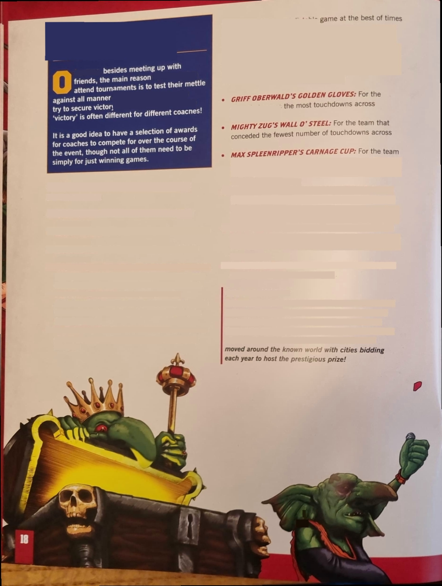the entire event.
>
the entire event.
>
We would always recommend having the following awards at an event:

  --- ---------------- ---------------------------------------------------
                       

  --- ---------------- ---------------------------------------------------

  ---- ----------------- -------------------------------------------------
                         

  ---- ----------------- -------------------------------------------------

  --- ---------------- ---------------------------------------------------
                       

  --- ---------------- ---------------------------------------------------

  --------------------------------------------------------------------- --
                                                                        

  --------------------------------------------------------------------- --

+---+---------------------------+-----------------------------------+---+
|   | that inflicts the most  |                                   |   |
|   | casualties as a result  |                                   |   |
|   | of Blitzing, Blocking,  |                                   |   |
|   | or pushing opposition   |                                   |   |
|   | players into the crowd  |                                   |   |
+===+===========================+===================================+===+
|   | across the entire       |                                   |   |
|   | event.                  |                                   |   |
+---+---------------------------+-----------------------------------+---+
| - |                           |                                   |   |
|   |                           |                                   |   |
|   |                           |                                   |   |
|   |                           |                                   |   |
| * |                           |                                   |   |
| * |                           |                                   |   |
| * |                           |                                   |   |
| M |                           |                                   |   |
| A |                           |                                   |   |
| T |                           |                                   |   |
| R |                           |                                   |   |
| O |                           |                                   |   |
| N |                           |                                   |   |
|   |                           |                                   |   |
|   |                           |                                   |   |
|   |                           |                                   |   |
|   |                           |                                   |   |
| |                           |                                   |   |
|   |                           |                                   |   |
| M |                           |                                   |   |
| C |                           |                                   |   |
| C |                           |                                   |   |
| E |                           |                                   |   |
| A |                           |                                   |   |
| R |                           |                                   |   |
| Y |                           |                                   |   |
| ' |                           |                                   |   |
| S |                           |                                   |   |
|   |                           |                                   |   |
|   |                           |                                   |   |
|   |                           |                                   |   |
|   |                           |                                   |   |
| |                           |                                   |   |
|   |                           |                                   |   |
| M |                           |                                   |   |
| O |                           |                                   |   |
| S |                           |                                   |   |
| T |                           |                                   |   |
|   |                           |                                   |   |
|   |                           |                                   |   |
|   |                           |                                   |   |
|   |                           |                                   |   |
| |                           |                                   |   |
|   |                           |                                   |   |
| P |                           |                                   |   |
| A |                           |                                   |   |
| T |                           |                                   |   |
| C |                           |                                   |   |
| H |                           |                                   |   |
| E |                           |                                   |   |
| D |                           |                                   |   |
| - |                           |                                   |   |
| U |                           |                                   |   |
| P |                           |                                   |   |
| : |                           |                                   |   |
| * |                           |                                   |   |
| * |                           |                                   |   |
| * |                           |                                   |   |
|   |                           |                                   |   |
|   |                           |                                   |   |
|   |                           |                                   |   |
|   |                           |                                   |   |
| |                           |                                   |   |
|   |                           |                                   |   |
| F |                           |                                   |   |
| o |                           |                                   |   |
| r |                           |                                   |   |
|   |                           |                                   |   |
|   |                           |                                   |   |
|   |                           |                                   |   |
|   |                           |                                   |   |
| |                           |                                   |   |
|   |                           |                                   |   |
| t |                           |                                   |   |
| h |                           |                                   |   |
| e |                           |                                   |   |
+---+---------------------------+-----------------------------------+---+
|   | team that has had the   |                                   |   |
|   | most casualties         |                                   |   |
|   | inflicted upon          |                                   |   |
+---+---------------------------+-----------------------------------+---+
|   | them as a result of     |                                   |   |
|   | Blitzing, Blocking, or  |                                   |   |
|   | having their players    |                                   |   |
|   | pushed into the crowd   |                                   |   |
|   | across the entire       |                                   |   |
|   | event.                  |                                   |   |
+---+---------------------------+-----------------------------------+---+
| - |                           |                                   |   |
|   |                           |                                   |   |
|   |                           |                                   |   |
|   |                           |                                   |   |
| * |                           |                                   |   |
| * |                           |                                   |   |
| * |                           |                                   |   |
| D |                           |                                   |   |
| I |                           |                                   |   |
| R |                           |                                   |   |
| T |                           |                                   |   |
| Y |                           |                                   |   |
|   |                           |                                   |   |
|   |                           |                                   |   |
|   |                           |                                   |   |
|   |                           |                                   |   |
| D |                           |                                   |   |
| A |                           |                                   |   |
| N |                           |                                   |   |
| \ |                           |                                   |   |
| ' |                           |                                   |   |
| S |                           |                                   |   |
|   |                           |                                   |   |
|   |                           |                                   |   |
|   |                           |                                   |   |
|   |                           |                                   |   |
| F |                           |                                   |   |
| I |                           |                                   |   |
| L |                           |                                   |   |
| T |                           |                                   |   |
| H |                           |                                   |   |
| I |                           |                                   |   |
| E |                           |                                   |   |
| S |                           |                                   |   |
| T |                           |                                   |   |
|   |                           |                                   |   |
|   |                           |                                   |   |
|   |                           |                                   |   |
|   |                           |                                   |   |
| G |                           |                                   |   |
| I |                           |                                   |   |
| T |                           |                                   |   |
| : |                           |                                   |   |
| * |                           |                                   |   |
| * |                           |                                   |   |
| * |                           |                                   |   |
|   |                           |                                   |   |
|   |                           |                                   |   |
|   |                           |                                   |   |
|   |                           |                                   |   |
| F |                           |                                   |   |
| o |                           |                                   |   |
| r |                           |                                   |   |
|   |                           |                                   |   |
|   |                           |                                   |   |
|   |                           |                                   |   |
|   |                           |                                   |   |
| t |                           |                                   |   |
| h |                           |                                   |   |
| e |                           |                                   |   |
|   |                           |                                   |   |
|   |                           |                                   |   |
|   |                           |                                   |   |
|   |                           |                                   |   |
| t |                           |                                   |   |
| e |                           |                                   |   |
| a |                           |                                   |   |
| m |                           |                                   |   |
|   |                           |                                   |   |
|   |                           |                                   |   |
|   |                           |                                   |   |
|   |                           |                                   |   |
| t |                           |                                   |   |
| h |                           |                                   |   |
| a |                           |                                   |   |
| t |                           |                                   |   |
|   |                           |                                   |   |
|   |                           |                                   |   |
|   |                           |                                   |   |
|   |                           |                                   |   |
| h |                           |                                   |   |
| a |                           |                                   |   |
| s |                           |                                   |   |
+---+---------------------------+-----------------------------------+---+
|   | the most players        |                                   |   |
|   | Sent-off as the result  |                                   |   |
|   | of committing a         |                                   |   |
|   |                         |                                   |   |
|   | Foul action (do not     |                                   |   |
|   | count those Sent-off by |                                   |   |
|   | the Secret              |                                   |   |
+---+---------------------------+-----------------------------------+---+

+---+----------------+-------------------------------------------------+
|   | Weapon       |                                                 |
|   | trait).      |                                                 |
+===+================+=================================================+
| - |                |                                                 |
|   |                |                                                 |
|   |                |                                                 |
|   |                |                                                 |
| * |                |                                                 |
| * |                |                                                 |
| * |                |                                                 |
| T |                |                                                 |
| H |                |                                                 |
| E |                |                                                 |
|   |                |                                                 |
|   |                |                                                 |
|   |                |                                                 |
|   |                |                                                 |
| S |                |                                                 |
| T |                |                                                 |
| U |                |                                                 |
| N |                |                                                 |
| T |                |                                                 |
| Y |                |                                                 |
|   |                |                                                 |
|   |                |                                                 |
|   |                |                                                 |
|   |                |                                                 |
| C |                |                                                 |
| U |                |                                                 |
| P |                |                                                 |
| : |                |                                                 |
| * |                |                                                 |
| * |                |                                                 |
| * |                |                                                 |
|   |                |                                                 |
|   |                |                                                 |
|   |                |                                                 |
|   |                |                                                 |
| F |                |                                                 |
| o |                |                                                 |
| r |                |                                                 |
|   |                |                                                 |
|   |                |                                                 |
|   |                |                                                 |
|   |                |                                                 |
| t |                |                                                 |
| h |                |                                                 |
| e |                |                                                 |
|   |                |                                                 |
|   |                |                                                 |
|   |                |                                                 |
|   |                |                                                 |
| c |                |                                                 |
| o |                |                                                 |
| a |                |                                                 |
| c |                |                                                 |
| h |                |                                                 |
|   |                |                                                 |
|   |                |                                                 |
|   |                |                                                 |
|   |                |                                                 |
| p |                |                                                 |
| l |                |                                                 |
| a |                |                                                 |
| c |                |                                                 |
| e |                |                                                 |
| s |                |                                                 |
|   |                |                                                 |
|   |                |                                                 |
|   |                |                                                 |
|   |                |                                                 |
| h |                |                                                 |
| i |                |                                                 |
| g |                |                                                 |
| h |                |                                                 |
| e |                |                                                 |
| s |                |                                                 |
| t |                |                                                 |
+---+----------------+-------------------------------------------------+

in the rankings with a Tier 3 team
>
**DID YOU KNOW?**
>
determined to have the best painted team. This could ***Although the
Spike! Magazir , ised to be held***
>
be voted on by the other coaches, or chosen by the ***in the beach
resort of Magri: sry year, following***
>
Event Organiser.

-   ***WOODEN SPOON:*** For the coach who finishes bottom

+------------+---------------------------------------------------------+
| of the   |                                                         |
| rankings |                                                         |
| and has  |                                                         |
| the      |                                                         |
| honour   |                                                         |
| of       |                                                         |
| propping |                                                         |
| up       |                                                         |
+============+=========================================================+
| the      |                                                         |
| table!   |                                                         |
+------------+---------------------------------------------------------+

+---------------------------------------------------------------+---+----+
| ***an incident in 2474 involving \<e runners-up, the***     |   |    |
+===============================================================+===+====+
|                                                               |   |    |
+---------------------------------------------------------------+---+----+
|                                                               |   |    |
+---------------------------------------------------------------+---+----+

/
>
*f \'*

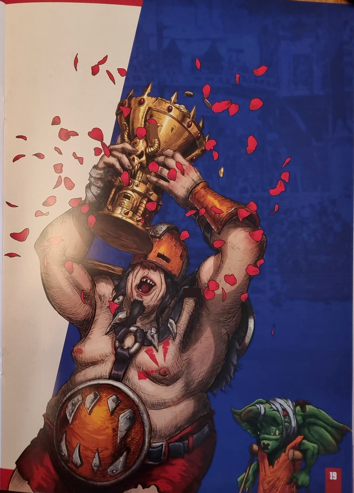

I
>
W

+-----------------------------------------------+----------------------+
| **ALTERATIVE**                              |                      |
+===============================================+======================+
|                                               |                      |
+-----------------------------------------------+----------------------+
| **FORMATS**                                   |                      |
+-----------------------------------------------+----------------------+

+----------+------+-----------------------------------------------+---+---+
| **p W ot |      |                                               |   |   |
| all      |      |                                               |   |   |
| Blood    |      |                                               |   |   |
| Bowl     |      |                                               |   |   |
| events   |      |                                               |   |   |
| have to  |      |                                               |   |   |
| be the** |      |                                               |   |   |
+==========+======+===============================================+===+===+
|  |      |                                               |   |   |
+----------+------+-----------------------------------------------+---+---+
|          | **'s |                                               |   |   |
|          | tand |                                               |   |   |
|          | ard' |                                               |   |   |
|          | s    |                                               |   |   |
|          | tyle |                                               |   |   |
|          | of   |                                               |   |   |
|          | ev   |                                               |   |   |
|          | ent; |                                               |   |   |
|          | in   |                                               |   |   |
|          | f    |                                               |   |   |
|          | act, |                                               |   |   |
|          | so   |                                               |   |   |
|          | me** |                                               |   |   |
+----------+------+-----------------------------------------------+---+---+
| ***I*  |      |                                               |   |   |
| I \\J  |      |                                               |   |   |
| of the |      |                                               |   |   |
| most   |      |                                               |   |   |
| *      |      |                                               |   |   |
| popular* |      |                                               |   |   |
| tou    |      |                                               |   |   |
| rnaments |      |                                               |   |   |
| are**  |      |                                               |   |   |
+----------+------+-----------------------------------------------+---+---+
| **run  |      |                                               |   | * |
| very   |      |                                               |   | * |
| dif    |      |                                               |   | * |
| ferently |      |                                               |   | e |
| *and   |      |                                               |   | * |
| have   |      |                                               |   | * |
| their  |      |                                               |   | * |
| own    |      |                                               |   |   |
|        |      |                                               |   |   |
| uniqu*** |      |                                               |   |   |
+----------+------+-----------------------------------------------+---+---+
| **     |      |                                               |   |   |
| *twists. |      |                                               |   |   |
| Here,  |      |                                               |   |   |
| we     |      |                                               |   |   |
|        |      |                                               |   |   |
|  present |      |                                               |   |   |
| a      |      |                                               |   |   |
| small  |      |                                               |   |   |
| s      |      |                                               |   |   |
| election |      |                                               |   |   |
| of***  |      |                                               |   |   |
+----------+------+-----------------------------------------------+---+---+
| **d      |      |                                               |   |   |
| ifferent |      |                                               |   |   |
| formats  |      |                                               |   |   |
| that     |      |                                               |   |   |
| Event    |      |                                               |   |   |
| Or       |      |                                               |   |   |
| ganisers |      |                                               |   |   |
| can      |      |                                               |   |   |
| use**    |      |                                               |   |   |
| **if     |      |                                               |   |   |
| they     |      |                                               |   |   |
| wish, or |      |                                               |   |   |
| use as   |      |                                               |   |   |
| ins      |      |                                               |   |   |
| piration |      |                                               |   |   |
| to       |      |                                               |   |   |
| create   |      |                                               |   |   |
| their**  |      |                                               |   |   |
+----------+------+-----------------------------------------------+---+---+
| **own    |      |                                               |   |   |
| fo       |      |                                               |   |   |
| rmats.** |      |                                               |   |   |
+----------+------+-----------------------------------------------+---+---+

+----------------+---------------------------------------------+-----+---+
| **[STUNTY    |                                             |     |   |
| TOURNAMEN    |                                             |     |   |
| T] |                                             |     |   |
| \_\_\_\_\_\_ |                                             |     |   |
| \_\_\_\_\_\_\_ |                                             |     |   |
| \_\_\_\_\_\_** |                                             |     |   |
+================+=============================================+=====+===+
| Perhaps the  |                                             |     |   |
| most popular |                                             |     |   |
| teams in     |                                             |     |   |
| Blood Bowl   |                                             |     |   |
| are those    |                                             |     |   |
| known as     |                                             |     |   |
| 'Stunty      |                                             |     |   |
| Teams',-     |                                             |     |   |
| those teams  |                                             |     |   |
| made up      |                                             |     |   |
| primarily of |                                             |     |   |
| the little   |                                             |     |   |
| guys in      |                                             |     |   |
| Blood Bowl   |                                             |     |   |
| that have    |                                             |     |   |
| the Stunty   |                                             |     |   |
| trait. As a  |                                             |     |   |
| result, some |                                             |     |   |
| events enjoy |                                             |     |   |
| nothing more |                                             |     |   |
| than pitting |                                             |     |   |
+----------------+---------------------------------------------+-----+---+
| these teams    |                                             |     |   |
| against each   |                                             |     |   |
| other to see   |                                             |     |   |
| who will come  |                                             |     |   |
| out on top -   |                                             |     |   |
| after all,     |                                             |     |   |
| Stunty Teams   |                                             |     |   |
| very rarely    |                                             |     |   |
| win a          |                                             |     |   |
+----------------+---------------------------------------------+-----+---+
| standard       |                                             |     |   |
| event!         |                                             |     |   |
+----------------+---------------------------------------------+-----+---+

A Stunty Tournament follows all of the same rules

+---+-----------+-----------------------------------------------+---+---+
|   | Stunty  |                                               |   |   |
|   | To      |                                               |   |   |
|   | urnaments |                                               |   |   |
|   | are     |                                               |   |   |
|   |         |                                               |   |   |
|   | typically |                                               |   |   |
|   | a more  |                                               |   |   |
|   | relaxed |                                               |   |   |
+===+===========+===============================================+===+===+
| |           |                                               |   |   |
|   |           |                                               |   |   |
| s |           |                                               |   |   |
| t |           |                                               |   |   |
| y |           |                                               |   |   |
| l |           |                                               |   |   |
| e |           |                                               |   |   |
| |           |                                               |   |   |
|   |           |                                               |   |   |
| o |           |                                               |   |   |
| f |           |                                               |   |   |
| |           |                                               |   |   |
|   |           |                                               |   |   |
| e |           |                                               |   |   |
| v |           |                                               |   |   |
| e |           |                                               |   |   |
| n |           |                                               |   |   |
| t |           |                                               |   |   |
| , |           |                                               |   |   |
| |           |                                               |   |   |
|   |           |                                               |   |   |
| a |           |                                               |   |   |
| s |           |                                               |   |   |
| |           |                                               |   |   |
|   |           |                                               |   |   |
| e |           |                                               |   |   |
| a |           |                                               |   |   |
| c |           |                                               |   |   |
| h |           |                                               |   |   |
| |           |                                               |   |   |
|   |           |                                               |   |   |
| c |           |                                               |   |   |
| o |           |                                               |   |   |
| a |           |                                               |   |   |
| c |           |                                               |   |   |
| h |           |                                               |   |   |
| |           |                                               |   |   |
|   |           |                                               |   |   |
| i |           |                                               |   |   |
| s |           |                                               |   |   |
| |           |                                               |   |   |
|   |           |                                               |   |   |
| t |           |                                               |   |   |
| a |           |                                               |   |   |
| k |           |                                               |   |   |
| i |           |                                               |   |   |
| n |           |                                               |   |   |
| g |           |                                               |   |   |
| |           |                                               |   |   |
|   |           |                                               |   |   |
| a |           |                                               |   |   |
| |           |                                               |   |   |
|   |           |                                               |   |   |
| t |           |                                               |   |   |
| e |           |                                               |   |   |
| a |           |                                               |   |   |
| m |           |                                               |   |   |
| |           |                                               |   |   |
|   |           |                                               |   |   |
| p |           |                                               |   |   |
| r |           |                                               |   |   |
| i |           |                                               |   |   |
| m |           |                                               |   |   |
| a |           |                                               |   |   |
| r |           |                                               |   |   |
| i |           |                                               |   |   |
| l |           |                                               |   |   |
| y |           |                                               |   |   |
| |           |                                               |   |   |
|   |           |                                               |   |   |
| f |           |                                               |   |   |
| o |           |                                               |   |   |
| r |           |                                               |   |   |
| |           |                                               |   |   |
|   |           |                                               |   |   |
| f |           |                                               |   |   |
| u |           |                                               |   |   |
| n |           |                                               |   |   |
| |           |                                               |   |   |
|   |           |                                               |   |   |
| a |           |                                               |   |   |
| n |           |                                               |   |   |
| d |           |                                               |   |   |
| |           |                                               |   |   |
|   |           |                                               |   |   |
| t |           |                                               |   |   |
| o |           |                                               |   |   |
| |           |                                               |   |   |
|   |           |                                               |   |   |
| b |           |                                               |   |   |
| e |           |                                               |   |   |
| |           |                                               |   |   |
|   |           |                                               |   |   |
| a |           |                                               |   |   |
| s |           |                                               |   |   |
| |           |                                               |   |   |
|   |           |                                               |   |   |
| w |           |                                               |   |   |
| a |           |                                               |   |   |
| c |           |                                               |   |   |
| k |           |                                               |   |   |
| y |           |                                               |   |   |
| |           |                                               |   |   |
|   |           |                                               |   |   |
| a |           |                                               |   |   |
| s |           |                                               |   |   |
| |           |                                               |   |   |
|   |           |                                               |   |   |
| p |           |                                               |   |   |
| o |           |                                               |   |   |
| s |           |                                               |   |   |
| s |           |                                               |   |   |
| i |           |                                               |   |   |
| b |           |                                               |   |   |
| l |           |                                               |   |   |
| e |           |                                               |   |   |
| ! |           |                                               |   |   |
| |           |                                               |   |   |
|   |           |                                               |   |   |
| A |           |                                               |   |   |
| s |           |                                               |   |   |
| |           |                                               |   |   |
|   |           |                                               |   |   |
| a |           |                                               |   |   |
| |           |                                               |   |   |
|   |           |                                               |   |   |
| r |           |                                               |   |   |
| e |           |                                               |   |   |
| s |           |                                               |   |   |
| u |           |                                               |   |   |
| l |           |                                               |   |   |
| t |           |                                               |   |   |
| , |           |                                               |   |   |
| |           |                                               |   |   |
|   |           |                                               |   |   |
| i |           |                                               |   |   |
| t |           |                                               |   |   |
| |           |                                               |   |   |
|   |           |                                               |   |   |
| i |           |                                               |   |   |
| s |           |                                               |   |   |
| |           |                                               |   |   |
| |           |                                               |   |   |
|   |           |                                               |   |   |
| o |           |                                               |   |   |
| f |           |                                               |   |   |
| t |           |                                               |   |   |
| e |           |                                               |   |   |
| n |           |                                               |   |   |
| |           |                                               |   |   |
|   |           |                                               |   |   |
| w |           |                                               |   |   |
| o |           |                                               |   |   |
| r |           |                                               |   |   |
| t |           |                                               |   |   |
| h |           |                                               |   |   |
| w |           |                                               |   |   |
| h |           |                                               |   |   |
| i |           |                                               |   |   |
| l |           |                                               |   |   |
| e |           |                                               |   |   |
| |           |                                               |   |   |
|   |           |                                               |   |   |
| t |           |                                               |   |   |
| o |           |                                               |   |   |
| |           |                                               |   |   |
|   |           |                                               |   |   |
| h |           |                                               |   |   |
| a |           |                                               |   |   |
| v |           |                                               |   |   |
| e |           |                                               |   |   |
| |           |                                               |   |   |
|   |           |                                               |   |   |
| m |           |                                               |   |   |
| o |           |                                               |   |   |
| r |           |                                               |   |   |
| e |           |                                               |   |   |
| |           |                                               |   |   |
|   |           |                                               |   |   |
| o |           |                                               |   |   |
| f |           |                                               |   |   |
| |           |                                               |   |   |
|   |           |                                               |   |   |
| t |           |                                               |   |   |
| h |           |                                               |   |   |
| e |           |                                               |   |   |
| |           |                                               |   |   |
|   |           |                                               |   |   |
| ' |           |                                               |   |   |
| s |           |                                               |   |   |
| i |           |                                               |   |   |
| l |           |                                               |   |   |
| l |           |                                               |   |   |
| i |           |                                               |   |   |
| e |           |                                               |   |   |
| r |           |                                               |   |   |
| ' |           |                                               |   |   |
| |           |                                               |   |   |
|   |           |                                               |   |   |
| a |           |                                               |   |   |
| w |           |                                               |   |   |
| a |           |                                               |   |   |
| r |           |                                               |   |   |
| d |           |                                               |   |   |
| s |           |                                               |   |   |
| |           |                                               |   |   |
|   |           |                                               |   |   |
| o |           |                                               |   |   |
| n |           |                                               |   |   |
+---+-----------+-----------------------------------------------+---+---+
| h |           |                                               |   |   |
| a |           |                                               |   |   |
| n |           |                                               |   |   |
| d |           |                                               |   |   |
| f |           |                                               |   |   |
| o |           |                                               |   |   |
| r |           |                                               |   |   |
| c |           |                                               |   |   |
| o |           |                                               |   |   |
| a |           |                                               |   |   |
| c |           |                                               |   |   |
| h |           |                                               |   |   |
| e |           |                                               |   |   |
| s |           |                                               |   |   |
| t |           |                                               |   |   |
| o |           |                                               |   |   |
| c |           |                                               |   |   |
| o |           |                                               |   |   |
| m |           |                                               |   |   |
| p |           |                                               |   |   |
| e |           |                                               |   |   |
| t |           |                                               |   |   |
| e |           |                                               |   |   |
| f |           |                                               |   |   |
| o |           |                                               |   |   |
| r |           |                                               |   |   |
| . |           |                                               |   |   |
| A |           |                                               |   |   |
| d |           |                                               |   |   |
| d |           |                                               |   |   |
| i |           |                                               |   |   |
| t |           |                                               |   |   |
| i |           |                                               |   |   |
| o |           |                                               |   |   |
| n |           |                                               |   |   |
| a |           |                                               |   |   |
| l |           |                                               |   |   |
| l |           |                                               |   |   |
| y |           |                                               |   |   |
| , |           |                                               |   |   |
| t |           |                                               |   |   |
| h |           |                                               |   |   |
| e |           |                                               |   |   |
| r |           |                                               |   |   |
| e |           |                                               |   |   |
| i |           |                                               |   |   |
| s |           |                                               |   |   |
| n |           |                                               |   |   |
| o |           |                                               |   |   |
+---+-----------+-----------------------------------------------+---+---+
| n |           |                                               |   |   |
| e |           |                                               |   |   |
| e |           |                                               |   |   |
| d |           |                                               |   |   |
| t |           |                                               |   |   |
| o |           |                                               |   |   |
| a |           |                                               |   |   |
| w |           |                                               |   |   |
| a |           |                                               |   |   |
| r |           |                                               |   |   |
| d |           |                                               |   |   |
| t |           |                                               |   |   |
| h |           |                                               |   |   |
| e |           |                                               |   |   |
| S |           |                                               |   |   |
| t |           |                                               |   |   |
| u |           |                                               |   |   |
| n |           |                                               |   |   |
| t |           |                                               |   |   |
| y |           |                                               |   |   |
| C |           |                                               |   |   |
| u |           |                                               |   |   |
| p |           |                                               |   |   |
| , |           |                                               |   |   |
| a |           |                                               |   |   |
| s |           |                                               |   |   |
| e |           |                                               |   |   |
| v |           |                                               |   |   |
| e |           |                                               |   |   |
| r |           |                                               |   |   |
| y |           |                                               |   |   |
| t |           |                                               |   |   |
| e |           |                                               |   |   |
| a |           |                                               |   |   |
| m |           |                                               |   |   |
| i |           |                                               |   |   |
| s |           |                                               |   |   |
| a |           |                                               |   |   |
| S |           |                                               |   |   |
| t |           |                                               |   |   |
| u |           |                                               |   |   |
| n |           |                                               |   |   |
| t |           |                                               |   |   |
| y |           |                                               |   |   |
+---+-----------+-----------------------------------------------+---+---+
| T |           |                                               |   |   |
| e |           |                                               |   |   |
| a |           |                                               |   |   |
| m |           |                                               |   |   |
| a |           |                                               |   |   |
| n |           |                                               |   |   |
| y |           |                                               |   |   |
| w |           |                                               |   |   |
| a |           |                                               |   |   |
| y |           |                                               |   |   |
| ! |           |                                               |   |   |
+---+-----------+-----------------------------------------------+---+---+

+----------------------+-----------------------------------------------+
| **[TEAM            |                                               |
| E                  |                                               |
| VENTS]** |                                               |
+======================+===============================================+
| Some events allow    |                                               |
| coaches to band      |                                               |
| together in a team   |                                               |
+----------------------+-----------------------------------------------+

are called Team Events, which are ideal for getting a few
>
bragging rights!

+---+---------------------+----------------------------------------+---+---+---+---+
| | **[FORMING A        |                                        |   |   | * |   |
|   | TEAM]   |                                        |   |   | * |   |
| i | \_\_\_\_\_\_\       |                                        |   |   | \ |   |
|   | _\_\_\_\_\_\_\_\_\_ |                                        |   |   | _ |   |
|   | \_\_\_\_\_\_\_\_\_\ |                                        |   |   | * |   |
|   | _\_\_\_\_\_\_\_\_** |                                        |   |   | * |   |
+===+=====================+========================================+===+===+===+===+
|   |                     |                                        |   |   |   |   |
+---+---------------------+----------------------------------------+---+---+---+---+
|   | In the rulespack    |                                        |   |   |   |   |
|   | for a Team Event,   |                                        |   |   |   |   |
|   | it will specify the |                                        |   |   |   |   |
+---+---------------------+----------------------------------------+---+---+---+---+
|   |                     |                                        |   |   |   |   |
+---+---------------------+----------------------------------------+---+---+---+---+
|   | number of coaches   |                                        |   |   |   |   |
|   | that must be on     |                                        |   |   |   |   |
|   | each team and this  |                                        |   |   |   |   |
+---+---------------------+----------------------------------------+---+---+---+---+
|   | can range from as   |                                        |   |   |   |   |
|   | few as three, to as |                                        |   |   |   |   |
|   | many as eight       |                                        |   |   |   |   |
+---+---------------------+----------------------------------------+---+---+---+---+
|   | n some cases! When  |                                        |   |   |   |   |
|   | forming a team for  |                                        |   |   |   |   |
|   | the event, no       |                                        |   |   |   |   |
+---+---------------------+----------------------------------------+---+---+---+---+
| | oach may take the |                                        |   |   |   |   |
|   | same team as      |                                        |   |   |   |   |
| c | another coach on  |                                        |   |   |   |   |
|   | their             |                                        |   |   |   |   |
+---+---------------------+----------------------------------------+---+---+---+---+
| |                     |                                        |   |   |   |   |
|   |                     |                                        |   |   |   |   |
| t |                     |                                        |   |   |   |   |
| e |                     |                                        |   |   |   |   |
| a |                     |                                        |   |   |   |   |
| m |                     |                                        |   |   |   |   |
|   |                     |                                        |   |   |   |   |
| - |                     |                                        |   |   |   |   |
| |                     |                                        |   |   |   |   |
|   |                     |                                        |   |   |   |   |
| o |                     |                                        |   |   |   |   |
| n |                     |                                        |   |   |   |   |
| l |                     |                                        |   |   |   |   |
| y |                     |                                        |   |   |   |   |
| |                     |                                        |   |   |   |   |
|   |                     |                                        |   |   |   |   |
| o |                     |                                        |   |   |   |   |
| n |                     |                                        |   |   |   |   |
| e |                     |                                        |   |   |   |   |
| |                     |                                        |   |   |   |   |
|   |                     |                                        |   |   |   |   |
| c |                     |                                        |   |   |   |   |
| o |                     |                                        |   |   |   |   |
| a |                     |                                        |   |   |   |   |
| c |                     |                                        |   |   |   |   |
| h |                     |                                        |   |   |   |   |
| |                     |                                        |   |   |   |   |
|   |                     |                                        |   |   |   |   |
| c |                     |                                        |   |   |   |   |
| o |                     |                                        |   |   |   |   |
| u |                     |                                        |   |   |   |   |
| l |                     |                                        |   |   |   |   |
| d |                     |                                        |   |   |   |   |
| |                     |                                        |   |   |   |   |
|   |                     |                                        |   |   |   |   |
| t |                     |                                        |   |   |   |   |
| a |                     |                                        |   |   |   |   |
| k |                     |                                        |   |   |   |   |
| e |                     |                                        |   |   |   |   |
| |                     |                                        |   |   |   |   |
|   |                     |                                        |   |   |   |   |
| a |                     |                                        |   |   |   |   |
| |                     |                                        |   |   |   |   |
|   |                     |                                        |   |   |   |   |
| S |                     |                                        |   |   |   |   |
| k |                     |                                        |   |   |   |   |
| a |                     |                                        |   |   |   |   |
| v |                     |                                        |   |   |   |   |
| e |                     |                                        |   |   |   |   |
| n |                     |                                        |   |   |   |   |
| |                     |                                        |   |   |   |   |
|   |                     |                                        |   |   |   |   |
| t |                     |                                        |   |   |   |   |
| e |                     |                                        |   |   |   |   |
| a |                     |                                        |   |   |   |   |
| m |                     |                                        |   |   |   |   |
| |                     |                                        |   |   |   |   |
|   |                     |                                        |   |   |   |   |
| f |                     |                                        |   |   |   |   |
| o |                     |                                        |   |   |   |   |
| r |                     |                                        |   |   |   |   |
+---+---------------------+----------------------------------------+---+---+---+---+
| |                     |                                        |   |   |   |   |
|   |                     |                                        |   |   |   |   |
| e |                     |                                        |   |   |   |   |
| x |                     |                                        |   |   |   |   |
| a |                     |                                        |   |   |   |   |
| m |                     |                                        |   |   |   |   |
| p |                     |                                        |   |   |   |   |
| l |                     |                                        |   |   |   |   |
| e |                     |                                        |   |   |   |   |
| . |                     |                                        |   |   |   |   |
| |                     |                                        |   |   |   |   |
|   |                     |                                        |   |   |   |   |
| A |                     |                                        |   |   |   |   |
| d |                     |                                        |   |   |   |   |
| d |                     |                                        |   |   |   |   |
| i |                     |                                        |   |   |   |   |
| t |                     |                                        |   |   |   |   |
| i |                     |                                        |   |   |   |   |
| o |                     |                                        |   |   |   |   |
| n |                     |                                        |   |   |   |   |
| a |                     |                                        |   |   |   |   |
| l |                     |                                        |   |   |   |   |
| l |                     |                                        |   |   |   |   |
| y |                     |                                        |   |   |   |   |
| , |                     |                                        |   |   |   |   |
| |                     |                                        |   |   |   |   |
|   |                     |                                        |   |   |   |   |
| e |                     |                                        |   |   |   |   |
| a |                     |                                        |   |   |   |   |
| c |                     |                                        |   |   |   |   |
| h |                     |                                        |   |   |   |   |
| |                     |                                        |   |   |   |   |
|   |                     |                                        |   |   |   |   |
| S |                     |                                        |   |   |   |   |
| t |                     |                                        |   |   |   |   |
| a |                     |                                        |   |   |   |   |
| r |                     |                                        |   |   |   |   |
| |                     |                                        |   |   |   |   |
|   |                     |                                        |   |   |   |   |
| P |                     |                                        |   |   |   |   |
| l |                     |                                        |   |   |   |   |
| a |                     |                                        |   |   |   |   |
| y |                     |                                        |   |   |   |   |
| e |                     |                                        |   |   |   |   |
| r |                     |                                        |   |   |   |   |
| |                     |                                        |   |   |   |   |
|   |                     |                                        |   |   |   |   |
| c |                     |                                        |   |   |   |   |
| a |                     |                                        |   |   |   |   |
| n |                     |                                        |   |   |   |   |
| |                     |                                        |   |   |   |   |
|   |                     |                                        |   |   |   |   |
| o |                     |                                        |   |   |   |   |
| n |                     |                                        |   |   |   |   |
| l |                     |                                        |   |   |   |   |
| y |                     |                                        |   |   |   |   |
| |                     |                                        |   |   |   |   |
|   |                     |                                        |   |   |   |   |
| b |                     |                                        |   |   |   |   |
| e |                     |                                        |   |   |   |   |
| |                     |                                        |   |   |   |   |
|   |                     |                                        |   |   |   |   |
| t |                     |                                        |   |   |   |   |
| a |                     |                                        |   |   |   |   |
| k |                     |                                        |   |   |   |   |
| e |                     |                                        |   |   |   |   |
| n |                     |                                        |   |   |   |   |
+---+---------------------+----------------------------------------+---+---+---+---+
| |                     |                                        |   |   |   |   |
|   |                     |                                        |   |   |   |   |
| o |                     |                                        |   |   |   |   |
| n |                     |                                        |   |   |   |   |
| c |                     |                                        |   |   |   |   |
| e |                     |                                        |   |   |   |   |
| |                     |                                        |   |   |   |   |
|   |                     |                                        |   |   |   |   |
| a |                     |                                        |   |   |   |   |
| c |                     |                                        |   |   |   |   |
| r |                     |                                        |   |   |   |   |
| o |                     |                                        |   |   |   |   |
| s |                     |                                        |   |   |   |   |
| s |                     |                                        |   |   |   |   |
| |                     |                                        |   |   |   |   |
|   |                     |                                        |   |   |   |   |
| t |                     |                                        |   |   |   |   |
| h |                     |                                        |   |   |   |   |
| e |                     |                                        |   |   |   |   |
| |                     |                                        |   |   |   |   |
|   |                     |                                        |   |   |   |   |
| e |                     |                                        |   |   |   |   |
| n |                     |                                        |   |   |   |   |
| t |                     |                                        |   |   |   |   |
| i |                     |                                        |   |   |   |   |
| r |                     |                                        |   |   |   |   |
| e |                     |                                        |   |   |   |   |
| |                     |                                        |   |   |   |   |
|   |                     |                                        |   |   |   |   |
| t |                     |                                        |   |   |   |   |
| e |                     |                                        |   |   |   |   |
| a |                     |                                        |   |   |   |   |
| m |                     |                                        |   |   |   |   |
| . |                     |                                        |   |   |   |   |
| |                     |                                        |   |   |   |   |
|   |                     |                                        |   |   |   |   |
| S |                     |                                        |   |   |   |   |
| o |                     |                                        |   |   |   |   |
| , |                     |                                        |   |   |   |   |
| |                     |                                        |   |   |   |   |
|   |                     |                                        |   |   |   |   |
| i |                     |                                        |   |   |   |   |
| f |                     |                                        |   |   |   |   |
| |                     |                                        |   |   |   |   |
|   |                     |                                        |   |   |   |   |
| o |                     |                                        |   |   |   |   |
| n |                     |                                        |   |   |   |   |
| e |                     |                                        |   |   |   |   |
| |                     |                                        |   |   |   |   |
|   |                     |                                        |   |   |   |   |
| p |                     |                                        |   |   |   |   |
| l |                     |                                        |   |   |   |   |
| a |                     |                                        |   |   |   |   |
| y |                     |                                        |   |   |   |   |
| e |                     |                                        |   |   |   |   |
| r |                     |                                        |   |   |   |   |
| |                     |                                        |   |   |   |   |
|   |                     |                                        |   |   |   |   |
| h |                     |                                        |   |   |   |   |
| a |                     |                                        |   |   |   |   |
| s |                     |                                        |   |   |   |   |
| |                     |                                        |   |   |   |   |
|   |                     |                                        |   |   |   |   |
| M |                     |                                        |   |   |   |   |
| o |                     |                                        |   |   |   |   |
| r |                     |                                        |   |   |   |   |
| g |                     |                                        |   |   |   |   |
+---+---------------------+----------------------------------------+---+---+---+---+
|   |                     |                                        |   |   |   |   |
+---+---------------------+----------------------------------------+---+---+---+---+
| |                     |                                        |   |   |   |   |
|   |                     |                                        |   |   |   |   |
| ' |                     |                                        |   |   |   |   |
| n |                     |                                        |   |   |   |   |
| ' |                     |                                        |   |   |   |   |
| |                     |                                        |   |   |   |   |
|   |                     |                                        |   |   |   |   |
| T |                     |                                        |   |   |   |   |
| h |                     |                                        |   |   |   |   |
| o |                     |                                        |   |   |   |   |
| r |                     |                                        |   |   |   |   |
| g |                     |                                        |   |   |   |   |
| |                     |                                        |   |   |   |   |
|   |                     |                                        |   |   |   |   |
| o |                     |                                        |   |   |   |   |
| n |                     |                                        |   |   |   |   |
| |                     |                                        |   |   |   |   |
|   |                     |                                        |   |   |   |   |
| t |                     |                                        |   |   |   |   |
| h |                     |                                        |   |   |   |   |
| e |                     |                                        |   |   |   |   |
| i |                     |                                        |   |   |   |   |
| r |                     |                                        |   |   |   |   |
| |                     |                                        |   |   |   |   |
|   |                     |                                        |   |   |   |   |
| r |                     |                                        |   |   |   |   |
| o |                     |                                        |   |   |   |   |
| s |                     |                                        |   |   |   |   |
| t |                     |                                        |   |   |   |   |
| e |                     |                                        |   |   |   |   |
| r |                     |                                        |   |   |   |   |
| , |                     |                                        |   |   |   |   |
| |                     |                                        |   |   |   |   |
|   |                     |                                        |   |   |   |   |
| n |                     |                                        |   |   |   |   |
| o |                     |                                        |   |   |   |   |
| |                     |                                        |   |   |   |   |
|   |                     |                                        |   |   |   |   |
| o |                     |                                        |   |   |   |   |
| n |                     |                                        |   |   |   |   |
| e |                     |                                        |   |   |   |   |
| |                     |                                        |   |   |   |   |
|   |                     |                                        |   |   |   |   |
| e |                     |                                        |   |   |   |   |
| l |                     |                                        |   |   |   |   |
| s |                     |                                        |   |   |   |   |
| e |                     |                                        |   |   |   |   |
| |                     |                                        |   |   |   |   |
|   |                     |                                        |   |   |   |   |
| i |                     |                                        |   |   |   |   |
| n |                     |                                        |   |   |   |   |
| |                     |                                        |   |   |   |   |
|   |                     |                                        |   |   |   |   |
| t |                     |                                        |   |   |   |   |
| h |                     |                                        |   |   |   |   |
| e |                     |                                        |   |   |   |   |
| i |                     |                                        |   |   |   |   |
| r |                     |                                        |   |   |   |   |
| |                     |                                        |   |   |   |   |
|   |                     |                                        |   |   |   |   |
| t |                     |                                        |   |   |   |   |
| e |                     |                                        |   |   |   |   |
| a |                     |                                        |   |   |   |   |
| m |                     |                                        |   |   |   |   |
| |                     |                                        |   |   |   |   |
|   |                     |                                        |   |   |   |   |
| c |                     |                                        |   |   |   |   |
| a |                     |                                        |   |   |   |   |
| n |                     |                                        |   |   |   |   |
+---+---------------------+----------------------------------------+---+---+---+---+
| t |                     |                                        |   |   |   |   |
| a |                     |                                        |   |   |   |   |
| k |                     |                                        |   |   |   |   |
| e |                     |                                        |   |   |   |   |
| M |                     |                                        |   |   |   |   |
| o |                     |                                        |   |   |   |   |
| r |                     |                                        |   |   |   |   |
| g |                     |                                        |   |   |   |   |
| ' |                     |                                        |   |   |   |   |
| n |                     |                                        |   |   |   |   |
| ' |                     |                                        |   |   |   |   |
| T |                     |                                        |   |   |   |   |
| h |                     |                                        |   |   |   |   |
| o |                     |                                        |   |   |   |   |
| r |                     |                                        |   |   |   |   |
| g |                     |                                        |   |   |   |   |
| . |                     |                                        |   |   |   |   |
+---+---------------------+----------------------------------------+---+---+---+---+

+-----------------+----------------------------------------------------+
| with one      |                                                    |
| exception -   |                                                    |
| Coaches may   |                                                    |
| only take one |                                                    |
| of the        |                                                    |
+=================+====================================================+
| Stunty Teams.   |                                                    |
+-----------------+----------------------------------------------------+

+---+---+----------+----------------------------------------------+----+
| |   |          |                                              |    |
|   |   |          |                                              |    |
| A |   |          |                                              |    |
| |   |          |                                              |    |
|   |   |          |                                              |    |
| S |   |          |                                              |    |
| t |   |          |                                              |    |
| u |   |          |                                              |    |
| n |   |          |                                              |    |
| t |   |          |                                              |    |
| y |   |          |                                              |    |
| |   |          |                                              |    |
|   |   |          |                                              |    |
| T |   |          |                                              |    |
| e |   |          |                                              |    |
| a |   |          |                                              |    |
| m |   |          |                                              |    |
| |   |          |                                              |    |
|   |   |          |                                              |    |
| i |   |          |                                              |    |
| s |   |          |                                              |    |
| |   |          |                                              |    |
|   |   |          |                                              |    |
| a |   |          |                                              |    |
| n |   |          |                                              |    |
| y |   |          |                                              |    |
| |   |          |                                              |    |
|   |   |          |                                              |    |
| t |   |          |                                              |    |
| e |   |          |                                              |    |
| a |   |          |                                              |    |
| m |   |          |                                              |    |
| |   |          |                                              |    |
|   |   |          |                                              |    |
| t |   |          |                                              |    |
| h |   |          |                                              |    |
| a |   |          |                                              |    |
| t |   |          |                                              |    |
| |   |          |                                              |    |
|   |   |          |                                              |    |
| c |   |          |                                              |    |
| a |   |          |                                              |    |
| n |   |          |                                              |    |
| |   |          |                                              |    |
|   |   |          |                                              |    |
| b |   |          |                                              |    |
| e |   |          |                                              |    |
| |   |          |                                              |    |
|   |   |          |                                              |    |
| m |   |          |                                              |    |
| a |   |          |                                              |    |
| d |   |          |                                              |    |
| e |   |          |                                              |    |
| |   |          |                                              |    |
|   |   |          |                                              |    |
| u |   |          |                                              |    |
| p |   |          |                                              |    |
| |   |          |                                              |    |
|   |   |          |                                              |    |
| e |   |          |                                              |    |
| n |   |          |                                              |    |
| t |   |          |                                              |    |
| i |   |          |                                              |    |
| r |   |          |                                              |    |
| e |   |          |                                              |    |
| l |   |          |                                              |    |
| y |   |          |                                              |    |
+===+===+==========+==============================================+====+
|   |   |          |                                              |    |
+---+---+----------+----------------------------------------------+----+
| o | p | yers     | the Stunty trait or Big Guys, which is       |    |
| f | l | with\    |                                              |    |
| £ | a | •• • • - |                                              |    |
| 1 |   |          |                                              |    |
+---+---+----------+----------------------------------------------+----+

■ruiser

-   Gobhns

+----------+---+--------------------------------------------------------+
| -   H    |   |                                                        |
| alflings |   |                                                        |
+==========+===+========================================================+
| -   L    |   |                                                        |
| izardmen |   |                                                        |
|     (p   |   |                                                        |
| roviding |   |                                                        |
|     they |   |                                                        |
|          |   |                                                        |
|  include |   |                                                        |
|     no   |   |                                                        |
|          |   |                                                        |
|   Saurus |   |                                                        |
|     B    |   |                                                        |
| lockers) |   |                                                        |
+----------+---+--------------------------------------------------------+
| -        |   |                                                        |
|    Ogres |   |                                                        |
+----------+---+--------------------------------------------------------+

+---+----------+-----------------------------------------+-----------+---+
| - |          |                                         |           |   |
|   |          |                                         |           |   |
|   |          |                                         |           |   |
|   |          |                                         |           |   |
| S |          |                                         |           |   |
| n |          |                                         |           |   |
| o |          |                                         |           |   |
| t |          |                                         |           |   |
| l |          |                                         |           |   |
| m |          |                                         |           |   |
| g |          |                                         |           |   |
+===+==========+=========================================+===========+===+
| - |          |                                         |           |   |
|   |          |                                         |           |   |
|   |          |                                         |           |   |
|   |          |                                         |           |   |
| U |          |                                         |           |   |
| n |          |                                         |           |   |
| d |          |                                         |           |   |
| e |          |                                         |           |   |
| r |          |                                         |           |   |
| w |          |                                         |           |   |
| o |          |                                         |           |   |
| r |          |                                         |           |   |
| l |          |                                         |           |   |
| d |          |                                         |           |   |
|   |          |                                         |           |   |
|   |          |                                         |           |   |
|   |          |                                         |           |   |
|   |          |                                         |           |   |
| D |          |                                         |           |   |
| e |          |                                         |           |   |
| n |          |                                         |           |   |
| i |          |                                         |           |   |
| z |          |                                         |           |   |
| e |          |                                         |           |   |
| n |          |                                         |           |   |
| s |          |                                         |           |   |
|   |          |                                         |           |   |
|   |          |                                         |           |   |
|   |          |                                         |           |   |
|   |          |                                         |           |   |
| ( |          |                                         |           |   |
| p |          |                                         |           |   |
| r |          |                                         |           |   |
| o |          |                                         |           |   |
| v |          |                                         |           |   |
| i |          |                                         |           |   |
| d |          |                                         |           |   |
| i |          |                                         |           |   |
| n |          |                                         |           |   |
| g |          |                                         |           |   |
|   |          |                                         |           |   |
|   |          |                                         |           |   |
|   |          |                                         |           |   |
|   |          |                                         |           |   |
| t |          |                                         |           |   |
| h |          |                                         |           |   |
| e |          |                                         |           |   |
| y |          |                                         |           |   |
|   |          |                                         |           |   |
|   |          |                                         |           |   |
|   |          |                                         |           |   |
|   |          |                                         |           |   |
| o |          |                                         |           |   |
| n |          |                                         |           |   |
| l |          |                                         |           |   |
| y |          |                                         |           |   |
|   |          |                                         |           |   |
|   |          |                                         |           |   |
|   |          |                                         |           |   |
|   |          |                                         |           |   |
| i |          |                                         |           |   |
| n |          |                                         |           |   |
| c |          |                                         |           |   |
| l |          |                                         |           |   |
| u |          |                                         |           |   |
| d |          |                                         |           |   |
| e |          |                                         |           |   |
+---+----------+-----------------------------------------+-----------+---+
|   | Un     |                                         |           | , |
|   | derworld |                                         |           |   |
|   | Goblin |                                         |           |   |
|   |        |                                         |           |   |
|   | Linemen, |                                         |           |   |
|   | Un     |                                         |           |   |
|   | derworld |                                         |           |   |
|   | S      |                                         |           |   |
|   | nottings |                                         |           |   |
+---+----------+-----------------------------------------+-----------+---+
|   | Un       |                                         |           |   |
|   | derworld |                                         |           |   |
|   | Trolls   |                                         |           |   |
|   | and      |                                         |           |   |
|   | Mutant   |                                         |           |   |
|   | Rat      |                                         |           |   |
|   | Ogres)   |                                         |           |   |
+---+----------+-----------------------------------------+-----------+---+
|   |          |                                         |           |   |
+---+----------+-----------------------------------------+-----------+---+

+---+---------------------+-------------------------------------------+
|   | While these are   |                                           |
|   | currently the     |                                           |
|   | only eligible     |                                           |
|   | teams for a       |                                           |
+===+=====================+===========================================+
| | nty Tournament,     |                                           |
|   | there may be others |                                           |
| S | that fall into this |                                           |
| t |                     |                                           |
| u |                     |                                           |
+---+---------------------+-------------------------------------------+
| c |                     |                                           |
| a |                     |                                           |
| t |                     |                                           |
| e |                     |                                           |
| g |                     |                                           |
| o |                     |                                           |
| r |                     |                                           |
| y |                     |                                           |
| i |                     |                                           |
| n |                     |                                           |
| t |                     |                                           |
| h |                     |                                           |
| e |                     |                                           |
| f |                     |                                           |
| u |                     |                                           |
| t |                     |                                           |
| u |                     |                                           |
| r |                     |                                           |
| e |                     |                                           |
| . |                     |                                           |
+---+---------------------+-------------------------------------------+

as

+---+--------------------------------+-------------+-----------------+---+
|   | w.ganoe me rest or meir I    |             | e coaches are |   |
+===+================================+=============+=================+===+
| p |                                |             |                 |   |
| a |                                |             |                 |   |
| i |                                |             |                 |   |
| r |                                |             |                 |   |
| e |                                |             |                 |   |
| d |                                |             |                 |   |
| c |                                |             |                 |   |
| o |                                |             |                 |   |
| r |                                |             |                 |   |
| r |                                |             |                 |   |
| e |                                |             |                 |   |
| c |                                |             |                 |   |
| t |                                |             |                 |   |
| l |                                |             |                 |   |
| y |                                |             |                 |   |
| , |                                |             |                 |   |
| a |                                |             |                 |   |
| n |                                |             |                 |   |
| d |                                |             |                 |   |
| b |                                |             |                 |   |
| e |                                |             |                 |   |
| a |                                |             |                 |   |
| p |                                |             |                 |   |
| - |                                |             |                 |   |
| c |                                |             |                 |   |
| c |                                |             |                 |   |
| i |                                |             |                 |   |
| t |                                |             |                 |   |
| a |                                |             |                 |   |
| c |                                |             |                 |   |
| t |                                |             |                 |   |
| b |                                |             |                 |   |
| e |                                |             |                 |   |
| t |                                |             |                 |   |
| w |                                |             |                 |   |
| e |                                |             |                 |   |
| e |                                |             |                 |   |
| n |                                |             |                 |   |
| t |                                |             |                 |   |
| h |                                |             |                 |   |
| e |                                |             |                 |   |
+---+--------------------------------+-------------+-----------------+---+

**TEAM EVENT [RANKINGS] j SCORING**

+---+-------------------------+----------+-----------------------+---+---+---+
| |                         |          | \_\_\_\_ i vniiLO   |   |   |   |
|   |                         |          | aiiu DUIlUb         |   |   |   |
| t |                         |          |                       |   |   |   |
| |                         |          |                       |   |   |   |
|   |                         |          |                       |   |   |   |
| r |                         |          |                       |   |   |   |
+===+=========================+==========+=======================+===+===+===+
|   |                         |          |                       |   |   |   |
+---+-------------------------+----------+-----------------------+---+---+---+
|   | Points, or            |          |                       |   | |   |
|   | determining           |          |                       |   |   |   |
|   | tiebreakers, works    |          |                       |   | l |   |
|   | exactly the           |          |                       |   |   |   |
+---+-------------------------+----------+-----------------------+---+---+---+
|   |                         |          |                       |   |   |   |
+---+-------------------------+----------+-----------------------+---+---+---+
|   | same as described on    |          |                       |   |   |   |
|   | page 8. However, there  |          |                       |   |   |   |
|   | are                     |          |                       |   |   |   |
+---+-------------------------+----------+-----------------------+---+---+---+
|   |                         |          |                       |   |   |   |
+---+-------------------------+----------+-----------------------+---+---+---+
|   | wo sets of rankings   |          |                       |   |   |   |
|   | used in a Team Event: |          |                       |   |   |   |
|   | individua             |          |                       |   |   |   |
+---+-------------------------+----------+-----------------------+---+---+---+
|   |                         |          |                       |   |   |   |
+---+-------------------------+----------+-----------------------+---+---+---+
|   | anking and team       |          |                       |   |   |   |
|   | rankings. The         |          |                       |   |   |   |
|   | individual rankings   |          |                       |   |   |   |
|   | take                  |          |                       |   |   |   |
+---+-------------------------+----------+-----------------------+---+---+---+
| | nto account the         |          |                       |   |   |   |
|   | Tournament Points,      |          |                       |   |   |   |
| i | Bonus Points and        |          |                       |   |   |   |
+---+-------------------------+----------+-----------------------+---+---+---+
|   |                         |          |                       |   |   |   |
+---+-------------------------+----------+-----------------------+---+---+---+
|   |                         |          |                       |   |   |   |
+---+-------------------------+----------+-----------------------+---+---+---+
| |                         |          |                       |   |   |   |
|   |                         |          |                       |   |   |   |
| T |                         |          |                       |   |   |   |
| i |                         |          |                       |   |   |   |
| e |                         |          |                       |   |   |   |
| b |                         |          |                       |   |   |   |
| r |                         |          |                       |   |   |   |
| e |                         |          |                       |   |   |   |
| a |                         |          |                       |   |   |   |
| k |                         |          |                       |   |   |   |
| e |                         |          |                       |   |   |   |
| r |                         |          |                       |   |   |   |
| s |                         |          |                       |   |   |   |
| |                         |          |                       |   |   |   |
|   |                         |          |                       |   |   |   |
| s |                         |          |                       |   |   |   |
| c |                         |          |                       |   |   |   |
| o |                         |          |                       |   |   |   |
| r |                         |          |                       |   |   |   |
| e |                         |          |                       |   |   |   |
| d |                         |          |                       |   |   |   |
| |                         |          |                       |   |   |   |
|   |                         |          |                       |   |   |   |
| b |                         |          |                       |   |   |   |
| y |                         |          |                       |   |   |   |
| |                         |          |                       |   |   |   |
|   |                         |          |                       |   |   |   |
| e |                         |          |                       |   |   |   |
| a |                         |          |                       |   |   |   |
| c |                         |          |                       |   |   |   |
| h |                         |          |                       |   |   |   |
| |                         |          |                       |   |   |   |
|   |                         |          |                       |   |   |   |
| i |                         |          |                       |   |   |   |
| n |                         |          |                       |   |   |   |
| d |                         |          |                       |   |   |   |
| i |                         |          |                       |   |   |   |
| v |                         |          |                       |   |   |   |
| i |                         |          |                       |   |   |   |
| d |                         |          |                       |   |   |   |
| u |                         |          |                       |   |   |   |
| a |                         |          |                       |   |   |   |
| l |                         |          |                       |   |   |   |
| |                         |          |                       |   |   |   |
|   |                         |          |                       |   |   |   |
| c |                         |          |                       |   |   |   |
| o |                         |          |                       |   |   |   |
| a |                         |          |                       |   |   |   |
| c |                         |          |                       |   |   |   |
| h |                         |          |                       |   |   |   |
| , |                         |          |                       |   |   |   |
| |                         |          |                       |   |   |   |
|   |                         |          |                       |   |   |   |
| j |                         |          |                       |   |   |   |
| u |                         |          |                       |   |   |   |
| s |                         |          |                       |   |   |   |
| t |                         |          |                       |   |   |   |
| |                         |          |                       |   |   |   |
|   |                         |          |                       |   |   |   |
| l |                         |          |                       |   |   |   |
| i |                         |          |                       |   |   |   |
| k |                         |          |                       |   |   |   |
| e |                         |          |                       |   |   |   |
+---+-------------------------+----------+-----------------------+---+---+---+
| |                         |          |                       |   | |   |
|   |                         |          |                       |   |   |   |
| i |                         |          |                       |   | t |   |
| n |                         |          |                       |   | o |   |
| |                         |          |                       |   |   |   |
|   |                         |          |                       |   |   |   |
| a |                         |          |                       |   |   |   |
| |                         |          |                       |   |   |   |
|   |                         |          |                       |   |   |   |
| s |                         |          |                       |   |   |   |
| t |                         |          |                       |   |   |   |
| a |                         |          |                       |   |   |   |
| n |                         |          |                       |   |   |   |
| d |                         |          |                       |   |   |   |
| a |                         |          |                       |   |   |   |
| r |                         |          |                       |   |   |   |
| d |                         |          |                       |   |   |   |
| |                         |          |                       |   |   |   |
|   |                         |          |                       |   |   |   |
| e |                         |          |                       |   |   |   |
| v |                         |          |                       |   |   |   |
| e |                         |          |                       |   |   |   |
| n |                         |          |                       |   |   |   |
| t |                         |          |                       |   |   |   |
| . |                         |          |                       |   |   |   |
| |                         |          |                       |   |   |   |
|   |                         |          |                       |   |   |   |
| T |                         |          |                       |   |   |   |
| h |                         |          |                       |   |   |   |
| e |                         |          |                       |   |   |   |
| |                         |          |                       |   |   |   |
|   |                         |          |                       |   |   |   |
| i |                         |          |                       |   |   |   |
| n |                         |          |                       |   |   |   |
| d |                         |          |                       |   |   |   |
| i |                         |          |                       |   |   |   |
| v |                         |          |                       |   |   |   |
| i |                         |          |                       |   |   |   |
| d |                         |          |                       |   |   |   |
| u |                         |          |                       |   |   |   |
| a |                         |          |                       |   |   |   |
| l |                         |          |                       |   |   |   |
| |                         |          |                       |   |   |   |
|   |                         |          |                       |   |   |   |
| r |                         |          |                       |   |   |   |
| a |                         |          |                       |   |   |   |
| n |                         |          |                       |   |   |   |
| k |                         |          |                       |   |   |   |
| i |                         |          |                       |   |   |   |
| n |                         |          |                       |   |   |   |
| g |                         |          |                       |   |   |   |
| s |                         |          |                       |   |   |   |
| |                         |          |                       |   |   |   |
|   |                         |          |                       |   |   |   |
| a |                         |          |                       |   |   |   |
| r |                         |          |                       |   |   |   |
| e |                         |          |                       |   |   |   |
| |                         |          |                       |   |   |   |
|   |                         |          |                       |   |   |   |
| u |                         |          |                       |   |   |   |
| s |                         |          |                       |   |   |   |
| e |                         |          |                       |   |   |   |
| d |                         |          |                       |   |   |   |
+---+-------------------------+----------+-----------------------+---+---+---+
| p |                         |          |                       |   |   |   |
| a |                         |          |                       |   |   |   |
| i |                         |          |                       |   |   |   |
| r |                         |          |                       |   |   |   |
| c |                         |          |                       |   |   |   |
| o |                         |          |                       |   |   |   |
| a |                         |          |                       |   |   |   |
| c |                         |          |                       |   |   |   |
| h |                         |          |                       |   |   |   |
| e |                         |          |                       |   |   |   |
| s |                         |          |                       |   |   |   |
| u |                         |          |                       |   |   |   |
| p |                         |          |                       |   |   |   |
| w |                         |          |                       |   |   |   |
| h |                         |          |                       |   |   |   |
| e |                         |          |                       |   |   |   |
| n |                         |          |                       |   |   |   |
| t |                         |          |                       |   |   |   |
| w |                         |          |                       |   |   |   |
| o |                         |          |                       |   |   |   |
| t |                         |          |                       |   |   |   |
| e |                         |          |                       |   |   |   |
| a |                         |          |                       |   |   |   |
| m |                         |          |                       |   |   |   |
| s |                         |          |                       |   |   |   |
| a |                         |          |                       |   |   |   |
| r |                         |          |                       |   |   |   |
| e |                         |          |                       |   |   |   |
| p |                         |          |                       |   |   |   |
| a |                         |          |                       |   |   |   |
| i |                         |          |                       |   |   |   |
| r |                         |          |                       |   |   |   |
| e |                         |          |                       |   |   |   |
| d |                         |          |                       |   |   |   |
| a |                         |          |                       |   |   |   |
| g |                         |          |                       |   |   |   |
| a |                         |          |                       |   |   |   |
| i |                         |          |                       |   |   |   |
| n |                         |          |                       |   |   |   |
| s |                         |          |                       |   |   |   |
| t |                         |          |                       |   |   |   |
| e |                         |          |                       |   |   |   |
| a |                         |          |                       |   |   |   |
| c |                         |          |                       |   |   |   |
| h |                         |          |                       |   |   |   |
| o |                         |          |                       |   |   |   |
| t |                         |          |                       |   |   |   |
| h |                         |          |                       |   |   |   |
| e |                         |          |                       |   |   |   |
| r |                         |          |                       |   |   |   |
| ( |                         |          |                       |   |   |   |
| s |                         |          |                       |   |   |   |
| e |                         |          |                       |   |   |   |
| e |                         |          |                       |   |   |   |
| o |                         |          |                       |   |   |   |
| p |                         |          |                       |   |   |   |
| p |                         |          |                       |   |   |   |
| o |                         |          |                       |   |   |   |
| s |                         |          |                       |   |   |   |
| i |                         |          |                       |   |   |   |
| t |                         |          |                       |   |   |   |
| e |                         |          |                       |   |   |   |
| ) |                         |          |                       |   |   |   |
| , |                         |          |                       |   |   |   |
| b |                         |          |                       |   |   |   |
| u |                         |          |                       |   |   |   |
| t |                         |          |                       |   |   |   |
| o |                         |          |                       |   |   |   |
| t |                         |          |                       |   |   |   |
| h |                         |          |                       |   |   |   |
| e |                         |          |                       |   |   |   |
| r |                         |          |                       |   |   |   |
| w |                         |          |                       |   |   |   |
| i |                         |          |                       |   |   |   |
| s |                         |          |                       |   |   |   |
| e |                         |          |                       |   |   |   |
| d |                         |          |                       |   |   |   |
| o |                         |          |                       |   |   |   |
| n |                         |          |                       |   |   |   |
| \ |                         |          |                       |   |   |   |
| ' |                         |          |                       |   |   |   |
| t |                         |          |                       |   |   |   |
| h |                         |          |                       |   |   |   |
| a |                         |          |                       |   |   |   |
| v |                         |          |                       |   |   |   |
| e |                         |          |                       |   |   |   |
| a |                         |          |                       |   |   |   |
| n |                         |          |                       |   |   |   |
| y |                         |          |                       |   |   |   |
| o |                         |          |                       |   |   |   |
| t |                         |          |                       |   |   |   |
| h |                         |          |                       |   |   |   |
| e |                         |          |                       |   |   |   |
| r |                         |          |                       |   |   |   |
+---+-------------------------+----------+-----------------------+---+---+---+
| |                         |          |                       |   |   |   |
|   |                         |          |                       |   |   |   |
| i |                         |          |                       |   |   |   |
| m |                         |          |                       |   |   |   |
| p |                         |          |                       |   |   |   |
| a |                         |          |                       |   |   |   |
| c |                         |          |                       |   |   |   |
| t |                         |          |                       |   |   |   |
| |                         |          |                       |   |   |   |
|   |                         |          |                       |   |   |   |
| o |                         |          |                       |   |   |   |
| n |                         |          |                       |   |   |   |
| |                         |          |                       |   |   |   |
|   |                         |          |                       |   |   |   |
| t |                         |          |                       |   |   |   |
| h |                         |          |                       |   |   |   |
| e |                         |          |                       |   |   |   |
| |                         |          |                       |   |   |   |
|   |                         |          |                       |   |   |   |
| e |                         |          |                       |   |   |   |
| v |                         |          |                       |   |   |   |
| e |                         |          |                       |   |   |   |
| n |                         |          |                       |   |   |   |
| t |                         |          |                       |   |   |   |
|   |                         |          |                       |   |   |   |
| - |                         |          |                       |   |   |   |
| |                         |          |                       |   |   |   |
|   |                         |          |                       |   |   |   |
| a |                         |          |                       |   |   |   |
| s |                         |          |                       |   |   |   |
| i |                         |          |                       |   |   |   |
| d |                         |          |                       |   |   |   |
| e |                         |          |                       |   |   |   |
| |                         |          |                       |   |   |   |
|   |                         |          |                       |   |   |   |
| f |                         |          |                       |   |   |   |
| r |                         |          |                       |   |   |   |
| o |                         |          |                       |   |   |   |
| m |                         |          |                       |   |   |   |
| |                         |          |                       |   |   |   |
|   |                         |          |                       |   |   |   |
| b |                         |          |                       |   |   |   |
| r |                         |          |                       |   |   |   |
| a |                         |          |                       |   |   |   |
| g |                         |          |                       |   |   |   |
| g |                         |          |                       |   |   |   |
| i |                         |          |                       |   |   |   |
| n |                         |          |                       |   |   |   |
| g |                         |          |                       |   |   |   |
| |                         |          |                       |   |   |   |
|   |                         |          |                       |   |   |   |
| r |                         |          |                       |   |   |   |
| i |                         |          |                       |   |   |   |
| g |                         |          |                       |   |   |   |
| h |                         |          |                       |   |   |   |
| t |                         |          |                       |   |   |   |
| s |                         |          |                       |   |   |   |
| |                         |          |                       |   |   |   |
|   |                         |          |                       |   |   |   |
| b |                         |          |                       |   |   |   |
| e |                         |          |                       |   |   |   |
| t |                         |          |                       |   |   |   |
| w |                         |          |                       |   |   |   |
| e |                         |          |                       |   |   |   |
| e |                         |          |                       |   |   |   |
| n |                         |          |                       |   |   |   |
+---+-------------------------+----------+-----------------------+---+---+---+
|   |                         |          |                       |   |   |   |
+---+-------------------------+----------+-----------------------+---+---+---+
| C |                         |          |                       |   |   |   |
| O |                         |          |                       |   |   |   |
| a |                         |          |                       |   |   |   |
| C |                         |          |                       |   |   |   |
| h |                         |          |                       |   |   |   |
| A |                         |          |                       |   |   |   |
| C |                         |          |                       |   |   |   |
| \ |                         |          |                       |   |   |   |
| - |                         |          |                       |   |   |   |
| \ |                         |          |                       |   |   |   |
| - |                         |          |                       |   |   |   |
| \ |                         |          |                       |   |   |   |
| - |                         |          |                       |   |   |   |
| \ |                         |          |                       |   |   |   |
| - |                         |          |                       |   |   |   |
| \ |                         |          |                       |   |   |   |
| - |                         |          |                       |   |   |   |
| \ |                         |          |                       |   |   |   |
| - |                         |          |                       |   |   |   |
| \ |                         |          |                       |   |   |   |
| - |                         |          |                       |   |   |   |
| - |                         |          |                       |   |   |   |
| ■ |                         |          |                       |   |   |   |
+---+-------------------------+----------+-----------------------+---+---+---+

+---+--------------+--------+-----+----------------------------------+
|   | The team   |        |     |                                  |
|   | rankings   |        |     |                                  |
|   | take into  |        |     |                                  |
|   | account    |        |     |                                  |
|   | the result |        |     |                                  |
|   | of I       |        |     |                                  |
+===+==============+========+=====+==================================+
| | m as a       |        |     |                                  |
|   | whole,-      |        |     |                                  |
| t | whether they |        |     |                                  |
| e | won, lost or |        |     |                                  |
| a | drew. If a   |        |     |                                  |
+---+--------------+--------+-----+----------------------------------+
|   |              |        |     |                                  |
+---+--------------+--------+-----+----------------------------------+
| t |              |        |   |                                  |
| e |              |        |  »• |                                  |
| a |              |        | --- |                                  |
| m |              |        |     |                                  |
| w |              |        |     |                                  |
| o |              |        |     |                                  |
| n |              |        |     |                                  |
| m |              |        |     |                                  |
| n |              |        |     |                                  |
| r |              |        |     |                                  |
| « |              |        |     |                                  |
+---+--------------+--------+-----+----------------------------------+
|   |              |        |     |                                  |
+---+--------------+--------+-----+----------------------------------+

Points. ***If a*** team

+-------------------------------------------------------+-----------+---+
| will receive 1 Tournament Point. If a team loses    |           |   |
| more                                                |           |   |
+=======================================================+===========+===+
| games than the opposing team, then that team will   |           |   |
| lose                                                |           |   |
+-------------------------------------------------------+-----------+---+
| the round and receive 0 Tournament Points.            |           |   |
+-------------------------------------------------------+-----------+---+

+---+-----------+------------------------------------------------------+
|   | The     |                                                      |
|   | team    |                                                      |
|   |         |                                                      |
|   |  rankings |                                                      |
|   | are     |                                                      |
|   | used to |                                                      |
|   |         |                                                      |
|   | determine |                                                      |
|   | which   |                                                      |
|   | teams   |                                                      |
+===+===========+======================================================+
| |           |                                                      |
|   |           |                                                      |
| a |           |                                                      |
| r |           |                                                      |
| e |           |                                                      |
| |           |                                                      |
|   |           |                                                      |
| w |           |                                                      |
| h |           |                                                      |
| e |           |                                                      |
| r |           |                                                      |
| e |           |                                                      |
| |           |                                                      |
|   |           |                                                      |
| i |           |                                                      |
| n |           |                                                      |
| |           |                                                      |
|   |           |                                                      |
| t |           |                                                      |
| h |           |                                                      |
| e |           |                                                      |
| |           |                                                      |
|   |           |                                                      |
| r |           |                                                      |
| a |           |                                                      |
| n |           |                                                      |
| k |           |                                                      |
| i |           |                                                      |
| n |           |                                                      |
| g |           |                                                      |
| s |           |                                                      |
| |           |                                                      |
|   |           |                                                      |
| a |           |                                                      |
| n |           |                                                      |
| d |           |                                                      |
| |           |                                                      |
|   |           |                                                      |
| a |           |                                                      |
| |           |                                                      |
|   |           |                                                      |
| t |           |                                                      |
| e |           |                                                      |
| a |           |                                                      |
| m |           |                                                      |
| \ |           |                                                      |
| ' |           |                                                      |
| s |           |                                                      |
| |           |                                                      |
|   |           |                                                      |
| o |           |                                                      |
| v |           |                                                      |
| e |           |                                                      |
| r |           |                                                      |
| a |           |                                                      |
| l |           |                                                      |
| l |           |                                                      |
| |           |                                                      |
|   |           |                                                      |
| s |           |                                                      |
| u |           |                                                      |
| c |           |                                                      |
| c |           |                                                      |
| e |           |                                                      |
| s |           |                                                      |
| s |           |                                                      |
+---+-----------+------------------------------------------------------+
| |           |                                                      |
|   |           |                                                      |
| w |           |                                                      |
| i |           |                                                      |
| t |           |                                                      |
| h |           |                                                      |
| |           |                                                      |
|   |           |                                                      |
| t |           |                                                      |
| h |           |                                                      |
| e |           |                                                      |
| |           |                                                      |
|   |           |                                                      |
| t |           |                                                      |
| e |           |                                                      |
| a |           |                                                      |
| m |           |                                                      |
| |           |                                                      |
|   |           |                                                      |
| t |           |                                                      |
| h |           |                                                      |
| a |           |                                                      |
| t |           |                                                      |
| |           |                                                      |
|   |           |                                                      |
| f |           |                                                      |
| i |           |                                                      |
| n |           |                                                      |
| i |           |                                                      |
| s |           |                                                      |
| h |           |                                                      |
| e |           |                                                      |
| s |           |                                                      |
| |           |                                                      |
|   |           |                                                      |
| t |           |                                                      |
| o |           |                                                      |
| p |           |                                                      |
| |           |                                                      |
|   |           |                                                      |
| o |           |                                                      |
| f |           |                                                      |
| |           |                                                      |
|   |           |                                                      |
| t |           |                                                      |
| h |           |                                                      |
| e |           |                                                      |
| |           |                                                      |
|   |           |                                                      |
| r |           |                                                      |
| a |           |                                                      |
| n |           |                                                      |
| k |           |                                                      |
| i |           |                                                      |
| n |           |                                                      |
| g |           |                                                      |
| s |           |                                                      |
| |           |                                                      |
|   |           |                                                      |
| w |           |                                                      |
| i |           |                                                      |
| n |           |                                                      |
| n |           |                                                      |
| i |           |                                                      |
| n |           |                                                      |
| g |           |                                                      |
+---+-----------+------------------------------------------------------+
| |           |                                                      |
|   |           |                                                      |
| t |           |                                                      |
| h |           |                                                      |
| e |           |                                                      |
| |           |                                                      |
|   |           |                                                      |
| e |           |                                                      |
| v |           |                                                      |
| e |           |                                                      |
| n |           |                                                      |
| t |           |                                                      |
| . |           |                                                      |
| |           |                                                      |
|   |           |                                                      |
| I |           |                                                      |
| t |           |                                                      |
| ' |           |                                                      |
| s |           |                                                      |
| |           |                                                      |
|   |           |                                                      |
| i |           |                                                      |
| m |           |                                                      |
| p |           |                                                      |
| o |           |                                                      |
| r |           |                                                      |
| t |           |                                                      |
| a |           |                                                      |
| n |           |                                                      |
| t |           |                                                      |
| |           |                                                      |
|   |           |                                                      |
| t |           |                                                      |
| o |           |                                                      |
| |           |                                                      |
|   |           |                                                      |
| r |           |                                                      |
| e |           |                                                      |
| m |           |                                                      |
| e |           |                                                      |
| m |           |                                                      |
| b |           |                                                      |
| e |           |                                                      |
| r |           |                                                      |
| |           |                                                      |
|   |           |                                                      |
| t |           |                                                      |
| h |           |                                                      |
| a |           |                                                      |
| t |           |                                                      |
| |           |                                                      |
|   |           |                                                      |
| w |           |                                                      |
| i |           |                                                      |
| n |           |                                                      |
| n |           |                                                      |
| i |           |                                                      |
| n |           |                                                      |
| g |           |                                                      |
| |           |                                                      |
|   |           |                                                      |
| g |           |                                                      |
| a |           |                                                      |
| m |           |                                                      |
| e |           |                                                      |
| s |           |                                                      |
+---+-----------+------------------------------------------------------+
| d |           |                                                      |
| o |           |                                                      |
| e |           |                                                      |
| s |           |                                                      |
| n |           |                                                      |
| ' |           |                                                      |
| t |           |                                                      |
| j |           |                                                      |
| u |           |                                                      |
| s |           |                                                      |
| t |           |                                                      |
| b |           |                                                      |
| e |           |                                                      |
| n |           |                                                      |
| e |           |                                                      |
| f |           |                                                      |
| i |           |                                                      |
| t |           |                                                      |
| y |           |                                                      |
| o |           |                                                      |
| u |           |                                                      |
| , |           |                                                      |
| b |           |                                                      |
| u |           |                                                      |
| t |           |                                                      |
| a |           |                                                      |
| l |           |                                                      |
| s |           |                                                      |
| o |           |                                                      |
| a |           |                                                      |
| l |           |                                                      |
| l |           |                                                      |
| t |           |                                                      |
| h |           |                                                      |
| e |           |                                                      |
| m |           |                                                      |
| e |           |                                                      |
| m |           |                                                      |
| b |           |                                                      |
| e |           |                                                      |
| r |           |                                                      |
| s |           |                                                      |
| o |           |                                                      |
| f |           |                                                      |
| y |           |                                                      |
| o |           |                                                      |
| u |           |                                                      |
| r |           |                                                      |
+---+-----------+------------------------------------------------------+
| t |           |                                                      |
| e |           |                                                      |
| a |           |                                                      |
| m |           |                                                      |
| a |           |                                                      |
| s |           |                                                      |
| w |           |                                                      |
| e |           |                                                      |
| l |           |                                                      |
| l |           |                                                      |
| ! |           |                                                      |
+---+-----------+------------------------------------------------------+

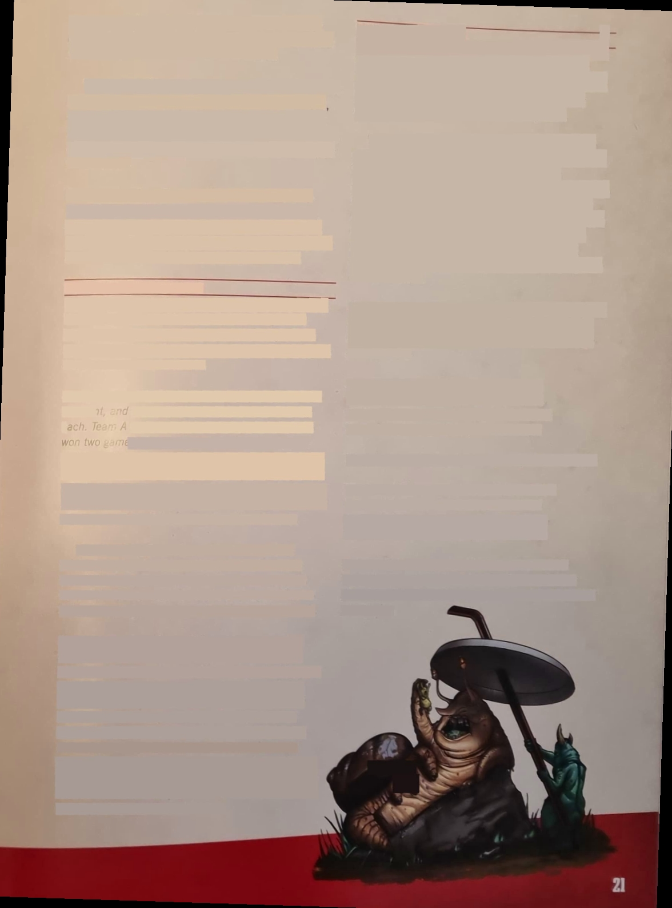

+--------------------------------------------------------------+---+---+
| *Example: Jay, Dan, Rob and Xavier are on the same*        |   |   |
+==============================================================+===+===+
| *team. In round 1, Jay and Dan both win their games,*      |   |   |
+--------------------------------------------------------------+---+---+
| *Xavier draws his game, and Rob loses his. As a result,*   |   |   |
+--------------------------------------------------------------+---+---+
| *their team will receive 2 Tournament Points as they won*    |   |   |
+--------------------------------------------------------------+---+---+
| *two games compared to the opposing team\'s one.*            |   |   |
+--------------------------------------------------------------+---+---+

**[TEAM EVENT TIEBREAKERS]**

+-----------------------------------------------------------------+----+
| In a team event, the Tiebreakers work slightly differently.   |    |
+=================================================================+====+
| The first Tiebreaker will be the number of individual         |    |
+-----------------------------------------------------------------+----+

+-------------------------------------+----------------------------+---+
| games that a team has won across  |                            |   |
| the event, and the                |                            |   |
+=====================================+============================+===+
| second tiebreaker will be the     |                            |   |
| number of individual games        |                            |   |
+-------------------------------------+----------------------------+---+
| a team drew across the event.       |                            |   |
+-------------------------------------+----------------------------+---+

*Examp ms A, B and C all won their first round of* *an eve: so are all
tied on 2 Tournament Points*
>
*e won three games and lost one; Team B*

+-----------------+------------------------------------------------+---+
|                 | *:s, drew one game, and lost one game;*        |   |
+=================+================================================+===+
| *a Tea/, won  |                                                |   |
| two games and |                                                |   |
| drew two      |                                                |   |
| games.* As    |                                                |   |
| *a*           |                                                |   |
|               |                                                |   |
| *n It, Te. m  |                                                |   |
| A would be    |                                                |   |
| highest in    |                                                |   |
| the rankings  |                                                |   |
| as they*      |                                                |   |
+-----------------+------------------------------------------------+---+
| w *three games, |                                                |   |
| while Team C    |                                                |   |
| would be ranked |                                                |   |
| higher* *tl n   |                                                |   |
| Team B as       |                                                |   |
| although they   |                                                |   |
| have the same   |                                                |   |
| number of*      |                                                |   |
+-----------------+------------------------------------------------+---+

*games won, Team C has more draws than Team B.*
>
The remaining Tiebreakers will work exactly as

+------------------------------+---------------------------+----+---+---+
| **TEAM EVENT PAIRINGS**    |                           |    |   | |
|                              |                           |    |   |   |
|                              |                           |    |   | * |
|                              |                           |    |   | * |
|                              |                           |    |   | \ |
|                              |                           |    |   | ~ |
|                              |                           |    |   | * |
|                              |                           |    |   | * |
+==============================+===========================+====+===+===+
| When two teams are paired  |                           |    |   |   |
| against each other, it     |                           |    |   |   |
| means                      |                           |    |   |   |
+------------------------------+---------------------------+----+---+---+
|                              |                           |    |   |   |
+------------------------------+---------------------------+----+---+---+
| that each coach will play  |                           |    |   |   |
| a coach from the opposing  |                           |    |   |   |
+------------------------------+---------------------------+----+---+---+
| team. In round 1, teams will |                           |    | a |   |
| be randomly paired ag        |                           |    | i |   |
|                              |                           |    | n |   |
|                              |                           |    | s |   |
|                              |                           |    | t |   |
+------------------------------+---------------------------+----+---+---+
|                              |                           |    |   |   |
+------------------------------+---------------------------+----+---+---+
| each other as normal and     |                           |    |   |   |
| coaches will be randomly     |                           |    |   |   |
+------------------------------+---------------------------+----+---+---+
|                              |                           |    |   |   |
+------------------------------+---------------------------+----+---+---+
|                              |                           |    |   |   |
+------------------------------+---------------------------+----+---+---+
| paired against a coach from  |                           |    |   |   |
| the opposing team.           |                           |    |   |   |
+------------------------------+---------------------------+----+---+---+

+----+--------------+-------------------------------------+---+---+---+---+
|    | In         |                                     |   |   |   |   |
|    | subsequent |                                     |   |   |   |   |
|    | rounds,    |                                     |   |   |   |   |
|    | teams will |                                     |   |   |   |   |
|    | be paired  |                                     |   |   |   |   |
|    | against    |                                     |   |   |   |   |
+====+==============+=====================================+===+===+===+===+
|    |              |                                     |   |   |   |   |
+----+--------------+-------------------------------------+---+---+---+---+
|  |              |                                     |   |   |   |   |
| ea |              |                                     |   |   |   |   |
| ch |              |                                     |   |   |   |   |
|  |              |                                     |   |   |   |   |
|  o |              |                                     |   |   |   |   |
| th |              |                                     |   |   |   |   |
| er |              |                                     |   |   |   |   |
|  |              |                                     |   |   |   |   |
| by |              |                                     |   |   |   |   |
|  |              |                                     |   |   |   |   |
|  t |              |                                     |   |   |   |   |
| he |              |                                     |   |   |   |   |
|  |              |                                     |   |   |   |   |
| ra |              |                                     |   |   |   |   |
| nk |              |                                     |   |   |   |   |
| in |              |                                     |   |   |   |   |
| gs |              |                                     |   |   |   |   |
|  |              |                                     |   |   |   |   |
| in |              |                                     |   |   |   |   |
|  |              |                                     |   |   |   |   |
|  t |              |                                     |   |   |   |   |
| he |              |                                     |   |   |   |   |
|  |              |                                     |   |   |   |   |
| sa |              |                                     |   |   |   |   |
| me |              |                                     |   |   |   |   |
|  |              |                                     |   |   |   |   |
|  w |              |                                     |   |   |   |   |
| ay |              |                                     |   |   |   |   |
|  |              |                                     |   |   |   |   |
| as |              |                                     |   |   |   |   |
|  |              |                                     |   |   |   |   |
|  d |              |                                     |   |   |   |   |
| es |              |                                     |   |   |   |   |
| cr |              |                                     |   |   |   |   |
| ib |              |                                     |   |   |   |   |
| ed |              |                                     |   |   |   |   |
+----+--------------+-------------------------------------+---+---+---+---+
|    |              |                                     |   |   |   |   |
+----+--------------+-------------------------------------+---+---+---+---+
|  |              |                                     |   |   |   |   |
|  f |              |                                     |   |   |   |   |
| or |              |                                     |   |   |   |   |
|  |              |                                     |   |   |   |   |
|  a |              |                                     |   |   |   |   |
|  |              |                                     |   |   |   |   |
| st |              |                                     |   |   |   |   |
| an |              |                                     |   |   |   |   |
| da |              |                                     |   |   |   |   |
| rd |              |                                     |   |   |   |   |
|  |              |                                     |   |   |   |   |
|  e |              |                                     |   |   |   |   |
| ve |              |                                     |   |   |   |   |
| nt |              |                                     |   |   |   |   |
|  |              |                                     |   |   |   |   |
| on |              |                                     |   |   |   |   |
|  |              |                                     |   |   |   |   |
| pa |              |                                     |   |   |   |   |
| ge |              |                                     |   |   |   |   |
|  |              |                                     |   |   |   |   |
| 9. |              |                                     |   |   |   |   |
|  |              |                                     |   |   |   |   |
|  A |              |                                     |   |   |   |   |
| dd |              |                                     |   |   |   |   |
| it |              |                                     |   |   |   |   |
| io |              |                                     |   |   |   |   |
| na |              |                                     |   |   |   |   |
| ll |              |                                     |   |   |   |   |
| y, |              |                                     |   |   |   |   |
|  |              |                                     |   |   |   |   |
| in |              |                                     |   |   |   |   |
+----+--------------+-------------------------------------+---+---+---+---+
|  |              |                                     |   |   |   |   |
| su |              |                                     |   |   |   |   |
| bs |              |                                     |   |   |   |   |
| eq |              |                                     |   |   |   |   |
| ue |              |                                     |   |   |   |   |
| nt |              |                                     |   |   |   |   |
|  |              |                                     |   |   |   |   |
|  r |              |                                     |   |   |   |   |
| ou |              |                                     |   |   |   |   |
| nd |              |                                     |   |   |   |   |
| s, |              |                                     |   |   |   |   |
|  |              |                                     |   |   |   |   |
| de |              |                                     |   |   |   |   |
| ci |              |                                     |   |   |   |   |
| di |              |                                     |   |   |   |   |
| ng |              |                                     |   |   |   |   |
|  |              |                                     |   |   |   |   |
|  w |              |                                     |   |   |   |   |
| hi |              |                                     |   |   |   |   |
| ch |              |                                     |   |   |   |   |
|  |              |                                     |   |   |   |   |
|  c |              |                                     |   |   |   |   |
| oa |              |                                     |   |   |   |   |
| ch |              |                                     |   |   |   |   |
|  |              |                                     |   |   |   |   |
| wi |              |                                     |   |   |   |   |
| ll |              |                                     |   |   |   |   |
|  |              |                                     |   |   |   |   |
| pl |              |                                     |   |   |   |   |
| ay |              |                                     |   |   |   |   |
|  |              |                                     |   |   |   |   |
|  w |              |                                     |   |   |   |   |
| hi |              |                                     |   |   |   |   |
| ch |              |                                     |   |   |   |   |
+----+--------------+-------------------------------------+---+---+---+---+
|  |              |                                     |   |   |   |   |
| op |              |                                     |   |   |   |   |
| po |              |                                     |   |   |   |   |
| si |              |                                     |   |   |   |   |
| ng |              |                                     |   |   |   |   |
|  |              |                                     |   |   |   |   |
|  c |              |                                     |   |   |   |   |
| oa |              |                                     |   |   |   |   |
| ch |              |                                     |   |   |   |   |
|  |              |                                     |   |   |   |   |
|  w |              |                                     |   |   |   |   |
| or |              |                                     |   |   |   |   |
| ks |              |                                     |   |   |   |   |
|  |              |                                     |   |   |   |   |
| sl |              |                                     |   |   |   |   |
| ig |              |                                     |   |   |   |   |
| ht |              |                                     |   |   |   |   |
| ly |              |                                     |   |   |   |   |
|  |              |                                     |   |   |   |   |
| di |              |                                     |   |   |   |   |
| ff |              |                                     |   |   |   |   |
| er |              |                                     |   |   |   |   |
| en |              |                                     |   |   |   |   |
| tl |              |                                     |   |   |   |   |
| y. |              |                                     |   |   |   |   |
|  |              |                                     |   |   |   |   |
|  C |              |                                     |   |   |   |   |
| oa |              |                                     |   |   |   |   |
| ch |              |                                     |   |   |   |   |
| es |              |                                     |   |   |   |   |
|  |              |                                     |   |   |   |   |
| wi |              |                                     |   |   |   |   |
| ll |              |                                     |   |   |   |   |
+----+--------------+-------------------------------------+---+---+---+---+
|  |              |                                     |   |   |   |   |
| be |              |                                     |   |   |   |   |
|  |              |                                     |   |   |   |   |
| pa |              |                                     |   |   |   |   |
| ir |              |                                     |   |   |   |   |
| ed |              |                                     |   |   |   |   |
|  |              |                                     |   |   |   |   |
|  a |              |                                     |   |   |   |   |
| ga |              |                                     |   |   |   |   |
| in |              |                                     |   |   |   |   |
| st |              |                                     |   |   |   |   |
|  |              |                                     |   |   |   |   |
| ea |              |                                     |   |   |   |   |
| ch |              |                                     |   |   |   |   |
|  |              |                                     |   |   |   |   |
|  o |              |                                     |   |   |   |   |
| th |              |                                     |   |   |   |   |
| er |              |                                     |   |   |   |   |
|  |              |                                     |   |   |   |   |
|  d |              |                                     |   |   |   |   |
| ep |              |                                     |   |   |   |   |
| en |              |                                     |   |   |   |   |
| di |              |                                     |   |   |   |   |
| ng |              |                                     |   |   |   |   |
|  |              |                                     |   |   |   |   |
| on |              |                                     |   |   |   |   |
|  |              |                                     |   |   |   |   |
|  t |              |                                     |   |   |   |   |
| he |              |                                     |   |   |   |   |
|  |              |                                     |   |   |   |   |
| in |              |                                     |   |   |   |   |
| di |              |                                     |   |   |   |   |
| vi |              |                                     |   |   |   |   |
| du |              |                                     |   |   |   |   |
| al |              |                                     |   |   |   |   |
+----+--------------+-------------------------------------+---+---+---+---+
|  |              |                                     |   |   |   |   |
|  r |              |                                     |   |   |   |   |
| an |              |                                     |   |   |   |   |
| ki |              |                                     |   |   |   |   |
| ng |              |                                     |   |   |   |   |
|  |              |                                     |   |   |   |   |
| of |              |                                     |   |   |   |   |
|  |              |                                     |   |   |   |   |
|  t |              |                                     |   |   |   |   |
| he |              |                                     |   |   |   |   |
|  |              |                                     |   |   |   |   |
|  p |              |                                     |   |   |   |   |
| la |              |                                     |   |   |   |   |
| ye |              |                                     |   |   |   |   |
| rs |              |                                     |   |   |   |   |
|  |              |                                     |   |   |   |   |
| in |              |                                     |   |   |   |   |
|  |              |                                     |   |   |   |   |
| ea |              |                                     |   |   |   |   |
| ch |              |                                     |   |   |   |   |
|  |              |                                     |   |   |   |   |
|  t |              |                                     |   |   |   |   |
| ea |              |                                     |   |   |   |   |
| m, |              |                                     |   |   |   |   |
|  |              |                                     |   |   |   |   |
| wi |              |                                     |   |   |   |   |
| th |              |                                     |   |   |   |   |
|  |              |                                     |   |   |   |   |
|  t |              |                                     |   |   |   |   |
| he |              |                                     |   |   |   |   |
|  |              |                                     |   |   |   |   |
|  h |              |                                     |   |   |   |   |
| ig |              |                                     |   |   |   |   |
| he |              |                                     |   |   |   |   |
| st |              |                                     |   |   |   |   |
+----+--------------+-------------------------------------+---+---+---+---+
|  |              |                                     |   |   |   |   |
| ra |              |                                     |   |   |   |   |
| nk |              |                                     |   |   |   |   |
| ed |              |                                     |   |   |   |   |
|  |              |                                     |   |   |   |   |
| pl |              |                                     |   |   |   |   |
| ay |              |                                     |   |   |   |   |
| er |              |                                     |   |   |   |   |
|  |              |                                     |   |   |   |   |
| on |              |                                     |   |   |   |   |
|  |              |                                     |   |   |   |   |
| ea |              |                                     |   |   |   |   |
| ch |              |                                     |   |   |   |   |
|  |              |                                     |   |   |   |   |
| te |              |                                     |   |   |   |   |
| am |              |                                     |   |   |   |   |
|  |              |                                     |   |   |   |   |
|  p |              |                                     |   |   |   |   |
| la |              |                                     |   |   |   |   |
| yi |              |                                     |   |   |   |   |
| ng |              |                                     |   |   |   |   |
|  |              |                                     |   |   |   |   |
| ea |              |                                     |   |   |   |   |
| ch |              |                                     |   |   |   |   |
|  |              |                                     |   |   |   |   |
| ot |              |                                     |   |   |   |   |
| he |              |                                     |   |   |   |   |
| r, |              |                                     |   |   |   |   |
|  |              |                                     |   |   |   |   |
|  t |              |                                     |   |   |   |   |
| he |              |                                     |   |   |   |   |
+----+--------------+-------------------------------------+---+---+---+---+
|  |              |                                     |   |   |   |   |
| se |              |                                     |   |   |   |   |
| co |              |                                     |   |   |   |   |
| nd |              |                                     |   |   |   |   |
|  |              |                                     |   |   |   |   |
|  h |              |                                     |   |   |   |   |
| ig |              |                                     |   |   |   |   |
| he |              |                                     |   |   |   |   |
| st |              |                                     |   |   |   |   |
|  |              |                                     |   |   |   |   |
| ra |              |                                     |   |   |   |   |
| nk |              |                                     |   |   |   |   |
| ed |              |                                     |   |   |   |   |
|  |              |                                     |   |   |   |   |
| pl |              |                                     |   |   |   |   |
| ay |              |                                     |   |   |   |   |
| er |              |                                     |   |   |   |   |
|  |              |                                     |   |   |   |   |
| on |              |                                     |   |   |   |   |
|  |              |                                     |   |   |   |   |
| ea |              |                                     |   |   |   |   |
| ch |              |                                     |   |   |   |   |
|  |              |                                     |   |   |   |   |
| te |              |                                     |   |   |   |   |
| am |              |                                     |   |   |   |   |
|  |              |                                     |   |   |   |   |
|  p |              |                                     |   |   |   |   |
| la |              |                                     |   |   |   |   |
| yi |              |                                     |   |   |   |   |
| ng |              |                                     |   |   |   |   |
|  |              |                                     |   |   |   |   |
| ea |              |                                     |   |   |   |   |
| ch |              |                                     |   |   |   |   |
+----+--------------+-------------------------------------+---+---+---+---+
| ot |              |                                     |   |   |   |   |
| he |              |                                     |   |   |   |   |
| r, |              |                                     |   |   |   |   |
| a  |              |                                     |   |   |   |   |
| nd |              |                                     |   |   |   |   |
| so |              |                                     |   |   |   |   |
| o  |              |                                     |   |   |   |   |
| n. |              |                                     |   |   |   |   |
+----+--------------+-------------------------------------+---+---+---+---+

+----------------+-------------------------------------------------+---+
| *Example:    |                                                 |   |
| Team A,      |                                                 |   |
| consisting   |                                                 |   |
| of Dan, Jay, |                                                 |   |
| Rob and      |                                                 |   |
| Xavier*      |                                                 |   |
+================+=================================================+===+
| *are drawn   |                                                 |   |
| against Team |                                                 |   |
| B,           |                                                 |   |
| consisting   |                                                 |   |
| of Gavin,    |                                                 |   |
| Keith,*      |                                                 |   |
| *Louise and  |                                                 |   |
| Nicolas. In  |                                                 |   |
| Team A, the  |                                                 |   |
| individual   |                                                 |   |
| rankings*    |                                                 |   |
+----------------+-------------------------------------------------+---+
| *are as        |                                                 |   |
| follows:*      |                                                 |   |
+----------------+-------------------------------------------------+---+

+-------------------------------------------------------------------+---+
| *Jay - 6 Tournament Points, 3 Bonus Points* *Dan - 4 Tournament |   |
| Points, 2 Bonus Points*                                         |   |
+===================================================================+===+
| *Xavier - 3 Tournament Points, 2 Bonus Points*                  |   |
+-------------------------------------------------------------------+---+
| *Rob - 0 Tournament Points, 0 Bonus Points*                       |   |
+-------------------------------------------------------------------+---+

*While in Team B, the individual rankings are as follows:*

*Nicolas - 6 Tournament Points, 3 Bonus Points* *Keith - 6 Tournament
Points, 1 Bonus Point* *Gavin - 2 Tournament Points, 2 Bonus Points*
*Louise - 1 Tournament Point, 2 Bonus Points*

outlined on page 8, with the exception that they are
>
cumulative for all members of the same team; so the second Tiebreaker
would be the total number of Bonus
>
Points scored by all members of the team, for example.

+----------------------------------------------------------------+---+---+
| *Example: Jay, Dan, Rob and Xavier are on the same* *team.   |   |   |
| In round 1, Jay wins his game 3-0 causing 1*                 |   |   |
+================================================================+===+===+
| *casualty and scores 2 Bonus Points; Dan wins his game*        |   |   |
+----------------------------------------------------------------+---+---+
| *2-1 causing 3 casualties and scores 1 Bonus Point;* *Xavier |   |   |
| draws his game 1-1 causing 4 casualties and*                 |   |   |
+----------------------------------------------------------------+---+---+
| *scores 1 Bonus Point; and Rob loses his game 1-0*             |   |   |
+----------------------------------------------------------------+---+---+

*causing 0 casualties and scores 0 Bonus Points. The* *team scores 2
Tournament Points for winning more* *games than their opponents. The
team will also have a* *total of 4 Bonus Points, a Touchdown
Difference of* +3,\
*a total of 6 touchdowns, and a total of 8 casualties for* *the
purposes of further Tiebreakers.*
>
*As a result, Jay would play Nicolas as they are the*

+-----------------------------------------------------------------+----+
| *highest ranked coach in each team. Dan would then*           |    |
+=================================================================+====+
| *play Keith, Xavier would play Gavin, and Rob would then*       |    |
+-----------------------------------------------------------------+----+

*play Louise.*

  -----------------------------------------------------------------------
  *S\' t*                             
  ----------------------------------- -----------------------------------
                                      **4 . \'ll**

  -----------------------------------------------------------------------

**GROUP &**

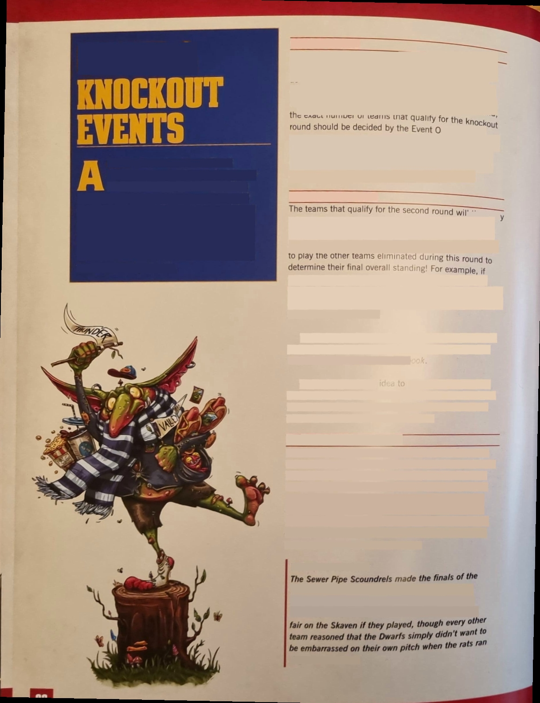

+-----------+-------------------------------------------------+-----+---+
|           | **nother alternative format Event**           |     |   |
+===========+=================================================+=====+===+
|           | **Organisers may wish to look at is one**     |     |   |
+-----------+-------------------------------------------------+-----+---+
|           | **that combines a group stage with a**        |     |   |
+-----------+-------------------------------------------------+-----+---+
| *       |                                                 |     |   |
| *knockout |                                                 |     |   |
| stage,  |                                                 |     |   |
| much    |                                                 |     |   |
| like    |                                                 |     |   |
| many    |                                                 |     |   |
| real    |                                                 |     |   |
| world** |                                                 |     |   |
+-----------+-------------------------------------------------+-----+---+
| **sports  |                                                 |     |   |
| comp      |                                                 |     |   |
| etitions! |                                                 |     |   |
| These     |                                                 |     |   |
| events    |                                                 |     |   |
| work      |                                                 |     |   |
| best**    |                                                 |     |   |
| **over    |                                                 |     |   |
| two days, |                                                 |     |   |
| often     |                                                 |     |   |
| with the  |                                                 |     |   |
| group     |                                                 |     |   |
| stage     |                                                 |     |   |
| on**      |                                                 |     |   |
| **day one |                                                 |     |   |
| and the   |                                                 |     |   |
| knockout  |                                                 |     |   |
| stage on  |                                                 |     |   |
| day       |                                                 |     |   |
| two.**    |                                                 |     |   |
| **This    |                                                 |     |   |
| style of  |                                                 |     |   |
| event can |                                                 |     |   |
| also be   |                                                 |     |   |
| used      |                                                 |     |   |
| t         |                                                 |     |   |
| ogether** |                                                 |     |   |
| **with    |                                                 |     |   |
| the likes |                                                 |     |   |
| of Team   |                                                 |     |   |
| Events or |                                                 |     |   |
| even      |                                                 |     |   |
| Stunty**  |                                                 |     |   |
+-----------+-------------------------------------------------+-----+---+

**Tournaments if you wish.**
>
**GROUP STAGE**

+---+---+----------------------------------------------------------------+---+
| I |   |                                                                |   |
| n |   |                                                                |   |
| t |   |                                                                |   |
| h |   |                                                                |   |
| e |   |                                                                |   |
| s |   |                                                                |   |
| e |   |                                                                |   |
| e |   |                                                                |   |
| v |   |                                                                |   |
| e |   |                                                                |   |
| n |   |                                                                |   |
| t |   |                                                                |   |
| s |   |                                                                |   |
| , |   |                                                                |   |
| t |   |                                                                |   |
| e |   |                                                                |   |
| a |   |                                                                |   |
| m |   |                                                                |   |
| s |   |                                                                |   |
| s |   |                                                                |   |
| h |   |                                                                |   |
| o |   |                                                                |   |
| u |   |                                                                |   |
| l |   |                                                                |   |
| d |   |                                                                |   |
| b |   |                                                                |   |
| e |   |                                                                |   |
| d |   |                                                                |   |
| i |   |                                                                |   |
| v |   |                                                                |   |
| i |   |                                                                |   |
| d |   |                                                                |   |
| e |   |                                                                |   |
| d |   |                                                                |   |
| i |   |                                                                |   |
| n |   |                                                                |   |
| t |   |                                                                |   |
| o |   |                                                                |   |
| g |   |                                                                |   |
| r |   |                                                                |   |
| o |   |                                                                |   |
| u |   |                                                                |   |
| p |   |                                                                |   |
| s |   |                                                                |   |
| o |   |                                                                |   |
| f |   |                                                                |   |
| f |   |                                                                |   |
| o |   |                                                                |   |
| u |   |                                                                |   |
| r |   |                                                                |   |
| t |   |                                                                |   |
| h |   |                                                                |   |
| e |   |                                                                |   |
| n |   |                                                                |   |
| t |   |                                                                |   |
| h |   |                                                                |   |
| e |   |                                                                |   |
| f |   |                                                                |   |
| i |   |                                                                |   |
| r |   |                                                                |   |
| s |   |                                                                |   |
| t |   |                                                                |   |
| t |   |                                                                |   |
| h |   |                                                                |   |
| r |   |                                                                |   |
| e |   |                                                                |   |
| e |   |                                                                |   |
| g |   |                                                                |   |
| a |   |                                                                |   |
| m |   |                                                                |   |
| e |   |                                                                |   |
| s |   |                                                                |   |
| o |   |                                                                |   |
| f |   |                                                                |   |
| t |   |                                                                |   |
| h |   |                                                                |   |
| e |   |                                                                |   |
| e |   |                                                                |   |
| v |   |                                                                |   |
| e |   |                                                                |   |
| n |   |                                                                |   |
| t |   |                                                                |   |
| a |   |                                                                |   |
| r |   |                                                                |   |
| e |   |                                                                |   |
| p |   |                                                                |   |
| l |   |                                                                |   |
| a |   |                                                                |   |
| y |   |                                                                |   |
| e |   |                                                                |   |
| d |   |                                                                |   |
+===+===+================================================================+===+
|   |   | a round robin format with each team playing each               |   |
+---+---+----------------------------------------------------------------+---+
| n |   | tea                                                          |   |
| t |   |                                                                |   |
| h |   |                                                                |   |
| e |   |                                                                |   |
| r |   |                                                                |   |
+---+---+----------------------------------------------------------------+---+
|   |   |                                                                |   |
+---+---+----------------------------------------------------------------+---+
|   |   |                                                                |   |
+---+---+----------------------------------------------------------------+---+
|   |   |                                                                |   |
+---+---+----------------------------------------------------------------+---+

+--------------------------------------------------+-----------+---+---+---+
|                                                  |         |   |   |   |
|                                                  |  iganiser |   |   |   |
|                                                  | and     |   |   |   |
+==================================================+===========+===+===+===+
| clearly outlined in the rulespack for the      | event. We |   | |   |
|                                                  | wo        |   |   |   |
|                                                  |           |   | u |   |
|                                                  |           |   | l |   |
|                                                  |           |   | d |   |
+--------------------------------------------------+-----------+---+---+---+
|                                                  |           |   |   |   |
+--------------------------------------------------+-----------+---+---+---+
| recommend having 8 or 16 teams qualify         |           |   |   |   |
| (depending                                     |           |   |   |   |
+--------------------------------------------------+-----------+---+---+---+
| on the size of your event) so that after a set |           |   |   |   |
| number of                                      |           |   |   |   |
+--------------------------------------------------+-----------+---+---+---+
| games there is only a single team left           |           |   |   |   |
| undefeated!                                      |           |   |   |   |
+--------------------------------------------------+-----------+---+---+---+
|                                                  |           |   |   |   |
+--------------------------------------------------+-----------+---+---+---+

**KNOCKOUT STAGE**

+-----------------------------------------------------------+--------+---+
|                                                           | \-\    |   |
|                                                           | -\-- - |   |
|                                                           | pid    |   |
+===========================================================+========+===+
| a knockout style tournament, where the winning          | team   |   |
+-----------------------------------------------------------+--------+---+
| will advance through the event and the losing team will |        |   |
+-----------------------------------------------------------+--------+---+
| be eliminated - though these teams should still continue  |        |   |
+-----------------------------------------------------------+--------+---+

+------------------------------+----------------------------------+----+
| eight teams qualify for    |                                  |    |
| the knockout round, then   |                                  |    |
| after                      |                                  |    |
+==============================+==================================+====+
| the first game in this stage |                                  |    |
| there will be the four       |                                  |    |
| winning teams playing for    |                                  |    |
| places 1 to 4, and the four  |                                  |    |
| losing teams                 |                                  |    |
+------------------------------+----------------------------------+----+
| playing for places 5 to 8.   |                                  |    |
+------------------------------+----------------------------------+----+

+---+-------------------------------------+--------------------------+---+
|   | In this knockout format if tw ams |                          |   |
|   | draw with each                    |                          |   |
+===+=====================================+==========================+===+
| o |                                     |                          |   |
| t |                                     |                          |   |
| h |                                     |                          |   |
| e |                                     |                          |   |
| r |                                     |                          |   |
| , |                                     |                          |   |
| t |                                     |                          |   |
| h |                                     |                          |   |
| e |                                     |                          |   |
| n |                                     |                          |   |
| t |                                     |                          |   |
| h |                                     |                          |   |
| e |                                     |                          |   |
| y |                                     |                          |   |
| s |                                     |                          |   |
| h |                                     |                          |   |
| o |                                     |                          |   |
| u |                                     |                          |   |
| l |                                     |                          |   |
| d |                                     |                          |   |
| p |                                     |                          |   |
| l |                                     |                          |   |
| a |                                     |                          |   |
| y |                                     |                          |   |
| c |                                     |                          |   |
| ■ |                                     |                          |   |
| i |                                     |                          |   |
| e |                                     |                          |   |
| a |                                     |                          |   |
| s |                                     |                          |   |
| e |                                     |                          |   |
| x |                                     |                          |   |
| p |                                     |                          |   |
| l |                                     |                          |   |
| a |                                     |                          |   |
| i |                                     |                          |   |
| n |                                     |                          |   |
| e |                                     |                          |   |
| d |                                     |                          |   |
| o |                                     |                          |   |
| n |                                     |                          |   |
+---+-------------------------------------+--------------------------+---+
| |                                     |                          |   |
|   |                                     |                          |   |
| p |                                     |                          |   |
| a |                                     |                          |   |
| g |                                     |                          |   |
| e |                                     |                          |   |
| |                                     |                          |   |
|   |                                     |                          |   |
| 6 |                                     |                          |   |
| 7 |                                     |                          |   |
| |                                     |                          |   |
|   |                                     |                          |   |
| o |                                     |                          |   |
| f |                                     |                          |   |
| |                                     |                          |   |
|   |                                     |                          |   |
| t |                                     |                          |   |
| h |                                     |                          |   |
| e |                                     |                          |   |
| |                                     |                          |   |
|   |                                     |                          |   |
| * |                                     |                          |   |
| B |                                     |                          |   |
| l |                                     |                          |   |
| o |                                     |                          |   |
| o |                                     |                          |   |
| d |                                     |                          |   |
| |                                     |                          |   |
|   |                                     |                          |   |
| B |                                     |                          |   |
| o |                                     |                          |   |
| w |                                     |                          |   |
| l |                                     |                          |   |
| * |                                     |                          |   |
| |                                     |                          |   |
|   |                                     |                          |   |
| A |                                     |                          |   |
| ' |                                     |                          |   |
| u |                                     |                          |   |
| / |                                     |                          |   |
| e |                                     |                          |   |
| t |                                     |                          |   |
+---+-------------------------------------+--------------------------+---+

+---+-------------------------+---------+---------------------------+---+
|   | It can also be a good |         | h\. /e a knockout stage |   |
+===+=========================+=========+===========================+===+
| |                         |         |                           |   |
|   |                         |         |                           |   |
| w |                         |         |                           |   |
| a |                         |         |                           |   |
| l |                         |         |                           |   |
| l |                         |         |                           |   |
| c |                         |         |                           |   |
| h |                         |         |                           |   |
| a |                         |         |                           |   |
| r |                         |         |                           |   |
| t |                         |         |                           |   |
| |                         |         |                           |   |
|   |                         |         |                           |   |
| s |                         |         |                           |   |
| h |                         |         |                           |   |
| o |                         |         |                           |   |
| w |                         |         |                           |   |
| i |                         |         |                           |   |
| n |                         |         |                           |   |
| g |                         |         |                           |   |
| |                         |         |                           |   |
|   |                         |         |                           |   |
| t |                         |         |                           |   |
| h |                         |         |                           |   |
| e |                         |         |                           |   |
| |                         |         |                           |   |
|   |                         |         |                           |   |
| p |                         |         |                           |   |
| a |                         |         |                           |   |
| |                         |         |                           |   |
|   |                         |         |                           |   |
| v |                         |         |                           |   |
| i |                         |         |                           |   |
| c |                         |         |                           |   |
| t |                         |         |                           |   |
| o |                         |         |                           |   |
| r |                         |         |                           |   |
| y |                         |         |                           |   |
| |                         |         |                           |   |
|   |                         |         |                           |   |
| f |                         |         |                           |   |
| o |                         |         |                           |   |
| r |                         |         |                           |   |
| |                         |         |                           |   |
|   |                         |         |                           |   |
| e |                         |         |                           |   |
| a |                         |         |                           |   |
| c |                         |         |                           |   |
| h |                         |         |                           |   |
| |                         |         |                           |   |
|   |                         |         |                           |   |
| t |                         |         |                           |   |
| e |                         |         |                           |   |
| a |                         |         |                           |   |
| m |                         |         |                           |   |
| . |                         |         |                           |   |
| |                         |         |                           |   |
|   |                         |         |                           |   |
| W |                         |         |                           |   |
| e |                         |         |                           |   |
+---+-------------------------+---------+---------------------------+---+

have provided a blank ve n of this in this guide that you can
photocopy for youi own events.
>
**[BEST OF] THE RES** i \~

+-------------------------------------------------------------------+---+---+
| Those teams that do not qualify for the knockout stage          |   |   |
+===================================================================+===+===+
| will form a separate event played alongside the knockout        |   |   |
+-------------------------------------------------------------------+---+---+
| stage to determine the Best of the Rest. This takes th          | e |   |
+-------------------------------------------------------------------+---+---+
| same format as a normal event, and should run for the             |   |   |
+-------------------------------------------------------------------+---+---+
| same number of games as the knockout stage so that everyone at    |   |   |
| the event has the same number of games                            |   |   |
+-------------------------------------------------------------------+---+---+
| to play. It is also a good way to give those coaches that         |   |   |
+-------------------------------------------------------------------+---+---+
| didn\'t qualify a chance to compete for their own prizes          |   |   |
+-------------------------------------------------------------------+---+---+

and keep them engaged in the event.

**DID YOU KNOW?**

+---------------------------------------------------------------------+---+
| *second Forge Bowl in 2499 after their semi-final*                |   |
+=====================================================================+===+
| *opponents, the Karak Wanderers, refused to play*                   |   |
+---------------------------------------------------------------------+---+
| *the match. The Dwarfs claimed that it wouldn\'t be*                |   |
+---------------------------------------------------------------------+---+

*rings around them!*

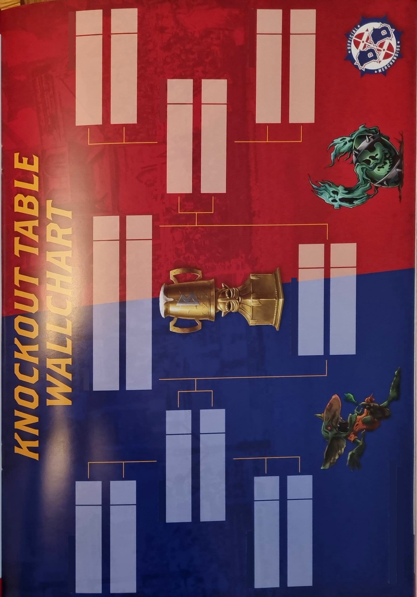

  -----------------------------------------------------------------------
  **ADDITIONAL**                       
  ------------------------------------ ----------------------------------
  **ROLES**                            

  -----------------------------------------------------------------------

**INJURIES**

+---+------+------+----------------------------------------------+---+---+---+---+
| * |      |      |                                              |   |   |   |   |
| * |      |      |                                              |   |   |   |   |
| I |      |      |                                              |   |   |   |   |
| W |      |      |                                              |   |   |   |   |
| A |      |      |                                              |   |   |   |   |
| \ |      |      |                                              |   |   |   |   |
| |      |      |                                              |   |   |   |   |
| b |      |      |                                              |   |   |   |   |
| i |      |      |                                              |   |   |   |   |
| l |      |      |                                              |   |   |   |   |
| e |      |      |                                              |   |   |   |   |
| t |      |      |                                              |   |   |   |   |
| h |      |      |                                              |   |   |   |   |
| e |      |      |                                              |   |   |   |   |
| r |      |      |                                              |   |   |   |   |
| u |      |      |                                              |   |   |   |   |
| l |      |      |                                              |   |   |   |   |
| e |      |      |                                              |   |   |   |   |
| s |      |      |                                              |   |   |   |   |
| w |      |      |                                              |   |   |   |   |
| e |      |      |                                              |   |   |   |   |
| h |      |      |                                              |   |   |   |   |
| a |      |      |                                              |   |   |   |   |
| v |      |      |                                              |   |   |   |   |
| e |      |      |                                              |   |   |   |   |
| p |      |      |                                              |   |   |   |   |
| r |      |      |                                              |   |   |   |   |
| e |      |      |                                              |   |   |   |   |
| s |      |      |                                              |   |   |   |   |
| e |      |      |                                              |   |   |   |   |
| n |      |      |                                              |   |   |   |   |
| t |      |      |                                              |   |   |   |   |
| e |      |      |                                              |   |   |   |   |
| d |      |      |                                              |   |   |   |   |
| i |      |      |                                              |   |   |   |   |
| n |      |      |                                              |   |   |   |   |
| * |      |      |                                              |   |   |   |   |
| * |      |      |                                              |   |   |   |   |
+===+======+======+==============================================+===+===+===+===+
|   |      |      | **this *guide are all* coaches *need to*** | |   |   |   |
|   |      |      |                                              |   |   |   |   |
|   |      |      |                                              | * |   |   |   |
|   |      |      |                                              | * |   |   |   |
|   |      |      |                                              | * |   |   |   |
|   |      |      |                                              | r |   |   |   |
|   |      |      |                                              | u |   |   |   |
|   |      |      |                                              | n |   |   |   |
|   |      |      |                                              | * |   |   |   |
|   |      |      |                                              | * |   |   |   |
|   |      |      |                                              | * |   |   |   |
+---+------+------+----------------------------------------------+---+---+---+---+
|   |      |    |                                              |   |   |   |   |
|   |      | **\\ |                                              |   |   |   |   |
|   |      | t  |                                              |   |   |   |   |
|   |      | heir |                                              |   |   |   |   |
|   |      |    |                                              |   |   |   |   |
|   |      |  own |                                              |   |   |   |   |
|   |      |    |                                              |   |   |   |   |
|   |      |  tou |                                              |   |   |   |   |
|   |      | rnam |                                              |   |   |   |   |
|   |      | ents |                                              |   |   |   |   |
|   |      |    |                                              |   |   |   |   |
|   |      |  and |                                              |   |   |   |   |
|   |      | *g |                                              |   |   |   |   |
|   |      | amin |                                              |   |   |   |   |
|   |      | g*** |                                              |   |   |   |   |
+---+------+------+----------------------------------------------+---+---+---+---+
|   |    |      |                                              |   |   |   |   |
|   |  **w |      |                                              |   |   |   |   |
|   | eeke |      |                                              |   |   |   |   |
|   | nds, |      |                                              |   |   |   |   |
|   |    |      |                                              |   |   |   |   |
|   | this |      |                                              |   |   |   |   |
|   |    |      |                                              |   |   |   |   |
|   |  doe |      |                                              |   |   |   |   |
|   | sn't |      |                                              |   |   |   |   |
|   |    |      |                                              |   |   |   |   |
|   | mean |      |                                              |   |   |   |   |
|   |    |      |                                              |   |   |   |   |
|   | that |      |                                              |   |   |   |   |
|   | *  |      |                                              |   |   |   |   |
|   | they |      |                                              |   |   |   |   |
|   |    |      |                                              |   |   |   |   |
|   |  are |      |                                              |   |   |   |   |
|   | th |      |                                              |   |   |   |   |
|   | e*** |      |                                              |   |   |   |   |
+---+------+------+----------------------------------------------+---+---+---+---+
|   | ***  |      |                                              |   |   |   |   |
|   | only |      |                                              |   |   |   |   |
|   | r    |      |                                              |   |   |   |   |
|   | ules |      |                                              |   |   |   |   |
|   | that |      |                                              |   |   |   |   |
|   | can  |      |                                              |   |   |   |   |
|   | be   |      |                                              |   |   |   |   |
|   | used |      |                                              |   |   |   |   |
|   | in   |      |                                              |   |   |   |   |
|   | eve  |      |                                              |   |   |   |   |
|   | nts. |      |                                              |   |   |   |   |
|   | In   |      |                                              |   |   |   |   |
|   | fact |      |                                              |   |   |   |   |
|   | ,*** |      |                                              |   |   |   |   |
+---+------+------+----------------------------------------------+---+---+---+---+
|   | **   |      |                                              |   |   |   |   |
|   | many |      |                                              |   |   |   |   |
|   | E    |      |                                              |   |   |   |   |
|   | vent |      |                                              |   |   |   |   |
|   | Or   |      |                                              |   |   |   |   |
|   | gani |      |                                              |   |   |   |   |
|   | sers |      |                                              |   |   |   |   |
|   | like |      |                                              |   |   |   |   |
|   | to   |      |                                              |   |   |   |   |
|   | *inc |      |                                              |   |   |   |   |
|   | orpo |      |                                              |   |   |   |   |
|   | rate |      |                                              |   |   |   |   |
|   | thei |      |                                              |   |   |   |   |
|   | r*** |      |                                              |   |   |   |   |
+---+------+------+----------------------------------------------+---+---+---+---+
| | *  |      |                                              |   |   |   |   |
|   | **wn |      |                                              |   |   |   |   |
| * | ad |      |                                              |   |   |   |   |
| * | diti |      |                                              |   |   |   |   |
| * | onal |      |                                              |   |   |   |   |
| o | r  |      |                                              |   |   |   |   |
| * | ules |      |                                              |   |   |   |   |
| * |    |      |                                              |   |   |   |   |
| * | into |      |                                              |   |   |   |   |
|   | t  |      |                                              |   |   |   |   |
|   | heir |      |                                              |   |   |   |   |
|   | ev |      |                                              |   |   |   |   |
|   | ents |      |                                              |   |   |   |   |
|   | to |      |                                              |   |   |   |   |
|   | ad |      |                                              |   |   |   |   |
|   | d*** |      |                                              |   |   |   |   |
+---+------+------+----------------------------------------------+---+---+---+---+
| |      |      |                                              |   |   |   |   |
|   |      |      |                                              |   |   |   |   |
| ! |      |      |                                              |   |   |   |   |
| [ |      |      |                                              |   |   |   |   |
| ] |      |      |                                              |   |   |   |   |
| ( |      |      |                                              |   |   |   |   |
| . |      |      |                                              |   |   |   |   |
| / |      |      |                                              |   |   |   |   |
| m |      |      |                                              |   |   |   |   |
| a |      |      |                                              |   |   |   |   |
| t |      |      |                                              |   |   |   |   |
| c |      |      |                                              |   |   |   |   |
| h |      |      |                                              |   |   |   |   |
| e |      |      |                                              |   |   |   |   |
| d |      |      |                                              |   |   |   |   |
| _ |      |      |                                              |   |   |   |   |
| p |      |      |                                              |   |   |   |   |
| l |      |      |                                              |   |   |   |   |
| a |      |      |                                              |   |   |   |   |
| y |      |      |                                              |   |   |   |   |
| / |      |      |                                              |   |   |   |   |
| m |      |      |                                              |   |   |   |   |
| e |      |      |                                              |   |   |   |   |
| d |      |      |                                              |   |   |   |   |
| i |      |      |                                              |   |   |   |   |
| a |      |      |                                              |   |   |   |   |
| / |      |      |                                              |   |   |   |   |
| i |      |      |                                              |   |   |   |   |
| m |      |      |                                              |   |   |   |   |
| a |      |      |                                              |   |   |   |   |
| g |      |      |                                              |   |   |   |   |
| e |      |      |                                              |   |   |   |   |
| 5 |      |      |                                              |   |   |   |   |
| 9 |      |      |                                              |   |   |   |   |
| 8 |      |      |                                              |   |   |   |   |
| . |      |      |                                              |   |   |   |   |
| p |      |      |                                              |   |   |   |   |
| n |      |      |                                              |   |   |   |   |
| g |      |      |                                              |   |   |   |   |
| ) |      |      |                                              |   |   |   |   |
|  |      |      |                                              |   |   |   |   |
| * |      |      |                                              |   |   |   |   |
| * |      |      |                                              |   |   |   |   |
| * |      |      |                                              |   |   |   |   |
| t |      |      |                                              |   |   |   |   |
| h |      |      |                                              |   |   |   |   |
| a |      |      |                                              |   |   |   |   |
| t |      |      |                                              |   |   |   |   |
| |      |      |                                              |   |   |   |   |
|   |      |      |                                              |   |   |   |   |
| e |      |      |                                              |   |   |   |   |
| x |      |      |                                              |   |   |   |   |
| t |      |      |                                              |   |   |   |   |
| r |      |      |                                              |   |   |   |   |
| a |      |      |                                              |   |   |   |   |
| |      |      |                                              |   |   |   |   |
|   |      |      |                                              |   |   |   |   |
| f |      |      |                                              |   |   |   |   |
| l |      |      |                                              |   |   |   |   |
| a |      |      |                                              |   |   |   |   |
| v |      |      |                                              |   |   |   |   |
| o |      |      |                                              |   |   |   |   |
| u |      |      |                                              |   |   |   |   |
| r |      |      |                                              |   |   |   |   |
| |      |      |                                              |   |   |   |   |
|   |      |      |                                              |   |   |   |   |
| o |      |      |                                              |   |   |   |   |
| r |      |      |                                              |   |   |   |   |
| |      |      |                                              |   |   |   |   |
|   |      |      |                                              |   |   |   |   |
| f |      |      |                                              |   |   |   |   |
| l |      |      |                                              |   |   |   |   |
| a |      |      |                                              |   |   |   |   |
| i |      |      |                                              |   |   |   |   |
| r |      |      |                                              |   |   |   |   |
| |      |      |                                              |   |   |   |   |
|   |      |      |                                              |   |   |   |   |
| t |      |      |                                              |   |   |   |   |
| o |      |      |                                              |   |   |   |   |
| |      |      |                                              |   |   |   |   |
|   |      |      |                                              |   |   |   |   |
| t |      |      |                                              |   |   |   |   |
| h |      |      |                                              |   |   |   |   |
| e |      |      |                                              |   |   |   |   |
| |      |      |                                              |   |   |   |   |
|   |      |      |                                              |   |   |   |   |
| e |      |      |                                              |   |   |   |   |
| v |      |      |                                              |   |   |   |   |
| e |      |      |                                              |   |   |   |   |
| n |      |      |                                              |   |   |   |   |
| t |      |      |                                              |   |   |   |   |
| |      |      |                                              |   |   |   |   |
|   |      |      |                                              |   |   |   |   |
| t |      |      |                                              |   |   |   |   |
| o |      |      |                                              |   |   |   |   |
| |      |      |                                              |   |   |   |   |
|   |      |      |                                              |   |   |   |   |
| m |      |      |                                              |   |   |   |   |
| a |      |      |                                              |   |   |   |   |
| k |      |      |                                              |   |   |   |   |
| e |      |      |                                              |   |   |   |   |
| * |      |      |                                              |   |   |   |   |
| * |      |      |                                              |   |   |   |   |
| * |      |      |                                              |   |   |   |   |
+---+------+------+----------------------------------------------+---+---+---+---+

  ---- --------------------------------------------------------------- --
                                                                       

                                                                       

                                                                       
  ---- --------------------------------------------------------------- --

***it unique.***

+---+----------------------+-------------------------------+---+---+---+---+
| |                      |                               |   |   |   |   |
|   |                      |                               |   |   |   |   |
| * |                      |                               |   |   |   |   |
| * |                      |                               |   |   |   |   |
| I |                      |                               |   |   |   |   |
| |                      |                               |   |   |   |   |
|   |                      |                               |   |   |   |   |
| T |                      |                               |   |   |   |   |
| h |                      |                               |   |   |   |   |
| e |                      |                               |   |   |   |   |
| s |                      |                               |   |   |   |   |
| e |                      |                               |   |   |   |   |
| |                      |                               |   |   |   |   |
|   |                      |                               |   |   |   |   |
| a |                      |                               |   |   |   |   |
| d |                      |                               |   |   |   |   |
| d |                      |                               |   |   |   |   |
| i |                      |                               |   |   |   |   |
| t |                      |                               |   |   |   |   |
| i |                      |                               |   |   |   |   |
| o |                      |                               |   |   |   |   |
| n |                      |                               |   |   |   |   |
| a |                      |                               |   |   |   |   |
| l |                      |                               |   |   |   |   |
| |                      |                               |   |   |   |   |
|   |                      |                               |   |   |   |   |
| r |                      |                               |   |   |   |   |
| u |                      |                               |   |   |   |   |
| l |                      |                               |   |   |   |   |
| e |                      |                               |   |   |   |   |
| s |                      |                               |   |   |   |   |
| |                      |                               |   |   |   |   |
|   |                      |                               |   |   |   |   |
| c |                      |                               |   |   |   |   |
| a |                      |                               |   |   |   |   |
| n |                      |                               |   |   |   |   |
| |                      |                               |   |   |   |   |
|   |                      |                               |   |   |   |   |
| t |                      |                               |   |   |   |   |
| a |                      |                               |   |   |   |   |
| k |                      |                               |   |   |   |   |
| e |                      |                               |   |   |   |   |
| |                      |                               |   |   |   |   |
|   |                      |                               |   |   |   |   |
| m |                      |                               |   |   |   |   |
| a |                      |                               |   |   |   |   |
| n |                      |                               |   |   |   |   |
| y |                      |                               |   |   |   |   |
| |                      |                               |   |   |   |   |
|   |                      |                               |   |   |   |   |
| f |                      |                               |   |   |   |   |
| o |                      |                               |   |   |   |   |
| r |                      |                               |   |   |   |   |
| m |                      |                               |   |   |   |   |
| s |                      |                               |   |   |   |   |
| * |                      |                               |   |   |   |   |
| * |                      |                               |   |   |   |   |
+===+======================+===============================+===+===+===+===+
| |                      |                               |   |   |   |   |
|   |                      |                               |   |   |   |   |
| * |                      |                               |   |   |   |   |
| * |                      |                               |   |   |   |   |
| I |                      |                               |   |   |   |   |
| |                      |                               |   |   |   |   |
|   |                      |                               |   |   |   |   |
| a |                      |                               |   |   |   |   |
| n |                      |                               |   |   |   |   |
| d |                      |                               |   |   |   |   |
| , |                      |                               |   |   |   |   |
| |                      |                               |   |   |   |   |
|   |                      |                               |   |   |   |   |
| o |                      |                               |   |   |   |   |
| v |                      |                               |   |   |   |   |
| e |                      |                               |   |   |   |   |
| r |                      |                               |   |   |   |   |
| |                      |                               |   |   |   |   |
|   |                      |                               |   |   |   |   |
| t |                      |                               |   |   |   |   |
| h |                      |                               |   |   |   |   |
| e |                      |                               |   |   |   |   |
| |                      |                               |   |   |   |   |
|   |                      |                               |   |   |   |   |
| n |                      |                               |   |   |   |   |
| e |                      |                               |   |   |   |   |
| x |                      |                               |   |   |   |   |
| t |                      |                               |   |   |   |   |
| |                      |                               |   |   |   |   |
|   |                      |                               |   |   |   |   |
| f |                      |                               |   |   |   |   |
| e |                      |                               |   |   |   |   |
| w |                      |                               |   |   |   |   |
| |                      |                               |   |   |   |   |
|   |                      |                               |   |   |   |   |
| p |                      |                               |   |   |   |   |
| a |                      |                               |   |   |   |   |
| g |                      |                               |   |   |   |   |
| e |                      |                               |   |   |   |   |
| s |                      |                               |   |   |   |   |
| , |                      |                               |   |   |   |   |
| |                      |                               |   |   |   |   |
|   |                      |                               |   |   |   |   |
| w |                      |                               |   |   |   |   |
| e |                      |                               |   |   |   |   |
| |                      |                               |   |   |   |   |
|   |                      |                               |   |   |   |   |
| h |                      |                               |   |   |   |   |
| a |                      |                               |   |   |   |   |
| v |                      |                               |   |   |   |   |
| e |                      |                               |   |   |   |   |
| |                      |                               |   |   |   |   |
|   |                      |                               |   |   |   |   |
| * |                      |                               |   |   |   |   |
| p |                      |                               |   |   |   |   |
| r |                      |                               |   |   |   |   |
| o |                      |                               |   |   |   |   |
| v |                      |                               |   |   |   |   |
| i |                      |                               |   |   |   |   |
| d |                      |                               |   |   |   |   |
| e |                      |                               |   |   |   |   |
| d |                      |                               |   |   |   |   |
| * |                      |                               |   |   |   |   |
| * |                      |                               |   |   |   |   |
| * |                      |                               |   |   |   |   |
+---+----------------------+-------------------------------+---+---+---+---+
| * |                      |                               |   |   |   |   |
| * |                      |                               |   |   |   |   |
| \ |                      |                               |   |   |   |   |
| | |                      |                               |   |   |   |   |
| a |                      |                               |   |   |   |   |
| s |                      |                               |   |   |   |   |
| e |                      |                               |   |   |   |   |
| l |                      |                               |   |   |   |   |
| e |                      |                               |   |   |   |   |
| c |                      |                               |   |   |   |   |
| t |                      |                               |   |   |   |   |
| i |                      |                               |   |   |   |   |
| o |                      |                               |   |   |   |   |
| n |                      |                               |   |   |   |   |
| o |                      |                               |   |   |   |   |
| f |                      |                               |   |   |   |   |
| o |                      |                               |   |   |   |   |
| p |                      |                               |   |   |   |   |
| t |                      |                               |   |   |   |   |
| i |                      |                               |   |   |   |   |
| o |                      |                               |   |   |   |   |
| n |                      |                               |   |   |   |   |
| a |                      |                               |   |   |   |   |
| l |                      |                               |   |   |   |   |
| r |                      |                               |   |   |   |   |
| u |                      |                               |   |   |   |   |
| l |                      |                               |   |   |   |   |
| e |                      |                               |   |   |   |   |
| s |                      |                               |   |   |   |   |
| t |                      |                               |   |   |   |   |
| h |                      |                               |   |   |   |   |
| a |                      |                               |   |   |   |   |
| t |                      |                               |   |   |   |   |
| E |                      |                               |   |   |   |   |
| v |                      |                               |   |   |   |   |
| e |                      |                               |   |   |   |   |
| n |                      |                               |   |   |   |   |
| t |                      |                               |   |   |   |   |
| * |                      |                               |   |   |   |   |
| * |                      |                               |   |   |   |   |
+---+----------------------+-------------------------------+---+---+---+---+
|   | **Organisers can   |                               |   |   |   |   |
|   | use if they wish,  |                               |   |   |   |   |
|   | or use as**        |                               |   |   |   |   |
+---+----------------------+-------------------------------+---+---+---+---+
| |                      |                               |   |   |   |   |
|   |                      |                               |   |   |   |   |
| * |                      |                               |   |   |   |   |
| * |                      |                               |   |   |   |   |
| \ |                      |                               |   |   |   |   |
| ' |                      |                               |   |   |   |   |
| |                      |                               |   |   |   |   |
|   |                      |                               |   |   |   |   |
| i |                      |                               |   |   |   |   |
| n |                      |                               |   |   |   |   |
| s |                      |                               |   |   |   |   |
| p |                      |                               |   |   |   |   |
| i |                      |                               |   |   |   |   |
| r |                      |                               |   |   |   |   |
| a |                      |                               |   |   |   |   |
| t |                      |                               |   |   |   |   |
| i |                      |                               |   |   |   |   |
| o |                      |                               |   |   |   |   |
| n |                      |                               |   |   |   |   |
| |                      |                               |   |   |   |   |
|   |                      |                               |   |   |   |   |
| f |                      |                               |   |   |   |   |
| o |                      |                               |   |   |   |   |
| r |                      |                               |   |   |   |   |
| |                      |                               |   |   |   |   |
|   |                      |                               |   |   |   |   |
| c |                      |                               |   |   |   |   |
| r |                      |                               |   |   |   |   |
| e |                      |                               |   |   |   |   |
| a |                      |                               |   |   |   |   |
| t |                      |                               |   |   |   |   |
| i |                      |                               |   |   |   |   |
| n |                      |                               |   |   |   |   |
| g |                      |                               |   |   |   |   |
| |                      |                               |   |   |   |   |
|   |                      |                               |   |   |   |   |
| t |                      |                               |   |   |   |   |
| h |                      |                               |   |   |   |   |
| e |                      |                               |   |   |   |   |
| i |                      |                               |   |   |   |   |
| r |                      |                               |   |   |   |   |
| |                      |                               |   |   |   |   |
|   |                      |                               |   |   |   |   |
| o |                      |                               |   |   |   |   |
| w |                      |                               |   |   |   |   |
| n |                      |                               |   |   |   |   |
| . |                      |                               |   |   |   |   |
| |                      |                               |   |   |   |   |
|   |                      |                               |   |   |   |   |
| T |                      |                               |   |   |   |   |
| h |                      |                               |   |   |   |   |
| e |                      |                               |   |   |   |   |
| s |                      |                               |   |   |   |   |
| e |                      |                               |   |   |   |   |
| |                      |                               |   |   |   |   |
|   |                      |                               |   |   |   |   |
| c |                      |                               |   |   |   |   |
| a |                      |                               |   |   |   |   |
| n |                      |                               |   |   |   |   |
| |                      |                               |   |   |   |   |
|   |                      |                               |   |   |   |   |
| b |                      |                               |   |   |   |   |
| e |                      |                               |   |   |   |   |
| * |                      |                               |   |   |   |   |
| * |                      |                               |   |   |   |   |
+---+----------------------+-------------------------------+---+---+---+---+
|   | **used at the        |                               |   |   |   |   |
|   | *discretion of the   |                               |   |   |   |   |
|   | Event Organiser,***  |                               |   |   |   |   |
|   | ***who* may decide   |                               |   |   |   |   |
|   | to use one, or more, |                               |   |   |   |   |
|   | of these**           |                               |   |   |   |   |
+---+----------------------+-------------------------------+---+---+---+---+
| |                      |                               |   |   |   |   |
|   |                      |                               |   |   |   |   |
| * |                      |                               |   |   |   |   |
| * |                      |                               |   |   |   |   |
| a |                      |                               |   |   |   |   |
| t |                      |                               |   |   |   |   |
| |                      |                               |   |   |   |   |
|   |                      |                               |   |   |   |   |
| t |                      |                               |   |   |   |   |
| h |                      |                               |   |   |   |   |
| e |                      |                               |   |   |   |   |
| i |                      |                               |   |   |   |   |
| r |                      |                               |   |   |   |   |
| |                      |                               |   |   |   |   |
|   |                      |                               |   |   |   |   |
| e |                      |                               |   |   |   |   |
| v |                      |                               |   |   |   |   |
| e |                      |                               |   |   |   |   |
| n |                      |                               |   |   |   |   |
| t |                      |                               |   |   |   |   |
| . |                      |                               |   |   |   |   |
| |                      |                               |   |   |   |   |
|   |                      |                               |   |   |   |   |
| W |                      |                               |   |   |   |   |
| h |                      |                               |   |   |   |   |
| e |                      |                               |   |   |   |   |
| n |                      |                               |   |   |   |   |
| |                      |                               |   |   |   |   |
|   |                      |                               |   |   |   |   |
| a |                      |                               |   |   |   |   |
| n |                      |                               |   |   |   |   |
| |                      |                               |   |   |   |   |
|   |                      |                               |   |   |   |   |
| e |                      |                               |   |   |   |   |
| v |                      |                               |   |   |   |   |
| e |                      |                               |   |   |   |   |
| n |                      |                               |   |   |   |   |
| t |                      |                               |   |   |   |   |
| |                      |                               |   |   |   |   |
|   |                      |                               |   |   |   |   |
| d |                      |                               |   |   |   |   |
| o |                      |                               |   |   |   |   |
| e |                      |                               |   |   |   |   |
| s |                      |                               |   |   |   |   |
| |                      |                               |   |   |   |   |
|   |                      |                               |   |   |   |   |
| m |                      |                               |   |   |   |   |
| a |                      |                               |   |   |   |   |
| k |                      |                               |   |   |   |   |
| e |                      |                               |   |   |   |   |
| |                      |                               |   |   |   |   |
|   |                      |                               |   |   |   |   |
| u |                      |                               |   |   |   |   |
| s |                      |                               |   |   |   |   |
| e |                      |                               |   |   |   |   |
| |                      |                               |   |   |   |   |
|   |                      |                               |   |   |   |   |
| o |                      |                               |   |   |   |   |
| f |                      |                               |   |   |   |   |
| * |                      |                               |   |   |   |   |
| * |                      |                               |   |   |   |   |
| |                      |                               |   |   |   |   |
|   |                      |                               |   |   |   |   |
| * |                      |                               |   |   |   |   |
| * |                      |                               |   |   |   |   |
| * |                      |                               |   |   |   |   |
| a |                      |                               |   |   |   |   |
| d |                      |                               |   |   |   |   |
| d |                      |                               |   |   |   |   |
| i |                      |                               |   |   |   |   |
| t |                      |                               |   |   |   |   |
| i |                      |                               |   |   |   |   |
| o |                      |                               |   |   |   |   |
| n |                      |                               |   |   |   |   |
| a |                      |                               |   |   |   |   |
| l |                      |                               |   |   |   |   |
| |                      |                               |   |   |   |   |
|   |                      |                               |   |   |   |   |
| r |                      |                               |   |   |   |   |
| u |                      |                               |   |   |   |   |
| l |                      |                               |   |   |   |   |
| e |                      |                               |   |   |   |   |
| s |                      |                               |   |   |   |   |
| , |                      |                               |   |   |   |   |
| |                      |                               |   |   |   |   |
|   |                      |                               |   |   |   |   |
| i |                      |                               |   |   |   |   |
| t |                      |                               |   |   |   |   |
| * |                      |                               |   |   |   |   |
| |                      |                               |   |   |   |   |
|   |                      |                               |   |   |   |   |
| s |                      |                               |   |   |   |   |
| h |                      |                               |   |   |   |   |
| o |                      |                               |   |   |   |   |
| u |                      |                               |   |   |   |   |
| l |                      |                               |   |   |   |   |
| d |                      |                               |   |   |   |   |
| |                      |                               |   |   |   |   |
|   |                      |                               |   |   |   |   |
| b |                      |                               |   |   |   |   |
| e |                      |                               |   |   |   |   |
| |                      |                               |   |   |   |   |
|   |                      |                               |   |   |   |   |
| c |                      |                               |   |   |   |   |
| l |                      |                               |   |   |   |   |
| e |                      |                               |   |   |   |   |
| a |                      |                               |   |   |   |   |
| r |                      |                               |   |   |   |   |
| l |                      |                               |   |   |   |   |
| y |                      |                               |   |   |   |   |
| |                      |                               |   |   |   |   |
|   |                      |                               |   |   |   |   |
| l |                      |                               |   |   |   |   |
| i |                      |                               |   |   |   |   |
| s |                      |                               |   |   |   |   |
| t |                      |                               |   |   |   |   |
| e |                      |                               |   |   |   |   |
| d |                      |                               |   |   |   |   |
| |                      |                               |   |   |   |   |
|   |                      |                               |   |   |   |   |
| i |                      |                               |   |   |   |   |
| n |                      |                               |   |   |   |   |
| |                      |                               |   |   |   |   |
|   |                      |                               |   |   |   |   |
| t |                      |                               |   |   |   |   |
| h |                      |                               |   |   |   |   |
| e |                      |                               |   |   |   |   |
| * |                      |                               |   |   |   |   |
| * |                      |                               |   |   |   |   |
+---+----------------------+-------------------------------+---+---+---+---+
| |                      |                               |   |   |   |   |
|   |                      |                               |   |   |   |   |
| * |                      |                               |   |   |   |   |
| * |                      |                               |   |   |   |   |
| r |                      |                               |   |   |   |   |
| u |                      |                               |   |   |   |   |
| l |                      |                               |   |   |   |   |
| e |                      |                               |   |   |   |   |
| s |                      |                               |   |   |   |   |
| p |                      |                               |   |   |   |   |
| a |                      |                               |   |   |   |   |
| c |                      |                               |   |   |   |   |
| k |                      |                               |   |   |   |   |
| |                      |                               |   |   |   |   |
|   |                      |                               |   |   |   |   |
| s |                      |                               |   |   |   |   |
| o |                      |                               |   |   |   |   |
| |                      |                               |   |   |   |   |
|   |                      |                               |   |   |   |   |
| t |                      |                               |   |   |   |   |
| h |                      |                               |   |   |   |   |
| a |                      |                               |   |   |   |   |
| t |                      |                               |   |   |   |   |
| |                      |                               |   |   |   |   |
|   |                      |                               |   |   |   |   |
| * |                      |                               |   |   |   |   |
| a |                      |                               |   |   |   |   |
| l |                      |                               |   |   |   |   |
| l |                      |                               |   |   |   |   |
| * |                      |                               |   |   |   |   |
| |                      |                               |   |   |   |   |
|   |                      |                               |   |   |   |   |
| c |                      |                               |   |   |   |   |
| o |                      |                               |   |   |   |   |
| a |                      |                               |   |   |   |   |
| c |                      |                               |   |   |   |   |
| h |                      |                               |   |   |   |   |
| e |                      |                               |   |   |   |   |
| s |                      |                               |   |   |   |   |
| |                      |                               |   |   |   |   |
|   |                      |                               |   |   |   |   |
| k |                      |                               |   |   |   |   |
| n |                      |                               |   |   |   |   |
| o |                      |                               |   |   |   |   |
| w |                      |                               |   |   |   |   |
| |                      |                               |   |   |   |   |
|   |                      |                               |   |   |   |   |
| w |                      |                               |   |   |   |   |
| h |                      |                               |   |   |   |   |
| a |                      |                               |   |   |   |   |
| t |                      |                               |   |   |   |   |
| |                      |                               |   |   |   |   |
|   |                      |                               |   |   |   |   |
| r |                      |                               |   |   |   |   |
| u |                      |                               |   |   |   |   |
| l |                      |                               |   |   |   |   |
| e |                      |                               |   |   |   |   |
| s |                      |                               |   |   |   |   |
| * |                      |                               |   |   |   |   |
| * |                      |                               |   |   |   |   |
+---+----------------------+-------------------------------+---+---+---+---+
| |                      |                               |   |   |   |   |
|   |                      |                               |   |   |   |   |
| * |                      |                               |   |   |   |   |
| * |                      |                               |   |   |   |   |
| t |                      |                               |   |   |   |   |
| h |                      |                               |   |   |   |   |
| e |                      |                               |   |   |   |   |
| y |                      |                               |   |   |   |   |
| |                      |                               |   |   |   |   |
|   |                      |                               |   |   |   |   |
| w |                      |                               |   |   |   |   |
| i |                      |                               |   |   |   |   |
| l |                      |                               |   |   |   |   |
| l |                      |                               |   |   |   |   |
| |                      |                               |   |   |   |   |
|   |                      |                               |   |   |   |   |
| b |                      |                               |   |   |   |   |
| e |                      |                               |   |   |   |   |
| |                      |                               |   |   |   |   |
|   |                      |                               |   |   |   |   |
| u |                      |                               |   |   |   |   |
| s |                      |                               |   |   |   |   |
| i |                      |                               |   |   |   |   |
| n |                      |                               |   |   |   |   |
| g |                      |                               |   |   |   |   |
| . |                      |                               |   |   |   |   |
| * |                      |                               |   |   |   |   |
| * |                      |                               |   |   |   |   |
+---+----------------------+-------------------------------+---+---+---+---+

**PLAYER ADVANCEMENT**

+---------------------------------------------------+------------------+
| Skill Points to provide additional Skills to      |                  |
| their players as players will not gain Star       |                  |
| Player Points (SPP) during the course of their    |                  |
| games. However, if the Event Organiser wishes,    |                  |
| they may decide to allow players to progress      |                  |
+===================================================+==================+
| throughout the course of the tournament.        |                  |
+---------------------------------------------------+------------------+

+---+-------------------------------------+--------------------------+---+
|   | If this is the case, players will |                          |   |
|   | gain SPp as described             |                          |   |
+===+=====================================+==========================+===+
| ! |                                     |                          |   |
| [ |                                     |                          |   |
| ] |                                     |                          |   |
| ( |                                     |                          |   |
| . |                                     |                          |   |
| / |                                     |                          |   |
| m |                                     |                          |   |
| a |                                     |                          |   |
| t |                                     |                          |   |
| c |                                     |                          |   |
| h |                                     |                          |   |
| e |                                     |                          |   |
| d |                                     |                          |   |
| _ |                                     |                          |   |
| p |                                     |                          |   |
| l |                                     |                          |   |
| a |                                     |                          |   |
| y |                                     |                          |   |
| / |                                     |                          |   |
| m |                                     |                          |   |
| e |                                     |                          |   |
| d |                                     |                          |   |
| i |                                     |                          |   |
| a |                                     |                          |   |
| / |                                     |                          |   |
| i |                                     |                          |   |
| m |                                     |                          |   |
| a |                                     |                          |   |
| g |                                     |                          |   |
| e |                                     |                          |   |
| 6 |                                     |                          |   |
| 0 |                                     |                          |   |
| 2 |                                     |                          |   |
| . |                                     |                          |   |
| p |                                     |                          |   |
| n |                                     |                          |   |
| g |                                     |                          |   |
| ) |                                     |                          |   |
|  |                                     |                          |   |
| o |                                     |                          |   |
| n |                                     |                          |   |
| p |                                     |                          |   |
| a |                                     |                          |   |
| g |                                     |                          |   |
| e |                                     |                          |   |
| 7 |                                     |                          |   |
| 0 |                                     |                          |   |
| o |                                     |                          |   |
| f |                                     |                          |   |
| t |                                     |                          |   |
| h |                                     |                          |   |
| e |                                     |                          |   |
| * |                                     |                          |   |
| B |                                     |                          |   |
| l |                                     |                          |   |
| o |                                     |                          |   |
| o |                                     |                          |   |
| d |                                     |                          |   |
| B |                                     |                          |   |
| o |                                     |                          |   |
| w |                                     |                          |   |
| l |                                     |                          |   |
| R |                                     |                          |   |
| u |                                     |                          |   |
| l |                                     |                          |   |
| e |                                     |                          |   |
| b |                                     |                          |   |
| o |                                     |                          |   |
| o |                                     |                          |   |
| k |                                     |                          |   |
| , |                                     |                          |   |
| * |                                     |                          |   |
| a |                                     |                          |   |
| n |                                     |                          |   |
| d |                                     |                          |   |
| m |                                     |                          |   |
| a |                                     |                          |   |
| y |                                     |                          |   |
| s |                                     |                          |   |
| p |                                     |                          |   |
| e |                                     |                          |   |
| n |                                     |                          |   |
| d |                                     |                          |   |
+---+-------------------------------------+--------------------------+---+
| |                                     |                          |   |
|   |                                     |                          |   |
| t |                                     |                          |   |
| h |                                     |                          |   |
| e |                                     |                          |   |
| m |                                     |                          |   |
| |                                     |                          |   |
|   |                                     |                          |   |
| t |                                     |                          |   |
| o |                                     |                          |   |
| |                                     |                          |   |
|   |                                     |                          |   |
| g |                                     |                          |   |
| a |                                     |                          |   |
| i |                                     |                          |   |
| n |                                     |                          |   |
| |                                     |                          |   |
|   |                                     |                          |   |
| n |                                     |                          |   |
| e |                                     |                          |   |
| w |                                     |                          |   |
| |                                     |                          |   |
|   |                                     |                          |   |
| S |                                     |                          |   |
| k |                                     |                          |   |
| i |                                     |                          |   |
| l |                                     |                          |   |
| l |                                     |                          |   |
| s |                                     |                          |   |
| |                                     |                          |   |
|   |                                     |                          |   |
| a |                                     |                          |   |
| s |                                     |                          |   |
| |                                     |                          |   |
|   |                                     |                          |   |
| d |                                     |                          |   |
| e |                                     |                          |   |
| s |                                     |                          |   |
| c |                                     |                          |   |
| r |                                     |                          |   |
| i |                                     |                          |   |
| b |                                     |                          |   |
| e |                                     |                          |   |
| d |                                     |                          |   |
| |                                     |                          |   |
|   |                                     |                          |   |
| o |                                     |                          |   |
| n |                                     |                          |   |
| |                                     |                          |   |
|   |                                     |                          |   |
| p |                                     |                          |   |
| a |                                     |                          |   |
| g |                                     |                          |   |
| e |                                     |                          |   |
| |                                     |                          |   |
|   |                                     |                          |   |
| 7 |                                     |                          |   |
| 1 |                                     |                          |   |
| |                                     |                          |   |
|   |                                     |                          |   |
| o |                                     |                          |   |
| f |                                     |                          |   |
| |                                     |                          |   |
|   |                                     |                          |   |
| t |                                     |                          |   |
| h |                                     |                          |   |
| e |                                     |                          |   |
+---+-------------------------------------+--------------------------+---+
| |                                     |                          |   |
|   |                                     |                          |   |
| * |                                     |                          |   |
| B |                                     |                          |   |
| l |                                     |                          |   |
| o |                                     |                          |   |
| o |                                     |                          |   |
| d |                                     |                          |   |
| |                                     |                          |   |
|   |                                     |                          |   |
| B |                                     |                          |   |
| o |                                     |                          |   |
| w |                                     |                          |   |
| l |                                     |                          |   |
| |                                     |                          |   |
|   |                                     |                          |   |
| R |                                     |                          |   |
| u |                                     |                          |   |
| l |                                     |                          |   |
| e |                                     |                          |   |
| b |                                     |                          |   |
| o |                                     |                          |   |
| o |                                     |                          |   |
| k |                                     |                          |   |
| . |                                     |                          |   |
| * |                                     |                          |   |
| |                                     |                          |   |
|   |                                     |                          |   |
| E |                                     |                          |   |
| v |                                     |                          |   |
| e |                                     |                          |   |
| n |                                     |                          |   |
| t |                                     |                          |   |
| |                                     |                          |   |
|   |                                     |                          |   |
| O |                                     |                          |   |
| r |                                     |                          |   |
| g |                                     |                          |   |
| a |                                     |                          |   |
| n |                                     |                          |   |
| i |                                     |                          |   |
| s |                                     |                          |   |
| e |                                     |                          |   |
| r |                                     |                          |   |
| s |                                     |                          |   |
| |                                     |                          |   |
|   |                                     |                          |   |
| m |                                     |                          |   |
| a |                                     |                          |   |
| y |                                     |                          |   |
| |                                     |                          |   |
|   |                                     |                          |   |
| a |                                     |                          |   |
| l |                                     |                          |   |
| s |                                     |                          |   |
| o |                                     |                          |   |
| |                                     |                          |   |
|   |                                     |                          |   |
| d |                                     |                          |   |
| e |                                     |                          |   |
| c |                                     |                          |   |
| i |                                     |                          |   |
| d |                                     |                          |   |
| e |                                     |                          |   |
+---+-------------------------------------+--------------------------+---+
| |                                     |                          |   |
|   |                                     |                          |   |
| t |                                     |                          |   |
| o |                                     |                          |   |
| |                                     |                          |   |
|   |                                     |                          |   |
| a |                                     |                          |   |
| w |                                     |                          |   |
| a |                                     |                          |   |
| r |                                     |                          |   |
| d |                                     |                          |   |
| |                                     |                          |   |
|   |                                     |                          |   |
| a |                                     |                          |   |
| d |                                     |                          |   |
| d |                                     |                          |   |
| i |                                     |                          |   |
| t |                                     |                          |   |
| i |                                     |                          |   |
| o |                                     |                          |   |
| n |                                     |                          |   |
| a |                                     |                          |   |
| l |                                     |                          |   |
| |                                     |                          |   |
|   |                                     |                          |   |
| S |                                     |                          |   |
| P |                                     |                          |   |
| P |                                     |                          |   |
| |                                     |                          |   |
|   |                                     |                          |   |
| f |                                     |                          |   |
| o |                                     |                          |   |
| r |                                     |                          |   |
| |                                     |                          |   |
|   |                                     |                          |   |
| o |                                     |                          |   |
| t |                                     |                          |   |
| h |                                     |                          |   |
| e |                                     |                          |   |
| r |                                     |                          |   |
| |                                     |                          |   |
|   |                                     |                          |   |
| i |                                     |                          |   |
| n |                                     |                          |   |
| - |                                     |                          |   |
| g |                                     |                          |   |
| a |                                     |                          |   |
| m |                                     |                          |   |
| e |                                     |                          |   |
| |                                     |                          |   |
|   |                                     |                          |   |
| i |                                     |                          |   |
| n |                                     |                          |   |
| s |                                     |                          |   |
| t |                                     |                          |   |
| a |                                     |                          |   |
| n |                                     |                          |   |
| c |                                     |                          |   |
| e |                                     |                          |   |
| s |                                     |                          |   |
| |                                     |                          |   |
|   |                                     |                          |   |
| i |                                     |                          |   |
| f |                                     |                          |   |
| |                                     |                          |   |
|   |                                     |                          |   |
| t |                                     |                          |   |
| h |                                     |                          |   |
| e |                                     |                          |   |
| y |                                     |                          |   |
| |                                     |                          |   |
|   |                                     |                          |   |
| w |                                     |                          |   |
| i |                                     |                          |   |
| s |                                     |                          |   |
| h |                                     |                          |   |
| ; |                                     |                          |   |
| |                                     |                          |   |
|   |                                     |                          |   |
| i |                                     |                          |   |
| f |                                     |                          |   |
| |                                     |                          |   |
|   |                                     |                          |   |
| t |                                     |                          |   |
| h |                                     |                          |   |
| i |                                     |                          |   |
| s |                                     |                          |   |
| |                                     |                          |   |
|   |                                     |                          |   |
| i |                                     |                          |   |
| s |                                     |                          |   |
| |                                     |                          |   |
|   |                                     |                          |   |
| t |                                     |                          |   |
| h |                                     |                          |   |
| e |                                     |                          |   |
| |                                     |                          |   |
|   |                                     |                          |   |
| c |                                     |                          |   |
| a |                                     |                          |   |
| s |                                     |                          |   |
| e |                                     |                          |   |
| |                                     |                          |   |
|   |                                     |                          |   |
| t |                                     |                          |   |
| h |                                     |                          |   |
| e |                                     |                          |   |
| n |                                     |                          |   |
| |                                     |                          |   |
|   |                                     |                          |   |
| t |                                     |                          |   |
| h |                                     |                          |   |
| i |                                     |                          |   |
| s |                                     |                          |   |
| |                                     |                          |   |
|   |                                     |                          |   |
| w |                                     |                          |   |
| i |                                     |                          |   |
| l |                                     |                          |   |
| l |                                     |                          |   |
| |                                     |                          |   |
|   |                                     |                          |   |
| n |                                     |                          |   |
| e |                                     |                          |   |
| e |                                     |                          |   |
| d |                                     |                          |   |
| |                                     |                          |   |
|   |                                     |                          |   |
| t |                                     |                          |   |
| o |                                     |                          |   |
| |                                     |                          |   |
|   |                                     |                          |   |
| b |                                     |                          |   |
| e |                                     |                          |   |
+---+-------------------------------------+--------------------------+---+
| |                                     |                          |   |
|   |                                     |                          |   |
| c |                                     |                          |   |
| l |                                     |                          |   |
| e |                                     |                          |   |
| a |                                     |                          |   |
| r |                                     |                          |   |
| l |                                     |                          |   |
| y |                                     |                          |   |
| |                                     |                          |   |
|   |                                     |                          |   |
| o |                                     |                          |   |
| u |                                     |                          |   |
| t |                                     |                          |   |
| l |                                     |                          |   |
| i |                                     |                          |   |
| n |                                     |                          |   |
| e |                                     |                          |   |
| d |                                     |                          |   |
| |                                     |                          |   |
|   |                                     |                          |   |
| i |                                     |                          |   |
| n |                                     |                          |   |
| |                                     |                          |   |
|   |                                     |                          |   |
| t |                                     |                          |   |
| h |                                     |                          |   |
| e |                                     |                          |   |
| |                                     |                          |   |
|   |                                     |                          |   |
| r |                                     |                          |   |
| u |                                     |                          |   |
| l |                                     |                          |   |
| e |                                     |                          |   |
| s |                                     |                          |   |
| p |                                     |                          |   |
| a |                                     |                          |   |
| c |                                     |                          |   |
| k |                                     |                          |   |
| . |                                     |                          |   |
+---+-------------------------------------+--------------------------+---+

+---+-----+--------+------------------------------------+---+-----+---+
|   | If  |        |                                    |   |     |   |
|   | an  |        |                                    |   |     |   |
|   | ev  |        |                                    |   |     |   |
|   | ent |        |                                    |   |     |   |
|   | u   |        |                                    |   |     |   |
|   | ses |        |                                    |   |     |   |
|   | pla |        |                                    |   |     |   |
|   | yer |        |                                    |   |     |   |
|   | adv |        |                                    |   |     |   |
|   | anc |        |                                    |   |     |   |
|   | eme |        |                                    |   |     |   |
|   | nt, |        |                                    |   |     |   |
|   | it  |        |                                    |   |     |   |
|   | is  |        |                                    |   |     |   |
|   | imp |        |                                    |   |     |   |
|   | ort |        |                                    |   |     |   |
|   | ant |        |                                    |   |     |   |
+===+=====+========+====================================+===+=====+===+
| t |     |        |                                    |   |     |   |
| o |     |        |                                    |   |     |   |
| n |     |        |                                    |   |     |   |
| o |     |        |                                    |   |     |   |
| t |     |        |                                    |   |     |   |
| e |     |        |                                    |   |     |   |
| t |     |        |                                    |   |     |   |
| h |     |        |                                    |   |     |   |
| a |     |        |                                    |   |     |   |
| t |     |        |                                    |   |     |   |
| w |     |        |                                    |   |     |   |
| h |     |        |                                    |   |     |   |
| e |     |        |                                    |   |     |   |
| n |     |        |                                    |   |     |   |
| p |     |        |                                    |   |     |   |
| l |     |        |                                    |   |     |   |
| a |     |        |                                    |   |     |   |
| y |     |        |                                    |   |     |   |
| e |     |        |                                    |   |     |   |
| r |     |        |                                    |   |     |   |
| s |     |        |                                    |   |     |   |
| g |     |        |                                    |   |     |   |
| a |     |        |                                    |   |     |   |
| i |     |        |                                    |   |     |   |
| n |     |        |                                    |   |     |   |
| n |     |        |                                    |   |     |   |
| e |     |        |                                    |   |     |   |
| w |     |        |                                    |   |     |   |
| S |     |        |                                    |   |     |   |
| k |     |        |                                    |   |     |   |
| i |     |        |                                    |   |     |   |
| l |     |        |                                    |   |     |   |
| l |     |        |                                    |   |     |   |
| s |     |        |                                    |   |     |   |
| , |     |        |                                    |   |     |   |
| t |     |        |                                    |   |     |   |
| h |     |        |                                    |   |     |   |
| e |     |        |                                    |   |     |   |
| i |     |        |                                    |   |     |   |
| r |     |        |                                    |   |     |   |
| C |     |        |                                    |   |     |   |
| u |     |        |                                    |   |     |   |
| r |     |        |                                    |   |     |   |
| r |     |        |                                    |   |     |   |
| e |     |        |                                    |   |     |   |
| n |     |        |                                    |   |     |   |
| t |     |        |                                    |   |     |   |
| V |     |        |                                    |   |     |   |
| a |     |        |                                    |   |     |   |
| l |     |        |                                    |   |     |   |
| u |     |        |                                    |   |     |   |
| e |     |        |                                    |   |     |   |
| ( |     |        |                                    |   |     |   |
| C |     |        |                                    |   |     |   |
| V |     |        |                                    |   |     |   |
| ) |     |        |                                    |   |     |   |
| w |     |        |                                    |   |     |   |
| i |     |        |                                    |   |     |   |
| l |     |        |                                    |   |     |   |
| l |     |        |                                    |   |     |   |
| i |     |        |                                    |   |     |   |
| n |     |        |                                    |   |     |   |
| c |     |        |                                    |   |     |   |
| r |     |        |                                    |   |     |   |
| e |     |        |                                    |   |     |   |
| a |     |        |                                    |   |     |   |
| s |     |        |                                    |   |     |   |
| e |     |        |                                    |   |     |   |
| , |     |        |                                    |   |     |   |
| a |     |        |                                    |   |     |   |
| s |     |        |                                    |   |     |   |
| w |     |        |                                    |   |     |   |
| i |     |        |                                    |   |     |   |
| l |     |        |                                    |   |     |   |
| l |     |        |                                    |   |     |   |
| t |     |        |                                    |   |     |   |
| h |     |        |                                    |   |     |   |
| e |     |        |                                    |   |     |   |
| t |     |        |                                    |   |     |   |
| e |     |        |                                    |   |     |   |
| a |     |        |                                    |   |     |   |
| m |     |        |                                    |   |     |   |
| \ |     |        |                                    |   |     |   |
| ' |     |        |                                    |   |     |   |
| s |     |        |                                    |   |     |   |
| o |     |        |                                    |   |     |   |
| v |     |        |                                    |   |     |   |
| e |     |        |                                    |   |     |   |
| r |     |        |                                    |   |     |   |
| a |     |        |                                    |   |     |   |
| l |     |        |                                    |   |     |   |
| l |     |        |                                    |   |     |   |
| C |     |        |                                    |   |     |   |
| T |     |        |                                    |   |     |   |
| V |     |        |                                    |   |     |   |
| . |     |        |                                    |   |     |   |
+---+-----+--------+------------------------------------+---+-----+---+
| |     |        |                                    |   |     |   |
|   |     |        |                                    |   |     |   |
| W |     |        |                                    |   |     |   |
| i |     |        |                                    |   |     |   |
| t |     |        |                                    |   |     |   |
| h |     |        |                                    |   |     |   |
| |     |        |                                    |   |     |   |
|   |     |        |                                    |   |     |   |
| t |     |        |                                    |   |     |   |
| h |     |        |                                    |   |     |   |
| i |     |        |                                    |   |     |   |
| s |     |        |                                    |   |     |   |
| |     |        |                                    |   |     |   |
|   |     |        |                                    |   |     |   |
| i |     |        |                                    |   |     |   |
| n |     |        |                                    |   |     |   |
| |     |        |                                    |   |     |   |
|   |     |        |                                    |   |     |   |
| m |     |        |                                    |   |     |   |
| i |     |        |                                    |   |     |   |
| n |     |        |                                    |   |     |   |
| d |     |        |                                    |   |     |   |
| , |     |        |                                    |   |     |   |
| |     |        |                                    |   |     |   |
|   |     |        |                                    |   |     |   |
| i |     |        |                                    |   |     |   |
| t |     |        |                                    |   |     |   |
| |     |        |                                    |   |     |   |
|   |     |        |                                    |   |     |   |
| i |     |        |                                    |   |     |   |
| s |     |        |                                    |   |     |   |
| |     |        |                                    |   |     |   |
|   |     |        |                                    |   |     |   |
| a |     |        |                                    |   |     |   |
| l |     |        |                                    |   |     |   |
| s |     |        |                                    |   |     |   |
| o |     |        |                                    |   |     |   |
| |     |        |                                    |   |     |   |
|   |     |        |                                    |   |     |   |
| r |     |        |                                    |   |     |   |
| e |     |        |                                    |   |     |   |
| c |     |        |                                    |   |     |   |
| o |     |        |                                    |   |     |   |
| m |     |        |                                    |   |     |   |
| m |     |        |                                    |   |     |   |
| e |     |        |                                    |   |     |   |
| n |     |        |                                    |   |     |   |
| d |     |        |                                    |   |     |   |
| e |     |        |                                    |   |     |   |
| d |     |        |                                    |   |     |   |
| |     |        |                                    |   |     |   |
|   |     |        |                                    |   |     |   |
| t |     |        |                                    |   |     |   |
| h |     |        |                                    |   |     |   |
| a |     |        |                                    |   |     |   |
| t |     |        |                                    |   |     |   |
| |     |        |                                    |   |     |   |
|   |     |        |                                    |   |     |   |
| i |     |        |                                    |   |     |   |
| f |     |        |                                    |   |     |   |
| |     |        |                                    |   |     |   |
|   |     |        |                                    |   |     |   |
| a |     |        |                                    |   |     |   |
| n |     |        |                                    |   |     |   |
| |     |        |                                    |   |     |   |
|   |     |        |                                    |   |     |   |
| e |     |        |                                    |   |     |   |
| v |     |        |                                    |   |     |   |
| e |     |        |                                    |   |     |   |
| n |     |        |                                    |   |     |   |
| t |     |        |                                    |   |     |   |
| |     |        |                                    |   |     |   |
|   |     |        |                                    |   |     |   |
| u |     |        |                                    |   |     |   |
| s |     |        |                                    |   |     |   |
| e |     |        |                                    |   |     |   |
| s |     |        |                                    |   |     |   |
| |     |        |                                    |   |     |   |
|   |     |        |                                    |   |     |   |
| i |     |        |                                    |   |     |   |
| n |     |        |                                    |   |     |   |
| j |     |        |                                    |   |     |   |
| u |     |        |                                    |   |     |   |
| r |     |        |                                    |   |     |   |
| i |     |        |                                    |   |     |   |
| e |     |        |                                    |   |     |   |
| s |     |        |                                    |   |     |   |
| , |     |        |                                    |   |     |   |
| |     |        |                                    |   |     |   |
|   |     |        |                                    |   |     |   |
| t |     |        |                                    |   |     |   |
| h |     |        |                                    |   |     |   |
| e |     |        |                                    |   |     |   |
| n |     |        |                                    |   |     |   |
| |     |        |                                    |   |     |   |
|   |     |        |                                    |   |     |   |
| t |     |        |                                    |   |     |   |
| e |     |        |                                    |   |     |   |
| a |     |        |                                    |   |     |   |
| m |     |        |                                    |   |     |   |
| s |     |        |                                    |   |     |   |
| |     |        |                                    |   |     |   |
|   |     |        |                                    |   |     |   |
| s |     |        |                                    |   |     |   |
| h |     |        |                                    |   |     |   |
| o |     |        |                                    |   |     |   |
| u |     |        |                                    |   |     |   |
| l |     |        |                                    |   |     |   |
| d |     |        |                                    |   |     |   |
| |     |        |                                    |   |     |   |
|   |     |        |                                    |   |     |   |
| a |     |        |                                    |   |     |   |
| l |     |        |                                    |   |     |   |
| s |     |        |                                    |   |     |   |
| o |     |        |                                    |   |     |   |
| |     |        |                                    |   |     |   |
|   |     |        |                                    |   |     |   |
| c |     |        |                                    |   |     |   |
| a |     |        |                                    |   |     |   |
| l |     |        |                                    |   |     |   |
| c |     |        |                                    |   |     |   |
| u |     |        |                                    |   |     |   |
| l |     |        |                                    |   |     |   |
| a |     |        |                                    |   |     |   |
| t |     |        |                                    |   |     |   |
| e |     |        |                                    |   |     |   |
| |     |        |                                    |   |     |   |
|   |     |        |                                    |   |     |   |
| t |     |        |                                    |   |     |   |
| h |     |        |                                    |   |     |   |
| e |     |        |                                    |   |     |   |
| i |     |        |                                    |   |     |   |
| r |     |        |                                    |   |     |   |
| |     |        |                                    |   |     |   |
|   |     |        |                                    |   |     |   |
| C |     |        |                                    |   |     |   |
| T |     |        |                                    |   |     |   |
| V |     |        |                                    |   |     |   |
+---+-----+--------+------------------------------------+---+-----+---+
| |     |        |                                    |   |     |   |
|   |     |        |                                    |   |     |   |
| b |     |        |                                    |   |     |   |
| e |     |        |                                    |   |     |   |
| f |     |        |                                    |   |     |   |
| o |     |        |                                    |   |     |   |
| r |     |        |                                    |   |     |   |
| e |     |        |                                    |   |     |   |
| |     |        |                                    |   |     |   |
|   |     |        |                                    |   |     |   |
| e |     |        |                                    |   |     |   |
| a |     |        |                                    |   |     |   |
| c |     |        |                                    |   |     |   |
| h |     |        |                                    |   |     |   |
| |     |        |                                    |   |     |   |
|   |     |        |                                    |   |     |   |
| g |     |        |                                    |   |     |   |
| a |     |        |                                    |   |     |   |
| m |     |        |                                    |   |     |   |
| e |     |        |                                    |   |     |   |
| , |     |        |                                    |   |     |   |
| |     |        |                                    |   |     |   |
|   |     |        |                                    |   |     |   |
| w |     |        |                                    |   |     |   |
| i |     |        |                                    |   |     |   |
| t |     |        |                                    |   |     |   |
| h |     |        |                                    |   |     |   |
| |     |        |                                    |   |     |   |
|   |     |        |                                    |   |     |   |
| t |     |        |                                    |   |     |   |
| h |     |        |                                    |   |     |   |
| e |     |        |                                    |   |     |   |
| |     |        |                                    |   |     |   |
|   |     |        |                                    |   |     |   |
| t |     |        |                                    |   |     |   |
| e |     |        |                                    |   |     |   |
| a |     |        |                                    |   |     |   |
| m |     |        |                                    |   |     |   |
| |     |        |                                    |   |     |   |
|   |     |        |                                    |   |     |   |
| w |     |        |                                    |   |     |   |
| i |     |        |                                    |   |     |   |
| t |     |        |                                    |   |     |   |
| h |     |        |                                    |   |     |   |
| |     |        |                                    |   |     |   |
|   |     |        |                                    |   |     |   |
| t |     |        |                                    |   |     |   |
| h |     |        |                                    |   |     |   |
| e |     |        |                                    |   |     |   |
| |     |        |                                    |   |     |   |
|   |     |        |                                    |   |     |   |
| l |     |        |                                    |   |     |   |
| o |     |        |                                    |   |     |   |
| w |     |        |                                    |   |     |   |
| e |     |        |                                    |   |     |   |
| s |     |        |                                    |   |     |   |
| t |     |        |                                    |   |     |   |
| |     |        |                                    |   |     |   |
|   |     |        |                                    |   |     |   |
| C |     |        |                                    |   |     |   |
| T |     |        |                                    |   |     |   |
| V |     |        |                                    |   |     |   |
| |     |        |                                    |   |     |   |
|   |     |        |                                    |   |     |   |
| g |     |        |                                    |   |     |   |
| a |     |        |                                    |   |     |   |
| m |     |        |                                    |   |     |   |
| i |     |        |                                    |   |     |   |
| n |     |        |                                    |   |     |   |
| g |     |        |                                    |   |     |   |
| |     |        |                                    |   |     |   |
|   |     |        |                                    |   |     |   |
| a |     |        |                                    |   |     |   |
| |     |        |                                    |   |     |   |
|   |     |        |                                    |   |     |   |
| n |     |        |                                    |   |     |   |
| u |     |        |                                    |   |     |   |
| m |     |        |                                    |   |     |   |
| b |     |        |                                    |   |     |   |
| e |     |        |                                    |   |     |   |
| r |     |        |                                    |   |     |   |
| |     |        |                                    |   |     |   |
|   |     |        |                                    |   |     |   |
| o |     |        |                                    |   |     |   |
| f |     |        |                                    |   |     |   |
| |     |        |                                    |   |     |   |
|   |     |        |                                    |   |     |   |
| g |     |        |                                    |   |     |   |
| o |     |        |                                    |   |     |   |
| l |     |        |                                    |   |     |   |
| d |     |        |                                    |   |     |   |
| |     |        |                                    |   |     |   |
|   |     |        |                                    |   |     |   |
| p |     |        |                                    |   |     |   |
| i |     |        |                                    |   |     |   |
| e |     |        |                                    |   |     |   |
| c |     |        |                                    |   |     |   |
| e |     |        |                                    |   |     |   |
| s |     |        |                                    |   |     |   |
| |     |        |                                    |   |     |   |
|   |     |        |                                    |   |     |   |
| e |     |        |                                    |   |     |   |
| q |     |        |                                    |   |     |   |
| u |     |        |                                    |   |     |   |
| a |     |        |                                    |   |     |   |
| l |     |        |                                    |   |     |   |
| |     |        |                                    |   |     |   |
|   |     |        |                                    |   |     |   |
| t |     |        |                                    |   |     |   |
| o |     |        |                                    |   |     |   |
| |     |        |                                    |   |     |   |
|   |     |        |                                    |   |     |   |
| t |     |        |                                    |   |     |   |
| h |     |        |                                    |   |     |   |
| e |     |        |                                    |   |     |   |
| |     |        |                                    |   |     |   |
|   |     |        |                                    |   |     |   |
| d |     |        |                                    |   |     |   |
| i |     |        |                                    |   |     |   |
| f |     |        |                                    |   |     |   |
| f |     |        |                                    |   |     |   |
| e |     |        |                                    |   |     |   |
| r |     |        |                                    |   |     |   |
| e |     |        |                                    |   |     |   |
| n |     |        |                                    |   |     |   |
| c |     |        |                                    |   |     |   |
| e |     |        |                                    |   |     |   |
+---+-----+--------+------------------------------------+---+-----+---+
| |     |        |                                    |   |     |   |
|   |     |        |                                    |   |     |   |
| b |     |        |                                    |   |     |   |
| e |     |        |                                    |   |     |   |
| t |     |        |                                    |   |     |   |
| w |     |        |                                    |   |     |   |
| e |     |        |                                    |   |     |   |
| e |     |        |                                    |   |     |   |
| n |     |        |                                    |   |     |   |
| |     |        |                                    |   |     |   |
|   |     |        |                                    |   |     |   |
| t |     |        |                                    |   |     |   |
| l |     |        |                                    |   |     |   |
| m |     |        |                                    |   |     |   |
| |     |        |                                    |   |     |   |
|   |     |        |                                    |   |     |   |
| C |     |        |                                    |   |     |   |
| T |     |        |                                    |   |     |   |
| V |     |        |                                    |   |     |   |
| |     |        |                                    |   |     |   |
|   |     |        |                                    |   |     |   |
| a |     |        |                                    |   |     |   |
| n |     |        |                                    |   |     |   |
| d |     |        |                                    |   |     |   |
| |     |        |                                    |   |     |   |
|   |     |        |                                    |   |     |   |
| t |     |        |                                    |   |     |   |
| h |     |        |                                    |   |     |   |
| a |     |        |                                    |   |     |   |
| t |     |        |                                    |   |     |   |
| |     |        |                                    |   |     |   |
|   |     |        |                                    |   |     |   |
| o |     |        |                                    |   |     |   |
| f |     |        |                                    |   |     |   |
| |     |        |                                    |   |     |   |
|   |     |        |                                    |   |     |   |
| t |     |        |                                    |   |     |   |
| h |     |        |                                    |   |     |   |
| e |     |        |                                    |   |     |   |
| |     |        |                                    |   |     |   |
|   |     |        |                                    |   |     |   |
| o |     |        |                                    |   |     |   |
| p |     |        |                                    |   |     |   |
| p |     |        |                                    |   |     |   |
| o |     |        |                                    |   |     |   |
| s |     |        |                                    |   |     |   |
| i |     |        |                                    |   |     |   |
| n |     |        |                                    |   |     |   |
| g |     |        |                                    |   |     |   |
| |     |        |                                    |   |     |   |
|   |     |        |                                    |   |     |   |
| t |     |        |                                    |   |     |   |
| e |     |        |                                    |   |     |   |
| a |     |        |                                    |   |     |   |
| m |     |        |                                    |   |     |   |
| . |     |        |                                    |   |     |   |
+---+-----+--------+------------------------------------+---+-----+---+
| |     |        |                                    |   |     |   |
|   |     |        |                                    |   |     |   |
| T |     |        |                                    |   |     |   |
| h |     |        |                                    |   |     |   |
| e |     |        |                                    |   |     |   |
| s |     |        |                                    |   |     |   |
| e |     |        |                                    |   |     |   |
| |     |        |                                    |   |     |   |
|   |     |        |                                    |   |     |   |
| ■ |     |        |                                    |   |     |   |
+---+-----+--------+------------------------------------+---+-----+---+
|   |     |        |                                    |   |     |   |
+---+-----+--------+------------------------------------+---+-----+---+
|   |     |        |                                    |   |     |   |
+---+-----+--------+------------------------------------+---+-----+---+

**D YOU KNOW?**

+-------------------------------+----------------------------------+---+---+
| *Tl mal of the 2503 Blood     |                                  |   |   |
| Bowl saw two of the* *very    |                                  |   |   |
| best players meet in the      |                                  |   |   |
| prestigious final for*        |                                  |   |   |
+===============================+==================================+===+===+
| *the very first time. Griff |                                  |   |   |
| Oberwald, playing a one*    |                                  |   |   |
+-------------------------------+----------------------------------+---+---+
| *tournament deal for the    |                                  |   |   |
| Altdorf All-Stars, squared* |                                  |   |   |
+-------------------------------+----------------------------------+---+---+
| *off against Count Luthor   |                                  |   |   |
| von Drakenborg and the*     |                                  |   |   |
+-------------------------------+----------------------------------+---+---+
| *Drakfang Thirsters in a    |                                  |   | * |
| match that was more abou*   |                                  |   | t |
|                               |                                  |   | * |
+-------------------------------+----------------------------------+---+---+
| *the two stars than the     |                                  |   |   |
| rest of their team-mates!*  |                                  |   |   |
| *Following a vicious        |                                  |   |   |
| headbutt to Griff that      |                                  |   |   |
| caused*                     |                                  |   |   |
+-------------------------------+----------------------------------+---+---+
| *him* to be *sidelined,     |                                  |   |   |
| Luthor was able to saunter  |                                  |   |   |
| into*                       |                                  |   |   |
+-------------------------------+----------------------------------+---+---+
| *the End Zone in each half  |                                  |   |   |
| for a 2-0 win - looking*    |                                  |   |   |
+-------------------------------+----------------------------------+---+---+
|                               |                                  |   |   |
+-------------------------------+----------------------------------+---+---+
| *fabulous as he did so!*    |                                  |   |   |
+-------------------------------+----------------------------------+---+---+

+-----------------------------------------------------------+----+----+
| **[CUSTOM INDUCEMENTS]                        |    |    |
| \_\_\_\_\_\_\_\_\_\_\_\_\_\_\_\_\_\_\_**                  |    |    |
+===========================================================+====+====+
| An Event Organiser may decide to create their own       |    |    |
+-----------------------------------------------------------+----+----+
| custom Inducements to be used at their event. These       |    |    |
|                                                           |    |    |
| will often be themed to the background of the event in  |    |    |
+-----------------------------------------------------------+----+----+
| question to provide an added level of flavour for the ev  |    | e  |
|                                                           |    | nt |
+-----------------------------------------------------------+----+----+
| that is being played; an event called \'Forge Bowl\'    |    |    |
| may be themed around a Dwarfen forge, and therefore     |    |    |
| could have                                              |    |    |
+-----------------------------------------------------------+----+----+
| an Inducement for a Dwarfen Smith, for example.         |    |    |
+-----------------------------------------------------------+----+----+
|                                                           |    |    |
+-----------------------------------------------------------+----+----+

+---+-----------------------------------------------------+------------+
|   | Any custom Inducements should be clearly outlined |            |
|   | in                                                |            |
+===+=====================================================+============+
| t | rulespack and should be made available to all     |            |
| h | teams.                                            |            |
| e |                                                     |            |
+---+-----------------------------------------------------+------------+
|   |                                                     |            |
+---+-----------------------------------------------------+------------+
| |                                                     |            |
|   |                                                     |            |
| T |                                                     |            |
| h |                                                     |            |
| e |                                                     |            |
| |                                                     |            |
|   |                                                     |            |
| E |                                                     |            |
| v |                                                     |            |
| e |                                                     |            |
| n |                                                     |            |
| t |                                                     |            |
| |                                                     |            |
|   |                                                     |            |
| O |                                                     |            |
| r |                                                     |            |
| g |                                                     |            |
| a |                                                     |            |
| n |                                                     |            |
| i |                                                     |            |
| s |                                                     |            |
| e |                                                     |            |
| r |                                                     |            |
| |                                                     |            |
|   |                                                     |            |
| m |                                                     |            |
| a |                                                     |            |
| y |                                                     |            |
| |                                                     |            |
|   |                                                     |            |
| a |                                                     |            |
| l |                                                     |            |
| s |                                                     |            |
| o |                                                     |            |
| |                                                     |            |
|   |                                                     |            |
| d |                                                     |            |
| e |                                                     |            |
| c |                                                     |            |
| i |                                                     |            |
| d |                                                     |            |
| e |                                                     |            |
| |                                                     |            |
|   |                                                     |            |
| t |                                                     |            |
| o |                                                     |            |
| |                                                     |            |
|   |                                                     |            |
| a |                                                     |            |
| l |                                                     |            |
| l |                                                     |            |
| o |                                                     |            |
| w |                                                     |            |
| |                                                     |            |
|   |                                                     |            |
| e |                                                     |            |
| a |                                                     |            |
| c |                                                     |            |
| h |                                                     |            |
| |                                                     |            |
|   |                                                     |            |
| c |                                                     |            |
| o |                                                     |            |
| a |                                                     |            |
| c |                                                     |            |
| h |                                                     |            |
+---+-----------------------------------------------------+------------+
|   |                                                     |            |
+---+-----------------------------------------------------+------------+
| |                                                     |            |
|   |                                                     |            |
| t |                                                     |            |
| o |                                                     |            |
| |                                                     |            |
|   |                                                     |            |
| a |                                                     |            |
| d |                                                     |            |
| d |                                                     |            |
| |                                                     |            |
|   |                                                     |            |
| t |                                                     |            |
| h |                                                     |            |
| e |                                                     |            |
| |                                                     |            |
|   |                                                     |            |
| c |                                                     |            |
| u |                                                     |            |
| s |                                                     |            |
| t |                                                     |            |
| o |                                                     |            |
| m |                                                     |            |
| |                                                     |            |
|   |                                                     |            |
| I |                                                     |            |
| n |                                                     |            |
| d |                                                     |            |
| u |                                                     |            |
| c |                                                     |            |
| e |                                                     |            |
| m |                                                     |            |
| e |                                                     |            |
| n |                                                     |            |
| t |                                                     |            |
| |                                                     |            |
|   |                                                     |            |
| t |                                                     |            |
| o |                                                     |            |
| |                                                     |            |
|   |                                                     |            |
| t |                                                     |            |
| h |                                                     |            |
| e |                                                     |            |
| i |                                                     |            |
| r |                                                     |            |
| |                                                     |            |
|   |                                                     |            |
| T |                                                     |            |
| e |                                                     |            |
| a |                                                     |            |
| m |                                                     |            |
| |                                                     |            |
|   |                                                     |            |
| D |                                                     |            |
| r |                                                     |            |
| a |                                                     |            |
| f |                                                     |            |
| t |                                                     |            |
| |                                                     |            |
|   |                                                     |            |
| R |                                                     |            |
| o |                                                     |            |
| s |                                                     |            |
| t |                                                     |            |
| e |                                                     |            |
| r |                                                     |            |
+---+-----------------------------------------------------+------------+
|   |                                                     |            |
+---+-----------------------------------------------------+------------+
| |                                                     |            |
|   |                                                     |            |
| f |                                                     |            |
| o |                                                     |            |
| r |                                                     |            |
| |                                                     |            |
|   |                                                     |            |
| f |                                                     |            |
| r |                                                     |            |
| e |                                                     |            |
| e |                                                     |            |
| |                                                     |            |
|   |                                                     |            |
| t |                                                     |            |
| o |                                                     |            |
| |                                                     |            |
|   |                                                     |            |
| a |                                                     |            |
| d |                                                     |            |
| d |                                                     |            |
| |                                                     |            |
|   |                                                     |            |
| t |                                                     |            |
| o |                                                     |            |
| |                                                     |            |
|   |                                                     |            |
| t |                                                     |            |
| h |                                                     |            |
| e |                                                     |            |
| |                                                     |            |
|   |                                                     |            |
| u |                                                     |            |
| n |                                                     |            |
| i |                                                     |            |
| q |                                                     |            |
| u |                                                     |            |
| e |                                                     |            |
| |                                                     |            |
|   |                                                     |            |
| f |                                                     |            |
| e |                                                     |            |
| e |                                                     |            |
| l |                                                     |            |
| |                                                     |            |
|   |                                                     |            |
| o |                                                     |            |
| f |                                                     |            |
| |                                                     |            |
|   |                                                     |            |
| t |                                                     |            |
| h |                                                     |            |
| e |                                                     |            |
| i |                                                     |            |
| r |                                                     |            |
| |                                                     |            |
|   |                                                     |            |
| e |                                                     |            |
| v |                                                     |            |
| e |                                                     |            |
| n |                                                     |            |
| t |                                                     |            |
| . |                                                     |            |
+---+-----------------------------------------------------+------------+
|   |                                                     |            |
+---+-----------------------------------------------------+------------+

+---+----------------------------------------------------------+---+---+---+
|   | When creating your own Inducements, it is important    |   |   |   |
+===+==========================================================+===+===+===+
| t | make sure that they don\'t have too much of an impact    |   |   |   |
| o |                                                          |   |   |   |
+---+----------------------------------------------------------+---+---+---+
|   |                                                          |   |   |   |
+---+----------------------------------------------------------+---+---+---+
| |                                                          |   |   |   |
|   |                                                          |   |   |   |
| o |                                                          |   |   |   |
| n |                                                          |   |   |   |
| |                                                          |   |   |   |
|   |                                                          |   |   |   |
| t |                                                          |   |   |   |
| h |                                                          |   |   |   |
| e |                                                          |   |   |   |
| |                                                          |   |   |   |
|   |                                                          |   |   |   |
| g |                                                          |   |   |   |
| a |                                                          |   |   |   |
| m |                                                          |   |   |   |
| e |                                                          |   |   |   |
| |                                                          |   |   |   |
|   |                                                          |   |   |   |
| i |                                                          |   |   |   |
| t |                                                          |   |   |   |
| s |                                                          |   |   |   |
| e |                                                          |   |   |   |
| l |                                                          |   |   |   |
| f |                                                          |   |   |   |
| . |                                                          |   |   |   |
| |                                                          |   |   |   |
|   |                                                          |   |   |   |
| T |                                                          |   |   |   |
| h |                                                          |   |   |   |
| e |                                                          |   |   |   |
| y |                                                          |   |   |   |
| |                                                          |   |   |   |
|   |                                                          |   |   |   |
| s |                                                          |   |   |   |
| h |                                                          |   |   |   |
| o |                                                          |   |   |   |
| u |                                                          |   |   |   |
| l |                                                          |   |   |   |
| d |                                                          |   |   |   |
| |                                                          |   |   |   |
|   |                                                          |   |   |   |
| p |                                                          |   |   |   |
| r |                                                          |   |   |   |
| o |                                                          |   |   |   |
| v |                                                          |   |   |   |
| i |                                                          |   |   |   |
| d |                                                          |   |   |   |
| e |                                                          |   |   |   |
| |                                                          |   |   |   |
|   |                                                          |   |   |   |
| a |                                                          |   |   |   |
| |                                                          |   |   |   |
|   |                                                          |   |   |   |
| s |                                                          |   |   |   |
| m |                                                          |   |   |   |
| a |                                                          |   |   |   |
| l |                                                          |   |   |   |
| l |                                                          |   |   |   |
| |                                                          |   |   |   |
|   |                                                          |   |   |   |
| b |                                                          |   |   |   |
| o |                                                          |   |   |   |
| n |                                                          |   |   |   |
| u |                                                          |   |   |   |
| s |                                                          |   |   |   |
+---+----------------------------------------------------------+---+---+---+
|   |                                                          |   |   |   |
+---+----------------------------------------------------------+---+---+---+
|   |                                                          |   |   |   |
+---+----------------------------------------------------------+---+---+---+
| |                                                          |   |   |   |
|   |                                                          |   |   |   |
| t |                                                          |   |   |   |
| o |                                                          |   |   |   |
| |                                                          |   |   |   |
|   |                                                          |   |   |   |
| t |                                                          |   |   |   |
| h |                                                          |   |   |   |
| e |                                                          |   |   |   |
| |                                                          |   |   |   |
|   |                                                          |   |   |   |
| t |                                                          |   |   |   |
| e |                                                          |   |   |   |
| a |                                                          |   |   |   |
| m |                                                          |   |   |   |
| |                                                          |   |   |   |
|   |                                                          |   |   |   |
| t |                                                          |   |   |   |
| h |                                                          |   |   |   |
| a |                                                          |   |   |   |
| t |                                                          |   |   |   |
| |                                                          |   |   |   |
|   |                                                          |   |   |   |
| h |                                                          |   |   |   |
| a |                                                          |   |   |   |
| s |                                                          |   |   |   |
| |                                                          |   |   |   |
|   |                                                          |   |   |   |
| p |                                                          |   |   |   |
| u |                                                          |   |   |   |
| r |                                                          |   |   |   |
| c |                                                          |   |   |   |
| h |                                                          |   |   |   |
| a |                                                          |   |   |   |
| s |                                                          |   |   |   |
| e |                                                          |   |   |   |
| d |                                                          |   |   |   |
| |                                                          |   |   |   |
|   |                                                          |   |   |   |
| t |                                                          |   |   |   |
| h |                                                          |   |   |   |
| e |                                                          |   |   |   |
| m |                                                          |   |   |   |
| |                                                          |   |   |   |
|   |                                                          |   |   |   |
| t |                                                          |   |   |   |
| h |                                                          |   |   |   |
| a |                                                          |   |   |   |
| t |                                                          |   |   |   |
| |                                                          |   |   |   |
|   |                                                          |   |   |   |
| c |                                                          |   |   |   |
| a |                                                          |   |   |   |
| n |                                                          |   |   |   |
| |                                                          |   |   |   |
|   |                                                          |   |   |   |
| h |                                                          |   |   |   |
| a |                                                          |   |   |   |
| v |                                                          |   |   |   |
| e |                                                          |   |   |   |
| |                                                          |   |   |   |
|   |                                                          |   |   |   |
| a |                                                          |   |   |   |
+---+----------------------------------------------------------+---+---+---+
|   |                                                          |   |   |   |
+---+----------------------------------------------------------+---+---+---+
| |                                                          |   |   |   |
|   |                                                          |   |   |   |
| s |                                                          |   |   |   |
| u |                                                          |   |   |   |
| b |                                                          |   |   |   |
| t |                                                          |   |   |   |
| l |                                                          |   |   |   |
| e |                                                          |   |   |   |
| |                                                          |   |   |   |
|   |                                                          |   |   |   |
| i |                                                          |   |   |   |
| m |                                                          |   |   |   |
| p |                                                          |   |   |   |
| a |                                                          |   |   |   |
| c |                                                          |   |   |   |
| t |                                                          |   |   |   |
| |                                                          |   |   |   |
|   |                                                          |   |   |   |
| o |                                                          |   |   |   |
| n |                                                          |   |   |   |
| |                                                          |   |   |   |
|   |                                                          |   |   |   |
| t |                                                          |   |   |   |
| h |                                                          |   |   |   |
| e |                                                          |   |   |   |
| |                                                          |   |   |   |
|   |                                                          |   |   |   |
| g |                                                          |   |   |   |
| a |                                                          |   |   |   |
| m |                                                          |   |   |   |
| e |                                                          |   |   |   |
| , |                                                          |   |   |   |
| |                                                          |   |   |   |
|   |                                                          |   |   |   |
| r |                                                          |   |   |   |
| a |                                                          |   |   |   |
| t |                                                          |   |   |   |
| h |                                                          |   |   |   |
| e |                                                          |   |   |   |
| r |                                                          |   |   |   |
| |                                                          |   |   |   |
|   |                                                          |   |   |   |
| t |                                                          |   |   |   |
| h |                                                          |   |   |   |
| a |                                                          |   |   |   |
| n |                                                          |   |   |   |
| |                                                          |   |   |   |
|   |                                                          |   |   |   |
| b |                                                          |   |   |   |
| e |                                                          |   |   |   |
| i |                                                          |   |   |   |
| n |                                                          |   |   |   |
| g |                                                          |   |   |   |
| |                                                          |   |   |   |
|   |                                                          |   |   |   |
| a |                                                          |   |   |   |
| l |                                                          |   |   |   |
| l |                                                          |   |   |   |
| - |                                                          |   |   |   |
| p |                                                          |   |   |   |
| o |                                                          |   |   |   |
| w |                                                          |   |   |   |
| e |                                                          |   |   |   |
| r |                                                          |   |   |   |
| f |                                                          |   |   |   |
| u |                                                          |   |   |   |
| l |                                                          |   |   |   |
+---+----------------------------------------------------------+---+---+---+
| |                                                          |   |   |   |
|   |                                                          |   |   |   |
| e |                                                          |   |   |   |
| f |                                                          |   |   |   |
| f |                                                          |   |   |   |
| e |                                                          |   |   |   |
| c |                                                          |   |   |   |
| t |                                                          |   |   |   |
| s |                                                          |   |   |   |
| |                                                          |   |   |   |
|   |                                                          |   |   |   |
| t |                                                          |   |   |   |
| h |                                                          |   |   |   |
| a |                                                          |   |   |   |
| t |                                                          |   |   |   |
| |                                                          |   |   |   |
|   |                                                          |   |   |   |
| b |                                                          |   |   |   |
| e |                                                          |   |   |   |
| c |                                                          |   |   |   |
| o |                                                          |   |   |   |
| m |                                                          |   |   |   |
| e |                                                          |   |   |   |
| |                                                          |   |   |   |
|   |                                                          |   |   |   |
| t |                                                          |   |   |   |
| h |                                                          |   |   |   |
| e |                                                          |   |   |   |
| |                                                          |   |   |   |
|   |                                                          |   |   |   |
| c |                                                          |   |   |   |
| e |                                                          |   |   |   |
| n |                                                          |   |   |   |
| t |                                                          |   |   |   |
| r |                                                          |   |   |   |
| a |                                                          |   |   |   |
| l |                                                          |   |   |   |
| |                                                          |   |   |   |
|   |                                                          |   |   |   |
| f |                                                          |   |   |   |
| o |                                                          |   |   |   |
| c |                                                          |   |   |   |
| u |                                                          |   |   |   |
| s |                                                          |   |   |   |
| |                                                          |   |   |   |
|   |                                                          |   |   |   |
| o |                                                          |   |   |   |
| f |                                                          |   |   |   |
| |                                                          |   |   |   |
|   |                                                          |   |   |   |
| t |                                                          |   |   |   |
| h |                                                          |   |   |   |
| e |                                                          |   |   |   |
| |                                                          |   |   |   |
|   |                                                          |   |   |   |
| m |                                                          |   |   |   |
| a |                                                          |   |   |   |
| t |                                                          |   |   |   |
| c |                                                          |   |   |   |
| h |                                                          |   |   |   |
| . |                                                          |   |   |   |
+---+----------------------------------------------------------+---+---+---+
|   |                                                          |   |   |   |
+---+----------------------------------------------------------+---+---+---+

+---+-------------------------------------------------------+---------+
|   | Here are some examples of custom Inducements,       |         |
+===+=======================================================+=========+
|   |                                                       |         |
+---+-------------------------------------------------------+---------+
| w |                                                       |         |
| h |                                                       |         |
| i |                                                       |         |
| c |                                                       |         |
| h |                                                       |         |
| E |                                                       |         |
| v |                                                       |         |
| e |                                                       |         |
| n |                                                       |         |
| t |                                                       |         |
| O |                                                       |         |
| r |                                                       |         |
| g |                                                       |         |
| a |                                                       |         |
| n |                                                       |         |
| i |                                                       |         |
| s |                                                       |         |
| e |                                                       |         |
| r |                                                       |         |
| s |                                                       |         |
| c |                                                       |         |
| a |                                                       |         |
| n |                                                       |         |
| u |                                                       |         |
| s |                                                       |         |
| e |                                                       |         |
| i |                                                       |         |
| f |                                                       |         |
| t |                                                       |         |
| h |                                                       |         |
| e |                                                       |         |
| y |                                                       |         |
| w |                                                       |         |
| i |                                                       |         |
| s |                                                       |         |
| h |                                                       |         |
| : |                                                       |         |
+---+-------------------------------------------------------+---------+

+--------------------------+-----+-----------------------------+---+---+---+
| **0-1 DWARVEN SMITH**  |     |                             |   |   |   |
+==========================+=====+=============================+===+===+===+
| **[100,000 GOLD PIECES,  |     |                             |   |   |   |
| AVAILABLE TO ANY         |     |                             |   |   |   |
| TEAM]**      |     |                             |   |   |   |
+--------------------------+-----+-----------------------------+---+---+---+
|                          |     |                             |   |   |   |
+--------------------------+-----+-----------------------------+---+---+---+
| A Blood Bowl           |     |                             |   |   |   |
| tournament is the      |     |                             |   |   |   |
| ideal place for the    |     |                             |   |   |   |
| local                  |     |                             |   |   |   |
+--------------------------+-----+-----------------------------+---+---+---+
| smiths to showcase     |     |                             |   |   |   |
| their talents and sell |     |                             |   |   |   |
| their wares;           |     |                             |   |   |   |
+--------------------------+-----+-----------------------------+---+---+---+
| many coaches are quick |     |                             |   |   |   |
| to purchase some extra |     |                             |   |   |   |
| Dwarven                |     |                             |   |   |   |
+--------------------------+-----+-----------------------------+---+---+---+
| steel to protect their |     |                             |   |   |   |
| more vulnerable        |     |                             |   |   |   |
| players or provide     |     |                             |   |   |   |
| their heavy hitters    |     |                             |   |   |   |
| with that extra 'edge' |     |                             |   |   |   |
| they need in a         |     |                             |   |   |   |
+--------------------------+-----+-----------------------------+---+---+---+
| mid-match punch-up!    |     |                             |   |   |   |
+--------------------------+-----+-----------------------------+---+---+---+

+--------------------------+-------------------------------------------+
| Before the game begins,  |                                           |
| a team that has hired a  |                                           |
| Dwarven                  |                                           |
+==========================+===========================================+
| Smith must roll a D6.  |                                           |
+--------------------------+-------------------------------------------+

+---------------------------------------+------------------------+----+
| On a 1-3, the Dwarven Smith has       |                        |    |
| provided the team                     |                        |    |
+=======================================+========================+====+
| with some additional armour plating.  |                        |    |
| Choose D3 players on your team to     |                        |    |
| improve their AV by 1 (to a maximum   |                        |    |
| of                                    |                        |    |
+---------------------------------------+------------------------+----+
| 11+) until the end of the game.     |                        |    |
+---------------------------------------+------------------------+----+

+--------------------------------------------+-------------------------+
| On a 4-6, the Dwarven Smith has provided   |                         |
| the team with a selection of ornate        |                         |
| knuckle-dusters, steel-capped boots, and   |                         |
| other items designed to inflict pain on    |                         |
| the opposition. Choose D3 players on your  |                         |
| team to gain the Mighty Blow               |                         |
+============================================+=========================+
| (+1) skill until the end of the game.    |                         |
+--------------------------------------------+-------------------------+

<table>
<colgroup>
<col style="width: 1%" />
<col style="width: 0%" />
<col style="width: 40%" />
<col style="width: 1%" />
<col style="width: 1%" />
<col style="width: 2%" />
<col style="width: 2%" />
<col style="width: 4%" />
<col style="width: 3%" />
<col style="width: 9%" />
<col style="width: 24%" />
<col style="width: 1%" />
<col style="width: 3%" />
<col style="width: 2%" />
</colgroup>
<thead>
<tr class="header">
<th rowspan="4"></th>
<th colspan="5"><strong><u>0-1 FESTIVE GIFTS</u>
____________________</strong></th>
<th rowspan="3"></th>
<th colspan="4"><blockquote>

<strong>00 RY <u>TRAPPED END</uZONE------------</strong>

</blockquote></th>
<th></th>
<th colspan="2"><strong>____</strong></th>
</tr>
<tr class="odd">
<th></th>
<th colspan="2"></th>
<th></th>
<th></th>
<th rowspan="2"></th>
<th></th>
<th></th>
<th></th>
<th rowspan="2"><strong>E</strong></th>
<th rowspan="2"><strong>AM</strong></th>
<th rowspan="2"></th>
</tr>
<tr class="header">
<th colspan="2"><strong><u>50,000 GOLD PIECES, <em>AVAILABLE TO ANY</em>
TEAM</u></strong></th>
<th></th>
<th rowspan="3"></th>
<th rowspan="9"></th>
<th colspan="3"><blockquote>

<strong>HnGOLD Fs AVAILABLE TO ANY T</strong>

</blockquote></th>
</tr>
<tr class="odd">
<th colspan="3">The festive period is <em>a time for</emgiving
<em>and</emmany teams</th>
<th colspan="2"></th>
<th></th>
<th></th>
<th colspan="3"><blockquote>

Blood Bowl is determined by the

</blockquote></th>
<th rowspan="2"></th>
</tr>
<tr class="header">
<th colspan="3"><blockquote>

engage in this tradition <em>by secretly giving gifts to a</em>

</blockquote></th>
<th></th>
<th colspan="4"><blockquote>

number of touchdowns

</blockquote></th>
<th><blockquote>

a team scores, at least in

</blockquote></th>
<th colspan="2"><blockquote>

the

</blockquote></th>
</tr>
<tr class="odd">
<th colspan="5"><blockquote>

<em>random one of their team-mates - though, some</emteam-

</blockquote></th>
<th colspan="7"><blockquote>

eyes of the officials! It isn’t unheard of for a particularly

</blockquote></th>
<th></th>
</tr>
<tr class="header">
<th colspan="4"><blockquote>

mates definitely end up getting better gifts than others!

</blockquote></th>
<th rowspan="3"></th>
<th colspan="7"><blockquote>

conniving coach to purchase some form of booby traps

</blockquote></th>
<th></th>
</tr>
<tr class="odd">
<th rowspan="2"></th>
<th rowspan="2"></th>
<th></th>
<th></th>
<th colspan="7"><blockquote>

to hide in their own End Zone in an attempt to provide

</blockquote></th>
<th></th>
</tr>
<tr class="header">
<th colspan="2">Before the game begins, randomly select one player</th>
<th colspan="8"><blockquote>

an explosive surprise for any opposition player that looks

</blockquote></th>
</tr>
<tr class="odd">
<th>on</th>
<th colspan="4">your team. That player has been given their festive
gift</th>
<th colspan="3">like scoring!</th>
<th></th>
<th></th>
<th></th>
<th></th>
<th></th>
</tr>
<tr class="header">
<th colspan="4">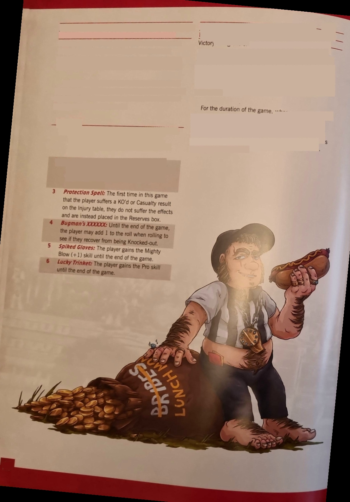and <em>ripped it open with
unbridled excitement! Roll a D6</em></th>
<th></th>
<th></th>
<th></th>
<th></th>
<th></th>
<th></th>
<th></th>
<th></th>
<th></th>
</tr>
</thead>
<tbody>
</tbody>
</table>

to determine the effect of the gift.

+----+---+-------+-----+-----+----------------------------------+---+---+---+
|  | |       |     |     |                                  |   |   |   |
| ** |   |       |     |     |                                  |   |   |   |
| [D | * |       |     |     |                                  |   |   |   |
| 6] | * |       |     |     |                                  |   |   |   |
|  | ] |       |     |     |                                  |   |   |   |
| ** |  |       |     |     |                                  |   |   |   |
|    | * |       |     |     |                                  |   |   |   |
|    | * |       |     |     |                                  |   |   |   |
+====+===+=======+=====+=====+==================================+===+===+===+
|    |   |       |     |     |                                  |   |   |   |
+----+---+-------+-----+-----+----------------------------------+---+---+---+
|  | |       |     |     |                                  |   |   |   |
|  I |   |       |     |     |                                  |   |   |   |
|    | * |       |     |     |                                  |   |   |   |
|    | M |       |     |     |                                  |   |   |   |
|    | o |       |     |     |                                  |   |   |   |
|    | r |       |     |     |                                  |   |   |   |
|    | e |       |     |     |                                  |   |   |   |
|    | |       |     |     |                                  |   |   |   |
|    |   |       |     |     |                                  |   |   |   |
|    | S |       |     |     |                                  |   |   |   |
|    | o |       |     |     |                                  |   |   |   |
|    | c |       |     |     |                                  |   |   |   |
|    | k |       |     |     |                                  |   |   |   |
|    | s |       |     |     |                                  |   |   |   |
|    | \ |       |     |     |                                  |   |   |   |
|    | . |       |     |     |                                  |   |   |   |
|    | . |       |     |     |                                  |   |   |   |
|    | . |       |     |     |                                  |   |   |   |
|    | : |       |     |     |                                  |   |   |   |
|    | |       |     |     |                                  |   |   |   |
|    |   |       |     |     |                                  |   |   |   |
|    | T |       |     |     |                                  |   |   |   |
|    | h |       |     |     |                                  |   |   |   |
|    | e |       |     |     |                                  |   |   |   |
|    | |       |     |     |                                  |   |   |   |
|    |   |       |     |     |                                  |   |   |   |
|    | p |       |     |     |                                  |   |   |   |
|    | l |       |     |     |                                  |   |   |   |
|    | a |       |     |     |                                  |   |   |   |
|    | y |       |     |     |                                  |   |   |   |
|    | e |       |     |     |                                  |   |   |   |
|    | r |       |     |     |                                  |   |   |   |
|    | * |       |     |     |                                  |   |   |   |
|    | |       |     |     |                                  |   |   |   |
|    |   |       |     |     |                                  |   |   |   |
|    | g |       |     |     |                                  |   |   |   |
|    | a |       |     |     |                                  |   |   |   |
|    | i |       |     |     |                                  |   |   |   |
|    | n |       |     |     |                                  |   |   |   |
|    | s |       |     |     |                                  |   |   |   |
|    | |       |     |     |                                  |   |   |   |
|    |   |       |     |     |                                  |   |   |   |
|    | t |       |     |     |                                  |   |   |   |
|    | h |       |     |     |                                  |   |   |   |
|    | e |       |     |     |                                  |   |   |   |
|    | |       |     |     |                                  |   |   |   |
|    |   |       |     |     |                                  |   |   |   |
|    | A |       |     |     |                                  |   |   |   |
|    | n |       |     |     |                                  |   |   |   |
|    | i |       |     |     |                                  |   |   |   |
|    | m |       |     |     |                                  |   |   |   |
|    | o |       |     |     |                                  |   |   |   |
|    | s |       |     |     |                                  |   |   |   |
|    | i |       |     |     |                                  |   |   |   |
|    | t |       |     |     |                                  |   |   |   |
|    | y |       |     |     |                                  |   |   |   |
+----+---+-------+-----+-----+----------------------------------+---+---+---+
|    |   |     |     |     |                                  |   |   |   |
|    |   |  (all |     |     |                                  |   |   |   |
|    |   | t   |     |     |                                  |   |   |   |
|    |   | eam-m |     |     |                                  |   |   |   |
|    |   | ates) |     |     |                                  |   |   |   |
|    |   |     |     |     |                                  |   |   |   |
|    |   | trait |     |     |                                  |   |   |   |
|    |   | as  |     |     |                                  |   |   |   |
|    |   |     |     |     |                                  |   |   |   |
|    |   |  they |     |     |                                  |   |   |   |
|    |   | are |     |     |                                  |   |   |   |
|    |   | an  |     |     |                                  |   |   |   |
|    |   | noyed |     |     |                                  |   |   |   |
+----+---+-------+-----+-----+----------------------------------+---+---+---+
|    |   | that  |     |     |                                  |   |   |   |
|    |   | their |     |     |                                  |   |   |   |
|    |   | team- |     |     |                                  |   |   |   |
|    |   | mates |     |     |                                  |   |   |   |
|    |   | got   |     |     |                                  |   |   |   |
|    |   | them  |     |     |                                  |   |   |   |
|    |   | such  |     |     |                                  |   |   |   |
|    |   | a     |     |     |                                  |   |   |   |
|    |   | to    |     |     |                                  |   |   |   |
|    |   | tally |     |     |                                  |   |   |   |
+----+---+-------+-----+-----+----------------------------------+---+---+---+
|  |   | u   |     |     |                                  |   |   |   |
|  r |   | bbish |     |     |                                  |   |   |   |
|    |   |     |     |     |                                  |   |   |   |
|    |   | gift! |     |     |                                  |   |   |   |
+----+---+-------+-----+-----+----------------------------------+---+---+---+
| *  |   |       |     |     |                                  |   |   |   |
| *2 |   |       |     |     |                                  |   |   |   |
| ** |   |       |     |     |                                  |   |   |   |
| *T |   |       |     |     |                                  |   |   |   |
| as |   |       |     |     |                                  |   |   |   |
| ty |   |       |     |     |                                  |   |   |   |
| T  |   |       |     |     |                                  |   |   |   |
| re |   |       |     |     |                                  |   |   |   |
| at |   |       |     |     |                                  |   |   |   |
| :* |   |       |     |     |                                  |   |   |   |
| U  |   |       |     |     |                                  |   |   |   |
| nt |   |       |     |     |                                  |   |   |   |
| il |   |       |     |     |                                  |   |   |   |
| t  |   |       |     |     |                                  |   |   |   |
| he |   |       |     |     |                                  |   |   |   |
| e  |   |       |     |     |                                  |   |   |   |
| nd |   |       |     |     |                                  |   |   |   |
| of |   |       |     |     |                                  |   |   |   |
| t  |   |       |     |     |                                  |   |   |   |
| he |   |       |     |     |                                  |   |   |   |
| g  |   |       |     |     |                                  |   |   |   |
| am |   |       |     |     |                                  |   |   |   |
| e, |   |       |     |     |                                  |   |   |   |
| t  |   |       |     |     |                                  |   |   |   |
| he |   |       |     |     |                                  |   |   |   |
+----+---+-------+-----+-----+----------------------------------+---+---+---+
|    | |       |     |     |                                  |   |   |   |
|    |   |       |     |     |                                  |   |   |   |
|    | p |       |     |     |                                  |   |   |   |
|    | l |       |     |     |                                  |   |   |   |
|    | a |       |     |     |                                  |   |   |   |
|    | y |       |     |     |                                  |   |   |   |
|    | e |       |     |     |                                  |   |   |   |
|    | r |       |     |     |                                  |   |   |   |
|    | |       |     |     |                                  |   |   |   |
|    |   |       |     |     |                                  |   |   |   |
|    | m |       |     |     |                                  |   |   |   |
|    | a |       |     |     |                                  |   |   |   |
|    | y |       |     |     |                                  |   |   |   |
|    | |       |     |     |                                  |   |   |   |
|    |   |       |     |     |                                  |   |   |   |
|    | a |       |     |     |                                  |   |   |   |
|    | t |       |     |     |                                  |   |   |   |
|    | t |       |     |     |                                  |   |   |   |
|    | e |       |     |     |                                  |   |   |   |
|    | m |       |     |     |                                  |   |   |   |
|    | p |       |     |     |                                  |   |   |   |
|    | t |       |     |     |                                  |   |   |   |
|    | |       |     |     |                                  |   |   |   |
|    |   |       |     |     |                                  |   |   |   |
|    | t |       |     |     |                                  |   |   |   |
|    | o |       |     |     |                                  |   |   |   |
|    | |       |     |     |                                  |   |   |   |
|    |   |       |     |     |                                  |   |   |   |
|    | R |       |     |     |                                  |   |   |   |
|    | u |       |     |     |                                  |   |   |   |
|    | s |       |     |     |                                  |   |   |   |
|    | h |       |     |     |                                  |   |   |   |
|    | |       |     |     |                                  |   |   |   |
|    |   |       |     |     |                                  |   |   |   |
|    | o |       |     |     |                                  |   |   |   |
|    | n |       |     |     |                                  |   |   |   |
|    | e |       |     |     |                                  |   |   |   |
|    | |       |     |     |                                  |   |   |   |
|    |   |       |     |     |                                  |   |   |   |
|    | m |       |     |     |                                  |   |   |   |
|    | o |       |     |     |                                  |   |   |   |
|    | r |       |     |     |                                  |   |   |   |
|    | e |       |     |     |                                  |   |   |   |
|    | |       |     |     |                                  |   |   |   |
|    |   |       |     |     |                                  |   |   |   |
|    | t |       |     |     |                                  |   |   |   |
|    | i |       |     |     |                                  |   |   |   |
|    | m |       |     |     |                                  |   |   |   |
|    | e |       |     |     |                                  |   |   |   |
|    | |       |     |     |                                  |   |   |   |
|    |   |       |     |     |                                  |   |   |   |
|    | t |       |     |     |                                  |   |   |   |
|    | h |       |     |     |                                  |   |   |   |
|    | a |       |     |     |                                  |   |   |   |
|    | n |       |     |     |                                  |   |   |   |
+----+---+-------+-----+-----+----------------------------------+---+---+---+
|    | t |       |     |     |                                  |   |   |   |
|    | h |       |     |     |                                  |   |   |   |
|    | e |       |     |     |                                  |   |   |   |
|    | y |       |     |     |                                  |   |   |   |
|    | u |       |     |     |                                  |   |   |   |
|    | s |       |     |     |                                  |   |   |   |
|    | u |       |     |     |                                  |   |   |   |
|    | a |       |     |     |                                  |   |   |   |
|    | l |       |     |     |                                  |   |   |   |
|    | l |       |     |     |                                  |   |   |   |
|    | y |       |     |     |                                  |   |   |   |
|    | c |       |     |     |                                  |   |   |   |
|    | o |       |     |     |                                  |   |   |   |
|    | u |       |     |     |                                  |   |   |   |
|    | l |       |     |     |                                  |   |   |   |
|    | d |       |     |     |                                  |   |   |   |
|    | a |       |     |     |                                  |   |   |   |
|    | s |       |     |     |                                  |   |   |   |
|    | t |       |     |     |                                  |   |   |   |
|    | h |       |     |     |                                  |   |   |   |
|    | e |       |     |     |                                  |   |   |   |
|    | y |       |     |     |                                  |   |   |   |
|    | a |       |     |     |                                  |   |   |   |
|    | r |       |     |     |                                  |   |   |   |
|    | e |       |     |     |                                  |   |   |   |
|    | f |       |     |     |                                  |   |   |   |
|    | u |       |     |     |                                  |   |   |   |
|    | e |       |     |     |                                  |   |   |   |
|    | l |       |     |     |                                  |   |   |   |
|    | l |       |     |     |                                  |   |   |   |
|    | e |       |     |     |                                  |   |   |   |
|    | d |       |     |     |                                  |   |   |   |
|    | b |       |     |     |                                  |   |   |   |
|    | y |       |     |     |                                  |   |   |   |
|    | t |       |     |     |                                  |   |   |   |
|    | h |       |     |     |                                  |   |   |   |
|    | e |       |     |     |                                  |   |   |   |
+----+---+-------+-----+-----+----------------------------------+---+---+---+
|    | d |       |     |     |                                  |   |   |   |
|    | e |       |     |     |                                  |   |   |   |
|    | l |       |     |     |                                  |   |   |   |
|    | i |       |     |     |                                  |   |   |   |
|    | c |       |     |     |                                  |   |   |   |
|    | i |       |     |     |                                  |   |   |   |
|    | o |       |     |     |                                  |   |   |   |
|    | u |       |     |     |                                  |   |   |   |
|    | s |       |     |     |                                  |   |   |   |
|    | d |       |     |     |                                  |   |   |   |
|    | e |       |     |     |                                  |   |   |   |
|    | l |       |     |     |                                  |   |   |   |
|    | i |       |     |     |                                  |   |   |   |
|    | c |       |     |     |                                  |   |   |   |
|    | a |       |     |     |                                  |   |   |   |
|    | c |       |     |     |                                  |   |   |   |
|    | y |       |     |     |                                  |   |   |   |
|    | . |       |     |     |                                  |   |   |   |
+----+---+-------+-----+-----+----------------------------------+---+---+---+

***26***

  -------------------------------------------------------------------------
                                             square in your End        
  ----------------------------- ------------ --------------------- --- ----
  Zone, they must roll a D6. On                                        
  a 2+ nothing happens and the                                         
  touchdown is scored. On a 1,                                         
  a booby trap ha                                                      

  gone off and the opposition                                          
  player is Knocked Down                                               

  No touchdown is scored.                                              
  -------------------------------------------------------------------------

+---------------------------------------------------------+---+---+---+---+
|                                                         |   |   |   |   |
+---------------------------------------------------------+---+---+---+---+
| **\-\-\-\-\-\-\-\-\-\-\-                              |   |   |   |   |
| \-\-\-\-\-\-\-\-\-\-\-\-\-\-\-\-\-\-\-\-\-\-\-\-\-\--** |   |   |   |   |
+---------------------------------------------------------+---+---+---+---+
|                                                         |   |   |   |   |
+---------------------------------------------------------+---+---+---+---+
| Whenever a Blood Bowl tournament comes to the Moot      |   | |   | |
| fan\<t *r* --- u -                                      |   |   |   |   |
|                                                         |   | \ |   | - |
|                                                         |   | - |   | - |
|                                                         |   | \ |   | - |
|                                                         |   | - |   | - |
|                                                         |   | \ |   |   |
|                                                         |   | - |   |   |
|                                                         |   | \ |   |   |
|                                                         |   | - |   |   |
|                                                         |   | \ |   |   |
|                                                         |   | - |   |   |
|                                                         |   | \ |   |   |
|                                                         |   | - |   |   |
|                                                         |   | \ |   |   |
|                                                         |   | - |   |   |
|                                                         |   | \ |   |   |
|                                                         |   | - |   |   |
|                                                         |   | \ |   |   |
|                                                         |   | - |   |   |
|                                                         |   | \ |   |   |
|                                                         |   | - |   |   |
|                                                         |   | \ |   |   |
|                                                         |   | - |   |   |
|                                                         |   | - |   |   |
+---------------------------------------------------------+---+---+---+---+
| three things: an abundance of Halfling teams getting    |   |   |   | |
| the stuffinc k                                          |   |   |   |   |
|                                                         |   |   |   | ° |
+---------------------------------------------------------+---+---+---+---+
| , ~hem~ ib .he early rounds, referees .bat earn e       |   | |   |   |
| aSbX\~                                                  |   |   |   |   |
|                                                         |   | ° |   |   |
|                                                         |   | \ |   |   |
|                                                         |   | ' |   |   |
+---------------------------------------------------------+---+---+---+---+
| .ban enforcing the rules and. mos. importantly, tbe     |   |   |   |   |
| legendary Monlland                                      |   |   |   |   |
+---------------------------------------------------------+---+---+---+---+

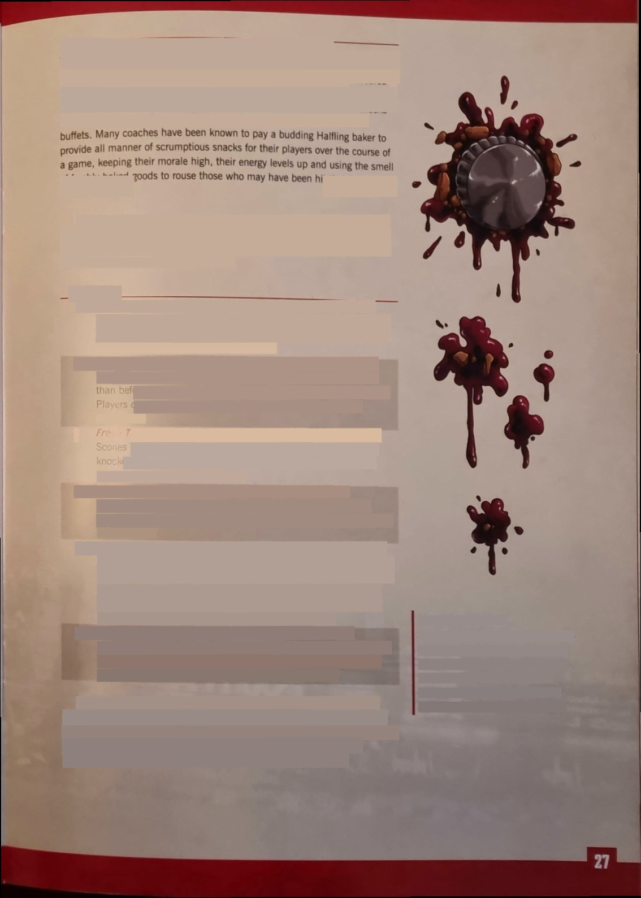hard on the field!

1 tnat llttle bl \* too

+---+----------------------------------+--------------------------------+
|   | During the pre-game sequence,  |                                |
|   | before determining the kicking |                                |
|   | team, any                      |                                |
+===+==================================+================================+
| t |                                  |                                |
| e |                                  |                                |
| a |                                  |                                |
| m |                                  |                                |
| t |                                  |                                |
| h |                                  |                                |
| a |                                  |                                |
| t |                                  |                                |
| h |                                  |                                |
| a |                                  |                                |
| s |                                  |                                |
| h |                                  |                                |
| i |                                  |                                |
| r |                                  |                                |
| e |                                  |                                |
| d |                                  |                                |
| a |                                  |                                |
| F |                                  |                                |
| a |                                  |                                |
| m |                                  |                                |
| o |                                  |                                |
| u |                                  |                                |
| s |                                  |                                |
| M |                                  |                                |
| o |                                  |                                |
| o |                                  |                                |
| t |                                  |                                |
| B |                                  |                                |
| u |                                  |                                |
| f |                                  |                                |
| f |                                  |                                |
| e |                                  |                                |
| t |                                  |                                |
| m |                                  |                                |
| u |                                  |                                |
| s |                                  |                                |
| t |                                  |                                |
| r |                                  |                                |
| o |                                  |                                |
| l |                                  |                                |
| l |                                  |                                |
| a |                                  |                                |
| D |                                  |                                |
| 6 |                                  |                                |
| t |                                  |                                |
| o |                                  |                                |
| d |                                  |                                |
| e |                                  |                                |
| t |                                  |                                |
| e |                                  |                                |
| r |                                  |                                |
| m |                                  |                                |
| i |                                  |                                |
| n |                                  |                                |
| e |                                  |                                |
| w |                                  |                                |
| h |                                  |                                |
| a |                                  |                                |
| t |                                  |                                |
| m |                                  |                                |
| a |                                  |                                |
| n |                                  |                                |
| n |                                  |                                |
| e |                                  |                                |
| r |                                  |                                |
| o |                                  |                                |
| f |                                  |                                |
| t |                                  |                                |
| a |                                  |                                |
| s |                                  |                                |
| t |                                  |                                |
| y |                                  |                                |
| t |                                  |                                |
| r |                                  |                                |
| e |                                  |                                |
| a |                                  |                                |
| t |                                  |                                |
| s |                                  |                                |
| t |                                  |                                |
| h |                                  |                                |
| e |                                  |                                |
| H |                                  |                                |
| a |                                  |                                |
| l |                                  |                                |
| f |                                  |                                |
| l |                                  |                                |
| i |                                  |                                |
| n |                                  |                                |
| g |                                  |                                |
| b |                                  |                                |
| a |                                  |                                |
| k |                                  |                                |
| e |                                  |                                |
| r |                                  |                                |
| s |                                  |                                |
| h |                                  |                                |
| a |                                  |                                |
| v |                                  |                                |
| e |                                  |                                |
| p |                                  |                                |
| r |                                  |                                |
| o |                                  |                                |
| v |                                  |                                |
| i |                                  |                                |
| d |                                  |                                |
| e |                                  |                                |
| d |                                  |                                |
| f |                                  |                                |
| o |                                  |                                |
| r |                                  |                                |
| t |                                  |                                |
| h |                                  |                                |
| e |                                  |                                |
| i |                                  |                                |
| r |                                  |                                |
| t |                                  |                                |
| e |                                  |                                |
| a |                                  |                                |
| m |                                  |                                |
| . |                                  |                                |
| T |                                  |                                |
| h |                                  |                                |
| e |                                  |                                |
+---+----------------------------------+--------------------------------+
| |                                  |                                |
|   |                                  |                                |
| e |                                  |                                |
| f |                                  |                                |
| f |                                  |                                |
| e |                                  |                                |
| c |                                  |                                |
| t |                                  |                                |
| s |                                  |                                |
| |                                  |                                |
|   |                                  |                                |
| l |                                  |                                |
| a |                                  |                                |
| s |                                  |                                |
| t |                                  |                                |
| |                                  |                                |
|   |                                  |                                |
| f |                                  |                                |
| o |                                  |                                |
| r |                                  |                                |
| |                                  |                                |
|   |                                  |                                |
| t |                                  |                                |
| h |                                  |                                |
| e |                                  |                                |
| |                                  |                                |
|   |                                  |                                |
| d |                                  |                                |
| u |                                  |                                |
| r |                                  |                                |
| a |                                  |                                |
| t |                                  |                                |
| i |                                  |                                |
| o |                                  |                                |
| n |                                  |                                |
| |                                  |                                |
|   |                                  |                                |
| o |                                  |                                |
| f |                                  |                                |
| |                                  |                                |
|   |                                  |                                |
| t |                                  |                                |
| h |                                  |                                |
| e |                                  |                                |
| |                                  |                                |
|   |                                  |                                |
| g |                                  |                                |
| a |                                  |                                |
| m |                                  |                                |
| e |                                  |                                |
| . |                                  |                                |
+---+----------------------------------+--------------------------------+

+---+---+-----+----+----------------------------+------------------+---+---+
| |   |     |    |                            |                  |   |   |
|   |   |     |    |                            |                  |   |   |
| [ |   |     |    |                            |                  |   |   |
| D |   |     |    |                            |                  |   |   |
| 6 |   |     |    |                            |                  |   |   |
| |   |     |    |                            |                  |   |   |
|   |   |     |    |                            |                  |   |   |
| G |   |     |    |                            |                  |   |   |
| I |   |     |    |                            |                  |   |   |
| F |   |     |    |                            |                  |   |   |
| T |   |     |    |                            |                  |   |   |
| ] |   |     |    |                            |                  |   |   |
|  |   |     |    |                            |                  |   |   |
+===+===+=====+====+============================+==================+===+===+
|   |   |     |    |                            |                  |   |   |
+---+---+-----+----+----------------------------+------------------+---+---+
|   | |     |    |                            |                  |   |   |
|   |   |     |    |                            |                  |   |   |
|   | 1 |     |    |                            |                  |   |   |
|   | |     |    |                            |                  |   |   |
|   |   |     |    |                            |                  |   |   |
|   | * |     |    |                            |                  |   |   |
|   | G |     |    |                            |                  |   |   |
|   | a |     |    |                            |                  |   |   |
|   | r |     |    |                            |                  |   |   |
|   | l |     |    |                            |                  |   |   |
|   | i |     |    |                            |                  |   |   |
|   | c |     |    |                            |                  |   |   |
|   | |     |    |                            |                  |   |   |
|   |   |     |    |                            |                  |   |   |
|   | E |     |    |                            |                  |   |   |
|   | c |     |    |                            |                  |   |   |
|   | l |     |    |                            |                  |   |   |
|   | a |     |    |                            |                  |   |   |
|   | i |     |    |                            |                  |   |   |
|   | r |     |    |                            |                  |   |   |
|   | s |     |    |                            |                  |   |   |
|   | : |     |    |                            |                  |   |   |
|   | * |     |    |                            |                  |   |   |
|   | |     |    |                            |                  |   |   |
|   |   |     |    |                            |                  |   |   |
|   | T |     |    |                            |                  |   |   |
|   | h |     |    |                            |                  |   |   |
|   | o |     |    |                            |                  |   |   |
|   | u |     |    |                            |                  |   |   |
|   | g |     |    |                            |                  |   |   |
|   | h |     |    |                            |                  |   |   |
|   | |     |    |                            |                  |   |   |
|   |   |     |    |                            |                  |   |   |
|   | d |     |    |                            |                  |   |   |
|   | e |     |    |                            |                  |   |   |
|   | l |     |    |                            |                  |   |   |
|   | i |     |    |                            |                  |   |   |
|   | c |     |    |                            |                  |   |   |
|   | i |     |    |                            |                  |   |   |
|   | o |     |    |                            |                  |   |   |
|   | u |     |    |                            |                  |   |   |
|   | s |     |    |                            |                  |   |   |
|   | |     |    |                            |                  |   |   |
|   |   |     |    |                            |                  |   |   |
|   | t |     |    |                            |                  |   |   |
|   | o |     |    |                            |                  |   |   |
|   | |     |    |                            |                  |   |   |
|   |   |     |    |                            |                  |   |   |
|   | e |     |    |                            |                  |   |   |
|   | a |     |    |                            |                  |   |   |
|   | t |     |    |                            |                  |   |   |
|   | , |     |    |                            |                  |   |   |
|   | |     |    |                            |                  |   |   |
|   |   |     |    |                            |                  |   |   |
|   | G |     |    |                            |                  |   |   |
|   | a |     |    |                            |                  |   |   |
|   | r |     |    |                            |                  |   |   |
|   | l |     |    |                            |                  |   |   |
|   | i |     |    |                            |                  |   |   |
|   | c |     |    |                            |                  |   |   |
|   | |     |    |                            |                  |   |   |
|   |   |     |    |                            |                  |   |   |
|   | E |     |    |                            |                  |   |   |
|   | c |     |    |                            |                  |   |   |
|   | l |     |    |                            |                  |   |   |
|   | a |     |    |                            |                  |   |   |
|   | i |     |    |                            |                  |   |   |
|   | r |     |    |                            |                  |   |   |
|   | s |     |    |                            |                  |   |   |
|   | |     |    |                            |                  |   |   |
|   |   |     |    |                            |                  |   |   |
|   | d |     |    |                            |                  |   |   |
|   | o |     |    |                            |                  |   |   |
|   | |     |    |                            |                  |   |   |
|   |   |     |    |                            |                  |   |   |
|   | t |     |    |                            |                  |   |   |
|   | e |     |    |                            |                  |   |   |
|   | n |     |    |                            |                  |   |   |
|   | d |     |    |                            |                  |   |   |
|   | |     |    |                            |                  |   |   |
|   |   |     |    |                            |                  |   |   |
|   | t |     |    |                            |                  |   |   |
|   | o |     |    |                            |                  |   |   |
+---+---+-----+----+----------------------------+------------------+---+---+
|   |   |   |    |                            |                  |   |   |
|   |   |  le |    |                            |                  |   |   |
|   |   | ave |    |                            |                  |   |   |
|   |   | a |    |                            |                  |   |   |
|   |   |   |    |                            |                  |   |   |
|   |   | pla |    |                            |                  |   |   |
|   |   | yer |    |                            |                  |   |   |
|   |   | \'s |    |                            |                  |   |   |
|   |   |   |    |                            |                  |   |   |
|   |   | bre |    |                            |                  |   |   |
|   |   | ath |    |                            |                  |   |   |
|   |   |   |    |                            |                  |   |   |
|   |   |  sm |    |                            |                  |   |   |
|   |   | ell |    |                            |                  |   |   |
|   |   | ing |    |                            |                  |   |   |
|   |   |   |    |                            |                  |   |   |
|   |   | par |    |                            |                  |   |   |
|   |   | tic |    |                            |                  |   |   |
|   |   | ula |    |                            |                  |   |   |
|   |   | rly |    |                            |                  |   |   |
|   |   |   |    |                            |                  |   |   |
|   |   |  pu |    |                            |                  |   |   |
|   |   | nge |    |                            |                  |   |   |
|   |   | nt, |    |                            |                  |   |   |
|   |   |   |    |                            |                  |   |   |
|   |   | and |    |                            |                  |   |   |
|   |   |   |    |                            |                  |   |   |
|   |   | not |    |                            |                  |   |   |
|   |   | m |    |                            |                  |   |   |
|   |   | any |    |                            |                  |   |   |
|   |   |   |    |                            |                  |   |   |
|   |   | opp |    |                            |                  |   |   |
|   |   | one |    |                            |                  |   |   |
|   |   | nts |    |                            |                  |   |   |
|   |   |   |    |                            |                  |   |   |
|   |   | are |    |                            |                  |   |   |
|   |   | w |    |                            |                  |   |   |
|   |   | ill |    |                            |                  |   |   |
|   |   | ing |    |                            |                  |   |   |
|   |   |   |    |                            |                  |   |   |
|   |   |  to |    |                            |                  |   |   |
|   |   |   |    |                            |                  |   |   |
|   |   | get |    |                            |                  |   |   |
|   |   | n |    |                            |                  |   |   |
|   |   | ear |    |                            |                  |   |   |
|   |   | t |    |                            |                  |   |   |
|   |   | hem |    |                            |                  |   |   |
|   |   |   |    |                            |                  |   |   |
|   |   |  if |    |                            |                  |   |   |
|   |   | t |    |                            |                  |   |   |
|   |   | hey |    |                            |                  |   |   |
|   |   |   |    |                            |                  |   |   |
|   |   | can |    |                            |                  |   |   |
|   |   | h |    |                            |                  |   |   |
|   |   | elp |    |                            |                  |   |   |
|   |   |   |    |                            |                  |   |   |
|   |   | it! |    |                            |                  |   |   |
|   |   | P |    |                            |                  |   |   |
|   |   | lay |    |                            |                  |   |   |
|   |   | ers |    |                            |                  |   |   |
|   |   |   |    |                            |                  |   |   |
|   |   |  on |    |                            |                  |   |   |
+---+---+-----+----+----------------------------+------------------+---+---+
|   |   | y |    |                            |                  |   | , |
|   |   | our |    |                            |                  |   | r |
|   |   | t |    |                            |                  |   |   |
|   |   | eam |    |                            |                  |   |   |
|   |   | g |    |                            |                  |   |   |
|   |   | ain |    |                            |                  |   |   |
|   |   |   |    |                            |                  |   |   |
|   |   | the |    |                            |                  |   |   |
|   |   | F |    |                            |                  |   |   |
|   |   | oul |    |                            |                  |   |   |
|   |   | A |    |                            |                  |   |   |
|   |   | ppe |    |                            |                  |   |   |
|   |   | ara |    |                            |                  |   |   |
|   |   | nce |    |                            |                  |   |   |
|   |   |   |    |                            |                  |   |   |
|   |   | ski |    |                            |                  |   |   |
|   |   | ll. |    |                            |                  |   |   |
+---+---+-----+----+----------------------------+------------------+---+---+
|   | 2 |     |  |                            |                  |   |   |
|   | 5 |     | *t |                            |                  |   |   |
|   |   |     | ic |                            |                  |   |   |
|   |   |     | hy |                            |                  |   |   |
|   |   |     |  |                            |                  |   |   |
|   |   |     | Bu |                            |                  |   |   |
|   |   |     | ns |                            |                  |   |   |
|   |   |     | :* |                            |                  |   |   |
|   |   |     |  |                            |                  |   |   |
|   |   |     | St |                            |                  |   |   |
|   |   |     | ic |                            |                  |   |   |
|   |   |     | ky |                            |                  |   |   |
|   |   |     |  |                            |                  |   |   |
|   |   |     | Bu |                            |                  |   |   |
|   |   |     | ns |                            |                  |   |   |
|   |   |     |  |                            |                  |   |   |
|   |   |     |  a |                            |                  |   |   |
|   |   |     | re |                            |                  |   |   |
|   |   |     |  |                            |                  |   |   |
|   |   |     |  a |                            |                  |   |   |
|   |   |     |  |                            |                  |   |   |
|   |   |     | fi |                            |                  |   |   |
|   |   |     | rm |                            |                  |   |   |
|   |   |     |  |                            |                  |   |   |
|   |   |     |  f |                            |                  |   |   |
|   |   |     | av |                            |                  |   |   |
|   |   |     | ou |                            |                  |   |   |
|   |   |     | ri |                            |                  |   |   |
|   |   |     | te |                            |                  |   |   |
|   |   |     |  |                            |                  |   |   |
|   |   |     | in |                            |                  |   |   |
|   |   |     |  |                            |                  |   |   |
|   |   |     |  t |                            |                  |   |   |
|   |   |     | he |                            |                  |   |   |
|   |   |     |  |                            |                  |   |   |
|   |   |     | Mo |                            |                  |   |   |
|   |   |     | ot |                            |                  |   |   |
+---+---+-----+----+----------------------------+------------------+---+---+
|   |   | t   |  |                            |                  |   |   |
|   |   | h\' |  a |                            |                  |   |   |
|   |   |     | ti |                            |                  |   |   |
|   |   |     | ng |                            |                  |   |   |
|   |   |     |  |                            |                  |   |   |
|   |   |     | th |                            |                  |   |   |
|   |   |     | em |                            |                  |   |   |
|   |   |     |  |                            |                  |   |   |
|   |   |     | do |                            |                  |   |   |
|   |   |     | es |                            |                  |   |   |
|   |   |     |  |                            |                  |   |   |
|   |   |     |  l |                            |                  |   |   |
|   |   |     | ea |                            |                  |   |   |
|   |   |     | ve |                            |                  |   |   |
|   |   |     |  |                            |                  |   |   |
|   |   |     |  a |                            |                  |   |   |
|   |   |     |  |                            |                  |   |   |
|   |   |     |  p |                            |                  |   |   |
|   |   |     | la |                            |                  |   |   |
|   |   |     | ye |                            |                  |   |   |
|   |   |     | r\ |                            |                  |   |   |
|   |   |     | 's |                            |                  |   |   |
|   |   |     |  |                            |                  |   |   |
|   |   |     |  m |                            |                  |   |   |
|   |   |     | it |                            |                  |   |   |
|   |   |     | ts |                            |                  |   |   |
|   |   |     |  |                            |                  |   |   |
|   |   |     | so |                            |                  |   |   |
|   |   |     | me |                            |                  |   |   |
|   |   |     | wh |                            |                  |   |   |
|   |   |     | at |                            |                  |   |   |
|   |   |     |  |                            |                  |   |   |
|   |   |     |  s |                            |                  |   |   |
|   |   |     | ti |                            |                  |   |   |
|   |   |     | ck |                            |                  |   |   |
|   |   |     | ie |                            |                  |   |   |
+---+---+-----+----+----------------------------+------------------+---+---+
|   |   |     |  |                            |                  |   |   |
|   |   |     | ar |                            |                  |   |   |
|   |   |     | e; |                            |                  |   |   |
|   |   |     |  |                            |                  |   |   |
|   |   |     |  s |                            |                  |   |   |
|   |   |     | om |                            |                  |   |   |
|   |   |     | et |                            |                  |   |   |
|   |   |     | hi |                            |                  |   |   |
|   |   |     | ng |                            |                  |   |   |
|   |   |     |  |                            |                  |   |   |
|   |   |     | th |                            |                  |   |   |
|   |   |     | at |                            |                  |   |   |
|   |   |     |  |                            |                  |   |   |
|   |   |     | do |                            |                  |   |   |
|   |   |     | es |                            |                  |   |   |
|   |   |     |  |                            |                  |   |   |
|   |   |     |  a |                            |                  |   |   |
|   |   |     | id |                            |                  |   |   |
|   |   |     |  |                            |                  |   |   |
|   |   |     | in |                            |                  |   |   |
|   |   |     |  |                            |                  |   |   |
|   |   |     |  p |                            |                  |   |   |
|   |   |     | ic |                            |                  |   |   |
|   |   |     | ki |                            |                  |   |   |
|   |   |     | ng |                            |                  |   |   |
|   |   |     |  |                            |                  |   |   |
|   |   |     |  t |                            |                  |   |   |
|   |   |     | he |                            |                  |   |   |
|   |   |     |  |                            |                  |   |   |
|   |   |     | ba |                            |                  |   |   |
|   |   |     | ll |                            |                  |   |   |
|   |   |     |  |                            |                  |   |   |
|   |   |     | up |                            |                  |   |   |
|   |   |     |  |                            |                  |   |   |
|   |   |     | ho |                            |                  |   |   |
|   |   |     | we |                            |                  |   |   |
|   |   |     | ve |                            |                  |   |   |
|   |   |     | r! |                            |                  |   |   |
+---+---+-----+----+----------------------------+------------------+---+---+
|   |   |     |  |                            |                  |   |   |
|   |   |     |  \ |                            |                  |   |   |
|   |   |     | >n |                            |                  |   |   |
|   |   |     |  |                            |                  |   |   |
|   |   |     | yo |                            |                  |   |   |
|   |   |     | ur |                            |                  |   |   |
|   |   |     |  |                            |                  |   |   |
|   |   |     | te |                            |                  |   |   |
|   |   |     | am |                            |                  |   |   |
|   |   |     |  |                            |                  |   |   |
|   |   |     | ga |                            |                  |   |   |
|   |   |     | in |                            |                  |   |   |
|   |   |     |  |                            |                  |   |   |
|   |   |     |  a |                            |                  |   |   |
|   |   |     |  |                            |                  |   |   |
|   |   |     |  b |                            |                  |   |   |
|   |   |     | on |                            |                  |   |   |
|   |   |     | us |                            |                  |   |   |
|   |   |     |  |                            |                  |   |   |
|   |   |     | of |                            |                  |   |   |
|   |   |     |  |                            |                  |   |   |
|   |   |     | +1 |                            |                  |   |   |
|   |   |     |  |                            |                  |   |   |
|   |   |     | wh |                            |                  |   |   |
|   |   |     | en |                            |                  |   |   |
|   |   |     |  |                            |                  |   |   |
|   |   |     |  r |                            |                  |   |   |
|   |   |     | ol |                            |                  |   |   |
|   |   |     | li |                            |                  |   |   |
|   |   |     | ng |                            |                  |   |   |
|   |   |     |  |                            |                  |   |   |
|   |   |     | to |                            |                  |   |   |
|   |   |     |  |                            |                  |   |   |
|   |   |     | pi |                            |                  |   |   |
|   |   |     | ck |                            |                  |   |   |
+---+---+-----+----+----------------------------+------------------+---+---+
|   |   |   |    |                            |                  |   |   |
|   |   |  up |    |                            |                  |   |   |
|   |   |   |    |                            |                  |   |   |
|   |   |  ba |    |                            |                  |   |   |
|   |   | ll. |    |                            |                  |   |   |
+---+---+-----+----+----------------------------+------------------+---+---+

3

+-----+---+----------------------------+-------------------------------+---+
|     |   | *ri pieberry Scones:* The  |                               |   |
|     |   | smell of freshly baked     |                               |   |
|     |   | Tripleberry                |                               |   |
+=====+===+============================+===============================+===+
|     |   | wafting through the dugout |                               |   |
|     |   | is enough to rouse almost  |                               |   |
|     |   | any                        |                               |   |
+-----+---+----------------------------+-------------------------------+---+
|     | |                            |                               |   |
|     |   |                            |                               |   |
|     | i |                            |                               |   |
|     | d |                            |                               |   |
|     | - |                            |                               |   |
|     | o |                            |                               |   |
|     | u |                            |                               |   |
|     | t |                            |                               |   |
|     | |                            |                               |   |
|     |   |                            |                               |   |
|     | p |                            |                               |   |
|     | l |                            |                               |   |
|     | a |                            |                               |   |
|     | y |                            |                               |   |
|     | e |                            |                               |   |
|     | r |                            |                               |   |
|     | . |                            |                               |   |
|     | |                            |                               |   |
|     |   |                            |                               |   |
|     | P |                            |                               |   |
|     | l |                            |                               |   |
|     | a |                            |                               |   |
|     | y |                            |                               |   |
|     | e |                            |                               |   |
|     | r |                            |                               |   |
|     | s |                            |                               |   |
|     | |                            |                               |   |
|     |   |                            |                               |   |
|     | o |                            |                               |   |
|     | n |                            |                               |   |
|     | |                            |                               |   |
|     |   |                            |                               |   |
|     | y |                            |                               |   |
|     | o |                            |                               |   |
|     | u |                            |                               |   |
|     | r |                            |                               |   |
|     | |                            |                               |   |
|     |   |                            |                               |   |
|     | t |                            |                               |   |
|     | e |                            |                               |   |
|     | a |                            |                               |   |
|     | m |                            |                               |   |
|     | |                            |                               |   |
|     |   |                            |                               |   |
|     | g |                            |                               |   |
|     | a |                            |                               |   |
|     | i |                            |                               |   |
|     | n |                            |                               |   |
|     | |                            |                               |   |
|     |   |                            |                               |   |
|     | a |                            |                               |   |
|     | |                            |                               |   |
|     |   |                            |                               |   |
|     | + |                            |                               |   |
|     | 2 |                            |                               |   |
|     | |                            |                               |   |
|     |   |                            |                               |   |
|     | b |                            |                               |   |
|     | o |                            |                               |   |
|     | n |                            |                               |   |
|     | u |                            |                               |   |
|     | s |                            |                               |   |
|     | |                            |                               |   |
|     |   |                            |                               |   |
|     | w |                            |                               |   |
|     | h |                            |                               |   |
|     | e |                            |                               |   |
|     | n |                            |                               |   |
+-----+---+----------------------------+-------------------------------+---+
| r |   |                            |                               |   |
| oll |   |                            |                               |   |
| : |   |                            |                               |   |
|   |   |                            |                               |   |
|  to |   |                            |                               |   |
| r |   |                            |                               |   |
| eco |   |                            |                               |   |
| ver |   |                            |                               |   |
| f |   |                            |                               |   |
| rom |   |                            |                               |   |
|   |   |                            |                               |   |
|  be |   |                            |                               |   |
| ing |   |                            |                               |   |
|   |   |                            |                               |   |
| KO\ |   |                            |                               |   |
| 'd. |   |                            |                               |   |
+-----+---+----------------------------+-------------------------------+---+

+----+------------+------------------------------------------+---+---+
|  |            |                                          |   |   |
|  * |            |                                          |   |   |
| i\ |            |                                          |   |   |
| >. |            |                                          |   |   |
|  |            |                                          |   |   |
|  l |            |                                          |   |   |
| h- |            |                                          |   |   |
|  |            |                                          |   |   |
|  ) |            |                                          |   |   |
|  |            |                                          |   |   |
| En |            |                                          |   |   |
| er |            |                                          |   |   |
| gy |            |                                          |   |   |
|  |            |                                          |   |   |
| Ba |            |                                          |   |   |
| rs |            |                                          |   |   |
| :* |            |                                          |   |   |
|  |            |                                          |   |   |
|  T |            |                                          |   |   |
| he |            |                                          |   |   |
| se |            |                                          |   |   |
|  |            |                                          |   |   |
|  d |            |                                          |   |   |
| el |            |                                          |   |   |
| ic |            |                                          |   |   |
| io |            |                                          |   |   |
| us |            |                                          |   |   |
|  |            |                                          |   |   |
| sn |            |                                          |   |   |
| ac |            |                                          |   |   |
| ks |            |                                          |   |   |
|  |            |                                          |   |   |
|  a |            |                                          |   |   |
| re |            |                                          |   |   |
|  |            |                                          |   |   |
|  t |            |                                          |   |   |
| he |            |                                          |   |   |
|  |            |                                          |   |   |
|  p |            |                                          |   |   |
| er |            |                                          |   |   |
| fe |            |                                          |   |   |
| ct |            |                                          |   |   |
+====+============+==========================================+===+===+
|    | treat to   |                                          |   |   |
|    | fuel any   |                                          |   |   |
|    | player,    |                                          |   |   |
|    | letting    |                                          |   |   |
|    | them       |                                          |   |   |
|    | unleash    |                                          |   |   |
|    | bursts of  |                                          |   |   |
|    | energy all |                                          |   |   |
+----+------------+------------------------------------------+---+---+
|    | game     |                                          |   |   |
|    | long.    |                                          |   |   |
|    | Players  |                                          |   |   |
|    | on your  |                                          |   |   |
|    | team may |                                          |   |   |
|    | Rush one |                                          |   |   |
|    | more     |                                          |   |   |
|    | time     |                                          |   |   |
|    | than     |                                          |   |   |
|    | they     |                                          |   |   |
+----+------------+------------------------------------------+---+---+
|    | usually  |                                          |   |   |
|    | could.   |                                          |   |   |
+----+------------+------------------------------------------+---+---+

+---+----------------------------------------------------+---+---+-----+---+---+
| |                                                    |   |   |     |   |   |
|   |                                                    |   |   |     |   |   |
| 5 |                                                    |   |   |     |   |   |
| |                                                    |   |   |     |   |   |
|   |                                                    |   |   |     |   |   |
| * |                                                    |   |   |     |   |   |
| A |                                                    |   |   |     |   |   |
| m |                                                    |   |   |     |   |   |
| a |                                                    |   |   |     |   |   |
| z |                                                    |   |   |     |   |   |
| i |                                                    |   |   |     |   |   |
| n |                                                    |   |   |     |   |   |
| g |                                                    |   |   |     |   |   |
| |                                                    |   |   |     |   |   |
|   |                                                    |   |   |     |   |   |
| A |                                                    |   |   |     |   |   |
| p |                                                    |   |   |     |   |   |
| p |                                                    |   |   |     |   |   |
| l |                                                    |   |   |     |   |   |
| e |                                                    |   |   |     |   |   |
| |                                                    |   |   |     |   |   |
|   |                                                    |   |   |     |   |   |
| P |                                                    |   |   |     |   |   |
| i |                                                    |   |   |     |   |   |
| e |                                                    |   |   |     |   |   |
| : |                                                    |   |   |     |   |   |
| * |                                                    |   |   |     |   |   |
| |                                                    |   |   |     |   |   |
|   |                                                    |   |   |     |   |   |
| I |                                                    |   |   |     |   |   |
| t |                                                    |   |   |     |   |   |
| ' |                                                    |   |   |     |   |   |
| s |                                                    |   |   |     |   |   |
| |                                                    |   |   |     |   |   |
|   |                                                    |   |   |     |   |   |
| l |                                                    |   |   |     |   |   |
| o |                                                    |   |   |     |   |   |
| n |                                                    |   |   |     |   |   |
| g |                                                    |   |   |     |   |   |
| |                                                    |   |   |     |   |   |
|   |                                                    |   |   |     |   |   |
| b |                                                    |   |   |     |   |   |
| e |                                                    |   |   |     |   |   |
| e |                                                    |   |   |     |   |   |
| n |                                                    |   |   |     |   |   |
| |                                                    |   |   |     |   |   |
|   |                                                    |   |   |     |   |   |
| s |                                                    |   |   |     |   |   |
| a |                                                    |   |   |     |   |   |
| i |                                                    |   |   |     |   |   |
| d |                                                    |   |   |     |   |   |
| |                                                    |   |   |     |   |   |
|   |                                                    |   |   |     |   |   |
| i |                                                    |   |   |     |   |   |
| n |                                                    |   |   |     |   |   |
| |                                                    |   |   |     |   |   |
|   |                                                    |   |   |     |   |   |
| t |                                                    |   |   |     |   |   |
| h |                                                    |   |   |     |   |   |
| e |                                                    |   |   |     |   |   |
| |                                                    |   |   |     |   |   |
|   |                                                    |   |   |     |   |   |
| M |                                                    |   |   |     |   |   |
| o |                                                    |   |   |     |   |   |
| o |                                                    |   |   |     |   |   |
| t |                                                    |   |   |     |   |   |
| |                                                    |   |   |     |   |   |
|   |                                                    |   |   |     |   |   |
| t |                                                    |   |   |     |   |   |
| h |                                                    |   |   |     |   |   |
| a |                                                    |   |   |     |   |   |
| t |                                                    |   |   |     |   |   |
| |                                                    |   |   |     |   |   |
|   |                                                    |   |   |     |   |   |
| A |                                                    |   |   |     |   |   |
| p |                                                    |   |   |     |   |   |
| p |                                                    |   |   |     |   |   |
| l |                                                    |   |   |     |   |   |
| e |                                                    |   |   |     |   |   |
| |                                                    |   |   |     |   |   |
|   |                                                    |   |   |     |   |   |
| P |                                                    |   |   |     |   |   |
| i |                                                    |   |   |     |   |   |
| e |                                                    |   |   |     |   |   |
+===+====================================================+===+===+=====+===+===+
|   | is very much a superfood, and many players will  |   |   |     |   |   |
|   | scoff down as many                               |   |   |     |   |   |
|   |                                                  |   |   |     |   |   |
|   | helpings as they can to keep their strength up!  |   |   |     |   |   |
|   | Players on your team                             |   |   |     |   |   |
+---+----------------------------------------------------+---+---+-----+---+---+
|   | gain a bonus of + 1 to their ST when performing  |   |   |     |   |   |
|   | a Block action as part of a Blitz action for the |   |   |     |   |   |
|   | duration of the action. This is applied          |   |   |     |   |   |
+---+----------------------------------------------------+---+---+-----+---+---+
|   | before counting assists or applying any other    |   |   |     |   |   |
|   | modifiers.                                       |   |   |     |   |   |
+---+----------------------------------------------------+---+---+-----+---+---+
| |                                                    |   |   |     |   |   |
|   |                                                    |   |   |     |   |   |
| 6 |                                                    |   |   |     |   |   |
| |                                                    |   |   |     |   |   |
|   |                                                    |   |   |     |   |   |
| * |                                                    |   |   |     |   |   |
| D |                                                    |   |   |     |   |   |
| e |                                                    |   |   |     |   |   |
| l |                                                    |   |   |     |   |   |
| i |                                                    |   |   |     |   |   |
| g |                                                    |   |   |     |   |   |
| h |                                                    |   |   |     |   |   |
| t |                                                    |   |   |     |   |   |
| f |                                                    |   |   |     |   |   |
| u |                                                    |   |   |     |   |   |
| l |                                                    |   |   |     |   |   |
| |                                                    |   |   |     |   |   |
|   |                                                    |   |   |     |   |   |
| D |                                                    |   |   |     |   |   |
| o |                                                    |   |   |     |   |   |
| u |                                                    |   |   |     |   |   |
| g |                                                    |   |   |     |   |   |
| h |                                                    |   |   |     |   |   |
| n |                                                    |   |   |     |   |   |
| u |                                                    |   |   |     |   |   |
| t |                                                    |   |   |     |   |   |
| s |                                                    |   |   |     |   |   |
| : |                                                    |   |   |     |   |   |
| * |                                                    |   |   |     |   |   |
| |                                                    |   |   |     |   |   |
|   |                                                    |   |   |     |   |   |
| E |                                                    |   |   |     |   |   |
| v |                                                    |   |   |     |   |   |
| e |                                                    |   |   |     |   |   |
| r |                                                    |   |   |     |   |   |
| y |                                                    |   |   |     |   |   |
| o |                                                    |   |   |     |   |   |
| n |                                                    |   |   |     |   |   |
| e |                                                    |   |   |     |   |   |
| |                                                    |   |   |     |   |   |
|   |                                                    |   |   |     |   |   |
| l |                                                    |   |   |     |   |   |
| o |                                                    |   |   |     |   |   |
| v |                                                    |   |   |     |   |   |
| e |                                                    |   |   |     |   |   |
| s |                                                    |   |   |     |   |   |
| |                                                    |   |   |     |   |   |
|   |                                                    |   |   |     |   |   |
| d |                                                    |   |   |     |   |   |
| o |                                                    |   |   |     |   |   |
| u |                                                    |   |   |     |   |   |
| g |                                                    |   |   |     |   |   |
| h |                                                    |   |   |     |   |   |
| n |                                                    |   |   |     |   |   |
| u |                                                    |   |   |     |   |   |
| t |                                                    |   |   |     |   |   |
| s |                                                    |   |   |     |   |   |
| , |                                                    |   |   |     |   |   |
| |                                                    |   |   |     |   |   |
|   |                                                    |   |   |     |   |   |
| a |                                                    |   |   |     |   |   |
| n |                                                    |   |   |     |   |   |
| d |                                                    |   |   |     |   |   |
| |                                                    |   |   |     |   |   |
|   |                                                    |   |   |     |   |   |
| n |                                                    |   |   |     |   |   |
| o |                                                    |   |   |     |   |   |
+---+----------------------------------------------------+---+---+-----+---+---+
|   | tournament is complete without players wolfing   | |   |     |   |   |
|   | down a                                           |   |   |     |   |   |
|   |                                                    | d |   |     |   |   |
|   |                                                    | o |   |     |   |   |
|   |                                                    | u |   |     |   |   |
|   |                                                    | g |   |     |   |   |
|   |                                                    | h |   |     |   |   |
|   |                                                    | n |   |     |   |   |
|   |                                                    | u |   |     |   |   |
|   |                                                    | t |   |     |   |   |
|   |                                                    | |   |     |   |   |
|   |                                                    |   |   |     |   |   |
|   |                                                    | o |   |     |   |   |
|   |                                                    | r |   |     |   |   |
+---+----------------------------------------------------+---+---+-----+---+---+
|   | three to raise their spirits! Whenever a player  | |   |     |   |   |
|   | on your te                                       |   |   |     |   |   |
|   |                                                    | a |   |     |   |   |
|   |                                                    | m |   |     |   |   |
|   |                                                    | |   |     |   |   |
|   |                                                    |   |   |     |   |   |
|   |                                                    | u |   |     |   |   |
|   |                                                    | s |   |     |   |   |
|   |                                                    | e |   |     |   |   |
|   |                                                    | s |   |     |   |   |
|   |                                                    | |   |     |   |   |
|   |                                                    |   |   |     |   |   |
|   |                                                    | a |   |     |   |   |
+---+----------------------------------------------------+---+---+-----+---+---+
|   | team re-roll, roll a D6. On a 5+, the team       |   |   |     |   |   |
|   | re-roll is free.                                 |   |   |     |   |   |
+---+----------------------------------------------------+---+---+-----+---+---+

+---+---------------------------------------------------------+---+---+---+---+
|   | These are just a few examples of the kind of custom   |   |   |   |   |
|   | Inducements that                                      |   |   |   |   |
+===+=========================================================+===+===+===+===+
| |                                                         |   |   |   |   |
|   |                                                         |   |   |   |   |
| E |                                                         |   |   |   |   |
| v |                                                         |   |   |   |   |
| e |                                                         |   |   |   |   |
| n |                                                         |   |   |   |   |
| t |                                                         |   |   |   |   |
| |                                                         |   |   |   |   |
|   |                                                         |   |   |   |   |
| O |                                                         |   |   |   |   |
| r |                                                         |   |   |   |   |
| g |                                                         |   |   |   |   |
| a |                                                         |   |   |   |   |
| n |                                                         |   |   |   |   |
| i |                                                         |   |   |   |   |
| s |                                                         |   |   |   |   |
| e |                                                         |   |   |   |   |
| r |                                                         |   |   |   |   |
| s |                                                         |   |   |   |   |
| |                                                         |   |   |   |   |
|   |                                                         |   |   |   |   |
| c |                                                         |   |   |   |   |
| a |                                                         |   |   |   |   |
| n |                                                         |   |   |   |   |
| |                                                         |   |   |   |   |
|   |                                                         |   |   |   |   |
| u |                                                         |   |   |   |   |
| s |                                                         |   |   |   |   |
| e |                                                         |   |   |   |   |
| |                                                         |   |   |   |   |
|   |                                                         |   |   |   |   |
| i |                                                         |   |   |   |   |
| f |                                                         |   |   |   |   |
| |                                                         |   |   |   |   |
|   |                                                         |   |   |   |   |
| t |                                                         |   |   |   |   |
| h |                                                         |   |   |   |   |
| e |                                                         |   |   |   |   |
| y |                                                         |   |   |   |   |
| |                                                         |   |   |   |   |
|   |                                                         |   |   |   |   |
| w |                                                         |   |   |   |   |
| i |                                                         |   |   |   |   |
| s |                                                         |   |   |   |   |
| h |                                                         |   |   |   |   |
| . |                                                         |   |   |   |   |
| |                                                         |   |   |   |   |
|   |                                                         |   |   |   |   |
| O |                                                         |   |   |   |   |
| f |                                                         |   |   |   |   |
| |                                                         |   |   |   |   |
|   |                                                         |   |   |   |   |
| c |                                                         |   |   |   |   |
| o |                                                         |   |   |   |   |
| u |                                                         |   |   |   |   |
| r |                                                         |   |   |   |   |
| s |                                                         |   |   |   |   |
| e |                                                         |   |   |   |   |
| , |                                                         |   |   |   |   |
| |                                                         |   |   |   |   |
|   |                                                         |   |   |   |   |
| w |                                                         |   |   |   |   |
| h |                                                         |   |   |   |   |
| e |                                                         |   |   |   |   |
| n |                                                         |   |   |   |   |
| |                                                         |   |   |   |   |
|   |                                                         |   |   |   |   |
| i |                                                         |   |   |   |   |
| t |                                                         |   |   |   |   |
| |                                                         |   |   |   |   |
|   |                                                         |   |   |   |   |
| c |                                                         |   |   |   |   |
| o |                                                         |   |   |   |   |
| m |                                                         |   |   |   |   |
| e |                                                         |   |   |   |   |
| s |                                                         |   |   |   |   |
| |                                                         |   |   |   |   |
|   |                                                         |   |   |   |   |
| t |                                                         |   |   |   |   |
| o |                                                         |   |   |   |   |
| |                                                         |   |   |   |   |
|   |                                                         |   |   |   |   |
| c |                                                         |   |   |   |   |
| r |                                                         |   |   |   |   |
| e |                                                         |   |   |   |   |
| a |                                                         |   |   |   |   |
| t |                                                         |   |   |   |   |
| i |                                                         |   |   |   |   |
| n |                                                         |   |   |   |   |
| g |                                                         |   |   |   |   |
+---+---------------------------------------------------------+---+---+---+---+
| y |                                                         |   |   |   |   |
| o |                                                         |   |   |   |   |
| u |                                                         |   |   |   |   |
| r |                                                         |   |   |   |   |
| o |                                                         |   |   |   |   |
| w |                                                         |   |   |   |   |
| n |                                                         |   |   |   |   |
| I |                                                         |   |   |   |   |
| n |                                                         |   |   |   |   |
| d |                                                         |   |   |   |   |
| u |                                                         |   |   |   |   |
| c |                                                         |   |   |   |   |
| e |                                                         |   |   |   |   |
| m |                                                         |   |   |   |   |
| e |                                                         |   |   |   |   |
| n |                                                         |   |   |   |   |
| t |                                                         |   |   |   |   |
| s |                                                         |   |   |   |   |
| t |                                                         |   |   |   |   |
| h |                                                         |   |   |   |   |
| e |                                                         |   |   |   |   |
| y |                                                         |   |   |   |   |
| c |                                                         |   |   |   |   |
| a |                                                         |   |   |   |   |
| n |                                                         |   |   |   |   |
| b |                                                         |   |   |   |   |
| e |                                                         |   |   |   |   |
| t |                                                         |   |   |   |   |
| h |                                                         |   |   |   |   |
| e |                                                         |   |   |   |   |
| m |                                                         |   |   |   |   |
| e |                                                         |   |   |   |   |
| d |                                                         |   |   |   |   |
| a |                                                         |   |   |   |   |
| r |                                                         |   |   |   |   |
| o |                                                         |   |   |   |   |
| u |                                                         |   |   |   |   |
| n |                                                         |   |   |   |   |
| d |                                                         |   |   |   |   |
| w |                                                         |   |   |   |   |
| h |                                                         |   |   |   |   |
| a |                                                         |   |   |   |   |
| t |                                                         |   |   |   |   |
| e |                                                         |   |   |   |   |
| v |                                                         |   |   |   |   |
| e |                                                         |   |   |   |   |
| r |                                                         |   |   |   |   |
| t |                                                         |   |   |   |   |
| a |                                                         |   |   |   |   |
| k |                                                         |   |   |   |   |
| e |                                                         |   |   |   |   |
| s |                                                         |   |   |   |   |
| y |                                                         |   |   |   |   |
| o |                                                         |   |   |   |   |
| u |                                                         |   |   |   |   |
| r |                                                         |   |   |   |   |
| f |                                                         |   |   |   |   |
| a |                                                         |   |   |   |   |
| n |                                                         |   |   |   |   |
| c |                                                         |   |   |   |   |
| y |                                                         |   |   |   |   |
| . |                                                         |   |   |   |   |
+---+---------------------------------------------------------+---+---+---+---+
| |                                                         |   |   |   |   |
|   |                                                         |   |   |   |   |
| Y |                                                         |   |   |   |   |
| o |                                                         |   |   |   |   |
| u |                                                         |   |   |   |   |
| |                                                         |   |   |   |   |
|   |                                                         |   |   |   |   |
| m |                                                         |   |   |   |   |
| a |                                                         |   |   |   |   |
| y |                                                         |   |   |   |   |
| |                                                         |   |   |   |   |
|   |                                                         |   |   |   |   |
| e |                                                         |   |   |   |   |
| v |                                                         |   |   |   |   |
| e |                                                         |   |   |   |   |
| n |                                                         |   |   |   |   |
| |                                                         |   |   |   |   |
|   |                                                         |   |   |   |   |
| d |                                                         |   |   |   |   |
| e |                                                         |   |   |   |   |
| c |                                                         |   |   |   |   |
| i |                                                         |   |   |   |   |
| d |                                                         |   |   |   |   |
| e |                                                         |   |   |   |   |
| |                                                         |   |   |   |   |
|   |                                                         |   |   |   |   |
| t |                                                         |   |   |   |   |
| h |                                                         |   |   |   |   |
| a |                                                         |   |   |   |   |
| t |                                                         |   |   |   |   |
| |                                                         |   |   |   |   |
|   |                                                         |   |   |   |   |
| e |                                                         |   |   |   |   |
| v |                                                         |   |   |   |   |
| e |                                                         |   |   |   |   |
| r |                                                         |   |   |   |   |
| y |                                                         |   |   |   |   |
| |                                                         |   |   |   |   |
|   |                                                         |   |   |   |   |
| c |                                                         |   |   |   |   |
| o |                                                         |   |   |   |   |
| a |                                                         |   |   |   |   |
| c |                                                         |   |   |   |   |
| h |                                                         |   |   |   |   |
| |                                                         |   |   |   |   |
|   |                                                         |   |   |   |   |
| i |                                                         |   |   |   |   |
| n |                                                         |   |   |   |   |
| |                                                         |   |   |   |   |
|   |                                                         |   |   |   |   |
| y |                                                         |   |   |   |   |
| o |                                                         |   |   |   |   |
| u |                                                         |   |   |   |   |
| r |                                                         |   |   |   |   |
| |                                                         |   |   |   |   |
|   |                                                         |   |   |   |   |
| e |                                                         |   |   |   |   |
| v |                                                         |   |   |   |   |
| e |                                                         |   |   |   |   |
| n |                                                         |   |   |   |   |
| t |                                                         |   |   |   |   |
| |                                                         |   |   |   |   |
|   |                                                         |   |   |   |   |
| g |                                                         |   |   |   |   |
| e |                                                         |   |   |   |   |
| t |                                                         |   |   |   |   |
| s |                                                         |   |   |   |   |
| |                                                         |   |   |   |   |
|   |                                                         |   |   |   |   |
| y |                                                         |   |   |   |   |
| o |                                                         |   |   |   |   |
| u |                                                         |   |   |   |   |
| r |                                                         |   |   |   |   |
| |                                                         |   |   |   |   |
|   |                                                         |   |   |   |   |
| c |                                                         |   |   |   |   |
| u |                                                         |   |   |   |   |
| s |                                                         |   |   |   |   |
| t |                                                         |   |   |   |   |
| o |                                                         |   |   |   |   |
| m |                                                         |   |   |   |   |
+---+---------------------------------------------------------+---+---+---+---+
| |                                                         |   |   |   |   |
|   |                                                         |   |   |   |   |
| I |                                                         |   |   |   |   |
| n |                                                         |   |   |   |   |
| d |                                                         |   |   |   |   |
| u |                                                         |   |   |   |   |
| c |                                                         |   |   |   |   |
| e |                                                         |   |   |   |   |
| m |                                                         |   |   |   |   |
| e |                                                         |   |   |   |   |
| n |                                                         |   |   |   |   |
| t |                                                         |   |   |   |   |
| |                                                         |   |   |   |   |
|   |                                                         |   |   |   |   |
| f |                                                         |   |   |   |   |
| o |                                                         |   |   |   |   |
| r |                                                         |   |   |   |   |
| |                                                         |   |   |   |   |
|   |                                                         |   |   |   |   |
| f |                                                         |   |   |   |   |
| r |                                                         |   |   |   |   |
| e |                                                         |   |   |   |   |
| e |                                                         |   |   |   |   |
| |                                                         |   |   |   |   |
|   |                                                         |   |   |   |   |
| t |                                                         |   |   |   |   |
| o |                                                         |   |   |   |   |
| |                                                         |   |   |   |   |
|   |                                                         |   |   |   |   |
| a |                                                         |   |   |   |   |
| d |                                                         |   |   |   |   |
| d |                                                         |   |   |   |   |
| |                                                         |   |   |   |   |
|   |                                                         |   |   |   |   |
| t |                                                         |   |   |   |   |
| h |                                                         |   |   |   |   |
| a |                                                         |   |   |   |   |
| t |                                                         |   |   |   |   |
| |                                                         |   |   |   |   |
|   |                                                         |   |   |   |   |
| e |                                                         |   |   |   |   |
| x |                                                         |   |   |   |   |
| t |                                                         |   |   |   |   |
| r |                                                         |   |   |   |   |
| a |                                                         |   |   |   |   |
| |                                                         |   |   |   |   |
|   |                                                         |   |   |   |   |
| l |                                                         |   |   |   |   |
| e |                                                         |   |   |   |   |
| v |                                                         |   |   |   |   |
| e |                                                         |   |   |   |   |
| l |                                                         |   |   |   |   |
| |                                                         |   |   |   |   |
|   |                                                         |   |   |   |   |
| o |                                                         |   |   |   |   |
| f |                                                         |   |   |   |   |
| |                                                         |   |   |   |   |
|   |                                                         |   |   |   |   |
| f |                                                         |   |   |   |   |
| l |                                                         |   |   |   |   |
| a |                                                         |   |   |   |   |
| v |                                                         |   |   |   |   |
| o |                                                         |   |   |   |   |
| u |                                                         |   |   |   |   |
| r |                                                         |   |   |   |   |
| |                                                         |   |   |   |   |
|   |                                                         |   |   |   |   |
| t |                                                         |   |   |   |   |
| o |                                                         |   |   |   |   |
| |                                                         |   |   |   |   |
|   |                                                         |   |   |   |   |
| y |                                                         |   |   |   |   |
| o |                                                         |   |   |   |   |
| u |                                                         |   |   |   |   |
| r |                                                         |   |   |   |   |
| |                                                         |   |   |   |   |
|   |                                                         |   |   |   |   |
| e |                                                         |   |   |   |   |
| v |                                                         |   |   |   |   |
| e |                                                         |   |   |   |   |
| n |                                                         |   |   |   |   |
| t |                                                         |   |   |   |   |
| ! |                                                         |   |   |   |   |
+---+---------------------------------------------------------+---+---+---+---+

**DID YOU KNOW?**

*In 2473 the Gouged Eye claimed an*

+----------------------------------------------------------------+-----+
| *unprecedented treble, winning the*                            |     |
+================================================================+=====+
| *Spike! Magazine Trophy, the Chaos*                          |     |
+----------------------------------------------------------------+-----+
| *Cup, and the Blood Bowl in the*                               |     |
+----------------------------------------------------------------+-----+

*same calendar year. No team has* *ever matched this impressive feat!*

+--------------------------------------------------------+-------+-----+
| **[GOLD ricLi. i\--,\....]               |       |     |
| \-\-\-\-\-\-\-\-\-\-\-\-\-\-\-\-\-\-\-\-\-\-\-\--**  |       |     |
+========================================================+=======+=====+
| Some events may decide to *change the Team Draft*    |       |     |
+--------------------------------------------------------+-------+-----+
| *Budget in-between* games, showing the *increased*   |       |     |
+--------------------------------------------------------+-------+-----+
| investment of a team\'s owners over the course of the  |       |     |
| tournament. This means that *coaches will* start with  |       |     |
| a smaller Team Draft *Budget for their first game and  |       |     |
| will* then receive more gold pieces after each *round  |       |     |
| to spend*                                              |       |     |
+--------------------------------------------------------+-------+-----+

*on their team.*

+---+------------------------+-------------------------------------+---+
| ! |                        |                                     |   |
| [ |                        |                                     |   |
| ] |                        |                                     |   |
| ( |                        |                                     |   |
| . |                        |                                     |   |
| / |                        |                                     |   |
| m |                        |                                     |   |
| a |                        |                                     |   |
| t |                        |                                     |   |
| c |                        |                                     |   |
| h |                        |                                     |   |
| e |                        |                                     |   |
| d |                        |                                     |   |
| _ |                        |                                     |   |
| p |                        |                                     |   |
| l |                        |                                     |   |
| a |                        |                                     |   |
| y |                        |                                     |   |
| / |                        |                                     |   |
| m |                        |                                     |   |
| e |                        |                                     |   |
| d |                        |                                     |   |
| i |                        |                                     |   |
| a |                        |                                     |   |
| / |                        |                                     |   |
| i |                        |                                     |   |
| m |                        |                                     |   |
| a |                        |                                     |   |
| g |                        |                                     |   |
| e |                        |                                     |   |
| 6 |                        |                                     |   |
| 2 |                        |                                     |   |
| 4 |                        |                                     |   |
| . |                        |                                     |   |
| p |                        |                                     |   |
| n |                        |                                     |   |
| g |                        |                                     |   |
| ) |                        |                                     |   |
|  |                        |                                     |   |
+===+========================+=====================================+===+
|   |                        |                                     | |
|   |                        |                                     |   |
|   |                        |                                     | * |
|   |                        |                                     | 1 |
|   |                        |                                     | , |
|   |                        |                                     | * |
+---+------------------------+-------------------------------------+---+
|   |                        |                                     |   |
+---+------------------------+-------------------------------------+---+
|   |                        | *000, OOO gold pieces for game*   |   |
+---+------------------------+-------------------------------------+---+
| * |                        |                                     |   |
| b |                        |                                     |   |
| e |                        |                                     |   |
| f |                        |                                     |   |
| o |                        |                                     |   |
| r |                        |                                     |   |
| e |                        |                                     |   |
| i |                        |                                     |   |
| n |                        |                                     |   |
| c |                        |                                     |   |
| r |                        |                                     |   |
| e |                        |                                     |   |
| a |                        |                                     |   |
| s |                        |                                     |   |
| i |                        |                                     |   |
| n |                        |                                     |   |
| g |                        |                                     |   |
| t |                        |                                     |   |
| h |                        |                                     |   |
| i |                        |                                     |   |
| s |                        |                                     |   |
| t |                        |                                     |   |
| o |                        |                                     |   |
| 1 |                        |                                     |   |
| , |                        |                                     |   |
| 1 |                        |                                     |   |
| 0 |                        |                                     |   |
| 0 |                        |                                     |   |
| , |                        |                                     |   |
| 0 |                        |                                     |   |
| 0 |                        |                                     |   |
| 0 |                        |                                     |   |
| f |                        |                                     |   |
| o |                        |                                     |   |
| r |                        |                                     |   |
| g |                        |                                     |   |
| a |                        |                                     |   |
| m |                        |                                     |   |
| e |                        |                                     |   |
| 2 |                        |                                     |   |
| , |                        |                                     |   |
| t |                        |                                     |   |
| h |                        |                                     |   |
| e |                        |                                     |   |
| n |                        |                                     |   |
| * |                        |                                     |   |
+---+------------------------+-------------------------------------+---+
| * |                        |                                     |   |
| 1 |                        |                                     |   |
| , |                        |                                     |   |
| 2 |                        |                                     |   |
| 0 |                        |                                     |   |
| 0 |                        |                                     |   |
| , |                        |                                     |   |
| 0 |                        |                                     |   |
| 0 |                        |                                     |   |
| 0 |                        |                                     |   |
| f |                        |                                     |   |
| o |                        |                                     |   |
| r |                        |                                     |   |
| g |                        |                                     |   |
| a |                        |                                     |   |
| m |                        |                                     |   |
| e |                        |                                     |   |
| 3 |                        |                                     |   |
| . |                        |                                     |   |
| * |                        |                                     |   |
+---+------------------------+-------------------------------------+---+

+---+-------------------------------------------------------------+---+---+
|   | There are a couple of important things to remember        |   |   |
+===+=============================================================+===+===+
| |                                                             |   |   |
|   |                                                             |   |   |
| i |                                                             |   |   |
| f |                                                             |   |   |
| |                                                             |   |   |
|   |                                                             |   |   |
| y |                                                             |   |   |
| o |                                                             |   |   |
| u |                                                             |   |   |
| |                                                             |   |   |
|   |                                                             |   |   |
| a |                                                             |   |   |
| r |                                                             |   |   |
| e |                                                             |   |   |
| |                                                             |   |   |
|   |                                                             |   |   |
| r |                                                             |   |   |
| u |                                                             |   |   |
| n |                                                             |   |   |
| n |                                                             |   |   |
| i |                                                             |   |   |
| n |                                                             |   |   |
| g |                                                             |   |   |
| |                                                             |   |   |
|   |                                                             |   |   |
| a |                                                             |   |   |
| n |                                                             |   |   |
| |                                                             |   |   |
|   |                                                             |   |   |
| e |                                                             |   |   |
| s |                                                             |   |   |
| c |                                                             |   |   |
| a |                                                             |   |   |
| l |                                                             |   |   |
| a |                                                             |   |   |
| t |                                                             |   |   |
| i |                                                             |   |   |
| o |                                                             |   |   |
| n |                                                             |   |   |
| |                                                             |   |   |
|   |                                                             |   |   |
| e |                                                             |   |   |
| v |                                                             |   |   |
| e |                                                             |   |   |
| n |                                                             |   |   |
| t |                                                             |   |   |
| . |                                                             |   |   |
| |                                                             |   |   |
|   |                                                             |   |   |
| T |                                                             |   |   |
| h |                                                             |   |   |
| e |                                                             |   |   |
| |                                                             |   |   |
|   |                                                             |   |   |
| f |                                                             |   |   |
| i |                                                             |   |   |
| r |                                                             |   |   |
| s |                                                             |   |   |
| t |                                                             |   |   |
| |                                                             |   |   |
|   |                                                             |   |   |
| i |                                                             |   |   |
| s |                                                             |   |   |
| |                                                             |   |   |
|   |                                                             |   |   |
| t |                                                             |   |   |
| h |                                                             |   |   |
| a |                                                             |   |   |
| t |                                                             |   |   |
| |                                                             |   |   |
|   |                                                             |   |   |
| c |                                                             |   |   |
| o |                                                             |   |   |
| a |                                                             |   |   |
| c |                                                             |   |   |
| h |                                                             |   |   |
| e |                                                             |   |   |
| s |                                                             |   |   |
| |                                                             |   |   |
|   |                                                             |   |   |
| c |                                                             |   |   |
| a |                                                             |   |   |
| n |                                                             |   |   |
| |                                                             |   |   |
|   |                                                             |   |   |
| o |                                                             |   |   |
| n |                                                             |   |   |
| l |                                                             |   |   |
| y |                                                             |   |   |
| |                                                             |   |   |
|   |                                                             |   |   |
| a |                                                             |   |   |
| d |                                                             |   |   |
| d |                                                             |   |   |
| |                                                             |   |   |
|   |                                                             |   |   |
| t |                                                             |   |   |
| o |                                                             |   |   |
| |                                                             |   |   |
|   |                                                             |   |   |
| t |                                                             |   |   |
| h |                                                             |   |   |
| e |                                                             |   |   |
| i |                                                             |   |   |
| r |                                                             |   |   |
| |                                                             |   |   |
|   |                                                             |   |   |
| T |                                                             |   |   |
| e |                                                             |   |   |
| a |                                                             |   |   |
| m |                                                             |   |   |
| |                                                             |   |   |
|   |                                                             |   |   |
| D |                                                             |   |   |
| r |                                                             |   |   |
| a |                                                             |   |   |
| f |                                                             |   |   |
| t |                                                             |   |   |
| |                                                             |   |   |
|   |                                                             |   |   |
| R |                                                             |   |   |
| o |                                                             |   |   |
| s |                                                             |   |   |
| t |                                                             |   |   |
| e |                                                             |   |   |
| r |                                                             |   |   |
| |                                                             |   |   |
|   |                                                             |   |   |
| a |                                                             |   |   |
| n |                                                             |   |   |
| d |                                                             |   |   |
| |                                                             |   |   |
|   |                                                             |   |   |
| c |                                                             |   |   |
| a |                                                             |   |   |
| n |                                                             |   |   |
| n |                                                             |   |   |
| o |                                                             |   |   |
| t |                                                             |   |   |
| |                                                             |   |   |
|   |                                                             |   |   |
| t |                                                             |   |   |
| a |                                                             |   |   |
| k |                                                             |   |   |
| e |                                                             |   |   |
| |                                                             |   |   |
|   |                                                             |   |   |
| a |                                                             |   |   |
| n |                                                             |   |   |
| y |                                                             |   |   |
| t |                                                             |   |   |
| h |                                                             |   |   |
| i |                                                             |   |   |
| n |                                                             |   |   |
| g |                                                             |   |   |
| |                                                             |   |   |
|   |                                                             |   |   |
| a |                                                             |   |   |
| w |                                                             |   |   |
| a |                                                             |   |   |
| y |                                                             |   |   |
| |                                                             |   |   |
|   |                                                             |   |   |
| f |                                                             |   |   |
| r |                                                             |   |   |
| o |                                                             |   |   |
| m |                                                             |   |   |
| |                                                             |   |   |
|   |                                                             |   |   |
| i |                                                             |   |   |
| t |                                                             |   |   |
| |                                                             |   |   |
|   |                                                             |   |   |
| o |                                                             |   |   |
| n |                                                             |   |   |
| c |                                                             |   |   |
| e |                                                             |   |   |
| |                                                             |   |   |
|   |                                                             |   |   |
| i |                                                             |   |   |
| t |                                                             |   |   |
| |                                                             |   |   |
|   |                                                             |   |   |
| h |                                                             |   |   |
| a |                                                             |   |   |
| s |                                                             |   |   |
| |                                                             |   |   |
|   |                                                             |   |   |
| b |                                                             |   |   |
| e |                                                             |   |   |
| e |                                                             |   |   |
| n |                                                             |   |   |
+---+-------------------------------------------------------------+---+---+
| |                                                             |   |   |
|   |                                                             |   |   |
| a |                                                             |   |   |
| d |                                                             |   |   |
| d |                                                             |   |   |
| e |                                                             |   |   |
| d |                                                             |   |   |
| |                                                             |   |   |
|   |                                                             |   |   |
| i |                                                             |   |   |
| n |                                                             |   |   |
| . |                                                             |   |   |
| |                                                             |   |   |
|   |                                                             |   |   |
| T |                                                             |   |   |
| h |                                                             |   |   |
| e |                                                             |   |   |
| |                                                             |   |   |
|   |                                                             |   |   |
| s |                                                             |   |   |
| e |                                                             |   |   |
| c |                                                             |   |   |
| o |                                                             |   |   |
| n |                                                             |   |   |
| d |                                                             |   |   |
| |                                                             |   |   |
|   |                                                             |   |   |
| i |                                                             |   |   |
| s |                                                             |   |   |
| |                                                             |   |   |
|   |                                                             |   |   |
| t |                                                             |   |   |
| h |                                                             |   |   |
| a |                                                             |   |   |
| t |                                                             |   |   |
| |                                                             |   |   |
|   |                                                             |   |   |
| a |                                                             |   |   |
| t |                                                             |   |   |
| |                                                             |   |   |
|   |                                                             |   |   |
| t |                                                             |   |   |
| h |                                                             |   |   |
| e |                                                             |   |   |
| |                                                             |   |   |
|   |                                                             |   |   |
| s |                                                             |   |   |
| t |                                                             |   |   |
| a |                                                             |   |   |
| r |                                                             |   |   |
| t |                                                             |   |   |
| |                                                             |   |   |
|   |                                                             |   |   |
| o |                                                             |   |   |
| f |                                                             |   |   |
| |                                                             |   |   |
|   |                                                             |   |   |
| t |                                                             |   |   |
| h |                                                             |   |   |
| e |                                                             |   |   |
| |                                                             |   |   |
|   |                                                             |   |   |
| e |                                                             |   |   |
| v |                                                             |   |   |
| e |                                                             |   |   |
| n |                                                             |   |   |
| t |                                                             |   |   |
| , |                                                             |   |   |
+---+-------------------------------------------------------------+---+---+
| |                                                             |   | |
|   |                                                             |   |   |
| c |                                                             |   | r |
| o |                                                             |   |   |
| a |                                                             |   |   |
| c |                                                             |   |   |
| h |                                                             |   |   |
| e |                                                             |   |   |
| s |                                                             |   |   |
| |                                                             |   |   |
|   |                                                             |   |   |
| m |                                                             |   |   |
| u |                                                             |   |   |
| s |                                                             |   |   |
| t |                                                             |   |   |
| |                                                             |   |   |
|   |                                                             |   |   |
| s |                                                             |   |   |
| u |                                                             |   |   |
| b |                                                             |   |   |
| m |                                                             |   |   |
| i |                                                             |   |   |
| t |                                                             |   |   |
| |                                                             |   |   |
|   |                                                             |   |   |
| a |                                                             |   |   |
| l |                                                             |   |   |
| l |                                                             |   |   |
| |                                                             |   |   |
|   |                                                             |   |   |
| o |                                                             |   |   |
| f |                                                             |   |   |
| |                                                             |   |   |
|   |                                                             |   |   |
| t |                                                             |   |   |
| h |                                                             |   |   |
| e |                                                             |   |   |
| i |                                                             |   |   |
| r |                                                             |   |   |
| |                                                             |   |   |
|   |                                                             |   |   |
| T |                                                             |   |   |
| e |                                                             |   |   |
| a |                                                             |   |   |
| m |                                                             |   |   |
| |                                                             |   |   |
|   |                                                             |   |   |
| D |                                                             |   |   |
| r |                                                             |   |   |
| a |                                                             |   |   |
| f |                                                             |   |   |
| t |                                                             |   |   |
| |                                                             |   |   |
|   |                                                             |   |   |
| R |                                                             |   |   |
| o |                                                             |   |   |
| s |                                                             |   |   |
| t |                                                             |   |   |
| e |                                                             |   |   |
| r |                                                             |   |   |
| s |                                                             |   |   |
| |                                                             |   |   |
|   |                                                             |   |   |
| f |                                                             |   |   |
| o |                                                             |   |   |
+---+-------------------------------------------------------------+---+---+
| a |                                                             |   |   |
| l |                                                             |   |   |
| l |                                                             |   |   |
| t |                                                             |   |   |
| h |                                                             |   |   |
| e |                                                             |   |   |
| T |                                                             |   |   |
| e |                                                             |   |   |
| a |                                                             |   |   |
| m |                                                             |   |   |
| D |                                                             |   |   |
| r |                                                             |   |   |
| a |                                                             |   |   |
| f |                                                             |   |   |
| t |                                                             |   |   |
| B |                                                             |   |   |
| u |                                                             |   |   |
| d |                                                             |   |   |
| g |                                                             |   |   |
| e |                                                             |   |   |
| t |                                                             |   |   |
| s |                                                             |   |   |
| t |                                                             |   |   |
| h |                                                             |   |   |
| a |                                                             |   |   |
| t |                                                             |   |   |
| t |                                                             |   |   |
| h |                                                             |   |   |
| e |                                                             |   |   |
| y |                                                             |   |   |
| w |                                                             |   |   |
| i |                                                             |   |   |
| l |                                                             |   |   |
| l |                                                             |   |   |
| b |                                                             |   |   |
| e |                                                             |   |   |
| p |                                                             |   |   |
| l |                                                             |   |   |
| a |                                                             |   |   |
| y |                                                             |   |   |
| i |                                                             |   |   |
| n |                                                             |   |   |
| g |                                                             |   |   |
| . |                                                             |   |   |
+---+-------------------------------------------------------------+---+---+

  -------------------------------------------------------------------------
  **lyfANDAfORY [TA]                                         
  LAYERS\-\-\-\-\-\-\-\-\-\-\-\-\-\-\-\-\-\-- \_\_\_**                   
  ------------------------------------------------------------ ----- --- --
                                                                         

  Star Players are one of the most interesting and exciting              

  parts of Blood Bowl; after all, seeing the very best players           
  of Nuffle's sacred game take to the pitch is a joy to                  
  behold!                                                                

  As a result many events may require all coaches to hav             e   

  at least one Star Player in their roster for the event.                
  -------------------------------------------------------------------------

+---+------------+----------------------------------------------+---+---+---+
|   | When     |                                              |   |   |   |
|   | this is  |                                              |   |   |   |
|   | the      |                                              |   |   |   |
|   | case,    |                                              |   |   |   |
|   | the      |                                              |   |   |   |
|   | Event    |                                              |   |   |   |
|   |          |                                              |   |   |   |
|   |  Organiser |                                              |   |   |   |
|   | may      |                                              |   |   |   |
+===+============+==============================================+===+===+===+
| |            |                                              |   |   |   |
|   |            |                                              |   |   |   |
| r |            |                                              |   |   |   |
| e |            |                                              |   |   |   |
| m |            |                                              |   |   |   |
| o |            |                                              |   |   |   |
| v |            |                                              |   |   |   |
| e |            |                                              |   |   |   |
| |            |                                              |   |   |   |
|   |            |                                              |   |   |   |
| t |            |                                              |   |   |   |
| h |            |                                              |   |   |   |
| e |            |                                              |   |   |   |
| |            |                                              |   |   |   |
|   |            |                                              |   |   |   |
| r |            |                                              |   |   |   |
| e |            |                                              |   |   |   |
| s |            |                                              |   |   |   |
| t |            |                                              |   |   |   |
| r |            |                                              |   |   |   |
| i |            |                                              |   |   |   |
| c |            |                                              |   |   |   |
| t |            |                                              |   |   |   |
| i |            |                                              |   |   |   |
| o |            |                                              |   |   |   |
| n |            |                                              |   |   |   |
| |            |                                              |   |   |   |
|   |            |                                              |   |   |   |
| f |            |                                              |   |   |   |
| o |            |                                              |   |   |   |
| r |            |                                              |   |   |   |
| |            |                                              |   |   |   |
|   |            |                                              |   |   |   |
| a |            |                                              |   |   |   |
| |            |                                              |   |   |   |
|   |            |                                              |   |   |   |
| t |            |                                              |   |   |   |
| e |            |                                              |   |   |   |
| a |            |                                              |   |   |   |
| m |            |                                              |   |   |   |
| |            |                                              |   |   |   |
|   |            |                                              |   |   |   |
| t |            |                                              |   |   |   |
| o |            |                                              |   |   |   |
| |            |                                              |   |   |   |
|   |            |                                              |   |   |   |
| h |            |                                              |   |   |   |
| a |            |                                              |   |   |   |
| v |            |                                              |   |   |   |
| e |            |                                              |   |   |   |
| |            |                                              |   |   |   |
|   |            |                                              |   |   |   |
| 1 |            |                                              |   |   |   |
| |            |                                              |   |   |   |
|   |            |                                              |   |   |   |
| 1 |            |                                              |   |   |   |
| |            |                                              |   |   |   |
|   |            |                                              |   |   |   |
| p |            |                                              |   |   |   |
| l |            |                                              |   |   |   |
| a |            |                                              |   |   |   |
| y |            |                                              |   |   |   |
| e |            |                                              |   |   |   |
| r |            |                                              |   |   |   |
| s |            |                                              |   |   |   |
+---+------------+----------------------------------------------+---+---+---+
| |            |                                              | s |   |   |
|   |            |                                              |   |   |   |
| b |            |                                              |   |   |   |
| e |            |                                              |   |   |   |
| f |            |                                              |   |   |   |
| o |            |                                              |   |   |   |
| r |            |                                              |   |   |   |
| e |            |                                              |   |   |   |
| |            |                                              |   |   |   |
|   |            |                                              |   |   |   |
| t |            |                                              |   |   |   |
| a |            |                                              |   |   |   |
| k |            |                                              |   |   |   |
| i |            |                                              |   |   |   |
| n |            |                                              |   |   |   |
| g |            |                                              |   |   |   |
| |            |                                              |   |   |   |
|   |            |                                              |   |   |   |
| a |            |                                              |   |   |   |
| |            |                                              |   |   |   |
|   |            |                                              |   |   |   |
| S |            |                                              |   |   |   |
| t |            |                                              |   |   |   |
| a |            |                                              |   |   |   |
| r |            |                                              |   |   |   |
| |            |                                              |   |   |   |
|   |            |                                              |   |   |   |
| P |            |                                              |   |   |   |
| l |            |                                              |   |   |   |
| a |            |                                              |   |   |   |
| y |            |                                              |   |   |   |
| e |            |                                              |   |   |   |
| r |            |                                              |   |   |   |
| |            |                                              |   |   |   |
|   |            |                                              |   |   |   |
| i |            |                                              |   |   |   |
| f |            |                                              |   |   |   |
| |            |                                              |   |   |   |
|   |            |                                              |   |   |   |
| t |            |                                              |   |   |   |
| h |            |                                              |   |   |   |
| e |            |                                              |   |   |   |
| y |            |                                              |   |   |   |
| |            |                                              |   |   |   |
|   |            |                                              |   |   |   |
| w |            |                                              |   |   |   |
| i |            |                                              |   |   |   |
| s |            |                                              |   |   |   |
| h |            |                                              |   |   |   |
| , |            |                                              |   |   |   |
| |            |                                              |   |   |   |
|   |            |                                              |   |   |   |
| s |            |                                              |   |   |   |
| o |            |                                              |   |   |   |
| |            |                                              |   |   |   |
|   |            |                                              |   |   |   |
| l |            |                                              |   |   |   |
| o |            |                                              |   |   |   |
| n |            |                                              |   |   |   |
| g |            |                                              |   |   |   |
| |            |                                              |   |   |   |
|   |            |                                              |   |   |   |
| a |            |                                              |   |   |   |
+---+------------+----------------------------------------------+---+---+---+
| a |            |                                              |   |   |   |
| l |            |                                              |   |   |   |
| l |            |                                              |   |   |   |
| r |            |                                              |   |   |   |
| o |            |                                              |   |   |   |
| s |            |                                              |   |   |   |
| t |            |                                              |   |   |   |
| e |            |                                              |   |   |   |
| r |            |                                              |   |   |   |
| s |            |                                              |   |   |   |
| s |            |                                              |   |   |   |
| t |            |                                              |   |   |   |
| i |            |                                              |   |   |   |
| l |            |                                              |   |   |   |
| l |            |                                              |   |   |   |
| h |            |                                              |   |   |   |
| a |            |                                              |   |   |   |
| v |            |                                              |   |   |   |
| e |            |                                              |   |   |   |
| a |            |                                              |   |   |   |
| t |            |                                              |   |   |   |
| l |            |                                              |   |   |   |
| e |            |                                              |   |   |   |
| a |            |                                              |   |   |   |
| s |            |                                              |   |   |   |
| t |            |                                              |   |   |   |
| 1 |            |                                              |   |   |   |
| 1 |            |                                              |   |   |   |
| p |            |                                              |   |   |   |
| l |            |                                              |   |   |   |
| a |            |                                              |   |   |   |
| y |            |                                              |   |   |   |
| e |            |                                              |   |   |   |
| r |            |                                              |   |   |   |
| s |            |                                              |   |   |   |
| . |            |                                              |   |   |   |
| T |            |                                              |   |   |   |
| h |            |                                              |   |   |   |
| i |            |                                              |   |   |   |
| s |            |                                              |   |   |   |
| i |            |                                              |   |   |   |
| s |            |                                              |   |   |   |
| a |            |                                              |   |   |   |
| t |            |                                              |   |   |   |
| t |            |                                              |   |   |   |
| h |            |                                              |   |   |   |
| e |            |                                              |   |   |   |
| d |            |                                              |   |   |   |
| i |            |                                              |   |   |   |
| s |            |                                              |   |   |   |
| c |            |                                              |   |   |   |
| r |            |                                              |   |   |   |
| e |            |                                              |   |   |   |
| t |            |                                              |   |   |   |
| i |            |                                              |   |   |   |
| o |            |                                              |   |   |   |
| n |            |                                              |   |   |   |
| o |            |                                              |   |   |   |
| f |            |                                              |   |   |   |
| t |            |                                              |   |   |   |
| h |            |                                              |   |   |   |
| e |            |                                              |   |   |   |
| E |            |                                              |   |   |   |
| v |            |                                              |   |   |   |
| e |            |                                              |   |   |   |
| n |            |                                              |   |   |   |
| t |            |                                              |   |   |   |
| O |            |                                              |   |   |   |
| r |            |                                              |   |   |   |
| g |            |                                              |   |   |   |
| a |            |                                              |   |   |   |
| n |            |                                              |   |   |   |
| i |            |                                              |   |   |   |
| s |            |                                              |   |   |   |
| e |            |                                              |   |   |   |
| r |            |                                              |   |   |   |
| a |            |                                              |   |   |   |
| n |            |                                              |   |   |   |
| d |            |                                              |   |   |   |
| i |            |                                              |   |   |   |
| f |            |                                              |   |   |   |
| t |            |                                              |   |   |   |
| h |            |                                              |   |   |   |
| e |            |                                              |   |   |   |
| y |            |                                              |   |   |   |
| d |            |                                              |   |   |   |
| o |            |                                              |   |   |   |
| d |            |                                              |   |   |   |
| e |            |                                              |   |   |   |
| c |            |                                              |   |   |   |
| i |            |                                              |   |   |   |
| d |            |                                              |   |   |   |
| e |            |                                              |   |   |   |
+---+------------+----------------------------------------------+---+---+---+
| t |            |                                              |   |   |   |
| o |            |                                              |   |   |   |
| c |            |                                              |   |   |   |
| h |            |                                              |   |   |   |
| a |            |                                              |   |   |   |
| n |            |                                              |   |   |   |
| g |            |                                              |   |   |   |
| e |            |                                              |   |   |   |
| t |            |                                              |   |   |   |
| h |            |                                              |   |   |   |
| i |            |                                              |   |   |   |
| s |            |                                              |   |   |   |
| t |            |                                              |   |   |   |
| h |            |                                              |   |   |   |
| e |            |                                              |   |   |   |
| n |            |                                              |   |   |   |
| i |            |                                              |   |   |   |
| t |            |                                              |   |   |   |
| s |            |                                              |   |   |   |
| h |            |                                              |   |   |   |
| o |            |                                              |   |   |   |
| u |            |                                              |   |   |   |
| l |            |                                              |   |   |   |
| d |            |                                              |   |   |   |
| b |            |                                              |   |   |   |
| e |            |                                              |   |   |   |
| c |            |                                              |   |   |   |
| l |            |                                              |   |   |   |
| e |            |                                              |   |   |   |
| a |            |                                              |   |   |   |
| r |            |                                              |   |   |   |
| l |            |                                              |   |   |   |
| y |            |                                              |   |   |   |
| m |            |                                              |   |   |   |
| a |            |                                              |   |   |   |
| r |            |                                              |   |   |   |
| k |            |                                              |   |   |   |
| e |            |                                              |   |   |   |
| d |            |                                              |   |   |   |
| i |            |                                              |   |   |   |
| n |            |                                              |   |   |   |
+---+------------+----------------------------------------------+---+---+---+
| t |            |                                              |   |   |   |
| h |            |                                              |   |   |   |
| e |            |                                              |   |   |   |
| r |            |                                              |   |   |   |
| u |            |                                              |   |   |   |
| l |            |                                              |   |   |   |
| e |            |                                              |   |   |   |
| s |            |                                              |   |   |   |
| p |            |                                              |   |   |   |
| a |            |                                              |   |   |   |
| c |            |                                              |   |   |   |
| k |            |                                              |   |   |   |
| . |            |                                              |   |   |   |
+---+------------+----------------------------------------------+---+---+---+

+---+-----------------------------------------------------------+-----+
|   | If an event does include mandatory Star Players, it is  |     |
+===+===========================================================+=====+
| |                                                           |     |
|   |                                                           |     |
| o |                                                           |     |
| f |                                                           |     |
| t |                                                           |     |
| e |                                                           |     |
| n |                                                           |     |
| |                                                           |     |
|   |                                                           |     |
| a |                                                           |     |
| |                                                           |     |
|   |                                                           |     |
| g |                                                           |     |
| o |                                                           |     |
| o |                                                           |     |
| d |                                                           |     |
| |                                                           |     |
|   |                                                           |     |
| i |                                                           |     |
| d |                                                           |     |
| e |                                                           |     |
| a |                                                           |     |
| |                                                           |     |
|   |                                                           |     |
| t |                                                           |     |
| o |                                                           |     |
| |                                                           |     |
|   |                                                           |     |
| h |                                                           |     |
| a |                                                           |     |
| v |                                                           |     |
| e |                                                           |     |
| |                                                           |     |
|   |                                                           |     |
| a |                                                           |     |
| |                                                           |     |
|   |                                                           |     |
| s |                                                           |     |
| e |                                                           |     |
| l |                                                           |     |
| e |                                                           |     |
| c |                                                           |     |
| t |                                                           |     |
| i |                                                           |     |
| o |                                                           |     |
| n |                                                           |     |
| |                                                           |     |
|   |                                                           |     |
| o |                                                           |     |
| f |                                                           |     |
| |                                                           |     |
|   |                                                           |     |
| a |                                                           |     |
| w |                                                           |     |
| a |                                                           |     |
| r |                                                           |     |
| d |                                                           |     |
| s |                                                           |     |
| |                                                           |     |
|   |                                                           |     |
| t |                                                           |     |
| h |                                                           |     |
| e |                                                           |     |
| m |                                                           |     |
| e |                                                           |     |
| d |                                                           |     |
+---+-----------------------------------------------------------+-----+
| |                                                           |     |
|   |                                                           |     |
| a |                                                           |     |
| r |                                                           |     |
| o |                                                           |     |
| u |                                                           |     |
| n |                                                           |     |
| d |                                                           |     |
| |                                                           |     |
|   |                                                           |     |
| S |                                                           |     |
| t |                                                           |     |
| a |                                                           |     |
| r |                                                           |     |
| |                                                           |     |
|   |                                                           |     |
| P |                                                           |     |
| l |                                                           |     |
| a |                                                           |     |
| y |                                                           |     |
| e |                                                           |     |
| r |                                                           |     |
| s |                                                           |     |
| |                                                           |     |
|   |                                                           |     |
| f |                                                           |     |
| o |                                                           |     |
| r |                                                           |     |
| |                                                           |     |
|   |                                                           |     |
| c |                                                           |     |
| o |                                                           |     |
| a |                                                           |     |
| c |                                                           |     |
| h |                                                           |     |
| e |                                                           |     |
| s |                                                           |     |
| |                                                           |     |
|   |                                                           |     |
| t |                                                           |     |
| o |                                                           |     |
| |                                                           |     |
|   |                                                           |     |
| e |                                                           |     |
| n |                                                           |     |
| g |                                                           |     |
| a |                                                           |     |
| g |                                                           |     |
| e |                                                           |     |
| |                                                           |     |
|   |                                                           |     |
| w |                                                           |     |
| i |                                                           |     |
| t |                                                           |     |
| h |                                                           |     |
| . |                                                           |     |
| |                                                           |     |
|   |                                                           |     |
| A |                                                           |     |
| w |                                                           |     |
| a |                                                           |     |
| r |                                                           |     |
| d |                                                           |     |
| s |                                                           |     |
| |                                                           |     |
|   |                                                           |     |
| f |                                                           |     |
| o |                                                           |     |
| r |                                                           |     |
| |                                                           |     |
|   |                                                           |     |
| t |                                                           |     |
| h |                                                           |     |
| e |                                                           |     |
| |                                                           |     |
|   |                                                           |     |
| c |                                                           |     |
| o |                                                           |     |
| a |                                                           |     |
| c |                                                           |     |
| h |                                                           |     |
| |                                                           |     |
|   |                                                           |     |
| t |                                                           |     |
| h |                                                           |     |
| a |                                                           |     |
| t |                                                           |     |
| |                                                           |     |
|   |                                                           |     |
| i |                                                           |     |
| n |                                                           |     |
| f |                                                           |     |
| l |                                                           |     |
| i |                                                           |     |
| c |                                                           |     |
| t |                                                           |     |
| e |                                                           |     |
| d |                                                           |     |
| |                                                           |     |
|   |                                                           |     |
| t |                                                           |     |
| h |                                                           |     |
| e |                                                           |     |
| |                                                           |     |
|   |                                                           |     |
| m |                                                           |     |
| o |                                                           |     |
| s |                                                           |     |
| t |                                                           |     |
| |                                                           |     |
|   |                                                           |     |
| C |                                                           |     |
| a |                                                           |     |
| s |                                                           |     |
| u |                                                           |     |
| a |                                                           |     |
| l |                                                           |     |
| t |                                                           |     |
| i |                                                           |     |
| e |                                                           |     |
| s |                                                           |     |
| |                                                           |     |
|   |                                                           |     |
| o |                                                           |     |
| n |                                                           |     |
| |                                                           |     |
|   |                                                           |     |
| S |                                                           |     |
| t |                                                           |     |
| a |                                                           |     |
| r |                                                           |     |
| |                                                           |     |
|   |                                                           |     |
| P |                                                           |     |
| l |                                                           |     |
| a |                                                           |     |
| y |                                                           |     |
| e |                                                           |     |
| r |                                                           |     |
| s |                                                           |     |
| , |                                                           |     |
| |                                                           |     |
|   |                                                           |     |
| c |                                                           |     |
| a |                                                           |     |
| u |                                                           |     |
| s |                                                           |     |
| e |                                                           |     |
| d |                                                           |     |
| |                                                           |     |
|   |                                                           |     |
| t |                                                           |     |
| h |                                                           |     |
| e |                                                           |     |
| |                                                           |     |
|   |                                                           |     |
| m |                                                           |     |
| o |                                                           |     |
| s |                                                           |     |
| t |                                                           |     |
| |                                                           |     |
|   |                                                           |     |
| C |                                                           |     |
| a |                                                           |     |
| s |                                                           |     |
| u |                                                           |     |
| a |                                                           |     |
| l |                                                           |     |
| t |                                                           |     |
| i |                                                           |     |
| e |                                                           |     |
| s |                                                           |     |
| |                                                           |     |
|   |                                                           |     |
| w |                                                           |     |
| i |                                                           |     |
| t |                                                           |     |
| h |                                                           |     |
| |                                                           |     |
|   |                                                           |     |
| a |                                                           |     |
| |                                                           |     |
|   |                                                           |     |
| S |                                                           |     |
| t |                                                           |     |
| a |                                                           |     |
| r |                                                           |     |
| |                                                           |     |
|   |                                                           |     |
| P |                                                           |     |
| l |                                                           |     |
| a |                                                           |     |
| y |                                                           |     |
| e |                                                           |     |
| r |                                                           |     |
| , |                                                           |     |
|   |                                                           |     |
| o |                                                           |     |
| r |                                                           |     |
| s |                                                           |     |
| c |                                                           |     |
| o |                                                           |     |
| r |                                                           |     |
| e |                                                           |     |
| d |                                                           |     |
| t |                                                           |     |
| h |                                                           |     |
| e |                                                           |     |
| m |                                                           |     |
| o |                                                           |     |
| s |                                                           |     |
| t |                                                           |     |
| t |                                                           |     |
| o |                                                           |     |
| u |                                                           |     |
| c |                                                           |     |
| h |                                                           |     |
| d |                                                           |     |
| o |                                                           |     |
| w |                                                           |     |
| n |                                                           |     |
| s |                                                           |     |
| w |                                                           |     |
| i |                                                           |     |
| t |                                                           |     |
| h |                                                           |     |
| a |                                                           |     |
| S |                                                           |     |
| t |                                                           |     |
| a |                                                           |     |
| r |                                                           |     |
| P |                                                           |     |
| l |                                                           |     |
| a |                                                           |     |
| y |                                                           |     |
| e |                                                           |     |
| r |                                                           |     |
| a |                                                           |     |
| r |                                                           |     |
| e |                                                           |     |
| a |                                                           |     |
+---+-----------------------------------------------------------+-----+
| g |                                                           |     |
| o |                                                           |     |
| o |                                                           |     |
| d |                                                           |     |
| i |                                                           |     |
| d |                                                           |     |
| e |                                                           |     |
| a |                                                           |     |
| , |                                                           |     |
| b |                                                           |     |
| u |                                                           |     |
| t |                                                           |     |
| m |                                                           |     |
| a |                                                           |     |
| n |                                                           |     |
| y |                                                           |     |
| m |                                                           |     |
| o |                                                           |     |
| r |                                                           |     |
| e |                                                           |     |
| c |                                                           |     |
| a |                                                           |     |
| n |                                                           |     |
| b |                                                           |     |
| e |                                                           |     |
| i |                                                           |     |
| n |                                                           |     |
| c |                                                           |     |
| l |                                                           |     |
| u |                                                           |     |
| d |                                                           |     |
| e |                                                           |     |
| d |                                                           |     |
| a |                                                           |     |
| s |                                                           |     |
| w |                                                           |     |
| e |                                                           |     |
| l |                                                           |     |
| l |                                                           |     |
| ! |                                                           |     |
+---+-----------------------------------------------------------+-----+

+---+-------+-----------------+-----------------------------------+---+---+---+
| |       |               |                                   |   |   |   |
|   |       | [-] |                                   |   |   |   |
| [ |       | \_\_\_\       |                                   |   |   |   |
| J |       | _\_\_\_\_\_\_\_ |                                   |   |   |   |
| ] |       |                 |                                   |   |   |   |
|  |       |                 |                                   |   |   |   |
+===+=======+=================+===================================+===+===+===+
|   |       |                 |                                   |   |   |   |
+---+-------+-----------------+-----------------------------------+---+---+---+
| O |       |                 |                                   |   |   |   |
| n |       |                 |                                   |   |   |   |
| e |       |                 |                                   |   |   |   |
| a |       |                 |                                   |   |   |   |
| d |       |                 |                                   |   |   |   |
| d |       |                 |                                   |   |   |   |
| i |       |                 |                                   |   |   |   |
| t |       |                 |                                   |   |   |   |
| i |       |                 |                                   |   |   |   |
| o |       |                 |                                   |   |   |   |
| n |       |                 |                                   |   |   |   |
| a |       |                 |                                   |   |   |   |
| l |       |                 |                                   |   |   |   |
| r |       |                 |                                   |   |   |   |
| u |       |                 |                                   |   |   |   |
| l |       |                 |                                   |   |   |   |
| e |       |                 |                                   |   |   |   |
| t |       |                 |                                   |   |   |   |
| h |       |                 |                                   |   |   |   |
| a |       |                 |                                   |   |   |   |
| t |       |                 |                                   |   |   |   |
| c |       |                 |                                   |   |   |   |
| a |       |                 |                                   |   |   |   |
| n |       |                 |                                   |   |   |   |
| p |       |                 |                                   |   |   |   |
| r |       |                 |                                   |   |   |   |
| o |       |                 |                                   |   |   |   |
| v |       |                 |                                   |   |   |   |
| i |       |                 |                                   |   |   |   |
| d |       |                 |                                   |   |   |   |
| e |       |                 |                                   |   |   |   |
| a |       |                 |                                   |   |   |   |
| n |       |                 |                                   |   |   |   |
| o |       |                 |                                   |   |   |   |
| t |       |                 |                                   |   |   |   |
| h |       |                 |                                   |   |   |   |
| e |       |                 |                                   |   |   |   |
| r |       |                 |                                   |   |   |   |
| u |       |                 |                                   |   |   |   |
| n |       |                 |                                   |   |   |   |
| i |       |                 |                                   |   |   |   |
| q |       |                 |                                   |   |   |   |
| u |       |                 |                                   |   |   |   |
| e |       |                 |                                   |   |   |   |
+---+-------+-----------------+-----------------------------------+---+---+---+
|   |       |                 |                                   |   |   |   |
+---+-------+-----------------+-----------------------------------+---+---+---+
| |       |                 |                                   |   |   |   |
|   |       |                 |                                   |   |   |   |
| e |       |                 |                                   |   |   |   |
| v |       |                 |                                   |   |   |   |
| e |       |                 |                                   |   |   |   |
| n |       |                 |                                   |   |   |   |
| t |       |                 |                                   |   |   |   |
| |       |                 |                                   |   |   |   |
|   |       |                 |                                   |   |   |   |
| e |       |                 |                                   |   |   |   |
| x |       |                 |                                   |   |   |   |
| p |       |                 |                                   |   |   |   |
| e |       |                 |                                   |   |   |   |
| r |       |                 |                                   |   |   |   |
| i |       |                 |                                   |   |   |   |
| e |       |                 |                                   |   |   |   |
| n |       |                 |                                   |   |   |   |
| c |       |                 |                                   |   |   |   |
| e |       |                 |                                   |   |   |   |
| |       |                 |                                   |   |   |   |
|   |       |                 |                                   |   |   |   |
| i |       |                 |                                   |   |   |   |
| s |       |                 |                                   |   |   |   |
| |       |                 |                                   |   |   |   |
|   |       |                 |                                   |   |   |   |
| t |       |                 |                                   |   |   |   |
| h |       |                 |                                   |   |   |   |
| e |       |                 |                                   |   |   |   |
| |       |                 |                                   |   |   |   |
|   |       |                 |                                   |   |   |   |
| u |       |                 |                                   |   |   |   |
| s |       |                 |                                   |   |   |   |
| e |       |                 |                                   |   |   |   |
| |       |                 |                                   |   |   |   |
|   |       |                 |                                   |   |   |   |
| o |       |                 |                                   |   |   |   |
| f |       |                 |                                   |   |   |   |
| |       |                 |                                   |   |   |   |
|   |       |                 |                                   |   |   |   |
| S |       |                 |                                   |   |   |   |
| e |       |                 |                                   |   |   |   |
| c |       |                 |                                   |   |   |   |
| r |       |                 |                                   |   |   |   |
| e |       |                 |                                   |   |   |   |
| t |       |                 |                                   |   |   |   |
| |       |                 |                                   |   |   |   |
|   |       |                 |                                   |   |   |   |
| O |       |                 |                                   |   |   |   |
| b |       |                 |                                   |   |   |   |
| j |       |                 |                                   |   |   |   |
| e |       |                 |                                   |   |   |   |
| c |       |                 |                                   |   |   |   |
| t |       |                 |                                   |   |   |   |
| i |       |                 |                                   |   |   |   |
| v |       |                 |                                   |   |   |   |
| e |       |                 |                                   |   |   |   |
| s |       |                 |                                   |   |   |   |
| . |       |                 |                                   |   |   |   |
| |       |                 |                                   |   |   |   |
|   |       |                 |                                   |   |   |   |
| T |       |                 |                                   |   |   |   |
| h |       |                 |                                   |   |   |   |
| e |       |                 |                                   |   |   |   |
| s |       |                 |                                   |   |   |   |
| e |       |                 |                                   |   |   |   |
+---+-------+-----------------+-----------------------------------+---+---+---+
|   |       |                 |                                   |   |   |   |
+---+-------+-----------------+-----------------------------------+---+---+---+
| a |       |                 |                                   |   |   |   |
| r |       |                 |                                   |   |   |   |
| e |       |                 |                                   |   |   |   |
| a |       |                 |                                   |   |   |   |
| s |       |                 |                                   |   |   |   |
| e |       |                 |                                   |   |   |   |
| l |       |                 |                                   |   |   |   |
| e |       |                 |                                   |   |   |   |
| c |       |                 |                                   |   |   |   |
| t |       |                 |                                   |   |   |   |
| i |       |                 |                                   |   |   |   |
| o |       |                 |                                   |   |   |   |
| n |       |                 |                                   |   |   |   |
| o |       |                 |                                   |   |   |   |
| f |       |                 |                                   |   |   |   |
| h |       |                 |                                   |   |   |   |
| i |       |                 |                                   |   |   |   |
| d |       |                 |                                   |   |   |   |
| d |       |                 |                                   |   |   |   |
| e |       |                 |                                   |   |   |   |
| n |       |                 |                                   |   |   |   |
| a |       |                 |                                   |   |   |   |
| g |       |                 |                                   |   |   |   |
| e |       |                 |                                   |   |   |   |
| n |       |                 |                                   |   |   |   |
| d |       |                 |                                   |   |   |   |
| a |       |                 |                                   |   |   |   |
| s |       |                 |                                   |   |   |   |
| t |       |                 |                                   |   |   |   |
| h |       |                 |                                   |   |   |   |
| a |       |                 |                                   |   |   |   |
| t |       |                 |                                   |   |   |   |
| a |       |                 |                                   |   |   |   |
| t |       |                 |                                   |   |   |   |
| e |       |                 |                                   |   |   |   |
| a |       |                 |                                   |   |   |   |
| m |       |                 |                                   |   |   |   |
| i |       |                 |                                   |   |   |   |
| s |       |                 |                                   |   |   |   |
| t |       |                 |                                   |   |   |   |
| r |       |                 |                                   |   |   |   |
| y |       |                 |                                   |   |   |   |
| i |       |                 |                                   |   |   |   |
| n |       |                 |                                   |   |   |   |
| g |       |                 |                                   |   |   |   |
| t |       |                 |                                   |   |   |   |
| o |       |                 |                                   |   |   |   |
| c |       |                 |                                   |   |   |   |
| o |       |                 |                                   |   |   |   |
| m |       |                 |                                   |   |   |   |
| p |       |                 |                                   |   |   |   |
| l |       |                 |                                   |   |   |   |
| e |       |                 |                                   |   |   |   |
| t |       |                 |                                   |   |   |   |
| e |       |                 |                                   |   |   |   |
| o |       |                 |                                   |   |   |   |
| v |       |                 |                                   |   |   |   |
| e |       |                 |                                   |   |   |   |
| r |       |                 |                                   |   |   |   |
| t |       |                 |                                   |   |   |   |
| h |       |                 |                                   |   |   |   |
| e |       |                 |                                   |   |   |   |
| c |       |                 |                                   |   |   |   |
| o |       |                 |                                   |   |   |   |
| u |       |                 |                                   |   |   |   |
| r |       |                 |                                   |   |   |   |
| s |       |                 |                                   |   |   |   |
| e |       |                 |                                   |   |   |   |
| o |       |                 |                                   |   |   |   |
| f |       |                 |                                   |   |   |   |
| t |       |                 |                                   |   |   |   |
| h |       |                 |                                   |   |   |   |
| e |       |                 |                                   |   |   |   |
| g |       |                 |                                   |   |   |   |
| a |       |                 |                                   |   |   |   |
| m |       |                 |                                   |   |   |   |
| e |       |                 |                                   |   |   |   |
| . |       |                 |                                   |   |   |   |
| S |       |                 |                                   |   |   |   |
| e |       |                 |                                   |   |   |   |
| c |       |                 |                                   |   |   |   |
| r |       |                 |                                   |   |   |   |
| e |       |                 |                                   |   |   |   |
| t |       |                 |                                   |   |   |   |
| O |       |                 |                                   |   |   |   |
| b |       |                 |                                   |   |   |   |
| j |       |                 |                                   |   |   |   |
| e |       |                 |                                   |   |   |   |
| c |       |                 |                                   |   |   |   |
| t |       |                 |                                   |   |   |   |
| i |       |                 |                                   |   |   |   |
| v |       |                 |                                   |   |   |   |
| e |       |                 |                                   |   |   |   |
| s |       |                 |                                   |   |   |   |
| a |       |                 |                                   |   |   |   |
| r |       |                 |                                   |   |   |   |
| e |       |                 |                                   |   |   |   |
| b |       |                 |                                   |   |   |   |
| e |       |                 |                                   |   |   |   |
| s |       |                 |                                   |   |   |   |
| t |       |                 |                                   |   |   |   |
| u |       |                 |                                   |   |   |   |
| s |       |                 |                                   |   |   |   |
| e |       |                 |                                   |   |   |   |
| d |       |                 |                                   |   |   |   |
| a |       |                 |                                   |   |   |   |
| s |       |                 |                                   |   |   |   |
| a |       |                 |                                   |   |   |   |
| T |       |                 |                                   |   |   |   |
| i |       |                 |                                   |   |   |   |
| e |       |                 |                                   |   |   |   |
| b |       |                 |                                   |   |   |   |
| r |       |                 |                                   |   |   |   |
| e |       |                 |                                   |   |   |   |
| a |       |                 |                                   |   |   |   |
| k |       |                 |                                   |   |   |   |
| e |       |                 |                                   |   |   |   |
| r |       |                 |                                   |   |   |   |
| , |       |                 |                                   |   |   |   |
| u |       |                 |                                   |   |   |   |
| s |       |                 |                                   |   |   |   |
| u |       |                 |                                   |   |   |   |
| a |       |                 |                                   |   |   |   |
| l |       |                 |                                   |   |   |   |
| l |       |                 |                                   |   |   |   |
| y |       |                 |                                   |   |   |   |
| t |       |                 |                                   |   |   |   |
| h |       |                 |                                   |   |   |   |
| e |       |                 |                                   |   |   |   |
| f |       |                 |                                   |   |   |   |
| i |       |                 |                                   |   |   |   |
| r |       |                 |                                   |   |   |   |
| s |       |                 |                                   |   |   |   |
| t |       |                 |                                   |   |   |   |
| t |       |                 |                                   |   |   |   |
| i |       |                 |                                   |   |   |   |
| e |       |                 |                                   |   |   |   |
| b |       |                 |                                   |   |   |   |
| r |       |                 |                                   |   |   |   |
| e |       |                 |                                   |   |   |   |
| a |       |                 |                                   |   |   |   |
| k |       |                 |                                   |   |   |   |
| e |       |                 |                                   |   |   |   |
| r |       |                 |                                   |   |   |   |
| a |       |                 |                                   |   |   |   |
| n |       |                 |                                   |   |   |   |
| d |       |                 |                                   |   |   |   |
| c |       |                 |                                   |   |   |   |
| o |       |                 |                                   |   |   |   |
| a |       |                 |                                   |   |   |   |
| c |       |                 |                                   |   |   |   |
| h |       |                 |                                   |   |   |   |
| e |       |                 |                                   |   |   |   |
| s |       |                 |                                   |   |   |   |
| s |       |                 |                                   |   |   |   |
| h |       |                 |                                   |   |   |   |
| o |       |                 |                                   |   |   |   |
| u |       |                 |                                   |   |   |   |
| l |       |                 |                                   |   |   |   |
| d |       |                 |                                   |   |   |   |
| r |       |                 |                                   |   |   |   |
| e |       |                 |                                   |   |   |   |
| c |       |                 |                                   |   |   |   |
| o |       |                 |                                   |   |   |   |
| r |       |                 |                                   |   |   |   |
| d |       |                 |                                   |   |   |   |
| h |       |                 |                                   |   |   |   |
| o |       |                 |                                   |   |   |   |
| w |       |                 |                                   |   |   |   |
| m |       |                 |                                   |   |   |   |
| a |       |                 |                                   |   |   |   |
| n |       |                 |                                   |   |   |   |
| y |       |                 |                                   |   |   |   |
| o |       |                 |                                   |   |   |   |
| f |       |                 |                                   |   |   |   |
| t |       |                 |                                   |   |   |   |
| h |       |                 |                                   |   |   |   |
| e |       |                 |                                   |   |   |   |
| i |       |                 |                                   |   |   |   |
| r |       |                 |                                   |   |   |   |
| S |       |                 |                                   |   |   |   |
| e |       |                 |                                   |   |   |   |
| c |       |                 |                                   |   |   |   |
| r |       |                 |                                   |   |   |   |
| e |       |                 |                                   |   |   |   |
| t |       |                 |                                   |   |   |   |
| ' |       |                 |                                   |   |   |   |
+---+-------+-----------------+-----------------------------------+---+---+---+
| |       |                 |                                   |   |   |   |
|   |       |                 |                                   |   |   |   |
| O |       |                 |                                   |   |   |   |
| b |       |                 |                                   |   |   |   |
| j |       |                 |                                   |   |   |   |
| e |       |                 |                                   |   |   |   |
| c |       |                 |                                   |   |   |   |
| t |       |                 |                                   |   |   |   |
| i |       |                 |                                   |   |   |   |
| v |       |                 |                                   |   |   |   |
| e |       |                 |                                   |   |   |   |
| s |       |                 |                                   |   |   |   |
| |       |                 |                                   |   |   |   |
|   |       |                 |                                   |   |   |   |
| t |       |                 |                                   |   |   |   |
| h |       |                 |                                   |   |   |   |
| e |       |                 |                                   |   |   |   |
| y |       |                 |                                   |   |   |   |
| |       |                 |                                   |   |   |   |
|   |       |                 |                                   |   |   |   |
| a |       |                 |                                   |   |   |   |
| c |       |                 |                                   |   |   |   |
| h |       |                 |                                   |   |   |   |
| i |       |                 |                                   |   |   |   |
| e |       |                 |                                   |   |   |   |
| v |       |                 |                                   |   |   |   |
| e |       |                 |                                   |   |   |   |
| d |       |                 |                                   |   |   |   |
| |       |                 |                                   |   |   |   |
|   |       |                 |                                   |   |   |   |
| o |       |                 |                                   |   |   |   |
| v |       |                 |                                   |   |   |   |
| e |       |                 |                                   |   |   |   |
| r |       |                 |                                   |   |   |   |
| |       |                 |                                   |   |   |   |
|   |       |                 |                                   |   |   |   |
| t |       |                 |                                   |   |   |   |
| h |       |                 |                                   |   |   |   |
| e |       |                 |                                   |   |   |   |
| |       |                 |                                   |   |   |   |
|   |       |                 |                                   |   |   |   |
| c |       |                 |                                   |   |   |   |
| o |       |                 |                                   |   |   |   |
| u |       |                 |                                   |   |   |   |
| r |       |                 |                                   |   |   |   |
| s |       |                 |                                   |   |   |   |
| e |       |                 |                                   |   |   |   |
| |       |                 |                                   |   |   |   |
|   |       |                 |                                   |   |   |   |
| o |       |                 |                                   |   |   |   |
| f |       |                 |                                   |   |   |   |
| |       |                 |                                   |   |   |   |
|   |       |                 |                                   |   |   |   |
| t |       |                 |                                   |   |   |   |
| h |       |                 |                                   |   |   |   |
| e |       |                 |                                   |   |   |   |
| |       |                 |                                   |   |   |   |
|   |       |                 |                                   |   |   |   |
| g |       |                 |                                   |   |   |   |
| a |       |                 |                                   |   |   |   |
| m |       |                 |                                   |   |   |   |
| e |       |                 |                                   |   |   |   |
+---+-------+-----------------+-----------------------------------+---+---+---+

+---+---------------------------------+----------------------------+---+---+
| ! | There are a total of 16       |                            |   |   |
| [ | different Secret Objectives   |                            |   |   |
| ] | that                          |                            |   |   |
| ( |                                 |                            |   |   |
| . |                                 |                            |   |   |
| / |                                 |                            |   |   |
| m |                                 |                            |   |   |
| a |                                 |                            |   |   |
| t |                                 |                            |   |   |
| c |                                 |                            |   |   |
| h |                                 |                            |   |   |
| e |                                 |                            |   |   |
| d |                                 |                            |   |   |
| _ |                                 |                            |   |   |
| p |                                 |                            |   |   |
| l |                                 |                            |   |   |
| a |                                 |                            |   |   |
| y |                                 |                            |   |   |
| / |                                 |                            |   |   |
| m |                                 |                            |   |   |
| e |                                 |                            |   |   |
| d |                                 |                            |   |   |
| i |                                 |                            |   |   |
| a |                                 |                            |   |   |
| / |                                 |                            |   |   |
| i |                                 |                            |   |   |
| m |                                 |                            |   |   |
| a |                                 |                            |   |   |
| g |                                 |                            |   |   |
| e |                                 |                            |   |   |
| 6 |                                 |                            |   |   |
| 2 |                                 |                            |   |   |
| 6 |                                 |                            |   |   |
| . |                                 |                            |   |   |
| p |                                 |                            |   |   |
| n |                                 |                            |   |   |
| g |                                 |                            |   |   |
| ) |                                 |                            |   |   |
|  |                                 |                            |   |   |
+===+=================================+============================+===+===+
| c |                                 |                            |   |   |
| a |                                 |                            |   |   |
| n |                                 |                            |   |   |
| b |                                 |                            |   |   |
| e |                                 |                            |   |   |
| u |                                 |                            |   |   |
| s |                                 |                            |   |   |
| e |                                 |                            |   |   |
| d |                                 |                            |   |   |
| ( |                                 |                            |   |   |
| p |                                 |                            |   |   |
| r |                                 |                            |   |   |
| o |                                 |                            |   |   |
| v |                                 |                            |   |   |
| i |                                 |                            |   |   |
| d |                                 |                            |   |   |
| e |                                 |                            |   |   |
| d |                                 |                            |   |   |
| o |                                 |                            |   |   |
| p |                                 |                            |   |   |
| p |                                 |                            |   |   |
| o |                                 |                            |   |   |
| s |                                 |                            |   |   |
| i |                                 |                            |   |   |
| t |                                 |                            |   |   |
| e |                                 |                            |   |   |
| ) |                                 |                            |   |   |
| . |                                 |                            |   |   |
| A |                                 |                            |   |   |
| t |                                 |                            |   |   |
| t |                                 |                            |   |   |
| h |                                 |                            |   |   |
| e |                                 |                            |   |   |
| s |                                 |                            |   |   |
| t |                                 |                            |   |   |
| a |                                 |                            |   |   |
| r |                                 |                            |   |   |
| t |                                 |                            |   |   |
| o |                                 |                            |   |   |
| f |                                 |                            |   |   |
| t |                                 |                            |   |   |
| h |                                 |                            |   |   |
| e |                                 |                            |   |   |
| g |                                 |                            |   |   |
| a |                                 |                            |   |   |
| m |                                 |                            |   |   |
| e |                                 |                            |   |   |
| , |                                 |                            |   |   |
+---+---------------------------------+----------------------------+---+---+
| |                                 |                            |   |   |
|   |                                 |                            |   |   |
| e |                                 |                            |   |   |
| a |                                 |                            |   |   |
| c |                                 |                            |   |   |
| h |                                 |                            |   |   |
| |                                 |                            |   |   |
|   |                                 |                            |   |   |
| c |                                 |                            |   |   |
| o |                                 |                            |   |   |
| a |                                 |                            |   |   |
| c |                                 |                            |   |   |
| h |                                 |                            |   |   |
| |                                 |                            |   |   |
|   |                                 |                            |   |   |
| s |                                 |                            |   |   |
| h |                                 |                            |   |   |
| o |                                 |                            |   |   |
| u |                                 |                            |   |   |
| l |                                 |                            |   |   |
| d |                                 |                            |   |   |
| |                                 |                            |   |   |
|   |                                 |                            |   |   |
| r |                                 |                            |   |   |
| o |                                 |                            |   |   |
| l |                                 |                            |   |   |
| l |                                 |                            |   |   |
| |                                 |                            |   |   |
|   |                                 |                            |   |   |
| f |                                 |                            |   |   |
| o |                                 |                            |   |   |
| r |                                 |                            |   |   |
| |                                 |                            |   |   |
|   |                                 |                            |   |   |
| t |                                 |                            |   |   |
| h |                                 |                            |   |   |
| r |                                 |                            |   |   |
| e |                                 |                            |   |   |
| e |                                 |                            |   |   |
| |                                 |                            |   |   |
|   |                                 |                            |   |   |
| S |                                 |                            |   |   |
| e |                                 |                            |   |   |
| c |                                 |                            |   |   |
| r |                                 |                            |   |   |
| e |                                 |                            |   |   |
| t |                                 |                            |   |   |
| |                                 |                            |   |   |
|   |                                 |                            |   |   |
| O |                                 |                            |   |   |
| b |                                 |                            |   |   |
| j |                                 |                            |   |   |
| e |                                 |                            |   |   |
| c |                                 |                            |   |   |
| t |                                 |                            |   |   |
| i |                                 |                            |   |   |
| v |                                 |                            |   |   |
| e |                                 |                            |   |   |
| s |                                 |                            |   |   |
| |                                 |                            |   |   |
|   |                                 |                            |   |   |
| a |                                 |                            |   |   |
| n |                                 |                            |   |   |
| d |                                 |                            |   |   |
+---+---------------------------------+----------------------------+---+---+
| m |                                 |                            |   |   |
| a |                                 |                            |   |   |
| k |                                 |                            |   |   |
| e |                                 |                            |   |   |
| a |                                 |                            |   |   |
| n |                                 |                            |   |   |
| o |                                 |                            |   |   |
| t |                                 |                            |   |   |
| e |                                 |                            |   |   |
| o |                                 |                            |   |   |
| f |                                 |                            |   |   |
| t |                                 |                            |   |   |
| h |                                 |                            |   |   |
| e |                                 |                            |   |   |
| m |                                 |                            |   |   |
| , |                                 |                            |   |   |
| r |                                 |                            |   |   |
| e |                                 |                            |   |   |
| - |                                 |                            |   |   |
| r |                                 |                            |   |   |
| o |                                 |                            |   |   |
| l |                                 |                            |   |   |
| l |                                 |                            |   |   |
| i |                                 |                            |   |   |
| n |                                 |                            |   |   |
| g |                                 |                            |   |   |
| a |                                 |                            |   |   |
| n |                                 |                            |   |   |
| y |                                 |                            |   |   |
| r |                                 |                            |   |   |
| e |                                 |                            |   |   |
| s |                                 |                            |   |   |
| u |                                 |                            |   |   |
| l |                                 |                            |   |   |
| t |                                 |                            |   |   |
| s |                                 |                            |   |   |
| t |                                 |                            |   |   |
| h |                                 |                            |   |   |
| a |                                 |                            |   |   |
| t |                                 |                            |   |   |
| t |                                 |                            |   |   |
| h |                                 |                            |   |   |
| e |                                 |                            |   |   |
| y |                                 |                            |   |   |
| h |                                 |                            |   |   |
| a |                                 |                            |   |   |
| v |                                 |                            |   |   |
| e |                                 |                            |   |   |
| a |                                 |                            |   |   |
| l |                                 |                            |   |   |
| r |                                 |                            |   |   |
| e |                                 |                            |   |   |
| a |                                 |                            |   |   |
| d |                                 |                            |   |   |
| y |                                 |                            |   |   |
| r |                                 |                            |   |   |
| o |                                 |                            |   |   |
| l |                                 |                            |   |   |
| l |                                 |                            |   |   |
| e |                                 |                            |   |   |
| d |                                 |                            |   |   |
| f |                                 |                            |   |   |
| o |                                 |                            |   |   |
| r |                                 |                            |   |   |
| t |                                 |                            |   |   |
| h |                                 |                            |   |   |
| i |                                 |                            |   |   |
| s |                                 |                            |   |   |
| g |                                 |                            |   |   |
| a |                                 |                            |   |   |
| m |                                 |                            |   |   |
| e |                                 |                            |   |   |
| . |                                 |                            |   |   |
| T |                                 |                            |   |   |
| h |                                 |                            |   |   |
| e |                                 |                            |   |   |
| t |                                 |                            |   |   |
| h |                                 |                            |   |   |
| r |                                 |                            |   |   |
| e |                                 |                            |   |   |
| e |                                 |                            |   |   |
| S |                                 |                            |   |   |
| e |                                 |                            |   |   |
| c |                                 |                            |   |   |
| r |                                 |                            |   |   |
| e |                                 |                            |   |   |
| t |                                 |                            |   |   |
| O |                                 |                            |   |   |
| b |                                 |                            |   |   |
| j |                                 |                            |   |   |
| e |                                 |                            |   |   |
| c |                                 |                            |   |   |
| t |                                 |                            |   |   |
| i |                                 |                            |   |   |
| v |                                 |                            |   |   |
| e |                                 |                            |   |   |
| s |                                 |                            |   |   |
+---+---------------------------------+----------------------------+---+---+
| |                                 |                            |   |   |
|   |                                 |                            |   |   |
| t |                                 |                            |   |   |
| h |                                 |                            |   |   |
| a |                                 |                            |   |   |
| t |                                 |                            |   |   |
| |                                 |                            |   |   |
|   |                                 |                            |   |   |
| a |                                 |                            |   |   |
| r |                                 |                            |   |   |
| e |                                 |                            |   |   |
| |                                 |                            |   |   |
|   |                                 |                            |   |   |
| r |                                 |                            |   |   |
| o |                                 |                            |   |   |
| l |                                 |                            |   |   |
| l |                                 |                            |   |   |
| e |                                 |                            |   |   |
| d |                                 |                            |   |   |
| |                                 |                            |   |   |
|   |                                 |                            |   |   |
| a |                                 |                            |   |   |
| r |                                 |                            |   |   |
| e |                                 |                            |   |   |
| |                                 |                            |   |   |
|   |                                 |                            |   |   |
| w |                                 |                            |   |   |
| h |                                 |                            |   |   |
| a |                                 |                            |   |   |
| t |                                 |                            |   |   |
| |                                 |                            |   |   |
|   |                                 |                            |   |   |
| t |                                 |                            |   |   |
| h |                                 |                            |   |   |
| e |                                 |                            |   |   |
| |                                 |                            |   |   |
|   |                                 |                            |   |   |
| c |                                 |                            |   |   |
| o |                                 |                            |   |   |
| a |                                 |                            |   |   |
| c |                                 |                            |   |   |
| h |                                 |                            |   |   |
| |                                 |                            |   |   |
|   |                                 |                            |   |   |
| m |                                 |                            |   |   |
| u |                                 |                            |   |   |
| s |                                 |                            |   |   |
| t |                                 |                            |   |   |
| |                                 |                            |   |   |
|   |                                 |                            |   |   |
| t |                                 |                            |   |   |
| r |                                 |                            |   |   |
| y |                                 |                            |   |   |
| |                                 |                            |   |   |
|   |                                 |                            |   |   |
| t |                                 |                            |   |   |
| o |                                 |                            |   |   |
| |                                 |                            |   |   |
|   |                                 |                            |   |   |
| a |                                 |                            |   |   |
| c |                                 |                            |   |   |
| h |                                 |                            |   |   |
| i |                                 |                            |   |   |
| e |                                 |                            |   |   |
| v |                                 |                            |   |   |
| e |                                 |                            |   |   |
+---+---------------------------------+----------------------------+---+---+
| |                                 |                            |   |   |
|   |                                 |                            |   |   |
| o |                                 |                            |   |   |
| v |                                 |                            |   |   |
| e |                                 |                            |   |   |
| r |                                 |                            |   |   |
| |                                 |                            |   |   |
|   |                                 |                            |   |   |
| t |                                 |                            |   |   |
| h |                                 |                            |   |   |
| e |                                 |                            |   |   |
| |                                 |                            |   |   |
|   |                                 |                            |   |   |
| c |                                 |                            |   |   |
| o |                                 |                            |   |   |
| u |                                 |                            |   |   |
| r |                                 |                            |   |   |
| s |                                 |                            |   |   |
| e |                                 |                            |   |   |
| |                                 |                            |   |   |
|   |                                 |                            |   |   |
| o |                                 |                            |   |   |
| f |                                 |                            |   |   |
| |                                 |                            |   |   |
|   |                                 |                            |   |   |
| t |                                 |                            |   |   |
| h |                                 |                            |   |   |
| e |                                 |                            |   |   |
| |                                 |                            |   |   |
|   |                                 |                            |   |   |
| g |                                 |                            |   |   |
| a |                                 |                            |   |   |
| m |                                 |                            |   |   |
| e |                                 |                            |   |   |
| , |                                 |                            |   |   |
| |                                 |                            |   |   |
|   |                                 |                            |   |   |
| a |                                 |                            |   |   |
| n |                                 |                            |   |   |
| d |                                 |                            |   |   |
| |                                 |                            |   |   |
|   |                                 |                            |   |   |
| e |                                 |                            |   |   |
| a |                                 |                            |   |   |
| c |                                 |                            |   |   |
| h |                                 |                            |   |   |
| |                                 |                            |   |   |
|   |                                 |                            |   |   |
| c |                                 |                            |   |   |
| o |                                 |                            |   |   |
| a |                                 |                            |   |   |
| c |                                 |                            |   |   |
| h |                                 |                            |   |   |
| |                                 |                            |   |   |
|   |                                 |                            |   |   |
| s |                                 |                            |   |   |
| h |                                 |                            |   |   |
| o |                                 |                            |   |   |
| u |                                 |                            |   |   |
| l |                                 |                            |   |   |
| d |                                 |                            |   |   |
| |                                 |                            |   |   |
|   |                                 |                            |   |   |
| w |                                 |                            |   |   |
| r |                                 |                            |   |   |
| i |                                 |                            |   |   |
| t |                                 |                            |   |   |
| e |                                 |                            |   |   |
| |                                 |                            |   |   |
|   |                                 |                            |   |   |
| t |                                 |                            |   |   |
| h |                                 |                            |   |   |
| e |                                 |                            |   |   |
| m |                                 |                            |   |   |
| |                                 |                            |   |   |
|   |                                 |                            |   |   |
| d |                                 |                            |   |   |
| o |                                 |                            |   |   |
| w |                                 |                            |   |   |
| n |                                 |                            |   |   |
| |                                 |                            |   |   |
|   |                                 |                            |   |   |
| a |                                 |                            |   |   |
| n |                                 |                            |   |   |
| d |                                 |                            |   |   |
| |                                 |                            |   |   |
|   |                                 |                            |   |   |
| p |                                 |                            |   |   |
| l |                                 |                            |   |   |
| a |                                 |                            |   |   |
| c |                                 |                            |   |   |
| e |                                 |                            |   |   |
| |                                 |                            |   |   |
|   |                                 |                            |   |   |
| t |                                 |                            |   |   |
| h |                                 |                            |   |   |
| e |                                 |                            |   |   |
| m |                                 |                            |   |   |
| |                                 |                            |   |   |
|   |                                 |                            |   |   |
| b |                                 |                            |   |   |
| y |                                 |                            |   |   |
| |                                 |                            |   |   |
|   |                                 |                            |   |   |
| t |                                 |                            |   |   |
| h |                                 |                            |   |   |
| e |                                 |                            |   |   |
| |                                 |                            |   |   |
|   |                                 |                            |   |   |
| s |                                 |                            |   |   |
| i |                                 |                            |   |   |
| d |                                 |                            |   |   |
| e |                                 |                            |   |   |
| |                                 |                            |   |   |
|   |                                 |                            |   |   |
| o |                                 |                            |   |   |
| f |                                 |                            |   |   |
| |                                 |                            |   |   |
|   |                                 |                            |   |   |
| t |                                 |                            |   |   |
| h |                                 |                            |   |   |
| e |                                 |                            |   |   |
| |                                 |                            |   |   |
|   |                                 |                            |   |   |
| p |                                 |                            |   |   |
| i |                                 |                            |   |   |
| t |                                 |                            |   |   |
| c |                                 |                            |   |   |
| h |                                 |                            |   |   |
| |                                 |                            |   |   |
|   |                                 |                            |   |   |
| t |                                 |                            |   |   |
| o |                                 |                            |   |   |
| |                                 |                            |   |   |
|   |                                 |                            |   |   |
| b |                                 |                            |   |   |
| e |                                 |                            |   |   |
+---+---------------------------------+----------------------------+---+---+
| |                                 |                            |   |   |
|   |                                 |                            |   |   |
| r |                                 |                            |   |   |
| e |                                 |                            |   |   |
| v |                                 |                            |   |   |
| e |                                 |                            |   |   |
| a |                                 |                            |   |   |
| l |                                 |                            |   |   |
| e |                                 |                            |   |   |
| d |                                 |                            |   |   |
| |                                 |                            |   |   |
|   |                                 |                            |   |   |
| a |                                 |                            |   |   |
| t |                                 |                            |   |   |
| |                                 |                            |   |   |
|   |                                 |                            |   |   |
| t |                                 |                            |   |   |
| h |                                 |                            |   |   |
| e |                                 |                            |   |   |
| |                                 |                            |   |   |
|   |                                 |                            |   |   |
| e |                                 |                            |   |   |
| n |                                 |                            |   |   |
| d |                                 |                            |   |   |
| |                                 |                            |   |   |
|   |                                 |                            |   |   |
| o |                                 |                            |   |   |
| f |                                 |                            |   |   |
| |                                 |                            |   |   |
|   |                                 |                            |   |   |
| t |                                 |                            |   |   |
| h |                                 |                            |   |   |
| e |                                 |                            |   |   |
| |                                 |                            |   |   |
|   |                                 |                            |   |   |
| g |                                 |                            |   |   |
| a |                                 |                            |   |   |
| m |                                 |                            |   |   |
| e |                                 |                            |   |   |
| . |                                 |                            |   |   |
| |                                 |                            |   |   |
|   |                                 |                            |   |   |
| C |                                 |                            |   |   |
| o |                                 |                            |   |   |
| a |                                 |                            |   |   |
| c |                                 |                            |   |   |
| h |                                 |                            |   |   |
| e |                                 |                            |   |   |
| s |                                 |                            |   |   |
| |                                 |                            |   |   |
|   |                                 |                            |   |   |
| s |                                 |                            |   |   |
| h |                                 |                            |   |   |
| o |                                 |                            |   |   |
| u |                                 |                            |   |   |
| l |                                 |                            |   |   |
| d |                                 |                            |   |   |
| |                                 |                            |   |   |
|   |                                 |                            |   |   |
| a |                                 |                            |   |   |
| l |                                 |                            |   |   |
| s |                                 |                            |   |   |
| o |                                 |                            |   |   |
| |                                 |                            |   |   |
|   |                                 |                            |   |   |
| n |                                 |                            |   |   |
| o |                                 |                            |   |   |
| t |                                 |                            |   |   |
+---+---------------------------------+----------------------------+---+---+
| |                                 |                            |   |   |
|   |                                 |                            |   |   |
| r |                                 |                            |   |   |
| e |                                 |                            |   |   |
| v |                                 |                            |   |   |
| e |                                 |                            |   |   |
| a |                                 |                            |   |   |
| l |                                 |                            |   |   |
| |                                 |                            |   |   |
|   |                                 |                            |   |   |
| w |                                 |                            |   |   |
| h |                                 |                            |   |   |
| a |                                 |                            |   |   |
| t |                                 |                            |   |   |
| |                                 |                            |   |   |
|   |                                 |                            |   |   |
| t |                                 |                            |   |   |
| h |                                 |                            |   |   |
| e |                                 |                            |   |   |
| y |                                 |                            |   |   |
| |                                 |                            |   |   |
|   |                                 |                            |   |   |
| a |                                 |                            |   |   |
| r |                                 |                            |   |   |
| e |                                 |                            |   |   |
| |                                 |                            |   |   |
|   |                                 |                            |   |   |
| t |                                 |                            |   |   |
| r |                                 |                            |   |   |
| y |                                 |                            |   |   |
| i |                                 |                            |   |   |
| n |                                 |                            |   |   |
| g |                                 |                            |   |   |
| |                                 |                            |   |   |
|   |                                 |                            |   |   |
| t |                                 |                            |   |   |
| o |                                 |                            |   |   |
| |                                 |                            |   |   |
|   |                                 |                            |   |   |
| a |                                 |                            |   |   |
| c |                                 |                            |   |   |
| h |                                 |                            |   |   |
| i |                                 |                            |   |   |
| e |                                 |                            |   |   |
| v |                                 |                            |   |   |
| e |                                 |                            |   |   |
| |                                 |                            |   |   |
|   |                                 |                            |   |   |
| t |                                 |                            |   |   |
| o |                                 |                            |   |   |
| |                                 |                            |   |   |
|   |                                 |                            |   |   |
| t |                                 |                            |   |   |
| h |                                 |                            |   |   |
| e |                                 |                            |   |   |
| i |                                 |                            |   |   |
| r |                                 |                            |   |   |
| |                                 |                            |   |   |
|   |                                 |                            |   |   |
| o |                                 |                            |   |   |
| p |                                 |                            |   |   |
| p |                                 |                            |   |   |
| o |                                 |                            |   |   |
| n |                                 |                            |   |   |
| e |                                 |                            |   |   |
| n |                                 |                            |   |   |
| t |                                 |                            |   |   |
+---+---------------------------------+----------------------------+---+---+
| |                                 |                            |   |   |
|   |                                 |                            |   |   |
| a |                                 |                            |   |   |
| n |                                 |                            |   |   |
| d |                                 |                            |   |   |
| |                                 |                            |   |   |
|   |                                 |                            |   |   |
| s |                                 |                            |   |   |
| h |                                 |                            |   |   |
| o |                                 |                            |   |   |
| u |                                 |                            |   |   |
| l |                                 |                            |   |   |
| d |                                 |                            |   |   |
| |                                 |                            |   |   |
|   |                                 |                            |   |   |
| n |                                 |                            |   |   |
| o |                                 |                            |   |   |
| t |                                 |                            |   |   |
| |                                 |                            |   |   |
|   |                                 |                            |   |   |
| r |                                 |                            |   |   |
| e |                                 |                            |   |   |
| v |                                 |                            |   |   |
| e |                                 |                            |   |   |
| a |                                 |                            |   |   |
| l |                                 |                            |   |   |
| |                                 |                            |   |   |
|   |                                 |                            |   |   |
| i |                                 |                            |   |   |
| f |                                 |                            |   |   |
| |                                 |                            |   |   |
|   |                                 |                            |   |   |
| t |                                 |                            |   |   |
| h |                                 |                            |   |   |
| e |                                 |                            |   |   |
| y |                                 |                            |   |   |
| |                                 |                            |   |   |
|   |                                 |                            |   |   |
| h |                                 |                            |   |   |
| a |                                 |                            |   |   |
| v |                                 |                            |   |   |
| e |                                 |                            |   |   |
| |                                 |                            |   |   |
|   |                                 |                            |   |   |
| c |                                 |                            |   |   |
| o |                                 |                            |   |   |
| m |                                 |                            |   |   |
| p |                                 |                            |   |   |
| l |                                 |                            |   |   |
| e |                                 |                            |   |   |
| t |                                 |                            |   |   |
| e |                                 |                            |   |   |
| d |                                 |                            |   |   |
| |                                 |                            |   |   |
|   |                                 |                            |   |   |
| a |                                 |                            |   |   |
| n |                                 |                            |   |   |
| y |                                 |                            |   |   |
| |                                 |                            |   |   |
|   |                                 |                            |   |   |
| o |                                 |                            |   |   |
| f |                                 |                            |   |   |
| |                                 |                            |   |   |
|   |                                 |                            |   |   |
| t |                                 |                            |   |   |
| h |                                 |                            |   |   |
| e |                                 |                            |   |   |
| i |                                 |                            |   |   |
| r |                                 |                            |   |   |
+---+---------------------------------+----------------------------+---+---+
| |                                 |                            |   |   |
|   |                                 |                            |   |   |
| S |                                 |                            |   |   |
| e |                                 |                            |   |   |
| c |                                 |                            |   |   |
| r |                                 |                            |   |   |
| e |                                 |                            |   |   |
| t |                                 |                            |   |   |
| |                                 |                            |   |   |
|   |                                 |                            |   |   |
| O |                                 |                            |   |   |
| b |                                 |                            |   |   |
| j |                                 |                            |   |   |
| e |                                 |                            |   |   |
| c |                                 |                            |   |   |
| t |                                 |                            |   |   |
| i |                                 |                            |   |   |
| v |                                 |                            |   |   |
| e |                                 |                            |   |   |
| s |                                 |                            |   |   |
| |                                 |                            |   |   |
|   |                                 |                            |   |   |
| o |                                 |                            |   |   |
| v |                                 |                            |   |   |
| e |                                 |                            |   |   |
| r |                                 |                            |   |   |
| |                                 |                            |   |   |
|   |                                 |                            |   |   |
| t |                                 |                            |   |   |
| h |                                 |                            |   |   |
| e |                                 |                            |   |   |
| |                                 |                            |   |   |
|   |                                 |                            |   |   |
| c |                                 |                            |   |   |
| o |                                 |                            |   |   |
| u |                                 |                            |   |   |
| r |                                 |                            |   |   |
| s |                                 |                            |   |   |
| e |                                 |                            |   |   |
| |                                 |                            |   |   |
|   |                                 |                            |   |   |
| o |                                 |                            |   |   |
| f |                                 |                            |   |   |
| |                                 |                            |   |   |
|   |                                 |                            |   |   |
| t |                                 |                            |   |   |
| h |                                 |                            |   |   |
| e |                                 |                            |   |   |
| |                                 |                            |   |   |
|   |                                 |                            |   |   |
| g |                                 |                            |   |   |
| a |                                 |                            |   |   |
| m |                                 |                            |   |   |
| e |                                 |                            |   |   |
| , |                                 |                            |   |   |
| |                                 |                            |   |   |
|   |                                 |                            |   |   |
| a |                                 |                            |   |   |
| s |                                 |                            |   |   |
| |                                 |                            |   |   |
|   |                                 |                            |   |   |
| t |                                 |                            |   |   |
| h |                                 |                            |   |   |
| a |                                 |                            |   |   |
| t |                                 |                            |   |   |
+---+---------------------------------+----------------------------+---+---+
| |                                 |                            |   |   |
|   |                                 |                            |   |   |
| t |                                 |                            |   |   |
| a |                                 |                            |   |   |
| k |                                 |                            |   |   |
| e |                                 |                            |   |   |
| s |                                 |                            |   |   |
| |                                 |                            |   |   |
|   |                                 |                            |   |   |
| a |                                 |                            |   |   |
| l |                                 |                            |   |   |
| l |                                 |                            |   |   |
| |                                 |                            |   |   |
|   |                                 |                            |   |   |
| t |                                 |                            |   |   |
| h |                                 |                            |   |   |
| e |                                 |                            |   |   |
| |                                 |                            |   |   |
|   |                                 |                            |   |   |
| m |                                 |                            |   |   |
| y |                                 |                            |   |   |
| s |                                 |                            |   |   |
| t |                                 |                            |   |   |
| e |                                 |                            |   |   |
| r |                                 |                            |   |   |
| y |                                 |                            |   |   |
| |                                 |                            |   |   |
|   |                                 |                            |   |   |
| o |                                 |                            |   |   |
| u |                                 |                            |   |   |
| t |                                 |                            |   |   |
| |                                 |                            |   |   |
|   |                                 |                            |   |   |
| o |                                 |                            |   |   |
| f |                                 |                            |   |   |
| |                                 |                            |   |   |
|   |                                 |                            |   |   |
| i |                                 |                            |   |   |
| t |                                 |                            |   |   |
| ! |                                 |                            |   |   |
+---+---------------------------------+----------------------------+---+---+

When re io determine Secret Objectives, roll a D16 threi id consult
the table opposite, re-rolling
>
any res \>u have already rolled:

+---+-----+---------------------------------------+---------------+---+---+
| * |     |                                       |               |   |   |
| * |     |                                       |               |   |   |
| [ |     |                                       |               |   |   |
| D |     |                                       |               |   |   |
| 1 |     |                                       |               |   |   |
| 6 |     |                                       |               |   |   |
| S |     |                                       |               |   |   |
| E |     |                                       |               |   |   |
| C |     |                                       |               |   |   |
| R |     |                                       |               |   |   |
| E |     |                                       |               |   |   |
| T |     |                                       |               |   |   |
| O |     |                                       |               |   |   |
| B |     |                                       |               |   |   |
| J |     |                                       |               |   |   |
| E |     |                                       |               |   |   |
| C |     |                                       |               |   |   |
| T |     |                                       |               |   |   |
| I |     |                                       |               |   |   |
| V |     |                                       |               |   |   |
| E |     |                                       |               |   |   |
| ] |     |                                       |               |   |   |
|  |     |                                       |               |   |   |
| \ |     |                                       |               |   |   |
| _ |     |                                       |               |   |   |
| \ |     |                                       |               |   |   |
| _ |     |                                       |               |   |   |
| \ |     |                                       |               |   |   |
| _ |     |                                       |               |   |   |
| \ |     |                                       |               |   |   |
| _ |     |                                       |               |   |   |
| \ |     |                                       |               |   |   |
| _ |     |                                       |               |   |   |
| \ |     |                                       |               |   |   |
| _ |     |                                       |               |   |   |
| \ |     |                                       |               |   |   |
| _ |     |                                       |               |   |   |
| \ |     |                                       |               |   |   |
| _ |     |                                       |               |   |   |
| \ |     |                                       |               |   |   |
| _ |     |                                       |               |   |   |
| \ |     |                                       |               |   |   |
| _ |     |                                       |               |   |   |
| \ |     |                                       |               |   |   |
| _ |     |                                       |               |   |   |
| \ |     |                                       |               |   |   |
| _ |     |                                       |               |   |   |
| \ |     |                                       |               |   |   |
| _ |     |                                       |               |   |   |
| \ |     |                                       |               |   |   |
| _ |     |                                       |               |   |   |
| \ |     |                                       |               |   |   |
| _ |     |                                       |               |   |   |
| \ |     |                                       |               |   |   |
| _ |     |                                       |               |   |   |
| \ |     |                                       |               |   |   |
| _ |     |                                       |               |   |   |
| \ |     |                                       |               |   |   |
| _ |     |                                       |               |   |   |
| * |     |                                       |               |   |   |
| * |     |                                       |               |   |   |
+===+=====+=======================================+===============+===+===+
|   |     |                                       |               |   |   |
+---+-----+---------------------------------------+---------------+---+---+
|   | 1 |                                       |               |   |   |
|   |   |                                       |               |   |   |
|   | *** |                                       |               |   |   |
|   | Red |                                       |               |   |   |
|   |   |                                       |               |   |   |
|   |  Ca |                                       |               |   |   |
|   | rd: |                                       |               |   |   |
|   | *** |                                       |               |   |   |
|   | H |                                       |               |   |   |
|   | ave |                                       |               |   |   |
|   | a |                                       |               |   |   |
|   |   |                                       |               |   |   |
|   | pla |                                       |               |   |   |
|   | yer |                                       |               |   |   |
|   |   |                                       |               |   |   |
|   |  on |                                       |               |   |   |
|   | y |                                       |               |   |   |
|   | our |                                       |               |   |   |
|   | t |                                       |               |   |   |
|   | eam |                                       |               |   |   |
|   |   |                                       |               |   |   |
|   | Sen |                                       |               |   |   |
|   | t-o |                                       |               |   |   |
|   | ff. |                                       |               |   |   |
+---+-----+---------------------------------------+---------------+---+---+
|   | 2   |                                       |               |   |   |
|   | *** |                                       |               |   |   |
|   | Did |                                       |               |   |   |
|   | n't |                                       |               |   |   |
|   | N   |                                       |               |   |   |
|   | eed |                                       |               |   |   |
|   | T   |                                       |               |   |   |
|   | hem |                                       |               |   |   |
|   | A   |                                       |               |   |   |
|   | nyw |                                       |               |   |   |
|   | ay: |                                       |               |   |   |
|   | *** |                                       |               |   |   |
|   | Fin |                                       |               |   |   |
|   | ish |                                       |               |   |   |
|   | any |                                       |               |   |   |
|   | h   |                                       |               |   |   |
|   | alf |                                       |               |   |   |
+---+-----+---------------------------------------+---------------+---+---+
|   |     | with at least one re-roll unused.   |               |   |   |
+---+-----+---------------------------------------+---------------+---+---+

+-----+---------------------+--------------------------------------+---+
| 3   |                     |                                      |   |
| **  |                     |                                      |   |
| *Co |                     |                                      |   |
| ing |                     |                                      |   |
| Alo |                     |                                      |   |
| ne: |                     |                                      |   |
| *** |                     |                                      |   |
| H   |                     |                                      |   |
| ave |                     |                                      |   |
| a   |                     |                                      |   |
| pla |                     |                                      |   |
| yer |                     |                                      |   |
| on  |                     |                                      |   |
| y   |                     |                                      |   |
| our |                     |                                      |   |
| t   |                     |                                      |   |
| eam |                     |                                      |   |
| kn  |                     |                                      |   |
| ock |                     |                                      |   |
+=====+=====================+======================================+===+
|     | down an           |                                      |   |
|     | opposition player |                                      |   |
|     | without having    |                                      |   |
|     | any               |                                      |   |
+-----+---------------------+--------------------------------------+---+
|     | offensive         |                                      |   |
|     | assists.          |                                      |   |
+-----+---------------------+--------------------------------------+---+

4 ***Fouling Frenzy:*** Make at least three Foul

+------+---------------------+------------------------------+--------+
|      | actions over the  |                              |        |
|      | course of the     |                              |        |
|      | game.             |                              |        |
+======+=====================+==============================+========+
| 5  |                     |                              |        |
|    |                     |                              |        |
| ***C |                     |                              |        |
| oing |                     |                              |        |
|    |                     |                              |        |
|  Sur |                     |                              |        |
| fing |                     |                              |        |
| :*** |                     |                              |        |
|    |                     |                              |        |
| Push |                     |                              |        |
| an |                     |                              |        |
| op |                     |                              |        |
| posi |                     |                              |        |
| tion |                     |                              |        |
| pl |                     |                              |        |
| ayer |                     |                              |        |
+------+---------------------+------------------------------+--------+
|      | into the crowd.   |                              |        |
+------+---------------------+------------------------------+--------+

6 ***Ganging Up:*** Have two or more players on your
>
team make a Block action against the same opposition player in the
same team turn.

+------+---------------------------------------------------+-----------+
| 7    |                                                   |           |
| **   |                                                   |           |
| *Who |                                                   |           |
| ops! |                                                   |           |
| :*** |                                                   |           |
| Have |                                                   |           |
| a    |                                                   |           |
| pl   |                                                   |           |
| ayer |                                                   |           |
| on   |                                                   |           |
| your |                                                   |           |
| team |                                                   |           |
| Kno  |                                                   |           |
| cked |                                                   |           |
+======+===================================================+===========+
|      | Down as a result of their own Block or          |           |
+------+---------------------------------------------------+-----------+

Blitz action.
>
8 ***Not so Fast!:*** Cause an opposition player to fail
>
a Dodge roll.
>
9 ***Timely Tackle:*** Successfully knock down an
>
opposition player that was carrying the ball.
>
10 ***Precision Passing:*** Make three successful Pass
>
actions over the course of the game.
>
11 ***Hit 'em Hard:*** Knock-out or inflict a Casualty!
>
result on two opposition players in the\
same team turn.
>
12 ***Just a Little Furthen*** Have a player on your
>
team score a touchdown after successfully\
Rushing into the opposition\'s End Zone.
>
13 ***Co Long:*** Make a successful Pass action that is
>
either a Long Pass or a Long Bomb.
>
14 ***Nuffle Favours the Bold:*** Have a player on
>
your team make a Block action against an opposition player that has a
higher ST after assists have been calculated.
>
15 ***AH According to Plan:*** Finish a turn after

+----------------------------------------------------------+-----------+
| activating every eligible player without using a       |           |
+==========================================================+===========+
| re-roll and without causing a Turnover.                |           |
+----------------------------------------------------------+-----------+

16 ***Headtaker.*** Inflict a Casualty! result on an
>
opposition player.
>
It is important to note that while every team is able

+-------------------------------------------------------------------+---+
| to accomplish each of these Secret Objectives in theory,          |   |
+===================================================================+===+
| some teams will find some easier than others - you\'ll          |   |
+-------------------------------------------------------------------+---+

want to hope Nuffle gives you a favourable roll!

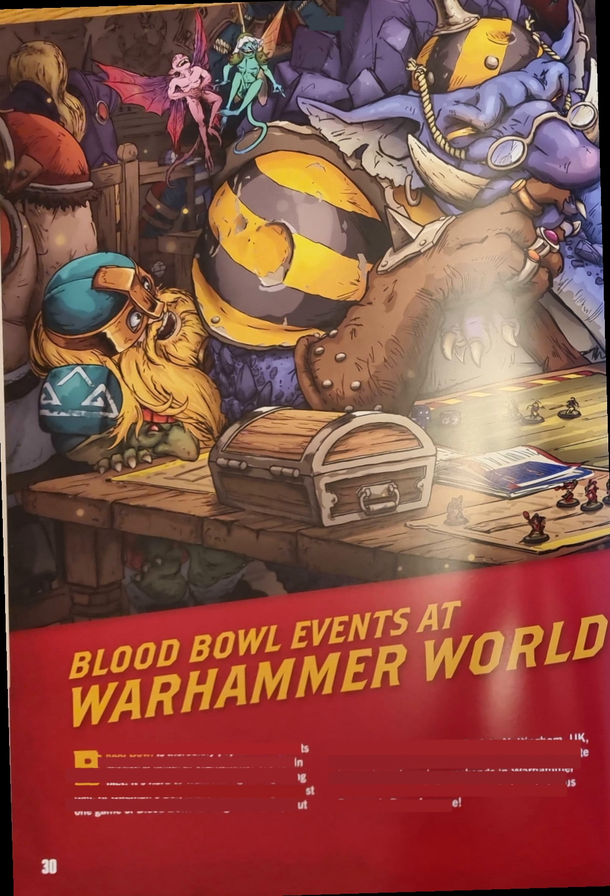

+--------+-----------------------------------------------------------+---+
|        | **lood Bowl is incredibly popular here, at its**        |   |
+========+===========================================================+===+
|        | **ancestral home of Warhammer World. In**               |   |
+--------+-----------------------------------------------------------+---+
|      |                                                           |   |
|  **A\* |                                                           |   |
|      |                                                           |   |
|  fact, |                                                           |   |
|      |                                                           |   |
|  it\'s |                                                           |   |
| hard |                                                           |   |
| to   |                                                           |   |
| walk |                                                           |   |
| t    |                                                           |   |
| hrough |                                                           |   |
| the  |                                                           |   |
| ga   |                                                           |   |
| ming** |                                                           |   |
+--------+-----------------------------------------------------------+---+
| *    |                                                           |   |
| *hall, |                                                           |   |
| or   |                                                           |   |
| Bug  |                                                           |   |
| man\'s |                                                           |   |
| Bar, |                                                           |   |
| w    |                                                           |   |
| ithout |                                                           |   |
| witn |                                                           |   |
| essing |                                                           |   |
| at   |                                                           |   |
| l    |                                                           |   |
| east** |                                                           |   |
+--------+-----------------------------------------------------------+---+
| **one  |                                                           |   |
| game   |                                                           |   |
| of     |                                                           |   |
| Blood  |                                                           |   |
| Bowl   |                                                           |   |
| l      |                                                           |   |
| ucking |                                                           |   |
| off!   |                                                           |   |
| Throug |                                                           |   |
| hout** |                                                           |   |
+--------+-----------------------------------------------------------+---+

\* .it.

+------------------------------------------------------------------+---+
| **the year, excited coaches flock to Nottingham, UK,**         |   |
+==================================================================+===+
| **from all corners of the world in order to participate**        |   |
+------------------------------------------------------------------+---+
| **in events and gaming weekends in Warhammer**                   |   |
+------------------------------------------------------------------+---+
| **World s hallowed halls - and visit the illustrious**         |   |
+------------------------------------------------------------------+---+

**Bugman\'s Bar, of course!**

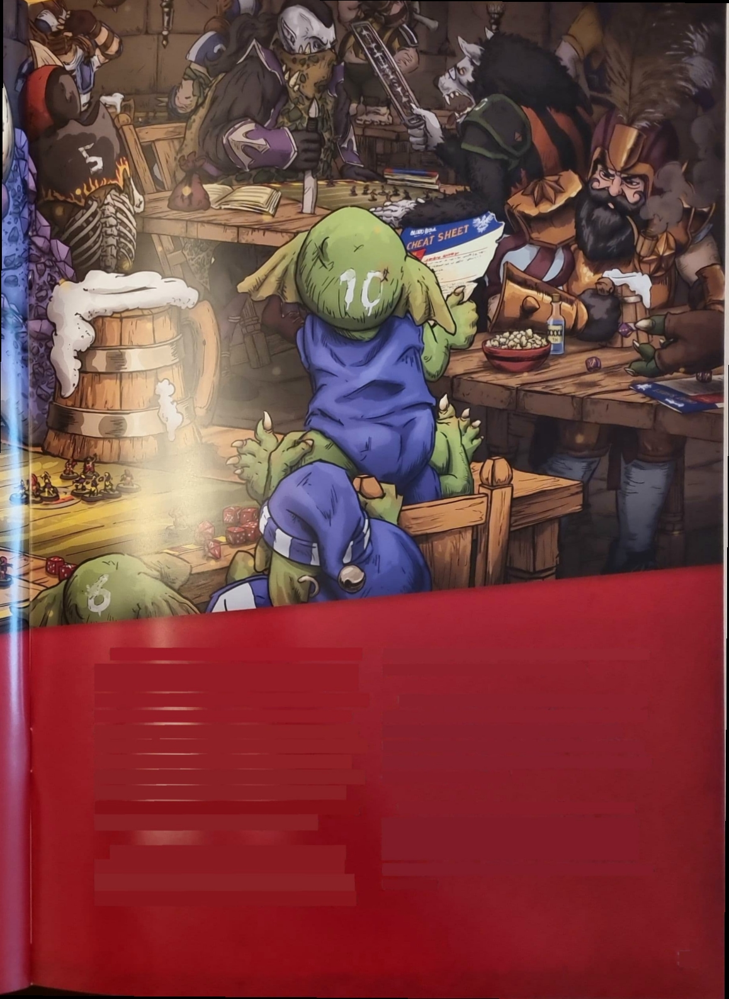

+---+-----------------------------------------------------+------+---+---+---+
|   |                                                     |      |   |   |   |
+---+-----------------------------------------------------+------+---+---+---+
|   |                                                     |      |   |   |   |
+---+-----------------------------------------------------+------+---+---+---+
|   |                                                     |      |   |   |   |
+---+-----------------------------------------------------+------+---+---+---+
|   | 1 All of these events serve as a                  |      |   |   |   |
+---+-----------------------------------------------------+------+---+---+---+
| b |                                                     |      | |   |   |
| e |                                                     |      |   |   |   |
| a |                                                     |      | f |   |   |
| c |                                                     |      | a |   |   |
| o |                                                     |      | i |   |   |
| n |                                                     |      | r |   |   |
| t |                                                     |      |   |   |   |
| o |                                                     |      |   |   |   |
| a |                                                     |      |   |   |   |
| l |                                                     |      |   |   |   |
| l |                                                     |      |   |   |   |
| f |                                                     |      |   |   |   |
| a |                                                     |      |   |   |   |
| n |                                                     |      |   |   |   |
| s |                                                     |      |   |   |   |
| o |                                                     |      |   |   |   |
| f |                                                     |      |   |   |   |
| M |                                                     |      |   |   |   |
| u |                                                     |      |   |   |   |
| f |                                                     |      |   |   |   |
| f |                                                     |      |   |   |   |
| l |                                                     |      |   |   |   |
| e |                                                     |      |   |   |   |
| \ |                                                     |      |   |   |   |
| ' |                                                     |      |   |   |   |
| s |                                                     |      |   |   |   |
| g |                                                     |      |   |   |   |
| r |                                                     |      |   |   |   |
| e |                                                     |      |   |   |   |
| a |                                                     |      |   |   |   |
| t |                                                     |      |   |   |   |
| g |                                                     |      |   |   |   |
| a |                                                     |      |   |   |   |
| m |                                                     |      |   |   |   |
| e |                                                     |      |   |   |   |
| a |                                                     |      |   |   |   |
| n |                                                     |      |   |   |   |
| d |                                                     |      |   |   |   |
| p |                                                     |      |   |   |   |
| r |                                                     |      |   |   |   |
| o |                                                     |      |   |   |   |
| m |                                                     |      |   |   |   |
| o |                                                     |      |   |   |   |
| t |                                                     |      |   |   |   |
| e |                                                     |      |   |   |   |
+---+-----------------------------------------------------+------+---+---+---+
| |                                                     |      |   |   |   |
|   |                                                     |      |   |   |   |
| p |                                                     |      |   |   |   |
| l |                                                     |      |   |   |   |
| a |                                                     |      |   |   |   |
| y |                                                     |      |   |   |   |
| , |                                                     |      |   |   |   |
| |                                                     |      |   |   |   |
|   |                                                     |      |   |   |   |
| f |                                                     |      |   |   |   |
| u |                                                     |      |   |   |   |
| n |                                                     |      |   |   |   |
| |                                                     |      |   |   |   |
|   |                                                     |      |   |   |   |
| a |                                                     |      |   |   |   |
| n |                                                     |      |   |   |   |
| d |                                                     |      |   |   |   |
| |                                                     |      |   |   |   |
|   |                                                     |      |   |   |   |
| g |                                                     |      |   |   |   |
| r |                                                     |      |   |   |   |
| e |                                                     |      |   |   |   |
| a |                                                     |      |   |   |   |
| t |                                                     |      |   |   |   |
| |                                                     |      |   |   |   |
|   |                                                     |      |   |   |   |
| s |                                                     |      |   |   |   |
| p |                                                     |      |   |   |   |
| o |                                                     |      |   |   |   |
| r |                                                     |      |   |   |   |
| t |                                                     |      |   |   |   |
| s |                                                     |      |   |   |   |
| m |                                                     |      |   |   |   |
| a |                                                     |      |   |   |   |
| n |                                                     |      |   |   |   |
| s |                                                     |      |   |   |   |
| h |                                                     |      |   |   |   |
| i |                                                     |      |   |   |   |
| p |                                                     |      |   |   |   |
| |                                                     |      |   |   |   |
|   |                                                     |      |   |   |   |
| a |                                                     |      |   |   |   |
| b |                                                     |      |   |   |   |
| o |                                                     |      |   |   |   |
| v |                                                     |      |   |   |   |
| e |                                                     |      |   |   |   |
| |                                                     |      |   |   |   |
|   |                                                     |      |   |   |   |
| a |                                                     |      |   |   |   |
| l |                                                     |      |   |   |   |
| l |                                                     |      |   |   |   |
| |                                                     |      |   |   |   |
|   |                                                     |      |   |   |   |
| e |                                                     |      |   |   |   |
| l |                                                     |      |   |   |   |
| s |                                                     |      |   |   |   |
| e |                                                     |      |   |   |   |
| : |                                                     |      |   |   |   |
| |                                                     |      |   |   |   |
|   |                                                     |      |   |   |   |
| w |                                                     |      |   |   |   |
| e |                                                     |      |   |   |   |
| l |                                                     |      |   |   |   |
| l |                                                     |      |   |   |   |
| , |                                                     |      |   |   |   |
+---+-----------------------------------------------------+------+---+---+---+
| o |                                                     |      |   |   |   |
| f |                                                     |      |   |   |   |
| f |                                                     |      |   |   |   |
| t |                                                     |      |   |   |   |
| h |                                                     |      |   |   |   |
| e |                                                     |      |   |   |   |
| p |                                                     |      |   |   |   |
| i |                                                     |      |   |   |   |
| t |                                                     |      |   |   |   |
| c |                                                     |      |   |   |   |
| h |                                                     |      |   |   |   |
| , |                                                     |      |   |   |   |
| o |                                                     |      |   |   |   |
| f |                                                     |      |   |   |   |
| c |                                                     |      |   |   |   |
| o |                                                     |      |   |   |   |
| u |                                                     |      |   |   |   |
| r |                                                     |      |   |   |   |
| s |                                                     |      |   |   |   |
| e |                                                     |      |   |   |   |
|   |                                                     |      |   |   |   |
| - |                                                     |      |   |   |   |
| w |                                                     |      |   |   |   |
| e |                                                     |      |   |   |   |
| ' |                                                     |      |   |   |   |
| r |                                                     |      |   |   |   |
| e |                                                     |      |   |   |   |
| c |                                                     |      |   |   |   |
| e |                                                     |      |   |   |   |
| r |                                                     |      |   |   |   |
| t |                                                     |      |   |   |   |
| a |                                                     |      |   |   |   |
| i |                                                     |      |   |   |   |
| n |                                                     |      |   |   |   |
| l |                                                     |      |   |   |   |
| y |                                                     |      |   |   |   |
| n |                                                     |      |   |   |   |
| o |                                                     |      |   |   |   |
| t |                                                     |      |   |   |   |
| g |                                                     |      |   |   |   |
| o |                                                     |      |   |   |   |
| i |                                                     |      |   |   |   |
| n |                                                     |      |   |   |   |
| g |                                                     |      |   |   |   |
| t |                                                     |      |   |   |   |
| o |                                                     |      |   |   |   |
| s |                                                     |      |   |   |   |
| t |                                                     |      |   |   |   |
| o |                                                     |      |   |   |   |
| p |                                                     |      |   |   |   |
+---+-----------------------------------------------------+------+---+---+---+
| a |                                                     |      |   |   |   |
| n |                                                     |      |   |   |   |
| y |                                                     |      |   |   |   |
| r |                                                     |      |   |   |   |
| a |                                                     |      |   |   |   |
| m |                                                     |      |   |   |   |
| b |                                                     |      |   |   |   |
| u |                                                     |      |   |   |   |
| n |                                                     |      |   |   |   |
| c |                                                     |      |   |   |   |
| t |                                                     |      |   |   |   |
| i |                                                     |      |   |   |   |
| o |                                                     |      |   |   |   |
| u |                                                     |      |   |   |   |
| s |                                                     |      |   |   |   |
| t |                                                     |      |   |   |   |
| e |                                                     |      |   |   |   |
| a |                                                     |      |   |   |   |
| m |                                                     |      |   |   |   |
| s |                                                     |      |   |   |   |
| f |                                                     |      |   |   |   |
| r |                                                     |      |   |   |   |
| o |                                                     |      |   |   |   |
| m |                                                     |      |   |   |   |
| s |                                                     |      |   |   |   |
| t |                                                     |      |   |   |   |
| i |                                                     |      |   |   |   |
| c |                                                     |      |   |   |   |
| k |                                                     |      |   |   |   |
| i |                                                     |      |   |   |   |
| n |                                                     |      |   |   |   |
| g |                                                     |      |   |   |   |
| t |                                                     |      |   |   |   |
| h |                                                     |      |   |   |   |
| e |                                                     |      |   |   |   |
| b |                                                     |      |   |   |   |
| o |                                                     |      |   |   |   |
| o |                                                     |      |   |   |   |
| t |                                                     |      |   |   |   |
| i |                                                     |      |   |   |   |
| n |                                                     |      |   |   |   |
| , |                                                     |      |   |   |   |
| o |                                                     |      |   |   |   |
| r |                                                     |      |   |   |   |
+---+-----------------------------------------------------+------+---+---+---+
| |                                                     |      |   |   |   |
|   |                                                     |      |   |   |   |
| p |                                                     |      |   |   |   |
| r |                                                     |      |   |   |   |
| e |                                                     |      |   |   |   |
| v |                                                     |      |   |   |   |
| e |                                                     |      |   |   |   |
| n |                                                     |      |   |   |   |
| t |                                                     |      |   |   |   |
| |                                                     |      |   |   |   |
|   |                                                     |      |   |   |   |
| a |                                                     |      |   |   |   |
| |                                                     |      |   |   |   |
|   |                                                     |      |   |   |   |
| G |                                                     |      |   |   |   |
| o |                                                     |      |   |   |   |
| b |                                                     |      |   |   |   |
| l |                                                     |      |   |   |   |
| i |                                                     |      |   |   |   |
| n |                                                     |      |   |   |   |
| |                                                     |      |   |   |   |
|   |                                                     |      |   |   |   |
| w |                                                     |      |   |   |   |
| i |                                                     |      |   |   |   |
| t |                                                     |      |   |   |   |
| h |                                                     |      |   |   |   |
| |                                                     |      |   |   |   |
|   |                                                     |      |   |   |   |
| a |                                                     |      |   |   |   |
| |                                                     |      |   |   |   |
|   |                                                     |      |   |   |   |
| S |                                                     |      |   |   |   |
| e |                                                     |      |   |   |   |
| c |                                                     |      |   |   |   |
| r |                                                     |      |   |   |   |
| e |                                                     |      |   |   |   |
| t |                                                     |      |   |   |   |
| |                                                     |      |   |   |   |
|   |                                                     |      |   |   |   |
| W |                                                     |      |   |   |   |
| e |                                                     |      |   |   |   |
| a |                                                     |      |   |   |   |
| p |                                                     |      |   |   |   |
| o |                                                     |      |   |   |   |
| n |                                                     |      |   |   |   |
| |                                                     |      |   |   |   |
|   |                                                     |      |   |   |   |
| f |                                                     |      |   |   |   |
| r |                                                     |      |   |   |   |
| o |                                                     |      |   |   |   |
| m |                                                     |      |   |   |   |
| |                                                     |      |   |   |   |
|   |                                                     |      |   |   |   |
| u |                                                     |      |   |   |   |
| n |                                                     |      |   |   |   |
| l |                                                     |      |   |   |   |
| e |                                                     |      |   |   |   |
| a |                                                     |      |   |   |   |
| s |                                                     |      |   |   |   |
| h |                                                     |      |   |   |   |
| i |                                                     |      |   |   |   |
| n |                                                     |      |   |   |   |
| g |                                                     |      |   |   |   |
+---+-----------------------------------------------------+------+---+---+---+
| |                                                     |      |   |   |   |
|   |                                                     |      |   |   |   |
| t |                                                     |      |   |   |   |
| h |                                                     |      |   |   |   |
| e |                                                     |      |   |   |   |
| i |                                                     |      |   |   |   |
| r |                                                     |      |   |   |   |
| |                                                     |      |   |   |   |
|   |                                                     |      |   |   |   |
| f |                                                     |      |   |   |   |
| u |                                                     |      |   |   |   |
| l |                                                     |      |   |   |   |
| l |                                                     |      |   |   |   |
| |                                                     |      |   |   |   |
|   |                                                     |      |   |   |   |
| p |                                                     |      |   |   |   |
| o |                                                     |      |   |   |   |
| t |                                                     |      |   |   |   |
| e |                                                     |      |   |   |   |
| n |                                                     |      |   |   |   |
| t |                                                     |      |   |   |   |
| i |                                                     |      |   |   |   |
| a |                                                     |      |   |   |   |
| l |                                                     |      |   |   |   |
| |                                                     |      |   |   |   |
|   |                                                     |      |   |   |   |
| u |                                                     |      |   |   |   |
| p |                                                     |      |   |   |   |
| o |                                                     |      |   |   |   |
| n |                                                     |      |   |   |   |
| |                                                     |      |   |   |   |
|   |                                                     |      |   |   |   |
| a |                                                     |      |   |   |   |
| n |                                                     |      |   |   |   |
| |                                                     |      |   |   |   |
|   |                                                     |      |   |   |   |
| u |                                                     |      |   |   |   |
| n |                                                     |      |   |   |   |
| w |                                                     |      |   |   |   |
| i |                                                     |      |   |   |   |
| t |                                                     |      |   |   |   |
| t |                                                     |      |   |   |   |
| i |                                                     |      |   |   |   |
| n |                                                     |      |   |   |   |
| g |                                                     |      |   |   |   |
| |                                                     |      |   |   |   |
|   |                                                     |      |   |   |   |
| o |                                                     |      |   |   |   |
| p |                                                     |      |   |   |   |
| p |                                                     |      |   |   |   |
| o |                                                     |      |   |   |   |
| n |                                                     |      |   |   |   |
| e |                                                     |      |   |   |   |
| n |                                                     |      |   |   |   |
| t |                                                     |      |   |   |   |
| ! |                                                     |      |   |   |   |
+---+-----------------------------------------------------+------+---+---+---+

+---+----------------------------------------------------------------+---+
|   | Of course, any Blood Bowl events that are held at            |   |
+===+================================================================+===+
| |                                                                |   |
|   |                                                                |   |
| W |                                                                |   |
| a |                                                                |   |
| r |                                                                |   |
| h |                                                                |   |
| a |                                                                |   |
| m |                                                                |   |
| m |                                                                |   |
| e |                                                                |   |
| r |                                                                |   |
| |                                                                |   |
|   |                                                                |   |
| W |                                                                |   |
| o |                                                                |   |
| r |                                                                |   |
| l |                                                                |   |
| d |                                                                |   |
| |                                                                |   |
|   |                                                                |   |
| w |                                                                |   |
| i |                                                                |   |
| l |                                                                |   |
| l |                                                                |   |
| |                                                                |   |
|   |                                                                |   |
| u |                                                                |   |
| s |                                                                |   |
| e |                                                                |   |
| |                                                                |   |
|   |                                                                |   |
| t |                                                                |   |
| h |                                                                |   |
| e |                                                                |   |
| |                                                                |   |
|   |                                                                |   |
| * |                                                                |   |
| B |                                                                |   |
| l |                                                                |   |
| o |                                                                |   |
| o |                                                                |   |
| d |                                                                |   |
| |                                                                |   |
|   |                                                                |   |
| B |                                                                |   |
| o |                                                                |   |
| w |                                                                |   |
| l |                                                                |   |
| |                                                                |   |
|   |                                                                |   |
| M |                                                                |   |
| a |                                                                |   |
| t |                                                                |   |
| c |                                                                |   |
| h |                                                                |   |
| e |                                                                |   |
| d |                                                                |   |
| * |                                                                |   |
+---+----------------------------------------------------------------+---+
| * |                                                                |   |
| P |                                                                |   |
| l |                                                                |   |
| a |                                                                |   |
| y |                                                                |   |
| G |                                                                |   |
| u |                                                                |   |
| i |                                                                |   |
| d |                                                                |   |
| e |                                                                |   |
| * |                                                                |   |
| a |                                                                |   |
| s |                                                                |   |
| a |                                                                |   |
| b |                                                                |   |
| a |                                                                |   |
| s |                                                                |   |
| i |                                                                |   |
| s |                                                                |   |
| f |                                                                |   |
| o |                                                                |   |
| r |                                                                |   |
| t |                                                                |   |
| h |                                                                |   |
| e |                                                                |   |
| i |                                                                |   |
| r |                                                                |   |
| r |                                                                |   |
| u |                                                                |   |
| l |                                                                |   |
| e |                                                                |   |
| s |                                                                |   |
| p |                                                                |   |
| a |                                                                |   |
| c |                                                                |   |
| k |                                                                |   |
| , |                                                                |   |
| e |                                                                |   |
| n |                                                                |   |
| s |                                                                |   |
| u |                                                                |   |
| r |                                                                |   |
| i |                                                                |   |
| n |                                                                |   |
| g |                                                                |   |
| t |                                                                |   |
| h |                                                                |   |
| a |                                                                |   |
| t |                                                                |   |
+---+----------------------------------------------------------------+---+
| |                                                                |   |
|   |                                                                |   |
| a |                                                                |   |
| n |                                                                |   |
| y |                                                                |   |
| |                                                                |   |
|   |                                                                |   |
| c |                                                                |   |
| o |                                                                |   |
| a |                                                                |   |
| c |                                                                |   |
| h |                                                                |   |
| e |                                                                |   |
| s |                                                                |   |
| |                                                                |   |
|   |                                                                |   |
| p |                                                                |   |
| l |                                                                |   |
| a |                                                                |   |
| n |                                                                |   |
| n |                                                                |   |
| i |                                                                |   |
| n |                                                                |   |
| g |                                                                |   |
| |                                                                |   |
|   |                                                                |   |
| t |                                                                |   |
| o |                                                                |   |
| |                                                                |   |
|   |                                                                |   |
| a |                                                                |   |
| t |                                                                |   |
| t |                                                                |   |
| e |                                                                |   |
| n |                                                                |   |
| d |                                                                |   |
| |                                                                |   |
|   |                                                                |   |
| o |                                                                |   |
| n |                                                                |   |
| e |                                                                |   |
| |                                                                |   |
|   |                                                                |   |
| o |                                                                |   |
| f |                                                                |   |
| |                                                                |   |
|   |                                                                |   |
| t |                                                                |   |
| h |                                                                |   |
| e |                                                                |   |
| s |                                                                |   |
| e |                                                                |   |
| |                                                                |   |
|   |                                                                |   |
| e |                                                                |   |
| v |                                                                |   |
| e |                                                                |   |
| n |                                                                |   |
| t |                                                                |   |
| s |                                                                |   |
| |                                                                |   |
|   |                                                                |   |
| w |                                                                |   |
| i |                                                                |   |
| l |                                                                |   |
| l |                                                                |   |
+---+----------------------------------------------------------------+---+

know what they can expect in plenty of time - perfect for getting
those last-minute practice games in!

+---+-----------------------------------------------------------+-----+
|   | Players attending an event at Warhammer World also      |     |
+===+===========================================================+=====+
| |                                                           |     |
|   |                                                           |     |
| g |                                                           |     |
| e |                                                           |     |
| t |                                                           |     |
| |                                                           |     |
|   |                                                           |     |
| t |                                                           |     |
| o |                                                           |     |
| |                                                           |     |
|   |                                                           |     |
| e |                                                           |     |
| x |                                                           |     |
| p |                                                           |     |
| e |                                                           |     |
| r |                                                           |     |
| i |                                                           |     |
| e |                                                           |     |
| n |                                                           |     |
| c |                                                           |     |
| e |                                                           |     |
| |                                                           |     |
|   |                                                           |     |
| t |                                                           |     |
| h |                                                           |     |
| e |                                                           |     |
| |                                                           |     |
|   |                                                           |     |
| w |                                                           |     |
| o |                                                           |     |
| r |                                                           |     |
| l |                                                           |     |
| d |                                                           |     |
| |                                                           |     |
|   |                                                           |     |
| f |                                                           |     |
| a |                                                           |     |
| m |                                                           |     |
| o |                                                           |     |
| u |                                                           |     |
| s |                                                           |     |
| |                                                           |     |
|   |                                                           |     |
| B |                                                           |     |
| u |                                                           |     |
| g |                                                           |     |
| m |                                                           |     |
| a |                                                           |     |
| n |                                                           |     |
| \ |                                                           |     |
| ' |                                                           |     |
| s |                                                           |     |
| |                                                           |     |
|   |                                                           |     |
| B |                                                           |     |
| a |                                                           |     |
| r |                                                           |     |
| , |                                                           |     |
| |                                                           |     |
|   |                                                           |     |
| w |                                                           |     |
| h |                                                           |     |
| i |                                                           |     |
| c |                                                           |     |
| h |                                                           |     |
+---+-----------------------------------------------------------+-----+
| |                                                           |     |
|   |                                                           |     |
| s |                                                           |     |
| e |                                                           |     |
| r |                                                           |     |
| v |                                                           |     |
| e |                                                           |     |
| s |                                                           |     |
| |                                                           |     |
|   |                                                           |     |
| a |                                                           |     |
| l |                                                           |     |
| l |                                                           |     |
| |                                                           |     |
|   |                                                           |     |
| m |                                                           |     |
| a |                                                           |     |
| n |                                                           |     |
| n |                                                           |     |
| e |                                                           |     |
| r |                                                           |     |
| |                                                           |     |
|   |                                                           |     |
| o |                                                           |     |
| f |                                                           |     |
| |                                                           |     |
|   |                                                           |     |
| t |                                                           |     |
| a |                                                           |     |
| s |                                                           |     |
| t |                                                           |     |
| y |                                                           |     |
| |                                                           |     |
|   |                                                           |     |
| f |                                                           |     |
| a |                                                           |     |
| r |                                                           |     |
| e |                                                           |     |
| |                                                           |     |
|   |                                                           |     |
| a |                                                           |     |
| n |                                                           |     |
| d |                                                           |     |
| |                                                           |     |
|   |                                                           |     |
| t |                                                           |     |
| h |                                                           |     |
| i |                                                           |     |
| r |                                                           |     |
| s |                                                           |     |
| t |                                                           |     |
| - |                                                           |     |
| q |                                                           |     |
| u |                                                           |     |
| e |                                                           |     |
| n |                                                           |     |
| c |                                                           |     |
| h |                                                           |     |
| i |                                                           |     |
| n |                                                           |     |
| g |                                                           |     |
+---+-----------------------------------------------------------+-----+

beverages (including the wonderful Bugman's XXXXXX!)

+---------------------------------+------------------------------------+
| throughout the day with         |                                    |
| plentiful portions that will    |                                    |
| satisfy                         |                                    |
+=================================+====================================+
| even the hungriest of Trolls! |                                    |
+---------------------------------+------------------------------------+

Details of upcoming Warhammer World events can

+------------------------------------------------------------------+---+
| be found over at warhammer-community.com, so keep              |   |
|                                                                  |   |
| your eyes peeled and make sure you don't miss out on these       |   |
| classic gaming events, and a chance to test your                 |   |
+==================================================================+===+
| mettle against some of the very best coaches in the Blood      |   |
+------------------------------------------------------------------+---+

Bowl world!
>
**31**

V
>
**PRODIGIES**

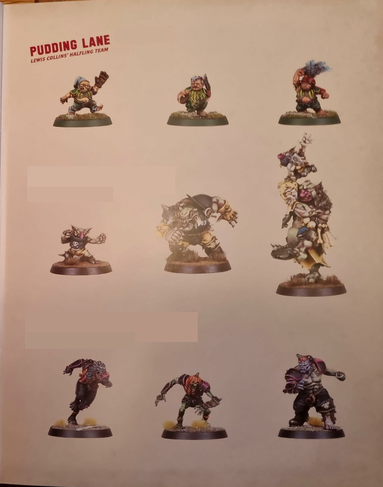

+-----------------------------------------+----------------------------+
|                                         | **MORTULZ**              |
+=========================================+============================+
| **DA BLACK CRAG**                       |                            |
+-----------------------------------------+----------------------------+
| ***ALASTAIR REID S BLACK ORC TEAM***  |                            |
+-----------------------------------------+----------------------------+

+---------------------------------------------+------------------------+
|                                             | **RBEATERS**           |
+=============================================+========================+
| **CORPSE CART CUCU**                        |                        |
+---------------------------------------------+------------------------+
| ***LUKE BUCK S NECROMANTIC HORROR TEAM*** |                        |
+---------------------------------------------+------------------------+

