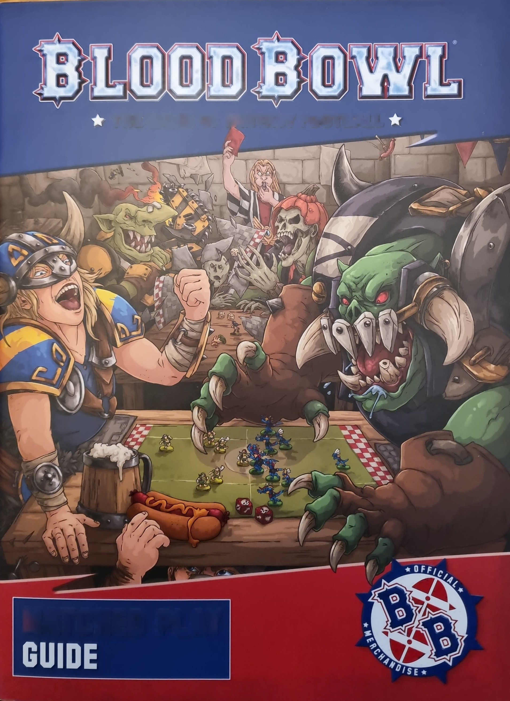

*[low\*\*!\*]*

[quetz\^]

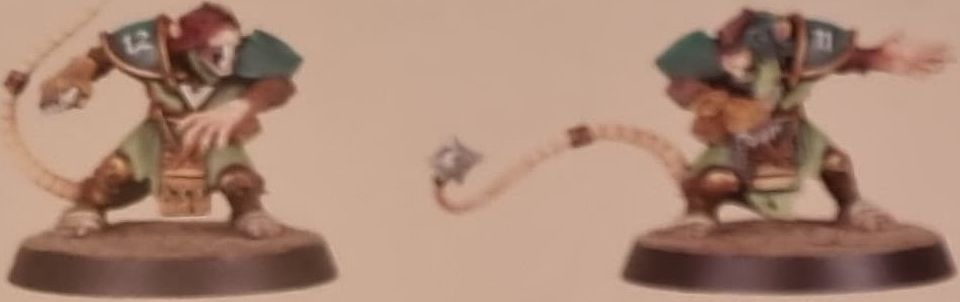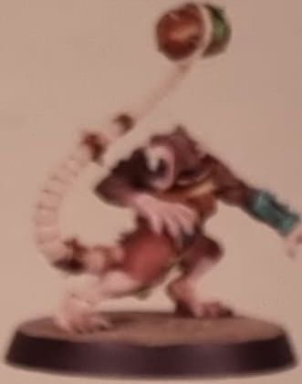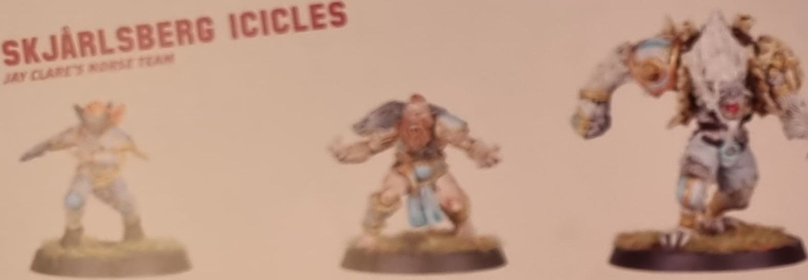

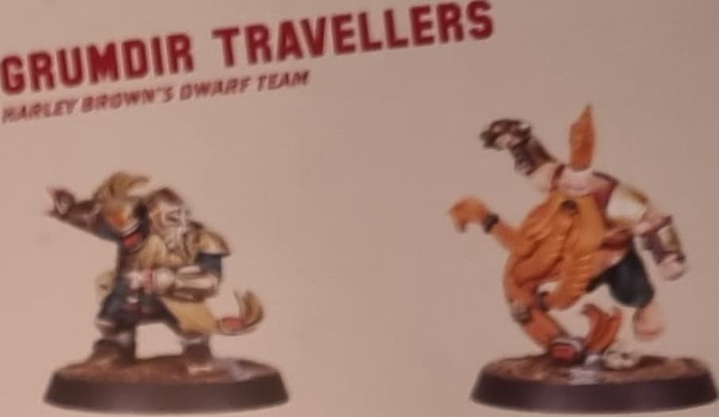

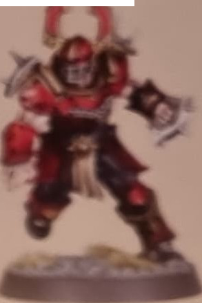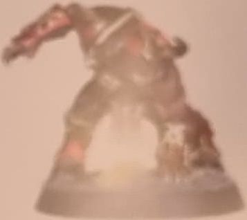

Foreword from Jim & Bob 3

[Introduction 4](#bookmark2)

Code of Conduct 5

Recommended Tournament Style\....6

[Tournament Rules 7](#bookmark8)

[Scoring & Tiebreakers 8](#bookmark16)

[Pairings 9](#bookmark22)

Group & Knockout Events 22

Knockout Table Wallchart 23

[Additional Rules 24](#bookmark54)

Blood Bowl Events at Warhammer World 30

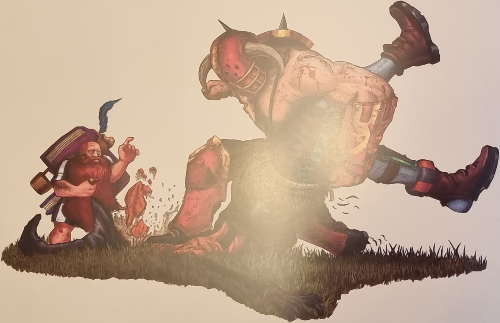

*Blood Bowl Matched Play Guide ©* Copyright Games Workshop Limited 2022.
Blood Bowl, Blood Bowl The Game of Fantasy Football,\
*Spike! The Fantasy Football Journal,* Dungeon Bowl, Citadel, Games
Workshop, GW, Warhammer, the 'winged-hammer\* Warhammer logo,\
and all associated logos, names, races, vehicles, weapons and characters
are either

® or TM and/or © Games Workshop Limited. All Rights Reserved.

No part of this publication may be reproduced, stored in a retrieval
system, or transmitted in any form or by any means\
electronic, mechanical, photocopying, recording or otherwise, without
the prior permission of the publishers.

This is a work of fiction. All the characters and events portrayed in
this book are fictional,\
and any resemblance to real people or incidents is purely coincidental.

British Cataloguing-in-Publicatlon Data. A catalogue record for this
book is available from the British Library.

Games Workshop Web site: [www.warhammer.com

Forge World Web site:
[www.forgeworld.co.uk](http://www.forgeworld.co.uk)

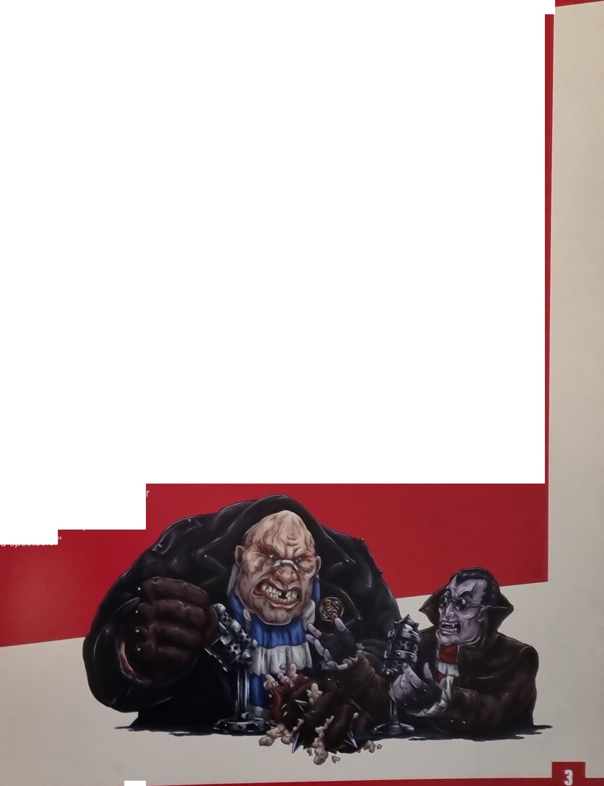

\"Right you are, Bob! Competitions are the very lifeblood of the
game; pitting teams against one another as they strive to knock each
other out to progress, with the last team \^standing lifting the
glittering trophy the end.\"

**I** \"We don't have time for all that, Bob! Anyway, the *Blood Bowl
Matched Play Guide* is the ideal resource for any organisation or
philanthropist across the known world to hold their own event, providing
the rules and regulations that are required to run such a
spectacle.\"

\"So, you are still going, Bob. Right, well, I guess I'll just continue
then. Of course, Blood Bowl tournaments are wildly popular, and no two
events are the same - though each will still possess the same
exceptional levels of exquisite violence, of course! This guide also
serves as the ideal fan

companion for those of you who want to understand a bit more about
tournaments, what thrilling sights you can expect to see on the pitch,
and what rules the teams should be abiding by - even if most teams try
to break as many as possible! Right, let's see if Bob has quite
finished.\"

[]***iNTRODUCTfON***

**W**][**elcome, sports fans, to the *Blood
Bowl Matched Play Guide\'.* In the world of Blood Bowl, tournaments are
a common occurrence; numerous teams jockeying for position and giving
blood, sweat and tears (but mainly blood!) in order to lift the
glittering trophy at the end and earn the right to be called champions.
Of course, this is much the same for us too (without the violence!) as
there are countless tournaments and gaming weekends held worldwide where
coaches come together in a duel of wits on the
gridiron!**

**CODE OF CONDUCT**

Tournaments and gaming weekends should beTfirstand^-^ foremost, fun.
The Code of Conduct presented in this guide is something we expect all
coaches to follow at all times to ensure that they and their opponents
always have the best time possible.

[recommended;\^\^]

Here, we present our recommended way for running tournaments,
including: what roles and responsibilities are required; how coaches
score Tournament Points;

Tiebreakers; pairing opponents; and more.

B][lood Bowl has always thrived in a Matched
Play setting, as the sports-like feel of the game lends itself to being
played in this way. As a result, coaches and league commissioners have
been running their own tournaments and gaming weekends around the globe
for many years, and they have proved to be incredibly popular. This
guide is designed to help coaches organise their own Matched Play events
by providing a framework for them to run their tournaments with,
including: what roles and responsibilities an event will require; a code
of conduct; how coaches will need to build their rosters; plus
alternative event formats and

**[ROSTER AND RESULTS SHEETS
\~]**

We have also provided a roster sheet and results sheet that Event
Organisers have permission to photocopy and hand out for each coach to
fill in. This will make it easy for the Event Organiser to review i
coach's roster and keep track of the results of each
e.

**[ROSTER BUILDIN]**

This section runs throu he ste; of building a team roster specifically
for a h - iment, including: how many gold pieces a te as to spend; how
many skills a team can take and I\' o select them; Star Players;
Inducements; and anyn g else that will impact

optional special rules that Event Organisers can use
in

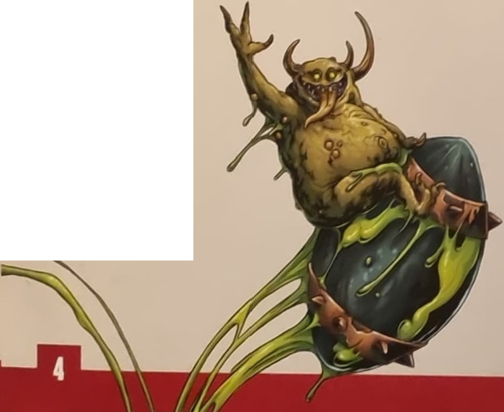

Organisers may wish to use instead of the
standard

tournament format, including team events and the ever- popular Stunty
Tournament!

**[ADDITIONAL RULES]**

Some Event Organisers like to add their own spin to the standard
format and we have presented here a number of different additional
rules that they can use to add that extra bit of panache to their
event; from injuries and player progression, to Gold Piece Escalation
(see page 28) and more.

**[CARDINAL RULES]**]

-   
-   

[Always be polite and respectful to your opponent at all times.Always
tell the truth and never cheat.**I [IMPORTANT
PRINCIPLES]**

I • Make a respectful gesture to your opponent before the game begins,
such as wishing them good luck, i offering a handshake,
etc.]

-   
-   
-   
-   
-   
-   
-   

[Avoid using language that your opponent or those around you may find
offensive.Arrive on time for your game with all of the things you need
to play.Offer your opponent the chance to examine your team roster
before the game begins.If your opponent has any questions or queries
about your roster, you should answer them truthfully and ensure your
opponent understands the answer.Ensure that your opponent is aware of
any Inducements, or other special rules your team has, and that they
know what they do.When counting out the number of squares a player is
moving, do so carefully and accurately. You should also allow your
opponent the opportunity to check any moves before you move any models
if they wish.When rolling dice, make sure they are clearly visible to
all players and allow your opponent to examine the rolls before
picking up the dice.^1^ Always ask your opponent\'s permission before
touching their models.

Remind your opponent about any rules they may have forgotten to use,
or they have used incorrectly, especially when doing so is to your
opponent\'s benefit rather than your own.

Never deliberately manipulate the amount of time a game takes in
order to gain an advantage, either by playing overly quickly or by
wasting time.

Try not to distract an opponent when they are trying to concentrate
and always ensure you respect their personal
space.

Never complain about your own bad luck or your opponent\'s good
luck.

Always be humble in victory and graceful in
defeat.

Never fix the outcome of a game for any
reason.

*[recommended tournament style]*

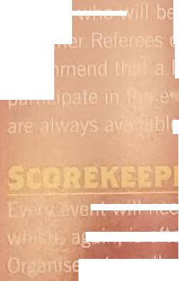

**ROLESAND**

[[responsibilities
\_]]

**D**epending on how formal you wish your event to be, it is often a
good idea to make sure everyone involved in the event is aware of what
their role is and the responsibilities that go alongside it. This is
important to ensure that everyone knows who to go to if there is an
issue; to make sure everything runs smoothly; and, above all. that
everyone has a good time playing some Blood
Bowl!

**[EVENT ORGANISER]**

Every event will need an Event Organiser, who will be responsible for
running all aspects of the tournament. It will be their job to think
about such things as gaming space and equipment for the coaches;
appointing any Referees and Spare Players that will be required; and
generally being accessible on the day to ensure that everything goes
according to plan - Nuffle permitting, of
course!

The Event Organiser is essentially in charge for the course of the
event, and all participants must accept that the Event Organiser has the
authority

to expel or disqualify anyone found breaking the rules of the event or
the Cardinal Rules of the Code of Conduct - although this should,
hopefully, never have to happen. It's also the Event Organiser\'s job to
check everyone\'s team rosters and to ensure that all miniatures adhere
to the rules for the event. The Event Organiser can also be the Referee
and/or Scorekeeper if they wish; though in larger events, it may be best
to share these responsibilities around. We recommend that the Event
Organiser does not participate in the actual tournament so that they are
always on hand to sort out any issues that may arise throughout the
day.

**[REFEREE] [■]**

Much like an actual game of Blood Bowl, every event needs a Referee -
though unlike in Blood Bowl, they should be listened to and never
bribed! In smaller events, the Event Organiser may also take on the role
of a Referee. At the start of any event, it is important to point out
any Referees to the coaches so they know who to contact if they have a
query. It is the Referee's job to observe the games as they
are

played; enforce the rules; answer any queries the coaches may have; and
settle any disputes between coaches in a calm and collected manner. The
Referee should have a good knowledge of the rules and easy access to the
*Blood Bowl Rulebook,* any supplements or *Spike! Journals* that are in
use at the event, and the latest version of the FAQ and Errata in case
of any rules queries.

A Referee's ruling is final as far as the event is concerned and all
players must agree to honour the rulings of the Referee in these
situations. At particularly large events, it is often sensible to have a
number of Referees. In this situation, it is also a good; idea to have a
Head

itlWed a Scorekeeper gain, is often the Event er at smaller events. It
is the jffiof the Scorekeeper to collect the results after each round,
from each game, and to rank the players. They will also be responsible
for organising the pairings fdr each round, including randomly pairing
opponents in the first round of the tournament. Again, we recommend that
the Scorekeeper does not participate so that they can collect every
result as quickly as possible.

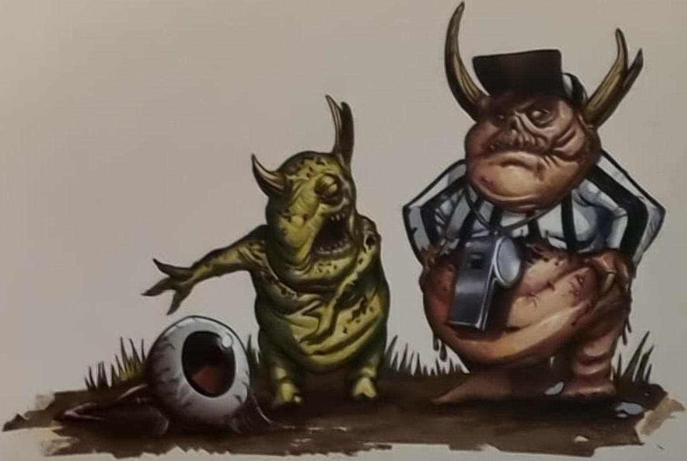

[]**TOURNAMENT RILLES**

**II games at a Blood Bowl tournament will use the *Blood Bowl
Rulebook,* any current supplements or *Spike! Journals,* and the most
recent versions of the FAQ, Errata and Tier List which can be found at
warhammer-community.com. All coaches are expected to abide by the
following rules:**

**[RULESPACK]**

The Event Organiser should provide a rulespack for the event, which
will have all the essential information for the event in it such as the
venue, what time the event starts, round timings, details about lunch
(something that is very important to Halfling coaches!) and any other
important information about the day.

It should also include the full details of what coaches can expect from
the tournament itself, such as: the budget of gold pieces coaches have
to spend on their team roster; which publications are in use for the
event; what Tiebreakers are being used; and if there are any additional
rules being used throughout the tournament.

**[MINIATURES]**

Coaches are expected to only use official Citadel and Forge World
miniatures at the event and all models must be fully built, based and
painted. Coaches must use appropriate miniatures for their team.
Conversions are permitted at the discretion of the Event Organiser, so
long as they only include parts from official Citadel and Forge World
miniatures and clearly represent what they are meant to be. You may wish
to ask for any coaches wishing to use conversions to submit them to the
Event Organiser before the event so they can check if they are happy
with them

**[CONDUCT]**

As mentioned earlier, Blood Bowl is first and foremost a game and one
that should be played in a friendly spirit; Nuffle wants to see good
sportsmanship from the coaches, even if the players on the pitch are
stomping the snot out of each other! This is especially true for
tournament games, where all coaches are expected to follow the Code of
Conduct at all times and treat other players, and those running the
event, with respect, including during any rules disputes or times when
the dice don\'t go their way.

[]**SCORING & \_
TIEBREAKERS**

**[GAMES]**

*For* tournament games, we recommend setting a time limit *of 2* hours
and 30 minutes. This should provide plenty of time to finish the game
and coaches are expected to play at a decent pace to ensure the game
reaches its natural conclusion. At the end of each game, coaches will
need to record the result. This includes.- who won, lost or drew; the
number of Bonus Points earned; the number of touchdowns each team
scored; and the number of casualties inflicted by each team. If the
coaches do not finish the game before the time runs out, then play
continues until the end of the current turn at which point the score at
that point will become the final result.

It is important that a coach records the number of Bonus Points they
earn in each game, on their result sheet, so that the correct
Tiebreakers can be input.

*For example: Jay beats Rob 3-1 and inflicts 2 casualties while Rob
inflicts 4. Jay would score 2 Tournament Points for winning the game,
while Rob would score 0. Jay would earn 1 Bonus Point as he scored 3 or
more touchdowns, while Rob would also earn 1 Bonus Point for inflicting
3 or more casualties onto Jay\'s team.*

If coaches are still tied, the second Tiebreaker is a coaches Touchdown
Difference, which is equal to the number of touchdowns they have scored
across all of their games minus the number of touchdowns they have
conceded across all of their games.

*For example, Jay has won three games with the scores being 2-0, 3-1
and 3-0, meaning he has a Touchdown Difference of +7. Dan has also won
three games with the scores being 1-0, 2-1 and 3-2, meaning he has a
Touchdown Difference of +3.*

*For* tournaments, coaches will earn a number of Tournament Points
depending on how they did in their games. Coaches will earn 2
Tournament Points for a win, 1 Tournament Point for a draw, and 0
Tournament Points for a loss.

It is important that both coaches provide all of the information,
including the final score and number of casualties inflicted by each
team, as it is all used for the Tiebreakers to determine where each
coach stands in the rankings.

**[RANKING]**

Coaches are ranked according to the number of Tournament Points they
have.- the more Tournament Points a coach has, the higher they are in
the rankings.

Where coaches are tied on the number of Tournament Points, there are a
number of Tiebreakers to be used to determine who is placed higher in
the rankings.

The first Tiebreaker is the number of Bonus Points a coach has earned.
Bonus Points are earned in each game for meeting the following
criteria:]

-   
-   
-   

[Scoring 3 or more touchdowns - 1 Bonus PointConceding 0 touchdowns -
1 Bonus PointInflicting 3 or more Casualties (counting only those that
would normally award Star Player Points) - 1 Bonus PointIf coaches are
still tied, the third Tiebreaker is the total number of touchdowns a
coach has scored across all their games, with the coach who has scored
the most being higher in the rankings.

If coaches are still tied, the foL\' breaker is the\
total number of casualties a coa\< h h inflicted across
all

their games, with the coach I Hicted the
most

being higher in the rankings

Further Tiebreakers are used at the Event Organiser\'s discretion. The
. mid be anything from Favourite Opponent scores, most players Sent-off
(not counting those Sent-off for the Secret Weapon trait), or anything
else the Event Organiser wishes,- however, they should make it clear to
all coaches which Tiebreakers will

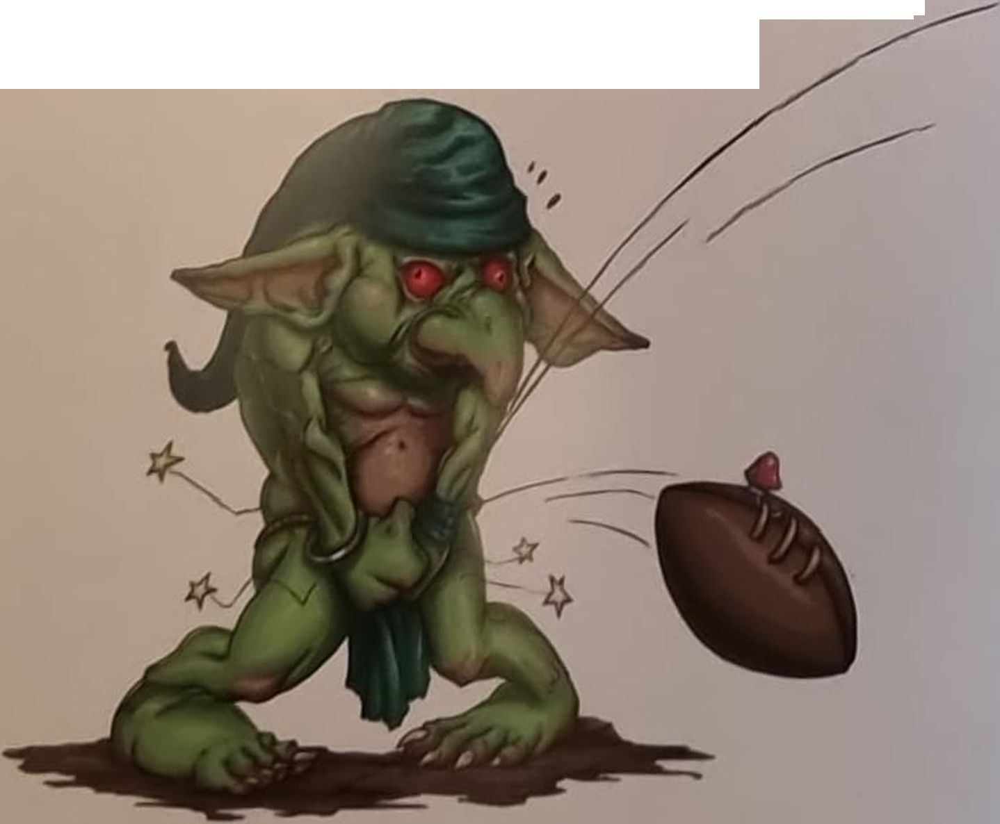

[]**PAIRINGS**

**Event Organisers are free to use any pairing system they wish, though
we would recommend using the system detailed in this guide when running
your own tournaments.**

**[ROUND I]**

For the first round, coaches are paired together randomly, using player
numbers generated upon registration. This could be done using a random
number generator, drawing names out of a hat, or any other method so
long as it is random. If there is an odd number of coaches then one
coach will be randomly paired with the Spare Player or given a
Bye.

**[SPARE PLAYER]**

If a coach is paired against the Spare Player, then they will play the
game as normal and record the result in the same way as they would for
any other game in the event. When working out the rankings for pairings
later on, ; Spare Player is not counted and instead will always the
coach who is at the bottom of the rankings •ch round. If a coach who has
already played the

Player is drawn against them again, then the next coach who has not
already played against the re Player will play them instead. We would
always commend that a tournament has a Spare Player, as it is far more
fun for your attendees than having a Bye.

**[BYE]**

Sometimes you may be unable to find a suitable Spare Player for your
event. In this case, the coach that would normally be paired with the
Spare Player (as described above) will instead receive a Bye. A Bye
counts as winning the game 2-0, with neither side inflicting any
casualties upon the other. This will award 2 Tournament Points and 1
Bonus Point for the purpose of Tiebreakers.

Should a player concede a game, their opponent will automatically
receive a 3-0 win (unless the score at the time of conceding was better)
and will receive the maximum number of Bonus Points available.
Additionally, the player who conceded will receive no Bonus Points
whatsoever and will also suffer a penalty of -1 Tournament
Point.

[[Subsequent rounds
\~]]

For subsequent rounds, coaches are paired as
follows.

The coach who is highest in the rankings will play the coach who is
second in the rankings, the coach in third will play the coach in
fourth, the coach In fifth will play the coach in sixth and so on until
all coaches are paired up. If a coach is supposed to play an opponent
they have already played, then the lowest ranked of the two will swap
places with the highest ranked player of the pairing below
them.

**I** *Jay*]

2.  
3.  
4.  
5.  
6.  
7.  
8.  

[*GavinKeithXavierNicolasDanLouiseRobFor example: Here, we can* see *the
draw for the next round of an event. Nicolas and Dan have already played
each other in a previous round and so cannot play again as this is not
the final round. As Dan is currently the lower ranked of the two
players, he will swap with the highest ranked player from the pairing
below - in this case, Louise.*

This system is used for all rounds after the first, including the final
round with one small adjustment. In the final round, if explicitly
stated in the rulespack, then the coaches in first and second will not
swap opponents if they draw each other again; the two are clearly
equally matched and will face off one last
time!

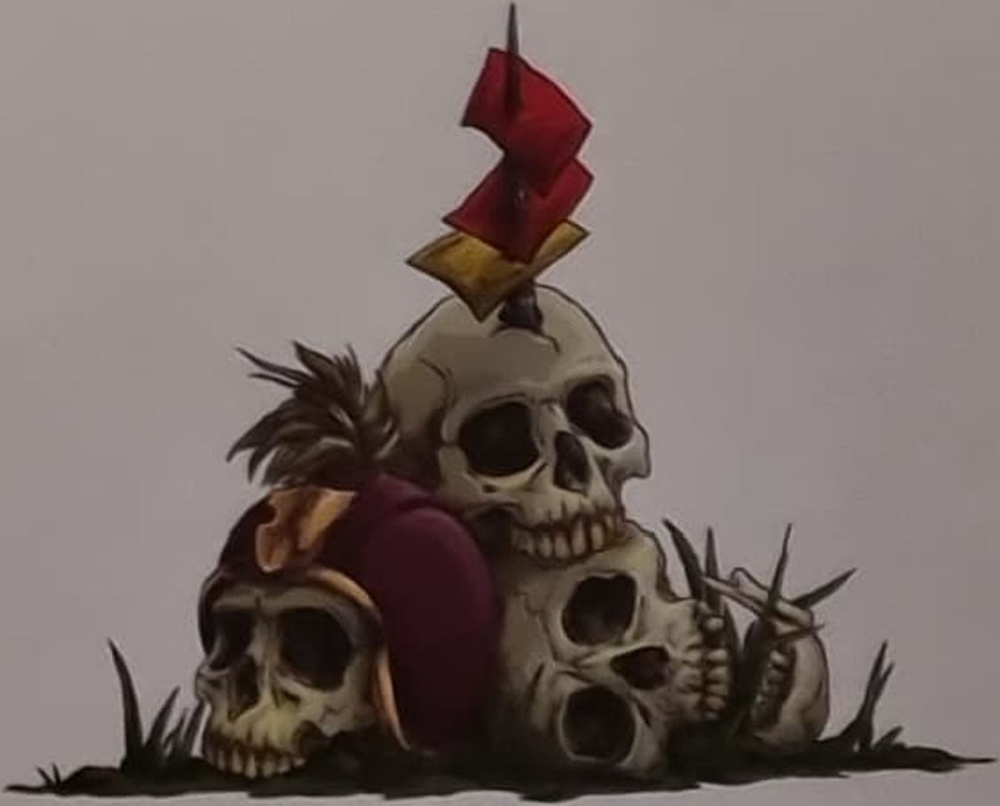

**[CONCEDING]**

Sometimes games just don\'t go your way. Your players are beaten up,
your apothecary is working overtime trying to patch everyone up and
the crowd is beginning to turn against you; yet still you carry on,
determined to scrape something out of the match! Even if your team is
losing, it is good sportsmanship to continue to play to the very end
of the game. Real-world sports teams don't quit the pitch when the
going gets tough, and neither should Blood Bowl
teams!

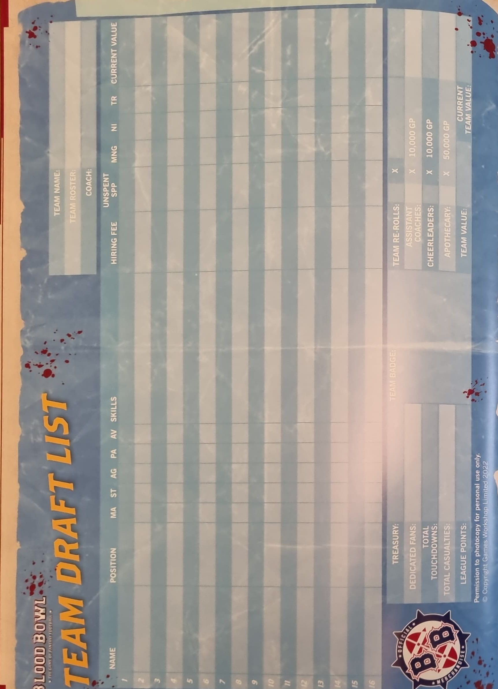\

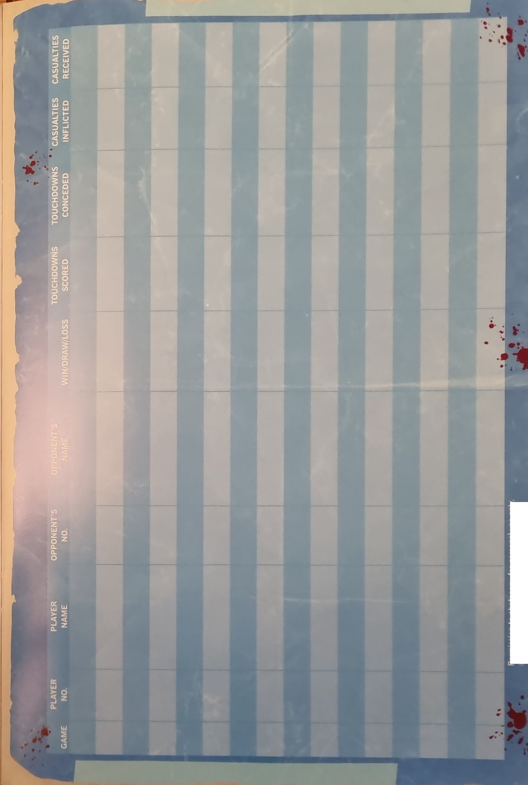

**WRITING YOUR ROSTER**

**Perhaps the most important thing you will need for a Blood Bowl
tournament (apart from your actual team!) is your team roster. Here we
present our recommendations for drafting your team for a Blood Bowl
event. Event Organisers may decide to alter these slightly for their own
tournaments and if they do so, it should be clearly listed in the
rulespack for that event.**

**[DRAFTING YOUR TEAM]**

The first thing you will need to know is the Team Draft Budget in
gold pieces that you have to build your team. This should be clearly
listed in the rulespack for the event so that everyone knows exactly
how much they have to spend! For example, a rulespack may state 'Team
Draft Budget: 1,200,000 gold pieces', in which case coaches can spend
up to 1,200,000 gold pieces when drafting their
team.

When drafting your team, follow the rules listed on pages 30-35 of
the *Blood Bowl Rulebook,* with the following
exceptions:]

-   
-   
-   
-   

[Coaches will have whatever Team Draft Budget is outlined to them in the
rulespack rather than 1,000,000 gold pieces.Coaches may spend their gold
pieces on any Inducements allowed at the event (see opposite).Coaches
may spend their gold pieces on additional Dedicated Fans, up to a
maximum of 6, at the cost of 10,000 gold pieces per Dedicated Fan
purchased.Any gold pieces not spent will be lost, and you will not be
able to choose any additional Inducements to make up any difference
between your Team Value and that of your opponent. With that in mind, it
is always beneficial to spend that last little bit of gold on the likes
of Dedicated Fans, Assistant Coaches or Cheerleaders!Coaches are
expected to record all the details of their team on their Team Draft
list for the event and have multiple copies readily available for their
opponents, and the Referees, during the course of the
event.

**[INDUCEMENTS] \_\_**

In the rulespack for the event, it should list which publications are
in use for the event. All Inducements from the listed publications are
allowed for the event, and unless specifically stated otherwise must be
purchased from their Team Draft Budget and are permanently added to your
Team Draft list for the duration of the
event.

Star Players may be induced, but a team must include a minimum of 11
players before addin: ny Star Players. Star Players will also cost a
number of II Points, which are outlined fully on page
14.

If both coaches have induce ^1^ Star Player or member of (In)Famous
Coach ,ff, th coaches will still get to use them during the urse of the
game and duplicates do not cancel each - ■ out. Assume that
the

one appearing on the losing I was an imposter or a long-lost
cousin!

Additionally, some Event Organisers may wish to add their own unique
Inducements to the event. If this is the case, this should be listed
clearly in the rulespack and include what the Inducement does and how
many gold pieces it costs to induce.

**DID YOU KNOW?**

*The winners of the Full Beard Cup used to be invited to an all night
tavern party with as much Bugman\'s XXXXXX as they could drink; that was
until the Norsca Rampagers won in 2498 and nearly burned the tavern down
when they ran out of ale!*

**SKILL POINTS**

**After you have drafted your team you are able to give them some
additional Skills for the duration of the event. Coaches will receive
a number of Skill Points they can spend depending on the Tier of the
team they are playing, as listed below.**

**[TIER OF TEAM NUMBER OF SKILL
POINTS]**]

**Tier I** *6*

**Tier 2** *8*

**Tier 3** *IO*

The tiers of the teams are constantly being assessed to provide the most
up-to-date and accurate distribution of teams in each tier. You can find
the most recent Tier List to use for an event in the Blood Bowl FAQ and
Errata on warhammer-community.com.

Skill Points can be spent to purchase Primary Skills, Secondary Skills
and Star Players.

**[PURCHASING SKILLS]**

Purchasing a Primary Skill for a player will cost 1 Skill Point. There
is no limit to the number of Primary Skills a team can purchase, so long
as they have Skill Points remaining.

Purchasing a Secondary Skill for a player will cost 2 Skill Points.
Teams are limited to the number of Secondary Skills they can purchase
depending on their Tier. A Tier 1 team can have a maximum of 1 Secondary
Skill on the team, a Tier 2 team can have a maximum of 2 Secondary
Skills on the team, and a Tier 3 team can have a maximum of 3 Secondary
Skills on the team.

Each player can only be given a single additional Skill, though there is
no limit to the number of times a particular Skill can be chosen - so
long as no player is given more than one Skill and you have Skill Points
remaining, of course. Additionally, Star Players cannot be given
additional Skills under any circumstances.

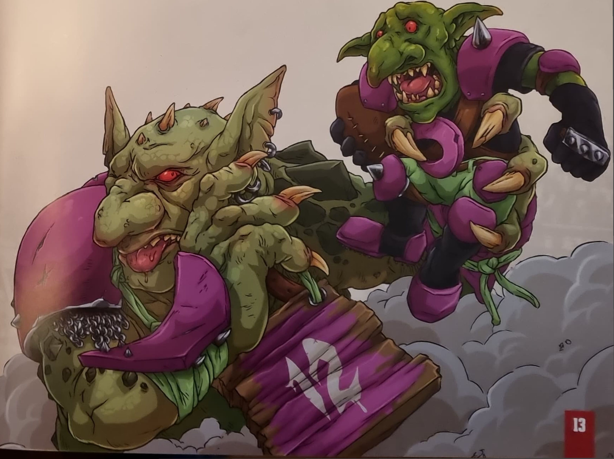It\'s important to note that, unlike in a league,
Skills purchased for Matched Play do not add to a player\'s value and as
a result their Team Value will not increase.

**[STAR PLAYERS]**

Skill Points must also be spent if a team wishes to induce a Star Player
onto their team. If a team wishes to take a Star Player they must pay
the cost in gold pieces as described earlier, and also spend 2 of their
Skill Points to have them on their team. Tier 1 teams may have a maximum
of 1 Star Player on their team, while Tier 2 or Tier 3 teams can have a
maximum of 2 Star Players on their team.

Some Star Players have such an impact on the game that they are classed
as Mega-stars. Mega-stars cost 4 Skill Points rather than the usual 2
Skill Points. Mega­stars like to be the star of the show, and don't like
to have to share the limelight with anyone else who is considered to be
their equal. A team may only ever have a single Mega-star on their Team
Draft roster.

Which Star Players are classed as Mega-stars is something that is
constantly being assessed to provide the most up-to-date and accurate
representation of their impact on the game. You can find the most recent
list of Mega-stars in the Blood Bowl FAQ and Errata on
warhammer-community.com.

Below is a table summarising the breakdown of what Skills Points can be
spent on, and some examples of how different teams may spend them.

*Note: Teams may still only ever have a maximum of 2 Star Players,
including Mega-stars.*

*Skill Points Example: Jay is taking a Wood Elf team to a tournament. As
this is a Tier 1 team, Jay has 6 Skill Points to spend. He decides to
give one of his Wardancers Strip Ball as a Primary Skill for 1 Skill
Point, and another Wardancer Sidestep as a Primary Skill for 1 Skill
Point. He then gives his Loren Forest Treeman Grab for 1 Skill Point,
and one of his Wood Elf Linemen Wrestle for 1 Skill Point. Jay then
spends his last two Skill Points to have Akhorne the Squirrel as a Star
Player.*

**DID YOU KNOW?**

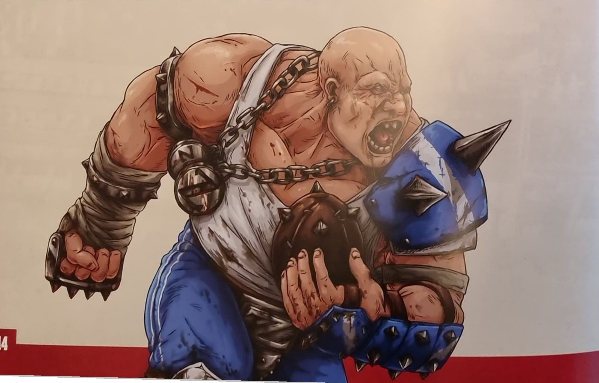*No Halfling team has ever won the Chaos
Cup; though three have been sacrificed by winning teams as a thank you
to the Dark Gods!*

**PRAYERS TO RUFFLE**

**In a league game, the Prayers to Nuffle table is used during the
pre-game sequence to help balance out the value of each team.**

**Naturally, this is not the case in a Matched Play setting as teams are
drafted using the same Team Draft Budget, and so there won\'t be a need
to balance them afterwards. Many of the results on the standard Prayers
to Nuffle table focus around gaining Star Player Points, which are not
used during the course of a tournament.**

**With this in mind, if the Cheering Fans result comes up on the
Kick-off event table, then coaches should use this alternate Prayers to
Nuffle table for their Matched Play games. This can also be found on
page 103 of the *Blood Bowl Rulebook.***

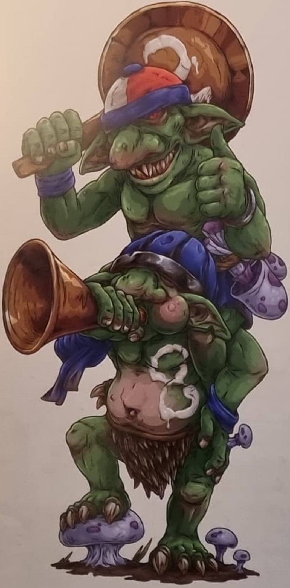

[matched play]

**[PRAYERS TO NUFFLE TABLE]**

**08 RESULT**

1.  *Treacherous Trapdoor* Until the end of this half, every time any
    player enters a Trapdoor square, roll a D6. On a roll of a 1, the
    trapdoor falls open. The player Is Immediately removed from play.
    Treat them exactly as if they had been pushed into the crowd.

2.  *Friends with the Ref:* Until the end of this drive, you may treat a
    roll of 5 or 6 on the Argue the Call table as a \"Well, When You
    Put It Like That\..." result and a roll of 2-4 as an \"I Don\'t
    Care!\" result.

3.  *Stiletto:* Randomly select one player on your team that is
    available to play during this drive and that does not have the
    Loner (X+) trait. Until the end of this drive, that player gains
    the Stab trait.

4.  *Iron Man:* Choose one player on your team that is available to play
    during this drive and that does not have the Loner (X+) trait.
    Until the end of this game, that player improves their AV by 1, to
    a maximum of 11 + .

5.  *Knuckle Dusters:* Choose one player on your team that Is available
    to play during this drive and that does not have the Loner (X+)
    trait. Until the end of this drive, that player gains the Mighty
    Blow (+1) skill.

6.  *Bad Habits:* Randomly select D3 opposition players that are
    available to play during this drive and that do not have the Loner
    (X + ) trait. Until the end of this drive, those players gain the
    Loner (2+) trait.

7.  *Greasy Cleats:* Randomly select one opposition player that is
    available to play during this drive. That player has had their
    boots tampered with. Until the end of this drive their MA is
    reduced by 1.

8.  *Blessed Statue of Nuffle:* Choose one player on your team that is
    available to play during this drive and that does not have the
    Loner (X+) trait. Until the end of this game, that player gains
    the Pro skill.

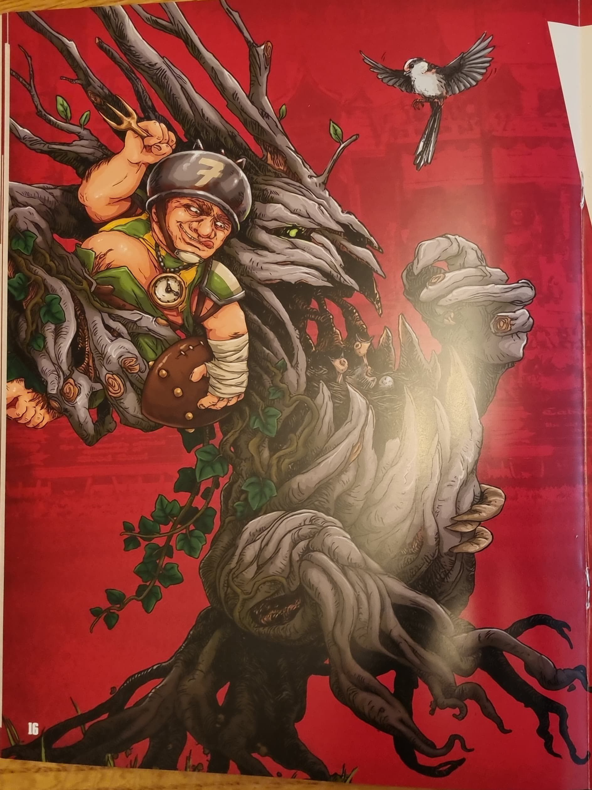

**P0ST4UTCH**

**■■ fter you have completed your game of fl Blood Bowl and handed in
your results slip, there are a few differences between a Matched Play
game and a match in the middle of a league. The Post-Match Sequence on
page 69 of the *Blood Bowl Rulebook* is not used in tournament games and
here we will explain all the differences between how the post-game
sequence works in a tournament compared to a league.**

**[DEDICATED FANS]**

After a Matched Play game, the winning team increases their Dedicated
Fans by 1.

**[STAR PLAYER POINTS]**

In a tournament, players do not earn Star Player Points during the
course of the event and as a result, there is no need to record the
number of Star Player Points each player has accumulated.

However, we would still recommend recording the number of touchdowns and
casualties each of your players makes as many tournaments will have
awards for things such as \'Most Touchdowns by a Single Player\' or
\'Most Violent Player\'. It\'s also nice to be able to keep

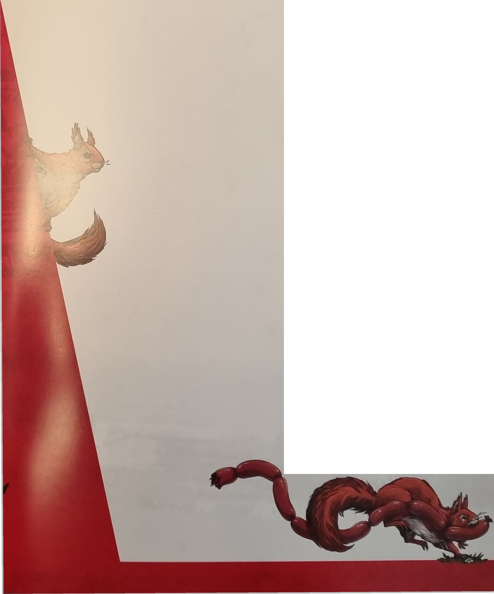

**[INJURIES]**

The players on your team are utterly psyched up for the tournament and
will let nothing short of death stop them - and even then, that is often
not enough! At the end of a game, all players are pulled back from the
brink of demise by all manner of strange ways; be that a liberal helping
of under-the-counter Goblin mushrooms, daemonic pacts, necromancy, pure
pig-headedness, a healthy dose of Bugman's XXXXXX - you name it, at
least one team has tried it!

This means that, at the end of each round, your team will make a full
recovery in time for the next game. This ensures that if a team gets
horribly mangled in their first game, they are not left unable to
compete for the rest of the event and it allows coaches to get some good
games in without panicking about having to replace players, or worrying
that their favourite player is going to get their head smashed in -
beyond the normal boundaries of a Blood Bowl match, of course!

**[ACQUIRING ADDITIONAL PLAYERS \~]**

If a team acquires additional players during the course of a game, such
as those earned by the Plague Ridden trait or the Masters of Undeath
special rule, those additional players will only be available until the
end of the game in which they were earned, and will not be added to your
Team Draft list at the end of the game.

Blood Bowl is an unpredictable game at the best of times and all manner
of wonderfully weird situations regularly arise. As a result, it is
often good to have a number of \'less serious' awards on offer for
coaches to compete for - though, in our experience, these are the ones
that most coaches really care about! Below are some examples of these
awards you could use if you wish:

**against all manner of other coaches and to try to secure victory -
though what counts as 'victory' is often different for different
coaches!**

**It is a good idea to have a selection of awards for coaches to
compete for over the course of the event, though not all of them need
to be simply for just winning games.**

We would always recommend having the following awards at an event:

-   *FIRST PLACE:* For the coach who finishes first in the rankings.

*SECOND PLACE: For* the coach who finishes second in the rankings.

-   *THIRD PLACE:* For the coach who finishes third in the rankings.

*' \^°

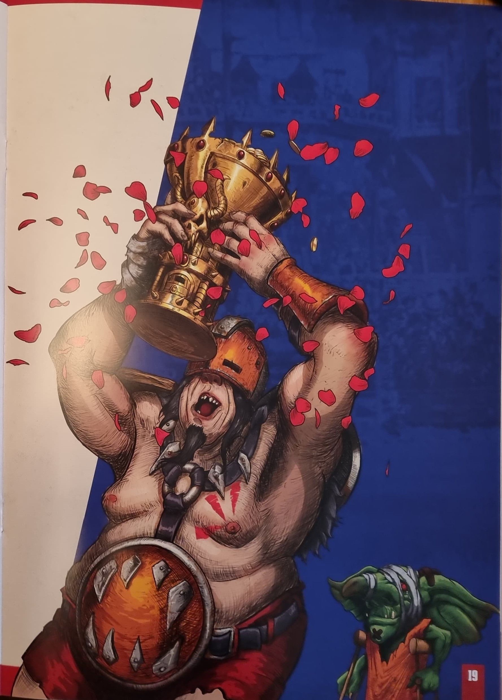

**ALTERNATIVE (FORMATS**

**Not *all Blood Bowl* events have to be the *'standard'* style *of*
event; in *fact,* some *of the* most *popular tournaments are* I *run
very differently and have their own unique twists. Here, we present a
small selection of different formats that Event Organisers can use \|
if they wish, or use as inspiration* to *create their \\ own
formats.***

**[STUNTYTOURNAMENT]**

Perhaps the most popular teams in Blood Bowl are those known as
'Stunty Teams\'; those teams made up primarily of the little guys in
Blood Bowl that have the Stunty trait. As a result, some events enjoy
nothing more than pitting these teams against each other to see who
will come out on top - after all, Stunty Teams very rarely win a
standard event!

A Stunty Tournament follows all of the same rules for a standard event
as described earlier in this guide, with one exception - Coaches may
only take one of the Stunty Teams.

A Stunty Team is any team that can be made up entirely of players with
the Stunty trait or Big Guys, which is

the colloquial term for the larger players of the game!

This may result in teams that you wouldn't expect being allowed to
participate in a Stunty Tournament, providing they follow these rules.
The following teams are eligible for a Stunty Tournament:

-   Black Orcs (providing they include only Goblin Bruiser Linemen and
    Trained Trolls)

-   Goblins

-   Halflings

-   Lizardmen (providing they include no Saurus Blockers)

-   Ogres

-   Snotling

-   Underworld Denizens (providing they only include Underworld Goblin
    Linemen, Underworld Snotlings, Underworld Trolls and Mutant Rat
    Ogres)

While these are currently the only eligible teams for a Stunty
Tournament, there may be others that fall into this category in the
future.

Stunty Tournaments are typically a more relaxed stvle of event, as
each coach is taking a team primarily for fun and to be as wacky as
possible! As a result, it is often worthwhile to have more of the
'sillier' awards on hand for coaches to compete for. Additionally,
there is no need to award the Stunty Cup, as every team is a Stunty
Team anyway!

[teamWE ■ \~]

Some events allow coaches to band together in a team and compete
together for collective glory; these events are called Team Events,
which are ideal for getting a few coaches together from your local
club or gaming group to test your mettle against other clubs for glory
and bragging rights!

**[FORMING A TEAM]**

In the rulespack for a Team Event, it will specify the number of coaches
that must be on each team and this can range from as few as three, to as
many as eight in some cases! When forming a team for the event, no coach
may take the same team as another coach on their team - only one coach
could take a Skaven team for example. Additionally, each Star Player can
only be taken once across the entire team. So. if one player has Morg
'n' Thorg on their roster, no one else in their team can take Morg 'n'
Thorg.

One coach in the team nw nominated as Team Captain. It is the respo i
the Team Captain to organise the rest of their 1 er :re coaches are
paired correctly, and be a pc : contact between the Event Organiser and
the resi • iheir team.

**[TEAM EVENT RANKINGS SCORING]** In a Team Event, earning
Tournament Points and Bonus Points, or determining tiebreakers, works
exactly the same as described on page 8. However, there are two sets of
rankings used in a Team Event: individual ranking and team rankings. The
individual rankings take into account the Tournament Points, Bonus
Points and Tiebreakers scored by each individual coach, just like in a
standard event. The individual rankings are used to pair coaches up when
two teams are paired against each other (see opposite), but otherwise
don't have any other impact on the event - aside from bragging rights
between coaches on the same team, of course!

The team rankings take into account the result of the team as a whole;
whether they won, lost or drew. If a team won more games than the
opposing team, then that team will win the round and receive 2
Tournament

\^omts. If a team won the same number of games as the opposing team,
then the teams will draw and each team

will receive 1 Tournament Point. If a team loses more games than the
opposing team, then that team will lose the round and receive 0
Tournament Points.

The team rankings are used to determine which teams are where in the
rankings and a team\'s overall success with the team that finishes top
of the rankings winning\' the event. It's important to remember that
winning games doesn't just benefit you, but also all the members of your
team as well!

*Example: Jay, Dan, Rob and Xavier are on the same team. In round 1, Jay
and Dan both win their games, Xavier draws his game, and Rob loses his.
As a result, their team will receive 2 Tournament Points as they won two
games compared to the opposing team's one.*

**[TEAM EVENT TIEBREAKERS]**

In a team event, the Tiebreakers work slightly differently. The first
Tiebreaker will be the number of individual games that a team has won
across the event, and the second tiebreaker will be the number of
individual games a team drew across the event.

*Examp! -ms A, B and C all won their first round of*

*an evei so are all tied on 2 Tournament Points each, i won three games
and lost one; Team B*

s, *drew one game, and lost one game;*

*ar Tea// won two games and drew two games. As a r it, Team A would be
highest in the rankings as they wt. a three games, while Team C would be
ranked higher than Team B as although they have the same number of games
won, Team C has more draws than Team B.*

**[TEAM EVENT PAIRINGS]**

When two teams are paired against each other, it means that each coach
will play a coach from the opposing team. In round 1, teams will be
randomly paired against each other as normal and coaches will be
randomly paired against a coach from the opposing team.

In subsequent rounds, teams will be paired against each other by the
rankings in the same way as described for a standard event on page 9.
Additionally, in subsequent rounds, deciding which coach will play which
opposing coach works slightly differently. Coaches will be paired
against each other depending on the individual ranking of the players in
each team, with the highest ranked player on each team playing each
other, the second highest ranked player on each team playing each other,
and so on.

*Example: Team A, consisting of Dan, Jay, Rob and Xavier are drawn
against Team B, consisting of Gavin, Keith, Louise and Nicolas. In Team
A, the individual rankings are as follows:*

*Jay - 6 Tournament Points, 3 Bonus Points Dan - 4 Tournament Points, 2
Bonus Points Xavier-3 Tournament Points, 2 Bonus Points Rob - 0
Tournament Points, 0 Bonus Points*

*While in Team B, the individual rankings are as follows:*

*Nicolas - 6 Tournament Points, 3 Bonus Points Keith - 6 Tournament
Points, 1 Bonus Point Gavin - 2 Tournament Points, 2 Bonus Points
Louise - 1 Tournament Point, 2 Bonus Points*

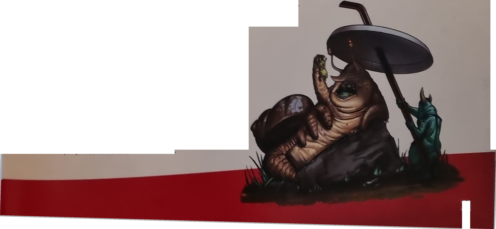*Example: Jay, Dan, Rob and Xavier are on
the same team. In round 1, Jay wins his game 3-0 causing 1 casualty and
scores 2 Bonus Points; Dan wins his game 2-1 causing 3 casualties and
scores 1 Bonus Point; Xavier draws his game 1-1 causing 4 casualties and
scores 1 Bonus Point; and Rob loses his game 1-0 causing 0 casualties
and scores 0 Bonus Points. The team scores 2 Tournament Points for
winning more games than their opponents. The team will also have a total
of 4 Bonus Points, a Touchdown Difference of +3, a total of 6
touchdowns, and a total of 8 casualties for the purposes of further
Tiebreakers.*

*As a result, Jay would play Nicolas as they are the highest ranked
coach in each team. Dan would then play Keith, Xavier would play Gavin,
and Rob would then play Louise.*

In these events, teams should be divided into groups of four then the
first three games of the event are played as a round robin format with
each team playing each other team in their group once. Following these
games, a selection of teams will qualify for the knockout round; the
exact number of teams that qualify for the knockout round should be
decided by the Event Organiser and rlearlv outlined in the rulespack
for the event. We would recommend having 8 or 16 teams qualify
(depending the size of your event) so that after a set number of games
there is only a single team left undefeated!

[k[nockout stage]]

The teams that qualify for the second round will then play a knockout
style tournament, where the winning team will advance through the
event and the losing team will be eliminated - though these teams
should still continue to play the other teams eliminated during this
round to determine their final overall standing! For example, if eight
teams qualify for the knockout round, then after

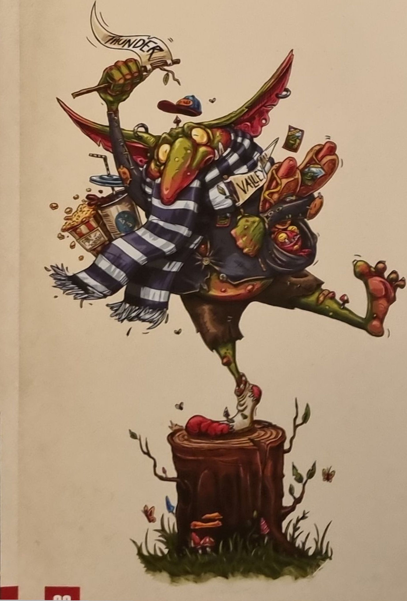

the first game in this stage there will be the four winning teams
playing for places 1 to 4. and the four losing teams playing for places
5 to 8.

In this knockout format, if two ams draw with each other, then they
should play exh ie as explained on page 67 of the *Blood Bowl Kuh.-: \<*

It can also be a gooc io h e a knockout stage wallchart showing the pe
victory for each team. We have provided a blank ver n of this in this
guide that you can photocopy for your own events.

**[BEST OF THE RES]**

Those teams that do not qualify for the knockout stage will form a
separate event played alongside the knockout stage to determine the Best
of the Rest. This takes the same format as a normal event, and should
run for the same number of games as the knockout stage so that everyone
at the event has the same number of games to play. It is also a good way
to give those coaches that didn\'t qualify a chance to compete for their
own prizes and keep them engaged in the event.

**DID YOU KNOW?**

*The Sewer Pipe Scoundrels made the finals of the second Forge Bowl in
2499 after their semi-final opponents, the Karak Wanderers, refused to
play the match. The Dwarfs claimed that it wouldn\'t be fair on the
Skaven if they played, though every other team reasoned that the Dwarfs
simply didn\'t want to be embarrassed on their own pitch when the rats
ran rings around them!*

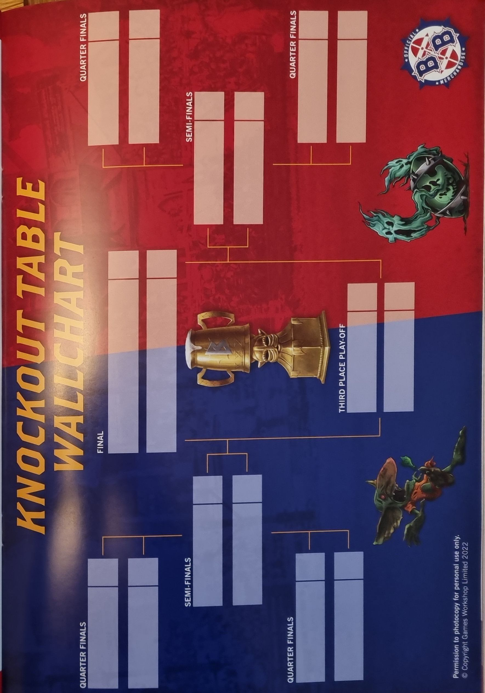

[]**ADDITIONAL RULES**

***While the rules we have presented in this guide are all coaches
need to run their own tournaments and gaming weekends, this doesn\'t
mean that they are the only rules that can be used in events. In tact,
many Event Organisers like to incorporate their own additional rules
into their events to add that extra flavour or flair to the event to
make it unique.***

***\\ These additional rules can take many forms and, over the next few
pages, we have provided***

***I a selection of optional rules that Event Organisers can use if they
wish, or use as inspiration for creating their own. These can be* I
*used at the discretion of the Event Organiser,* I *who may decide to
use one, or more, of these I at their event. When an event does make use
of additional rules, it should be clearly listed in the***

**I *rulespack so that all coaches know what rules***

**I *they will be using.***

**INJ[URIES] --- \_\_\_\_\_**

\^\^-\^\^\^\^\^ each coach s team will make a full recovery after each
game, and that there is no need to make a Casualty roll when a player
suffers a Casualty! result, this is not always the case. Some events may
decide not to have teams make a full recovery and instead suffer
injuries in the same way as if the games were part of a league.

If this is the case, then whenever a player suffers a Casualty! result
on the Injury table they will need to roll on the Casualty table and
apply the result. This may result in players missing the next game of
the event, picking up a lasting injury, or even being killed outright!

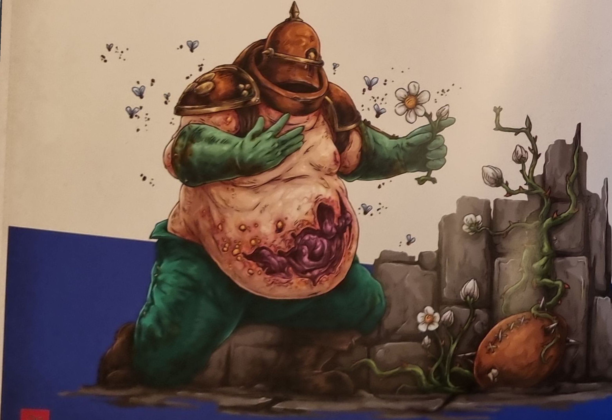If an event decides to use injuries then it
is important to note that some teams are likely to get quite beaten up
over the course of the event. With this in mind, it is also recommended
that if an event uses injuries, then teams should also calculate their
Current Team Value (CTV) before each game, with the team with the lowest
CTV gaining a number of gold pieces equal to the difference between
their CTV and that of the opposing team. These additional gold pieces
can be spent on additional Inducements that will last for the duration
of the game. Any gold pieces not spent in this wa are lost.

**[PLAYER ADVANCEMENT]**

Most Blood Bowl tournaments will allow coachestou\^T Skill Points to
provide additional Skills to their players as players will not gain Star
Player Points (SPP) during the course of their games. However, if the
Event Organiser wishes, they may decide to allow players to progress
throughout the course of the tournament.

If this is the case, players will gain SPR as described on page 70 of
the *Blood Bowl Rulebook,* and may spend them to gain new Skills as
described on page 71 of the *Blood Bow! Rulebook.* Event Organisers may
also decide to award additional SPP for other in-game instances if they
wish; if this is the case then this will need to be clearly outlined in
the rulespack.

**CUSTOM INDUCEMENTS**

An Event Organiser may decide to create their own custom Inducements to
be used at their event. These will often be themed to the background of
the event in question to provide an added level of flavour for the event
that is being played; an event called 'Forge Bowl\' may be themed around
a Dwarfen forge, and therefore could have an Inducement for a Dwarfen
Smith, for example.

Any custom Inducements should be clearly outlined in the rulespack and
should be made available to all teams. The Event Organiser may also
decide to allow each coach to add the custom Inducement to their Team
Draft Roster for free to add to the unique feel of their event.

If an event uses player advancement, it is important to note that when
players gain new Skills, their Current Value (CV) will increase, as will
the team\'s overall CTV. With this in mind, it is also recommended that
if an event uses injuries, then teams should also calculate their CTV
before each game, with the team with the lowest CTV gaining a number of
gold pieces equal to the difference between H r ^1^ CTV and that of the
opposing team. These addn ■ gold pieces can be spent on additional
Induces it will last for the duration of the game.

Any gol I not spent in this way are lost.

**D YOU KNOW?**

*Th inal of the 2503 Blood Bowl saw two of the very best players meet in
the prestigious final for the very first time. Griff Oberwald, playing a
one tournament deal for the Altdorf All-Stars, squared off against Count
Luthor von Drakenborg and the Drakfang Thirsters in a match that was
more about the two stars than the rest of their team-mates! Following a
vicious headbutt to Griff that caused him to be sidelined, Luthor was
able to saunter into the End Zone in each half for a 2-0 win - looking
fabulous as he did so!*

When creating your own Inducements, it is important to make sure that
they don't have too much of an impact on the game itself. They should
provide a small bonus to the team that has purchased them that can have
a subtle impact on the game, rather than being all-powerful effects that
become the central focus of the match.

Here are some examples of custom Inducements, which Event Organisers can
use if they wish:

**[0-1 DWARVEN SMITH]**

**[100,000 GOLD PIECES, AVAILABLE TO ANY TEAM]**

A Blood Bowl tournament is the ideal place for the local smiths to
showcase their talents and sell their wares; many coaches are quick to
purchase some extra Dwarven steel to protect their more vulnerable
players or provide their heavy hitters with that extra 'edge' they need
in a mid-match punch-up!

Before the game begins, a team that has hired a Dwarven Smith must roll
a D6.

On a 1-3, the Dwarven Smith has provided the team with some additional
armour plating. Choose D3 players on your team to improve their AV by 1
(to a maximum of 11 + ) until the end of the game.

On a 4-6, the Dwarven Smith has provided the team with a selection of
ornate knuckle-dusters, steel-capped boots, and other items designed
to inflict pain on the opposition. Choose D3 players on your team to
gain the Mighty Blow (+1) skill until the end of the game.

*[0-1 FESTIVE GIFTS]* [**50,000 GOLD** *PIECES, AVAILABLE TO
ANY TEAM *]*The festive period* is a time *for giving and
many* teams *engage in* this *tradition by secretly giving gifts to a
random one of their team-mates - though, some team­mates definitely end
up getting better gifts than others!*

*Before the game begins, randomly select one player on your team. That
player has been given their festive gift and ripped it open with
unbridled excitement! Roll a D6 to determine the effect of the gift.*

***[GIFT]***

*More Socks\...:* The player gains the Animosity (all team-mates) trait
as they are annoyed that their team-mates got them such a totally

rubbish gift!

*Tasty Treat:* Until the end of the game, the player may attempt to Rush
one more time than they usually could as they are fuelled by the

delicious delicacy.

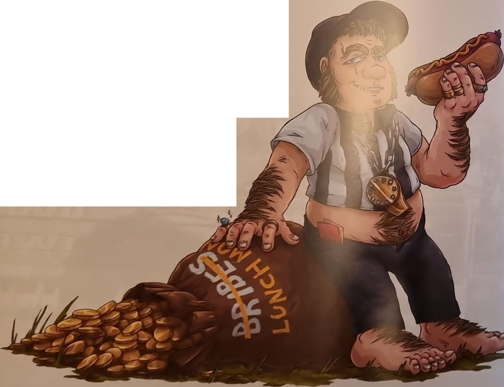*Protection Spell:* The first time in
this game that the player suffers a KO\'d or Casualty result on the
Injury table, they do not suffer the effects and are instead placed in
the Reserves box. *Bugman\'sXXXXXX:* Until the end of the game, the
player may add 1 to the roll when rolling to see if they recover from
being Knocked-out. *Spiked Gloves:* The player gains the Mighty Blow
(+1) skill until the end of the game. *Lucky Trinket:* The player
gains the Pro skill until the end *of* the game.

\~\^\^\^ Bowl is determined by the

number of touchdowns a team scores, at least in the eyes of the
officials! It isn't unheard of for a particularly conniving coach to
purchase some form of booby traps to hide in their own End Zone in an
attempt to provide an explosive surprise for any opposition player that
looks like scoring!

For the duration of the game, whenever an opposition player with the
ball moves into a square in your End Zone, they must roll a D6. On a 2+
nothing happens and the touchdown is scored. On a 1, a booby trap has
gone off and the opposition player is Knocked Down. No touchdown is
scored.

**ET\^fOU[S MOOT BUFFET]**

**\^nO[jOLD\'PIECES. AVAILABLE TO ANY TEAM]**

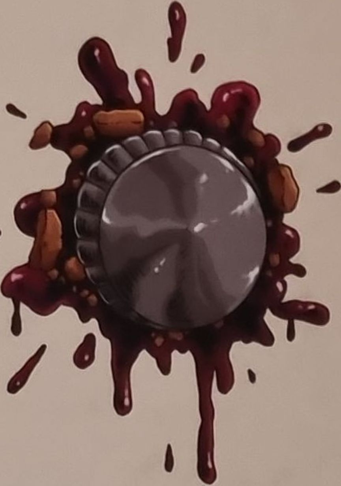\^jSerTBlood Bowl tournament comes to the
Moot, fans can be assured of three things: an abundance of Halfling
teams getting the stuffing kicked out of them in the early rounds,
referees that care more about the halftime snacks than enforcing the
rules and, most importantly, the legendary Mootland buffets. Many
coaches have been known to pay a budding Halfling baker to provide all
manner of scrumptious snacks for their players over the course of a
game, keeping their morale high, their energy levels up and using the
smell of freshly baked goods to rouse those who may have been hit that
little bit too hard on the field!

During the pre-game sequence, before determining the kicking team, any
team that has hired a Famous Moot Buffet must roll a D6 to determine
what manner of tasty treats the Halfling bakers have provided for their
team. The effects last for the duration of the game.

**[D6 GIFT]**

1.  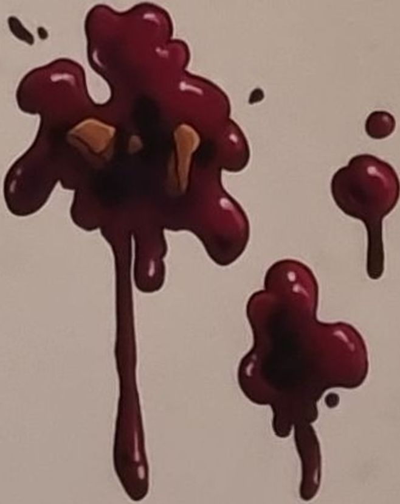*Carlic Eclairs:* Though delicious
    to eat, Garlic Eclairs do tend to leave a player\'s breath
    smelling particularly pungent, and not many opponents are willing
    to get near them if they can help it! Players on your team gain
    the Foul Appearance skill.

2.  *Su: sticky Buns:* Sticky Buns are a firm favourite in the Moot, 11
    . mating them does leave a player's mitts somewhat stickier

i ore; something that does aid in picking the ball up however! \[ s on
your team gain a bonus of +1 when rolling to pick up: ball.

3.  *ripleberry Scones:* The smell of freshly baked Tripleberry

wafting through the dugout is enough to rouse almost any ed-out
player. Players on your team gain a +2 bonus when roil g to recover
from being KO'd.

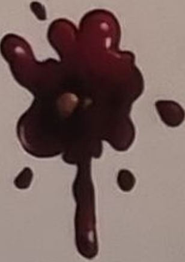[,/. h] *Energy Bars:* These
delicious snacks are the perfect treat to fuel any player, letting
them unleash bursts of energy all game long. Players on your team may
Rush one more time than they usually could.

5.  *Amazing Apple Pie:* It's long been said in the Moot that Apple Pie
    is very much a superfood, and many players will scoff down as many
    helpings as they can to keep their strength up! Players on your
    team gain a bonus of +1 to their ST when performing a Block action
    as part of a Blitz action for the duration of the action. This is
    applied before counting assists or applying any other modifiers.

6.  *Delightful Doughnuts:* Everyone loves doughnuts, and no tournament
    is complete without players wolfing down a doughnut or three to
    raise their spirits! Whenever a player on your team uses a team
    re-roll, roll a D6. On a 5+, the team re-roll is free.

These are just a few examples of the kind of custom Inducements that
Event Organisers can use if they wish. Of course, when it comes to
creating your own Inducements they can be themed around whatever takes
your fancy. You may even decide that every coach in your event gets
your custom Inducement for free to add that extra level of flavour to
your event!

**[GOLD Pltlt tjvnwr.]**

Some events may decide to change the Team Draft Budget in-between games,
showing the increased investment of a team's owners over the course of
the tournament. This means that coaches will start with a smaller Team
Draft Budget for their first game and will then receive more gold pieces
after each round to spend on their team.

*For example: an escalation event may start with a Team Draft Budget of
1,000,000 gold pieces for game 1, before increasing this to 1,100,000
for game 2, then 1,200,000 for game 3.*

There are a couple of important things to remember if you are running an
escalation event. The first is that coaches can only add to their Team
Draft Roster and cannot take anything away from it once it has been
added in. The second is that at the start of the event, coaches must
submit all of their Team Draft Rosters for all the Team Draft Budgets
that they will be playing.

[manWo\^starkayers \^] \^Ti\^rearTone of the most
interesting and exciting ~D~arts of Blood Bowl; after all, seeing the
very best players of Nuffle\'s sacred game take to the pitch is a joy to
behold! As a result many events may require all coaches to have ~at~
least one Star Player in their roster for the event.

When this is the case, the Event Organiser may remove the restriction
for a team to have 11 players before taking a Star Player if they wish,
so long as all rosters still have at least 11 players. This is at the
discretion of the Event Organiser and if they do decide to change this
then it should be clearly marked in the rulespack.

If an event does include mandatory Star Players, it is often a good idea
to have a selection of awards themed around Star Players for coaches to
engage with. Awards for the coach that inflicted the most Casualties on
Star Players, caused the most Casualties with a Star Player, or scored
the most touchdowns with a Star Player are a good idea, but many more
can be included as well!

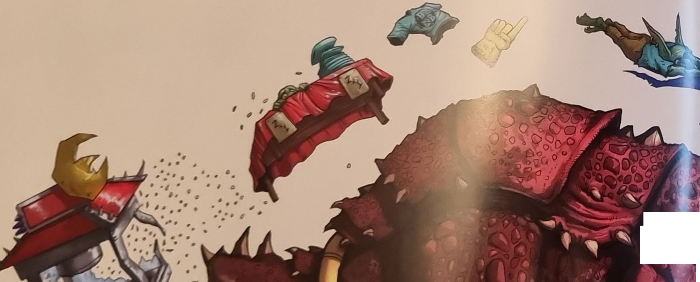

**SECRET OBJECTIVES**

One additional rule that can provide another unique event experience is
the use of Secret Objectives. These are a selection of hidden agendas
that a team is trying to complete over the course of the game. Secret
Objectives are best used as a Tiebreaker, usually the first tiebreaker
and coaches should record how many of their Secret Objectives they
achieved over the course of the game

There are a total of 16 different Secret Objectives that can be used
(provided opposite). At the start of the game, each coach should roll
for three Secret Objectives and make a note of them, re-rolling any
results that they have already rolled for this game. The three Secret
Objectives that are rolled are what the coach must try to achieve over
the course of the game, and each coach should write them down and place
them by the side of the pitch to be revealed at the end of the game.
Coaches should also not reveal what they are trying to achieve to their
opponent and should not reveal if they have completed any of their
Secret Objectives over the course of the game, as that takes all the
mystery out of it!

When ror • (0 determine Secret Objectives, roll a D16 three li .nd
consult the table opposite, re-rolling

**[DI6 SECRET OBJECTIVE]**

I *Red Card:* Have a player on your team Sent-off.

2.  *Didn\'t Need Them Anyway:* Finish any half with at least one
    re-roll unused.

3.  *Coing Alone:* Have a player on your team knock down an opposition
    player without having any offensive assists.

4.  *Fouling Frenzy:* Make at least three Foul actions over the course
    of the game.

5.  *Coing Surfing:* Push an opposition player into the crowd.

6.  *Ganging Up:* Have two or more players on your team make a Block
    action against the same opposition player in the same team turn.

7.  *Whoops!:* Have a player on your team Knocked Down as a result of
    their own Block or

Blitz action.

8.  *Not so Fast!:* Cause an opposition player to fail a Dodge roll.

9.  *Timely Tackle:* Successfully knock down an opposition player that
    was carrying the ball.

10. *Precision Passing:* Make three successful Pass actions over the
    course of the game.

11. *Hit \*em Hard:* Knock-out or inflict a Casualty! result on two
    opposition players in the

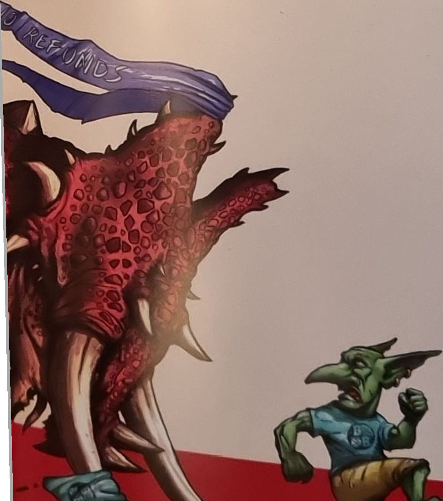

same team turn.

12. *Just a Little Furthen* Have a player on your team score a touchdown
    after successfully Rushing into the opposition\'s End Zone.

13. *Co Long:* Make a successful Pass action that is either a Long Pass
    or a Long Bomb.

14. *Nuffle Favours the Bold:* Have a player on your team make a Block
    action against an opposition player that has a higher ST after
    assists have been calculated.

15. *All According to Plan:* Finish a turn after activating every
    eligible player without using a re-roll and without causing a
    Turnover.

16. *Headtaker.* Inflict a Casualty! result on an opposition player.

It is important to note that while every team is able to accomplish
each of these Secret Objectives in theory, some teams will find some
easier than others - you'll want to hope Nuffle gives you a favourable
roll!

*[&WmS W"^j^']*

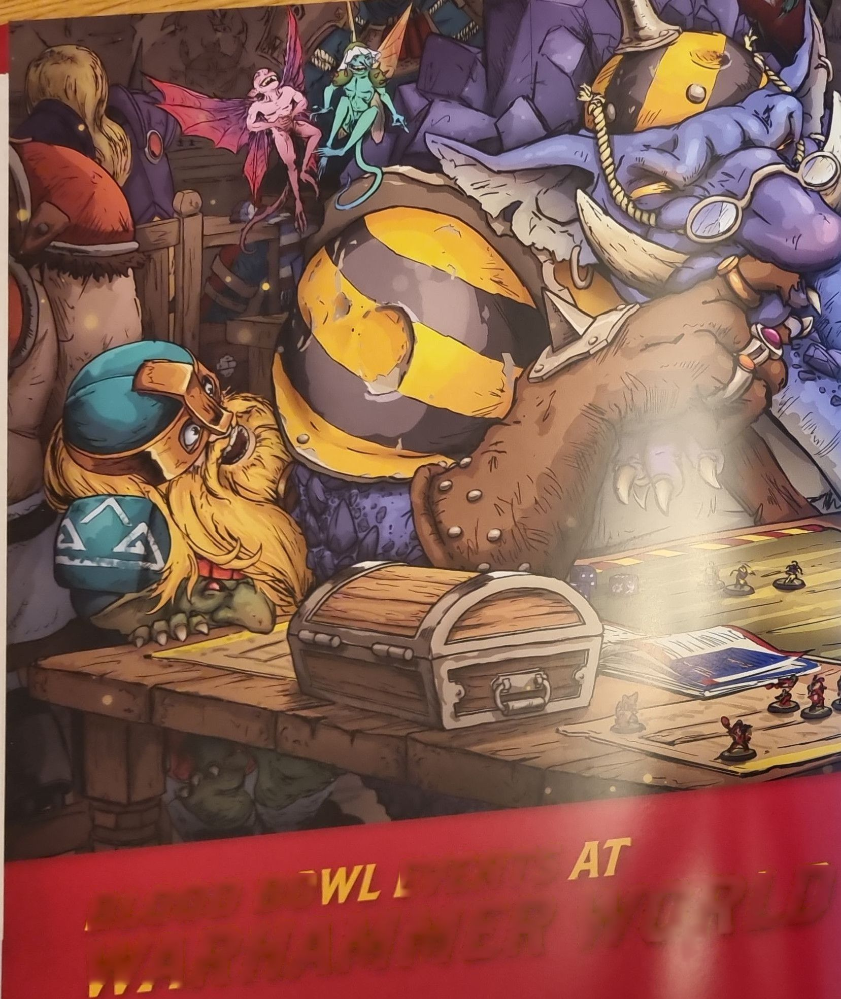

**Blood Bowl is incredibly popular here, at its ancestral home of
Warhammer World. In fact it\'s hard to walk through the gaming hall, or
Bugman's Bar. without witnessing at least one game of Blood Bowl kicking
off! Throughout**

**the year, excited coaches flock to Nottingham, UK, from all corners of
the world in order to participate in events and gaming weekends in
Warhammer World\'s hallowed halls - and visit the illustrious Bugman's
Bar, of course!**

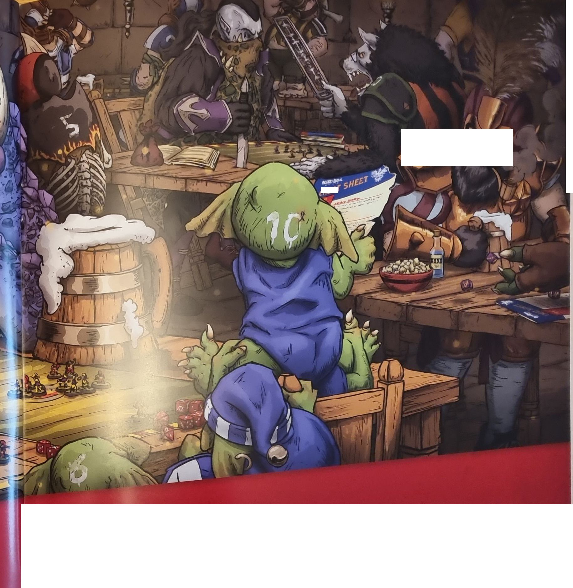

Over the course of the year, Warhammer World holds events such as the
Full Beard Cup, the Quick Snap Cup and the infamous Bugman's Belter,
which usually takes place on Superbowl weekends and allows coaches to
play some games, before sitting back to enjoy the other big game that is
taking place! All of these events serve as a beacon to all fans Of
Nuffle's great game and promote fair play, fun and g\^bportsmanship
above all else: well, off the pitch,lof course - we're certainly not
going to stop any rambunctious teams from sticking the boot in, or
prevent a Goblin with a Secret Weapon from unleashing their full
potential upon an unwitting opponent!

Of course, any Blood Bowl events that are held at Warhammer World will
use the *Blood Bowl Matched*

Players attending an event at Warhammer World also get to experience the
world famous Bugman\'s Bar, which serves all manner of tasty fare and
thirst-quenching beverages (including the wonderful Bugman\'s XXXXXX!)
throughout the day with plentiful portions that will satisfy even the
hungriest of Trolls!

Details of upcoming Warhammer World events can be found over at
warhammer-community.com, so keep your eyes peeled and make sure you
don\'t miss out on these classic gaming events, and a chance to test
your mettle against some of the very best coaches in the Blood

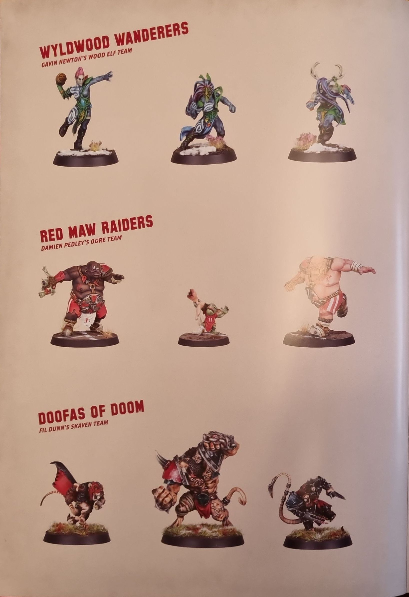

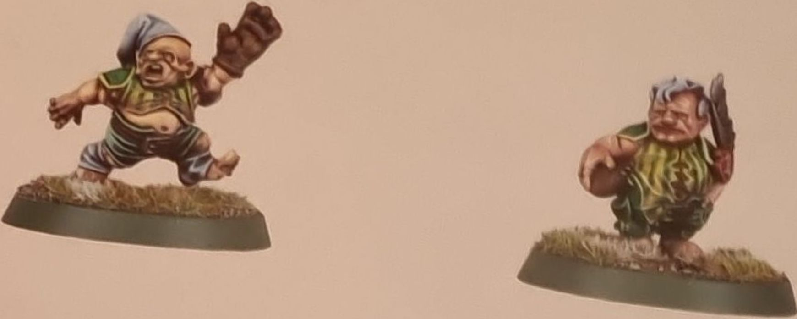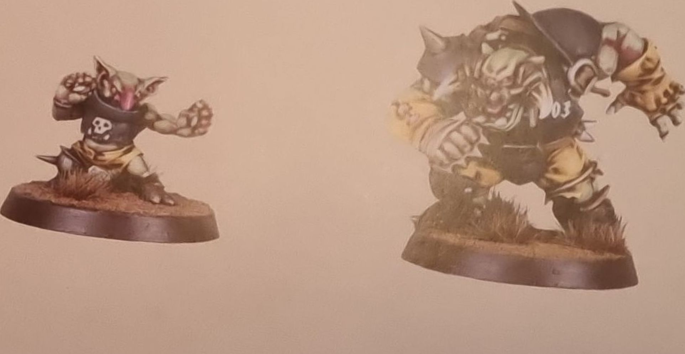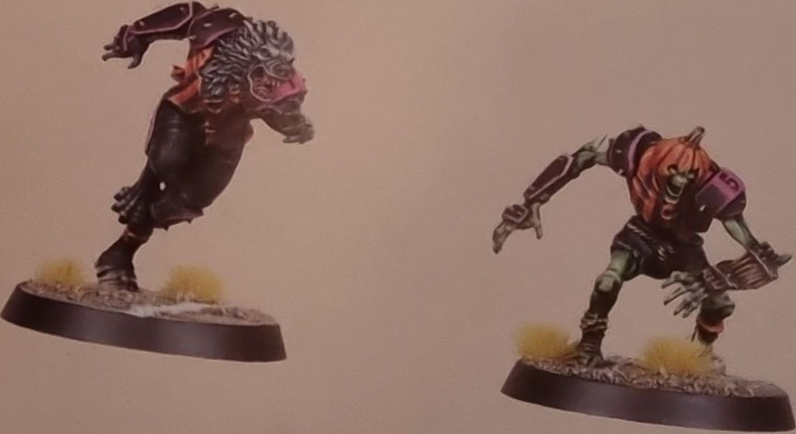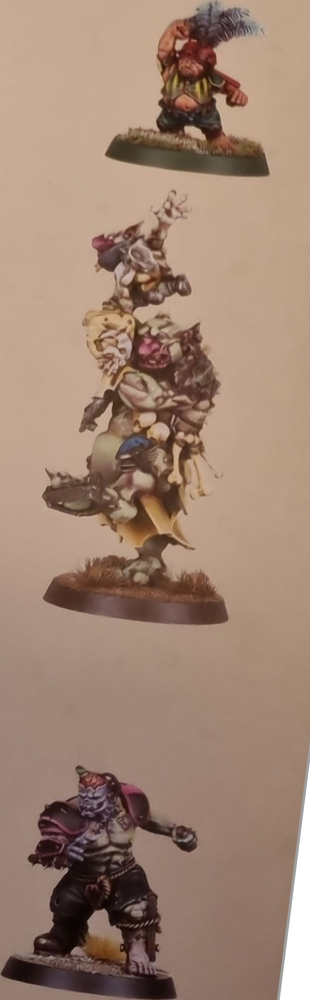

**PUDDING LANE PRODIGIES**

***LEWIS COLLINS\' HALFUNC TEAM***

**DA BLACK CRAG MORTULZ**

***ALASTAIR REID\'S BLACK ORC TEAM***

**CORPSE CART CUCURBEATERS**

***LUKE BLICK\'S NECROMANTIC HORROR TEAM***

