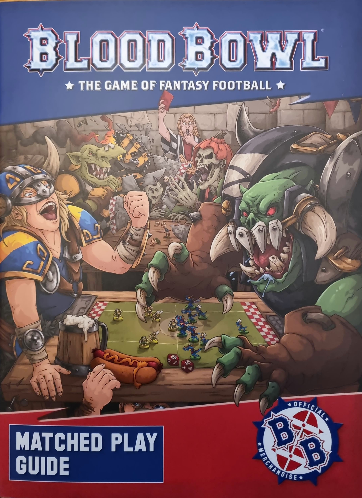
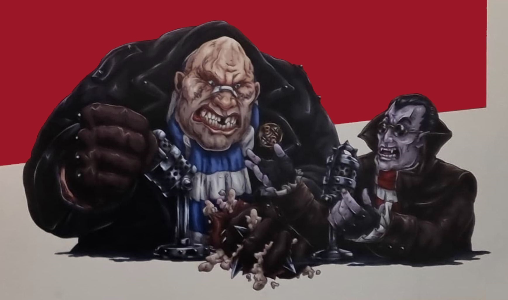

* "Greetings sports fans, and welcome to the Blood Bowl Matched Play Guide! I'm Jim Johnson and I'm accompanied once more by my celebrated co-host, the living legend, Bob Bifford!"

* "Thanks, Jim, and we are here today to talk about one of my favourite I aspects of the great sport - tournaments!"

* "Right you are, Bob! Competitions are the very lifeblood of the game; pitting teams against one another as they strive to knock each other out to progress, with the last team standing lifting the glittering trophy at the end."

* "Ah yes, that takes me back. You know, I've won quite a few trophies over my exceptional career, Jim. There was the Chaos Cup, the Maw Bowl, the Iron Mountain Medal..."

* "We don't have time for all that, Bob! Anyway, the Blood Bowl Matched Play Guide is the ideal resource for any organisation or philanthropist across the known world to hold their own event, providing the rules and regulations that are required to run such a spectacle."

* "...the Knuckle Bowl, the Toof-Rippa Trophy, the Mootland Cup..."

* "Yes, we get the picture, Bob. Oh, are you still going?"

* "...the Spike! Magazine Trophy, the Goblin Gorger Goblet, the Altdorf Cup..."

* "So, you are still going, Bob. Right, well, I guess I'll just continue then. Of course, Blood Bowl tournaments are wildly popular, and no two events are the same - though each will still possess the same exceptional levels of exquisite violence, of course! This guide also serves as the ideal fan companion for those of you who want to understand a bit more about tournaments, what thrilling sights you can expect to see on the pitch, and what rules the teams should be abiding by - even if most teams try to break as many as possible! Right, let's see if Bob has quite finished."

* "...and, of course, the Blood Bowl itself, Jim!"

* "Yes, it's quite the impressive resume Bob! Though perhaps next time you could focus a bit more on the job in hand rather than reliving your glory days"

* "Sorry, Jim, I just got carried away reminiscing about all the momentous victories I've had!"

* "Well, I suppose I can't blame you really, Bob! Anyway, that's enough from us Blood Bowl fans,- we'll see you next time."

