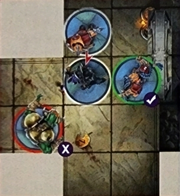
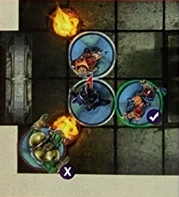
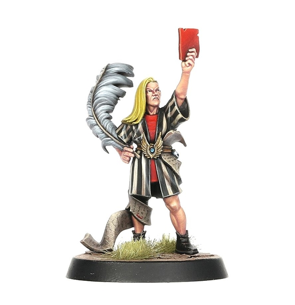

## ALL-STAR GAMES

**LEGENDS OF THE GAME**

**Star Players** are, perhaps, the most exciting thing about Blood Bowl. True legends and pioneers of the modern sport who have excelled in multiple aspects of Nuffle's sacred game. Whether it be as a game-winning scorer of many glorious touchdowns like Griff Oberwald or Hakflem Skuttlespike, a catastrophic casualty causer such as Varag Ghoul-Chewer or Morg 'n' Thorg, or a crowd-pleasing maniac like Helmut Wulf or Akhorne the Squirrel, Star Players come in all shapes and sizes.

The aim of an All-Star Game is to allow players to field as many of their collection of Star Players as they want, creating a unique gaming experience that couldn't be achieved in a regular Blood Bowl game or league. Not only will this result in a truly spectacular match (these are the best players around after all!), but it will also mean that Star Players that could never normally be used in the same team can take to the gridiron alongside each other as a one-off – probably to try to prove which of them is really the better player (*Lord Borak, of course... – Ed*).

This is the perfect excuse for coaches to field their favourite Star Players all at the same time and see what wacky and unpredictable combinations they can come up with. It also allows seasoned coaches to try out a number of different Star Players they have been considering hiring for their own teams. That way, they can get a good feel for multiple Star Players in one go. You never know, you may find a new favourite Star Player to hire during your next league season!

Over the next few pages we explain everything you need to know to start playing your very own All-Star Games. From drafting your rosters of Star Players to any extra rules that are required when playing an All-Star Game. There are also two set rosters of Star Players to use to recreate the inaugural Cabalvision All-Star Spectacular from the year 2500. Enjoy!

### ALL-STAR ROSTERS

The most important thing that coaches need to sort out before they begin an All-Star Game is who gets to use which Star Players. After all, a Star Player can only play for one team at a time; they may be exceptional players but even they can't be in two places at once!

There are two methods you can use in order to decide your All-Star rosters: the Random Method and the Drafting Method. Both are fairly simple, but each will likely give a different style of All-Star team.

An All-Star roster may only ever have a maximum of 16 players, though coaches may decide to have fewer Star Players if they wish.

**RANDOM METHOD**

The Random Method works exactly how it sounds – completely randomly! Coaches should place the names of all the Star Players into a hat, helmet, or other suitable container, and then alternate drawing them one at a time to make up their rosters.

Star Players that come as a pair, such as the Swift Twins or Grak & Crumbleberry, should be part of the same draw – that way coaches draw both of them at the same time. If a coach draws Star Players that come as a pair, the next coach may make two draws (unless their first draw also picks a pair of Star Players) to even up the numbers.

If a coach draws a pair of Star Players when they only have one space left on their roster, they can choose to either re-draw, or place one of their other picks back into the hat to take the pair of Star Players.

This continues until all the Star Players have been drawn or until coaches have full rosters.

The Random Method is more likely to produce less even teams as coaches have little to no control over the Star Players they get. If you prefer playing with the hand that is dealt, or simply want to let the almighty Nuffle determine your fate, this might be the method for you!

**DRAFTING METHOD**

The Drafting Method is more likely to result in balanced teams as coaches take it in turns to pick a Star Player that best suits their needs at the time. Coaches roll a D6 (re-rolling any ties) and the coach that rolls the highest gets the first pick in the first draft round.

In the first draft round, the coach who has the first pick may choose any Star Player for their team. The other coach may then choose any remaining Star Player. In all subsequent draft rounds, the coach who picked second in the previous draft round gets the first pick in that draft round. This process continues until all Star Players are selected or both coaches' rosters are full.

***For example:** In the first draft round Rob has the first pick, and he chooses Morg 'n' Thorg for his team. Jay then chooses Deeproot Strongbranch. In the second draft round it is Jay who has the first pick, and he selects Varag Ghoul-Chewer. Rob then chooses Mighty Zug for his team.*

Star Players that come as a pair, such as the Swift Twins or Grak & Crumbleberry, must be selected together. Additionally, if a coach selects a pair of Star Players then they forego their next pick in the draft to ensure that the numbers remain evenly matched – unless the other coach also selects a pair of Star Players.

Coaches may not select a pair of Star Players if they only have one space remaining on their roster.

The Drafting Method is far more likely to result in closely balanced teams as coaches can tactically select the best Star Player for their team during each draft round based on the choices they have already made, and those of their opponent.

In either selection method, all Star Players should be available to be chosen from. However, if both coaches agree then they are free to exclude any Star Players from the selection process if they wish.

**RE-ROLLS AND OTHER ALL-STAR ROSTER ELEMENTS**

As an All-Star roster is not put together using gold pieces, there are certain elements that are different from a standard game. First off, there are no assistant coaches or cheerleaders for an All-Star roster; these players are only playing together for this one game, after all! There are also no Dedicated Fans for an All-Star roster either; everyone who is in attendance simply wants to see an awesome game of Blood Bowl, and the fans will likely be cheering for both teams anyway!

Finally, and most importantly, we have re-rolls. Both teams in an All-Star Game automatically start with three team re-rolls at the start of each half.

### RULES DIFFERENCES

To help a game using only Star Players run smoothly, and to add to the fun of this unique type of game, there are a few rules differences between an All-Star game and a regular game of Blood Bowl.

Here we are going to run through all of these rules changes for an All-Star game.

**PRE-GAME SEQUENCE**

As you might expect, the pre-game sequence for an All-Star game is a bit different from a standard game; mainly as most of the steps are not required.

When playing an All-Star game only step 2, the Weather, and step 6, Determine Kicking Team, are used. As there is no Fan Factor, no Journeymen, no Inducements, and no Prayers to Nuffle (these players think they are Nuffle's gift to the sport already!), these steps are not used – allowing coaches to get playing as quickly as possible.

**LONER**

Star Players will usually all have the Loner (X+) trait. This is to represent them playing alongside a team that they may not be used to, one filled with rookie players, or simply believing themselves too skilled to warrant listening to the coach.

In an All-Star Game, every player on the pitch is a veteran of the sport who has played for years and racked up numerous accolades. To these players, the game of Blood Bowl is second nature and, even though they may not have played together before, their skills are great enough to do so almost effortlessly.

To represent this, in an All-Star game, all Star Players lose the Loner (X+) trait if they have it.

**STAR PLAYER POINTS**

Star Players themselves do not generate Star Player Points during a game; they already have their Skills & Traits listed. As such, coaches do not need to record Star Player Points during the course of the game. Although it can be fun to keep a track of all this for fun; we're sure the players themselves would be keeping track for bragging rights anyway!

**INJURIES**

With an All-Star game being an exhibition match, if a player is removed from the pitch as a Casualty there is no need to roll to see what happens to them – they simply miss the rest of the game. Though it can be fun to see what would've happened to the player if the casualty had happened during a regular game!

**POST-GAME SEQUENCE**

As an All-Star game is simply an exhibition match, albeit a very important and lucrative one, there is no post-game sequence to go through. Simply acknowledge the result, shake hands, and discuss the game over a nice cup of tea or pint of Bloodweiser!

---

## OPTIONAL LEAGUE RULES

**LONG TERM CONTRACTS**

### SIGNING ON

**Contracts.** The huge scrolls of paper that detail a player's commitment to a team (and filled with microscopic small print, of course!) and outlines all the perks, benefits and added little extras they receive for performing well – and, on occasion, the measures taken should they underperform. Good performances on the pitch will often result in a much more lucrative deal being struck at the end of the season as the team strives to retain the services of their very best players. Though should the player fail to live up to expectations then they may soon find themselves cut from the team and looking for a new employer before the next season kicks off!

Star Players are no exception to this; the only real differences being the amount of gold pieces they are paid, and often the length of the contract itself. Many Star Players prefer to simply sign with a team for a single game, either to give the team a helping hand, or to have another crack against a specific opponent. These one-game contracts allow Star Players to earn plenty of gold from multiple different teams in quick succession.

However, it is not uncommon for Star Players to sign exclusively with a specific team for an entire season, receiving a contract that they simply cannot turn down – either through the amount of gold offered, or perhaps to ensure the team keeps a particular secret, well… secret. Sometimes the chance of glory, and another trophy or accolade to add to their storied careers, is worth more than the gold promised for their services – after all, most Star Players have plenty of gold as it is!

This section of *Spike! Presents 2021 Almanac!* outlines an additional way coaches can use Star Players during the course of a league, one where Star Players will sign exclusively for a certain team for the entire duration of the league. Not only will this allow for coaches to get even more use out of their favourite Star Players, but it will also allow for new rivalries to be formed and add an extra dimension to the already exciting game that is Blood Bowl!

Over the next few pages, we outline exactly how this works, detailing how coaches go about selecting their Star Players, how this affects things such as Team Value, what happens in subsequent seasons, and any other slight rules tweaks that are needed when using these rules for hiring Star Players in your leagues.

### DRAFTING YOUR TEAMS

As with any other standard league, the first thing that each coach needs to do is draft their starting roster. This follows all the normal rules for drafting a Blood Bowl team as laid out on pages 30-35 of the **Blood Bowl rulebook.** Coaches have 1,000,000 gold pieces to spend on players, Sideline Staff, team re-rolls and so forth.

Once all coaches have written and submitted their team rosters, it is time to sign some Star Players!

**SIGNING STAR PLAYERS**

At the start of the season, each team may sign a single Star Player to their roster. This does not cost any gold pieces; the cost is covered by the teams' owners and so the Star Player is essentially 'free.'

However, as each Star Player is unique, once they have signed for a team they can only play for that team during the course of the season. As such, there needs to be a system for deciding which teams get the first chance to sign a Star Player – they can't sign for multiple teams, after all!

After all coaches have submitted their rosters, the League Commissioner should put all the participating team names into a hat, helmet, or other suitable receptacle, and then draw them out one-by-one. Once a team has been drawn, that team's coach may choose any Star Player that is eligible to play for their team to add to their roster. Once a Star Player has been selected, they may not be chosen by another team – they have already committed themselves to a team for the entirety of the season.

Once a Star Player has been selected by a team, that team's coach adds the Star Player to their team roster. Star Players hired in this way may never be fired from a team; the financial ramifications for a team to break their contract are far too great for them to risk terminating the contract early!

In the unlikely event that a team cannot choose any eligible Star Players, because every Star Player that could have played for their team has already been signed to another team, a coach may select any other currently unsigned Star Player, even if they could not normally play for their team. This may result in some strange combinations of teams and Star Players, though if we are honest, gold opens many doors in the world of Blood Bowl!

**TEAM VALUE**

Although teams do not need to pay any gold pieces to sign a Star Player in this manner, they will still contribute to a team's Team Value at the start of the season. This will mean that most teams will start the season with different Team Values based on the Star Player they have signed for the season. This is normal, and will result in some coaches getting a greater choice of Inducements from the very first game.

**UNSIGNED STAR PLAYERS**

Not every Star Player will be fortunate enough to be signed for the entire season, gaining that guaranteed game-time and pay cheque. Some will have to find games in the more traditional way, signing for one-off games for teams where they are needed the most.

Star Players that were not signed to any team are still eligible to be hired by any team as Inducements in the usual way. To make it clear to all coaches which Star Players are able to be hired as Inducements, the League Commissioner should have a list of these Star Players that is easily accessible to all coaches.

### RULES DIFFERENCES

Signing Star Players in this way is rather different to the usual ways in which coaches would go about adding these famous players to their teams. As such there are a few small differences to leagues that use these optional rules for Star Players, designed for all coaches to get the best out of their favourite Star Players and the rest of their teams as well.

**INJURIES**

Star Players are all pretty wealthy, having built up large sums of gold from their playing careers, various contracts, and the many sponsorship deals they are no doubt part of. As a result, these players have access to the very best doctors, necromancers, shamans, or whatever their preferred method of medical care is, and can pay handsomely to ensure that their playing careers are not tragically cut short, or are not subjected to the likes of a sawbones or those practitioners who still believe in the healing powers of leeches...

Should a Star Player suffer a Casualty at any point during the course of the season, they will treat any results of a Serious Injury, Lasting Injury or DEAD as Seriously Hurt instead. This means that Star Players cannot suffer Niggling Injuries, Characteristic Reductions, or be killed during the course of the season; probably due to the expert medical care or protective spells they purchase with the large amounts of gold they earn through their lucrative contracts.

This means that Star Players will always be able to play at their best, and will not suddenly become significantly worse following a strong tackle – ensuring that coaches are always getting the most out of the Star Player they invested in at the start of the season. However, Star Players may still be forced to miss their team's next game if that tackle is particularly brutal!

**STAR PLAYER POINTS**

As normal when playing with a Star Player on your team, Star Players themselves do not gain Star Player Points like normal players do. As such, they cannot gain new Skills or characteristic improvements, or be awarded the MVP award for a game, during the course of a season.

### SUBSEQUENT SEASONS

At the end of the season, all the Star Player's contracts will expire and coaches must remove them from their respective rosters. The next step is for all coaches to re-draft their teams ready for the new season as per the rules for re-drafting teams found on pages 99-100 of the **Blood Bowl rulebook.** Additionally, any new coaches that wish to join the league must draft their roster as normal at this point.

The next stage is for teams to sign a Star Player for the new season. This works slightly differently to how it did in the previous season; essentially, the lower down the league a team finished in the previous season, the earlier they get the chance to pick a Star Player for the upcoming season.

Firstly, any new teams joining the league get the first chance to sign an eligible Star Player for their team. The order that new coaches get to sign a Star Player is determined by a random draw in the same manner as explained earlier.

***For example:** Nic, Sam and Luke all wish to join an ongoing league. After drafting their teams, they each need to sign a Star Player. The League Commissioner puts their name in a hat and draws them out one at a time. Sam comes out first and chooses Morg 'n' Thorg for his Halfling team. Nic's name comes out second, so he drafts Lord Borak for his Khorn team (a fine choice! – Ed). Finally, Luke chooses Roxanna Darknail for his Dark Elf team.*

After all new teams have signed a Star Player, the existing teams now get their opportunity to sign one of the remaining Star Players. However, the order in which existing teams select a Star Player is not done at random as was done for the first season. Instead, all existing teams should be ranked according to how well they did in the previous season as if they had all been part of the same division. The team that is ranked last will get the first pick of the remaining Star Players, followed by the team that was ranked second to last, and so on until the team that was ranked highest gets the final pick.

***For example:** Continuing from our previous example, it is time for the existing teams to each draft a Star Player. After collating the results from the previous season, the standings are as follows:*

- ***Jay**: Necromantic Horror*
- ***Gavin**: Skaven*
- ***Shane**: Black Orc*
- ***Xavier**: Wood Elf*
- ***Keith**: Lizardmen*
- ***James**: Elven Union*
- ***Louise**: Goblin*
- ***Steve**: Imperial Nobility*
- ***Dan**: Shambling Undead*
- ***Rob**: Ogre*

*After the new coaches have selected their Star Players, the next pick falls to Rob as his team finished bottom in the previous season. After Rob, it will be Dan, then Steve and so on. Rob selects Deeproot Strongbranch, Dan chooses Frank 'n' Stein, Steve drafts Mighty Zug, Louise chooses Varag Ghoul-Chewer, James takes the Swift Twins, Keith selects Zolcath the Zoat, Xavier drafts Gloriel Summerbloom, Shane takes the Black Gobbo, Gavin chooses Glart Smashrip, and finally Jay drafts Wilhelm Chaney.*

This is done to ensure that the team that won the previous season doesn't keep winning and to give all the other teams the best possible chance of evening the playing field for the upcoming season!

**A FAMILIAR FACE**

Playing with the same players week in and week out is sure to have an impact on a Star Player, making them more used to the tactics and playstyle employed by that team. As such, Star Players that sign for the same team in multiple seasons will be more accustomed to the way that team plays, and will fit in much easier.

In subsequent seasons, if a team signs the same Star Player as it did in the previous season then that Star Player will lose the Loner (X+) trait for the duration of the season.

---

## MULTI-PLAYER DUNGEON BOWL

### MULTI-PLAYER MAYHEM

**Dungeon Bowl** is, by its very nature, a chaotic experience at the best of times! Teams of hopeful varsity players scurrying around an underground dungeon, avoiding its various dangerous rooms and booby traps in search of the all-important game ball – and causing as much carnage along the way, of course! This unique variation on Nuffle's sacred game has long been used by the eight Colleges of Magic as a way of settling disagreements between the college Magisters, or simply as a way for colleges to earn a bit more gold by placing expensive wagers on the outcomes.

Of course, games of Dungeon Bowl are usually played between two teams from different colleges – although the other college Wizards still take a keen interest in the results and place bets of course! However, there have been occasions where a particular argument, discussion, or simply a disagreement about which college is the best, grows to involve more than two colleges. Whilst this could be settled by an academic debate, or by simply having a civil and logical parlay with each other, the collegiate Wizards would rather settle things in the dungeon!

The result of this is Multi-player Dungeon Bowl! All the chaos and excitement of a regular game of Dungeon Bowl (*if you can even refer to Dungeon Bowl as a 'regular' game! – Ed*) but with another two teams thrown into the mix, adding to the unpredictability of the game! Naturally, such spectacles are a hit with fans and are regularly snapped up for special Cabalvision shows where sportscasters can attempt to call all the action from every room for the entertainment of those watching at home!

This section allows coaches to combine multiple sets of Dungeon Bowl in order to create a larger dungeon for four teams to compete for victory in. If you are looking for a more unique Dungeon Bowl experience, or simply want to get as many coaches involved as possible, then setting up some Multi-player Dungeon Bowl is ideal. It can also play as an interesting twist for a league final with the top four teams competing for the ultimate prize.

Over the next few pages we are going to explain everything you need to know to begin playing Multi-player Dungeon Bowl. From setting up a larger dungeon, to how a team wins when there are four End Zones to consider, and any other tweaks that are needed to make your games of Multi-player Dungeon Bowl run as smoothly as possible.

### SETTING UP THE DUNGEON

As you might expect, there are a few changes to how to go about setting up the dungeon when playing a multi-player game. After all, there are four teams rather than two!

Much like a standard game, this should be a collaborative effort between all players. The aim of this should be to create an interesting and diverse dungeon that all players will enjoy playing across. Remember, at this stage of the game it is not yet a competition!

Whilst players are free to make the dungeon look however they wish, and we encourage them to work together to make a balanced playing area that doesn't inherently give one player a better chance, there are a few rules that govern how the dungeon should be laid out.

Setting out the dungeon should follow all of the usual rules as laid out in the *Dungeon Bowl* rulebook, with a couple of exceptions:

- When creating the dungeon, it should contain at least 6 corridor pieces, at least 6 small rooms, at least 2 large rooms and, of course, the 4 End Zones – although these are not placed until the very end of creating the dungeon.
- When creating a dungeon for a game of Multi-player Dungeon Bowl, it is likely that players will be using tiles from multiple sets of Dungeon Bowl. This is, of course, fine. However, it should be noted that each type of room may only be used once in the dungeon. There can only be one Armoury, Sewer, or Dragon Youngling's Lair for example.

**PLACING THE END ZONES**

When all players are happy with how the dungeon is laid out, the four End Zones should be placed. These should be spread out around the edges of the dungeon as equidistantly as possible.

Players are free to set up their dungeon however they wish, though if you are struggling for ideas then we have provided a few example layouts for you on the next page that you can use to quickly set up your games.

### WINNING THE GAME

Much like a standard game of Dungeon Bowl, the objective here is to traverse the dungeon, locate the game ball hidden in one of the six Chests, and then score that all-important touchdown to seal the win. However, there is the question of where teams need to score that touchdown with the fact that there are now four End Zones rather than the usual two.

In a game of Multi-player Dungeon Bowl, a team can score the game-winning touchdown in any of the three opposing team's End Zones. This may end up with multiple teams trying to score a touchdown in the same End Zone; this is fine, and in fact adds to the urgency and excitement of the game!

### CHESTS AND PORTALS

After the dungeon has been set up, the Chests and Portals need to be placed just like in a standard game. In a two-player game, coaches simply alternate placing Chests then Portals until they have all been placed on the board. However, this doesn't quite work when there are four players.

The first thing that needs to be done is to determine the order in which coaches get to place either a Chest or Portal. To do this, each player rolls a D6 to determine the order, with any coaches that scored the same re-rolling to see which of them places first.

***For example:** When determining the order for placing the Chests and Portals, Rob rolls a 2, Xavier rolls a 6, and Jay and Nicolas both roll a 4. As Jay and Nicolas have both rolled the same, they both re-roll; this time, Jay rolls a 1 and Nicolas rolls a 3. This means that the order for placing is Xavier, Nicolas, Jay and finally Rob.*

The first coach places the first Chest following all of the usual rules as outlined in the *Dungeon Bowl* rulebook, followed by the other coaches in order. The final two Chests are placed by the coaches that were first and second in the placing order.

After all the Chests have been placed, it is time to place the Portals. Portals 1 and 2 are placed by the coaches that were third and fourth in the placing order, following all of the usual rules as outlined in the *Dungeon Bowl* rulebook. The final four Portals are placed in order (from 3 to 6), each placed by a different coach in the order determined by the placing order.

This will result in each coach placing three items; either two Chests and one Portal, or one Chest and two Portals.

*Continuing with our example, Xavier will place the first Chest, followed by Nicolas, Jay, Rob and then Xavier and Nicolas again. Portal 1 will be placed by Jay, Portal 2 by Rob, Portal 3 by Xavier, Portal 4 by Nicolas, Portal 5 by Jay and Portal 6 by Rob.*

### TURN ORDER

In a two-player game of Dungeon Bowl, the teams simply alternate turns. However, this doesn't quite work for a four-player game and so a new system is needed when playing Multi-player Dungeon Bowl.

After the board has been set up, End Zones have been placed, and each coach has deployed their starting teams, coaches need to determine the order in which they take their turns. Unlike a standard game of Dungeon Bowl, a game of Multi-player Dungeon Bowl is divided into a series of game turns.

At the start of each game turn, each coach rolls a D6. The coach that scores the highest will have the first team turn during that game turn, followed by the other coaches depending on how high they scored. Coaches that rolled the same should re-roll to see which of them goes before the other.

After each coach has had one team turn, the game turn comes to an end and the next one begins. The process repeats itself and all coaches roll again as described above. This may result in one team going first in one game turn, and then last in the next; or perhaps having the last turn in one game turn, and then getting the first in the next. This is fine, and is all part of the unpredictability of Multi-player Dungeon Bowl!

***For example:** In the first game turn Rob rolls a 6, Jay rolls a 4, Xavier rolls a 3, and Nicolas rolls a 1. This means that for this game turn the order each coach takes their team turn is Rob, Jay, Xavier, Nicolas. In the second game turn, Rob and Xavier roll a 4, Jay rolls a 2 and Nicolas rolls a 6. As Rob and Xavier both rolled a 4, they must re-roll; this time Rob rolls a 5 and Xavier rolls a 3. This means that the order each coach takes their team turn this time is Nicolas, Rob, Xavier, Jay.*

### OFFENSIVE AND DEFENSIVE ASSISTS

Whilst all the players from all the opposition teams are considered opposition players, it is important to note that they are still not going to help each other out – after all, every team is the opposition to every other team!

As such there is an important clarification to make in regards to both offensive and defensive assists.

Players can only provide an offensive assist to players from their own team. They cannot provide offensive assists if an opposition player from one team is performing a Block action or Foul action against an opposition player from another opposing team – no matter how much they may want to!

***Example:** Here, the Dwarf Blitzer (College of Fire) is making a Block action against the Dark Elf Lineman (College of Shadows). The Dwarf Blocker Lineman may provide an offensive assist as it is on the same team as the Dwarf Blitzer. The Black Orc (College of Metal) may not provide an offensive assist as they are not from the same team as the Dwarf Blitzer.*

Players can only provide a defensive assist when a player from their team is targeted by a Block action or Foul action. Players may not provide a defensive assist to an opposition player that is targeted by a Block action or Foul action by another opposition player from another opposition team.

***Example:** Here, the Dark Elf Lineman (College of Shadows) is making a Block action against the Dwarf Blitzer (College of Fire). The Dwarf Blocker Lineman may provide a defensive assist as it is on the same team as the Dwarf Blitzer. The Black Orc (College of Metal) may not provide a defensive assist as they are not from the same team as the Dwarf Blitzer.*

### DIFFERENT NUMBERS OF TEAMS

Whilst the rules provided in this section are for playing a four-player game of Multi-player Dungeon Bowl, there is no reason that you can't do this with three, five, six, or even more teams if you wish. Be warned though, more teams in the dungeon will mean that the game will become even more chaotic and unpredictable!

If you do decide to change the number of teams then you will need to slightly tweak the way in which you determine who places the Chests and Portals so that it works for the number of players you have.

---

## RED CARDS & RULEKEEPERS

Referees. Depending on your particular stance, they're either the stalwart and noble lawkeepers of the sacred rules of Nuffle or a monumental pain in the backside who can't help sticking their nose in whenever a player 'gets a bit rough'. Blood Bowl Referees have the thankless task of trying to keep the game within their own loose interpretation of the rules (some Refs have looser interpretations than others, of course) before it inevitably descends into the usual mix of violence, bloodshed and sheer madness. Poor Refs!

As the ultimate arbiters on the Blood Bowl pitch, Referees have the last say when it comes to sending off misbehaving players. Here we present new rules for using Blood Bowl Referee models in your own games. Lace up your boots and prepare for kick-off!

### REFEREE RULES

The rules presented in this article are designed to give coaches an alternative way to represent the various Referees and officials that oversee a game of Blood Bowl. If you decide to use the rules presented here, then the rules for being Sent-off for committing a Foul action (as per page 63 of the *Blood Bowl* rulebook) will be replaced by an alternative version found later in this article.

**CHOOSING A REF**

When using these rules, coaches will need to choose which Referee they are going to use. This should be agreed on by both players or rolled for randomly. At the end of this article, you will find rules for two unique Referees, Redkur Forgebeard and Elnos Lawkeeper, each with their own set of characteristics, Skills, Traits and special rules. However, if you wish to use a generic Referee in your game, then use the following characteristics instead:

| **Characteristic** | **MA** | **ST** | **AG** | **PA** | **AV** |
| ------------------------ | ------------ | ------------ | ------------ | ------------ | ------------ |
| Referee                  | 5            | 2            | 3+           | –           | 8+           |

Generic Referees have no additional Skills, Traits or special rules.

**DEPLOYING THE REF**

When setting up for a Drive, the Referee is always deployed after both teams have set up but before the kick-off. The Referee is deployed in the kicking team's half and must be placed adjacent to a Sideline and as close to the Line of Scrimmage as possible. The coach of the kicking team may decide which Sideline the Referee is deployed adjacent to.

**MOVING THE REF**

The Referee will always move after both teams have taken a turn – for example, initially, the Referee would move after the receiving team and the kicking team have both had their turn 1, and then again after the receiving team and the kicking team have had their turn 2, and so on.

When the Referee has their turn, they will try to move towards where the action is thickest. To move the Referee, place the Throw-in template over the Referee, pointing towards either Sideline or End Zone, in a direction towards the ball. Then, roll a D6 and move the Referee one square in that direction. Repeat this process a number of times equal to the Referee's MA. If the Referee would move into a square containing a player or the ball, then they do not move into that square and their turn will immediately end. The Referee will ignore all Tackle Zones when they move, and they do not have a Tackle Zone themselves.

Referees never provide assists of any kind, and if the ball would land in the square they occupy, then it will automatically scatter from that square.

**BEING SENT-OFF**

As we mentioned earlier, being Sent-off for committing a Foul action works slightly differently when there is a Referee physically on the pitch. Essentially, a Foul action committed whilst the Referee is nearby will be much easier for them to spot. Conversely, Foul actions committed further away from the Referee will be less likely to be spotted, if noticed at all. A particularly sneaky player might be able to get away with a number of devious Fouls if the Referee is elsewhere on the pitch!

Whenever a player makes a Foul action, they will not be Sent-off if they roll a double for the Armour roll or a double for the Injury roll. Instead, after the Foul action has been made, count the number of squares between the player committing the Foul action and the Referee, and roll a D6. The chart below states what score on the D6 will result in the player being Sent-off by the Referee. As you might expect, the closer the Foul was to the Referee, the more likely the player will be Sent-off!

| **Squares to the Referee** | **Score to be Sent-off** |
| -------------------------------- | ------------------------------ |
| 1                                | 2+                             |
| 2‑3                             | 3+                             |
| 4‑5                             | 4+                             |
| 6‑7                             | 5+                             |
| 8‑9                             | 6+                             |

If the Foul action was committed 10 or more squares away from the Referee, then the player will not be Sent-off at all – the Referee is clearly too preoccupied with what is going on around them!

Players that are Sent-off in this manner may still Argue the Call as normal.

**BLOCKING THE REF**

Naturally, some players don't take too kindly to the Referee 'interfering' with the more violent aspects of the game. In fact, they take issue with some rulekeeper telling them who they can and can't punch, and that it's not fair to step on a downed opponent. It's not uncommon for such players to 'mistime' a tackle and instead take down the Ref, which itself often leads to an all-out brawl when the rest of the players realise there is no longer a killjoy Referee to get in the way of some proper, bone-crunching plays!

Players from either team may declare a Block action on the Referee in the same manner as they would against an opposition player, which may result in the Referee being Stunned, KO'd or even killed! Openly blocking a Referee isn't without risk, however; a player that does so may find that the Referee hits back. Regardless, brazenly breaking the rules and putting the boot in on the Referee will undoubtedly result in a red card – if the Referee is still standing to show one, of course!

Any player that makes a Block action, Foul action, Stab Special action or Chainsaw Attack Special action against a Referee will automatically be Sent-off if the action does not result in a Stunned, KO'd or Casualty result on the Referee. Players Sent-off in this way may never Argue the Call.

If a Referee is pushed into the crowd, then they do not risk Injury by the Crowd like a normal player – though you should still make an Armour roll to see if the Referee is affected by the initial Block action, if required. Instead, if the Referee has not been Stunned, KO'd or removed as a Casualty, then they will re-enter the pitch from a Sideline as close to the Line of Scrimmage as possible, in a place chosen by the coach whose team did not push the Referee off the pitch. If the Referee's armour was not broken when they were pushed off the pitch, then the player that pushed them off will be Sent-off as normal. This does not apply if the Referee was pushed off the pitch as the result of a Chain Push.

Whilst a Referee is off the pitch, Stunned, KO'd or removed as a Casualty, players cannot be Sent-off for any reason until the Referee is back on the pitch. This may even mean that players with the Secret Weapon trait are not Sent-off at the end of a drive!

### REFEREE PROFILES

Much like Star Players, some Referees have become synonymous with the game of Blood Bowl and can be just as well known as some players for their antics or sometimes 'questionable' refereeing style.

Here we present the rules for two unique Referees (one Elf and one Dwarf) you can use in your games.

---

**Elnos Lawkeeper**

| MA | ST | AG | PA | AV |
| -- | -- | -- | -- | -- |
| 6  | 2  | 3+ | – | 7+ |

**Skills & Traits:** [Dodge]

**Special Rules:** **"Err, I think you'll find..."** – Players that are Sent-off by Elnos Lawkeeper cannot Argue the Call under any circumstances.

---

**Redkur Forgebeard**

| MA | ST | AG | PA | AV |
| -- | -- | -- | -- | -- |
| 4  | 3  | 3+ | – | 8+ |

**Skills & Traits:** [Block]

**Special Rules:** **"By the Book"** – Players that commit a Foul action suffer a -1 penalty to the D6 when rolling to see if they are Sent-off for being near Redkur Forgebeard.

---

Hopefully, this article has given you some extra ways to get the most from your games of Blood Bowl and provided you with another exciting option to use in your leagues. Referees can certainly add that extra level of depth and strategy to your game and overall are a lot of fun! Will you choose to follow the rules (at least while the Ref is watching), or will you try to take them out of the game so that your players can wreak carnage on the pitch without risk of reprisal?
