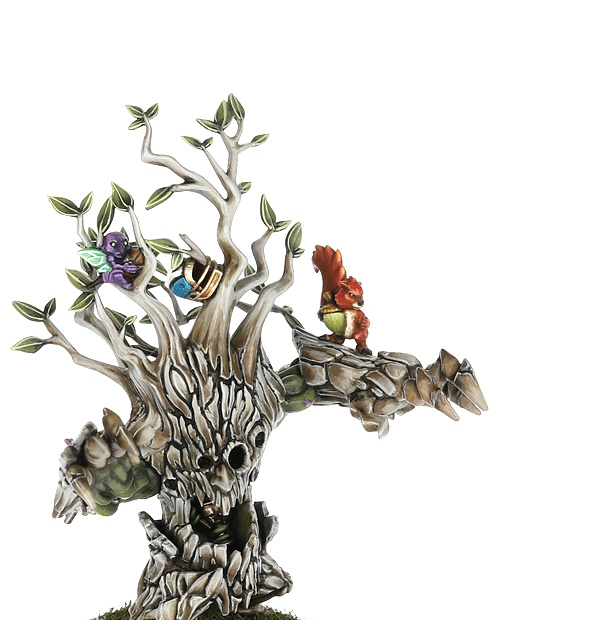

# Akhorne The Squirrel

| 80K  | MA | ST | AG | PA | AV |
| --- | --- | --- | --- | --- | --- |
| | 7 | 1 | 2+ | -- | 6+ |

* [Claws]
* [Dauntless]
* [Dodge]
* [Frenzy]
* [Jump up]
* [Loner] (4+)
* [No Hands]
* [Sidestep]
* [Stunty]
* [Titchy]
* **Blind Rage**

Akhorne may choose to re-roll the D6 when rolling for the Dauntless skill.

### Special Rules

* [Badlands Brawl]
* [Bribery and Corruption]
* [Elven Kingdoms League]
* [Favoured of Chaos Undivided][Favoured Of..]
* [Favoured of Hashut][Favoured Of..]
* [Favoured of Khorne][Favoured Of..]
* [Favoured of Nurgle][Favoured Of..]
* [Favoured of Slaanesh][Favoured Of..]
* [Favoured of Tzeentch][Favoured Of..]
* [Halfling Thimble Cup]
* [Low Cost Linemen]
* [Lustrian Superleague]
* [Masters of Undeath]
* [Old World Classic]
* [Sylvanian Spotlight]
* [Underworld Challenge]
* [Worlds Edge Superleague]

### Accept to play for...

* [Amazon]
* [Black Orc]
* [Chaos Chosen]
* [Chaos Dwarf]
* [Chaos Renegades]
* [Dark Elf]
* [Dwarf]
* [Elven Union]
* [Gnome]
* [Goblin]
* [Halfling]
* [High Elf]
* [Human]
* [Imperial Nobility]
* [Khorne]
* [Lizardmen]
* [Necromantic Horror]
* [Norse]
* [Nurgle]
* [Ogre]
* [Old World Alliance]
* [Orc]
* [Skaven]
* [Snotling]
* [Tomb Kings]
* [Shambling Undead]
* [Underworld Denizens]
* [Vampire]
* [Wood Elves]
