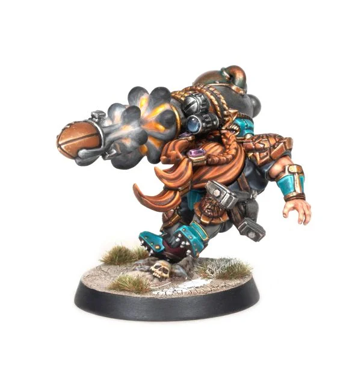

# Barik Farblast

| 80 K | MV | S | AG | P  | AV |    |
| ---- | -- | - | -- | -- | -- | -- |
|    | 6 | 3  | 3+ | 3+ | 9+ |

* [Cannoneer]
* [Hail Mary Pass]
* [Loner] (4+)
* [Pass]
* [Secret Weapon]
* [Sure Hands]
* [Thick Skull]
* **Blast It!**

Once per game, when Barik makes a Hail Mary Pass, he may re-roll any scatter results for determining where the ball lanes, and any friendly player attempting to catch the ball gains an additional +1 modifier to the roll.

### Special Rules
* [Worlds Edge Superleague]
* [Old World Classic]
* [Halfling Thimble Cup]

### Accept to play for...
* [Chaos Dwarves]
* [Dwarves]
* [Halflings]
* [Humans]
* [Imperial Nobility]
* [Norses]
* [Ogres]
* [Old World Alliance]
