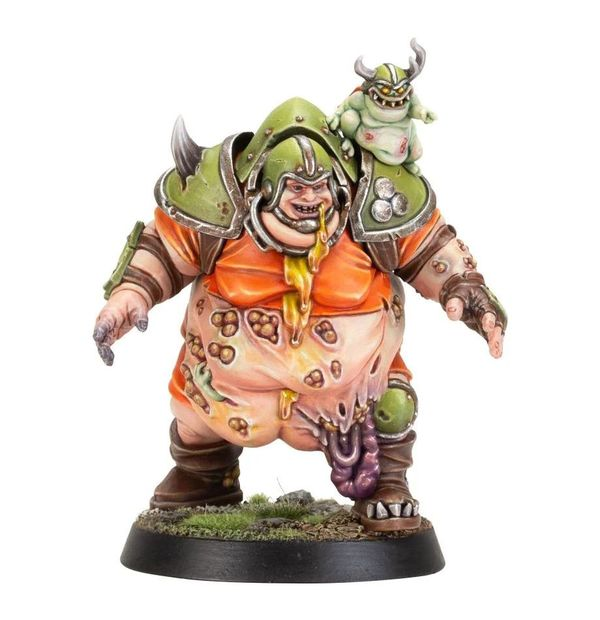

# Bilerot Vomitflesh

| 180K  | MA | ST | AG | PA | AV |
| --- | --- | --- | --- | --- | --- |
| | 4 | 5 | 4+ | 6+ | 10+ |

* [Dirty Player] (+1)
* [Disturbing Presence]
* [Foul Appearance]
* [Loner] (4+)
* **Putrid Regurgitation**

Once per game, Bilerot may use the Projectile Vomit Special Action. This may still be used even if Bilerot has already performed a Block action this turn.

### Special Rules

* [Favoured of Nurgle][Favoured Of..]

### Accept to play for...

* [Chaos Chosen]
* [Chaos Renegades]
* [Nurgle]
