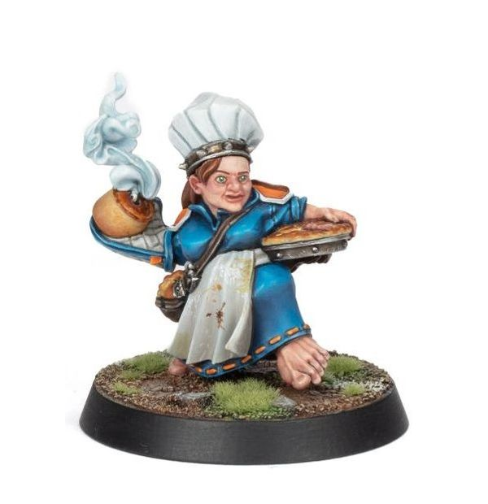

# Cindy Piewhistle

**MEGA-STAR**

| 50K  | MA | ST | AG | PA | AV |
| --- | --- | --- | --- | --- | --- |
| | 5 | 2 | 3+ | 3+ | 7+ |

* [Accurate]
* [Bombardier]
* [Dodge]
* [Loner] (4+)
* [Secret Weapon]
* [Stunty]
* **All You Can Eat**

Once per game, Cindy may perform two Throw Bomb Special actions rather than one, though she must commit to doing so before making the first action. If she does, immediately after performing the second Throw Bomb Special action roll a D6. On a 1-3 Cindy is immediately Sent Off.

### Special Rules

* [Halfling Thimble Cup]
* [Old World Classic]

### Accept to play for...

* [Dwarf]
* [Gnome]
* [Halfling]
* [Human]
* [Imperial Nobility]
* [Norse]
* [Ogre]
* [Old World Alliance]
