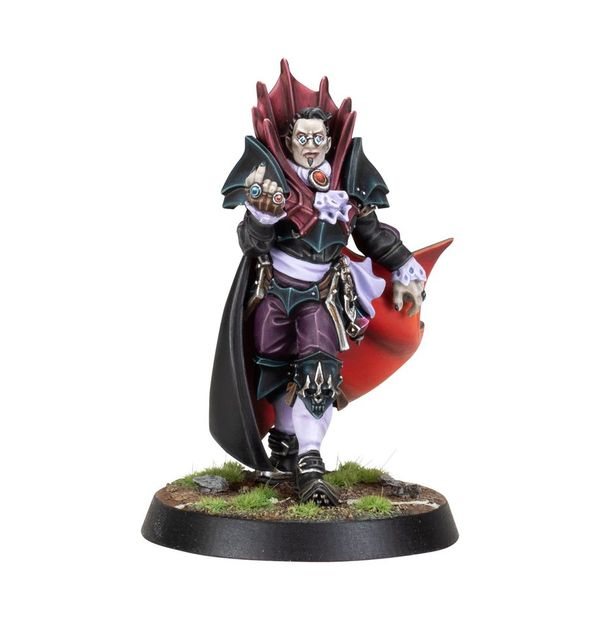

# Count Luthor von Drakenborg

| 340K | MA | ST | AG | PA | AV |
| ----- | -- | - | -- | -- | --- |
|       | 6  | 5 | 2+ | 3+ | 10+ |

* [Block]
* [Hypnotic Gaze]
* [Loner] (4+)
* [Regeneration]
* [Sidestep]
* **Star of the Show**

Once per game, when Count Luthor scores a touchdown, his controlling coach may gain one team re-roll. If this re-roll has not been used by the end of the next drive, it is lost.

### Special Rules

* [Sylvanian Spotlight]

### Accept to play for...

* [Necromantic Horror]
* [Tomb Kings]
* [Shambling Undead]
* [Vampire]
