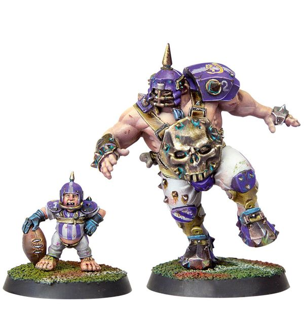

# Grak and Crumbleberry

250 K

#### Grak
| MA | ST | AG | PA | AV |
| -- | - | -- | -- | --- |
| 5  | 5 | 4+ | 4+ | 10+ |

* [Bone Head]
* [Kick Team-Mate]
* [Loner] (4+)
* [Mighty Blow] (+1)
* [Thick Skull]
* **Two for One**

Grak and Crumbleberry must be hired as a pair and count as two Star Players. However if either Grak or Crumbleberry is removed from play due to suffering a KO'ed or Casualty! result on the injury table, the other replaces the Loner (4+) trait with the Loner (2+) trait.

##### Crumbleberry
| MA | ST | AG | PA | AV |
| -- | - | -- | -- | -- |
| 5  | 2 | 3+ | 6+ | 7+ |

* [Dodge]
* [Loner] (4+)
* [Right Stuff]
* [Stunty]
* [Sure Hands]
* **Two for One**

Grak and Crumbleberry must be hired as a pair and count as two Star Players. However if either Grak or Crumbleberry is removed from play due to suffering a KO'ed or Casualty! result on the injury table, the other replaces the Loner (4+) trait with the Loner (2+) trait.

### Special Rules
* [Badlands Brawl]
* [Bribery and Corruption]
* [Worlds Edge Superleague]
* [Old World Classic]
* [Elven Kingdoms League]
* [Underworld Challenge]
* [Halfling Thimble Cup]
* [Lustrian Superleague]
* [Sylvanian Spotlight]
* [Masters of Undeath]
* [Low Cost Linemen]
* [Favoured of Nurgle][Favoured Of..]
* [Favoured of Khorne][Favoured Of..]
* [Favoured of Chaos Undivided][Favoured Of..]
* [Favoured of Slaanesh][Favoured Of..]
* [Favoured of Tzeentch][Favoured Of..]

### Accept to play for...
* [Amazon]
* [Black Orc]
* [Chaos Chosen]
* [Chaos Dwarf]
* [Chaos Renegades]
* [Dark Elf]
* [Dwarf]
* [Elven Union]
* [Gnome]
* [Goblin]
* [Halfling]
* [High Elf]
* [Human]
* [Imperial Nobility]
* [Khorne]
* [Lizardmen]
* [Necromantic Horror]
* [Norse]
* [Nurgle]
* [Ogre]
* [Old World Alliance]
* [Orc]
* [Skaven]
* [Snotling]
* [Tomb Kings]
* [Shambling Undead]
* [Underworld Denizens]
* [Vampire]
* [Wood Elves]
