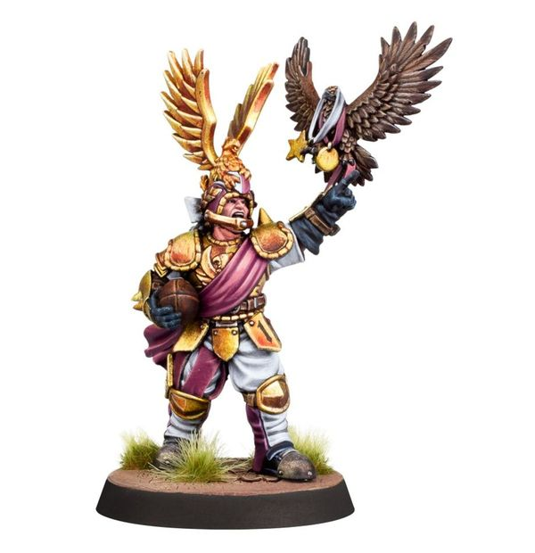

# Griff Oberwald

| 280 K  | MV | S | AG | P | AV |
| --- | --- | --- | --- | --- | --- |
| | 7 | 4 | 2+ | 3+ | 9+ |

* [Block]
* [Dodge]
* [Fend]
* [Loner] (3+)
* [Sprint]
* [Sure Feet]
* **Consummate Professional**

Once per game, Griff may re-roll one dice that was rolled either as a single roll, as part of a multiple dice roll or as part of a dice pool (this cannot be a dice that was rolled as part of an Armour, Injury or Casualty roll).

### Special Rules
* [Old World Classic]
* [Halfling Thimble Cup]

### Accept to play for...
* [Dwarves]
* [Halflings]
* [Humans]
* [Imperial Nobility]
* [Norses]
* [Ogres]
* [Old World Alliance]
