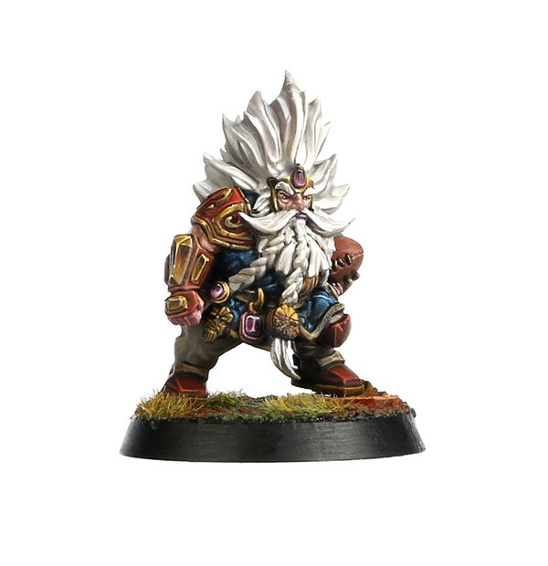

# Grombrindal, The White Dwarf

| 210K  | MA | ST | AG | PA | AV |
| --- | --- | --- | --- | --- | --- |
| | 5 | 3 | 3+ | 4+ | 10+ |

* [Block]
* [Dauntless]
* [Grab]
* [Loner] (4+)
* [Mighty Blow] (+1)
* [Thick Skull]
* **Wisdom of the White Dwarf**

Once per team turn, when one of Grombrindal's team-mates that is in an adjacent square is activated, that player gains either the Break Tackle, Dauntless, Mighty Blow (+1), or Sure Feet skill until the end of their activation.

### Special Rules

* [Halfling Thimble Cup]
* [Lustrian Superleague]
* [Old World Classic]
* [Worlds Edge Superleague]

### Accept to play for...

* [Amazon]
* [Dwarf]
* [Gnome]
* [Halfling]
* [Human]
* [Imperial Nobility]
* [Lizardmen]
* [Norse]
* [Ogre]
* [Old World Alliance]
