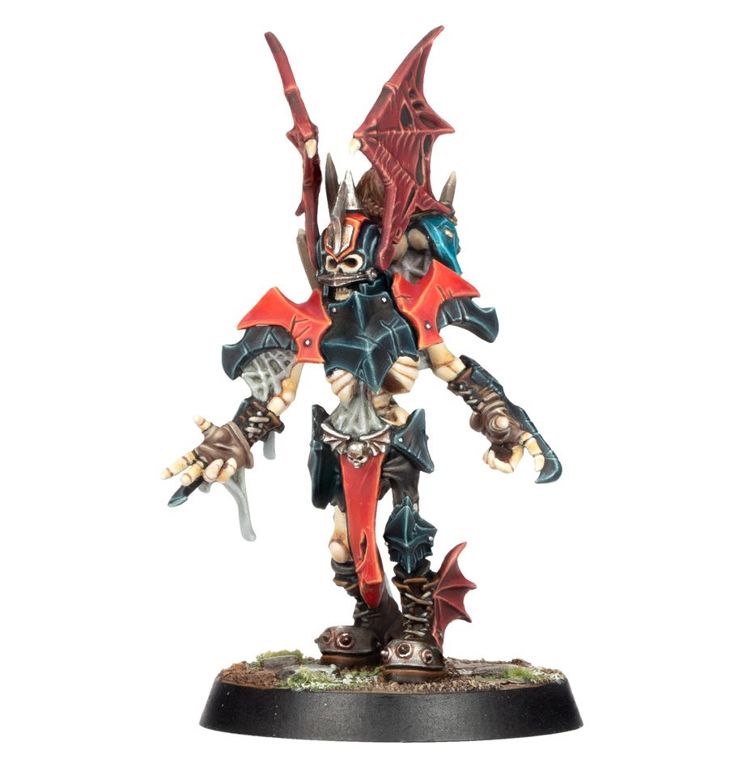

# Ivan 'the Animal' Deathshroud

| 190K | MA | ST | AG | PA | AV |
| ----- | -- | - | -- | -- | -- |
|       | 6|	4	|4+	|5+	|9+|

* [Block]
* [Disturbing Presence]
* [Juggernaut]
* [Loner] (4+)
* [Regeneration]
* [Strip Ball]
* [Tackle]
* **Dwarven Scourge**

Once per game, when an opposition player is Knocked Down as a result of a Block action performed by Ivan, you may apply an additional +1 modifier to the Armour roll or Injury roll. If this is against a Dwarfen player from any team, this may instead be a +2 modifier.

### Special Rules

* [Sylvanian Spotlight]

### Accept to play for...

* [Necromantic Horror]
* [Tomb Kings]
* [Shambling Undead]
* [Vampire]
