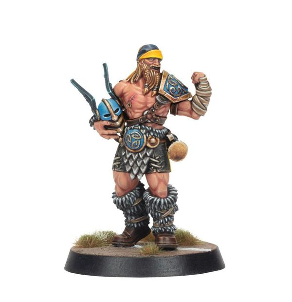

# Ivar Eriksson

| 245 K  | MA | ST | AG | PA | AV |
| --- | --- | --- | --- | --- | --- |
| | 6 | 4 | 3+ | 4+ | 9+ |

* [Block]
* [Guard]
* [Loner] (4+)
* [Tackle]
* **Raiding Party**

Once per drive, whenever Ivar begins his activation, he may choose one Open player on his team within five squares. The chosen player may immediately move one square, ignoring Tackle Zones, though they must end this move Marking an opposition player.

### Special Rules

* [Old World Classic]

### Accept to play for...

* [Dwarf]
* [Halfling]
* [Human]
* [Imperial Nobility]
* [Norse]
* [Ogre]
* [Old World Alliance]
