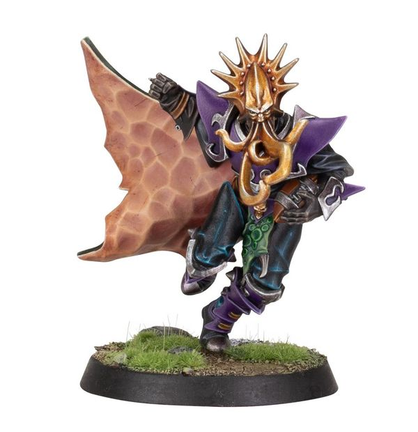

# Kiroth Krakeneye

| 160K  | MA | ST | AG | PA | AV |
| --- | --- | --- | --- | --- | --- |
| | 7 | 3 | 2+ | 3+ | 9+ |

* [Disturbing Presence]
* [Foul Appearance]
* [Loner] (4+)
* [On The Ball]
* [Tackle]
* [Tentacles]
* **Black Ink**

Once per game, at the star of any of his activations, Kiroth can choose an opposition player he is marking. The chosen player loses their Tackle Zone until they are next activated.

### Special Rules

* [Elven Kingdoms League]

### Accept to play for...

* [Dark Elf]
* [Elven Union]
* [High Elf]
* [Wood Elves]