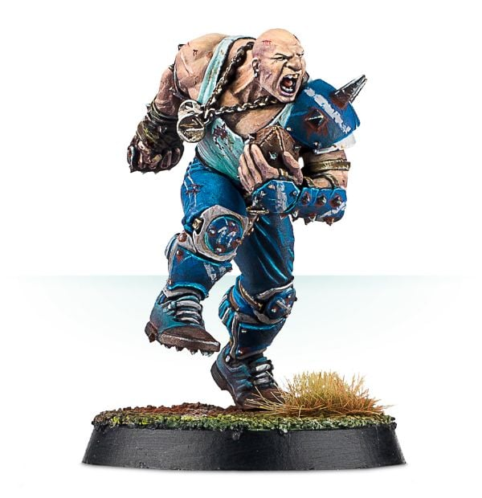

# Mighty Zug

| 220 K  | MA | ST | AG | PA | AV |
| --- | --- | --- | --- | --- | --- |
| | 4 | 5 | 4+ | 6+ | 10+ |

* [Block]
* [Loner] (4+)
* [Mighty Blow] (+1)
* **Crushing Blow**

Once per game, when an opposition player is Knocked Down as the result of a Block action performed by Zug, you may apply an additional +1 modifier to the Armour roll. This modifier may be applied after the roll has been made.

### Special Rules
* [Old World Classic]
* [Halfling Thimble Cup]
* [Lustrian Superleague]

### Accept to play for...
* [Amazon]
* [Dwarf]
* [Gnome]
* [Halfling]
* [Human]
* [Imperial Nobility]
* [Lizardmen]
* [Norse]
* [Ogre]
* [Old World Alliance]
