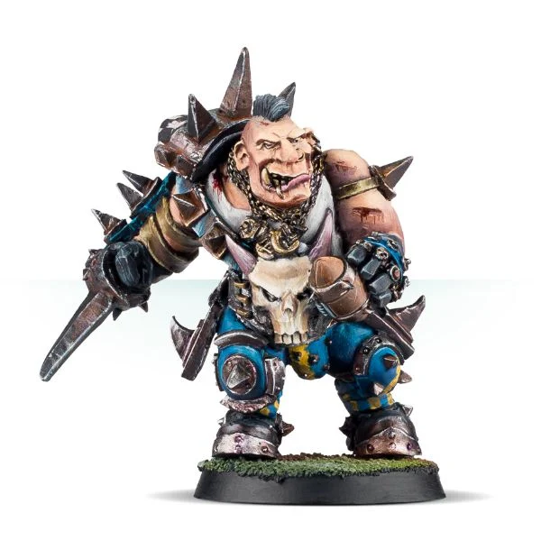

# Morg'n Thorg

| 380 K  | MV | S | AG | P | AV |
| --- | --- | --- | --- | --- | --- |
| | 6 | 6 | 3+ | 4+ | 11+ |

* [Block]
* [Loner] (4+)
* [Mighty Blow] (+2)
* [Thick Skull]
* [Throw Team]-mate
* **The Ballista**

Once per game, if Morg fails the Passing Ability test when making a Pass action or a Throw Team-mate action, you may re-roll the D6.

### Accept to play for...
* [Amazons]
* [Black Orcs]
* [Chaos Chosen]
* [Chaos Dwarves]
* [Chaos Renegades]
* [Dark Elves]
* [Dwarves]
* [Elven Union]
* [Goblins]
* [Halflings]
* [High Elves]
* [Humans]
* [Imperial Nobility]
* [Khorne]
* [Lizardmen]
* [Norses]
* [Nurgle]
* [Ogres]
* [Old World Alliance]
* [Orcs]
* [Skavens]
* [Snotlings]
* [Underworld Denizens]
* [Wood Elves]
