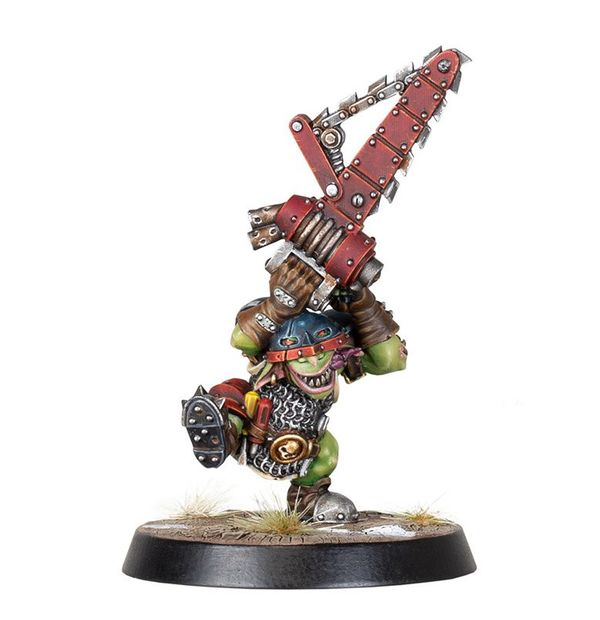

# Nobbla Blackwart

| 120K  | MA | ST | AG | PA | AV |
| --- | --- | --- | --- | --- | --- |
| | 6 | 2 | 3+ | - | 8+ |

* [Block]
* [Chainsaw]
* [Dodge]
* [Loner] (4+)
* [Secret Weapon]
* [Stunty]
* **Kick 'em While They're Down!**

Once per game, Nobbla may use the Chainsaw Attack Special action against a Prone or Stunned opposition player. This does not count as a Foul action and so Nobbla cannot be Sent-off when using this ability.

### Special Rules

* [Badlands Brawl]
* [Underworld Challenge]

### Accept to play for...

* [Black Orc]
* [Chaos Dwarf]
* [Goblin]
* [Ogre]
* [Orc]
* [Skaven]
* [Snotling]
* [Underworld Denizens]
