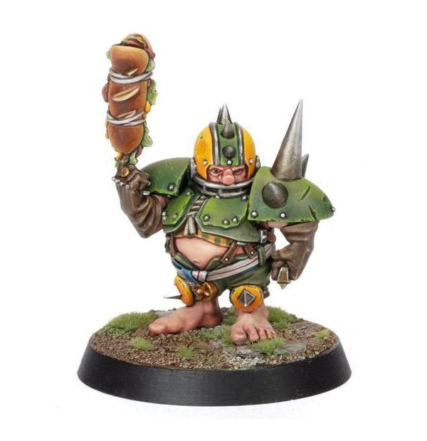

# Puggy Baconbreath

| 120K  | MA | ST | AG | PA | AV |
| --- | --- | --- | --- | --- | --- |
| | 5 | 3 | 3+ | 4+ | 7+ |

* [Block]
* [Dodge]
* [Loner] (4+)
* [Nerves of Steel]
* [Right Stuff]
* [Stunty]
* **Halfling Luck**

Once per game, Puggy may re-roll one dice that was rolled either as a single dice, or as part of a dice pool (this cannot be a dice that was rolled part of an Armour, Injury, or Casualty roll).

### Special Rules

* [Halfling Thimble Cup]
* [Old World Classic]

### Accept to play for...

* [Dwarf]
* [Gnome]
* [Halfling]
* [Human]
* [Imperial Nobility]
* [Norse]
* [Ogre]
* [Old World Alliance]
