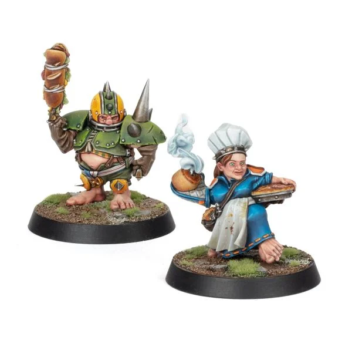

# Puggy Baconbreath

| 120 K  | MV | S | AG | P | AV |
| --- | --- | --- | --- | --- | --- |
| | 5 | 3 | 3+ | 4+ | 7+ |

* [Block]
* [Dodge]
* [Loner] (4+)
* [Nerves of Steel]
* [Right Stuff]
* [Stunty]
* **Halfling Luck**

Once per game, Puggy may re-roll one dice that was rolled either as a single dice, or as part of a dice pool (this cannot be a dice that was rolled part of an Armour, Injury, or Casualty roll).

### Special Rules
* [Old World Classic]
* [Halfling Thimble Cup]

### Accept to play for...
* [Dwarves]
* [Halflings]
* [Humans]
* [Imperial Nobility]
* [Norses]
* [Ogres]
* [Old World Alliance]
