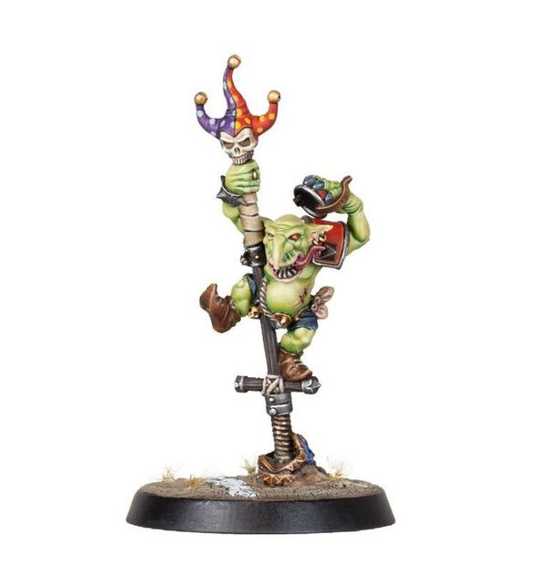

# Scrappa Sorehead

| 130 K  | MA | ST | AG | PA | AV |
| --- | --- | --- | --- | --- | --- |
| | 7 | 2 | 3+ | 5+ | 8+ |

* [Dirty Player] (+1)
* [Dodge]
* [Loner] (4+)
* [Pogo Stick]
* [Right Stuff]
* [Sprint]
* [Stunty]
* [Sure Feet]
* **Yoink!**

Once per game, when Scrappa attempts to interfere with a Pass action, he may roll a D6. On a 2+, Scrappa does not need to roll to interfere with the Pass action, instead he automatically makes an Interception and gains control of the ball.

### Special Rules
* [Badlands Brawl]
* [Underworld Challenge]

### Accept to play for...
* [Black Orc]
* [Chaos Dwarf]
* [Goblin]
* [Ogre]
* [Orc]
* [Skaven]
* [Snotling]
* [Underworld Denizens]
