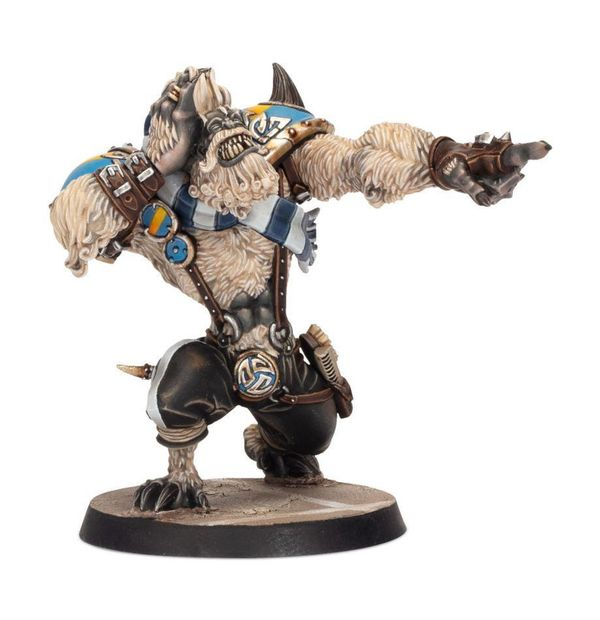

# Skrorg Snowpelt

| 250K  | MA | ST | AG | PA | AV |
| --- | --- | --- | --- | --- | --- |
| | 5 | 5 | 4+ | - | 9+ |

* [Claws]
* [Disturbing Presence]
* [Juggernaut]
* [Loner] (4+)
* [Mighty Blow] (+1)
* **Pump Up the Crowd**

Once per game, when Skrorg causes an opposition player to be removed as a Casualty as the result of a Block action, Skrorg's controlling coach gains one team re-roll. If this re-roll has not been used by the end of the drive, it is lost.

### Special Rules
* [Old World Classic]

### Accept to play for...
* [Dwarf]
* [Halfling]
* [Human]
* [Imperial Nobility]
* [Norse]
* [Ogre]
* [Old World Alliance]
