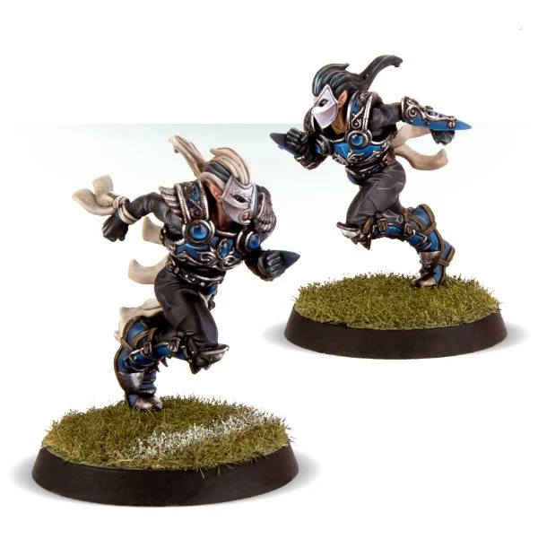

# The Swift Twins

340 K

#### Lucien Swift

| MV | S | AG | P  | AV |
| -- | - | -- | -- | -- |
| 7  | 3 | 2+ | 5+ | 9+ |

* [Block]
* [Juggernaut]
* [Loner] (4+)
* [Mighty Blow] (+1)
* [Tackle]
* **Two for One**

The Swift Twins must be hired as a pair and count as two Star Players. However if either Lucien or Valen is removed from play due to suffering a KO'ed or Casualty! result on the injury table, the other replaces the Loner (4+) trait with the Loner (2+) trait.

#### Valen Swift

| MV | S | AG | P  | AV |
| -- | - | -- | -- | -- |
| 7  | 3 | 2+ | 2+ | 8+ |

* [Accurate]
* [Loner] (4+)
* [Nerves of Steel]
* [Pass]
* [Safe Pass]
* [Sure Hands]
* **Two for One**

The Swift Twins must be hired as a pair and count as two Star Players. However if either Lucien or Valen is removed from play due to suffering a KO'ed or Casualty! result on the injury table, the other replaces the Loner (4+) trait with the Loner (2+) trait.

### Special Rules

* [Elven Kingdoms League]

### Accept to play for...

* [Dark Elves]
* [Elven Union]
* [High Elves]
* [Wood Elves]
