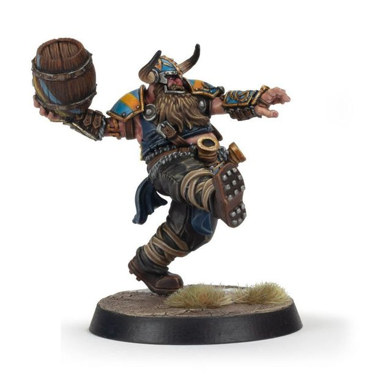

# Thorsson Stoutmead

| 170K  | MA | ST | AG | PA | AV |
| --- | --- | --- | --- | --- | --- |
| | 6 | 3 | 4+ | 3+ | 8+ |

* [Block]
* [Drunkard]
* [Loner] (4+)
* [Thick Skull]
* **Beer Barrel Bash!**

Once per drive, at the start of his activation, Thorsson may perform a Throw Keg Special action. When he does, select an opposition player within three squares of Thorsson and roll a D6. On a 3+, the player is immediately Knocked Down. However, on a 1, Thorsson is Knocked Down instead.

### Special Rules

* [Old World Classic]

### Accept to play for...

* [Dwarf]
* [Halfling]
* [Human]
* [Imperial Nobility]
* [Norse]
* [Ogre]
* [Old World Alliance]
