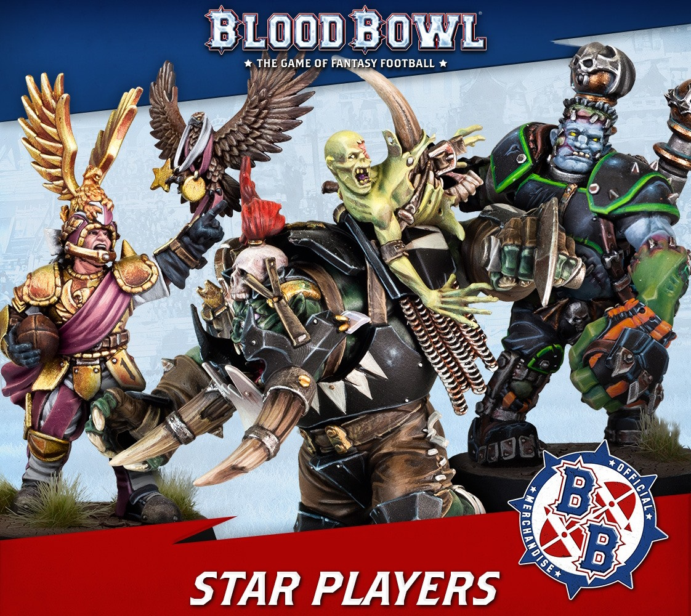

These are the heroes of the Blood Bowl arena, the most resourceful and talented players in the sport. Star Players act as free agents, playing occasional games for any team that can afford their high fees (and that they are willing to assist in the first place), and then moving on to play for another team. A team may Induce up to two Star Players that are allowed to play for the team. Unless the league commissioner decides otherwise, any Casualty table results applied against a Star Player are waived after the game - they can afford all the resurrection spells they need!

