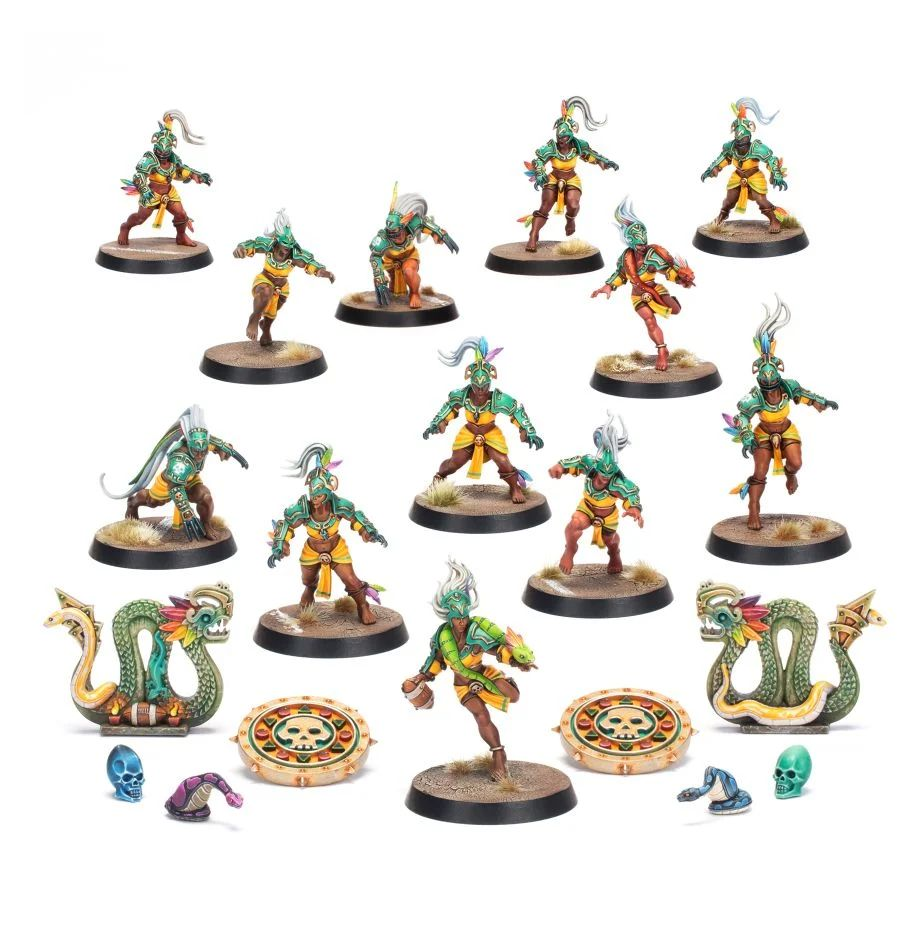

# Amazons

### Positionals

| Qty  | Position                | M | S | AG | P  | AR | Skills                                 | Primary | Secondary | Cost |
| ---- | ----------------------- | - | - | -- | -- | -- | -------------------------------------- | ------- | --------- | ---- |
| 0-16 | Eagle Warrior Linewoman | 6 | 3 | 3+ | 4+ | 8+ | [Dodge]                                | G       | S A      | 50K  |
| 0-2  | Python Warrior Thrower  | 6 | 3 | 3+ | 3+ | 8+ | [Dodge] [On The Ball] [Pass] | G P    | S A      | 80K  |
| 0-2  | Piranha Warrior Blitzer | 7 | 3 | 3+ | 5+ | 8+ | [Dodge] [Hit and Run]             | G A     | S         | 90K  |
| 0-2  | Jaguar Warrior Blocker  | 6 | 4 | 3+ | 5+ | 9+ | [Defensive] [Dodge]               | G       | S         | 110K |

### Special Rules

* [Lustrian Superleague]

### Staff

* [Cheerleader] - 10K
* [Assistant coach] - 10K
* [Reroll](s) - 60K
* [Apothecary] - 50K

### Starplayers

* [Akhorne The Squirrel]
* [Helmut Wulf]
* [Estelle la Veneaux]
* [Dribl and Drull]
* [Boa Kon'ssstriktr]
* [Karla Von Kill]
* [Grombrindal, The White Dwarf]
* [Mighty Zug]
* [Zolcath the Zoat]
* [Grak and Crumbleberry]
* [Glotl Stop]
* [Morg'n Thorg]

### Inducements

* [Temp Agency Cheerleaders] - 20K
* [Part]-time Assistant Coaches - 20K
* [Weather mage] - 30K
* [Minus superstar] (Specialized Mercenary) - 30K
* [Team Mascot] - 30K
* [No limit mercenary] - 30K
* [Bloodweiser Kegs] - 50K
* [Legendary Lineman] (Specialized Mercenary) - 50K
* [Brutal Blocker] (Specialized Mercenary) - 50K
* [Kari Coldsteel] - 50K
* [Medicinal Unguent] - 60K
* [Safe Provider] (Specialized Mercenary) - 70K
* [The trundlefoot triplets] (Biased Referee) - 80K
* [Schielund Scharlitan] - 90K
* [Special Plays] - 100K
* [Extra training] - 100K
* [Bribe] - 100K
* [Wandering Apothecary] - 100K
* [Josef Bugman] - 100K
* [Ayleen Andar] - 100K
* [Biased Referee] - 120K
* [Jorm the Ogre] (Biased Referee) - 120K
* [Guaranteed Big Guy] (Specialized Mercenary) - 130K
* [Ranulf] 'Red' Hokuli (Biased Referee) - 130K
* [Hireling Sports]-Wizard (Wizard) - 150K
* [Horatio X]. Schottenheim - 150K
* [Slann Mage]-Priest (Wizard) - 200K
* [Halfling Master Chef] - 300K
* [Mercenary Giant] - 350K
