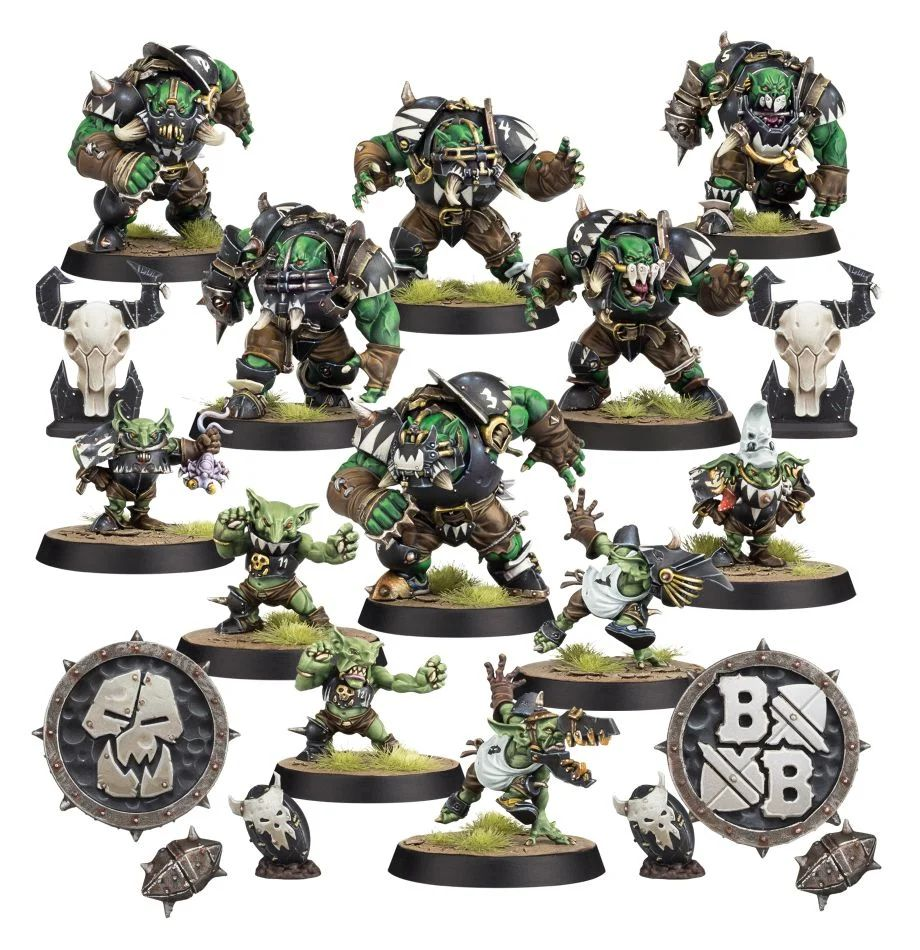

# Black Orcs

### Positionals

| Qty  | Position               | M | S | AG | P  | AR  | Skills                                                                                                                                                     | Primary | Secondary | Cost |
| ---- | ---------------------- | - | - | -- | -- | --- | ---------------------------------------------------------------------------------------------------------------------------------------------------------- | ------- | --------- | ---- |
| 0-12 | Goblin Bruiser Lineman | 6 | 2 | 3+ | 4+ | 8+  | [Dodge]  [Right Stuff]   [Stunty]   [Thick Skull]                                                                                           | A       | G P S     | 45K  |
| 0-6  | Black Orc              | 4 | 4 | 4+ | 5+ | 10+ | [Brawler]  [Grab]                                                                                                                                     | G       | S A P     | 90K  |
| 0-1  | Trained Troll          | 4 | 5 | 5+ | 5+ | 10+ | [Always Hungry]  [Loner] (3+)  [Mighty Blow] (+1)  [Projectile Vomit]   [Really Stupid]   [Regeneration]   [Throw Team-mate] | S       | A G P     | 115K |

### Special Rules

* [Badlands Brawl]
* [Bribery and Corruption]

### Staff

* [Cheerleader] - 10K
* [Assistant Coach] - 10K
* [Reroll] - 60K
* [Apothecary]  - 50K

### Starplayers

* [Bomber Dribblesnot]
* [Akhorne The Squirrel]
* [Fungus the Loon]
* [Nobbla Blackwart]
* [Scrappa Sorehead]
* [Helmut Wulf]
* [The Black Gobbo]
* [Grak and Crumbleberry]
* [Ripper Blogrot]
* [Varag Ghoul-Chewer]
* [Morg'n Thorg]

### Inducements

* [Temp Agency Cheerleaders] - 20K
* [Part-time Assistant Coaches] - 20K
* [Weather mage] - 30K
* [Minus superstar] (Specialized Mercenary) - 30K
* [Team Mascot] - 30K
* [No limit mercenary] - 30K
* [Bloodweiser Kegs] - 50K
* [Bribe] - 50K
* [Legendary Lineman] (Specialized Mercenary) - 50K
* [Brutal Blocker] (Specialized Mercenary) - 50K
* [Waaagh]! Drummer - 50K
* [Medicinal Unguent] - 60K
* [Safe Provider] (Specialized Mercenary) - 70K
* [Biased Referee] - 80K
* [Mungo Spinecracker] - 80K
* [Jorm the Ogre] (Biased Referee) - 80K
* [The trundlefoot triplets] (Biased Referee) - 80K
* [Fink da Fixer] - 90K
* [Schielund Scharlitan] - 90K
* [Ayleen Andar] - 100K
* [Guaranteed Big Guy] (Specialized Mercenary) - 130K
* [Hireling Sports-Wizard] (Wizard) - 150K
* [Ogre Firebelly] (Wizard) - 150K
* [Night Golbin Shaman] (Wizard) - 150K
* [Halfling Master Chef] - 300K
* [Mercenary Giant] - 350K
