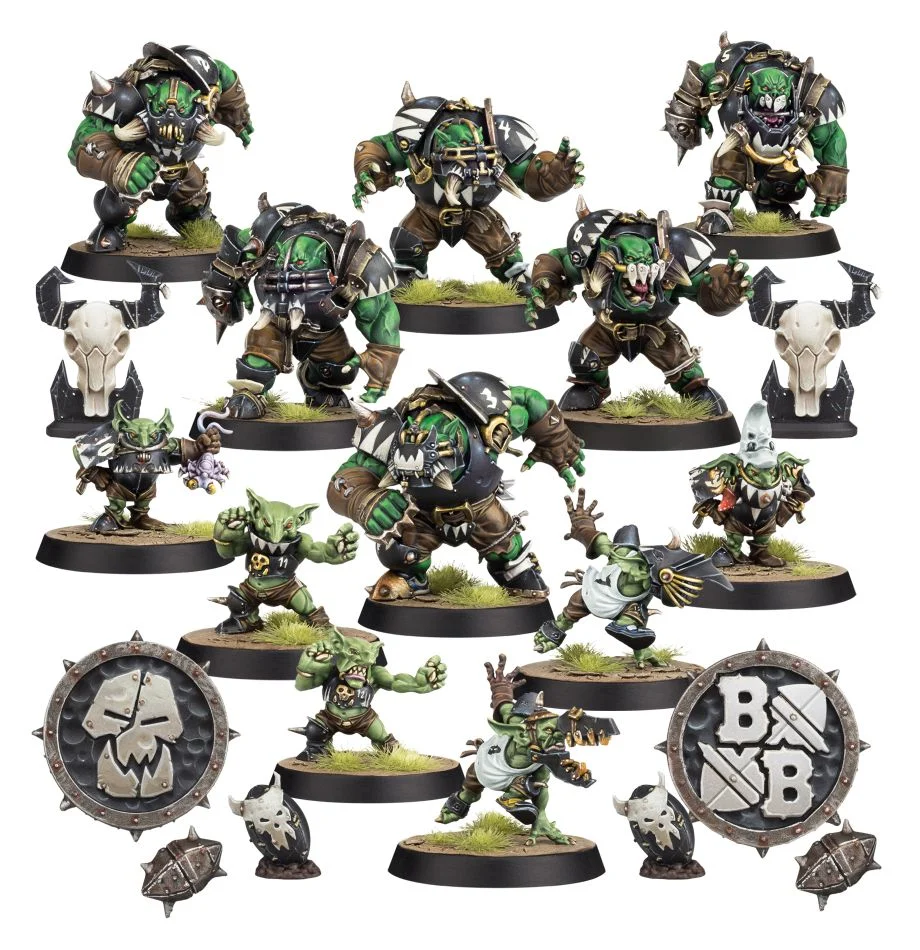

**TIER 2**

### Positionals

| Qty  | Position               | M | S | AG | P  | AR  | Skills                                                                                                                                                     | Primary | Secondary | Cost |
| ---- | ---------------------- | - | - | -- | -- | --- | ---------------------------------------------------------------------------------------------------------------------------------------------------------- | ------- | --------- | ---- |
| 0-12 | Goblin Bruiser Lineman | 6 | 2 | 3+ | 4+ | 8+  | • [Dodge]  • [Right Stuff]   • [Stunty]   • [Thick Skull]                                                                                           | A       | G P S      | 45K  |
| 0-6  | Black Orc              | 4 | 4 | 4+ | 5+ | 10+ | • [Brawler]  • [Grab]                                                                                                                                     | G S     | A P       | 90K  |
| 0-1  | Trained Troll          | 4 | 5 | 5+ | 5+ | 10+ | • [Always Hungry]  • [Loner] (3+)   • [Mighty Blow] (+1)   • [Projectile Vomit]   • [Really Stupid]   • [Regeneration]   • [Throw Team-mate] | S       | A G P     | 115K |

### Special Rules

* [Badlands Brawl]
* [Bribery and Corruption]

### Staff

* [Cheerleader] - 10K
* [Assistant Coach] - 10K
* [Re-roll] - 60K
* [Apothecary]  - 50K

### Starplayers

* [Akhorne The Squirrel]
* [Bomber Dribblesnot]
* [Fungus the Loon]
* [Grak and Crumbleberry]
* [Helmut Wulf]
* [Morg'n Thorg]
* [Nobbla Blackwart]
* [Ripper Blogrot]
* [Scrappa Sorehead]
* [The Black Gobbo]
* [Varag Ghoul-Chewer]

### Inducements

* [Temp Agency Cheerleaders] - 20K
* [Part-time Assistant Coaches] - 20K
* [Weather mage] - 30K
* [Unlimited Mercenary Player] - 30K
* [Bloodweiser Kegs] - 50K
* [Bribe] - 50K
* [Biased Referee] - 80K
* [Hireling Sports-Wizard] (Wizard) - 150K
* [Halfling Master Chef] - 300K

### New Inducements

* [Stunty Superstar] (Specialized Mercenary) - 30K
* [Team Mascot] - 30K
* [Legendary Lineman] (Specialized Mercenary) - 50K
* [Brutal Blocker] (Specialized Mercenary) - 50K
* [Waaagh! Drummer] - 50K
* [Medicinal Unguent] - 60K
* [Reliable Ringer] (Specialized Mercenary) - 70K
* [Mungo Spinecracker] - 80K
* [Jorm the Ogre] (Biased Referee) - 80K
* [The Trundlefoot Triplets] (Biased Referee) - 80K
* [Fink da Fixer] - 90K
* [Schielund Scharlitan] - 90K
* [Ayleen Andar] - 100K
* [Bona Fide Big Guy] (Specialized Mercenary) - 130K
* [Ogre Firebelly] (Wizard) - 150K
* [Night Goblin Shaman] (Wizard) - 150K
* [Giant Mercenary] - 350K
