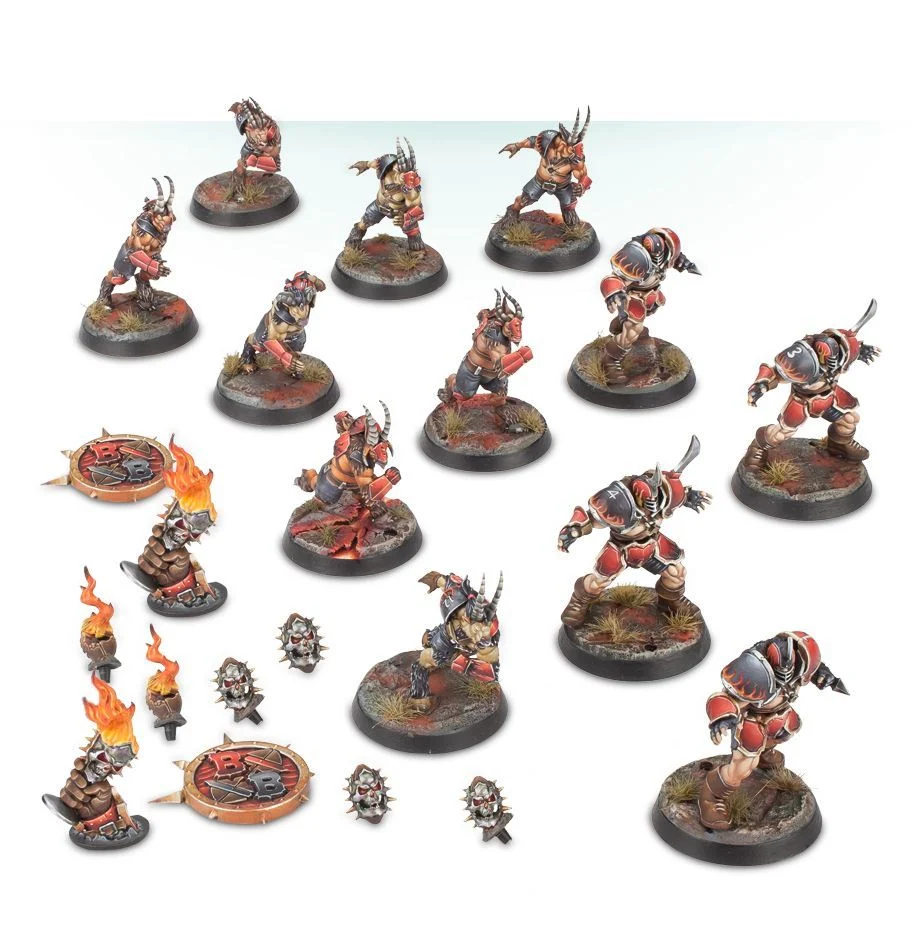

**TIER 2**

### Positionals

| Qty  | Position                | M | S | AG | P  | AR  | Skills                                                                                                                                            | Primary | Secondary | Cost |
| ---- | ----------------------- | - | - | -- | -- | --- | ------------------------------------------------------------------------------------------------------------------------------------------------- | ------- | --------- | ---- |
| 0-16 | Beastman Runner Lineman | 6 | 3 | 3+ | 4+ | 9+  | [Horns]                                                                                                                                           | G M S   | A P       | 60K  |
| 0-4  | Chosen Blocker          | 5 | 4 | 3+ | 5+ | 10+ |                                                                                                                                                   | G M S  | A         | 100K |
| 0-1  | Chaos Troll*            | 4 | 5 | 5+ | 5+ | 10+ | [Always Hungry] [Loner] (4+) [Mighty Blow] (+1) [Projectile Vomit] [Really Stupid] [Regeneration] [Throw Team-mate] | M S     | A G       | 115K |
| 0-1  | Chaos Ogre*             | 5 | 5 | 4+ | 5+ | 10+ | [Bone Head] [Loner] (4+) [Mighty Blow] (+1) [Thick Skull] [Throw Team-mate]                                                     | M S     | A G       | 140K |
| 0-1  | Minotaur*               | 5 | 5 | 4+ | -  | 9+  | [Frenzy] [Horns] [Loner] (4+) [Mighty Blow] (+1) [Thick Skull] [Unchannelled Fury]                                       | M S    | A G       | 150K |

\*A Chaos Chosen team may include a single Big Guy

### Special Rules

Choose either:

* [Favoured of Nurgle][Favoured Of..]
* [Favoured of Khorne][Favoured Of..]
* [Favoured of Chaos Undivided][Favoured Of..]
* [Favoured of Slaanesh][Favoured Of..]
* [Favoured of Tzeentch][Favoured Of..]

### Staff

* [Cheerleader] - 10K
* [Assistant Coach] - 10K
* [Reroll] - 60K
* [Apothecary]  - 50K

### Starplayers

* [Akhorne The Squirrel]
* [Max Spleenripper]
* [Helmut Wulf]
* [Kreek Rustgouger]
* [Withergrasp Doubledrool]
* [Bilerot Vomitflesh]
* [Glart Smashrip]
* [Scyla Anfingrimm]
* [Hakflem Skuttlespike]
* [Grashnak Blackhoof]
* [Grak and Crumbleberry]
* [Lord Borak]
* [Morg'n Thorg]

### Inducements

* [Minus superstar] (Specialized Mercenary) - 30K
* [Legendary Lineman] (Specialized Mercenary) - 50K
* [Brutal Blocker] (Specialized Mercenary) - 50K
* [Safe Provider] (Specialized Mercenary) - 70K
* [The trundlefoot triplets] (Biased Referee) - 80K
* [Jorm the Ogre] (Biased Referee) - 120K
* [Guaranteed Big Guy] (Specialized Mercenary) - 130K
* [Chaos Sorcerer] (Wizard) - 150K
* [Hireling Sports-Wizard] (Wizard) - 150K
* [Horatio X]. Schottenheim - 150K
* [Druchii Sports Sorceress] (Wizard) - 150K
* [Horticulturalist of Nurgle] (Wizard) - 150K
* [Temp Agency Cheerleaders] - 20K
* [Part-time Assistant Coaches] - 20K
* [Weather mage] - 30K
* [Cavorting Nurglings] - 30K
* [Team Mascot] - 30K
* [Unlimited Mercenary Player] - 30K
* [Bloodweiser Kegs] - 50K
* [Medicinal Unguent] - 60K
* [Papa Skullbones] - 80K
* [Ayleen Andar] - 100K
* [Special Plays] - 100K
* [Extra Team Training] - 100K
* [Bribe] - 100K
* [Wandering Apothecary] - 100K
* [Plague Doctor] - 100K
* [Josef Bugman] - 100K
* [Biased Referee] - 120K
* [Wandering Apothecary] - 150K
* [Plague Doctor] - 150K
* [Halfling Master Chef] - 300K
* [Mercenary Giant] - 350K
